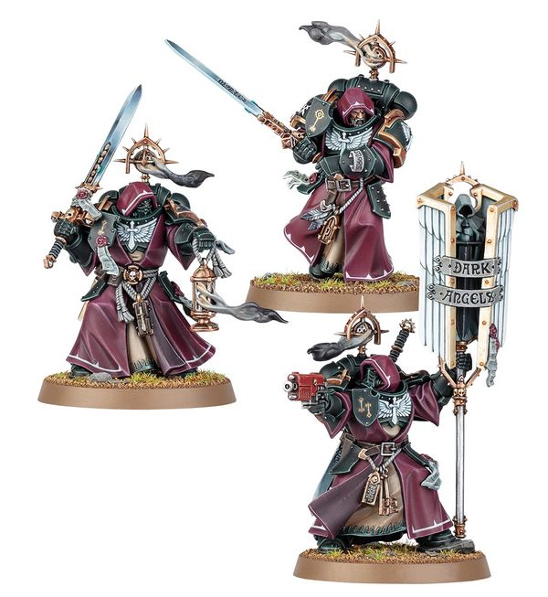

# 0349 内环近卫 Inner Circle Companion

精校状态：中文行文已逐段精校，部分术语仍为暂定

分类：通用概念 / 帝国 Imperium / 中央政务部 Adeptus Terra / 阿斯塔特修会 Adeptus Astartes

原文来源：https://www.bilibili.com/opus/1024791695210840086

原作者：帝国神选罐头

原文时间：2025年01月21日 14:35

[返回分类目录](目录.md) · [全书目录](../../目录.md)

原篇名：内环伴卫 Inner Circle Companion

<!-- A0349-B0001 -->
**英文原文**

The Inner Circle Companions are mysterious Dark Angels, who wield Calibanite Greatswords and act as bodyguards for the Chapter's mightiest heroes.

<!-- /A0349-B0001 -->

<!-- A0349-B0002 -->

原译文

内环伴卫是神秘的黑暗天使，他们挥舞着卡利班巨剑，为本战团最强大的英雄充当护卫。

**校订译文**

内环近卫是一群神秘的黑暗天使战士。他们手持卡利班巨剑，担任战团最强大英雄的贴身护卫。

<!-- /A0349-B0002 -->

<!-- A0349-B0003 图片 -->

<!-- A0349-B0004 -->

原译文

Inner Circle Companions 内环伴卫

**校订译文**

Inner Circle Companions 内环近卫

<!-- /A0349-B0004 -->

<!-- A0349-B0005 -->
## History 历史

<!-- /A0349-B0005 -->

<!-- A0349-B0006 -->
**英文原文**

Where they came from and how they determine which Dark Angels to safeguard is unknown to the Chapter. The Companions themselves do not answer, as they fight in complete silence - except rare occasions when they exchange highly encrypted messages with each other. When they rarely do speak, it is in a coded language that only they know. All the Dark Angels truly know about the Companions, is that they began appearing shortly after the Chapter's Primarch, Lion El'Jonson, returned to the Galaxy.

<!-- /A0349-B0006 -->

<!-- A0349-B0007 -->

原译文

他们来自哪里，以及他们如何决定保护哪些黑暗天使，战团不得而知。伴卫也没有回答，因为他们在完全沉默的情况下战斗——除了极少数情况下他们互相交换高度加密的信息。当他们说话时，是用一种只有他们自己知道的编码语言。所有黑暗天使真正知道的关于伴卫的事，是他们在战团的原体莱昂·艾尔庄森回到银河系后不久就开始出现了。

**校订译文**

战团不知道内环近卫来自何处，也不知道他们依据什么选择保护对象。近卫从不解释；他们作战时始终保持沉默，只有极少数时候会彼此交换高度加密的信息。即使偶尔开口，他们说的也是只有彼此才懂的密语。黑暗天使唯一确知的是：原体莱昂·艾尔’庄森重返银河后不久，内环近卫便开始现身。

<!-- /A0349-B0007 -->

本篇核心术语与暂定项

以下列出本篇出现的英文原形及核心术语表用词。同形词可能指不同对象，具体词义以本篇正文和校注为准；单复数、别名和仅见于图注的名称可能尚未列入。完整候选见[术语表](../../术语表/双语术语候选.csv)。

| 英文 | 采用中文 | 状态 |
| --- | --- | --- |
| Dark Angels | 黑暗天使 | 官方已核对 |
| Primarch | 原体 | 官方已核对 |
| Lion El'Jonson | 莱昂·艾尔’庄森 | 官方已核对 |
| Inner Circle Companions | 内环近卫 | 官方已核对 |
| Companions | 近侍 | 暂定·官方待核 |
| Chapter | 战团 | 暂定·官方待核 |
| Calibanite | 卡利班诸语 | 暂定·官方待核 |
| The Dark | 《黑暗》 | 暂定·官方待核 |

