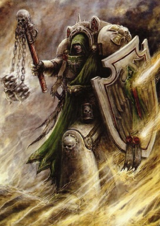
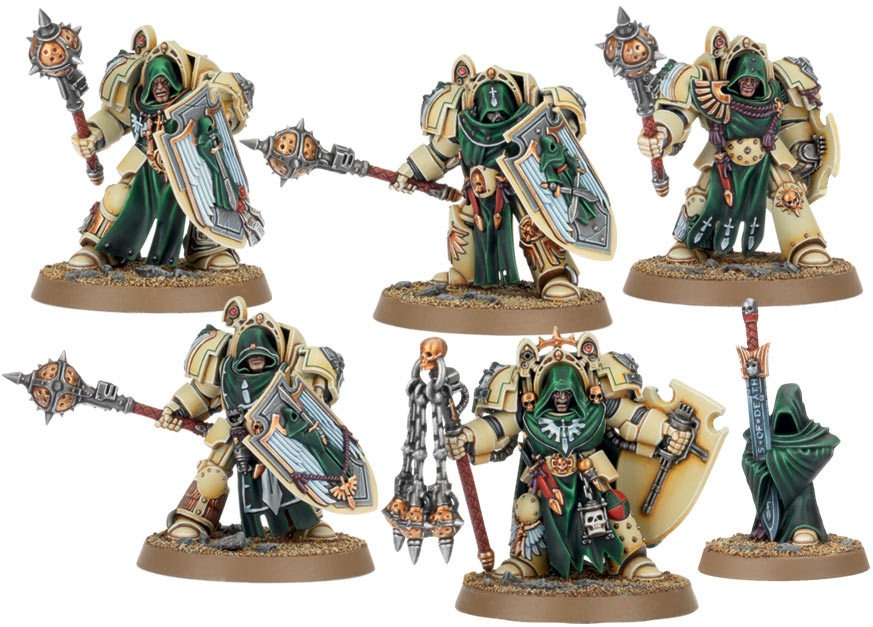
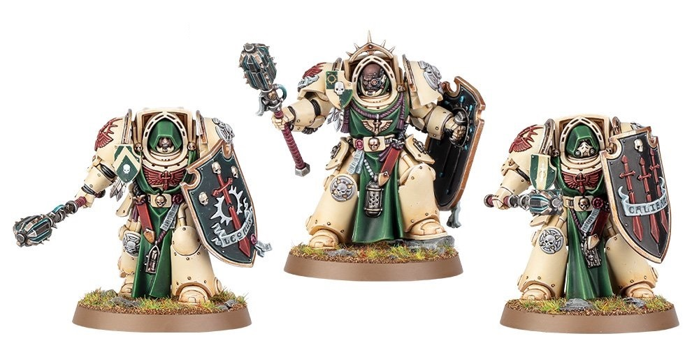
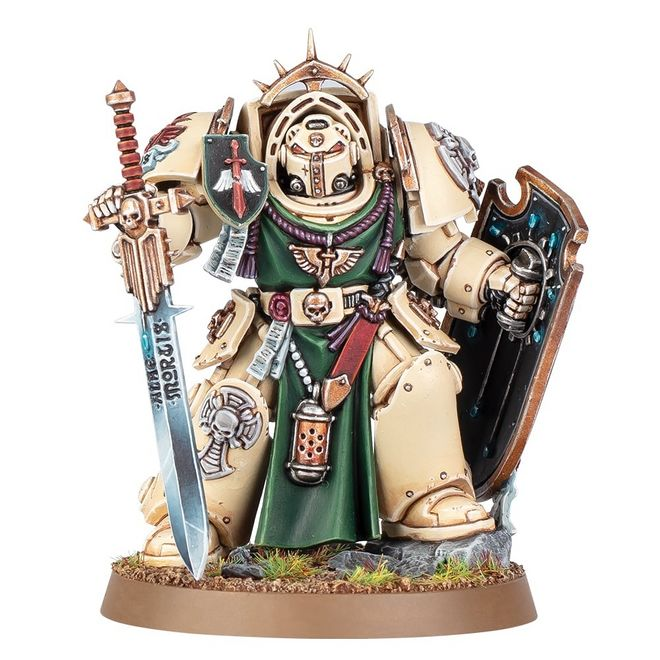

# 0350 死翼骑士 Deathwing Knight

精校状态：中文行文已逐段精校，部分术语仍为暂定

分类：通用概念 / 帝国 Imperium / 中央政务部 Adeptus Terra / 阿斯塔特修会 Adeptus Astartes

原文来源：https://www.bilibili.com/opus/1021796741475729415

原作者：帝国神选罐头

原文时间：2025年01月13日 12:53

[返回分类目录](目录.md) · [全书目录](../../目录.md)

<!-- A0350-B0001 -->
**英文原文**

Deathwing Knights are fierce warriors who are part of the fighting elite of the Dark Angels and their successors' Deathwing units.

<!-- /A0350-B0001 -->

<!-- A0350-B0002 -->

原译文

死翼骑士是凶猛的战士，是黑暗天使及其子战团死翼部队战斗精英的一部分。

**校订译文**

死翼骑士是勇猛的精锐战士，隶属于黑暗天使及其子战团的死翼部队。

<!-- /A0350-B0002 -->

<!-- A0350-B0003 图片 -->

<!-- A0350-B0004 -->

原译文

Deathwing Knight 死翼骑士

**校订译文**

Deathwing Knight 死翼骑士

<!-- /A0350-B0004 -->

<!-- A0350-B0005 -->
**英文原文**

It is said that in them lives on some semblance of Lion El'Jonson himself and they embody his silent strength. These veterans are the most trusted and experienced warriors of the Deathwing and make up the Company's own exclusive Inner Circle, learning the some of the hidden truths of the Unforgiven.

<!-- /A0350-B0005 -->

<!-- A0350-B0006 -->

原译文

据说，他们的生存有点像莱昂艾尔庄森本人，他们体现了他无声的力量。这些老兵是死翼最值得信赖、最有经验的战士，他们组成了连队自己的专属内环，学习了不可饶恕的一些隐藏的真理。

**校订译文**

据说，他们身上依稀延续着莱昂·艾尔’庄森的风范，体现着他沉默而强大的力量。这些老兵是死翼中最可靠、最富经验的战士，组成了连队内部独立的内环，并获准知晓戴罪者隐秘真相的一部分。

<!-- /A0350-B0006 -->

<!-- A0350-B0007 图片 -->

<!-- A0350-B0008 -->

原译文

Deathwing Knights 死翼骑士

**校订译文**

Deathwing Knights 死翼骑士

<!-- /A0350-B0008 -->

<!-- A0350-B0009 -->
**英文原文**

Deathwing Knights are garbed in long robes and tabards, hold huge storm shields, and are most commonly armed with Maces of Absolution capable of crushing tanks, or Power Swords. The squads are themselves led by a Knight Master, who wields the Flail of the Unforgiven. Deathwing Knights are also frequently accompanied by Watchers in the Dark.

<!-- /A0350-B0009 -->

<!-- A0350-B0010 -->

原译文

死翼骑士身着长袍和搭肩衫，手持巨大的风暴盾，最常见的武器是能够击溃坦克的赦免之杖或动力剑。小队本身由一位骑士导师领导，他挥舞着无情链枷。死翼骑士也经常伴随着黑暗守望者。

**校订译文**

死翼骑士身穿长袍与罩袍，手持巨大的风暴盾，通常装备足以砸毁坦克的赦免之杖或动力剑。每支小队由一名骑士导师率领，导师手持戴罪者链枷。黑暗守望者也时常伴随死翼骑士出战。

**校注：** Flail of the Unforgiven 依 Unforgiven 的统一名称暂译“戴罪者链枷”；原译“无情链枷”误解了定语所指。

<!-- /A0350-B0010 -->

<!-- A0350-B0011 图片 -->

<!-- A0350-B0012 -->

原译文

Deathwing Knights 死翼骑士

**校订译文**

Deathwing Knights 死翼骑士

<!-- /A0350-B0012 -->

<!-- A0350-B0013 图片 -->

<!-- A0350-B0014 -->

原译文

Knight Master weilding a Relic Sword 挥舞圣物剑的骑士导师

**校订译文**

Knight Master weilding a Relic Sword 挥舞圣物剑的骑士导师

<!-- /A0350-B0014 -->

本篇核心术语与暂定项

以下列出本篇出现的英文原形及核心术语表用词。同形词可能指不同对象，具体词义以本篇正文和校注为准；单复数、别名和仅见于图注的名称可能尚未列入。完整候选见[术语表](../../术语表/双语术语候选.csv)。

| 英文 | 采用中文 | 状态 |
| --- | --- | --- |
| Dark Angels | 黑暗天使 | 官方已核对 |
| Lion El'Jonson | 莱昂·艾尔’庄森 | 官方已核对 |
| Master | 导师（审判庭职衔）／舰务官（舰员职务） | 语境定译·官方待核 |
| Unforgiven | 戴罪者 | 暂定·官方待核 |
| Flail of the Unforgiven | 戴罪者链枷 | 暂定 |
| The Dark | 《黑暗》 | 暂定·官方待核 |

