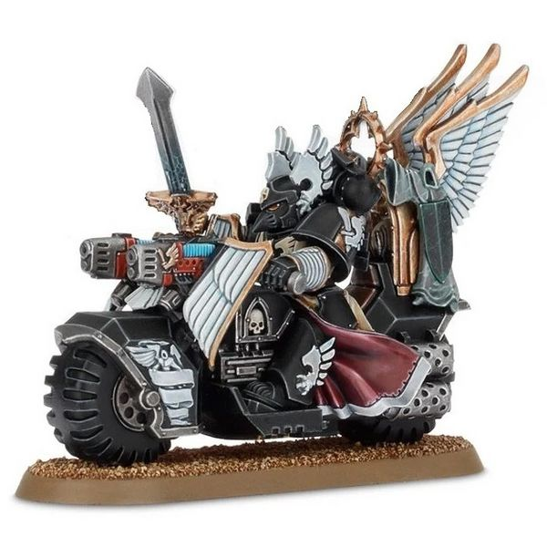

# 0353 鸦翼黑骑士 Ravenwing Black Knight

精校状态：中文行文已逐段精校，部分术语仍为暂定

分类：通用概念 / 帝国 Imperium / 中央政务部 Adeptus Terra / 阿斯塔特修会 Adeptus Astartes

原文来源：https://www.bilibili.com/opus/1032139082897031186

原作者：帝国神选罐头

原文时间：2025年02月10日 09:46

[返回分类目录](目录.md) · [全书目录](../../目录.md)

<!-- A0353-B0001 -->
**英文原文**

Ravenwing Black Knights are elite troops of the Dark Angels and their Successors Ravenwing formation.

<!-- /A0353-B0001 -->

<!-- A0353-B0002 -->

原译文

鸦翼黑骑士是黑暗天使及其子战团鸦翼编队的精英部队。

**校订译文**

鸦翼黑骑士是黑暗天使及其子战团鸦翼编队的精英部队。

<!-- /A0353-B0002 -->

<!-- A0353-B0003 -->
**英文原文**

These hardened veterans are those who survive in the Ravenwing long enough learn to take mobile warfare to the next level. If they can pass the Seven Rites of the Raven, they will be inducted into the Black Knights, the Inner Circle of the 2nd Company. Black Knights often make up the troops of Ravenwing Command Squads, which escort officers and undertake special missions. Black Knights are among the few within their Company to know the true purpose of the Ravenwing - the eternal hunt for the Fallen. For armament, Ravenwing Black Knight bikes are equipped with a mixture of Plasma Talons and Ravenwing Grenade Launchers while the Knights themselves wield Bolt Pistols, Corvus Hammers, Power Weapons, and grenades.

<!-- /A0353-B0003 -->

<!-- A0353-B0004 -->

原译文

这些经验丰富的老兵是那些在鸦翼中生存了足够长时间的人，他们学会了将机动战提升到一个新的水平。如果他们能通过渡鸦七仪，他们将被纳入黑骑士，即第二连的内环。黑骑士经常组成鸦翼指挥组的部队，护送军官并执行特殊任务。黑骑士是他们连队中为数不多的知道鸦翼真正目的的人之一——对堕天使的永恒追捕。在武器装备方面，鸦翼黑骑士摩托配备了等离子爪和鸦翼榴弹发射器的复合，而骑士们自己则使用爆矢手枪、乌鸦锤、动力武器和手榴弹。

**校订译文**

这些身经百战的老兵在鸦翼中征战多年，将机动作战的技艺磨炼到了更高境界。通过渡鸦七仪后，他们便能加入黑骑士——第二连的内环。黑骑士经常编入鸦翼指挥小队，护卫军官并执行特殊任务。他们也是连队中少数知晓鸦翼真正使命的人：永不停歇地追捕堕天使。黑骑士的摩托混编装备等离子爪与鸦翼榴弹发射器，而骑士本人则携带爆矢手枪、乌鸦锤、动力武器及手榴弹。

<!-- /A0353-B0004 -->

<!-- A0353-B0005 图片 -->

<!-- A0353-B0006 -->

原译文

Ravenwing Black Knight 鸦翼黑骑士

**校订译文**

Ravenwing Black Knight 鸦翼黑骑士

<!-- /A0353-B0006 -->

<!-- A0353-B0007 -->
**英文原文**

Commanders of Black Knights units are called Huntsmasters.

<!-- /A0353-B0007 -->

<!-- A0353-B0008 -->

原译文

黑骑士部队的指挥官被称为猎杀导师。

**校订译文**

黑骑士部队的指挥官被称为猎杀导师。

<!-- /A0353-B0008 -->

<!-- A0353-B0009 -->
## Notable Black Knights 著名黑骑士

<!-- /A0353-B0009 -->

<!-- A0353-B0010 -->
**英文原文**

Tybalain - Huntmaster, Slain during the Battle of the Caliban System

<!-- /A0353-B0010 -->

<!-- A0353-B0011 -->

原译文

泰巴连 - 猎杀导师，在卡利班星系战役中被杀

**校订译文**

泰巴连——猎杀导师，于卡利班星系战役阵亡。

<!-- /A0353-B0011 -->

<!-- A0353-B0012 -->

原译文

Annael 安奈尔

**校订译文**

Annael 安奈尔

<!-- /A0353-B0012 -->

<!-- A0353-B0013 -->

原译文

Sabrael 萨巴尔

**校订译文**

Sabrael 萨巴尔

<!-- /A0353-B0013 -->

本篇核心术语与暂定项

以下列出本篇出现的英文原形及核心术语表用词。同形词可能指不同对象，具体词义以本篇正文和校注为准；单复数、别名和仅见于图注的名称可能尚未列入。完整候选见[术语表](../../术语表/双语术语候选.csv)。

| 英文 | 采用中文 | 状态 |
| --- | --- | --- |
| Dark Angels | 黑暗天使 | 官方已核对 |
| Caliban | 卡利班 | 暂定·官方待核 |
| Seven Rites of the Raven | 渡鸦七仪 | 暂定·沿用现稿 |
| Bikes | 摩托 | 暂定·官方待核 |
| The Dark | 《黑暗》 | 暂定·官方待核 |
| System | 星系（恒星系统） | 暂定·官方待核 |
| Bolt | 爆矢 | 暂定·官方待核 |
| Power Weapons | 动力武器 | 暂定·官方待核 |
| Grenade | 手榴弹 | 暂定·官方待核 |

