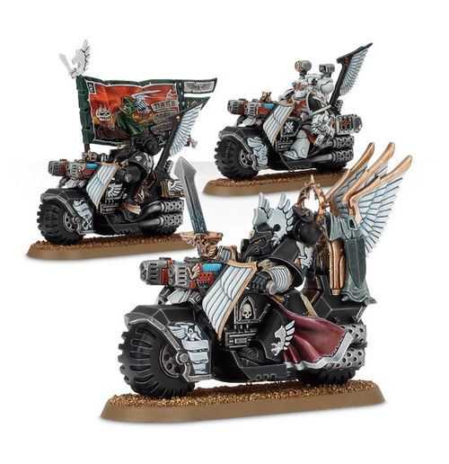

# 0354 鸦翼指挥小队 Ravenwing Command Squad

精校状态：中文行文已逐段精校，部分术语仍为暂定

分类：通用概念 / 帝国 Imperium / 中央政务部 Adeptus Terra / 阿斯塔特修会 Adeptus Astartes

原文来源：https://www.bilibili.com/opus/1032139254684188678

原作者：帝国神选罐头

原文时间：2025年02月10日 09:47

[返回分类目录](目录.md) · [全书目录](../../目录.md)

原篇名：鸦翼指挥组 Ravenwing Command Squad

<!-- A0354-B0001 -->
**英文原文**

Ravenwing Command Squads are specialized command formations within the Dark Angels and their Successors Ravenwing. Bike-mounted Command Squads consist of experienced Ravenwing Black Knights who form a swift bodyguard around a mounted officer, or execute other specialised missions. In addition to Black Knights and commanders, they can also include Standard Bearers, Company Champions, and Apothecaries.

<!-- /A0354-B0001 -->

<!-- A0354-B0002 -->

原译文

鸦翼指挥组是黑暗天使及其子战团鸦翼内部的专业指挥编队。骑摩托的指挥组由经验丰富的鸦翼黑骑士组成，他们在骑行军官周围组成迅捷护卫，或执行其他专门任务。除了黑骑士和指挥官，他们还可以包括标准旗手、连队冠军和药剂师。

**校订译文**

鸦翼指挥小队是黑暗天使及其子战团鸦翼内部的专门指挥编组。这些摩托小队由经验丰富的鸦翼黑骑士组成，为同样骑乘载具的军官提供快速护卫，或执行其他特殊任务。除黑骑士与指挥官外，小队还可编入旗手、连队冠军与药剂师。

<!-- /A0354-B0002 -->

<!-- A0354-B0003 图片 -->

<!-- A0354-B0004 -->

原译文

Ravenwing Command Squad 鸦翼指挥组

**校订译文**

Ravenwing Command Squad 鸦翼指挥小队

<!-- /A0354-B0004 -->

本篇核心术语与暂定项

以下列出本篇出现的英文原形及核心术语表用词。同形词可能指不同对象，具体词义以本篇正文和校注为准；单复数、别名和仅见于图注的名称可能尚未列入。完整候选见[术语表](../../术语表/双语术语候选.csv)。

| 英文 | 采用中文 | 状态 |
| --- | --- | --- |
| Dark Angels | 黑暗天使 | 官方已核对 |
| The Dark | 《黑暗》 | 暂定·官方待核 |

