# 0355 白疤 White Scars

精校状态：中文行文已逐段精校，部分术语仍为暂定

分类：通用概念 / 帝国 Imperium / 中央政务部 Adeptus Terra / 阿斯塔特修会 Adeptus Astartes

原文来源：https://www.bilibili.com/opus/1094499263547703304

原作者：帝国神选罐头

原文时间：编辑于 2025年09月26日 11:52

[返回分类目录](目录.md) · [全书目录](../../目录.md)

原篇名：V - 白色疤痕 White Scars

<!-- A0355-B0001 -->
**英文原文**

The White Scars (known to themselves as the Ordu of Jaghatai), originally known as the Star Hunters were the V Legion of the original twenty Space Marine Legions of the First Founding. Their Primarch is Jaghatai Khan. During the Horus Heresy the White Scars remained loyal to the Emperor, after which they reorganised and split into Chapters. Drawing on the tribal savagery of their homeworld, the White Scars practice a highly mobile method of warfare, tearing into their enemies with lightning-quick attacks and vanishing before a response can be made. Despite being characterised as barbarians, the White Scars are a highly cultured Chapter, with poetry among their most respected and ancient traditions. Khorchin is the variation of Gothic spoken on the White Scars home planet, sometimes called Chogorian.

<!-- /A0355-B0001 -->

<!-- A0355-B0002 -->

原译文

白色疤痕军团（他们自己被称为察合台亲卫），最初被称为星辰猎手，是初次建军成立的最初二十个星际战士军团中的第五军团。他们的原体是察合台可汗。在荷鲁斯叛乱期间，白色伤疤仍然忠于帝皇，之后他们重组并分裂为不同的战团。利用他们家园的部落野蛮性，白色疤痕采用了一种高度机动的战争方法，用闪电般的攻击撕裂敌人，并在做出回应之前消失。尽管被描述为野蛮人，但白色伤疤是一个高度文明的战团，诗歌是他们最受尊敬和最古老的传统之一。科尔沁语是白色疤痕家园行星上使用的哥特语变体，有时被称为巧高里斯语。

**校订译文**

白疤自称“察合台军帐”，原名“星辰猎手”，是首次建军时二十支星际战士军团中的第五军团，原体为察合台可汗。荷鲁斯之乱期间，白疤始终效忠帝皇；战后，军团经过重组，拆分为多个战团。白疤继承了母星部落勇猛剽悍的作风，擅长高度机动的战法：以闪电般的速度突入敌阵，在敌人来得及反击前便消失无踪。尽管常被视为野蛮人，白疤其实有着深厚的文化修养；诗歌便是他们最古老、最受推崇的传统之一。白疤母星使用的科尔沁语是一种哥特语变体，有时也被称为乔高里斯语。

**校注：** Ordu of Jaghatai 暂译“察合台军帐”，是整个白疤军团的自称，原译“察合台亲卫”容易与可汗的怯薛近卫混淆。

<!-- /A0355-B0002 -->

<!-- A0355-B0003 图片 -->
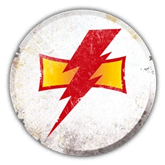

<!-- A0355-B0004 图片 -->
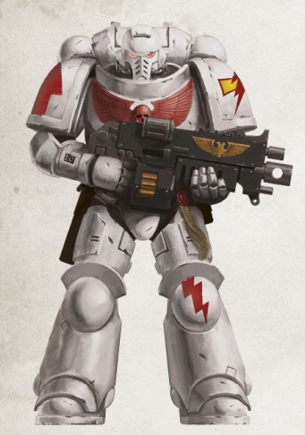

<!-- A0355-B0005 -->
**英文原文**

Legion Number:V

<!-- /A0355-B0005 -->

<!-- A0355-B0006 -->

原译文

军团编号：V

**校订译文**

军团编号：V

<!-- /A0355-B0006 -->

<!-- A0355-B0007 -->
**英文原文**

Primarch:Jaghatai Khan

<!-- /A0355-B0007 -->

<!-- A0355-B0008 -->

原译文

原体：察合台可汗

**校订译文**

原体：察合台可汗

<!-- /A0355-B0008 -->

<!-- A0355-B0009 -->
**英文原文**

Homeworld:Chogoris (a.k.a. Mundus Planus)

<!-- /A0355-B0009 -->

<!-- A0355-B0010 -->

原译文

家园世界：巧高里斯（又名蒙杜斯·普兰努斯）

**校订译文**

家园世界：乔高里斯（又名蒙杜斯·普兰努斯）

<!-- /A0355-B0010 -->

<!-- A0355-B0011 -->
**英文原文**

Fortress-Monastery:Quan Zhou

<!-- /A0355-B0011 -->

<!-- A0355-B0012 -->

原译文

堡垒修道院：泉州

**校订译文**

要塞修道院：泉州

<!-- /A0355-B0012 -->

<!-- A0355-B0013 -->
**英文原文**

Chapter Master:Jubal Khan

<!-- /A0355-B0013 -->

<!-- A0355-B0014 -->

原译文

战团长：朱巴可汗

**校订译文**

战团长：朱巴可汗

<!-- /A0355-B0014 -->

<!-- A0355-B0015 -->
**英文原文**

Colours:White

<!-- /A0355-B0015 -->

<!-- A0355-B0016 -->

原译文

颜色：白色

**校订译文**

颜色：白色

<!-- /A0355-B0016 -->

<!-- A0355-B0017 -->
**英文原文**

Specialty:Fast Attack

<!-- /A0355-B0017 -->

<!-- A0355-B0018 -->

原译文

专长：快速攻击

**校订译文**

专长：快速攻击

<!-- /A0355-B0018 -->

<!-- A0355-B0019 -->
**英文原文**

Strength:~1000 marines

<!-- /A0355-B0019 -->

<!-- A0355-B0020 -->

原译文

兵力：~1000星际战士

**校订译文**

兵力：约 1,000 名星际战士

<!-- /A0355-B0020 -->

<!-- A0355-B0021 -->
**英文原文**

Battle Cry:For the Khan and the Emperor!

<!-- /A0355-B0021 -->

<!-- A0355-B0022 -->

原译文

战吼：为了可汗和帝皇！

**校订译文**

战吼：为了可汗和帝皇！

<!-- /A0355-B0022 -->

<!-- A0355-B0023 -->
**英文原文**

Successor Chapters:

<!-- /A0355-B0023 -->

<!-- A0355-B0024 -->

原译文

子战团：

**校订译文**

子战团：

<!-- /A0355-B0024 -->

<!-- A0355-B0025 -->

原译文

Astral Bears 星熊

**校订译文**

Astral Bears 星熊

<!-- /A0355-B0025 -->

<!-- A0355-B0026 -->

原译文

Dark Hunters 黑暗猎手

**校订译文**

Dark Hunters 黑暗猎手

<!-- /A0355-B0026 -->

<!-- A0355-B0027 -->

原译文

Destroyers 毁灭者

**校订译文**

Destroyers 毁灭者

<!-- /A0355-B0027 -->

<!-- A0355-B0028 -->

原译文

Iron Talons 铁爪

**校订译文**

Iron Talons 铁爪

<!-- /A0355-B0028 -->

<!-- A0355-B0029 -->

原译文

Jade Scorpions 玉蝎

**校订译文**

Jade Scorpions 玉蝎

<!-- /A0355-B0029 -->

<!-- A0355-B0030 -->

原译文

Mantis Warriors 螳螂勇士

**校订译文**

Mantis Warriors 螳螂勇士

<!-- /A0355-B0030 -->

<!-- A0355-B0031 -->

原译文

Marauders 掠夺者

**校订译文**

Marauders 掠夺者

<!-- /A0355-B0031 -->

<!-- A0355-B0032 -->

原译文

Rampagers 狂暴者

**校订译文**

Rampagers 狂暴者

<!-- /A0355-B0032 -->

<!-- A0355-B0033 -->

原译文

Solar Hawks 日鹰

**校订译文**

Solar Hawks 日鹰

<!-- /A0355-B0033 -->

<!-- A0355-B0034 -->

原译文

Sons of Jaghatai 察合台之子

**校订译文**

Sons of Jaghatai 察合台之子

<!-- /A0355-B0034 -->

<!-- A0355-B0035 -->

原译文

Storm Lords 风暴领主

**校订译文**

Storm Lords 风暴领主

<!-- /A0355-B0035 -->

<!-- A0355-B0036 -->

原译文

Storm Reapers 风暴收割者

**校订译文**

Storm Reapers 风暴收割者

<!-- /A0355-B0036 -->

<!-- A0355-B0037 -->

原译文

Wrathhost 愤怒天军

**校订译文**

Wrathhost 愤怒天军

<!-- /A0355-B0037 -->

<!-- A0355-B0038 -->
## History 历史

<!-- /A0355-B0038 -->

<!-- A0355-B0039 -->
### Unification Wars 统一战争

<!-- /A0355-B0039 -->

<!-- A0355-B0040 -->
**英文原文**

The White Scars were the V Legion of Space Marine Legions created by the Emperor. They first saw action during the Unification Wars on Terra, held apart from their brothers and rarely found in massed armies. Recruits were primarily drawn from the ice wastes of the Thulean Basin. They were nonetheless one of the first Legions to see action in the name of the Emperor, fighting alongside the older Thunder Warriors. The early Vth Legion was given the solitary duty of seeking out the hidden lairs of many demagogues and warlords that ruled Terra. Their superhuman physiology allowed them to survive in the most radiation-contaminated areas of the planet and operate deep in enemy territory to scout and harass. In these early days, the Legion numbered only a few hundred warriors and frequently weakened the enemy in preparation for the arrival of the Emperor's main armies.

<!-- /A0355-B0040 -->

<!-- A0355-B0041 -->

原译文

白色疤痕军团是由帝皇创建的星际战士第五军团。他们第一次看到行动是在统一战争期间，与他们的兄弟分开，很少出现在大规模的军队中。新兵主要来自图林盆地的冰原。尽管如此，他们还是第一批以帝皇的名义参加战斗的军团之一，与年长的雷霆战士并肩作战。早期的第五军团被赋予了寻找统治泰拉的许多煽动者和军阀隐藏巢穴的唯一职责。他们超人的生理机能使他们能够在行星上辐射污染最严重的地区生存，并在敌方领土深处进行侦察和骚扰。在早期，军团只有几百名战士，经常削弱敌人，为帝皇主力的到来做准备。

**校订译文**

白疤是帝皇创建的第五支星际战士军团。他们最早在泰拉统一战争期间投入战斗，通常与其他军团分开行动，很少随大军集结作战。新兵主要来自图林盆地的冰原。他们仍是最早以帝皇之名出征的军团之一，曾与更早建立的雷霆战士并肩作战。第五军团初期专门负责搜寻那些统治泰拉的煽动家与军阀的隐秘巢穴。超人的生理机能使他们能够在星球上辐射污染最严重的地区生存，深入敌境侦察与袭扰。当时军团仅有数百名战士，常在帝皇主力抵达前先行削弱敌军。

<!-- /A0355-B0041 -->

<!-- A0355-B0042 图片 -->
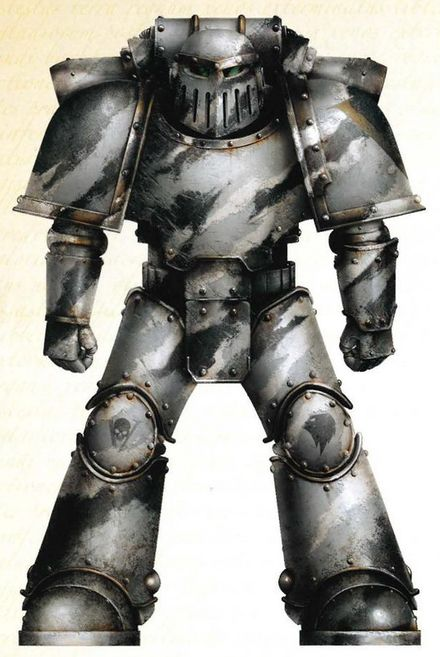

<!-- A0355-B0043 -->

原译文

Pre-Jaghatai White Scars Veteran Legionary of a Stalker Cadre in camouflage, serving as outriders and forward scout elements in the Great Crusade 察合台回归前白色疤痕伪装中的追猎者干部军团老兵，在大远征中担任外部和前线侦察兵

**校订译文**

Pre-Jaghatai White Scars Veteran Legionary of a Stalker Cadre in camouflage, serving as outriders and forward scout elements in the Great Crusade 察合台回归前，身着迷彩的白疤追猎者分队军团老兵；他们在大远征中担任先遣巡哨与前沿侦察任务。

<!-- /A0355-B0043 -->

<!-- A0355-B0044 -->
**英文原文**

During this time the V Legion was a Legion only in name as they were divided into several small autonomous pioneer companies of 500-3,000 Space Marines. Each of these Pioneer Companies had few links to any of their brethren and operated entirely independently. None of these companies had much contact with the other and each developed its own rituals, recruitment zones, and traditions. During this time they often operated alongside other larger Space Marine Legions, sometimes adopting the traditions of their brothers in arms in absence of their own Primarch. These non-Chogorian traditions would live on even after the discovery of Jaghatai, and it proved a way for Warrior Lodges to become strong within the future White Scars. As the Great Crusade progressed, the V Legion Pioneer Companies recruited as they traveled and a great diversity of Aspirants were drawn from worlds other than Terra.

<!-- /A0355-B0044 -->

<!-- A0355-B0045 -->

原译文

在此期间，第五军团只是名义上的军团，因为他们被分成了500-3000名星际战士的几个小型自主先锋连队。这些先锋连队中的每一个都与他们的兄弟连队几乎没有联系，完全独立运营。这些连队彼此之间并没有太多的联系，每家连队都发展了自己的仪式、招募和传统。在此期间，他们经常与其他更大的星际战士部队一起作战，有时在没有自己的原体的情况下采用他们兄弟的传统。即使在察合台被发现之后，这些非巧高里斯的传统也继续存在，这被证明是战士结社在未来的白色疤痕中变得强大的一种方式。随着大远征的进行，第五军团先锋连队在旅行中招募了大量的有志者，他们来自泰拉以外的世界。

**校订译文**

这一时期，第五军团只是名义上的统一军团，实际分散为若干自主行动的小型先锋连，每连约有 500 至 3,000 名星际战士。各先锋连与同袍联系甚少，几乎完全独立行动，并逐渐形成各自的仪式、征兵区域与传统。他们常与其他规模更大的星际战士军团合作；由于尚未找到自己的原体，有些先锋连会采纳友军弟兄的习俗。这些并非源自乔高里斯的传统在察合台归来后依然延续，也使战士结社得以在后来的白疤内部壮大。随着大远征推进，第五军团的先锋连沿途征募兵员，吸收了许多来自泰拉以外世界、背景各异的候选者。

<!-- /A0355-B0045 -->

<!-- A0355-B0046 -->
**英文原文**

However, the Star Hunters as they eventually become known as were noted as being free-spirited and tending to ignore orders given to them by anyone other than the Emperor himself. They operated without glory, far from the center of the conflict. Their famous early battles such as the raid of the Albian fortress of Dubris or the eighty-three day battle in the catacombs of Kadiru against Ursh forces went largely unrecorded. Few within the Star Hunters showed any outrage at this slight, and they even took a quiet pride in their silent role. Nonetheless, they were further isolated from their peers and became known as Terra's Forgotten Sons.

<!-- /A0355-B0046 -->

<!-- A0355-B0047 -->

原译文

然而，最终被称为星辰猎手的人被认为是自由奔放的，倾向于无视除帝皇本人以外的任何人给他们的命令。他们在远离冲突中心的地方毫无荣耀地行动。他们著名的早期战役，如突袭杜布里斯的阿尔布要塞，或在卡迪鲁地下墓穴与乌尔什部队进行的83天战斗，基本上没有记录。在星辰猎手中，很少有人对这种轻视表示愤怒，他们甚至为自己的沉默角色感到自豪。尽管如此，他们还是进一步与同伴隔绝，被称为泰拉的被遗忘之子。

**校订译文**

第五军团后来逐渐以“星辰猎手”之名为人所知。他们以自由不羁著称，往往只服从帝皇本人的命令。他们远离战争的中心，默默作战，鲜少获得荣誉。早期的一些著名战斗，例如突袭阿尔比亚的杜布里斯要塞，以及在卡迪鲁地下墓穴中与乌尔什部队持续八十三天的交战，大多没有留下记录。星辰猎手几乎无人为这种冷落感到愤怒，反而暗自以默默承担职责为荣。不过，这也使他们愈发疏远其他军团，获得了“泰拉的被遗忘之子”的称号。

<!-- /A0355-B0047 -->

<!-- A0355-B0048 -->
### Great Crusade 大远征

<!-- /A0355-B0048 -->

<!-- A0355-B0049 -->
**英文原文**

As the Unification Wars spiraled into the Great Crusade, the Star Hunters were among the first Astartes to depart the Sol System. They were split into a hundred companies and acted as pioneers, charting and seeking out domains for the Crusade's Expeditionary Fleets. Once again, these expeditions received little attention or praise and found the Star Hunters as the outsiders and "other" of the Imperium's armies. Nonetheless, one such pioneer Company discovered Cthonia, homeworld of Horus, and this cemented a bond with the Primarch for years to come. Their early experience in pioneering and scouting also saw the Star Hunters master the art of hit-and-run and manoeuvre warfare that would come to define them in the future. Soon enough the Star Hunters were known not only as pioneers but also as raiders who struck swiftly and without warning, drawing out a foe and testing it before broadcasting the data to allied Expeditionary Fleets. In these early days, the Star Hunters lived by a single creed: each new day is a victory. This motto arose due to the Legion sustaining sustaining heavy losses and slowly but surely eroding under the pressures of its duties. Rather than ask for aid, they chose to instead live and die in the manner and locations of their choice.

<!-- /A0355-B0049 -->

<!-- A0355-B0050 -->

原译文

随着统一战争演变为大远征，星辰猎手是首批离开太阳系的阿斯塔特之一。他们被分成一百个连队，充当先锋，为大远征的远征舰队绘制和寻找领地。再一次，这些探索队几乎没有受到关注或赞扬，他们发现星辰猎手是帝国军队的局外人和“他者”。尽管如此，一个这样的先锋连队发现了荷鲁斯的家园世界科索尼亚，这在未来几年巩固了与原体的联系。他们在开拓和侦察方面的早期经验也使星辰猎手掌握了命中和撤退以及机动战的艺术，这将在未来定义他们。很快，星辰猎手不仅被称为先锋，而且被称为突袭者，他们在没有警告的情况下迅速发动攻击，抽出敌人并进行测试，然后将数据广播给盟军远征舰队。在这些早期，星辰猎手信奉一个信条：每个新的一天都是胜利。这一座右铭的出现是由于军团在其职责的压力下持续遭受重大损失，并缓慢但肯定地受到侵蚀。他们没有寻求援助，而是选择以自己选择的方式和地点生活和死亡。

**校订译文**

统一战争转入大远征后，星辰猎手成为最早离开太阳系的阿斯塔特之一。他们拆分为一百个连队，担任先遣部队，为远征舰队搜寻待征服的星域并绘制星图。这些探索行动依旧鲜少得到关注与赞誉，星辰猎手在帝国诸军眼中始终是格格不入的异类。不过，其中一支先锋连发现了荷鲁斯的母星科索尼亚，由此与这位原体建立了延续多年的联系。早期的开拓与侦察经历，也使星辰猎手掌握了日后成为其标志的袭扰与机动作战技艺。他们很快不仅以先锋部队闻名，也成为擅长迅猛突袭的掠袭者：出其不意地发动攻击，引诱敌军现身并试探其虚实，再将情报传送给友方远征舰队。当时，星辰猎手奉行的信条只有一句：“每一个新的日子，都是胜利。”这句格言源于军团在履行职责时不断遭受惨重损失，实力在重压下缓慢而持续地消耗。即便如此，他们也没有求援，而是选择在自己决定的地方，以自己决定的方式生存或战死。

<!-- /A0355-B0050 -->

<!-- A0355-B0051 图片 -->
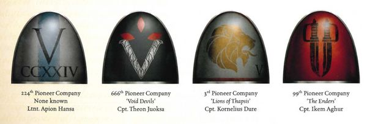

<!-- A0355-B0052 -->

原译文

Heraldry of the pioneer company's of the early V Legion 第五军团早期先锋连队的纹章

**校订译文**

Heraldry of the pioneer company's of the early V Legion 第五军团早期先锋连队的纹章

<!-- /A0355-B0052 -->

<!-- A0355-B0053 -->
**英文原文**

It was at this near-breaking point that their Primarch Jaghatai Khan was discovered on Chogoris after fifty long years of searching. Upon meeting the Emperor, Jaghatai recognised him as a man who embodied his ultimate ideal, someone who could unite all the stars of the sky. At his palace at Quan Zhou he swore allegiance to the Emperor and was given command of the Vth Legion. The Astartes adopted the facial ritual scars of the Talskar tribesmen while many of Khan's loyal tribesmen were allowed to join the Legion. Jaghatai's palace, located in the rugged, lonely mountain passes of the Khum Karta mountains, would become the Legion's Fortress-monastery. However, the Khan was unfamiliar with the advanced technologies and tactics of the Imperium, and took a longer and more difficult period to adjust from his life on primitive Chogoris than most Primarchs. The Khan found himself as lord of a Legion of vagabonds spread out across the Galaxy, but nonetheless effectively rebuilt the Star Hunters into a new force similar to the armies he had employed on Chogoris. In 875.M30, a full ten years after his discovery, the Khan finally mustered all of the remaining Pioneer companies on Chogoris and declared that they would be unified in a shared tradition and ritual. In an event known as the Blooding, 50,000 warriors took up knives and marked themselves with a scar and new Chogorian name. Among these new traditions was the study of "noble pursuits" such as calligraphy, hunting and the reciting of oral tales. However, this blend of primitive and enlightened put him at odds with some aspects of the Imperial Truth and brought him into conflict with Primarchs such as Guilliman and Lorgar.

<!-- /A0355-B0053 -->

<!-- A0355-B0054 -->

原译文

正是在这个近乎崩溃的时刻，经过五十年的搜寻，他们的原体察合台可汗在巧高里斯被发现。在见到帝皇后，察合台认出他是一个体现了他终极理想的人，一个能够团结天空中所有群星的人。在泉州的宫殿里，他宣誓效忠帝皇，并被授予第五军团的指挥权。阿斯塔特采用了塔尔斯卡部落成员的面部仪式疤痕，而科汗的许多忠诚部落成员则被允许加入军团。察合台的宫殿位于库姆·卡尔塔山脉崎岖偏僻的山口，将成为军团的堡垒修道院。然而，可汗不熟悉帝国的先进技术和战术，从他在原始的巧高里斯的生活中调整过来，比大多数原体都要花更长、更困难的时间。可汗发现自己是一支遍布银河系的流浪军团的领主，但他还是有效地将星辰猎手重建成了一支新的力量，与他在巧高里斯所使用的军队相似。875.M30，在他被发现整整十年后，可汗终于召集了巧高里斯剩下的所有先锋连队，并宣布他们将在共同的传统和仪式中统一起来。在一次被称为鲜血的事件中，5万名战士拿起刀，在自己身上留下疤痕和新的巧高里斯名字。在这些新的传统中，有研究书法、狩猎和背诵口头故事等“崇高追求”。然而，这种原始和开明的融合使他与帝国真理的某些方面产生了分歧，并使他与基里曼和珞珈等原体发生了冲突。

**校订译文**

就在军团濒临崩溃之际，经过漫长的五十年搜寻，他们的原体察合台可汗终于在乔高里斯被发现。察合台见到帝皇后，认为他正是自己终极理想的化身：一位能够统一漫天群星的人。他在泉州的宫殿中宣誓效忠帝皇，并获授第五军团的指挥权。阿斯塔特开始仿效塔尔斯卡部族的仪式，在面部刻下伤疤；可汗许多忠诚的部族战士也获准加入军团。察合台位于库姆·卡尔塔山脉偏僻险峻山口的宫殿，则成为军团的要塞修道院。然而，可汗并不熟悉帝国的先进技术与战术；相较于多数原体，他从乔高里斯的原始生活适应帝国战争的过程更漫长，也更艰难。他接手的是一支成员流散银河各处的军团，却仍成功地将星辰猎手改造成与自己昔日在乔高里斯统率的军队相似的新力量。M30.875，即被发现整整十年后，可汗终于将所有剩余的先锋连召集至乔高里斯，宣布以共同的传统与仪式将他们团结起来。在名为“血誓”的仪式上，五万名战士举刀为自己刻下伤疤，并各自取了一个乔高里斯名字。新的传统还包括书法、狩猎及吟诵口述故事等“高雅志趣”。然而，这种原始习俗与开明修养的结合，也与帝国真理的某些主张不合，使可汗同基里曼、珞珈等原体产生了冲突。

**校注：** The Blooding 暂译“血誓”，指军团以自刻伤疤与取乔高里斯名字共同确立身份的仪式；尚无官方译名证据。

<!-- /A0355-B0054 -->

<!-- A0355-B0055 -->
**英文原文**

The Legion fought many bloody battles during the Great Crusade and under Jaghatai Khan they became infamous for their fast attacks and hit-and-run assaults. Of the 80,000 warriors under the Khan's command, one in ten would perish over the next five years fighting in a region of space known as the Kolarne Circle. These campaigns were waged against foes such as the Orks of Sengr Mar and the Vorgheist. The Khan reshaped the Legion into utilising the same hit-and-run and fast manoeuvre tactics he had mastered on Chogoris, outmatching every foe they came across. The Khan always fought at the forefront of every attack, earning the respect of his Legion. In the final battle of the Kolarne Circle on desolate Kolarne itself, the Khan emerged victorious and the entire region fell into his hands. The battle was more than an impressive victory, it served to bind the Legion together and blend the recruits from Terra with those from Chogoris. Later during the war against the Nephilim on Hoadh in 884.M30 the Legion became known as the White Scars, a term derived from a fused corruption of a Chogorian tribe name and a reference to their new ivory livery. Other sources state that they took on the title of White Scars during their assembly by the Khan on Chogoris.

<!-- /A0355-B0055 -->

<!-- A0355-B0056 -->

原译文

军团在大远征期间进行了许多血腥的战斗，在察合台可汗的领导下，他们因快速攻击和跑打攻击而臭名昭著。在可汗指挥下的8万名战士中，十分之一的人将在未来五年内在被称为克拉恩星环的太空地区作战时死亡。这些战役是针对森格·马尔和沃尔吉斯特的欧克等敌人发动的。可汗重塑了军团，使其采用了他在巧高里斯掌握的同样的跑打和快速机动战术，击败了他们遇到的每一个敌人。可汗总是站在每次进攻的最前线，赢得了他的军团的尊重。在荒凉的克拉恩上的克拉恩星环的最后一场战斗中，可汗取得了胜利，整个地区都落入了他的手中。这场战斗不仅仅是一场令人印象深刻的胜利，它还将军团团结在一起，将来自泰拉的新兵与来自巧高里斯的新兵融合在一起。后来，884.M30对霍阿德的拿非利人的战争中，军团被称为白色疤痕，这个词来源于巧高里斯部落名称的融合变体和他们新的象牙色彩。其他消息来源称，他们在巧高里斯的可汗集会期间获得了白色伤疤的称号。

**校订译文**

大远征期间，军团经历了无数血战。在察合台可汗率领下，他们的快速突击与打了就走的袭扰战法令敌人闻风丧胆。可汗麾下八万名战士中，有十分之一在随后五年里战死于克拉恩星环的征战。他们的敌人包括森格·马尔的欧克，以及沃尔吉斯特。可汗以自己在乔高里斯磨炼出的袭扰和快速机动战法重塑军团，压倒了沿途遭遇的所有敌人。他总是亲自冲在每次进攻的最前线，赢得了军团的敬重。在克拉恩星环战役的最后一战中，可汗攻克了荒凉的克拉恩，整个星域就此落入他手中。这场大战不仅带来了辉煌的胜利，也凝聚了军团，使泰拉与乔高里斯出身的战士真正融合。后来，M30.884 在霍阿德与拿非利人作战时，军团开始以“白疤”之名闻名；这个名称融合了某个乔高里斯部族名称的讹变形式，以及军团新采用的象牙白涂装。另一些资料则称，他们早在可汗召集军团于乔高里斯会师时便已采用白疤之名。

<!-- /A0355-B0056 -->

<!-- A0355-B0057 图片 -->
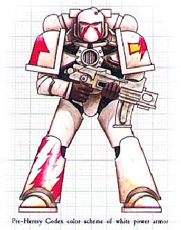

<!-- A0355-B0058 -->

原译文

Pre-Heresy Codex colour scheme 叛乱前圣典配色方案

**校订译文**

Pre-Heresy Codex colour scheme 叛乱前圣典配色方案

<!-- /A0355-B0058 -->

<!-- A0355-B0059 -->
**英文原文**

The White Scars earned much glory and victory during this period, but were still largely neglected by the historians of the Imperium. Others considered them savages akin to the warriors of Angron or Leman Russ. Yet in truth they were learned warriors skilled in craftsmanship, art and philosophy. The warriors of the Legion were far more disciplined and professional than those of the World Eaters or Space Wolves. They found no joy in slaughter and were only merciless when necessary or against a worthy foe they could test their full ability against. The Scars made no effort to show the greater Imperium their true selves and showed no indignation at their false labels.

<!-- /A0355-B0059 -->

<!-- A0355-B0060 -->

原译文

白色伤疤在这一时期赢得了许多荣耀和胜利，但在很大程度上仍被帝国历史学家所忽视。其他人认为他们是野蛮人，类似于安格隆或黎曼·鲁斯的战士。然而，事实上，他们是精通工艺、艺术和哲学的博学战士。军团的战士比吞世者或太空野狼的战士更有纪律和专业性。他们在屠杀中找不到乐趣，只有在必要时或面对他们可以充分考验自己能力的有价值的敌人时才会无情。疤痕没有努力向更大的帝国展示他们的真实自我，也没有对他们的虚假标签表示愤慨。

**校订译文**

白疤在这一时期赢得了无数胜利与荣耀，却仍受到帝国史家的忽视。旁人常将他们视为与安格隆或黎曼·鲁斯麾下战士无异的野蛮人。实际上，他们学识丰富，精通工艺、艺术与哲学；相较于吞世者与太空野狼，他们也更守纪律、更具职业军人的素养。白疤不以屠戮为乐，只有在必要时，或面对足以让自己全力以赴的强敌时，才会毫不留情。他们从未费心向帝国其他人展示真实的自己，也不因外界的误解而愤慨。

<!-- /A0355-B0060 -->

<!-- A0355-B0061 -->
### The Horus Heresy 荷鲁斯之乱

原题：The Horus Heresy 荷鲁斯叛乱

<!-- /A0355-B0061 -->

<!-- A0355-B0062 -->
**英文原文**

Jaghatai Khan and his Legion had spent several years in a campaign against the Orks of the Chondax System, which had been intentionally prolonged by the Alpha Legion, when news about the betrayal of Horus and the Drop Site Massacre arrived. They were urged by Rogal Dorn to return to Terra. The Khan was contacted by Leman Russ who had just returned from Prospero and offered to join forces with him. Horus, however, had anticipated this and sent the Alpha Legion to launch an assault on Russ' outnumbered Space Wolves, where they were defeated at Yarant. Although he despised leaving the Space Wolves on their own and was faced with dangerous Warp Storms, Jagathai Khan followed Dorn's urgent request to return to Terra immediately rather than engaging in a costly battle against the Alpha Legion. Most of all, the Khan sought to find answers for himself as to what had happened to the Imperium. Using a fleet formation known as the chisel, the White Scars broke a nearby Alpha Legion blockade, destroyed several of their warships and left the Chondax System behind.

<!-- /A0355-B0062 -->

<!-- A0355-B0063 -->

原译文

察合台可汗和他的军团花了几年时间对抗康达克斯星系的欧克，阿尔法军团故意延长了这场战役，当荷鲁斯背叛和登陆点大屠杀的消息传来时。罗格·多恩敦促他们返回泰拉。刚刚从普洛斯佩罗回来的黎曼·鲁斯联系了可汗，并表示愿意与他联手。然而，荷鲁斯早就预料到了这一点，并派遣阿尔法军团对鲁斯寡不敌众的太空野狼发起进攻，在雅兰特被击败。尽管察合台鄙视独自离开的太空野狼，并面临危险的亚空间风暴，但他还是听从了多恩的紧急请求，立即返回泰拉，而不是与阿尔法军团进行代价高昂的战斗。最重要的是，可汗试图为自己找到帝国发生了什么的答案。白色疤痕使用一种被称为凿子的舰队编队，打破了附近的阿尔法军团封锁，摧毁了他们的几艘战舰，离开了康达克斯星系。

**校订译文**

荷鲁斯叛变与登陆点大屠杀的消息传来时，察合台可汗与军团已在香德克斯星系同欧克作战数年；这场战役被阿尔法军团刻意拖延。罗格·多恩敦促白疤返回泰拉，刚从普洛斯佩罗归来的黎曼·鲁斯也联系可汗，提议两军会合。然而，荷鲁斯预料到了这一点，派出阿尔法军团攻击兵力居于劣势的太空野狼；原稿在此记述太空野狼于雅兰特败北。可汗虽不愿将太空野狼独自留下，又面临危险的亚空间风暴，仍决定遵从多恩的急令，尽快返回泰拉，而不与阿尔法军团打一场代价高昂的会战。更重要的是，他想亲自弄清帝国究竟发生了什么。白疤采用名为“凿阵”的舰队阵形，突破附近阿尔法军团的封锁，击毁数艘敌舰，离开了香德克斯星系。

**校注：** 本段英文将阿尔法军团阻击、太空野狼于 Yarant 败北合并叙述，时序及战斗对应存在疑点；保留其记述并注明，未凭设定记忆改写。

<!-- /A0355-B0063 -->

<!-- A0355-B0064 图片 -->
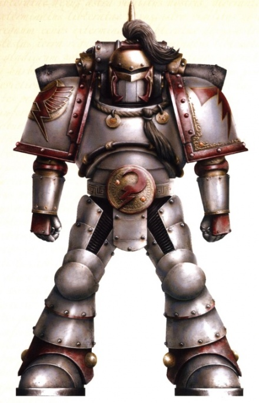

<!-- A0355-B0065 -->

原译文

Heresy-era White Scars Marine 叛乱时期白疤星际战士

**校订译文**

Heresy-era White Scars Marine 叛乱时期白疤星际战士

<!-- /A0355-B0065 -->

<!-- A0355-B0066 -->
**英文原文**

The Khan eventually decided to return to the source of all of these problems to investigate for himself and arrived at Prospero after its apocalyptic attack by the Space Wolves. Of both sides, the White Scars initially found no sign, but the ghosts of slain Thousand Sons soon appeared and the White Scars found their weapons ineffective against these deadly enemies and Master Qin Xa ordered an immediate retreat. Eventually the Khan himself was confronted by an ethereal projection of Magnus the Red, who implored his brother to choose a side in this war and not trust the Emperor. In the end the Khan shattered the shade with his sword. Jaghatai and his Keshig next encountered Mortarion and his Deathshroud of the Death Guard, and the two sides came to battle. Meanwhile as White Scars and Death Guard ships began to engage each other in space, the Legion was faced with an attempted coup led by Torghun Khan and Hasik-Noyan Khan to take command of the White Scars fleet while it was at Prospero and join their forces with Horus. Cultural tensions between members of the Legion born on Terra and those from Chogoris had been fermenting for years, with many of those from Humanity's birthplace favouring Horus while those from the Khan's adopted world favoured loyalty to his word. Thanks to the efforts of Shiban Khan, who led a boarding party onto the Swordstorm and battled the traitors until Jaghatai arrived, the plot failed. Mortarion and the Death Guard withdrew shortly after following a brief battle in space. Surviving traitors within the Scars were condemned to the Sagyar Mazan, suicide units that would atone through death against the enemy.

<!-- /A0355-B0066 -->

<!-- A0355-B0067 -->

原译文

可汗最终决定回到所有这些问题的源头，亲自调查，并在普洛斯佩罗遭到太空野狼的毁灭袭击后抵达普洛斯彼洛。在双方，白色疤痕最初没有发现任何迹象，但被杀千子的幽灵很快出现了，白色疤痕发现他们的武器对这些致命的敌人无效，秦夏大师下令立即撤退。最终，可汗本人遇到了一个虚幻的赤红之马格努斯的投影，他恳求他的兄弟在这场战争中选择一方，不要相信帝皇。最后，可汗用剑打破了阴影。察合台和他的怯薛接下来遇到了莫塔里安和他的死亡守卫的死亡寿衣，双方开始战斗。与此同时，随着白色疤痕和死亡守卫的战舰开始在太空中相互交战，军团面临着由托尔浑可汗和哈西克诺扬汗领导的未遂政变，他们在普洛斯佩罗接管了白色疤痕舰队，并与荷鲁斯会合。多年来，出生在泰拉的军团成员与来自巧高里斯的军团成员之间的文化紧张关系一直在发酵，许多来自人类出生地的人支持荷鲁斯，而来自收养可汗世界的人则支持忠于他的话。由于昔班可汗的努力，他带领一个跳帮队登上剑刃风暴号，与叛徒作战，直到察合台到达，阴谋才失败。莫塔里安和死亡守卫在太空短暂战斗后不久就撤退了。疤痕中幸存的叛徒被判入萨加尔·马赞，这是一支自杀式部队，将通过死亡来赎罪。

**校订译文**

可汗最终决定前往这一切的源头，亲自查明真相。他抵达普洛斯佩罗时，那里已经遭到太空野狼的毁灭性攻击。起初，白疤未发现交战双方留下的人迹；不久，阵亡千子的幽灵便开始现身。面对这些致命的敌人，白疤发现常规武器毫无作用，秦夏导师遂下令立即撤退。可汗随后遭遇红魔马格努斯的虚幻投影；马格努斯恳求兄弟在这场战争中选定立场，并告诫他不要相信帝皇。最终，可汗挥剑击碎了幻影。此后，察合台与怯薛卫队又遇到莫塔里安及其死亡守卫死亡寿衣护卫，双方爆发冲突。白疤与死亡守卫的舰船也同时在太空交战，而白疤内部此时发生了由托尔浑可汗与哈西克诺扬汗领导的政变，企图夺取停驻普洛斯佩罗的白疤舰队，再投向荷鲁斯。泰拉出身与乔高里斯出身的军团战士之间，文化矛盾已积累多年；许多前者倾向荷鲁斯，后者则更愿意遵从可汗的意志。昔班可汗率领跳帮队登上剑刃风暴号，与叛徒交战，支撑到察合台归来，最终挫败了政变。莫塔里安与死亡守卫在一场短暂的舰战后撤退。白疤内部幸存的叛乱者被编入萨加尔·马赞敢死部队，须在与敌人作战时以死赎罪。

<!-- /A0355-B0067 -->

<!-- A0355-B0068 图片 -->
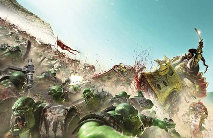

<!-- A0355-B0069 -->

原译文

The Khan and his Legion strike at the Orks in the Ullanor system 可汗和他的军团打击乌兰诺星系的欧克

**校订译文**

The Khan and his Legion strike at the Orks in the Ullanor system 可汗和他的军团打击乌兰诺星系的欧克

<!-- /A0355-B0069 -->

<!-- A0355-B0070 -->
**英文原文**

For the next four years, the White Scars found themselves trapped far from Terra. Warp Storms cut off long-distance Warp travel while the traitor fleets blocked the best routes to Humanity's capital. Faced with no other choice, Jaghatai had the Scars wage a hit-and-run campaign of attrition. While damaging to Horus' war effort, it did not halt his progress towards Terra and 1/5th of the White Scars Legion was lost in the fighting. Soon, it became apparent that the traitors were adjusting to the Scars tactics and the Legion slowly became boxed in. It was after the Battle of the Kalium Gate and the death of Qin Xa that the Khan decided that they had suffered enough and a way to Terra would be forged. Eventually, the Scars were able to discover the Dark Glass artefact and through the sacrifice of Chief Stormseer Targutai Yesugei a portal into the Webway was opened that allowed for the Scars to reach Terra.

<!-- /A0355-B0070 -->

<!-- A0355-B0071 -->

原译文

在接下来的四年里，白色疤痕发现自己被困在远离泰拉的地方。亚空间风暴切断了亚空间的长途航行，而叛徒舰队则封锁了通往人类首都的最佳路线。在别无选择的情况下，察合台让伤疤发动了一场打击性的消耗战役。虽然对荷鲁斯的战争努力造成了破坏，但这并没有阻止他向泰拉前进，五分之一的白色疤痕军团在战斗中牺牲。很快，叛徒开始适应伤疤的战术，军团也慢慢被困住了。在钾之门之战和秦夏之死之后，可汗才决定他们已经受够了，并将开辟一条通往泰拉的道路。最终，疤痕发现了造物黑色琉璃，并通过首席风暴先知塔里忽台·也速该的牺牲，打开了通往网道的门户，使疤痕能够到达泰拉。

**校订译文**

此后四年，白疤一直被困在远离泰拉的地方。亚空间风暴阻断了远距离航行，叛军舰队又封锁了通往人类首都的最佳航线。别无选择之下，察合台命令白疤以机动袭扰展开消耗战。这些行动虽能打击荷鲁斯的战争部署，却无法阻止他向泰拉推进，白疤军团自身也在交战中损失了五分之一的兵力。叛军渐渐适应了白疤的战术，军团的活动空间也不断被压缩。卡利乌姆之门战役及秦夏之死，让可汗决定不能再这样承受损失，必须杀出一条通往泰拉的道路。白疤最终找到了名为“黑暗琉璃”的古代造物。首席风暴先知塔里忽台·也速该以生命为代价开启网道入口，使军团得以抵达泰拉。

**校注：** Kalium Gate 是专名，原译“钾之门”将 Kalium 误当普通化学词；暂按音译作“卡利乌姆之门”。

<!-- /A0355-B0071 -->

<!-- A0355-B0072 -->
### The Battle of Terra 泰拉之战

<!-- /A0355-B0072 -->

<!-- A0355-B0073 -->
**英文原文**

During the siege of the Emperor's Palace the White Scars fought alongside the Blood Angels and Imperial Fists against the traitors. They launched several hit-and-run assaults during the siege. When the inner palace was breached, the White Scars led an attack to retake the Lions Gate spaceport. Jaghatai order the assembly of the Legion, the Skye Plate and pulled together elements of a hundred tank regiments, forming the 1st Terran Armoured Division. The White Scars attacked from the Colossi Gate with the Sky Plate providing orbital protection to the tankers and Marines on Jetbikes. Jaghatai then engaged in personal combat with Mortarion and banished him to the Warp, though the Khan was near death following the battle. The White Scars under Shiban Khan, Jangsai Khan, and Ganzorig Noyan-Khan then proceeded to fortify the port with the intention of attacking the traitor armada in orbit and provide access to reinforcements from the Ultramarines, Dark Angels and Space Wolves to easily get to Terra.

<!-- /A0355-B0073 -->

<!-- A0355-B0074 -->

原译文

在围攻帝皇的皇宫期间，白色伤疤与圣血天使和帝国之拳一起对抗叛徒。在围城期间，他们发动了几次跑打袭击。当皇宫内部被攻破时，白色疤痕组织发动了一场进攻，夺回了狮门太空港。察合台命令集结军团，天空平台，并召集了100个坦克团的成员，组成了第一泰拉装甲师。白色疤痕从巨像之门发起攻击，天空平台为悬浮摩托上的战士和战车提供轨道保护。察合台随后与莫塔里安进行了决斗，并将他驱逐到亚空间，尽管可汗在战斗后濒临死亡。昔班可汗、江塞可汗和甘佐里格诺扬汗率领的白色疤痕随后开始加固港口，意图攻击轨道上的叛徒舰队，并提供极限战士、黑暗天使和太空野狼增援的通道，以便轻松抵达泰拉。

**校订译文**

帝皇皇宫遭到围攻时，白疤与圣血天使、帝国之拳并肩抵御叛军，并多次发动机动袭扰。内皇宫被攻破后，白疤发起攻势，夺回狮门太空港。察合台命令军团集结，调来天空平台，并抽调一百个坦克团的部分兵力，组成第一泰拉装甲师。白疤从巨像之门出击；天空平台为坦克部队与骑乘喷气摩托的星际战士提供来自轨道方向的掩护。察合台与莫塔里安亲自决斗，将他放逐回亚空间，但自己也在战后濒临死亡。随后，昔班可汗、江塞可汗及甘佐里格诺扬汗率领白疤加固太空港，准备打击轨道上的叛军舰队，并为极限战士、黑暗天使与太空野狼的援军开辟直抵泰拉的通道。

<!-- /A0355-B0074 -->

<!-- A0355-B0075 -->
### Post-Heresy 叛乱后

<!-- /A0355-B0075 -->

<!-- A0355-B0076 -->
**英文原文**

After the Horus Heresy, the White Scars adopted the Codex Astartes and the Legion was divided into several Chapters.

<!-- /A0355-B0076 -->

<!-- A0355-B0077 -->

原译文

荷鲁斯叛乱之后，白色伤疤采用了阿斯塔特圣典，军团分为几个战团。

**校订译文**

荷鲁斯之乱后，白疤采纳《阿斯塔特圣典》，将军团拆分为多个战团。

<!-- /A0355-B0077 -->

<!-- A0355-B0078 -->
**英文原文**

In order to contain the outlaws, renegades and aliens that dwell within the Maelstrom, Roboute Guilliman ordered the surrounding systems to be reinforced. The White Scars were tasked with the main responsibility of securing the area from their homeworld.

<!-- /A0355-B0078 -->

<!-- A0355-B0079 -->

原译文

为了遏制居住在大漩涡中的歹徒、叛徒和外星人，罗伯特·基里曼命令加强周围的星系。白色疤痕的主要任务是保护从家园世界到该地区免受侵扰。

**校订译文**

为了遏制盘踞大漩涡的亡命徒、叛徒与异形，罗保特·基里曼下令加强周边星系的防御。白疤承担主要的地区保卫职责，以母星为基地维护这一带的安全。

<!-- /A0355-B0079 -->

<!-- A0355-B0080 图片 -->
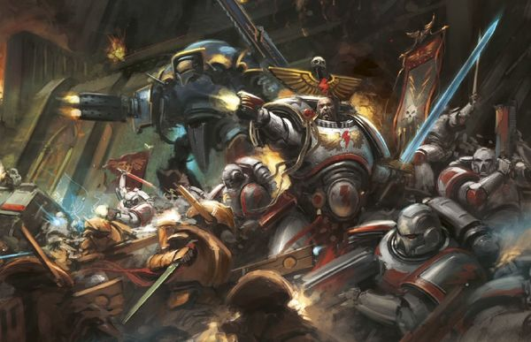

<!-- A0355-B0081 -->

原译文

White Scars and Knights battle the Tau 白色疤痕与骑士共同与钛作战

**校订译文**

White Scars and Knights battle the Tau 白疤与骑士共同对抗钛族

<!-- /A0355-B0081 -->

<!-- A0355-B0082 -->
### Notable Engagements Post-Heresy 叛乱后著名作战

<!-- /A0355-B0082 -->

<!-- A0355-B0083 -->
**英文原文**

M35

**补译**

第35千年

<!-- /A0355-B0083 -->

<!-- A0355-B0084 -->
**英文原文**

Mid M35: The White Scars fought alongside Saint Sabbat during her crusade to liberate the Sabbat Worlds from the forces of Chaos. After her martyrdom on Harkalon, where she suffered the Nine Holy Wounds, her body was retrieved by the White Scars and interred on Hagia, the planet of her birth.

<!-- /A0355-B0084 -->

<!-- A0355-B0085 -->

原译文

M35中期：圣萨巴特远征期间，白色伤疤与圣萨巴特并肩作战，将萨巴特世界从混沌势力中解放出来。后她遭受了九道圣伤，在哈卡隆殉道，她的尸体被白色伤疤取回，安葬在她出生的行星海吉亚。

**校订译文**

M35 中期：白疤追随圣萨巴特发动远征，将萨巴特诸世界从混沌势力手中解放出来。圣人在哈卡隆身受九道圣伤并殉道后，白疤寻回她的遗体，将她安葬在出生地海吉亚。

<!-- /A0355-B0085 -->

<!-- A0355-B0086 -->
**英文原文**

M37

**补译**

第37千年

<!-- /A0355-B0086 -->

<!-- A0355-B0087 -->
**英文原文**

???.M37: The Cursed Year. Three successive Khans were lost during their inaugural campaigns. Thinking they had displeased the spirit of their Primarch, the Stormseers recalled the entire Chapter to Chogoris for a month of feasting and competitions. In the decades that followed, the White Scars chalked up many victories.

<!-- /A0355-B0087 -->

<!-- A0355-B0088 -->

原译文

诅咒之年。连续三位可汗在他们的就职战役中失利。认为他们冒犯了他们的原体的精神，风暴先知把整个战团都召回了巧高里斯，进行了一个月的盛宴和比赛。在接下来的几十年里，白色伤疤取得了许多胜利。

**校订译文**

M37，具体年份不详：诅咒之年。三位接任可汗在各自首次出征时接连殒命。风暴先知认为战团冒犯了原体的英灵，便将全团召回乔高里斯，举行了为期一个月的宴饮与竞赛。此后数十年，白疤接连取得胜利。

<!-- /A0355-B0088 -->

<!-- A0355-B0089 -->
**英文原文**

M41

**补译**

第41千年

<!-- /A0355-B0089 -->

<!-- A0355-B0090 -->
**英文原文**

???.M41: The Gehöft Incursion. When the planet Gehöft became the point of the Blighted Claw attack and Daemonic incursion, White Scars of Kor'sarro Khan with the aid of the Dark Angels Chapter and Brindelweld Imperial Guard arrived to assist the inhabitants. Unfortunately, their arrival came too late and despite their furious efforts, the planet was lost and had to undergo Exterminatus.

<!-- /A0355-B0090 -->

<!-- A0355-B0091 -->

原译文

格霍夫特入侵。当格霍夫特行星成为枯萎之爪攻击和恶魔入侵的地点时，阔萨罗可汗的白色伤疤在黑暗天使战团和布林德尔维尔德帝国卫队的帮助下抵达协助居民。不幸的是，他们的到来太晚了，尽管他们做出了巨大的努力，但行星还是丢失了，不得不经历灭绝令。

**校订译文**

M41，具体年份不详：格霍夫特入侵。格霍夫特遭到枯萎之爪袭击与恶魔入侵后，科萨罗可汗率领白疤赶来援救居民，并得到黑暗天使战团及布林德尔维尔德帝国卫队的协助。可惜援军来得太迟；即使他们奋战不休，也无法挽救这颗星球，最终只能执行灭绝令。

<!-- /A0355-B0091 -->

<!-- A0355-B0092 -->
**英文原文**

???.M41: The Attack on Volghast. There was a battle between the White Scars and the T'au of the Vior'la Sept in M41. Librarian Kaljuk managed to confuse the senses of T'au forces and set an ambush that totally overwhelmed the Xenos.

<!-- /A0355-B0092 -->

<!-- A0355-B0093 -->

原译文

进攻沃尔加斯特。在M41，白色伤疤和维奥'拉家门世界的钛之间发生了一场战斗。智库卡尔朱克设法混淆了钛部队的感官，并设置了一个伏击，完全击溃了异型。

**校订译文**

M41，具体年份不详：沃尔加斯特之战。白疤与维奥拉家门世界的钛族交战。智库员卡尔朱克扰乱了钛军的感知，设伏将这支异形部队彻底击溃。

<!-- /A0355-B0093 -->

<!-- A0355-B0094 -->
**英文原文**

The White Scars and six other Space Marine chapters combined forces to purge the Daemon World of Fyre in the Battle for Fyre.

<!-- /A0355-B0094 -->

<!-- A0355-B0095 -->

原译文

在炽焰战役中，白色疤痕和其他六个星际战士战团联合起来，净化了炽焰恶魔世界。

**校订译文**

炽焰战役中，白疤与另外六个星际战士战团联手，净化了恶魔世界炽焰。

<!-- /A0355-B0095 -->

<!-- A0355-B0096 -->
**英文原文**

998.M41: The Third War for Armageddon. The White Scars committed 3 brotherhoods to the Third War for Armageddon.

<!-- /A0355-B0096 -->

<!-- A0355-B0097 -->

原译文

第三次阿玛吉多顿战争。白色伤疤三个兄弟会为阿玛吉多顿而战。

**校订译文**

M41.998：第三次阿玛吉多顿战争。白疤投入三个兄弟会参战。

<!-- /A0355-B0097 -->

<!-- A0355-B0098 -->
**英文原文**

999.M41: The Thirteenth Black Crusade. The White Scars sent forces to the Cadian Gate under Khajog Khan. Kajog's Brotherhood soon became a major threat to Abaddon's plans, lifting the sieges of three Kasrs. As a result, Abaddon ordered the First Company of the Black Legion, guided by Zaraphiston, as well as a horde of The Lost and the Damned to hunt down and destroy the Brotherhood. Khajog launches a Biker attack on a Black Legion slave convoy on Cadia, plunging into a Black Legion ambush and taking heavy loses. The White Scars withdrew to the Caducades Sea Pylon, with the remaining sixty Brothers viciously fighting to the death.

<!-- /A0355-B0098 -->

<!-- A0355-B0099 -->

原译文

第十三次黑色远征。白色疤痕派哈乔格可汗率领军队前往卡迪亚之门。哈乔格的兄弟会很快成为阿巴顿计划的主要威胁，解除了对三个要塞的围困。因此，阿巴顿命令由扎拉菲斯顿领导的黑色军团第一连队，以及一群迷失者和被诅咒者追捕并摧毁兄弟会。哈乔格对卡迪亚的一支黑色军团奴隶车队发动了摩托袭击，陷入了黑色军团的伏击，并遭受了重大损失。白色伤疤撤退到卡杜卡迪海桥塔，剩下的60名兄弟恶战至死。

**校订译文**

M41.999：第十三次黑色远征。白疤派哈乔格可汗率部前往卡迪亚之门。他的兄弟会接连解除了三座卡斯尔要塞的围困，成为阿巴顿计划的重大威胁。阿巴顿遂命令由扎拉菲斯顿引导的黑色军团第一连，以及大批迷失者与被诅咒者，追杀并消灭这个兄弟会。哈乔格率摩托部队袭击卡迪亚上的一支黑色军团奴隶车队，却中了埋伏，伤亡惨重。白疤退至卡杜卡迪海的黑石方尖碑，剩下六十名战斗弟兄死战至最后一人。

**校注：** 同段 Khajog/Kajog 指同一可汗，统一哈乔格；Pylon 在卡迪亚语境指黑石方尖碑，非桥塔。

<!-- /A0355-B0099 -->

<!-- A0355-B0100 -->
**英文原文**

~999.M41: The War for Chogoris. Chogoris was invaded by Daemonic armies and Red Corsairs spawned from the newly formed Great Rift. The besieged world was eventually saved by a charge led by Kor'sarro Khan but much of the Yasan Sector remains in Red Corsairs hands. Multiple commanders of the Scars perished during the war.

<!-- /A0355-B0100 -->

<!-- A0355-B0101 -->

原译文

巧高里斯战争。巧高里斯被恶魔军队入侵，新形成的大裂隙导致了红海盗。被围困的世界最终被阔萨罗可汗领导的冲锋所拯救，但崖山星区的大部分地区仍掌握在红海盗手中。战争中，伤痕的多名指挥官丧生。

**校订译文**

约 M41.999：乔高里斯战争。恶魔大军与红海盗从新形成的大裂隙涌出，入侵乔高里斯。科萨罗可汗最终率军冲锋，解救了遭围困的母星，但崖山星区的大部分地区仍被红海盗控制。多名白疤指挥官在战争中阵亡。

<!-- /A0355-B0101 -->

<!-- A0355-B0102 -->
**英文原文**

M42

**补译**

第42千年

<!-- /A0355-B0102 -->

<!-- A0355-B0103 -->
**英文原文**

???.M42: Jubal Khan, Great Khan of the White Scars, seeking revenge against the Red Corsairs for the invasion of Chogoris, pursued the fiends across the Yasan Sector. He was thought missing after a battle aboard the Seethnar, a space station commandeered by the Red Corsairs. Eventually, Jubal was rediscovered, having been captured and brutally tortured by the Red Corsairs. Though he has since partially recovered, his mental state is now called into question.

<!-- /A0355-B0103 -->

<!-- A0355-B0104 -->

原译文

白色疤痕大汗朱巴可汗为了报复红海盗入侵巧高里斯，在崖山星区追捕恶魔。他被认为是在红海盗占领的空间站西瑟纳尔号上的一场战斗后失踪的。最终，朱巴被红海盗俘虏并残酷折磨，被重新发现。虽然他已经部分康复，但他的精神状态现在受到了质疑。

**校订译文**

M42，具体年份不详：白疤大汗朱巴可汗为报复红海盗入侵乔高里斯，在崖山星区追击这些凶徒。他在红海盗占据的西瑟纳尔空间站内经历一场战斗后失踪。后来人们找到了朱巴，才知道他已遭红海盗俘虏并受到残酷折磨。此后他虽已部分康复，精神状态却仍令人担忧。

<!-- /A0355-B0104 -->

<!-- A0355-B0105 -->

原译文

???.M42: Charadon Campaign 查拉顿战役

**校订译文**

???.M42: Charadon Campaign 查拉顿战役

<!-- /A0355-B0105 -->

<!-- A0355-B0106 -->

原译文

The Chromyd Front 克罗米德前线

**校订译文**

The Chromyd Front 克罗米德前线

<!-- /A0355-B0106 -->

<!-- A0355-B0107 -->

原译文

???.M42: Octarius War 奥克塔琉斯战争

**校订译文**

???.M42: Octarius War 奥克塔琉斯战争

<!-- /A0355-B0107 -->

<!-- A0355-B0108 -->

原译文

Defence of the Pankallis Sub-Sector 潘卡利斯分区防御

**校订译文**

Defence of the Pankallis Sub-Sector 潘卡利斯分区防御

<!-- /A0355-B0108 -->

<!-- A0355-B0109 -->

原译文

???.M42: The Nachmund Rift War 纳克蒙德走廊战争

**校订译文**

???.M42: The Nachmund Rift War 纳克蒙德走廊战争

<!-- /A0355-B0109 -->

<!-- A0355-B0110 -->

原译文

???.M42: Arks of Omen Campaign 噩兆方舟战役

**校订译文**

???.M42: Arks of Omen Campaign 噩兆方舟战役

<!-- /A0355-B0110 -->

<!-- A0355-B0111 -->

原译文

Battle of Malak 马尔拉克之战

**校订译文**

Battle of Malak 马尔拉克之战

<!-- /A0355-B0111 -->

<!-- A0355-B0112 -->
## Organization & Tactics 组织与战术

原题：Organization & Tactics 组织&战术

<!-- /A0355-B0112 -->

<!-- A0355-B0113 -->
**英文原文**

The Chapter organization of the White Scars reflects their home world's tribal culture; for example, Librarians are referred to as Stormseers. White Scars recruit from a single planet, Mundus Planus. The steppes of the world are inhabited by feuding tribes, from which are chosen the best and most promising young warriors, regardless of tribe. Once a warrior becomes a White Scar, loyalty to his tribe is replaced by loyalty to the Chapter and the Emperor. Another noted difference with the White Scars is the absence of any unit associated with military law. Unlike the Space Wolves, who in the Heresy-era relied heavily on Consul-Opsequiari disciplinary officers, the White Scars never operated with any sort of disciplinary corps. Despite this, they have virtually no internal disputes or act of undisciplined behaviour.

<!-- /A0355-B0113 -->

<!-- A0355-B0114 -->

原译文

白色伤疤的战团组织反映了他们家园世界的部落文化；例如，智库被称为风暴先知。白色疤痕从一个行星蒙杜斯·普兰努斯招募成员。世界上的大草原上居住着不和的部落，无论部落如何，都会从中选出最优秀、最有前途的年轻战士。一旦一个战士变成白色伤疤，对部落的忠诚就会被对战团和帝皇的忠诚所取代。白色伤疤的另一个显著区别是，没有任何与军法相关的单位。与在叛乱时代严重依赖领事执法官纪律军官的太空野狼不同，白色疤痕从未与任何纪律部队合作过。尽管如此，他们几乎没有内部纠纷或不守纪律的行为。

**校订译文**

白疤的战团组织体现了母星的部落文化，例如将智库员称为“风暴先知”。他们只从蒙杜斯·普兰努斯一颗星球征募新兵。那里的草原部落互相争斗，战团则不问部落出身，只挑选最优秀、最有潜力的年轻战士。成为白疤之后，战士对原部落的效忠便被对战团与帝皇的忠诚取代。白疤的另一特点是没有专门执掌军纪军法的部队。太空野狼在荷鲁斯之乱时期十分依赖领事执法官等纪律军官，白疤却从未设立过任何类似的军纪机构。即便如此，他们内部也几乎没有纷争或违纪行为。

<!-- /A0355-B0114 -->

<!-- A0355-B0115 图片 -->
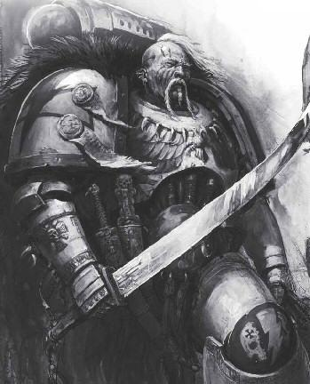

<!-- A0355-B0116 -->

原译文

Veteran 老兵

**校订译文**

Veteran 老兵

<!-- /A0355-B0116 -->

<!-- A0355-B0117 -->
### Pre-Heresy 叛乱前

<!-- /A0355-B0117 -->

<!-- A0355-B0118 -->
**英文原文**

During the Great Crusade and Horus Heresy, a specialised rank of Noyan-Khan existed that was the equivalent of a Lord Commander. There were multiple Noyan-Khans, each of whom commanded a Horde, consisting of several Chapter-sized Brotherhoods. It is estimated that there were roughly five Hordes containing as many as 5,000 to 20,000 Marines. Each Brotherhood (or Minghan, in the Khorchin language) was largely a mechanized unit, consisting of many Jetbikes, Landspeeders, Bikes, and other swift vehicles. In addition, many close-assault and reconnaissance formations existed within Brotherhood. Each Brotherhood also operated its own Keshig, which served as both as an elite corps of bodyguards and strategic reserve intended to exploit breakthroughs. Some Brotherhoods had highly specialist roles, such as dedicated artillery trains and reconnaissance units. The White Scars mostly shunned Destroyer Marines due to their enjoyment of open battle and unspoiled wilderness. However, some Destroyer cadres did exist, known as the Karaoghlanlar or the Dark Sons of Death.

<!-- /A0355-B0118 -->

<!-- A0355-B0119 -->

原译文

在大远征和荷鲁斯叛乱期间，存在一个相当于领主指挥官的诺扬汗专业军衔。有多个诺扬汗，每个都指挥着一个部落，由几个战团大小的兄弟会组成。据估计，大约有五个部落，其中有多达5000到20000名星际战士。每个兄弟会（或科尔沁语中的明汗）在很大程度上都是一个机械化单位，由许多悬浮摩托、兰德速攻艇、摩托和其他快速载具组成。此外，兄弟会内部还存在许多近身突击和侦察编队。每个兄弟会还经营着自己的怯薛，它既是精英护卫，也是旨在利用突破的战略储备。一些兄弟会具有高度专业化的角色，如专门的炮兵训练和侦察部队。白色疤痕大多避开毁灭者星际战士，因为他们喜欢公开战斗和未受破坏的荒野。然而，一些毁灭者干部确实存在，被称为死暗之子或死亡的黑暗之子。

**校订译文**

大远征与荷鲁斯之乱期间，白疤设有“诺扬汗”这一特殊军衔，相当于领主指挥官。军团有多位诺扬汗，各率领一个“部落”，下辖数个战团规模的兄弟会。据估计，军团约有五个部落，每个部落拥有约五千至两万名星际战士。兄弟会在科尔沁语中称为“明汗”，主要是机械化部队，拥有大量喷气摩托、兰德速攻艇、摩托及其他快速载具，也编有许多近战突击与侦察部队。每个兄弟会都有自己的怯薛，既担任精锐近卫，也是用来扩大突破战果的战略预备队。有些兄弟会专司炮兵支援或侦察等任务。白疤喜爱开阔战场与未受玷污的荒野，因此大多不愿使用毁灭者。不过，军团仍有少量毁灭者分队，称为“死暗之子”，意为“死亡的黑暗之子”。

**校注：** 本段将大远征时期的 Brotherhood 说成战团规模、Horde 说成下辖数个此类编制；后文 B0191 却将 Horde 比作战团，源文编制描述不一致，正文分别保留。

<!-- /A0355-B0119 -->

<!-- A0355-B0120 图片 -->

<!-- A0355-B0121 -->

原译文

Stormseer 风暴先知

**校订译文**

Stormseer 风暴先知

<!-- /A0355-B0121 -->

<!-- A0355-B0122 -->
**英文原文**

Several other specialist orders of the Scars existed during the Great Crusade and Heresy period. These included the Burgedinn Sarvhu or Talon's Claw (also translated as Falcon's Claws), which was composed of veteran warriors who had undergone certain initiatory rites on Chogoris. On the battlefield, they served as hunters and forward scouts. Another was the Kharash, which was less a formal order and more of a temporary assembly of warriors who were needed for a diversionary or shock attack role. These were formed only of volunteers and were seen as both an act of punishment and honor. The Kharash were one of the few White Scars orders to make use of Dreadnoughts. Next were the Uhaan Solban, an order compromised of every Dreadnought in use. When not aiding the Kharash, they were used to guard the gene-seed vaults of the Legion on Chogoris and Terra. The last order were known as the Akoghlanar, which consisted of the Apothecaries of the Legion and were seen as the opposite of the Destroyers of the Karaoghlanlar. Unlike the other orders, the Akoghlanlar were spread out across many Brotherhoods on a permanent basis. Other specialist roles existed, such as Kavkhan which served as an adviser to his Brotherhoods commanding Khan, Tenrikhan which captained the White Scars starships, and the Gan-Khan that presided over the Legion armoury and essentially acted as Techmarines.

<!-- /A0355-B0122 -->

<!-- A0355-B0123 -->

原译文

在大远征和叛乱时期，还存在其他几个专门的伤痕组织。其中包括伯尔盖丁·萨夫胡或猛禽之爪（也翻译为猎鹰之爪），由在巧高里斯经历过某些启蒙仪式的资深战士组成。在战场上，他们担任猎人和前线侦察兵。另一个是哈拉什，这不是一个正式的组织，更多的是一个临时的战士集会，他们需要发挥转移注意力或突袭的作用。这些组织只由志愿者组成，被视为惩罚和荣誉的行为。哈拉什是为数不多的使用无畏的白色疤痕部队之一。接下来是乌汉·索尔班，这是一个由所有正在使用的无畏妥协而成的组织。当不帮助哈拉什时，他们被用来保护巧高里斯和泰拉上军团的基因种子库。最后一个组织被称为阿科格兰纳尔，由军团药剂师组成，被视为与死暗之子毁灭者相反。与其他组织不同，阿科格兰纳尔长期分散在许多兄弟会中。其他专业角色也存在，比如担任指挥可汗的兄弟会顾问的卡夫可汗，担任白色疤痕舰队长的天瑞可汗，以及主持军团军械库并主要担任技术军士的甘可汗。

**校订译文**

大远征与荷鲁斯之乱期间，白疤还设有若干特殊战士组织。其中之一是伯尔盖丁·萨夫胡，即“猛禽之爪”，也译作“猎鹰之爪”。成员是在乔高里斯完成特定入选仪式的老兵，在战场上担任猎手与前沿侦察兵。“哈拉什”则更像为佯攻或强袭任务临时召集的战士队伍，并非固定组织。成员全为志愿者，参加这种部队既有受罚的意味，也是一种荣耀；它还是白疤少数会使用无畏机甲的部队之一。“乌汉·索尔班”由军团所有在役无畏机甲组成，不支援哈拉什时，便守卫军团位于乔高里斯与泰拉的基因种子库。最后是由药剂师组成的“阿科格兰纳尔”，被视为死暗之子毁灭者的对应反面。与其他组织不同，他们长期分散派驻于各个兄弟会。其他特殊职务包括为兄弟会可汗提供建议的卡夫可汗、担任白疤星舰舰长的天瑞可汗，以及掌管军团军械库、实质上履行科技战士职责的甘可汗。

**校注：** 原文 an order compromised of every Dreadnought 中 compromised 依上下文应为 comprised，译为“由所有在役无畏机甲组成”；英文保留。Akoghlanar/Akoghlanlar 是本段交替使用的拼法，暂按同一组织统一汉译。

<!-- /A0355-B0123 -->

<!-- A0355-B0124 -->
**英文原文**

Known Hordes of the White Scars during the Great Crusade & Horus Heresy:

<!-- /A0355-B0124 -->

<!-- A0355-B0125 -->

原译文

大远征和荷鲁斯叛乱时期著名的白色伤疤部落：

**校订译文**

大远征与荷鲁斯之乱期间已知的白疤部落：

<!-- /A0355-B0125 -->

<!-- A0355-B0126 -->
**英文原文**

Horde of the Earth — Commanded by Jemulan Noyan-Khan.

<!-- /A0355-B0126 -->

<!-- A0355-B0127 -->

原译文

大地部落 — 由哲穆兰诺扬汗指挥

**校订译文**

大地部落 — 由哲穆兰诺扬汗指挥

<!-- /A0355-B0127 -->

<!-- A0355-B0128 -->
**英文原文**

Horde of the Stone — Commanded by Hasik Noyan-Khan.

<!-- /A0355-B0128 -->

<!-- A0355-B0129 -->

原译文

岩石部落 — 由哈西克诺扬汗指挥

**校订译文**

岩石部落 — 由哈西克诺扬汗指挥

<!-- /A0355-B0129 -->

<!-- A0355-B0130 -->
**英文原文**

Known Brotherhoods of the White Scars during the Great Crusade & Horus Heresy:

<!-- /A0355-B0130 -->

<!-- A0355-B0131 -->

原译文

大远征和荷鲁斯叛乱时期著名的白色伤疤兄弟会：

**校订译文**

大远征与荷鲁斯之乱期间已知的白疤兄弟会：

<!-- /A0355-B0131 -->

<!-- A0355-B0132 -->

原译文

Brotherhood of the Amber Eagle 琥珀天鹰兄弟会

**校订译文**

Brotherhood of the Amber Eagle 琥珀天鹰兄弟会

<!-- /A0355-B0132 -->

<!-- A0355-B0133 -->
**英文原文**

Brotherhood of the Black Axe — Commanded by Sengur Khan.

<!-- /A0355-B0133 -->

<!-- A0355-B0134 -->

原译文

黑斧兄弟会 — 由森古尔可汗指挥。

**校订译文**

黑斧兄弟会 — 由森古尔可汗指挥。

<!-- /A0355-B0134 -->

<!-- A0355-B0135 -->
**英文原文**

Brotherhood of the Blooded Spear — Commanded by Tormu Khan.

<!-- /A0355-B0135 -->

<!-- A0355-B0136 -->

原译文

血腥之矛兄弟会 — 由托尔穆可汗指挥。

**校订译文**

血腥之矛兄弟会 — 由托尔穆可汗指挥。

<!-- /A0355-B0136 -->

<!-- A0355-B0137 -->

原译文

Brotherhood of the Blue Hawk 蓝鹰兄弟会

**校订译文**

Brotherhood of the Blue Hawk 蓝鹰兄弟会

<!-- /A0355-B0137 -->

<!-- A0355-B0138 -->
**英文原文**

Brotherhood of the Broken Shield — Commanded by Bujir Khan.

<!-- /A0355-B0138 -->

<!-- A0355-B0139 -->

原译文

破损盾牌兄弟会 — 由布吉尔可汗指挥。

**校订译文**

破损盾牌兄弟会 — 由布吉尔可汗指挥。

<!-- /A0355-B0139 -->

<!-- A0355-B0140 -->
**英文原文**

Brotherhood of the Dawn Sky — Commanded by Hibou Khan.

<!-- /A0355-B0140 -->

<!-- A0355-B0141 -->

原译文

黎明天空兄弟会 — 由希布可汗指挥。

**校订译文**

黎明天空兄弟会 — 由希布可汗指挥。

<!-- /A0355-B0141 -->

<!-- A0355-B0142 -->
**英文原文**

Brotherhood of the Dying Sun — Commanded by Bahan Khan.

<!-- /A0355-B0142 -->

<!-- A0355-B0143 -->

原译文

死日兄弟会 — 由巴汉可汗指挥。

**校订译文**

死日兄弟会 — 由巴汉可汗指挥。

<!-- /A0355-B0143 -->

<!-- A0355-B0144 -->

原译文

Brotherhood of the Foresworn 弃誓兄弟会

**校订译文**

Brotherhood of the Foresworn 弃誓兄弟会

<!-- /A0355-B0144 -->

<!-- A0355-B0145 -->
**英文原文**

Brotherhood of the Golden Path — Commanded by Khulan Khan.

<!-- /A0355-B0145 -->

<!-- A0355-B0146 -->

原译文

黄金之路兄弟会 — 由呼兰可汗指挥。

**校订译文**

黄金之路兄弟会 — 由呼兰可汗指挥。

<!-- /A0355-B0146 -->

<!-- A0355-B0147 -->
**英文原文**

Brotherhood of the Golden Star — Commanded by Tsolmon Khan.

<!-- /A0355-B0147 -->

<!-- A0355-B0148 -->

原译文

黄金之星兄弟会 — 由朝勒蒙可汗指挥。

**校订译文**

黄金之星兄弟会 — 由朝勒蒙可汗指挥。

<!-- /A0355-B0148 -->

<!-- A0355-B0149 -->
**英文原文**

Brotherhood of the Great Eye — Commanded by Nayaga Khan.

<!-- /A0355-B0149 -->

<!-- A0355-B0150 -->

原译文

巨眼兄弟会 — 由纳亚加可汗指挥。

**校订译文**

巨眼兄弟会 — 由纳亚加可汗指挥。

<!-- /A0355-B0150 -->

<!-- A0355-B0151 -->

原译文

Brotherhood of the Hooked Blade 钩刃兄弟会

**校订译文**

Brotherhood of the Hooked Blade 钩刃兄弟会

<!-- /A0355-B0151 -->

<!-- A0355-B0152 -->
**英文原文**

Brotherhood of the Hunter's Star — Commanded by Xo Hutan.

<!-- /A0355-B0152 -->

<!-- A0355-B0153 -->

原译文

狩猎之星兄弟会 — 由佐可汗指挥。

**校订译文**

狩猎之星兄弟会——由佐·忽坦指挥。

**校注：** 英文姓名为 Xo Hutan，并非 Xo Khan；暂译“佐·忽坦”，修复原译将第二部分当作“可汗”职衔的问题。

<!-- /A0355-B0153 -->

<!-- A0355-B0154 -->

原译文

Brotherhood of the Iron Axe 铁斧兄弟会

**校订译文**

Brotherhood of the Iron Axe 铁斧兄弟会

<!-- /A0355-B0154 -->

<!-- A0355-B0155 -->

原译文

Brotherhood of the Jade Scorpion 玉蝎兄弟会

**校订译文**

Brotherhood of the Jade Scorpion 玉蝎兄弟会

<!-- /A0355-B0155 -->

<!-- A0355-B0156 -->
**英文原文**

Brotherhood of the Moon — Commanded by Torghun Khan.

<!-- /A0355-B0156 -->

<!-- A0355-B0157 -->

原译文

明月兄弟会 — 由托尔汉可汗指挥。

**校订译文**

明月兄弟会——由托尔浑可汗指挥。

<!-- /A0355-B0157 -->

<!-- A0355-B0158 -->
**英文原文**

Brotherhood of the Night's Star — Commanded by Ainbataar Khan.

<!-- /A0355-B0158 -->

<!-- A0355-B0159 -->

原译文

午夜之星兄弟会 — 由艾因巴塔尔可汗指挥。

**校订译文**

午夜之星兄弟会 — 由艾因巴塔尔可汗指挥。

<!-- /A0355-B0159 -->

<!-- A0355-B0160 -->
**英文原文**

Brotherhood of the Obsidian Serpent — Commanded by Zargan Khan.

<!-- /A0355-B0160 -->

<!-- A0355-B0161 -->

原译文

黑曜石之蛇兄弟会 — 由扎尔甘可汗指挥。

**校订译文**

黑曜石之蛇兄弟会 — 由扎尔甘可汗指挥。

<!-- /A0355-B0161 -->

<!-- A0355-B0162 -->
**英文原文**

Brotherhood of the Pennant Spear — Commanded by Algu Khan.

<!-- /A0355-B0162 -->

<!-- A0355-B0163 -->

原译文

三角之矛兄弟会 — 由奥古可汗指挥。

**校订译文**

饰旗之矛兄弟会——由奥古可汗指挥。

<!-- /A0355-B0163 -->

<!-- A0355-B0164 -->

原译文

Brotherhood of the Sable Wolf 刃狼兄弟会

**校订译文**

Brotherhood of the Sable Wolf 黑狼兄弟会

**校注：** Sable 表示黑色，原“刃狼”误读为 sabre，暂改“黑狼”。

<!-- /A0355-B0164 -->

<!-- A0355-B0165 -->
**英文原文**

Brotherhood of the Shattered Shield — Commanded by Zhenjin Khan

<!-- /A0355-B0165 -->

<!-- A0355-B0166 -->

原译文

破碎盾牌兄弟会 — 由真金可汗指挥。

**校订译文**

破碎盾牌兄弟会 — 由真金可汗指挥。

<!-- /A0355-B0166 -->

<!-- A0355-B0167 -->
**英文原文**

Brotherhood of the Storm — Commanded by Shiban Khan.

<!-- /A0355-B0167 -->

<!-- A0355-B0168 -->

原译文

风暴兄弟会 — 由昔班可汗指挥。

**校订译文**

风暴兄弟会 — 由昔班可汗指挥。

<!-- /A0355-B0168 -->

<!-- A0355-B0169 -->
**英文原文**

Brotherhood of the Summer Lightning — Commanded by Jubal Khan.

<!-- /A0355-B0169 -->

<!-- A0355-B0170 -->

原译文

夏闪兄弟会 — 由朱巴可汗指挥。

**校订译文**

夏闪兄弟会 — 由朱巴可汗指挥。

<!-- /A0355-B0170 -->

<!-- A0355-B0171 -->
**英文原文**

Known Companies of the White Scars during the Great Crusade & Horus Heresy:

<!-- /A0355-B0171 -->

<!-- A0355-B0172 -->

原译文

大远征和荷鲁斯叛乱时期著名的白色伤疤连队：

**校订译文**

大远征与荷鲁斯之乱期间已知的白疤连队：

<!-- /A0355-B0172 -->

<!-- A0355-B0173 -->
**英文原文**

3rd Pioneer Company — the “Lions of Thapsis”. Lead by Captain Kornelius Dure.

<!-- /A0355-B0173 -->

<!-- A0355-B0174 -->

原译文

第三先锋连队 — “萨普西斯之狮”。由科尔内利乌斯·杜尔连长领导。

**校订译文**

第三先锋连队 — “萨普西斯之狮”。由科尔内利乌斯·杜尔连长领导。

<!-- /A0355-B0174 -->

<!-- A0355-B0175 -->
**英文原文**

99th Pioneer Company — “The Enders”. Lead by Captain Ikem Aghur.

<!-- /A0355-B0175 -->

<!-- A0355-B0176 -->

原译文

第99先锋连队 — “终结之人”。由伊克姆·阿格尔连长领导。

**校订译文**

第99先锋连队 — “终结之人”。由伊克姆·阿格尔连长领导。

<!-- /A0355-B0176 -->

<!-- A0355-B0177 -->
**英文原文**

224th Pioneer Company — lead by Lieutenant Apion Hansa.

<!-- /A0355-B0177 -->

<!-- A0355-B0178 -->

原译文

第224先锋连队 — 由副官阿皮翁·汉萨领导

**校订译文**

第224先锋连队 — 由副官阿皮翁·汉萨领导

<!-- /A0355-B0178 -->

<!-- A0355-B0179 -->
**英文原文**

666th Pioneer Company — the “Void Devils”. Lead by Captain Theon Juoksa.

<!-- /A0355-B0179 -->

<!-- A0355-B0180 -->

原译文

第666先锋连队 — “虚空魔鬼”，由西昂・尤克萨连长领导

**校订译文**

第666先锋连队 — “虚空魔鬼”，由西昂・尤克萨连长领导

<!-- /A0355-B0180 -->

<!-- A0355-B0181 -->
**英文原文**

The Unyielding Mountain — Armoured Company, fought alongside the forces of Legio Astorum.

<!-- /A0355-B0181 -->

<!-- A0355-B0182 -->

原译文

不屈山脉 — 装甲连队，与星象军团并肩作战。

**校订译文**

不屈山脉 — 装甲连队，与星象军团并肩作战。

<!-- /A0355-B0182 -->

<!-- A0355-B0183 -->
### Stance on Dreadnoughts 对无畏机甲的态度

原题：Stance on Dreadnoughts 无畏的态度

<!-- /A0355-B0183 -->

<!-- A0355-B0184 -->
**英文原文**

Many outsiders have made the claim that the White Scars did not use Dreadnoughts. This is not true. Those they maintained were rarely seen in battle and were few in number, but they did exist and held a strange position within the Legion. As a warrior society uniquely bound to the fierce joys of battle and the simple pleasures of a physical existence, the eternity of silence and separation endured by those incarcerated within a Dreadnought chassis held a particular horror for the White Scars. Despite this revulsion, to be assigned to live on in a Dreadnought shell is seen as neither punishment nor as an honour, but rather somewhere in between. Dreadnoughts among the White Scars were known as the Uhaan Solban, the Guardians of the Morning and Evening Stars in the Chogorian tongue. This poetic title is typical of the Legion’s tendencies, and hid a rather more practical purpose. It was only the Akoghlanlar, the apothecaries, and the Iron Khans of the armoury who sought them out, both to perform maintenance and for ritual reasons tied closely to their own obscure creeds.

<!-- /A0355-B0184 -->

<!-- A0355-B0185 -->

原译文

许多外部人员声称，白色伤疤没有使用无畏。这不是真的。他们维护的人很少在战斗中出现，人数也很少，但他们确实存在，并在军团中占据着奇怪的地位。作为一个与战斗的激烈乐趣和物质生活的简单乐趣紧密相连的战士社会，那些被关在无畏机甲里的人所忍受的永恒的沉默和分离对白色伤疤来说尤其可怕。尽管有这种反感，但被分配到无畏机甲中继续生活既不是惩罚，也不是荣誉，而是介于两者之间。白色伤疤中的无畏被称为乌汉·索尔班，巧高里斯中的晨星和昏星守护者。这个诗意的标题是典型的军团倾向，隐藏着一个更实际的目的。只有阿科格兰纳尔、药剂师，和军械库的钢铁可汗找到了他们，他们既是为了维护，也是出于与自己晦涩的信仰密切相关的仪式原因。

**校订译文**

许多外人声称白疤不用无畏机甲，事实并非如此。军团的无畏数量确实很少，也鲜少出战，但他们始终存在，并占据着特殊的位置。白疤的战士文化十分重视战斗的激情，以及以血肉之躯享受生活的简单乐趣，因此，无畏驾驶者被封入机体后所承受的永恒沉寂与隔绝，格外令他们恐惧。尽管如此，以无畏之躯延续生命，在他们眼中既不是惩罚，也算不上荣耀，而是介于两者之间的命运。白疤的无畏统称“乌汉·索尔班”，在乔高里斯语中意为“晨星与昏星的守护者”。这富有诗意的称号符合军团一贯作风，背后却还有更实际的职责。只有阿科格兰纳尔，也就是药剂师，以及军械库的钢铁可汗会主动拜访他们，既进行维护，也履行与各自隐秘信条紧密相关的仪式。

<!-- /A0355-B0185 -->

<!-- A0355-B0186 -->
**英文原文**

Dreadnoughts are viewed in the White Scars with something resembling both pity and awe. Some of their Dreadnoughts undergo the Tseverle, or re-branding. This discards their old name and takes up a new one to represent their rebirth as a towering Dreadnought. These warriors chose their own names from the great arch of the Baatarbish, a monument to the Undying Heroes of the Chapter.

<!-- /A0355-B0186 -->

<!-- A0355-B0187 -->

原译文

在白色伤疤中，无畏被视为既有怜悯又有敬畏。他们的一些无畏经历了采弗勒或重造。这抛弃了他们的旧名字，并采用了一个新的名字来代表他们作为高耸无畏的重生。这些战士从巴塔尔比什的巨型穹顶中选择了自己的名字，这是一座纪念战团不朽英雄的纪念碑。

**校订译文**

白疤对无畏的感情近乎怜悯与敬畏并存。部分无畏会接受名为“采弗勒”的重新赋名仪式，舍弃旧名，另取新名，以象征自己作为巍峨无畏机甲的新生。他们从巴塔尔比什的大拱门上选择名字；那是一座纪念战团不朽英雄的纪念建筑。

**校注：** re-branding 在此指舍旧名、取新名，不是重造身体；arch 为拱门，非穹顶。

<!-- /A0355-B0187 -->

<!-- A0355-B0188 -->
### Post-Heresy 叛乱后

<!-- /A0355-B0188 -->

<!-- A0355-B0189 -->
**英文原文**

Since the Heresy, the White Scars are led by a single Great Khan and several company-level Khans (Captains).

<!-- /A0355-B0189 -->

<!-- A0355-B0190 -->

原译文

自叛乱以来，白色伤疤由一位大汗和几位连级可汗（连长）领导。

**校订译文**

荷鲁斯之乱后，白疤由一位大汗与数位统领连队的可汗（连长）领导。

<!-- /A0355-B0190 -->

<!-- A0355-B0191 -->
**英文原文**

As their Primarch did during his campaign to unite the steppes, recruits from different tribes are today mixed together in squads. Each squad becomes part of a Brotherhood, roughly equivalent to a standard Company. During the Great Crusade when the White Scars were still a Legion, multiple Brotherhoods fell under the control of a Horde, roughly equivalent to a Chapter. However, unlike other Codex Chapters the White Scars maintain a much higher proportion of bike squadrons and Land Speeders, a reflection of the style of warfare favoured by the Chapter. The Chapter also maintains relatively few battle tanks, which are often stripped-down versions in order to keep with the rest of the White Scars. Finally, the White Scars of today normally do not possess any Dreadnoughts since the thought of confining a warriors' spirit within a sarcophagus is abhorrent to them. Though there remain a few battle brothers willing to be reborn as one of these ironclad war machines.

<!-- /A0355-B0191 -->

<!-- A0355-B0192 -->

原译文

正如他们的原体在统一大草原的战役中所做的那样，来自不同部落的新兵今天混合在一起。每个小队都成为兄弟会的一部分，大致相当于一个标准连队。在大远征期间，当白色伤疤仍然是一个军团时，多个兄弟会落入一个部落的控制之下，大致相当于一个战团。然而，与其他圣典战团不同的是，白色伤疤保持了更高比例的摩托中队和兰德速攻艇，这反映了该战团所青睐的战争风格。战团还保留了相对较少的战斗坦克，这些坦克通常是精简版的，以与其余的白色伤疤保持一致。最后，今天的白色伤疤通常不具备任何无畏，因为将战士的灵魂限制在石棺内的想法对他们来说是令人憎恶的。尽管还有一些战斗兄弟愿意重生为这些铁甲战争机械之一。

**校订译文**

如同原体当年统一草原时一样，来自不同部落的新兵如今会混编成小队，再编入各个兄弟会。现代兄弟会大致相当于一个标准连队。大远征时期，白疤尚为军团，多个兄弟会由一个“部落”统辖；本段原文将当时的部落比作一个战团。与其他圣典战团相比，白疤的摩托中队及兰德速攻艇比例高得多，体现出其偏爱的作战方式。战团的战斗坦克相对较少，而且通常经过减重改装，以便跟上其他部队的速度。至于无畏机甲，将战士的灵魂禁锢在石棺中的念头令白疤极为反感，因此现代白疤通常不部署这类战士；但仍有少数战斗弟兄愿意化身这些钢铁战争机器，继续作战。

**校注：** 本段 Horde 的历史规模说法与 B0118 不一致；保留原资料并说明。其“通常不拥有无畏”又紧接少数例外，译文保持这种总体倾向与例外并存的表述。

<!-- /A0355-B0192 -->

<!-- A0355-B0193 图片 -->
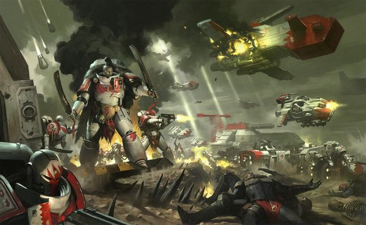

<!-- A0355-B0194 -->

原译文

White Scars Battle Force 白色疤痕战斗部队

**校订译文**

White Scars Battle Force 白疤战斗部队

<!-- /A0355-B0194 -->

<!-- A0355-B0195 -->
### Current Companies 当前连队

<!-- /A0355-B0195 -->

<!-- A0355-B0196 -->
**英文原文**

1st Company: The Spearpoint Brotherhood. Veteran company trained to fight in unusual and ancient types of Power Armour. Rarely fielded as a single formation but instead distributed to other White Scars formations.

<!-- /A0355-B0196 -->

<!-- A0355-B0197 -->

原译文

第一连队：矛头兄弟会。经验丰富的连队接受过使用不寻常和古老的动力盔甲进行战斗的训练。很少作为单一编队部署，而是分配给其他白色疤痕编队。

**校订译文**

第一连：矛头兄弟会。由老兵组成，受训使用各种罕见、古老的动力甲作战。它很少整连出动，通常分散配属白疤的其他部队。

<!-- /A0355-B0197 -->

<!-- A0355-B0198 -->
**英文原文**

2nd Company: The Firefist Brotherhood. Named after a ritual on Chogoris where inductees must climb to the Mouth of Flame and steal from its heart a pearl of molten crystal. Speed-based formation often reinforced by the 6th, 7th, and 8th.

<!-- /A0355-B0198 -->

<!-- A0355-B0199 -->

原译文

第二连队：火拳兄弟会。以巧高里斯的一个仪式命名，在这个仪式中，入选者必须爬到火焰之口，从它的心中偷走一颗熔化的水晶珍珠。基于速度的编队通常由第6、第7和第8连队加强。

**校订译文**

第二连：火拳兄弟会。名称源自乔高里斯的一种仪式：入选者必须攀上火焰之口，从其深处取走一颗熔融晶珠。该连以速度见长，常得到第六、第七与第八连的增援。

<!-- /A0355-B0199 -->

<!-- A0355-B0200 -->
**英文原文**

3rd Company: The Eagle Brotherhood. Led by the Master of the Hunt (currently Kor'sarro Khan). Specialize in hunting down and eliminating enemy leadership.

<!-- /A0355-B0200 -->

<!-- A0355-B0201 -->

原译文

第三连队：雄鹰兄弟会。由狩猎大师（现为阔萨罗可汗）领导。专门追捕和消灭敌方领导。

**校订译文**

第三连：雄鹰兄弟会。由狩猎大师领导，现任为科萨罗可汗，专门追杀敌方指挥人员。

<!-- /A0355-B0201 -->

<!-- A0355-B0202 -->
**英文原文**

4th Company: The Tulwar Brotherhood. Dedicated to the arts of the blade and specialize in fast-paced close combat, wielding Kindjal daggers and curved Chainswords.

<!-- /A0355-B0202 -->

<!-- A0355-B0203 -->

原译文

第四连队：弯刀兄弟会。专注于剑术，擅长快节奏的近身格斗，挥舞着坎察匕首和链锯弯刀。

**校订译文**

第四连队：弯刀兄弟会。专注于剑术，擅长快节奏的近身格斗，挥舞着坎察匕首和链锯弯刀。

<!-- /A0355-B0203 -->

<!-- A0355-B0204 -->
**英文原文**

5th Company: The Stormwrath Brotherhood. Go to war alongside Stormseers and use their abilities to conceal their assaulting force. Also fields large amounts of Whirlwind and other armoury vehicles.

<!-- /A0355-B0204 -->

<!-- A0355-B0205 -->

原译文

第五连队：风暴之怒兄弟会。与风暴先知并肩作战，利用他们的能力隐藏他们的攻击部队。还部署了大量旋风和其他装甲载具。

**校订译文**

第五连：风暴之怒兄弟会。随风暴先知出征，借助其能力掩护突击部队，还部署大量旋风战车及军械库中的其他载具。

<!-- /A0355-B0205 -->

<!-- A0355-B0206 -->
**英文原文**

6th Company: The Hawkseye Brotherhood. Utilize large amounts of tanks and transports to transport Tactical Squads and Intercessor Squads.

<!-- /A0355-B0206 -->

<!-- A0355-B0207 -->

原译文

第六连队：鹰眼兄弟会。利用大量坦克和运输载具运输战术小队和仲裁者小队。

**校订译文**

第六连队：鹰眼兄弟会。利用大量坦克和运输载具运输战术小队和仲裁者小队。

<!-- /A0355-B0207 -->

<!-- A0355-B0208 -->
**英文原文**

7th Company: The Plainstalker Brotherhood. Specialize in aerial warfare and use a large amount of aircraft.

<!-- /A0355-B0208 -->

<!-- A0355-B0209 -->

原译文

第七连队：平原追猎者兄弟会。擅长空战，使用大量飞行器。

**校订译文**

第七连队：平原追猎者兄弟会。擅长空战，使用大量飞行器。

<!-- /A0355-B0209 -->

<!-- A0355-B0210 -->
**英文原文**

8th Company: The Bloodrider Brotherhood. Specialists in close combat and utilize large amounts of Assault Squads and Inceptor Squads.

<!-- /A0355-B0210 -->

<!-- A0355-B0211 -->

原译文

第八连队：血骑兄弟会。擅长近战，并使用大量突击小队和先驱者小队。

**校订译文**

第八连队：血骑兄弟会。擅长近战，并使用大量突击小队和先驱者小队。

<!-- /A0355-B0211 -->

<!-- A0355-B0212 -->
**英文原文**

9th Company: The Stormbolt Brotherhood. Specialize in heavy firepower and defensive warfare. Utilize large amounts of Devastators and Hellblasters. Rarely goes to the field as a single force but instead is distributed to various White Scars task forces throughout the galaxy.

<!-- /A0355-B0212 -->

<!-- A0355-B0213 -->

原译文

第九连队：风暴雷电兄弟会。擅长重型火力和防御战。使用大量的毁灭者和地狱轰击者。很少作为一支部队前往战场，而是被分配到整个银河系的各个白色疤痕特遣部队。

**校订译文**

第九连：风暴雷电兄弟会。专精重火力与防御作战，拥有大量破坏者和地狱轰击者。该连很少整建制出战，通常分散配属银河各地的白疤特遣部队。

<!-- /A0355-B0213 -->

<!-- A0355-B0214 -->
**英文原文**

10th Company: The Windspeaker Brotherhood. Dedicated Scout force of the chapter that recently has also fielded Vanguard Space Marines.

<!-- /A0355-B0214 -->

<!-- A0355-B0215 -->

原译文

第十连队：风语者兄弟会。战团的专业侦察部队，最近也派出了先锋星际战士。

**校订译文**

第十连队：风语者兄弟会。战团的专业侦察部队，最近也派出了先锋星际战士。

<!-- /A0355-B0215 -->

<!-- A0355-B0216 -->
**英文原文**

Known Strike Forces of the White Scars:

<!-- /A0355-B0216 -->

<!-- A0355-B0217 -->

原译文

白色疤痕的著名打击部队：

**校订译文**

白疤已知的打击部队：

<!-- /A0355-B0217 -->

<!-- A0355-B0218 -->

原译文

Strike Force Iceblade 冰刃打击部队

**校订译文**

Strike Force Iceblade 冰刃打击部队

<!-- /A0355-B0218 -->

<!-- A0355-B0219 -->

原译文

Strike Force Kubelei 库贝雷打击部队

**校订译文**

Strike Force Kubelei 库贝雷打击部队

<!-- /A0355-B0219 -->

<!-- A0355-B0220 -->

原译文

Strike Force Otagai 奥塔该打击部队

**校订译文**

Strike Force Otagai 奥塔该打击部队

<!-- /A0355-B0220 -->

<!-- A0355-B0221 -->

原译文

Strike Force Scarblade 伤痕之刃打击部队

**校订译文**

Strike Force Scarblade 伤痕之刃打击部队

<!-- /A0355-B0221 -->

<!-- A0355-B0222 -->
### Tactics and Combat Doctrine 战术与作战理论

<!-- /A0355-B0222 -->

<!-- A0355-B0223 -->
**英文原文**

The Chapter is highly mobile even for Space Marines, specializing in lightning warfare and making use of attack bikes, Land Speeders, Storm Talons, and other fast vehicles. Those mounted on bikes often make use of a special type of power weapon called a Power Lance, providing the same destructive potential at a much greater range. Heavily-armoured forces are often left chasing after shadows while the White Scars easily outmanoeuvre to attack them at their weakest point. Constantly retreating and turning to attack again, White Scars forces prefer to attack their enemy at range, using their speed and firepower to destroy them, but are more than capable of committing their Assault Squads in ferocious hand-to-hand fighting. Despite the ferocity of their assaults, the White Scars in fact employ nuanced and complex combat manoeuvres and their warriors are expected to be calm, total control of themselves during battle.

<!-- /A0355-B0223 -->

<!-- A0355-B0224 -->

原译文

即使对于星际战士来说，该战团也是高度机动的，专门从事闪电战，并使用攻击摩托、兰德速攻艇、风暴爪和其他快速载具。那些骑在摩托上的人经常使用一种特殊类型的动力武器，称为动力长枪，在更大的范围内提供相同的破坏力。重甲部队经常被留下来追逐影子，而白色伤疤部队则很容易智取对手，在他们最薄弱的地方攻击他们。白色疤痕部队不断撤退并再次发动攻击，他们更喜欢在远处攻击敌人，利用他们的速度和火力摧毁他们，但完全有能力让他们的突击小队进行激烈的肉搏战。尽管他们的攻击非常凶猛，但白色疤痕实际上采用了微妙而复杂的战斗手法，他们的战士在战斗中应该保持冷静，完全控制自己。

**校订译文**

即使在星际战士中，白疤的机动性也十分突出。他们擅长闪电战，大量使用攻击摩托、兰德速攻艇、风暴爪炮艇等快速载具。摩托骑手常配备名为动力长枪的特殊动力武器，在保持同等杀伤力的同时，获得更远的近战攻击距离。敌方重装部队往往只能追逐白疤留下的残影，而白疤则凭借机动优势绕至其最薄弱之处发动攻击。他们不断后撤、回身再攻，更倾向于从远处以速度和火力摧毁敌人，同时也完全有能力投入突击小队，展开凶猛的肉搏。尽管攻势猛烈，白疤使用的却是精细而复杂的战术机动；每名战士都必须在战斗中保持冷静，彻底掌控自身。

<!-- /A0355-B0224 -->

<!-- A0355-B0225 -->
**英文原文**

Before making any assault, the White Scars carefully examine enemy strength, deployment, and tactics as well as the terrain, weather, and angles of attack. They treat such engagements as a hunt, and are known for their patience and emphasize on pre-battle reconnaissance. Once an enemy weakness is identified, a seamless plan of attack is forged and an attack can begin. Despite this over-arching strategy, at a squad level White Scars enjoy much tactical freedom and independence. Operational autonomy is encouraged in order to quickly react to threats and prevent their foes from predicting their actions. This also leads to a great level of skill amongst warriors, who can make their own field repairs to their vehicles or carry out medical treatments.

<!-- /A0355-B0225 -->

<!-- A0355-B0226 -->

原译文

在发动任何攻击之前，白色伤疤仔细检查敌人的力量、部署和战术，以及地形、天气和攻击角度。他们将此类交战视为狩猎，以耐心和强调战前侦察而闻名。一旦发现敌人的弱点，就会制定一个无缝的攻击计划，并开始攻击。尽管采取了这一总体战略，但在小队层面上，白色伤疤小队享有很大的战术自由和独立性。鼓励行动自主，以便快速应对威胁，防止敌人预测他们的行动。这也使战士们的技能达到了很高的水平，他们可以自己修理载具或进行医疗。

**校订译文**

进攻前，白疤会仔细评估敌人的兵力、部署与战术，以及地形、天气和进攻方向。他们将战争视为狩猎，既有耐心，又重视战前侦察。找到敌人的弱点后，便制定周密的攻击计划，再开始行动。在这一整体战略之下，各小队仍拥有充分的战术自由与独立性。战团鼓励自主行动，以便迅速应对威胁，并使敌人难以预判他们的举动。这也培养了战士们全面的技能：他们能够自行进行载具战地维修，或实施医疗救治。

<!-- /A0355-B0226 -->

<!-- A0355-B0227 -->
**英文原文**

White Scars naval vessels have been heavily modified by their Techmarines, allowing them to accelerate quickly and move at speeds thought impossible for ships their size. This, however, comes with sacrificing weaponry, protection, and troop-carrying capacity.

<!-- /A0355-B0227 -->

<!-- A0355-B0228 -->

原译文

白色疤痕海军战舰已经被他们的技术军士进行了大量改装，使他们能够快速加速，并以这种尺寸的舰艇不可能达到的速度移动。然而，这伴随着牺牲武器、保护和部队承载能力。

**校订译文**

白疤的科技战士对舰船进行了大量改装，使其能够迅速加速，并达到通常被认为与其体量不相称的高速；代价则是削减武装、防护与载兵能力。

<!-- /A0355-B0228 -->

<!-- A0355-B0229 -->
**英文原文**

The White Scars have been known to make use of a poetic battle-cant with phrases drawn from the stories of the peoples of Chogoris.

<!-- /A0355-B0229 -->

<!-- A0355-B0230 -->

原译文

众所周知，白色疤痕使用了一种诗意的战语，其中的短语来自巧高里斯人民的故事。

**校订译文**

白疤使用富有诗意的战斗密语，其词句取自乔高里斯各族流传的故事。

<!-- /A0355-B0230 -->

<!-- A0355-B0231 -->
### Chapter Disposition 战团布置

<!-- /A0355-B0231 -->

<!-- A0355-B0232 -->
### Headquarters 总部

<!-- /A0355-B0232 -->

<!-- A0355-B0233 -->
### Chapter Command 战团指挥

<!-- /A0355-B0233 -->

<!-- A0355-B0234 图片 -->
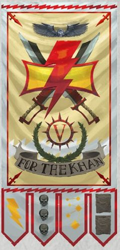

<!-- A0355-B0235 -->

原译文

Great Khan Jubal Khan 大汗朱巴可汗

**校订译文**

Great Khan Jubal Khan 大汗朱巴可汗

<!-- /A0355-B0235 -->

<!-- A0355-B0236 -->

原译文

Keshig 怯薛

**校订译文**

Keshig 怯薛

<!-- /A0355-B0236 -->

<!-- A0355-B0237 -->

原译文

Chapter Ancient 战团旗手

**校订译文**

Chapter Ancient 战团旗手

<!-- /A0355-B0237 -->

<!-- A0355-B0238 -->

原译文

Chapter Champion 战团冠军

**校订译文**

Chapter Champion 战团冠军

<!-- /A0355-B0238 -->

<!-- A0355-B0239 -->

原译文

Equerries and Servitors 仆役和机仆

**校订译文**

Equerries and Servitors 近侍与机仆

<!-- /A0355-B0239 -->

<!-- A0355-B0240 -->
### Armoury 军械库

<!-- /A0355-B0240 -->

<!-- A0355-B0241 图片 -->

<!-- A0355-B0242 -->

原译文

Master of the Forge Khamkar 铸造之主坎卡

**校订译文**

Master of the Forge Khamkar 铸造大师坎卡

<!-- /A0355-B0242 -->

<!-- A0355-B0243 -->

原译文

Techmarines 技术军士

**校订译文**

Techmarines 科技战士

<!-- /A0355-B0243 -->

<!-- A0355-B0244 -->

原译文

Servitors 机仆

**校订译文**

Servitors 机仆

<!-- /A0355-B0244 -->

<!-- A0355-B0245 -->

原译文

Transport Vehicles 运输载具

**校订译文**

Transport Vehicles 运输载具

<!-- /A0355-B0245 -->

<!-- A0355-B0246 -->

原译文

Battle Tanks 战斗坦克

**校订译文**

Battle Tanks 战斗坦克

<!-- /A0355-B0246 -->

<!-- A0355-B0247 -->

原译文

Gunships 炮艇

**校订译文**

Gunships 炮艇

<!-- /A0355-B0247 -->

<!-- A0355-B0248 -->

原译文

Light Attack Vehicles 轻型攻击载具

**校订译文**

Light Attack Vehicles 轻型攻击载具

<!-- /A0355-B0248 -->

<!-- A0355-B0249 -->

原译文

Centurion Warsuits 百夫长战甲

**校订译文**

Centurion Warsuits 百夫长战甲

<!-- /A0355-B0249 -->

<!-- A0355-B0250 -->
### Apothecarion 药剂部

<!-- /A0355-B0250 -->

<!-- A0355-B0251 图片 -->

<!-- A0355-B0252 -->

原译文

Chief Apothecary Ogholei 首席药剂师奥格莱

**校订译文**

Chief Apothecary Ogholei 首席药剂师奥格莱

<!-- /A0355-B0252 -->

<!-- A0355-B0253 -->

原译文

Apothecaries 药剂师

**校订译文**

Apothecaries 药剂师

<!-- /A0355-B0253 -->

<!-- A0355-B0254 -->
### Fleet Command 舰队指挥

<!-- /A0355-B0254 -->

<!-- A0355-B0255 -->
### Master of the Fleet 舰队大师

原题：Master of the Fleet 舰队之主

<!-- /A0355-B0255 -->

<!-- A0355-B0256 -->

原译文

Battle Barges 战斗驳船

**校订译文**

Battle Barges 战斗驳船

<!-- /A0355-B0256 -->

<!-- A0355-B0257 -->

原译文

Strike Cruisers 打击巡洋舰

**校订译文**

Strike Cruisers 打击巡洋舰

<!-- /A0355-B0257 -->

<!-- A0355-B0258 -->

原译文

Rapid Strike vessels 快速打击战舰

**校订译文**

Rapid Strike vessels 快速打击战舰

<!-- /A0355-B0258 -->

<!-- A0355-B0259 -->

原译文

Thunderhawk Gunships 雷鹰炮艇

**校订译文**

Thunderhawk Gunships 雷鹰炮艇

<!-- /A0355-B0259 -->

<!-- A0355-B0260 -->
### Librarius 智库

<!-- /A0355-B0260 -->

<!-- A0355-B0261 图片 -->

<!-- A0355-B0262 -->

原译文

Chief Stormseer Saghari 首席风暴先知萨哈里

**校订译文**

Chief Stormseer Saghari 首席风暴先知萨哈里

<!-- /A0355-B0262 -->

<!-- A0355-B0263 -->

原译文

Epistolaries 星域官

**校订译文**

Epistolaries 星语官

<!-- /A0355-B0263 -->

<!-- A0355-B0264 -->

原译文

Codiciers 典记员

**校订译文**

Codiciers 典记员

<!-- /A0355-B0264 -->

<!-- A0355-B0265 -->

原译文

Lexicania 编修员

**校订译文**

Lexicania 编修员

<!-- /A0355-B0265 -->

<!-- A0355-B0266 -->

原译文

Acolyta 侍僧

**校订译文**

Acolyta 侍僧

<!-- /A0355-B0266 -->

<!-- A0355-B0267 -->
### Chaplaincy 教士团

原题：Chaplaincy 隐修室

<!-- /A0355-B0267 -->

<!-- A0355-B0268 图片 -->

<!-- A0355-B0269 -->

原译文

Voice of the Storm Jaghorin 风暴之声贾格霍林

**校订译文**

Voice of the Storm Jaghorin 风暴之声贾格霍林

<!-- /A0355-B0269 -->

<!-- A0355-B0270 -->

原译文

Reclusiarch 隐修士

**校订译文**

Reclusiarch 隐修长

<!-- /A0355-B0270 -->

<!-- A0355-B0271 -->

原译文

Chaplains 牧师

**校订译文**

Chaplains 教士

<!-- /A0355-B0271 -->

<!-- A0355-B0272 -->

原译文

Judiciars 裁决士

**校订译文**

Judiciars 裁决者

<!-- /A0355-B0272 -->

<!-- A0355-B0273 -->
### Companies 连队

<!-- /A0355-B0273 -->

<!-- A0355-B0274 -->
### Veteran Company 老兵连队

<!-- /A0355-B0274 -->

<!-- A0355-B0275 -->

原译文

1st Brotherhood 第一兄弟会

**校订译文**

1st Brotherhood 第一兄弟会

<!-- /A0355-B0275 -->

<!-- A0355-B0276 图片 -->

<!-- A0355-B0277 -->

原译文

Spearpoint Brotherhood 矛头兄弟会

**校订译文**

Spearpoint Brotherhood 矛头兄弟会

<!-- /A0355-B0277 -->

<!-- A0355-B0278 -->
### First Captain Suboden Khan 第一连长苏博登可汗

<!-- /A0355-B0278 -->

<!-- A0355-B0279 -->

原译文

Master of the War Council 战争议会之主

**校订译文**

Master of the War Council 战争议会之主

<!-- /A0355-B0279 -->

<!-- A0355-B0280 -->

原译文

2 Lieutenants 2名副官

**校订译文**

2 Lieutenants 2名副官

<!-- /A0355-B0280 -->

<!-- A0355-B0281 -->

原译文

Company Ancient 连队旗手

**校订译文**

Company Ancient 连队旗手

<!-- /A0355-B0281 -->

<!-- A0355-B0282 -->

原译文

Company Champion 连队冠军

**校订译文**

Company Champion 连队冠军

<!-- /A0355-B0282 -->

<!-- A0355-B0283 -->

原译文

Company Veterans 连队老兵

**校订译文**

Company Veterans 连队老兵

<!-- /A0355-B0283 -->

<!-- A0355-B0284 -->

原译文

10 Veteran/Terminator Squads 10个老兵/终结者小队

**校订译文**

10 Veteran/Terminator Squads 10个老兵/终结者小队

<!-- /A0355-B0284 -->

<!-- A0355-B0285 -->

原译文

Dreadnoughts 无畏

**校订译文**

Dreadnoughts 无畏

<!-- /A0355-B0285 -->

<!-- A0355-B0286 -->

原译文

Transport Vehicles 运输载具

**校订译文**

Transport Vehicles 运输载具

<!-- /A0355-B0286 -->

<!-- A0355-B0287 -->

原译文

Land Raiders 兰德掠袭者

**校订译文**

Land Raiders 兰德掠袭者战车

<!-- /A0355-B0287 -->

<!-- A0355-B0288 -->
### Battle Companies 战斗连队

<!-- /A0355-B0288 -->

<!-- A0355-B0289 -->

原译文

2nd Brotherhood 第二兄弟会

**校订译文**

2nd Brotherhood 第二兄弟会

<!-- /A0355-B0289 -->

<!-- A0355-B0290 图片 -->

<!-- A0355-B0291 -->

原译文

Firefist Brotherhood 火拳兄弟会

**校订译文**

Firefist Brotherhood 火拳兄弟会

<!-- /A0355-B0291 -->

<!-- A0355-B0292 -->
### Captain Barutai Khan 连长巴鲁泰可汗

<!-- /A0355-B0292 -->

<!-- A0355-B0293 -->

原译文

Master of Lore 传说大师

**校订译文**

Master of Lore 典故大师

<!-- /A0355-B0293 -->

<!-- A0355-B0294 -->

原译文

2 Lieutenants 2名副官

**校订译文**

2 Lieutenants 2名副官

<!-- /A0355-B0294 -->

<!-- A0355-B0295 -->

原译文

Company Ancient 连队旗手

**校订译文**

Company Ancient 连队旗手

<!-- /A0355-B0295 -->

<!-- A0355-B0296 -->

原译文

Company Champion Addah 连队冠军亚达

**校订译文**

Company Champion Addah 连队冠军亚达

<!-- /A0355-B0296 -->

<!-- A0355-B0297 -->

原译文

Company Veterans 连队老兵

**校订译文**

Company Veterans 连队老兵

<!-- /A0355-B0297 -->

<!-- A0355-B0298 -->

原译文

6 Battleline Squads 6个战线小队

**校订译文**

6 Battleline Squads 6个战线小队

<!-- /A0355-B0298 -->

<!-- A0355-B0299 -->

原译文

2 Close Support Squads 2个近战支援小队

**校订译文**

2 Close Support Squads 2个近战支援小队

<!-- /A0355-B0299 -->

<!-- A0355-B0300 -->

原译文

2 Fire Support Squads 2个火力支援小队

**校订译文**

2 Fire Support Squads 2个火力支援小队

<!-- /A0355-B0300 -->

<!-- A0355-B0301 -->

原译文

Bikes 摩托

**校订译文**

Bikes 摩托

<!-- /A0355-B0301 -->

<!-- A0355-B0302 -->

原译文

Land Speeders 兰德速攻艇

**校订译文**

Land Speeders 兰德速攻艇

<!-- /A0355-B0302 -->

<!-- A0355-B0303 -->

原译文

Dreadnoughts 无畏

**校订译文**

Dreadnoughts 无畏

<!-- /A0355-B0303 -->

<!-- A0355-B0304 -->

原译文

Transport Vehicles 运输载具

**校订译文**

Transport Vehicles 运输载具

<!-- /A0355-B0304 -->

<!-- A0355-B0305 -->

原译文

3rd Brotherhood 第三兄弟会

**校订译文**

3rd Brotherhood 第三兄弟会

<!-- /A0355-B0305 -->

<!-- A0355-B0306 图片 -->

<!-- A0355-B0307 -->

原译文

Eagle Brotherhood 雄鹰兄弟会

**校订译文**

Eagle Brotherhood 雄鹰兄弟会

<!-- /A0355-B0307 -->

<!-- A0355-B0308 -->
### Captain Kor'sarro Khan 连长科萨罗可汗

原题：Captain Kor'sarro Khan 连长阔萨罗可汗

<!-- /A0355-B0308 -->

<!-- A0355-B0309 -->

原译文

Master of the Hunt 狩猎大师

**校订译文**

Master of the Hunt 狩猎大师

<!-- /A0355-B0309 -->

<!-- A0355-B0310 -->

原译文

2 Lieutenants 2名副官

**校订译文**

2 Lieutenants 2名副官

<!-- /A0355-B0310 -->

<!-- A0355-B0311 -->

原译文

Company Ancient 连队旗手

**校订译文**

Company Ancient 连队旗手

<!-- /A0355-B0311 -->

<!-- A0355-B0312 -->

原译文

Company Champion 连队冠军

**校订译文**

Company Champion 连队冠军

<!-- /A0355-B0312 -->

<!-- A0355-B0313 -->

原译文

Company Veterans 连队老兵

**校订译文**

Company Veterans 连队老兵

<!-- /A0355-B0313 -->

<!-- A0355-B0314 -->

原译文

6 Battleline Squads 6个战线小队

**校订译文**

6 Battleline Squads 6个战线小队

<!-- /A0355-B0314 -->

<!-- A0355-B0315 -->

原译文

2 Close Support Squads 2个近战支援小队

**校订译文**

2 Close Support Squads 2个近战支援小队

<!-- /A0355-B0315 -->

<!-- A0355-B0316 -->

原译文

2 Fire Support Squads 2个火力支援小队

**校订译文**

2 Fire Support Squads 2个火力支援小队

<!-- /A0355-B0316 -->

<!-- A0355-B0317 -->

原译文

Bikes 摩托

**校订译文**

Bikes 摩托

<!-- /A0355-B0317 -->

<!-- A0355-B0318 -->

原译文

Land Speeders 兰德速攻艇

**校订译文**

Land Speeders 兰德速攻艇

<!-- /A0355-B0318 -->

<!-- A0355-B0319 -->

原译文

Dreadnoughts 无畏

**校订译文**

Dreadnoughts 无畏

<!-- /A0355-B0319 -->

<!-- A0355-B0320 -->

原译文

Transport Vehicles 运输载具

**校订译文**

Transport Vehicles 运输载具

<!-- /A0355-B0320 -->

<!-- A0355-B0321 -->

原译文

4th Brotherhood 第四兄弟会

**校订译文**

4th Brotherhood 第四兄弟会

<!-- /A0355-B0321 -->

<!-- A0355-B0322 图片 -->

<!-- A0355-B0323 -->

原译文

Tulwar Brotherhood 弯刀兄弟会

**校订译文**

Tulwar Brotherhood 弯刀兄弟会

<!-- /A0355-B0323 -->

<!-- A0355-B0324 -->
### Captain Joghaten Khan 连长乔格滕可汗

<!-- /A0355-B0324 -->

<!-- A0355-B0325 -->

原译文

Master of Blades 剑刃大师

**校订译文**

Master of Blades 剑刃大师

<!-- /A0355-B0325 -->

<!-- A0355-B0326 -->

原译文

2 Lieutenants 2名副官

**校订译文**

2 Lieutenants 2名副官

<!-- /A0355-B0326 -->

<!-- A0355-B0327 -->

原译文

Company Ancient 连队旗手

**校订译文**

Company Ancient 连队旗手

<!-- /A0355-B0327 -->

<!-- A0355-B0328 -->

原译文

Company Champion 连队冠军

**校订译文**

Company Champion 连队冠军

<!-- /A0355-B0328 -->

<!-- A0355-B0329 -->

原译文

Company Veterans 连队老兵

**校订译文**

Company Veterans 连队老兵

<!-- /A0355-B0329 -->

<!-- A0355-B0330 -->

原译文

6 Battleline Squads 6个战线小队

**校订译文**

6 Battleline Squads 6个战线小队

<!-- /A0355-B0330 -->

<!-- A0355-B0331 -->

原译文

2 Close Support Squads 2个近战支援小队

**校订译文**

2 Close Support Squads 2个近战支援小队

<!-- /A0355-B0331 -->

<!-- A0355-B0332 -->

原译文

2 Fire Support Squads 2个火力支援小队

**校订译文**

2 Fire Support Squads 2个火力支援小队

<!-- /A0355-B0332 -->

<!-- A0355-B0333 -->

原译文

Bikes 摩托

**校订译文**

Bikes 摩托

<!-- /A0355-B0333 -->

<!-- A0355-B0334 -->

原译文

Land Speeders 兰德速攻艇

**校订译文**

Land Speeders 兰德速攻艇

<!-- /A0355-B0334 -->

<!-- A0355-B0335 -->

原译文

Dreadnoughts 无畏

**校订译文**

Dreadnoughts 无畏

<!-- /A0355-B0335 -->

<!-- A0355-B0336 -->

原译文

Transport Vehicles 运输载具

**校订译文**

Transport Vehicles 运输载具

<!-- /A0355-B0336 -->

<!-- A0355-B0337 -->

原译文

5th Brotherhood 第五兄弟会

**校订译文**

5th Brotherhood 第五兄弟会

<!-- /A0355-B0337 -->

<!-- A0355-B0338 图片 -->

<!-- A0355-B0339 -->

原译文

Stormwrath Brotherhood 风暴之怒兄弟会

**校订译文**

Stormwrath Brotherhood 风暴之怒兄弟会

<!-- /A0355-B0339 -->

<!-- A0355-B0340 -->
### Captain Hibogen Khan 连长希伯根可汗

<!-- /A0355-B0340 -->

<!-- A0355-B0341 -->

原译文

Master of Spirits 精神之主

**校订译文**

Master of Spirits 灵魂大师

**校注：** Master of Spirits 暂译“灵魂大师”，为白疤连长兼任的传统头衔；原“精神之主”另留对照，未查得官方译名。

<!-- /A0355-B0341 -->

<!-- A0355-B0342 -->

原译文

2 Lieutenants 2名副官

**校订译文**

2 Lieutenants 2名副官

<!-- /A0355-B0342 -->

<!-- A0355-B0343 -->

原译文

Company Ancient 连队旗手

**校订译文**

Company Ancient 连队旗手

<!-- /A0355-B0343 -->

<!-- A0355-B0344 -->

原译文

Company Champion 连队冠军

**校订译文**

Company Champion 连队冠军

<!-- /A0355-B0344 -->

<!-- A0355-B0345 -->

原译文

Company Veterans 连队老兵

**校订译文**

Company Veterans 连队老兵

<!-- /A0355-B0345 -->

<!-- A0355-B0346 -->

原译文

6 Battleline Squads 6个战线小队

**校订译文**

6 Battleline Squads 6个战线小队

<!-- /A0355-B0346 -->

<!-- A0355-B0347 -->

原译文

2 Close Support Squads 2个近战支援小队

**校订译文**

2 Close Support Squads 2个近战支援小队

<!-- /A0355-B0347 -->

<!-- A0355-B0348 -->

原译文

2 Fire Support Squads 2个火力支援小队

**校订译文**

2 Fire Support Squads 2个火力支援小队

<!-- /A0355-B0348 -->

<!-- A0355-B0349 -->

原译文

Bikes 摩托

**校订译文**

Bikes 摩托

<!-- /A0355-B0349 -->

<!-- A0355-B0350 -->

原译文

Land Speeders 兰德速攻艇

**校订译文**

Land Speeders 兰德速攻艇

<!-- /A0355-B0350 -->

<!-- A0355-B0351 -->

原译文

Dreadnoughts 无畏

**校订译文**

Dreadnoughts 无畏

<!-- /A0355-B0351 -->

<!-- A0355-B0352 -->

原译文

Transport Vehicles 运输载具

**校订译文**

Transport Vehicles 运输载具

<!-- /A0355-B0352 -->

<!-- A0355-B0353 -->
### Reserve Companies 预备连队

<!-- /A0355-B0353 -->

<!-- A0355-B0354 -->

原译文

6th Brotherhood 第六兄弟会

**校订译文**

6th Brotherhood 第六兄弟会

<!-- /A0355-B0354 -->

<!-- A0355-B0355 图片 -->

<!-- A0355-B0356 -->

原译文

Hawkseye Brotherhood 鹰眼兄弟会

**校订译文**

Hawkseye Brotherhood 鹰眼兄弟会

<!-- /A0355-B0356 -->

<!-- A0355-B0357 -->
### Captain Ochir Khan 连长奥其尔可汗

<!-- /A0355-B0357 -->

<!-- A0355-B0358 -->

原译文

Master of Shields 盾牌大师

**校订译文**

Master of Shields 盾牌大师

<!-- /A0355-B0358 -->

<!-- A0355-B0359 -->

原译文

2 Lieutenants 2名副官

**校订译文**

2 Lieutenants 2名副官

<!-- /A0355-B0359 -->

<!-- A0355-B0360 -->

原译文

Company Ancient 连队旗手

**校订译文**

Company Ancient 连队旗手

<!-- /A0355-B0360 -->

<!-- A0355-B0361 -->

原译文

Company Champion 连队冠军

**校订译文**

Company Champion 连队冠军

<!-- /A0355-B0361 -->

<!-- A0355-B0362 -->

原译文

Company Veterans 连队老兵

**校订译文**

Company Veterans 连队老兵

<!-- /A0355-B0362 -->

<!-- A0355-B0363 -->

原译文

10 Battleline Squads 10个战线小队

**校订译文**

10 Battleline Squads 10个战线小队

<!-- /A0355-B0363 -->

<!-- A0355-B0364 -->

原译文

Battle Tanks 战斗坦克

**校订译文**

Battle Tanks 战斗坦克

<!-- /A0355-B0364 -->

<!-- A0355-B0365 -->

原译文

Dreadnoughts 无畏

**校订译文**

Dreadnoughts 无畏

<!-- /A0355-B0365 -->

<!-- A0355-B0366 -->

原译文

Transport Vehicles 运输载具

**校订译文**

Transport Vehicles 运输载具

<!-- /A0355-B0366 -->

<!-- A0355-B0367 -->

原译文

7th Brotherhood 第七兄弟会

**校订译文**

7th Brotherhood 第七兄弟会

<!-- /A0355-B0367 -->

<!-- A0355-B0368 图片 -->

<!-- A0355-B0369 -->

原译文

Plainstalker Brotherhood 平原追猎者兄弟会

**校订译文**

Plainstalker Brotherhood 平原追猎者兄弟会

<!-- /A0355-B0369 -->

<!-- A0355-B0370 -->
### Captain Olujin Khan 连长奥卢金可汗

原题：Captain Olujin Khan 连长 奥卢金可汗

<!-- /A0355-B0370 -->

<!-- A0355-B0371 -->

原译文

Master of the Watch 守望大师

**校订译文**

Master of the Watch 守望堡主

<!-- /A0355-B0371 -->

<!-- A0355-B0372 -->

原译文

2 Lieutenants 2名副官

**校订译文**

2 Lieutenants 2名副官

<!-- /A0355-B0372 -->

<!-- A0355-B0373 -->

原译文

Company Ancient 连队旗手

**校订译文**

Company Ancient 连队旗手

<!-- /A0355-B0373 -->

<!-- A0355-B0374 -->

原译文

Company Champion 连队冠军

**校订译文**

Company Champion 连队冠军

<!-- /A0355-B0374 -->

<!-- A0355-B0375 -->

原译文

Company Veterans 连队老兵

**校订译文**

Company Veterans 连队老兵

<!-- /A0355-B0375 -->

<!-- A0355-B0376 -->

原译文

10 Battleline Squads 10个战线小队

**校订译文**

10 Battleline Squads 10个战线小队

<!-- /A0355-B0376 -->

<!-- A0355-B0377 -->

原译文

Land Speeders 兰德速攻艇

**校订译文**

Land Speeders 兰德速攻艇

<!-- /A0355-B0377 -->

<!-- A0355-B0378 -->

原译文

Dreadnoughts 无畏

**校订译文**

Dreadnoughts 无畏

<!-- /A0355-B0378 -->

<!-- A0355-B0379 -->

原译文

Transport Vehicles 运输载具

**校订译文**

Transport Vehicles 运输载具

<!-- /A0355-B0379 -->

<!-- A0355-B0380 -->

原译文

Gunships 炮艇

**校订译文**

Gunships 炮艇

<!-- /A0355-B0380 -->

<!-- A0355-B0381 -->

原译文

8th Brotherhood 第八兄弟会

**校订译文**

8th Brotherhood 第八兄弟会

<!-- /A0355-B0381 -->

<!-- A0355-B0382 图片 -->

<!-- A0355-B0383 -->

原译文

Bloodrider Brotherhood 血骑兄弟会

**校订译文**

Bloodrider Brotherhood 血骑兄弟会

<!-- /A0355-B0383 -->

<!-- A0355-B0384 -->
### Captain Vorgha Khan 连长沃格哈可汗

<!-- /A0355-B0384 -->

<!-- A0355-B0385 -->

原译文

Master of Steeds 骏马之主

**校订译文**

Master of Steeds 骏马之主

<!-- /A0355-B0385 -->

<!-- A0355-B0386 -->

原译文

2 Lieutenants 2名副官

**校订译文**

2 Lieutenants 2名副官

<!-- /A0355-B0386 -->

<!-- A0355-B0387 -->

原译文

Company Ancient 连队旗手

**校订译文**

Company Ancient 连队旗手

<!-- /A0355-B0387 -->

<!-- A0355-B0388 -->

原译文

Company Champion 连队冠军

**校订译文**

Company Champion 连队冠军

<!-- /A0355-B0388 -->

<!-- A0355-B0389 -->

原译文

Company Veterans 连队老兵

**校订译文**

Company Veterans 连队老兵

<!-- /A0355-B0389 -->

<!-- A0355-B0390 -->

原译文

10 Close Support Squads 10个近战支援小队

**校订译文**

10 Close Support Squads 10个近战支援小队

<!-- /A0355-B0390 -->

<!-- A0355-B0391 -->

原译文

Bikes 摩托

**校订译文**

Bikes 摩托

<!-- /A0355-B0391 -->

<!-- A0355-B0392 -->

原译文

Dreadnoughts 无畏

**校订译文**

Dreadnoughts 无畏

<!-- /A0355-B0392 -->

<!-- A0355-B0393 -->

原译文

Transport Vehicles 运输载具

**校订译文**

Transport Vehicles 运输载具

<!-- /A0355-B0393 -->

<!-- A0355-B0394 -->

原译文

9th Brotherhood 第九兄弟会

**校订译文**

9th Brotherhood 第九兄弟会

<!-- /A0355-B0394 -->

<!-- A0355-B0395 图片 -->

<!-- A0355-B0396 -->

原译文

Stormbolt Brotherhood 风暴雷电兄弟会

**校订译文**

Stormbolt Brotherhood 风暴雷电兄弟会

<!-- /A0355-B0396 -->

<!-- A0355-B0397 -->
### Captain Khadajei Khan 连长哈达杰可汗

<!-- /A0355-B0397 -->

<!-- A0355-B0398 -->

原译文

Master of Bows 弓箭大师

**校订译文**

Master of Bows 弓箭大师

<!-- /A0355-B0398 -->

<!-- A0355-B0399 -->

原译文

2 Lieutenants 2名副官

**校订译文**

2 Lieutenants 2名副官

<!-- /A0355-B0399 -->

<!-- A0355-B0400 -->

原译文

Company Ancient 连队旗手

**校订译文**

Company Ancient 连队旗手

<!-- /A0355-B0400 -->

<!-- A0355-B0401 -->

原译文

Company Champion 连队冠军

**校订译文**

Company Champion 连队冠军

<!-- /A0355-B0401 -->

<!-- A0355-B0402 -->

原译文

Company Veterans 连队老兵

**校订译文**

Company Veterans 连队老兵

<!-- /A0355-B0402 -->

<!-- A0355-B0403 -->

原译文

10 Fire Support Squads 10个火力支援小队

**校订译文**

10 Fire Support Squads 10个火力支援小队

<!-- /A0355-B0403 -->

<!-- A0355-B0404 -->

原译文

Dreadnoughts 无畏

**校订译文**

Dreadnoughts 无畏

<!-- /A0355-B0404 -->

<!-- A0355-B0405 -->

原译文

Transport Vehicles 运输载具

**校订译文**

Transport Vehicles 运输载具

<!-- /A0355-B0405 -->

<!-- A0355-B0406 -->
### Scout Company 侦察连

原题：Scout Company 支援连队

<!-- /A0355-B0406 -->

<!-- A0355-B0407 -->

原译文

10th Brotherhood 第十兄弟会

**校订译文**

10th Brotherhood 第十兄弟会

<!-- /A0355-B0407 -->

<!-- A0355-B0408 -->
### Windspeaker Brotherhood 风语者兄弟会

<!-- /A0355-B0408 -->

<!-- A0355-B0409 -->
### Captain Jodagha Khan 连长乔达哈可汗

<!-- /A0355-B0409 -->

<!-- A0355-B0410 -->

原译文

Master of Braves 勇士大师

**校订译文**

Master of Braves 勇士大师

<!-- /A0355-B0410 -->

<!-- A0355-B0411 -->

原译文

2 Lieutenants 2名副官

**校订译文**

2 Lieutenants 2名副官

<!-- /A0355-B0411 -->

<!-- A0355-B0412 -->

原译文

Company Ancient 连队旗手

**校订译文**

Company Ancient 连队旗手

<!-- /A0355-B0412 -->

<!-- A0355-B0413 -->

原译文

Company Champion 连队冠军

**校订译文**

Company Champion 连队冠军

<!-- /A0355-B0413 -->

<!-- A0355-B0414 -->

原译文

Company Veterans 连队老兵

**校订译文**

Company Veterans 连队老兵

<!-- /A0355-B0414 -->

<!-- A0355-B0415 -->

原译文

Scout Squads 侦察小队

**校订译文**

Scout Squads 侦察小队

<!-- /A0355-B0415 -->

<!-- A0355-B0416 -->

原译文

10 Vanguard Squads 10个先锋小队

**校订译文**

10 Vanguard Squads 10个先锋小队

<!-- /A0355-B0416 -->

<!-- A0355-B0417 -->

原译文

Scout Bikes 侦查摩托

**校订译文**

Scout Bikes 侦察摩托

<!-- /A0355-B0417 -->

<!-- A0355-B0418 -->

原译文

Land Speeders 兰德速攻艇

**校订译文**

Land Speeders 兰德速攻艇

<!-- /A0355-B0418 -->

<!-- A0355-B0419 -->

原译文

Transport Vehicles 运输载具

**校订译文**

Transport Vehicles 运输载具

<!-- /A0355-B0419 -->

<!-- A0355-B0420 -->
## Recruitment 招募

<!-- /A0355-B0420 -->

<!-- A0355-B0421 -->
**英文原文**

The White Scars recruit solely from Chogoris, feeling it is important to maintain a Chogorian perspective within their Chapter in order to retain its true nature. Stormseers regularly ride out into the plains to observe Chogrian tribes at war and look for suitable candidates for the Chapter. Those that are deemed suitable in not only skill at arms but also in cunning, mind, and stoicism are taken back to the Quan Zhou and undergo many tests of great secrecy. All that is known is that the trials are brutal which push the Aspirants to the limits both physically and spiritually. Reported tests include reciting all 893 stanzas of the Battle of Kur and Huanglok; plunging into the icy depths of the Tovg ocean and returning with the horn of a mighty Oryavar whale; and crossing the Kherbal Flats in the summer and the winter.

<!-- /A0355-B0421 -->

<!-- A0355-B0422 -->

原译文

白色疤痕只从巧高里斯招募成员，他们认为在他们的战团中保持巧高里斯的视角很重要，以保持其真实性质。风暴先知定期骑马前往平原，观察处于战争中的巧高里斯部落，并为战团寻找合适的候选人。那些不仅在武器技能上，而且在狡猾、头脑和坚忍方面都被认为合适的人会被带回泉州，并接受许多严格的秘密测试。众所周知，这些考验是残酷的，将有志者推向了身体和精神的极限。报告的测试包括背诵库尔和黄洛克之战的所有893节；潜入托夫格冰冷的海洋深处，带着一头巨大的大羚羊的角回来；在夏季和冬季穿越赫尔巴尔平原。

**校订译文**

白疤只从乔高里斯征募新兵，因为他们认为，唯有在战团内部保留乔高里斯人的思想与视角，才能保持自身本色。风暴先知定期驰入平原，观察各部落的战斗，为战团物色候选者。他们不仅看重武艺，也考察机敏、心智与坚忍。合适的年轻人会被带回泉州，接受一系列严格保密的考验。外界只知道这些试炼极为残酷，会将候选者的身体与精神逼至极限。据说，试炼包括背诵《库尔与黄洛克之战》的全部八百九十三节诗文、潜入托夫格海冰冷的深处带回一头巨大奥里亚瓦鲸的角，以及分别在夏季和冬季横穿赫尔巴尔平原。

**校注：** Oryavar whale 是巨鲸专名，暂译“奥里亚瓦鲸”，原译“大羚羊”错认了物种。

<!-- /A0355-B0422 -->

<!-- A0355-B0423 -->
**英文原文**

Those who are successful in passing the trials must then chose an honour name. Some choose to replace their birth name with this, others choose to use it as a kind of surname or epithet. A key component of this practice is the element of choice, with the young Space Marines studying the history and legends of their Chapter to find a suitable name. It is not unheard of for some aspirants to fight (usually non-lethal) honour duels with each other if they choose the same name.

<!-- /A0355-B0423 -->

<!-- A0355-B0424 -->

原译文

那些成功通过试炼的人必须选择一个荣誉的名字。有些人选择用这个名字代替他们的出生名字，另一些人选择用它作为一种姓氏或绰号。这种做法的一个关键组成部分是选择的元素，年轻的星际战士研究他们战团的历史和传说，以找到一个合适的名字。如果一些有志者选择相同的名字，他们会进行（通常是非致命的）荣誉决斗，这并非闻所未闻。

**校订译文**

通过试炼后，候选者必须自行选择一个荣誉之名。有些人以此取代出生时的名字，另一些则将它用作姓氏或称号。自由选择是这一传统的关键：年轻的星际战士会研习战团的历史与传说，寻找适合自己的名字。如果两名候选者选中同一个名字，也可能为此进行荣誉决斗，通常不会取对方性命。

<!-- /A0355-B0424 -->

<!-- A0355-B0425 -->
## Culture 文化

<!-- /A0355-B0425 -->

<!-- A0355-B0426 -->
**英文原文**

Despite their reputation as savages, the White Scars are an extremely cultured chapter that emphasizes art, poetry, stoicism, philosophy, and self-reflection in its warriors. Members of the Chapter are expected to be well-versed in the linguistic, historical, and artistic history of Chogoris. Other "noble pursuits" of Battle-Brothers include calligraphy, hunting, story-telling, wine-making, archery, horse-taming, throat singing, astrology, painting, crafting, weaving, and mastery of the difficult Chogorian language. This is mixed with more seemingly primitive practices, such as ritual scarring which marks the loyalty and brotherhood of a Space Marine. The ritual scarring mimics that of the tribes of Chogoris, and is carried out with the same ritual Jaalod'ag daggers. Once the chosen shape has been cut, ash is used to raise the tissue and whiten the reside ridge, creating the "white scar" that gives the Chapter its name.

<!-- /A0355-B0426 -->

<!-- A0355-B0427 -->

原译文

尽管他们被称为野蛮人，但白色伤疤是一个非常有文化的战团，强调艺术、诗歌、禁欲主义、哲学和战士的自我反思。战团成员应精通巧高里斯的语言、历史和艺术史。战斗兄弟的其他“崇高追求”包括书法、狩猎、讲故事、酿酒、射箭、驯马、喉歌、占星术、绘画、手工艺、编织和掌握困难的巧高里斯语。这与更为原始的做法相结合，例如象征星际战士忠诚和兄弟情谊的仪式疤痕。仪式上的疤痕模仿了巧高里斯部落的疤痕，并使用相同的仪式贾洛’德匕首进行。一旦选定的形状被切割，灰烬就被用来增加组织并使驻留脊变白，从而形成“白色疤痕”，这就是战团的名字。

**校订译文**

白疤虽被视为野蛮人，却是一个文化修养极深的战团，重视艺术、诗歌、坚忍自持、哲学与自省。战团成员必须熟悉乔高里斯的语言、历史及艺术传承。战斗弟兄的其他“高雅志趣”还包括书法、狩猎、讲述故事、酿酒、射箭、驯马、喉歌、占星、绘画、制作工艺品、编织，以及精通复杂的乔高里斯语。这些修养与看似原始的习俗并存，例如象征星际战士忠诚与兄弟情谊的刻疤仪式。白疤仿效乔高里斯部族的做法，使用同样的贾洛’德仪式匕首刻下伤痕。割出选定的图案后，再敷上灰烬，使愈合后的疤痕组织隆起、变白，形成战团名称所指的“白疤”。

**校注：** stoicism 在列举战士修养的语境中指坚忍、自我克制，原“禁欲主义”偏离上下文。

<!-- /A0355-B0427 -->

<!-- A0355-B0428 -->
**英文原文**

Members of the Chapter often decorate their armor with symbols that are near-indecipherable to outsiders but represent battles, years of service, number of kills, Chogorian mythology, oaths, memories, battlefield roles, philosophical concepts, and more.

<!-- /A0355-B0428 -->

<!-- A0355-B0429 -->

原译文

战团成员经常用外人几乎无法理解的符号装饰他们的盔甲，但这些符号代表了战斗、服役年限、杀戮次数、巧高里斯神话、誓言、记忆、战场角色、哲学概念等等。

**校订译文**

战团成员常在盔甲上绘制外人几乎无法解读的符号，用以记载战斗、服役年限、杀敌数、乔高里斯神话、誓言、回忆、战场职责、哲学观念等内容。

<!-- /A0355-B0429 -->

<!-- A0355-B0430 -->
**英文原文**

The symbol of the White Scars is a red lightning bolt upon a white plain, which true to the Chapters culture has a variety of meanings. The lightning bolt represents the swift and furious nature of the Chapter at war. The gold bar it sits upon represents preciousness, while the white border represents freedom. The symbols concave sides and ends represent the fact that others will always attempt to impinge upon their freedom, and one should be ready to fight for it. The redness of the lightning bolt represents the blood that must be spilled in this fight. Other notable symbols within the White Scars is the Ulzi, a knotwork of representing what Chogorians call the Eternal Labyrinth. The Moderg'haan is the Tree of Knowledge, representing how the smallest enquiry can lead to great knowledge. The Daeleivot is the Ocean of the Grasslands, representing the enormous plains of Chogoris and freedom.

<!-- /A0355-B0430 -->

<!-- A0355-B0431 -->

原译文

白色疤痕的象征是白色平原上的红色闪电，这对战团文化来说有着多种含义。闪电代表了战团在战争中的敏捷和狂暴。它所坐的金条代表珍贵，而白色边框代表自由。凹形侧面和末端的符号代表了这样一个事实，即其他人总是试图侵犯他们的自由，一个人应该准备好为之而战。闪电的红色代表了这场斗争中必须洒下的鲜血。白色伤疤中的其他著名符号是乌尔奇，这是一个代表巧高里斯所说的永恒迷宫的结。莫德’汉是知识之树，代表了最小的探究如何带来伟大的知识。戴尔莱沃特是草原之海，代表着巧高里斯和自由的巨大平原。

**校订译文**

白疤的徽记是白底上的一道红色闪电，与战团文化一样，蕴含多重含义。闪电象征他们作战时的迅捷与猛烈；闪电所叠加的金色横条象征珍贵之物，白色边框则象征自由。图案两侧与末端的凹陷意味着：总有人试图侵犯他们的自由，因此必须时刻准备为自由而战。闪电的红色，便是这场抗争中必须洒下的鲜血。其他重要符号包括“乌尔奇”——一种绳结纹样，代表乔高里斯人所说的“永恒迷宫”；“莫德’汉”，即知识之树，象征微小的探问也能引出浩瀚的知识；以及“戴尔莱沃特”，即草原之海，象征乔高里斯无垠的平原与自由。

<!-- /A0355-B0431 -->

<!-- A0355-B0432 -->
**英文原文**

The White Scars also consider it important to retain links with their successors. This is reflected in the tradition known as the Rite of Blooding, whereby once a cycle, champions from the various Successor Chapters come together to duel. The winner will join the White Scars for a full cycle to learn from the Founders before returning to their home chapter. The current holder of this position is Thursk of the Dark Hunters, who fought with Kor'sarro Khan on Agrellan.

<!-- /A0355-B0432 -->

<!-- A0355-B0433 -->

原译文

白色疤痕也认为与子战团保持联系很重要。这反映在被称为鲜血仪式的传统中，在这个传统中，每个周期，来自各个子战团的冠军都会聚集在一起决斗。获胜者将加入白色疤痕，在返回他们的家乡之前，向创始人学习一个完整的周期。目前担任这一职位的是黑暗猎手的瑟斯克，他在阿格瑞兰与阔萨罗可汗一起作战。

**校订译文**

白疤也十分重视与子战团保持联系。“鲜血仪式”便体现了这一传统：每隔一个周期，各子战团的冠军便会聚集决斗。胜者加入白疤，留驻整整一个周期，向自己的母团学习，然后再返回本团。现任获胜者是黑暗猎手的瑟斯克，曾在阿格瑞兰与科萨罗可汗并肩作战。

**校注：** Rite of Blooding 是子战团冠军交流仪式，沿用“鲜血仪式”；区别 B0053 The Blooding 军团集结刻疤仪式。cycle 原文未限定时长，不擅自换算成年。

<!-- /A0355-B0433 -->

<!-- A0355-B0434 -->
## Gene-Seed 基因种子

<!-- /A0355-B0434 -->

<!-- A0355-B0435 -->
**英文原文**

Overall the Gene-Seed of the White Scars is stable and initially displays no aberrations or mutations. However since the introduction of genetic material from the steppe tribesmen of Chogoris, the genome seems to have inherited their wild savagery and thirst for war. Despite all the teachings of the Khans and Stormseers, it is not unheard of for tribal feuds to flare up between Battle-Brothers. In addition, there are several instances where White Scars forces have gone on bloody rampages beyond their mission parameters, such as the infamous "Red Highway Massacre". However, it is not conclusive is if this is an inherent trait of White Scars gene-seed or came about after the integration of Chogorians.

<!-- /A0355-B0435 -->

<!-- A0355-B0436 -->

原译文

总的来说，白色疤痕的基因种子是稳定的，最初没有出现异常或突变。然而，自从巧高里斯草原部落的遗传物质被引入以来，基因组似乎继承了他们的野性和对战争的渴望。尽管有可汗和风暴先知的教导，但战斗兄弟之间爆发部落争斗并非闻所未闻。此外，还有几起白色伤疤部队超出其任务范围进行血腥暴行的事件，如臭名昭著的“红色公路大屠杀”。然而，目前还不能确定这是白色疤痕基因种子的固有特征，还是在巧高里斯融合后产生的。

**校订译文**

总体而言，白疤的基因种子稳定，最初并未表现出异常或突变。但在吸收乔高里斯草原部族的遗传物质之后，其基因组似乎也继承了部族的剽悍天性与好战欲望。尽管可汗与风暴先知不断教导约束，战斗弟兄之间仍偶有旧日部落仇怨复燃的情况。此外，白疤也曾数次超出任务要求，发动血腥屠戮，臭名昭著的“红色公路大屠杀”便是一例。不过，这究竟是白疤基因种子的固有特征，还是在纳入乔高里斯人后才出现的倾向，尚无定论。

<!-- /A0355-B0436 -->

<!-- A0355-B0437 图片 -->
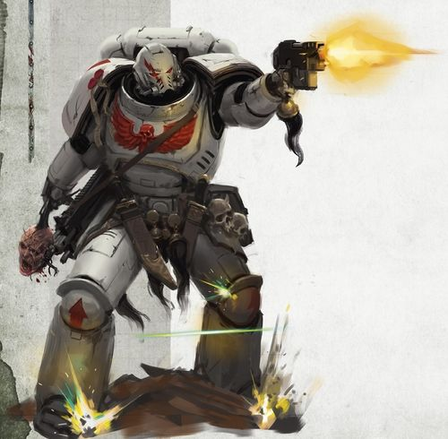

<!-- A0355-B0438 -->

原译文

White Scars Primaris Space Marine 白色疤痕原铸星际战士

**校订译文**

White Scars Primaris Space Marine 白疤原铸星际战士

<!-- /A0355-B0438 -->

<!-- A0355-B0439 -->
**英文原文**

White Scars successor chapters such as the Rampagers, Marauders, Destroyers, and Storm Lords are all equally ferocious and apt at the teachings of Jaghatai Khan.

<!-- /A0355-B0439 -->

<!-- A0355-B0440 -->

原译文

白色伤疤的子战团，如狂暴者、掠夺者、毁灭者和风暴领主，都同样凶猛，也都很符合察合台可汗的教义。

**校订译文**

白疤的子战团，如狂暴者、掠夺者、毁灭者与风暴领主，同样勇猛，也同样精通察合台可汗传下的战法。

<!-- /A0355-B0440 -->

<!-- A0355-B0441 -->
## Notable Chapter Elements 著名战团成员

<!-- /A0355-B0441 -->

<!-- A0355-B0442 -->
### White Scars Armoury 白疤军械库

原题：White Scars Armoury 白色疤痕军械库

<!-- /A0355-B0442 -->

<!-- A0355-B0443 -->
### Notable Vessels and Vehicles 著名战舰和载具

<!-- /A0355-B0443 -->

<!-- A0355-B0444 -->
**英文原文**

Swordstorm — Gloriana Class Battleship (Heresy-era).

<!-- /A0355-B0444 -->

<!-- A0355-B0445 -->

原译文

剑刃风暴号 — 荣光女王级战列舰（叛乱时期）

**校订译文**

剑刃风暴号 — 荣光女王级战列舰（叛乱时期）

<!-- /A0355-B0445 -->

<!-- A0355-B0446 -->
**英文原文**

Lance of Heaven - Battleship (Heresy-era).

<!-- /A0355-B0446 -->

<!-- A0355-B0447 -->

原译文

天堂之枪号 - 战列舰（叛乱时期）

**校订译文**

天堂之枪号 - 战列舰（叛乱时期）

<!-- /A0355-B0447 -->

<!-- A0355-B0448 -->
**英文原文**

Northwind - Strike Cruiser controlled by the 4th Brotherhood.

<!-- /A0355-B0448 -->

<!-- A0355-B0449 -->

原译文

北风号 - 第四兄弟会控制的打击巡洋舰

**校订译文**

北风号 - 第四兄弟会控制的打击巡洋舰

<!-- /A0355-B0449 -->

<!-- A0355-B0450 -->
### Notable White Scars 著名白疤

原题：Notable White Scars 著名白色疤痕

<!-- /A0355-B0450 -->

<!-- A0355-B0451 -->
### Heresy-era 叛乱时期

<!-- /A0355-B0451 -->

<!-- A0355-B0452 -->
**英文原文**

Jaghatai Khan — Primarch of the White Scars.

<!-- /A0355-B0452 -->

<!-- A0355-B0453 -->

原译文

察合台可汗 — 白色疤痕原体

**校订译文**

察合台可汗 — 白疤原体

<!-- /A0355-B0453 -->

<!-- A0355-B0454 -->
**英文原文**

Qin Xa — Master of the Keshig.

<!-- /A0355-B0454 -->

<!-- A0355-B0455 -->

原译文

秦夏 — 怯薛之主

**校订译文**

秦夏 — 怯薛之主

<!-- /A0355-B0455 -->

<!-- A0355-B0456 -->
**英文原文**

Targutai Yesugei — Chief Stormseer of the White Scars

<!-- /A0355-B0456 -->

<!-- A0355-B0457 -->

原译文

塔里忽台·也速该 — 白色疤痕首席风暴先知

**校订译文**

塔里忽台·也速该 — 白疤首席风暴先知

<!-- /A0355-B0457 -->

<!-- A0355-B0458 -->
**英文原文**

Hasik Noyan-Khan — Noyan-Khan of the Horde of the Stone.

<!-- /A0355-B0458 -->

<!-- A0355-B0459 -->

原译文

哈西克诺扬汗 — 岩石部落的诺扬汗

**校订译文**

哈西克诺扬汗 — 岩石部落的诺扬汗

<!-- /A0355-B0459 -->

<!-- A0355-B0460 -->
**英文原文**

Hibou Khan — Khan

<!-- /A0355-B0460 -->

<!-- A0355-B0461 -->

原译文

希布可汗 — 可汗

**校订译文**

希布可汗 — 可汗

<!-- /A0355-B0461 -->

<!-- A0355-B0462 -->
**英文原文**

Jubal Khan — Master of the Hunt

<!-- /A0355-B0462 -->

<!-- A0355-B0463 -->

原译文

朱巴可汗 — 狩猎大师

**校订译文**

朱巴可汗 — 狩猎大师

**校注：** 此处为荷鲁斯之乱时期的 Jubal Khan，后文同名大汗属现代时期；原文使用同一姓名，不据此认定为同一个人。

<!-- /A0355-B0463 -->

<!-- A0355-B0464 -->
**英文原文**

Shiban Khan — Khan of the Brotherhood of the Storm.

<!-- /A0355-B0464 -->

<!-- A0355-B0465 -->

原译文

昔班可汗 — 风暴兄弟会的可汗

**校订译文**

昔班可汗 — 风暴兄弟会的可汗

<!-- /A0355-B0465 -->

<!-- A0355-B0466 -->
**英文原文**

Torghun Khan — Khan of the Brotherhood of the Moon.

<!-- /A0355-B0466 -->

<!-- A0355-B0467 -->

原译文

托尔汉可汗 — 明月兄弟会的可汗

**校订译文**

托尔浑可汗——明月兄弟会的可汗。

<!-- /A0355-B0467 -->

<!-- A0355-B0468 -->
### Post-Heresy 叛乱后

<!-- /A0355-B0468 -->

<!-- A0355-B0469 -->
**英文原文**

Jubal Khan — Great Khan of the White Scars.

<!-- /A0355-B0469 -->

<!-- A0355-B0470 -->

原译文

朱巴可汗 — 白色疤痕大汗

**校订译文**

朱巴可汗 — 白疤大汗

<!-- /A0355-B0470 -->

<!-- A0355-B0471 -->
**英文原文**

Kor'sarro Khan — Captain of the White Scars 3rd Company, and Master of the Hunt.

<!-- /A0355-B0471 -->

<!-- A0355-B0472 -->

原译文

阔萨罗可汗 — 白色疤痕第三连队连长，兼狩猎大师

**校订译文**

科萨罗可汗 — 白疤第三连队连长，兼狩猎大师

<!-- /A0355-B0472 -->

<!-- A0355-B0473 -->
**英文原文**

Saghari - Chief Stormseer

<!-- /A0355-B0473 -->

<!-- A0355-B0474 -->

原译文

萨哈里 - 首席风暴先知

**校订译文**

萨哈里 - 首席风暴先知

<!-- /A0355-B0474 -->

<!-- A0355-B0475 -->
**英文原文**

Suboden Khan — Khan of the Tulwar Brotherhood of the White Scars.

<!-- /A0355-B0475 -->

<!-- A0355-B0476 -->

原译文

苏博登可汗 — 白色疤痕弯刀兄弟会可汗

**校订译文**

苏博登可汗 — 白疤弯刀兄弟会可汗

**校注：** 本处英文将 Suboden Khan 列为弯刀兄弟会可汗，前文现行组织表 B0278 却将其列为第一连长；可能对应不同年代或版本，保留两处资料并标注。

<!-- /A0355-B0476 -->

<!-- A0355-B0477 -->
**英文原文**

Angnar — a White Scars Khan who was chosen to become the first Chapter Master of the Dark Hunters Chapter

<!-- /A0355-B0477 -->

<!-- A0355-B0478 -->

原译文

安格纳尔 — 一位白色疤痕可汗，被选为黑暗猎手战团的第一任战团长

**校订译文**

安格纳尔 — 一位白疤可汗，被选为黑暗猎手战团的第一任战团长

<!-- /A0355-B0478 -->

<!-- A0355-B0479 -->
**英文原文**

Joghaten Khan — 4th Company Captain, led the 4th Company in the Battle of Cardrim.

<!-- /A0355-B0479 -->

<!-- A0355-B0480 -->

原译文

乔格滕可汗 — 第四连队连长，在卡德里姆战役中领导第四连队。

**校订译文**

乔格滕可汗 — 第四连队连长，在卡德里姆战役中领导第四连队。

<!-- /A0355-B0480 -->

<!-- A0355-B0481 -->
**英文原文**

Subodai — Captain that was killed in the recapturing of the Rynn's World

<!-- /A0355-B0481 -->

<!-- A0355-B0482 -->

原译文

苏伯台 — 在夺回林恩世界中牺牲的连长

**校订译文**

苏伯台——在夺回瑞恩世界时牺牲的连长。

<!-- /A0355-B0482 -->

<!-- A0355-B0483 -->
### Unique Troops 独特部队

<!-- /A0355-B0483 -->

<!-- A0355-B0484 -->

原译文

Stormseers 风暴先知

**校订译文**

Stormseers 风暴先知

<!-- /A0355-B0484 -->

<!-- A0355-B0485 -->

原译文

Keshig 怯薛

**校订译文**

Keshig 怯薛

<!-- /A0355-B0485 -->

<!-- A0355-B0486 -->
**英文原文**

Golden Keshig (Heresy-era)

<!-- /A0355-B0486 -->

<!-- A0355-B0487 -->

原译文

黄金怯薛（叛乱时期）

**校订译文**

黄金怯薛（叛乱时期）

<!-- /A0355-B0487 -->

<!-- A0355-B0488 -->
**英文原文**

Ebon Keshig (Heresy-era)

<!-- /A0355-B0488 -->

<!-- A0355-B0489 -->

原译文

黑檀怯薛（叛乱时期）

**校订译文**

黑檀怯薛（叛乱时期）

<!-- /A0355-B0489 -->

<!-- A0355-B0490 -->
**英文原文**

Falcon's Claws (Heresy-era)

<!-- /A0355-B0490 -->

<!-- A0355-B0491 -->

原译文

猎鹰之爪（叛乱时期）

**校订译文**

猎鹰之爪（叛乱时期）

<!-- /A0355-B0491 -->

<!-- A0355-B0492 -->
**英文原文**

Karaoghlanlar (Heresy-era)

<!-- /A0355-B0492 -->

<!-- A0355-B0493 -->

原译文

死暗之子（叛乱时期）

**校订译文**

死暗之子（叛乱时期）

<!-- /A0355-B0493 -->

<!-- A0355-B0494 -->
**英文原文**

Kyzagan Assault Speeder (Heresy-era)

<!-- /A0355-B0494 -->

<!-- A0355-B0495 -->

原译文

凯扎根突击艇（叛乱时期）

**校订译文**

凯扎根突击艇（叛乱时期）

<!-- /A0355-B0495 -->

<!-- A0355-B0496 -->
## Trivia 琐事

<!-- /A0355-B0496 -->

<!-- A0355-B0497 -->
**英文原文**

Portions of the White Scars culture, battle-tactics and naming schemes are based on those of the warriors of the Mongol Empire - in particular their use of the title Khan evokes the great warlord Genghis Khan and his generals.

<!-- /A0355-B0497 -->

<!-- A0355-B0498 -->

原译文

白色疤痕文化、战斗策略和命名方案的一部分是基于蒙古帝国战士的文化、战术和命名方案，特别是他们对“汗”这个头衔的使用让人想起了伟大的军阀成吉思汗和他的将军们。

**校订译文**

白疤的部分文化、战术与命名方式取材自蒙古帝国的战士传统。尤其是“可汗”这一头衔，很容易令人联想到成吉思汗及其麾下将领。

<!-- /A0355-B0498 -->

<!-- A0355-B0499 -->
**英文原文**

The oseledets haircut and long moustaches seen on many White Scars illustrations and the Firstborn White Scars Bike Upgrade Kit is possibly a nod toward the Zaporozhian Cossacks who are often depicted with that kind of haircut and moustache.

<!-- /A0355-B0499 -->

<!-- A0355-B0500 -->

原译文

在许多白色伤疤插图和长子白色伤疤摩托升级套件中看到的鲱鱼头发型和长胡子可能是对扎波罗热哥萨克人的致敬，他们经常被描绘成这种发型和胡子。

**校订译文**

许多白疤插图及长子白疤摩托升级套件中出现的“鲱鱼头”式发辫与长髭，可能是在致意扎波罗热哥萨克人；后者常以这种发型与胡须形象出现。

<!-- /A0355-B0500 -->

<!-- A0355-B0501 -->
**英文原文**

Tulwars, which the White Scars use for ritual dueling, are a type of sabre from the Indian subcontinent.

<!-- /A0355-B0501 -->

<!-- A0355-B0502 -->

原译文

图瓦尔是印度次大陆的一种军刀，白色疤痕用它来进行仪式决斗。

**校订译文**

白疤用于仪式性决斗的图瓦尔弯刀，是源于印度次大陆的一种军刀。

<!-- /A0355-B0502 -->

<!-- A0355-B0503 -->
### Previous editions 以前版本

<!-- /A0355-B0503 -->

<!-- A0355-B0504 -->
**英文原文**

The Whitescars, as presented in Chapter Approved - The Book of the Astronomican (1988):

<!-- /A0355-B0504 -->

<!-- A0355-B0505 -->

原译文

白色疤痕，如 介绍已认可的战团 — 星炬之书（1988）所述：

**校订译文**

《战团核准：星炬之书》（1988 年）曾如下描述白疤：

<!-- /A0355-B0505 -->

<!-- A0355-B0506 -->
**英文原文**

The Whitescars are organized like most Space Marine Chapters. For over two thousand years they have been guarding the Kolarne Circle, a densely populated cluster of systems, constantly threatened by internal rebellions and nearby Ork warlords. After that Whitescars were engaged in a counter-revolutionary crusade against mining systems of Rad Ox of the Third Quadrant. In general, the Chapter has a long and proud history and played an instrumental role in the destruction of Hive Fleet Behemoth (noted as being a Chaos aligned force).

<!-- /A0355-B0506 -->

<!-- A0355-B0507 -->

原译文

白色疤痕的组织与大多数星际战士战团一样。两千多年来，他们一直在守卫克拉恩星环，这是一个人口稠密的星系集群，不断受到内部叛乱和附近的欧克军阀的威胁。在那之后，白色疤痕参与了一场对抗第三象限拉德·奥克斯矿业星系的反革命远征。总的来说，战团有着悠久而自豪的历史，并在摧毁虫巢舰队贝希摩斯（被认为是一支与混沌结盟的部队）中发挥了重要作用。

**校订译文**

白疤的组织方式与大多数星际战士战团相同。两千多年来，他们一直守卫人口稠密的克拉恩星环；这一星系群不断受到内部叛乱及邻近欧克军阀的威胁。此后，白疤又在第三象限的拉德·奥克斯采矿星系展开平叛远征。战团历史悠久、战绩辉煌，曾在摧毁贝希摩斯虫巢舰队的行动中发挥关键作用——该旧版资料将这支舰队描述为一支与混沌结盟的力量。

**校注：** 本段明确属于 1988 年旧版设定。保留“贝希摩斯虫巢舰队与混沌结盟”的旧版描述，不用现代泰伦设定覆盖。

<!-- /A0355-B0507 -->

<!-- A0355-B0508 -->
**英文原文**

The Whitescars are completely fleet-based, their fortress-monastery being the space barge Constantinius. Their fleet numbers over a hundred ships, and as a result the Chapter has a high number of Astropaths and Navigators attached to it.

<!-- /A0355-B0508 -->

<!-- A0355-B0509 -->

原译文

白色疤痕完全以舰队为基础，他们的堡垒修道院是太空驳船康斯坦丁号。他们的舰队有一百多艘船，因此战团有大量的星语者和导航者。

**校订译文**

白疤完全依托舰队行动，以太空驳船康斯坦丁号作为要塞修道院。舰队拥有一百余艘舰船，因此战团配属了大量星语者与导航员。

<!-- /A0355-B0509 -->

<!-- A0355-B0510 -->
**英文原文**

A unique formation within the Chapter are the Souldrinkers, Space Marine veterans that excel in close combat. These Marines are armed with power-swords and refractor fields and bear their own distinctive shoulder badges and honour banners. Another formation are the Cobra Squads, comprised of regular members of the Chapter's companies that have been equipped with jump packs.

<!-- /A0355-B0510 -->

<!-- A0355-B0511 -->

原译文

本章中一个独特的编队是饮魂者，他们是星际战士的老兵，擅长近战。这些星际战士装备了动力剑和折射力场，并带有自己独特的肩甲和荣誉旗帜。另一个编队是眼镜蛇小队，由装备了跳跃背包的战团连队正规成员组成。

**校订译文**

战团内部有一种独特编组，称为“饮魂者”，由擅长近战的星际战士老兵组成。他们装备动力剑与折射力场，佩戴独有的肩部徽章，并持有自己的荣誉旗帜。另一种编组是眼镜蛇小队，由各连装备跳跃背包的正式成员组成。

**校注：** 这里 Souldrinkers 指 1988 年旧版白疤内部的一种老兵编组，不是317篇 Soul Drinkers 饮魂者战团。

<!-- /A0355-B0511 -->

本篇核心术语与暂定项

以下列出本篇出现的英文原形及核心术语表用词。同形词可能指不同对象，具体词义以本篇正文和校注为准；单复数、别名和仅见于图注的名称可能尚未列入。完整候选见[术语表](../../术语表/双语术语候选.csv)。

| 英文 | 采用中文 | 状态 |
| --- | --- | --- |
| Space Marines | 星际战士 | 官方已核对 |
| Blood Angels | 圣血天使 | 官方已核对 |
| Dark Angels | 黑暗天使 | 官方已核对 |
| Space Wolves | 太空野狼 | 官方已核对 |
| Imperial Guard | 帝国卫队 | 暂定·语境区分 |
| Death Guard | 死亡守卫 | 官方已核对 |
| Thousand Sons | 千子 | 官方已核对 |
| World Eaters | 吞世者 | 官方已核对 |
| Orks | 欧克蛮人 | 官方已核对 |
| Librarian | 智库员 | 官方已核对 |
| Roboute Guilliman | 罗保特·基里曼 | 官方已核对 |
| Ultramarines | 极限战士 | 官方已核对 |
| Horus Heresy | 荷鲁斯之乱 | 官方已核对 |
| Astronomican | 星炬 | 暂定 |
| Warp | 亚空间 | 官方已核对 |
| Great Rift | 大裂隙 | 官方已核对 |
| Imperium | 帝国 | 暂定·简称 |
| Webway | 网道 | 暂定 |
| The Lost and the Damned | 迷失者与被诅咒者 | 暂定 |
| Ethereal | 以太 | 官方已核对 |
| History | 历史 | 编辑用语已统一 |
| Maelstrom | 大漩涡 | 官方已核对 |
| Imperial Fists | 帝国之拳 | 暂定 |
| Emperor | 帝皇 | 官方已核对 |
| Primarch | 原体 | 官方已核对 |
| Black Legion | 黑色军团 | 暂定·官方待核 |
| Great Crusade | 大远征 | 暂定·官方待核 |
| Mortarion | 莫塔里安 | 官方已核对 |
| Terra | 泰拉 | 暂定·官方待核 |
| Horus | 荷鲁斯 | 暂定·官方待核 |
| The Brotherhood | 兄弟会 | 暂定·官方待核 |
| Magnus the Red | 红魔马格努斯 | 官方已核对 |
| Navigators | 导航员 | 官方已核对 |
| Thunder Warriors | 雷霆战士 | 暂定·官方待核 |
| Unification Wars | 统一战争 | 暂定·官方待核 |
| Sector | 星区 | 暂定·官方待核 |
| Brotherhood | 兄弟会 | 暂定·官方待核 |
| Armageddon | 阿玛吉多顿 | 暂定·官方待核 |
| Rynn's World | 瑞恩世界 | 暂定·官方待核 |
| Chogoris | 乔高里斯 | 暂定·官方待核 |
| Cadia | 卡迪亚 | 暂定·官方待核 |
| Cthonia | 科索尼亚 | 暂定·官方待核 |
| Nod | 诺德 | 暂定·官方待核 |
| Imperial Truth | 帝国真理 | 暂定·官方待核 |
| Dark Glass | 黑暗琉璃 | 暂定·官方待核 |
| Targutai Yesugei | 塔里忽台·也速该 | 暂定·官方待核 |
| Master | 导师（审判庭职衔）／舰务官（舰员职务） | 语境定译·官方待核 |
| Mission | 教团／传教机构 | 暂定 |
| Jangsai Khan | 江塞可汗 | 暂定·官方待核 |
| Ancient | 旗手 | 官方已核对 |
| Whirlwind | 旋风战车 | 官方已核对 |
| Lance | 骑士矛阵 | 暂定·官方待核 |
| Lord Commander | 领主指挥官 | 暂定·官方待核 |
| Lieutenant | 副官 | 暂定·官方待核 |
| White Scars | 白疤 | 官方已核 |
| Alpha Legion | 阿尔法军团 | 暂定·官方待核 |
| Scars | 伤疤 | 暂定·官方待核 |
| Warrior Lodges | 战士结社 | 暂定·官方待核 |
| Founding | 建军 | 暂定·官方待核 |
| Sol | 太阳系 | 暂定·官方待核 |
| Qin Xa | 秦夏 | 暂定·官方待核 |
| Hasik Noyan-Khan | 哈西克诺扬汗 | 暂定·官方待核 |
| Jemulan Noyan-Khan | 哲穆兰诺扬汗 | 暂定·官方待核 |
| Jubal Khan | 朱巴可汗 | 暂定·官方待核 |
| Consul | 领事 | 暂定·官方待核 |
| Opsequiari | 执法官 | 暂定·官方待核 |
| Stormseer | 风暴先知 | 暂定·官方待核 |
| Consul-Opsequiari | 领事执法官 | 暂定·官方待核 |
| Power Armour | 动力盔甲 | 暂定·官方待核 |
| Destroyer | 毁灭者 | 暂定·官方待核 |
| Karaoghlanlar | 死暗之子 | 暂定·官方待核 |
| Space Marine | 星际战士 | 暂定·官方待核 |
| Chapter | 战团 | 暂定·官方待核 |
| Fortress-monastery | 要塞修道院 | 暂定·官方待核 |
| Chapter Master | 战团长 | 暂定·官方待核 |
| Captain | 连长 | 暂定·官方待核 |
| Veteran | 老兵 | 暂定·官方待核 |
| Brother | 修士 | 暂定·官方待核 |
| Inceptor | 先驱者 | 暂定·官方待核 |
| Scout | 侦察兵 | 暂定·官方待核 |
| Vanguard | 先锋 | 暂定·官方待核 |
| Kor'sarro Khan | 科萨罗可汗 | 暂定·官方待核 |
| Codex Astartes | 阿斯塔特圣典 | 暂定·官方待核 |
| First Founding | 初次建军 | 暂定·官方待核 |
| Destroyers | 毁灭者 | 暂定·官方待核 |
| Marauders | 掠夺者 | 暂定·官方待核 |
| Rampagers | 狂暴者 | 暂定·官方待核 |
| Storm Lords | 风暴领主 | 暂定·官方待核 |
| Armoury | 军械库 | 暂定·官方待核 |
| Land Speeders | 兰德速攻艇 | 暂定·官方待核 |
| Master of the Hunt | 狩猎大师 | 暂定·官方待核 |
| Firstborn | 长子 | 暂定·官方待核 |
| Tactical Squads | 战术小队 | 暂定·官方待核 |
| Assault Squads | 突击小队 | 暂定·官方待核 |
| Intercessor | 仲裁者 | 暂定·官方待核 |
| Dark Hunters | 黑暗猎手 | 暂定·官方待核 |
| Dark Sons | 黑暗之子 | 暂定·官方待核 |
| Reborn | 复生者（战团）／重生者（死神军自称） | 语境定译·官方待核 |
| Gene-seed | 基因种子 | 暂定·官方待核 |
| Gloriana Class Battleship | 荣光女王级战列舰 | 暂定·官方待核 |
| Strike Cruiser | 打击巡洋舰 | 暂定·官方待核 |
| Veteran Company | 老兵连队 | 暂定·官方待核 |
| Lorgar | 珞珈 | 暂定·官方待核 |
| Chondax | 香德克斯 | 暂定·官方待核 |
| Battle-Cant | 战斗密语 | 暂定·官方待核 |
| Xenos | 异形 | 暂定·官方待核 |
| T'au | 钛族 | 暂定·官方待核 |
| Fiends | 欢愉魔 | 官方已核对 |
| The Blighted Claw | 枯萎之爪 | 暂定·官方待核 |
| Ordu of Jaghatai | 察合台军帐 | 暂定·官方待核 |
| Jaghatai Khan | 察合台可汗 | 暂定·官方待核 |
| Khorchin | 科尔沁语 | 暂定·官方待核 |
| The Blooding | 血誓 | 暂定·官方待核 |
| Kalium Gate | 卡利乌姆之门 | 暂定·官方待核 |
| Shiban Khan | 昔班可汗 | 暂定·官方待核 |
| Torghun Khan | 托尔浑可汗 | 暂定·官方待核 |
| Sagyar Mazan | 萨加尔·马赞 | 暂定·官方待核 |
| Noyan-Khan | 诺扬汗 | 暂定·官方待核 |
| Horde | 部落 | 暂定·官方待核 |
| Minghan | 明汗 | 暂定·官方待核 |
| Uhaan Solban | 乌汉·索尔班 | 暂定·官方待核 |
| Akoghlanlar | 阿科格兰纳尔 | 暂定·官方待核 |
| Xo Hutan | 佐·忽坦 | 暂定·官方待核 |
| Brotherhood of the Pennant Spear | 饰旗之矛兄弟会 | 暂定·官方待核 |
| Tseverle | 采弗勒 | 暂定·官方待核 |
| Oryavar whale | 奥里亚瓦鲸 | 暂定·官方待核 |
| Rite of Blooding | 鲜血仪式 | 暂定·官方待核 |
| Souldrinkers | 饮魂者 | 暂定·官方待核 |
| Dying Sun | 垂死之日 | 暂定·官方待核 |
| Tribe | 部落（欧克组织） | 暂定·官方待核 |
| Honour Duels | 荣誉决斗 | 暂定·官方待核 |
| Sept | 家门 | 暂定·官方待核 |
| Angron | 安格隆 | 官方已核对 |
| Dreadnought | 无畏机甲 | 暂定·官方待核 |
| Merciless | 无情号 | 暂定·官方待核 |
| Bikes | 摩托 | 暂定·官方待核 |
| Lance of Heaven | 天堂之枪号 | 暂定·官方待核 |
| Zaraphiston | 扎拉菲斯顿 | 暂定·官方待核 |
| Legio Astorum | 星象军团 | 暂定·官方待核 |
| Tsolmon Khan | 朝勒蒙可汗 | 暂定·官方待核 |
| Kharash | 哈拉什 | 暂定·官方待核 |
| Swordstorm | 剑刃风暴号 | 暂定·官方待核 |
| The Chisel | 凿阵 | 暂定·官方待核 |
| Zhenjin Khan | 真金可汗 | 暂定·官方待核 |
| Brotherhood of the Shattered Shield | 碎盾兄弟会 | 暂定·官方待核 |
| Brotherhood of the Storm | 风暴兄弟会 | 暂定·官方待核 |
| Brotherhood of the Moon | 月亮兄弟会 | 暂定·官方待核 |
| Colossi Gate | 巨像门 | 暂定·官方待核 |
| Mundus Planus | 蒙达斯·普莱纳斯 | 暂定·官方待核 |
| Star Hunters | 星辰猎手 | 暂定·官方待核 |
| Hoadh | 霍阿德 | 暂定·官方待核 |
| Yasan Sector | 崖山星区 | 暂定·官方待核 |
| Suboden Khan | 苏博登可汗 | 暂定·官方待核 |
| Gehöft | 格霍夫特 | 暂定·官方待核 |
| Bear | 熊 | 暂定·官方待核 |
| Dwell | 德威尔 | 暂定·官方待核 |
| Ferocity | 凶猛 | 暂定·官方待核 |
| The Dark | 《黑暗》 | 暂定·官方待核 |
| The Blood | 鲜血 | 暂定·官方待核 |
| System | 星系（恒星系统） | 暂定·官方待核 |
| Agrellan | 阿格瑞兰 | 暂定·官方待核 |
| Sabbat Worlds | 萨巴特诸世界 | 暂定·官方待核 |
| Ursh | 乌尔什 | 暂定·官方待核 |
| Chondax System | 香德克斯星系 | 暂定·官方待核 |
| Power Lance | 动力长枪 | 暂定·官方待核 |
| Corruption | 腐败 | 暂定·官方待核 |
| Khajog Khan | 哈乔格可汗 | 暂定·官方待核 |
| claw | 利爪分队 | 暂定·官方待核 |
| Bolt | 爆矢 | 暂定·官方待核 |
| Khum Karta Mountains | 库姆·卡尔塔山脉 | 暂定·官方待核 |
| Tovg Ocean | 托夫格洋 | 暂定·官方待核 |
| Chapter Approved | 战团批准 | 暂定·官方待核 |
| Power weapon | 动力武器 | 官方已核对 |
| Quan Zhou | 泉州 | 暂定·官方待核 |
| Kherbal Flats | 赫尔巴尔平地 | 暂定·官方待核 |
| Colossi | 巨像 | 暂定·官方待核 |
| Kyzagan Assault Speeder | 凯扎根突击艇 | 暂定·官方待核 |
| Northwind | 北风号 | 暂定·官方待核 |
| Kornelius Dure | 科内利乌斯·杜尔 | 暂定·官方待核 |
| Falcon | 猎鹰坦克 | 官方已核·中英对照 |
| Sol System | 太阳系 | 暂定·官方待核 |
| Inner Palace | 内殿 | 暂定·官方待核 |

