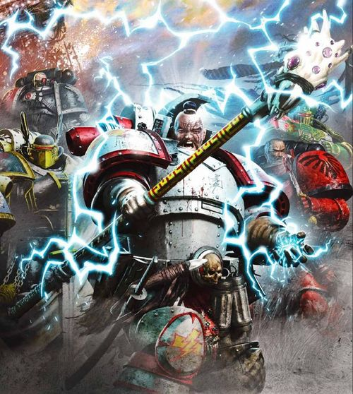
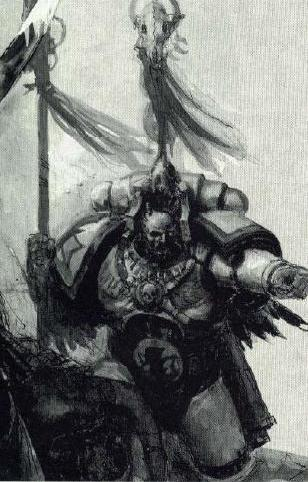
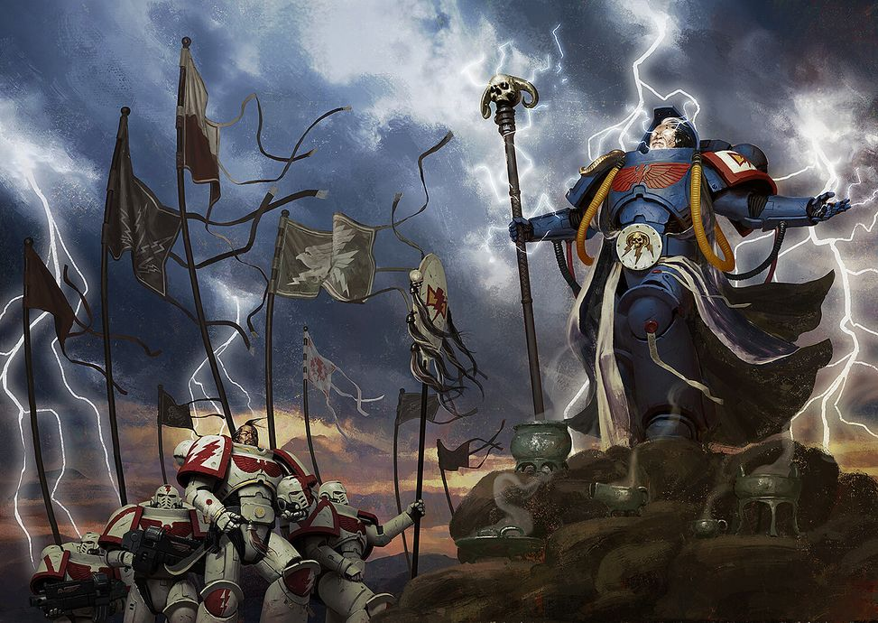
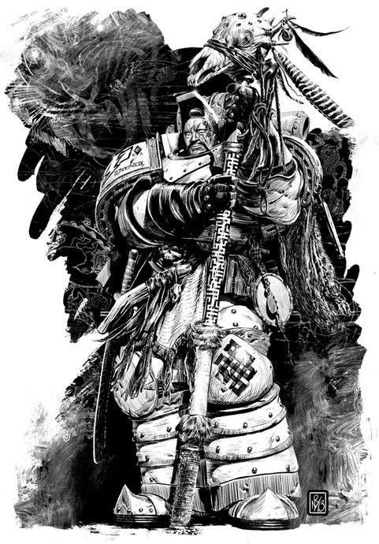

# 0357 风暴先知 Stormseer

精校状态：中文行文已逐段精校，部分术语仍为暂定

分类：通用概念 / 帝国 Imperium / 中央政务部 Adeptus Terra / 阿斯塔特修会 Adeptus Astartes

原文来源：https://www.bilibili.com/opus/1110978408805826576

原作者：帝国神选罐头

原文时间：2025年09月10日 20:43

[返回分类目录](目录.md) · [全书目录](../../目录.md)

<!-- A0357-B0001 -->
**英文原文**

The Stormseers, also spelled Storm Seers, (zadyin arga) of the White Scars are the equivalent of the Librarians of other Space Marine Chapters. They practice the Stormspeaking psychic ediscipline.

<!-- /A0357-B0001 -->

<!-- A0357-B0002 -->

原译文

风暴先知，也拼写为风暴预言家（萨德因·阿加），是白色伤疤的成员，相当于其他星际战士战团的智库。他们练习风暴之语灵能学派。

**校订译文**

白疤的风暴先知（zadyin arga；英文可拼作 Stormseers 或 Storm Seers）相当于其他星际战士战团的智库员，修习风语学派。

**校注：** Stormspeaking 沿用全书早期核心定译“风语学派”；原“风暴之语”保留于原译对照。

<!-- /A0357-B0002 -->

<!-- A0357-B0003 图片 -->

<!-- A0357-B0004 -->

原译文

Horus Heresy-era Stormseer 荷鲁斯叛乱时期风暴先知

**校订译文**

Horus Heresy-era Stormseer 荷鲁斯之乱时期风暴先知

<!-- /A0357-B0004 -->

<!-- A0357-B0005 -->
## Overview 概述

<!-- /A0357-B0005 -->

<!-- A0357-B0006 -->
**英文原文**

While the Stormseers of the White Scars function as typical Librarians, their traditions are deeply tied to the original Stormeers of Chogoris, tribal holy men who rode the plains with the Primarch Jaghatai Khan. It was those Stormseers who, along with various tribal leaders, named Jaghatai Khan the Great Khan, Ruler of All Within the Lands, after his decisive victory against the Palatine forces. Like Rune Priests of the Space Wolves, Stormseers use the natural powers of Chogoris as the source of their power and this serves as a limiting intermediary to protect them from the malign influences of the Warp.

<!-- /A0357-B0006 -->

<!-- A0357-B0007 -->

原译文

虽然白色伤疤的风暴先知扮演着典型的智库的角色，但他们的传统与乔高里斯的原始风暴先知有着深厚的联系，是部落的神圣之人，与察合台可汗一起在平原上驰骋。正是这些风暴先知，与各部落领袖一起，在察合台可汗决定性地战胜了帕拉廷军队后，将他命名为“大汗”，“天下万物之主”。与太空野狼的符文牧师一样，风暴先知使用乔高里斯的自然力量作为他们力量的来源，这是一个限制性的中介，可以保护他们免受亚空间的恶意影响。

**校订译文**

白疤风暴先知的职责与一般智库员相似，其传统却深植于乔高里斯最早的风暴先知——那些曾随原体察合台可汗驰骋草原的部族圣者。察合台决定性地击败帕拉廷军队后，正是这些风暴先知与各部落首领共同尊他为“大汗”，即“天下之主”。如同太空野狼的符文牧师，风暴先知以乔高里斯的自然之力为力量来源；这些自然力量充当限制与缓冲的媒介，保护他们免受亚空间恶意影响。

<!-- /A0357-B0007 -->

<!-- A0357-B0008 图片 -->

<!-- A0357-B0009 -->

原译文

Stormseers 风暴先知

**校订译文**

Stormseers 风暴先知

<!-- /A0357-B0009 -->

<!-- A0357-B0010 -->
**英文原文**

Stormseers are still called upon to name new members and leaders of the White Scars. Every ten summers, the Stormseers observe the tribal warriors native to their Homeworld, and choose only the most worthy to become Space Marines. When a Great Khan is lost in battle, it is the Stormseers who will decide his successor. They retreat to the caves of the Khum Katra mountains, where Brotherhood Khans will present themselves to be tested by the great seers. It is unknown precisely what process the Stormseers use to prove a new Great Khan, but few candidates survive the process, and those that do never speak of the trials they endured.

<!-- /A0357-B0010 -->

<!-- A0357-B0011 -->

原译文

风暴先知仍被要求任命白色伤疤的新成员和领导人。每十个夏天，风暴先知都会观察他们家乡的部落战士，并只选择最值得成为星际战士的人。当一个大汗在战斗中牺牲时，将由风暴先知决定他的继任者。他们撤退到胡姆·卡特拉山脉的洞穴，兄弟可汗将在那里接受伟大先知的考验。目前尚不清楚风暴先知使用什么程序来证明一个新的大汗，但很少有候选人能在这个过程中幸存下来，那些从不谈论他们所经历的考验的人。

**校订译文**

风暴先知至今仍负责为白疤新成员赋名，并选定新的领袖。每隔十个夏季，他们便观察母星部族的战士，从中选出最有资格成为星际战士的人。大汗战死后，继任者也由风暴先知裁定。他们会退居库姆·卡尔塔山脉的洞窟，各兄弟会的可汗则前来接受考验。风暴先知具体如何选出新大汗，无人知晓；只知道能活着通过试炼的候选者很少，而幸存者从不谈论自己经历过什么。

**校注：** 本篇 Khum Katra 与355篇 Khum Karta 疑为同一山脉的异拼，汉译按前篇统一“库姆·卡尔塔”。

<!-- /A0357-B0011 -->

<!-- A0357-B0012 -->
**英文原文**

Part of the responsibility of a Stormseer is to uphold and teach the core beliefs of the White Scars. They believe it is the duty of the Chapter to destroy the enemies of the Emperor, awaiting the day that he will rise again, signalling the return of Jaghatai Khan, and the beginning of the next Great Crusade to unify all of humanity.

<!-- /A0357-B0012 -->

<!-- A0357-B0013 -->

原译文

风暴先知的部分责任是维护和教授白色疤痕的核心信仰。他们认为，战团有责任摧毁帝皇之敌，等待他再次崛起的那一天，这标志着察合台可汗的回归，以及下一次统一全人类的大远征的开始。

**校订译文**

维护并传授白疤的核心信念，也是风暴先知的职责。他们相信，战团应当消灭帝皇的一切敌人，等待他再次崛起；那一天也将宣告察合台可汗归来，以及下一场统一全人类的大远征开始。

<!-- /A0357-B0013 -->

<!-- A0357-B0014 图片 -->

<!-- A0357-B0015 -->

原译文

Stormseer embraces the elements to speak with the wild and unpredictable storms of Chogoris 风暴先知拥抱各种元素，与乔高里斯狂野而不可预测的风暴对话

**校订译文**

Stormseer embraces the elements to speak with the wild and unpredictable storms of Chogoris 风暴先知拥抱各种元素，与乔高里斯狂野而不可预测的风暴对话

<!-- /A0357-B0015 -->

<!-- A0357-B0016 -->
**英文原文**

Lightning is a powerful symbol for the White Scars, representing both their combat style and prowess, but also the psychic power of the Stormseers. They believe that their powers are connected to the spirits of the land and the air, and that as long as these natural forces fight alongside them, the White Scars will always be victorious. These elemental beliefs and the highly stylized Force Staff used by Stormseers tie these warrior-mystics to their shamanistic past on the steppes of Mundus Planus.

<!-- /A0357-B0016 -->

<!-- A0357-B0017 -->

原译文

闪电是白色伤疤的有力象征，既代表了他们的战斗风格和实力，也代表了风暴先知的灵能力量。他们相信，他们的力量与大地和空气之魂有关，只要这些自然力量与他们并肩作战，白色疤痕就会永远获胜。这些基本信仰和风暴先知使用的高度程式化的灵能杖将这些神秘战士与他们在蒙杜斯·普兰努斯上的萨满教历史联系起来。

**校订译文**

闪电对白疤具有强烈的象征意义，既代表他们的作战风格与武艺，也代表风暴先知的灵能。风暴先知相信，自己的力量与大地和天空的精魂相连；只要这些自然力量仍与他们并肩作战，白疤就会不断获胜。这种对元素力量的信仰，以及风暴先知造型独特的灵能杖，都使这些战士秘术师与蒙杜斯·普兰努斯草原上的萨满传统保持着联系。

<!-- /A0357-B0017 -->

<!-- A0357-B0018 -->
**英文原文**

During the Great Crusade and Horus Heresy, their ranks included Stormseer Consuls, who served as their Khans' advisors and mystics.

<!-- /A0357-B0018 -->

<!-- A0357-B0019 -->

原译文

在大远征和荷鲁斯叛乱期间，他们的队伍包括风暴先知领事，他们担任可汗的顾问和神秘主义者。

**校订译文**

大远征与荷鲁斯之乱期间，风暴先知的职级中还包括风暴先知领事，担任可汗的顾问与秘术师。

<!-- /A0357-B0019 -->

<!-- A0357-B0020 -->
## Notable Stormseers 著名风暴先知

<!-- /A0357-B0020 -->

<!-- A0357-B0021 -->

原译文

Targutai Yesugei 塔里忽台·也速该

**校订译文**

Targutai Yesugei 塔里忽台·也速该

<!-- /A0357-B0021 -->

<!-- A0357-B0022 图片 -->

<!-- A0357-B0023 -->

原译文

Targutai Yesugei, Zadyin Arga (Stormseer) during the Great Crusade and Horus Heresy. 塔里忽台·也速该，大远征和荷鲁斯叛乱期间的萨德因·阿加（风暴先知）

**校订译文**

Targutai Yesugei, Zadyin Arga (Stormseer) during the Great Crusade and Horus Heresy. 塔里忽台·也速该，大远征和荷鲁斯之乱期间的萨德因·阿加（风暴先知）

<!-- /A0357-B0023 -->

<!-- A0357-B0024 -->

原译文

Dayir Jenkshin 戴伊尔·詹克申

**校订译文**

Dayir Jenkshin 戴伊尔·詹克申

<!-- /A0357-B0024 -->

<!-- A0357-B0025 -->

原译文

Naranbaatar 纳兰巴达

**校订译文**

Naranbaatar 纳兰巴达

<!-- /A0357-B0025 -->

<!-- A0357-B0026 -->

原译文

Kaljuk 卡尔朱克

**校订译文**

Kaljuk 卡尔朱克

<!-- /A0357-B0026 -->

<!-- A0357-B0027 -->

原译文

Khulitar 胡利塔尔

**校订译文**

Khulitar 胡利塔尔

<!-- /A0357-B0027 -->

<!-- A0357-B0028 -->

原译文

Ogutai 窝阔台

**校订译文**

Ogutai 窝阔台

<!-- /A0357-B0028 -->

<!-- A0357-B0029 -->

原译文

Qui'Sin 奎辛

**校订译文**

Qui'Sin 奎辛

<!-- /A0357-B0029 -->

<!-- A0357-B0030 -->

原译文

Sudabeh 苏达贝

**校订译文**

Sudabeh 苏达贝

<!-- /A0357-B0030 -->

<!-- A0357-B0031 -->

原译文

Sugedai 苏各代

**校订译文**

Sugedai 苏各代

<!-- /A0357-B0031 -->

<!-- A0357-B0032 -->
**英文原文**

Saghari - Chief Stormseer

<!-- /A0357-B0032 -->

<!-- A0357-B0033 -->

原译文

萨哈里 - 首席风暴先知

**校订译文**

萨哈里 - 首席风暴先知

<!-- /A0357-B0033 -->

<!-- A0357-B0034 -->

原译文

Shivnukh-ai 希夫努赫-艾

**校订译文**

Shivnukh-ai 希夫努赫-艾

<!-- /A0357-B0034 -->

<!-- A0357-B0035 -->

原译文

Yaghterai 雅格特莱

**校订译文**

Yaghterai 雅格特莱

<!-- /A0357-B0035 -->

本篇核心术语与暂定项

以下列出本篇出现的英文原形及核心术语表用词。同形词可能指不同对象，具体词义以本篇正文和校注为准；单复数、别名和仅见于图注的名称可能尚未列入。完整候选见[术语表](../../术语表/双语术语候选.csv)。

| 英文 | 采用中文 | 状态 |
| --- | --- | --- |
| Space Marines | 星际战士 | 官方已核对 |
| Space Wolves | 太空野狼 | 官方已核对 |
| Horus Heresy | 荷鲁斯之乱 | 官方已核对 |
| Warp | 亚空间 | 官方已核对 |
| Stormspeaking | 风语学派 | 暂定·官方待核 |
| Emperor | 帝皇 | 官方已核对 |
| Primarch | 原体 | 官方已核对 |
| Great Crusade | 大远征 | 暂定·官方待核 |
| Horus | 荷鲁斯 | 暂定·官方待核 |
| Brotherhood | 兄弟会 | 暂定·官方待核 |
| Chogoris | 乔高里斯 | 暂定·官方待核 |
| Palatine | 宫廷官 | 官方已核对 |
| White Scars | 白疤 | 官方已核 |
| Scars | 伤疤 | 暂定·官方待核 |
| Stormseer | 风暴先知 | 暂定·官方待核 |
| Space Marine | 星际战士 | 暂定·官方待核 |
| Chapter | 战团 | 暂定·官方待核 |
| Powers | 能天使 | 暂定·官方待核 |
| Jaghatai Khan | 察合台可汗 | 暂定·官方待核 |
| Zadyin Arga | 萨德因·阿加 | 暂定·官方待核 |
| The Great Khan | 大汗 | 暂定·官方待核 |
| Mundus Planus | 蒙达斯·普莱纳斯 | 暂定·官方待核 |
| Force Staff | 灵能权杖 | 暂定·官方待核 |

