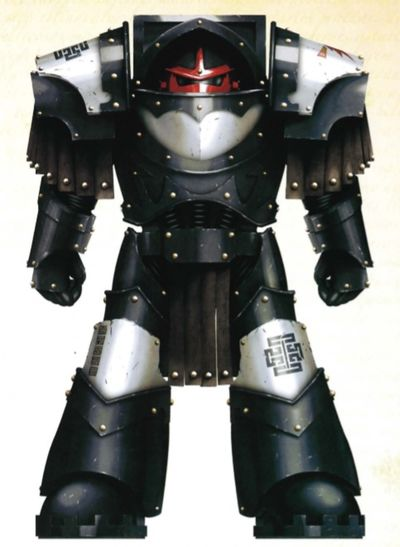
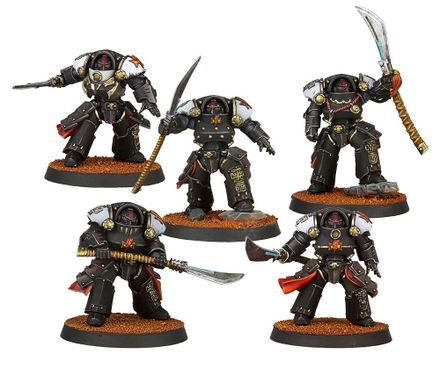

# 0358 黑檀怯薛 Ebon Keshig

精校状态：中文行文已逐段精校，部分术语仍为暂定

分类：通用概念 / 帝国 Imperium / 中央政务部 Adeptus Terra / 阿斯塔特修会 Adeptus Astartes

原文来源：https://www.bilibili.com/opus/1022462246688653313

原作者：帝国神选罐头

原文时间：2025年01月15日 07:55

[返回分类目录](目录.md) · [全书目录](../../目录.md)

<!-- A0358-B0001 -->
**英文原文**

The Ebon Keshig were a formation of black-clad Terminators within the White Scars Legion. They were deployed within the Kharash.

<!-- /A0358-B0001 -->

<!-- A0358-B0002 -->

原译文

黑檀怯薛是白色伤疤军团中的一个黑甲终结者编队。他们被部署在哈拉什。

**校订译文**

黑檀怯薛是白疤军团的一支黑甲终结者部队，编入哈拉什执行任务。

<!-- /A0358-B0002 -->

<!-- A0358-B0003 图片 -->

<!-- A0358-B0004 -->

原译文

Ebon Keshig Warrior 黑檀怯薛战士

**校订译文**

Ebon Keshig Warrior 黑檀怯薛战士

<!-- /A0358-B0004 -->

<!-- A0358-B0005 -->
## Overview 概述

<!-- /A0358-B0005 -->

<!-- A0358-B0006 -->
**英文原文**

The Ebon Keshig served as a ritual post of atonement and redemption for sins and breaches of honour. The Legionaries who joined the Ebon Keshig were typically deployed in the van of sieges and other high-intensity conflicts, where they were expected to use their heavy armour as shields for others. In doing so, they atoned for their perceived sins through not only martial glory, but also the protection of their brothers. Those Legionaries who survived their service with the Ebon Keshig were deemed to have proven themselves worthy in the eyes of the White Scars and often returned to their previous posts or sometimes to other roles fitting their new mien.

<!-- /A0358-B0006 -->

<!-- A0358-B0007 -->

原译文

黑檀怯薛作为一种赎罪和救赎罪过及违反荣誉行为的仪式性职位。加入黑檀怯薛的军团士兵通常被部署在攻城和其他高强度冲突的前线，他们被期望用自己的重型盔甲成为他人的护盾。通过这样做，他们不仅通过军事荣耀，而且通过保护他们的兄弟来为自己所认为的罪过赎罪。那些在黑檀怯薛中服役并幸存下来的军团士兵，在白色疤痕的眼中被认为是证明了自己的价值，他们往往会回到原来的职位，有时也会担任适合他们新面貌的其他角色。

**校订译文**

在黑檀怯薛服役是一种仪式性的赎罪安排，让犯下罪过或有损荣誉的军团战士获得救赎。他们通常被派往攻城战及其他激烈冲突的最前沿，以厚重的盔甲为同袍充当盾牌。如此一来，他们不仅凭借武勋赎罪，也通过保护弟兄洗刷被认定的过错。服役期满仍然生还的战士，会被白疤视为已经重新证明了自身价值；他们通常返回原职，有时也会被安排到更适合其转变后心性的职位。

<!-- /A0358-B0007 -->

<!-- A0358-B0008 图片 -->

<!-- A0358-B0009 -->

原译文

Ebon Keshig Squad 黑檀怯薛小队

**校订译文**

Ebon Keshig Squad 黑檀怯薛小队

<!-- /A0358-B0009 -->

<!-- A0358-B0010 -->
**英文原文**

In battle, Ebon Keshig typically wore Terminator Armour and used Power Glaives and Power Swords as well as Combi-Weapons, Power Fists, and Volkite Chargers.

<!-- /A0358-B0010 -->

<!-- A0358-B0011 -->

原译文

在战斗中，黑檀怯薛通常穿着终结者盔甲，使用动力长刀和动力剑以及复合武器、动力拳和爆燃突击铳。

**校订译文**

在战斗中，黑檀怯薛通常穿着终结者盔甲，使用动力长刀和动力剑以及复合武器、动力拳和爆燃突击铳。

<!-- /A0358-B0011 -->

本篇核心术语与暂定项

以下列出本篇出现的英文原形及核心术语表用词。同形词可能指不同对象，具体词义以本篇正文和校注为准；单复数、别名和仅见于图注的名称可能尚未列入。完整候选见[术语表](../../术语表/双语术语候选.csv)。

| 英文 | 采用中文 | 状态 |
| --- | --- | --- |
| Terminator | 终结者 | 官方已核对 |
| White Scars | 白疤 | 官方已核 |
| Scars | 伤疤 | 暂定·官方待核 |
| Terminators | 终结者 | 暂定·官方待核 |
| Kharash | 哈拉什 | 暂定·官方待核 |
| Terminator Armour | 终结者盔甲 | 暂定·官方待核 |

