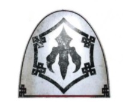

# 0359 猎鹰之爪 Falcon's Claw

精校状态：中文行文已逐段精校，部分术语仍为暂定

分类：通用概念 / 帝国 Imperium / 中央政务部 Adeptus Terra / 阿斯塔特修会 Adeptus Astartes

原文来源：https://www.bilibili.com/opus/1022838769293721600

原作者：帝国神选罐头

原文时间：2025年01月16日 08:16

[返回分类目录](目录.md) · [全书目录](../../目录.md)

<!-- A0359-B0001 -->
**英文原文**

The Falcon's Claws (or Burgediin Sarhvu) were White Scar warriors during the Great Crusade and Horus Heresy.

<!-- /A0359-B0001 -->

<!-- A0359-B0002 -->

原译文

猎鹰之爪（或山脉壁垒）是大远征和荷鲁斯叛乱时期的白色疤痕战士。

**校订译文**

猎鹰之爪（Burgediin Sarhvu）是大远征与荷鲁斯之乱期间白疤的一种战士编组。

**校注：** Burgediin Sarhvu 与355篇 Burgedinn Sarvhu 是同一白疤组织的不同拼写，暂统一“伯尔盖丁·萨夫胡”；原“山脉壁垒”未获源文支持。

<!-- /A0359-B0002 -->

<!-- A0359-B0003 图片 -->

<!-- A0359-B0004 -->

原译文

Falcon's Claws symbol 猎鹰之爪标志

**校订译文**

Falcon's Claws symbol 猎鹰之爪标志

<!-- /A0359-B0004 -->

<!-- A0359-B0005 -->
**英文原文**

The Falcon's Claws were warriors that excelled at reading the battlefield and were able to determine where the Legion's enemies, were most likely to launch their attacks or defense. Before the White Scars' battle took place, the Falcon's Claws were deployed far ahead of their Legion and began acting as long-range scouts, ambushers, assassins and harriers against their foes. They would attempt to eliminate key commanders, mark key points of assault and destroy supply routes - all of which they reported back to their Legion. When the White Scars' attack finally began, the actions of the Falcon's Claws had shaped the battle to their Legion's advantage and helped ensure they were victorious. This was not the end of their duties however, as the Falcon's Claws were then charged with pursuing and slaughtering any surviving enemies, that escaped the White Scars' attack.

<!-- /A0359-B0005 -->

<!-- A0359-B0006 -->

原译文

猎鹰之爪是擅长理解战场的战士，能够确定军团的敌人最有可能在哪里发动攻击或防御。在白色疤痕战斗发生之前，猎鹰之爪被部署在军团前方，开始充当远程侦察员、伏击者、刺客和骚扰者，对抗敌人。他们将试图消灭关键指挥官，标记关键的攻击点，摧毁补给线——所有这些都会向他们的军团报告。当白色疤痕的攻击终于开始时，猎鹰之爪的行动使战斗对他们的军团有利，并帮助确保了他们的胜利。然而，这并不是他们职责的结束，因为猎鹰之爪随后被要求追捕和屠杀任何逃脱白色疤痕袭击的幸存敌人。

**校订译文**

猎鹰之爪擅长判读战场，能判断敌人最可能从何处进攻、又会在哪里布防。白疤主力交战前，他们便深入军团前方，承担远程侦察、伏击、暗杀与袭扰任务。他们会尝试除掉关键指挥官、标出适合突击的要点、破坏补给线，并将所得情报传回军团。白疤正式进攻时，猎鹰之爪往往已将战局塑造成有利于己方的态势，为取胜奠定基础。然而，他们的职责并未结束：接下来还要追击并消灭逃过白疤攻势的残敌。

<!-- /A0359-B0006 -->

<!-- A0359-B0007 -->
**英文原文**

Equipped with Cameleoline Recon Armour, the Falcon's Claws went into battle with twin pairs of Lightning Claws and Grenades, though some also wielded Thunder Hammers, Power Fists, Hand Flamers, Plasma Pistols, Bolt Pistols, Power Weapon, and Volkite Serpentas.

<!-- /A0359-B0007 -->

<!-- A0359-B0008 -->

原译文

猎鹰之爪装备了卡莫莱奥林侦察装甲，一对闪电爪和手榴弹作战，尽管有些人还挥舞着雷霆锤、动力拳、喷火手枪、等离子手枪、爆矢手枪、动力武器和爆燃蛇铳。

**校订译文**

猎鹰之爪身穿卡莫莱奥林侦察甲，通常配备成对的闪电爪与手榴弹；部分成员也使用雷霆锤、动力拳、喷火手枪、等离子手枪、爆矢手枪、动力武器及爆燃蛇铳。

**校注：** 英文 twin pairs of Lightning Claws 表述含混，可能重复表达成对使用之意；译作“成对的闪电爪”，不擅自推定每人有四只闪电爪。

<!-- /A0359-B0008 -->

<!-- A0359-B0009 -->
## Notable Members 著名成员

<!-- /A0359-B0009 -->

<!-- A0359-B0010 -->

原译文

Gahaki Khan 加哈基可汗

**校订译文**

Gahaki Khan 加哈基可汗

<!-- /A0359-B0010 -->

本篇核心术语与暂定项

以下列出本篇出现的英文原形及核心术语表用词。同形词可能指不同对象，具体词义以本篇正文和校注为准；单复数、别名和仅见于图注的名称可能尚未列入。完整候选见[术语表](../../术语表/双语术语候选.csv)。

| 英文 | 采用中文 | 状态 |
| --- | --- | --- |
| Horus Heresy | 荷鲁斯之乱 | 官方已核对 |
| Great Crusade | 大远征 | 暂定·官方待核 |
| Horus | 荷鲁斯 | 暂定·官方待核 |
| White Scars | 白疤 | 官方已核 |
| Scars | 伤疤 | 暂定·官方待核 |
| Flamers | 火妖（奸奇单位）／火焰喷射器（武器） | 语境定译·对应官译已核 |
| Burgediin Sarhvu | 伯尔盖丁·萨夫胡 | 暂定·官方待核 |
| Cameleoline | 变色龙伪装材料 | 暂定·官方待核 |
| Bolt | 爆矢 | 暂定·官方待核 |
| Power weapon | 动力武器 | 官方已核对 |
| Falcon | 猎鹰坦克 | 官方已核·中英对照 |

