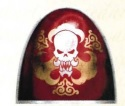
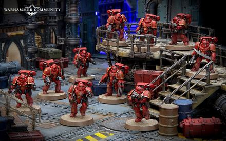

# 0360 死暗之子 Karaoghlanlar

精校状态：中文行文已逐段精校，部分术语仍为暂定

分类：通用概念 / 帝国 Imperium / 中央政务部 Adeptus Terra / 阿斯塔特修会 Adeptus Astartes

原文来源：https://www.bilibili.com/opus/1025491710457675847

原作者：帝国神选罐头

原文时间：2025年01月23日 11:51

[返回分类目录](目录.md) · [全书目录](../../目录.md)

<!-- A0360-B0001 -->
**英文原文**

The Karaoghlanlar, translated from Chogorian as the Dark Sons of Death, were a formation of the White Scars during the Great Crusade and Horus Heresy.

<!-- /A0360-B0001 -->

<!-- A0360-B0002 -->

原译文

死暗之子，从巧高里斯语翻译为死亡的黑暗之子，是大远征和荷鲁斯叛乱期间白色伤疤的一种编队。

**校订译文**

死暗之子是大远征与荷鲁斯之乱期间白疤的一种部队，其乔高里斯语名称 Karaoghlanlar 意为“死亡的黑暗之子”。

<!-- /A0360-B0002 -->

<!-- A0360-B0003 图片 -->

<!-- A0360-B0004 -->

原译文

Symbol of the Karaoghlanlar 死暗之子标志

**校订译文**

Symbol of the Karaoghlanlar 死暗之子标志

<!-- /A0360-B0004 -->

<!-- A0360-B0005 -->
**英文原文**

The Karaoghlanlar consisted of squads similar to that of Legion Destroyers and answered directly to the council of Stormseers. They were deployed in combat when the utter annihilation of the enemy was required, as well as for certain ritual roles during key campaigns.

<!-- /A0360-B0005 -->

<!-- A0360-B0006 -->

原译文

死暗之子由类似于军团毁灭者的小队组成，直接向风暴先知议会负责。它们被部署在需要彻底消灭敌人的战斗中，以及在关键战役中的某些仪式角色中。

**校订译文**

死暗之子由类似军团毁灭者的小队组成，直接听命于风暴先知议会。他们负责执行必须彻底灭绝敌人的作战任务，也会在某些关键战役中承担特定的仪式职责。

<!-- /A0360-B0006 -->

<!-- A0360-B0007 图片 -->

<!-- A0360-B0008 -->

原译文

Karaoghlanlar squad 死暗之子小队

**校订译文**

Karaoghlanlar squad 死暗之子小队

<!-- /A0360-B0008 -->

本篇核心术语与暂定项

以下列出本篇出现的英文原形及核心术语表用词。同形词可能指不同对象，具体词义以本篇正文和校注为准；单复数、别名和仅见于图注的名称可能尚未列入。完整候选见[术语表](../../术语表/双语术语候选.csv)。

| 英文 | 采用中文 | 状态 |
| --- | --- | --- |
| Horus Heresy | 荷鲁斯之乱 | 官方已核对 |
| Great Crusade | 大远征 | 暂定·官方待核 |
| Horus | 荷鲁斯 | 暂定·官方待核 |
| White Scars | 白疤 | 官方已核 |
| Scars | 伤疤 | 暂定·官方待核 |
| Karaoghlanlar | 死暗之子 | 暂定·官方待核 |
| Destroyers | 毁灭者 | 暂定·官方待核 |
| Dark Sons | 黑暗之子 | 暂定·官方待核 |
| The Dark | 《黑暗》 | 暂定·官方待核 |

