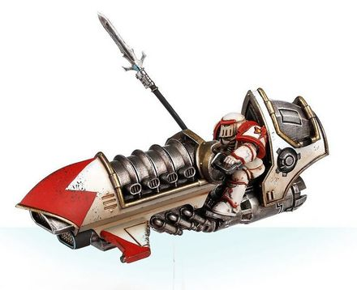
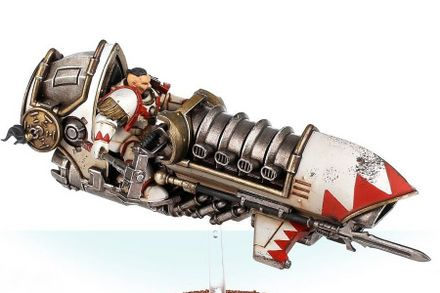

# 0361 黄金怯薛 Golden Keshig

精校状态：中文行文已逐段精校，部分术语仍为暂定

分类：通用概念 / 帝国 Imperium / 中央政务部 Adeptus Terra / 阿斯塔特修会 Adeptus Astartes

原文来源：https://www.bilibili.com/opus/1023297995751292931

原作者：帝国神选罐头

原文时间：2025年01月17日 13:58

[返回分类目录](目录.md) · [全书目录](../../目录.md)

<!-- A0361-B0001 -->
**英文原文**

The Golden Keshig were warriors of the White Scars mounted on Jetbikes during the Great Crusade and Horus Heresy.

<!-- /A0361-B0001 -->

<!-- A0361-B0002 -->

原译文

黄金怯薛是大远征和荷鲁斯叛乱时期骑在悬浮摩托上的白色伤疤战士。

**校订译文**

黄金怯薛是大远征与荷鲁斯之乱期间白疤的喷气摩托战士。

<!-- /A0361-B0002 -->

<!-- A0361-B0003 图片 -->

<!-- A0361-B0004 -->

原译文

Golden Keshig Biker 黄金怯薛骑手

**校订译文**

Golden Keshig Biker 黄金怯薛骑手

<!-- /A0361-B0004 -->

<!-- A0361-B0005 -->
## Description 描述

<!-- /A0361-B0005 -->

<!-- A0361-B0006 -->
**英文原文**

The Golden Keshig were the most prestigious of the White Scars heavy assault Jetbike squadrons and each of its Legionaries were superlative skilled riders. In battle they would encircle their foes at apparently random speeds and directions aboard the Shamshir Pattern Jetbikes before gathering into a single Kontos Power Lance piercing attack, known as a Zao, that struck through the centre of an enemy formation. Such an attack would cause numerous casualties and sowed confusion in the Golden Keshig's wake. This led them to be referred to as "Storm Ghouls" or "Sky-Beast Tamers".

<!-- /A0361-B0006 -->

<!-- A0361-B0007 -->

原译文

黄金怯薛是白色疤痕重型攻击悬浮摩托中队中最负盛名的中队，其每个军团士兵都是技艺精湛的骑手。在战斗中，他们将乘坐舍施尔型悬浮摩托以明显随机的速度和方向包围敌人，然后聚集在一起进行一次流星型动力长枪的穿刺攻击，称为造，穿过敌人编队的中心。这样的袭击将造成大量人员伤亡，并在黄金怯薛的身后播下混乱的种子。这导致他们被称为“风暴食尸鬼”或“天兽驯者”。

**校订译文**

黄金怯薛是白疤最负盛名的重型突击喷气摩托部队，每名军团战士都是顶尖骑手。交战时，他们骑乘舍施尔型喷气摩托，以看似毫无规律的速度和方向环绕敌人，随后突然集结，发动称为“凿式突击”的协同冲锋，以孔托斯动力长枪刺穿敌阵中央。这种冲锋会造成惨重伤亡，并在骑手掠过后留下混乱。因此，他们也被称为“风暴食尸鬼”或“天兽驯者”。

**校注：** Kontos 为长枪名称，暂音译“孔托斯”，原“流星型”无英文依据。Zao 依穿阵冲锋语境暂作“凿式突击”，原译“造”；两项均无官方汉译证据。

<!-- /A0361-B0007 -->

<!-- A0361-B0008 图片 -->

<!-- A0361-B0009 -->

原译文

Golden Keshig Champion 黄金怯薛冠军

**校订译文**

Golden Keshig Champion 黄金怯薛冠军

<!-- /A0361-B0009 -->

<!-- A0361-B0010 -->
**英文原文**

Golden Keshig bikers were clad in Artificer Armour and wielded a Chainsword and Bolt Pistol. Golden Keshig Champions could also be seen wielding Thunder Hammers.

<!-- /A0361-B0010 -->

<!-- A0361-B0011 -->

原译文

黄金怯薛骑手身穿精工盔甲，挥舞着链锯剑和爆矢手枪。黄金怯薛冠军还可以看到挥舞着雷霆锤。

**校订译文**

黄金怯薛骑手身穿精工甲，携带链锯剑与爆矢手枪；黄金怯薛冠军有时也使用雷霆锤。

<!-- /A0361-B0011 -->

<!-- A0361-B0012 -->
## Shamshir Pattern Jetbike 舍施尔型喷气摩托

原题：Shamshir Pattern Jetbike 舍施尔型悬浮摩托

<!-- /A0361-B0012 -->

<!-- A0361-B0013 -->
**英文原文**

The Shamshir Jetbike was a rare variant of the Scimitar Jetbike, that was heavily used by the White Scars for its increased speed and maneuverability. However, production of the Shamshir was limited to small Mechanicum enclaves established in the Kolarne Circle and maintained by an ancient treaty with the White Scars.

<!-- /A0361-B0013 -->

<!-- A0361-B0014 -->

原译文

舍施尔悬浮摩托是弯刀悬浮摩托的罕见变体，因其速度和机动性的提高而被白色疤痕大量使用。然而，舍施尔的生产仅限于在克拉恩星环建立的小型机械神教飞地，并由与白色疤痕的一项古老契约维持。

**校订译文**

舍施尔型喷气摩托是弯刀型喷气摩托的一种罕见变体，因速度更快、机动性更强而受到白疤广泛采用。不过，只有克拉恩星环内少数机械教飞地能够制造这种载具；这些飞地依靠与白疤的一项古老条约得以维系。

<!-- /A0361-B0014 -->

<!-- A0361-B0015 -->
**英文原文**

It is equipped with a Scatterbolt Launcher.

<!-- /A0361-B0015 -->

<!-- A0361-B0016 -->

原译文

它配备了散射爆矢发射器。

**校订译文**

它配备了散射爆矢发射器。

<!-- /A0361-B0016 -->

本篇核心术语与暂定项

以下列出本篇出现的英文原形及核心术语表用词。同形词可能指不同对象，具体词义以本篇正文和校注为准；单复数、别名和仅见于图注的名称可能尚未列入。完整候选见[术语表](../../术语表/双语术语候选.csv)。

| 英文 | 采用中文 | 状态 |
| --- | --- | --- |
| Bolt Pistol | 爆矢手枪 | 官方已核对 |
| Chainsword | 链锯剑 | 官方已核对 |
| Horus Heresy | 荷鲁斯之乱 | 官方已核对 |
| Mechanicum | 机械教 | 暂定·历史称谓 |
| Great Crusade | 大远征 | 暂定·官方待核 |
| Horus | 荷鲁斯 | 暂定·官方待核 |
| Ancient | 旗手 | 官方已核对 |
| Lance | 骑士矛阵 | 暂定·官方待核 |
| White Scars | 白疤 | 官方已核 |
| Scars | 伤疤 | 暂定·官方待核 |
| Artificer | 技工 | 暂定·官方待核 |
| Kontos Power Lance | 孔托斯动力长枪 | 暂定·官方待核 |
| Zao | 凿式突击 | 暂定·官方待核 |
| Power Lance | 动力长枪 | 暂定·官方待核 |
| Bolt | 爆矢 | 暂定·官方待核 |
| Scatterbolt Launcher | 散射爆矢发射器 | 暂定·官方待核 |
| Artificer Armour | 精工盔甲 | 暂定·官方待核 |
| Jetbike | 喷气摩托 | 暂定·官方待核 |
| Enclaves | 飞地 | 暂定·官方待核 |

