# 0362 VI - 太空野狼 Space Wolves

精校状态：中文行文已逐段精校，部分术语仍为暂定

分类：通用概念 / 帝国 Imperium / 中央政务部 Adeptus Terra / 阿斯塔特修会 Adeptus Astartes

原文来源：https://www.bilibili.com/opus/1058164995539337222

原作者：帝国神选罐头

原文时间：编辑于 2025年09月16日 21:02

[返回分类目录](目录.md) · [全书目录](../../目录.md)

<!-- A0362-B0001 -->
**英文原文**

The Space Wolves (also Sky Warriors of Russ, Rout or Vlka Fenryka or Wolves of Fenris in Fenrisian) were the VI Legion of the twenty Space Marine Legions. Their primarch is Leman Russ, and during the Great Crusade they gained a reputation as the Emperor's executioners and instruments of punishment. After the Horus Heresy and the resultant reforms, the legion was divided, its first and only time, into two chapters: the new Space Wolves chapter retained the name of their parent Legion, while the second chapter took on the name of the Wolf Brothers. The latter however suffered from mutation and were disbanded.

<!-- /A0362-B0001 -->

<!-- A0362-B0002 -->

原译文

太空野狼（也称为鲁斯的天空勇士，狼群或芬里斯之子或芬里斯之狼或芬里斯人）是20个星际战士军团的第六军团。他们的原体是黎曼·鲁斯，在大远征期间，他们被誉为帝皇的刽子手和惩罚。在荷鲁斯叛乱和由此产生的变化之后，军团首次也是唯一一次被分为两个战团：新的太空野狼战团保留了其母军团的名称，而第二战团则采用了狼兄弟的名称。然而，后者因突变而解体。

**校订译文**

太空野狼又称“鲁斯的天空勇士”或“狼群”；在芬里斯语中，他们自称 Vlka Fenryka，意为“芬里斯之狼”。他们是二十支星际战士军团中的第六军团，原体为黎曼·鲁斯，大远征期间以帝皇的刽子手与惩戒之刃闻名。荷鲁斯之乱后的军事改革中，军团仅进行过一次拆分，分为两个战团：太空野狼保留母军团的名称，另一个战团则称为“狼兄弟”。后者因基因突变问题而被解散。

**校注：** 本处“唯一一次拆分”指原军团拆分，并不等于此后永远没有子战团；后文将介绍极限建军。Vlka Fenryka 为芬里斯语自称，原文末尾 in Fenrisian 是语言说明，不是又一个名字“芬里斯人”。

<!-- /A0362-B0002 -->

<!-- A0362-B0003 -->
**英文原文**

The Space Wolves are notorious throughout the rest of the Imperium for their ferocity in battle and their defiance of authority, including the dictates of the Codex Astartes that govern the organisation and combat doctrines of other Space Marine chapters.

<!-- /A0362-B0003 -->

<!-- A0362-B0004 -->

原译文

太空野狼因其在战斗中的凶猛和对权威的蔑视而在帝国其他地区臭名昭著，包括管理其他星际战士的组织和战斗理论的阿斯塔特圣典的规定。

**校订译文**

太空野狼以作战凶猛、蔑视权威而闻名于帝国。他们甚至不愿服从《阿斯塔特圣典》对其他星际战士战团的组织与战术所作的规定。

<!-- /A0362-B0004 -->

<!-- A0362-B0005 图片 -->
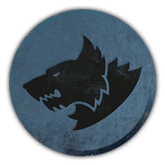

<!-- A0362-B0006 图片 -->
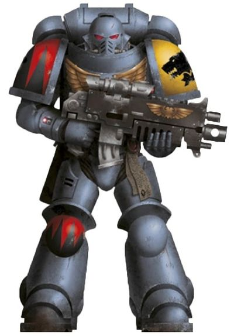

<!-- A0362-B0007 -->
**英文原文**

Legion Number:VI

<!-- /A0362-B0007 -->

<!-- A0362-B0008 -->

原译文

军团编号：VI

**校订译文**

军团编号：VI

<!-- /A0362-B0008 -->

<!-- A0362-B0009 -->
**英文原文**

Primarch:Leman Russ

<!-- /A0362-B0009 -->

<!-- A0362-B0010 -->

原译文

原体：黎曼·鲁斯

**校订译文**

原体：黎曼·鲁斯

<!-- /A0362-B0010 -->

<!-- A0362-B0011 -->
**英文原文**

Homeworld:Fenris

<!-- /A0362-B0011 -->

<!-- A0362-B0012 -->

原译文

家园世界：芬里斯

**校订译文**

家园世界：芬里斯

<!-- /A0362-B0012 -->

<!-- A0362-B0013 -->
**英文原文**

Fortress-Monastery:The Fang

<!-- /A0362-B0013 -->

<!-- A0362-B0014 -->

原译文

堡垒修道院：长牙堡

**校订译文**

要塞修道院：长牙堡

<!-- /A0362-B0014 -->

<!-- A0362-B0015 -->
**英文原文**

Chapter Master:Logan Grimnar

<!-- /A0362-B0015 -->

<!-- A0362-B0016 -->

原译文

战团长：罗根·格里姆纳尔

**校订译文**

战团长：洛根·格里姆纳尔

<!-- /A0362-B0016 -->

<!-- A0362-B0017 -->
**英文原文**

Colours:Grey

<!-- /A0362-B0017 -->

<!-- A0362-B0018 -->

原译文

颜色：灰

**校订译文**

颜色：灰

<!-- /A0362-B0018 -->

<!-- A0362-B0019 -->
**英文原文**

Specialty:Assault, Close Combat

<!-- /A0362-B0019 -->

<!-- A0362-B0020 -->

原译文

专长：突击、近身格斗

**校订译文**

专长：突击、近身格斗

<!-- /A0362-B0020 -->

<!-- A0362-B0021 -->
**英文原文**

Strength:12 Great Companies

<!-- /A0362-B0021 -->

<!-- A0362-B0022 -->

原译文

实力：12个大连

**校订译文**

兵力编制：十二个大连

<!-- /A0362-B0022 -->

<!-- A0362-B0023 -->
**英文原文**

Battle Cry:"For Russ and the Allfather" or a feral howl

<!-- /A0362-B0023 -->

<!-- A0362-B0024 -->

原译文

战吼：“为了鲁斯和全父”或野性的嚎叫

**校订译文**

战吼：“为了鲁斯和全父”或野性的嚎叫

<!-- /A0362-B0024 -->

<!-- A0362-B0025 -->
**英文原文**

Successor Chapters:

<!-- /A0362-B0025 -->

<!-- A0362-B0026 -->

原译文

子战团

**校订译文**

子战团

<!-- /A0362-B0026 -->

<!-- A0362-B0027 -->
**英文原文**

Blood Wolves (renegade warband)

<!-- /A0362-B0027 -->

<!-- A0362-B0028 -->

原译文

血狼（变节战帮）

**校订译文**

血狼（变节战帮）

<!-- /A0362-B0028 -->

<!-- A0362-B0029 -->

原译文

Icefangs 冰牙

**校订译文**

Icefangs 冰牙

<!-- /A0362-B0029 -->

<!-- A0362-B0030 -->

原译文

Mooneaters 吞月者

**校订译文**

Mooneaters 吞月者

<!-- /A0362-B0030 -->

<!-- A0362-B0031 -->
**英文原文**

Red Wolves (renegade warband)

<!-- /A0362-B0031 -->

<!-- A0362-B0032 -->

原译文

红狼（变节战帮）

**校订译文**

红狼（变节战帮）

<!-- /A0362-B0032 -->

<!-- A0362-B0033 -->
**英文原文**

Skyrar's Dark Wolves (renegade warband)

<!-- /A0362-B0033 -->

<!-- A0362-B0034 -->

原译文

斯凯拉的黑暗之狼（变节战帮）

**校订译文**

斯凯拉的黑暗之狼（变节战帮）

<!-- /A0362-B0034 -->

<!-- A0362-B0035 -->

原译文

Wolf Brothers 狼兄弟

**校订译文**

Wolf Brothers 狼兄弟

<!-- /A0362-B0035 -->

<!-- A0362-B0036 -->

原译文

Wolfspear 狼矛

**校订译文**

Wolfspear 狼矛

<!-- /A0362-B0036 -->

<!-- A0362-B0037 -->
## Homeworld 家园世界

<!-- /A0362-B0037 -->

<!-- A0362-B0038 -->
**英文原文**

Fenris is a death world that lies in the galactic north of Segmentum Solar. It is located relatively close to the Eye of Terror. It is also the planet where the mighty Space Wolves recruit their ranks and call home.

<!-- /A0362-B0038 -->

<!-- A0362-B0039 -->

原译文

芬里斯是一个死亡世界，位于银河系的太阳星域的北部。它相对靠近恐惧之眼。这也是强大的太空野狼招募队伍并称之为家园的星球。

**校订译文**

芬里斯是一颗死亡世界，位于太阳星域的银河北侧，距离恐惧之眼相对较近。强大的太空野狼以此为家，也从这里征募兵员。

<!-- /A0362-B0039 -->

<!-- A0362-B0040 -->
**英文原文**

It is a relentless world of fire and ice, ravaged by the extremes of climate all year round. For the majority of its year the planet is blanketed by an extreme winter. The temperature of the planet drops so low that even the oceans ice over allowing its native Fenrisians to travel between its many islands without the need of a longship.

<!-- /A0362-B0040 -->

<!-- A0362-B0041 -->

原译文

这是一个无情的冰与火的世界，常年受到极端气候的破坏。在一年中的大部分时间里，星球都被极端的冬天所覆盖。星球的温度下降得如此之低，以至于连海冰都覆盖了大海，使其本土的芬里斯人无需长船即可在许多岛屿之间旅行。

**校订译文**

这是一个严酷的冰与火的世界，终年遭受极端气候肆虐。一年中的大部分时间里，星球都笼罩在酷寒冬季之中，连海洋也会冻结，使芬里斯人不用长船就能在众多岛屿之间往来。

<!-- /A0362-B0041 -->

<!-- A0362-B0042 -->
**英文原文**

After its long elliptical journey the planet comes dangerously close to its sun. It is the short summer months when the planet is closest that the planet's crust is broken; burning great areas with lava flows, churning the seas, and causing massive tidal waves. It is during these months, referred to as the time of fire and water, that the whole of the planet changes its form. Islands are both destroyed and created in entirety, up heaving homes made during the winter and resulting in the population becoming once again nomadic barbarian tribes.

<!-- /A0362-B0042 -->

<!-- A0362-B0043 -->

原译文

经过漫长的椭圆旅行，这颗行星危险地接近了太阳。在短暂的夏季，行星距离太阳最近，地壳破裂；熔岩流燃烧大片地区，搅动海洋，造成巨大的海啸。正是在这几个月里，被称为火与水的时期，整个星球的形态发生了变化。岛屿既被摧毁，也被完整地创造出来，使冬季建造的房屋隆起，导致人口再次成为游牧的野蛮部落。

**校订译文**

沿着狭长的椭圆轨道运行一段漫长旅程后，芬里斯会危险地靠近恒星。短暂夏季中距离恒星最近的数月，星球地壳破裂，熔岩淹没大片土地，海洋翻腾，巨大的海啸接连涌起。这几个月被称为“火与水之时”，整个星球的地貌都会改观。旧岛毁灭，新岛形成，冬季建立的家园随之被掀覆，居民再次沦为四处迁徙的蛮族部落。

<!-- /A0362-B0043 -->

<!-- A0362-B0044 -->
**英文原文**

These primitives must settle the new lands quickly before supplies and manpower are exhausted otherwise their tribe will not survive the coming winter. This results in bloody war between them for new territories. So it has always been and shall be as it was directed by Leman Russ himself to keep his descendants strong and able. It is because of this life of constant warfare and continual migration that the child-gift is always the axe. Thus upon birth the first test has begun, for the child that does not grasp it is quickly cast into the frozen seas rather than risk him being the downfall of the tribe.

<!-- /A0362-B0044 -->

<!-- A0362-B0045 -->

原译文

这些原始人必须在物资和人力耗尽之前迅速定居新土地，否则他们的部落将无法度过即将到来的冬天。这导致了他们之间为争夺新领土而进行的血腥战争。因此，它一直是，也将是黎曼·鲁斯本人所指示的，以保持他的子嗣强大和有能力。正是因为这种不断战争和不断迁徙的生活，孩子的礼物总是斧头。因此，在出生时，第一次测试就开始了，因为不掌握它的孩子很快就会被扔进冰冻的大海，而不是冒着令部落灭亡的风险。

**校订译文**

这些原始部族必须在人力与物资耗尽前找到新的土地定居，否则便无法熬过下一次寒冬，因此时常为争夺领地而血腥厮杀。过去如此，未来也将如此——黎曼·鲁斯亲自要求保留这种生活方式，以使自己的后裔始终强健能战。战火与迁徙永无休止，因此赠予新生儿的礼物总是一把斧头。第一次考验从出生时便开始：握不住斧头的婴儿会立刻被抛入冰海，以免日后拖累整个部落、招致覆亡。

<!-- /A0362-B0045 -->

<!-- A0362-B0046 -->
**英文原文**

At the planet's northern pole is a single continent called Asaheim that alone is unaffected by the time of fire and water. This is the only location that a great many of planet's unique creatures can survive. These include snow trolls, shape-shifting doppegangrels, and massive wyrms that burrow the landscape. The deadliest of all these creatures is the Fenrisian wolf, a deadly predator with wits that are as sharp as its teeth. Though lethal on its own these keep to their namesake traveling the icy wastes in packs.

<!-- /A0362-B0046 -->

<!-- A0362-B0047 -->

原译文

在地球的北极是一个名为阿萨海姆的大陆，只有它不受火和水的影响。这是行星上许多独特生物能够生存的唯一地点。这些包括雪巨魔、变形的分身幽灵和在地形中挖洞的巨大冰龙。所有这些生物中最致命的是芬里斯狼，这是一种致命的捕食者，它的智慧和牙齿一样锋利。虽然它们本身就很致命，但它们还是成群结队地在冰冷的荒原上前行。

**校订译文**

芬里斯北极有一块名为阿萨海姆的大陆，只有这里不受“火与水之时”侵袭。星球许多独特生物也只能在此生存，例如雪巨魔、能够变形的分身幽灵，以及在地下掘行的巨大冰龙。其中最致命的是芬里斯狼：这种掠食者的头脑与尖牙同样锐利。它们独自行动已足够危险，却依然像其他狼一样成群游猎于冰原。

<!-- /A0362-B0047 -->

<!-- A0362-B0048 图片 -->
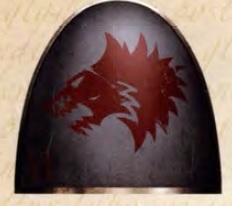

<!-- A0362-B0049 -->

原译文

The symbol of the Space Wolves during the Great Crusade and Horus Heresy 大远征和荷鲁斯叛乱期间太空野狼的标志

**校订译文**

The symbol of the Space Wolves during the Great Crusade and Horus Heresy 大远征和荷鲁斯之乱期间太空野狼的标志

<!-- /A0362-B0049 -->

<!-- A0362-B0050 -->
**英文原文**

This remote land also houses the Sky Warriors of Russ and the hall of the gods. The ultimate triumph of Fenrisian culture is to become one of the chosen Sons of Russ and await the final battle at the end of the universe. Although Fenris is the home of the Space Wolves the chapter only houses the island continent. Their fortress, The Fang, lies at Asaheim's largest peak. The peak rises above the clouds and even beyond the atmosphere where the space faring vessels of the Rout are docked.

<!-- /A0362-B0050 -->

<!-- A0362-B0051 -->

原译文

这片偏远的土地上还有鲁斯的天空勇士房屋和众神大厅。芬里斯人文化的最终成就是成为被选中的鲁斯之子之一，并等待宇宙尽头的最后一场战斗。虽然芬里斯是太空野狼的家园，但该战团只安置在了岛屿大陆。他们的长牙堡位于阿萨海姆最大的山峰上。这座山峰高出云层，甚至远至大气层之外，在那里停泊着狼群的那些星际航行的舰船。

**校订译文**

这片偏远大陆也是鲁斯的天空勇士及众神殿堂的所在。在芬里斯文化中，最高的荣耀就是成为获选的鲁斯之子，等待宇宙终结时的最后一战。太空野狼虽以整个芬里斯为母星，却只驻守这块岛屿大陆。他们的长牙堡建在阿萨海姆最高峰上，峰顶直入云霄，甚至伸出大气层；狼群的星舰就停泊在那里。

<!-- /A0362-B0051 -->

<!-- A0362-B0052 -->
## History 历史

<!-- /A0362-B0052 -->

<!-- A0362-B0053 -->
### Early Days 早期

<!-- /A0362-B0053 -->

<!-- A0362-B0054 -->
**英文原文**

Before the coming of their Primarch Leman Russ, the Space Wolves were known as the VI Legion and was made up of a diverse range of savage and hyper-violent tribesmen from Terra. Alongside the Salamanders and Alpha Legion, the early Space Wolves were among the "Trefoil" Legions, those given highly specialised and unique Gene-Seed by the Emperor for unknown ends. Like the other Trefoil Legions, the VIth was held back from most of the fighting in the Unification Wars and the conquest of the Sol System. The Emperor kept the Legion in deliberate isolation from the rest of their peers.

<!-- /A0362-B0054 -->

<!-- A0362-B0055 -->

原译文

在他们的原体黎曼·鲁斯到来之前，太空野狼被称为第六军团，由来自泰拉的各种野蛮和极端暴力的部落成员组成。除了火蜥蜴和阿尔法军团，早期的太空野狼也是“三叶”军团的一员，这些军团被帝皇授予高度专业化和独特的基因种子，用于未知的目的。与其他三叶军团一样，第六军团在统一战争和征服太阳系的大部分战斗中都受到了阻碍。帝皇故意将军团与其他同事隔离开来。

**校订译文**

原体黎曼·鲁斯归来前，太空野狼只以“第六军团”之名为人所知，成员来自泰拉各个凶悍而极度好战的部族。与火蜥蜴和阿尔法军团一样，他们属于“三叶”军团：帝皇出于不为人知的目的，赋予这些军团高度特化的独特基因种子。第六军团与另外两支三叶军团一样，没有被投入统一战争及征服太阳系的大多数战斗。帝皇刻意让他们远离其他军团，保持隔绝。

<!-- /A0362-B0055 -->

<!-- A0362-B0056 图片 -->
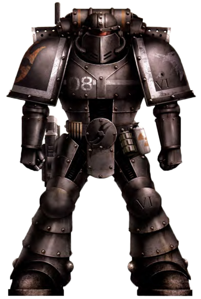

<!-- A0362-B0057 -->

原译文

VI Legion Space Marine before the discovery of Leman Russ 黎曼·鲁斯回归前的第六军团星际战士

**校订译文**

VI Legion Space Marine before the discovery of Leman Russ 黎曼·鲁斯回归前的第六军团星际战士

<!-- /A0362-B0057 -->

<!-- A0362-B0058 -->
**英文原文**

A decade into the Great Crusade, the VI Legion was finally "unleashed" onto the Galaxy by the Emperor. Its first major battle saw all 3,500 Legionaries of the VIth assail the world of Delsvaan as part of the 1st Expeditionary Fleet under the command of the Emperor himself. The VIth operation was led by the Legion's first Master, Enoch Rathvin, who initiated a vicious shock assault on the enemy lines. It was during this battle that the VIth reputation for vicious and brutal assaults was born. The great massacre at Delsvaan's city of Masaanore-Core further solidified this reputation. The early VIth demonstrated a severe lack of discipline and were prone to acts of extreme aggression, as demonstrated by the wanton slaughter of civilians in the Molorian Revolt. As consequence, the Legion instituted a large Disciplinary Corps consisting of Consul-Opsequiari officers.

<!-- /A0362-B0058 -->

<!-- A0362-B0059 -->

原译文

大远征十年后，第六军团终于被帝皇“释放”到银河系。在第一次重大战役中，第六军团的3500名士兵作为帝皇亲自指挥的第一远征舰队的一部分，袭击了德尔斯万世界。第六军团由军团的第一位大师伊诺克·拉什文领导，他对敌方战线发起了猛烈的突击。正是在这场战斗中，第六军团以恶毒和残酷的袭击而闻名。德尔斯万的正教核心城发生的大屠杀进一步巩固了这一声誉。第六军团初期表现出严重缺乏纪律，容易发生极端侵略行为，莫洛里安叛乱中肆意屠杀平民就是明证。因此，军团成立了一个由领事执法官军官组成的大型纪律部队。

**校订译文**

大远征开始十年后，帝皇终于将第六军团“放出”，投入银河征战。在首次大规模作战中，军团全部三千五百名战士随帝皇亲自统率的第一远征舰队，进攻德尔斯万世界。军团首任之主伊诺克·拉什文指挥战士向敌阵发动猛烈强袭；第六军团残暴凶悍的名声正由此而来。德尔斯万的马萨诺尔核心城发生的大屠杀，更加深了这种印象。早期军团严重缺乏纪律，极易施以过度暴力；莫洛里安叛乱期间肆意屠杀平民，便是明证。因此，军团设立了由领事执法官组成的大型军纪部队。

**校注：** Masaanore-Core 为城市专名，暂译“马萨诺尔核心城”；原译“正教核心城”无英文依据。

<!-- /A0362-B0059 -->

<!-- A0362-B0060 -->
**英文原文**

Despite their status as a small Legion during this time, they often served alongside other Legions and large Imperial Army forces in major campaigns or were entrusted with smaller, often bloody missions to destroy particular knots of enemy resistance in shock assaults. They gained infamy for often executing their mortal Imperial Army allies for poor discipline. Over time the Legion developed particular expertise also in conducting rapidly moving hunter-killer operations, particularly in city-fighting conditions, or in undertaking more generally punitive actions, such as suppressing rebellions by inflicting short, brutal reprisal actions. By the second decade of the Great Crusade, the VIth Legion had already earned its reputation as the Emperor's agents of fear and retribution, becoming known as "The Rout".

<!-- /A0362-B0060 -->

<!-- A0362-B0061 -->

原译文

尽管在此期间他们是一个小军团，但他们经常在重大战役中与其他军团和大型帝国军队并肩作战，或者被委托执行较小的、往往是血腥的任务，在突击中摧毁敌人抵抗的特定节点。他们因经常因纪律不佳而处决他们的凡人帝国军队盟友而声名狼藉。随着时间的推移，军团在开展快速移动的猎人杀手行动方面也发展了特殊的专业知识，特别是在城市战斗条件下，或者在采取更普遍的惩罚行动方面，例如通过实施短暂、残酷的报复行动来镇压叛乱。到大远征的第二个十年，第六军团已经赢得了作为帝皇恐惧和报复代理人的声誉，被称为“狼群”。

**校订译文**

当时第六军团虽规模较小，仍常与其他军团及大批帝国军一道参加重大战役；有时也受命执行规模较小、却往往同样血腥的任务，以突击摧毁顽固的敌方据点。他们还因经常处决军纪不佳的凡人帝国军友军而声名狼藉。军团逐渐精通快速机动的猎杀行动，尤其擅长城市战，也常以短促而残酷的报复行动镇压叛乱。大远征进入第二个十年时，第六军团已以帝皇散播恐惧、施行报复的利刃闻名，并获得“狼群”的称呼。

<!-- /A0362-B0061 -->

<!-- A0362-B0062 -->
### Leman Russ 黎曼·鲁斯

<!-- /A0362-B0062 -->

<!-- A0362-B0063 -->
**英文原文**

The Primarch project was the creation of twenty super humans created by the Emperor while preparing his armies for the reconquest of the Galaxy prior to the Great Crusade. However, the experiment never reached its final result due to all twenty infants being scattered among the Galaxy by the forces of Chaos. Over time the Emperor was reunited with his creations each having grown to adulthood and gave them leadership of their respective legions as was originally intended. Leman Russ was one such individual. After being spirited away he found himself on the planet of Fenris. Found young he was raised by some tribesman before being taken in and raised by the court of King Thengir. As he grew so did his legend and eventually Leman Russ found himself the Wolf-King.

<!-- /A0362-B0063 -->

<!-- A0362-B0064 -->

原译文

原体计划是在大远征之前，帝皇在为他的军队重新征服银河系做准备时创造的二十个超人。然而，由于所有二十个婴儿都被混沌的力量分散在银河系中，该实验从未达到最终结果。随着时间的推移，帝皇与他的造物重新团聚，每个造物都长大成人，并按照最初的意图给予他们各自军团的领导权。黎曼·鲁斯就是这样一个人。被分散后，他发现自己来到了芬里斯星球。年轻时，他被一些部落的人抚养长大，然后被恩吉尔王的宫廷收养并抚养长大。随着他的成长，他的传奇也随之发展，最终黎曼·鲁斯发现自己成为了狼王。

**校订译文**

大远征开始前，帝皇为重新征服银河而筹建军队，并通过原体计划创造了二十名超人。然而，二十名尚在襁褓中的原体被混沌力量散落至银河各处，计划未能按预想完成。此后，帝皇陆续找回已经成年的造物，按照最初的安排，让他们统领各自的军团。黎曼·鲁斯就是其中之一。他被带到芬里斯，幼年时被部族成员发现并养育，后来又被恩吉尔王的宫廷收养。随着鲁斯成长，他的传奇也不断流传，最终成为了狼王。

**校注：** 本段叙述鲁斯幼年由部族养育，未提狼群；与某些其他版本可能不同，按所附英文保留。

<!-- /A0362-B0064 -->

<!-- A0362-B0065 图片 -->
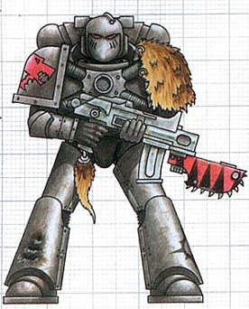

<!-- A0362-B0066 -->

原译文

Pre-Heresy Space Wolves Marine 叛乱前太空野狼战士

**校订译文**

Pre-Heresy Space Wolves Marine 叛乱前太空野狼战士

<!-- /A0362-B0066 -->

<!-- A0362-B0067 -->
**英文原文**

While on his Great Crusade, the world of Fenris was one of the first to be found by the Emperor. Upon hearing the legend of the Wolf-King the Emperor left his great ship to meet the man expecting him to be one of his Primarchs. After a one-on-one battle between the two, Leman Russ was bested for the first time in his life. Satisfied this was one of his Generals, the Emperor soon gave him leadership of the Space Marine Legion that bore his genes. The planet of Fenris was claimed as their chapter's homeworld. Throughout the Great Crusade the Space Wolves won many victories for the Emperor under direction of their Primarch. During the Wheel of Fire Campaign a third of the legion, including the majority of its remaining Terran recruits, was lost. During the campaign against the Noman Xenos, an STC for a new model of tank was discovered by the Space Wolves. The Mechanicum named the new tank design in honour of Leman Russ.

<!-- /A0362-B0067 -->

<!-- A0362-B0068 -->

原译文

在大远征中，芬里斯世界是帝皇最早发现的世界之一。在听到狼王的传说后，帝皇离开了他的巨舰去见那个期待他成为他的原体之一的人。在两人一对一的战斗之后，黎曼·鲁斯一生中第一次被击败。帝皇很满意这是他的将军之一，很快就让他领导了带有他基因的星际战士。芬里斯星球被宣称为他们战团的家园。在整个大远征期间，太空野狼在其原体的领导下为帝皇赢得了许多胜利。在火焰之轮战役中，军团的三分之一，包括其剩余的大部分泰拉裔新兵，都阵亡了。在对抗诺曼异型的战役中，太空野狼发现了一种新型坦克的STC。机械教以黎曼·鲁斯的名字命名了新的坦克设计。

**校订译文**

大远征中，芬里斯是帝皇最早发现的世界之一。听闻狼王的传说后，帝皇怀疑这正是自己的原体之一，便离开巨舰亲自前往会面。两人展开单挑，黎曼·鲁斯平生第一次败北。帝皇确认他就是自己失散的将领之一，很快便将使用其基因的星际战士军团交给他统率，并指定芬里斯为军团的母星。此后，太空野狼在原体指挥下为帝皇赢得无数胜利。火焰之轮战役中，军团损失了三分之一的战士，包括尚存泰拉出身兵员中的大多数。在对诺曼异形的战争中，太空野狼发现了一种新型坦克的 STC，机械教便以黎曼·鲁斯之名为这一设计命名。

<!-- /A0362-B0068 -->

<!-- A0362-B0069 图片 -->
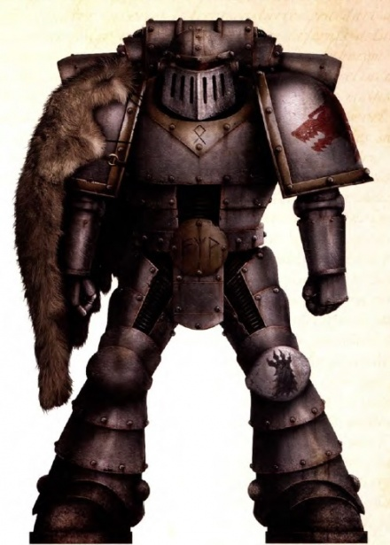

<!-- A0362-B0070 -->

原译文

Space Wolves Great Crusade and Heresy-era colour scheme 太空野狼大远征和叛乱时代配色

**校订译文**

Space Wolves Great Crusade and Heresy-era colour scheme 太空野狼大远征和叛乱时代配色

<!-- /A0362-B0070 -->

<!-- A0362-B0071 -->
### The Lion and the Wolf 狮子与狼

<!-- /A0362-B0071 -->

<!-- A0362-B0072 -->
**英文原文**

Despite their common loyalties to the Imperium, Space Marine Chapters do not always get along. Over the millennia, rivalries inevitably develop for reasons such as territorial disputes and personal sleights, dividing those that once stood together. One such rivalry, ancient in its origin, exists between the Space Wolves and Dark Angels chapters. While the origin of this rivalry has long since passed into legend there are two widely accepted accounts of its birth.

<!-- /A0362-B0072 -->

<!-- A0362-B0073 -->

原译文

尽管他们都忠于帝国，但星际战士战团并不总是相处融洽。几千年来，由于领土争端和个人诡计等原因，竞争不可避免地发展起来，分裂了曾经团结在一起的人。太空野狼和黑暗天使战团之间存在着一种起源古老的竞争。虽然这种竞争的起源早已成为传说，但有两种被广泛接受的说法。

**校订译文**

星际战士战团虽共同效忠帝国，却并非总能和睦相处。数千年间，领土争端、私人冒犯等摩擦难免积累为敌意，使昔日同袍彼此疏远。太空野狼与黑暗天使的宿怨便由来已久，其源头早已化作传说，如今流传着两种广为接受的说法。

<!-- /A0362-B0073 -->

<!-- A0362-B0074 -->
**英文原文**

The first is of the Space Wolves chapter themselves. The Chapter claims that it began during the Horus Heresy when the two chapters were waging the Dulan Campaign together. Legend says that Lion El'Jonson, Primarch of the Dark Angels, advanced his legion without coordinating with his allies. Though his action swiftly won the battle, a great many of the Space Wolves were slain with their flank left unprotected to the enemy's counter-attack. After the conflict the Wolf challenged the Lion to a duel. The battle lasted until both warriors collapsed from exhaustion swearing vengeance upon one another. Over the years it is said that the two developed a mutual respect for one another, but due to their pride both felt honour-bound to fulfill their vows of vengeance.

<!-- /A0362-B0074 -->

<!-- A0362-B0075 -->

原译文

第一个是太空野狼战团本身。该战团声称，它始于荷鲁斯叛乱时期，当时两个战团正在共同发动都兰战役。传说，黑暗天使的原体莱昂·艾尔庄森在没有与盟友协调的情况下推进了他的军团。尽管他的行动迅速赢得了这场战斗，但许多太空野狼被杀，他们的侧翼在敌人反击时没有受到保护。冲突结束后，狼向狮子发起决斗。这场战斗一直持续到两名战士筋疲力尽，发誓要互相复仇。多年来，据说两人相互尊重，但由于他们的骄傲，两人都感到有义务履行复仇的誓言。

**校订译文**

第一种说法来自太空野狼自身。他们声称，宿怨始于荷鲁斯之乱期间两军共同参与的都兰战役。传说黑暗天使原体莱昂·艾尔’庄森未与友军协调，便率军团先行推进。他虽迅速获胜，却使太空野狼的侧翼失去保护，大批野狼战士死于敌人的反击。战后，狼王向雄狮挑战。双方激战至精疲力竭倒下，发誓向彼此报仇。据说两人后来逐渐相互敬重，但骄傲使他们都认为，荣誉要求自己履行当年的复仇誓言。

**校注：** 此则传说将 Dulan Campaign 置于荷鲁斯之乱期间，与前文其他资料中的大远征背景可能冲突；源文已明确并列两种传说，不擅自重排其时间。

<!-- /A0362-B0075 -->

<!-- A0362-B0076 -->
**英文原文**

During a pacification war, the Dark Angels aided the Space Wolves against a particular planet. This planetary leader had insulted Leman Russ's honour and so he wanted to defeat the leader personally for the insult. The Dark Angels and Space Wolves, both led by their respective Primarchs, assaulted the tower where the leader was. Leman Russ burst into the throne room just in time to see Lion El'Jonson beheading the leader. Angry that the honour was not his, Leman Russ marched up to the Lion and punched him in the jaw. This led to a battle that lasted a week or more, until finally Russ saw how immature their squabble was and started laughing. Lion El'Jonson took this as Russ mocking him and breaking the honour of Single Combat, knocked Russ unconscious before escaping the planet with his legion. The Space Wolves considered this an offence believing El'Jonson to be a coward.

<!-- /A0362-B0076 -->

<!-- A0362-B0077 -->

原译文

在一场平定战中，黑暗天使帮助太空野狼对抗一个特定的星球。这位行星领袖侮辱了黎曼·鲁斯的荣誉，所以他想亲自击败这位领袖。黑暗天使和太空野狼都由各自的原体领导，袭击了领袖所在的塔楼。黎曼·鲁斯冲进王座厅，正好看到莱昂·艾尔庄森斩首领袖。黎曼·鲁斯对荣誉不是他的感到愤怒，他走向狮子，一拳打在他的下巴上。这导致了一场持续一周或更长时间的战斗，直到最后鲁斯看到他们的争吵是多么不成熟，开始大笑。莱昂·艾尔庄森将此视为鲁斯嘲笑他并破坏了单挑的荣誉，在带着他的军团离开行星之前将鲁斯打晕。太空野狼认为这是一种冒犯，认为艾尔庄森是个懦夫。

**校订译文**

另一种说法是：在一次平定战争中，黑暗天使协助太空野狼进攻某颗行星。当地统治者曾侮辱黎曼·鲁斯，因此鲁斯决意亲手击败他，洗刷耻辱。两支军团在各自原体率领下突击统治者所在的高塔，鲁斯冲入王座厅时，却正好看见莱昂·艾尔’庄森将对方斩首。夺得敌酋首级的荣耀旁落，鲁斯愤而上前，一拳击中雄狮下颌。两人由此争斗了一周有余，直到鲁斯意识到这场争吵如此幼稚，忍不住笑了出来。莱昂却以为鲁斯是在嘲弄自己、亵渎决斗的荣誉，于是将他击昏，随即带着军团离开行星。太空野狼视此为冒犯，并认为莱昂的举动十分怯懦。

<!-- /A0362-B0077 -->

<!-- A0362-B0078 -->
**英文原文**

Regardless of its origin, the two Legions (and their subsequent Chapters) have never forgotten their feud and tensions run high between them. Though the Chapters have fought together on many occasions the vows made by their progenitors long ago have resulted in customary duels between them. It has come to pass that each time the Chapters meet two champions are selected from both sides to engage in a (usually) non-lethal duel.

<!-- /A0362-B0078 -->

<!-- A0362-B0079 -->

原译文

无论其起源如何，两个军团（及其随后的战团）从未忘记他们之间的宿怨和紧张关系。尽管各战团曾多次并肩作战，但其先祖很久以前许下的誓言导致了他们之间习惯性的决斗。事情已经发展成每当战团相遇时，双方都会选出两名冠军进行（通常）非致命决斗。

**校订译文**

无论起源如何，两支军团及其后来的战团从未忘记这场宿怨，彼此关系始终紧张。他们虽曾多次并肩作战，原体立下的誓言却使决斗成为惯例：每当两团相遇，便各选一名冠军交手，通常不会取对方性命。

<!-- /A0362-B0079 -->

<!-- A0362-B0080 -->
### The Great Crusade 大远征

<!-- /A0362-B0080 -->

<!-- A0362-B0081 -->
**英文原文**

Under Russ' brash leadership the Space Wolves had other incidents with their allied Astartes Legions. This included the Night of the Wolf against the World Eaters and a brief bloody confrontation on Ark Reach Secundus with the Thousand Sons. It was also hinted that the Space Wolves, serving as the Emperor's executioners, may have had something to do with the disappearance of the two lost legions; according to members of the Adeptus Custodes, they were among the first respondents to an act of betrayal involving the XI Legion.

<!-- /A0362-B0081 -->

<!-- A0362-B0082 -->

原译文

在鲁斯盛气凌人的领导下，太空野狼与他们的盟友阿斯塔特军团发生了其他事件。这包括狼之夜对抗吞世者，以及在方舟河段与千子的短暂血腥对抗。也有人暗示，作为帝皇刽子手的太空野狼可能与两个失落军团的消失有关；根据禁军成员的说法，他们是十一军团背叛行为的首批受访者之一。

**校订译文**

在鲁斯豪勇冲动的率领下，太空野狼也与其他阿斯塔特军团发生过冲突，例如对阵吞世者的狼之夜，以及在方舟疆域塞昆杜斯与千子的一次短暂血战。另有暗示称，作为帝皇刽子手的太空野狼，可能与两支失落军团的消失有关。帝皇禁军成员曾表示，涉及第十一军团的一次叛变发生时，太空野狼属于最早出动应对的部队。

**校注：** first respondents 在此指首批出动应对的人员，非采访中的“受访者”。

<!-- /A0362-B0082 -->

<!-- A0362-B0083 -->
**英文原文**

During the 2nd Century of the Great Crusade, the Space Wolves fought a series of secret wars against a variety of cosmic horrors. These included the Enslavers, the psychic kings of Vhallach, and the Lacremara. By the end of the Crusade the Space Wolves had firmly earned their reputation as the Emperor's enforcers and were a mid-sized Legion of around 95,000-100,000. Their many campaigns during the Crusade and issues with their gene-seed had depleted their peak strength of around 130,000.

<!-- /A0362-B0083 -->

<!-- A0362-B0084 -->

原译文

在大远征的第二百年，太空野狼与各种宇宙恐怖进行了一系列秘密战争。这些人包括奴役者、弗拉赫的灵能之王和拉克雷马拉。到大远征结束时，太空野狼已经牢固地赢得了作为帝皇执行者的声誉，并且是一支约9.5万至10万人的中型军团。大远征期间，他们的许多战役和基因种子问题耗尽了他们约13万人的峰值兵力。

**校订译文**

大远征的第二个百年里，太空野狼针对多种宇宙恐怖存在展开秘密战争，包括奴役者、弗拉赫的灵能诸王及拉克雷马拉。至大远征末期，他们已确立帝皇执法者的声名，是一支约九万五千至十万人的中型军团。频繁征战与基因种子问题，使他们从巅峰时期约十三万人的规模逐步减员至此。

<!-- /A0362-B0084 -->

<!-- A0362-B0085 -->
### Horus Heresy 荷鲁斯之乱

原题：Horus Heresy 荷鲁斯叛乱

<!-- /A0362-B0085 -->

<!-- A0362-B0086 -->
**英文原文**

Over time, each of the twenty Primarchs was reunited with the Emperor and took control of their respective legions. Unarguably the most powerful of them all was Horus. Horus was indeed the first Primarch found and became the Emperor's most favoured son. He would come to lead the whole of His armies as the Emperor returned to Holy Terra for other works. With Horus named Warmaster, the Galaxy slowly unified and the Emperor's Imperium began to take shape. During this time all of the Primarchs were tempted by the Chaos Gods and some were slowly twisted by their treacherous ways. Though unknown to them, ten of the Primarchs ultimately failed the test of loyalty and were swayed by the promise of ultimate power. The greatest of this triumph by the Gods of Chaos was the turning of the Warmaster Horus. The Emperor however was always sure that Leman Russ would never fall to Chaos. As a result, in the aftermath of Horus' betrayal, Malcador the Sigillite dispatched a Watch Pack of Space Wolves to each remaining (and supposedly loyal) Primarch to ensure more direct oversight. While the Space Wolves teams sent to oversee the Ultramarines and Imperial Fists were met with bitter cooperation, several such as those dispatched to the Night Lords and Alpha Legion were massacred by those they were meant to watch. The team sent to monitor the Blood Angels initially received fair treatment by Sanguinius, but was wiped out by Legionaires overcome by the Red Thirst during the Battle of Signus Prime.

<!-- /A0362-B0086 -->

<!-- A0362-B0087 -->

原译文

随着时间的推移，二十位原体中的每一位都与帝皇重聚，并控制了各自的军团。毫无疑问，其中最强大的是荷鲁斯。荷鲁斯确实是第一位被发现的原体，并成为帝皇最宠爱的儿子。当帝皇返回神圣泰拉进行其他工作时，他将率领他的全部军队。随着荷鲁斯被任命为战帅，银河系慢慢统一，帝皇的帝国开始成形。在这段时间里，所有的原体都受到了混沌诸神的诱惑，有些人慢慢被他们的奸诈所扭曲。尽管他们不知道，但十位原体最终未能通过忠诚的考验，并被终极力量的承诺所动摇。混沌诸神取得的这场胜利中最伟大的一次是战帅荷鲁斯的转变。然而，帝皇总是确信黎曼·鲁斯永远不会堕入混沌。因此，在荷鲁斯背叛之后，掌印者马卡多向每一位剩下的（据称是忠诚的）原体派遣了一支太空野狼观察队，以确保更直接的监督。虽然被派去监督极限战士和帝国之拳的太空野狼遭到了令人不快的协作，但一些被派往午夜领主和阿尔法军团的人却被他们要监视的人屠杀了。被派去监视圣血天使的小队最初受到了圣吉列斯的公平对待，但在西格纳斯主星战役中被被血渴战胜的军团士兵消灭了。

**校订译文**

原稿叙述，二十位原体陆续与帝皇重逢，接掌各自军团，其中最强大的无疑是荷鲁斯。他是最早被找回的原体，也成为帝皇最宠爱的儿子。帝皇返回神圣泰拉处理其他事务后，由荷鲁斯统率全部军队。他受命为战帅，银河逐渐被统一，帝国也开始成形。其间，所有原体都受到混沌诸神诱惑，有些逐步被其诡计扭曲；原稿称，最终有十位原体未能通过忠诚的考验，被无上力量的许诺蛊惑。其中，策反战帅荷鲁斯是混沌诸神最重大的胜利。不过，帝皇始终确信黎曼·鲁斯不会堕入混沌。因此，荷鲁斯叛变后，掌印者马卡多向每一位尚存、据称仍忠诚的原体派出一支太空野狼监视小队，实行更直接的监督。极限战士与帝国之拳虽心怀不满，仍配合这些小队；派往午夜领主和阿尔法军团等军团的小队，却遭到监视对象屠杀。圣吉列斯起初公正地对待前来监督圣血天使的小队，但在西格纳斯主星战役期间，这支小队被陷入血渴的军团战士全数杀死。

**校注：** 原文明确写 twenty Primarchs 与 ten of the Primarchs ultimately failed；保留该原稿计数，并用“原稿叙述/称”提示。这与常见的两支失落军团、九支叛乱军团口径不直接等同，不凭记忆改成另一数字。

<!-- /A0362-B0087 -->

<!-- A0362-B0088 图片 -->
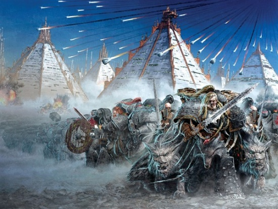

<!-- A0362-B0089 -->

原译文

Leman Russ and the Space Wolves on Prospero 黎曼·鲁斯和太空野狼在普罗斯佩罗

**校订译文**

Leman Russ and the Space Wolves on Prospero 黎曼·鲁斯和太空野狼在普洛斯佩罗

<!-- /A0362-B0089 -->

<!-- A0362-B0090 -->
**英文原文**

During the Horus Heresy, the Space Wolves were not present at the Drop Site Massacre nor the Siege of Terra. Space Wolves are known to have been ordered to retrieve Magnus the Red and return him to Terra after the Primarch's violation of the Council of Nikea. After the now-corrupted Horus tried to influence Russ to change his mission from bringing Magnus to Terra to an all-out assault on his legion. Leman Russ had the Space Wolves Legion attack the Thousand Sons Legion homeworld, Prospero, in an attempt to fulfill their Emperor's charge. Though the planet was devastated in the assault, the bulk of the traitor legion escaped and made for the Eye of Terror. The 13th Great Company, led by Jorin Bloodhowl, pursued the traitors and elements of the Wulfenkind would not be seen for the next 10,000 years. After Prospero, the Space Wolves were assailed in space by the Alpha Legion and forced to flee to the Alaxxes Nebula. The Wolves were ultimately saved by a force of Dark Angels. Afterwards, at least some elements of the Legion managed to return to Terra, as Russ was able to meet with Malcador and organise the plot to have the Knights-Errant assassinate Horus. Meanwhile, some isolated Space Wolves reconsidered their loyalties; one contingent declared for the Warmaster and subsequently became part of Cadre-captain Skyrar's murderous warband.

<!-- /A0362-B0090 -->

<!-- A0362-B0091 -->

原译文

在荷鲁斯叛乱期间，太空野狼既没有出现在登陆点大屠杀中，也没有出现在泰拉围城中。众所周知，在原体违反尼凯亚会议后，太空野狼被命令挽回赤红之马格努斯并将其送回泰拉。在堕落的荷鲁斯试图影响鲁斯将他的任务从将马格努斯带到泰拉改为对他的军团进行全面攻击之后。黎曼·鲁斯让太空野狼军团袭击了千子军团的家园普罗斯佩罗，试图履行他们帝皇的命令。尽管星球在袭击中被摧毁，但大部分叛徒军团逃脱并前往恐惧之眼。由乔林·血嚎领导的第十三大连追捕叛徒，在接下来的一万年里，狼人大连的势力将不复存在。在普罗斯佩罗之后，太空野狼在太空中遭到阿尔法军团的袭击，被迫逃往阿拉克斯星云。野狼最终被黑暗天使的部队拯救。之后，至少有一些军团成员设法回到了泰拉，因为鲁斯能够与马卡多会面并组织密谋让游侠骑士暗杀荷鲁斯。与此同时，一些孤立的太空野狼重新考虑了他们的忠诚；一支队伍宣布加入战帅，随后成为骨干连长斯凯拉凶残的战帮的一员。

**校订译文**

荷鲁斯之乱期间，太空野狼军团既未参与登陆点大屠杀，也未以主力参加泰拉围城战。红魔马格努斯违反尼凯亚会议禁令后，太空野狼奉命将他带回泰拉。然而，已遭腐化的荷鲁斯试图说服鲁斯，把逮捕马格努斯的任务改为全面攻击千子军团。鲁斯于是下令进攻千子的母星普洛斯佩罗，自认为是在执行帝皇的使命。星球遭到毁灭性打击，但大部分千子战士逃脱，进入了恐惧之眼。乔林·血嚎率第十三大连紧追其后，此后整整一万年，人们再未见到这支狼人大连的部分成员。战后，太空野狼在太空遭阿尔法军团袭击，被迫退入阿拉克斯星云，最终由一支黑暗天使部队解围。至少部分军团成员随后返回泰拉，鲁斯也得以会见马卡多，安排由游侠骑士刺杀荷鲁斯的计划。与此同时，一些与军团失散的太空野狼重新审视了自己的立场；其中一支部队转而效忠战帅，后来加入分队长斯凯拉的凶残战帮。

**校注：** 开头称太空野狼未参与泰拉围城，后文及其他资料又涉及个别驻泰拉成员；译文限定为军团主力。elements ... would not be seen 指部分部队一万年未再现身，非“势力不复存在”。

<!-- /A0362-B0091 -->

<!-- A0362-B0092 -->
**英文原文**

Russ eventually led the Wolves out from Terra to try and engage Horus. However, though wounding Horus at the Battle of Trisolian, the Space Wolves were badly mauled and Russ fell into a coma. Though they managed to escape Trisolian, the leaderless Wolves were besieged by pursuing traitor forces at Yarant. During the battle, Russ awoke only when Corax arrived with the Raven Guard, awake long enough to greet the Ravenlord and give Bjorn the Spear of Russ. In the end, the Space Wolves were able to evacuate Yarant with Corax's aid but Russ remained unconscious. Russ eventually recovered on Deliverance and then the Wolves linked up with Lion El'Jonson and his Dark Angels. Together they besieged the Death Guard Homeworld of Barbarus. Personifying the role of the Emperor's executioners, the resurgent Space Wolves went on a rampage of vengeance against all traitors they could find, purging the world of Vezdell Secundus of a large Alpha Legion force.

<!-- /A0362-B0092 -->

<!-- A0362-B0093 -->

原译文

鲁斯最终带领野狼从泰拉出发，试图与荷鲁斯交战。然而，尽管在特里索兰之战中打伤了荷鲁斯，但太空野狼受到了重创，鲁斯陷入了昏迷。尽管他们设法逃离了特里索兰，但无领袖的野狼在雅兰特被追击的叛徒部队围困。在战斗中，只有当科拉克斯带着暗鸦守卫到达时，鲁斯才醒了过来，醒了足够长的时间来迎接渡鸦领主，并将鲁斯之矛交给比约恩。最后，太空野狼在科拉克斯的帮助下撤离了雅兰特，但鲁斯仍然昏迷不醒。鲁斯最终在拯救星上康复，然后野狼与莱昂·艾尔庄森和他的黑暗天使联军在一起。他们一起围攻了巴巴鲁斯的死亡守卫家园。复活的太空野狼将帝皇刽子手的角色发挥的淋漓尽致，对他们能找到的所有叛徒进行了疯狂的复仇，清除了韦兹德尔二号世界的一支庞大的阿尔法军团。

**校订译文**

鲁斯最终率领太空野狼离开泰拉，主动寻求与荷鲁斯交战。特里索兰战役中，他虽击伤荷鲁斯，军团却遭到重创，自己也陷入昏迷。野狼逃出特里索兰后，在雅兰特被追兵围困，失去了能够统率全军的领袖。直到科拉克斯带着暗鸦守卫抵达，鲁斯才短暂苏醒，向渡鸦领主致意，并将鲁斯之矛交给比约恩，随后又失去意识。太空野狼在科拉克斯帮助下撤离雅兰特，鲁斯后来于拯救星康复。军团随后与莱昂·艾尔’庄森及其黑暗天使会合，共同围攻死亡守卫母星巴巴鲁斯。恢复实力的太空野狼再次扮演帝皇刽子手，向所能找到的一切叛军展开猛烈报复，并在韦兹德尔二号世界清除了一支庞大的阿尔法军团部队。

<!-- /A0362-B0093 -->

<!-- A0362-B0094 -->
**英文原文**

After the Heresy, Leman Russ was infuriated for not being at the Siege of Terra to aid the Emperor. He personally led a force into the Eye of Terror in the hopes of revenge. Eventually Russ disappeared altogether, pledging to return in the final battle of the "Wolf Time". Leman Russ then vanished and the true whereabouts of the Primarch remain a mystery. Many within the Chapter maintain that Russ has sought out the fabled Tree of Life in a bid to heal the Emperor. Apparently Magnus the Red knows, but the Daemon Primarch and his Thousand Sons are not sharing that information with any outside their traitorous ranks.

<!-- /A0362-B0094 -->

<!-- A0362-B0095 -->

原译文

叛乱之后，黎曼·鲁斯因没有参加泰拉围城来帮助帝皇而感到愤怒。他亲自率领一支部队进入恐惧之眼，希望复仇。最终，鲁斯完全消失了，并承诺在“狼之时刻”的最后一战中回归。黎曼·鲁斯随后消失了，原体的真实下落仍然是个谜。战团许多人认为，鲁斯寻找传说中的生命之树是为了治愈帝皇。显然，赤红之马格努斯知道，但恶魔原体和他的千子不会与任何叛徒队伍以外的人分享这些信息。

**校订译文**

荷鲁斯之乱后，黎曼·鲁斯因未能在泰拉围城时援助帝皇而愤懑不已，亲率部队进入恐惧之眼寻求复仇。最终，他彻底失去踪迹，只留下会在“狼之时刻”的最终大战中归来的承诺。原体的下落至今仍是谜。战团许多人相信，他正在寻找传说中的生命之树，以治愈帝皇。红魔马格努斯似乎知晓内情，但这位恶魔原体及其千子从不向叛徒阵营以外的人透露。

<!-- /A0362-B0095 -->

<!-- A0362-B0096 -->
**英文原文**

Nonetheless, the Space Wolves waited for his return. Every year, his place was laid at the feast table, and every year his great drinking horn was filled, in case he should return. The years slunk past and still he did not come. After seven years, the surviving Wolf Lords gathered and elected Bjorn their leader, awarding him the title Great Wolf. Bjorn gathered all his warriors together in the Hall of the Fang, and announced the first Great Hunt. Russ’ people would seek out their master if it took the rest of time to do it. So did the twelve Great Companies take to their ships and sail forth in separate directions across the Sea of Stars.

<!-- /A0362-B0096 -->

<!-- A0362-B0097 -->

原译文

尽管如此，太空野狼仍在等待他的归来。每年，他的位置都摆在餐桌上，每年他的大酒角杯都被填满，以待他回来。岁月匆匆流逝，他还是没来。七年后，幸存的狼主聚集在一起，选举比约恩为他们的领袖，授予他“头狼”的称号。比约恩把所有的战士聚集在长牙大厅，宣布了第一次大狩猎。鲁斯的子嗣们就算穷尽余生，也会去寻找他们的主人。十二个大连也各自登船，分别驶向星海。

**校订译文**

太空野狼依然等待原体归来。每年宴会上，他们都会为鲁斯留出座位，将他巨大的角杯斟满酒。岁月流逝，鲁斯却始终未归。七年后，尚存的狼主们聚集，推举比约恩为领袖，授予他“头狼”的称号。比约恩将全体战士召集至长牙堡大厅，宣布开始第一次大狩猎。鲁斯的子嗣誓要找回主人，哪怕寻遍余下的所有岁月。于是，十二个大连登上各自舰船，向星海的不同方向出发。

<!-- /A0362-B0097 -->

<!-- A0362-B0098 -->
**英文原文**

The tale of their deeds is too long to recount in full, save on Allwinter’s Eve, when the Rune Priests gather to chant the sagas. They sought Russ on many worlds and in many places. They fought intense battles against aliens and overcame voidspawn and raging Daemon alike. The Space Wolves hunted in this dimension and the next, but of Russ they found no sign, until eventually they were recalled to Fenris bearing naught but tales of their adventures. Thus the first Great Hunt ended in failure. Since that day there have been many other Great Hunts – on occasion, Russ has appeared to a Great Wolf or Rune Priest in a vision and told him it is time. These are periods of daring deeds and high adventure, when the Chapter takes to the Sea of Stars to seek their lost leader. Though they have never been successful in their goal, each Great Hunt has struck a decisive blow against the enemies of Mankind.

<!-- /A0362-B0098 -->

<!-- A0362-B0099 -->

原译文

他们的事迹太长了，无法完整讲述，除非在全冬之夜，符文祭司们聚集在一起吟唱传奇。他们在许多世界和许多地方寻找鲁斯。他们与异型进行了激烈的战斗，并克服了虚空卵和狂暴的恶魔。太空野狼在这个维度和下一个维度狩猎，但他们没有发现任何关于鲁斯的迹象，直到最终他们被召回芬里斯，只带着他们的冒险故事。因此，第一次大狩猎以失败告终。从那天起，又发生了许多其他的大狩猎—有时，鲁斯会在异象中出现在头狼或符文牧师面前，告诉他是时候了。这是一个大胆行动和高价值冒险的时期，战团前往星海寻找他们失踪的领袖。尽管他们的目标从未成功，但每一次大狩猎都对人类之敌造成了决定性的打击。

**校订译文**

他们的事迹绵长，只有在全冬之夜符文牧师聚集吟唱传奇时，才有机会完整讲述。他们踏遍无数世界，与异形激战，战胜虚空孽物及狂暴恶魔，在此界与彼界追寻，却始终找不到鲁斯的踪迹。最终，他们奉召回到芬里斯，带回的只有冒险故事；第一次大狩猎就这样失败了。此后又有过许多次大狩猎：偶尔，鲁斯会在头狼或符文牧师的幻象中现身，告诉对方时机已到。每到这时，战团就会扬帆星海，踏上大胆而壮阔的征途，寻找失落的领袖。虽然从未达成目标，每一次大狩猎都沉重打击了人类之敌。

<!-- /A0362-B0099 -->

<!-- A0362-B0100 -->
### Codex Astartes 阿斯塔特圣典

<!-- /A0362-B0100 -->

<!-- A0362-B0101 -->
**英文原文**

Following the end of the Heresy, a great deal would happen. With the Emperor confined to the Golden Throne the High Lords of Terra found themselves the new leaders of the Emperor's domain. Both the High Lords and surviving Primarchs became paranoid of the possibility of such events repeating themselves. The armies of the Emperor once again scoured the Galaxy seeking out all forms of heresy and removing even the slightest chance of rebellion. Even the great Legions were not exempt. Concerned that once again their could be a threat from such a terrible force, each Legion was to be divided into smaller Chapters and a new set of regulations was created to govern them.

<!-- /A0362-B0101 -->

<!-- A0362-B0102 -->

原译文

叛乱结束后，发生很多事情。随着帝皇被限制在黄金王座上，泰拉的高领主们发现自己成为了帝皇领地的新领导人。无论是高领主还是幸存的原体，都对此类事件重演的可能性产生了偏执。帝皇的军队再次搜查银河系，寻找各种形式的异端，甚至消除了最轻微的叛乱可能。即使是伟大的军团也不能幸免。由于担心他们可能再次受到如此可怕的力量的威胁，每个军团都将被分成更小的战团，并制定了一套新的规章制度来管理他们。

**校订译文**

荷鲁斯之乱结束后，帝国发生了深刻变化。帝皇被困于黄金王座，泰拉高领主接掌统治。无论高领主还是幸存的原体，都极度担忧类似灾难再度发生。帝皇的军队再次扫荡银河，搜寻一切异端，力图根绝任何叛乱的可能；强大的军团也不能例外。为了防止如此庞大的军力再次构成威胁，各军团被要求拆分为较小的战团，并接受一套全新规章的约束。

<!-- /A0362-B0102 -->

<!-- A0362-B0103 图片 -->
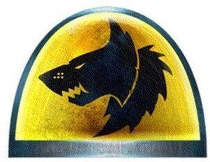

<!-- A0362-B0104 -->

原译文

Space Wolves shoulder symbol post-heresy 叛乱后太空野狼肩标

**校订译文**

Space Wolves shoulder symbol post-heresy 叛乱后太空野狼肩标

<!-- /A0362-B0104 -->

<!-- A0362-B0105 -->
**英文原文**

The Codex Astartes was a code developed by the Primarch of the Ultramarines, Roboute Guilliman. This tome would contain everything a member of the Astartes would need to know to function. From recruitment to organisation to tactics and beyond, the Codex Astartes became a sacred text to the majority of the Chapters. The Space Wolves Legion never fully accepted the new doctrine. Rather, they hold sacred the teachings of their Primarch. One of the most significant changes within the new Codex was the newly founded Chapters. Where the Legions could number more than 10,000 strong, the Chapters would be limited to about a thousand. Each original Legion would be divided as many times as needed into Successor Chapters. This division would come to be called the Second Founding. The remaining thousand bodies in the original Legion would survive as a new Chapter of the same name, while their newly created Chapters would claim their founders' origins and be known as their Founding Chapter. Beyond this however, the chapters would operate independently, and come to develop their own namesake, culture, and customs.

<!-- /A0362-B0105 -->

<!-- A0362-B0106 -->

原译文

阿斯塔特圣典是由极限战士原体罗伯特·基里曼制定的圣典。这本书将包含阿斯塔特成员运作所需的一切。从招募到组织，再到战术及其他方面，阿斯塔特圣典成为大多数战团的神圣文本。太空野狼军团从未完全接受这一新学说。相反，他们认为他们的原体的教义是神圣的。新圣典中最重要的变化之一是新成立的战团。如果军团的人数超过10000人，那么战团的数量将限制在1000人左右。每个原始军团都将根据需要多次划分为子战团。这个划分被称为二次建军。原始军团中剩下的1000人将作为同名的新战团存在，而他们新建立的战团将宣告其建军的起源，并被称为他们的建军战团。然而，除此之外，这些战团将独立运作，并发展自己的同名、文化和习俗。

**校订译文**

极限战士原体罗保特·基里曼编纂了《阿斯塔特圣典》，将阿斯塔特履职所需的知识汇集成册，涵盖征兵、组织、战术等各方面，成为多数战团奉行的神圣典籍。太空野狼却从未全盘接受这套新制度，而是尊奉自己原体的教导。圣典最重大的改革之一，是以战团取代军团：过去一个军团可以拥有一万余名战士，而一个战团的规模则被限制在约一千人。各军团据自身兵力拆分，建立相应数量的子战团，这就是第二次建军。原军团留下的一千人组成沿用原名的新战团，其余新建战团承认共同的血脉起源，并将前者视为母团。除此之外，各战团独立行动，逐渐形成自己的名称、文化与习俗。

**校注：** 英文末段 Founding Chapter 的语法与指代混乱；依上下文将继承原军团名称的战团译为新建子战团的母团，避免把各子战团都称作自身的建军战团。

<!-- /A0362-B0106 -->

<!-- A0362-B0107 -->
**英文原文**

One of the few ideals the Codex implemented that the Space Wolves Legion actually accepted was the succession of Chapters. However, the Space Wolves Legion was never very large. This, combined with the genetic instability of the Legion gene-seed and grievous losses to their gene-seed in the Battle of the Fang of M32 led to the Legion only founding one successor Chapter, the ill-fated Wolfbrothers. Recently however, in the Ultima Founding, the Space Wolves have received their first stable Successor Chapters, which include the Icefangs, Mooneaters and the Wolfspear. These successors are bound with their parent chapter by the psychic powers of Fenris and cultural ties.

<!-- /A0362-B0107 -->

<!-- A0362-B0108 -->

原译文

圣典实施的为数不多的、太空野狼军团实际接受的之一是战团的继承。然而，太空野狼军团的规模从来都不是很大。再加上军团基因种子的遗传不稳定，以及在M32长牙之战中基因种子的严重损失，导致军团只建立了一个子战团，即命运多舛的狼兄弟。然而，最近，在极限建军中，太空野狼获得了他们的第一批稳定的子战团，其中包括冰牙、吞月者和狼矛。这些子战团与他们的父辈受到芬里斯的灵能力量和文化联系的束缚。

**校订译文**

通过拆分建立子战团，是太空野狼实际接受的少数圣典改革之一。但军团规模本就不大，基因种子又不稳定；后来第32千年长牙之战还使其基因种子储备蒙受重创。这些因素限制了后续建军，使其在很长时期内只有命运多舛的狼兄弟这一子战团。直到近年的极限建军，太空野狼才获得首批稳定的子战团，包括冰牙、吞月者与狼矛。这些子战团通过芬里斯的灵能力量与共同文化，同母团保持着密切联系。

**校注：** 源文将 M32 基因种子损失与早先只建立狼兄弟直接相连，存在先后因果含混；译文说明其限制的是后续建军，保留该损失及狼兄弟事实。

<!-- /A0362-B0108 -->

<!-- A0362-B0109 -->
### Recent History 近期历史

<!-- /A0362-B0109 -->

<!-- A0362-B0110 -->
### Timeline 时间线

<!-- /A0362-B0110 -->

<!-- A0362-B0111 -->
**英文原文**

M32

**补译**

第32千年

<!-- /A0362-B0111 -->

<!-- A0362-B0112 图片 -->
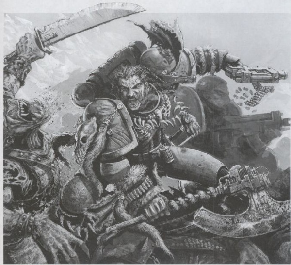

<!-- A0362-B0113 -->

原译文

Space Wolf kills Ork 太空野狼杀死欧克

**校订译文**

Space Wolf kills Ork 太空野狼杀死欧克

<!-- /A0362-B0113 -->

<!-- A0362-B0114 -->

原译文

M32 — Battle of the Fang 长牙之战

**校订译文**

M32 — Battle of the Fang 长牙之战

<!-- /A0362-B0114 -->

<!-- A0362-B0115 -->
**英文原文**

544.M32 — The War of the Beast. As the Chapter battle the Orks across the Galaxy, a Space Wolves force under Wolf Lord Asger arrived on Terra for an offensive against Ullanor.

<!-- /A0362-B0115 -->

<!-- A0362-B0116 -->

原译文

野兽之战。当战团在银河系与欧克作战时，狼主阿斯格率领的太空野狼部队抵达泰拉，对乌兰诺发动进攻。

**校订译文**

M32.544：野兽战争。太空野狼在银河各地与欧克交战之际，狼主阿斯格率领的一支部队抵达泰拉，准备参加对乌兰诺的进攻。

<!-- /A0362-B0116 -->

<!-- A0362-B0117 -->
**英文原文**

M36

**补译**

第36千年

<!-- /A0362-B0117 -->

<!-- A0362-B0118 -->
**英文原文**

M36 — The Space Wolves drive the Blood Gorgons from their then homeworld, after the Gorgons have been declared Excommunicate Traitoris within six decades of their Founding.

<!-- /A0362-B0118 -->

<!-- A0362-B0119 -->

原译文

在鲜血戈尔贡在成立60年后被宣布为绝罚叛徒后，太空野狼将鲜血戈尔贡赶出了他们当时的家园。

**校订译文**

M36：鲜血戈尔贡建军尚未满六十年，便被宣布为绝罚叛徒；太空野狼随后将其逐出当时的母星。

<!-- /A0362-B0119 -->

<!-- A0362-B0120 -->
**英文原文**

M36 — The Plague of Unbelief — The Space Wolves protect Fenris from the forces of the rebellious Cardinal Bucharis. Fenris itself is invaded, but in the end the Wolves successfully defend The Fang after a 3 year siege.

<!-- /A0362-B0120 -->

<!-- A0362-B0121 -->

原译文

无信瘟疫—太空野狼保护芬里斯免受叛乱枢机主教布查里斯的部队。芬里斯本身被入侵，但最终在围攻三年后，野狼成功保卫了长牙堡。

**校订译文**

M36：无信瘟疫。叛乱枢机主教布查里斯率部入侵芬里斯；太空野狼经历三年围攻，最终守住了长牙堡。

<!-- /A0362-B0121 -->

<!-- A0362-B0122 -->
**英文原文**

M36 — The Skarath Crusade — The Space Wolves were the first to use the Predator Annihilator against Chaos forces.

<!-- /A0362-B0122 -->

<!-- A0362-B0123 -->

原译文

斯卡拉特远征—太空野狼是第一个使用掠食者歼灭者对抗混沌势力的人。

**校订译文**

M36：斯卡拉特远征。太空野狼首次使用歼灭者型掠食者战车对抗混沌部队。

<!-- /A0362-B0123 -->

<!-- A0362-B0124 -->

原译文

???.~M36 — The Jacobean Censure 雅各布谴责

**校订译文**

???.~M36 — The Jacobean Censure 雅各布谴责

<!-- /A0362-B0124 -->

<!-- A0362-B0125 -->
**英文原文**

M41/M42

**补译**

第41千年／第42千年

<!-- /A0362-B0125 -->

<!-- A0362-B0126 图片 -->
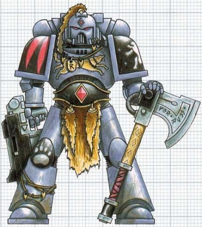

<!-- A0362-B0127 -->

原译文

Space Wolves Space Marine 太空野狼星际战士

**校订译文**

Space Wolves Space Marine 太空野狼星际战士

<!-- /A0362-B0127 -->

<!-- A0362-B0128 -->

原译文

???.M41 - The Fall of Kanak 卡纳克之陨

**校订译文**

???.M41 - The Fall of Kanak 卡纳克之陨

<!-- /A0362-B0128 -->

<!-- A0362-B0129 -->

原译文

???.M41 — The Battle for Montberg Spaceport 蒙特伯格太空港之战

**校订译文**

???.M41 — The Battle for Montberg Spaceport 蒙特伯格太空港之战

<!-- /A0362-B0129 -->

<!-- A0362-B0130 -->
**英文原文**

392-399.M41 — The Macharian Crusade. Forces under Ulrik Grimfang participate in the Crusade alongside Solar Macharius while in search for an artifact of Leman Russ.

<!-- /A0362-B0130 -->

<!-- A0362-B0131 -->

原译文

马卡里安远征。乌尔里克·冷牙率领的部队与太阳领主马卡里安一起参加远征，寻找黎曼·鲁斯的神器。

**校订译文**

M41.392—399：马卡里安远征。乌尔里克·冷牙率领部队随太阳领主马卡里亚出征，同时寻找黎曼·鲁斯的一件遗物。

<!-- /A0362-B0131 -->

<!-- A0362-B0132 -->
**英文原文**

444.M41 — First War for Armageddon — Logan Grimnar led 300 Space Wolves alongside 100 Grey Knights against Angron and a diabolic horde of Khorne.

<!-- /A0362-B0132 -->

<!-- A0362-B0133 -->

原译文

第一次阿玛吉多顿之战—罗根·格里姆纳尔率领300名太空野狼和100名灰骑士对抗安格隆和一个恐虐恶魔部落。

**校订译文**

M41.444：第一次阿玛吉多顿战争。洛根·格里姆纳尔率三百名太空野狼，与一百名灰骑士并肩对抗安格隆及其恐虐恶魔大军。

<!-- /A0362-B0133 -->

<!-- A0362-B0134 -->
**英文原文**

445.M41 — The Months of Shame — In the aftermath of the Armageddon conflict the Space Wolves move to protect Imperial Guard and civilians from Armageddon from Inquisitorial purges, leading to a first a "Cold War" and eventually a direct clash between the two powers. At the conflicts peak, Fenris itself is besieged.

<!-- /A0362-B0134 -->

<!-- A0362-B0135 -->

原译文

耻辱之月-在阿玛吉多顿冲突之后，太空野狼采取行动保护帝国卫队和平民免受审判庭对阿玛吉多顿的净化，导致了第一次“冷战”，最终导致了两个势力之间的直接冲突。在冲突高峰期，芬里斯本身也被围困。

**校订译文**

M41.445：耻辱之月。阿玛吉多顿战争结束后，太空野狼保护当地的帝国卫队与平民，阻止审判庭清洗他们。双方起初展开“冷战”，后来演变为直接武装冲突；最激烈时，连芬里斯也遭到围攻。

<!-- /A0362-B0135 -->

<!-- A0362-B0136 -->

原译文

499.M41 — The Palacia Heresy 帕拉西亚叛乱

**校订译文**

499.M41 — The Palacia Heresy 帕拉西亚叛乱

<!-- /A0362-B0136 -->

<!-- A0362-B0137 -->
**英文原文**

612.M41 — The War of the Wolf. Logan Grimnar battles the Black Legion in search of a missing member of the lost Wolf Brothers.

<!-- /A0362-B0137 -->

<!-- A0362-B0138 -->

原译文

狼之战争。罗根·格里姆纳尔与黑色军团作战，寻找失踪的狼兄弟的一名成员。

**校订译文**

M41.612：狼之战争。洛根·格里姆纳尔为寻找一名失踪的狼兄弟战团成员，与黑色军团交战。

<!-- /A0362-B0138 -->

<!-- A0362-B0139 -->
**英文原文**

712.M41 — Fielded Vindicator's during the Magdelon Confrontation. There fought also Ragnar Blackmane and his battle-brothers.

<!-- /A0362-B0139 -->

<!-- A0362-B0140 -->

原译文

在马格德隆对峙期间担任维护者。拉格纳·黑鬃和他的战斗兄弟们也在那里作战。

**校订译文**

M41.712：马格德隆对峙中，太空野狼部署了维护者战车。拉格纳·黑鬃及其战斗弟兄也参加了这场战斗。

<!-- /A0362-B0140 -->

<!-- A0362-B0141 -->

原译文

741.M41 — The Vara Rebellion 瓦拉叛乱

**校订译文**

741.M41 — The Vara Rebellion 瓦拉叛乱

<!-- /A0362-B0141 -->

<!-- A0362-B0142 -->

原译文

777.M41 — The Achilus Crusade 阿基里斯远征

**校订译文**

777.M41 — The Achilus Crusade 阿基里斯远征

<!-- /A0362-B0142 -->

<!-- A0362-B0143 -->

原译文

786.M41 — The Scouring of Gnosis 格诺西斯清洗

**校订译文**

786.M41 — The Scouring of Gnosis 格诺西斯清洗

<!-- /A0362-B0143 -->

<!-- A0362-B0144 -->

原译文

830.M41 — The Scrapspire Incursion 碎片尖塔入侵

**校订译文**

830.M41 — The Scrapspire Incursion 碎片尖塔入侵

<!-- /A0362-B0144 -->

<!-- A0362-B0145 -->
**英文原文**

837.M41 — Honour's End- Flesh Tearers and Space Wolves cross swords.

<!-- /A0362-B0145 -->

<!-- A0362-B0146 -->

原译文

荣誉之终—撕肉者和太空野狼剑拔弩张。

**校订译文**

M41.837：荣誉之终。撕肉者与太空野狼爆发冲突。

<!-- /A0362-B0146 -->

<!-- A0362-B0147 -->
**英文原文**

886.M41 — The Fenris Incident. The Ecclesiarchy arrives at Fenris to investigate a claim of their worship of pagan gods. The Space Wolves orbital defenses fire upon the Ecclesiarchy vessel, chasing it away. Almost a year later, an Ecclesiarchy fleet and three Orders of the Adepta Sororitas attempt to land on Fenris by force. A three-week war erupts before the Ecclesiarchy decides to withdraw.

<!-- /A0362-B0147 -->

<!-- A0362-B0148 -->

原译文

芬里斯事件。国教抵达芬里斯，调查他们崇拜异教神的说法。太空野狼轨道防御系统向国教飞船开火，将其赶走。大约一年后，一支国教舰队和三个修女会修会试图强行登陆芬里斯。在国教决定撤军之前，爆发了为期三周的战争。

**校订译文**

M41.886：芬里斯事件。国教派船前来调查太空野狼崇拜异教神祇的传言，遭到战团轨道防御火力驱逐。近一年后，国教舰队与修女会的三个修会试图强行登陆芬里斯；交战三周后，国教决定撤军。

<!-- /A0362-B0148 -->

<!-- A0362-B0149 -->
**英文原文**

894.M41 — The Betalis Campaign. The Space Wolves battle alongside Cadian Imperial Guard to push the Eldar off the Mining World of Betalis III.

<!-- /A0362-B0149 -->

<!-- A0362-B0150 -->

原译文

贝塔利斯战役。太空野狼与卡迪亚帝国卫队并肩作战，将灵族赶出贝塔利斯三号的矿业世界。

**校订译文**

M41.894：贝塔利斯战役。太空野狼与卡迪亚帝国卫队联手，将灵族逐出采矿世界贝塔利斯三号。

<!-- /A0362-B0150 -->

<!-- A0362-B0151 -->
**英文原文**

897.M41 — The Space Wolves engage Hive Fleet Colossus on the world of Thressiax.

<!-- /A0362-B0151 -->

<!-- A0362-B0152 -->

原译文

太空野狼在特瑞西亚斯世界与巨像虫巢舰队交战。

**校订译文**

M41.897：太空野狼在特瑞西亚斯世界与巨像虫巢舰队交战。

<!-- /A0362-B0152 -->

<!-- A0362-B0153 -->

原译文

897.M41 — Battle of Centius Prime 森提乌斯主星之战

**校订译文**

897.M41 — Battle of Centius Prime 森提乌斯主星之战

<!-- /A0362-B0153 -->

<!-- A0362-B0154 -->
**英文原文**

933.M41 — The Battle of Midgardia. The Space Wolves battle Trazyn the Infinite after he invades the world of Midgardia

<!-- /A0362-B0154 -->

<!-- A0362-B0155 -->

原译文

米德加迪亚之战。太空野狼在塔拉辛入侵米德加迪亚世界后与无尽者作战

**校订译文**

M41.933：米德加迪亚之战。无尽者塔拉辛入侵米德加迪亚，太空野狼与之交战。

<!-- /A0362-B0155 -->

<!-- A0362-B0156 -->
**英文原文**

937.M41 — The Third Purging of Lastrati. Five Companies of Space Wolves are deployed to battle the Red Corsairs in the Lastrati System, but are eventually forced to withdraw.

<!-- /A0362-B0156 -->

<!-- A0362-B0157 -->

原译文

第三次拉斯特拉蒂净化。五个太空野狼连队被部署到拉斯特拉蒂星系中与红海盗作战，但最终被迫撤退。

**校订译文**

M41.937：第三次拉斯特拉蒂净化。太空野狼投入五个连，在拉斯特拉蒂星系对抗红海盗，最终被迫撤退。

<!-- /A0362-B0157 -->

<!-- A0362-B0158 -->
**英文原文**

962.M41 — The War of Infamy against the Tau Empire

<!-- /A0362-B0158 -->

<!-- A0362-B0159 -->

原译文

对钛帝国的恶名之战

**校订译文**

M41.962：针对钛帝国的恶名之战。

<!-- /A0362-B0159 -->

<!-- A0362-B0160 -->
**英文原文**

966.M41 — The Battle of Kvariam Alpha. The Space Wolves engage the Tau Empire in an underwater battle on the Ocean World of Kvariam Alpha.

<!-- /A0362-B0160 -->

<!-- A0362-B0161 -->

原译文

科瓦瑞恩·阿尔法之战。太空野狼在科瓦瑞恩·阿尔法海洋世界与钛帝国进行水下战斗。

**校订译文**

M41.966：科瓦瑞恩·阿尔法之战。太空野狼在海洋世界科瓦瑞恩·阿尔法与钛帝国展开水下战斗。

<!-- /A0362-B0161 -->

<!-- A0362-B0162 -->
**英文原文**

998.M41 — The Red Waaagh!, the Space Wolves under Logan Grimnar arrive to aid Alaric Prime from Ork invasion.

<!-- /A0362-B0162 -->

<!-- A0362-B0163 -->

原译文

红潮，罗根·格里姆纳尔率领的太空野狼抵达，协助阿拉里克主星抵御欧克的入侵。

**校订译文**

M41.998：红潮。洛根·格里姆纳尔率太空野狼赶来，援助阿拉里克主星抵御欧克入侵。

<!-- /A0362-B0163 -->

<!-- A0362-B0164 -->
**英文原文**

999.M41 — Third War for Armageddon — The Space Wolves fielded 5 Great Companies in the defence of Armageddon.

<!-- /A0362-B0164 -->

<!-- A0362-B0165 -->

原译文

第三次阿玛吉多顿战争—太空野狼派出5个大连保卫阿玛吉多顿。

**校订译文**

M41.999：第三次阿玛吉多顿战争。太空野狼投入五个大连，参加阿玛吉多顿防御战。

<!-- /A0362-B0165 -->

<!-- A0362-B0166 -->
**英文原文**

999.M41 — The Ormantep Raid. Many suspect the 13th Great Company to be behind the miraculous and mysterious defeat of Black Legion forces assailing the Mining World of Ormantep

<!-- /A0362-B0166 -->

<!-- A0362-B0167 -->

原译文

奥尔曼泰普突袭。许多人怀疑第13大连是袭击奥尔曼泰普矿业世界的黑色军团神奇而神秘失败的幕后黑手

**校订译文**

M41.999：奥尔曼泰普突袭。进攻采矿世界奥尔曼泰普的黑色军团突然遭到神秘而不可思议的惨败，许多人怀疑这是第十三大连所为。

<!-- /A0362-B0167 -->

<!-- A0362-B0168 -->
**英文原文**

999.M41 — The Battle of Nurades — The Wulfen of the 13th Great Company return

<!-- /A0362-B0168 -->

<!-- A0362-B0169 -->

原译文

努拉德斯之战—狼人第十三大连归来

**校订译文**

M41.999：努拉德斯之战。第十三大连的狼人归来。

<!-- /A0362-B0169 -->

<!-- A0362-B0170 -->
**英文原文**

999.M41 — The Hunt for the Wulfen — The Wulfen return from the Eye of Terror amid a series of great Warp Storms across the Imperium. The Space Wolves seek to gather the Wulfen as a clue to find Leman Russ

<!-- /A0362-B0170 -->

<!-- A0362-B0171 -->

原译文

狼人狩猎—狼人大连从恐惧之眼归来，帝国遭遇了一系列巨大的亚空间风暴。太空野狼试图聚集狼人大连作为寻找黎曼·鲁斯的线索

**校订译文**

M41.999：狼人狩猎。帝国各地爆发大规模亚空间风暴之际，狼人从恐惧之眼归来。太空野狼试图将他们召集起来，从中寻找黎曼·鲁斯的线索。

<!-- /A0362-B0171 -->

<!-- A0362-B0172 -->
**英文原文**

999.M41 — The Siege of the Fenris System — After the Wulfen return Fenris itself comes under Chaos and Dark Angels assault as the future of Space Wolves itself seems in jeopardy. Ultimately the Space Wolves are able to reconcile with the Dark Angels coalition and together they defeat Magnus the Red at the cost of Midgardia, Egil Iron Wolf, and the devastation of much of the Fenris System.

<!-- /A0362-B0172 -->

<!-- A0362-B0173 -->

原译文

芬里斯星系围攻—在狼人大连回归后，芬里斯本身也受到了混沌和黑暗天使的攻击，因为太空野狼的未来似乎处于危险之中。最终，太空野狼与黑暗天使联盟和解，他们以米德加迪亚、埃吉尔·铁狼和芬里斯星系的大部分破坏为代价，共同击败了赤红之马格努斯。

**校订译文**

M41.999：芬里斯星系围攻。狼人回归后，芬里斯遭混沌与黑暗天使进攻，战团前途岌岌可危。太空野狼最终与黑暗天使联军和解，合力击败红魔马格努斯；代价是米德加迪亚毁灭、埃吉尔·铁狼阵亡，以及芬里斯星系大片地区遭到蹂躏。

<!-- /A0362-B0173 -->

<!-- A0362-B0174 -->
**英文原文**

999.M41 — Thirteenth Black Crusade — The Space Wolves committed 12 Great Companies against this Black Crusade. The campaign is waged in part out of Logan Grimnar's desire to avenge the Siege of the Fenris System.

<!-- /A0362-B0174 -->

<!-- A0362-B0175 -->

原译文

第十三次黑色远征—太空特狼派了12个大连来对抗这场黑色远征。这场战役的部分原因是罗根·格里姆纳尔希望为芬里斯星系的围攻报仇。

**校订译文**

M41.999：第十三次黑色远征。太空野狼投入全部十二个大连抵抗黑色远征。洛根·格里姆纳尔希望为芬里斯星系遭到围攻复仇，也是参战原因之一。

<!-- /A0362-B0175 -->

<!-- A0362-B0176 -->
**英文原文**

Note: The Space Wolves are 1 of only 4 Space Marine Chapters to have fought in both the Third War for Armageddon and against the Thirteenth Black Crusade.

<!-- /A0362-B0176 -->

<!-- A0362-B0177 -->

原译文

注：太空野狼是仅有的4个参加过第三次阿米吉多顿战争和第十三次黑色远征的星际战士之一。

**校订译文**

注：按本稿记述，太空野狼是仅有的四个同时参加第三次阿玛吉多顿战争、并抵抗第十三次黑色远征的星际战士战团之一。

<!-- /A0362-B0177 -->

<!-- A0362-B0178 -->
**英文原文**

~999.M41 — Space Wolves survivors of the 13th Black Crusade accompanying Saint Celestine take part in the Ultramar Campaign. Later, Space Wolves elements answer the call of the reborn Roboute Guilliman in the Terran Crusade.

<!-- /A0362-B0178 -->

<!-- A0362-B0179 -->

原译文

第13次黑色远征的太空野狼幸存者陪同圣塞勒斯汀参加了奥特拉玛战役。后来，太空野狼部队响应了重生的罗伯特·基里曼在泰拉远征中的号召。

**校订译文**

约 M41.999：第十三次黑色远征中幸存的太空野狼随圣塞莱斯汀参加奥特拉玛战役。后来，部分野狼响应复苏的罗保特·基里曼之召，加入泰拉远征。

<!-- /A0362-B0179 -->

<!-- A0362-B0180 -->
**英文原文**

M42 — As the Great Rift opens, the Space Wolves wage many campaigns to try and contain the chaos. Due to the Third War for Armageddon, Hunt for the Wulfen, and the Siege of the Fenris System, the Chapter is badly depleted. Logan Grimnar begins to battle a massive Ork resurgence in the Fenris Sector, guarding the way to Terra itself. It was then that the first Primaris Space Marines are offered to the Chapter by a Torchbearer Fleet and Krom Dragongaze, who has a positive view of the new warriors. However Grimnar is distrustful of these new marines, who are not of Fenris, and is disdaindul of the "Legion" breaker Roboute Guilliman. Fearing Guilliman seeks to control the Space Wolves, a full muster of the badly depleted chapter takes place at The Fang, and summit with Guilliman is held. Logan seems to deny the newcomers to the Space Wolves and refuses to cooperate with Guilliman, instead seeking to meet and potentially change his fate which he thinks is to die at the hands of Ghazghkull Mag Uruk Thraka. However after hearing of the experiences of Kjarg Iron-Oath Logan has a change of heart and sees the Primaris Marines as worthy of being true sons of Fenris. Afterwards the Space Wolves become committed to the Indomitus Crusade and seek to smash the Ork threat as Guilliman advances into Imperium Nihilus.

<!-- /A0362-B0180 -->

<!-- A0362-B0181 -->

原译文

随着大裂隙的打开，太空野狼发动了许多战役来试图遏制混沌。由于第三次阿米吉多顿战争、狼人狩猎和芬里斯星系围攻，该战团严重耗尽。罗根·格里姆纳尔开始在芬里斯星区与大规模的兽人复兴作斗争，守卫着通往泰拉的道路。就在那时，火炬手舰队和克罗姆·龙瞪向战团提供了第一批原铸星际战士，他们对新战士持积极态度。然而，格里姆纳尔不信任这些不属于芬里斯的新星际战士，并且蔑视“军团”破坏者罗伯特·基里曼。由于担心基里曼试图控制太空野狼，在长牙堡对严重枯竭的战团进行了全面集结，并与基里曼举行了峰会。罗根似乎拒绝与太空野狼的新来者合作，拒绝与基里曼合作，而是寻求会面并可能改变他的命运，他认为他的命运是将死于碎骨者·马格·乌鲁克·萨拉卡之手。然而，在听到克雅格·铁誓的经历后，罗根改变了主意，认为原铸星际战士值得成为芬里斯的真正子嗣。之后，随着基里曼进入帝国暗面，太空野狼致力于不屈远征，并寻求粉碎欧克的威胁。

**校订译文**

M42：大裂隙开启后，太空野狼多次出征，试图遏制混乱蔓延。第三次阿玛吉多顿战争、狼人狩猎及芬里斯星系围攻已使战团严重减员。洛根·格里姆纳尔又在芬里斯星区对抗卷土重来的庞大欧克势力，守卫通往泰拉的道路。此时，一支持炬舰队在克罗姆·龙瞪协助下，将首批原铸星际战士带给战团；克罗姆对这些新战士十分认可。但格里姆纳尔不信任并非生于芬里斯的外来者，也鄙视当年拆散军团的罗保特·基里曼。他担心基里曼想借此控制太空野狼，便将残存全团召集至长牙堡，与基里曼会谈。起初，洛根似乎拒绝接纳新战士，也不愿与基里曼合作；他更想直面并尝试改变自己认定的命运——死于碎骨者·斯拉卡之手。然而，听闻克雅格·铁誓的经历后，洛根改变态度，承认原铸战士有资格成为真正的芬里斯之子。此后，随着基里曼向帝国暗面推进，太空野狼全力投入不屈远征，决意粉碎欧克威胁。

<!-- /A0362-B0181 -->

<!-- A0362-B0182 -->

原译文

M42 — The Indomitus Crusade 不屈远征

**校订译文**

M42 — The Indomitus Crusade 不屈远征

<!-- /A0362-B0182 -->

<!-- A0362-B0183 -->
**英文原文**

???.M42 — The Battle of Faith's Anchorage. The Space Wolves fleet battle the Sons of Malice.

<!-- /A0362-B0183 -->

<!-- A0362-B0184 -->

原译文

信仰安克雷奇之战。太空野狼舰队与恶怨之子作战。

**校订译文**

M42，具体年份不详：信仰锚地之战。太空野狼舰队与恶怨之子交战。

**校注：** Faith’s Anchorage 是地名，暂译“信仰锚地”，原“信仰安克雷奇”无须借用现实城市译名。

<!-- /A0362-B0184 -->

<!-- A0362-B0185 -->
**英文原文**

???.M42 — Invasion of the Stygius Sector. The Primaris Space Marines earn a strong reputation among the Space Wolves.

<!-- /A0362-B0185 -->

<!-- A0362-B0186 -->

原译文

冥河星区入侵。原铸星际战士在太空野狼中享有盛誉。

**校订译文**

M42，具体年份不详：冥河星区入侵。原铸星际战士在太空野狼中赢得了声望。

<!-- /A0362-B0186 -->

<!-- A0362-B0187 -->
**英文原文**

???.M42 — The War of Beasts. Space Wolves under Haldor Icepelt battle Genestealer Cults on Vigilus.

<!-- /A0362-B0187 -->

<!-- A0362-B0188 -->

原译文

野兽之战。哈尔多.霜皮麾下的太空野狼在警戒星与基因窃取者教派作战。

**校订译文**

M42，具体年份不详：野兽之战。哈尔多·霜皮率太空野狼，在警戒星与基因窃取者教派作战。

**校注：** War of Beasts 为警戒星的“野兽之战”，区别第32千年的 War of the Beast“野兽战争”；依全书定译区分。

<!-- /A0362-B0188 -->

<!-- A0362-B0189 -->

原译文

???.M42 — The Battle for Smelter's Heap 冶炼厂堆之战

**校订译文**

???.M42 — The Battle for Smelter's Heap 冶炼厂堆之战

<!-- /A0362-B0189 -->

<!-- A0362-B0190 -->

原译文

???.M42 — The Battle for Midnight Moon 午夜之月之战

**校订译文**

???.M42 — The Battle for Midnight Moon 午夜之月之战

<!-- /A0362-B0190 -->

<!-- A0362-B0191 -->
**英文原文**

???.M42 - Battle for Pluus-Kambor against the Thousand Sons.

<!-- /A0362-B0191 -->

<!-- A0362-B0192 -->

原译文

普鲁斯·坎博尔之战对抗千子。

**校订译文**

M42，具体年份不详：普鲁斯·坎博尔之战，太空野狼对抗千子。

<!-- /A0362-B0192 -->

<!-- A0362-B0193 -->
**英文原文**

???.M42 — An unsuccessful raid on The Fang by the Haemonculus Khaeghris Xhakt

<!-- /A0362-B0193 -->

<!-- A0362-B0194 -->

原译文

血伶人哈格里斯·沙克特对长牙堡的突袭失败

**校订译文**

M42，具体年份不详：血伶人哈格里斯·沙克特突袭长牙堡，未获成功。

<!-- /A0362-B0194 -->

<!-- A0362-B0195 -->
**英文原文**

???.M42 - The Battle of Jhalheid. The Bloodmaws lead attacks against Ork Space Hulks.

<!-- /A0362-B0195 -->

<!-- A0362-B0196 -->

原译文

贾尔海德之战。血喉领导了对欧克太空废船的攻击。

**校订译文**

M42，具体年份不详：贾尔海德之战。血喉大连率先攻击欧克太空废船。

<!-- /A0362-B0196 -->

<!-- A0362-B0197 -->

原译文

???.M42 - The Battle for Torran 托兰之战

**校订译文**

???.M42 - The Battle for Torran 托兰之战

<!-- /A0362-B0197 -->

<!-- A0362-B0198 -->

原译文

???.M42 - The Battle for Qorannis 科拉尼斯之战

**校订译文**

???.M42 - The Battle for Qorannis 科拉尼斯之战

<!-- /A0362-B0198 -->

<!-- A0362-B0199 -->

原译文

???.M42 - The Battle for Crucible V 熔炉五号之战

**校订译文**

???.M42 - The Battle for Crucible V 熔炉五号之战

<!-- /A0362-B0199 -->

<!-- A0362-B0200 -->
**英文原文**

???.M42 - The Battle of Prospero (M42). Guided by a psychic vision Njal Stormcaller, Arjac Rockfist, and a force of Space Wolves journey to the ruins of Prospero and discover 200 remaining Heresy-era Battle-Brothers of the Thirteenth Company under the command of Bulveye trapped in a labyrinth of portals. Also on the world is Magnus the Red and his Thousand Sons who intend to use the portals to summon an army of Daemons. Ultimately the Wolves are able to recover most of the 13th Great Company and escape Prospero.

<!-- /A0362-B0200 -->

<!-- A0362-B0201 -->

原译文

普罗斯佩罗之战（M42）。在灵能幻象的指引下，尼加尔·风暴呼唤者、阿贾克·石拳和一支太空野狼部队前往普罗斯佩罗的废墟，并在布拉维耶的指挥下发现了第十三连队200名叛乱时代的战斗兄弟，他们被困在迷宫般的门户中。同样在这个世界上的还有赤红之马格努斯和他的千子，他们打算利用门户召唤一支恶魔军队。最终，野狼夺回第13大连的大部分，并逃离普罗斯佩罗。

**校订译文**

M42，具体年份不详：普洛斯佩罗之战。在灵能异象引导下，风暴召唤者纳吉奥、阿贾克·石拳及一支太空野狼部队前往普洛斯佩罗遗迹。他们发现，布拉维耶率领的二百名第十三大连战斗弟兄自荷鲁斯之乱以来一直困在传送门迷宫中。红魔马格努斯及其千子也在这颗星球上，打算利用传送门召唤恶魔大军。野狼最终救回这批第十三大连成员中的大多数，逃离普洛斯佩罗。

**校注：** 原译把 under the command of Bulveye 错接给前来搜救的一方；应为布拉维耶率领的二百名旧部被困。

<!-- /A0362-B0201 -->

<!-- A0362-B0202 -->
**英文原文**

M42: The Space Wolves attempt to counter the Orks during the Psychic Awakening.

<!-- /A0362-B0202 -->

<!-- A0362-B0203 -->

原译文

太空野狼试图在灵能觉醒期间对抗兽人。

**校订译文**

M42：太空野狼在灵能觉醒期间出兵对抗欧克。

<!-- /A0362-B0203 -->

<!-- A0362-B0204 -->

原译文

M42: The Nachmund Rift War 纳克蒙德裂隙战争

**校订译文**

M42: The Nachmund Rift War 纳克蒙德裂隙战争

<!-- /A0362-B0204 -->

<!-- A0362-B0205 -->

原译文

Revenge for Ceibhal 塞布哈尔复仇

**校订译文**

Revenge for Ceibhal 塞布哈尔复仇

<!-- /A0362-B0205 -->

<!-- A0362-B0206 -->

原译文

The Storming of Leckides 莱基兹震荡

**校订译文**

The Storming of Leckides 强攻莱基兹

<!-- /A0362-B0206 -->

<!-- A0362-B0207 -->

原译文

The Purging of Gaivos 盖沃斯净化

**校订译文**

The Purging of Gaivos 盖沃斯净化

<!-- /A0362-B0207 -->

<!-- A0362-B0208 -->

原译文

The Ambush at Gnarion Reef 纳里翁星礁伏击

**校订译文**

The Ambush at Gnarion Reef 纳里翁星礁伏击

<!-- /A0362-B0208 -->

<!-- A0362-B0209 -->

原译文

The Siege of Gottgaard 戈特加德围城战

**校订译文**

The Siege of Gottgaard 戈特加德围城战

<!-- /A0362-B0209 -->

<!-- A0362-B0210 -->

原译文

The Cleansing of Brakhutos 净化布拉胡托斯

**校订译文**

The Cleansing of Brakhutos 净化布拉胡托斯

<!-- /A0362-B0210 -->

<!-- A0362-B0211 -->
**英文原文**

The Battle of Krongar: Ragnar Blackmane and Ghazghkull nearly slay one another.

<!-- /A0362-B0211 -->

<!-- A0362-B0212 -->

原译文

克朗加之战：拉格纳·黑鬃和碎骨者差点互相残杀。

**校订译文**

克朗加之战：拉格纳·黑鬃与碎骨者交手，双方都险些杀死对方。

<!-- /A0362-B0212 -->

<!-- A0362-B0213 -->
### Undated 未注明日期

<!-- /A0362-B0213 -->

<!-- A0362-B0214 图片 -->
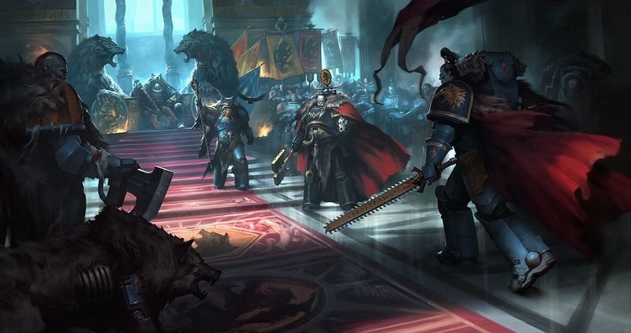

<!-- A0362-B0215 -->

原译文

Council of the Space Wolves on Fenris with Logan Grimnar, Njal Stormcaller, Ulrik, Arjac Rockfist, and the Wolf Lords present 芬里斯的太空野狼议会包括罗根·格里姆纳尔，尼加尔·风暴呼唤者，乌尔里克，阿贾克·石拳和当前的狼主

**校订译文**

Council of the Space Wolves on Fenris with Logan Grimnar, Njal Stormcaller, Ulrik, Arjac Rockfist, and the Wolf Lords present 芬里斯上的太空野狼议会；洛根·格里姆纳尔、风暴召唤者纳吉奥、乌尔里克、阿贾克·石拳及诸位狼主在场。

<!-- /A0362-B0215 -->

<!-- A0362-B0216 -->

原译文

???.M41 — The Crusade of Fire 火焰远征

**校订译文**

???.M41 — The Crusade of Fire 火焰远征

<!-- /A0362-B0216 -->

<!-- A0362-B0217 -->

原译文

???.M41 — The Battle of Issajur 伊萨祖尔之战

**校订译文**

???.M41 — The Battle of Issajur 伊萨祖尔之战

<!-- /A0362-B0217 -->

<!-- A0362-B0218 -->
**英文原文**

Deployed Land Raider Helios against Orks on Centius Prime.

<!-- /A0362-B0218 -->

<!-- A0362-B0219 -->

原译文

在森提乌斯主星部署了兰德掠袭者赫利俄斯对抗欧克。

**校订译文**

在森提乌斯主星部署赫利俄斯型兰德掠袭者战车，对抗欧克。

<!-- /A0362-B0219 -->

<!-- A0362-B0220 -->
**英文原文**

Saw action against the forces of the Draxian Incursion on Medes 841.

<!-- /A0362-B0220 -->

<!-- A0362-B0221 -->

原译文

841，目睹了对抗德拉西安入侵在米堤亚的部队的行动。

**校订译文**

在米堤亚 841 与德拉西安入侵部队交战。

**校注：** 英文 on Medes 841 未清楚说明 841 是地名编号还是年份；按地名后置编号暂留“米堤亚 841”，不擅自补纪年。

<!-- /A0362-B0221 -->

<!-- A0362-B0222 -->
**英文原文**

Saw action against Chaos at Hesperida. Forces included elements of Ragnar Blackmane's Great Company.

<!-- /A0362-B0222 -->

<!-- A0362-B0223 -->

原译文

在赫斯珀里达目睹了对抗混沌的行动。部队包括拉格纳·黑鬃大连的成员。

**校订译文**

在赫斯珀里达与混沌交战，参战部队包括拉格纳·黑鬃大连的部分兵力。

<!-- /A0362-B0223 -->

<!-- A0362-B0224 -->
**英文原文**

Ragnar Blackmane's Great Company was despatched to aid the Imperial Guard forces fighting Chaos at Corinthus V.

<!-- /A0362-B0224 -->

<!-- A0362-B0225 -->

原译文

拉格纳·黑鬃的大连被派往科林图斯五号协助帝国卫队与混沌作战。

**校订译文**

拉格纳·黑鬃的大连被派往科林图斯五号协助帝国卫队与混沌作战。

<!-- /A0362-B0225 -->

<!-- A0362-B0226 -->
**英文原文**

Fielded all but one company to Garm to recover the Spear of Russ from some temple, but it was lost to the warp in order to close a portal being formed by marines of the Thousand Sons.

<!-- /A0362-B0226 -->

<!-- A0362-B0227 -->

原译文

除了一个连队外，其他连队都被派往加姆，从某座神庙夺回鲁斯之矛，但为了关闭千子星际战士正在形成的一个门户，它失踪在了亚空间。

**校订译文**

除一个连外，战团全军出动前往加姆，试图从一座神庙找回鲁斯之矛。然而，为关闭千子战士正在开启的传送门，这把长矛最终遗失于亚空间。

<!-- /A0362-B0227 -->

<!-- A0362-B0228 -->
**英文原文**

Battle at Karnax 17. In this battles against Orks, the Space Wolves lost three entire packs of their warriors.

<!-- /A0362-B0228 -->

<!-- A0362-B0229 -->

原译文

卡纳克斯17号之战。在这场与兽人的战斗中，太空野狼损失了整整三整队战士。

**校订译文**

卡纳克斯 17 号之战。与欧克交战时，太空野狼有整整三个狼群全军覆没。

<!-- /A0362-B0229 -->

<!-- A0362-B0230 -->

原译文

Engagement Bokka'de 博卡’德交战

**校订译文**

Engagement Bokka'de 博卡’德交战

<!-- /A0362-B0230 -->

<!-- A0362-B0231 -->

原译文

Cataklysma Pacification 卡塔克莱斯马平定

**校订译文**

Cataklysma Pacification 卡塔克莱斯马平定

<!-- /A0362-B0231 -->

<!-- A0362-B0232 -->

原译文

Campaign for Hives of Herus 赫鲁斯巢都战役

**校订译文**

Campaign for Hives of Herus 赫鲁斯巢都战役

<!-- /A0362-B0232 -->

<!-- A0362-B0233 -->

原译文

Assault on Dursella 杜塞拉突击

**校订译文**

Assault on Dursella 杜塞拉突击

<!-- /A0362-B0233 -->

<!-- A0362-B0234 -->
**英文原文**

Battle of the Seven Gates — Egil Iron Wolf and his Company fought there

<!-- /A0362-B0234 -->

<!-- A0362-B0235 -->

原译文

七门之战—埃吉尔·铁狼和他的连队在那里作战

**校订译文**

七门之战—埃吉尔·铁狼和他的连队在那里作战

<!-- /A0362-B0235 -->

<!-- A0362-B0236 -->
**英文原文**

Battle of Trollswatch — Bloodhowl's Riders — Bikers of the Great Company of Sven Bloodhowl fought there.

<!-- /A0362-B0236 -->

<!-- A0362-B0237 -->

原译文

巨魔之战—血嚎的骑手—斯文·血嚎大连的摩托在那里作战。

**校订译文**

巨魔守望之战。斯文·血嚎大连的摩托部队“血嚎骑手”参加了战斗。

<!-- /A0362-B0237 -->

<!-- A0362-B0238 -->
**英文原文**

Hunt on the planet of Haedorn II — Bloodhowl's Riders — Bikers of the Great Company of Sven Bloodhowl rode down and shot to death Tyranid Lictor known as Bloodslinker

<!-- /A0362-B0238 -->

<!-- A0362-B0239 -->

原译文

海多恩II号星狩猎—血嚎的骑手—斯文·血嚎大连的摩托突击下来，射杀了被称为链血者的泰伦利卡特

**校订译文**

海多恩二号星狩猎。斯文·血嚎大连的“血嚎骑手”纵车追击，射杀了名为“血潜者”的泰伦刀斧虫。

**校注：** Bloodslinker 暂作“血潜者”；原“链血者”将 slink 的潜行含义误解。

<!-- /A0362-B0239 -->

<!-- A0362-B0240 -->
**英文原文**

Destroying of the Beast of Magvadendra. Killing shot was done by Predator of the Ironwolves Great Company.

<!-- /A0362-B0240 -->

<!-- A0362-B0241 -->

原译文

毁灭马格瓦登德拉野兽。致命一击是由铁狼大连的掠食者完成的。

**校订译文**

消灭马格瓦登德拉巨兽。铁狼大连的一辆掠食者战车打出了致命一击。

<!-- /A0362-B0241 -->

<!-- A0362-B0242 -->

原译文

Battle at Aarnheim 阿伦海姆战役

**校订译文**

Battle at Aarnheim 阿伦海姆战役

<!-- /A0362-B0242 -->

<!-- A0362-B0243 -->

原译文

Battle for the Sevenfold City 七倍之城之战

**校订译文**

Battle for the Sevenfold City 七倍之城之战

<!-- /A0362-B0243 -->

<!-- A0362-B0244 -->

原译文

Battle on Rygar 莱加之战

**校订译文**

Battle on Rygar 莱加之战

<!-- /A0362-B0244 -->

<!-- A0362-B0245 -->

原译文

The invasion of Nuzzgrond's World 努兹格隆德世界入侵

**校订译文**

The invasion of Nuzzgrond's World 努兹格隆德世界入侵

<!-- /A0362-B0245 -->

<!-- A0362-B0246 -->
## Gene-seed 基因种子

<!-- /A0362-B0246 -->

<!-- A0362-B0247 -->
**英文原文**

The gene-seed of the Space Wolves endows the Chapter's members with enhanced, animalistic abilities, including hyper-acute senses of hearing and smell, and a ferocity in battle that is almost unrivalled by any other Space Marine. The gene-seed also induces physical changes in the Wolves more extreme than those of other genetically-modified humans, such as elongated canines, shaggy hair that becomes grey, then pure white as the Wolf ages, and sometimes pale yellow eyes.

<!-- /A0362-B0247 -->

<!-- A0362-B0248 -->

原译文

太空野狼的基因种子赋予了战团成员更强的动物能力，包括超灵敏的听觉和嗅觉，以及几乎任何其他星际战士都无法比拟的战斗凶猛。这种基因种子还会引起野狼比其他基因人更极端的身体变化，比如细长的犬齿、变成灰色的蓬松毛发，随着野狼的衰老，毛发会变成纯白色，有时还会变成淡黄色的眼睛。

**校订译文**

太空野狼的基因种子赋予战团成员强化的兽性能力，包括极度敏锐的听觉与嗅觉，以及其他星际战士也难以匹敌的战斗凶性。它还带来比其他基因改造人类更明显的身体变化，例如拉长的犬齿、浓密而随年龄增长先转灰再变白的毛发，以及偶尔出现的淡黄色眼睛。

<!-- /A0362-B0248 -->

<!-- A0362-B0249 -->
**英文原文**

The primary flaw in the Wolves gene-seed is the Curse of the Wulfen, which risks transforming the Marine into a feral beast that cannot be controlled. This risk presents itself when Aspirants are first implanted with the gene-seed before their Test of Morkai, but even those who manage to control the instability are never entirely free of it. The struggle against the Wulfen can last throughout the Space Wolf's life.

<!-- /A0362-B0249 -->

<!-- A0362-B0250 -->

原译文

野狼基因种子的主要缺陷是狼人诅咒，它有可能将星际战士变成无法控制的野兽。当有志者在莫凯试炼之前首次植入基因种子时，这种风险就会出现，但即使是那些设法控制不稳定的人也永远无法完全摆脱它。与狼人的斗争可能会持续太空野狼的一生。

**校订译文**

野狼基因种子的主要缺陷是“狼人诅咒”，可能令星际战士变成无法控制的野兽。候选者在莫凯试炼前首次植入基因种子时，就会面临这种风险；即使成功压制了最初的不稳定，也永远无法彻底摆脱诅咒。与内在兽性的斗争，可能伴随一名太空野狼终生。

<!-- /A0362-B0250 -->

<!-- A0362-B0251 -->
**英文原文**

With the coming of Primaris Space Marines, it was thought that the ill-effects of the Canis Helix might be mitigated. However after extensive trials by Wolf Priests, it was found that even Primaris scions of Russ will so suffer the Curse of the Wulfen.

<!-- /A0362-B0251 -->

<!-- A0362-B0252 -->

原译文

随着原铸星际战士的到来，人们认为狼之螺旋的不良影响可能会减轻。然而，经过狼牧师们的广泛试验，人们发现即使是鲁斯的原铸后裔也会遭受狼人诅咒。

**校订译文**

原铸星际战士出现后，人们曾以为狼之螺旋的负面影响或许能够减轻。但狼牧师经过广泛测试发现，即使原铸的鲁斯后裔也会遭受狼人诅咒。

<!-- /A0362-B0252 -->

<!-- A0362-B0253 -->
### Successor Chapters 子战团

<!-- /A0362-B0253 -->

<!-- A0362-B0254 -->
**英文原文**

Some time after the Horus Heresy, the Space Wolves' geneseed suffered some sort of mutation that means it only works on humans native to Fenris. This was the primary reason why the Space Wolves had no successor chapters for a time. Their first and only successor chapter, the Wolf Brothers, suffered unmanageable genetic degradation and was disbanded by the Inquisition.

<!-- /A0362-B0254 -->

<!-- A0362-B0255 -->

原译文

荷鲁斯叛乱发生一段时间后，太空野狼的基因种子发生了某种突变，这意味着它只对芬里斯本地人有效。这是太空野狼有一段时间没有子战团的主要原因。他们的第一个也是唯一的子战团，狼兄弟，遭受了无法控制的基因退化，并被审判庭解散。

**校订译文**

荷鲁斯之乱结束一段时间后，太空野狼的基因种子发生了某种突变，只能在芬里斯本地人身上正常发挥作用。这是他们长期缺乏子战团的主要原因。当时唯一的子战团狼兄弟，因无法控制的基因退化而被审判庭解散。

<!-- /A0362-B0255 -->

<!-- A0362-B0256 -->
**英文原文**

Recently however in the Ultima Founding the Space Wolves have received their first stable successor chapters, in the Icefangs, Mooneaters and the Wolfspear. They have confirmed multiple successors within the Ultima Founding, and these display both the effects of the Canis Helix and the ability of their Librarians to control the tempestous powers of Fenris. The returned Roboute Guilliman has tried to better integrate these successors within the wider Imperium, but just as with the Space Wolves they remain culturally distinct and fiercely independent.

<!-- /A0362-B0256 -->

<!-- A0362-B0257 -->

原译文

然而，最近在极限建军中，太空野狼获得了冰牙、吞月者和狼矛第一批稳定的子战团。他们在极限建军确认了多个子战团，这些子战团既展示了狼之螺旋的影响，也展示了他们的智库控制芬里斯狂暴力量的能力。回归的罗伯特·基里曼试图更好地将这些子战团融入更广泛的帝国，但就像太空野狼一样，他们仍然保持着文化上的独特性和强烈的独立性。

**校订译文**

直到近期的极限建军，太空野狼才获得首批稳定的子战团，包括冰牙、吞月者与狼矛。已确认的多个新子战团，既保留狼之螺旋的影响，其智库员也能驾驭芬里斯狂烈的灵能力量。归来的罗保特·基里曼试图让这些子战团更充分地融入帝国，但他们和太空野狼一样，始终保有独特文化与强烈的独立意识。

<!-- /A0362-B0257 -->

<!-- A0362-B0258 -->
**英文原文**

Some of these new Ultima Chapters have their origins amongst the Space Wolves Greyshields, who fought in Lord Commander Guilliman's Indomitus Crusade Fleet Primus. Though they served beside many differing genetic lineages, the Space Wolves Greyshields quickly gravitated towards each other and formed hunting packs. They instinctively trusted their fellow Space Wolves as brothers and those Greyshields who shared a similar disposition found further common ground. These groupings of similar Greyshields, would later form the nucleus of new Space Wolves Successor Chapters. Thus many of the Fleet's psychically inclined Greyshields formed the esoteric Icefangs, while the grim-faced huntsmen Greyshields, who preyed from the shadows, formed the Wolfspear Chapter.

<!-- /A0362-B0258 -->

<!-- A0362-B0259 -->

原译文

其中一些新的极限战团起源于太空野狼灰盾，他们在领主指挥官基里曼的不屈远征第一舰队作战。尽管它们与许多不同的兄弟并肩作战，但太空野狼灰盾很快就会相互吸引，形成猎群。他们本能地将太空野狼视为兄弟，而那些性格相似的灰盾则找到了更多的共同点。这些类似的灰盾团队后来将形成新的太空野狼子战团的核心。因此，舰队中许多有灵能倾向的灰盾组成了秘密的冰牙，而从阴影中捕食的面容严肃的猎人灰盾则组成了狼矛战团。

**校订译文**

其中一些极限建军战团源自太空野狼血脉的灰盾战士，曾在领主指挥官基里曼的不屈远征第一舰队服役。虽与许多不同基因血脉的战士共事，这些灰盾仍很快彼此亲近，组成猎群。他们本能地将同为太空野狼血脉的战士视作可信赖的兄弟；性情相近者又会进一步聚集。这些群体后来成为新子战团的核心。例如，舰队中许多偏重灵能的灰盾组成了崇尚秘术的冰牙，而那些面容冷峻、善于潜伏阴影狩猎的灰盾，则建立了狼矛战团。

<!-- /A0362-B0259 -->

<!-- A0362-B0260 -->
## Culture 文化

<!-- /A0362-B0260 -->

<!-- A0362-B0261 -->
**英文原文**

Though undeniably loyal to the Emperor, the Space Wolves are known for their fiercely anti-authoritarian behaviour. They strongly resist the central command structure of the Imperium, and refuse to follow the dictates of the Codex Astartes, which lays the structure and tactics to be used by all Space Marines. They hold a particular disdain for the Inquisition, in part due to the organizations purge of Imperial citizens that survived the First War for Armageddon. This culture was in stark contrast to the Space Wolves during the Great Crusade and Horus Heresy, where they were known as the Sanction of the Emperor, unquestionably carrying out his orders regardless of what it might be. After the Battle of the Alaxxes Nebula during the Heresy, Leman Russ decided upon forging his own path for the Wolves.

<!-- /A0362-B0261 -->

<!-- A0362-B0262 -->

原译文

虽然不可否认地忠于帝皇，但太空野狼以其强烈的反独裁行为而闻名。他们强烈抵制帝国的中央指挥结构，并拒绝遵守阿斯塔特圣典的规定，该圣典规定了所有星际战士使用的结构和战术。他们特别蔑视审判庭，部分原因是第一次阿米吉多顿战争中幸存下来的帝国公民组织的清洗。这种文化与大远征和荷鲁斯叛乱时期的太空野狼形成了鲜明对比，在那时，他们被称为帝皇之裁，毫无疑问地执行他的命令，无论命令是什么。叛乱时期的阿拉克西斯星云之战后，黎曼·鲁斯决定为野狼开辟自己的道路。

**校订译文**

太空野狼对帝皇的忠诚毋庸置疑，却也以不愿受权威约束而闻名。他们强烈抵制帝国中央指挥体系，并拒绝完全遵从《阿斯塔特圣典》对星际战士组织与战术的规定。他们尤其鄙视审判庭，部分原因是后者曾清洗第一次阿玛吉多顿战争中幸存的帝国公民。这与大远征及荷鲁斯之乱时期形成鲜明对比：彼时野狼被称为“帝皇之裁”，无论命令内容如何，都会毫无疑问地执行。直到荷鲁斯之乱中的阿拉克斯星云战役后，黎曼·鲁斯才决定带领野狼走自己的道路。

<!-- /A0362-B0262 -->

<!-- A0362-B0263 图片 -->
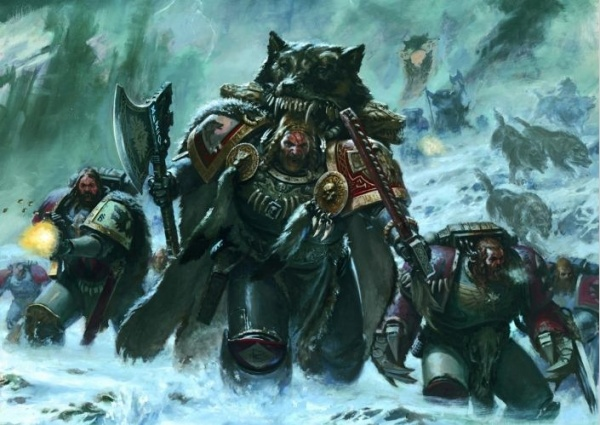

<!-- A0362-B0264 -->

原译文

The Space Wolves 太空野狼

**校订译文**

The Space Wolves 太空野狼

<!-- /A0362-B0264 -->

<!-- A0362-B0265 -->
**英文原文**

Of all the Adeptus Astartes, the Wolves of Fenris regard themselves as the Imperium's ultimate weapon, and are proud of it. Where other Chapters, such as the Ultramarines, were made to build empires, the Wolves were made to murder them, and to destroy anyone who opposes the Emperor's will, including other Astartes. Their unorthodox behavior and organisation as well as their single minded dedication to tear the enemy, any enemy, apart like a wolf pack brings down a deadly prey reflects this original purpose.

<!-- /A0362-B0265 -->

<!-- A0362-B0266 -->

原译文

在所有阿斯塔特修会中，芬里斯之狼将自己视为帝国的最终武器，并为此感到自豪。其他战团，如极限战士，被用来建立帝国，而野狼则被用来谋杀他们，摧毁任何反对帝皇意愿的人，包括其他阿斯塔特修会。他们的非正统行为和组织，以及他们一心一意地撕裂敌人，任何敌人，就像狼群致命的击倒猎物一样，反映了这一最初的目的。

**校订译文**

在所有阿斯塔特之中，芬里斯之狼自认是帝国的终极武器，并引以为傲。极限战士等战团受造是为了建立帝国，野狼则是为了摧毁帝国，以及消灭一切违逆帝皇意志的人，哪怕对方也是阿斯塔特。他们不循常规的行为与组织方式，以及如狼群扑倒凶险猎物般、一心撕碎任何敌人的决意，都体现了这一最初使命。

<!-- /A0362-B0266 -->

<!-- A0362-B0267 -->
**英文原文**

The Wolves are almost as renowned for their passion for eating, drinking, and storytelling, when not engaged in battle. In contrast to the monastic habits of other Chapters, they enjoy boisterous feasting, eating enormous amounts of meat and guzzling Mjød, a liquor so potent that it would eat through the guts of a normal human. To many outsiders, therefore, the Space Wolves appear barbarous and lacking in self-control. But in reality it takes a great deal of discipline and focus to be as dangerous and capable of anything as the Space Wolves are. Their original, unique and effective organisation seems not to hinder them at all but instead allow them the operational freedom to be potentially the most dangerous loyalist chapter. The Space Wolves apply great attention to planning, coordination of their packs movement in battle, the encirclement of the prey and the cleanliness of the kill.

<!-- /A0362-B0267 -->

<!-- A0362-B0268 -->

原译文

野狼几乎以他们在不参与战斗时对饮食和讲故事的热情而闻名。与其他战团的修会习惯相反，他们喜欢喧闹的盛宴，吃大量的肉，狼吞虎咽地喝蜜酒，这是一种烈酒，可以吞噬正常人的内脏。因此，在许多外人看来，太空野狼显得野蛮而缺乏自制力。但事实上，要像太空野狼一样危险和有能力做任何事情，需要大量的纪律和专注。他们最初的、独特的和有效的组织似乎根本不会阻碍他们，而是让他们有行动自由，成为最危险的忠诚者。太空野狼非常注重计划、战斗中狼群的移动协调、猎物的包围和干净的杀戮。

**校订译文**

不在战场时，野狼也几乎同样以热爱宴饮和讲述故事闻名。其他战团过着修士般的生活，他们却喜欢热闹的盛宴，大口食肉、豪饮蜜酒；这种酒猛烈到足以蚀穿普通人的肠胃。因此，许多外人以为太空野狼既野蛮又缺乏自制。实际上，要成为这样危险而能战的战士，需要极强的纪律与专注。他们独创的组织方式既独特又有效，没有妨碍行动，反而给予充分自主，使他们有可能成为最危险的忠诚战团。太空野狼十分重视战前规划、各狼群在战场上的协调、对猎物的合围，以及干净利落地完成击杀。

<!-- /A0362-B0268 -->

<!-- A0362-B0269 -->
**英文原文**

“The wolves like to wrap themselves in a cloak of mystery and solemn, supernatural power, but such nonsense was the superstitious talk of barbarians, inherited from the Fenrisians they drew their strength from. The truly abnormal thing about the wolves was the sharpness of their perception. They had taught themselves to notice everything about their surroundings, and use every scrap of information at their disposal. Their reputation helped. No one expected brutes who looked like ritual-obsessed , bestial clansmen to be underpinned by peerless combat intelligence.”

<!-- /A0362-B0269 -->

<!-- A0362-B0270 -->

原译文

“野狼喜欢将自己笼罩在一层神秘、庄严且超自然力量的外衣之下，但这种无稽之谈不过是野蛮人的迷信言论罢了，这些言论是他们从给予他们力量的芬里斯人那里传承而来的。野狼真正与众不同、超乎寻常之处在于他们敏锐的感知力。他们让自己学会留意周围的一切事物，并充分利用自己所能获取的每一点信息。他们的名声也起到了一定作用。没人会想到，这些看起来像是痴迷于仪式、野蛮成性的部族成员的家伙，竟有着无与伦比的战斗智慧作为支撑。”

**校订译文**

“野狼喜欢将自己笼罩在一层神秘、庄严且超自然力量的外衣之下，但这种无稽之谈不过是野蛮人的迷信言论罢了，这些言论是他们从给予他们力量的芬里斯人那里传承而来的。野狼真正与众不同、超乎寻常之处在于他们敏锐的感知力。他们让自己学会留意周围的一切事物，并充分利用自己所能获取的每一点信息。他们的名声也起到了一定作用。没人会想到，这些看起来像是痴迷于仪式、野蛮成性的部族成员的家伙，竟有着无与伦比的战斗智慧作为支撑。”

<!-- /A0362-B0270 -->

<!-- A0362-B0271 -->
**英文原文**

“It is what made them such efficient weapons.”

<!-- /A0362-B0271 -->

<!-- A0362-B0272 -->

原译文

“正是这一点让他们成为了如此高效的战斗武器。”

**校订译文**

“正是这一点让他们成为了如此高效的战斗武器。”

<!-- /A0362-B0272 -->

<!-- A0362-B0273 -->
**英文原文**

-Kasper Ansbach Hawser (Skjald of Tra, 000.M31)

<!-- /A0362-B0273 -->

<!-- A0362-B0274 -->

原译文

-卡斯佩尔·安斯巴赫·豪瑟尔（特拉的吟游诗人，000.M31）

**校订译文**

-卡斯佩尔·安斯巴赫·豪瑟尔（特拉的吟游诗人，000.M31）

<!-- /A0362-B0274 -->

<!-- A0362-B0275 -->
### Organisation 组织

<!-- /A0362-B0275 -->

<!-- A0362-B0276 -->
### Pre-Heresy 叛乱前

<!-- /A0362-B0276 -->

<!-- A0362-B0277 -->
**英文原文**

During the Great Crusade and Horus Heresy the Space Wolves were a Legion with Leman Russ as its King and supreme commander. Like today, the Legion consisted of the thirteen Great Companies. Russ in turn ruled through a council of Wolf Lords, Wolf Guard, Rune Priests, and other advisers known as the Einherjar. Each Great Compand was led by a Jarl, under whom served many Thegn or "Claw Leader". These in turned were divided up into many packs, each of which was kept in line by a Huscarl.

<!-- /A0362-B0277 -->

<!-- A0362-B0278 -->

原译文

在大远征和荷鲁斯叛乱期间，太空野狼是一个军团，黎明·鲁斯是它的王和最高指挥官。像今天一样，军团由十三个大连组成。反过来，鲁斯通过狼主、野狼卫队、符文牧师和其他被称为英灵的顾问组成的议会进行统治。每个大连都由一个首领领导，首领手下有许多贵族或“利爪领袖”。这些又被分成许多队，其中的每一队都由一名王室护卫维持着秩序。

**校订译文**

大远征与荷鲁斯之乱期间，太空野狼仍是一个军团，黎曼·鲁斯担任狼王与最高指挥官。军团由十三个大连组成；鲁斯通过狼主、野狼守卫、符文牧师及其他顾问组成的英灵议会行使指挥。各大连由一位首领统辖，麾下有多名贵族，亦称“利爪领袖”；下属兵力再分为许多狼群，每群由一名王室护卫维持纪律。

**校注：** 原文 Like today, the Legion consisted of the thirteen Great Companies 与后文现代十二个大连矛盾；保留军团时期十三个大连，删去错误的“像今天一样”类比并在此记录。

<!-- /A0362-B0278 -->

<!-- A0362-B0279 -->
**英文原文**

The Legion’s fleet is believed to have comprised some 60 capital vessels at this time, with perhaps 240 smaller strike craft and escort vessels. In particular, the Legion was disposed towards heavily armed and augmented frigate designs, which allowed for the long-range independent operations of small task forces. In contrast, its flagship by the time of the Heresy, the Hrafnkel, was one of the largest patterns from the Gloriana class frame, and configured both as a heavy battleship and capable of conducting independent planetkill operations.

<!-- /A0362-B0279 -->

<!-- A0362-B0280 -->

原译文

据信，军团的舰队目前由约60艘主力舰组成，可能还有240艘较小的攻击舰和护卫舰。特别是，军团倾向于重型武装和增强型护卫舰的设计，这使得小型特遣部队能够进行远程独立作战。相比之下，在叛乱时期，其旗舰赫拉芬克尔号是荣光女王级中最大的型号之一，既配置为重型战舰，又能够进行独立的歼星行动。

**校订译文**

据估计，当时军团舰队约有六十艘主力舰，以及两百四十艘较小的攻击舰艇与护航舰。野狼尤其偏爱强化改装、火力强大的护卫舰，便于小型特遣舰队开展远距离独立行动。相较之下，荷鲁斯之乱时的旗舰赫拉芬克尔号是荣光女王级舰体中体型最大的型号之一，既能充当重型战列舰，也能独立执行毁灭行星的任务。

<!-- /A0362-B0280 -->

<!-- A0362-B0281 -->
**英文原文**

The Space Wolves by the Battle of Prospero consisted of 95,000-130,000 Space Marines. These were drawn from Thirteen Great Companies, each of which nominally consisted of 10,000 Marines:

<!-- /A0362-B0281 -->

<!-- A0362-B0282 -->

原译文

普罗斯佩罗之战中的太空野狼由9.5万至13万名星际战士组成。这些人来自13个大连，每个连队名义上由10000名海军星际战士组成：

**校订译文**

普洛斯佩罗战役时，太空野狼约有九万五千至十三万名星际战士，分属十三个大连；每个大连名义编制为一万人：

<!-- /A0362-B0282 -->

<!-- A0362-B0283 -->
**英文原文**

1st Great Company (Onn) — Known as the Breakers of Rings. Consisted of at least 3,000 Terminators. Commanded by the Jarl Gunnar Gunnhilt.

<!-- /A0362-B0283 -->

<!-- A0362-B0284 -->

原译文

第一大连（Onn）- 被称为破戒者。由至少3000名终结者组成。由首领加纳·甘希尔特指挥。

**校订译文**

第一大连（Onn）——称为破戒者，至少编有三千名终结者，由首领加纳·甘希尔特指挥。

**校注：** Breakers of Rings 暂沿用现稿“破戒者”；Rings 在称号中的具体意涵未核，可能非普通意义的戒律，保留待核。

<!-- /A0362-B0284 -->

<!-- A0362-B0285 -->
**英文原文**

2nd Great Company (Twa) — Known as the Thread Cutters. Consisted of at least 800 Veterans and 60 Dreadnoughts. Commanded by Jarl Holmi Longganger.

<!-- /A0362-B0285 -->

<!-- A0362-B0286 -->

原译文

第二大连（Twa）— 被称为脉络切割者。由至少800名老兵和60名无畏组成。由首领霍尔米·龙岗指挥。

**校订译文**

第二大连（Twa）——称为脉络切割者，至少有八百名老兵与六十台无畏机甲，由首领霍尔米·远行者指挥。

<!-- /A0362-B0286 -->

<!-- A0362-B0287 -->
**英文原文**

3rd Great Company (Tra) — Known as the Eagle's Keepers. Consisted of at least 9,800 Space Marines in Assault Squad and support armor roles. Commanded by Jarl Ogvai Ogvai Helmschrot.

<!-- /A0362-B0287 -->

<!-- A0362-B0288 -->

原译文

第三大连（Tra）— 被称为雄鹰守护者。由至少9800名星际战士突击小队和支援装甲部队组成。由首领奥格瓦伊·残盔指挥。

**校订译文**

第三大连（Tra）——称为雄鹰守护者，至少有九千八百名星际战士，编为突击小队及装甲支援部队，由首领奥格瓦伊·残盔指挥。

**校注：** 英文 Jarl Ogvai Ogvai Helmschrot 重复一次 Ogvai，译文不重复姓名。

<!-- /A0362-B0288 -->

<!-- A0362-B0289 -->
**英文原文**

4th Great Company (For) — Known as the Blood-worm's Masters. Consisted of at least 8,600 Space Marines in Breacher Squads with self-propelled artillery. Commanded by Jarl Lufven Close-Handed

<!-- /A0362-B0289 -->

<!-- A0362-B0290 -->

原译文

第四大连（For）— 被称为血虫之主。由至少8600名携带自动炮的突破者小队星际战士组成。由首领卢芬·咫尺指挥

**校订译文**

第四大连（For）——称为血虫之主，至少有八千六百名星际战士，编为攻坚小队，并配备自行火炮，由首领卢芬·咫尺指挥。

**校注：** self-propelled artillery 是自行火炮，不是自动炮；Breacher 统一攻坚者/攻坚小队。

<!-- /A0362-B0290 -->

<!-- A0362-B0291 -->
**英文原文**

5th Great Company (Fyf) — Known as the Blood-Ice Storm. Consisted of at least 10,000 Space Marines in mixed roles with light support armor. Commanded by Jarl Amlodhi Skarssen Skarssensson.

<!-- /A0362-B0291 -->

<!-- A0362-B0292 -->

原译文

第五大连（Fyf）— 被称为血冰风暴。由至少10000名身穿轻型支援装甲的混合角色星际战士组成。由首领阿姆洛迪·斯卡森·斯卡森松指挥。

**校订译文**

第五大连（Fyf）——称为血冰风暴，至少有一万名承担多种职责的星际战士，并配备轻型装甲支援，由首领阿姆洛迪·斯卡森·斯卡森松指挥。

**校注：** with light support armor 指配有轻型装甲支援，不是所有战士穿轻型盔甲。

<!-- /A0362-B0292 -->

<!-- A0362-B0293 -->
**英文原文**

6th Great Company (Sesc) — Commanded by Jarl Skunnr.

<!-- /A0362-B0293 -->

<!-- A0362-B0294 -->

原译文

第六大连（Sesc）— 由首领斯坎纳指挥。

**校订译文**

第六大连（Sesc）— 由首领斯坎纳指挥。

<!-- /A0362-B0294 -->

<!-- A0362-B0295 -->
**英文原文**

7th Great Company (Sepp) — Known as the Wight-Flame's Wielders. Consisted of at least 5,200 Space Marines in Destroyer squads and immolation units. Commanded by Jarl Hvarl Red-Blade

<!-- /A0362-B0295 -->

<!-- A0362-B0296 -->

原译文

第七大连（Sepp）- 被称为魂火挥舞者。由至少5200名星际战士组成的毁灭者小队和献祭单位。由首领哈瓦尔·红刃指挥

**校订译文**

第七大连（Sepp）——称为魂火挥舞者，至少有五千两百名星际战士，编为毁灭者小队及焚烧部队，由首领哈瓦尔·红刃指挥。

<!-- /A0362-B0296 -->

<!-- A0362-B0297 -->
**英文原文**

8th Great Company (For-twa) — Known as the Slaughter-Fire Heralds. Consisted of at least 9,500 Space Marines in Reconnaissance roles. Commanded by Jarl Baldr Vidunsson.

<!-- /A0362-B0297 -->

<!-- A0362-B0298 -->

原译文

第八大连（For twa）— 被称为屠火先驱。由至少9500名承担侦察任务的星际战士组成。由首领巴尔德·维登森指挥。

**校订译文**

第八大连（For-twa）——称为屠火先驱，至少有九千五百名承担侦察任务的星际战士，由首领巴尔德·维登森指挥。

<!-- /A0362-B0298 -->

<!-- A0362-B0299 -->
**英文原文**

9th Great Company (Tra-Tra) — Known as the Serpents of the Battle-Moon. Consisted of at least 7,900 Space Marines in support, heavy weapons, and Rapier units. Commanded by Jarl Sturgard Joriksson.

<!-- /A0362-B0299 -->

<!-- A0362-B0300 -->

原译文

第九连队（Tra-Tra）- 被称为战月之蛇。由至少7900名支援星际战士、重型武器和细剑部队组成。由首领斯特加德·乔里克森指挥。

**校订译文**

第九大连（Tra-Tra）——称为战月之蛇，至少有七千九百名星际战士，编为支援、重武器及细剑武器平台部队，由首领斯特加德·乔里克森指挥。

<!-- /A0362-B0300 -->

<!-- A0362-B0301 -->
**英文原文**

10th Great Company (Dekk) — Commanded by Hemtal

<!-- /A0362-B0301 -->

<!-- A0362-B0302 -->

原译文

第十大连（Dekk）——由海姆达尔指挥

**校订译文**

第十大连（Dekk）——由海姆达尔指挥

<!-- /A0362-B0302 -->

<!-- A0362-B0303 -->
**英文原文**

11th Great Company (Elva) — Known as the Sea-Flame's Bearers. Consisted of at least 9,200 Space Marines, primarily veterans drawn from Terra before the discovery of Leman Russ. Commanded by Jarl Varald Helsdawn.

<!-- /A0362-B0303 -->

<!-- A0362-B0304 -->

原译文

第十一大连（Elva）——被称为海焰承载者。由至少9200名星际战士组成，主要是在发现黎曼·鲁斯之前从泰拉招募的老兵。由首领瓦尔德·深渊破晓指挥。

**校订译文**

第十一大连（Elva）——被称为海焰承载者。由至少9200名星际战士组成，主要是在发现黎曼·鲁斯之前从泰拉招募的老兵。由首领瓦尔德·深渊破晓指挥。

<!-- /A0362-B0304 -->

<!-- A0362-B0305 -->
**英文原文**

12th Great Company (Tolv) — Known as the Shield-Gnawers. Consisted of at least 8,700 Space Marines in close assault roles. Commanded by Jarl Jaurmag.

<!-- /A0362-B0305 -->

<!-- A0362-B0306 -->

原译文

第十二大连（Tolv）——被称为盾牌啃咬者。由至少8700名承担近距离突击任务的星际战士组成。由首领加尔玛格指挥。

**校订译文**

第十二大连（Tolv）——被称为盾牌啃咬者。由至少8700名承担近距离突击任务的星际战士组成。由首领加尔玛格指挥。

<!-- /A0362-B0306 -->

<!-- A0362-B0307 -->
**英文原文**

13th Great Company (Dekk-Tra) — Known as the Corpse-Renders. Consisted of at least 600 Space Marines, primarily light assault infantry. Commanded by Jarl Jorin Bloodhowl.

<!-- /A0362-B0307 -->

<!-- A0362-B0308 -->

原译文

第十三大连（Dekk-Tra）——被称为碎尸者。由至少600名星际战士组成，主要是轻型突击步兵。由首领乔林.血嚎指挥。

**校订译文**

第十三大连（Dekk-Tra）——称为碎尸者，至少有六百名星际战士，以轻型突击步兵为主，由首领乔林·血嚎指挥。

<!-- /A0362-B0308 -->

<!-- A0362-B0309 -->
### Post-Heresy 叛乱后

<!-- /A0362-B0309 -->

<!-- A0362-B0310 -->
**英文原文**

In the 41st Millennium the Space Wolves have a unique structure that is notably different from a standard Codex Chapter. Rather than 10 companies of 100 marines, the Space Wolves consist of 12 Great Companies of varying strengths. Each Great Company is based in The Fang, the Space Wolves Fortress-monastery and is led by a Wolf Lord who answers only to the Great Wolf.

<!-- /A0362-B0310 -->

<!-- A0362-B0311 -->

原译文

在第41个千年，太空野狼有一个独特的结构，与标准的圣典战团明显不同。太空野狼不是由100名星际战士组成的10个连队，而是由12个实力各异的大连组成的。每个大连都位于太空野狼要塞修道院长牙堡，由一位只对头狼负责的狼主领导。

**校订译文**

第41千年，太空野狼的组织方式与标准圣典战团大不相同。他们拥有十二个兵力不等的大连，而非每连一百人的十连编制。各大连均以要塞修道院长牙堡为基地，由只向头狼负责的狼主统率。

<!-- /A0362-B0311 -->

<!-- A0362-B0312 图片 -->
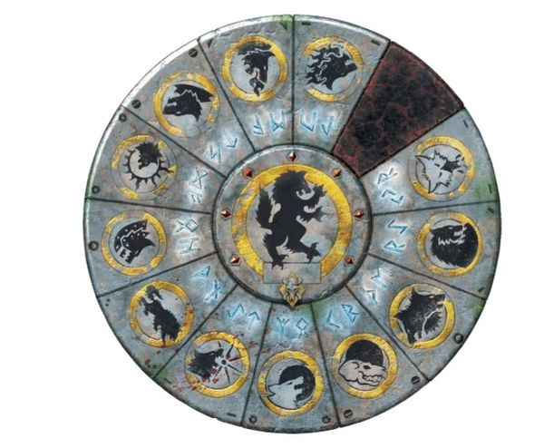

<!-- A0362-B0313 -->

原译文

The Great Annulus of the Space Wolves, representing the Great Companies 太空野狼的伟大之环，代表大连

**校订译文**

The Great Annulus of the Space Wolves, representing the Great Companies 太空野狼的伟大之环，代表大连

<!-- /A0362-B0313 -->

<!-- A0362-B0314 -->
**英文原文**

Each Great Company is a fully self-contained army, with all the troops, vehicles, and equipment necessary to make war, as well as the spacecraft necessary to transport itself. They each have their own forges and customs. The size of each Great Company is unknown, but the Space Wolves Legion is said to be one of the smaller Legions, due to the Curse of the Wulfen genetic instability within the Chapter gene-seed. As each Great Company serves as an independent army, they maintain a much greater number of troops as opposed to codex companies.

<!-- /A0362-B0314 -->

<!-- A0362-B0315 -->

原译文

每个大连都是一支完全自给自足的军队，拥有发动战争所需的所有部队、车辆和装备，以及运输自己所需的飞船。他们每个人都有自己的铸造厂和习俗。每个大连的规模都是未知的，但据说太空野狼军团是较小的军团之一，因为狼人诅咒，基因种子中的基因不稳定。由于每个大连都是一支独立的军队，因此他们拥有的部队数量比圣典连队多得多。

**校订译文**

每个大连都是一支完整而独立的军队，拥有作战所需的全部兵员、载具与装备，以及用于运输的舰船，也保有自己的锻造设施与传统。各大连的确切兵力不详；历史上的太空野狼军团因狼人诅咒导致的基因不稳定，规模相对较小。不过，由于现代每个大连都要独立承担完整的军事任务，其兵力仍远多于圣典战团的一个连。

<!-- /A0362-B0315 -->

<!-- A0362-B0316 -->
**英文原文**

Each Great Company is made of a number of packs that function much like a Space Marine squad. However, their tactical usage varies greatly. Each squad is unique in that it rarely, if ever, will receive reinforcements, making the higher-level squads smaller in number compared to the lowest Blood Claw pack. Many Blood Claw packs start with as many as fifteen marines. However, losses take their toll, and by the time a Blood Claw squad reaches the level of Grey Hunter, normally only 9 or 10 are left. This promotion is arguably the most important the Space Wolf will ever receive because it also welcomes him into the folds of the Brotherhood. As they age, further losses limit the squad sizes of Long Fangs down to just 5 or less. Even further a pack of Long Fangs will slowly diminish until only one remains - the Lone Wolf.

<!-- /A0362-B0316 -->

<!-- A0362-B0317 -->

原译文

每个大连都是由许多小队组成的，这些小队的功能很像星际战士。然而，它们的战术用法差异很大。每个小队都是独一无二的，因为它很少（如果有的话）会得到增援，因此与最低的血爪小队相比，更高级别的小队数量更少。许多血爪小队都以多达十五名星际战士开始。然而，伤亡会带来损失，当血爪小队达到灰猎级别时，通常只剩下9或10个。这次晋升可以说是一名太空野狼一生最重要的一次，因为它也欢迎他加入兄弟会。随着年龄的增长，进一步的损失将长牙的阵容限制在5人或更少。更进一步，长牙小队将慢慢损失，直到只剩下一只——孤狼。

**校订译文**

每个大连由多个“狼群”组成，其基本作用类似普通星际战士小队，但战术运用差别很大。狼群很少、甚至从不补入新成员，因此越资深的狼群，人数往往越少。血爪狼群最初可达十五人，经历伤亡后，晋为灰色猎手时通常只剩九到十人。这可能是太空野狼一生中最重要的晋升，象征他正式获同袍认可、融入兄弟群体。随着战士年岁增长，损失继续累积，成为长牙时，一个狼群通常只剩五人或更少。长牙狼群还会继续减员，直到仅剩最后一人——孤狼。

**校注：** Brothers/Brotherhood 在此是同袍归属意义，未表明成立白疤式“兄弟会”编制，译为融入兄弟群体。

<!-- /A0362-B0317 -->

<!-- A0362-B0318 -->
**英文原文**

Special cases may be made in certain or even dire circumstances to this process. In some situations reinforcements may be sent to current campaigns as reinforcements. Likewise, if a Wolf Lord deems an individual worthy and the rest of his pack is not he may elevate a Wolf from Blood Claw to Grey Hunter. Normally he will not act in such manner without consulting both his first sergeant and the current members of the unit he wishes to transfer his prospect to.

<!-- /A0362-B0318 -->

<!-- A0362-B0319 -->

原译文

在某些甚至可怕的情况下，这一过程可能会出现特殊情况。在某些情况下，增援可能会作为增援部队被派往当前的战役。同样，如果一位狼主认为一个人值得尊敬，而其他人不值得，他可以将一只野狼从血爪提升为灰猎。通常，他不会在没有咨询他的军士长和他希望将他转移到的部队的现任成员的情况下以这种方式行事。

**校订译文**

特殊情形、尤其是危急局势下，这一惯例也会出现例外；有时会给正在作战的狼群补充兵员。同样，如果狼主认为一名血爪已足够成熟，而其余同伴尚未达到标准，也可单独将他晋升为灰色猎手。通常，狼主会先征询军士长，以及准备接纳这名战士的狼群现有成员的意见。

<!-- /A0362-B0319 -->

<!-- A0362-B0320 -->
**英文原文**

Apart from this, a Wolf may find himself under direction of a Wolf Guard or a member of the Great Wolf's household. Some find themselves inducted into the Chapter Priesthood, Scouts, Calvaries, or should terrible wounds take their toll they may find themselves encased within mighty Dreadnought armour.

<!-- /A0362-B0320 -->

<!-- A0362-B0321 -->

原译文

除此之外，野狼可能会发现自己受到野狼卫队或头狼家族成员的指挥。有些人发现自己被引入了牧师、侦察兵、骑兵，或者如果可怕的伤口造成了损伤，他们可能会发现自己被安置在强大的无畏机甲中。

**校订译文**

此外，一名野狼也可能受野狼守卫战士或头狼直属扈从指挥。有些人会进入战团的祭司群体，或转任侦察兵、骑兵；若遭到极其严重的创伤，则可能被安置进强大的无畏机甲。

**校注：** 英文 Calvaries 疑为 cavalries 的拼写问题，依与祭司、侦察兵并列的语境暂译骑兵，原英文保留。

<!-- /A0362-B0321 -->

<!-- A0362-B0322 -->
**英文原文**

One of the 12 Great Companies is that of the Great Wolf, the Space Wolves' Chapter Master. When the former Great Wolf dies the new chieftain is selected from the other eleven remaining Wolf Lords. Upon selection the new Great Wolf, not his Great Company, immediately takes on the ancient badge of Leman Russ — the Wolf That Stalks Between Stars. With the new role the Great Wolf's Company is also expanded to include the household of the Chapter's Priesthood, Wolf Scouts, and Dreadnoughts.

<!-- /A0362-B0322 -->

<!-- A0362-B0323 -->

原译文

12个大连之一是太空野狼战团长—头狼。当前头狼去世后，新的首领将从剩下的十一位狼主中选出。在选择了新的头狼，而不是他的大连后，立即佩戴黎曼·鲁斯的古老徽章—星徊之狼。随着新角色的加入，头狼连队也扩大包括战团的牧师、野狼侦察兵和无畏成员。

**校订译文**

十二个大连中，有一个由战团长，也就是头狼亲自统率。前任头狼去世后，新任领袖从其余十一位狼主中选出。获选后，头狼本人会立即采用黎曼·鲁斯的古老徽记“星徊之狼”，而不是由他的整个大连更换徽记。他的大连也会扩编，纳入战团祭司群体、狼侦查与无畏机甲等直属成员。

<!-- /A0362-B0323 -->

<!-- A0362-B0324 -->
**英文原文**

Since the introduction of Primaris Space Marines, the Space Wolves under Logan Grimnar have begun to reorganize themselves to accommodate these new warriors. Many of their Fenrisian titles take up roles dictated in the revised Codex Astartes. For example Grey Hunters now take up the role of Suppressors and Wolf Scouts serve as Eliminators. In this way Grimnar has blended the ancient customs of Fenris with the recent changes sweeping the Adeptus Astartes.

<!-- /A0362-B0324 -->

<!-- A0362-B0325 -->

原译文

自从引入原铸星际战士以来，罗根·格里姆纳尔领导的太空野狼已经开始重组自己，以容纳这些新的战士。他们的许多芬里斯头衔都扮演了修订后的阿斯塔特圣典中规定的角色。例如，灰猎现在扮演着压制者的角色，而野狼侦察兵则扮演着歼灭者的角色。通过这种方式，格里姆纳尔将芬里斯的古老习俗与阿斯塔特修会最近发生的变化融为一体。

**校订译文**

原铸星际战士加入后，洛根·格里姆纳尔开始调整战团组织，以容纳新战士。许多沿用芬里斯传统称号的战士，也承担起新版《阿斯塔特圣典》规定的职责，例如灰色猎手担任压制者、狼侦查担任歼灭者。格里姆纳尔由此将芬里斯的古老习俗，与席卷阿斯塔特的新变化结合起来。

<!-- /A0362-B0325 -->

<!-- A0362-B0326 -->
### Great Companies 大连

<!-- /A0362-B0326 -->

<!-- A0362-B0327 -->
**英文原文**

The current Great Companies and their Wolf Lords as of the creation of the Great Rift are as follows:

<!-- /A0362-B0327 -->

<!-- A0362-B0328 -->

原译文

自大裂隙形成以来，目前的大连及其狼主如下：

**校订译文**

截至大裂隙形成时，各大连及其狼主如下：

<!-- /A0362-B0328 -->

<!-- A0362-B0329 图片 -->
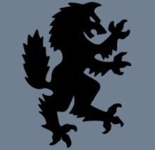

<!-- A0362-B0330 -->
**英文原文**

Personal Badge of the Great Wolf - The Wolf that Stalks the Stars

<!-- /A0362-B0330 -->

<!-- A0362-B0331 -->

原译文

大狼的个人徽章-星徊之狼

**校订译文**

头狼的个人徽记——星徊之狼。

<!-- /A0362-B0331 -->

<!-- A0362-B0332 -->
### Company of the Great Wolf 头狼大连

<!-- /A0362-B0332 -->

<!-- A0362-B0333 -->

原译文

(The Champions of Fenris 芬里斯冠军)

**校订译文**

(The Champions of Fenris 芬里斯冠军)

<!-- /A0362-B0333 -->

<!-- A0362-B0334 图片 -->
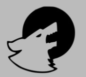

<!-- A0362-B0335 -->

原译文

Badge of the Night Runner 午夜奔狼徽章

**校订译文**

Badge of the Night Runner 午夜奔狼徽章

<!-- /A0362-B0335 -->

<!-- A0362-B0336 -->
### Great Wolf Logan Grimnar 头狼洛根·格里姆纳尔

原题：Great Wolf Logan Grimnar 大狼罗根·格里姆纳尔

<!-- /A0362-B0336 -->

<!-- A0362-B0337 -->

原译文

Bran Redmaw's Company 伯恩.红喉连队

**校订译文**

Bran Redmaw's Company 伯恩·红喉大连

<!-- /A0362-B0337 -->

<!-- A0362-B0338 -->

原译文

(The Bloodmaws 红喉)

**校订译文**

(The Bloodmaws 血喉)

<!-- /A0362-B0338 -->

<!-- A0362-B0339 图片 -->
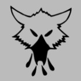

<!-- A0362-B0340 -->

原译文

Badge of the Bloodied Hunter 血腥猎手徽章

**校订译文**

Badge of the Bloodied Hunter 血腥猎手徽章

<!-- /A0362-B0340 -->

<!-- A0362-B0341 -->

原译文

Wolf Lord Bran Redmaw 狼主伯恩.红喉

**校订译文**

Wolf Lord Bran Redmaw 狼主伯恩·红喉

<!-- /A0362-B0341 -->

<!-- A0362-B0342 -->
### Engir Krakendoom's Company 恩吉尔·克拉肯之灾连队

<!-- /A0362-B0342 -->

<!-- A0362-B0343 -->

原译文

(The Seawolves 海狼)

**校订译文**

(The Seawolves 海狼)

<!-- /A0362-B0343 -->

<!-- A0362-B0344 图片 -->
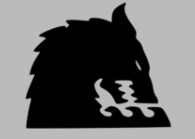

<!-- A0362-B0345 -->

原译文

Badge of the Sea Wolf 海狼徽章

**校订译文**

Badge of the Sea Wolf 海狼徽章

<!-- /A0362-B0345 -->

<!-- A0362-B0346 -->
### Wolf Lord Engir Krakendoom 狼主恩吉尔·克拉肯之灾

<!-- /A0362-B0346 -->

<!-- A0362-B0347 -->
### Erik Morkai's Company 埃里克·莫凯连队

<!-- /A0362-B0347 -->

<!-- A0362-B0348 -->

原译文

(The Sons of Morkai 莫凯之子)

**校订译文**

(The Sons of Morkai 莫凯之子)

<!-- /A0362-B0348 -->

<!-- A0362-B0349 图片 -->
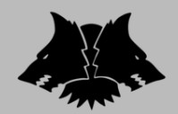

<!-- A0362-B0350 -->

原译文

Badge of Morkai 莫凯徽章

**校订译文**

Badge of Morkai 莫凯徽章

<!-- /A0362-B0350 -->

<!-- A0362-B0351 -->
### Wolf Lord Erik Morkai 狼主埃里克·莫凯

<!-- /A0362-B0351 -->

<!-- A0362-B0352 -->
### Gunnar Red Moon's Company 加纳·红月连队

<!-- /A0362-B0352 -->

<!-- A0362-B0353 -->

原译文

(Red Moons 红月)

**校订译文**

(Red Moons 红月)

<!-- /A0362-B0353 -->

<!-- A0362-B0354 图片 -->
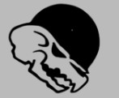

<!-- A0362-B0355 -->

原译文

Badge of The Wolf of the Red Moon 红月之狼徽章

**校订译文**

Badge of The Wolf of the Red Moon 红月之狼徽章

<!-- /A0362-B0355 -->

<!-- A0362-B0356 -->
### Wolf Lord Gunnar Red Moon 狼主加纳·红月

<!-- /A0362-B0356 -->

<!-- A0362-B0357 -->
### Harald Deathwolf's Company 哈拉尔德·死狼大连

原题：Harald Deathwolf's Company 哈拉尔德·死狼

<!-- /A0362-B0357 -->

<!-- A0362-B0358 -->

原译文

(The Deathwolves 死狼)

**校订译文**

(The Deathwolves 死狼)

<!-- /A0362-B0358 -->

<!-- A0362-B0359 图片 -->
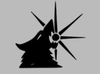

<!-- A0362-B0360 -->

原译文

Badge of the Great Devourer 大吞噬者徽章

**校订译文**

Badge of the Great Devourer 大吞噬者徽章

<!-- /A0362-B0360 -->

<!-- A0362-B0361 -->
### Wolf Lord Harald Deathwolf 狼主哈拉尔德·死狼

<!-- /A0362-B0361 -->

<!-- A0362-B0362 -->
### Bjorn Stormwolf's Company 比约恩·风暴狼连队

<!-- /A0362-B0362 -->

<!-- A0362-B0363 -->

原译文

(The Stormwolves 风暴狼)

**校订译文**

(The Stormwolves 风暴狼)

<!-- /A0362-B0363 -->

<!-- A0362-B0364 图片 -->
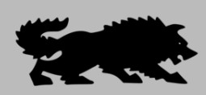

<!-- A0362-B0365 -->

原译文

Badge of the Thunderwolf 风暴狼徽章

**校订译文**

Badge of the Thunderwolf 雷狼徽章

<!-- /A0362-B0365 -->

<!-- A0362-B0366 -->
### Wolf Lord Bjorn Stormwolf 狼主比约恩·风暴狼

<!-- /A0362-B0366 -->

<!-- A0362-B0367 -->
### Vorek Gnarlfist's Company 沃里克·粗拳连队

<!-- /A0362-B0367 -->

<!-- A0362-B0368 -->

原译文

(The Ironwolves 铁狼)

**校订译文**

(The Ironwolves 铁狼)

<!-- /A0362-B0368 -->

<!-- A0362-B0369 图片 -->
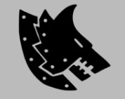

<!-- A0362-B0370 -->

原译文

Badge of the Iron Wolf 铁狼徽章

**校订译文**

Badge of the Iron Wolf 铁狼徽章

<!-- /A0362-B0370 -->

<!-- A0362-B0371 -->
### Wolf Lord Vorek Gnarlfist 狼主沃里克·粗拳

<!-- /A0362-B0371 -->

<!-- A0362-B0372 -->
### Krom Dragongaze's Company 克罗姆·龙瞪连队

<!-- /A0362-B0372 -->

<!-- A0362-B0373 -->

原译文

(The Drakeslayers 屠龙者)

**校订译文**

(The Drakeslayers 屠龙者)

<!-- /A0362-B0373 -->

<!-- A0362-B0374 图片 -->
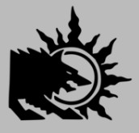

<!-- A0362-B0375 -->

原译文

Badge of the Sun Wolf 日狼徽章

**校订译文**

Badge of the Sun Wolf 日狼徽章

<!-- /A0362-B0375 -->

<!-- A0362-B0376 -->
### Wolf Lord Krom Dragongaze 狼主克罗姆·龙瞪

<!-- /A0362-B0376 -->

<!-- A0362-B0377 -->
### Ragnar Blackmane's Company 拉格纳·黑鬃连队

<!-- /A0362-B0377 -->

<!-- A0362-B0378 -->

原译文

(The Blackmanes 黑鬃)

**校订译文**

(The Blackmanes 黑鬃)

<!-- /A0362-B0378 -->

<!-- A0362-B0379 图片 -->
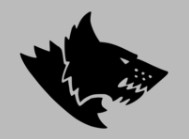

<!-- A0362-B0380 -->

原译文

Badge of the Blackmane 黑鬃徽章

**校订译文**

Badge of the Blackmane 黑鬃徽章

<!-- /A0362-B0380 -->

<!-- A0362-B0381 -->
### Wolf Lord Ragnar Blackmane 狼主拉格纳·黑鬃

<!-- /A0362-B0381 -->

<!-- A0362-B0382 -->
### Eleventh Great Company 第十一大连

原题：Eleventh Great Company 第十一连队

<!-- /A0362-B0382 -->

<!-- A0362-B0383 -->

原译文

(The Firehowlers 火嚎)

**校订译文**

(The Firehowlers 火嚎)

<!-- /A0362-B0383 -->

<!-- A0362-B0384 图片 -->
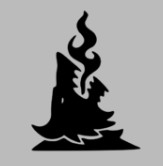

<!-- A0362-B0385 -->

原译文

Badge of the Fire Breather 火焰吐息徽章

**校订译文**

Badge of the Fire Breather 火焰吐息徽章

<!-- /A0362-B0385 -->

<!-- A0362-B0386 -->
### Unknown / Vacant 未知/空缺

<!-- /A0362-B0386 -->

<!-- A0362-B0387 -->

原译文

Kjarl Grimblood's Company 凯加尔.冷血连队

**校订译文**

Kjarl Grimblood's Company 凯加尔·冷血大连

<!-- /A0362-B0387 -->

<!-- A0362-B0388 -->

原译文

(The Grimbloods 冷血)

**校订译文**

(The Grimbloods 冷血)

<!-- /A0362-B0388 -->

<!-- A0362-B0389 图片 -->
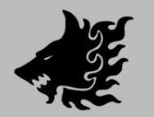

<!-- A0362-B0390 -->

原译文

Badge of the Fire Wolf 火狼徽章

**校订译文**

Badge of the Fire Wolf 火狼徽章

<!-- /A0362-B0390 -->

<!-- A0362-B0391 -->

原译文

Wolf Lord Kjarl Grimblood 狼主凯加尔.冷血

**校订译文**

Wolf Lord Kjarl Grimblood 狼主凯加尔·冷血

<!-- /A0362-B0391 -->

<!-- A0362-B0392 -->
### The Thirteenth Company 第十三连

原题：The Thirteenth Company 第十三连队

<!-- /A0362-B0392 -->

<!-- A0362-B0393 -->
**英文原文**

On the Grand Annulus, the spot of the 13th Company has long been vacant. During the Horus Heresy the space had its last owner, belonging to Wolf Lord Jorin Bloodhowl's Great Company. It has come to represent all units of the Chapter who have fallen in battle, been corrupted by Chaos, or otherwise left service. The stone space today is a slab of pure black obsidian and has been the only unchanging face on it throughout the annals of time.

<!-- /A0362-B0393 -->

<!-- A0362-B0394 -->

原译文

在伟大之环上，第13连队的位置长期空置。在荷鲁斯叛乱时期，这个空间有着最后的主人，属于狼主约林·血嚎的大连。它代表了战团中所有在战斗中倒下、被混沌腐化或以其他方式退役的单位。今天的石头位置是一块纯黑色的黑曜石，是历史上唯一不变的面孔。

**校订译文**

伟大之环上，第十三连的位置长期空缺。荷鲁斯之乱期间，它最后一次属于狼主乔林·血嚎的大连。此后，这个位置逐渐代表战团一切战死、被混沌腐化或因其他原因离开的部队。如今那里嵌着一整块纯黑曜石，是伟大之环上历经漫长岁月却始终未变的唯一一面。

<!-- /A0362-B0394 -->

<!-- A0362-B0395 图片 -->
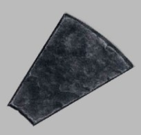

<!-- A0362-B0396 -->

原译文

Great Company Forces 大连部队

**校订译文**

Great Company Forces 大连部队

<!-- /A0362-B0396 -->

<!-- A0362-B0397 -->
**英文原文**

Each Great Company operates its own army, consisting of:

<!-- /A0362-B0397 -->

<!-- A0362-B0398 -->

原译文

每个大连都有自己的军队，由以下人员组成：

**校订译文**

每个大连都有自己的军队，由以下人员组成：

<!-- /A0362-B0398 -->

<!-- A0362-B0399 -->
**英文原文**

Commanding Officer (Wolf Lord)

<!-- /A0362-B0399 -->

<!-- A0362-B0400 -->

原译文

指挥官（狼主）

**校订译文**

指挥官（狼主）

<!-- /A0362-B0400 -->

<!-- A0362-B0401 -->
**英文原文**

Officers (2 Battle Leaders,Rune Priests, Iron Priests, Wolf Priests)

<!-- /A0362-B0401 -->

<!-- A0362-B0402 -->

原译文

军官（2名战斗领袖，符文牧师，钢铁牧师，狼牧师）

**校订译文**

军官（2名战斗领袖，符文牧师，钢铁牧师，狼牧师）

<!-- /A0362-B0402 -->

<!-- A0362-B0403 -->
**英文原文**

Veterans (Wolf Guard, Company Ancient, Company Champion, Thunderwolf Cavalry)

<!-- /A0362-B0403 -->

<!-- A0362-B0404 -->

原译文

老兵（野狼卫队、连队旗手、连队冠军、雷狼骑兵）

**校订译文**

老兵（野狼守卫、连队旗手、连队冠军、雷狼骑兵）

<!-- /A0362-B0404 -->

<!-- A0362-B0405 -->
**英文原文**

Battleline Squads (Grey Hunters, Intercessors, Infiltrators)

<!-- /A0362-B0405 -->

<!-- A0362-B0406 -->

原译文

战线小队（灰猎、仲裁者、渗透者）

**校订译文**

战线小队（灰色猎手、仲裁者、渗透者）。

<!-- /A0362-B0406 -->

<!-- A0362-B0407 -->
**英文原文**

Close Support Squads (Bloodclaws, Assault Intercessors, Swiftclaws, Skyclaws, Inceptors, Reivers/Hounds of Morkai, Incursors, Wulfen Fenrisian Wolves)

<!-- /A0362-B0407 -->

<!-- A0362-B0408 -->

原译文

近身支援小队（血爪、突击仲裁者、迅爪、天爪、先驱者、掠夺者/莫凯猎犬、入侵者、狼人、芬里斯狼）

**校订译文**

近身支援小队（血爪、突击仲裁者、迅爪、天爪、先驱者、掠夺者/莫凯猎犬、入侵者、狼人、芬里斯狼）

<!-- /A0362-B0408 -->

<!-- A0362-B0409 -->
**英文原文**

Fire Support Squads (Long Fangs, Aggressors, Eradicators, Hellblasters, Eliminators Suppressors, Centurions)

<!-- /A0362-B0409 -->

<!-- A0362-B0410 -->

原译文

火力支援小队（长牙、侵略者、根除者、地狱轰击者、歼灭者、压制者、百夫长）

**校订译文**

火力支援小队（长牙、侵略者、根除者、地狱轰击者、歼灭者、压制者、百夫长）

<!-- /A0362-B0410 -->

<!-- A0362-B0411 -->
**英文原文**

Scout Squads (Wolf Scouts, Lone Wolves, Wolf Scout Bikers)

<!-- /A0362-B0411 -->

<!-- A0362-B0412 -->

原译文

侦察小队（野狼侦察兵、孤狼、野狼侦查摩托）

**校订译文**

侦察小队（狼侦查、孤狼、狼侦查摩托骑手）。

<!-- /A0362-B0412 -->

<!-- A0362-B0413 -->
**英文原文**

Dreadnoughts/Walkers (Castaferrum, Venerable, Wulfen, Redemptor, Contemptor, Invictor Tactical Warsuits)

<!-- /A0362-B0413 -->

<!-- A0362-B0414 -->

原译文

无畏/步行者（铸铁、神圣、狼人、救赎者、蔑视者、不败者战术机甲）

**校订译文**

无畏机甲及步行机甲（铸铁型、神圣型、狼人型、救赎者型、蔑视者型无畏机甲，以及不败者战术机甲）。

**校注：** 本处 Venerable 指太空野狼无畏类型，采用同章官译“神圣无畏机甲”词根；不得直接据此改动其他阵营不同单位。

<!-- /A0362-B0414 -->

<!-- A0362-B0415 -->
**英文原文**

Transport Vehicles (Rhinos, Razorbacks, Impulsors, Repulsors, Drop Pods)

<!-- /A0362-B0415 -->

<!-- A0362-B0416 -->

原译文

运输车辆（犀牛、豪猪、脉冲、反击者、空投舱）

**校订译文**

运输载具（犀牛战车、豪猪战车、脉冲战车、反重力战车、空降舱）。

<!-- /A0362-B0416 -->

<!-- A0362-B0417 -->
**英文原文**

Light Vehicles (Land Speeders, Storm Speeders, Invaders, Bikes)

<!-- /A0362-B0417 -->

<!-- A0362-B0418 -->

原译文

轻型载具（兰德速攻艇、风暴速攻艇、入侵者、摩托）

**校订译文**

轻型载具（兰德速攻艇、风暴速攻艇、入侵者全地形车、摩托）。

<!-- /A0362-B0418 -->

<!-- A0362-B0419 -->
**英文原文**

Battle Tanks (Predators, Land Raiders, Repulsor Executioners, Whirlwinds, Vindicators, Gladiators, Hunters, Stalkers)

<!-- /A0362-B0419 -->

<!-- A0362-B0420 -->

原译文

战斗坦克（掠食者、兰德掠袭者、歼灭反击者、旋风、维护者、角斗士、猎手、追猎者）

**校订译文**

战斗坦克（掠食者战车、兰德掠袭者战车、处决者型反重力战车、旋风战车、维护者战车、角斗士战车、猎手战车、追猎者战车）。

<!-- /A0362-B0420 -->

<!-- A0362-B0421 -->
**英文原文**

Gunships (Thunderhawks, Stormfangs, Stormwolves, Stormhawks)

<!-- /A0362-B0421 -->

<!-- A0362-B0422 -->

原译文

炮艇（雷鹰、风暴牙、风暴狼、风暴鹰）

**校订译文**

炮艇（雷鹰、风暴牙、风暴狼、风暴鹰）

<!-- /A0362-B0422 -->

<!-- A0362-B0423 -->
**英文原文**

Fleet (Battle Barges, Strike Cruisers, Rapid Strike Vessels, Star Forts)

<!-- /A0362-B0423 -->

<!-- A0362-B0424 -->

原译文

舰队（战斗驳船、打击巡洋舰、快速打击舰、星堡）

**校订译文**

舰队（战斗驳船、打击巡洋舰、快速打击舰、星堡）

<!-- /A0362-B0424 -->

<!-- A0362-B0425 -->
### Troop Types 部队类型

<!-- /A0362-B0425 -->

<!-- A0362-B0426 -->
**英文原文**

In a typical Codex Chapter, a Neophyte begins his service as a Scout, and, after completing his training and physical transformation into a Space Marine, is assigned to Fire Support Squads, Close Support Squads, and finally a Battleline Squad. By contrast, the Space Wolves' approach reflects the warrior culture of Fenris from which all the Wolves are descended.

<!-- /A0362-B0426 -->

<!-- A0362-B0427 -->

原译文

在一个典型的圣典战团中，新进者开始担任侦察兵，在完成训练和身体转变为星际战士后，被分配到火力支援小队、近身支援小队，最后是战线小队。相比之下，太空野狼的方法反映了芬里斯的战士文化，所有的野狼都是芬里斯的后裔。

**校订译文**

典型圣典战团中的新兵，最初以侦察兵身份服役；完成训练及星际战士改造后，依次进入火力支援、近战支援，最后进入战线小队。太空野狼采取另一种晋升方式，体现了他们共同继承的芬里斯战士文化。

<!-- /A0362-B0427 -->

<!-- A0362-B0428 图片 -->
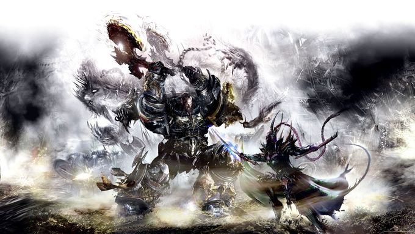

<!-- A0362-B0429 -->

原译文

Wolf Lord Erik Morkai battles the Dark Eldar 狼主埃里克·莫凯与黑暗灵族战斗

**校订译文**

Wolf Lord Erik Morkai battles the Dark Eldar 狼主埃里克·莫凯与黑暗灵族战斗

<!-- /A0362-B0429 -->

<!-- A0362-B0430 -->
### Close Support 近身支援

<!-- /A0362-B0430 -->

<!-- A0362-B0431 -->
**英文原文**

Blood Claws are Neophyte Space Wolves who have just finished their most basic training and initiation rites, including drinking from the Cup of Wulfen and surviving the Test of Morkai. They receive armament similar to Assault Squads in other chapters – a chainsword and bolt pistol, but they do not normally use jump packs. Instead of being assigned to a single Company, Blood Claws are instead assigned to any one of the Great Companies. Their role is to charge headlong into battle, expending their youthful enthusiasm for battle on the enemy and hopefully learning the lessons of war that will enable them to survive.

<!-- /A0362-B0431 -->

<!-- A0362-B0432 -->

原译文

血爪是刚刚完成最基本训练和入会仪式的太空野狼新进者，包括狼人之杯和在莫凯试炼中幸存下来。他们获得的武器类似于其他战团中的突击小队—链锯剑和爆矢手枪，但他们通常不使用跳跃背包。血爪不是被分配到一个连队，而是被分配到任何一个大连。他们的角色是勇往直前，将年轻时的战斗热情倾注在敌人身上，并希望从战争中吸取教训，使他们能够生存下来。

**校订译文**

血爪是刚完成基础训练及入选仪式的太空野狼新兵；这些仪式包括饮下狼人之杯中的液体，以及通过莫凯试炼。他们的武器与其他战团突击小队相似，通常是链锯剑与爆矢手枪，但一般不使用跳跃背包。血爪不会集中编入某个指定连，而是分派至各个大连。他们负责奋勇冲锋，将年轻战士旺盛的斗志倾泻在敌人身上，并在实战中学会让自己生存下来的本领。

<!-- /A0362-B0432 -->

<!-- A0362-B0433 -->
**英文原文**

Assault Intercessor Squads from new Primaris Space Marine Forces

<!-- /A0362-B0433 -->

<!-- A0362-B0434 -->

原译文

来自新原铸星际战士小队的突击仲裁者小队

**校订译文**

突击仲裁者小队，来自新加入的原铸星际战士部队。

<!-- /A0362-B0434 -->

<!-- A0362-B0435 -->
**英文原文**

Skyclaws are reckless trouble makers from the Blood Claw packs, who demonstrate a reckless joy for engaging in close combat, and are "rewarded" with jump packs to aid in their eagerness to charge straight into the line of battle.

<!-- /A0362-B0435 -->

<!-- A0362-B0436 -->

原译文

天爪是血爪小队中鲁莽的麻烦制造者，他们对近距离战斗表现出鲁莽的喜悦，并被“奖励”跳跃背包，以帮助他们直接冲入战线的渴望。

**校订译文**

天爪是血爪狼群中最鲁莽、最爱惹事的战士，近身厮杀会令他们兴奋不已。他们因此获“奖赏”跳跃背包，得以更快地一头冲进敌阵。

<!-- /A0362-B0436 -->

<!-- A0362-B0437 -->
**英文原文**

Swiftclaw Squads mounted on Bikes.

<!-- /A0362-B0437 -->

<!-- A0362-B0438 -->

原译文

迅爪小队骑摩托。

**校订译文**

迅爪小队骑摩托。

<!-- /A0362-B0438 -->

<!-- A0362-B0439 -->
**英文原文**

Inceptor Squads from new Primaris Space Marine forces.

<!-- /A0362-B0439 -->

<!-- A0362-B0440 -->

原译文

来自新原铸星际战士小队的先驱者小队

**校订译文**

先驱者小队，来自新加入的原铸星际战士部队。

<!-- /A0362-B0440 -->

<!-- A0362-B0441 -->
**英文原文**

Reiver Squads are newer Primaris Space Marine formations. Operate as special forces. The Space Wolves also operate special psyker-hunting variants of Reiver squads known as Hounds of Morkai.

<!-- /A0362-B0441 -->

<!-- A0362-B0442 -->

原译文

掠夺者小队是较新的原铸星际战士编队。作为特种部队行动。太空野狼还部署着被称为莫凯猎犬的特殊狩猎灵能者变种的掠夺者小队。

**校订译文**

掠夺者小队是较新的原铸星际战士编组，执行特种作战任务。太空野狼还设有专门猎杀灵能者的特殊掠夺者部队，称为莫凯猎犬。

<!-- /A0362-B0442 -->

<!-- A0362-B0443 -->
**英文原文**

Incursor Squads are newer Primaris Space Marine formations. Operate as special forces.

<!-- /A0362-B0443 -->

<!-- A0362-B0444 -->

原译文

入侵者小队是较新的原铸星际战士编队。作为特种部队行动。

**校订译文**

入侵者小队是较新的原铸星际战士编组，执行特种作战任务。

<!-- /A0362-B0444 -->

<!-- A0362-B0445 -->
**英文原文**

Wulfen Squads: Battle-Brothers who have mutated into horrific beasts.

<!-- /A0362-B0445 -->

<!-- A0362-B0446 -->

原译文

狼人小队：变异成可怕野兽的战斗兄弟。

**校订译文**

狼人小队：变异成可怕野兽的战斗兄弟。

<!-- /A0362-B0446 -->

<!-- A0362-B0447 -->
**英文原文**

Fenrisian Wolves are Ferocious wolf-like creatures from Fenris that sometimes accompany the Space Wolves into battle.

<!-- /A0362-B0447 -->

<!-- A0362-B0448 -->

原译文

芬里斯狼是芬里斯凶猛的狼状生物，有时会陪伴太空野狼进入战斗。

**校订译文**

芬里斯狼是芬里斯凶猛的狼状生物，有时会陪伴太空野狼进入战斗。

<!-- /A0362-B0448 -->

<!-- A0362-B0449 -->
### Battleline 战线

<!-- /A0362-B0449 -->

<!-- A0362-B0450 -->
**英文原文**

Grey Hunters are comparable to Tactical Squad marines in other chapters and comprise the majority of any Great Company. These are Blood Claws who have survived the trials on the field of battle, combat experience having made them less impulsive and thus less suited as a force of pure assault. In addition to their combat duties, the Grey Hunters' role is to watch over the Blood Claws, reining in the worst of their reckless behaviour, and marking out those likely for advancement. Grey Hunters also take on the role of Suppressors when need be.

<!-- /A0362-B0450 -->

<!-- A0362-B0451 -->

原译文

灰猎与其他战团的战术小队星际战士相当，在任何大连中都占大多数。这些血爪在战场上经受住了考验，战斗经验使他们不那么冲动，因此不太适合作为纯粹的突击部队。除了他们的战斗职责外，灰猎的角色是监视血爪，控制他们最恶劣的鲁莽行为，并标记出可能晋升的人。必要时，灰猎也会扮演压制者的角色。

**校订译文**

灰色猎手相当于其他战团的战术小队战士，是每个大连的主体。他们都是经受住战场考验的血爪；战斗经验使他们不再那么冲动，也更适合承担纯粹突击之外的职责。除亲自作战外，灰色猎手还负责照看血爪，约束其最莽撞的行为，物色值得晋升者。必要时，他们也会担任压制者。

<!-- /A0362-B0451 -->

<!-- A0362-B0452 -->
**英文原文**

Intercessor Squads from new Primaris Space Marine forces.

<!-- /A0362-B0452 -->

<!-- A0362-B0453 -->

原译文

来自新原铸星际战士小队的仲裁者小队

**校订译文**

仲裁者小队，来自新加入的原铸星际战士部队。

<!-- /A0362-B0453 -->

<!-- A0362-B0454 -->
**英文原文**

Infiltrator Squads from new Primaris Space Marine forces.

<!-- /A0362-B0454 -->

<!-- A0362-B0455 -->

原译文

来自新原铸星际战士小队的渗透者小队

**校订译文**

渗透者小队，来自新加入的原铸星际战士部队。

<!-- /A0362-B0455 -->

<!-- A0362-B0456 -->
### Fire Support 火力支援

<!-- /A0362-B0456 -->

<!-- A0362-B0457 -->
**英文原文**

Long Fangs are the oldest and most experienced Space Wolf warriors, having survived terms of service as both Blood Claws and Grey Hunters. They are analogous to Devastator Squads in other chapters, as they are the only Space Wolves entrusted with the use of the chapter's heavy, long-ranged weaponry.

<!-- /A0362-B0457 -->

<!-- A0362-B0458 -->

原译文

长牙是最古老、最有经验的太空野狼战士，曾在血爪和灰猎的服役期中幸存下来。他们类似于其他战团中的毁灭者小队，因为他们是唯一被允许使用战团重型远程武器的太空野狼。

**校订译文**

长牙是最年长、经验最丰富的太空野狼，历经血爪与灰色猎手阶段而生还。他们相当于其他战团的破坏者小队，是传统太空野狼编制中获准操作战团重型远程武器的战士。

**校注：** 原文“唯一获准使用重型远程武器”与随后列出的原铸火力支援单位不完全相容；译文限定为传统编制，保留原段所述职责。

<!-- /A0362-B0458 -->

<!-- A0362-B0459 -->
**英文原文**

Hellblaster Squads from new Primaris Space Marine forces.

<!-- /A0362-B0459 -->

<!-- A0362-B0460 -->

原译文

来自新原铸星际战士小队的地狱轰击者小队

**校订译文**

地狱轰击者小队，来自新加入的原铸星际战士部队。

<!-- /A0362-B0460 -->

<!-- A0362-B0461 -->
**英文原文**

Aggressor Squads from new Primaris Space Marine forces.

<!-- /A0362-B0461 -->

<!-- A0362-B0462 -->

原译文

来自新原铸星际战士小队的侵略者小队

**校订译文**

侵略者小队，来自新加入的原铸星际战士部队。

<!-- /A0362-B0462 -->

<!-- A0362-B0463 -->
**英文原文**

Eliminator Squads from new Primaris Space Marine forces.

<!-- /A0362-B0463 -->

<!-- A0362-B0464 -->

原译文

来自新原铸星际战士小队的歼灭者小队

**校订译文**

歼灭者小队，来自新加入的原铸星际战士部队。

<!-- /A0362-B0464 -->

<!-- A0362-B0465 -->
**英文原文**

Suppressor Squads from new Primaris Space Marine forces.

<!-- /A0362-B0465 -->

<!-- A0362-B0466 -->

原译文

来自新原铸星际战士小队的压制者小队

**校订译文**

压制者小队，来自新加入的原铸星际战士部队。

<!-- /A0362-B0466 -->

<!-- A0362-B0467 -->
**英文原文**

Eradicator Squads. from new Primaris Space Marine forces

<!-- /A0362-B0467 -->

<!-- A0362-B0468 -->

原译文

来自新原铸星际战士小队的根除者小队

**校订译文**

根除者小队，来自新加入的原铸星际战士部队。

<!-- /A0362-B0468 -->

<!-- A0362-B0469 -->

原译文

Centurion Warsuits 百夫长战甲

**校订译文**

Centurion Warsuits 百夫长战甲

<!-- /A0362-B0469 -->

<!-- A0362-B0470 -->
### Scout 侦察兵

<!-- /A0362-B0470 -->

<!-- A0362-B0471 -->
**英文原文**

Wolf Scouts are Space Wolves whose entire pack has been lost or that have left their pack for other reasons. As natural loners, they are ideally suited to work alone behind enemy lines for long periods of time. Space Wolf Scouts are not assigned to any of the Great Companies. They instead answer directly to the Great Wolf and are under his sole command unless assigned to a Wolf Lord and his company on an as-needed basis. Wolf Scouts also take on the role of Eliminators if need be.

<!-- /A0362-B0471 -->

<!-- A0362-B0472 -->

原译文

野狼侦察兵是指整个小队已经损失或因其他原因离开小队的太空野狼。作为天生的独行侠，他们非常适合在敌后长时间独自工作。太空野狼侦察兵没有被分配到任何大连。相反，他们直接对头狼负责，除非根据需要分配给狼主和他的连队，否则他们只受头狼的指挥。如果需要的话，野狼侦察兵也会扮演终结者的角色。

**校订译文**

狼侦查是原狼群全军覆没，或因其他原因离开同伴的太空野狼。他们天性孤僻，适合长期独自在敌后行动。狼侦查不固定隶属任何一个大连，而是直接听命于头狼；只有任务需要时，才会临时配属某位狼主及其大连。他们也可在需要时担任歼灭者。

**校注：** Wolf Scouts 按官方单位名“狼侦查”统一；原文 Eliminators 是歼灭者，原译终结者误为 Terminators。

<!-- /A0362-B0472 -->

<!-- A0362-B0473 -->
**英文原文**

Lone Wolf: Space Wolves do not reinforce their packs when casualties occur and for this reason many squads operate at a reduced strength. Even the most experienced packs will sometimes suffer such a great loss that only one survivor remains from the pack. These survivors are known as Lone Wolves.

<!-- /A0362-B0473 -->

<!-- A0362-B0474 -->

原译文

孤狼：当发生伤亡时，太空野狼不会增员他们的小队，因此许多小队的兵力都有所减少。即使是最有经验的小队，有时也会遭受如此巨大的损失，以至于小队中只剩下一名幸存者。这些幸存者被称为孤狼。

**校订译文**

孤狼：太空野狼通常不会为伤亡后的狼群补入新人，因此许多狼群长期缺编。即使最有经验的狼群，也可能遭到惨重损失，最终只剩一名幸存者；这样的战士就称为孤狼。

<!-- /A0362-B0474 -->

<!-- A0362-B0475 -->
### Veterans 老兵

<!-- /A0362-B0475 -->

<!-- A0362-B0476 -->
**英文原文**

Wolf Guards are the personal retinue and bodyguard of the Wolf Lord commanding the Great Company, roughly equivalent to the Veterans or Command Squad units used by other chapters. Wolf Guards are often the most senior and experienced Space Wolves in the chapter, though a younger Wolf may win elevation to the Wolf Guard by performing an act of exceptional valour. Wolf Guards are often granted Terminator Honours, though they make less use of them than the Veterans of other chapters.

<!-- /A0362-B0476 -->

<!-- A0362-B0477 -->

原译文

野狼卫队是狼主指挥大连的个人侍从和护卫，大致相当于其他战团使用的老兵或指挥组单位。野狼卫队通常是战团中最资深、经验最丰富的太空野狼，尽管一只年轻的狼可能会通过表现出非凡的勇气来获得晋升为野狼卫队。野狼卫队经常被授予终结者荣誉，尽管他们比其他战团的老兵更少使用这些荣誉。

**校订译文**

野狼守卫是大连狼主的亲随与贴身护卫，大致相当于其他战团的老兵或指挥小队。成员通常是战团最资深、经验最丰富的战士；年轻野狼若立下格外英勇的功绩，也可获准加入。他们常获授终结者荣誉，但比其他战团老兵更少选择穿戴终结者甲。

<!-- /A0362-B0477 -->

<!-- A0362-B0478 -->
**英文原文**

Chapter Ancients serve as Standard Bearers.

<!-- /A0362-B0478 -->

<!-- A0362-B0479 -->

原译文

战团旗手充当标准旗手。

**校订译文**

战团旗手负责擎持战旗。

<!-- /A0362-B0479 -->

<!-- A0362-B0480 -->

原译文

Thunderwolf Cavalry 雷狼骑兵

**校订译文**

Thunderwolf Cavalry 雷狼骑兵

<!-- /A0362-B0480 -->

<!-- A0362-B0481 -->
**英文原文**

Great Company Champions are among the greatest warriors of a Great Company.

<!-- /A0362-B0481 -->

<!-- A0362-B0482 -->

原译文

大连冠军是大连中最伟大的战士之一。

**校订译文**

大连冠军是大连中最伟大的战士之一。

<!-- /A0362-B0482 -->

<!-- A0362-B0483 -->
**英文原文**

Like everything having to do with the Space Wolves, this hierarchy is not rigid; the Wolves value bravery and combat prowess rather than seniority, and believe in advancing each warrior according to his merits. For instance, Ragnar Blackmane, the youngest Wolf Lord in the chapter's history, was elevated to Berek Thunderfist's Wolf Guard straight from the Blood Claws, bypassing the rank of Grey Hunter altogether. By the same token, Lukas the Trickster is a far more skilled warrior than many Wolf Guards, yet he has never made it out of the Blood Claws, being universally despised by all the Wolf Lords for his irreverent behaviour.

<!-- /A0362-B0483 -->

<!-- A0362-B0484 -->

原译文

就像所有与太空野狼有关的事情一样，这种等级制度并不僵化；野狼重视勇气和战斗力，而不是资历，并相信根据每个战士的功绩来提拔他们。例如，战团历史上最年轻的狼主拉格纳·黑鬃直接从血爪晋升为贝雷克·雷拳的野狼卫队，完全跳过了灰猎的军衔。出于同样的原因，骗子卢卡斯是一个比许多野狼卫队更熟练的战士，但他从未走出血爪，因为他的无礼行为而被所有狼主普遍鄙视。

**校订译文**

太空野狼的晋升并不僵化。他们重视勇气与战斗能力，按实际功绩提拔战士，而非只看资历。例如，战团史上最年轻的狼主拉格纳·黑鬃，曾直接从血爪晋入贝雷克·雷拳的野狼守卫，跳过灰色猎手阶段。反过来，骗子卢卡斯虽然比许多野狼守卫成员更加善战，却因目无法纪、冒犯权威，遭所有狼主厌恶，始终未能离开血爪编制。

<!-- /A0362-B0484 -->

<!-- A0362-B0485 -->
**英文原文**

In the short story In the Belly of the Beast by William King, a squad of neophytes is inducted into the chapter as Scouts, rather than Blood Claws.

<!-- /A0362-B0485 -->

<!-- A0362-B0486 -->

原译文

在威廉·金的短篇小说《野兽之腹》中，一队新进者被选为侦察兵，而不是血爪。

**校订译文**

在威廉·金的短篇小说《野兽之腹》中，一队新进者被选为侦察兵，而不是血爪。

<!-- /A0362-B0486 -->

<!-- A0362-B0487 -->
**英文原文**

During the Great Crusade and Heresy other types of Space Wolves battlefield roles existed, such as Deathsworn, Black Cull, Hunters, Grey Slayers, and Grey Stalkers.

<!-- /A0362-B0487 -->

<!-- A0362-B0488 -->

原译文

在大远征和叛乱期间，其他类型的太空野狼战场角色也存在，如死誓、黑屠、猎手、灰色屠杀者和灰色追猎者。

**校订译文**

大远征与荷鲁斯之乱期间，太空野狼还有其他战场编组，例如死誓、黑屠、猎手、灰色屠杀者及灰色追猎者。

<!-- /A0362-B0488 -->

<!-- A0362-B0489 -->
### Command Ranks 指挥等级

<!-- /A0362-B0489 -->

<!-- A0362-B0490 图片 -->
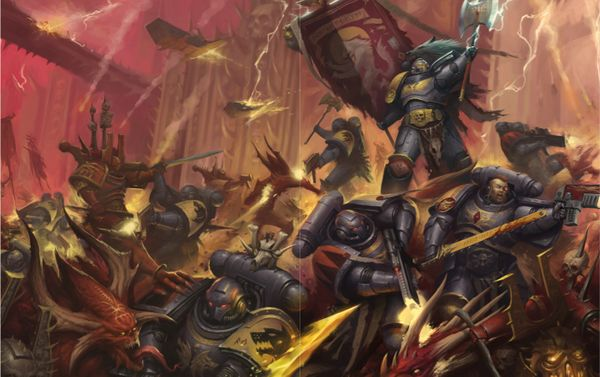

<!-- A0362-B0491 -->

原译文

Space Wolves Primaris Space Marines battle Daemons 太空野狼原铸星际战士与恶魔战斗

**校订译文**

Space Wolves Primaris Space Marines battle Daemons 太空野狼原铸星际战士与恶魔战斗

<!-- /A0362-B0491 -->

<!-- A0362-B0492 -->
**英文原文**

Great Wolf: The Chapter Master of the Space Wolves, the Great Wolf is chosen from among the Wolf Lords, and leads his own Great Company. The current Great Wolf is Logan Grimnar who has held the position for the past 700 years.

<!-- /A0362-B0492 -->

<!-- A0362-B0493 -->

原译文

头狼：太空野狼的战团长，头狼是从狼主中挑选出来的，并领导着自己的大连。现在的头狼是罗根·格里姆纳尔，他在过去的700年里一直担任这一职位。

**校订译文**

头狼：太空野狼战团长，从诸位狼主中选出，并亲自统率自己的大连。本稿所述现任头狼为洛根·格里姆纳尔，已在位七百年。

<!-- /A0362-B0493 -->

<!-- A0362-B0494 -->
**英文原文**

Wolf Lord: each Great Company has a commander (equivalent to a Captain in other chapters), chosen from that company’s Wolf Guard. It is his duty to organise his Great Company, which adopts that Lord's name and sigil, and often changes its battle tactics to reflect his personality and temperament.

<!-- /A0362-B0494 -->

<!-- A0362-B0495 -->

原译文

狼主：每个大连都有一名指挥官（相当于其他战团中的连长），从该连队的野狼卫队中选出。他有责任组织他的大连，该连队采用这位领主的名字和徽章，并经常改变战术以反映他的个性和气质。

**校订译文**

狼主：每个大连的指挥官，相当于其他战团的连长，从本大连的野狼守卫中选出。狼主负责组织统领大连；大连会采用他的名字与徽记，并经常调整战术，以体现其个性与气质。

<!-- /A0362-B0495 -->

<!-- A0362-B0496 -->
**英文原文**

Battle Leaders are the Space Wolves equivalent to a Space Marine Lieutenant. Typically two of these officers exist in every Great Company, serving directly underneath a Wolf Lord.

<!-- /A0362-B0496 -->

<!-- A0362-B0497 -->

原译文

战斗领袖是太空野狼，相当于星际战士副官。通常，每个大连都有两名这样的军官，直接在狼主手下服役。

**校订译文**

战斗领袖相当于普通星际战士副官。每个大连通常有两位这样的军官，直接辅佐狼主。

<!-- /A0362-B0497 -->

<!-- A0362-B0498 -->
**英文原文**

Wolf Priests combine the roles of Chaplain and Apothecary within the chapter. They are selected from any part of the chapter but usually from the Long Fangs or Wolf Guard due to the greater wisdom of these marines. Instead of using codex medical equipment, Wolf Priests using healing potions and balms, using knowledge passed down from one Wolf Priest to the next. They are also responsible for the selection of new Aspirants to the chapter, observing the frequent skirmishes among the human inhabitants of Fenris and selecting worthy young men to undergo the trials.

<!-- /A0362-B0498 -->

<!-- A0362-B0499 -->

原译文

狼牧师在战团中结合了牧师和药剂师的角色。他们可以从战团的任何部分中选择，但通常是从长牙或野狼卫队中选择的，因为这些星际战士的智慧更高。狼牧师没有使用圣典医疗设备，而是使用治疗药水和香膏，利用从一个狼牧师传给下一个的知识。他们还负责挑选新的有志者加入战团，观察芬里斯人类居民之间频繁的冲突，并挑选有价值的年轻人接受测试。

**校订译文**

狼牧师兼任教士与药剂师的职责。他们可从战团任何编制中选拔，但通常出自长牙或野狼守卫，因为这些战士更富智慧。狼牧师不用圣典规定的常规医疗设备，而是凭借代代相传的知识，以药剂和药膏治疗伤者。他们也负责选拔新兵，观察芬里斯居民间频繁发生的战斗，挑选合适的年轻人接受试炼。

<!-- /A0362-B0499 -->

<!-- A0362-B0500 -->
**英文原文**

Rune Priests are the Wolves' equivalent to the Librarians of other chapters. It is their duty to keep the knowledge of the chapter’s history, reciting the great sagas of old. In battle they wield formidable psychic powers, rooted in the shamanistic traditions of Fenris.

<!-- /A0362-B0500 -->

<!-- A0362-B0501 -->

原译文

符文牧师相当于其他战团的智库。他们有责任了解这战团的历史，背诵古老的伟大传奇。在战斗中，他们拥有强大的灵能力量，植根于芬里斯的萨满教传统。

**校订译文**

符文牧师相当于其他战团的智库员，负责保存战团历史，吟诵古老的伟大传奇。在战场上，他们施展植根于芬里斯萨满传统的强大灵能。

<!-- /A0362-B0501 -->

<!-- A0362-B0502 -->
**英文原文**

Iron Priests are the Wolves' equivalent of the Techmarines of other chapters. They are required to keep the equipment of their Great Company in working order and maintain the machine spirits of its vehicles and weaponry, including the Dreadnoughts in the depths of the Fang, which they must rouse from their deep slumbers if they are needed in battle.

<!-- /A0362-B0502 -->

<!-- A0362-B0503 -->

原译文

钢铁牧师是狼相当于其他战团的技术军士。他们被要求保持大连的设备正常工作，并维护其车辆和武器的机魂，包括长牙堡深处的无畏，如果需要战斗，他们必须从沉睡中醒来。

**校订译文**

钢铁牧师相当于其他战团的科技战士，负责使所属大连的装备保持正常运转，并照料载具及武器的机魂，包括沉睡在长牙堡深处的无畏机甲。需要他们出战时，钢铁牧师便须将这些古老战士从沉眠中唤醒。

<!-- /A0362-B0503 -->

<!-- A0362-B0504 -->
### Dreadnoughts 无畏

<!-- /A0362-B0504 -->

<!-- A0362-B0505 -->
**英文原文**

Dreadnoughts amongst the Space Wolves are referred to as the Sons of Ymir, at least during the Great Crusade and Horus Heresy era. During this time sub-formations of Space Wolves Dreadnoughts existed, such as the Eldthursar and Hrimthursar.

<!-- /A0362-B0505 -->

<!-- A0362-B0506 -->

原译文

太空野狼中的无畏被称为伊米尔之子，至少在大远征和荷鲁斯叛乱时代是这样。在此期间，太空野狼无畏存在子编队，如火焰巨人和冰霜巨人。

**校订译文**

至少在大远征与荷鲁斯之乱时期，太空野狼的无畏机甲统称“伊米尔之子”，其中还有火焰巨人与冰霜巨人等分支编组。

<!-- /A0362-B0506 -->

<!-- A0362-B0507 图片 -->
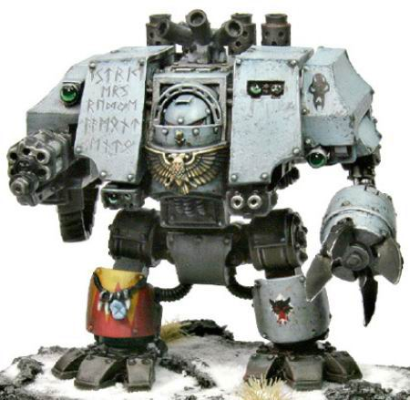

<!-- A0362-B0508 -->

原译文

Ancient Warclaw, a Space Wolves Dreadnought of the Bloodmaws Great Company 古战爪，红喉大连的太空野狼无畏

**校订译文**

Ancient Warclaw, a Space Wolves Dreadnought of the Bloodmaws Great Company 血喉大连的太空野狼无畏机甲“长者战爪”。

<!-- /A0362-B0508 -->

<!-- A0362-B0509 -->
**英文原文**

Amongst the number of Dreadnoughts in the Space Wolves chapter, some are extremely ancient, carrying warriors, such as Bjorn the Fell-Handed, who walked beneath the same sky as the Emperor himself, and who stood beside Leman Russ in battle. There is also the savage Murderfang. These dreadnoughts are revered and so respected is their skill in battle that on rare occasions, a Dreadnought may be called upon to lead an army into battle. The troops following in his footsteps will chant his name, remembering the many sagas they have heard of his exploits. This is a fearsome scene to behold for any enemy.

<!-- /A0362-B0509 -->

<!-- A0362-B0510 -->

原译文

在太空野狼战团中的无畏中，有些是非常古老的，携有战士，如断手比约恩，他曾和帝皇本人在同一片天空下行走，在战斗中站在黎曼·鲁斯身边。还有野蛮的弑牙。这些无畏备受尊敬，其战斗技能也备受推崇，在极少数情况下，无畏可能会被召唤率领军队作战。跟随他的脚步的部队将高呼他的名字，记住他们听说过的许多关于他的功绩的传说。这对任何敌人来说都是一个可怕的场景。

**校订译文**

太空野狼的无畏之中，有些承载着极其古老的战士，例如断手比约恩：他曾与帝皇共处同一片天空之下，也曾在战场上站在黎曼·鲁斯身旁。战团还有凶暴的杀戮牙。这些无畏深受尊崇，其战斗技艺也备受敬重；极少数情况下，他们甚至会受命统率大军。跟随者一边前进，一边高呼他的名字，回忆关于其战功的诸多传奇。任何敌人目睹这一景象，都会感到恐惧。

<!-- /A0362-B0510 -->

<!-- A0362-B0511 -->
**英文原文**

In the Age of the Dark Imperium the Space Wolves operate Wulfen Dreadnoughts and Redemptor Dreadnoughts alongside their older suits.

<!-- /A0362-B0511 -->

<!-- A0362-B0512 -->

原译文

在黑暗帝国时代，太空野狼除了他们的旧机甲外，还操作着狼人无畏和救赎者无畏。

**校订译文**

黑暗帝国时代，太空野狼在旧式无畏之外，也使用狼人无畏机甲及救赎者无畏机甲。

<!-- /A0362-B0512 -->

<!-- A0362-B0513 -->
## Recruitment 招募

<!-- /A0362-B0513 -->

<!-- A0362-B0514 -->
**英文原文**

The Space Wolves recruit their new initiates from the native humans of Fenris. Wolf Priests venture abroad from the Fang from time to time to walk amongst the inhabitants of the feral world, challenging the locals' champions to bouts of eating, drinking, or wrestling. Invariably, of course, the gene-enhanced Wolf Priest will emerge victorious, and with them they will take their prize: the best of the champion tribesmen to bring back to the Fang, where they undergo many grueling trials. Some, however, forego the match against the Wolf Priest if they have already proved their prowess in battle.

<!-- /A0362-B0514 -->

<!-- A0362-B0515 -->

原译文

太空野狼从芬里斯的当地人那里招募新的同袍。狼牧师不时从长牙堡谨慎出发，在野性世界的居民中行走，挑战当地的冠军，吃、喝或摔跤。当然，基因增强的狼牧师总是会取得胜利，他们也会获得奖品：将最优秀的冠军部落成员带回长牙堡，在那里他们将经历许多艰苦的考验。然而，如果他们已经在战斗中证明了自己的实力，有些人会放弃与狼牧师的比赛。

**校订译文**

太空野狼从芬里斯本地人中征募新兵。狼牧师不时离开长牙堡，行走于这个蛮荒世界的居民之间，向部族勇士挑战食量、酒量或摔跤。经过基因强化的狼牧师自然总能获胜，并取走自己的奖品：最出色的部族勇士会随他们返回长牙堡，接受艰苦试炼。但已经在战场证明过实力的人，有时可以免去与狼牧师较量这一关。

<!-- /A0362-B0515 -->

<!-- A0362-B0516 -->
**英文原文**

The Wolf Priests keep a watchful eye on the battles and hunts of the Fenrisian tribesmen. Should someone display extreme heroism, prowess, or martial feats the Wolf Priest will descend to collect the warrior, and deliver him from death by giving him the chance to serve the chapter. Recruits are given to the bowels of The Fang in an area known as the Gates of Morkai, where his soul is scoured for any signs of impurity.

<!-- /A0362-B0516 -->

<!-- A0362-B0517 -->

原译文

狼牧师们密切关注着芬里斯部落的战斗和狩猎。如果有人表现出极端的英雄主义、英勇或军事壮举，狼牧师将下山招募战士，并通过给他为战团服务的机会将他从死亡中解救出来。新兵被送到被称为莫凯之门的长牙堡腹地，在那里，他的灵魂被搜寻任何不洁的迹象。

**校订译文**

狼牧师密切观察芬里斯部族的战斗与狩猎。有人展现出非凡英雄气概、武艺或战功时，他们便会现身，将战士从死亡边缘带走，赐予他为战团效力的机会。新兵被送入长牙堡深处称为“莫凯之门”的区域，在那里接受严密的灵魂审查，以找出任何不洁之处。

<!-- /A0362-B0517 -->

<!-- A0362-B0518 -->
**英文原文**

Once they have passed all of their preliminary trials, they are administered the Test of Morkai, where the initiate is given the first strand of the Canis Helix gene, and thrown out into the wilds outside the Fang. If they overcome the deadly side effects of their chapter's geneseed, and make it back to the Fang alive, they are accepted into the ranks of the Space Wolves with open arms, and the remaining procedures are undergone to turn the recruit into a full fledged warrior of the Emperor.

<!-- /A0362-B0518 -->

<!-- A0362-B0519 -->

原译文

一旦他们通过了所有的初步试验，他们就会接受莫凯试炼，在那里，信徒会被给予狼之螺旋基因的第一条链，并被扔到长牙堡外的野外。如果他们克服了战团基因种子的致命副作用，并活着回到长牙堡，他们就会张开双臂被接纳到太空野狼的行列，并完成剩余的流程，将新兵变成帝皇的正式战士。

**校订译文**

通过所有初步考验后，候选者接受莫凯试炼：先被植入狼之螺旋基因的最初部分，再被抛入长牙堡外的荒野。若能抵御战团基因种子的致命副作用，并活着返回长牙堡，便会被太空野狼欣然接纳，接受余下的改造程序，成为帝皇麾下完整的超人战士。

<!-- /A0362-B0519 -->

<!-- A0362-B0520 -->
**英文原文**

Notably, Primaris Space Marines do not follow the same recruitment ritual as other Space Wolves. While they undertake the Test of Morkai, they do not drink from the Cup of Wulfen.

<!-- /A0362-B0520 -->

<!-- A0362-B0521 -->

原译文

值得注意的是，原铸星际战士并不遵循与其他太空野狼相同的招募仪式。当他们进行莫凯试炼时，他们不喝狼人之杯。

**校订译文**

原铸星际战士的入选仪式与其他太空野狼不同：他们也参加莫凯试炼，但不饮狼人之杯。

<!-- /A0362-B0521 -->

<!-- A0362-B0522 -->
## Heraldry 纹章

<!-- /A0362-B0522 -->

<!-- A0362-B0523 -->
### Symbols and Colours 符号和颜色

<!-- /A0362-B0523 -->

<!-- A0362-B0524 -->
**英文原文**

The Space Wolves wear blue-grey coloured armour with other colours as highlights, notably red, yellow, black and white, and often adorned with tokens taken from wolves, such as furs and teeth.

<!-- /A0362-B0524 -->

<!-- A0362-B0525 -->

原译文

太空野狼身穿蓝灰色盔甲，以其他颜色为亮点，特别是红色、黄色、黑色和白色，并经常装饰着从狼身上取下的标志，如皮毛和牙齿。

**校订译文**

太空野狼穿着蓝灰色动力甲，辅以红、黄、黑、白等颜色，并常以狼皮、狼牙等饰物装点盔甲。

<!-- /A0362-B0525 -->

<!-- A0362-B0526 -->
### Great Company Badges 大连徽章

<!-- /A0362-B0526 -->

<!-- A0362-B0527 -->
**英文原文**

The Space Wolves have a rather different system of markings than that used by more Codex adherent Chapters. Rather than using the company markings as laid down in the Codex Astartes, the Space Wolves use a number of different wolf symbols to denote the different Great Companies that make up the chapter. These are normally a stylised wolf emblem denoting some aspect of the native Fenrisian mythology. These are chosen by a new Wolf Lord upon his election from the ranks of the Wolf Guard, and are adopted by all of the Space Wolves within the Great Company as a mark of fealty. They are also woven onto the various Great Company banners, The symbol remains with the Great Company until the Wolf Lord falls in battle, whereupon a new Wolf Lord is chosen, and so the badge changes.

<!-- /A0362-B0527 -->

<!-- A0362-B0528 -->

原译文

太空野狼的徽章系统与更多遵守圣典的战团使用的徽章系统截然不同。太空野狼没有使用阿斯塔特圣典中规定的连队标记，而是使用了许多不同的野狼符号来表示组成战团的不同大连。这些通常是一个风格化的狼徽，代表了当地芬里斯神话的某些方面。这些是由一位新的狼主从野狼卫队中选出的，并被大连内的所有太空野狼采用，作为忠诚的标志。它们也被编织在各个大连的旗帜上。这个符号一直伴随着大连，直到狼主在战斗中倒下，于是选出了一个新的狼主，徽章也随之改变。

**校订译文**

太空野狼的识别标志体系与严格遵循圣典的战团迥异。他们不用《阿斯塔特圣典》规定的连队标记，而以不同狼形符号区分各大连。这些纹章通常经过艺术化处理，体现芬里斯神话的某一意象。新狼主从野狼守卫中获选后，会亲自选定徽记；本大连所有成员都采用它，以示效忠，战旗上也会织入同样的图案。直到狼主战死、继任者当选，大连才会更换徽记。

<!-- /A0362-B0528 -->

<!-- A0362-B0529 -->
**英文原文**

Even these marks bow down to the Space Wolves' reputation for nonconformity, and hence lack of any formal uniform system. There is never only one way to represent a Great Company badge, and within a Great Company it is likely to find a number of variants of the badge being used at the same time. Indeed, there are currently three different stylisations of the Blackmane Wolf emblem (currently used by Ragnar Blackmane's Great Company) in Imperial records. Indeed, over the centuries many hundreds of different styles of badges have been recorded by Imperial scribes.

<!-- /A0362-B0529 -->

<!-- A0362-B0530 -->

原译文

即使是这些徽章，也要归功于太空野狼不墨守成规的声誉，因此缺乏任何正式的统一系统。代表大连徽章的方式从来都不是唯一的，在大连内部，很可能会同时使用多种徽章变体。事实上，帝国记录中目前有三种不同风格的黑鬃野狼徽章（目前由拉格纳·黑鬃的大连使用）。事实上，几个世纪以来，帝国抄写员记录了数百种不同风格的徽章。

**校订译文**

即使是徽记，也体现着太空野狼不愿循规蹈矩的作风，并无严格统一的标准。同一个大连徽记从来不只有一种画法，一个大连内部往往同时使用多种变体。例如，帝国档案目前记载了三种不同样式的黑鬃狼徽，均由拉格纳·黑鬃的大连使用。数百年来，帝国抄写员已记录下数以百计的纹章样式。

<!-- /A0362-B0530 -->

<!-- A0362-B0531 -->
**英文原文**

The one badge that does not change is the household of the Great Wolf. The household uses "The Wolf That Stalks Between Stars", the badge of Leman Russ himself, as its emblem. This badge is perhaps unique within the Space Wolves, as there are no recorded variants of it, a testament to the respect that the Space Wolves have for their Primarch. It is this badge that represents the Space Wolves as a chapter, and is woven on the Chapter's banner.

<!-- /A0362-B0531 -->

<!-- A0362-B0532 -->

原译文

唯一不变的徽章是头狼的。这个连队使用黎曼·鲁斯本人的徽章“星徊之狼”作为徽章。这个徽章在太空野狼中可能是独一无二的，因为没有记录到它的变体，这证明了太空野狼对他们的原体的尊重。正是这个徽章代表了太空野狼作为一个战团，并编织在战团的旗帜上。

**校订译文**

唯一不变的是头狼直属扈从的徽记。他们采用黎曼·鲁斯本人的“星徊之狼”，从未有过变体的记录；这种独一无二的延续，体现了太空野狼对原体的敬重。整个战团也以此为标志，并将它织于战团旗帜之上。

**校注：** household 是头狼直属扈从/家臣，不等于其原属整个大连；与 B0322 特别指出仅头狼本人采用徽记相呼应。

<!-- /A0362-B0532 -->

<!-- A0362-B0533 -->
**英文原文**

Also, many of the Space Wolves most honoured and treasured relics carry this symbol, having been in the possession or service of the Chapter (and hence the Imperium) since the days when Russ walked among the stars. Many of the Chapter's most sacred Banners have a rendition of this symbol on them, a tangible link to the time when Russ walked among them. Whilst many of these are treasured in their own right, perhaps the most treasured of all is the Dreadnought Bjorn the Fell-Handed, who fought alongside Russ during the Great Crusade. He carries the mark on his Dreadnought armour to show this perhaps unique distinction.

<!-- /A0362-B0533 -->

<!-- A0362-B0534 -->

原译文

此外，许多最受尊敬和珍视的太空野狼圣物都带有这一徽章，自鲁斯在群星中行走的日子以来，它们就一直为战团（以及帝国）所拥有或服务。战团许多最神圣的旗帜上都有这个符号的再现，这与鲁斯在其中行走的时间有着切实的联系。虽然其中许多本身就很珍贵，但也许最珍贵的是无畏比约恩，他在大远征期间与鲁斯并肩作战。他的无畏机甲上刻着这个标记，以显示这种也许是独一无二的区别。

**校订译文**

许多备受珍视的太空野狼圣物也带有这一符号；自鲁斯仍行走群星之时起，它们便归战团所有，或为战团及帝国服役。不少最神圣的战旗织有星徊之狼，让战士与原体尚在的年代保持着切实联系。在这些珍宝中，最受珍视的或许是曾随鲁斯参加大远征的断手比约恩。他的无畏机甲上刻着这一标志，彰显那份或许独一无二的殊荣。

<!-- /A0362-B0534 -->

<!-- A0362-B0535 -->
### Honour Badges 荣誉徽章

<!-- /A0362-B0535 -->

<!-- A0362-B0536 -->
**英文原文**

The Space Wolves have a long, varied, and altogether proud warrior heritage. They especially appreciate acts of bravery, courage and skill among their own comrades, and proudly display badges that denote these acts. These badges are normally painted or carved onto the armour and weapons of the Space Wolf.

<!-- /A0362-B0536 -->

<!-- A0362-B0537 -->

原译文

太空野狼有着悠久、多样、令人自豪的战士传统。他们特别欣赏自己同袍的勇敢、勇气和技能，并自豪地展示表示这些行为的徽章。这些徽章通常被绘制或雕刻在太空野狼的盔甲和武器上。

**校订译文**

太空野狼有着悠久、多样、令人自豪的战士传统。他们特别欣赏自己同袍的勇敢、勇气和技能，并自豪地展示表示这些行为的徽章。这些徽章通常被绘制或雕刻在太空野狼的盔甲和武器上。

<!-- /A0362-B0537 -->

<!-- A0362-B0538 图片 -->
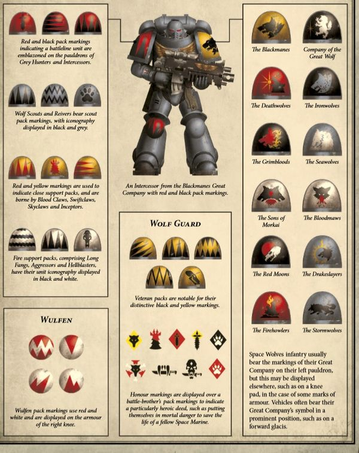

<!-- A0362-B0539 -->

原译文

Modern Space Wolves heraldry 现代太空野狼纹章

**校订译文**

Modern Space Wolves heraldry 现代太空野狼纹章

<!-- /A0362-B0539 -->

<!-- A0362-B0540 -->
**英文原文**

As with most Space Wolf displays, there is no formal system of awards, it only matters that those the Space Wolf fights with understand the significance of the symbol. However, some symbols have acquired a special significance to the Space Wolves over time, and the Sergeant and Veteran badges are good examples of this. There are also some more general symbolism which is used in the honour badges; badges with bones tend to signify wounds suffered in battle, knife and claw symbols represent ferocity and bravery in battle and wolf tails signify great courage in battle.

<!-- /A0362-B0540 -->

<!-- A0362-B0541 -->

原译文

与大多数太空野狼展示一样，没有正式的奖励制度，重要的是太空野狼与之战斗的人理解这个符号的意义。然而，随着时间的推移，一些符号对太空野狼来说已经具有了特殊的意义，军士和老兵徽章就是很好的例子。荣誉徽章中还使用了一些更普遍的象征意义；带有骨头的徽章往往象征着在战斗中受伤，刀与爪象征着战斗中的凶猛和勇敢，狼尾象征着战斗的巨大勇气。

**校订译文**

如同太空野狼的大多数标识，荣誉徽章也没有正式颁授制度；重要的只是并肩作战的同袍理解其含义。不过，一些符号在长期使用中形成了固定意义，例如军士与老兵徽记。此外，荣誉徽章也采用较普遍的象征：骨骼表示战伤，刀刃与利爪代表作战凶猛英勇，狼尾则象征极大的勇气。

<!-- /A0362-B0541 -->

<!-- A0362-B0542 -->
### Army Badge 军队徽章

<!-- /A0362-B0542 -->

<!-- A0362-B0543 -->
**英文原文**

It is quite common for Space Wolves of different Great Companies to find themselves fighting alongside one another in the same task force. In order to aid identification, and to provide a greater amount of task force cohesion on the battlefield, an army marking is usually applied to the Space Wolf's armour, as well as to the vehicles of the task force. As with all badges, there are some that are preferred over others. Of particular note is that used by the current task force of Ragnar Blackmane; A fanged skull superimposed on two crossed bones, mounted on a black lozenge. This particular badge has appeared many times in the past, and therefore probably has some special significance to the Space Wolves.

<!-- /A0362-B0543 -->

<!-- A0362-B0544 -->

原译文

不同大连的太空野狼在同一个任务中并肩作战是很常见的。为了帮助识别，并在战场上提供更大的部队凝聚力，通常会在太空野狼的盔甲以及特遣部队的载具上使用军队徽章。与所有徽章一样，有些徽章比其他徽章更受欢迎。特别值得注意的是拉格纳·黑鬃现任部队使用的；两块交叉的骨头上叠加着一个有尖牙的头骨，装在一块黑色菱形上。这个特殊的徽章在过去已经出现过很多次，因此可能对太空野狼有一些特殊的意义。

**校订译文**

不同大连经常组成同一支特遣部队并肩作战。为了便于识别、增强战场凝聚力，战士盔甲与部队载具通常会绘上共同的军队徽记。和其他纹章一样，某些图案尤其受青睐。例如，拉格纳·黑鬃当前特遣部队采用黑色菱形底纹，上绘交叉双骨与长有尖牙的骷髅。这个徽记在过去曾多次出现，可能对太空野狼具有特别意义。

<!-- /A0362-B0544 -->

<!-- A0362-B0545 -->
## Noted Elements of the Space Wolves 太空野狼的重要组成

原题：Noted Elements of the Space Wolves 太空野狼的著名元素

<!-- /A0362-B0545 -->

<!-- A0362-B0546 -->
### Equipment, Relics and Artifacts 装备、遗物和圣物

<!-- /A0362-B0546 -->

<!-- A0362-B0547 -->
**英文原文**

Space Wolves Equipment is similar to that of Codex chapters. In some ways it is more primitive – for instance, Iron Priests do not have access to a full Servo-harness or Thunderfire Cannons. Similarly, some of the equipment associated with the Imperial cult such as the Chaplain's Rosarius or the Apothecary's Reductor have their own unique variants among the Space Wolves, such as the Wolf Amulet and the Fang of Morkai.

<!-- /A0362-B0547 -->

<!-- A0362-B0548 -->

原译文

太空野狼装备类似于圣典战团。在某些方面，它更原始—例如，钢铁牧师无法使用完整的伺服套件或雷火炮。同样，与帝国崇拜相关的一些装备，如牧师的玫瑰念珠或药剂师的还原者，在太空野狼中也有自己独特的变体，如野狼护身符和莫凯之牙。

**校订译文**

太空野狼的装备与圣典战团大致相似，但某些方面更加原始，例如钢铁牧师无法使用完整伺服工具架或雷火炮。其他一些与帝国信仰有关的装备，如教士的玫瑰念珠及药剂师的基因提取器，在太空野狼中则有独特的对应物，例如野狼护符与莫凯之牙。

**校注：** Reductor 是药剂师使用的器械，暂按用途译“基因提取器”；原“还原者”误似人员称号。

<!-- /A0362-B0548 -->

<!-- A0362-B0549 -->
### Fleet 舰队

<!-- /A0362-B0549 -->

<!-- A0362-B0550 -->
**英文原文**

The Space Wolves maintain an abnormally large fleet for Space Marine standards, numbering over a hundred vessels. The fleet was at one point noted to consist of:

<!-- /A0362-B0550 -->

<!-- A0362-B0551 -->

原译文

太空野狼维持着一支符合星际战士标准的异常庞大的舰队，有100多艘战舰。舰队一度被认为包括：

**校订译文**

以星际战士战团的标准衡量，太空野狼舰队规模异常庞大，拥有一百余艘舰船。某一时期的记录列出以下兵力：

<!-- /A0362-B0551 -->

<!-- A0362-B0552 -->
**英文原文**

8 Battle Barges.

<!-- /A0362-B0552 -->

<!-- A0362-B0553 -->

原译文

8艘战斗驳船。

**校订译文**

八艘战斗驳船。

<!-- /A0362-B0553 -->

<!-- A0362-B0554 -->
**英文原文**

30+ Strike Cruisers.

<!-- /A0362-B0554 -->

<!-- A0362-B0555 -->

原译文

30+打击巡洋舰。

**校订译文**

三十余艘打击巡洋舰。

<!-- /A0362-B0555 -->

<!-- A0362-B0556 -->
**英文原文**

20+ Hunter Class Destroyer Squadrons.

<!-- /A0362-B0556 -->

<!-- A0362-B0557 -->

原译文

20+猎手级驱逐舰中队。

**校订译文**

二十余个猎手级驱逐舰中队。

<!-- /A0362-B0557 -->

<!-- A0362-B0558 -->
**英文原文**

20+ Gladius and Nova Class Frigate Squadrons.

<!-- /A0362-B0558 -->

<!-- A0362-B0559 -->

原译文

20+短剑级和新星级护卫舰中队。

**校订译文**

二十余个短剑级与新星级护卫舰中队。

<!-- /A0362-B0559 -->

<!-- A0362-B0560 -->
**英文原文**

2 Ramilies Class Star Forts (Goremenjarl and Mjalnar).

<!-- /A0362-B0560 -->

<!-- A0362-B0561 -->

原译文

2个拉米雷斯级星堡（血腥贵族和雷神之锤）

**校订译文**

两座拉米雷斯级星堡：血腥贵族与雷神之锤。

**校注：** Goremenjarl、Mjalnar 是星堡专名，“血腥贵族”“雷神之锤”沿用现稿，未查得官方汉译；后者不因词形相近便宣称与现实神话 Mjölnir 完全同名。

<!-- /A0362-B0561 -->

<!-- A0362-B0562 -->
**英文原文**

Stormfang, Stormwolf, Stormhawk, and Thunderhawk aircraft.

<!-- /A0362-B0562 -->

<!-- A0362-B0563 -->

原译文

风暴牙、风暴狼、风暴鹰和雷鹰飞行器。

**校订译文**

风暴牙、风暴狼、风暴鹰和雷鹰飞行器。

<!-- /A0362-B0563 -->

<!-- A0362-B0564 -->
### Known Vessels 已知战舰

<!-- /A0362-B0564 -->

<!-- A0362-B0565 -->
### Heresy Era 荷鲁斯之乱时期

原题：Heresy Era 叛乱前

<!-- /A0362-B0565 -->

<!-- A0362-B0566 -->
**英文原文**

Hrafnkel — Gloriana Class Battleship, flagship of Leman Russ.

<!-- /A0362-B0566 -->

<!-- A0362-B0567 -->

原译文

赫拉芬克尔 — 荣光女王级战列舰，黎曼·鲁斯的旗舰。

**校订译文**

赫拉芬克尔号——荣光女王级战列舰，黎曼·鲁斯的旗舰。

<!-- /A0362-B0567 -->

<!-- A0362-B0568 -->
### Post-Heresy 叛乱后

<!-- /A0362-B0568 -->

<!-- A0362-B0569 -->
**英文原文**

Allfather's Honour — Battle Barge and current flagship of the Chapter.

<!-- /A0362-B0569 -->

<!-- A0362-B0570 -->

原译文

全父荣光 - 战斗驳船和战团目前的旗舰。

**校订译文**

全父荣光号——战斗驳船，战团现任旗舰。

<!-- /A0362-B0570 -->

<!-- A0362-B0571 -->
### Vehicles 载具

<!-- /A0362-B0571 -->

<!-- A0362-B0572 -->
**英文原文**

As well as the usual Space Marine Vehicles deployed by the Chapter, the Space Wolves keep a number of Leman Russ Exterminators in their arsenal - in honour of Leman Russ. They use these in battle rarely but to devastating effect, the tanks' fearsome array of weaponry enhanced further by the skills of the marines inside.

<!-- /A0362-B0572 -->

<!-- A0362-B0573 -->

原译文

除了战团部署的常规星际战士载具外，太空野狼还在他们的军械库中保留了一些黎曼鲁斯根除者，以纪念黎曼·鲁斯。他们很少在战斗中使用这些武器，但会产生毁灭性的效果，坦克可怕的武器阵列因内部战士的技能而进一步增强。

**校订译文**

除通常的星际战士载具外，太空野狼军械库还保有一些黎曼鲁斯灭绝者坦克，以纪念原体。他们很少动用这些战车，但每逢出战都会造成毁灭性打击；星际战士乘员精湛的技艺，更使战车原本就可怕的武装发挥出惊人威力。

**校注：** Leman Russ Exterminator 对应官方“黎曼鲁斯灭绝者”；原“根除者”实际对应另一型号 Eradicator。

<!-- /A0362-B0573 -->

<!-- A0362-B0574 -->
### Known Vehicles 已知载具

<!-- /A0362-B0574 -->

<!-- A0362-B0575 -->
**英文原文**

Fire of Fenris — Land Raider Redeemer, fought on Aarnheim for the Sevenfold City and during the Siege of the Fenris System

<!-- /A0362-B0575 -->

<!-- A0362-B0576 -->

原译文

芬里斯之火 — 兰德掠袭者救赎者，在阿恩海姆为七倍之城作战，并在芬里斯星系围攻期间作战

**校订译文**

芬里斯之火号——救赎者型兰德掠袭者战车，曾参加阿伦海姆的七倍之城争夺战，以及芬里斯星系围攻战。

<!-- /A0362-B0576 -->

<!-- A0362-B0577 -->
**英文原文**

Gore Dagger — Caestus Assault Ram

<!-- /A0362-B0577 -->

<!-- A0362-B0578 -->

原译文

戈尔匕首 — 拳套突击艇

**校订译文**

血腥匕首号——拳套突击艇。

<!-- /A0362-B0578 -->

<!-- A0362-B0579 -->
**英文原文**

Helmgart — Stormbird.

<!-- /A0362-B0579 -->

<!-- A0362-B0580 -->

原译文

赫尔姆加特 — 风暴鸟

**校订译文**

赫尔姆加特号——风暴鸟。

<!-- /A0362-B0580 -->

<!-- A0362-B0581 -->
**英文原文**

Morkai — Fourth aircraft of the Chapter. It took part in the Battle of Medes 841

<!-- /A0362-B0581 -->

<!-- A0362-B0582 -->

原译文

莫凯 — 战团第四架飞行器。它参加了841的米堤亚之战

**校订译文**

莫凯号——战团的第四架飞行器，曾参加米堤亚 841 之战。

<!-- /A0362-B0582 -->

<!-- A0362-B0583 -->
**英文原文**

Voltar — Land Raider

<!-- /A0362-B0583 -->

<!-- A0362-B0584 -->

原译文

沃尔特 — 兰德掠袭者

**校订译文**

沃尔特号——兰德掠袭者战车。

<!-- /A0362-B0584 -->

<!-- A0362-B0585 -->
### Notable Space Wolves 著名太空野狼

<!-- /A0362-B0585 -->

<!-- A0362-B0586 -->
### Heresy Era 荷鲁斯之乱时期

原题：Heresy Era 叛乱前

<!-- /A0362-B0586 -->

<!-- A0362-B0587 -->
**英文原文**

Leman Russ — Primarch

<!-- /A0362-B0587 -->

<!-- A0362-B0588 -->

原译文

黎曼·鲁斯 — 原体

**校订译文**

黎曼·鲁斯 — 原体

<!-- /A0362-B0588 -->

<!-- A0362-B0589 -->
**英文原文**

Bjorn the Fell-Handed — First Great Wolf, Wolf Guard to Leman Russ

<!-- /A0362-B0589 -->

<!-- A0362-B0590 -->

原译文

断手比约恩 — 第一位头狼，黎曼·鲁斯的野狼卫队

**校订译文**

断手比约恩 — 第一位头狼，黎曼·鲁斯的野狼守卫

<!-- /A0362-B0590 -->

<!-- A0362-B0591 -->
**英文原文**

Gunnar Gunnhilt — Jarl of Onn (1st Great Company)

<!-- /A0362-B0591 -->

<!-- A0362-B0592 -->

原译文

加纳·甘希尔特 — 一连首领（第一大连）

**校订译文**

加纳·甘希尔特 — 一连首领（第一大连）

<!-- /A0362-B0592 -->

<!-- A0362-B0593 -->
**英文原文**

Aeska Brokenlip — Jarl of Tra after the Second Founding, previously Wolf Guard to Ogvai Ogvai Helmschrot

<!-- /A0362-B0593 -->

<!-- A0362-B0594 -->

原译文

埃斯卡·布罗肯利普 — 二次建军后的三连首领，之前是奥格瓦伊·残盔的野狼卫队

**校订译文**

埃斯卡·布罗肯利普 — 二次建军后的三连首领，之前是奥格瓦伊·残盔的野狼守卫

<!-- /A0362-B0594 -->

<!-- A0362-B0595 -->
**英文原文**

Hvarl Red-Blade — Jarl of Sepp (7th Great Company)

<!-- /A0362-B0595 -->

<!-- A0362-B0596 -->

原译文

哈瓦尔·红刃 — 七连首领（第七大连）

**校订译文**

哈瓦尔·红刃 — 七连首领（第七大连）

<!-- /A0362-B0596 -->

<!-- A0362-B0597 -->
**英文原文**

Jorin Bloodhowl — Jarl of Dekk-Tra (13th Great Company)

<!-- /A0362-B0597 -->

<!-- A0362-B0598 -->

原译文

约林·血嚎 — 十三连首领（第十三大连）

**校订译文**

乔林·血嚎——第十三大连（Dekk-Tra）首领。

<!-- /A0362-B0598 -->

<!-- A0362-B0599 -->
**英文原文**

Bulveye — Jarl of Dekk-Tra, previously Huscarl to Jorin Bloodhowl

<!-- /A0362-B0599 -->

<!-- A0362-B0600 -->

原译文

布拉维耶 — 十三连首领，约林·血嚎的前首领

**校订译文**

布拉维耶——第十三大连（Dekk-Tra）首领，曾任乔林·血嚎麾下的王室护卫。

**校注：** previously Huscarl to Jorin Bloodhowl 表示曾为乔林麾下护卫，而不是乔林的前任首领，原译颠倒了从属关系。

<!-- /A0362-B0600 -->

<!-- A0362-B0601 -->
**英文原文**

Geigor Fell-Hand — Company Champion

<!-- /A0362-B0601 -->

<!-- A0362-B0602 -->

原译文

戈果·邪手 — 连队冠军

**校订译文**

戈果·邪手 — 连队冠军

**校注：** Geigor Fell-Hand 暂沿用“戈果·邪手”；Fell-Hand 与 Bjorn the Fell-Handed 为不同人物称号，不直接借用断手比约恩的官译合并二人。

<!-- /A0362-B0602 -->

<!-- A0362-B0603 -->
### Post-Heresy 叛乱后

<!-- /A0362-B0603 -->

<!-- A0362-B0604 -->
### Chapter Command 战团指挥

<!-- /A0362-B0604 -->

<!-- A0362-B0605 -->
**英文原文**

Logan Grimnar — Great Wolf (Chapter Master)

<!-- /A0362-B0605 -->

<!-- A0362-B0606 -->

原译文

罗根·格里姆纳尔 — 头狼（战团长）

**校订译文**

洛根·格里姆纳尔 — 头狼（战团长）

<!-- /A0362-B0606 -->

<!-- A0362-B0607 -->
**英文原文**

Dolenz — Captain

<!-- /A0362-B0607 -->

<!-- A0362-B0608 -->

原译文

多伦茨 — 连长

**校订译文**

多伦茨 — 连长

<!-- /A0362-B0608 -->

<!-- A0362-B0609 -->
**英文原文**

Egil Iron Wolf — Wolf Lord (deceased)

<!-- /A0362-B0609 -->

<!-- A0362-B0610 -->

原译文

埃吉尔·铁狼 — 狼主（已故）

**校订译文**

埃吉尔·铁狼 — 狼主（已故）

<!-- /A0362-B0610 -->

<!-- A0362-B0611 -->
**英文原文**

Erik Morkai — Wolf Lord

<!-- /A0362-B0611 -->

<!-- A0362-B0612 -->

原译文

埃里克·莫凯 — 狼主

**校订译文**

埃里克·莫凯 — 狼主

<!-- /A0362-B0612 -->

<!-- A0362-B0613 -->
**英文原文**

Harald Deathwolf — Wolf Lord

<!-- /A0362-B0613 -->

<!-- A0362-B0614 -->

原译文

哈拉尔德·死狼 — 狼主

**校订译文**

哈拉尔德·死狼 — 狼主

<!-- /A0362-B0614 -->

<!-- A0362-B0615 -->
**英文原文**

Kjarl Grimblood — Wolf Lord

<!-- /A0362-B0615 -->

<!-- A0362-B0616 -->

原译文

凯加尔.冷血 — 狼主

**校订译文**

凯加尔·冷血——狼主。

<!-- /A0362-B0616 -->

<!-- A0362-B0617 -->
**英文原文**

Krom Dragongaze — Wolf Lord

<!-- /A0362-B0617 -->

<!-- A0362-B0618 -->

原译文

克罗姆·龙瞪 — 狼主

**校订译文**

克罗姆·龙瞪 — 狼主

<!-- /A0362-B0618 -->

<!-- A0362-B0619 -->
**英文原文**

Berek Thunderfist — Wolf Lord

<!-- /A0362-B0619 -->

<!-- A0362-B0620 -->

原译文

贝雷克·雷拳 — 狼主

**校订译文**

贝雷克·雷拳 — 狼主

<!-- /A0362-B0620 -->

<!-- A0362-B0621 -->
**英文原文**

Ragnar Blackmane — Wolf Lord; succeeded Berek Thunderfist

<!-- /A0362-B0621 -->

<!-- A0362-B0622 -->

原译文

拉格纳·黑鬃 — 狼主；贝雷克·雷拳的继任者

**校订译文**

拉格纳·黑鬃 — 狼主；贝雷克·雷拳的继任者

<!-- /A0362-B0622 -->

<!-- A0362-B0623 -->
**英文原文**

Sven Bloodhowl — Wolf Lord

<!-- /A0362-B0623 -->

<!-- A0362-B0624 -->

原译文

斯文·血嚎 — 狼主

**校订译文**

斯文·血嚎 — 狼主

<!-- /A0362-B0624 -->

<!-- A0362-B0625 -->
### Other Members 其他成员

<!-- /A0362-B0625 -->

<!-- A0362-B0626 图片 -->
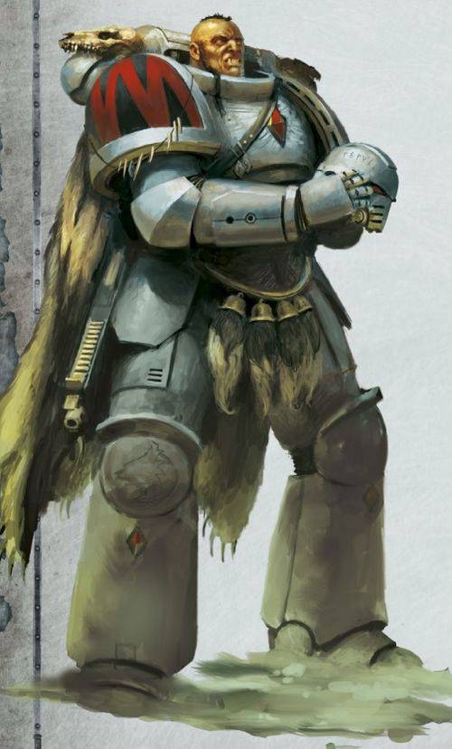

<!-- A0362-B0627 -->

原译文

Space Wolves Primaris Space Marine 太空野狼原铸星际战士

**校订译文**

Space Wolves Primaris Space Marine 太空野狼原铸星际战士

<!-- /A0362-B0627 -->

<!-- A0362-B0628 -->
**英文原文**

Arjac Rockfist — The Man-Mountain, Anvil of Fenris. Wolf Guard, Before becoming a Space Wolf he was a blackmsith of the Bear Claw tribe. He has risen to become the personal champion of Logan Grimnar.

<!-- /A0362-B0628 -->

<!-- A0362-B0629 -->

原译文

阿贾克·石拳 — 山脉之人，芬里斯的铁砧。野狼卫队，在成为太空野狼之前，他是熊爪部落的铁匠。他已经成为罗根·格里姆纳尔的冠军。

**校订译文**

阿贾克·石拳——人形巨山、芬里斯之砧，野狼守卫成员。成为太空野狼前，他是熊爪部落的铁匠，后来升为洛根·格里姆纳尔的贴身冠军。

<!-- /A0362-B0629 -->

<!-- A0362-B0630 -->
**英文原文**

Arn Ironjaw — Wolf Guard,see also his quote.

<!-- /A0362-B0630 -->

<!-- A0362-B0631 -->

原译文

阿恩·铁颌 — 野狼卫队，另见他的语录。

**校订译文**

阿恩·铁颌 — 野狼守卫，另见他的语录。

<!-- /A0362-B0631 -->

<!-- A0362-B0632 -->
**英文原文**

Asger Warfist — Wolf Lord during the War of the Beast.

<!-- /A0362-B0632 -->

<!-- A0362-B0633 -->

原译文

阿斯格·战拳 — 野兽战争中的狼主。

**校订译文**

阿斯格·战拳——野兽战争时期的狼主。

<!-- /A0362-B0633 -->

<!-- A0362-B0634 -->
**英文原文**

Bulveye the Berserker — Lone Wolf.

<!-- /A0362-B0634 -->

<!-- A0362-B0635 -->

原译文

狂战士布拉维耶 — 孤狼

**校订译文**

狂战士布拉维耶 — 孤狼

<!-- /A0362-B0635 -->

<!-- A0362-B0636 -->
**英文原文**

Canis Wolfborn — Wolf Guard to Harald Deathwolf.

<!-- /A0362-B0636 -->

<!-- A0362-B0637 -->

原译文

卡尼斯·狼裔 — 哈拉尔德·死狼的野狼卫队。

**校订译文**

卡尼斯·狼裔 — 哈拉尔德·死狼的野狼守卫。

<!-- /A0362-B0637 -->

<!-- A0362-B0638 -->
**英文原文**

Haegr the Mountain — former member of the Wolfblade and comrade of Ragnar Blackmane.

<!-- /A0362-B0638 -->

<!-- A0362-B0639 -->

原译文

巨山海格尔 — 狼刃的前成员，拉格纳·黑鬃的战友。

**校订译文**

巨山海格尔 — 狼刃的前成员，拉格纳·黑鬃的战友。

<!-- /A0362-B0639 -->

<!-- A0362-B0640 -->
**英文原文**

Ottar — Wolf Lord.

<!-- /A0362-B0640 -->

<!-- A0362-B0641 -->

原译文

奥塔尔 — 狼主

**校订译文**

奥塔尔 — 狼主

<!-- /A0362-B0641 -->

<!-- A0362-B0642 -->
**英文原文**

Joens — Battle-Brother.

<!-- /A0362-B0642 -->

<!-- A0362-B0643 -->

原译文

约恩斯 — 战斗兄弟

**校订译文**

约恩斯 — 战斗兄弟

<!-- /A0362-B0643 -->

<!-- A0362-B0644 -->
**英文原文**

Leifvar Twice-Slain — Wolf Guard.

<!-- /A0362-B0644 -->

<!-- A0362-B0645 -->

原译文

莱夫瓦尔·二逝 — 野狼守卫

**校订译文**

莱夫瓦尔·二逝——野狼守卫成员。

<!-- /A0362-B0645 -->

<!-- A0362-B0646 -->
**英文原文**

Corus Redsmith - Iron Priest

<!-- /A0362-B0646 -->

<!-- A0362-B0647 -->

原译文

科鲁斯·红铁匠 - 钢铁牧师

**校订译文**

科鲁斯·红铁匠 - 钢铁牧师

<!-- /A0362-B0647 -->

<!-- A0362-B0648 -->
**英文原文**

Lukas the Trickster — The Strifeson, The Laughing One, The Jackalwolf. Veteran who has never risen from the ranks of the Blood Claws.

<!-- /A0362-B0648 -->

<!-- A0362-B0649 -->

原译文

骗子卢卡斯 — 冲突之子、大笑者、豺狼。从未从血爪部队中晋升的老兵。

**校订译文**

骗子卢卡斯 — 冲突之子、大笑者、豺狼。从未从血爪部队中晋升的老兵。

<!-- /A0362-B0649 -->

<!-- A0362-B0650 -->
**英文原文**

Morkir the Indomitable — Venerable Dreadnought of the Company of the Great Wolves.

<!-- /A0362-B0650 -->

<!-- A0362-B0651 -->

原译文

不屈的莫基尔 — 头狼连队的神圣无畏。

**校订译文**

不屈的莫基尔——头狼大连的神圣无畏机甲。

**校注：** Venerable Dreadnought 泛称统一“神圣无畏机甲”，参考完整单位 Space Wolves Venerable Dreadnought 的官方词根；通称仍标待核，避免同书出现神圣/尊者两套。

<!-- /A0362-B0651 -->

<!-- A0362-B0652 -->
**英文原文**

Njal Stormcaller — Rune Priest.

<!-- /A0362-B0652 -->

<!-- A0362-B0653 -->

原译文

尼加尔·风暴呼唤者 — 符文牧师

**校订译文**

风暴召唤者纳吉奥——符文牧师。

<!-- /A0362-B0653 -->

<!-- A0362-B0654 -->
**英文原文**

Murderfang — Dreadnought.

<!-- /A0362-B0654 -->

<!-- A0362-B0655 -->

原译文

弑牙 — 无畏

**校订译文**

杀戮牙——无畏机甲。

<!-- /A0362-B0655 -->

<!-- A0362-B0656 -->
**英文原文**

Nesmiv — Battle-Brother.

<!-- /A0362-B0656 -->

<!-- A0362-B0657 -->

原译文

内斯米夫 — 战斗兄弟

**校订译文**

内斯米夫 — 战斗兄弟

<!-- /A0362-B0657 -->

<!-- A0362-B0658 -->
**英文原文**

Skvald Warbringer — Dreadnought.

<!-- /A0362-B0658 -->

<!-- A0362-B0659 -->

原译文

斯科瓦尔德·战争使者 — 无畏

**校订译文**

斯科瓦尔德·战争使者 — 无畏

<!-- /A0362-B0659 -->

<!-- A0362-B0660 -->
**英文原文**

Tork — Battle-Brother.

<!-- /A0362-B0660 -->

<!-- A0362-B0661 -->

原译文

图尔克 — 战斗兄弟

**校订译文**

图尔克 — 战斗兄弟

<!-- /A0362-B0661 -->

<!-- A0362-B0662 -->
**英文原文**

Ulrik the Slayer — Wolf Priest.

<!-- /A0362-B0662 -->

<!-- A0362-B0663 -->

原译文

乌尔里克·屠戮者 — 狼牧师

**校订译文**

杀戮者乌尔里克——狼牧师。

<!-- /A0362-B0663 -->

<!-- A0362-B0664 -->
**英文原文**

Harl Greyweaver — Deathwatch Iron Priest and Forge Master.

<!-- /A0362-B0664 -->

<!-- A0362-B0665 -->

原译文

哈尔·灰色编织者 — 死亡守望钢铁牧师和铸造之主

**校订译文**

哈尔·灰色编织者——死亡守望钢铁牧师及铸造大师。

<!-- /A0362-B0665 -->

本篇核心术语与暂定项

以下列出本篇出现的英文原形及核心术语表用词。同形词可能指不同对象，具体词义以本篇正文和校注为准；单复数、别名和仅见于图注的名称可能尚未列入。完整候选见[术语表](../../术语表/双语术语候选.csv)。

| 英文 | 采用中文 | 状态 |
| --- | --- | --- |
| Space Marines | 星际战士 | 官方已核对 |
| Adeptus Astartes | 阿斯塔特修会 | 官方已核对 |
| Blood Angels | 圣血天使 | 官方已核对 |
| Dark Angels | 黑暗天使 | 官方已核对 |
| Deathwatch | 死亡守望 | 官方已核对 |
| Grey Knights | 灰骑士 | 官方已核对 |
| Space Wolves | 太空野狼 | 官方已核对 |
| Adepta Sororitas | 修女会 | 官方已核对 |
| Adeptus Custodes | 帝皇禁军 | 官方已核对 |
| Imperial Guard | 帝国卫队 | 暂定·语境区分 |
| Imperial Army | 帝国军 | 暂定·官方待核 |
| Death Guard | 死亡守卫 | 官方已核对 |
| Thousand Sons | 千子 | 官方已核对 |
| World Eaters | 吞世者 | 官方已核对 |
| Eldar | 灵族 | 暂定·语境区分 |
| Genestealer Cults | 基因窃取者教派 | 官方已核对 |
| Orks | 欧克蛮人 | 官方已核对 |
| Psyker | 灵能者 | 官方已核对 |
| Terminator | 终结者 | 官方已核对 |
| Bolt Pistol | 爆矢手枪 | 官方已核对 |
| Chainsword | 链锯剑 | 官方已核对 |
| Roboute Guilliman | 罗保特·基里曼 | 官方已核对 |
| Ultramar | 奥特拉玛 | 官方已核对 |
| Ultramarines | 极限战士 | 官方已核对 |
| Horus Heresy | 荷鲁斯之乱 | 官方已核对 |
| Warp | 亚空间 | 官方已核对 |
| Great Rift | 大裂隙 | 官方已核对 |
| Inquisition | 审判庭 | 暂定 |
| Imperium | 帝国 | 暂定·简称 |
| Mechanicum | 机械教 | 暂定·历史称谓 |
| Khorne | 恐虐 | 官方已核对 |
| Waaagh! | Waaagh! | 暂定·保留原文 |
| Trazyn the Infinite | 无尽者塔拉辛 | 官方已核对 |
| Indomitus | 不屈学派 | 暂定·学派语境 |
| History | 历史 | 编辑用语已统一 |
| Equipment | 装备 | 编辑用语已统一 |
| Eye of Terror | 恐惧之眼 | 官方已核对 |
| Imperial Fists | 帝国之拳 | 暂定 |
| Emperor | 帝皇 | 官方已核对 |
| Primarch | 原体 | 官方已核对 |
| Ecclesiarchy | 国教会 | 暂定 |
| Battle Barge | 战斗驳船 | 暂定·官方待核 |
| Black Legion | 黑色军团 | 暂定·官方待核 |
| Night Lords | 午夜领主 | 暂定·官方待核 |
| Haemonculus | 血伶人 | 官方已核对 |
| Great Crusade | 大远征 | 暂定·官方待核 |
| Barbarus | 巴巴鲁斯 | 暂定·官方待核 |
| Terra | 泰拉 | 暂定·官方待核 |
| Murder | 谋杀 | 暂定·官方待核 |
| Horus | 荷鲁斯 | 暂定·官方待核 |
| STC | 标准建造模板 | 暂定·官方待核 |
| The Brotherhood | 兄弟会 | 暂定·官方待核 |
| Lion El'Jonson | 莱昂·艾尔’庄森 | 官方已核对 |
| Hunter-Killer | 猎杀者 | 暂定·官方待核 |
| High Lords of Terra | 泰拉高领主 | 暂定·官方待核 |
| Magnus the Red | 红魔马格努斯 | 官方已核对 |
| Ghazghkull Mag Uruk Thraka | 碎骨者·斯拉卡 | 暂定·官方短名对应 |
| Imperial Cult | 帝皇信仰 | 暂定·官方待核 |
| Enforcers | 地方执法者 | 暂定·官方待核 |
| Dark Imperium | 黑暗帝国 | 暂定·官方待核 |
| Imperium Nihilus | 帝国暗面 | 暂定·官方待核 |
| Indomitus Crusade | 不屈远征 | 暂定·官方待核 |
| War of Beasts | 野兽之战 | 暂定·官方待核 |
| Golden Throne | 黄金王座 | 暂定·官方待核 |
| Unification Wars | 统一战争 | 暂定·官方待核 |
| Segmentum Solar | 太阳星域 | 暂定·官方待核 |
| Segmentum | 星域 | 暂定·官方待核 |
| Sector | 星区 | 暂定·官方待核 |
| Malcador the Sigillite | 掌印者马卡多 | 暂定·官方待核 |
| Redeemer | 救赎者 | 暂定·官方待核 |
| Salamanders | 火蜥蜴 | 暂定·官方待核 |
| Brotherhood | 兄弟会 | 暂定·官方待核 |
| Ark Reach Secundus | 方舟疆域塞昆杜斯 | 暂定·官方待核 |
| Armageddon | 阿玛吉多顿 | 暂定·官方待核 |
| Fenris | 芬里斯 | 暂定·官方待核 |
| Midgardia | 米德加迪亚 | 暂定·官方待核 |
| Alaric Prime | 阿拉里克主星 | 暂定·官方待核 |
| Betalis III | 贝塔利斯三号 | 暂定·官方待核 |
| Deliverance | 拯救星 | 暂定·官方待核 |
| Vigilus | 警戒星 | 暂定·官方待核 |
| Land Raider | 兰德掠袭者战车 | 官方已核对 |
| Slab | 肉砖 | 暂定·官方待核 |
| Primarch Project | 原体计划 | 暂定·官方待核 |
| Master | 导师（审判庭职衔）／舰务官（舰员职务） | 语境定译·官方待核 |
| Neophyte | 新进者 | 暂定 |
| Cardinal | 红衣主教 | 暂定 |
| Mission | 教团／传教机构 | 暂定 |
| Saint Celestine | 圣塞莱斯汀 | 官方已核对 |
| Rosarius | 玫瑰念珠 | 暂定·官方待核 |
| Company Champion | 连队冠军 | 暂定·官方待核 |
| Company Ancient | 连队旗手 | 暂定·官方待核 |
| Command Squad | 指挥小队 | 暂定·官方待核 |
| Chaplain | 教士 | 官方已核对 |
| Iron Priest | 钢铁牧师 | 官方已核对 |
| Apothecary | 药剂师 | 官方已核对 |
| Ancient | 旗手 | 官方已核对 |
| Tactical Squad | 战术小队 | 官方已核对 |
| Grey Hunters | 灰色猎手 | 官方已核对 |
| Vindicator | 维护者战车 | 官方已核对 |
| Predator Annihilator | 歼灭者型掠食者战车 | 官方已核对 |
| First Master | 首席舰务官（舰员职务）／第一大师（极限战士职衔） | 语境定译·官方待核 |
| Cadre | 骨干连（寂静修女）／核心队（钛族） | 语境定译·钛族词根参考 |
| True Sons | 真子 | 暂定·官方待核 |
| Skyrar's Dark Wolves | 斯卡拉的暗狼 | 暂定·官方待核 |
| Ullanor | 乌兰诺 | 暂定·官方待核 |
| Space Marine Legion | 星际战士军团 | 暂定·官方待核 |
| Lord Commander | 领主指挥官 | 暂定·官方待核 |
| Lieutenant | 副官 | 暂定·官方待核 |
| Alpha Legion | 阿尔法军团 | 暂定·官方待核 |
| Raven Guard | 暗鸦守卫 | 官方已核 |
| Second Founding | 二次建军 | 暂定·官方待核 |
| The Sigillite | 掌印者 | 暂定·官方待核 |
| The Primarchs | 原体 | 暂定·官方待核 |
| Knights-Errant | 游侠骑士 | 暂定·官方待核 |
| Founding | 建军 | 暂定·官方待核 |
| Sol | 太阳系 | 暂定·官方待核 |
| Enoch Rathvin | 伊诺克·拉什文 | 暂定·官方待核 |
| Gunnar Gunnhilt | 加纳·甘希尔特 | 暂定·官方待核 |
| Amlodhi Skarssen Skarssensson | 阿姆洛迪·斯卡森·斯卡森松 | 暂定·官方待核 |
| Jorin Bloodhowl | 约林·血嚎 | 暂定·官方待核 |
| Thegn | 领主 | 暂定·官方待核 |
| Consul | 领事 | 暂定·官方待核 |
| Champion | 冠军 | 暂定·官方待核 |
| Opsequiari | 执法官 | 暂定·官方待核 |
| Consul-Opsequiari | 领事执法官 | 暂定·官方待核 |
| Destroyer | 毁灭者 | 暂定·官方待核 |
| Black Cull | 黑屠 | 暂定·官方待核 |
| Space Marine | 星际战士 | 暂定·官方待核 |
| Chapter | 战团 | 暂定·官方待核 |
| Fortress-monastery | 要塞修道院 | 暂定·官方待核 |
| Chapter Master | 战团长 | 暂定·官方待核 |
| Captain | 连长 | 暂定·官方待核 |
| Veteran | 老兵 | 暂定·官方待核 |
| Terminators | 终结者 | 暂定·官方待核 |
| Sergeant | 军士 | 暂定·官方待核 |
| Brother | 修士 | 暂定·官方待核 |
| Devastator | 破坏者 | 暂定·官方待核 |
| Aggressor | 侵略者 | 暂定·官方待核 |
| Inceptor | 先驱者 | 暂定·官方待核 |
| Hellblaster | 地狱轰击者 | 暂定·官方待核 |
| Eradicator | 根除者 | 暂定·官方待核 |
| Scout | 侦察兵 | 暂定·官方待核 |
| Reiver | 掠夺者 | 暂定·官方待核 |
| Infiltrator | 渗透者 | 暂定·官方待核 |
| Incursor | 入侵者 | 暂定·官方待核 |
| Eliminator | 歼灭者 | 暂定·官方待核 |
| Suppressor | 压制者 | 暂定·官方待核 |
| Battle-Brother | 战斗兄弟 | 暂定·官方待核 |
| Primaris Space Marine | 原铸星际战士 | 暂定·官方待核 |
| Logan Grimnar | 洛根·格里姆纳尔 | 官方已核 |
| Njal Stormcaller | 风暴召唤者纳吉奥 | 官方已核 |
| Ulrik the Slayer | 杀戮者乌尔里克 | 官方已核 |
| Ragnar Blackmane | 拉格纳·黑鬃 | 官方已核 |
| Krom Dragongaze | 克罗姆·龙瞪 | 暂定·官方待核 |
| Harald Deathwolf | 哈拉尔德·死狼 | 暂定·官方待核 |
| Arjac Rockfist | 阿贾克·石拳 | 官方已核 |
| Canis Wolfborn | 卡尼斯·狼裔 | 暂定·官方待核 |
| Bjorn the Fell-Handed | 断手比约恩 | 官方已核 |
| Lukas the Trickster | 骗子卢卡斯 | 暂定·官方待核 |
| Murderfang | 杀戮牙 | 官方已核对 |
| Flesh Tearers | 撕肉者 | 暂定·官方待核 |
| Codex Astartes | 阿斯塔特圣典 | 暂定·官方待核 |
| Wolf Brothers | 狼兄弟 | 暂定·官方待核 |
| Inceptors | 先驱者 | 暂定·官方待核 |
| Executioners | 处刑者 | 语境定译·官方待核 |
| Blood Gorgons | 鲜血戈尔贡 | 暂定·官方待核 |
| Ultima Founding | 极限建军 | 暂定·官方待核 |
| Icefangs | 冰牙 | 暂定·官方待核 |
| Mooneaters | 吞月者 | 暂定·官方待核 |
| Wolfspear | 狼矛 | 暂定·官方待核 |
| The Months of Shame | 耻辱之月 | 暂定·官方待核 |
| Rapid Strike Vessels | 快速打击战舰 | 暂定·官方待核 |
| Rhinos | 犀牛 | 暂定·官方待核 |
| Impulsors | 脉冲战车 | 暂定·官方待核 |
| Land Speeders | 兰德速攻艇 | 暂定·官方待核 |
| Storm Speeders | 风暴速攻艇 | 暂定·官方待核 |
| Predators | 掠食者 | 暂定·官方待核 |
| Gladiators | 角斗士 | 暂定·官方待核 |
| Whirlwinds | 旋风 | 暂定·官方待核 |
| Vindicators | 维护者 | 暂定·官方待核 |
| Land Raiders | 兰德掠袭者 | 暂定·官方待核 |
| Repulsors | 反重力战车 | 暂定·官方待核 |
| Assault Squads | 突击小队 | 暂定·官方待核 |
| Devastator Squads | 破坏者小队 | 暂定·官方待核 |
| Centurions | 百夫长 | 暂定·官方待核 |
| Intercessor | 仲裁者 | 暂定·官方待核 |
| Assault Intercessors | 突击仲裁者 | 暂定·官方待核 |
| Repulsor | 反重力战车 | 官方已核 |
| Gorgons | 戈尔贡 | 暂定·官方待核 |
| Invaders | 侵略者 | 暂定·官方待核 |
| Reborn | 复生者（战团）／重生者（死神军自称） | 语境定译·官方待核 |
| Red Wolves | 红狼 | 暂定·官方待核 |
| Codex Chapter | 圣典战团 | 暂定·官方待核 |
| Gene-seed | 基因种子 | 暂定·官方待核 |
| Gloriana Class Battleship | 荣光女王级战列舰 | 暂定·官方待核 |
| Stormwolf | 风暴狼 | 暂定·官方待核 |
| Caestus Assault Ram | 拳套突击撞击艇 | 暂定·官方待核 |
| Stormbird | 风暴鸟 | 暂定·官方待核 |
| Stormhawk | 风暴隼 | 暂定·官方待核 |
| Canis Helix | 狼之螺旋 | 暂定·官方待核 |
| Battleline Squad | 战线小队 | 暂定·官方待核 |
| Aggressor Squads | 侵略者小队 | 暂定·官方待核 |
| Eradicator Squads | 根除者小队 | 暂定·官方待核 |
| Hellblaster Squads | 地狱轰击者小队 | 暂定·官方待核 |
| Eliminator Squads | 歼灭者小队 | 暂定·官方待核 |
| Suppressor Squads | 压制者小队 | 暂定·官方待核 |
| Monitor | 监视者 | 暂定·官方待核 |
| Mortal | 凡人 | 暂定·官方待核 |
| Sven Bloodhowl | 斯万·血吼 | 暂定·官方待核 |
| Initiates | 进阶者 | 官方已核 |
| Wolf Priest | 狼牧师 | 官方语境参考·待核 |
| Land Raider Helios | 赫利俄斯型兰德掠袭者战车 | 暂定·官方待核 |
| Powers | 能天使 | 暂定·官方待核 |
| Alaxxes Nebula | 阿拉克斯星云 | 暂定·官方待核 |
| Risen | 赦天使 | 暂定·官方待核 |
| Malice | 恶意 | 暂定·官方待核 |
| Xenos | 异形 | 暂定·官方待核 |
| Initiate | 正式成员 | 暂定·官方待核 |
| Venerable Dreadnought | 神圣无畏机甲 | 官方词根参考·通称待核 |
| Horde | 部落 | 暂定·官方待核 |
| Blood Claws | 血爪 | 官方已核对 |
| Fenrisian Wolves | 芬里斯狼 | 官方已核对 |
| Thunderwolf Cavalry | 雷狼骑兵 | 官方已核对 |
| Wulfen | 狼人 | 官方已核对 |
| Wolf Scouts | 狼侦查 | 官方已核对 |
| Land Raider Redeemer | 救赎者型兰德掠袭者战车 | 官方已核对 |
| Vlka Fenryka | 芬里斯之狼 | 暂定·官方待核 |
| Masaanore-Core | 马萨诺尔核心城 | 暂定·官方待核 |
| Watch Pack | 监视小队 | 暂定·官方待核 |
| Bloodslinker | 血潜者 | 暂定·官方待核 |
| Reductor | 基因提取器 | 暂定·官方待核 |
| The Bloodmaws | 血喉 | 暂定·官方待核 |
| Gore Dagger | 血腥匕首号 | 暂定·官方待核 |
| Einherjar | 英灵 | 暂定·官方待核 |
| Holmi Longganger | 霍尔米·远行者 | 暂定·官方待核 |
| Raider | 掠袭者飞艇 | 官方已核对 |
| Tribe | 部落（欧克组织） | 暂定·官方待核 |
| Red Waaagh! | 红潮 | 暂定·官方待核 |
| The Beast | 野兽 | 暂定·官方待核 |
| Fang of Morkai | 莫凯之牙 | 暂定·官方待核 |
| Wolf Amulet | 野狼护符 | 暂定·官方待核 |
| Corus Redsmith | 科鲁斯·红铁匠 | 暂定·官方待核 |
| Deathsworn | 死誓者 | 语境定译·官方待核 |
| Wolf Guard | 野狼守卫 | 官方词根参考·通称待核 |
| Krongar | 克朗加 | 暂定·官方待核 |
| Lictor | 刀斧虫（泰伦单位）／侍从官（禁军职衔） | 语境定译·泰伦单位官译已核 |
| Greet | 格利特 | 暂定·官方待核 |
| Primus | 领军 | 官方已核对 |
| Prospect | 开拓团 | 暂定·官方待核 |
| Torchbearer Fleet | 持炬舰队 | 暂定·官方待核 |
| Angron | 安格隆 | 官方已核对 |
| Battle of the Fang | 长牙之战 | 暂定·官方待核 |
| Dreadnought | 无畏机甲 | 暂定·官方待核 |
| Vengeance | 复仇号 | 暂定·官方待核 |
| Bikes | 摩托 | 暂定·官方待核 |
| Emperor's Will | 帝皇意志号 | 暂定·官方待核 |
| Alaric | 阿拉里克 | 暂定·官方待核 |
| Scribes | 抄写员 | 暂定·官方待核 |
| Fealty | 忠诚 | 暂定·官方待核 |
| Hrafnkel | 赫拉芬克尔号 | 暂定·官方待核 |
| Fenris Incident | 芬里斯事件 | 暂定·官方待核 |
| Berek Thunderfist | 贝雷克·雷拳 | 暂定·官方待核 |
| Forge Master | 铸造大师 | 暂定·官方待核 |
| Thengir | 滕吉尔 | 暂定·官方待核 |
| Mjalnar | 米亚尔纳 | 暂定·官方待核 |
| Kjarg Iron-Oath | 克雅格·铁誓 | 暂定·官方待核 |
| Tra | 特拉（第三大连） | 暂定·官方待核 |
| skjald | 吟游诗人 | 暂定·官方待核 |
| Bear | 熊 | 暂定·官方待核 |
| Baldr | 巴德尔 | 暂定·官方待核 |
| The Man-Mountain | 似山之人 | 暂定·官方待核 |
| Anvil of Fenris | 芬里斯之砧 | 暂定·官方待核 |
| Nurades | 努拉德斯 | 暂定·官方待核 |
| Wolfblade | 狼刃 | 暂定·官方待核 |
| Strifeson | 纷争之子 | 暂定·官方待核 |
| The Laughing One | 嘲笑者 | 暂定·官方待核 |
| Jackalwolf | 豺狼 | 暂定·官方待核 |
| Ferocity | 凶猛 | 暂定·官方待核 |
| The Dark | 《黑暗》 | 暂定·官方待核 |
| The Blood | 鲜血 | 暂定·官方待核 |
| Ravenlord | 渡鸦领主 | 暂定·官方待核 |
| Trisolian | 特里索兰 | 暂定·官方待核 |
| Asger Warfist | 阿斯格·战拳 | 暂定·官方待核 |
| System | 星系（恒星系统） | 暂定·官方待核 |
| Death World | 死亡世界 | 暂定·官方待核 |
| Feral World | 蛮荒世界 | 暂定·官方待核 |
| Mining World | 矿业世界 | 暂定·官方待核 |
| Helios | 赫利俄斯 | 暂定·官方待核 |
| Macharian Crusade | 马卡里安远征 | 暂定·官方待核 |
| Macharius | 马卡里乌斯 | 暂定·官方待核 |
| Ulrik Grimfang | 乌尔里克·冷牙 | 暂定·官方待核 |
| Defiance | 反抗号 | 暂定·官方待核 |
| Spear of Russ | 鲁斯之矛 | 暂定·官方待核 |
| Wheel of Fire campaign | 火焰之轮战役 | 暂定·官方待核 |
| Battle of Trisolian | 特里索兰之战 | 暂定·官方待核 |
| Egil Iron Wolf | 埃吉尔·铁狼 | 暂定·官方待核 |
| Geigor Fell-Hand | 戈果·邪手 | 暂定·官方待核 |
| Kasper Ansbach Hawser | 卡斯佩尔·安斯巴赫·豪瑟尔 | 暂定·官方待核 |
| The Breakers of Rings | 破戒者 | 暂定·官方待核 |
| The Thread Cutters | 脉络切割者 | 暂定·官方待核 |
| The Blood-ice Storm | 血冰风暴 | 暂定·官方待核 |
| The Slaughter-fire Heralds | 屠火先驱 | 暂定·官方待核 |
| The Serpents of the Battle-Moon | 战月之蛇 | 暂定·官方待核 |
| The Shield-gnawers | 盾牌啃咬者 | 暂定·官方待核 |
| Plague of Unbelief | 无信瘟疫 | 暂定·官方待核 |
| Ormantep | 奥尔曼泰普 | 暂定·官方待核 |
| Terran Crusade | 泰拉远征 | 暂定·官方待核 |
| claw | 利爪分队 | 暂定·官方待核 |
| Bolt | 爆矢 | 暂定·官方待核 |
| Greyshields | 灰盾 | 暂定·官方待核 |
| Bucharis | 布查里斯 | 暂定·官方待核 |
| Signus Prime | 西格纳斯主星 | 暂定·官方待核 |
| Colossus | 巨像号 | 暂定·官方待核 |
| Fyf | 第五大连 | 暂定·官方待核 |
| Ogvai Ogvai Helmschrot | 奥格瓦伊·残盔 | 暂定·官方待核 |
| Tau Empire | 钛帝国 | 暂定·官方待核 |
| Servo-harness | 伺服套件 | 暂定·官方待核 |
| Allfather's Honour | 全父荣誉号 | 暂定·官方待核 |
| Stygius Sector | 冥河星区 | 暂定·官方待核 |
| Skarath Crusade | 斯卡拉特远征 | 暂定·官方待核 |
| Fire of Fenris | 芬里斯之火号 | 暂定·官方待核 |
| Sol System | 太阳系 | 暂定·官方待核 |
| Reivers | 掠夺者 | 暂定·官方待核 |

