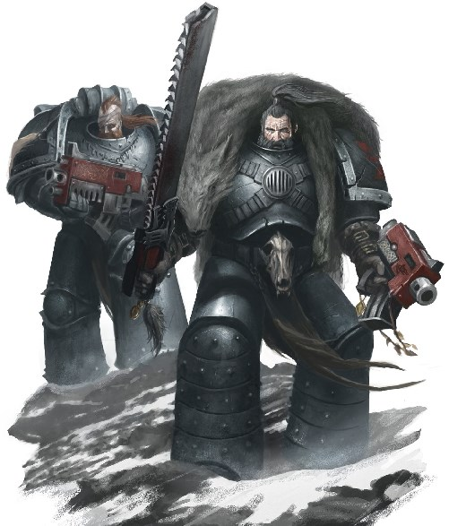

# 0365 英灵 Einherjar

精校状态：中文行文已逐段精校，部分术语仍为暂定

分类：通用概念 / 帝国 Imperium / 中央政务部 Adeptus Terra / 阿斯塔特修会 Adeptus Astartes

原文来源：https://www.bilibili.com/opus/1022462474306191369

原作者：帝国神选罐头

原文时间：编辑于 2025年02月14日 08:57

[返回分类目录](目录.md) · [全书目录](../../目录.md)

<!-- A0365-B0001 -->
**英文原文**

The Einherjar (blood-sworn) was the council of Leman Russ's Jarls and Thegns during the Great Crusade and Horus Heresy. Where possible, the council seeks out solid earth on which to stand, that they may face each other as equals in the event of an honour duel or ritual blooding.

<!-- /A0365-B0001 -->

<!-- A0365-B0002 -->

原译文

英灵（血誓）是大远征和荷鲁斯叛乱期间黎曼·鲁斯的领主和侍从的议会。在可能的情况下，议会会寻找坚实的土地，以便在荣誉决斗或放血仪式时，他们可以平等地面对对方。

**校订译文**

英灵（意为“血誓者”）是大远征与荷鲁斯之乱期间，由黎曼·鲁斯麾下首领及贵族组成的议会。条件允许时，议员会选择坚实的地面开会，以便一旦展开荣誉决斗或血仪，彼此能以平等身份相对而立。

<!-- /A0365-B0002 -->

<!-- A0365-B0003 图片 -->

<!-- A0365-B0004 -->

原译文

Members of the Einherjar 英灵成员

**校订译文**

Members of the Einherjar 英灵成员

<!-- /A0365-B0004 -->

<!-- A0365-B0005 -->
## History 历史

<!-- /A0365-B0005 -->

<!-- A0365-B0006 -->
**英文原文**

The first Einherjar were the honour guard of Leman Russ when he was still known as King Leman of the Russ before the coming of the Allfather. Among the foes they defeated alongside their jarl stood Svein Rejksson. When the Allfather elevated Leman Russ and gave him command of the Space Wolves Legion, Russ decreed that his Einherjar would be the first Fenrisians to be inducted into the Legion.

<!-- /A0365-B0006 -->

<!-- A0365-B0007 -->

原译文

第一个英灵是黎曼·鲁斯的荣誉卫队，在全父到来之前，他仍然被称为鲁斯的黎曼国王。在他们与其原体一同击败的敌人当中，站着斯维恩·瑞吉科孙。当全父提拔黎曼·鲁斯并授予他太空野狼军团的指挥权时，鲁斯颁布法令，他的英灵将成为第一批加入军团的芬里斯人。

**校订译文**

最初的英灵是黎曼·鲁斯的荣誉卫队。彼时全父尚未到来，鲁斯仍是鲁斯部族的黎曼王。他们随自己的首领击败了许多敌人，其中包括斯维恩·瑞吉科孙。全父擢升黎曼·鲁斯，将太空野狼军团交给他指挥后，鲁斯下令让自己的英灵成为首批加入军团的芬里斯人。

<!-- /A0365-B0007 -->

<!-- A0365-B0008 -->
**英文原文**

Although too old by the reckoning of the Mechanicum to become Space Marines, Russ would not deny them the chance. Many died, but some survived against the odds to become the first of the 13th Great Company, variously known as the Greybeards or Wolf Brothers.

<!-- /A0365-B0008 -->

<!-- A0365-B0009 -->

原译文

尽管按照机械神教的标准，他们年龄太大而无法成为星际战士，但鲁斯不会剥夺他们的这个机会。许多人死去了，但有一些人克服重重困难幸存下来，成为了第十三大连的第一批成员，该连队也被不同地称为灰胡子或狼兄弟。

**校订译文**

按机械教的判断，他们年纪太大，已不适合成为星际战士，但鲁斯不愿剥夺他们尝试的机会。许多人在改造中死亡，少数却顽强生还，成为第十三大连最初的成员；他们也被称为“灰胡子”或“狼兄弟”。

**校注：** 此处 Wolf Brothers 指第十三大连早期成员的称谓，不能直接等同于后来的狼兄弟子战团。

<!-- /A0365-B0009 -->

<!-- A0365-B0010 -->
### The First Einherjar 最初的英灵

原题：The First Einherjar 英灵之首

<!-- /A0365-B0010 -->

<!-- A0365-B0011 -->

原译文

Jorin Bloodhowl 乔林.血嚎

**校订译文**

Jorin Bloodhowl 乔林·血嚎

<!-- /A0365-B0011 -->

<!-- A0365-B0012 -->
## Known Members of the Einherjar 著名英灵成员

<!-- /A0365-B0012 -->

<!-- A0365-B0013 -->
**英文原文**

Grimnir Blackblood - Huscarl of the Einherjar.

<!-- /A0365-B0013 -->

<!-- A0365-B0014 -->

原译文

格里姆尼尔·黑血 - 英灵的胡斯卡尔。

**校订译文**

格里姆尼尔·黑血——英灵的王室护卫。

<!-- /A0365-B0014 -->

<!-- A0365-B0015 -->
**英文原文**

Kva - Chief Rune Priest.

<!-- /A0365-B0015 -->

<!-- A0365-B0016 -->

原译文

卡瓦 - 首席符文牧师

**校订译文**

卡瓦 - 首席符文牧师

<!-- /A0365-B0016 -->

<!-- A0365-B0017 -->
**英文原文**

Bjorn - Adviser to Russ after the Battle of the Alaxxes Nebula.

<!-- /A0365-B0017 -->

<!-- A0365-B0018 -->

原译文

比约恩 - 阿拉克斯星云战役后鲁斯的顾问。

**校订译文**

比约恩 - 阿拉克斯星云战役后鲁斯的顾问。

<!-- /A0365-B0018 -->

<!-- A0365-B0019 -->
**英文原文**

Gunnar Gunnhilt - Lord Gunn, Jarl of Onn (1st Great Company).

<!-- /A0365-B0019 -->

<!-- A0365-B0020 -->

原译文

甘纳尔·甘希尔特 - 冈恩领主，第一大连之主

**校订译文**

加纳·甘希尔特——亦称冈恩领主，第一大连（Onn）首领。

<!-- /A0365-B0020 -->

<!-- A0365-B0021 -->
**英文原文**

Holmi Longganger - Jarl of Twa (2nd Great Company).

<!-- /A0365-B0021 -->

<!-- A0365-B0022 -->

原译文

霍尔米·远行者 - 第二大连之主

**校订译文**

霍尔米·远行者——第二大连（Twa）首领。

<!-- /A0365-B0022 -->

<!-- A0365-B0023 -->
**英文原文**

Ogvai Helmschrot - Jarl of Tra (3rd Great Company).

<!-- /A0365-B0023 -->

<!-- A0365-B0024 -->

原译文

奥格瓦·粗盔 - 第三大连之主

**校订译文**

奥格瓦伊·残盔——第三大连（Tra）首领。

<!-- /A0365-B0024 -->

<!-- A0365-B0025 -->
**英文原文**

Lufven Close-Handed - Jarl of For (4th Great Company).

<!-- /A0365-B0025 -->

<!-- A0365-B0026 -->

原译文

卢芬·咫尺 - 第四大连之主

**校订译文**

卢芬·咫尺 - 第四大连之主

<!-- /A0365-B0026 -->

<!-- A0365-B0027 -->
**英文原文**

Amlodhi Skarssen Skarssensson - Jarl of Fyf (5th Great Company).

<!-- /A0365-B0027 -->

<!-- A0365-B0028 -->

原译文

阿姆洛迪·斯卡森·斯卡森松 - 第五大连之主

**校订译文**

阿姆洛迪·斯卡森·斯卡森松 - 第五大连之主

<!-- /A0365-B0028 -->

<!-- A0365-B0029 -->
**英文原文**

Skunnr - Jarl of Sesc (6th Great Company).

<!-- /A0365-B0029 -->

<!-- A0365-B0030 -->

原译文

斯坎纳 - 第六大连之主

**校订译文**

斯坎纳 - 第六大连之主

<!-- /A0365-B0030 -->

<!-- A0365-B0031 -->
**英文原文**

Hvarl Red-Blade - Jarl of Sepp (7th Great Company).

<!-- /A0365-B0031 -->

<!-- A0365-B0032 -->

原译文

哈瓦尔·红刃 - 第七大连之主

**校订译文**

哈瓦尔·红刃 - 第七大连之主

<!-- /A0365-B0032 -->

<!-- A0365-B0033 -->
**英文原文**

Baldr Vidunsson - Jarl of For-Twa (8th Great Company).

<!-- /A0365-B0033 -->

<!-- A0365-B0034 -->

原译文

巴尔德·维登森 - 第八大连之主

**校订译文**

巴尔德·维登森 - 第八大连之主

<!-- /A0365-B0034 -->

<!-- A0365-B0035 -->
**英文原文**

Sturgard Joriksson - Jarl of Tra-Tra (9th Great Company).

<!-- /A0365-B0035 -->

<!-- A0365-B0036 -->

原译文

斯特加德·乔里克森 - 第九大连之主

**校订译文**

斯特加德·乔里克森 - 第九大连之主

<!-- /A0365-B0036 -->

<!-- A0365-B0037 -->
**英文原文**

Hemtal - Jarl of Dekk (10th Great Company).

<!-- /A0365-B0037 -->

<!-- A0365-B0038 -->

原译文

海姆达尔 - 第十大连之主

**校订译文**

海姆达尔 - 第十大连之主

<!-- /A0365-B0038 -->

<!-- A0365-B0039 -->
**英文原文**

Varald Helsdawn - Jarl of Elva (11th Great Company).

<!-- /A0365-B0039 -->

<!-- A0365-B0040 -->

原译文

瓦尔德·深渊破晓 - 第十一大连之主

**校订译文**

瓦尔德·深渊破晓 - 第十一大连之主

<!-- /A0365-B0040 -->

<!-- A0365-B0041 -->
**英文原文**

Vili - Jarl of Elva (11th Great Company).

<!-- /A0365-B0041 -->

<!-- A0365-B0042 -->

原译文

威利 - 第十一大连之主

**校订译文**

维利——第十一大连（Elva）首领。

<!-- /A0365-B0042 -->

<!-- A0365-B0043 -->
**英文原文**

Laughing Jaurmag - Jarl of Tolv (12th Great Company), accompanied Kargir's Watch Pack to Terra.

<!-- /A0365-B0043 -->

<!-- A0365-B0044 -->

原译文

嗤笑者加尔玛格 - 第十二大连之主

**校订译文**

嗤笑者加尔玛格——第十二大连（Tolv）首领，曾随卡尔吉尔的监视小队前往泰拉。

<!-- /A0365-B0044 -->

<!-- A0365-B0045 -->
**英文原文**

Scarred Oki - Jarl of Tolv in Jaurmag's absence.

<!-- /A0365-B0045 -->

<!-- A0365-B0046 -->

原译文

带疤者奥基 - 加尔玛格缺席时的第十二大连之主

**校订译文**

带疤者奥基 - 加尔玛格缺席时的第十二大连之主

<!-- /A0365-B0046 -->

<!-- A0365-B0047 -->
**英文原文**

Jorin Bloodhowl - Jarl of Dekk-Tra (13th Great Company).

<!-- /A0365-B0047 -->

<!-- A0365-B0048 -->

原译文

乔林.血嚎 - 第十三大连之主

**校订译文**

乔林·血嚎——第十三大连（Dekk-Tra）首领。

<!-- /A0365-B0048 -->

<!-- A0365-B0049 -->
**英文原文**

Bulveye - Jarl of Dekk-Tra at the end of the Horus Heresy.

<!-- /A0365-B0049 -->

<!-- A0365-B0050 -->

原译文

布尔维耶 - 荷鲁斯叛乱结束时期的第十三大连之主

**校订译文**

布拉维耶——荷鲁斯之乱末期的第十三大连（Dekk-Tra）首领。

<!-- /A0365-B0050 -->

本篇核心术语与暂定项

以下列出本篇出现的英文原形及核心术语表用词。同形词可能指不同对象，具体词义以本篇正文和校注为准；单复数、别名和仅见于图注的名称可能尚未列入。完整候选见[术语表](../../术语表/双语术语候选.csv)。

| 英文 | 采用中文 | 状态 |
| --- | --- | --- |
| Space Marines | 星际战士 | 官方已核对 |
| Space Wolves | 太空野狼 | 官方已核对 |
| Horus Heresy | 荷鲁斯之乱 | 官方已核对 |
| Mechanicum | 机械教 | 暂定·历史称谓 |
| Great Crusade | 大远征 | 暂定·官方待核 |
| Terra | 泰拉 | 暂定·官方待核 |
| Horus | 荷鲁斯 | 暂定·官方待核 |
| Honour Guard | 荣誉卫队 | 暂定·官方待核 |
| Gunnar Gunnhilt | 加纳·甘希尔特 | 暂定·官方待核 |
| Amlodhi Skarssen Skarssensson | 阿姆洛迪·斯卡森·斯卡森松 | 暂定·官方待核 |
| Jorin Bloodhowl | 约林·血嚎 | 暂定·官方待核 |
| Wolf Brothers | 狼兄弟 | 暂定·官方待核 |
| Alaxxes Nebula | 阿拉克斯星云 | 暂定·官方待核 |
| Watch Pack | 监视小队 | 暂定·官方待核 |
| Einherjar | 英灵 | 暂定·官方待核 |
| Holmi Longganger | 霍尔米·远行者 | 暂定·官方待核 |
| Kva | 卡瓦 | 暂定·官方待核 |
| Grimnir Blackblood | 格里姆尼尔·黑血 | 暂定·官方待核 |
| Tra | 特拉（第三大连） | 暂定·官方待核 |
| Baldr | 巴德尔 | 暂定·官方待核 |
| Fyf | 第五大连 | 暂定·官方待核 |

