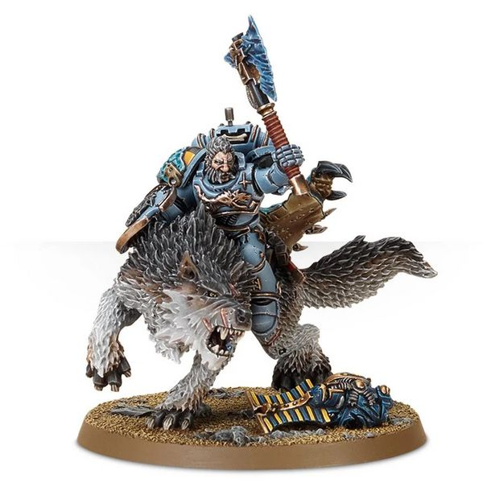
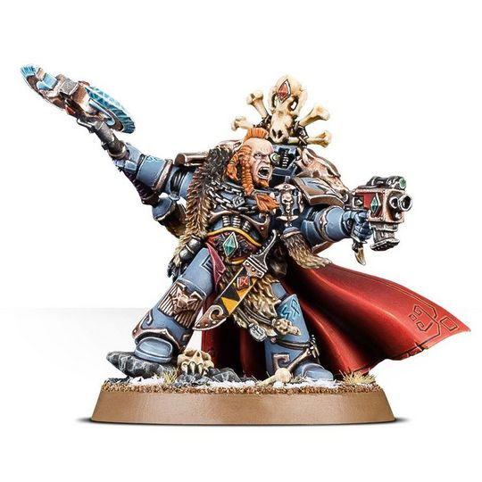
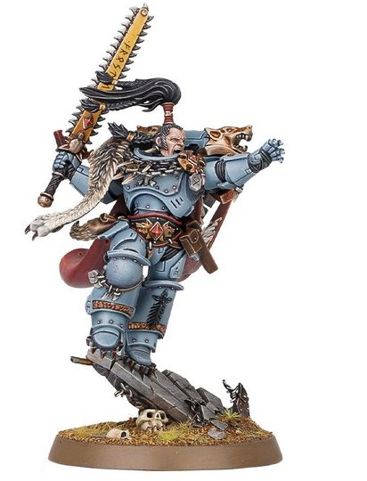

# 0366 狼主 Wolf Lord

精校状态：中文行文已逐段精校，部分术语仍为暂定

分类：通用概念 / 帝国 Imperium / 中央政务部 Adeptus Terra / 阿斯塔特修会 Adeptus Astartes

原文来源：https://www.bilibili.com/opus/1036937012307820547

原作者：帝国神选罐头

原文时间：编辑于 2025年08月23日 12:39

[返回分类目录](目录.md) · [全书目录](../../目录.md)

<!-- A0366-B0001 -->
**英文原文**

The Wolf Lords (known as Jarls in Fenrisian) are the leaders of the twelve Great Companies of the Space Wolves, a rank equivalent to a Captain in other Chapters. The Wolf Lord of the leading Great Company is known as the Great Wolf, equivalent to a Chapter Master.

<!-- /A0366-B0001 -->

<!-- A0366-B0002 -->

原译文

狼主（芬里斯语中称为领主）是太空野狼十二个大连的领导者，在其他战团中相当于连长。领导大连的狼主被称为头狼，相当于一个战团长。

**校订译文**

狼主在芬里斯语中称为 Jarl，是太空野狼十二个大连的统帅，军衔相当于其他战团的连长。其中统领全战团的狼主称为“头狼”，相当于战团长。

<!-- /A0366-B0002 -->

<!-- A0366-B0003 图片 -->

<!-- A0366-B0004 -->

原译文

Wolflord with a Thunderwolf mount 骑雷狼的狼主

**校订译文**

Wolflord with a Thunderwolf mount 骑雷狼的狼主

<!-- /A0366-B0004 -->

<!-- A0366-B0005 -->
## History 历史

<!-- /A0366-B0005 -->

<!-- A0366-B0006 -->
**英文原文**

Unlike other Space Marine Chapters, which rigorously follow the organizational dictates of the Codex Astartes, each of the Great Companies takes its name from its current Wolf Lord, and often changes subtly in character with each new Lord's approach to organization and tactics. For instance, Bjorn Stormwolf's Great Company has become famous for leading planetary invasions with as much fanfare, noise, and firepower as possible, a clear reflection of its Lord's temperament . A Wolf Lord is accompanied by a small coterie of bodyguards and advisors, known as the Wolf Guard, whose job it is to choose the Lord's successor when he dies. This successor is often (though not always) chosen from the ranks of the Wolf Guard itself. When he is elevated to his position, a new Wolf Lord chooses a symbol or badge from the ancient heraldry of Fenris; these symbols are often re-used, since Lords seek to inspire their Companies to live up to the reputation of their sigil's previous users.

<!-- /A0366-B0006 -->

<!-- A0366-B0007 -->

原译文

与严格遵循阿斯塔特圣典组织规定的其他星际战士战团不同，每个大连的名字都来自其现任的狼主，并且经常随着每个新的狼主的组织和战术方法而发生微妙的变化。例如，比约恩·风暴之狼的大连因以尽可能多的喧耀、干扰和火力领导行星入侵而闻名，这清楚地反映了其狼主的性格。狼主由一小群护卫和顾问陪同，他们被称为野狼守卫，他们的工作是在狼主牺牲后选择他的继任者。这个继任者通常（但并不总是）从野狼守卫本身的队伍中选出。当他被提升到狼主的位置时，一位新的狼主会从古老的芬里斯纹章中选择一个象征或徽章；这些符号经常被重复使用，因为领主们试图激励他们的连队不辜负其徽章前使用者的声誉。

**校订译文**

其他星际战士战团严格遵循《阿斯塔特圣典》的组织规定，太空野狼各大连则以现任狼主命名，并随其组织与战术风格而逐渐改变特点。例如，比约恩·风暴狼的大连，惯于以尽可能浩大的声势、喧响与火力发动行星入侵，鲜明体现了狼主本人的性情。狼主身边有一小群称为野狼守卫的护卫与顾问；他死后，也由他们选择继任者。新狼主通常从野狼守卫中产生，但并非绝无例外。获选后，狼主会从芬里斯古老纹章中挑选徽记；许多符号被反复使用，因为他希望激励麾下战士，不负前代使用者留下的威名。

<!-- /A0366-B0007 -->

<!-- A0366-B0008 -->
**英文原文**

The badges of the Great Companies are displayed on the Grand Annulus, a circular disk made up of triangular slabs of stone on the floor of the Hall of the Great Wolf inside The Fang. Each slab carries the badge of a Great Company, while the central slab has a pointer, indicating which of these Companies belongs to the current Great Wolf .

<!-- /A0366-B0008 -->

<!-- A0366-B0009 -->

原译文

大连的徽章展示在伟大之环上，伟大之环是一个由三角形石板组成的圆盘，位于长牙堡内的头狼大厅的地板上。每块板上都有一个大连的徽章，而中央板上有一个指针，指示这些连队中的哪一个属于当前的头狼。

**校订译文**

大连的徽章展示在伟大之环上，伟大之环是一个由三角形石板组成的圆盘，位于长牙堡内的头狼大厅的地板上。每块板上都有一个大连的徽章，而中央板上有一个指针，指示这些连队中的哪一个属于当前的头狼。

<!-- /A0366-B0009 -->

<!-- A0366-B0010 -->
## Current Wolf Lords 现任狼主

<!-- /A0366-B0010 -->

<!-- A0366-B0011 -->
**英文原文**

As of early M42 the current Wolf Lords are :

<!-- /A0366-B0011 -->

<!-- A0366-B0012 -->

原译文

截至M42早期，目前的狼主是：

**校订译文**

截至M42早期，目前的狼主是：

<!-- /A0366-B0012 -->

<!-- A0366-B0013 -->

原译文

Bjorn Stormwolf 比约恩·风暴之狼

**校订译文**

Bjorn Stormwolf 比约恩·风暴狼

<!-- /A0366-B0013 -->

<!-- A0366-B0014 -->

原译文

Bran Redmaw 伯恩·血红之喉

**校订译文**

Bran Redmaw 伯恩·红喉

<!-- /A0366-B0014 -->

<!-- A0366-B0015 -->

原译文

Engir Krakendoom 恩吉尔·克拉肯之灾

**校订译文**

Engir Krakendoom 恩吉尔·克拉肯之灾

<!-- /A0366-B0015 -->

<!-- A0366-B0016 -->

原译文

Erik Morkai 埃里克·莫凯

**校订译文**

Erik Morkai 埃里克·莫凯

<!-- /A0366-B0016 -->

<!-- A0366-B0017 -->

原译文

Gunnar Red Moon 加纳·红月

**校订译文**

Gunnar Red Moon 加纳·红月

<!-- /A0366-B0017 -->

<!-- A0366-B0018 -->

原译文

Harald Deathwolf 哈拉尔德·死亡之狼

**校订译文**

Harald Deathwolf 哈拉尔德·死狼

<!-- /A0366-B0018 -->

<!-- A0366-B0019 -->

原译文

Kjarl Grimblood 凯加尔.冷血

**校订译文**

Kjarl Grimblood 凯加尔·冷血

<!-- /A0366-B0019 -->

<!-- A0366-B0020 -->

原译文

Krom Dragongaze 克罗姆·龙瞪

**校订译文**

Krom Dragongaze 克罗姆·龙瞪

<!-- /A0366-B0020 -->

<!-- A0366-B0021 图片 -->

<!-- A0366-B0022 -->

原译文

Krom Dragongaze 克罗姆·龙瞪

**校订译文**

Krom Dragongaze 克罗姆·龙瞪

<!-- /A0366-B0022 -->

<!-- A0366-B0023 -->
**英文原文**

Logan Grimnar, the Great Wolf

<!-- /A0366-B0023 -->

<!-- A0366-B0024 -->

原译文

罗根·格里姆那尔，头狼

**校订译文**

洛根·格里姆纳尔，头狼。

<!-- /A0366-B0024 -->

<!-- A0366-B0025 -->

原译文

Ragnar Blackmane 拉格纳·黑鬃

**校订译文**

Ragnar Blackmane 拉格纳·黑鬃

<!-- /A0366-B0025 -->

<!-- A0366-B0026 图片 -->

<!-- A0366-B0027 -->

原译文

Ragnar Blackmane 拉格纳·黑鬃

**校订译文**

Ragnar Blackmane 拉格纳·黑鬃

<!-- /A0366-B0027 -->

<!-- A0366-B0028 -->
**英文原文**

Sven Bloodhowl (Lost during the 13th Black Crusade)

<!-- /A0366-B0028 -->

<!-- A0366-B0029 -->

原译文

斯温·血嚎（十三次黑色远征期间失踪）

**校订译文**

斯文·血嚎（第十三次黑色远征期间失踪）。

<!-- /A0366-B0029 -->

<!-- A0366-B0030 -->

原译文

Vorek Gnarlfist 沃里克·粗拳

**校订译文**

Vorek Gnarlfist 沃里克·粗拳

<!-- /A0366-B0030 -->

<!-- A0366-B0031 -->
## Known Past Wolf Lords 著名过去狼主

<!-- /A0366-B0031 -->

<!-- A0366-B0032 -->

原译文

Alaric Nightrunner 阿拉里克·夜奔者

**校订译文**

Alaric Nightrunner 阿拉里克·夜奔者

<!-- /A0366-B0032 -->

<!-- A0366-B0033 -->

原译文

Amlodhi Skarssen Skarssensson 阿姆洛迪·斯卡森·斯卡森松

**校订译文**

Amlodhi Skarssen Skarssensson 阿姆洛迪·斯卡森·斯卡森松

<!-- /A0366-B0033 -->

<!-- A0366-B0034 -->

原译文

Andhrimnir 安德赫利姆尼尔

**校订译文**

Andhrimnir 安德赫利姆尼尔

<!-- /A0366-B0034 -->

<!-- A0366-B0035 -->
**英文原文**

Asger Warfist - First Commander of the Deathwatch.

<!-- /A0366-B0035 -->

<!-- A0366-B0036 -->

原译文

阿斯格·战拳 - 死亡守望第一位指挥官

**校订译文**

阿斯格·战拳 - 死亡守望第一位指挥官

<!-- /A0366-B0036 -->

<!-- A0366-B0037 -->

原译文

Asvald Stormwrack 阿斯瓦尔德·风暴遗骸

**校订译文**

Asvald Stormwrack 阿斯瓦尔德·风暴遗骸

<!-- /A0366-B0037 -->

<!-- A0366-B0038 -->

原译文

Baldr Vidunsson 巴尔德·维顿森

**校订译文**

Baldr Vidunsson 巴尔德·维登森

<!-- /A0366-B0038 -->

<!-- A0366-B0039 -->

原译文

Berek Thunderfist 贝雷克·雷拳

**校订译文**

Berek Thunderfist 贝雷克·雷拳

<!-- /A0366-B0039 -->

<!-- A0366-B0040 -->

原译文

Bjorn the Fell-Handed 断手比约恩

**校订译文**

Bjorn the Fell-Handed 断手比约恩

<!-- /A0366-B0040 -->

<!-- A0366-B0041 -->

原译文

Egil Iron Wolf 埃吉尔·铁狼

**校订译文**

Egil Iron Wolf 埃吉尔·铁狼

<!-- /A0366-B0041 -->

<!-- A0366-B0042 -->

原译文

Eirik Firemane 埃里克·火鬃

**校订译文**

Eirik Firemane 埃里克·火鬃

<!-- /A0366-B0042 -->

<!-- A0366-B0043 -->

原译文

Finn Goresson 芬恩·戈雷森

**校订译文**

Finn Goresson 芬恩·戈雷森

<!-- /A0366-B0043 -->

<!-- A0366-B0044 -->

原译文

Gerrod Redbeard 杰罗德·红胡

**校订译文**

Gerrod Redbeard 杰罗德·红胡

<!-- /A0366-B0044 -->

<!-- A0366-B0045 -->

原译文

Gunnar Gunnhilt 加纳·甘希尔特

**校订译文**

Gunnar Gunnhilt 加纳·甘希尔特

<!-- /A0366-B0045 -->

<!-- A0366-B0046 -->

原译文

Haken Ironchewer 哈肯·嚼铁者

**校订译文**

Haken Ironchewer 哈肯·嚼铁者

<!-- /A0366-B0046 -->

<!-- A0366-B0047 -->

原译文

Harald Firetooth 哈拉尔德·火牙

**校订译文**

Harald Firetooth 哈拉尔德·火牙

<!-- /A0366-B0047 -->

<!-- A0366-B0048 -->

原译文

Hef Icenheart 海夫·冰心

**校订译文**

Hef Icenheart 海夫·冰心

<!-- /A0366-B0048 -->

<!-- A0366-B0049 -->

原译文

Hemtal 海姆达尔

**校订译文**

Hemtal 海姆达尔

<!-- /A0366-B0049 -->

<!-- A0366-B0050 -->

原译文

Hrothgar Ironblade 赫罗斯加尔·铁刃

**校订译文**

Hrothgar Ironblade 赫罗斯加尔·铁刃

<!-- /A0366-B0050 -->

<!-- A0366-B0051 -->

原译文

Hvarl Red-Blade 哈瓦尔·红刃

**校订译文**

Hvarl Red-Blade 哈瓦尔·红刃

<!-- /A0366-B0051 -->

<!-- A0366-B0052 -->

原译文

Holmi Longganger 霍尔米·远行者

**校订译文**

Holmi Longganger 霍尔米·远行者

<!-- /A0366-B0052 -->

<!-- A0366-B0053 -->
**英文原文**

Jorghun Vor - Traitor

<!-- /A0366-B0053 -->

<!-- A0366-B0054 -->

原译文

约尔洪·沃尔 - 叛徒

**校订译文**

约尔洪·沃尔 - 叛徒

<!-- /A0366-B0054 -->

<!-- A0366-B0055 -->

原译文

Jorin Bloodhowl 乔林·血嚎

**校订译文**

Jorin Bloodhowl 乔林·血嚎

<!-- /A0366-B0055 -->

<!-- A0366-B0056 -->

原译文

Jorik Fangfist 乔里克·牙拳

**校订译文**

Jorik Fangfist 乔里克·牙拳

<!-- /A0366-B0056 -->

<!-- A0366-B0057 -->

原译文

Grìmhildr Skanefeld 格里姆希尔德·斯卡内费尔德

**校订译文**

Grìmhildr Skanefeld 格里姆希尔德·斯卡内费尔德

<!-- /A0366-B0057 -->

<!-- A0366-B0058 -->

原译文

Kruger 克鲁格

**校订译文**

Kruger 克鲁格

<!-- /A0366-B0058 -->

<!-- A0366-B0059 -->

原译文

Leif Snowfang 雷夫·雪牙

**校订译文**

Leif Snowfang 雷夫·雪牙

<!-- /A0366-B0059 -->

<!-- A0366-B0060 -->

原译文

Lufven Close-Handed 卢芬·咫尺

**校订译文**

Lufven Close-Handed 卢芬·咫尺

<!-- /A0366-B0060 -->

<!-- A0366-B0061 -->

原译文

Mecklin 梅克林

**校订译文**

Mecklin 梅克林

<!-- /A0366-B0061 -->

<!-- A0366-B0062 -->

原译文

Ogvai Helmschrot 奥格瓦伊·残盔

**校订译文**

Ogvai Helmschrot 奥格瓦伊·残盔

<!-- /A0366-B0062 -->

<!-- A0366-B0063 -->

原译文

Oki 奥基

**校订译文**

Oki 奥基

<!-- /A0366-B0063 -->

<!-- A0366-B0064 -->

原译文

Orven Highfell 奥尔文.高落

**校订译文**

Orven Highfell 奥尔文·高落

<!-- /A0366-B0064 -->

<!-- A0366-B0065 -->

原译文

Osric Three-Fists 奥斯瑞克·三拳

**校订译文**

Osric Three-Fists 奥斯瑞克·三拳

<!-- /A0366-B0065 -->

<!-- A0366-B0066 -->

原译文

Ottar 奥塔尔

**校订译文**

Ottar 奥塔尔

<!-- /A0366-B0066 -->

<!-- A0366-B0067 -->

原译文

Sigrid Trollbane 西格里德·巨魔杀手

**校订译文**

Sigrid Trollbane 西格里德·巨魔杀手

<!-- /A0366-B0067 -->

<!-- A0366-B0068 -->

原译文

Sigvald Deathgranter 西格瓦尔德·赐死者

**校订译文**

Sigvald Deathgranter 西格瓦尔德·赐死者

<!-- /A0366-B0068 -->

<!-- A0366-B0069 -->

原译文

Skunnr 斯坎纳

**校订译文**

Skunnr 斯坎纳

<!-- /A0366-B0069 -->

<!-- A0366-B0070 -->

原译文

Sturgard Joriksson 斯特加德·乔里克森

**校订译文**

Sturgard Joriksson 斯特加德·乔里克森

<!-- /A0366-B0070 -->

<!-- A0366-B0071 -->
**英文原文**

Svane Vulfbad - Fell to Chaos.

<!-- /A0366-B0071 -->

<!-- A0366-B0072 -->

原译文

斯瓦恩·沃夫巴德 - 堕入混沌

**校订译文**

斯瓦恩·沃夫巴德 - 堕入混沌

<!-- /A0366-B0072 -->

<!-- A0366-B0073 -->
**英文原文**

Sven Ironhand - Revoked his oath of fealty to Logan Grimnar.

<!-- /A0366-B0073 -->

<!-- A0366-B0074 -->

原译文

斯温·铁手 - 撤销了对罗根·格里姆那尔的忠诚誓言。

**校订译文**

斯文·铁手——背弃了对洛根·格里姆纳尔的效忠誓言。

<!-- /A0366-B0074 -->

<!-- A0366-B0075 -->

原译文

Svergl Trollhowl 斯维尔格尔·魔嚎

**校订译文**

Svergl Trollhowl 斯维尔格尔·魔嚎

<!-- /A0366-B0075 -->

<!-- A0366-B0076 -->

原译文

Torjek Granitebrow 托耶克·花岗岩眉

**校订译文**

Torjek Granitebrow 托耶克·花岗岩眉

<!-- /A0366-B0076 -->

<!-- A0366-B0077 -->

原译文

Torm Gudaric 托姆·古达里克

**校订译文**

Torm Gudaric 托姆·古达里克

<!-- /A0366-B0077 -->

<!-- A0366-B0078 -->

原译文

Vaer Greyloc 沃尔·格雷洛克

**校订译文**

Vaer Greyloc 沃尔·格雷洛克

<!-- /A0366-B0078 -->

<!-- A0366-B0079 -->

原译文

Vali Thunderbrow 瓦利·雷眉

**校订译文**

Vali Thunderbrow 瓦利·雷眉

<!-- /A0366-B0079 -->

<!-- A0366-B0080 -->

原译文

Varald Helsdawn 瓦尔德·深渊破晓

**校订译文**

Varald Helsdawn 瓦尔德·深渊破晓

<!-- /A0366-B0080 -->

<!-- A0366-B0081 -->

原译文

Vili 维利

**校订译文**

Vili 维利

<!-- /A0366-B0081 -->

<!-- A0366-B0082 -->

原译文

Volund 沃伦德

**校订译文**

Volund 沃伦德

<!-- /A0366-B0082 -->

本篇核心术语与暂定项

以下列出本篇出现的英文原形及核心术语表用词。同形词可能指不同对象，具体词义以本篇正文和校注为准；单复数、别名和仅见于图注的名称可能尚未列入。完整候选见[术语表](../../术语表/双语术语候选.csv)。

| 英文 | 采用中文 | 状态 |
| --- | --- | --- |
| Deathwatch | 死亡守望 | 官方已核对 |
| Space Wolves | 太空野狼 | 官方已核对 |
| Fenris | 芬里斯 | 暂定·官方待核 |
| Slab | 肉砖 | 暂定·官方待核 |
| Clear | 清明 | 暂定·官方待核 |
| Master | 导师（审判庭职衔）／舰务官（舰员职务） | 语境定译·官方待核 |
| Ancient | 旗手 | 官方已核对 |
| Space Marine | 星际战士 | 暂定·官方待核 |
| Chapter | 战团 | 暂定·官方待核 |
| Chapter Master | 战团长 | 暂定·官方待核 |
| Captain | 连长 | 暂定·官方待核 |
| Logan Grimnar | 洛根·格里姆纳尔 | 官方已核 |
| Codex Astartes | 阿斯塔特圣典 | 暂定·官方待核 |
| Stormwolf | 风暴狼 | 暂定·官方待核 |
| Sven Bloodhowl | 斯万·血吼 | 暂定·官方待核 |
| Wolf Guard | 野狼守卫 | 官方词根参考·通称待核 |
| Fealty | 忠诚 | 暂定·官方待核 |
| Svane Vulfbad | 斯瓦恩·沃夫巴德 | 暂定·官方待核 |
| Asger Warfist | 阿斯格·战拳 | 暂定·官方待核 |

