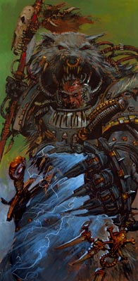
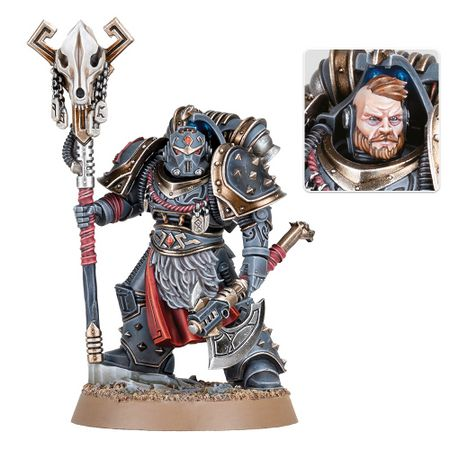
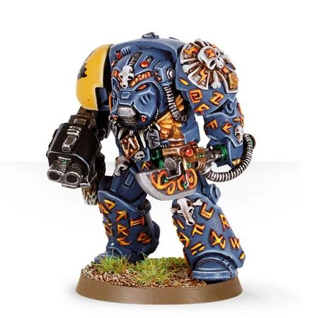
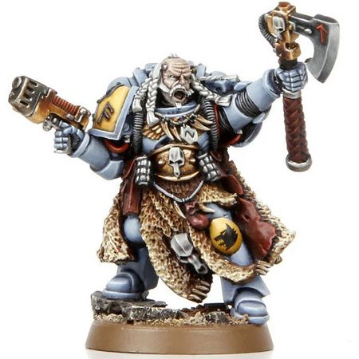

# 0367 符文牧师 Rune Priest

精校状态：中文行文已逐段精校，部分术语仍为暂定

分类：通用概念 / 帝国 Imperium / 中央政务部 Adeptus Terra / 阿斯塔特修会 Adeptus Astartes

原文来源：https://www.bilibili.com/opus/1032883456574488585

原作者：帝国神选罐头

原文时间：2025年02月12日 09:55

[返回分类目录](目录.md) · [全书目录](../../目录.md)

<!-- A0367-B0001 -->
**英文原文**

The Rune Priests of the Space Wolves are the equivalent of the Librarians of other Space Marine Chapters.

<!-- /A0367-B0001 -->

<!-- A0367-B0002 -->

原译文

太空野狼的符文牧师相当于其他星际战士战团的智库。

**校订译文**

太空野狼的符文牧师相当于其他星际战士战团的智库员。

<!-- /A0367-B0002 -->

<!-- A0367-B0003 图片 -->

<!-- A0367-B0004 -->

原译文

Rune Priest 符文牧师

**校订译文**

Rune Priest 符文牧师

<!-- /A0367-B0004 -->

<!-- A0367-B0005 -->
## Overview 概述

<!-- /A0367-B0005 -->

<!-- A0367-B0006 -->
**英文原文**

Known as Casters of Runes during the Horus Heresy, Rune Priests are combatant psykers using their psychic abilities to aid their brothers on the battlefield; off the battlefield, they are the keepers of the chapter's librarium and store of knowledge. The major difference is that Rune Priests do not believe their psychic abilities are derived from the Warp, but rather from the animistic spirits of their homeworld, Fenris, channeled through totems and runes on their armour. These traditions are descended from the shamanistic rituals of Fenris's native tribes, and have remained unchanged for countless centuries.

<!-- /A0367-B0006 -->

<!-- A0367-B0007 -->

原译文

在荷鲁斯叛乱时期被称为符文祭司，符文牧师是战斗灵能者，利用他们的灵能能力在战场上帮助他们的兄弟；在战场之外，他们是本战团智库馆和知识库的守护者。主要区别在于符文牧师不相信他们的灵能能力来自亚空间，而是来自他们家园芬里斯的万物之灵，通过图腾和盔甲上的符文引导。这些传统源自芬里斯土著部落的萨满教仪式，无数个世纪以来一直保持不变。

**校订译文**

荷鲁斯之乱时期，他们被称为“符文祭司”。符文牧师是战斗灵能者，在战场上施展灵能援助同袍，平时则守护战团的藏书与知识。与一般智库员最大的不同，在于他们相信力量并非来自亚空间，而是源于母星芬里斯的万物精魂，借助图腾与甲胄上的符文引导。这些传统源自芬里斯部族的萨满仪式，延续无数世纪而未变。

<!-- /A0367-B0007 -->

<!-- A0367-B0008 图片 -->

<!-- A0367-B0009 -->

原译文

Casters of Runes 符文祭司

**校订译文**

Casters of Runes 符文祭司

<!-- /A0367-B0009 -->

<!-- A0367-B0010 -->
**英文原文**

In a way, the Rune Priests do not consider themselves to be psykers at all; during the Great Crusade, Leman Russ, the primarch of the Space Wolves, was among the voices in favour of disbanding the Librarius in each Space Marine Legion and prohibiting the use of psykers in any of them. Yet after the Emperor of Mankind issued his Decree at the Council of Nikaea, the Rune Priests continued to serve among the Space Wolves, stubbornly insisting that their powers had nothing to do with psychic ability. Much like White Scars Stormseers Rune Priests channel their power through the natural powers of Fenris and this serves as a limiting intermediary to protect them from the malign influences of the Warp.

<!-- /A0367-B0010 -->

<!-- A0367-B0011 -->

原译文

在某种程度上，符文牧师根本不认为自己是灵能者；在大远征期间，太空野狼的原体黎曼·鲁斯是支持解散每个星际战士军团中的智库并禁止在其中任何一个军团中使用灵能者的声音之一。然而，在人类帝皇在尼凯亚会议上颁布法令后，符文牧师继续在太空野狼中服役，固执地坚持认为他们的力量与灵能能力无关。就像白色疤痕的风暴先知一样，符文牧师通过芬里斯的自然力量来引导他们的力量，这是一个限制性的媒介，可以保护他们免受亚空间的恶意影响。

**校订译文**

从某种意义上说，符文牧师根本不认为自己是灵能者。大远征期间，黎曼·鲁斯曾支持解散各星际战士军团的智库，禁止军团使用灵能者。然而，帝皇在尼凯亚会议颁布禁令后，符文牧师仍继续服役，坚持认为自身力量与灵能无关。他们和白疤风暴先知一样，通过母星的自然力量引导能力；这些力量充当限制与缓冲的媒介，保护他们免受亚空间的恶意侵蚀。

<!-- /A0367-B0011 -->

<!-- A0367-B0012 图片 -->

<!-- A0367-B0013 -->

原译文

Rune Priest in Terminator Armour 终结者盔甲符文牧师

**校订译文**

Rune Priest in Terminator Armour 终结者盔甲符文牧师

<!-- /A0367-B0013 -->

<!-- A0367-B0014 -->
**英文原文**

Rune Priests preserve their Chapter's entire history not in written form, but memorize it in great sagas. A Rune Priest who begins his training as a Skald is usually assigned to a single Great Company where he is taught its tales. With every new Great Year he joins another Company until he has learned the Chapter's full history and can be sent to whichever Rune Priest needs an apprentice.

<!-- /A0367-B0014 -->

<!-- A0367-B0015 -->

原译文

符文牧师保存他们战团的整个历史，不是以书面形式，而是在伟大的传说故事中记住它。一个符文牧师开始他的吟游诗人训练时，通常会被分配到一个大连，在那里他会被教导传说故事。随着每个新的一年的到来，他都会加入另一个连队，直到他了解了战团的完整历史，并可以被派往任何需要学徒的符文牧师那里。

**校订译文**

符文牧师不以文字保存战团历史，而将一切记入浩瀚的史诗传奇之中。学徒最初接受吟游诗人训练时，通常会被派至一个大连，学习其历史故事。每逢一个新的“大年”，他便转往另一大连，直到熟记全战团历史，再被派给需要学徒的符文牧师。

**校注：** Great Year 作为芬里斯纪年单位暂译“大年”；原文未在本段给出其长度，不等同于普通地球年，也不擅自换算。

<!-- /A0367-B0015 -->

<!-- A0367-B0016 -->
**英文原文**

The Space Wolves' sagas are chanted at their feast days and during the Festival of the Wolf Time which celebrates the Chapter's founding. This festival is held every twelve Great Years and each time great contests of saga-telling and psychic duelings are held to determine if a new High Rune Priest will be chosen. The High Rune Priest is the leader of the entire Chapter's Rune Priests and adviser to the Great Wolf. The Space Wolves field one Rune Priest per company, according to the novel Grey Hunter

<!-- /A0367-B0016 -->

<!-- A0367-B0017 -->

原译文

太空野狼的传说故事在他们的节日和庆祝战团成立的狼之时刻节日期间被吟唱。这个节日每十二个伟大之年举行一次，每次都会举行传说故事讲述和灵能决斗的大型比赛，以确定是否会选出一位新的至高符文牧师。至高符文牧师是整个战团符文牧师的领袖，也是头狼的顾问。根据小说《灰猎》，太空野狼每连派出一名符文牧师

**校订译文**

太空野狼会在宴庆日，以及纪念战团建立的狼之时刻节上吟唱传奇。该节每十二个“大年”举行一次，届时会举办盛大的史诗吟诵竞赛与灵能决斗，决定是否选出新的至高符文牧师。至高符文牧师统领全战团的符文牧师，并担任头狼的顾问。小说《灰色猎手》记述，太空野狼每连配属一名符文牧师。

<!-- /A0367-B0017 -->

<!-- A0367-B0018 -->
## Abilities and Equipment 能力和装备

<!-- /A0367-B0018 -->

<!-- A0367-B0019 -->
**英文原文**

The basic weapons of Rune Priests are their psychically charged runic weapons. A common power among Rune Priests is the ability to summon storms across the battlefield which can cover the armies advance. Furthermore, they can cast runes which predict the ebb and flow of future events. These runes are usually carved from the bones or teeth of totem animals.

<!-- /A0367-B0019 -->

<!-- A0367-B0020 -->

原译文

符文牧师的基本武器是他们充满灵能力量的符文武器。符文祭司的一个共同能力是在战场上召唤风暴，以掩护军队前进。此外，他们可以铸造符文来预测未来事件的起伏。这些符文通常是用动物的骨头或牙齿雕刻而成的图腾。

**校订译文**

符文牧师的基本武器是灌注灵能的符文武器。常见能力包括在战场上召来风暴，掩护部队推进。他们也会投掷符文，以占测未来局势的变迁；这些符文通常刻在图腾动物的骨骼或牙齿上。

**校注：** cast runes 在占卜语境中指投掷符文卜具，非铸造；骨牙属于图腾动物，不能倒译成把普通动物骨牙雕成图腾。

<!-- /A0367-B0020 -->

<!-- A0367-B0021 -->
**英文原文**

Many Rune Priests are psyber-linked to ravens which are known as "Choosers of the Slain" to the Space Wolves. Their link enables them to see through the ravens' eyes and control them, thus allowing their use as scouts and messengers.

<!-- /A0367-B0021 -->

<!-- A0367-B0022 -->

原译文

许多符文牧师都与乌鸦有联系，乌鸦在太空野狼中被称为“择杀者”。它们的联系使他们能够看穿乌鸦的眼睛并控制它们，从而使它们能够被用作侦察兵和信使。

**校订译文**

许多符文牧师与渡鸦建立灵能链接；太空野狼将这些渡鸦称为“择杀者”。通过链接，牧师能够借它们的双眼观察，并控制它们行动，将其用作侦察者与信使。

<!-- /A0367-B0022 -->

<!-- A0367-B0023 -->
## The 13th Company 第十三连

<!-- /A0367-B0023 -->

<!-- A0367-B0024 -->
**英文原文**

Within the lost 13th Company of the Space Wolves, the Rune Priests must guide their brothers through the perils of the Eye of Terror. They have learned how to open small, temporary Warp gates. These allow the Priests to step through them in order to divine the path ahead. The 13th Company has a disproportionately higher number of Rune Priests, as constant exposure to the Warp inside the Eye has endowed many of their battle brothers with psychic ability.

<!-- /A0367-B0024 -->

<!-- A0367-B0025 -->

原译文

在失落的太空野狼第13连中，符文牧师必须引导他们的兄弟度过恐惧之眼的危险。他们已经学会了如何打开小型临时亚空间门扉。这些允许牧师们穿过它们，以占卜前方的道路。第13连的符文牧师数量不成比例地多，因为持续接触恐惧之眼内的亚空间赋予了他们的许多战斗兄弟通灵能力。

**校订译文**

失落的第十三大连中，符文牧师必须引导同袍穿越恐惧之眼的重重危险。他们学会了开启小型临时亚空间门，亲自穿行其中，占测前路。该连符文牧师所占比例格外高，因为长期暴露于恐惧之眼的亚空间力量，已使许多战斗弟兄获得灵能。

<!-- /A0367-B0025 -->

<!-- A0367-B0026 图片 -->

<!-- A0367-B0027 -->

原译文

Rune Priest of the 13th Company 第十三连符文牧师

**校订译文**

Rune Priest of the 13th Company 第十三连符文牧师

<!-- /A0367-B0027 -->

<!-- A0367-B0028 -->
## Notable Rune Priests 著名符文牧师

<!-- /A0367-B0028 -->

<!-- A0367-B0029 -->

原译文

Aun Helwintr 奥恩·冥冬

**校订译文**

Aun Helwintr 奥恩·冥冬

<!-- /A0367-B0029 -->

<!-- A0367-B0030 -->

原译文

Bodvar Bjarki 博德瓦尔·比亚尔基

**校订译文**

Bodvar Bjarki 博德瓦尔·比亚尔基

<!-- /A0367-B0030 -->

<!-- A0367-B0031 -->

原译文

Gnaerold Ghostwolf‎ 格纳罗尔德·幽狼

**校订译文**

Gnaerold Ghostwolf‎ 格纳罗尔德·幽狼

<!-- /A0367-B0031 -->

<!-- A0367-B0032 -->
**英文原文**

Heimdall Wyrdstorm - former Rune Priest, later - Dreadnought

<!-- /A0367-B0032 -->

<!-- A0367-B0033 -->

原译文

海姆达尔·命运风暴 - 前符文牧师，后来的无畏

**校订译文**

海姆达尔·命运风暴 - 前符文牧师，后来的无畏

<!-- /A0367-B0033 -->

<!-- A0367-B0034 -->

原译文

Hengir Stormhowl 亨吉尔·风暴怒嚎

**校订译文**

Hengir Stormhowl 亨吉尔·风暴怒嚎

<!-- /A0367-B0034 -->

<!-- A0367-B0035 -->
**英文原文**

Irnist the Wise, twin brother of Wolf Lord Erik Morkai

<!-- /A0367-B0035 -->

<!-- A0367-B0036 -->

原译文

智者厄尔尼斯特，狼主艾瑞克.莫凯的孪生兄弟

**校订译文**

智者厄尔尼斯特，狼主埃里克·莫凯的孪生兄弟。

<!-- /A0367-B0036 -->

<!-- A0367-B0037 -->

原译文

Ifor Darkpelt 伊弗·黑鬃

**校订译文**

Ifor Darkpelt 伊弗·黑鬃

<!-- /A0367-B0037 -->

<!-- A0367-B0038 -->
**英文原文**

Kva - Chief Rune Priest during the Horus Heresy

<!-- /A0367-B0038 -->

<!-- A0367-B0039 -->

原译文

凯瓦 - 荷鲁斯叛乱期间的首席符文牧师

**校订译文**

卡瓦——荷鲁斯之乱期间的首席符文牧师。

<!-- /A0367-B0039 -->

<!-- A0367-B0040 -->

原译文

Leif Hemligjaga 莱夫·追密者

**校订译文**

Leif Hemligjaga 莱夫·追密者

<!-- /A0367-B0040 -->

<!-- A0367-B0041 -->

原译文

Njal Stormcaller 尼加尔.唤风者

**校订译文**

Njal Stormcaller 风暴召唤者纳吉奥

<!-- /A0367-B0041 -->

<!-- A0367-B0042 -->

原译文

Ohthere Wyrdmake 欧谢尔·创命者

**校订译文**

Ohthere Wyrdmake 欧谢尔·创命者

<!-- /A0367-B0042 -->

<!-- A0367-B0043 -->

原译文

Kjalter Stormcrow 卡尔特·风暴鸦

**校订译文**

Kjalter Stormcrow 卡尔特·风暴鸦

<!-- /A0367-B0043 -->

<!-- A0367-B0044 -->

原译文

Skœdir Hangdrot 科伊迪尔·悬者

**校订译文**

Skœdir Hangdrot 科伊迪尔·悬者

<!-- /A0367-B0044 -->

<!-- A0367-B0045 -->
**英文原文**

Svangthir Ashbeard - fought on Fenris during the Siege of the Fenris System in 999.M41

<!-- /A0367-B0045 -->

<!-- A0367-B0046 -->

原译文

斯万格西尔·灰胡 - 在M41.999芬里斯星系攻城战中在芬里斯作战。

**校订译文**

斯万格西尔·灰胡——M41.999 芬里斯星系围攻期间，曾在芬里斯作战。

<!-- /A0367-B0046 -->

<!-- A0367-B0047 -->

原译文

Torrvald Orksbane 托瓦尔·兽人克星

**校订译文**

Torrvald Orksbane 托瓦尔·兽人克星

<!-- /A0367-B0047 -->

<!-- A0367-B0048 -->

原译文

Ulli Iceclaw 乌利·冰爪

**校订译文**

Ulli Iceclaw 乌利·冰爪

<!-- /A0367-B0048 -->

<!-- A0367-B0049 -->

原译文

Ulvurul Heoroth 乌弗鲁·赫欧罗斯

**校订译文**

Ulvurul Heoroth 乌弗鲁·赫欧罗斯

<!-- /A0367-B0049 -->

<!-- A0367-B0050 -->

原译文

Valtar Skyclaw 瓦尔塔·天爪

**校订译文**

Valtar Skyclaw 瓦尔塔·天爪

<!-- /A0367-B0050 -->

<!-- A0367-B0051 -->

原译文

Vaska 瓦斯卡

**校订译文**

Vaska 瓦斯卡

<!-- /A0367-B0051 -->

<!-- A0367-B0052 -->

原译文

Hrolf War-Tongue 赫罗尔夫·战争之舌

**校订译文**

Hrolf War-Tongue 赫罗尔夫·战争之舌

<!-- /A0367-B0052 -->

<!-- A0367-B0053 -->

原译文

Engillr Walks-the-Sky 恩吉尔·空行者

**校订译文**

Engillr Walks-the-Sky 恩吉尔·空行者

<!-- /A0367-B0053 -->

本篇核心术语与暂定项

以下列出本篇出现的英文原形及核心术语表用词。同形词可能指不同对象，具体词义以本篇正文和校注为准；单复数、别名和仅见于图注的名称可能尚未列入。完整候选见[术语表](../../术语表/双语术语候选.csv)。

| 英文 | 采用中文 | 状态 |
| --- | --- | --- |
| Space Wolves | 太空野狼 | 官方已核对 |
| Horus Heresy | 荷鲁斯之乱 | 官方已核对 |
| Warp | 亚空间 | 官方已核对 |
| Librarius | 智库（机构）／智库学派（灵能学派） | 语境定译·官方待核 |
| History | 历史 | 编辑用语已统一 |
| Eye of Terror | 恐惧之眼 | 官方已核对 |
| Emperor of Mankind | 人类帝皇 | 暂定 |
| Emperor | 帝皇 | 官方已核对 |
| Primarch | 原体 | 官方已核对 |
| Unchanged | 未变者 | 暂定·官方待核 |
| Great Crusade | 大远征 | 暂定·官方待核 |
| Horus | 荷鲁斯 | 暂定·官方待核 |
| Fenris | 芬里斯 | 暂定·官方待核 |
| Council of Nikaea | 尼凯亚会议 | 暂定·官方待核 |
| Librarium | 智库馆 | 暂定·官方待核 |
| Space Marine Legion | 星际战士军团 | 暂定·官方待核 |
| White Scars | 白疤 | 官方已核 |
| Scars | 伤疤 | 暂定·官方待核 |
| Founding | 建军 | 暂定·官方待核 |
| Space Marine | 星际战士 | 暂定·官方待核 |
| Chapter | 战团 | 暂定·官方待核 |
| Brother | 修士 | 暂定·官方待核 |
| Powers | 能天使 | 暂定·官方待核 |
| Great Year | 大年 | 暂定·官方待核 |
| Kva | 卡瓦 | 暂定·官方待核 |
| Choosers of the Slain | 择杀者 | 暂定·官方待核 |
| Dreadnought | 无畏机甲 | 暂定·官方待核 |
| Heimdall | 海姆达尔 | 暂定·官方待核 |
| System | 星系（恒星系统） | 暂定·官方待核 |
| Nikaea | 尼凯亚 | 暂定·官方待核 |

