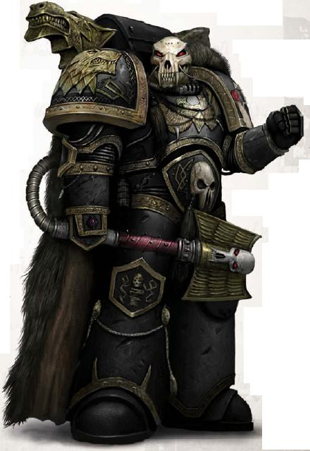
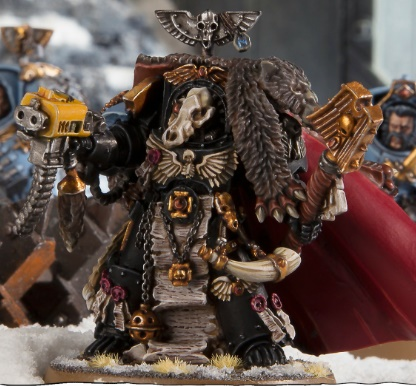

# 0368 狼牧师 Wolf Priest

精校状态：中文行文已逐段精校，部分术语仍为暂定

分类：通用概念 / 帝国 Imperium / 中央政务部 Adeptus Terra / 阿斯塔特修会 Adeptus Astartes

原文来源：https://www.bilibili.com/opus/1036937089601503236

原作者：帝国神选罐头

原文时间：2025年02月23日 08:05

[返回分类目录](目录.md) · [全书目录](../../目录.md)

<!-- A0368-B0001 -->
**英文原文**

Wolf Priests combine the roles of Chaplains and Apothecaries within the Space Wolves chapter, being responsible for both the spiritual and physical well-being of their fellows.

<!-- /A0368-B0001 -->

<!-- A0368-B0002 -->

原译文

狼牧师在太空野狼战团中结合了牧师和药剂师的角色，负责同伴的精神和身体健康。

**校订译文**

狼牧师在太空野狼战团中兼任教士与药剂师的职责，同时照料同袍的精神与身体。

<!-- /A0368-B0002 -->

<!-- A0368-B0003 -->
## Overview 概述

<!-- /A0368-B0003 -->

<!-- A0368-B0004 -->
**英文原文**

Wolf Priests are selected from any part of the chapter but usually from the Long Fangs or Wolf Guard due to the greater wisdom of these marines. Wolf Priests are well-trained in both medicine as well as how to act as a spiritual guide for the warriors under their care. Instead of using Codex medical equipment, Wolf Priests use healing potions and balms, using knowledge passed down from one Wolf Priest to the next. Just like standard Apothecaries of other Chapters, Wolf Priests retrieve the Gene-Seed of fallen Battle-Brothers.

<!-- /A0368-B0004 -->

<!-- A0368-B0005 -->

原译文

狼牧师可以从本战团的任何部分中选出，但通常是从长牙或野狼守卫中选出的，因为这些星际战士的智慧更高。狼牧师在医学以及如何为他们所照顾的战士充当精神导师方面都训练有素。狼牧师们没有使用圣典医疗装备，而是使用治疗药剂和香膏，利用从一个狼祭司传给下一个的知识。就像其他战团的标准药剂师一样，狼牧师取回了倒下的战斗兄弟的基因种子。

**校订译文**

狼牧师可从战团任何编制中选出，但通常来自长牙或野狼守卫，因为这些战士更富智慧。他们既精通医术，也受过作为精神导师引导同袍的训练。狼牧师不使用圣典规定的常规医疗器械，而凭借代代相传的知识，以治疗药剂和药膏救治伤者。同其他战团的药剂师一样，他们也负责回收阵亡战斗弟兄的基因种子。

<!-- /A0368-B0005 -->

<!-- A0368-B0006 图片 -->

<!-- A0368-B0007 -->

原译文

Wolf Priest 狼牧师

**校订译文**

Wolf Priest 狼牧师

<!-- /A0368-B0007 -->

<!-- A0368-B0008 -->
**英文原文**

Wolf Priests are also almost entirely responsible for the recruitment of aspirants to the chapter, selecting them from the hardy native warriors of Fenris. Wolf Priests are commonly garbed with wolf totems, including wolf-skull shaped helmets symbolizing the cycle of death and rebirth of Morkai. They can often be seen observing battles from nearby vantage points, ready to select suitable candidates for the Space Wolves from the survivors. The Priests are often the only Space Wolves these tribesmen ever see, and are regarded as god-like figures.

<!-- /A0368-B0008 -->

<!-- A0368-B0009 -->

原译文

狼牧师也几乎完全负责招募有志者加入战团，从芬里斯的顽强本土战士中挑选他们。狼牧师通常穿着狼图腾，包括象征莫凯死亡和重生循环的狼头骨形状的头盔。他们经常从附近的有利位置观察战斗，准备从幸存者中为太空野狼选择合适的候选人。牧师通常是这些部落成员见过的唯一的太空野狼，被视为神一般的人物。

**校订译文**

狼牧师几乎独自承担战团的征兵事务，从芬里斯强健的本土战士中挑选候选者。他们常佩戴狼形图腾，包括象征莫凯死亡与重生循环的狼颅头盔。人们时常见到他们在附近高地观察部族交战，准备从幸存者中选拔合适的新兵。许多部族成员一生中只见过狼牧师这类太空野狼，并将他们视若神明。

<!-- /A0368-B0009 -->

<!-- A0368-B0010 -->
**英文原文**

Of all the new Primaris Space Marine battle-brothers recently inducted into the Space Wolves, it was the Wolf Priests who encountered the greatest difficulties in gaining acceptance. At first their battle chants were not of Fenris, but of old Terra, copied from Legion manuals dating to before the Great Crusade. However, their howling zeal and dedication has won over even the most grizzled Space Wolves, and with each battle the Primaris Wolf Priests become ever more steeped in Fenrisian custom.

<!-- /A0368-B0010 -->

<!-- A0368-B0011 -->

原译文

在最近加入太空野狼的所有新的原铸星际战士战斗兄弟中，狼牧师在获得认可方面遇到了最大的困难。起初，他们的战斗口号不是芬里斯的，而是旧泰拉的，这是从大远征之前的军团手册中复制的。然而，他们咆哮的热情和奉献精神甚至赢得了最难缠的太空野狼的支持，随着每一场战斗，原铸狼牧师们越来越沉浸在芬里斯的习俗中。

**校订译文**

新近加入太空野狼的原铸战斗弟兄中，狼牧师最难获得认可。起初，他们吟诵的战斗祷文并非源于芬里斯，而是抄自大远征开始前的古老泰拉军团手册。不过，他们咆哮中的狂热与献身精神，最终连最资深的太空野狼也打动了。每经历一场战斗，原铸狼牧师便更加熟悉并融入芬里斯习俗。

<!-- /A0368-B0011 -->

<!-- A0368-B0012 -->
## Wargear 战备

<!-- /A0368-B0012 -->

<!-- A0368-B0013 -->
**英文原文**

Like conventional Space Marine Chaplains, Wolf Priests wear all-black power armour and carry a Crozius Arcanum as a close-combat weapon. They are also equipped with Wolf Amulets, which generate protective fields similar to a Rosarius. In addition, like conventional Space Marine Apothecaries, they are tasked with retrieving the gene-seed of fallen Space Wolves, and so carry the Fang of Morkai, a specialized Reductor.

<!-- /A0368-B0013 -->

<!-- A0368-B0014 -->

原译文

与传统的星际战士牧师一样，狼牧师穿着全黑动力盔甲，并携带牧师权杖作为近战武器。它们还配备了狼护身符，可以产生类似于玫瑰念珠的保护立场。此外，与传统的星际战士药剂师一样，他们的任务是回收牺牲的太空野狼的基因种子，因此携带专门的回收器莫凯獠牙。

**校订译文**

同其他星际战士教士一样，狼牧师穿全黑动力甲，以教士权杖作为近战武器。他们佩戴野狼护符，产生类似玫瑰念珠的防护力场；又因兼负药剂师回收基因种子的职责，携带名为“莫凯之牙”的特殊基因提取器。

<!-- /A0368-B0014 -->

<!-- A0368-B0015 图片 -->

<!-- A0368-B0016 -->

原译文

Wolf Priest in Terminator Armour 终结者盔甲狼牧师

**校订译文**

Wolf Priest in Terminator Armour 终结者盔甲狼牧师

<!-- /A0368-B0016 -->

<!-- A0368-B0017 -->
**英文原文**

As befits their station, Wolf Priests have access to a great variety of equipment from The Fang. This allows them to utilize Jump Packs and sometimes even Terminator Armour.

<!-- /A0368-B0017 -->

<!-- A0368-B0018 -->

原译文

根据他们的职位，狼牧师可以从长牙堡获得各种各样的装备。这使他们能够使用跳跃背包，有时甚至可以使用终结者盔甲。

**校订译文**

狼牧师的地位使他们能够调用长牙堡中的多种装备，包括跳跃背包，有时甚至是终结者甲。

<!-- /A0368-B0018 -->

<!-- A0368-B0019 -->
## Notable Wolf Priests 著名狼牧师

<!-- /A0368-B0019 -->

<!-- A0368-B0020 -->
**英文原文**

Ulrik the Slayer — Recruited from the Wolf Guard after the First War for Armageddon; the only Space Wolf to turn down a promotion to Wolf Lord.

<!-- /A0368-B0020 -->

<!-- A0368-B0021 -->

原译文

屠戮者乌尔里克 — 第一次阿玛吉多顿战争后从野狼守卫招募；唯一一位拒绝晋升为狼主的太空野狼。

**校订译文**

杀戮者乌尔里克——第一次阿玛吉多顿战争后，从野狼守卫中选拔为狼牧师；唯一曾拒绝晋升狼主的太空野狼。

<!-- /A0368-B0021 -->

<!-- A0368-B0022 -->
**英文原文**

Ranek Icewalker — Recruited Ragnar Blackmane and Strybjorn Grimskull.

<!-- /A0368-B0022 -->

<!-- A0368-B0023 -->

原译文

拉内克·冰行者 — 招募了拉格纳·黑鬃和斯特里比约恩·格里姆卡洛韦。

**校订译文**

拉内克·冰行者——招募了拉格纳·黑鬃与斯特里比约恩·冷颅。

**校注：** Strybjorn Grimskull 暂统一“斯特里比约恩·冷颅”，原姓氏“格里姆卡洛韦”与英文不符。

<!-- /A0368-B0023 -->

<!-- A0368-B0024 -->
**英文原文**

Sigurd — Accompanied Ragnar Blackmane to Charys and in several subsequent wars.

<!-- /A0368-B0024 -->

<!-- A0368-B0025 -->

原译文

西格德 — 陪同拉格纳·黑鬃前往查里斯，并在随后的几场战争中跟随。

**校订译文**

西格德——陪同拉格纳·黑鬃前往查里斯，并在此后数场战争中继续与他同行。

<!-- /A0368-B0025 -->

<!-- A0368-B0026 -->
**英文原文**

Tobias Heimdall — Wolf Priest in the time of the Horus Heresy

<!-- /A0368-B0026 -->

<!-- A0368-B0027 -->

原译文

托比亚斯·海姆达尔 — 荷鲁斯叛乱时期的狼牧师

**校订译文**

托比亚斯·海姆达尔 — 荷鲁斯之乱时期的狼牧师

<!-- /A0368-B0027 -->

<!-- A0368-B0028 -->

原译文

Ulaf Speargyde 乌拉夫·速矛

**校订译文**

Ulaf Speargyde 乌拉夫·速矛

<!-- /A0368-B0028 -->

<!-- A0368-B0029 -->
**英文原文**

Ulbrandr Crowhame — Great Crusade-era Wolf Priest

<!-- /A0368-B0029 -->

<!-- A0368-B0030 -->

原译文

乌尔班德尔·克劳海姆 — 大远征时期狼牧师

**校订译文**

乌尔班德尔·克劳海姆 — 大远征时期狼牧师

<!-- /A0368-B0030 -->

本篇核心术语与暂定项

以下列出本篇出现的英文原形及核心术语表用词。同形词可能指不同对象，具体词义以本篇正文和校注为准；单复数、别名和仅见于图注的名称可能尚未列入。完整候选见[术语表](../../术语表/双语术语候选.csv)。

| 英文 | 采用中文 | 状态 |
| --- | --- | --- |
| Space Wolves | 太空野狼 | 官方已核对 |
| Terminator | 终结者 | 官方已核对 |
| Horus Heresy | 荷鲁斯之乱 | 官方已核对 |
| Equipment | 装备 | 编辑用语已统一 |
| Great Crusade | 大远征 | 暂定·官方待核 |
| Terra | 泰拉 | 暂定·官方待核 |
| Horus | 荷鲁斯 | 暂定·官方待核 |
| Armageddon | 阿玛吉多顿 | 暂定·官方待核 |
| Fenris | 芬里斯 | 暂定·官方待核 |
| Rosarius | 玫瑰念珠 | 暂定·官方待核 |
| Crozius Arcanum | 教士权杖 | 暂定·官方待核 |
| Power Armour | 动力盔甲 | 暂定·官方待核 |
| Space Marine | 星际战士 | 暂定·官方待核 |
| Chapter | 战团 | 暂定·官方待核 |
| Primaris Space Marine | 原铸星际战士 | 暂定·官方待核 |
| Ulrik the Slayer | 杀戮者乌尔里克 | 官方已核 |
| Ragnar Blackmane | 拉格纳·黑鬃 | 官方已核 |
| Gene-seed | 基因种子 | 暂定·官方待核 |
| Wolf Priest | 狼牧师 | 官方语境参考·待核 |
| Reductor | 基因提取器 | 暂定·官方待核 |
| Fang of Morkai | 莫凯之牙 | 暂定·官方待核 |
| Strybjorn Grimskull | 斯特里比约恩·冷颅 | 暂定·官方待核 |
| Wolf Guard | 野狼守卫 | 官方词根参考·通称待核 |
| Chaplains | 教士 | 暂定·官方待核 |
| Heimdall | 海姆达尔 | 暂定·官方待核 |
| Ranek Icewalker | 拉内克·冰行者 | 暂定·官方待核 |
| Charys | 查瑞斯 | 暂定·官方待核 |
| Terminator Armour | 终结者盔甲 | 暂定·官方待核 |

