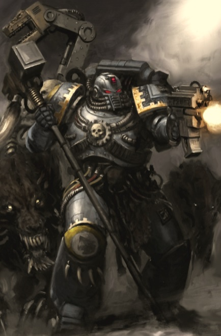
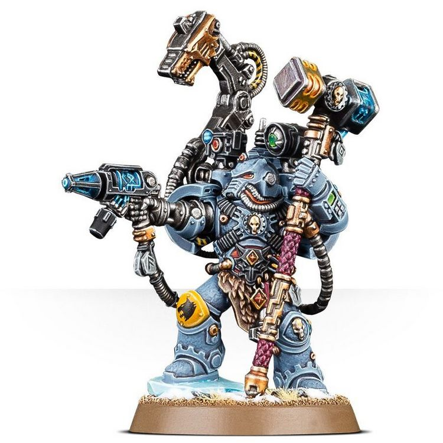

# 0370 钢铁牧师 Iron Priest

精校状态：中文行文已逐段精校，部分术语仍为暂定

分类：通用概念 / 帝国 Imperium / 中央政务部 Adeptus Terra / 阿斯塔特修会 Adeptus Astartes

原文来源：https://www.bilibili.com/opus/1025142697089826822

原作者：帝国神选罐头

原文时间：编辑于 2025年09月23日 18:46

[返回分类目录](目录.md) · [全书目录](../../目录.md)

<!-- A0370-B0001 -->
**英文原文**

The Iron Priests are part of the Space Wolves chapter and their duty is that of a Techmarine but with additions.

<!-- /A0370-B0001 -->

<!-- A0370-B0002 -->

原译文

钢铁牧师是太空野狼战团的一部分，他们的职责是作为一名技术军士，但也有补充。

**校订译文**

钢铁牧师是太空野狼战团的成员，履行科技战士的职责，并承担若干额外使命。

<!-- /A0370-B0002 -->

<!-- A0370-B0003 图片 -->

<!-- A0370-B0004 -->

原译文

Space Wolves Iron Priest 太空野狼钢铁牧师

**校订译文**

Space Wolves Iron Priest 太空野狼钢铁牧师

<!-- /A0370-B0004 -->

<!-- A0370-B0005 -->
## Overview 概述

<!-- /A0370-B0005 -->

<!-- A0370-B0006 -->
**英文原文**

An Iron Priest is required to keep the equipment of his Great Company in working order, maintain the machine spirits of its vehicles in addition to all other duties of a Techmarine. He is also required to tend to the spirits of the Dreadnoughts in the depths of the Fang, and it is his duty to rouse them from their deep slumbers if they are needed in battle. Similar to their Techmarine cousins, Iron Priests usually pilot Space Wolves gunships and aircraft.

<!-- /A0370-B0006 -->

<!-- A0370-B0007 -->

原译文

除了技术军士的所有职责外，钢铁牧师还需要保持其大连的设备正常工作，维护其载具的机魂。他还被要求在长牙堡深处照顾无畏的灵魂，如果他们在战斗中被需要，他有责任把他们从沉睡中唤醒。与他们的技术军士表亲类似，钢铁牧师通常驾驶太空野炮艇和飞行器。

**校订译文**

钢铁牧师承担科技战士的一切职责，确保所属大连的装备正常运转，并照料载具的机魂。他们还守护长牙堡深处无畏战士的灵魂，需要出战时便将其从深眠中唤醒。如同其他战团的科技战士，钢铁牧师通常也负责驾驶战团的炮艇与飞行器。

<!-- /A0370-B0007 -->

<!-- A0370-B0008 图片 -->

<!-- A0370-B0009 -->

原译文

Iron Priest 钢铁牧师

**校订译文**

Iron Priest 钢铁牧师

<!-- /A0370-B0009 -->

<!-- A0370-B0010 -->
**英文原文**

Amongst the natives of Fenris, each tribe’s smiths will worship the Gods of Iron, legendary figures said to reside within the volcanic islands adrift in the Boiling Sea. A particularly gifted young Fenrisian smith may make a pilgrimage to the Isles of Iron, where they do indeed meet with living gods, for this is the guise the Iron Priests maintain when dealing with mortal men. Should a pilgrim pass the Test of the Iron Gauntlet, he may become an apprentice and be initiated into the Space Wolves. Later he will journey to Mars, the Red Planet, where he will learn the ways of the machine under the tutelage of the arcane and insular Adeptus Mechanicus. Only once he has fully embraced the mysteries of the Omnissiah will he be allowed to return to Fenris and take his rightful place amongst the Iron Priests, bringing growling engines of war to life in the service of his Chapter.

<!-- /A0370-B0010 -->

<!-- A0370-B0011 -->

原译文

在芬里斯的原住民中，每个部落的铁匠都会崇拜钢铁之神，据说钢铁之神居住在沸腾海中漂浮的火山岛上。一位特别有天赋的年轻芬里斯铁匠可能会前往钢铁群岛朝圣，在那里他们确实会遇到活着的神，因为这是钢铁牧师在与凡人打交道时所保持的伪装。如果一个朝圣者通过了钢铁牧师的考验，他可能会成为一名学徒，并被引入太空野狼。随后，他将前往火星，这颗红色星球，在那里他将在神秘而孤立的机械神教的指导下学习机械的运作方式。只有当他完全接受了欧姆尼赛亚的奥秘，他才能被允许回到芬里斯，在钢铁牧师中占据应有的位置，为他的战团服务，让咆哮的战争引擎栩栩如生。

**校订译文**

芬里斯各部族的铁匠崇拜钢铁诸神，传说这些神祇居住在沸腾海上漂移的火山岛中。天赋出众的年轻铁匠可能前往钢铁群岛朝圣，亲眼见到“活着的神”——这正是钢铁牧师面对凡人时维持的身份。通过铁手套试炼的朝圣者，有机会成为学徒并加入太空野狼。他随后前往红色星球火星，在神秘而封闭的机械修会教导下学习机械之道。只有充分掌握欧姆尼赛亚的奥秘，才能返回芬里斯，正式成为钢铁牧师，唤醒轰鸣的战争机器，为战团效力。

**校注：** Test of the Iron Gauntlet 是具名试炼，暂译“铁手套试炼”；原译泛化为钢铁牧师的考验，漏失名称。

<!-- /A0370-B0011 -->

<!-- A0370-B0012 -->
**英文原文**

Following the return of the new Iron Priest to Fenris his final test is undertaken. He places his right hand into lava as a sacrifice to the spirit of the Iron Wolf. To conclude this rite his hand is replaced by a bionic replacement and his induction into the Iron Priesthood is complete.

<!-- /A0370-B0012 -->

<!-- A0370-B0013 -->

原译文

新的钢铁牧师回到芬里斯后，他进行了最后的测试。他将右手放入熔岩中，作为对铁狼精神的献祭。在这个仪式结束时，他的手被仿生替代品所取代，他进入钢铁牧师群体的接纳完成了。

**校订译文**

新任钢铁牧师返回芬里斯后，还须接受最后的考验。他将右手伸入熔岩，献给钢铁之狼的精魂，随后以仿生手替代毁去的手掌。这标志着入会仪式完成。

<!-- /A0370-B0013 -->

<!-- A0370-B0014 -->
**英文原文**

Beyond the standard Servo-Arm, in battle Iron Priests wield mighty Thunder Hammers and Helfrost Pistols and wear ancient suits of Runic Armour.

<!-- /A0370-B0014 -->

<!-- A0370-B0015 -->

原译文

除了标准的伺服臂，在战斗中，钢铁牧师们挥舞着强大的雷霆锤和霜狱手枪，穿着古老的符文盔甲。

**校订译文**

除标准伺服臂外，钢铁牧师出战时还携带强大的雷霆锤与霜狱手枪，身穿古老的符文甲。

<!-- /A0370-B0015 -->

<!-- A0370-B0016 -->
## Notable Iron Priests 著名钢铁牧师

<!-- /A0370-B0016 -->

<!-- A0370-B0017 -->

原译文

Aldacrel 阿尔达克勒

**校订译文**

Aldacrel 阿尔达克勒

<!-- /A0370-B0017 -->

<!-- A0370-B0018 -->

原译文

Anvarr Rustmane 安瓦尔·拉斯曼

**校订译文**

Anvarr Rustmane 安瓦尔·拉斯曼

<!-- /A0370-B0018 -->

<!-- A0370-B0019 -->

原译文

Bjorksten 比约克斯坦

**校订译文**

Bjorksten 比约克斯坦

<!-- /A0370-B0019 -->

<!-- A0370-B0020 -->

原译文

Bjurn Isenfyr 比约恩·艾森菲尔

**校订译文**

Bjurn Isenfyr 比约恩·艾森菲尔

<!-- /A0370-B0020 -->

<!-- A0370-B0021 -->

原译文

Bodr Silverscalp 博德·银头

**校订译文**

Bodr Silverscalp 博德·银头

<!-- /A0370-B0021 -->

<!-- A0370-B0022 -->

原译文

Corus Redsmith 克瑞斯·瑞德史密斯

**校订译文**

Corus Redsmith 科鲁斯·红铁匠

<!-- /A0370-B0022 -->

<!-- A0370-B0023 -->

原译文

Hengis Blackhand 亨吉斯·黑手

**校订译文**

Hengis Blackhand 亨吉斯·黑手

<!-- /A0370-B0023 -->

<!-- A0370-B0024 -->

原译文

Horgan Steelsoul 霍根·钢魂

**校订译文**

Horgan Steelsoul 霍根·钢魂

<!-- /A0370-B0024 -->

<!-- A0370-B0025 -->

原译文

Hrothgar Swordfang 赫罗斯加·剑齿

**校订译文**

Hrothgar Swordfang 赫罗斯加·剑齿

<!-- /A0370-B0025 -->

<!-- A0370-B0026 -->

原译文

Skvarl Cogfang 斯卡尔·齿牙

**校订译文**

Skvarl Cogfang 斯卡尔·齿牙

<!-- /A0370-B0026 -->

<!-- A0370-B0027 -->

原译文

Ulf Blackbrow 乌尔夫·黑眉

**校订译文**

Ulf Blackbrow 乌尔夫·黑眉

<!-- /A0370-B0027 -->

本篇核心术语与暂定项

以下列出本篇出现的英文原形及核心术语表用词。同形词可能指不同对象，具体词义以本篇正文和校注为准；单复数、别名和仅见于图注的名称可能尚未列入。完整候选见[术语表](../../术语表/双语术语候选.csv)。

| 英文 | 采用中文 | 状态 |
| --- | --- | --- |
| Space Wolves | 太空野狼 | 官方已核对 |
| Adeptus Mechanicus | 机械修会 | 官方已核对 |
| Equipment | 装备 | 编辑用语已统一 |
| Techmarine | 科技战士 | 官方已核对 |
| Omnissiah | 欧姆尼赛亚 | 暂定·官方待核 |
| Mars | 火星 | 暂定·官方待核 |
| Fenris | 芬里斯 | 暂定·官方待核 |
| Iron Priest | 钢铁牧师 | 官方已核对 |
| Ancient | 旗手 | 官方已核对 |
| Chapter | 战团 | 暂定·官方待核 |
| Mortal | 凡人 | 暂定·官方待核 |
| Tribe | 部落（欧克组织） | 暂定·官方待核 |
| Test of the Iron Gauntlet | 铁手套试炼 | 暂定·官方待核 |
| helfrost | 霜狱 | 暂定·官方待核 |
| Servo-arm | 伺服臂 | 暂定·官方待核 |

