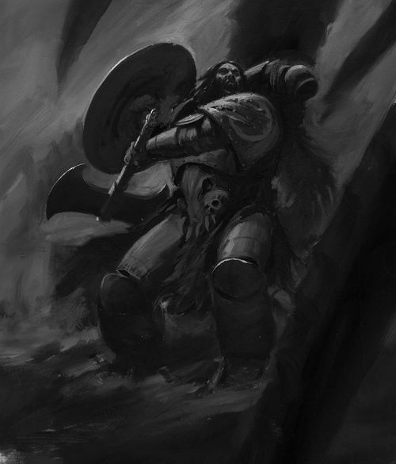

# 0371 孤狼 Lone Wolve

精校状态：中文行文已逐段精校，部分术语仍为暂定

分类：通用概念 / 帝国 Imperium / 中央政务部 Adeptus Terra / 阿斯塔特修会 Adeptus Astartes

原文来源：https://www.bilibili.com/opus/1026559503739387959

原作者：帝国神选罐头

原文时间：2025年01月26日 08:55

[返回分类目录](目录.md) · [全书目录](../../目录.md)

<!-- A0371-B0001 -->
**英文原文**

Unlike other Space Marine chapters who reinforce their squads, the Space Wolves do not reinforce their wolf packs when casualties occur and for this reason the Long Fangs and Grey Hunters operate at a reduced strength. Even the most experienced packs will sometimes suffer such a great loss that only one survivor remains from the pack. This sole survivor has no pack, no kin, no rank, nothing left in the Universe but to seek revenge for his fallen brothers.

<!-- /A0371-B0001 -->

<!-- A0371-B0002 -->

原译文

与其他增援小队的星际战士不同，太空野狼在发生伤亡时不会增援狼群，因此长牙和灰猎的兵力会有所减少。即使是最有经验的狼群，有时也会遭受如此巨大的损失，以至于狼群中只剩下一名幸存者。这个唯一的幸存者没有包袱，没有亲属，没有级别，在宇宙中除了为他死去的兄弟报仇，什么都没有了。

**校订译文**

其他星际战士战团会为减员的小队补充兵员，太空野狼却通常不会为狼群补入新人，因此长牙与灰色猎手往往缺编作战。即使最有经验的狼群，也可能遭到惨重损失，最后只剩一人。这名幸存者失去了狼群、亲族与军阶，在宇宙间已别无所求，只为死去的弟兄复仇。

**校注：** pack 在本段指狼群作战小队，原“没有包袱”误译。篇名英文 Lone Wolve 疑为 Lone Wolf 的拼写错误，原英文标题保留。

<!-- /A0371-B0002 -->

<!-- A0371-B0003 图片 -->

<!-- A0371-B0004 -->

原译文

Lone Wolf 孤狼

**校订译文**

Lone Wolf 孤狼

<!-- /A0371-B0004 -->

<!-- A0371-B0005 -->
**英文原文**

These survivors are known as Lone Wolves and will swear an oath to avenge the honour of their brethren. As the final stage of his oath nears completion, a Lone Wolf vows to hunt down and slay the fiercest foe, all in the name of his fallen wolf pack. Once the Lone Wolf has taken the oath, he then prepares himself for the ensuing battle, both mentally and physically, rejecting any company from others.

<!-- /A0371-B0005 -->

<!-- A0371-B0006 -->

原译文

这些幸存者被称为孤狼，他们将宣誓为兄弟们的荣誉报仇。随着誓言的最后阶段接近尾声，一只孤狼发誓要追捕并杀死最凶猛的敌人，一切都是以他的狼群的名义进行的。一旦孤狼宣誓，他就会在精神和身体上为接下来的战斗做好准备，拒绝任何其他人的陪伴。

**校订译文**

这些幸存者被称为孤狼，会立誓为同袍雪耻。当复仇誓言行至最后阶段，孤狼将以亡故狼群之名，追猎并斩杀最凶悍的敌人。立誓之后，他拒绝任何人的陪伴，独自磨炼身心，为接下来的战斗做准备。

<!-- /A0371-B0006 -->

<!-- A0371-B0007 -->
**英文原文**

On the eve of battle, it is often a sight of great awe as Lone Wolves advance on the enemy, their gaze fixed upon a single target that they will stop at nothing to slaughter. Many Lone Wolves do not fulfill their own self-prophecy and are inevitably slain in the process, being rejoined with their fallen wolf pack with a fine tale to tell. Rarely though, a Lone Wolf will return victorious in the hunt, carrying the head of the fallen enemy back to his commander in the Great Company. These unique individuals are almost certainly inducted into the Wolf Guard at the request of the Wolf Lord that they serve, for such a feat to succeed is no small accomplishment indeed.

<!-- /A0371-B0007 -->

<!-- A0371-B0008 -->

原译文

在战斗前夕，当孤狼向敌人前进时，人们往往会感到非常敬畏，他们的目光只盯着一个目标，他们会不择手段地屠杀这个目标。许多孤狼没有实现自己的自我誓言，在这个过程中不可避免地被杀死，他们带着一个好故事重新回到了他们已逝的狼群。然而，很少有孤狼会在狩猎中获胜，把倒下的敌人头颅带回大连的指挥官那里。这些特殊的人几乎肯定是应狼主的要求加入野狼守卫的，因为这样的壮举取得成功确实是一项不小的成就。

**校订译文**

大战将至，孤狼向敌阵前行，目光牢牢锁定唯一的猎物，誓要不惜代价将其杀死；这样的景象往往令人敬畏。许多孤狼未能完成自己的预言便战死，却也带着一段值得传唱的故事，与亡故狼群重聚。极少数人能凯旋，将敌人首级带回大连指挥官面前。完成如此壮举绝非易事，因此这些罕见的幸存者几乎总会受狼主征召，加入野狼守卫。

<!-- /A0371-B0008 -->

<!-- A0371-B0009 -->
## Famous Lone Wolves 著名孤狼

<!-- /A0371-B0009 -->

<!-- A0371-B0010 -->

原译文

Bulveye the Berserker 狂战士布拉维耶

**校订译文**

Bulveye the Berserker 狂战士布拉维耶

<!-- /A0371-B0010 -->

<!-- A0371-B0011 -->

原译文

Bjorn 比约恩

**校订译文**

Bjorn 比约恩

<!-- /A0371-B0011 -->

<!-- A0371-B0012 -->

原译文

Olaf Silvermane 奥拉夫.银鬃

**校订译文**

Olaf Silvermane 奥拉夫·银鬃

<!-- /A0371-B0012 -->

<!-- A0371-B0013 -->

原译文

Torvald Fellhammer 托瓦德.落锤

**校订译文**

Torvald Fellhammer 托瓦德·落锤

<!-- /A0371-B0013 -->

本篇核心术语与暂定项

以下列出本篇出现的英文原形及核心术语表用词。同形词可能指不同对象，具体词义以本篇正文和校注为准；单复数、别名和仅见于图注的名称可能尚未列入。完整候选见[术语表](../../术语表/双语术语候选.csv)。

| 英文 | 采用中文 | 状态 |
| --- | --- | --- |
| Space Wolves | 太空野狼 | 官方已核对 |
| Grey Hunters | 灰色猎手 | 官方已核对 |
| Space Marine | 星际战士 | 暂定·官方待核 |
| Wolf Guard | 野狼守卫 | 官方词根参考·通称待核 |
| Kin | 炉裔 | 暂定·官方待核 |

