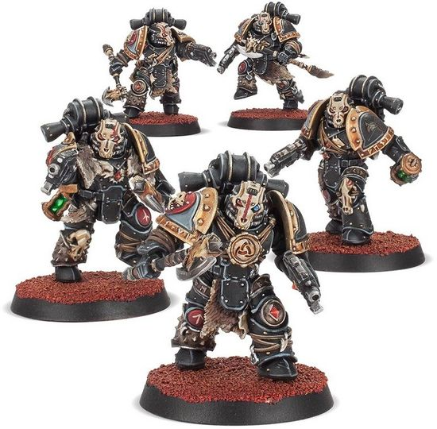

# 0372 死誓者 Deathsworn

精校状态：中文行文已逐段精校，部分术语仍为暂定

分类：通用概念 / 帝国 Imperium / 中央政务部 Adeptus Terra / 阿斯塔特修会 Adeptus Astartes

原文来源：https://www.bilibili.com/opus/1021796479509987337

原作者：帝国神选罐头

原文时间：2025年01月13日 12:52

[返回分类目录](目录.md) · [全书目录](../../目录.md)

原篇名：死誓 Deathsworn

<!-- A0372-B0001 -->
**英文原文**

The Deathsworn were the fighting elite of the Space Wolves Legion during the Great Crusade and Horus Heresy.

<!-- /A0372-B0001 -->

<!-- A0372-B0002 -->

原译文

死誓者是大远征和荷鲁斯叛乱期间太空野狼军团的战斗精英。

**校订译文**

死誓者是大远征与荷鲁斯之乱期间太空野狼军团的战斗精锐。

<!-- /A0372-B0002 -->

<!-- A0372-B0003 图片 -->

<!-- A0372-B0004 -->

原译文

Deathsworn 死誓者

**校订译文**

Deathsworn 死誓者

<!-- /A0372-B0004 -->

<!-- A0372-B0005 -->
**英文原文**

These warriors were the dark heart of the Legion, having witnessed the greatest horrors of what the Space Wolves had done in the name of the Emperor. Their minds and souls had been irreparably damaged to such an extent that they were no longer men or even Space Marine. Rather, they were said to be something hollow and murderous beyond reason. They had an unusually strong impulse to kill, even for the Space Wolves, and were interred into specialized units known as Deathsworn packs. These wolf-skull helmed warriors would feast on the bodies of their enemies in the name of the Cult of Morkai and wielded the Yimiria Class Stasis Bomb.

<!-- /A0372-B0005 -->

<!-- A0372-B0006 -->

原译文

这些战士是军团的黑暗之心，他们目睹了太空野狼以帝皇的名义所做的最可怕的事情。他们的思想和灵魂受到了不可挽回的伤害，以至于他们不再是人，甚至不再是星际战士。相反，他们被认为是一种空洞而残忍的东西。他们有一种异常强烈的杀戮冲动，甚至对太空野狼来说也是如此，并被埋葬在被称为死誓者的专业单位中。这些戴着野狼头骨头盔的战士会以莫凯教的名义大快朵颐敌人的尸体，并挥舞着伊米里亚级静滞炸弹。

**校订译文**

这些战士是军团的黑暗之心，亲眼见证了太空野狼以帝皇之名犯下的最可怕暴行。他们的心智与灵魂遭受无法挽回的创伤，不再像人，甚至不再像星际战士，而是内心空洞、杀戮欲远超理性所能约束的存在。即使在太空野狼之中，他们的杀戮冲动也格外强烈，因此被编入专门的死誓者狼群。这些战士戴着狼颅头盔，以莫凯教派之名吞食敌人的尸体，并携带伊米里亚级静滞炸弹作战。

**校注：** 原文 interred into specialized units 直译为埋葬会与单位编制语义冲突，依上下文译“编入”；保留原英文异常词。

<!-- /A0372-B0006 -->

本篇核心术语与暂定项

以下列出本篇出现的英文原形及核心术语表用词。同形词可能指不同对象，具体词义以本篇正文和校注为准；单复数、别名和仅见于图注的名称可能尚未列入。完整候选见[术语表](../../术语表/双语术语候选.csv)。

| 英文 | 采用中文 | 状态 |
| --- | --- | --- |
| Space Wolves | 太空野狼 | 官方已核对 |
| Horus Heresy | 荷鲁斯之乱 | 官方已核对 |
| Emperor | 帝皇 | 官方已核对 |
| Great Crusade | 大远征 | 暂定·官方待核 |
| Horus | 荷鲁斯 | 暂定·官方待核 |
| Space Marine | 星际战士 | 暂定·官方待核 |
| Deathsworn | 死誓者 | 语境定译·官方待核 |
| The Dark | 《黑暗》 | 暂定·官方待核 |

