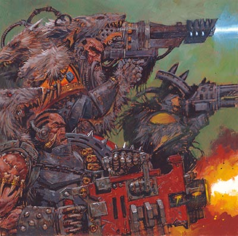
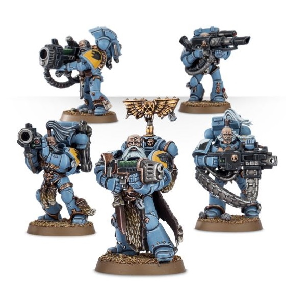

# 0373 长牙 Long Fang

精校状态：中文行文已逐段精校，部分术语仍为暂定

分类：通用概念 / 帝国 Imperium / 中央政务部 Adeptus Terra / 阿斯塔特修会 Adeptus Astartes

原文来源：https://www.bilibili.com/opus/1026559589662851078

原作者：帝国神选罐头

原文时间：2025年01月26日 08:55

[返回分类目录](目录.md) · [全书目录](../../目录.md)

<!-- A0373-B0001 -->
**英文原文**

Long Fangs are the long-ranged heavy weapons specialists of the Space Wolves, comparable to the Devastator Squads of other Space Marine Chapters.

<!-- /A0373-B0001 -->

<!-- A0373-B0002 -->

原译文

长牙是太空野狼的远程重型武器专家，与其他星际战士的毁灭者小队相当。

**校订译文**

长牙是太空野狼的远程重武器专家，相当于其他星际战士战团的破坏者小队。

<!-- /A0373-B0002 -->

<!-- A0373-B0003 图片 -->

<!-- A0373-B0004 -->

原译文

Long Fangs in action 行动的长牙

**校订译文**

Long Fangs in action 行动的长牙

<!-- /A0373-B0004 -->

<!-- A0373-B0005 -->
## Overview 概述

<!-- /A0373-B0005 -->

<!-- A0373-B0006 -->
**英文原文**

In a typical Codex Chapter, Space Marines are first assigned to a Devastator Squad after completing their initial service with the Scout Company. Only after mastering both aspects of war are such Marines eligible for promotion to a Tactical Squad.

<!-- /A0373-B0006 -->

<!-- A0373-B0007 -->

原译文

在一个典型的圣典战团中，星际战士在完成侦察连的初始服役后，首先被分配到一个毁灭者小队。只有掌握了战争的两个方面，这些星际战士才有资格晋升为战术小队。

**校订译文**

在典型圣典战团中，星际战士完成侦察连的初期服役后，首先进入破坏者小队。掌握这些作战本领后，才有资格晋入战术小队。

**校注：** 本段英语只写侦察与破坏者两个阶段，与其他篇目另含突击训练的完整晋升顺序不同；按本段所附英文保留，不补造缺失阶段。

<!-- /A0373-B0007 -->

<!-- A0373-B0008 -->
**英文原文**

Among the Space Wolves, by contrast, only the most senior and experienced Marines may be promoted to the ranks of the Long Fangs. The teachings of Russ hold that only warriors such as these can be entrusted with the chapter's long-ranged heavy weapons, each of which is a relic in and of itself, incredibly rare and sometimes irreplaceable. Likewise, only warriors who have served their time in the furious close-combat assaults of the Blood Claws and the more deliberate actions of the Grey Hunters, are wise enough in the ways of battle to know exactly how to deploy this kind of firepower to assist their brothers.

<!-- /A0373-B0008 -->

<!-- A0373-B0009 -->

原译文

相比之下，在太空野狼中，只有最资深、最有经验的星际战士才能晋升为长牙。鲁斯的教义认为，只有像这样的战士才能被赋予本战团的远程重型武器，每一件武器本身都是一件圣物，非常罕见，有时是不可替代的。同样，只有在血爪的激烈近战攻击和灰猎的更深思熟虑的行动中服役的战士，在战斗方式上才足够明智，知道如何部署这种火力来帮助他们的兄弟。

**校订译文**

太空野狼则只有最资深、最富经验的战士才能晋为长牙。鲁斯教导，唯有这样的战士才值得托付战团的远程重武器；每件武器本身都是珍贵圣物，极为稀有，有时甚至无法补充。也只有历经血爪的狂烈近战突击，再熟习灰色猎手稳健的作战方式，才能真正懂得如何运用这些火力，给予同袍最恰当的支援。

<!-- /A0373-B0009 -->

<!-- A0373-B0010 图片 -->

<!-- A0373-B0011 -->

原译文

Long Fangs 长牙

**校订译文**

Long Fangs 长牙

<!-- /A0373-B0011 -->

<!-- A0373-B0012 -->
**英文原文**

By the time of his promotion to the Long Fangs, a Space Wolf has served and fought for centuries, and the Canis Helix — the unique component of the Wolves' geneseed — has completed its final effects, and the Wolf's elongated canines have grown to their fullest length, strong enough to dent plasteel.

<!-- /A0373-B0012 -->

<!-- A0373-B0013 -->

原译文

当他晋升为长牙时，一只太空野狼已经服役和战斗了几个世纪，野狼基因种子中独特的组成部分狼之螺旋已经完成了最后的效果，野狼的细长犬齿已经长到了最长的长度，强壮到足以刺穿胸甲。

**校订译文**

晋为长牙时，一名太空野狼通常已征战数百年。其基因种子的独特成分——狼之螺旋——也已发挥最终作用，使犬齿长至极限，坚硬到足以在塑钢上留下凹痕。

**校注：** dent plasteel 指在塑钢上咬出凹痕，不是刺穿胸甲；原译同时改变了材料与程度。

<!-- /A0373-B0013 -->

<!-- A0373-B0014 -->
## Wargear 战备

<!-- /A0373-B0014 -->

<!-- A0373-B0015 -->
**英文原文**

Long Fangs have access to the standard range of weaponry available to a Space Marine Devastator Squad, including Heavy Bolters, Missile launchers, Multi-meltas, Plasma cannons, and Lascannons.

<!-- /A0373-B0015 -->

<!-- A0373-B0016 -->

原译文

长牙可以使用星际战士毁灭者小队可用的标准武器范围，包括重型爆矢枪、导弹发射器、多管热熔、等离子炮和激光炮。

**校订译文**

长牙可使用普通星际战士破坏者小队的各类武器，包括重型爆矢枪、导弹发射器、多管热熔、等离子炮与激光炮。

<!-- /A0373-B0016 -->

<!-- A0373-B0017 -->
## Predator Annihilator 歼灭者型掠食者战车

原题：Predator Annihilator 歼灭掠食者

<!-- /A0373-B0017 -->

<!-- A0373-B0018 -->
**英文原文**

The origin of the Predator Annihilator was borne out of necessity, during the Skarath Crusade in M36. A Space Wolves Great Company found themselves surrounded by Traitor Legion forces, unable to bring their Lascannons to bear on superior numbers of tanks and Chaos Dreadnoughts, not without suffering considerable damage from the hail of fire the enemy was able to lay down. To counter this, the Long Fangs and Iron Priests ripped the Autocannons out of their Predator tanks, and replaced them with the Long Fangs' Lascannons. The protection afforded to them by the tanks' armoured hulls enabled the Long Fangs to get within range of the enemy armour, and to eventually destroy them.

<!-- /A0373-B0018 -->

<!-- A0373-B0019 -->

原译文

歼灭掠食者的起源是在M36的斯卡拉斯远征期间得到证实的。一支太空野狼大连发现自己被叛徒军团包围，无法用他们的激光炮攻击大量的坦克和混沌无畏，而且敌人发射的炮火也造成了相当大的伤害。为了应对这种情况，长牙和钢铁牧师从他们的掠食者坦克中拆除了自动炮，并用长牙的激光炮取而代之。坦克装甲外壳为他们提供的保护使“长牙”能够进入敌人装甲的射程内，并最终将其摧毁。

**校订译文**

歼灭者型掠食者战车诞生于战场上的迫切需要。第36千年的斯卡拉特远征中，一个太空野狼大连遭叛徒军团包围。敌人拥有数量占优的坦克及混沌无畏；长牙若想将激光炮推进至有效射界，就必须顶着猛烈弹雨，承受惨重伤亡。为破解困局，长牙与钢铁牧师拆下掠食者战车的自动炮，换装长牙使用的激光炮。借助车体装甲的保护，他们终于能够接近敌方装甲单位，将其纳入射程并摧毁。

<!-- /A0373-B0019 -->

<!-- A0373-B0020 -->
**英文原文**

The Adeptus Mechanicus was dismayed that their precious STC tanks had been modified, but has since approved of the modifications, and other chapters started following suit not long after, retro-fitting some of their Predator Destructors' armament with Lascannons. Thus the Annihilator variant had come to pass, and it continues to serve as the main Space Marine anti-vehicle tank.

<!-- /A0373-B0020 -->

<!-- A0373-B0021 -->

原译文

机械神教对他们珍贵的STC坦克被改装感到沮丧，但后来批准了这些改装，不久后其他战团也开始效仿，用激光炮改装了他们的一些破坏掠食者的武器。因此，歼灭战变体问世，并继续作为主要的星际战士反载具坦克。

**校订译文**

机械修会最初对珍贵的 STC 战车被擅自改装感到震惊，但后来批准了这种改动。不久，其他战团也开始效仿，将部分破坏者型掠食者战车改装为激光炮武装。歼灭者型由此诞生，并一直作为星际战士的主力反装甲坦克服役。

<!-- /A0373-B0021 -->

本篇核心术语与暂定项

以下列出本篇出现的英文原形及核心术语表用词。同形词可能指不同对象，具体词义以本篇正文和校注为准；单复数、别名和仅见于图注的名称可能尚未列入。完整候选见[术语表](../../术语表/双语术语候选.csv)。

| 英文 | 采用中文 | 状态 |
| --- | --- | --- |
| Space Marines | 星际战士 | 官方已核对 |
| Space Wolves | 太空野狼 | 官方已核对 |
| Adeptus Mechanicus | 机械修会 | 官方已核对 |
| STC | 标准建造模板 | 暂定·官方待核 |
| Devastator Squad | 破坏者小队 | 官方已核对 |
| Tactical Squad | 战术小队 | 官方已核对 |
| Grey Hunters | 灰色猎手 | 官方已核对 |
| Predator Annihilator | 歼灭者型掠食者战车 | 官方已核对 |
| Space Marine | 星际战士 | 暂定·官方待核 |
| Chapter | 战团 | 暂定·官方待核 |
| Devastator | 破坏者 | 暂定·官方待核 |
| Scout | 侦察兵 | 暂定·官方待核 |
| Devastator Squads | 破坏者小队 | 暂定·官方待核 |
| Codex Chapter | 圣典战团 | 暂定·官方待核 |
| Missile Launchers | 导弹发射器 | 暂定·官方待核 |
| Scout Company | 侦察连 | 暂定·官方待核 |
| Canis Helix | 狼之螺旋 | 暂定·官方待核 |
| Blood Claws | 血爪 | 官方已核对 |
| Bear | 熊 | 暂定·官方待核 |
| The Blood | 鲜血 | 暂定·官方待核 |
| Skarath Crusade | 斯卡拉特远征 | 暂定·官方待核 |

