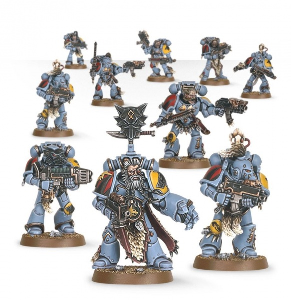

# 0374 灰色猎手 Grey Hunter

精校状态：中文行文已逐段精校，部分术语仍为暂定

分类：通用概念 / 帝国 Imperium / 中央政务部 Adeptus Terra / 阿斯塔特修会 Adeptus Astartes

原文来源：https://www.bilibili.com/opus/1023599339277123601

原作者：帝国神选罐头

原文时间：2025年01月18日 09:28

[返回分类目录](目录.md) · [全书目录](../../目录.md)

原篇名：灰猎 Grey Hunter

<!-- A0374-B0001 -->
**英文原文**

Grey Hunter is the second rank of the Space Wolves Chapter. These Space Marines make up the majority of a Space Wolf Great Company, similar to the Tactical Squads of a Codex Chapter.

<!-- /A0374-B0001 -->

<!-- A0374-B0002 -->

原译文

灰猎是太空野狼战团的第二梯队。这些星际战士组成了太空野狼大连的大部分，类似于圣典战团的战术小队。

**校订译文**

灰色猎手是太空野狼战团的第二阶段战士，组成各大连的主体，相当于圣典战团的战术小队。

<!-- /A0374-B0002 -->

<!-- A0374-B0003 -->
## Overview 概述

<!-- /A0374-B0003 -->

<!-- A0374-B0004 -->
**英文原文**

After surviving their initial service as Blood Claws (a process which can take decades, or even centuries), Space Wolves are promoted to the ranks of the Grey Hunters, and allowed to trade in their bolt pistols for the venerable boltguns that are the mainstay of a Space Marine's armoury.

<!-- /A0374-B0004 -->

<!-- A0374-B0005 -->

原译文

在经历了最初的血爪服役（这一过程可能需要几十年甚至几个世纪）后，太空野狼被晋升为灰猎，并被允许用他们的爆矢枪换取作为星际战士军械库支柱的古老爆矢枪。

**校订译文**

太空野狼在血爪阶段服役并幸存下来后，才能晋为灰色猎手；这个过程可能持续数十年，甚至数百年。届时，他们获准将爆矢手枪换成古老可靠的爆矢枪——星际战士最主要的武器。

**校注：** 原文 bolt pistols 换 boltguns，必须区分爆矢手枪与爆矢枪，原译误成同类武器互换。

<!-- /A0374-B0005 -->

<!-- A0374-B0006 图片 -->

<!-- A0374-B0007 -->

原译文

Grey Hunters pack 灰猎队

**校订译文**

Grey Hunters pack 灰色猎手狼群

<!-- /A0374-B0007 -->

<!-- A0374-B0008 -->
**英文原文**

The Grey Hunters are as hungry for battle as their Blood Claw brethren, but their aggression is tempered with experience that has taught them the value of patience and cunning. Grey Hunters excel at both attack and defense, and moreover are able to determine which approach best fits the tactical situation at hand. When on the offensive, they exhibit the pack skills of true hunters, advancing with deliberate suppression fire and flawless coordination, until they draw close enough to the enemy to unleash their savage charge.

<!-- /A0374-B0008 -->

<!-- A0374-B0009 -->

原译文

灰猎和他们的血爪兄弟一样渴望战斗，但他们的侵略性被经验所冲淡，这些经验教会了他们耐心和狡猾的价值。灰猎人擅长进攻和防守，而且能够确定哪种方法最适合手头的战术情况。在进攻时，他们表现出真正猎人的团队技能，以从容不迫的压制火力和完美的协调推进，直到他们靠近敌人，发动野蛮的冲锋。

**校订译文**

灰色猎手与血爪同样渴望战斗，但经验已磨去他们的鲁莽，使他们懂得耐心与计谋的价值。他们攻守俱佳，也能判断眼前战局更适合哪种方式。进攻时，他们展现出真正猎群的默契，以有条不紊的压制火力和无懈可击的协同推进，直到足够接近敌人，再发动凶猛冲锋。

<!-- /A0374-B0009 -->

<!-- A0374-B0010 -->
**英文原文**

As a Space Wolf grows older and more experienced, the Canis Helix — the unique aspect of the Space Wolves geneseed — causes more extreme physical changes. By the time they have attained the status of Grey Hunters, their hair has literally turned grey, their fangs have lengthened, their hides have toughened, and, in some extreme cases, their eyes may turn yellow, until their resemblance to the wolves of Fenris is greater than ever.

<!-- /A0374-B0010 -->

<!-- A0374-B0011 -->

原译文

随着一名太空野狼年龄的增长和经验的增加，狼之螺旋——太空野狼基因种子的独特方面——会导致更极端的身体变化。当他们达到灰猎的等级时，他们的头发已经变白，尖牙变长，皮肤变硬，在某些极端情况下，他们的眼睛可能会变黄，直到他们与芬里斯野狼的相似性比以往任何时候都大。

**校订译文**

随着太空野狼年岁与经验增长，狼之螺旋会引发更明显的身体变化。晋为灰色猎手时，他们的头发已经转灰，犬齿变长，皮肤坚韧；极端情况下，眼睛也可能变黄，愈发近似芬里斯的野狼。

<!-- /A0374-B0011 -->

<!-- A0374-B0012 -->
**英文原文**

It is usually from Grey Hunter packs that a brave, skilled warrior will be chosen to join the Wolf Guard. For this to happen is a great honour to both the individual marine and his pack. The pack may well compose a saga to commemorate the warriors deeds and relate them to future battle-brothers. These sagas both impart battle knowledge to younger marines, and inspire their courage and bravery, causing them to try to outdo their predecessor. After serving as a Grey Hunter for a time, the pack will be formed into the heavy weapon team, known as the Long Fangs.

<!-- /A0374-B0012 -->

<!-- A0374-B0013 -->

原译文

通常会从灰猎队中选出一名勇敢、熟练的战士加入野狼守卫。对于这位星际战士和他的队伍来说，这是一种莫大的荣誉。这个队伍很可能会写一个传奇故事来纪念战士的事迹，并将其与未来的战斗兄弟联系起来。这些传奇故事既向年轻的星际战士传授了战斗知识，又激发了他们的勇气和胆量，使他们试图超越前任。在担任一段时间的灰猎后，该队伍将组成重武器队，称为长牙。

**校订译文**

野狼守卫通常从灰色猎手狼群中挑选英勇善战者。获选不仅是个人殊荣，也让整个狼群引以为傲。同伴可能为他编成一篇传奇，纪念其功绩，传唱给后来的战斗弟兄。这样的故事既传授战斗经验，也鼓舞年轻战士奋勇超越前辈。经历一段灰色猎手的服役后，整个狼群还会进一步转为称作长牙的重武器队。

<!-- /A0374-B0013 -->

<!-- A0374-B0014 -->
**英文原文**

Recently with the introduction of Primaris Space Marines Logan Grimnar has sought to combine the ancient customs of Fenris with that of the influx of new Space Marine warriors and wargear. To this end, Grey Hunters have taken up the role as Suppressor Squads.

<!-- /A0374-B0014 -->

<!-- A0374-B0015 -->

原译文

最近，随着原铸星际战士的引进，罗根·格里姆纳尔试图将芬里斯的古老习俗与新的星际战士和战备的涌入相结合。为此，灰猎队扮演了镇压小队的角色。

**校订译文**

原铸星际战士加入后，洛根·格里姆纳尔试图将芬里斯的古老习俗与新战士、新装备相结合，因此灰色猎手也开始承担压制者小队的职责。

<!-- /A0374-B0015 -->

<!-- A0374-B0016 -->
## Wargear 战备

<!-- /A0374-B0016 -->

<!-- A0374-B0017 -->
**英文原文**

A standard Grey Hunters pack numbers 5-10 marines, armed with boltguns, close combat weapons, and frag and krak grenades. Select members of the pack may arm themselves with a meltagun, flamer or plasma gun, or specialized close combat weapons, such as a Power Weapon or even a Power Fist. In addition, one of the Grey Hunters may be entrusted with carrying the Wolf Standard.

<!-- /A0374-B0017 -->

<!-- A0374-B0018 -->

原译文

一个标准的灰猎队有5-10名星际战士，装备有爆矢枪、近战武器以及破片穿甲手榴弹。队伍中的选定成员可以用热熔枪、火焰枪或等离子枪，或专门的近战武器，如动力武器，甚至动力拳来武装自己。此外，其中一名灰猎可能会被委托携带狼旗。

**校订译文**

一个标准灰色猎手狼群有五至十人，配备爆矢枪、近战武器，以及破片手榴弹和穿甲手榴弹。部分成员可换用热熔枪、火焰喷射器、等离子枪，或动力武器、动力拳等特殊近战装备。此外，一名灰色猎手可能获托携带狼旗。

<!-- /A0374-B0018 -->

<!-- A0374-B0019 -->
**英文原文**

In their Supressor role, Grey Hunters wield Accelerator Autocannons and don Omnis-Pattern Mk.X Power Armour.

<!-- /A0374-B0019 -->

<!-- A0374-B0020 -->

原译文

在他们的压制者定位中，灰猎挥舞着加速自动炮，并穿上全知型Mk.X动力盔甲。

**校订译文**

担任压制者时，灰色猎手装备加速自动炮，身穿全知型 Mk.X 动力甲。

<!-- /A0374-B0020 -->

本篇核心术语与暂定项

以下列出本篇出现的英文原形及核心术语表用词。同形词可能指不同对象，具体词义以本篇正文和校注为准；单复数、别名和仅见于图注的名称可能尚未列入。完整候选见[术语表](../../术语表/双语术语候选.csv)。

| 英文 | 采用中文 | 状态 |
| --- | --- | --- |
| Space Marines | 星际战士 | 官方已核对 |
| Space Wolves | 太空野狼 | 官方已核对 |
| Fenris | 芬里斯 | 暂定·官方待核 |
| Ancient | 旗手 | 官方已核对 |
| Grey Hunters | 灰色猎手 | 官方已核对 |
| Power Armour | 动力盔甲 | 暂定·官方待核 |
| Krak Grenades | 穿甲手榴弹 | 暂定·官方待核 |
| Space Marine | 星际战士 | 暂定·官方待核 |
| Chapter | 战团 | 暂定·官方待核 |
| Suppressor | 压制者 | 暂定·官方待核 |
| Logan Grimnar | 洛根·格里姆纳尔 | 官方已核 |
| Armoury | 军械库 | 暂定·官方待核 |
| Tactical Squads | 战术小队 | 暂定·官方待核 |
| Codex Chapter | 圣典战团 | 暂定·官方待核 |
| Canis Helix | 狼之螺旋 | 暂定·官方待核 |
| Suppressor Squads | 压制者小队 | 暂定·官方待核 |
| Blood Claws | 血爪 | 官方已核对 |
| Wolf Guard | 野狼守卫 | 官方词根参考·通称待核 |
| Gun | 甘 | 暂定·官方待核 |
| claw | 利爪分队 | 暂定·官方待核 |
| Bolt | 爆矢 | 暂定·官方待核 |
| Flamer | 火焰喷射器（武器）／火妖（奸奇单位） | 语境定译·对应官译已核 |
| Meltagun | 热熔枪 | 官方已核对 |
| Plasma gun | 等离子枪 | 官方已核对 |
| Power fist | 动力拳 | 官方已核对 |
| Power weapon | 动力武器 | 官方已核对 |

