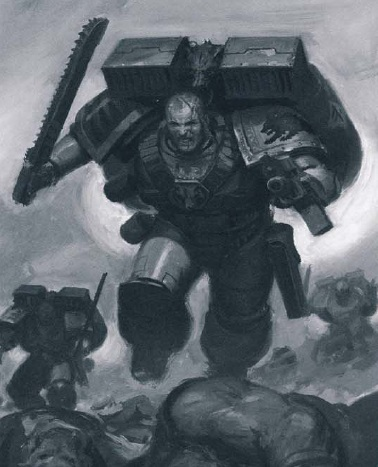

# 0375 天爪 Skyclaw

精校状态：中文行文已逐段精校，部分术语仍为暂定

分类：通用概念 / 帝国 Imperium / 中央政务部 Adeptus Terra / 阿斯塔特修会 Adeptus Astartes

原文来源：https://www.bilibili.com/opus/1034055870970855430

原作者：帝国神选罐头

原文时间：2025年02月15日 13:44

[返回分类目录](目录.md) · [全书目录](../../目录.md)

<!-- A0375-B0001 -->
**英文原文**

In the Space Wolves, the reckless troublemakers from the Blood Claw packs are reassigned to the Skyclaw Assault Packs.

<!-- /A0375-B0001 -->

<!-- A0375-B0002 -->

原译文

在太空野狼中，血爪队中鲁莽的麻烦制造者被重新分配到天爪突击队。

**校订译文**

在太空野狼中，血爪队中鲁莽的麻烦制造者被重新分配到天爪突击队。

<!-- /A0375-B0002 -->

<!-- A0375-B0003 图片 -->

<!-- A0375-B0004 -->

原译文

Space Wolves Skyclaws 太空野狼天爪

**校订译文**

Space Wolves Skyclaws 太空野狼天爪

<!-- /A0375-B0004 -->

<!-- A0375-B0005 -->
**英文原文**

This title is a "reward" for their stubbornness and naïvete, and are given jump packs to aid their eagerness to charge straight into the line of battle. The experienced elders look down on the Skyclaws as dishonourable, since fighting on foot was good enough for their Primarch and so it is good enough for them. This disapproval among the experienced Space Wolves only drives the Skyclaws to perform risky acts of valour and heroism. While many will surely perish in attempting to achieve such a feat to be worthy in the elders' eyes, some will inevitably succeed in accomplishing the impossible.

<!-- /A0375-B0005 -->

<!-- A0375-B0006 -->

原译文

这个头衔是对他们固执和天真的“奖励”，并为他们提供跳跃背包，以帮助他们渴望直接冲入战线。经验丰富的老兵们看不起天爪，认为这是不光彩的，因为徒步作战对他们的原体来说已经足够好了，所以对他们来说也足够好了。经验丰富的太空野狼的这种反对只会驱使天爪队做出冒险的英勇和英雄主义行为。虽然许多人在试图实现这样一个在长辈眼中值得的壮举时肯定会死亡，但有些人不可避免地会成功完成不可能的事情。

**校订译文**

天爪之名是对其顽固与天真的“奖赏”，而跳跃背包则让他们能更快地一头冲入战线。老兵认为这种作战方式不光彩：既然原体徒步作战已足够，后辈也该如此。然而，长者的不认同只会激得天爪更加冒险，争相立下英勇战功。许多人为赢得认可而丧命，少数人却也真的完成了看似不可能的壮举。

<!-- /A0375-B0006 -->

<!-- A0375-B0007 -->
**英文原文**

Skyclaw packs are very competitive and always try to out-do the other in battle and in drinking competitions where some have been known to steal Thunderhawks and race towards the enemy commander, delivering his head to the Wolf Lord on a silver platter he would surely win against his rival packs. Skyclaws are rarely disciplined for their reckless behaviour and only in extreme circumstances will a Skyclaw be given a punishment to fit the crime.

<!-- /A0375-B0007 -->

<!-- A0375-B0008 -->

原译文

天爪队非常有竞争意识，在战斗和饮酒比赛中总是试图击败对方，其中一些人会偷走雷鹰并冲向敌方指挥官，将他的头放在银盘上交给狼王，他肯定会战胜竞争对手队。天爪很少因其鲁莽的行为而受到纪律处分，只有在极端情况下，天爪才会受到与罪行相称的惩罚。

**校订译文**

天爪狼群极为好胜，无论战场还是饮酒竞赛，都要压过同伴。有的甚至偷走雷鹰，抢先冲向敌方指挥官，将其首级盛在银盘上呈给狼主，以此赢过竞争的狼群。天爪的鲁莽通常不会受到惩戒；只有行为极端出格时，才会接受与过错相称的处罚。

<!-- /A0375-B0008 -->

本篇核心术语与暂定项

以下列出本篇出现的英文原形及核心术语表用词。同形词可能指不同对象，具体词义以本篇正文和校注为准；单复数、别名和仅见于图注的名称可能尚未列入。完整候选见[术语表](../../术语表/双语术语候选.csv)。

| 英文 | 采用中文 | 状态 |
| --- | --- | --- |
| Space Wolves | 太空野狼 | 官方已核对 |
| Primarch | 原体 | 官方已核对 |
| The Blood | 鲜血 | 暂定·官方待核 |
| claw | 利爪分队 | 暂定·官方待核 |

