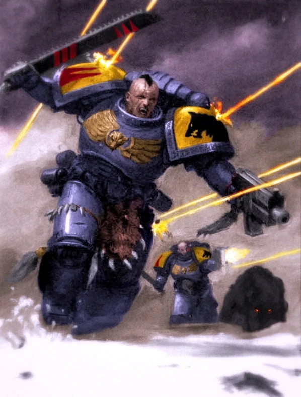
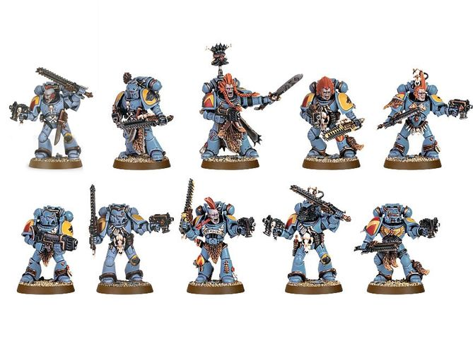

# 0376 血爪 Blood Claw

精校状态：中文行文已逐段精校，部分术语仍为暂定

分类：通用概念 / 帝国 Imperium / 中央政务部 Adeptus Terra / 阿斯塔特修会 Adeptus Astartes

原文来源：https://www.bilibili.com/opus/1019189829497258017

原作者：帝国神选罐头

原文时间：2025年01月06日 12:17

[返回分类目录](目录.md) · [全书目录](../../目录.md)

<!-- A0376-B0001 -->
**英文原文**

Blood Claw (or Blooded Claw) is the first and lowest rank in the Space Wolves chapter, to which initiates are assigned after completing their basic training. Unlike Codex Chapters, which assign Neophyte Space Marines to begin their combat service as Scouts, the Space Wolves employ Neophytes as assault troops, allowing them to vent their youthful enthusiasm and lust for battle on the enemy.

<!-- /A0376-B0001 -->

<!-- A0376-B0002 -->

原译文

血爪（或血爪）是太空野狼战团的第一个也是最低的等级，在完成基本训练后被分配到该战团。与圣典战团不同，圣典战团指派星际战士新进者作为侦察兵开始战斗服役，太空野狼运用新进者作为突击部队，让他们能够向敌人发泄年轻时的战斗热情和欲望。

**校订译文**

血爪（Blood Claw，亦作 Blooded Claw）是太空野狼最初、最低的战士等级，新兵完成基础训练后便编入其中。圣典战团通常让新兵从侦察任务开始服役，太空野狼却将他们用作突击部队，让年轻战士向敌人尽情宣泄旺盛的斗志与好战欲望。

<!-- /A0376-B0002 -->

<!-- A0376-B0003 图片 -->

<!-- A0376-B0004 -->

原译文

Blood Claws 血爪

**校订译文**

Blood Claws 血爪

<!-- /A0376-B0004 -->

<!-- A0376-B0005 -->
## Overview 概述

<!-- /A0376-B0005 -->

<!-- A0376-B0006 -->
**英文原文**

The Wolves believe that real combat is the best form of training, and encourage Blood Claws to take their place at the vanguard and learn the skills of battle firsthand. The Blood Claws hardly need encouraging - thrilled at having joined the ranks of the mythical Sky Warriors, and eager to forge their own personal sagas, they charge with berserker ferocity and a reckless belief in their own invulnerability. Such a berserker charge can turn the tide of a battle, but it also leads Blood Claws to take risks that are suicidal even for a Space Marine. For this reason, Blood Claw packs are usually led by a senior member of the chapter, such as a Grey Hunter or a Wolf Guard, whose duty it is to rein in the worst of their recklessness and mark out those who show real potential for advancement.

<!-- /A0376-B0006 -->

<!-- A0376-B0007 -->

原译文

野狼认为，真正的战斗是最好的训练形式，并鼓励血爪小队成为先锋，直接学习战斗技能。血爪几乎不需要鼓励 - 他们很高兴加入了神话中的天空战士的行列，并渴望打造自己的个人传奇，他们以更狂暴的凶猛和对自己无懈可击的鲁莽信念冲锋。这种狂暴的冲锋可以扭转战斗的局势，但它也会导致血爪冒着自杀的风险，即使是对一名星际战士来说也是如此。出于这个原因，血爪小队通常由该战团的高级成员领导，如灰猎手或野狼守卫，他们的职责是控制最坏的鲁莽行为，并找出那些表现出真正进步潜力的人。

**校订译文**

太空野狼相信实战才是最好的训练，因此鼓励血爪冲在前沿，亲自领悟战斗技艺。血爪其实无须鼓励：能加入传说中的天空勇士，已让他们激动不已；他们急于谱写自己的传奇，便怀着狂战士般的凶性，以及自以为刀枪不入的鲁莽信念冲锋。这种攻势能扭转战局，却也会让他们去冒连星际战士看来都近乎自杀的风险。因此，血爪狼群通常由灰色猎手或野狼守卫等资深战士带领，约束其最莽撞的行为，并辨识有晋升潜力的成员。

<!-- /A0376-B0007 -->

<!-- A0376-B0008 -->
**英文原文**

A typical Blood Claw pack numbers between 5 and 15 marines. Casualties take their toll, and their numbers reduce quickly. To the Wolves, this is a necessary process to separate the men from the boys, and weed out those too weak, slow, or just plain unlucky, to become Grey Hunters. Some Blood Claws take longer to outgrow their reckless phase (and some never do at all). For these, the "reward" is usually assignment to a specialized unit that makes the most of their love for speed and willingness to charge headlong into the fray - either the Skyclaw assault packs or the Swiftclaw bike squadrons.

<!-- /A0376-B0008 -->

<!-- A0376-B0009 -->

原译文

一个典型的血爪小队有5到15名星际战士。伤亡人数不断增加，人数迅速减少。对于野狼来说，这是一个必要的过程，将男人和男孩分开，淘汰那些太弱、太慢或只是运气不好的人，成为灰猎手。有些血爪需要更长的时间才能摆脱鲁莽的阶段（有些甚至永远不会）。对于这些人来说，“奖励”通常是分配给一个专门的部队，该部队充分利用了他们对速度的热爱，并愿意一头扎进战斗中——要么是天爪突击队，要么是利爪摩托中队。

**校订译文**

典型血爪狼群有五至十五名战士，随着战损累积，人数会很快减少。太空野狼将这视为成长所必需的筛选：过于虚弱、迟钝或仅仅运气不佳者被淘汰，幸存者才有机会成为灰色猎手。有些血爪迟迟无法摆脱鲁莽，有的甚至终生如此。他们通常会获“奖赏”调入天爪突击狼群或迅爪摩托中队，充分发挥对速度的热爱，以及不顾一切冲入混战的激情。

<!-- /A0376-B0009 -->

<!-- A0376-B0010 图片 -->

<!-- A0376-B0011 -->

原译文

Blood Claws pack 血爪队

**校订译文**

Blood Claws pack 血爪队

<!-- /A0376-B0011 -->

<!-- A0376-B0012 -->
**英文原文**

Since the induction of Primaris Space Marines into the Space Wolves, many Blood Claws violently confront the new warriors. The Space Wolves have been forced to implement a ritual to allow for unarmed combatants to release their aggression in non-fatal ways to deal with the problem.

<!-- /A0376-B0012 -->

<!-- A0376-B0013 -->

原译文

自从原铸星际战士加入太空野狼以来，许多血爪激烈地对抗新战士。太空野狼被迫实施一项仪式，允许手无寸铁的战斗人员以非致命的方式释放他们的侵略行为来处理这个问题。

**校订译文**

原铸星际战士加入战团后，许多血爪与新同袍爆发暴力冲突。为处理这一问题，战团不得不设立徒手搏斗仪式，让战士以不致命的方式释放攻击欲。

<!-- /A0376-B0013 -->

<!-- A0376-B0014 -->
## Wargear 战备

<!-- /A0376-B0014 -->

<!-- A0376-B0015 -->
**英文原文**

After completing their transformation into full-fledged Space Marines, Blood Claws are issued with suits of Power Armour, chainswords, and bolt pistols, along with frag and krak grenades, similar to the Assault Squads of Codex Chapters. One Blood Claw from each pack (or up to two in a pack of 15) may be equipped with a Flamer, Melta gun, Plasma gun, Plasma pistol, Power weapon, or Power fist.

<!-- /A0376-B0015 -->

<!-- A0376-B0016 -->

原译文

在完成向成熟的星际战士的转型后，血爪部队获得了动力盔甲、链锯剑和爆矢手枪的套装，以及破片和穿甲手榴弹，类似于圣典战团的突击小队。每个队中的一个血爪（或15人队中最多两个）可以配备火焰枪、热熔枪、等离子枪、等离子手枪、动力武器或动力拳。

**校订译文**

完成全部星际战士改造后，血爪会获配动力甲、链锯剑、爆矢手枪，以及破片和穿甲手榴弹，与圣典战团的突击小队相似。每个狼群可有一人配备火焰喷射器、热熔枪、等离子枪、等离子手枪、动力武器或动力拳；十五人狼群则最多可有两人使用这些装备。

<!-- /A0376-B0016 -->

本篇核心术语与暂定项

以下列出本篇出现的英文原形及核心术语表用词。同形词可能指不同对象，具体词义以本篇正文和校注为准；单复数、别名和仅见于图注的名称可能尚未列入。完整候选见[术语表](../../术语表/双语术语候选.csv)。

| 英文 | 采用中文 | 状态 |
| --- | --- | --- |
| Space Marines | 星际战士 | 官方已核对 |
| Space Wolves | 太空野狼 | 官方已核对 |
| Assignment | 灵能分级 | 暂定·官方待核 |
| Neophyte | 新进者 | 暂定 |
| Grey Hunters | 灰色猎手 | 官方已核对 |
| Power Armour | 动力盔甲 | 暂定·官方待核 |
| Krak Grenades | 穿甲手榴弹 | 暂定·官方待核 |
| Space Marine | 星际战士 | 暂定·官方待核 |
| Chapter | 战团 | 暂定·官方待核 |
| Vanguard | 先锋 | 暂定·官方待核 |
| Assault Squads | 突击小队 | 暂定·官方待核 |
| Initiates | 进阶者 | 官方已核 |
| Blood Claws | 血爪 | 官方已核对 |
| Wolf Guard | 野狼守卫 | 官方词根参考·通称待核 |
| Ferocity | 凶猛 | 暂定·官方待核 |
| Gun | 甘 | 暂定·官方待核 |
| The Blood | 鲜血 | 暂定·官方待核 |
| claw | 利爪分队 | 暂定·官方待核 |
| Bolt | 爆矢 | 暂定·官方待核 |
| Flamer | 火焰喷射器（武器）／火妖（奸奇单位） | 语境定译·对应官译已核 |
| Melta Gun | 热熔枪 | 暂定·官方待核 |
| Plasma pistol | 等离子手枪 | 官方已核对 |
| Plasma gun | 等离子枪 | 官方已核对 |
| Power fist | 动力拳 | 官方已核对 |
| Power weapon | 动力武器 | 官方已核对 |

