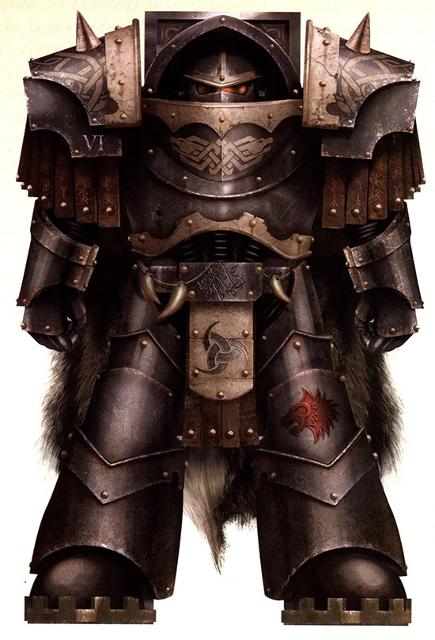
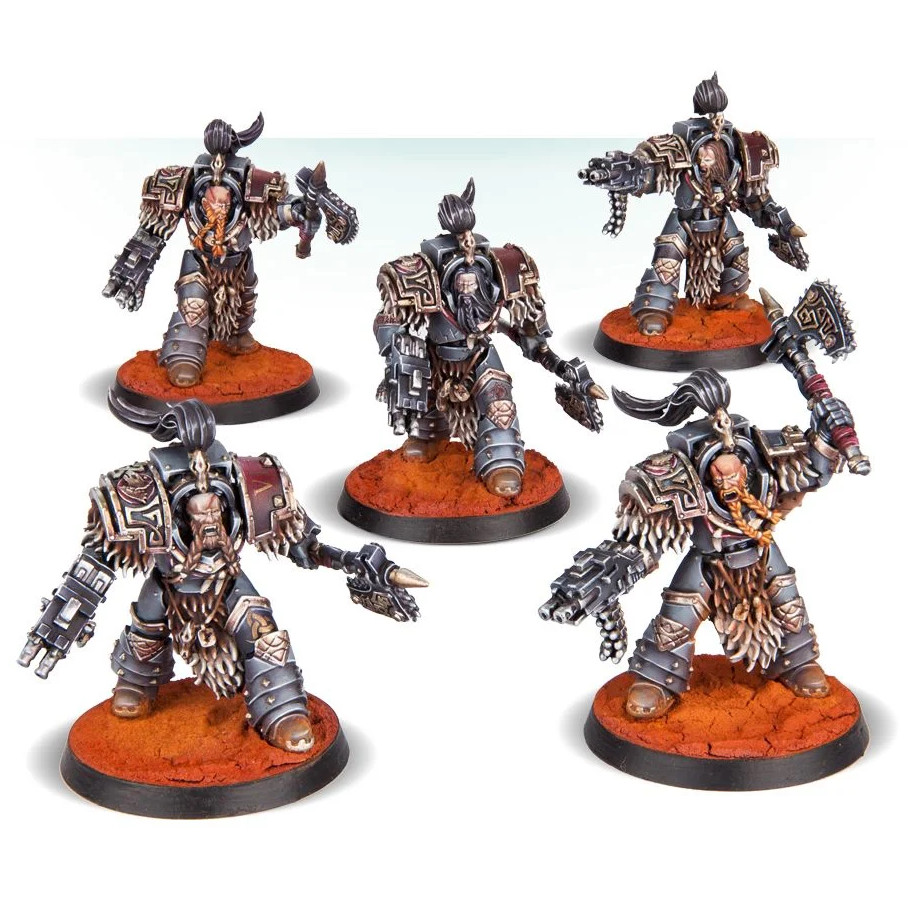

# 0377 瓦拉吉尔 Varagyr

精校状态：中文行文已逐段精校，部分术语仍为暂定

分类：通用概念 / 帝国 Imperium / 中央政务部 Adeptus Terra / 阿斯塔特修会 Adeptus Astartes

原文来源：https://www.bilibili.com/opus/1036603838837030918

原作者：帝国神选罐头

原文时间：2025年02月22日 10:32

[返回分类目录](目录.md) · [全书目录](../../目录.md)

<!-- A0377-B0001 -->
**英文原文**

The Varagyr, occasionally recorded as Varangii in Imperial documents and literally meaning "Wolf Guard," were the elite warriors chosen by Leman Russ during the Great Crusade and Horus Heresy. Handpicked from his own Great Company, they served as his personal Honour Guard, or Huscarls in old Fenrisian, as well as close companions in both war and council.

<!-- /A0377-B0001 -->

<!-- A0377-B0002 -->

原译文

瓦拉吉尔，偶尔在帝国文件中被记录为瓦兰吉，字面意思是“野狼守卫”，是黎曼·鲁斯在大远征和荷鲁斯叛乱期间受选的精英战士。他们是从他自己的大连中挑选出来的，是他个人的荣誉卫队，在旧芬里斯语中称为胡斯卡尔，在战争和议会中都是亲密的伙伴。

**校订译文**

瓦拉吉尔是大远征与荷鲁斯之乱期间黎曼·鲁斯亲选的精锐战士。帝国文献偶尔也将其记作 Varangii（瓦兰吉），名称意为“野狼守卫”。他们从鲁斯自己的大连中挑选而来，担任他的荣誉卫队——古芬里斯语称“王室护卫”——也是他战场与议事时的亲密伙伴。

<!-- /A0377-B0002 -->

<!-- A0377-B0003 图片 -->

<!-- A0377-B0004 -->

原译文

Varagyr Thegn Ortheln of the Blood-Worm 瓦拉吉尔贵族蠕血·奥尔特伦

**校订译文**

Varagyr Thegn Ortheln of the Blood-Worm 瓦拉吉尔贵族蠕血·奥尔特伦

<!-- /A0377-B0004 -->

<!-- A0377-B0005 -->
## History 历史

<!-- /A0377-B0005 -->

<!-- A0377-B0006 -->
**英文原文**

Upon his rediscovery on the planet Fenris, Leman Russ was appointed to lead the VIth Legion. Accompanying him were several hundred Fenrisian warriors who had, despite their age, successfully undergone the implantation and gene-processing required to become a Legiones Astartes. These men became Leman Russ' first Varagyr, sworn to him with unyielding loyalty, willing to defy death to remain by his side. Their commitment led them to leave their harsh world and venture into the stars with their lord.

<!-- /A0377-B0006 -->

<!-- A0377-B0007 -->

原译文

在芬里斯星球被重新发现后，黎曼·鲁斯被任命为第六军团的领袖。与他同行的是数百名芬里斯战士，尽管他们年纪大了，但他们成功地接受了成为阿斯塔特军团所需的植入和基因处理。这些人成为了黎曼·鲁斯的第一个瓦拉吉尔，以坚定不移的忠诚向他宣誓，愿意抗争死亡，留在他身边。他们的承诺使他们离开了严酷的世界，与他们的主人一起冒险进入星空。

**校订译文**

黎曼·鲁斯在芬里斯被找回后，受命统领第六军团。数百名芬里斯战士随他同行；尽管年纪已大，他们仍成功接受了成为军团阿斯塔特所需的器官植入与基因改造。这些人成为鲁斯最初的瓦拉吉尔，对他宣誓绝不动摇的忠诚，宁可抗拒死亡也要留在主人身边。为践行誓言，他们离开严酷的故乡，随鲁斯走向群星。

<!-- /A0377-B0007 -->

<!-- A0377-B0008 -->
**英文原文**

Leman Russ valued these Varagyr for their unwavering loyalty over the might of the transhuman Astartes of the Legion he commanded. Unlike the Legionnaires, these warriors had already proven their worth and earned his respect.

<!-- /A0377-B0008 -->

<!-- A0377-B0009 -->

原译文

黎曼·鲁斯珍视这些瓦拉吉尔，因为他们作为他指挥的军团中的转换阿斯塔特对他坚定不移的忠诚。与军团士兵不同，这些战士已经证明了自己的价值，并赢得了他的尊重。

**校订译文**

相比麾下军团阿斯塔特的超人力量，鲁斯更加看重这些瓦拉吉尔坚定不移的忠诚。其他军团战士尚需获得他的信任，这些旧日伙伴却早已证明自己的价值，赢得他的尊敬。

**校注：** valued ... loyalty over ... might 是更重视忠诚而非力量，原译遗漏了比较关系。

<!-- /A0377-B0009 -->

<!-- A0377-B0010 图片 -->

<!-- A0377-B0011 -->

原译文

Varagyr Wolf Guard 瓦拉吉尔狼卫

**校订译文**

Varagyr Wolf Guard 瓦拉吉尔野狼守卫

<!-- /A0377-B0011 -->

<!-- A0377-B0012 -->
### Integration into the VIth Legion 融入第六军团

<!-- /A0377-B0012 -->

<!-- A0377-B0013 -->
**英文原文**

Russ integrated the Varagyr into his Legion, which initially caused some resentment. However, it was quickly established that Russ' authority was absolute, and the Varagyr were prepared to resolve any disputes through single combat.

<!-- /A0377-B0013 -->

<!-- A0377-B0014 -->

原译文

鲁斯将瓦拉吉尔融入了他的军团，这最初引起了一些不满。然而，很快就确定了鲁斯的权威是绝对的，瓦拉吉尔准备通过一次战斗来解决任何争端。

**校订译文**

鲁斯将瓦拉吉尔编入军团，起初引发了一些不满。然而，他很快确立了不容质疑的权威，而瓦拉吉尔也随时准备以单独决斗解决任何争端。

<!-- /A0377-B0014 -->

<!-- A0377-B0015 -->
**英文原文**

After the Wheel of Fire Campaign, the old Terra-born VIth Legion and the newly inducted Fenrisian warriors were united by the trials of war. For the survivors of both groups, Fenris became home, as they adopted elements of Fenrisian culture and martial traditions embodied by their Primarch.

<!-- /A0377-B0015 -->

<!-- A0377-B0016 -->

原译文

在火轮战役之后，古老的泰拉出生的第六军团和新加入的芬里斯战士通过战争的考验团结在一起。对于这两个群体的幸存者来说，芬里斯成为了他们的家，因为他们采用了芬里斯文化的元素和他们的原体所体现的军事传统。

**校订译文**

火焰之轮战役后，原先泰拉出身的第六军团成员，与新加入的芬里斯战士，在战争磨炼中融为一体。双方幸存者都开始将芬里斯视为故乡，接受其文化与原体所代表的战士传统。

<!-- /A0377-B0016 -->

<!-- A0377-B0017 -->
**英文原文**

The Fenrisian wisdom of the Varagyr was embraced by those in the Legion who sought to become closer to their Primarch, while the Fenris-born adapted to new weapons and warfare techniques suited to the vast battlefields they now faced.

<!-- /A0377-B0017 -->

<!-- A0377-B0018 -->

原译文

瓦拉吉尔的芬里斯智慧被那些寻求与他们的原体更亲近的军团成员所接受，而芬里斯裔天生就适应了适合他们现在面临的广阔战场的新武器和战争技术。

**校订译文**

希望更加亲近原体的军团战士开始接受瓦拉吉尔的芬里斯智慧；与此同时，芬里斯出身者也逐渐适应新武器与新战法，以应付眼前愈发辽阔的战场。

<!-- /A0377-B0018 -->

<!-- A0377-B0019 -->
### The "Onn" Company 第一连队

<!-- /A0377-B0019 -->

<!-- A0377-B0020 -->
**英文原文**

Leman Russ' 1st Great Company, or "Onn" Company in Fenrisian dialect, included his elite Varagyr. To earn this rank, each warrior had to distinguish himself in battle repeatedly, forging sagas worth telling. They were the true wolves of Russ' pack, marked by the great beast pelts adorning their armour.

<!-- /A0377-B0020 -->

<!-- A0377-B0021 -->

原译文

黎曼·鲁斯的第一大连，或芬里斯方言中的“奥恩”连队，包括他的精英瓦拉吉尔。为了获得这个军衔，每个战士都必须在战斗中反复脱颖而出，打造出值得讲述的传奇。他们是鲁斯狼群中真正的狼，盔甲上装饰着巨大的兽皮。

**校订译文**

黎曼·鲁斯的第一大连，或芬里斯方言中的“奥恩”连队，包括他的精英瓦拉吉尔。为了获得这个军衔，每个战士都必须在战斗中反复脱颖而出，打造出值得讲述的传奇。他们是鲁斯狼群中真正的狼，盔甲上装饰着巨大的兽皮。

<!-- /A0377-B0021 -->

<!-- A0377-B0022 -->
## The Varagyr in Battle 战斗中的瓦拉吉尔

<!-- /A0377-B0022 -->

<!-- A0377-B0023 -->
**英文原文**

In battle, the Varagyr charged like a thunderbolt, a tide of armoured, beast-skin-draped hulks driven by superhuman strength and ferocity. Their momentum was said to crush enemies even before their fearsome blades could strike.

<!-- /A0377-B0023 -->

<!-- A0377-B0024 -->

原译文

在战斗中，瓦拉吉尔像霹雳一样冲锋，一股由超人的力量和凶猛驱动的盔甲、披着兽皮的庞然大物。据说，他们的气势甚至在可怕的刀刃发动攻击之前就已经粉碎了敌人。

**校订译文**

战场上的瓦拉吉尔如雷霆冲锋：披挂重甲与兽皮的庞大战士凭借超人力量和凶性，汇成不可阻挡的洪流。据说，甚至还没等他们挥下可怕的利刃，冲锋的猛烈势头便已将敌人碾碎。

<!-- /A0377-B0024 -->

<!-- A0377-B0025 -->
### Ranks 等级

<!-- /A0377-B0025 -->

<!-- A0377-B0026 -->
**英文原文**

The Leader of a Varagyr Squad is called a Thegn.

<!-- /A0377-B0026 -->

<!-- A0377-B0027 -->

原译文

瓦拉吉尔小队的队长被称为贵族。

**校订译文**

瓦拉吉尔小队的队长被称为贵族。

<!-- /A0377-B0027 -->

<!-- A0377-B0028 -->
### Heraldry 纹章

<!-- /A0377-B0028 -->

<!-- A0377-B0029 -->
**英文原文**

The Varagyrs' armour was adorned with ornate decorations, including ritual knotwork on the pauldrons and gorget. These patterns held significant ritual meaning for the Fenrisian warrior cult. The intricate designs on their pauldrons symbolized the legend each Varagyr had built over years of combat but also served a practical purpose by highlighting tactical specialities for easy identification during battle.

<!-- /A0377-B0029 -->

<!-- A0377-B0030 -->

原译文

瓦拉吉尔的盔甲上装饰着华丽的装饰，包括肩甲和护颈上的仪式徽章和华丽的装饰。这些图案对芬里斯战士崇拜具有重要的仪式意义。他们的肩甲上复杂的设计象征着每个瓦拉吉尔多年来在战斗中建立的传说，但也有实际用途，突出了战术特点，便于在战斗中识别。

**校订译文**

瓦拉吉尔的盔甲饰以繁复纹样，肩甲与护颈上的仪式绳结纹尤为醒目，对芬里斯战士信仰具有深刻意义。肩甲图案象征每名战士多年征战积累的传奇，也有实际作用：标明其战术专长，便于同袍在战斗中辨认。

<!-- /A0377-B0030 -->

<!-- A0377-B0031 -->
**英文原文**

Varagyrs also wore Fenrisian Wolf pelts and carried several fangs from the same beast. These trophies, which were often worn by squad leaders and veterans instead of traditional marks of rank, served as badges of honour within the Legion.

<!-- /A0377-B0031 -->

<!-- A0377-B0032 -->

原译文

瓦拉吉尔还披着芬里斯狼皮，并携带了同一头野兽的几只尖牙。这些奖杯通常由队长和老兵佩戴，而不是传统的军衔标志，是军团内部的荣誉徽章。

**校订译文**

瓦拉吉尔还披戴芬里斯狼皮，并佩戴取自同一头狼的数枚尖牙。这些战利品是军团内部的荣誉标记，队长与老兵常以它们取代普通军阶标识。

<!-- /A0377-B0032 -->

<!-- A0377-B0033 -->
### Wargear 战备

<!-- /A0377-B0033 -->

<!-- A0377-B0034 -->
**英文原文**

The Varagyrs were exclusively clad in Cataphractii Terminator Armour. For weaponry, they wielded Combi-Bolters and Frost Axes.

<!-- /A0377-B0034 -->

<!-- A0377-B0035 -->

原译文

瓦拉吉尔完全穿着铁骑终结者盔甲。在武器方面，他们挥舞着符合爆矢枪和霜斧。

**校订译文**

瓦拉吉尔一律穿铁骑型终结者甲，装备复合爆矢枪与霜斧。

<!-- /A0377-B0035 -->

本篇核心术语与暂定项

以下列出本篇出现的英文原形及核心术语表用词。同形词可能指不同对象，具体词义以本篇正文和校注为准；单复数、别名和仅见于图注的名称可能尚未列入。完整候选见[术语表](../../术语表/双语术语候选.csv)。

| 英文 | 采用中文 | 状态 |
| --- | --- | --- |
| Terminator | 终结者 | 官方已核对 |
| Horus Heresy | 荷鲁斯之乱 | 官方已核对 |
| Primarch | 原体 | 官方已核对 |
| Great Crusade | 大远征 | 暂定·官方待核 |
| Terra | 泰拉 | 暂定·官方待核 |
| Horus | 荷鲁斯 | 暂定·官方待核 |
| Legiones Astartes | 阿斯塔特军团 | 暂定·官方待核 |
| Fenris | 芬里斯 | 暂定·官方待核 |
| Companions | 近侍 | 暂定·官方待核 |
| Honour Guard | 荣誉卫队 | 暂定·官方待核 |
| Thegn | 领主 | 暂定·官方待核 |
| Absolute | 绝对号 | 暂定·官方待核 |
| Wolf Guard | 野狼守卫 | 官方词根参考·通称待核 |
| Varagyr | 瓦拉吉尔 | 暂定·官方待核 |
| Ferocity | 凶猛 | 暂定·官方待核 |
| Wheel of Fire campaign | 火焰之轮战役 | 暂定·官方待核 |
| Terminator Armour | 终结者盔甲 | 暂定·官方待核 |

