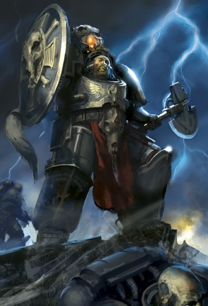
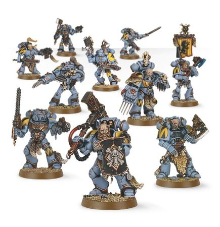
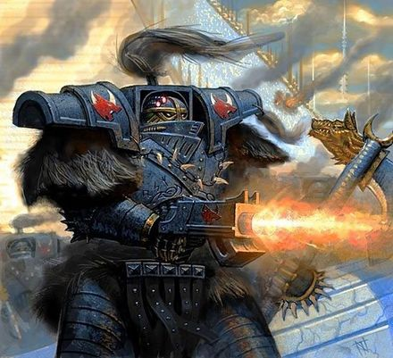
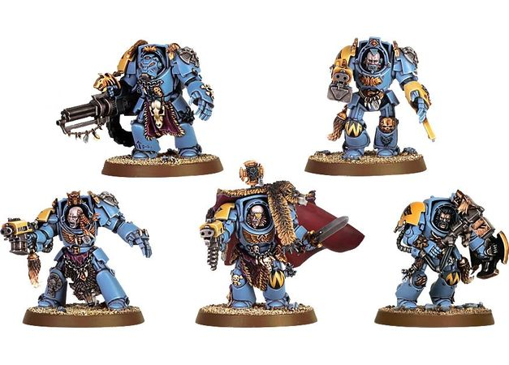

# 0378 野狼守卫 Wolf Guard

精校状态：中文行文已逐段精校，部分术语仍为暂定

分类：通用概念 / 帝国 Imperium / 中央政务部 Adeptus Terra / 阿斯塔特修会 Adeptus Astartes

原文来源：https://www.bilibili.com/opus/1036936934985826325

原作者：帝国神选罐头

原文时间：2025年02月23日 08:04

[返回分类目录](目录.md) · [全书目录](../../目录.md)

<!-- A0378-B0001 -->
**英文原文**

Wolf Guards, or Varagyr, are the veteran elite of the Space Wolves Chapter.

<!-- /A0378-B0001 -->

<!-- A0378-B0002 -->

原译文

野狼守卫，或称瓦拉吉尔，是太空野狼战团的老兵精英。

**校订译文**

野狼守卫，或称瓦拉吉尔，是太空野狼战团的老兵精英。

<!-- /A0378-B0002 -->

<!-- A0378-B0003 -->
## Overview 概述

<!-- /A0378-B0003 -->

<!-- A0378-B0004 -->
**英文原文**

During the Horus heresy, Leman Russ personal Honour Guard and Elite warriors were named the Varagyr or Wolf Guard in the Fenrisian language.

<!-- /A0378-B0004 -->

<!-- A0378-B0005 -->

原译文

在荷鲁斯叛乱时期，黎曼·鲁斯的个人荣誉卫队和精英战士被命名为瓦拉吉尔，用芬里斯语称为野狼守卫。

**校订译文**

荷鲁斯之乱期间，黎曼·鲁斯的贴身荣誉卫队与精锐战士以芬里斯语称为“瓦拉吉尔”，意为“野狼守卫”。

<!-- /A0378-B0005 -->

<!-- A0378-B0006 图片 -->

<!-- A0378-B0007 -->

原译文

Wolf Guard 野狼守卫

**校订译文**

Wolf Guard 野狼守卫

<!-- /A0378-B0007 -->

<!-- A0378-B0008 -->
**英文原文**

The Wolf Guard are the greatest warriors of the Space Wolves Great Companies. It is their duty to lead packs into battle or provide a body guard to important members of the chapter on the battlefield, especially as the Wolf Lord. They are also often the leaders of squads, imparting their knowledge and experience on their younger charges. Unlike other chapters, age is not the main route into the Wolf Guard. Progress is generally dependent on bravery and heroism. To enable them to perform their role properly, the Wolf Guard have access to the best equipment that the Great Company has to offer, including suits of Terminator armour.

<!-- /A0378-B0008 -->

<!-- A0378-B0009 -->

原译文

野狼守卫是太空野狼大连中最伟大的战士。他们的职责是带领狼群进入战斗，或为战场上的重要成员提供护卫，尤其是狼主。他们也经常是小队的领导者，向年轻的队员传授他们的知识和经验。与其他战团不同，年龄不是进入野狼守卫的主要途径。进步通常取决于勇气和英勇。为了使他们能够正确地履行职责，野狼守卫可以使用大连提供的最好的装备，包括终结者盔甲。

**校订译文**

野狼守卫是各大连最优秀的战士，既带领狼群作战，也在战场上护卫战团要员，尤其是狼主。他们经常担任小队领袖，把知识与经验传授给年轻同袍。晋入野狼守卫主要依靠英勇战功，而不是年资。为履行职责，他们可以调用大连最精良的装备，包括终结者甲。

<!-- /A0378-B0009 -->

<!-- A0378-B0010 -->
**英文原文**

Other than earning the respect of the Wolf Lord of their respective Great Company, there are no specific criteria for the elevation to the ranks of the Wolf Guard. Battlefield skill and heroics are the most likely way to receive a promotion, but saving the life of the Wolf Lord during battle is another sure way.

<!-- /A0378-B0010 -->

<!-- A0378-B0011 -->

原译文

除了赢得各自大连狼主的尊重外，晋升为野狼卫队没有具体标准。战场技能和英雄事迹是最有可能获得晋升的方式，但在战斗中拯救狼主的生命也是另一种肯定的方式。

**校订译文**

除了赢得各自大连狼主的尊重外，晋升为野狼守卫没有具体标准。战场技能和英雄事迹是最有可能获得晋升的方式，但在战斗中拯救狼主的生命也是另一种肯定的方式。

<!-- /A0378-B0011 -->

<!-- A0378-B0012 图片 -->

<!-- A0378-B0013 -->

原译文

Wolf Guard pack in Power armour 动力盔甲野狼守卫

**校订译文**

Wolf Guard pack in Power armour 动力盔甲野狼守卫

<!-- /A0378-B0013 -->

<!-- A0378-B0014 -->
**英文原文**

Great Wolf Logan Grimnar's Wolf Guard is so large that is is split into several smaller packs. However collectively, they are known as the Kingsguard.

<!-- /A0378-B0014 -->

<!-- A0378-B0015 -->

原译文

头狼罗根·格里姆纳尔的野狼守卫如此之大，以至于被分成几个较小的狼群。然而，他们统称为国王卫队。

**校订译文**

头狼洛根·格里姆纳尔的野狼守卫人数众多，分成数个较小的狼群，统称“国王卫队”。

<!-- /A0378-B0015 -->

<!-- A0378-B0016 -->
### Void Claws 虚空之爪

<!-- /A0378-B0016 -->

<!-- A0378-B0017 -->
**英文原文**

Void Claws are Logan Grimnar’s favored boarding troops for space battles, their fearsome wolf claws deadly in the close quarters of ship corridors and chambers. Those Wolf Guard that choose this way of war favor close combat even more than many of their brothers, and revel in the fierce joy of sinking their claws into their foes’ flesh. They are led by Torfin Daggerfist.

<!-- /A0378-B0017 -->

<!-- A0378-B0018 -->

原译文

虚空之爪是罗根·格里姆纳尔在太空战中最喜欢的跳帮部队，它们可怕的狼爪在飞船走廊和舱室的近距离内是致命的。那些选择这种战争方式的野狼守卫甚至比他们的许多兄弟更喜欢近战，并陶醉于将爪子刺进敌人肉中的强烈喜悦。他们由托尔芬·匕拳领导。

**校订译文**

虚空之爪是洛根·格里姆纳尔偏爱的舰战跳帮部队。他们的狼爪在狭窄的走廊与舱室中极为致命；这些野狼守卫比许多同袍更加热爱近战，沉醉于利爪刺入敌人血肉的快意。他们由托尔芬·匕拳率领。

<!-- /A0378-B0018 -->

<!-- A0378-B0019 -->
### Bladeguard Veterans 剑卫老兵

<!-- /A0378-B0019 -->

<!-- A0378-B0020 -->
**英文原文**

Recently, the Wolf Guard has inducted the Chapter’s Primaris Bladeguard Veterans into their ranks.

<!-- /A0378-B0020 -->

<!-- A0378-B0021 -->

原译文

最近，野狼守卫已经将该战团的原铸剑卫老兵纳入了他们的行列。

**校订译文**

最近，野狼守卫已经将该战团的原铸剑卫老兵纳入了他们的行列。

<!-- /A0378-B0021 -->

<!-- A0378-B0022 -->
## Wargear 战备

<!-- /A0378-B0022 -->

<!-- A0378-B0023 -->
**英文原文**

Wolf Guards themselves fight with the weapons at which they excel and no specific protocol is required. Some will favour the wargear they used in their former roles as Blood Claws, Grey Hunters, and Long Fangs, but there are few who can turn down the lure of raw power afforded by Terminator Armour. Thus Wolf Guards are most commonly equipped with Terminator-class weapons such as Storm Bolters, Power Weapons, Lightning Claws, Assault Cannons, Heavy Flamers, and Cyclone Missile Launchers.

<!-- /A0378-B0023 -->

<!-- A0378-B0024 -->

原译文

野狼守卫自己用他们擅长的武器作战，不需要特定的规约。有些人会喜欢他们以前担任血爪、灰猎和长牙时使用的战争装备，但很少有人能拒绝终结者盔甲提供的原始力量的诱惑。因此，野狼守卫最常见的装备是终结者级武器，如风暴爆矢枪、动力武器、闪电爪、突击炮、重型火焰枪和旋风导弹发射器。

**校订译文**

野狼守卫可选用自己最擅长的武器，不受固定装备规制约束。有些人偏爱早年担任血爪、灰色猎手或长牙时的武装，但很少有人能拒绝终结者甲所赋予的强大力量。因此，他们最常配备终结者级别的武器，例如风暴爆矢枪、动力武器、闪电爪、突击炮、重型火焰喷射器及旋风导弹发射器。

**校注：** 本处称野狼守卫普遍偏好终结者甲；362 B0476 却说他们比其他战团老兵更少使用，可能是不同参照范围或版本。保留两段英文各自的侧重。

<!-- /A0378-B0024 -->

<!-- A0378-B0025 图片 -->

<!-- A0378-B0026 -->

原译文

Heresy-era Wolf Guard during the Burning of Prospero 叛乱时期普罗斯佩罗之焚时期野狼守卫

**校订译文**

Heresy-era Wolf Guard during the Burning of Prospero 荷鲁斯之乱时期，普洛斯佩罗之焚中的野狼守卫

<!-- /A0378-B0026 -->

<!-- A0378-B0027 -->
**英文原文**

The Wolf Guard can be clad in either Power Armour or Terminator Armour.

<!-- /A0378-B0027 -->

<!-- A0378-B0028 -->

原译文

野狼守卫可以穿上动力盔甲或终结者盔甲。

**校订译文**

野狼守卫可以穿上动力盔甲或终结者盔甲。

<!-- /A0378-B0028 -->

<!-- A0378-B0029 -->
## Wolf Guard Battle Leaders 狼卫战斗领袖

原题：Wolf Guard Battle Leaders 野狼守卫战斗领袖

<!-- /A0378-B0029 -->

<!-- A0378-B0030 -->
**英文原文**

It is not only as bodyguards that Wolf Guard excel, but also as mentors for younger members of the Chapter due to their battle experience and raw talent. As such, Wolf Guard who are especially charismatic but also domineering are assigned to lead packs of Battle-Brothers, guiding them in the finer arts of war. The most heroic Wolf Guard, typically those judged by their Wolf Lord as born to command, are sometimes assigned control of an entire strike force as a Wolf Guard Battle Leader. Should a Battle Leader prove himself capable of excelling above and beyond expectations, he may find himself next in line as Wolf Lord. Many of these Battle Leaders are now also Primaris Marines.

<!-- /A0378-B0030 -->

<!-- A0378-B0031 -->

原译文

野狼守卫不仅擅长护卫，而且由于他们的战斗经验和天赋，他们还擅长指导战团的年轻成员。因此，特别有魅力但也很专横的野狼守卫被指派领导战斗兄弟小队，指导他们掌握更精细的战争艺术。最英勇的野狼守卫，通常是那些被狼主认为天生就是指挥官的人，有时会被指派作为野狼卫队战斗领袖控制整个打击部队。如果一个战斗领袖证明自己有能力超越预期，他可能会发现自己是下一个成为狼主的人。这些战斗领袖中的许多人现在也是星际战士的主要成员。

**校订译文**

野狼守卫凭借丰富战斗经验与天赋，不仅是优秀护卫，也是年轻成员的导师。特别富有感召力、又能强势驾驭部下的人，会被派去指挥战斗弟兄狼群，传授更精深的战斗技艺。其中最英勇、被狼主视为天生统帅的战士，有时会晋为狼卫战斗领袖，统领整支打击部队。若继续展现超出预期的指挥才能，便可能成为下任狼主的人选。如今，许多战斗领袖本身已是原铸星际战士。

<!-- /A0378-B0031 -->

<!-- A0378-B0032 图片 -->

<!-- A0378-B0033 -->

原译文

Wolf Guard pack in Terminator armour 终结者盔甲野狼守卫

**校订译文**

Wolf Guard pack in Terminator armour 终结者盔甲野狼守卫

<!-- /A0378-B0033 -->

<!-- A0378-B0034 -->
## Notable Wolf Guards 著名野狼守卫

<!-- /A0378-B0034 -->

<!-- A0378-B0035 -->

原译文

Alrik Doom-Seeker 阿尔里克·末日追寻者

**校订译文**

Alrik Doom-Seeker 阿尔里克·末日追寻者

<!-- /A0378-B0035 -->

<!-- A0378-B0036 -->

原译文

Arjac Rockfist 阿贾克·石拳

**校订译文**

Arjac Rockfist 阿贾克·石拳

<!-- /A0378-B0036 -->

<!-- A0378-B0037 -->
**英文原文**

Arn Ironjaw, See also his quote

<!-- /A0378-B0037 -->

<!-- A0378-B0038 -->

原译文

阿恩·铁颚，另见他的语录

**校订译文**

阿恩·铁颌，另见其语录。

<!-- /A0378-B0038 -->

<!-- A0378-B0039 -->

原译文

Baldin of the Red Sea 红海的巴尔丁

**校订译文**

Baldin of the Red Sea 红海的巴尔丁

<!-- /A0378-B0039 -->

<!-- A0378-B0040 -->

原译文

Berda Ironbreak 伯达·铁碎

**校订译文**

Berda Ironbreak 伯达·铁碎

<!-- /A0378-B0040 -->

<!-- A0378-B0041 -->

原译文

Brand Sabrewulf 布兰德·剑狼

**校订译文**

Brand Sabrewulf 布兰德·剑狼

<!-- /A0378-B0041 -->

<!-- A0378-B0042 -->

原译文

Canis Wolfborn 卡尼斯·狼裔

**校订译文**

Canis Wolfborn 卡尼斯·狼裔

<!-- /A0378-B0042 -->

<!-- A0378-B0043 -->

原译文

Durfast 德法斯特

**校订译文**

Durfast 德法斯特

<!-- /A0378-B0043 -->

<!-- A0378-B0044 -->
**英文原文**

Grimnr Blackblood — Chief of the Wolf Guard during the Horus Heresy

<!-- /A0378-B0044 -->

<!-- A0378-B0045 -->

原译文

格瑞姆纳·黑血 — 荷鲁斯叛乱时期野狼守卫首席

**校订译文**

格里姆尼尔·黑血——荷鲁斯之乱时期的野狼守卫首席。

**校注：** 本篇 Grimnr Blackblood 与365 Grimnir Blackblood 拼法不同，依相关职务语境暂统一格里姆尼尔·黑血，英文原拼保留。

<!-- /A0378-B0045 -->

<!-- A0378-B0046 -->

原译文

Hagrik Wyrdfang 哈格里克·诡牙

**校订译文**

Hagrik Wyrdfang 哈格里克·诡牙

<!-- /A0378-B0046 -->

<!-- A0378-B0047 -->

原译文

Haldor Icepelt 哈尔多.霜皮

**校订译文**

Haldor Icepelt 哈尔多·霜皮

<!-- /A0378-B0047 -->

<!-- A0378-B0048 -->

原译文

Ingvarr Thunderbrow 英瓦尔·雷眉

**校订译文**

Ingvarr Thunderbrow 英瓦尔·雷眉

<!-- /A0378-B0048 -->

<!-- A0378-B0049 -->

原译文

Isulf Bladegaze 伊苏尔夫·刃眼

**校订译文**

Isulf Bladegaze 伊苏尔夫·刃眼

<!-- /A0378-B0049 -->

<!-- A0378-B0050 -->

原译文

Jorn the Tall 高个子乔恩

**校订译文**

Jorn the Tall 高个子乔恩

<!-- /A0378-B0050 -->

<!-- A0378-B0051 -->

原译文

Kaarlson 卡尔森

**校订译文**

Kaarlson 卡尔森

<!-- /A0378-B0051 -->

<!-- A0378-B0052 -->

原译文

Kvarl Hammerfist 科瓦尔·锤拳

**校订译文**

Kvarl Hammerfist 科瓦尔·锤拳

<!-- /A0378-B0052 -->

<!-- A0378-B0053 -->

原译文

Leifvar Twice-Slain 莱夫瓦尔·二逝

**校订译文**

Leifvar Twice-Slain 莱夫瓦尔·二逝

<!-- /A0378-B0053 -->

<!-- A0378-B0054 -->

原译文

Njarl Bloodhowl 尼亚尔·血嚎

**校订译文**

Njarl Bloodhowl 尼亚尔·血嚎

<!-- /A0378-B0054 -->

<!-- A0378-B0055 -->

原译文

Odyn Foe-Ruin 奥丁·碎敌

**校订译文**

Odyn Foe-Ruin 奥丁·碎敌

<!-- /A0378-B0055 -->

<!-- A0378-B0056 -->

原译文

Ranulf Ironfang 雷纳夫·钢牙

**校订译文**

Ranulf Ironfang 雷纳夫·钢牙

<!-- /A0378-B0056 -->

<!-- A0378-B0057 -->

原译文

Ranulf the Strong 强壮的雷纳夫

**校订译文**

Ranulf the Strong 强壮的雷纳夫

<!-- /A0378-B0057 -->

<!-- A0378-B0058 -->

原译文

Red Ulfar 莱德·乌尔法

**校订译文**

Red Ulfar 赤色乌尔法

<!-- /A0378-B0058 -->

<!-- A0378-B0059 -->
**英文原文**

Rurik Warsong — Serves in the Deathwatch

<!-- /A0378-B0059 -->

<!-- A0378-B0060 -->

原译文

鲁里克·战歌 — 在死亡守望服役

**校订译文**

鲁里克·战歌 — 在死亡守望服役

<!-- /A0378-B0060 -->

<!-- A0378-B0061 -->

原译文

Sven Halfhelm 斯温·半盔

**校订译文**

Sven Halfhelm 斯文·半盔

<!-- /A0378-B0061 -->

<!-- A0378-B0062 -->

原译文

Thoryk 索里克

**校订译文**

Thoryk 索里克

<!-- /A0378-B0062 -->

<!-- A0378-B0063 -->

原译文

Torfin Daggerfist 托尔芬·匕拳

**校订译文**

Torfin Daggerfist 托尔芬·匕拳

<!-- /A0378-B0063 -->

本篇核心术语与暂定项

以下列出本篇出现的英文原形及核心术语表用词。同形词可能指不同对象，具体词义以本篇正文和校注为准；单复数、别名和仅见于图注的名称可能尚未列入。完整候选见[术语表](../../术语表/双语术语候选.csv)。

| 英文 | 采用中文 | 状态 |
| --- | --- | --- |
| Deathwatch | 死亡守望 | 官方已核对 |
| Space Wolves | 太空野狼 | 官方已核对 |
| Terminator | 终结者 | 官方已核对 |
| Horus Heresy | 荷鲁斯之乱 | 官方已核对 |
| Equipment | 装备 | 编辑用语已统一 |
| Horus | 荷鲁斯 | 暂定·官方待核 |
| Mentors | 导师战团 | 暂定·官方待核 |
| Grey Hunters | 灰色猎手 | 官方已核对 |
| Honour Guard | 荣誉卫队 | 暂定·官方待核 |
| Power Armour | 动力盔甲 | 暂定·官方待核 |
| Chapter | 战团 | 暂定·官方待核 |
| Veteran | 老兵 | 暂定·官方待核 |
| Logan Grimnar | 洛根·格里姆纳尔 | 官方已核 |
| Missile Launchers | 导弹发射器 | 暂定·官方待核 |
| Battle Leader | 战斗领袖 | 暂定·官方待核 |
| Flamers | 火妖（奸奇单位）／火焰喷射器（武器） | 语境定译·对应官译已核 |
| Blood Claws | 血爪 | 官方已核对 |
| Wolf Guard | 野狼守卫 | 官方词根参考·通称待核 |
| Varagyr | 瓦拉吉尔 | 暂定·官方待核 |
| Kingsguard | 国王卫队 | 暂定·官方待核 |
| Grimnr Blackblood | 格里姆尼尔·黑血 | 暂定·官方待核 |
| Power Weapons | 动力武器 | 暂定·官方待核 |
| Terminator Armour | 终结者盔甲 | 暂定·官方待核 |

