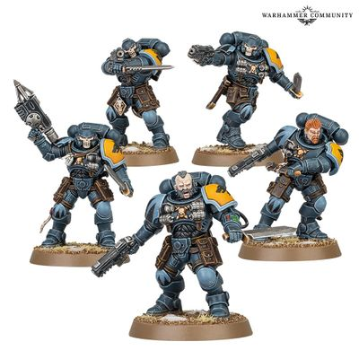

# 0379 莫凯猎犬 Hounds of Morkai

精校状态：中文行文已逐段精校，部分术语仍为暂定

分类：通用概念 / 帝国 Imperium / 中央政务部 Adeptus Terra / 阿斯塔特修会 Adeptus Astartes

原文来源：https://www.bilibili.com/opus/1023969720076861458

原作者：帝国神选罐头

原文时间：2025年01月19日 09:25

[返回分类目录](目录.md) · [全书目录](../../目录.md)

<!-- A0379-B0001 -->
**英文原文**

The Hounds of Morkai are dedicated Space Wolves psyker-hunting packs based upon Reiver Squads. Equipped with runic totems that protect the pack from evil magicks, once they’ve caught the scent of their quarry, the hapless witch is as good as dead.

<!-- /A0379-B0001 -->

<!-- A0379-B0002 -->

原译文

莫凯猎犬是基于掠夺者小队的献身的太空野狼灵能者狩猎队。配备了符文图腾，可以保护队伍免受邪恶魔法的侵害，一旦他们闻到猎物的气味，倒霉的女巫就死定了。

**校订译文**

莫凯猎犬是以掠夺者小队为基础、专门猎杀灵能者的太空野狼部队。符文图腾保护他们免受邪术侵袭；一旦嗅到猎物的踪迹，那名倒霉的巫师便几乎注定了死亡。

**校注：** witch 为对灵能者的贬称，不限定女性，原译“女巫”不当。

<!-- /A0379-B0002 -->

<!-- A0379-B0003 图片 -->

<!-- A0379-B0004 -->

原译文

Hounds of Morkai 莫凯猎犬

**校订译文**

Hounds of Morkai 莫凯猎犬

<!-- /A0379-B0004 -->

<!-- A0379-B0005 -->
**英文原文**

Hounds of Morkai packs go into battle with Heavy Bolt Pistols, Combat Knives, and Grapnel Launchers.

<!-- /A0379-B0005 -->

<!-- A0379-B0006 -->

原译文

莫凯猎犬队装备重型爆矢手枪、战斗刀和抓钩发射器进行作战。

**校订译文**

莫凯猎犬队装备重型爆矢手枪、战斗刀和抓钩发射器进行作战。

<!-- /A0379-B0006 -->

本篇核心术语与暂定项

以下列出本篇出现的英文原形及核心术语表用词。同形词可能指不同对象，具体词义以本篇正文和校注为准；单复数、别名和仅见于图注的名称可能尚未列入。完整候选见[术语表](../../术语表/双语术语候选.csv)。

| 英文 | 采用中文 | 状态 |
| --- | --- | --- |
| Space Wolves | 太空野狼 | 官方已核对 |
| Psyker | 灵能者 | 官方已核对 |
| Reiver | 掠夺者 | 暂定·官方待核 |
| Bolt | 爆矢 | 暂定·官方待核 |
| Heavy Bolt | 重爆矢 | 暂定·官方待核 |

