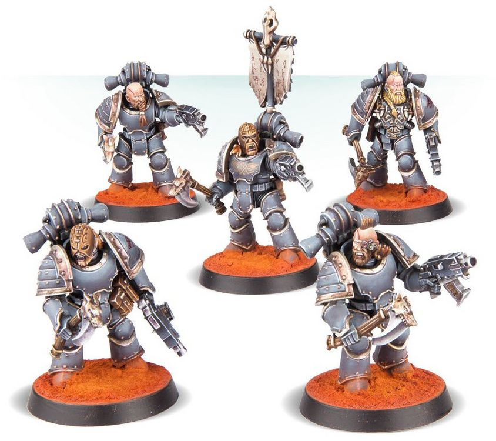
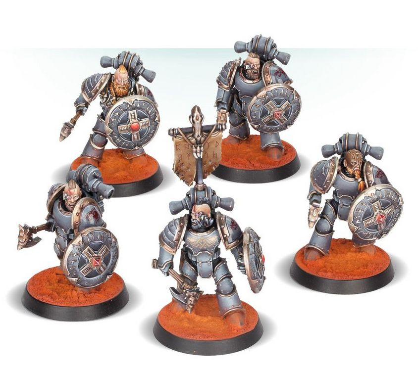

# 0381 灰色屠杀者 Grey Slayer

精校状态：中文行文已逐段精校，部分术语仍为暂定

分类：通用概念 / 帝国 Imperium / 中央政务部 Adeptus Terra / 阿斯塔特修会 Adeptus Astartes

原文来源：https://www.bilibili.com/opus/1023599472393846788

原作者：帝国神选罐头

原文时间：2025年01月18日 09:28

[返回分类目录](目录.md) · [全书目录](../../目录.md)

<!-- A0381-B0001 -->
**英文原文**

Grey Slayers were warriors of the Space Wolves during the Great Crusade and Horus Heresy.

<!-- /A0381-B0001 -->

<!-- A0381-B0002 -->

原译文

灰色屠杀者是大远征和荷鲁斯叛乱时期太空野狼的战士。

**校订译文**

灰色屠杀者是大远征与荷鲁斯之乱期间太空野狼的一种战士。

<!-- /A0381-B0002 -->

<!-- A0381-B0003 图片 -->

<!-- A0381-B0004 -->

原译文

Grey Slayer 灰色屠杀者

**校订译文**

Grey Slayer 灰色屠杀者

<!-- /A0381-B0004 -->

<!-- A0381-B0005 -->
**英文原文**

Unlike the Tactical Squads of the other Legions the Grey Slayers were compact individual warbands of Space Marines, all but autonomous in their own right. They were largely self-reliant and did not depend on direct commands from above, and were experienced enough to deal with many challenges on their own. Like most of the Space Wolves at this time, they specialized in seek and destroy missions. Squads were led by Huscarls.

<!-- /A0381-B0005 -->

<!-- A0381-B0006 -->

原译文

与其他军团的战术小队不同，灰色屠杀者是星际战士的紧凑型独立作战小组，几乎完全自主。他们基本上是自力更生的，不依赖于上级的直接命令，并且有足够的经验独自应对许多挑战。与当时的大多数太空野狼一样，他们专门从事搜寻和摧毁任务。小队由胡斯卡尔领导。

**校订译文**

其他军团设有常规战术小队，灰色屠杀者却组成规模紧凑、几乎完全自主的小战帮。他们大多能自给自足，不必依赖上级逐项下令，凭经验就能独自应对各种挑战。和当时多数太空野狼一样，他们擅长搜索并消灭敌人的任务，小队由王室护卫率领。

<!-- /A0381-B0006 -->

<!-- A0381-B0007 图片 -->

<!-- A0381-B0008 -->

原译文

Grey Slayer with Combat Shields 装备战斗盾的灰色屠杀者

**校订译文**

Grey Slayer with Combat Shields 装备战斗盾的灰色屠杀者

<!-- /A0381-B0008 -->

本篇核心术语与暂定项

以下列出本篇出现的英文原形及核心术语表用词。同形词可能指不同对象，具体词义以本篇正文和校注为准；单复数、别名和仅见于图注的名称可能尚未列入。完整候选见[术语表](../../术语表/双语术语候选.csv)。

| 英文 | 采用中文 | 状态 |
| --- | --- | --- |
| Space Marines | 星际战士 | 官方已核对 |
| Space Wolves | 太空野狼 | 官方已核对 |
| Horus Heresy | 荷鲁斯之乱 | 官方已核对 |
| Great Crusade | 大远征 | 暂定·官方待核 |
| Horus | 荷鲁斯 | 暂定·官方待核 |
| Tactical Squads | 战术小队 | 暂定·官方待核 |

