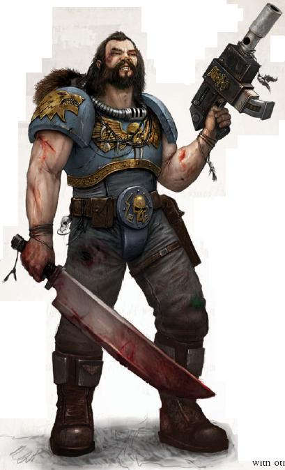
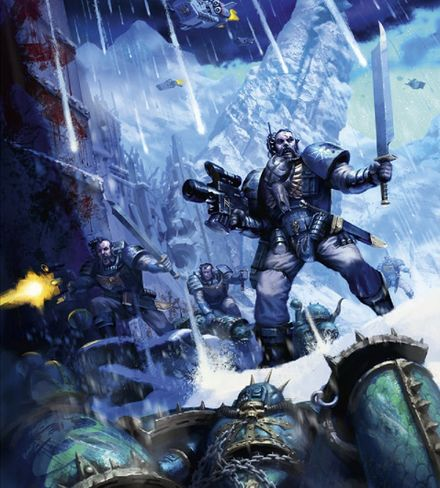
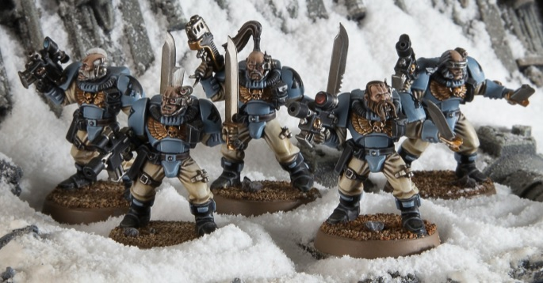

# 0382 狼侦查 Wolf Scout

精校状态：中文行文已逐段精校，部分术语仍为暂定

分类：通用概念 / 帝国 Imperium / 中央政务部 Adeptus Terra / 阿斯塔特修会 Adeptus Astartes

原文来源：https://www.bilibili.com/opus/1036937171236290579

原作者：帝国神选罐头

原文时间：2025年02月23日 08:05

[返回分类目录](目录.md) · [全书目录](../../目录.md)

原篇名：野狼侦察兵 Wolf Scout

<!-- A0382-B0001 -->
**英文原文**

Wolf Scouts are the Space Wolves equivalent to the Scouts of other Space Marine Chapters.

<!-- /A0382-B0001 -->

<!-- A0382-B0002 -->

原译文

野狼侦察兵是太空野狼，相当于其他星际战士战团的侦察兵。

**校订译文**

狼侦查是太空野狼中的侦察部队，相当于其他星际战士战团的侦察兵。

<!-- /A0382-B0002 -->

<!-- A0382-B0003 -->
## Overview 概述

<!-- /A0382-B0003 -->

<!-- A0382-B0004 -->
**英文原文**

They operate as Scouts do in a Codex chapter, working behind the enemy lines to disrupt communications and assassinate enemy leaders. They also track down and spy on enemy forces as well as coordinating and participating in surprise attacks. Some Wolf Scouts have been known to operate behind enemy lines for years at a time.

<!-- /A0382-B0004 -->

<!-- A0382-B0005 -->

原译文

他们的行动就像侦察兵在圣典战团中所做的那样，在敌后破坏通信并暗杀敌方领导人。他们还追踪和监视敌军，协调和参与突袭。众所周知，一些野狼侦察兵一次性在敌后作战多年。

**校订译文**

他们与圣典战团的侦察兵承担相似任务，在敌后破坏通信、暗杀指挥官，也追踪监视敌军、协调并参与突袭。有些狼侦查战士甚至会一次在敌后活动数年。

<!-- /A0382-B0005 -->

<!-- A0382-B0006 图片 -->

<!-- A0382-B0007 -->

原译文

wolf Scout 野狼侦察兵

**校订译文**

wolf Scout 狼侦查

<!-- /A0382-B0007 -->

<!-- A0382-B0008 -->
**英文原文**

In a typical Codex chapter, Scouts are Neophytes who have just been inducted into the chapter and are expected to receive their first taste of battlefield experience using the lighter armour and weaponry suited for reconnaissance and stealth missions. By contrast, a Wolf Scout is already an experienced Marine, usually drawn from the ranks of the Grey Hunters. They are often solitary and brooding by nature, unsuited to the camaraderie found in a typical Wolf Pack, and never happier than when roaming the wilds of the battlefield alone. Although the Wolf Priests often note this quality about them from the earliest days of their acceptance to the chapter, they must still complete their service with the Blood Claws and Grey Hunters, in order to become experienced enough to be entrusted with independence.

<!-- /A0382-B0008 -->

<!-- A0382-B0009 -->

原译文

在一个典型的圣典战团中，侦察兵是刚刚进入该战团的新手，预计他们将使用适合侦察和秘密行动任务的较轻装甲和武器首次体验战场经验。相比之下，野狼侦察兵已经是一名经验丰富的星际战士，通常来自灰猎的队伍。他们往往天生孤独和沉思，不适合典型狼群中的友情，也永远不会比独自在战场的荒野中漫游更快乐。尽管狼牧师从他们被接纳到加入战团的最初几天就经常注意到他们的这种品质，但他们仍然必须完成与血爪和灰猎的服役，才能变得有足够的经验来获得独立。

**校订译文**

在典型圣典战团中，侦察兵通常是刚入团的新兵，使用适合侦察及潜行任务的轻型护甲和武器，积累最初的实战经验。狼侦查却已是经验丰富的星际战士，通常从灰色猎手中选拔。他们天性孤僻寡言，难以融入普通狼群的亲密同袍关系，唯有独自游走战场荒野时才最自在。狼牧师往往在他们刚入团时便察觉这种性情，但他们仍须先历经血爪与灰色猎手的服役，获得足够经验，才能被托付独立行动的任务。

<!-- /A0382-B0009 -->

<!-- A0382-B0010 图片 -->

<!-- A0382-B0011 -->

原译文

Wolf Scouts 野狼侦察兵

**校订译文**

Wolf Scouts 狼侦查

<!-- /A0382-B0011 -->

<!-- A0382-B0012 -->
**英文原文**

Rather than serve in a conventional pack, he is placed under the command of a Wolf Priest who will appoint a Sergeant to train him in the skills he will need to operate effectively in his new role. They are then led by these Sergeants in battle. All of the scouts live together in a great hall in the Fang. Space Wolf Scouts are not assigned to any of the Great Companies. They instead answer directly to the Great Wolf and are under his sole command unless assigned to a Wolf Lord and his company on an-as needed basis.

<!-- /A0382-B0012 -->

<!-- A0382-B0013 -->

原译文

他不是在传统的狼群中服役，而是由狼牧师指挥，狼牧师将任命一名军士来训练他在新角色中有效运作所需的技能。然后，他们在战斗中由这些军士领导。所有的侦察兵都住在长牙堡的一个大厅里。太空野狼侦察兵没有被分配到任何大连。相反，他们直接对头狼负责，除非根据需要分配给狼主和他的连队，否则他们只受头狼的指挥。

**校订译文**

获选后，战士不再随普通狼群服役，而由狼牧师接管，指定军士传授履行新职责所需的技能。此后，这些军士也负责率他们作战。所有狼侦查共同住在长牙堡的一座大厅中，不固定隶属任何大连，直接听命于头狼。只有任务需要时，他们才被配属某位狼主及其大连。

<!-- /A0382-B0013 -->

<!-- A0382-B0014 -->
**英文原文**

Since the introduction of Primaris Space Marines into the Space Wolves, Logan Grimnar has sought to combine these new warriors and their tactics with the ancient customs of Fenris. To that end, Wolf Scouts have taken up the role of Eliminators.

<!-- /A0382-B0014 -->

<!-- A0382-B0015 -->

原译文

自从将原铸星际战士引入太空野狼以来，罗根·格里姆那尔一直试图将这些新战士及其战术与芬里斯的古老习俗相结合。为此，野狼侦察兵承担了歼灭者的角色。

**校订译文**

原铸星际战士加入太空野狼后，洛根·格里姆纳尔试图将新战士及其战法融入芬里斯传统，因而狼侦查也开始担任歼灭者。

<!-- /A0382-B0015 -->

<!-- A0382-B0016 -->
## Wargear 战备

<!-- /A0382-B0016 -->

<!-- A0382-B0017 -->
**英文原文**

Scouts are equipped with Scout armour, and their standard weapons include Bolt pistols and enormous combat knives. Since they are expected to have to engage a wide variety of targets, they may also be issued with rare and priceless plasma pistols and power weapons, as well as frag and krak grenades or melta bombs.

<!-- /A0382-B0017 -->

<!-- A0382-B0018 -->

原译文

侦察兵装备有侦查盔甲，他们的标准武器包括爆矢手枪和巨大的战斗刀。由于预计他们将不得不与各种各样的目标交战，他们还可能获得稀有而无价的等离子手枪和动力武器，以及破片和穿甲手榴弹或热熔炸弹。

**校订译文**

狼侦查身穿侦察甲，标准武器为爆矢手枪与大型战斗刀。由于需要应对多种敌人，他们还可能获配稀有珍贵的等离子手枪及动力武器，以及破片手榴弹、穿甲手榴弹或热熔炸弹。

<!-- /A0382-B0018 -->

<!-- A0382-B0019 图片 -->

<!-- A0382-B0020 -->

原译文

Wolf Scouts 野狼侦察兵

**校订译文**

Wolf Scouts 狼侦查

<!-- /A0382-B0020 -->

<!-- A0382-B0021 -->
**英文原文**

When deployed as a squad, up to one Scout in the squad may be issued with a Flamer, Heavy bolter, Melta gun, Missile launcher, or Plasma gun.

<!-- /A0382-B0021 -->

<!-- A0382-B0022 -->

原译文

当作为一个小队部署时，小队中最多可以向一名侦察兵发放火焰枪、重型爆矢枪、热熔枪、导弹发射器或等离子枪。

**校订译文**

以小队出战时，最多可有一名狼侦查战士携带火焰喷射器、重型爆矢枪、热熔枪、导弹发射器或等离子枪。

<!-- /A0382-B0022 -->

<!-- A0382-B0023 -->
## Notable Wolf Scouts 著名狼侦查

原题：Notable Wolf Scouts 著名野狼侦察兵

<!-- /A0382-B0023 -->

<!-- A0382-B0024 -->

原译文

Olaf Skystalker 奥拉夫天行者

**校订译文**

Olaf Skystalker 奥拉夫·天行者

<!-- /A0382-B0024 -->

本篇核心术语与暂定项

以下列出本篇出现的英文原形及核心术语表用词。同形词可能指不同对象，具体词义以本篇正文和校注为准；单复数、别名和仅见于图注的名称可能尚未列入。完整候选见[术语表](../../术语表/双语术语候选.csv)。

| 英文 | 采用中文 | 状态 |
| --- | --- | --- |
| Space Marines | 星际战士 | 官方已核对 |
| Space Wolves | 太空野狼 | 官方已核对 |
| Fenris | 芬里斯 | 暂定·官方待核 |
| Ancient | 旗手 | 官方已核对 |
| Grey Hunters | 灰色猎手 | 官方已核对 |
| Scout Armour | 侦察护甲 | 暂定·官方待核 |
| Krak Grenades | 穿甲手榴弹 | 暂定·官方待核 |
| Space Marine | 星际战士 | 暂定·官方待核 |
| Chapter | 战团 | 暂定·官方待核 |
| Sergeant | 军士 | 暂定·官方待核 |
| Scout | 侦察兵 | 暂定·官方待核 |
| Logan Grimnar | 洛根·格里姆纳尔 | 官方已核 |
| Codex Chapter | 圣典战团 | 暂定·官方待核 |
| Wolf Priest | 狼牧师 | 官方语境参考·待核 |
| Blood Claws | 血爪 | 官方已核对 |
| Wolf Scouts | 狼侦查 | 官方已核对 |
| Gun | 甘 | 暂定·官方待核 |
| The Blood | 鲜血 | 暂定·官方待核 |
| Missile Launcher | 导弹发射器 | 暂定·官方待核 |
| Bolt | 爆矢 | 暂定·官方待核 |
| Bolter | 爆矢枪 | 暂定·官方待核 |
| Heavy bolter | 重型爆矢枪 | 官方已核对 |
| Flamer | 火焰喷射器（武器）／火妖（奸奇单位） | 语境定译·对应官译已核 |
| Melta Gun | 热熔枪 | 暂定·官方待核 |
| Power Weapons | 动力武器 | 暂定·官方待核 |
| Plasma gun | 等离子枪 | 官方已核对 |

