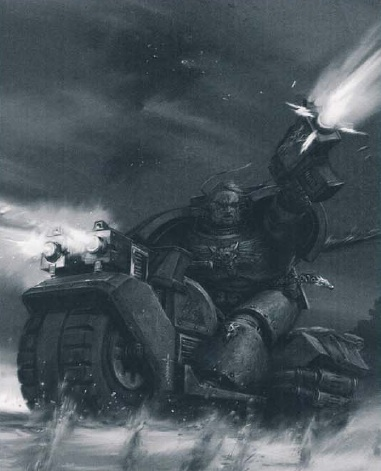
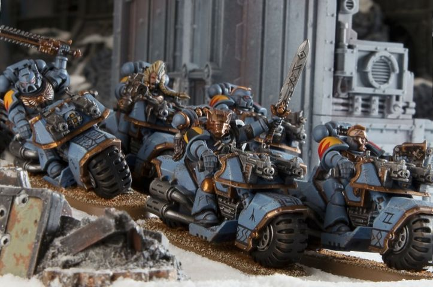

# 0383 迅爪 Swiftclaw

精校状态：中文行文已逐段精校，部分术语仍为暂定

分类：通用概念 / 帝国 Imperium / 中央政务部 Adeptus Terra / 阿斯塔特修会 Adeptus Astartes

原文来源：https://www.bilibili.com/opus/1035086272234782725

原作者：帝国神选罐头

原文时间：2025年02月18日 08:23

[返回分类目录](目录.md) · [全书目录](../../目录.md)

<!-- A0383-B0001 -->
**英文原文**

Swiftclaw Biker Packs are Space Wolf Blood Claws assigned to ride Space Marine Bikes.

<!-- /A0383-B0001 -->

<!-- A0383-B0002 -->

原译文

迅爪摩托队是太空野狼血爪，乘坐星际战士摩托。

**校订译文**

迅爪摩托狼群由获派骑乘星际战士摩托的太空野狼血爪组成。

<!-- /A0383-B0002 -->

<!-- A0383-B0003 图片 -->

<!-- A0383-B0004 -->

原译文

Space Wolves Swiftclaw 太空野狼迅爪

**校订译文**

Space Wolves Swiftclaw 太空野狼迅爪

<!-- /A0383-B0004 -->

<!-- A0383-B0005 -->
## Overview 概述

<!-- /A0383-B0005 -->

<!-- A0383-B0006 -->
**英文原文**

Unlike most Space Marine riders, who use their bikes for reconnaissance, the Swiftclaws' main roles are demolitions and close assault operations. Blood Claws are by nature eager for battle, and many are so intoxicated with the power and speed of a Space Marine Bike that they demand permanent assignment to a Swiftclaw Pack. Swiftclaws are sometimes assigned to a dangerous mission that demands speed and daring, such as navigating a treacherous stretch of land in pursuit of a hated enemy, or to rescue a lost chapter relic ahead of a closing enemy force.

<!-- /A0383-B0006 -->

<!-- A0383-B0007 -->

原译文

与大多数使用摩托进行侦察的星际战士骑手不同，迅爪的主要任务是拆除和近距离突击行动。血爪天生渴望战斗，许多人对星际战士摩托的力量和速度如此着迷，以至于他们要求永久分配到迅爪队。迅爪有时被分配到一项需要速度和勇气的危险任务中，例如在一片危险的土地上行驶以追捕一个仇恨之敌，或者在一支正在逼近的敌军之前营救一个丢失的战团圣物。

**校订译文**

多数星际战士骑手以摩托执行侦察，迅爪的主要任务却是爆破与近距离突击。血爪生性好战，许多人沉迷于星际战士摩托的力量和速度，主动要求永久留在迅爪狼群。有时，他们会受命执行需要速度与胆量的危险任务，例如穿越险恶地形追杀宿敌，或赶在逼近的敌军之前抢回失落的战团圣物。

<!-- /A0383-B0007 -->

<!-- A0383-B0008 图片 -->

<!-- A0383-B0009 -->

原译文

Swiftclaws 迅爪

**校订译文**

Swiftclaws 迅爪

<!-- /A0383-B0009 -->

<!-- A0383-B0010 -->
**英文原文**

With their enhanced senses, and their survival experience (standard for any native of Fenris), Swiftclaws can spend months on a long-range hunting mission, without needing resupply. On such missions they are often accompanied by Fenrisian Wolves. When the time comes for them to strike, Swiftclaws have only one rule: that their objective be achieved with as much fanfare as possible. To this end, Swiftclaws can be equipped with melta bombs, krak grenades, and bolt pistols. One of their favored tactics is to set fire to their enemy's stronghold, then ride straight to the center, boltguns blazing.

<!-- /A0383-B0010 -->

<!-- A0383-B0011 -->

原译文

凭借其增强的感官和生存经验（对任何芬里斯本地人来说都是标准的），迅爪可以在不需要补给的情况下进行数月的远程狩猎任务。在执行此类任务时，他们经常由芬里斯狼陪同。当他们发动攻击的时候，迅爪只有一个规则：尽可能大张旗鼓地实现他们的目标。为此，迅爪可以配备热熔炸弹、穿甲手榴弹和爆矢手枪。他们最喜欢的战术之一是放火烧敌人的据点，然后径直冲到中心让爆矢枪轰鸣。

**校订译文**

凭借强化感官与每个芬里斯人都熟悉的野外生存本领，迅爪能够持续执行数月的远程狩猎任务，无须补给。芬里斯狼常伴随他们同行。到了出击时，迅爪只有一条准则：把声势闹得越大越好。他们可携带热熔炸弹、穿甲手榴弹及爆矢手枪；最喜爱的战术之一，就是先点燃敌人据点，再一路以爆矢枪扫射，径直冲入中心。

<!-- /A0383-B0011 -->

本篇核心术语与暂定项

以下列出本篇出现的英文原形及核心术语表用词。同形词可能指不同对象，具体词义以本篇正文和校注为准；单复数、别名和仅见于图注的名称可能尚未列入。完整候选见[术语表](../../术语表/双语术语候选.csv)。

| 英文 | 采用中文 | 状态 |
| --- | --- | --- |
| Fenris | 芬里斯 | 暂定·官方待核 |
| Assignment | 灵能分级 | 暂定·官方待核 |
| Mission | 教团／传教机构 | 暂定 |
| Krak Grenades | 穿甲手榴弹 | 暂定·官方待核 |
| Space Marine | 星际战士 | 暂定·官方待核 |
| Chapter | 战团 | 暂定·官方待核 |
| Blood Claws | 血爪 | 官方已核对 |
| Fenrisian Wolves | 芬里斯狼 | 官方已核对 |
| Bikes | 摩托 | 暂定·官方待核 |
| Bolt | 爆矢 | 暂定·官方待核 |

