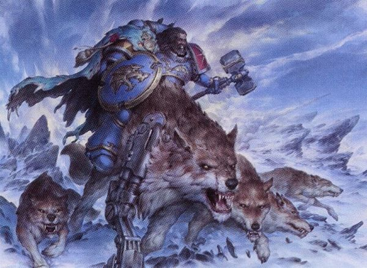
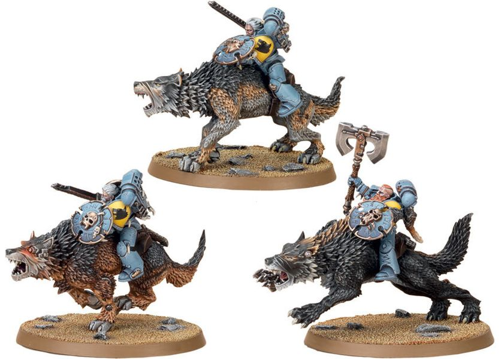

# 0384 雷狼骑兵 Thunderwolf Cavalry

精校状态：中文行文已逐段精校，部分术语仍为暂定

分类：通用概念 / 帝国 Imperium / 中央政务部 Adeptus Terra / 阿斯塔特修会 Adeptus Astartes

原文来源：https://www.bilibili.com/opus/1035980102183157762

原作者：帝国神选罐头

原文时间：2025年02月20日 18:11

[返回分类目录](目录.md) · [全书目录](../../目录.md)

<!-- A0384-B0001 -->
**英文原文**

The Thunderwolf Cavalry are a small elite unit of the Space Wolves, who ride massive Fenrisian Thunderwolves into battle. These warriors do not appear in any official Imperial records, and are seen so rarely in combat as to be considered almost mythical. The Space Wolves continue to officially deny the existence of these cavalry.

<!-- /A0384-B0001 -->

<!-- A0384-B0002 -->

原译文

雷狼骑兵是太空野狼的一个小型精英部队，他们骑着巨大的芬里斯雷狼进入战斗。这些战士没有出现在任何官方的帝国记录中，在战斗中也很少见到，几乎被认为是神话。太空野狼继续正式否认这些骑兵的存在。

**校订译文**

雷狼骑兵是太空野狼的一支小型精锐部队，骑乘巨大的芬里斯雷狼作战。帝国正式档案没有他们的记录，战场上也极少有人目睹其踪影，几乎被当作传说。太空野狼始终在正式场合否认这类骑兵存在。

<!-- /A0384-B0002 -->

<!-- A0384-B0003 图片 -->

<!-- A0384-B0004 -->

原译文

Thunderwolf Cavalry 雷狼骑兵

**校订译文**

Thunderwolf Cavalry 雷狼骑兵

<!-- /A0384-B0004 -->

<!-- A0384-B0005 -->
## Overview 概述

<!-- /A0384-B0005 -->

<!-- A0384-B0006 -->
**英文原文**

Thunderwolves are truly monstrous animals: they can grow as high as eight feet at the shoulder, their thick fur is as dense as steel wire, and their jaws, filled with enormous and rapidly replaceable teeth, can chew through steel. They are solitary by nature, attacking each other on sight, as if each one is seeking dominance over all other wolves on the planet.

<!-- /A0384-B0006 -->

<!-- A0384-B0007 -->

原译文

雷狼是真正可怕的动物：它们可以长到八英尺高的肩膀，它们厚厚的皮毛像钢铁丝线一样浓密，它们的下巴上长满了巨大且可快速更换的牙齿，可以咀嚼钢铁。它们天生孤独，一见面就互相攻击，仿佛每只狼都在寻求对星球上所有其他狼的统治。

**校订译文**

雷狼是真正的巨兽，肩高可达八英尺，厚密毛皮宛如钢丝，巨颚中的硕大牙齿生长更替极快，能够咬穿钢铁。它们天性独居，彼此相遇便会攻击，仿佛每一头都想凌驾于星球所有狼类之上。

<!-- /A0384-B0007 -->

<!-- A0384-B0008 -->
**英文原文**

According to rumour, capturing and "breaking in" a Thunderwolf is an initiation rite among the upper ranks of the Wolf Guard, and some of these warriors have demonstrated enough control over their wolves to tame them as war mounts, which are often augmented with adamantium jaws, hydraulic strength enhancements, and razor-sharp metal claws.

<!-- /A0384-B0008 -->

<!-- A0384-B0009 -->

原译文

据传闻，捕获并“磨合”雷狼是野狼守卫高层的入门仪式，其中一些战士已经表现出对狼的足够控制，可以将它们驯服为战马，通常配有精金下颚、液压增强和锋利的金属爪。

**校订译文**

据说，捕捉并驯服雷狼是野狼守卫高阶成员的一种入选仪式。部分战士能够彻底控制雷狼，将其驯为战斗坐骑，再装上精金颌骨、液压强化装置及锋利的金属爪。

<!-- /A0384-B0009 -->

<!-- A0384-B0010 图片 -->

<!-- A0384-B0011 -->

原译文

Thunderwolf Cavalry 雷狼骑兵

**校订译文**

Thunderwolf Cavalry 雷狼骑兵

<!-- /A0384-B0011 -->

<!-- A0384-B0012 -->
**英文原文**

At least one high-quality vid-steal exists of Thunderwolf Cavalry riding in battle against a mob of heavily-armoured Ork Nobz.

<!-- /A0384-B0012 -->

<!-- A0384-B0013 -->

原译文

至少有一段高质量的影像记录是雷狼骑兵在与全副武装的重装欧克老大作战时拍摄的。

**校订译文**

至少有一段清晰的秘密摄录影像，拍下了雷狼骑兵对抗大群重甲欧克强蛮人的场面。

<!-- /A0384-B0013 -->

<!-- A0384-B0014 -->
**英文原文**

In 954.M41, Logan Grimnar detailed his elite Thunderwolf riders to hunt down the enormous and terrible Abomination of Cyriax, terrorizing Hive Necros. Though only glimpsed, the legend of giant warriors riding metal-skinned wolf-daemons spread across the entire planet.

<!-- /A0384-B0014 -->

<!-- A0384-B0015 -->

原译文

954.M41，洛根·格里姆那尔详细介绍了他的精英雷狼骑士追捕巨大而可怕的西里亚克斯恶煞，恐吓内克罗斯巢都。虽然只是一瞥，但巨人战士骑着金属披皮狼魔的传说传遍了整个星球。

**校订译文**

M41.954，洛根·格里姆纳尔派遣精锐雷狼骑手，追杀肆虐内克罗斯巢都的巨大怪物“西里亚克斯恶煞”。居民虽只曾匆匆瞥见骑手，巨人驾驭金属皮肤狼魔的传说却已传遍整颗星球。

**校注：** detailed 在军事语境中指派遣；原译“详细介绍”错误。terrorizing Hive Necros 的主语是怪物，不是雷狼骑兵。

<!-- /A0384-B0015 -->

本篇核心术语与暂定项

以下列出本篇出现的英文原形及核心术语表用词。同形词可能指不同对象，具体词义以本篇正文和校注为准；单复数、别名和仅见于图注的名称可能尚未列入。完整候选见[术语表](../../术语表/双语术语候选.csv)。

| 英文 | 采用中文 | 状态 |
| --- | --- | --- |
| Space Wolves | 太空野狼 | 官方已核对 |
| Logan Grimnar | 洛根·格里姆纳尔 | 官方已核 |
| Thunderwolf Cavalry | 雷狼骑兵 | 官方已核对 |
| Nobz | 强蛮人 | 官方已核对 |
| Mob | 战群（欧克组织） | 暂定·官方待核 |
| Wolf Guard | 野狼守卫 | 官方词根参考·通称待核 |

