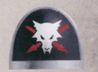
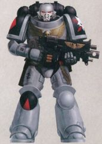
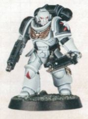
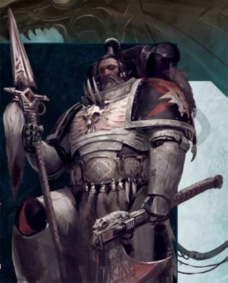
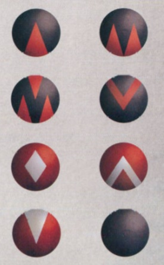

# 0385 狼矛 Wolfspear

精校状态：中文行文已逐段精校，部分术语仍为暂定

分类：通用概念 / 帝国 Imperium / 中央政务部 Adeptus Terra / 阿斯塔特修会 Adeptus Astartes

原文来源：https://www.bilibili.com/opus/1172433936192634887

原作者：帝国神选罐头

原文时间：2026年02月23日 11:22

[返回分类目录](目录.md) · [全书目录](../../目录.md)

<!-- A0385-B0001 -->
**英文原文**

The Wolfspear are a Space Wolves Successor Chapter.

<!-- /A0385-B0001 -->

<!-- A0385-B0002 -->

原译文

狼矛是太空野狼的子战团。

**校订译文**

狼矛是太空野狼的子战团。

<!-- /A0385-B0002 -->

<!-- A0385-B0003 图片 -->

<!-- A0385-B0004 图片 -->

<!-- A0385-B0005 图片 -->

<!-- A0385-B0006 -->
**英文原文**

Founding Chapter:Space Wolves

<!-- /A0385-B0006 -->

<!-- A0385-B0007 -->

原译文

建军战团：太空野狼

**校订译文**

母团：太空野狼

<!-- /A0385-B0007 -->

<!-- A0385-B0008 -->
**英文原文**

Founding:Ultima Founding

<!-- /A0385-B0008 -->

<!-- A0385-B0009 -->

原译文

建军：极限建军

**校订译文**

建军：极限建军

<!-- /A0385-B0009 -->

<!-- A0385-B0010 -->
**英文原文**

Chapter Master:Irik Stianolf

<!-- /A0385-B0010 -->

<!-- A0385-B0011 -->

原译文

战团长：伊里克·斯蒂安诺夫

**校订译文**

战团长：伊里克·斯蒂安诺夫

<!-- /A0385-B0011 -->

<!-- A0385-B0012 -->
**英文原文**

Homeworld:Ulvheim or Fleet-Based

<!-- /A0385-B0012 -->

<!-- A0385-B0013 -->

原译文

家园世界：乌尔夫海姆或舰基

**校订译文**

家园世界：乌尔夫海姆；另有资料称战团依托舰队行动。

<!-- /A0385-B0013 -->

<!-- A0385-B0014 -->
**英文原文**

Fortress-Monastery:None; each Company operates from their own Strike Cruiser

<!-- /A0385-B0014 -->

<!-- A0385-B0015 -->

原译文

要塞修道院：无；每个连队都在各自的打击巡洋舰上运行

**校订译文**

要塞修道院：无固定所在，各连以自己的打击巡洋舰为基地。

<!-- /A0385-B0015 -->

<!-- A0385-B0016 -->
**英文原文**

Colours:White grey armour, red shoulder pads and knee pads

<!-- /A0385-B0016 -->

<!-- A0385-B0017 -->

原译文

颜色：白灰色盔甲，红色肩甲和膝甲

**校订译文**

颜色：白灰色盔甲，红色肩甲和膝甲

<!-- /A0385-B0017 -->

<!-- A0385-B0018 -->
**英文原文**

Specialty:Hunting, Stealth, Precision Strikes

<!-- /A0385-B0018 -->

<!-- A0385-B0019 -->

原译文

专长：追捕、秘密行动、精准打击

**校订译文**

专长：追捕、秘密行动、精准打击

<!-- /A0385-B0019 -->

<!-- A0385-B0020 -->
**英文原文**

Strength:7 Great Companies

<!-- /A0385-B0020 -->

<!-- A0385-B0021 -->

原译文

力量：七个大连

**校订译文**

兵力编制：七个大连

<!-- /A0385-B0021 -->

<!-- A0385-B0022 -->
## History 历史

<!-- /A0385-B0022 -->

<!-- A0385-B0023 -->
**英文原文**

The Wolfspear were created from Space Wolves members of the Unnumbered Sons, 500 marines who survived the Battle of Raukos. That battle concluded the Indomitus Crusade and the Chapter was then charged by Lord Commander Guilliman, with guarding the Pit of Raukos from any future Chaos incursions. This was to the dismay of some members of the Wolfspear, who had hoped to continue fighting on the front-lines against the Imperium's enemies. Further clouding the minds of the Chapter, was that although the Space Wolves had allowed Primaris Space Marines into their ranks, it was not known if they would accept the Wolfspear as true Sons of Russ

<!-- /A0385-B0023 -->

<!-- A0385-B0024 -->

原译文

狼矛是由劳科斯之战中幸存的500名未计之子战士的太空野狼成员创建的。那场战斗结束了不屈远征，然后该战团由领主指挥官基里曼命令，负责守卫劳科斯深坑，防止未来任何混沌入侵。这让狼矛的一些成员感到沮丧，他们希望继续在前线与帝国之敌作战。让战团更加困惑的是，尽管太空野狼允许原铸星际战士加入他们的队伍，但尚不清楚他们是否会接受狼矛作为真正的鲁斯之子

**校订译文**

狼矛由未计之子中五百名太空野狼血脉的战士组建，他们都是劳科斯战役的幸存者。按本段采用的记述，这场战斗标志着不屈远征结束；领主指挥官基里曼随后命令新战团守卫劳科斯深坑，抵御今后的混沌入侵。这令部分成员失望，因为他们原本希望继续在前线征战。另一层忧虑是：太空野狼虽已接纳原铸星际战士，却未必会承认狼矛是真正的鲁斯之子。

**校注：** 本段将劳科斯战役视作不屈远征终点，反映所引旧版叙述；本篇末尾也明确存在版本冲突，不依据后出设定重写此处时间线。

<!-- /A0385-B0024 -->

<!-- A0385-B0025 -->
**英文原文**

Guilliman personally arrived at Fenris at the head of an Indomitus Crusade Fleet to bring the Grey Shields before the Wolves. He proposed that while some would join the Space Wolves proper, others would form their own independent chapter. This brought fierce debate throughout The Fang, for many distrusted these warriors they had never met or fought beside and had never been exposed to the cultures and dangers of Fenris. Gunnar Red Moon was among the most noted opponents of the new arrivals, stating he would rather fight alongside a dozen true Space Wolves than a hundred others who he had never feasted aside. Ultimately Great Wolf Logan Grimnar ended the debate by issuing the Kin-pack Declaration. This was a formal recognition of the Space Wolves successors that stated whether they were forged in the Fang or otherwise all of the lineage of Leman Russ were to be considered his sons. However, he also stated that the new Greyshields must prove themselves in battle or face the scorn of their brothers and that all of the newcomers joining the Space Wolves must uphold the ancient traditions of the Chapter. Thus each Primaris squad became a pack and they took up roles as Blood Claws, Grey Hunters, and so on depending upon their strength and experience.

<!-- /A0385-B0025 -->

<!-- A0385-B0026 -->

原译文

基里曼亲自率领不屈远征舰队抵达芬里斯，将灰盾带到野狼面前。他提议，虽然有些人将加入太空野狼，但其他人将成立自己的独立战团。这在长牙堡引起了激烈的争论，因为许多人不信任这些他们从未见过或并肩作战的战士，也从未接触过芬里斯的文化和危险。贡纳·红月是对新来者最著名的反对者之一，他说他宁愿和十几名真正的太空野狼并肩作战，也不愿和一百名他从未宴请过的其他人并肩作战。最终，头狼罗根·格里姆纳尔发表了亲族宣言，结束了这场辩论。这是对太空野狼子战团的正式承认，声明他们是在长牙堡铸造的，除此以外黎曼·鲁斯的所有血裔都被视为他的子嗣。然而，他还表示，新的灰盾必须在战斗中证明自己，否则将面临兄弟们的蔑视，所有加入太空野狼的新成员都必须坚持战团的古老传统。因此，每个原铸小队都变成了一个狼队，他们根据自己的实力和经验担任了血爪、灰猎等角色。

**校订译文**

基里曼亲率一支不屈远征舰队抵达芬里斯，将灰盾战士带到太空野狼面前，建议一部分直接加入母团，另一部分成立独立子战团。这引发长牙堡内的激烈争论：许多野狼不信任这些从未谋面、从未并肩作战，也未体验过芬里斯文化与险恶环境的外来者。加纳·红月是最坚决的反对者之一，声称宁可与十二名真正的太空野狼同行，也不愿带上一百名从未共同宴饮的陌生人。最终，头狼洛根·格里姆纳尔发表“亲族宣言”，结束争执，正式承认太空野狼的子战团：无论在长牙堡还是别处受造，只要继承黎曼·鲁斯的血脉，便都是他的子嗣。不过，新灰盾仍须以战功证明自己，否则就要承受同袍的鄙视；加入太空野狼本团者，也必须遵守古老传统。于是，每支原铸小队改编为狼群，按实力与经验担任血爪、灰色猎手等角色。

<!-- /A0385-B0026 -->

<!-- A0385-B0027 图片 -->

<!-- A0385-B0028 -->

原译文

Member of the Wolfspear 狼矛的成员

**校订译文**

Member of the Wolfspear 狼矛的成员

<!-- /A0385-B0028 -->

<!-- A0385-B0029 -->
**英文原文**

The Wolfspear was created shortly after this declaration, a chapter made to be "cast like a javelin" into Imperium Nihilus, while also evoking the legendary Spear of Russ. Initially an under-strength fleet-based force which combined both Indomitus Crusade Primaris and new Initiates of the Space Wolves upon Fenris, these first warriors showed clear signs of their ancestry such as the pointed fangs typical of the Canis Helix. Erik Morkai was struck by the focus and killer instinct the Wolfspear displayed during their earliest campaigns, and also gained the favour of Logan Grimnar himself. The Great Wolf even provided a number of veterans from his own Great Company to the Wolfspear of which some would go on to form the first Veterans of the Chapter, while others would become Initiates. This helped forge a closer bond between the Space Wolves and Wolfspear.

<!-- /A0385-B0029 -->

<!-- A0385-B0030 -->

原译文

狼矛是在这一宣言后不久创建的，这一战团被“像标枪一样投掷”到帝国暗面中，同时也唤起了传说中的鲁斯之矛。最初是一支力量不足的舰基部队，结合了不屈远征的原铸和芬里斯上的太空野狼新兵，这些第一批战士表现出了他们先祖的明显迹象，如狼之螺旋典型的尖牙。埃里克·莫凯被狼矛在早期战役中表现出的专注和杀手本能所打动，也得到了罗根·格里姆纳尔本人的青睐。头狼甚至从他自己的大连中为狼矛提供了许多老兵，其中一些人将继续组成该战团的第一批老兵，而另一些人将成为新兵。这有助于在太空野狼和狼矛之间建立更紧密的联系。

**校订译文**

亲族宣言发表后不久，狼矛成立，旨在像一支标枪般被掷入帝国暗面，其名称也呼应传说中的鲁斯之矛。最初，他们是一支兵力不足、依托舰队行动的部队，混编不屈远征中的原铸战士，以及芬里斯上太空野狼的新兵。首批成员已展现明显的血脉特征，例如狼之螺旋带来的尖长犬齿。狼矛早期作战时的专注与猎杀本能，打动了埃里克·莫凯，也赢得洛根·格里姆纳尔本人的青睐。头狼甚至从自己的大连派出一批老兵支援；原稿称，其中一些成为狼矛最早的老兵骨干，另一些则成为见习者。这进一步拉近了母团与狼矛之间的联系。

**校注：** 英文明确写老兵中 some ... first Veterans，others would become Initiates，身份转变含混。暂按“见习者”保留，并显式归于原稿；不能无据补成牧师或药剂师学徒。

<!-- /A0385-B0030 -->

<!-- A0385-B0031 -->
**英文原文**

The earliest campaigns of the Wolfspear saw them acting as vanguards ranging ahead of Indomitus Crusade offensives. However when they felt they were needed most in Imperium Nihilus, all 7 Jarldoms gathered under their very first elected High Jarl Irik Stianolf at the Nachmund Gauntlet. Carving momentous oaths upon their blades and armour and howling the Wolf King's name, they embarked into the abyss. What has since become of them can only be gleaned from fragments and echoes. What is certain is that their fleets have since become separated and that they now stalk the Emperor's foes in numerous sectors away from the light of the Astronomican.

<!-- /A0385-B0031 -->

<!-- A0385-B0032 -->

原译文

狼矛最早的战役中，他们充当了不屈远征进攻的先锋。然而，当他们觉得在帝国暗面最需要他们时，所有7个酋长连都聚集在他们第一位当选的高酋长伊里克·斯蒂安诺夫手下，在纳克蒙德走廊。他们在刀刃和盔甲上刻下了庄严的誓言，嚎叫着狼王的名字，踏上了深渊。他们后来的样子只能从碎片和回响中收集。可以肯定的是，他们的舰队已经分开，现在他们在远离星炬之光的许多星区跟踪帝皇之敌。

**校订译文**

早期作战中，狼矛担任不屈远征的先遣部队，活动在主力攻势之前。后来，他们认为帝国暗面最需要自己，便在首任当选高酋长伊里克·斯蒂安诺夫麾下，于纳克蒙德走廊集结全部七个酋长连。他们将庄严誓言刻在武器与盔甲上，高呼狼王之名，驶入深渊。此后的经历只剩零星传闻可寻；可以确定的是，各支舰队已彼此分散，如今在星炬光芒无法照及的多个星区猎杀帝皇之敌。

<!-- /A0385-B0032 -->

<!-- A0385-B0033 -->
**英文原文**

An early mission of the Wolfspear was to garrison Ulvheim and watch over the Pit of Raukos Warp Rift. This later proved decisive to the Indomitus Crusade, as the region lay near the Attilan Gap into Imperium Nihilus. They watched over the Pylon network of Belisarius Cawl as he attempted to stabilize the Gap, resulting in an Invasion of Ulvheim by the forces of Vashtorr. However the Imperials were successful in defending Ulvheim and activating the Pylon network, sealing the Pit of Raukos and stabilizing the Attilan Gate.

<!-- /A0385-B0033 -->

<!-- A0385-B0034 -->

原译文

狼矛的早期任务是驻守乌尔夫海姆并监视劳科斯亚空间裂缝深坑。这后来被证明对不屈远征具有决定性意义，因为该地区位于进入帝国暗面的阿提兰裂口附近。当贝利撒留·考尔试图稳定裂口时，他们监视着他的方尖碑网络，导致瓦什托尔的部队入侵了乌尔夫海姆。然而，帝国成功地保卫了乌尔夫海姆，激活了方尖碑网络，封锁了劳科斯深坑，稳定了阿提兰之门。

**校订译文**

狼矛早期曾受命驻守乌尔夫海姆，监视劳科斯深坑这道亚空间裂隙。由于该地区邻近通往帝国暗面的阿提兰裂口，这项任务后来对不屈远征产生了决定性影响。贝利萨留斯·考尔试图稳定裂口时，狼矛守护其方尖碑网络；这引来了瓦什托尔麾下部队对乌尔夫海姆的入侵。帝国最终守住星球并启动网络，封闭劳科斯深坑，稳定了阿提兰之门。

<!-- /A0385-B0034 -->

<!-- A0385-B0035 -->
## Known Campaigns 已知战役

<!-- /A0385-B0035 -->

<!-- A0385-B0036 -->
**英文原文**

M42 - Taking part in the war for Death of Bianzeer against Hive Fleet Leviathan.

<!-- /A0385-B0036 -->

<!-- A0385-B0037 -->

原译文

参加了边泽尔之死与对抗虫巢舰队利维坦的战争。

**校订译文**

M42：参加边泽尔之死战事，对抗利维坦虫巢舰队。

<!-- /A0385-B0037 -->

<!-- A0385-B0038 -->
**英文原文**

M42 - Nachmund Rift War. Strike Force Drengr's Brethren took part in the defense of Sangua Terra.

<!-- /A0385-B0038 -->

<!-- A0385-B0039 -->

原译文

纳克蒙德裂隙战争。打击部队勇士兄弟会参与了赤地星的防御。

**校订译文**

M42：纳克蒙德裂隙战争。勇士兄弟会打击部队参加赤地星防御战。

<!-- /A0385-B0039 -->

<!-- A0385-B0040 -->
**英文原文**

~015.M42 - Battle of Ulvheim. The Wolfspear homeworld of Ulvheim was assailed by the forces of Vashtorr.

<!-- /A0385-B0040 -->

<!-- A0385-B0041 -->

原译文

乌尔夫海姆之战。狼矛的家园世界乌尔夫海姆遭到了瓦什托尔部队的袭击。

**校订译文**

约 M42.015：乌尔夫海姆之战。狼矛母星乌尔夫海姆遭瓦什托尔部队进攻。

<!-- /A0385-B0041 -->

<!-- A0385-B0042 -->
## Organization and Tactics 组织与战术

<!-- /A0385-B0042 -->

<!-- A0385-B0043 -->
**英文原文**

The Wolfspear are divided into 7 Great Companies known as Jarldoms, each commanded by an elected Jarl. These trace their origin to the earliest engagements fought by the Greyshields who were later sworn to the Wolfspear. Battle by battle, they gradually gathered into seven hunting packs, each small and agile enough to pursue elusive targets and fight on the move. Never recognized officially while attached to the Indomitus Crusade, these seven packs grew tighter as they hunted and bled together and were later formally recognized by Logan Grimnar upon their formation. Each Jarldom is at least equal to the fighting strength of a Codex Astartes company. Each of these Companies operates out of a small flotilla headed by a commanding Strike Cruiser and is fully autonomous, though they often work together for greater goals. This system has lead to subtle variations of culture and fighting style amongst the various roaming fleets.

<!-- /A0385-B0043 -->

<!-- A0385-B0044 -->

原译文

狼矛分为7个大连，称为酋长连，每个连队都由一名当选的酋长指挥。这些可以追溯到灰盾最早的战斗，他们后来宣誓效忠于狼矛。一战接一战，他们逐渐聚集成七个狩猎队，每个狩猎队都足够小和敏捷，可以追逐难以捉摸的目标并在移动中作战。在不屈远征期间从未被正式承认，这七个狼队在一起狩猎和流血时变得越来越紧密，后来在形成后被罗根·格里姆纳尔正式承认。每个酋长连至少相当于阿斯塔特圣典连队的战斗力。这些连队中的每一个都由一艘指挥打击巡洋舰率领的小型舰队运作，并且是完全自主的，尽管他们经常为了更大的目标而合作。这种制度导致了各个漫游舰队之间文化和战斗风格的微妙变化。

**校订译文**

狼矛分为七个称作“酋长连”的大连，各由一位选举产生的酋长指挥。其源头可追溯至后来加入狼矛的灰盾战士最初参加的战斗。他们在一次次交战中渐渐聚成七个猎群，每个猎群都足够精干灵活，能追击难以捕捉的敌人，并在机动中作战。虽然不屈远征期间从未被正式认可，这七个群体却在共同狩猎与流血中日益紧密，直至战团成立后获洛根·格里姆纳尔正式承认。每个酋长连的战斗力至少相当于一个圣典连，以一艘旗舰打击巡洋舰领衔的小型舰队为基地，完全自主行动，也常为共同目标协作。这种制度使各支游猎舰队的文化与战法逐渐出现细微差别。

<!-- /A0385-B0044 -->

<!-- A0385-B0045 图片 -->

<!-- A0385-B0046 -->

原译文

The markings of the 7 Jarldoms of the Wolfspear 狼矛的7个酋长连的标记

**校订译文**

The markings of the 7 Jarldoms of the Wolfspear 狼矛的7个酋长连的标记

<!-- /A0385-B0046 -->

<!-- A0385-B0047 -->
**英文原文**

Due to their wide-ranging nature and fighting style, the Chapter is highly decentralized. Each Jarl is largely independent, though he is overseen and consulted by a number of Wolf Priests, Rune Priests, and Iron Priests that follow him. Only in times of utmost need do they need a higher authority to govern their actions, and in these times a High Jarl is nominated from amongst the seven.

<!-- /A0385-B0047 -->

<!-- A0385-B0048 -->

原译文

由于覆盖广的性质和战斗风格，战团高度分散。每个酋长在很大程度上都是独立的，尽管他受到许多跟随他的狼牧师、符文牧师和钢铁牧师的监督和咨询。只有在最需要的时候，他们才需要一个更高的权威来管理他们的行为，在这些时候，从七个人中提名一个高酋长。

**校订译文**

由于活动范围辽阔、作战方式灵活，狼矛的权力高度分散。各酋长基本独立，随行的狼牧师、符文牧师及钢铁牧师则提供监督与建议。只有极端需要统一指挥时，七位酋长才会从彼此之中推举一位高酋长，统筹行动。

<!-- /A0385-B0048 -->

<!-- A0385-B0049 -->
**英文原文**

The Wolfspear are prolific hunters with strong hunter instincts, often ranging far in advance of Indomitus Crusade fleets. The Chapter's various companies will mercilessly and relentlessly pursue foes, who they hunt via a "scent" that can come in the form of a psychic ripple or clues left in the wake of an enemy's destructive rampages. Whatever they use to trace their opponents, they will use careful stealth and reconnaissance to observe their foes behavior before striking at the enemies weakness. Infiltrator packs excel in this role, which are then followed by Eliminator packs to begin a campaign of terror to sow panic and confusion with long-ranged assassinations from the shadows. After the enemy is wrong-footed and bleeding, the full Wolfspear attack begins. They prefer to utilize speed and surprise for this role, employing large amounts of Outriders and swift gravitic transports to strike form multiple angles. Thunderwolf Cavalry and other close support packs then close in to encircle their isolated foes and deliver the killing blow. In void battle, the Wolfspear employ similar tactics.

<!-- /A0385-B0049 -->

<!-- A0385-B0050 -->

原译文

狼矛多产猎手，有着强烈的狩猎本能，通常远远领先于不屈远征舰队。战团的各个连队将无情地追猎敌人，他们通过一种“气味”来追捕敌人，这种气味可能以灵能涟漪或敌人破坏性暴行后留下的线索的形式出现。无论他们用什么来追踪对手，他们都会使用谨慎的秘密行动和侦察来观察敌人的行为，然后再攻击敌人的弱点。渗透者队在这个作用中表现出色，然后是歼灭者队，开始一场恐惧战役，通过阴影中的远程暗杀来散布恐慌和混乱。在敌人措手不及流血后，狼矛的全面进攻开始了。他们更喜欢利用速度和意外来担任这个角色，使用大量的先遣者和快速重力运输车从多个角度进行打击。雷狼骑兵和其他近战支援部队随后靠近，包围他们孤立的敌人，并给予致命一击。在虚空战中，狼矛采用了类似的战术。

**校订译文**

狼矛是经验丰富、本能敏锐的猎手，常远出于不屈远征舰队之前。各连循着敌人的“气味”穷追不舍；所谓气味，可能是灵能涟漪，也可能是敌人肆虐后留下的线索。他们总会先谨慎潜行、侦察敌情，观察敌人的行为，再选其薄弱处下手。渗透者狼群最擅长此道，随后歼灭者狼群便从阴影中远距离暗杀，散播恐惧与混乱。敌军惊慌失措、不断流血后，狼矛才展开全面进攻。他们重视速度与突然性，投入大量摩托警卫及快速反重力运输载具，从多个方向突击；雷狼骑兵与其他近战支援狼群随后合围被孤立的敌军，予以致命一击。虚空战中，他们也采用类似战术。

<!-- /A0385-B0050 -->

<!-- A0385-B0051 -->
**英文原文**

The Wolfspear are known to be grim starfarers, prowling the void as a hunter force which prefers sudden mobile operations to prolonged campaigns. Nonetheless, to accommodate such prolonged operations they do maintain a number of clandestine outposts in a number of strategic systems. These hunting lairs are often shrouded or veiled by terrain, weather, or other means and allow the Wolfspear to re-arm and plan their next excursion. Their hunting instincts were recognized by Erik Morkai who helped hone these traits into what they are today. At the advice of Njal Stormcaller those deemed to be possessing a strong "wyrd" (a complex Space Wolves belief roughly equivalent with fate) would be deemed Grimwolves, the Dark Terror sent into the void to slaughter without mercy.

<!-- /A0385-B0051 -->

<!-- A0385-B0052 -->

原译文

众所周知，狼矛是冷酷的星际远行者，作为一支猎手部队在虚空中徘徊，它更喜欢突然的移动行动而不是长期的战役。尽管如此，为了适应这种长期行动，他们确实在一些战略星系中维持了一些秘密前哨。这些狩猎巢穴经常被地形、天气或其他因素所覆盖，使狼矛能够重新武装并计划下一次远行。他们的狩猎本能得到了埃里克·莫凯的认可，他帮助将这些特征磨练成了今天的样子。在尼加尔·唤风者的建议下，那些被认为拥有强大的“命运”（一种复杂的太空野狼信仰，大致相当于命运）的人将被视为冷狼，黑暗恐怖被送入虚空，毫不留情地屠杀。

**校订译文**

狼矛是冷峻的星际游猎者，巡行虚空，更偏好突然的机动作战。不过，为支持长期行动，他们也在若干战略星系设立秘密前哨。这些猎穴借地形、天气等手段隐蔽，供战士补充武装、筹划下一次出击。埃里克·莫凯认可他们的猎手本能，并帮助他们将其磨炼至今日的程度。遵照风暴召唤者纳吉奥的建议，其中被认为拥有强烈“命数”的战士称为“冷狼”，如黑暗中的恐怖般被派入虚空，毫不留情地杀戮。

**校注：** wyrd 在本段为太空野狼关于命运的复杂观念，暂译“命数”，不是25篇作为灵能者类别的Wyrd灵能异人。Grimwolves沿用“冷狼”。

<!-- /A0385-B0052 -->

<!-- A0385-B0053 -->
**英文原文**

At the end of the Indomitus Crusade, an year after having established their Fortress-Monastery on Beta-Kalapus-9.2 to guard the Pit of Raukos, the Chapter started to split its forces to fulfill this duty. While two companies remain on Beta-Kalapus-9.2 as a garrison to stop the daemons from spilling over in the realspace, three companies are fleet-based, patrolling the surrounding sectors to contain the Pit's influence, rotating this duty.

<!-- /A0385-B0053 -->

<!-- A0385-B0054 -->

原译文

在不屈远征结束时，在贝塔-卡拉普斯-9.2建立堡垒修道院以守卫劳科斯深坑一年后，该战团开始分裂部队以履行这一职责。虽然有两个连队仍留在贝塔-卡拉普斯-9.2作为驻军，以阻止恶魔在现实空间中溢出，但有三个连队以舰队为基础，在周边地区巡逻以遏制深坑的影响，轮流履行这一职责。

**校订译文**

按本段采用的记述，不屈远征结束时，狼矛已在贝塔-卡拉普斯-9.2 建立要塞修道院、守卫劳科斯深坑一年，随后开始分派兵力执行驻防任务。两个连留在星球上，阻止恶魔涌入现实空间；三个连则依托舰队巡逻周边星区，遏制深坑的影响，轮换执行这些职责。

**校注：** 本段驻地、五连规模及不屈远征结束的记述，与前文七个酋长连及依托舰队的版本不完全一致。按原文分别保留，参见篇末来源冲突。

<!-- /A0385-B0054 -->

<!-- A0385-B0055 -->
**英文原文**

The Wolfspear make frequent use of Rune Priests as well as psyker-hunting packs known as Hounds of Morkai.

<!-- /A0385-B0055 -->

<!-- A0385-B0056 -->

原译文

狼矛经常使用符文牧师以及被称为莫凯猎犬的灵能者狩猎队。

**校订译文**

狼矛经常投入符文牧师，以及专门猎杀灵能者的莫凯猎犬狼群。

<!-- /A0385-B0056 -->

<!-- A0385-B0057 -->
## Recruitment 招募

<!-- /A0385-B0057 -->

<!-- A0385-B0058 -->
**英文原文**

While their Progenitor test their aspirants in the frozen wilderness of Fenris, the Wolfspear must be more flexible due to their fleet-based nature. Thus, the chapter do not have a single, fixed world for recruitment. They have therefore adapted their initiation rites, the Test of Morkai, across various secret and inhospitable environments they discover on their voyages (such as Zordion and Xindon II).

<!-- /A0385-B0058 -->

<!-- A0385-B0059 -->

原译文

当他们的先祖在冰冻的芬里斯荒野中考验他们的有志者时，由于其舰队性质，狼矛必须更加灵活。因此，战团没有一个单一的、固定的招募世界。因此，他们在航行中发现的各种秘密和不适宜居住的环境中（如佐迪恩和辛登二号）调整了他们的招募仪式，即莫凯测试。

**校订译文**

母团在芬里斯冰封荒野中考验候选者，依托舰队行动的狼矛却必须更灵活。他们没有唯一固定的征兵世界，而是将莫凯试炼调整为适合航行途中发现的隐秘险恶环境，例如佐迪恩与辛登二号。

<!-- /A0385-B0059 -->

<!-- A0385-B0060 -->
## Gene-Seed 基因种子

<!-- /A0385-B0060 -->

<!-- A0385-B0061 -->
**英文原文**

The Wolfspear are the proud sons of Leman Russ, and as such possess his distinctive Gene-Seed, dubbed the Canis Helix. While initially thought by Ulrik the Slayer to be capable of overcoming the bestial genetic flaws of the Canis Helix, it has since become clear that these issues continue to live on within the Wolfspear and other Space Wolves successors.

<!-- /A0385-B0061 -->

<!-- A0385-B0062 -->

原译文

狼矛是黎曼·鲁斯的骄傲子嗣，因此拥有他独特的基因种子，被称为狼之螺旋。虽然最初屠戮者乌尔里克认为能够克服狼之螺旋的野蛮遗传缺陷，但很明显，这些问题仍然存在于狼矛和其他太空野狼的子战团身上。

**校订译文**

狼矛以鲁斯之子的身份为荣，继承了以狼之螺旋为特征的独特基因种子。杀戮者乌尔里克最初以为他们能够摆脱其中的兽性基因缺陷；后来却发现，同样的问题依然存在于狼矛及其他太空野狼子战团之中。

<!-- /A0385-B0062 -->

<!-- A0385-B0063 -->
## Culture 文化

<!-- /A0385-B0063 -->

<!-- A0385-B0064 -->
**英文原文**

Due to their close cooperation and intermingling with the Space Wolves, the Wolfspear maintain a chapter culture very similar to that of their primogenitors on Fenris. Their customs are maintained by their Rune Priests and Wolf Priests, who were taught by their Space Wolves counterparts after the Kin-pack Declaration. However unlike their often rowdy and vicious Space Wolves brothers, those of the Wolfspear demonstrated a more stoic, brooding, and cold attitude.

<!-- /A0385-B0064 -->

<!-- A0385-B0065 -->

原译文

由于他们与太空野狼的密切合作和融合，狼矛保持了一种与他们在芬里斯的始祖非常相似的战团文化。他们的习俗由他们的符文牧师和狼牧师维护，他们在亲族宣言后由太空野狼的战友教授。然而，与他们经常吵闹和狂暴的太空野狼兄弟不同，狼矛的兄弟们表现出了更坚忍、沉思和冷酷的态度。

**校订译文**

狼矛与太空野狼密切合作，人员也彼此交融，因此其文化与芬里斯母团十分相近。符文牧师及狼牧师负责维护这些习俗，他们曾在亲族宣言后接受母团同僚的教导。不过，太空野狼往往喧闹凶悍，狼矛却更为坚忍、沉默而冷峻。

<!-- /A0385-B0065 -->

<!-- A0385-B0066 -->
**英文原文**

Like the Space Wolves, the Wolfspear place a great importance in tradition and oath-making. However unlike the regailing of their predecessor Chapter, the Wolfspear make solemn vows and carve runic representation of them into their weapons and armour. When several Wolfspear are pledged to a similar cause, they will sometimes form into sub-packs dedicated to these shared oaths, such as hunting down the killer of one of their kin or to destroy a fastness used by a Cult. These Oathbound drink together in halls and salute their common purpose.

<!-- /A0385-B0066 -->

<!-- A0385-B0067 -->

原译文

与太空野狼一样，狼矛也非常重视传统和宣誓。然而，与源战团的宴会不同，狼矛庄严宣誓，并在武器和盔甲上刻下他们的符文表现。当几名狼矛承诺从事类似的事业时，他们有时会组成分队，专门用于这些共同的誓言，例如追捕杀害他们血亲的凶手或摧毁教派使用的堡垒。这些宣誓者在大厅里一起喝酒，向他们的共同目标致敬。

**校订译文**

狼矛与太空野狼一样重视传统与誓言，但不似母团那般兴高采烈地传唱，而是庄重宣誓，将相应符文刻在武器与盔甲上。若数名战士为同一目标立誓，例如追杀谋害血亲的凶手，或摧毁某个教派的堡垒，他们有时会组成专门的小狼群，共同践诺。这些“誓约者”一起在大厅饮酒，为共同使命举杯。

**校注：** 英文 regailing 疑为 regaling 的拼写问题，结合母团讲述传奇习俗译为兴高采烈地传唱；不将其仅等同于宴会。

<!-- /A0385-B0067 -->

<!-- A0385-B0068 -->
**英文原文**

The Wolfspear have a great reverence for the First-slain, those Greyshields of Leman Russ' lineage that fell during the Indomitus Crusade. Many in the Chapter still swear oaths upon the memory and spirit of the First-Slain, and it is thought that the Wolfspear's pale livery may be a recognition of their old Greyshield plating.

<!-- /A0385-B0068 -->

<!-- A0385-B0069 -->

原译文

狼矛对第一批被杀的人，那些在不屈远征期间倒下的黎曼·鲁斯血统的灰盾，怀有极大的敬意。战团中的许多人仍然以第一批被杀者的记忆和灵魂起誓，人们认为，狼矛苍白的色彩可能是对他们旧灰盾镀层的认可。

**校订译文**

狼矛格外敬重“初殁者”——在不屈远征中阵亡的鲁斯血脉灰盾。战团许多人至今仍以他们的英灵与记忆起誓。有人认为，狼矛浅淡的涂装也是对昔日灰盾护甲的纪念。

<!-- /A0385-B0069 -->

<!-- A0385-B0070 -->
**英文原文**

Due to their nature as a fleet-based chapter, the Wolfspear recruits from multiple worlds across the galaxy. This has led to many members lacking Fenrisian names, as aspirants are able to keep their original names from their homeworlds if they wish.

<!-- /A0385-B0070 -->

<!-- A0385-B0071 -->

原译文

由于其舰基性质，狼矛从银河系的多个世界招募成员。这导致许多成员没有芬里斯名字，因为如果有志者愿意，他们可以保留在自己家园世界的原名。

**校订译文**

狼矛依托舰队行动，从银河各处的世界征募兵员。候选者可以保留母星上的原名，因此战团中许多人并没有芬里斯式姓名。

<!-- /A0385-B0071 -->

<!-- A0385-B0072 -->
**英文原文**

Initially, the Wolfspear's lack of an homeworld weighed heavily on the Chapter's psyche, influencing both their culture and ethos. As sons of Russ, they are innately territorial beings, but their nomadic existence made them yearning for a fortress-world they can one day call their own and defend. This may be why Wolfspear forces are known to punish dug-in foes ruthlessly, razing fortifications and butchering garrisons far beyond the needs of victory as if considering any attempt to hold a fortified position against them as a mockery of their own nomadic state. Eventually, Guilliman charged them with guarding the Pit of Raukos, a warp anomaly from which every night daemons emerge. To better uphold this task, they established a Fortress-Monastery on the planet 108/Beta-Kalapus-9.2, where the chapter is forced to fight hordes of daemons escaping from warp rifts until dawn, when the light of the local star, Beta-Kalapus, banishes them.

<!-- /A0385-B0072 -->

<!-- A0385-B0073 -->

原译文

起初，狼矛的狼队缺少家园世界，这严重影响了战团的心灵，影响了他们的文化和风气。作为鲁斯之子，他们天生具有领土意识，但他们的流浪生活使他们渴望一个有朝一日可以称之为自己的并捍卫的堡垒世界。这可能就是为什么众所周知，狼矛部队会无情地惩罚战壕的敌人，夷平防御工事，屠杀驻军，远远超出了胜利的需要，仿佛认为任何试图对他们采取防御阵地的企图都是对他们自己流浪的嘲弄。最终，基里曼命令他们守卫劳科斯深坑，这是一个亚空间异常，每天晚上都有恶魔出现。为了更好地完成这项任务，他们在108/贝塔-卡拉普斯-9.2行星上建立了一个堡垒修道院，在那里，战团被迫与逃离亚空间裂隙的成群恶魔作战，直到黎明，当地恒星贝塔·卡拉普斯的光芒将他们驱逐。

**校订译文**

最初，缺乏母星的处境沉重影响着狼矛的集体心态、文化与行事准则。鲁斯之子生来便有强烈的领地意识，漂泊生活却让他们愈发渴望拥有一颗真正属于自己、值得守卫的堡垒世界。这或许解释了他们为何常对坚守阵地的敌人格外残酷：摧毁工事、屠杀守军的程度远远超过取胜所需，仿佛敌人在他们面前据守堡垒，本身就是对其无家可归的嘲讽。后来，基里曼让他们看守劳科斯深坑——一处每夜都有恶魔涌出的亚空间异常。为完成任务，狼矛在 108/贝塔-卡拉普斯-9.2 建立要塞修道院，每夜都须与裂隙中涌出的恶魔大军作战，直到黎明时恒星贝塔-卡拉普斯的光芒将恶魔逐退。

**校注：** 本段为有固定堡垒修道院的版本，与无统一堡垒修道院的舰队版本并存；未将两者强行整合。

<!-- /A0385-B0073 -->

<!-- A0385-B0074 -->
## Known Elements 已知组成

原题：Known Elements 已知成员

<!-- /A0385-B0074 -->

<!-- A0385-B0075 -->
## Relics 圣物

原题：Relics 生物

<!-- /A0385-B0075 -->

<!-- A0385-B0076 -->

原译文

Blacktooth 黑牙

**校订译文**

Blacktooth 黑牙

<!-- /A0385-B0076 -->

<!-- A0385-B0077 -->

原译文

Elemental Shroud 元素护罩

**校订译文**

Elemental Shroud 元素护罩

<!-- /A0385-B0077 -->

<!-- A0385-B0078 -->

原译文

Totem of Storms 风暴图腾

**校订译文**

Totem of Storms 风暴图腾

<!-- /A0385-B0078 -->

<!-- A0385-B0079 -->
## Fleet 舰队

<!-- /A0385-B0079 -->

<!-- A0385-B0080 -->
**英文原文**

Unlike most fleet-based Chapters, the Wolfspear maintain no single capital ship that can be likened to a Fortress-Monastery. Instead, they prioritize stealth and agility and each of the Chapter's 7 Jarls operates a personal Strike Cruiser as their own personal armoury, spiritual center, and court.

<!-- /A0385-B0080 -->

<!-- A0385-B0081 -->

原译文

与大多数舰基战团不同，狼矛没有一艘可以比作堡垒修道院的主力舰。相反，他们优先考虑隐蔽性和敏捷性，战团的七名酋长每个都有一艘个人打击巡洋舰作为自己的个人武器库、精神中心和王廷。

**校订译文**

狼矛与大多数依托舰队的战团不同，没有一艘统一充当要塞修道院的主力舰。他们更重视隐蔽与灵活；七位酋长各自以一艘打击巡洋舰为军械库、精神中心与议事王廷。

<!-- /A0385-B0081 -->

<!-- A0385-B0082 -->
### Vessels 战舰

<!-- /A0385-B0082 -->

<!-- A0385-B0083 -->
**英文原文**

Umbral Claw - Strike Cruiser and flagship of Chapter Master Irik Stianolf.

<!-- /A0385-B0083 -->

<!-- A0385-B0084 -->

原译文

阴影之爪号 —打击巡洋舰和战团长伊里克·斯蒂安诺夫的旗舰。

**校订译文**

阴影之爪号 —打击巡洋舰和战团长伊里克·斯蒂安诺夫的旗舰。

<!-- /A0385-B0084 -->

<!-- A0385-B0085 -->
## Notable Members 著名成员

<!-- /A0385-B0085 -->

<!-- A0385-B0086 -->
**英文原文**

Irik Stianolf — High Jarl.

<!-- /A0385-B0086 -->

<!-- A0385-B0087 -->

原译文

伊里克·斯蒂安诺夫 — 高酋长

**校订译文**

伊里克·斯蒂安诺夫 — 高酋长

<!-- /A0385-B0087 -->

<!-- A0385-B0088 -->
**英文原文**

Senavael — former Chapter Master, deceased.

<!-- /A0385-B0088 -->

<!-- A0385-B0089 -->

原译文

塞纳维尔 — 前战团长，已故。

**校订译文**

塞纳维尔 — 前战团长，已故。

<!-- /A0385-B0089 -->

<!-- A0385-B0090 -->
**英文原文**

Halga Hyrdred — Jarl.

<!-- /A0385-B0090 -->

<!-- A0385-B0091 -->

原译文

哈尔加·希尔德里德 — 酋长

**校订译文**

哈尔加·希尔德里德 — 酋长

<!-- /A0385-B0091 -->

<!-- A0385-B0092 -->
**英文原文**

Bjarni Arvisson — Jarl of the Hrossvalur Company, former member of the Unnumbered Sons, where he served as an Inceptor Sergeant.

<!-- /A0385-B0092 -->

<!-- A0385-B0093 -->

原译文

比亚尼·阿尔维松 — 赫罗斯瓦卢尔连队的酋长，未计之子的前成员，在那里担任先驱者军士。

**校订译文**

比亚尼·阿尔维松 — 赫罗斯瓦卢尔连队的酋长，未计之子的前成员，在那里担任先驱者军士。

<!-- /A0385-B0093 -->

<!-- A0385-B0094 -->
**英文原文**

Rakmeyr Bluewolf — Battle Leader.

<!-- /A0385-B0094 -->

<!-- A0385-B0095 -->

原译文

拉克梅尔·蓝狼 — 战斗领袖

**校订译文**

拉克梅尔·蓝狼 — 战斗领袖

<!-- /A0385-B0095 -->

<!-- A0385-B0096 -->
**英文原文**

Jaleeb — Lieutenant.

<!-- /A0385-B0096 -->

<!-- A0385-B0097 -->

原译文

贾利卜 — 副官

**校订译文**

贾利卜 — 副官

<!-- /A0385-B0097 -->

<!-- A0385-B0098 -->
**英文原文**

Hoplo — Sergeant.

<!-- /A0385-B0098 -->

<!-- A0385-B0099 -->

原译文

霍普洛 — 军士

**校订译文**

霍普洛 — 军士

<!-- /A0385-B0099 -->

<!-- A0385-B0100 -->
**英文原文**

Curiminos — Librarian.

<!-- /A0385-B0100 -->

<!-- A0385-B0101 -->

原译文

库里米诺斯 — 副官

**校订译文**

库里米诺斯——智库员。

<!-- /A0385-B0101 -->

<!-- A0385-B0102 -->
**英文原文**

Ulfreyr - Wolf Priest

<!-- /A0385-B0102 -->

<!-- A0385-B0103 -->

原译文

乌尔弗雷尔 - 狼牧师

**校订译文**

乌尔弗雷尔 - 狼牧师

<!-- /A0385-B0103 -->

<!-- A0385-B0104 -->
**英文原文**

Eldrök — Serves in the Deathwatch and is part of the Kill-Team under the command of Watch Sergeant Karhaz.

<!-- /A0385-B0104 -->

<!-- A0385-B0105 -->

原译文

埃尔德罗克 — 在死亡守望中服役，是守望军士卡哈兹指挥下的杀戮小队的一员。

**校订译文**

埃尔德罗克 — 在死亡守望中服役，是守望军士卡哈兹指挥下的杀戮小队的一员。

<!-- /A0385-B0105 -->

<!-- A0385-B0106 -->
**英文原文**

Skarde the Voiceless - Eliminator

<!-- /A0385-B0106 -->

<!-- A0385-B0107 -->

原译文

无声者斯卡德 - 歼灭者

**校订译文**

无声者斯卡德 - 歼灭者

<!-- /A0385-B0107 -->

<!-- A0385-B0108 -->
**英文原文**

Trondek Witch-Breaker - Intercessor Sergeant

<!-- /A0385-B0108 -->

<!-- A0385-B0109 -->

原译文

特隆德克·女巫终结者 - 仲裁者军士

**校订译文**

特隆德克·破巫者——仲裁者军士。

<!-- /A0385-B0109 -->

<!-- A0385-B0110 -->
**英文原文**

Kaius Longtooth - Intercessor

<!-- /A0385-B0110 -->

<!-- A0385-B0111 -->

原译文

凯乌斯·长牙 - 仲裁者

**校订译文**

凯乌斯·长牙 - 仲裁者

<!-- /A0385-B0111 -->

<!-- A0385-B0112 -->
**英文原文**

Zubin Iron-hound - Infiltrator Helix Adept

<!-- /A0385-B0112 -->

<!-- A0385-B0113 -->

原译文

祖宾·铁犬 - 渗透者药剂师

**校订译文**

祖宾·铁犬——渗透者螺旋医疗员。

**校注：** Helix Adept为渗透者队内医疗专职成员，暂译“螺旋医疗员”，不能直接升级为正式Apothecary药剂师。

<!-- /A0385-B0113 -->

<!-- A0385-B0114 -->
**英文原文**

Gurg the Stalker - Intercessor

<!-- /A0385-B0114 -->

<!-- A0385-B0115 -->

原译文

追猎者古尔格 - 仲裁者

**校订译文**

追猎者古尔格 - 仲裁者

<!-- /A0385-B0115 -->

<!-- A0385-B0116 -->
**英文原文**

Ghafek of the Red Ice - Reiver

<!-- /A0385-B0116 -->

<!-- A0385-B0117 -->

原译文

红冰的加菲克 - 掠夺者

**校订译文**

红冰的加菲克 - 掠夺者

<!-- /A0385-B0117 -->

<!-- A0385-B0118 -->
## Trivia 琐事

<!-- /A0385-B0118 -->

<!-- A0385-B0119 -->
## Conflicting sources 来源冲突

<!-- /A0385-B0119 -->

<!-- A0385-B0120 -->
**英文原文**

In the original Dark Imperium novel, the homeworld of the Wolfspear was stated to be 108/Beta-Kalapus-9.2. However, the more recent White Dwarf 468 states they are a fleet-based chapter.

<!-- /A0385-B0120 -->

<!-- A0385-B0121 -->

原译文

在最初的《黑暗帝国》小说中，狼矛的家园世界被描述为108/贝塔-卡拉普斯-9.2。然而，最近的《白矮人468期》指出，它们是一个舰基战团。

**校订译文**

初版小说《黑暗帝国》将狼矛母星写作 108/贝塔-卡拉普斯-9.2；而较后出版的《白矮人》第 468 期则称，他们是一个依托舰队行动的战团。

<!-- /A0385-B0121 -->

本篇核心术语与暂定项

以下列出本篇出现的英文原形及核心术语表用词。同形词可能指不同对象，具体词义以本篇正文和校注为准；单复数、别名和仅见于图注的名称可能尚未列入。完整候选见[术语表](../../术语表/双语术语候选.csv)。

| 英文 | 采用中文 | 状态 |
| --- | --- | --- |
| Space Marines | 星际战士 | 官方已核对 |
| Deathwatch | 死亡守望 | 官方已核对 |
| Space Wolves | 太空野狼 | 官方已核对 |
| Psyker | 灵能者 | 官方已核对 |
| Librarian | 智库员 | 官方已核对 |
| Astronomican | 星炬 | 暂定 |
| Warp | 亚空间 | 官方已核对 |
| Imperium | 帝国 | 暂定·简称 |
| Indomitus | 不屈学派 | 暂定·学派语境 |
| Emperor | 帝皇 | 官方已核对 |
| Terra | 泰拉 | 暂定·官方待核 |
| Stalker | 追猎者 | 暂定·官方待核 |
| Dark Imperium | 黑暗帝国 | 暂定·官方待核 |
| Imperium Nihilus | 帝国暗面 | 暂定·官方待核 |
| Indomitus Crusade | 不屈远征 | 暂定·官方待核 |
| Nachmund Rift War | 纳克蒙德裂隙战争 | 暂定·官方待核 |
| Nachmund Gauntlet | 纳克蒙德走廊 | 暂定·官方待核 |
| Hive Fleet Leviathan | 利维坦虫巢舰队 | 暂定·官方待核 |
| Fenris | 芬里斯 | 暂定·官方待核 |
| wyrd | 灵能异人（灵能者类别）／命数（芬里斯观念） | 语境定译·官方待核 |
| Clear | 清明 | 暂定·官方待核 |
| Master | 导师（审判庭职衔）／舰务官（舰员职务） | 语境定译·官方待核 |
| Mission | 教团／传教机构 | 暂定 |
| Helix Adept | 螺旋医疗员 | 暂定·官方待核 |
| Ancient | 旗手 | 官方已核对 |
| Grey Hunters | 灰色猎手 | 官方已核对 |
| Adept | 帝国任职者（广义）／文吏（行政语境） | 语境定译·官方待核 |
| Belisarius Cawl | 贝利萨留斯·考尔 | 官方已核对 |
| True Sons | 真子 | 暂定·官方待核 |
| Lord Commander | 领主指挥官 | 暂定·官方待核 |
| Lieutenant | 副官 | 暂定·官方待核 |
| Founding | 建军 | 暂定·官方待核 |
| Chapter | 战团 | 暂定·官方待核 |
| Fortress-monastery | 要塞修道院 | 暂定·官方待核 |
| Chapter Master | 战团长 | 暂定·官方待核 |
| Sergeant | 军士 | 暂定·官方待核 |
| Inceptor | 先驱者 | 暂定·官方待核 |
| Reiver | 掠夺者 | 暂定·官方待核 |
| Infiltrator | 渗透者 | 暂定·官方待核 |
| Eliminator | 歼灭者 | 暂定·官方待核 |
| Logan Grimnar | 洛根·格里姆纳尔 | 官方已核 |
| Njal Stormcaller | 风暴召唤者纳吉奥 | 官方已核 |
| Ulrik the Slayer | 杀戮者乌尔里克 | 官方已核 |
| Codex Astartes | 阿斯塔特圣典 | 暂定·官方待核 |
| Ultima Founding | 极限建军 | 暂定·官方待核 |
| Wolfspear | 狼矛 | 暂定·官方待核 |
| Armoury | 军械库 | 暂定·官方待核 |
| Fleet-Based Chapters | 舰基战团 | 暂定·官方待核 |
| Intercessor | 仲裁者 | 暂定·官方待核 |
| Gene-seed | 基因种子 | 暂定·官方待核 |
| Strike Cruiser | 打击巡洋舰 | 暂定·官方待核 |
| Canis Helix | 狼之螺旋 | 暂定·官方待核 |
| Battle Leader | 战斗领袖 | 暂定·官方待核 |
| Watch Sergeant | 守望军士 | 暂定·官方待核 |
| Unnumbered Sons | 未计之子 | 暂定·官方待核 |
| Initiates | 进阶者 | 官方已核 |
| Wolf Priest | 狼牧师 | 官方语境参考·待核 |
| Blood Claws | 血爪 | 官方已核对 |
| Thunderwolf Cavalry | 雷狼骑兵 | 官方已核对 |
| Primogenitors | 始祖战团 | 暂定·官方待核 |
| Kin-pack Declaration | 亲族宣言 | 暂定·官方待核 |
| Jarldom | 酋长连 | 暂定·官方待核 |
| High Jarl | 高酋长 | 暂定·官方待核 |
| Grimwolves | 冷狼 | 暂定·官方待核 |
| Oathbound | 誓约者 | 暂定·官方待核 |
| First-slain | 初殁者 | 暂定·官方待核 |
| Trondek Witch-Breaker | 特隆德克·破巫者 | 暂定·官方待核 |
| Irik Stianolf | 伊里克·斯蒂安诺夫 | 暂定·官方待核 |
| Attilan Gate | 阿提兰之门 | 暂定·官方待核 |
| Mercy | 仁慈 | 暂定·官方待核 |
| The Dark | 《黑暗》 | 暂定·官方待核 |
| System | 星系（恒星系统） | 暂定·官方待核 |
| Kin | 炉裔 | 暂定·官方待核 |
| Sangua Terra | 赤地星 | 暂定·官方待核 |
| Raukos | 劳科斯 | 暂定·官方待核 |
| Spear of Russ | 鲁斯之矛 | 暂定·官方待核 |
| Beta | 贝塔号 | 暂定·官方待核 |
| Rakmeyr Bluewolf | 拉克梅尔·蓝狼 | 暂定·官方待核 |
| Death of Bianzeer | 比安泽尔之死 | 暂定·官方待核 |
| claw | 利爪分队 | 暂定·官方待核 |
| Drengr's Brethren | 德伦格尔兄弟队 | 暂定·官方待核 |
| Greyshields | 灰盾 | 暂定·官方待核 |

