# 0386 VII - 帝国之拳 Imperial Fists

精校状态：中文行文已逐段精校，部分术语仍为暂定

分类：通用概念 / 帝国 Imperium / 中央政务部 Adeptus Terra / 阿斯塔特修会 Adeptus Astartes

原文来源：https://www.bilibili.com/opus/1095943746935062535

原作者：帝国神选罐头

原文时间：编辑于 2025年09月20日 13:49

[返回分类目录](目录.md) · [全书目录](../../目录.md)

<!-- A0386-B0001 -->
**英文原文**

The Imperial Fists were the VII Legion of the original twenty Space Marine Legions. Their Primarch is Rogal Dorn. The Legion remained loyal during the Horus Heresy, after which it was reorganised according to the Codex Astartes and divided into Chapters. The Imperial Fists have maintained an intense rivalry with the Iron Warriors since prior to the Horus Heresy, with whom they share a specialisation in siege warfare. The Imperial Fists are recognised to be among the most loyal Chapters to the Emperor and have been instrumental in holding the Imperium together during the bleakest of times with renowned stubborn resilience. Because of their service to the Imperium, especially their role in leading the defence of Terra during the Horus Heresy, the Imperial Fists are also known as the "Defenders of Terra."

<!-- /A0386-B0001 -->

<!-- A0386-B0002 -->

原译文

帝国之拳是最初的二十个星际战士军团中的第七军团。他们的原体是罗格·多恩。军团在荷鲁斯叛乱期间保持忠诚，之后根据阿斯塔特圣典进行了重组，并分为几个战团。自荷鲁斯叛乱之前，帝国之拳就与钢铁勇士保持着激烈的竞争，他们在攻城战方面有着共同的专长。帝国之拳被公认为是对帝皇最忠诚的战团之一，在最黑暗的时期以著名的顽强毅力将帝国团结在一起。由于他们为帝国服务，特别是在荷鲁斯叛乱期间领导了泰拉的防御，帝国之拳也被称为“泰拉的捍卫者”

**校订译文**

帝国之拳是最初二十个星际战士军团中的第七军团，原体为罗格·多恩。他们在荷鲁斯之乱期间保持忠诚，战后依照《阿斯塔特圣典》重组，拆分为多个战团。帝国之拳与同样擅长攻城战的钢铁勇士自荷鲁斯之乱前便竞争激烈。他们被公认为对帝皇最忠诚的战团之一，并以顽强不屈的韧性，在帝国最黑暗的时期为维系其团结发挥了重要作用。由于他们为帝国立下的功勋，尤其是在荷鲁斯之乱期间主导泰拉防御的贡献，帝国之拳也被称为“泰拉的捍卫者”。

<!-- /A0386-B0002 -->

<!-- A0386-B0003 图片 -->
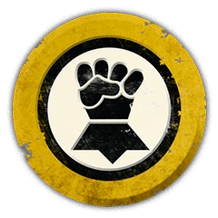

<!-- A0386-B0004 图片 -->
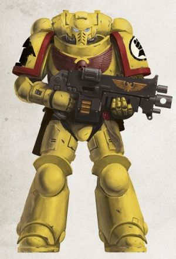

<!-- A0386-B0005 -->
**英文原文**

Legion Number:VII

<!-- /A0386-B0005 -->

<!-- A0386-B0006 -->

原译文

军团编号：VII

**校订译文**

军团编号：VII

<!-- /A0386-B0006 -->

<!-- A0386-B0007 -->
**英文原文**

Primarch:Rogal Dorn

<!-- /A0386-B0007 -->

<!-- A0386-B0008 -->

原译文

原体：罗格·多恩

**校订译文**

原体：罗格·多恩

<!-- /A0386-B0008 -->

<!-- A0386-B0009 -->
**英文原文**

Homeworld:Terra, formerly Inwit. The Chapter also maintains close ties with a number of other worlds such as Necromunda and Harnish.

<!-- /A0386-B0009 -->

<!-- A0386-B0010 -->

原译文

家园：泰拉，原为因维特。战团还与许多其他世界保持着密切的联系，如涅克罗蒙达和哈尼什。

**校订译文**

家园：泰拉，原为因维特。战团还与许多其他世界保持着密切的联系，如涅克罗蒙达和哈尼什。

<!-- /A0386-B0010 -->

<!-- A0386-B0011 -->
**英文原文**

Fortress-Monastery:Phalanx

<!-- /A0386-B0011 -->

<!-- A0386-B0012 -->

原译文

要塞修道院：山阵号

**校订译文**

要塞修道院：山阵号

<!-- /A0386-B0012 -->

<!-- A0386-B0013 -->
**英文原文**

Chapter Master:Gregor Dessian

<!-- /A0386-B0013 -->

<!-- A0386-B0014 -->

原译文

战团长：格雷戈·德西安

**校订译文**

战团长：格雷戈·德西安

<!-- /A0386-B0014 -->

<!-- A0386-B0015 -->
**英文原文**

Colours:Yellow armour, Codex Astartes company shoulder pad trims

<!-- /A0386-B0015 -->

<!-- A0386-B0016 -->

原译文

颜色：黄色盔甲，阿斯塔特圣典连队肩甲镶边

**校订译文**

配色：黄色盔甲，肩甲镶边依照《阿斯塔特圣典》以颜色区分连队。

<!-- /A0386-B0016 -->

<!-- A0386-B0017 -->
**英文原文**

Specialty:Defence, Siege Warfare

<!-- /A0386-B0017 -->

<!-- A0386-B0018 -->

原译文

专长：防御、攻城战

**校订译文**

专长：防御、攻城战

<!-- /A0386-B0018 -->

<!-- A0386-B0019 -->
**英文原文**

Strength:~1000 marines

<!-- /A0386-B0019 -->

<!-- A0386-B0020 -->

原译文

力量：~1000战士

**校订译文**

兵力：约1,000名星际战士。

<!-- /A0386-B0020 -->

<!-- A0386-B0021 -->
**英文原文**

Battle Cry:"Primarch-Progenitor, to your glory and the glory of him on earth!"

<!-- /A0386-B0021 -->

<!-- A0386-B0022 -->

原译文

战吼：“原体在上，为了你与泰拉之主的荣耀！”

**校订译文**

战吼：“原体在上，为了你与泰拉之主的荣耀！”

<!-- /A0386-B0022 -->

<!-- A0386-B0023 -->
**英文原文**

Successor Chapters:

<!-- /A0386-B0023 -->

<!-- A0386-B0024 -->

原译文

子战团：

**校订译文**

子战团：

<!-- /A0386-B0024 -->

<!-- A0386-B0025 -->

原译文

Astral Knights 星界骑士

**校订译文**

Astral Knights 星界骑士

<!-- /A0386-B0025 -->

<!-- A0386-B0026 -->
**英文原文**

Black Templars, Brazen Annihilators

<!-- /A0386-B0026 -->

<!-- A0386-B0027 -->

原译文

黑色圣堂，黄铜歼灭者

**校订译文**

黑色圣堂，黄铜歼灭者

<!-- /A0386-B0027 -->

<!-- A0386-B0028 -->
**英文原文**

Celestials, Celestial Lions, Crimson Axes, Crimson Fists, Crusaders of Dorn

<!-- /A0386-B0028 -->

<!-- A0386-B0029 -->

原译文

天神，天狮，深红之斧，绯红之拳，多恩十字军

**校订译文**

天神，天狮，深红之斧，绯红之拳，多恩十字军

<!-- /A0386-B0029 -->

<!-- A0386-B0030 -->
**英文原文**

Death Strike, Defenders Obscurus, Doom Fists

<!-- /A0386-B0030 -->

<!-- A0386-B0031 -->

原译文

死亡打击，朦胧防卫者，末日之拳

**校订译文**

死亡打击，朦胧防卫者，末日之拳

<!-- /A0386-B0031 -->

<!-- A0386-B0032 -->
**英文原文**

Emperor's Havoc, Emperor's Warbringers, Exorcists, Excoriators, Executioners

<!-- /A0386-B0032 -->

<!-- A0386-B0033 -->

原译文

帝皇浩劫，帝皇战争使者，驱魔者，责难者，处刑者

**校订译文**

帝皇浩劫，帝皇战争使者，驱魔者，责难者，处刑者

<!-- /A0386-B0033 -->

<!-- A0386-B0034 -->
**英文原文**

Fire Lords, Fists Exemplar, Fists of Wrath, Flames of Aries

<!-- /A0386-B0034 -->

<!-- A0386-B0035 -->

原译文

火焰领主，典范之拳，愤怒之拳，白羊座之火

**校订译文**

火焰领主，典范之拳，愤怒之拳，白羊座之火

<!-- /A0386-B0035 -->

<!-- A0386-B0036 -->
**英文原文**

Hammers of Dorn, Hospitallers

<!-- /A0386-B0036 -->

<!-- A0386-B0037 -->

原译文

多恩之锤，医院骑士

**校订译文**

多恩之锤，医院骑士

<!-- /A0386-B0037 -->

<!-- A0386-B0038 -->
**英文原文**

Invaders, Iron Champions, Iron Knights

<!-- /A0386-B0038 -->

<!-- A0386-B0039 -->

原译文

侵略者，钢铁冠军，钢铁骑士

**校订译文**

侵略者，钢铁冠军，钢铁骑士

<!-- /A0386-B0039 -->

<!-- A0386-B0040 -->

原译文

Jade Paladins 翡翠圣骑

**校订译文**

Jade Paladins 翡翠圣骑

<!-- /A0386-B0040 -->

<!-- A0386-B0041 -->

原译文

Knights of Dorn 多恩骑士

**校订译文**

Knights of Dorn 多恩骑士

<!-- /A0386-B0041 -->

<!-- A0386-B0042 -->

原译文

Night Swords 午夜之剑

**校订译文**

Night Swords 午夜之剑

<!-- /A0386-B0042 -->

<!-- A0386-B0043 -->
**英文原文**

Rechista Fists, Red Templars, Retributors

<!-- /A0386-B0043 -->

<!-- A0386-B0044 -->

原译文

真实之拳，红色圣堂，天罚行者

**校订译文**

真实之拳，红色圣堂，天罚行者

<!-- /A0386-B0044 -->

<!-- A0386-B0045 -->
**英文原文**

Silver Guard (speculated), Sons of Dorn, Sons of the Phoenix, Subjugators, Soul Drinkers

<!-- /A0386-B0045 -->

<!-- A0386-B0046 -->

原译文

银色守卫（推测），多恩之子，凤凰之子，压制者，饮魂者

**校订译文**

银色守卫（推测），多恩之子，凤凰之子，压制者，饮魂者

<!-- /A0386-B0046 -->

<!-- A0386-B0047 -->

原译文

Venom Thorns 毒液荆棘

**校订译文**

Venom Thorns 毒液荆棘

<!-- /A0386-B0047 -->

<!-- A0386-B0048 -->

原译文

White Templars 白色圣堂

**校订译文**

White Templars 白色圣堂

<!-- /A0386-B0048 -->

<!-- A0386-B0049 -->
## History 历史

<!-- /A0386-B0049 -->

<!-- A0386-B0050 -->
### Founding 建军

<!-- /A0386-B0050 -->

<!-- A0386-B0051 -->
**英文原文**

The Imperial Fists were formed on Terra as the VIIth Legion. The Legion was one of the few that recruited entirely from their homeworld and were the only formation to have recruited from across all of Terra, including areas where other Legions claimed exclusive "Rights of Tithe." Despite recruiting from such a wide range of locations, VII Legion recruits consistently possessed a taciturn nature and were quick to action but reserved in speaking . The Legion had the benefit of being united with their Primarch shortly after their formation, while their character had yet to take fully shape and as much as 70% of their ranks were still aspirants. As result, the Imperial Fists and Rogal Dorn developed as servants of the Imperium together, forming an unbreakable bond based upon the common desires for self-discipline and total commitment to order found in Dorn's temperament and the gene-seed of the Legion.

<!-- /A0386-B0051 -->

<!-- A0386-B0052 -->

原译文

帝国之拳在泰拉上建立为第七军团。军团是少数几个完全从家园世界招募的军团之一，也是唯一一个从整个泰拉招募的军团，包括其他军团声称拥有专属“什一税权利”的地区。尽管从如此广泛的地点招募，第七军团的新兵一直沉默寡言，行动迅速，但说话谨慎。军团的好处是在他们成立后不久就与他们的原体团结在一起，而他们的性格尚未完全成形，多达70%的队伍仍然是有志者。因此，帝国之拳和罗格·多恩作为帝国之仆一起发展，形成了一种牢不可破的纽带，这种纽带基于多恩气质和军团基因种子中对自律和对秩序的全面承诺的共同愿望。

**校订译文**

帝国之拳作为第七军团成立于泰拉，是少数完全从母星招募兵员的军团之一，也是唯一从整个泰拉征兵的军团，范围甚至包括其他军团声称享有专属“什一税征收权”的地区。尽管兵源广泛，第七军团的新兵却一贯沉默寡言，行动果断而出言谨慎。军团成立不久便迎回原体，此时其自身特质尚未完全成形，多达七成成员仍是候选者。这使帝国之拳与罗格·多恩得以一同成长，共同承担帝国仆从的职责。多恩的性情与军团的基因种子都蕴含着严于律己、全心维护秩序的倾向，由此结成了牢不可破的纽带。

<!-- /A0386-B0052 -->

<!-- A0386-B0053 图片 -->
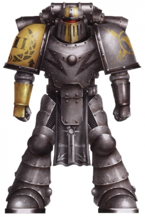

<!-- A0386-B0054 -->

原译文

Imperial Fists MKII Power Armour during the War of Unification displaying then-characteristic colours 统一战争期间的帝国之拳MKII动力盔甲，展现出当时的特点色彩

**校订译文**

Imperial Fists MKII Power Armour during the War of Unification displaying then-characteristic colours 统一战争时期的帝国之拳 Mk II 动力甲，采用当时的典型配色。

<!-- /A0386-B0054 -->

<!-- A0386-B0055 -->
**英文原文**

The homeworld of the Imperial Fists is still officially given as Holy Terra. However, in functional terms, the Chapter has been fleet-based since being united with their Primarch Rogal Dorn, after which the massive starship Phalanx has served as their mobile Fortress-Monastery. Nonetheless, the Chapter still maintains a presence on Holy Terra, including the Pillar of Bone and Column of Glory. Prior to relocating to Terra, the Imperial Fists homeworld was Inwit, where Rogal Dorn was raised and where the Legion took many of their aspirants and starships from. The Chapter still emphasizes its historic role as the defenders of Terra and maintains a coded sequence of alerts and signals to coordinate the rapid redeployment of its full forces to reinforce Terra against attack if the contingency arises.

<!-- /A0386-B0055 -->

<!-- A0386-B0056 -->

原译文

帝国之拳的家园世界仍被正式命名为神圣泰拉。然而，从功能上讲，自与他们的原体罗格·多恩联合以来，战团一直以舰队为基础，之后巨大的星舰山阵号成为了他们的移动堡垒修道院。尽管如此，战团仍然在神圣泰拉上存在，包括白骨之墩和荣耀之柱。在搬迁到泰拉之前，帝国之拳的家园世界是因维特，罗格·多恩在那里长大，军团从那里带走了许多有志者和星舰。战团仍然强调其作为泰拉防御者的历史作用，并保持了一系列编码的警报和信号，以协调其全部部队的快速重新部署，在紧急情况下加强泰拉的防御。

**校订译文**

帝国之拳的官方母星仍是神圣泰拉。不过，自军团迎回罗格·多恩、以巨舰山阵号为移动要塞修道院以来，他们实际上一直以舰队为基地。战团仍在神圣泰拉保有驻地，包括白骨之墩与荣耀之柱。在迁回泰拉之前，帝国之拳以多恩成长的因维特为母星，并从那里征募了大量候选者、获得了众多星舰。战团始终强调自己作为泰拉捍卫者的历史职责，并保有一套编码警报与信号程序，以便在危急时刻协调全部兵力迅速重新部署，增援泰拉的防御。

<!-- /A0386-B0056 -->

<!-- A0386-B0057 -->
### The Unification Wars 统一战争

<!-- /A0386-B0057 -->

<!-- A0386-B0058 -->
**英文原文**

The Imperial Fists participated extensively in the Unification Wars, and are noted to have taken the Cities of the Crystal Sea, conquered the Fortress of the Fifth Circle, and defeated the Wind Caller Clans in the Himalazia at the expense of losing three battalions. During this time, the Legion earned its first battle honour, 'Roma.' In their first decade of existence, they raised six hundred citadels on Terra. Veterans of the Unification Wars commonly displayed the campaign's badge on their power armour.

<!-- /A0386-B0058 -->

<!-- A0386-B0059 -->

原译文

帝国之拳广泛参与了统一战争，并以失去三个营为代价，占领了晶海之城，征服了第五环堡垒，击败了喜马拉雅的唤风氏族。在此期间，军团获得了第一个战斗荣誉“罗马”。在他们存在的第一个十年里，他们在泰拉上建造了六百座城堡。统一战争的老兵通常会在他们的动力盔甲上展示该战役的徽章。

**校订译文**

帝国之拳广泛参与统一战争，曾攻占晶海诸城、征服第五环堡垒，并击败喜马拉雅地区的唤风氏族，为此损失了三个营。军团也在此时获得了首项战斗荣誉“罗马”。成立后的第一个十年里，他们在泰拉修筑了六百座城堡。统一战争的老兵常在动力甲上佩戴这一战役的徽章。

<!-- /A0386-B0059 -->

<!-- A0386-B0060 -->
### The Great Crusade 大远征

<!-- /A0386-B0060 -->

<!-- A0386-B0061 -->
### Disposition 性情

<!-- /A0386-B0061 -->

<!-- A0386-B0062 -->
**英文原文**

During the Great Crusade, Imperial Fists behaved as crusaders and were driven to conquest. First Captain Sigismund was a prominent voice of crusade ideology, believing that the Great Crusade was an expression of man's infinite desire to master space and that maintaining the Imperium would require perpetual war. The Legion espoused a philosophy of victory that held, "Victory was not enough, to conquer one had not only to defeat one's enemies, but to to hold the fruits of that victory." According to this view, victory therefore required consolidating power over the conquered society after the conclusion of combat operations, usually by way of building fortresses and military installations to compel a compliant social order. As a result, the Imperial Fists were considered to be “the most direct expression of the Emperor’s design of uniting humanity" and were generally regarded to be the "foundation rocks" on which the Imperium was built.

<!-- /A0386-B0062 -->

<!-- A0386-B0063 -->

原译文

在大远征期间，帝国之拳表现得像十字军一样，被驱使去征服。西吉斯蒙德连长是十字军意识形态的杰出代言人，他认为大远征是人类对掌握太空的无限渴望的表达，而维持帝国需要永恒的战争。军团信奉一种胜利哲学，认为“胜利是不够的，征服一个人不仅要打败敌人，还要掌握胜利的果实。”因此，根据这一观点，胜利需要在战斗行动结束后巩固对被征服社会的权力，通常是通过建筑堡垒和军事设施来迫使建立顺从的社会秩序。因此，帝国之拳被认为是“帝皇统一人类设计的最直接表达”，通常被认为是建立帝国的“基石”。

**校订译文**

大远征期间，帝国之拳以远征战士自居，始终渴望征服。第一连长西吉斯蒙德是远征理念的重要倡导者，认为大远征体现了人类掌控太空的无尽欲望，而帝国必须通过永不停息的战争才能存续。军团信奉的胜利哲学是：“获胜还不够；要真正征服，就不仅要击败敌人，还必须守住胜利的果实。”依照这一理念，战斗结束后仍须巩固对被征服社会的统治，通常通过修筑堡垒和军事设施，迫使当地建立服从帝国的社会秩序。因此，帝国之拳被视为“帝皇统一人类宏图最直接的体现”，也是构筑帝国的“基石”。

<!-- /A0386-B0063 -->

<!-- A0386-B0064 图片 -->
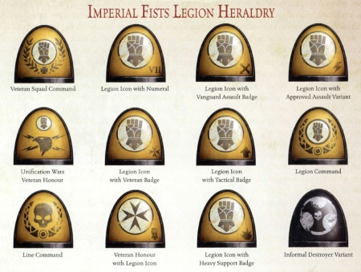

<!-- A0386-B0065 -->

原译文

Imperial Fists Heresy-era heraldry and command insignias 帝国之拳叛乱时期纹章和指挥徽章

**校订译文**

Imperial Fists Heresy-era heraldry and command insignias 帝国之拳叛乱时期纹章和指挥徽章

<!-- /A0386-B0065 -->

<!-- A0386-B0066 -->
**英文原文**

In their capacity as crusaders, the Legion emphasized their military role in the Great Crusade and eschewed the civil responsibilities of governing worlds for recruitment and other purposes. Dorn is famously recorded as saying "I want recruits not vassals." After being granted recruitment rights on Necromunda following a major victory against the Orks lead by Rogal Dorn himself, the Legion situated itself as guests rather than masters. This attitude contrasted with the approach of other Primarchs, such as Perturabo of the Iron Warriors, who took every opportunity to garrison worlds, claim their tithes and develop a personal empire.

<!-- /A0386-B0066 -->

<!-- A0386-B0067 -->

原译文

以十字军的身份，军团强调了他们在大远征中的军事作用，并出于招募和其他目的回避了管理世界的民事责任。多恩有句名言：“我要新兵而不是附庸。”在罗格·多恩本人领导对抗兽人取得重大胜利后，军团获得了在涅克罗蒙达的募兵权，并将自己定位为客人而非主人。这种态度与其他原体的做法形成鲜明对比，比如钢铁勇士的佩图拉博，他抓住一切机会在世界各地驻军，要求他们的什一税，并发展个人帝国。

**校订译文**

作为远征战士，军团强调自己在大远征中的军事职责，不愿为了征募兵员或其他目的承担治理世界的民政责任。多恩的名言是：“我要新兵，不要附庸。”他亲自率军大败欧克、为军团赢得涅克罗蒙达征兵权后，帝国之拳仍以客人的身份驻留。这与其他原体的做法大相径庭。例如钢铁勇士的佩图拉博会抓住一切机会在各个世界驻军、收取什一税，以扩张自己的领地。

<!-- /A0386-B0067 -->

<!-- A0386-B0068 -->
**英文原文**

During the Great Crusade, the Imperial Fists demonstrated a stern disposition, even in comparison to other Space Marines. Upon first encountering the Imperial Fists, Captain Garro of the Death Guard remarked that "they seem a somber lot," to which Captain Iacton Qruze of the Luna Wolves responded in the affirmative, adding that he had served with a Veteran Imperial Fist for a year-long campaign who never once smiled. The stern character of the Legion earned the Imperial Fists the nick name "the Stone Men."

<!-- /A0386-B0068 -->

<!-- A0386-B0069 -->

原译文

在大远征期间，帝国之拳表现出了严厉的性格，即使与其他星际战士相比也是如此。当第一次遇到帝国之拳时，死亡守卫的伽罗连长说“他们看起来很阴沉”，影月苍狼的亚克顿·克鲁兹连长对此表示肯定，并补充说他曾与一位从未微笑过的帝国之拳老兵一起服役了一年。军团的严厉性格为帝国之拳赢得了绰号“石人”

**校订译文**

大远征期间，即使与其他星际战士相比，帝国之拳也显得格外严肃。死亡守卫连长伽罗初见他们时说：“他们看上去都很阴沉。”影月苍狼连长亚克顿·克鲁兹表示赞同，还说自己曾与一位帝国之拳老兵并肩作战整整一年，却从未见他笑过。军团这种严肃的性格使他们获得了“石人”的绰号。

<!-- /A0386-B0069 -->

<!-- A0386-B0070 -->
### Doctrine and Organization 作战理念与组织

原题：Doctrine and Organization 理论与组织

<!-- /A0386-B0070 -->

<!-- A0386-B0071 -->
**英文原文**

"Simple slaughter is no foundation for lasting conquest. Once the blade's red duty is complete, the true work of conquest begins with the raising of new strongholds, leaving the Imperium's stamp upon it's new domain."- Seneschal Athis Marro of the Imperial Fists

<!-- /A0386-B0071 -->

<!-- A0386-B0072 -->

原译文

“简单的屠杀不是持久征服的基础。一旦刀刃的红色任务完成，真正的征服工作就从建立新的据点开始，在帝国的新领地上留下帝国的印记。” - 帝国之拳的总管阿西斯·马罗

**校订译文**

“单纯的杀戮无法奠定长久征服的根基。刀剑完成血腥的使命之后，真正的征服才开始：筑起新的堡垒，在新占领的疆土上烙下帝国的印记。”——帝国之拳总管阿西斯·马罗

<!-- /A0386-B0072 -->

<!-- A0386-B0073 -->
**英文原文**

During the Great Crusade, the Imperial Fists were employed as a strategic reserve to reinforce fledgling campaigns or to achieve breakthroughs. The Legion rapidly redeployed between battlefields and developed special expertise in siege warfare and mass shock assaults. Offensively, the Imperial Fists employed assault formations, surgically applying force where and when it was required to shatter enemy defences, often deciding the outcome of campaigns. Defensively, the Legion was commonly tasked to defend strategic positions and defeat enemy breakthroughs. Regarding the Legion's prowess in defending sieges, Horus once remarked to Dorn that "if I ever laid assault to a bastion possessed by you... then the war would last for all eternity, the best in attack matched by the best in defence." The Legion also possessed special skills in urban warfare and space operations, including fleet and void warfare.

<!-- /A0386-B0073 -->

<!-- A0386-B0074 -->

原译文

在大远征期间，帝国之拳被用作战略储备，以增强刚刚起步的战役或实现突破。军团迅速在战场之间重新部署，并在攻城战和大规模突击中发展了特殊的专业知识。在进攻方面，帝国之拳采用突击编队，在需要的时间和地点精准地使用武力来粉碎敌人的防御，通常决定战役的结果。在防御方面，军团通常负责保卫战略阵地并击败敌人的突破。关于军团在防御围攻方面的实力，荷鲁斯曾对多恩说：“如果我向你拥有的堡垒发起进攻……那么战争将永远持续下去，最好的攻击与最好的防御相匹配。”军团在城市战和太空作战方面也拥有专业技能，包括舰队和虚空战。

**校订译文**

大远征期间，帝国之拳担任战略预备队，用于增援刚展开的战役，或在关键处实现突破。他们能在各战场间迅速重新部署，并逐渐形成了攻城与大规模猛烈突击的专长。进攻时，帝国之拳以突击编队在关键时机、关键位置精确投入兵力，粉碎敌军防线，往往由此决定战役的胜负。防守时，军团则通常负责坚守战略要地，挫败敌人的突破行动。谈及军团抵御围攻的本领，荷鲁斯曾对多恩说：“倘若我向你据守的堡垒发起进攻……这场战争就会永无止境，最强的进攻对上最强的防御。”军团也精于城市战和太空作战，包括舰队战与虚空战。

<!-- /A0386-B0074 -->

<!-- A0386-B0075 -->
**英文原文**

The Legion was organized to support its crusade posture. The Imperial Fists maintained a fleet of 1,500 warships, a force quantitatively and qualitatively superior to any other legion. The Legion command and control structure featured theatre marshals in charge of all forces taking part in their area of responsibility, fleet masters, and siege masters. Ad hoc commands of castellan and seneschals controlled formations called crusades or households, respectively -- each comprised of two battalions. Infantry unit configuration tended towards the two extremes of assault load outs or long-range heavy weapons. To replenish combat losses, the Legion often recruited from conquered populations en mass. Recorded examples include recruiting every man who could carry a spear from the hunter-tribesmen of Tiberna, taking half of the members of the tech-brat gangs of Sevan, and the recruitment of every youth older than 10,000 ship cycles from the Nedoran ship clans.

<!-- /A0386-B0075 -->

<!-- A0386-B0076 -->

原译文

军团的组织是为了支持其远征姿态。帝国之拳维持着一支由1500艘战舰组成的舰队，这支部队在数量和质量上都优于其他任何军团。军团的指挥和控制结构以负责其责任区内所有部队的战场元帅、舰队之主和攻城大师为特色。堡主和总管的特别指挥部分别控制着称为十字军或兄弟会的编队，每个编队由两个营组成。步兵部队的配置倾向于装载突击或远程重型武器的两个极端。为了弥补战斗损失，军团经常从被征服的人口中大规模招募。有记录的例子包括从藏族的猎人部落招募每一个能携带长矛的人，从塞万的科技小子帮派招募一半的成员，以及从尼都瑞船族招募每一名超过10000个舰船周期的年轻人。

**校订译文**

军团的组织结构服务于其远征使命。帝国之拳拥有1,500艘战舰，无论数量还是质量都胜过其他军团。指挥体系包括统领责任区内所有参战部队的战区元帅，以及舰队大师和攻城大师。堡主与总管还会临时受命，分别指挥称为“远征军”与“扈从军”的编队，每支编队由两个营组成。步兵单位的装备配置通常偏向两个极端：近距离突击装备，或远程重型武器。为补充战损，军团经常从被征服的民众中大规模征兵。记载中的例子包括：从提伯纳的猎人部落征走所有能执矛的男子，从塞万的科技小子帮派征走半数成员，以及从尼都瑞船族征走所有年龄超过10,000个舰船周期的青年。

**校注：** Tiberna 为猎人部落所在地专名，暂译提伯纳；原稿“藏族”无英文依据。households 在本段为由总管指挥的双营编队，暂译扈从军，不与普通兄弟会合并。ship cycles 保留舰船周期，不擅换算成年。

<!-- /A0386-B0076 -->

<!-- A0386-B0077 -->
**英文原文**

The size of the Legion was recorded as 98,356 just prior to the outbreak of the Horus Heresy, though this figure is not thought to be precise.

<!-- /A0386-B0077 -->

<!-- A0386-B0078 -->

原译文

在荷鲁斯叛乱爆发之前，军团的规模被记录为98356人，尽管这个数字并不准确。

**校订译文**

据记录，荷鲁斯之乱爆发前军团共有98,356人，不过这一数字被认为未必精确。

<!-- /A0386-B0078 -->

<!-- A0386-B0079 -->
### Campaigns and Actions 战役与行动

<!-- /A0386-B0079 -->

<!-- A0386-B0080 -->
**英文原文**

The Legion was instrumental in extending control over the Sol System in the early phases of the Great Crusade, performing key roles in the Unheard War, the War of the Consus Drift, and the Araneus Wars. During the Unheard war, the Emperor ordered the Bell of Lost Souls tolled for the first time in honor of 50 Imperial Fists who sacrificed themselves to defeat a psy-plague in the Azurite Stations. On the Plains of Kenneatar, the Legion's 5th Battalion broke the lines of the Tyrancy with an arrowhead formation of 50 war machines. The Imperial Fists are noted to have conquered Galabaz, a subterranean city buried in surrounding mountains. During operations on Ophelia VII, 10,000 Imperial Fists accompanied the Emperor and 100 custodes. At Askanisa, the Imperial Fists and the Luna Wolves formed the Emperor's vanguard to break the Shrouded Dynasties.

<!-- /A0386-B0080 -->

<!-- A0386-B0081 -->

原译文

在大远征的早期阶段，军团在扩大对太阳系的控制方面发挥了重要作用，在未闻战争、康索斯漂移带战争和厄瑞尼亚斯战争中发挥了关键作用。在未闻战争期间，帝皇下令首次敲响失落灵魂之钟，以纪念50名在天青石空间站为击败灵能瘟疫而牺牲自己的帝国之拳。在肯纳塔尔平原上，军团第5营用50台战争机械组成的箭头编队打破了暴君的防线。众所周知，帝国之拳已经征服了加拉巴兹，这是一座埋在周围山脉中的地下城市。在奥菲利亚七号的行动中，有10000名帝国之拳和100位禁军陪伴着帝皇。在阿斯卡尼萨，帝国之拳和影月苍狼组成了帝皇打破寿衣王朝的先锋。

**校订译文**

大远征初期，军团在扩大帝国对太阳系的控制方面发挥了重要作用，尤其活跃于未闻战争、康索斯漂移带战争与厄瑞尼亚斯战争。在未闻战争中，50名帝国之拳战士为消灭天青石空间站的灵能瘟疫而献身；帝皇下令首次敲响亡魂之钟，以纪念他们。在肯纳塔尔平原，军团第五营将50台战争机械排成箭头阵形，突破了暴君政权的防线。帝国之拳还曾征服加拉巴兹，一座埋藏在群山之中的地下城市。在奥菲利亚七号的行动中，10,000名帝国之拳与100名帝皇禁军随帝皇出征。在阿斯卡尼萨，帝国之拳和影月苍狼组成帝皇的先锋，击溃了帷幕王朝。

<!-- /A0386-B0081 -->

<!-- A0386-B0082 图片 -->
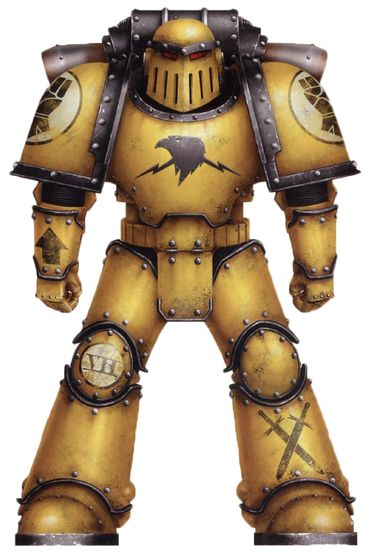

<!-- A0386-B0083 -->

原译文

Heresy-era Imperial Fist 叛乱时期帝国之拳

**校订译文**

Heresy-era Imperial Fist 叛乱时期帝国之拳

<!-- /A0386-B0083 -->

<!-- A0386-B0084 -->
**英文原文**

The Imperial Fists were so effective in their role during the Great Crusade that the Legion accumulated a record second only to that of the Luna Wolves. As a proud testament to their accomplishments, battle honours were displayed for kilometres in a gallery aboard the Phalanx. However, in the course of accumulating honours, the Imperial Fists' developed hostile relationships with other Legions. Most notably, the Imperial Fists maintained a bitter rivalry with the Iron Warriors, which was largely the result of both Legions sharing similar combat specializations. Less known was the strong mutual hatred between the Imperial Fists and Alpha Legion, who clashed on more than one occasion prior to the Horus Heresy, though the nature of these clashes is unknown. The Imperial Fists are also known to have participated in the Compliance Nine Forty-Three alongside the Emperor's Children, where Rogal Dorn allowed Primarch Fulgrim the honour of breaking the ork stronghold and at Thysson's Sound alongside the World Eaters, where Angron chose to pursue the enemy while the seventh legion remained to protect his supply lines.

<!-- /A0386-B0084 -->

<!-- A0386-B0085 -->

原译文

帝国之拳在大远征期间发挥了如此有效的作用，以至于军团积累了仅次于影月苍狼的记录。作为对他们成就的骄傲证明，山阵号上的一个画廊里展示了长达数公里的战斗荣誉。然而，在积累荣誉的过程中，帝国之拳与其他军团发展了敌对关系。最值得注意的是，帝国之拳与钢铁勇士保持着激烈的竞争，这在很大程度上是由于两个军团拥有相似的战斗专长。鲜为人知的是帝国之拳和阿尔法军团之间强烈的相互仇恨，在荷鲁斯叛乱之前，他们曾多次发生冲突，尽管这些冲突的性质尚不清楚。帝国之拳也与帝皇之子一起参加了943征服行动，在那里，罗格·多恩允许原体福格瑞姆击破欧克要塞的荣誉，并在蒂森海峡与吞世者一起，安格隆选择追击敌人，而第七军团则留下来保护他的补给线。

**校订译文**

帝国之拳在大远征中表现卓越，积累的战绩仅次于影月苍狼。山阵号上的荣誉长廊绵延数公里，陈列着军团的战斗荣誉，彰显其功绩。不过，荣誉日增的同时，军团也与其他军团结下了怨隙。其中最著名的是与钢铁勇士的激烈竞争，很大程度上源于两军团相近的作战专长。较少为人所知的则是帝国之拳与阿尔法军团之间的深切敌意：他们在荷鲁斯之乱前不止一次发生冲突，但冲突的具体性质不明。帝国之拳曾与帝皇之子共同参加943征服行动；罗格·多恩将攻破欧克要塞的荣誉让给了原体福格瑞姆。他们也曾与吞世者并肩作战于蒂森海峡，安格隆选择追击敌军，第七军团则留下来保护其补给线。

<!-- /A0386-B0085 -->

<!-- A0386-B0086 -->
**英文原文**

The Imperial Fists operated closely alongside the Emperor of Mankind during the Great Crusade. The Legion served as the Emperor's personal Praetorians and fought directly alongside him more than any other legion. The Emperor bestowed the name "Imperial Fists" upon the VII Legion early in the Great Crusade, a reference to when many saw the lands conquered by them it was as if "the hand of the Emperor had descended and gripped with an unbreakable fist." The Emperor also granted them the right to wear the Laurels of Victory as part of their heraldry. After the successful conclusion of the Ullanor Crusade, the Emperor returned to Terra, ordering the Imperial Fists with him where they were tasked to fortify the Imperial Palace.

<!-- /A0386-B0086 -->

<!-- A0386-B0087 -->

原译文

在大远征期间，帝国之拳与人类帝皇密切合作。军团是帝皇的私人禁卫军，比其他任何军团都更直接地与他并肩作战。在大远征早期，帝皇给第七军团起了“帝国之拳”的名字，指的是当许多人看到他们征服的土地时，就好像“帝皇的手已经降下，用一把牢不可破的拳头紧握”。帝皇还授予他们佩戴胜利桂冠的权利，作为纹章的一部分。在乌兰诺远征成功结束后，帝皇返回泰拉，命令帝国之拳与他同行，在那里他们的任务是加固皇宫。

**校订译文**

大远征期间，帝国之拳经常紧随人类帝皇作战，承担他的亲卫职责，直接与他并肩战斗的次数超过任何其他军团。大远征初期，帝皇赐予第七军团“帝国之拳”之名：在许多人眼中，他们征服的土地就仿佛被“帝皇降下的手掌，以不可撼动的铁拳牢牢握住”。帝皇还允许他们在纹章中佩戴胜利桂冠。乌兰诺远征胜利结束后，帝皇返回泰拉，命令帝国之拳随行，负责加强皇宫的防御工事。

<!-- /A0386-B0087 -->

<!-- A0386-B0088 -->
### Notable Battles of the Great Crusade 大远征中的著名战役

原题：Notable Battles of the Great Crusade 著名大远征战斗

<!-- /A0386-B0088 -->

<!-- A0386-B0089 -->

原译文

The First Pacification of Luna 第一次月球平定

**校订译文**

The First Pacification of Luna 第一次月球平定

<!-- /A0386-B0089 -->

<!-- A0386-B0090 -->

原译文

The Battle of Luhman 卢曼之战

**校订译文**

The Battle of Luhman 卢曼之战

<!-- /A0386-B0090 -->

<!-- A0386-B0091 -->

原译文

The Unheard War 未闻战争

**校订译文**

The Unheard War 未闻战争

<!-- /A0386-B0091 -->

<!-- A0386-B0092 -->

原译文

The Araneus Wars 厄瑞尼亚斯战争

**校订译文**

The Araneus Wars 厄瑞尼亚斯战争

<!-- /A0386-B0092 -->

<!-- A0386-B0093 -->

原译文

The Astranii Campaign 阿斯特拉尼战役

**校订译文**

The Astranii Campaign 阿斯特拉尼战役

<!-- /A0386-B0093 -->

<!-- A0386-B0094 -->

原译文

The Pacification of Ophelia VII 奥菲利亚七号平定

**校订译文**

The Pacification of Ophelia VII 奥菲利亚七号平定

<!-- /A0386-B0094 -->

<!-- A0386-B0095 -->

原译文

The War of the Consus Drift 康索斯漂移带战争

**校订译文**

The War of the Consus Drift 康索斯漂移带战争

<!-- /A0386-B0095 -->

<!-- A0386-B0096 -->

原译文

The Praxil Compliance 普拉克西征服

**校订译文**

The Praxil Compliance 普拉克西征服

<!-- /A0386-B0096 -->

<!-- A0386-B0097 -->

原译文

The Battle of Gyros-Thravian 杰罗斯-萨洛维安之战

**校订译文**

The Battle of Gyros-Thravian 杰罗斯-萨洛维安之战

<!-- /A0386-B0097 -->

<!-- A0386-B0098 -->

原译文

The Battle of Rennimar 雷尼马尔之战

**校订译文**

The Battle of Rennimar 雷尼马尔之战

<!-- /A0386-B0098 -->

<!-- A0386-B0099 -->

原译文

The Epelliant Helos Campaign 埃佩里特·赫洛斯战役

**校订译文**

The Epelliant Helos Campaign 埃佩里特·赫洛斯战役

<!-- /A0386-B0099 -->

<!-- A0386-B0100 -->

原译文

The Night Crusade 午夜远征

**校订译文**

The Night Crusade 午夜远征

<!-- /A0386-B0100 -->

<!-- A0386-B0101 -->

原译文

The World Prince Campaign 王子世界战役

**校订译文**

The World Prince Campaign 王子世界战役

<!-- /A0386-B0101 -->

<!-- A0386-B0102 -->

原译文

The Onassis Campaign 欧纳西斯战役

**校订译文**

The Onassis Campaign 欧纳西斯战役

<!-- /A0386-B0102 -->

<!-- A0386-B0103 -->
### The Horus Heresy 荷鲁斯之乱

原题：The Horus Heresy 荷鲁斯之战

<!-- /A0386-B0103 -->

<!-- A0386-B0104 -->
### Dorn Responds 多恩的应对

原题：Dorn Responds 多恩反应

<!-- /A0386-B0104 -->

<!-- A0386-B0105 -->
**英文原文**

Rogal Dorn and the Imperial Fists were the first loyalists to learn of the Horus Heresy other than those attacked on Isstvan III. While attempting to reach Terra as ordered by the Emperor after Ullanor, the Legion responded to a distress call from the Eisenstein. Rogal Dorn discovered Death Guard Captain Nathaniel Garro and remembrancer Mersadie Oliton, who carried news of the events which had transpired on Isstvan III. In response, Dorn ordered the bulk of the Imperial Fists to the Isstvan system while he and the Legion’s veteran companies returned to Terra to inform the Emperor of Horus' treachery. Significantly, each deployment faced difficulties from the Warp Storms that had enveloped the galaxy, which made navigation nearly impossible.

<!-- /A0386-B0105 -->

<!-- A0386-B0106 -->

原译文

罗格·多恩和帝国之拳是第一批得知荷鲁斯叛乱的忠诚者，而不是那些在伊斯塔万三号遭到袭击的人。在试图按照帝皇在乌兰诺之后的命令到达泰拉时，军团回应了爱森斯坦号的求救信号。罗格·多恩发现了死亡守卫连长纳撒尼尔·伽罗和纪述者梅赛蒂·奥列顿，他们带来了伊斯塔万三号发生的事件的消息。作为回应，多恩命令将大部分帝国之拳派往伊斯塔万星系，同时他和军团的老兵连队返回泰拉，通知帝皇荷鲁斯的背叛。值得注意的是，每次部署都面临着笼罩银河系的亚空间风暴的困难，这使得导航几乎不可能。

**校订译文**

除在伊斯塔万三号遭到袭击的忠诚派外，罗格·多恩与帝国之拳是最早得知荷鲁斯之乱的忠诚者。乌兰诺之后，军团奉帝皇之命返回泰拉，途中收到爱森斯坦号的求救信号。多恩因此接应了死亡守卫连长纳撒尼尔·伽罗与纪述者梅赛蒂·奥列顿，得知伊斯塔万三号发生的一切。多恩随即命令军团主力前往伊斯塔万星系，自己则率老兵连返回泰拉，向帝皇报告荷鲁斯的背叛。然而，笼罩银河的亚空间风暴令航行几乎无法进行，阻碍了两路部队的部署。

<!-- /A0386-B0106 -->

<!-- A0386-B0107 图片 -->
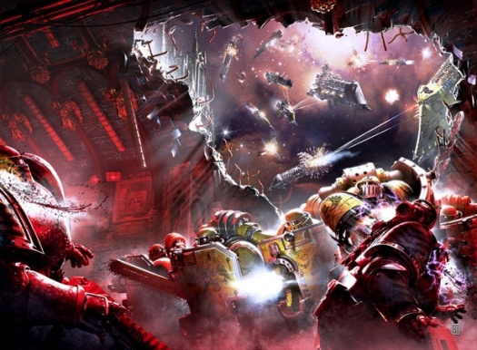

<!-- A0386-B0108 -->

原译文

The Imperial Fists battle the Iron Warriors during the Battle at the Phall system 在法尔星系的战斗中，帝国之拳与钢铁勇士作战

**校订译文**

The Imperial Fists battle the Iron Warriors during the Battle at the Phall system 在法尔星系的战斗中，帝国之拳与钢铁勇士作战

<!-- /A0386-B0108 -->

<!-- A0386-B0109 -->
**英文原文**

On Terra, Dorn assumed command of the Imperium’s armed forces. There, the Imperial Fists oversaw the fortification of the Imperial Palace, as previously ordered before the Heresy, and other duties relating to its defence, such as counter-intelligence. They nonetheless also fought scattered battles throughout the Galaxy, such as against the Iron Warriors in the First Siege of Hydra Cordatus.

<!-- /A0386-B0109 -->

<!-- A0386-B0110 -->

原译文

在泰拉上，多恩接管了帝国武装部队的指挥权。在那里，帝国之拳监督了皇宫的防御工事，正如叛乱之前所命令的那样，以及与防御有关的其他职责，如反情报。尽管如此，他们也在银河系各地进行了零星的战斗，例如在第一次九头蛇之心围攻时与钢铁勇士作战。

**校订译文**

在泰拉，多恩接掌了帝国武装力量的指挥权。帝国之拳继续执行叛乱前便已下达的命令，督建皇宫防御工事，同时承担反情报等防御职责。他们仍在银河各地参与零星战事，例如在第一次九头蛇之心围攻战中与钢铁勇士交锋。

<!-- /A0386-B0110 -->

<!-- A0386-B0111 -->
**英文原文**

Dorn immediately organised the Imperium’s response to Isstvan III. After making contact as best as possible with the other Legions, which the Warp storms hampered, Dorn ordered that Horus be confronted on Isstvan V where his forces were entrenching themselves. Discussing the reasoning of this strategy with Malcador the Sigillite, he stated that “...kill the head and the body will die.” Notably, Dorn elected to keep his veteran companies on Terra while apparently assuming the bulk of the Legion which had been ordered to the Isstvan system would join the assault on their own initiative if they were able to navigate there successfully.

<!-- /A0386-B0111 -->

<!-- A0386-B0112 -->

原译文

多恩立即组织了帝国对伊斯塔万三号的回应。在与亚空间风暴阻碍的其他军团进行了尽可能好的接触后，多恩下令在伊斯塔万五号与荷鲁斯对峙，他的部队正在那里巩固自己。在与掌印者马卡多讨论这一策略的推理时，他表示“……杀死头部，身体就会死亡。”值得注意的是，多恩选择将他的老兵连队留在泰拉上，同时显然假设被命令进入伊斯塔万星系的大部分军团如果能够成功导航到那里，就会主动加入攻击。

**校订译文**

多恩立即组织帝国应对伊斯塔万三号事件。尽管亚空间风暴阻碍联络，他仍尽力与其他军团取得联系，命令各军团在伊斯塔万五号打击正构筑防线的荷鲁斯。他向掌印者马卡多解释这一策略时说：“……斩其首，身自亡。”值得注意的是，多恩将自己的老兵连留在泰拉，显然认为奉命前往伊斯塔万星系的军团主力只要成功抵达，便会自行加入进攻。

<!-- /A0386-B0112 -->

<!-- A0386-B0113 -->
### Mars 火星

<!-- /A0386-B0113 -->

<!-- A0386-B0114 -->
**英文原文**

At the same time, Mars entered into open revolt, endangering the Imperium’s access to war material. In response, Dorn ordered First Captain Sigismund and Captain Camba-Diaz to command four veteran companies to secure the forges of Mondus Occulum and Mondus Gamma, which together produced the majority of Astartes weapons and armour. The Astartes force was accompanied by number of Imperial Army units, including thirteen companies of Saturnine Hoplites and four regiments of Jovian Grenadiers, also under the command of the Imperial Fists captains. The operation was met with overwhelming resistance by traitor forces belonging to the Adeptus Mechanicus. The two companies under the command of Comba-Diaz were outnumbered one hundred to one and Sigismund’s force of the same size was met by two full Titan Legions. Facing annihilation, the Imperial Fists withdrew from Mars, abandoning the forges but successfully evacuating at least 12,000 suits of MK4 Power Armour and twice as many weapons. The four veteran companies involved in the operation suffered heavy casualties and were reduced to half strength.

<!-- /A0386-B0114 -->

<!-- A0386-B0115 -->

原译文

与此同时，火星开始公开反抗，危及帝国获取战争物资。作为回应，多恩命令第一连长西吉斯蒙德和连长尉坎巴·迪亚兹指挥四个经验丰富的连队，以确保神秘世界和伽马世界的铸造厂的安全，这两个地区共同生产了大部分阿斯塔特的武器和盔甲。阿斯塔特部队由多个帝国陆军部队陪同，其中包括13个土星重装步兵连队和4个木星掷弹兵团，也由帝国之拳连长指挥。这次行动遭到了属于机械教的叛徒部队的压倒性抵抗。与坎巴·迪亚兹指挥的两个连队的人数比达到一百多，西吉斯蒙德同样规模的部队被两个完整的泰坦军团所击败。面对毁灭，帝国之拳从火星撤退，放弃了铸造厂，但成功撤离了至少12000套MK4动力盔甲和两倍多的武器。参与行动的四个老兵连队伤亡惨重，兵力减少到一半。

**校订译文**

与此同时，火星公开叛乱，危及帝国的战争物资供应。多恩命令第一连长西吉斯蒙德与连长坎巴·迪亚兹率四个老兵连，夺保蒙杜斯·奥库勒姆和蒙杜斯·伽马两处铸造厂；两厂合计生产了阿斯塔特所需的大部分武器和盔甲。随行的还有多支帝国军部队，包括13个土星重装步兵连与4个木星掷弹兵团，同样由这两位帝国之拳连长指挥。他们遭到机械修会叛军的压倒性抵抗：坎巴·迪亚兹指挥的两个连面对百倍于己的敌军，西吉斯蒙德率领的同等兵力则遭遇了两个完整的泰坦军团。为避免全军覆没，帝国之拳撤离火星，放弃两处铸造厂，但成功运出了至少12,000套 Mk IV 动力甲，以及数量为其两倍的武器。参与行动的四个老兵连伤亡惨重，最终仅余半数兵力。

**校注：** 原英文拼写先后为 Camba-Diaz、Comba-Diaz，视为本段同一人，暂统一坎巴·迪亚兹；Mondus Occulum/Gamma 是铸造设施专名，非神秘世界/伽马世界。英文 Adeptus Mechanicus 保留机械修会，不按年代擅改为 Mechanicum。

<!-- /A0386-B0115 -->

<!-- A0386-B0116 -->
### Phall System 法尔星系

<!-- /A0386-B0116 -->

<!-- A0386-B0117 -->
**英文原文**

Months later, the bulk of the Imperial Fists forces were continuing their attempt to overcome the warp storms and navigate to the Isstvan system as ordered. The force had been completely out of contact with the Imperium since their departure and was unaware of any further developments concerning Horus' treachery, including that the remaining loyalists on Isstvan III had been crushed utterly. The fleet regained communication with the Imperium when it received urgent orders to return to Terra while being engaged by a large Iron Warriors force during the Battle at the Phall system. Both sides suffered serious losses but in a testament to their discipline the Imperial Fists fleet successfully disengaged and set course for Terra as ordered.

<!-- /A0386-B0117 -->

<!-- A0386-B0118 -->

原译文

几个月后，帝国之拳的大部分部队继续试图克服亚空间风暴，并按照命令导航到伊斯塔万星系。自从他们离开后，这支部队就完全与帝国失去了联系，并且不知道荷鲁斯叛乱的任何进一步发展，包括伊斯塔万三号上剩下的忠诚者已经被彻底粉碎。在法尔星系的战斗中，舰队在接到返回泰拉的紧急命令时，与帝国重新建立了联系，同时与一支庞大的钢铁勇士部队交战。双方都遭受了严重损失，但帝国之拳舰队成功脱离战斗，并按照命令向泰拉进发，这证明了他们的纪律。

**校订译文**

数月后，帝国之拳主力仍在设法穿越亚空间风暴，奉命前往伊斯塔万星系。自出发以来，他们便与帝国彻底失联，对荷鲁斯之乱的后续发展一无所知，也不知道伊斯塔万三号剩余的忠诚派已经全军覆没。在法尔星系之战中，舰队正与一支强大的钢铁勇士部队交战，此时终于恢复联络，收到立即返回泰拉的紧急命令。双方都损失惨重，但帝国之拳舰队仍成功脱离战斗，奉命驶向泰拉，彰显了严明的纪律。

<!-- /A0386-B0118 -->

<!-- A0386-B0119 -->
### Cthonia 科索尼亚

<!-- /A0386-B0119 -->

<!-- A0386-B0120 -->
**英文原文**

As part of the initial defence of the Segmentum Solar, Rogal Dorn in 006.M31 diverted the 9th and 14th Battalions of the Imperial Fists, the Space Wolves 13th Great Company, several Terran cohorts of the Imperial Army and even three sodalities of the Legio Custodes to Cthonia. In command of the battle group was Lord-castellan Evander Garrius. The surface garrison was quickly overwhelmed and forced to retreat into the underworld to fight a guerilla campaign. In the aftermath of the Battle of Beta-Garmon, a powerful fleet of the Sons of Horus led by Vheren Ashurhaddon and supported by elements of Word Bearers, Alpha Legion, Cthonian Headhunters regiments and Dark Mechanicum from Voss, would invade Cthonia in order to reclaim it from the loyalists, beginning thus a second siege. Although the loyalist forces were well prepared for the traitor attack, the massive traitor fleet was able to beat the loyalists in orbit and began the assault on the surface of the world. Supported by Thousand Sons, Shattered Legions and Imperial Army forces, Garrius and his Imperial Fists inflicted heavy casualties on the traitor Astartes, however, the traitors in turn managed to cause several losses to the Loyalists, such as the destruction of the majority of their Titan reserves. In 014.M31, with the traitors gaining ground, Garrius prepared to meet them for a final battle at Traitor's Gate Hive, but as the two sides were fighting against each other, a large Dark Angels fleet led by Marduk Sedras arrived at the planet's orbit, defeated the Traitor fleet and ordered all sides to stop fighting and leave the planet unless they wanted to face annihilation. After both sides made no attempt to heed the order, the Dark Angels began bombarding the planet. Garrius in rage, retaliated by targeting the Dark Angels' fleet with the surface defence guns, but did little damage to the capital ships. Later on, the Dreadwing under orders of Marduk, planted Vortex Bombs on certain locations of the planet and set them off. As Cthonia was being destroyed by the resulting Warp Rifts, the remaining forces on the planet began their evacuation and carried their leaders out of the dying planet.

<!-- /A0386-B0120 -->

<!-- A0386-B0121 -->

原译文

作为太阳星域最初防御的一部分，罗格·多恩在006.M31将帝国之拳的第9和第14营、太空野狼第13大连、帝国军队的几个泰拉大队，甚至禁军军团的三个友伴会移动到了科索尼亚。指挥战斗群的是堡主领主伊万德·加里乌斯。地面驻军很快被淹没，被迫撤退到地下世界进行游击战。贝塔·伽蒙之战结束后，由维伦·阿舒哈顿领导的荷鲁斯之子强大舰队，在沃斯的怀言者、阿尔法军团、科索尼亚猎头者和黑暗机械教的支援下，将入侵科索尼亚，从忠诚者手中夺回科索尼亚。尽管忠诚派部队为叛徒的袭击做好了充分准备，但庞大的叛徒舰队在轨道上击败忠诚派，并开始在世界表面发动袭击。在千子、破碎军团和帝国军队的支持下，加里乌斯和他的帝国之拳给叛徒阿斯塔特造成了重大伤亡，然而，叛徒反过来又给忠诚派造成了一些损失，例如摧毁了他们大部分的泰坦储备。在014.M31，随着叛徒势力的扩张，加里乌斯准备在叛徒之门巢都与他们进行最后的战斗，但当双方交战时，由玛杜克·赛德拉斯率领的一支大型黑暗天使舰队抵达了行星的轨道，击败了叛徒舰队，并命令各方停止战斗，离开行星，除非他们想面对毁灭。在双方都没有试图听从命令后，黑暗天使开始轰炸行星。加里乌斯怒不可遏，用行星表面的防御炮瞄准黑暗天使的舰队进行报复，但对主力舰几乎没有造成伤害。后来，恐翼在马杜克的命令下，在行星的某些地方放置了涡旋炸弹并将其引爆。随着科索尼亚被由此产生的亚空间裂隙摧毁，行星上剩下的部队开始撤离，并将他们的领导人带出了垂死的星球。

**校订译文**

为部署太阳星域的初期防御，罗格·多恩于006.M31将帝国之拳第九、第十四营、太空野狼第十三大连、帝国军的数支泰拉大队，乃至帝皇禁军军团的三个友伴会调往科索尼亚，由堡主领主伊万德·加里乌斯统率这一战斗群。当地的地表驻军很快败退，被迫退入地下世界打游击战。贝塔·伽蒙之战后，维伦·阿舒哈顿率领强大的荷鲁斯之子舰队来犯，并获得怀言者、阿尔法军团、科索尼亚猎颅者诸团，以及沃斯黑暗机械教部队的支援，意图从忠诚派手中夺回科索尼亚，第二次围攻就此开始。忠诚派虽已做好准备，庞大的叛军舰队仍击败了他们的轨道部队，开始进攻地表。在千子、破碎军团与帝国军部队的支援下，加里乌斯及其帝国之拳重创了叛徒阿斯塔特；叛军同样给忠诚派造成严重损失，包括摧毁其大部分预备泰坦。014.M31，叛军不断推进，加里乌斯准备在叛徒之门巢都与其决战。双方交战之际，玛杜克·赛德拉斯率领一支大型黑暗天使舰队抵达行星轨道，击败叛军舰队，命令所有人停战撤离，否则便将一并毁灭。双方均拒绝服从，黑暗天使于是开始轰炸行星。愤怒的加里乌斯以地表防御炮还击，却未能对其主力舰造成多大损伤。随后，恐翼奉玛杜克之命在行星若干地点埋设并引爆涡旋炸弹。炸弹撕开的亚空间裂隙开始摧毁科索尼亚，残余部队随即撤退，将各自的统帅带离这颗濒死的星球。

**校注：** 首句驻军调动后，surface garrison 所指在原文不够明确；本稿保留“当地的地表驻军”，不将最初撤入地下者擅定为加里乌斯。沃斯只修饰黑暗机械教。千子支援忠诚派的记述照译。

<!-- /A0386-B0121 -->

<!-- A0386-B0122 -->
### Defence of Terra 泰拉防御

<!-- /A0386-B0122 -->

<!-- A0386-B0123 -->
**英文原文**

As the traitors inched closer to Terra, it fell to Rogal Dorn and the Imperial Fists to oversee the defenses of the Sol System. In the subsequent Solar War, the Fists attempted to contain Horus' advance, seemingly defeating the Alpha Legion during the Battle of Pluto in the process. However ultimately, they failed to prevent Horus from attacking Terra itself.

<!-- /A0386-B0123 -->

<!-- A0386-B0124 -->

原译文

随着叛徒逐渐接近泰拉，罗格·多恩和帝国之拳负责监督太阳星系的防御。在随后的太阳战争中，帝国之拳试图遏制荷鲁斯的推进，似乎在此过程中的冥王星之战中击败了阿尔法军团。然而，最终他们未能阻止荷鲁斯攻击泰拉本身。

**校订译文**

叛军逐渐逼近泰拉，罗格·多恩与帝国之拳肩负起统筹太阳系防御的重任。在随后的太阳战争中，他们试图遏制荷鲁斯的推进，并似乎在冥王星之战中击败了阿尔法军团。然而，他们终究未能阻止荷鲁斯进攻泰拉本身。

<!-- /A0386-B0124 -->

<!-- A0386-B0125 图片 -->
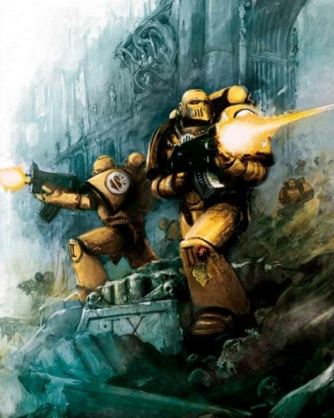

<!-- A0386-B0126 -->

原译文

Imperial Fists defend the Imperial Palace from the forces of Chaos 帝国之拳保护皇宫免受混沌部队的侵害

**校订译文**

Imperial Fists defend the Imperial Palace from the forces of Chaos 帝国之拳保护皇宫免受混沌部队的侵害

<!-- /A0386-B0126 -->

<!-- A0386-B0127 -->
**英文原文**

During the Defence of Terra, the Legion made indispensable contributions to the defense of the Imperial Palace alongside the White Scars and the Blood Angels. During the battle, the Legion made a massive move to reinforce the Palace from the great Sky Fortress at a critical juncture of the battle. It is also known that Dorn had the honour of accompanying the Emperor aboard Horus' Battle Barge and that he discovered the bodies of the Emperor, Horus and Sanguinius after the final drama had run its course.

<!-- /A0386-B0127 -->

<!-- A0386-B0128 -->

原译文

在保卫泰拉期间，军团与白色疤痕和圣血天使一起为保卫皇宫做出了不可或缺的贡献。在战斗中，军团在战斗的关键时刻采取了大规模行动，从巨大的天空堡垒增援皇宫。众所周知，多恩有幸陪同帝皇登上荷鲁斯的战舰，并在最后一幕结束后发现了帝皇、荷鲁斯和圣吉列斯的尸体。

**校订译文**

在泰拉保卫战中，帝国之拳与白疤、圣血天使共同作战，为守卫皇宫发挥了不可替代的作用。战斗最危急的时刻，军团从巨大的天空堡垒派出大批援军支援皇宫。多恩还曾有幸随帝皇登上荷鲁斯的战斗驳船；最终对决结束后，也是他发现了倒下的帝皇，以及荷鲁斯和圣吉列斯的遗体。

**校注：** 原文 bodies 同时用于帝皇、荷鲁斯和圣吉列斯；中文区分倒下的帝皇与其余两人的遗体，避免误称帝皇已死亡。天空堡垒等细节按本段版本保留。

<!-- /A0386-B0128 -->

<!-- A0386-B0129 -->
### Horus Heresy Aftermath 荷鲁斯之乱的余波

原题：Horus Heresy Aftermath 荷鲁斯叛乱余波

<!-- /A0386-B0129 -->

<!-- A0386-B0130 -->
### Dorn's Vengeance 多恩的复仇

<!-- /A0386-B0130 -->

<!-- A0386-B0131 -->
**英文原文**

Rogal Dorn's grief was immense in the aftermath of the Horus Heresy. Until that point, Dorn had been true, noble and enduring, but now he became an avenging son dressed in the black of mourning. Whereas other Legions, such as the Ultramarines, dedicated themselves to rebuilding the Imperium, the Imperial Fists launched a crusade against the Traitor Legions, hunting them down and levelling fortress after fortress. Yet the Legion was still cognisant of its broader role as it lent itself to direct calls for assistance by Imperial worlds and institutions more so than other Legions during this period. Nonetheless, Dorn was absent from the highest councils of the Imperium until he returned to Terra upon being summoned by Roboute Guilliman to be presented with the Codex Astartes.

<!-- /A0386-B0131 -->

<!-- A0386-B0132 -->

原译文

在荷鲁斯叛乱事件之后，罗格·多恩的悲痛是巨大的。在那之前，多恩一直是真实、高尚和坚韧的，但现在他成了一个穿着黑色丧服的复仇之子。当其他军团，如极限战士，致力于重建帝国时，帝国之拳对叛徒军团发动了一场远征，追捕他们并夷平了一个又一个堡垒。然而，军团仍然意识到其更广泛的作用，因为在此期间，它比其他军团更倾向于直接呼吁帝国世界和机构提供援助。尽管如此，多恩还是缺席了帝国的最高会议，直到他被罗伯特·基里曼召唤返回泰拉，接受提出的阿斯塔特圣典。

**校订译文**

荷鲁斯之乱结束后，罗格·多恩陷入无尽悲痛。此前，他一直忠贞、高尚、坚忍，此时却成了身着黑色丧服、只求复仇的儿子。极限战士等军团忙于重建帝国，帝国之拳却向叛徒军团发动远征，追猎敌人，夷平一座又一座堡垒。不过，他们并未忘记更广泛的职责：这一时期，帝国之拳比其他军团更加积极地响应帝国各世界与机构发出的直接求援。尽管如此，多恩始终缺席帝国最高层的议事，直到罗保特·基里曼召他返回泰拉，向他提交《阿斯塔特圣典》。

<!-- /A0386-B0132 -->

<!-- A0386-B0133 -->
### Codex Astartes Crisis 阿斯塔特圣典危机

<!-- /A0386-B0133 -->

<!-- A0386-B0134 -->
**英文原文**

Dorn initially rejected the Codex Astartes and enmity developed between him and Guilliman. Dorn called Guilliman a coward, citing his lack of participation in the defense of the Imperial Palace. Guilliman accused Dorn of being a traitor for refusing the Codex. This enmity quickly involved other Space Marine Legions and a rift developed, Leman Russ of the Space Wolves stood by the Imperial Fists, while Jaghatai Khan of the White Scars and Corax of the Raven Guard supported the Ultramarines. A second civil war appeared likely when the Imperial Fists strike cruiser Terrible Angel was fired upon by the Imperial Navy in connection with Codex crisis. However, Dorn ultimately relented after spending seven days meditating in the pain glove. There, he concluded that the Legion could no longer serve the Emperor who had been and must serve the Emperor who was, which involved accepting the new order of which the Codex was a part.

<!-- /A0386-B0134 -->

<!-- A0386-B0135 -->

原译文

多恩最初拒绝了阿斯塔特圣典，他和基里曼之间产生了敌意。多恩称基里曼为懦夫，理由是他没有参与皇宫的防御。基里曼指责多恩拒绝圣典是叛徒。这种敌意很快就涉及到了其他星际战士，并产生了分歧，太空野狼的黎曼·鲁斯站在帝国之拳一侧，而白色伤疤的察合台可汗和暗鸦守卫的科拉克斯则支持极限战士。当帝国之拳打击巡洋舰恐怖天使号因圣典危机被帝国海军开火时，第二次内战似乎很可能爆发。然而，多恩在用痛苦手套冥想了七天后最终让步了。在那里，他得出结论，军团不能再为曾经的帝皇服务，也必须为现在的帝皇服务。

**校订译文**

多恩起初拒绝接受《阿斯塔特圣典》，由此与基里曼交恶。他指责基里曼没有参与守卫皇宫，是个懦夫；基里曼则指责拒绝圣典的多恩是叛徒。敌意迅速波及其他星际战士军团，形成两派：太空野狼的黎曼·鲁斯支持帝国之拳，白疤的察合台可汗与暗鸦守卫的科拉克斯则支持极限战士。当帝国之拳打击巡洋舰恐怖天使号因圣典危机遭帝国海军炮击时，第二场内战似乎已迫在眉睫。然而，多恩在痛苦手套中冥想七日后终于让步。他认定，军团不能再只为昔日的帝皇效劳，而必须服务于如今的帝皇；这也意味着接受新秩序，而《阿斯塔特圣典》正是其中一部分。

<!-- /A0386-B0135 -->

<!-- A0386-B0136 -->
### The Iron Cage 铁笼

<!-- /A0386-B0136 -->

<!-- A0386-B0137 -->
**英文原文**

It was Dorn's decision that the Legion would symbolically enter into the pain glove together and emerge according to the Codex Astartes. This opportunity presented itself in the battle that became known as The Iron Cage. The Imperial Fists had largely dismantled the Iron Warriors empire in their campaigns immediately after the Heresy. Upon discovering the Eternal Fortress, a twenty square mile fortress constructed by the Iron Warriors, Dorn, fuelled by his enmity towards Perturabo, committed the entire Legion to its assault.

<!-- /A0386-B0137 -->

<!-- A0386-B0138 -->

原译文

多恩决定，军团将象征性地一起使用痛苦手套，并根据阿斯塔特圣典显现。这个时机出现在被称为“铁笼”的战斗中。叛乱之后，帝国之拳在他们的战役中基本上摧毁了钢铁勇士帝国。在发现钢铁勇士建造的20平方英里的永恒堡垒后，多恩因对佩图拉博的敌意而发动了整个军团的进攻。

**校订译文**

多恩决定让整个军团象征性地一同进入痛苦手套，经受磨炼后依照《阿斯塔特圣典》重塑自身。后来被称为“铁笼”的战役，提供了这一机会。叛乱刚结束时，帝国之拳便在一系列战役中大体摧毁了钢铁勇士的领地。当他们发现钢铁勇士新筑、占地20平方英里的永恒堡垒时，多恩出于对佩图拉博的仇恨，投入整个军团发动进攻。

<!-- /A0386-B0138 -->

<!-- A0386-B0139 -->
**英文原文**

Perturabo and his Legion were masters of defence and siege in their own rite and had designed the Eternal Fortress as a trap to ensnare the Imperial Fists. Ceding further advantage to the Iron Warriors, Dorn led the assault without his customary care in planning and preparation. What ensued was a near massacre. The Imperial Fists’ formations were broken, reduced to fighting with combat knives battle-brother by battle-brother in half flooded trenches with their ammunition expended.

<!-- /A0386-B0139 -->

<!-- A0386-B0140 -->

原译文

佩图拉博和他的军团在他们自己的仪式中是防御和围攻的大师，他们设计了永恒堡垒作为诱捕帝国之拳的陷阱。多恩将更多的优势让给了钢铁勇士，在没有按照惯例精心策划和准备的情况下领导了这次进攻。随后发生的几乎是一场大屠杀。帝国之拳的阵型被打破，在弹药耗尽的半淹没战壕中，战斗兄弟一个接一个地用战斗刀作战。

**校订译文**

佩图拉博及其军团本身也是防御和围攻的大师；他们将永恒堡垒设计为诱捕帝国之拳的陷阱。多恩没有像往常那样精心计划、充分准备便发动进攻，进一步将优势拱手让给钢铁勇士。随后的战斗几乎变成屠杀：帝国之拳的阵形被打散，战斗兄弟们弹药耗尽，只得各自握着战斗刀，在积水淹没大半的战壕中搏杀。

**校注：** in their own rite 是 in their own right 的误写，意为本身也是此道高手，不是“在他们自己的仪式中”。

<!-- /A0386-B0140 -->

<!-- A0386-B0141 -->
**英文原文**

Yet, the Imperial Fists endured and the Iron Warriors were unable to finish them, lacking the faith to make the ultimate sacrifice that victory demanded. The Ultramarines then intervened, driving off the traitors.

<!-- /A0386-B0141 -->

<!-- A0386-B0142 -->

原译文

然而，帝国之拳经受住了考验，钢铁勇士无法终极他们，缺乏做出胜利所要求的最终牺牲的决心。极限战士随后介入，赶走了叛徒。

**校订译文**

然而，帝国之拳坚持了下来。钢铁勇士缺乏为胜利付出最终牺牲的信念，无法将他们彻底歼灭。随后极限战士介入，将叛军赶走。

<!-- /A0386-B0142 -->

<!-- A0386-B0143 -->
### Reorganisation 重组

<!-- /A0386-B0143 -->

<!-- A0386-B0144 -->
**英文原文**

Cleansed by their sacrifice at the Iron Cage, the Imperial Fists immediately began their reorganisation with the fully hardened, veteran force that remained. For the next two decades, the newly formed Chapter went into retreat in order to master the tenets of the Codex Astartes. Despite the disappearance of Rogal Dorn during the 1st Black Crusade, the Chapter has since assumed a place alongside the Ultramarines as exemplars of the Codex. As part of their reorganisation, the Imperial Fists participated in the Second Founding, christening the Soul Drinkers, Black Templars, and Crimson Fists. The Legion’s most fanatical battle-brothers composed the Black Templars while the more level headed members founded the Crimson Fists.

<!-- /A0386-B0144 -->

<!-- A0386-B0145 -->

原译文

帝国之拳在铁笼的牺牲中得到了净化，他们立即开始重组，留下了一支完全坚定的老兵部队。在接下来的二十年里，新成立的战团退隐，以掌握阿斯塔特圣典的原则。尽管罗格·多恩在第一次黑色远征期间失踪，但该战团此后与极限战士一起成为圣典的典范。作为重组的一部分，帝国之拳参加了二次建军，为饮魂者、黑色圣堂和绯红之拳命名。军团最狂热的战斗兄弟组成了黑色圣堂，而头脑更冷静的成员则创立了绯红之拳。

**校订译文**

铁笼之战的牺牲洗礼了帝国之拳。军团以幸存的百战老兵为基础，立即着手重组。接下来的二十年，新成立的战团暂时退隐，潜心掌握《阿斯塔特圣典》的准则。尽管罗格·多恩在第一次黑色远征期间失踪，帝国之拳此后仍与极限战士并列，成为奉行圣典的典范。重组期间，军团参加二次建军，建立了饮魂者、黑色圣堂与绯红之拳。最狂热的战斗兄弟组成黑色圣堂，较为冷静理性的成员则建立绯红之拳。

**校注：** 饮魂者的二次建军归属按本段保留；本书饮魂者条目亦记录其基因来源争议。

<!-- /A0386-B0145 -->

<!-- A0386-B0146 -->
**英文原文**

Secretly, Dorn established a contingency for his successors. Dubbed the "Last Wall Protocol", it called for the Imperial Fists Successor Chapter's to reunify into a Legion once more should Terra come under dire threat. The protocol was enacted 1,500 years later during the War of the Beast.

<!-- /A0386-B0146 -->

<!-- A0386-B0147 -->

原译文

多恩秘密地为他的子战团建立了一个应急机制。该协议被称为“最终高墙协议”，它呼吁如果泰拉受到严重威胁，帝国之拳子战团再次统一为军团。该协议于1500年后的野兽战争期间发动。

**校订译文**

多恩还秘密为子战团制定了一项应急预案，称为“最终高墙协议”：一旦泰拉遭遇严重威胁，帝国之拳各子战团便须再次联合，重组为军团。1,500年后的野兽战争中，这一协议得到了执行。

<!-- /A0386-B0147 -->

<!-- A0386-B0148 -->
### War of the Beast 野兽战争

<!-- /A0386-B0148 -->

<!-- A0386-B0149 -->
**英文原文**

The Imperial Fists suffered greatly during the conflict against Orks that became known as the War of the Beast. Nearly the entire chapter was annihilated by the Orks on the world of Ardamantua just during the war against the Xenorace Chromes The only known survivor was the badly injured Captain Koorland. In the aftermath of the debacle, Koorland enacted Rogal Dorn's secret "Last Wall Protocol", which called for all of the Imperial Fists successors to meet in the Phall System and combine as a Legion once more should Terra come under dire threat. This saw the Black Templars, Fists Exemplar, Crimson Fists, Iron Knights, and Excoriators all rendezvoused at Phall. The Fists and their successors would take the lead in the campaign, saving Terra from an Attack Moon, recovering the Primarch Vulkan, attacking the Beast's capital of Ullanor, and founding the Deathwatch.

<!-- /A0386-B0149 -->

<!-- A0386-B0150 -->

原译文

帝国之拳在与欧克的冲突中遭受了巨大的痛苦，这场冲突后来被称为野兽战争。几乎整个战团都被欧克在阿达曼图阿世界上消灭了，就在与破坏异型铬族的战争中。唯一已知的幸存者是重伤的库兰德连长。在这次失败之后，库兰德发动了罗格·多恩的秘密“最终高墙协议”，该协议呼吁所有帝国之拳的子战团在法尔星系中会面，并在泰拉受到严重威胁时再次合并为军团。这导致黑色圣堂、典范之拳、绯红之拳、钢铁骑士和责难者都在法尔聚会。帝国之拳和他们的子战团将在这场战役中发挥带头作用，将泰拉从战斗月亮中拯救出来，夺回了原体沃坎，攻击了野兽的首都乌兰诺，并成立了死亡守望。

**校订译文**

在后来被称为野兽战争的欧克入侵中，帝国之拳损失惨重。他们当时正在阿达曼图阿与异形铬族作战，却遭欧克袭击，几乎整个战团被歼灭。唯一已知的幸存者是身受重伤的库兰德连长。惨败之后，库兰德启动了多恩的秘密“最终高墙协议”：泰拉若陷入危局，帝国之拳的所有子战团便须在法尔星系集结，重新组成军团。黑色圣堂、典范之拳、绯红之拳、钢铁骑士与责难者因此齐聚法尔。帝国之拳及其子战团随后主导反攻，挽救了遭战斗月亮威胁的泰拉，找回原体沃坎，进攻野兽的首都乌兰诺，并建立了死亡守望。

<!-- /A0386-B0150 -->

<!-- A0386-B0151 -->
**英文原文**

During the second invasion of Ullanor, Koorland was killed by The Beast and with him the Imperial Fists became extinct. They would have remained so had Fists Exemplar Chapter Master Maximus Thane not rebuilt the Chapter by having each of the Imperial Fists Second Founding Successors contribute a portion of their strength. Thane became the new Chapter Master of the resurgent Imperial Fists, which was swiftly rebuilt. The destruction and subsequent rebuilding of the Fists was kept from the larger Imperium. Thane oversaw the final invasion of Ullanor in which The Beast-class Orks were all slain. In the aftermath of the war, Thane declared that the Fists would no longer remain sentinel on Terra but instead embark on the Phalanx in a Crusade against mankinds enemies.

<!-- /A0386-B0151 -->

<!-- A0386-B0152 -->

原译文

在第二次入侵乌兰诺期间，库兰德被野兽杀死，帝国之拳也随之灭绝。如果不是典范之拳战团长马克西姆斯·塞恩推动重建让帝国之拳二次建军的子战团均贡献一部分力量，他们原本会一直维持那般的状态。塞恩成为了复兴的帝国之拳的新战团长，并迅速重建。帝皇之拳的毁灭和随后的重建被更大的帝国所阻止。塞恩监督了对乌兰诺的最后一次入侵，野兽级的欧克全部被杀。战争结束后，塞恩宣布帝国之拳部队将不再在泰拉上哨戒，而是开始在远征中对抗人类之敌。

**校订译文**

第二次进攻乌兰诺时，库兰德被野兽杀死，帝国之拳就此全军覆没。若非典范之拳战团长马克西姆斯·塞恩推动各个帝国之拳二次建军子战团分别抽调一部分兵力，重建母团，帝国之拳便会从此消失。塞恩成为重建后的战团长，帝国之拳也迅速恢复了编制。战团的覆灭与重建始终对帝国其他地区保密。塞恩随后统筹最后一次乌兰诺攻势，将野兽级欧克全部消灭。战争结束后，他宣布帝国之拳不再留驻泰拉守望，而将登上山阵号，向人类之敌发起远征。

**校注：** kept from the larger Imperium 意为对帝国其他地区隐瞒，原稿误译为重建被阻止；同时补回登上山阵号的动作。

<!-- /A0386-B0152 -->

<!-- A0386-B0153 -->
**英文原文**

Shortly after in what became known as the Beheading, the High Lords of Terra were all slain on the orders of Drakan Vangorich, Grand Master of the Officio Assassinorum. Thane, now Lord Commander of the Imperium and fed up with the High Lords himself, allowed Vangorich to rule in his stead while he swept the remnants of The Beast's forces from the Imperium. A century later Vangorich had become too unstable the rogue Master of Assassins was slain by a Space Marine strike force of 400 Marines under Thane drawn from the Imperial Fists, Halo Brethren and Sable Swords. Only a single Space Marine, Chapter Master Thane, survived the campaign and he led the Fists in a series of campaigns to put down the rebellions that sprung up after Vangorich's death.

<!-- /A0386-B0153 -->

<!-- A0386-B0154 -->

原译文

不久之后，在后来被称为斩首的事件中，泰拉的高领主都在刺客庭大导师德拉坎·万戈里奇的命令下被杀害。塞恩现在是帝国的领主指挥官，他自己也厌倦了高领主，他允许万戈里奇接替他统治帝国，同时将野兽的残余势力从帝国中清除。一个世纪后，万戈里奇变得太不稳定了，暴戾的刺客导师被一支由400名星际战士组成的星际战士打击部队杀死，这支部队由帝国之拳、光环兄弟和阴暗之剑组成。在这场战役中，只有一名星际战士，战团长塞恩幸存下来，他领导帝国之拳的一系列战役，以平息万戈里奇死亡后爆发的叛乱。

**校订译文**

不久后，刺客庭大导师德拉坎·万戈里奇下令杀死全部泰拉高领主，这便是后世所称的“斩首事件”。此时已任帝国最高统帅的塞恩同样厌倦了高领主，便让万戈里奇代自己执政，自己则出征清剿野兽势力在帝国境内的残部。一个世纪后，万戈里奇愈发失常。塞恩率领一支由帝国之拳、光环兄弟会和阴暗之剑抽调的400名星际战士组成的打击部队，杀死了这位失控的刺客庭首脑。此役仅塞恩一名星际战士幸存。此后，他率帝国之拳接连出征，镇压万戈里奇死后各地涌现的叛乱。

<!-- /A0386-B0154 -->

<!-- A0386-B0155 图片 -->
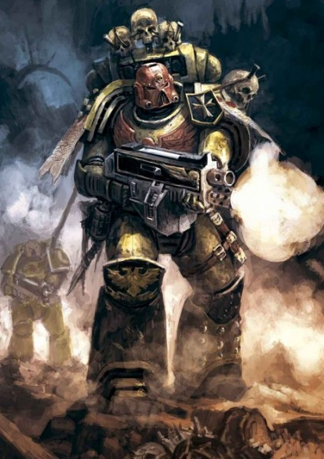

<!-- A0386-B0156 -->

原译文

Imperial Fists sternguard veteran of 1st Company conducting a combat action in the name of the Emperor 帝国之拳第一连队肃卫老兵以帝皇的名义进行战斗

**校订译文**

Imperial Fists sternguard veteran of 1st Company conducting a combat action in the name of the Emperor 帝国之拳第一连队肃卫老兵以帝皇的名义进行战斗

<!-- /A0386-B0156 -->

<!-- A0386-B0157 -->
### Recent Events 近期事件

原题：Recent Events 近期时间

<!-- /A0386-B0157 -->

<!-- A0386-B0158 -->
**英文原文**

Timeline

**补译**

时间线

<!-- /A0386-B0158 -->

<!-- A0386-B0159 -->
**英文原文**

Unknown (but before the 544.M32) - Malla Vajjl compliance. Imperial Fists fought with Orks there.

<!-- /A0386-B0159 -->

<!-- A0386-B0160 -->

原译文

未知（但在544.M32之前）- 马拉·瓦杰尔征服。帝国之拳在那里与兽人作战。

**校订译文**

年代不详，但早于544.M32：马拉·瓦杰尔征服行动，帝国之拳在当地与欧克作战。

<!-- /A0386-B0160 -->

<!-- A0386-B0161 -->
**英文原文**

378.M36: At the height of the Age of Apostasy, the Imperial Fists under Chapter Master Lazerian alongside the Black Templars, Soul Drinkers, Fire Hawks and forces of the Adeptus Mechanicus assault the Ecclesiarchal Palace on Terra, seat of Goge Vandire and his attempt to assume control of the Imperium.

<!-- /A0386-B0161 -->

<!-- A0386-B0162 -->

原译文

在叛教时代的鼎盛时期，战团长拉泽里安率领的帝国之拳与黑色圣堂、饮魂者、火鹰和机械教的部队一起袭击了泰拉上的国教宫殿，这是高戈·范迪尔的所在地，他试图控制帝国。

**校订译文**

378.M36：叛教时代最猖獗之际，战团长拉泽里安率帝国之拳，与黑色圣堂、饮魂者、火鹰及机械修会部队共同进攻泰拉的国教宫殿。试图独揽帝国大权的高戈·范迪尔正据守于此。

<!-- /A0386-B0162 -->

<!-- A0386-B0163 -->

原译文

654.M37: Fall of the Adamantium City 精金城陷落

**校订译文**

654.M37: Fall of the Adamantium City 精金城陷落

<!-- /A0386-B0163 -->

<!-- A0386-B0164 -->
**英文原文**

766.M37: The Dawn Hammer. Strike Force Ultra of the Imperial Fists destroyed the space hulk of the Ork Warboss Sunspitta.

<!-- /A0386-B0164 -->

<!-- A0386-B0165 -->

原译文

黎明之锤。帝国之拳的超级打击部队摧毁了欧克战争头目日吐的太空废船。

**校订译文**

766.M37：黎明之锤。帝国之拳的超级打击部队摧毁了欧克战争头目日吐的太空废船。

<!-- /A0386-B0165 -->

<!-- A0386-B0166 -->

原译文

???.M38: The Aridan Defence 阿里丹防御

**校订译文**

???.M38: The Aridan Defence 阿里丹防御

<!-- /A0386-B0166 -->

<!-- A0386-B0167 -->
**英文原文**

755.M38 : The Siege of Balle Alpha. The Imperial Fists defend a capital city against an Ork Waaagh! lead by warboss Gogard, inflicting heavy casualties and holding the city until reinforced by the Blood Angels. Tactical outlays remain of the defensive positions employed against an enemy armoured attack.

<!-- /A0386-B0167 -->

<!-- A0386-B0168 -->

原译文

巴勒主星围攻。帝国之拳保卫首都城市对抗由战争头目戈加德领导的欧克Waaagh！，造成重大伤亡，并控制了这座城市，直到被圣血天使增援。战术开支仍用于防御敌方装甲攻击的防御阵地。

**校订译文**

755.M38：巴勒主星围攻战。帝国之拳据守首都，抵御战争头目戈加德率领的欧克 Waaagh!，重创敌军，坚持到圣血天使援军到来。他们用于抵挡敌军装甲攻势的阵地战术部署图仍留存至今。

**校注：** 原文 tactical outlays 在此指战术布置材料；按阵地部署图理解，不译为费用或开支。

<!-- /A0386-B0168 -->

<!-- A0386-B0169 -->
**英文原文**

812.M39: Techmarine Suprema Lysol Blane authors the Liber Proditor Armorum.

<!-- /A0386-B0169 -->

<!-- A0386-B0170 -->

原译文

技术军士利索尔·布兰撰写了掠夺者装甲之书

**校订译文**

812.M39：最高科技战士利索尔·布兰撰写《叛徒军备之书》（Liber Proditor Armorum，书名暂译）。

**校注：** 原稿《掠夺者装甲之书》未体现 Proditor；此处保留拉丁书名，并将中文书名标为暂译，待核对应文献。Techmarine Suprema 暂译最高科技战士。

<!-- /A0386-B0170 -->

<!-- A0386-B0171 -->
**英文原文**

567.M40: A Chaos-inspired insurgence on the planet of Iduno is pacified. The Campaign included the Battle of Colonial Bridge which resulted in the promotion of Darnath Lysander.

<!-- /A0386-B0171 -->

<!-- A0386-B0172 -->

原译文

伊杜诺行星上混沌引发的叛乱得到平息。这场战役包括殖民桥战役，该战役导致了达纳斯·莱山德的晋升。

**校订译文**

567.M40：伊杜诺行星上一场受混沌煽动的叛乱被平息。此次战役包括殖民桥之战，达纳斯·莱山德在此战后获晋升。

<!-- /A0386-B0172 -->

<!-- A0386-B0173 -->
**英文原文**

585.M40: The Eldar cruiser Blood of Khaine is boarded and captured.

<!-- /A0386-B0173 -->

<!-- A0386-B0174 -->

原译文

灵族巡洋舰凯恩之血号被跳帮并被俘。

**校订译文**

585.M40：帝国之拳登上灵族巡洋舰凯恩之血号，将其夺取。

<!-- /A0386-B0174 -->

<!-- A0386-B0175 -->
**英文原文**

659.M40: The Siege of Haddrake Tor. A three year long campaign recovers the world Haddrake Tor from the forces of Chaos, 1st Company Captain Kleitus is lost but passes the Fist of Dorn to Darnath Lysander before his death and with it the 1st Captainship.

<!-- /A0386-B0175 -->

<!-- A0386-B0176 -->

原译文

哈德瑞克·托尔围城。一场为期三年的战役从混沌势力中夺回了哈德瑞克·托尔世界，第一连长克莱塔斯失踪了，但在他去世前将多恩之拳交给了达纳斯·莱桑德，并随之交给了第一队长。

**校订译文**

659.M40：哈德瑞克·托尔围攻战。历时三年的战役从混沌手中夺回了这个世界。第一连长克莱塔斯战死，但临终前将多恩之拳交给达纳斯·莱山德，同时将第一连长之职托付给他。

<!-- /A0386-B0176 -->

<!-- A0386-B0177 -->
**英文原文**

700's.M41: The Sabbat Worlds Crusade. A detachment of the Imperial Fists were called on by Warmaster Macaroth in the aftermath of the Siege of Vervunhive on Verghast. They were responsible for the final ceremonial destruction of the body of Heritor Asphodel and his command vehicle, The Spike.

<!-- /A0386-B0177 -->

<!-- A0386-B0178 -->

原译文

萨巴特世界原则。在维文巢都围城之后，战帅马卡洛斯召集了一支帝国之拳分队。他们对继承者阿斯弗德尔的尸体和他的指挥载具尖峰号的最后的仪式性破坏负责。

**校订译文**

700's.M41：萨巴特世界远征。维加斯特的维文巢都围攻战结束后，战帅马卡洛斯召来一支帝国之拳分队，由他们举行最终的销毁仪式，毁去继承者阿斯弗德尔的遗体及其指挥载具尖峰号。

<!-- /A0386-B0178 -->

<!-- A0386-B0179 -->

原译文

777.M41: The Battle of the Iron Labyrinth 钢铁迷宫之战

**校订译文**

777.M41: The Battle of the Iron Labyrinth 钢铁迷宫之战

<!-- /A0386-B0179 -->

<!-- A0386-B0180 -->
**英文原文**

790.M41: The Chapter takes part in the Nimbosa Crusade alongside the Black Templars and reclaim Nimbosa from the T'au Empire. Heavy casualties are incurred at the battle of Koloth Gorge.

<!-- /A0386-B0180 -->

<!-- A0386-B0181 -->

原译文

战团与黑色圣堂一起参加了宁博萨远征，并从钛帝国手中夺回宁博萨。科洛斯峡谷之战造成重大伤亡。

**校订译文**

790.M41：战团与黑色圣堂共同参加宁博萨远征，从钛帝国手中夺回宁博萨，但在科洛斯峡谷之战中伤亡惨重。

<!-- /A0386-B0181 -->

<!-- A0386-B0182 -->
**英文原文**

830.M41: The Tyros Gulf Campaign. Chapter Master Vladimir Pugh leads two-thirds of the Chapter to retake a string of worlds in the Tyros Gulf that were conquered by Rogal Dorn during the Great Crusade but subsequently lost. The Imperial Fists were ambushed by Illic Nightspear and Eldar from Craftworld Alaitoc and Pugh was nearly killed but the campaign ends in success.

<!-- /A0386-B0182 -->

<!-- A0386-B0183 -->

原译文

蒂罗斯湾战役。战团长弗拉基米尔·普格带领战团三分之二的人夺回了蒂罗斯湾的一系列世界，这些世界在大远征期间被罗格·多恩征服，但随后失去了。帝国之拳遭到来自阿莱托克方舟世界的伊利克·夜矛和灵族的伏击，普格差点被杀，但战役以成功告终。

**校订译文**

830.M41：蒂罗斯湾战役。战团长弗拉基米尔·普格率战团三分之二的兵力，收复罗格·多恩在大远征时征服、后来又失陷的蒂罗斯湾诸世界。帝国之拳遭到伊利克·夜矛及阿莱托克方舟世界灵族的伏击，普格险些丧命，但战役最终仍取得胜利。

<!-- /A0386-B0183 -->

<!-- A0386-B0184 -->
**英文原文**

853.M41: Alpha Legion forces intervene in the Krandor Rebellion, prompting the Imperial Fists, Fire Lords and Revilers to respond. The Space Marine forces successfully evacuate important artefacts before exterminatus is enacted.

<!-- /A0386-B0184 -->

<!-- A0386-B0185 -->

原译文

阿尔法军团部队干预了克兰多尔叛乱，促使帝国之拳、火焰领主和谩骂者做出回应。星际战士在灭绝令颁布之前成功疏散了重要造物。

**校订译文**

853.M41：阿尔法军团介入克兰多尔叛乱，帝国之拳、火焰领主与谩骂者随之出兵应对。星际战士在执行灭绝令前，成功转移了重要文物。

<!-- /A0386-B0185 -->

<!-- A0386-B0186 -->
**英文原文**

949.M41: The Imperial Fists tie the Crimson Fists for supremacy at the 814th Feast of Blades.

<!-- /A0386-B0186 -->

<!-- A0386-B0187 -->

原译文

在第814届刀锋盛宴上，帝国之拳与绯红之拳并列霸权。

**校订译文**

949.M41：第814届刀锋盛宴上，帝国之拳与绯红之拳并列夺魁。

<!-- /A0386-B0187 -->

<!-- A0386-B0188 -->
**英文原文**

955.M41: The Siege of Fort Mork. The 4th and 9th Companies laid siege to the Ork mega-stronghold named Fort Mork. The Imperial Fists were badly outnumbered but faced down three days of Orks hurling themselves at their siege lines, defeating the xenos with precision bolter fire and a dozen thunderfire cannons.

<!-- /A0386-B0188 -->

<!-- A0386-B0189 -->

原译文

莫尔克堡围攻。第4和第9连队围攻了名为莫尔克堡的欧克特大要塞。帝国之拳在人数上严重不足，但在三天内击退了欧克向他们的围攻线猛投的进攻，用精确的爆矢枪开火和十几门雷火炮击败了异型。

**校订译文**

955.M41：莫尔克堡围攻战。第四与第九连围攻欧克巨型要塞莫尔克堡。尽管敌军数量远超己方，帝国之拳仍连续三天抵挡欧克对围城阵线的猛攻，以精准的爆矢枪火力和十二门雷火炮击败异形。

<!-- /A0386-B0189 -->

<!-- A0386-B0190 -->
**英文原文**

959.M41: The Purging of Ganymede. The third company and at least one Land Raider Crusader conducted a campaign against the Contagion of Ganymede.

<!-- /A0386-B0190 -->

<!-- A0386-B0191 -->

原译文

净化木卫三。第三连队和至少一辆兰德掠袭者者十字军发动了一场对抗木卫三传染病的战役。

**校订译文**

959.M41：木卫三净化行动。第三连在至少一辆十字军型兰德掠袭者战车的支援下，向木卫三疫军发动进攻。

**校注：** Contagion of Ganymede 在此为交战对象的专名，暂译木卫三疫军；未按普通传染病解释，具体势力性质待核。

<!-- /A0386-B0191 -->

<!-- A0386-B0192 -->
**英文原文**

966.M41: Lysander leads the Imperial Fists to Malodrax and scours the Iron Warriors from the planet.

<!-- /A0386-B0192 -->

<!-- A0386-B0193 -->

原译文

莱山德带领帝国之拳前往马洛德拉克斯，并在行星上扫荡钢铁勇士。

**校订译文**

966.M41：莱山德率帝国之拳前往马洛德拉克斯，将钢铁勇士从该星球清除。

<!-- /A0386-B0193 -->

<!-- A0386-B0194 -->
**英文原文**

968.M41: 5th and 9th Companies are deployed to Khai-Zhan to suppress the Khai-Zhan Uprising alongside four Cadian regiments. The Imperial Fists force is decisive in countering the Night Lords taking part in the uprising and lays siege to the heavily fortified citadel the Palace of Peace.

<!-- /A0386-B0194 -->

<!-- A0386-B0195 -->

原译文

第五和第九连队与四个卡迪亚兵团一起部署到凯詹，镇压凯詹叛乱。帝国之拳部队在对抗参与叛乱的午夜领主方面起到了决定性作用，并围攻了戒备森严的和平宫殿城堡。

**校订译文**

968.M41：第五与第九连同四个卡迪亚团部署至凯詹，镇压当地叛乱。帝国之拳在对抗参战的午夜领主时发挥了决定性作用，并围攻防御坚固的和平宫殿。

<!-- /A0386-B0195 -->

<!-- A0386-B0196 -->
**英文原文**

969.M41 - The Invasion of Taladorn. Lysander leads Imperial Fists alongside Ultramarines and Blood Angels against Shon'tu's Sons of the Forge on Taladorn. Lysander's recklessness result in the near-total destruction of the 3rd Company and he is censured as a result.

<!-- /A0386-B0196 -->

<!-- A0386-B0197 -->

原译文

塔拉顿入侵。莱山德率领帝国之拳与极限战士和圣血天使队在塔拉顿对抗邵恩’图的铸炉之子。莱山德的鲁莽导致第三连队几乎全灭，他因此受到谴责。

**校订译文**

969.M41：塔拉顿入侵战。莱山德率帝国之拳，与极限战士、圣血天使并肩，在塔拉顿迎战邵恩·图的铸炉之子。莱山德的鲁莽导致第三连几乎全军覆没，他也因此受到惩处。

<!-- /A0386-B0197 -->

<!-- A0386-B0198 -->
**英文原文**

970.M41 - As part of his censure for Taladorn, Lysander is temporarily stripped of the First Captaincy and assigned to 3rd Company, which he is ordered to rebuild. As part of this penance, Lysander is ordered to undertake the Crusade of Thunder against the Orks. Following the Campaign, Tor Garadon is promoted to 3rd Captain and Lysander returns to First Captain.

<!-- /A0386-B0198 -->

<!-- A0386-B0199 -->

原译文

作为塔拉顿谴责的一部分，莱山德被暂时剥夺了第一连长的职务，并被分配到第三连队，他被命令重建第三连对。作为忏悔的一部分，莱山德被命令对欧克发动雷霆远征。战役结束后，托尔·加拉顿晋升为第三连长，莱山德回到第一连长。

**校订译文**

970.M41：作为塔拉顿失利后的处分，莱山德暂时被撤去第一连长职务，调往第三连，奉命重建该连。为赎罪，他还须领导对抗欧克的雷霆远征。战役结束后，托尔·加拉顿晋升第三连长，莱山德则恢复第一连长职务。

<!-- /A0386-B0199 -->

<!-- A0386-B0200 -->
**英文原文**

970.M41 - The Infestation on Drashin. Chapter Master Vladimir Pugh is slain battling Tyranids, and Vorn Hagan assumes leadership of the Chapter after Lysander refuses the honor.

<!-- /A0386-B0200 -->

<!-- A0386-B0201 -->

原译文

德拉辛群袭。战团长弗拉基米尔·普格在与泰伦的战斗中牺牲，在莱山德拒绝这一荣誉后，沃恩·哈根接管了战团的领导权。

**校订译文**

970.M41：德拉辛群袭。战团长弗拉基米尔·普格在对抗泰伦虫族时阵亡。莱山德拒绝接掌战团后，沃恩·哈根成为新任战团长。

<!-- /A0386-B0201 -->

<!-- A0386-B0202 -->
**英文原文**

971.M41 - The Fall of Malodrax. Most of the Imperial Fists, led by the Phalanx itself, battles Warsmith Shon'tu at Malodrax.

<!-- /A0386-B0202 -->

<!-- A0386-B0203 -->

原译文

马洛德拉克斯的陷落。大多数帝国之拳，由山阵号本身领导，在马洛德拉克斯与战争铁匠邵恩’图作战。

**校订译文**

971.M41：马洛德拉克斯陷落战。帝国之拳主力在山阵号引领下，于马洛德拉克斯迎战战争铁匠邵恩·图。

<!-- /A0386-B0203 -->

<!-- A0386-B0204 -->
**英文原文**

975.M41: The Ghallamore Cleansing. 2nd Company and Grey Knights under the command of Brother-Captain Arvann Stern cleanse Ghallamore of Skulltaker and his daemonic hordes.

<!-- /A0386-B0204 -->

<!-- A0386-B0205 -->

原译文

加拉莫尔净化。第二连队和灰骑士在兄弟连长艾维安·斯特恩的指挥下，清除了加拉莫尔的夺颅者和他的恶魔部落。

**校订译文**

975.M41：加拉莫尔净化行动。第二连与灰骑士在兄弟会连长艾维安·斯特恩指挥下，清除加拉莫尔的夺颅者及其恶魔大军。

<!-- /A0386-B0205 -->

<!-- A0386-B0206 -->
**英文原文**

975.M41: The 3rd Company is dispatched by Vorn Hagan to reclaim 18 worlds along the Eye of Terror which have risen up in heresy. After the battle the Imperial Fists become so impressed with the Cadian allies that they begin to train some.

<!-- /A0386-B0206 -->

<!-- A0386-B0207 -->

原译文

沃恩·哈根派遣第三连队沿着恐惧之眼夺回18个叛乱中崛起的世界。战斗结束后，帝国之拳对卡迪亚盟友印象深刻，他们开始训练一些人。

**校订译文**

975.M41：沃恩·哈根派第三连收复恐惧之眼周边18个因异端煽动而叛乱的世界。战后，帝国之拳对卡迪亚盟军的表现十分赞赏，开始训练其中一部分士兵。

<!-- /A0386-B0207 -->

<!-- A0386-B0208 -->
**英文原文**

981.M41: Captain Taelos undertakes a warrior pilgrimage, taking him to the worlds of Maelstrom, Choria, Fell Heart and Golgotha.

<!-- /A0386-B0208 -->

<!-- A0386-B0209 -->

原译文

泰洛斯连长进行了一次战士朝圣，他去了大漩涡、乔里亚、邪恶心脏和各各他世界。

**校订译文**

981.M41：泰洛斯连长踏上战士朝圣之旅，前往大漩涡、乔里亚、邪恶心脏与各各他等世界。

**校注：** 本段将 Maelstrom 列为一个世界，依原文保留；不直接等同亚空间大漩涡区域。

<!-- /A0386-B0209 -->

<!-- A0386-B0210 -->
**英文原文**

Reclaiming Rynn's World from Ork menace.

<!-- /A0386-B0210 -->

<!-- A0386-B0211 -->

原译文

从欧克的威胁中夺回林恩世界。

**校订译文**

从欧克手中收复瑞恩世界。

<!-- /A0386-B0211 -->

<!-- A0386-B0212 -->
**英文原文**

984.M41: The Crusade of Valorous Steel. The Imperial Fists defend Pharos from Dark Eldar raiders.

<!-- /A0386-B0212 -->

<!-- A0386-B0213 -->

原译文

英勇钢铁远征。帝国之拳保护法罗斯免受黑暗灵族袭击者的袭击。

**校订译文**

984.M41：英勇钢铁远征。帝国之拳在法罗斯抵御黑暗灵族袭击者。

<!-- /A0386-B0213 -->

<!-- A0386-B0214 -->
**英文原文**

988.M41: The Campaign of Fire and Steel. The 3rd Company and the Salamanders break the Alpha Legion hold on Magnas Prime

<!-- /A0386-B0214 -->

<!-- A0386-B0215 -->

原译文

火与钢战役。第三连队和火蜥蜴打破了阿尔法军团对马格纳斯主星的控制

**校订译文**

988.M41：火与钢战役。第三连与火蜥蜴打破阿尔法军团对马格纳斯主星的控制。

<!-- /A0386-B0215 -->

<!-- A0386-B0216 -->

原译文

Late M41: The Defence of Alamanis 阿拉马尼斯防御

**校订译文**

Late M41: The Defence of Alamanis 阿拉马尼斯防御

<!-- /A0386-B0216 -->

<!-- A0386-B0217 -->
**英文原文**

994.M41: The Triumph at Victorix. The 3rd Company and the 2nd Company of the Ultramarines fight against remnants of Hive Fleet Kraken.

<!-- /A0386-B0217 -->

<!-- A0386-B0218 -->

原译文

胜利星大捷。第三连队和极限战士的第二连队与克拉肯虫巢舰队的残余作战。

**校订译文**

994.M41：胜利星大捷。第三连与极限战士第二连对抗克拉肯虫巢舰队残部。

<!-- /A0386-B0218 -->

<!-- A0386-B0219 -->
**英文原文**

997.M41: The Defence of Miral II. A battle group led by Captain Lysander intercepts Hive Fleet Leviathan on the planet of Miral where defensive fortifications are established. Although severely outnumbered, the battle group drives off the Tyranid swarm on the seventh day, one day after the defence was expected to fail.

<!-- /A0386-B0219 -->

<!-- A0386-B0220 -->

原译文

米拉尔二号防御。莱山德连长率领的一个战斗群在米拉尔行星上拦截了虫巢舰队利维坦，那里建立了防御工事。尽管寡不敌众，但战斗群在第七天，也就是预计防御失败的第二天，击退了泰伦虫群。

**校订译文**

997.M41：米拉尔二号防御战。莱山德连长率战斗群，在米拉尔行星修筑防御工事，阻截利维坦虫巢舰队。尽管敌众我寡，他们仍于第七天击退泰伦虫群，比预计防线失守的时刻多坚持了一天。

**校注：** 原文标题为 Miral II，叙述仅写 Miral；保留其层级差异，不据此另定两颗星球。

<!-- /A0386-B0220 -->

<!-- A0386-B0221 -->
**英文原文**

998.M41: 2nd Company engages outlying elements of Waaagh! Dethzarka. 6th and 9th companies dispatched in support.

<!-- /A0386-B0221 -->

<!-- A0386-B0222 -->

原译文

第二连队与外围的德什扎卡的Waaagh！势力交战。第6和第9连队派出支援。

**校订译文**

998.M41：第二连与德什扎卡 Waaagh! 的外围部队交战，第六与第九连奉派增援。

<!-- /A0386-B0222 -->

<!-- A0386-B0223 -->
**英文原文**

998.M41: The Battle for the Endeavour of Will. The Star Fort Endeavour of Will is attacked by an Iron Warriors Warband. Enemy commander is believed to be the infamous Warsmith Shon’tu.

<!-- /A0386-B0223 -->

<!-- A0386-B0224 -->

原译文

奋进意志之战。星堡奋进意志号遭到钢铁勇士战帮的袭击。据信，敌方指挥官是臭名昭著的战争铁匠邵恩’图。

**校订译文**

998.M41：奋进意志之战。奋进意志号星堡遭钢铁勇士战帮袭击，据信敌军指挥官是臭名昭著的战争铁匠邵恩·图。

<!-- /A0386-B0224 -->

<!-- A0386-B0225 -->
**英文原文**

998.M41: Fleet Helios engaged in Eye of Terror containment operations.

<!-- /A0386-B0225 -->

<!-- A0386-B0226 -->

原译文

赫利俄斯舰队参与了恐惧之眼遏制行动。

**校订译文**

998.M41：赫利俄斯舰队参加遏制恐惧之眼势力的行动。

<!-- /A0386-B0226 -->

<!-- A0386-B0227 -->
**英文原文**

999.M41: The Siege of Hydra Cordatus. 3rd Company is lured into a trap on the surface of Hydra Cordatus by the Iron Warriors and is nearly destroyed in the ensuing siege. No more than thirty Battle-Brothers survive. Captain Tor Garadon, now Captain of the 2nd Company, is tasked to rebuild the 3rd Company once more just as Lysander had decades earlier. He is aided by those veterans who fought alongside him during the 3rd Company's Crusade of Thunder that was instrumental to its last reconstitution.

<!-- /A0386-B0227 -->

<!-- A0386-B0228 -->

原译文

九头蛇之心围攻。第三连队被钢铁勇士引诱到九头蛇之心表面的陷阱中，在随后的围攻中几乎被摧毁。幸存下来的战斗兄弟不超过三十人。托尔·加拉顿连长现在是第二连队的连长，他的任务是再次重建第三连队，就像几十年前莱山德一样。他得到了那些在第三连队雷霆远征期间与他并肩作战的老兵的帮助，这对第三连的最后一次重组起到了重要作用。

**校订译文**

999.M41：九头蛇之心围攻战。第三连在九头蛇之心地表落入钢铁勇士设下的陷阱，随后的围攻几乎使其全灭，幸存的战斗兄弟不超过三十人。此时担任第二连长的托尔·加拉顿受命重建第三连，一如数十年前的莱山德。他得到一批老兵协助；这些人曾与他共同参加第三连的雷霆远征，而那场远征正是上一次重建的关键。

<!-- /A0386-B0228 -->

<!-- A0386-B0229 -->
**英文原文**

999.M41: At least five companies take part defending against the 13th Black Crusade, smashing into traitor Astartes at Cadia. The 1st, 2nd, and elements of the 3rd companies are instrumental in defending strategic locations on Cadia and 2nd Company wins battle honours for defeating a horde of mutants numbering 10,000.

<!-- /A0386-B0229 -->

<!-- A0386-B0230 -->

原译文

至少有五个连队参与了第13次黑色远征的防御，在卡迪亚粉碎了叛徒阿斯塔特。第1、第2和第3连队的部队在保卫卡迪亚的战略位置方面发挥了重要作用，第2连击败了1万名变种人，赢得了战斗荣誉。

**校订译文**

999.M41：至少五个连参加抵御第十三次黑色远征的战斗，在卡迪亚猛击叛徒阿斯塔特。第一、第二连及第三连的部分部队在保卫卡迪亚战略要地时发挥了重要作用。第二连击败一支万人的变种人大军，赢得战斗荣誉。

<!-- /A0386-B0230 -->

<!-- A0386-B0231 -->
**英文原文**

999.M41: The Battle of the Phalanx — The 3rd Company defended the Phalanx from a Daemonic boarding action led by Iron Warriors Warsmith Shon'tu and the Daemon Be'lakor. Shon'tu and Be'lakor were seeking to outdo Abaddon's 13th Black Crusade by infesting the massive starship while on station in the Sol System and using it to bombard the Imperial Palace. Captain Tor Garadon commanded 3rd Company's defence of Phalanx. His forces inflicted extreme casualties on the attackers and manoeuvred Phalanx into the warp in order to protect Holy Terra should they fail in repelling the assault. The Legion of the Damned arrived to assist Garadon's forces as the battle grew desperate. Ultimately the Fists prevailed and the Phalanx set course for Cadia.

<!-- /A0386-B0231 -->

<!-- A0386-B0232 -->

原译文

山阵号之战 — 第三连队在钢铁勇士战争铁匠绍恩’图和比拉克率领的恶魔跳帮行动中保卫了山阵号。绍恩’图和比拉克试图通过在太阳系中驻扎时侵扰巨大的星舰并用它轰炸皇宫来超越阿巴顿的第13次黑色远征。托尔·加拉顿连长指挥第三连队对山阵号的防御。他的部队给袭击者造成了极大的伤亡，并在击退进攻失败时，将山阵号开进亚空间，以保护神圣泰拉。当战斗变得绝望时，咒缚军团抵达协助加拉顿的部队。最终，帝国之拳获胜，山阵号确定了卡迪亚的方向。

**校订译文**

999.M41：山阵号之战。第三连保卫山阵号，抵挡钢铁勇士战争铁匠邵恩·图和恶魔比拉克尔率领的跳帮部队。两名敌酋妄图夺取停驻太阳系的巨舰，以其炮轰皇宫，建立胜过阿巴顿第十三次黑色远征的“功业”。托尔·加拉顿连长指挥第三连抵抗，重创进犯之敌。他还命令山阵号驶入亚空间，以免一旦守舰失败，神圣泰拉便遭其炮击。战况趋于绝望时，咒缚军团前来增援。帝国之拳最终获胜，山阵号随即驶向卡迪亚。

<!-- /A0386-B0232 -->

<!-- A0386-B0233 -->
**英文原文**

~999.M41: Imperial Fists elements from Terra arrived to aid the reborn Roboute Guilliman during his battle against the Thousand Sons on Luna. A detachment of Imperial Fists forces secured the Astronomican and the Forbidden Fortress as Terra was engulfed in Chaos. During the battle Chapter Master Vorn Hagan was killed and he was succeeded by Gregor Dessian. The Imperial Fists went on to contribute forces to Guilliman's Indomitus Crusade.

<!-- /A0386-B0233 -->

<!-- A0386-B0234 -->

原译文

来自泰拉的帝国之拳成员抵达，帮助重生的罗伯特·基里曼在与月球上的千子对抗中作战。当泰拉陷入混沌时，一支帝国之拳部队保护了星炬和禁忌堡垒。在战斗中，战团长沃恩·哈根被杀，格雷戈·德西安接替了他的职位。帝国之拳继续为基里曼的不屈远征贡献力量。

**校订译文**

~999.M41：来自泰拉的帝国之拳部队赶往月球，支援复生的罗保特·基里曼对抗千子。泰拉陷入混沌灾乱时，另一支帝国之拳分队守住了星炬与禁忌堡垒。战团长沃恩·哈根在战斗中阵亡，由格雷戈·德西安继任。此后，帝国之拳派军参加基里曼的不屈远征。

<!-- /A0386-B0234 -->

<!-- A0386-B0235 -->
**英文原文**

~999.M41: The Phalanx arrives in orbit over Terra to safeguard the planet while Guilliman is away waging the Indomitus Crusade. It includes a company of Imperial Fists under Captain Tor Garadon, who deploys on Terra to help reestablish order on the planet following the Sack of the Lion's Gate. The Fists work closely with the Adeptus Custodes against Chaos Cults such as The Splintered. They later help put down the Hexarchy's coup, during which they battle the conspirators Minotaurs allies.

<!-- /A0386-B0235 -->

<!-- A0386-B0236 -->

原译文

山阵号抵达泰拉上空的轨道，以保护行星，而基里曼正在进行不屈远征。它包括一个由托尔·加拉顿连长领导的帝国之拳连队，他部署在泰拉上，在狮门劫掠后帮助重建行星上的秩序。帝国之拳与禁军密切合作，对抗混沌教派，如裂痕。后来，他们帮助镇压了六头政变，在此期间，他们与共谋者的米诺陶盟友作战。

**校订译文**

~999.M41：基里曼率不屈远征离开期间，山阵号驶抵泰拉轨道，守护这颗星球。舰上载有托尔·加拉顿连长统率的一个帝国之拳连队，随后部署至泰拉，协助恢复狮门劫掠后的秩序。他们与帝皇禁军密切合作，打击裂痕等混沌教派。其后，帝国之拳参与平定六头政变，并与阴谋集团的盟军米诺陶战团交战。

<!-- /A0386-B0236 -->

<!-- A0386-B0237 -->

原译文

Early M42: The boarding of the Blood Revenant 血猎号跳帮

**校订译文**

Early M42: The boarding of the Blood Revenant 血猎号跳帮

<!-- /A0386-B0237 -->

<!-- A0386-B0238 -->

原译文

???.M42: The Reconquest of Talixetaca 塔利克塞塔卡再征服

**校订译文**

???.M42: The Reconquest of Talixetaca 塔利克塞塔卡再征服

<!-- /A0386-B0238 -->

<!-- A0386-B0239 -->

原译文

???.M42: The Defence of Alamanis 防御阿拉马尼斯

**校订译文**

???.M42: The Defence of Alamanis 防御阿拉马尼斯

<!-- /A0386-B0239 -->

<!-- A0386-B0240 -->

原译文

???.M42: The Xaltoic Heresy 萨尔托伊克叛乱

**校订译文**

???.M42: The Xaltoic Heresy 萨尔托伊克叛乱

<!-- /A0386-B0240 -->

<!-- A0386-B0241 -->

原译文

???.M42: The Invasion of Tsadrekha 入侵赛德瑞卡

**校订译文**

???.M42: The Invasion of Tsadrekha 入侵赛德瑞卡

<!-- /A0386-B0241 -->

<!-- A0386-B0242 -->

原译文

???.M42: The siege of Ironhold. 铁堡围攻

**校订译文**

???.M42: The siege of Ironhold. 铁堡围攻

<!-- /A0386-B0242 -->

<!-- A0386-B0243 -->

原译文

???.M42: The War for the Sithoza System 西托扎星系战争

**校订译文**

???.M42: The War for the Sithoza System 西托扎星系战争

<!-- /A0386-B0243 -->

<!-- A0386-B0244 -->
**英文原文**

???.M42: The Battle of Brax. The 4th Company of the Imperial Fists under Alars Lydoro gains a legendary victory over the Alpha Legion on Brax.

<!-- /A0386-B0244 -->

<!-- A0386-B0245 -->

原译文

布拉克斯之战。阿拉斯·莱多罗领导的帝国之拳第四连队在布拉克斯取得了对阿尔法军团的传奇胜利。

**校订译文**

???.M42：布拉克斯之战。阿拉斯·莱多罗领导的帝国之拳第四连队在布拉克斯取得了对阿尔法军团的传奇胜利。

<!-- /A0386-B0245 -->

<!-- A0386-B0246 -->

原译文

???.M42: The Invasion of Xendrya 入侵辛德里亚

**校订译文**

???.M42: The Invasion of Xendrya 入侵辛德里亚

<!-- /A0386-B0246 -->

<!-- A0386-B0247 -->

原译文

???.M42: The Battle of Gandor's Providence 甘多尔神恩之战

**校订译文**

???.M42: The Battle of Gandor's Providence 甘多尔神恩之战

<!-- /A0386-B0247 -->

<!-- A0386-B0248 -->

原译文

???.M42: Waaagh! Wazkrumpa 瓦兹克伦帕的Waaagh！

**校订译文**

???.M42: Waaagh! Wazkrumpa 瓦兹克伦帕的Waaagh！

<!-- /A0386-B0248 -->

<!-- A0386-B0249 -->

原译文

???.M42: The Battle for Protogone V 普罗托贡五号之战

**校订译文**

???.M42: The Battle for Protogone V 普罗托贡五号之战

<!-- /A0386-B0249 -->

<!-- A0386-B0250 -->

原译文

???.M42: Defending Obstinax against Necrons 防御奥斯蒂纳克斯对抗死灵

**校订译文**

???.M42: Defending Obstinax against Necrons 在奥斯蒂纳克斯抵御太空死灵

<!-- /A0386-B0250 -->

<!-- A0386-B0251 -->
**英文原文**

M42: The War of Beasts on Vigilus. 3 Companies and 1 demi-company under 5th Company Captain Dravastis Fane are sent to the warzone.

<!-- /A0386-B0251 -->

<!-- A0386-B0252 -->

原译文

警戒星的野兽战争。德拉瓦蒂斯·费恩连长率领的3个连队和1个半连被派往战区。

**校订译文**

M42：警戒星的野兽之战。第五连长德拉瓦蒂斯·费恩率三个连与一个半连编队前往战区。

**校注：** War of Beasts 统一野兽之战，区别本篇M32的War of the Beast野兽战争。a demi-company 是一个半连规模的编队，并非一点五个连。

<!-- /A0386-B0252 -->

<!-- A0386-B0253 -->

原译文

???.M42: The Invasion of the Odoacer System 奥多亚克星系的入侵

**校订译文**

???.M42: The Invasion of the Odoacer System 奥多亚克星系的入侵

<!-- /A0386-B0253 -->

<!-- A0386-B0254 -->
**英文原文**

???.M42: The Battle of Xalladin. The Imperial Fists 3rd Company nearly comes to blows against the Iron Hands.

<!-- /A0386-B0254 -->

<!-- A0386-B0255 -->

原译文

沙拉丁之战。帝国之拳第三连队几乎要对钢铁之手发起攻击。

**校订译文**

???.M42：沙拉丁之战。帝国之拳第三连与钢铁之手险些爆发冲突。

<!-- /A0386-B0255 -->

<!-- A0386-B0256 -->

原译文

???.M42: The Arks of Omen Campaign 噩兆方舟战役

**校订译文**

???.M42: The Arks of Omen Campaign 噩兆方舟战役

<!-- /A0386-B0256 -->

<!-- A0386-B0257 -->

原译文

Battle of Malak 马拉克之战

**校订译文**

Battle of Malak 马拉克之战

<!-- /A0386-B0257 -->

<!-- A0386-B0258 -->
**英文原文**

???.M42: The Fourth Tyrannic War. Captain Tor Garadon commands the Phalanx and more than three hundred Imperial Fists, as part of the Imperium's defence of Sanctum.

<!-- /A0386-B0258 -->

<!-- A0386-B0259 -->

原译文

第四次泰伦战争。托尔·加拉顿连长指挥山阵号和三百多名帝国之拳，作为帝国圣地防御的一部分。

**校订译文**

???.M42：第四次泰伦战争。托尔·加拉顿连长指挥山阵号与三百余名帝国之拳，参加帝国对圣所星的防御。

**校注：** Sanctum 为本段被防御的地点专名，暂译圣所星；原“帝国圣地”误作泛称。

<!-- /A0386-B0259 -->

<!-- A0386-B0260 -->
### Undated 无日期

<!-- /A0386-B0260 -->

<!-- A0386-B0261 -->
**英文原文**

Crusade of Fire: A major Imperial Crusade launched in M41 to reclaim the worlds of the Corvus Sub-sector.

<!-- /A0386-B0261 -->

<!-- A0386-B0262 -->

原译文

火焰远征：M41发起的一场大型帝国远征，旨在夺回科沃斯分区的世界。

**校订译文**

火焰远征：M41发起的大规模帝国远征，旨在收复科沃斯次星区的各个世界。

<!-- /A0386-B0262 -->

<!-- A0386-B0263 -->
**英文原文**

The Tunis Action: The planet Tunis is attacked by the Evil Sunz Orks and issues a distress call. Scouts from the 10th Company are first to respond, followed by 1st company, defeating the Ork force.

<!-- /A0386-B0263 -->

<!-- A0386-B0264 -->

原译文

突尼斯行动：突尼斯行星遭到邪日欧克的攻击，并发出求救信号。第10连队的侦察兵首先做出回应，随后是第1连队，击败了欧克部队。

**校订译文**

突尼斯行动：突尼斯行星遭到邪日欧克的攻击，并发出求救信号。第10连队的侦察兵首先做出回应，随后是第1连队，击败了欧克部队。

<!-- /A0386-B0264 -->

<!-- A0386-B0265 -->
**英文原文**

While fighting against the forces of Chaos on Opis, the Imperial Fists are called on to sanction the rogue Maerorus Temple Assassin Legienstrasse.

<!-- /A0386-B0265 -->

<!-- A0386-B0266 -->

原译文

在俄庇斯上与混沌部队作战时，帝国之拳被要求制裁变节莫鲁思神庙刺客莱吉恩斯特拉塞。

**校订译文**

在俄庇斯与混沌势力交战期间，帝国之拳奉命制裁变节的莫鲁思神庙刺客莱吉恩斯特拉塞。

<!-- /A0386-B0266 -->

<!-- A0386-B0267 -->
**英文原文**

The Conquest of Uttu Prime: The Imperial Fists battle the Necron Overlord Zahndrekh for control of Uttu Prime.

<!-- /A0386-B0267 -->

<!-- A0386-B0268 -->

原译文

征服乌图主星：帝国之拳与死灵霸主赞德瑞克争夺乌图主星的控制权。

**校订译文**

乌图主星征服战：帝国之拳与太空死灵霸主赞德瑞克争夺乌图主星。

<!-- /A0386-B0268 -->

<!-- A0386-B0269 -->
**英文原文**

The Scouring of Vernalis: Task Force Gauntlet liberates the planet of Vernalis from Chaos. The Task Force is composed of elements of the 10th, 5th, and 1st companies and defeats a warband of Roaring Blades and Emperor's Children under the command of Arch Traitor Sybaris.

<!-- /A0386-B0269 -->

<!-- A0386-B0270 -->

原译文

净化维纳利斯：臂铠特遣部队将维纳利斯行星从混沌中解放出来。该特遣部队由第10、第5和第1连队的成员组成，击败了在大叛徒锡巴里斯的指挥下咆哮之刃和帝皇之子组成的战斗群。

**校订译文**

维纳利斯扫荡战：由第十、第五与第一连部分兵力组成的臂铠特遣部队，将维纳利斯从混沌手中解放。他们击败了大叛徒锡巴里斯指挥、由咆哮之刃与帝皇之子组成的战帮。

<!-- /A0386-B0270 -->

<!-- A0386-B0271 -->
**英文原文**

Battle of Mithron: The Imperial Fists 5th Company is destroyed defending the shrine world of Mithron, home to the sacred Liber Mithros, from Chaos daemons and Black Legion Chaos Space Marines. However, two survivors manage to keep the artefact secure and are rescued by a force of Ultramarines.

<!-- /A0386-B0271 -->

<!-- A0386-B0272 -->

原译文

米瑟伦之战：帝国之拳第五连队被摧毁，保卫神圣的密斯洛之书的圣地世界米瑟伦，免受混沌恶魔和黑色军团混沌星际战士的攻击。然而，两名幸存者设法保护了这件圣物的安全，并被一支极限战士救出。

**校订译文**

米瑟伦之战：帝国之拳第五连保卫珍藏神圣《密斯洛之书》的圣地世界米瑟伦，迎战混沌恶魔与黑色军团，几乎全军覆没。不过，两名幸存者成功保住圣物，并获极限战士部队救援。

**校注：** 英文称第五连 destroyed，但紧接着明确有两名幸存者，译作几乎全军覆没以保留完整事实。

<!-- /A0386-B0272 -->

<!-- A0386-B0273 -->
**英文原文**

The Jorgurd Cluster: The Alpha Legion inspired rebellion at Klebendor III is crushed and the heretic's leader Ialo Vex and his inner circle are captured. The Alpha Legion forces are pursued to a remote base hidden in the asteroid belt at the Rathnorn system where they are destroyed.

<!-- /A0386-B0273 -->

<!-- A0386-B0274 -->

原译文

乔古德星群：阿尔法军团在克莱本多三号发起的叛乱被粉碎，叛乱领袖伊洛·维克斯和他的内环被抓获。阿尔法军团部队被追击到拉特霍恩星系小行星带中的一个偏远基地，在那里他们被摧毁。

**校订译文**

乔古德星群：帝国之拳粉碎了阿尔法军团在克莱本多三号煽动的叛乱，俘虏异端首领伊洛·维克斯及其心腹。他们追击阿尔法军团，直至发现藏在拉特霍恩星系小行星带中的偏远基地，并将敌军消灭。

<!-- /A0386-B0274 -->

<!-- A0386-B0275 -->
**英文原文**

Battle of Naeuysk Gorge: Fourteen Rhinos are lost to a Night Lords ambush. The Imperial Fists counter-attack the following morning, successfully pushing back the Chaos Space Marines and reclaiming the lost vehicles. A casualty rate of nearly 85% is incurred.

<!-- /A0386-B0275 -->

<!-- A0386-B0276 -->

原译文

奈欧依斯克峡谷之战：14辆犀牛在午夜领主的伏击中丢失。第二天早上，帝国之拳进行了反击，成功击退了混沌星际战士，夺回了丢失的载具。伤亡率接近85%。

**校订译文**

奈欧依斯克峡谷之战：帝国之拳遭午夜领主伏击，损失十四辆犀牛运兵车。次日清晨，他们反击成功，逼退混沌星际战士并夺回载具，但伤亡率接近85%。

<!-- /A0386-B0276 -->

<!-- A0386-B0277 -->
**英文原文**

Ironstar of Yorg: Captain Lysander and his Strike Force Ultra recaptured the Ramilles Class Star-fort from the Iron Warriors.

<!-- /A0386-B0277 -->

<!-- A0386-B0278 -->

原译文

约克铁星：莱山德连长和他的超级打击部队从钢铁勇士手中夺回了拉米雷斯级星堡。

**校订译文**

约克铁星：莱山德连长率超级打击部队，从钢铁勇士手中夺回这座拉米雷斯级星堡。

<!-- /A0386-B0278 -->

<!-- A0386-B0279 -->
**英文原文**

Karkason Crusade: Over 700 Imperial Fists led by Chapter Master Vladimir Pugh, with aid from the Imperial Navy and several Astra Militarum Regiments, reclaim the valuable Mining World Karkason, after its Planetary Governor, Fulgor Sagramoso, seceded from the Imperium.

<!-- /A0386-B0279 -->

<!-- A0386-B0280 -->

原译文

卡尔卡森远征：在帝国海军和几个星界军兵团的帮助下，由战团长弗拉基米尔·普格领导的700多名帝国之拳夺回了宝贵的采矿世界卡尔卡森，此前其行星总督弗尔戈·萨格拉莫索脱离了帝国。

**校订译文**

卡尔卡森远征：采矿世界卡尔卡森的行星总督弗尔戈·萨格拉莫索宣布脱离帝国后，战团长弗拉基米尔·普格率七百余名帝国之拳，在帝国海军与数个星界军团的支援下夺回了这个资源重地。

<!-- /A0386-B0280 -->

<!-- A0386-B0281 -->
**英文原文**

Lacrima Dolorosa Crusade: Launched as a fact finding mission against the newly arrived Tyranids, in the early years of the First Tyrannic War. The entire Imperial Fists Chapter takes part, alongside the Imperial Navy and Companies of the Space Wolves, Blood Angels, Ultramarines and Blood Drinkers.

<!-- /A0386-B0281 -->

<!-- A0386-B0282 -->

原译文

悲恸之泪远征：在第一次泰伦战争初期，作为一项针对新抵达的泰伦的实况调查任务而发起。整个帝国之拳战团都参与其中，还有帝国海军和太空野狼、圣血天使、极限战士和饮血者的连队。

**校订译文**

悲恸之泪远征：第一次泰伦战争初期，帝国之拳为调查新出现的泰伦虫族而发起远征。整个战团投入行动，并得到帝国海军，以及太空野狼、圣血天使、极限战士和饮血者诸连队的支援。

<!-- /A0386-B0282 -->

<!-- A0386-B0283 -->
## Gene-seed 基因种子

<!-- /A0386-B0283 -->

<!-- A0386-B0284 -->
**英文原文**

The Imperial Fists gene-seed possesses two unique characteristics that are expressed in physiological and the behavioural terms. Physiologically, the Chapter has lost two of the organs particular to Space Marines: the Betcher's Gland, which allows the Marine to produce acidic spittle, and the Sus-an Membrane, which allows the Marine to enter a state of suspended animation. Behaviourally, the Imperial Fists are given to an obsession with conquering pain by force of will and discipline. The Chapter's obsession with willpower and discipline is sometimes characterized as further involving a deep-seated drive towards self-sacrifice or penance. This trait is often simplified as merely involving a stubborn disposition.

<!-- /A0386-B0284 -->

<!-- A0386-B0285 -->

原译文

帝国之拳基因种子具有两个独特的特征，分别在生理和行为方面表现出来。从生理上讲，战团失去了星际战士特有的两个器官：贝彻腺体，它使星际战士能够产生酸性唾液，以及苏安脑膜，它允许星际战士进入假死状态。在行为上，帝国之拳被赋予了通过意志力和纪律征服痛苦的痴迷。战团对意志力和纪律的痴迷有时被描述为进一步涉及对自我牺牲或忏悔的根深蒂固的驱动力。这种特质通常被简化为仅仅涉及固执的性格。

**校订译文**

帝国之拳的基因种子具有两项独特的表现，分别见于生理与行为层面。生理上，战团失去了星际战士特有的两种器官：用于分泌酸性唾液的贝彻腺体，以及能使战士进入假死状态的苏安脑膜。行为上，帝国之拳执着于以意志与自律克服痛苦；这种执着有时还被认为包含根深蒂固的自我牺牲或赎罪冲动。人们往往简单地将它概括为性格固执。

<!-- /A0386-B0285 -->

<!-- A0386-B0286 -->
**英文原文**

The Chapter considers the behavioural characteristics of its gene-seed to be both a strength and a weakness. On the one hand, such tendencies engender stubborn conduct on the battlefield and ensure battle-brothers are more likely to fight on despite terrible injuries. On the other hand, Imperial Fists may subconsciously invite such injuries and difficulty, which can imperial battle planning and lead to unnecessary risks of personnel and material. Along these lines, the Imperial Fists are noted to be reluctant to accept the possibility of defeat when retreating would be the wisest course of action. The Chapter consciously attempts to minimize the liabilities of these behavioural traits while maximizing the benefits.

<!-- /A0386-B0286 -->

<!-- A0386-B0287 -->

原译文

战团认为其基因种子的行为特征既是优势也是劣势。一方面，这种倾向会在战场上产生顽固的行为，并确保战斗兄弟更有可能在严重受伤的情况下继续战斗。另一方面，帝国之拳可能会在潜意识中引发这样的伤害和困难，这可能会导致帝国战斗计划和不必要的人员和物资风险。根据这些原则，帝国之拳不愿意接受失败的可能性，因为撤退是最明智的行动。战团有意识地试图尽量减少这些行为特征的责任，同时最大限度地提高收益。

**校订译文**

战团认为，基因种子带来的这些行为倾向既是优势，也有弱点。它们使战士在战场上坚韧不屈，即使重伤也更可能坚持战斗；但帝国之拳也可能下意识地寻求伤痛与困境，危及作战计划，让人员和装备承担不必要的风险。因此，他们往往不愿承认失败的可能，即便撤退才是最明智的选择。战团一直有意识地抑制这些特质的弊端，并尽量发挥其长处。

**校注：** imperial battle planning 为 imperil battle planning 的拼写误差，意为危及作战计划，不是帝国战斗计划。

<!-- /A0386-B0287 -->

<!-- A0386-B0288 -->
## Overview 概述

<!-- /A0386-B0288 -->

<!-- A0386-B0289 -->
### Tactics 战术

<!-- /A0386-B0289 -->

<!-- A0386-B0290 -->
**英文原文**

The Imperial Fists, from their very inception, were known to be a peerless crusaders and resolute warriors. They are notorious in their unwillingness to give ground and unhesitating in sacrificing themselves to secure victory. This has fit them role in specializations that include siege warfare, the erecting of defensive bastions and networks, and fleet combat. They are unparalleled in their ability to analyze enemy defenses and exploit weak points as well as erecting their own indomitable bastions. Ever since the Emperor declared that Rogal Dorn return with him to Terra to fortify the Imperial Palace at the end of the Great Crusade, the Imperial Fists have been known as the Defenders of Terra. This is a title they continue to bear with immense pride.

<!-- /A0386-B0290 -->

<!-- A0386-B0291 -->

原译文

帝国之拳从一开始就被认为是无与伦比的十字军战士和坚定的战士。他们不愿让步，毫不犹豫地牺牲自己以确保胜利，这是声名狼藉的。这使他们在包括攻城战、建立防御堡垒和网络以及舰队作战在内的专业化中发挥了作用。他们分析敌人防御、利用弱点以及建立自己不屈不挠的堡垒的能力是无与伦比的。自从帝皇宣布罗格·多恩在大远征结束时与他一起返回泰拉以巩固皇宫以来，帝国之拳就被称为泰拉防卫者。这是他们继续以极大的自豪感获得的头衔。

**校订译文**

帝国之拳自成立之初，便以卓越的远征本领与坚忍的战士闻名。他们绝不轻易退让，为夺取胜利会毫不犹豫地牺牲自己。这些特质使他们尤其适合攻城战、防御堡垒与防线的建设，以及舰队作战。他们善于分析敌军防御、利用薄弱点，也能筑起自身难以攻破的堡垒。大远征末期，帝皇命罗格·多恩随自己返回泰拉，加固皇宫。从此，帝国之拳便获得“泰拉的捍卫者”之名，并始终以此为荣。

<!-- /A0386-B0291 -->

<!-- A0386-B0292 -->
**英文原文**

The Imperial Fists stubbornness in defense has sometimes gone beyond the pale of reason. There are reports of Imperial Fists forces that could have been saved had its warriors simply withdrawn when the time was right. Indeed, even in victories the Imperial Fists are known to suffer high casualties due to their stubborn and inflexible nature.

<!-- /A0386-B0292 -->

<!-- A0386-B0293 -->

原译文

帝国之拳在防守上的固执有时已经超出了理智的范围。有报告称，如果帝国之拳的战士在时机成熟时撤离，他们本可以得救。事实上，即使在胜利中，帝国之拳也因其顽固和不灵活的性质而伤亡惨重。

**校订译文**

帝国之拳坚守阵地的执念有时超出了理性的界限。记载中，有些部队原本只需及时撤退就能保全。即使赢得胜利，他们也常因固执、不知变通而付出惨重伤亡。

<!-- /A0386-B0293 -->

<!-- A0386-B0294 -->
**英文原文**

Due to a preference for heavy firepower and marksmanship, Imperial Fists spend a disproportionately long period of time serving in Fire Support Squads.

<!-- /A0386-B0294 -->

<!-- A0386-B0295 -->

原译文

由于偏爱重型火力和射击术，帝国之拳在火力支援小队服役的时间过长。

**校订译文**

帝国之拳偏爱重火力和精准射击，因此在火力支援小队服役的时间通常格外长。

<!-- /A0386-B0295 -->

<!-- A0386-B0296 -->
### Organization 组织

<!-- /A0386-B0296 -->

<!-- A0386-B0297 -->
### Heresy-Era Organization 叛乱时期组织

<!-- /A0386-B0297 -->

<!-- A0386-B0298 -->
**英文原文**

During the Great Crusade and Horus Heresy the Fists were largely compliant with the Principia Bellicosa template of organization, maintaining roughly 100,000 warriors. It consisted of Companies grouped into Flexible Battalions, with the largest such standing formations being dubbed Crusades or Households. Company-level Captains were functionally the most senior position, though in truth many officers had additional authority based upon the level of favor and responsibility placed upon them by Rogal Dorn. Theatre-specific commands included Marshals, Fleet Masters, and Siege Masters. Lords Castellan were senior masters of defense appointed to garrison and hold Sectors of space, while Lords Seneschal were responsible for developing crusading strategies of whole spheres of the galaxy.

<!-- /A0386-B0298 -->

<!-- A0386-B0299 -->

原译文

在大远征和荷鲁斯叛乱期间，帝国之拳在很大程度上符合战策基理的组织模板，保留了大约10万名战士。它由组成可变营的连队组成，最大的常备编队被称为十字军或兄弟会。连队级连长在职能上是最高级别的职位，尽管事实上，许多军官根据罗格·多恩赋予他们的支持和责任程度拥有额外的权力。战区特定的指挥部包括元帅、舰队之主和攻城大师。堡主领主是被任命为驻军和控制太空区域的高级防御大师，而总管领主则负责制定整个银河系的远征战略。

**校订译文**

大远征与荷鲁斯之乱期间，帝国之拳大体遵循《军团组织法典》的编制，拥有约十万名战士。各连可灵活组成营，最大的常备编队称为“远征军”或“扈从军”。常规体系中，连长是最高层级的正式指挥职位；但实际上，不少军官会因多恩的信任及其赋予的职责而获得额外权力。战区专项指挥职务包括元帅、舰队大师与攻城大师。堡主领主是资深防御专家，负责驻守并控制指定星区；总管领主则负责制定覆盖银河大片区域的远征战略。

**校注：** 原文一方面称连长在职能上最高，另一方面列出营及更大编队；按原文保留正式连级职务与额外统辖权的区别，不擅增固定军阶。

<!-- /A0386-B0299 -->

<!-- A0386-B0300 -->
**英文原文**

During this time, the Legion was blessed with the most cutting-edge Imperial equipment and often chosen for testing new designs such as the Assault Cannon. Being the strongest proponents for Tactical Dreadnought Armour, the Imperial Fists also commanded a significant number of Terminator Squads alongside larger complements of heavy tanks and Dreadnoughts. The last great facet of the Legion was its large fleet, which numbered over 1,500 warships. This naval might was the greatest of any other Astartes Legion.

<!-- /A0386-B0300 -->

<!-- A0386-B0301 -->

原译文

在此期间，军团拥有最先进的帝国装备，经常被选中测试突击炮等新设计。作为战术无畏装甲的最强支持者，帝国之拳还指挥着大量的终结者小队，以及重型坦克和无畏装甲的更大补充。军团的最后一个伟大方面是其庞大的舰队，拥有1500多艘战舰。这支海军力量是阿斯塔特军团中最强大的。

**校订译文**

这一时期，军团配备帝国最先进的装备，常被选中测试突击炮等新式武器。帝国之拳大力推崇战术无畏装甲，拥有大量终结者小队，也配属了数量可观的重型坦克与无畏机甲。军团的另一大支柱是拥有超过1,500艘战舰的庞大舰队，其海军力量冠绝所有阿斯塔特军团。

<!-- /A0386-B0301 -->

<!-- A0386-B0302 -->
### Known units of the Great Crusade and Horus Heresy 大远征与荷鲁斯之乱时期的已知单位

原题：Known units of the Great Crusade and Horus Heresy 大远征和荷鲁斯叛乱的著名单位

<!-- /A0386-B0302 -->

<!-- A0386-B0303 -->
### Households 扈从军

原题：Households 兄弟会

<!-- /A0386-B0303 -->

<!-- A0386-B0304 -->

原译文

26th Household 第26兄弟会

**校订译文**

26th Household 第26扈从军

<!-- /A0386-B0304 -->

<!-- A0386-B0305 -->

原译文

39th Household 第39兄弟会

**校订译文**

39th Household 第39扈从军

<!-- /A0386-B0305 -->

<!-- A0386-B0306 -->
### Battalions 营

<!-- /A0386-B0306 -->

<!-- A0386-B0307 -->

原译文

2nd Battalion 第二营

**校订译文**

2nd Battalion 第二营

<!-- /A0386-B0307 -->

<!-- A0386-B0308 -->

原译文

9th Battalion 第九营

**校订译文**

9th Battalion 第九营

<!-- /A0386-B0308 -->

<!-- A0386-B0309 -->

原译文

14th Battalion 第14营

**校订译文**

14th Battalion 第14营

<!-- /A0386-B0309 -->

<!-- A0386-B0310 -->
### Companies 连队

<!-- /A0386-B0310 -->

<!-- A0386-B0311 -->

原译文

1st Company 第一连队

**校订译文**

1st Company 第一连队

<!-- /A0386-B0311 -->

<!-- A0386-B0312 -->

原译文

2nd Company 第二连队

**校订译文**

2nd Company 第二连队

<!-- /A0386-B0312 -->

<!-- A0386-B0313 -->

原译文

3rd Company 第三连队

**校订译文**

3rd Company 第三连队

<!-- /A0386-B0313 -->

<!-- A0386-B0314 -->

原译文

4th Company 第四连队

**校订译文**

4th Company 第四连队

<!-- /A0386-B0314 -->

<!-- A0386-B0315 -->

原译文

5th Company 第五连队

**校订译文**

5th Company 第五连队

<!-- /A0386-B0315 -->

<!-- A0386-B0316 -->

原译文

6th Company 第六连队

**校订译文**

6th Company 第六连队

<!-- /A0386-B0316 -->

<!-- A0386-B0317 -->

原译文

8th Company 第八连队

**校订译文**

8th Company 第八连队

<!-- /A0386-B0317 -->

<!-- A0386-B0318 -->

原译文

14th Company 第14连队

**校订译文**

14th Company 第14连队

<!-- /A0386-B0318 -->

<!-- A0386-B0319 -->

原译文

18th Company 第18连队

**校订译文**

18th Company 第18连队

<!-- /A0386-B0319 -->

<!-- A0386-B0320 -->

原译文

19th Company 第19连队

**校订译文**

19th Company 第19连队

<!-- /A0386-B0320 -->

<!-- A0386-B0321 -->

原译文

22nd Company 第22连队

**校订译文**

22nd Company 第22连队

<!-- /A0386-B0321 -->

<!-- A0386-B0322 -->

原译文

42nd Company 第42连队

**校订译文**

42nd Company 第42连队

<!-- /A0386-B0322 -->

<!-- A0386-B0323 -->

原译文

50th Company 第50连队

**校订译文**

50th Company 第50连队

<!-- /A0386-B0323 -->

<!-- A0386-B0324 -->

原译文

55th Company 第55连队

**校订译文**

55th Company 第55连队

<!-- /A0386-B0324 -->

<!-- A0386-B0325 -->

原译文

88th Company 第88连队

**校订译文**

88th Company 第88连队

<!-- /A0386-B0325 -->

<!-- A0386-B0326 -->

原译文

135th Company 第135连队

**校订译文**

135th Company 第135连队

<!-- /A0386-B0326 -->

<!-- A0386-B0327 -->

原译文

140th Company 第140连队

**校订译文**

140th Company 第140连队

<!-- /A0386-B0327 -->

<!-- A0386-B0328 -->

原译文

171st Company 第171连队

**校订译文**

171st Company 第171连队

<!-- /A0386-B0328 -->

<!-- A0386-B0329 -->

原译文

177th Company 第177连队

**校订译文**

177th Company 第177连队

<!-- /A0386-B0329 -->

<!-- A0386-B0330 -->

原译文

193rd Company 第193连队

**校订译文**

193rd Company 第193连队

<!-- /A0386-B0330 -->

<!-- A0386-B0331 -->

原译文

212th Company 第212连队

**校订译文**

212th Company 第212连队

<!-- /A0386-B0331 -->

<!-- A0386-B0332 -->

原译文

344th Company 第344连队

**校订译文**

344th Company 第344连队

<!-- /A0386-B0332 -->

<!-- A0386-B0333 -->

原译文

356th Company 第356连队

**校订译文**

356th Company 第356连队

<!-- /A0386-B0333 -->

<!-- A0386-B0334 -->
**英文原文**

404th Company ("Lords of the Long Watch")

<!-- /A0386-B0334 -->

<!-- A0386-B0335 -->

原译文

第404连队（“长守领主”）

**校订译文**

第404连队（“长守领主”）

<!-- /A0386-B0335 -->

<!-- A0386-B0336 -->

原译文

405th Company 第405连队

**校订译文**

405th Company 第405连队

<!-- /A0386-B0336 -->

<!-- A0386-B0337 -->

原译文

456th Company 第456连队

**校订译文**

456th Company 第456连队

<!-- /A0386-B0337 -->

<!-- A0386-B0338 -->

原译文

532nd Company 第532连队

**校订译文**

532nd Company 第532连队

<!-- /A0386-B0338 -->

<!-- A0386-B0339 -->
### Post-Heresy-Era Organization 叛乱后时期组织

<!-- /A0386-B0339 -->

<!-- A0386-B0340 -->
**英文原文**

The Chapter retains its previous special ability in siege warfare, urban warfare, and defence, although aggressive rather than defensive operations are preferred. The martial reputation of the Chapter has focused primarily on siege warfare; "the Imperial Fists are renowned siege masters par-excellence." The Chapter is noted for "grimly defending fortifications against innumerable foes, or storming valiantly against bastions." The Imperial Fists also place great value in marksmanship and are renowned for their accuracy with ranged weapons, especially boltguns. Battle-brothers spend a disproportionate amount of time in Devastator Companies in order to perfect the art of the long-range kill. While a practitioner of the Codex Astartes, the Chapter also maintains its own martial tradition, known as the Rites of Battle, as codified by the scholar Rhetoricus in The Book of Five Spheres as an addendum to the Codex Astartes.

<!-- /A0386-B0340 -->

<!-- A0386-B0341 -->

原译文

战团保留了以前在攻城战、城市战和防御方面的专业能力，尽管更倾向于侵略性而非防御性行动。战团的军事声誉主要集中在攻城战上；“帝国之拳是著名的攻城大师。”战团以“严守防御工事，抵御无数敌人，或勇敢地冲击堡垒”而闻名。帝国之拳也非常重视枪法，以其对远程武器，尤其是爆矢枪的精准度而闻名。战斗兄弟在毁灭者连队中花费了不成比例的时间来完善远程杀伤的艺术。虽然是阿斯塔特圣典的实践者，但战团也保留了自己的军事传统，即战斗仪式，由学者瑞托里库斯在五界之书中编纂，作为阿斯塔特圣典的附录。

**校订译文**

战团保留了军团时期在攻城、城市战与防御上的专长，但比起固守，更偏爱主动进攻。他们最广为人知的本领仍是攻城战，被称为“出类拔萃的攻城大师”，既能冷峻地坚守工事、抵御无数敌人，也能英勇地冲击堡垒。帝国之拳十分重视射术，使用远程武器，尤其是爆矢枪时，精度卓著。战斗兄弟会在破坏者连中服役格外长的时间，以磨炼远距离杀敌的技艺。在遵循《阿斯塔特圣典》的同时，战团也保留了名为“战斗仪式”的军事传统。学者瑞托里库斯将其编纂为《五界之书》，作为《阿斯塔特圣典》的补充。

<!-- /A0386-B0341 -->

<!-- A0386-B0342 图片 -->
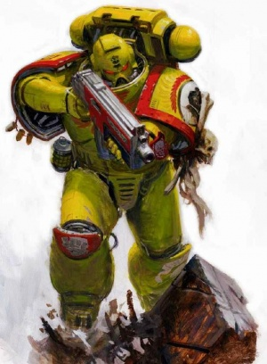

<!-- A0386-B0343 -->

原译文

A member of the 3rd Company displays scrimshaw honours on his right pauldron 第三连队的一名成员在他的右肩甲上展示雕刻荣誉

**校订译文**

A member of the 3rd Company displays scrimshaw honours on his right pauldron 第三连的一名战士在右肩甲上佩戴骨雕荣誉饰物。

<!-- /A0386-B0343 -->

<!-- A0386-B0344 -->
**英文原文**

The force structure of the Imperial Fists supports its predilection for siege warfare and high risk operations. The Chapter maintains more siege-related weaponry than any other Chapter, including a small army of thunderfire cannons, Vindicators, and Centurions. The Chapter also maintains a reserve of initiates far deeper than any other Chapter to replace its combat losses, which at times have included entire companies or more being destroyed at a time. It is a point of pride for the Imperial Fists that the Chapter can not be fully defeated so long as one battle-brother remains on Phalanx to begin the process of reconstituting even the most grievous attrition.

<!-- /A0386-B0344 -->

<!-- A0386-B0345 -->

原译文

帝国之拳的部队结构支持其对攻城战和高风险行动的偏好。战团拥有比其他任何战团都多的与攻城相关的武器，包括一小队雷火炮、维护者和百夫长。战团还保留了一支比其他任何战团都深得多的信徒储备，以弥补其战斗损失，有时甚至包括一次摧毁整个连队或更多连队。帝国之拳引以为豪的是，只要一个战斗兄弟还留在山阵号上，即使是最严重的消耗，也无法完全击败战团。

**校订译文**

帝国之拳的兵力与装备配置体现了他们对攻城战和高风险作战的偏好。战团拥有的攻城装备多于任何其他战团，包括数量众多的雷火炮、维护者战车与百夫长。他们还保有格外庞大的新晋战士后备力量，用于补充战损；有时，战团会在一次战役中损失整整一个连，甚至更多。帝国之拳为这样一种信念感到自豪：只要山阵号上还有一位战斗兄弟，便能着手重建，哪怕此前遭受了最惨重的损失，战团也不会彻底败亡。

**校注：** small army 表示数量众多，不是仅一小队。initiates 在补充兵力语境译新晋战士，不是宗教信徒。

<!-- /A0386-B0345 -->

<!-- A0386-B0346 -->
**英文原文**

The Imperial Fists also maintain a Chapter Council composed of the Chapter's captains. The full purpose of the Council is not clear, but includes settling disputes between members of the Chapter and serving as a court in which the Chapter Master can hear the cases of the disputants and render his judgement, including punishment for offenses.

<!-- /A0386-B0346 -->

<!-- A0386-B0347 -->

原译文

帝国之拳还维持着一个由战团长组成的战团议会。议会的全部目的尚不清楚，但包括解决战团成员之间的争端，并作为一个法庭，战团长可以在其中审理争议方的案件并作出判决，包括对违法行为的惩罚。

**校订译文**

帝国之拳设有由各连长组成的战团议会。其完整职能尚不明确，已知职责包括调解战团成员间的争端，以及充当法庭：战团长在此听取争议双方的陈述、作出裁决，并对过错施以惩罚。

<!-- /A0386-B0347 -->

<!-- A0386-B0348 -->
### Chapter Disposition 战团布置

<!-- /A0386-B0348 -->

<!-- A0386-B0349 -->
### Current organization 当前组织

<!-- /A0386-B0349 -->

<!-- A0386-B0350 -->
### Headquarters 总部

<!-- /A0386-B0350 -->

<!-- A0386-B0351 -->
### Chapter Command 战团指挥

<!-- /A0386-B0351 -->

<!-- A0386-B0352 图片 -->
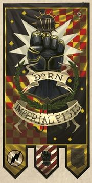

<!-- A0386-B0353 -->
**英文原文**

Gregor Dessian, Chapter Master

<!-- /A0386-B0353 -->

<!-- A0386-B0354 -->

原译文

格雷戈·德西安，战团长

**校订译文**

格雷戈·德西安，战团长

<!-- /A0386-B0354 -->

<!-- A0386-B0355 -->

原译文

Honour Guard 荣誉卫队

**校订译文**

Honour Guard 荣誉卫队

<!-- /A0386-B0355 -->

<!-- A0386-B0356 -->

原译文

Equerries and Servitors 仆役与机仆

**校订译文**

Equerries and Servitors 近侍与机仆

<!-- /A0386-B0356 -->

<!-- A0386-B0357 -->
### Armoury 军械库

<!-- /A0386-B0357 -->

<!-- A0386-B0358 图片 -->

<!-- A0386-B0359 -->

原译文

Master of the Forge Atornus Geis 铸造大师阿托努斯·盖斯

**校订译文**

Master of the Forge Atornus Geis 铸造大师阿托努斯·盖斯

<!-- /A0386-B0359 -->

<!-- A0386-B0360 -->

原译文

Techmarines 技术军士

**校订译文**

Techmarines 科技战士

<!-- /A0386-B0360 -->

<!-- A0386-B0361 -->

原译文

Servitors 机仆

**校订译文**

Servitors 机仆

<!-- /A0386-B0361 -->

<!-- A0386-B0362 -->

原译文

Transport Vehicles 运输载具

**校订译文**

Transport Vehicles 运输载具

<!-- /A0386-B0362 -->

<!-- A0386-B0363 -->

原译文

Battle Tanks 战斗坦克

**校订译文**

Battle Tanks 战斗坦克

<!-- /A0386-B0363 -->

<!-- A0386-B0364 -->

原译文

Gunships 炮艇

**校订译文**

Gunships 炮艇

<!-- /A0386-B0364 -->

<!-- A0386-B0365 -->

原译文

Centurion Warsuits 百夫长战甲

**校订译文**

Centurion Warsuits 百夫长战甲

<!-- /A0386-B0365 -->

<!-- A0386-B0366 -->
### Apothecarion 药剂部

<!-- /A0386-B0366 -->

<!-- A0386-B0367 图片 -->

<!-- A0386-B0368 -->

原译文

Chief Apothecary Dyserna 首席药剂师戴瑟纳

**校订译文**

Chief Apothecary Dyserna 首席药剂师戴瑟纳

<!-- /A0386-B0368 -->

<!-- A0386-B0369 -->

原译文

Apothecaries 药剂师

**校订译文**

Apothecaries 药剂师

<!-- /A0386-B0369 -->

<!-- A0386-B0370 -->
### Fleet Command 舰队指挥

<!-- /A0386-B0370 -->

<!-- A0386-B0371 -->
### Master of the Fleet/Lord Phalanx 舰队大师／山阵号领主

原题：Master of the Fleet/Lord Phalanx 舰队之主/山阵号领主

<!-- /A0386-B0371 -->

<!-- A0386-B0372 -->
### Mirac Chalosa 米拉克·查洛萨

<!-- /A0386-B0372 -->

<!-- A0386-B0373 -->

原译文

Battle Barges 战斗驳船

**校订译文**

Battle Barges 战斗驳船

<!-- /A0386-B0373 -->

<!-- A0386-B0374 -->

原译文

Strike Cruisers 打击巡洋舰

**校订译文**

Strike Cruisers 打击巡洋舰

<!-- /A0386-B0374 -->

<!-- A0386-B0375 -->

原译文

Rapid Strike vessels 快速打击战舰

**校订译文**

Rapid Strike vessels 快速打击战舰

<!-- /A0386-B0375 -->

<!-- A0386-B0376 -->

原译文

Thunderhawk Gunships 雷鹰炮艇

**校订译文**

Thunderhawk Gunships 雷鹰炮艇

<!-- /A0386-B0376 -->

<!-- A0386-B0377 -->
### Librarius 智库

<!-- /A0386-B0377 -->

<!-- A0386-B0378 图片 -->

<!-- A0386-B0379 -->

原译文

Chief Librarian Xeros Darsway 首席智库泽罗斯·达斯韦

**校订译文**

Chief Librarian Xeros Darsway 首席智库员泽罗斯·达斯韦

<!-- /A0386-B0379 -->

<!-- A0386-B0380 -->

原译文

Epistolaries 星语官

**校订译文**

Epistolaries 星语官

<!-- /A0386-B0380 -->

<!-- A0386-B0381 -->

原译文

Codiciers 典记员

**校订译文**

Codiciers 典记员

<!-- /A0386-B0381 -->

<!-- A0386-B0382 -->

原译文

Lexicania 编修员

**校订译文**

Lexicania 编修员

<!-- /A0386-B0382 -->

<!-- A0386-B0383 -->

原译文

Acolytum 侍僧

**校订译文**

Acolytum 侍僧

<!-- /A0386-B0383 -->

<!-- A0386-B0384 -->
### Chaplaincy 教士团

原题：Chaplaincy 隐修室

<!-- /A0386-B0384 -->

<!-- A0386-B0385 图片 -->

<!-- A0386-B0386 -->

原译文

Master of Sanctity Guaron 圣洁导师伽荣

**校订译文**

Master of Sanctity Guaron 圣洁导师伽荣

<!-- /A0386-B0386 -->

<!-- A0386-B0387 -->

原译文

Reclusiarch 隐修士

**校订译文**

Reclusiarch 隐修长

<!-- /A0386-B0387 -->

<!-- A0386-B0388 -->

原译文

Chaplains 牧师

**校订译文**

Chaplains 教士

<!-- /A0386-B0388 -->

<!-- A0386-B0389 -->
### Companies 连队

<!-- /A0386-B0389 -->

<!-- A0386-B0390 -->
### Veteran Company 老兵连队

<!-- /A0386-B0390 -->

<!-- A0386-B0391 -->

原译文

1st Company 第一连队

**校订译文**

1st Company 第一连队

<!-- /A0386-B0391 -->

<!-- A0386-B0392 图片 -->
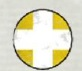

<!-- A0386-B0393 -->

原译文

"The Emperor's Shield" “帝皇之盾”

**校订译文**

"The Emperor's Shield" “帝皇之盾”

<!-- /A0386-B0393 -->

<!-- A0386-B0394 -->
### First Captain Darnath Lysander 第一连长达纳斯·莱山德

<!-- /A0386-B0394 -->

<!-- A0386-B0395 -->

原译文

The Emperor's Wrath 帝皇之怒

**校订译文**

The Emperor's Wrath 帝皇之怒

<!-- /A0386-B0395 -->

<!-- A0386-B0396 -->

原译文

2 Lieutenants 2名副官

**校订译文**

2 Lieutenants 2名副官

<!-- /A0386-B0396 -->

<!-- A0386-B0397 -->

原译文

Company Ancient 连队旗手

**校订译文**

Company Ancient 连队旗手

<!-- /A0386-B0397 -->

<!-- A0386-B0398 -->

原译文

Company Champion 连队冠军

**校订译文**

Company Champion 连队冠军

<!-- /A0386-B0398 -->

<!-- A0386-B0399 -->

原译文

Company Veterans 连队老兵

**校订译文**

Company Veterans 连队老兵

<!-- /A0386-B0399 -->

<!-- A0386-B0400 -->

原译文

10 Veteran Squads 10个老兵小队

**校订译文**

10 Veteran Squads 10个老兵小队

<!-- /A0386-B0400 -->

<!-- A0386-B0401 -->

原译文

Venerable Dreadnoughts 神圣无畏

**校订译文**

Venerable Dreadnoughts 神圣无畏机甲

<!-- /A0386-B0401 -->

<!-- A0386-B0402 -->

原译文

Transport Vehicles 运输载具

**校订译文**

Transport Vehicles 运输载具

<!-- /A0386-B0402 -->

<!-- A0386-B0403 -->

原译文

Land Raiders 兰德掠袭者

**校订译文**

Land Raiders 兰德掠袭者战车

<!-- /A0386-B0403 -->

<!-- A0386-B0404 -->
### Battle Companies 战斗连队

<!-- /A0386-B0404 -->

<!-- A0386-B0405 -->

原译文

2nd Company 第二连队

**校订译文**

2nd Company 第二连队

<!-- /A0386-B0405 -->

<!-- A0386-B0406 图片 -->
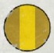

<!-- A0386-B0407 -->

原译文

"The Scions of Redemption" “救赎之裔”

**校订译文**

"The Scions of Redemption" “救赎之裔”

<!-- /A0386-B0407 -->

<!-- A0386-B0408 -->
### Captain Zandar Chiros 连长赞达尔·奇洛斯

<!-- /A0386-B0408 -->

<!-- A0386-B0409 -->

原译文

Master of Rituals 祭仪大师

**校订译文**

Master of Rituals 祭仪大师

<!-- /A0386-B0409 -->

<!-- A0386-B0410 -->

原译文

2 Lieutenants 2名副官

**校订译文**

2 Lieutenants 2名副官

<!-- /A0386-B0410 -->

<!-- A0386-B0411 -->

原译文

Company Ancient 连队旗手

**校订译文**

Company Ancient 连队旗手

<!-- /A0386-B0411 -->

<!-- A0386-B0412 -->

原译文

Company Champion 连队冠军

**校订译文**

Company Champion 连队冠军

<!-- /A0386-B0412 -->

<!-- A0386-B0413 -->

原译文

Company Veterans 连队老兵

**校订译文**

Company Veterans 连队老兵

<!-- /A0386-B0413 -->

<!-- A0386-B0414 -->

原译文

6 Battleline Squads 6个战线小队

**校订译文**

6 Battleline Squads 6个战线小队

<!-- /A0386-B0414 -->

<!-- A0386-B0415 -->

原译文

2 Close Support Squads 2个近战支援小队

**校订译文**

2 Close Support Squads 2个近战支援小队

<!-- /A0386-B0415 -->

<!-- A0386-B0416 -->

原译文

2 Fire Support Squads 2个火力支援小队

**校订译文**

2 Fire Support Squads 2个火力支援小队

<!-- /A0386-B0416 -->

<!-- A0386-B0417 -->

原译文

Bikes 摩托

**校订译文**

Bikes 摩托

<!-- /A0386-B0417 -->

<!-- A0386-B0418 -->

原译文

Land Speeders 兰德速攻艇

**校订译文**

Land Speeders 兰德速攻艇

<!-- /A0386-B0418 -->

<!-- A0386-B0419 -->

原译文

Dreadnoughts 无畏

**校订译文**

Dreadnoughts 无畏机甲

<!-- /A0386-B0419 -->

<!-- A0386-B0420 -->

原译文

Transport Vehicles 运输载具

**校订译文**

Transport Vehicles 运输载具

<!-- /A0386-B0420 -->

<!-- A0386-B0421 -->

原译文

3rd Company 第三连队

**校订译文**

3rd Company 第三连队

<!-- /A0386-B0421 -->

<!-- A0386-B0422 图片 -->
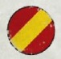

<!-- A0386-B0423 -->

原译文

"The Sentinels of Terra" “泰拉哨兵”

**校订译文**

"The Sentinels of Terra" “泰拉哨兵”

<!-- /A0386-B0423 -->

<!-- A0386-B0424 -->
### Captain Tor Garadon 连长托尔·加拉顿

<!-- /A0386-B0424 -->

<!-- A0386-B0425 -->

原译文

Bastion of Defiance 抗争堡垒

**校订译文**

Bastion of Defiance 抗争堡垒

<!-- /A0386-B0425 -->

<!-- A0386-B0426 -->

原译文

2 Lieutenants 2名副官

**校订译文**

2 Lieutenants 2名副官

<!-- /A0386-B0426 -->

<!-- A0386-B0427 -->

原译文

Company Ancient 连队旗手

**校订译文**

Company Ancient 连队旗手

<!-- /A0386-B0427 -->

<!-- A0386-B0428 -->

原译文

Company Champion 连队冠军

**校订译文**

Company Champion 连队冠军

<!-- /A0386-B0428 -->

<!-- A0386-B0429 -->

原译文

Company Veterans 连队老兵

**校订译文**

Company Veterans 连队老兵

<!-- /A0386-B0429 -->

<!-- A0386-B0430 -->

原译文

6 Battleline Squads 6个战线小队

**校订译文**

6 Battleline Squads 6个战线小队

<!-- /A0386-B0430 -->

<!-- A0386-B0431 -->

原译文

2 Close Support Squads 2个近战支援小队

**校订译文**

2 Close Support Squads 2个近战支援小队

<!-- /A0386-B0431 -->

<!-- A0386-B0432 -->

原译文

2 Fire Support Squads 2个火力支援小队

**校订译文**

2 Fire Support Squads 2个火力支援小队

<!-- /A0386-B0432 -->

<!-- A0386-B0433 -->

原译文

Bikes 摩托

**校订译文**

Bikes 摩托

<!-- /A0386-B0433 -->

<!-- A0386-B0434 -->

原译文

Land Speeders 兰德速攻艇

**校订译文**

Land Speeders 兰德速攻艇

<!-- /A0386-B0434 -->

<!-- A0386-B0435 -->

原译文

Dreadnoughts 无畏

**校订译文**

Dreadnoughts 无畏机甲

<!-- /A0386-B0435 -->

<!-- A0386-B0436 -->

原译文

Transport Vehicles 运输载具

**校订译文**

Transport Vehicles 运输载具

<!-- /A0386-B0436 -->

<!-- A0386-B0437 -->

原译文

4th Company 第四连队

**校订译文**

4th Company 第四连队

<!-- /A0386-B0437 -->

<!-- A0386-B0438 图片 -->
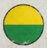

<!-- A0386-B0439 -->

原译文

"Victors of Brax" “布拉克斯胜利者”

**校订译文**

"Victors of Brax" “布拉克斯胜利者”

<!-- /A0386-B0439 -->

<!-- A0386-B0440 -->
### Captain Alars Lydoro 连长阿拉斯·莱多罗

<!-- /A0386-B0440 -->

<!-- A0386-B0441 -->

原译文

Master Armourer 军械大师

**校订译文**

Master Armourer 军械大师

<!-- /A0386-B0441 -->

<!-- A0386-B0442 -->

原译文

2 Lieutenants 2名副官

**校订译文**

2 Lieutenants 2名副官

<!-- /A0386-B0442 -->

<!-- A0386-B0443 -->

原译文

Company Ancient 连队旗手

**校订译文**

Company Ancient 连队旗手

<!-- /A0386-B0443 -->

<!-- A0386-B0444 -->

原译文

Company Champion 连队冠军

**校订译文**

Company Champion 连队冠军

<!-- /A0386-B0444 -->

<!-- A0386-B0445 -->

原译文

Company Veterans 连队老兵

**校订译文**

Company Veterans 连队老兵

<!-- /A0386-B0445 -->

<!-- A0386-B0446 -->

原译文

6 Battleline Squads 6个战线小队

**校订译文**

6 Battleline Squads 6个战线小队

<!-- /A0386-B0446 -->

<!-- A0386-B0447 -->

原译文

2 Close Support Squads 2个近战支援小队

**校订译文**

2 Close Support Squads 2个近战支援小队

<!-- /A0386-B0447 -->

<!-- A0386-B0448 -->

原译文

2 Fire Support Squads 2个火力支援小队

**校订译文**

2 Fire Support Squads 2个火力支援小队

<!-- /A0386-B0448 -->

<!-- A0386-B0449 -->

原译文

Bikes 摩托

**校订译文**

Bikes 摩托

<!-- /A0386-B0449 -->

<!-- A0386-B0450 -->

原译文

Land Speeders 兰德速攻艇

**校订译文**

Land Speeders 兰德速攻艇

<!-- /A0386-B0450 -->

<!-- A0386-B0451 -->

原译文

Dreadnoughts 无畏

**校订译文**

Dreadnoughts 无畏机甲

<!-- /A0386-B0451 -->

<!-- A0386-B0452 -->

原译文

Transport Vehicles 运输载具

**校订译文**

Transport Vehicles 运输载具

<!-- /A0386-B0452 -->

<!-- A0386-B0453 -->

原译文

5th Company 第五连队

**校订译文**

5th Company 第五连队

<!-- /A0386-B0453 -->

<!-- A0386-B0454 图片 -->
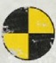

<!-- A0386-B0455 -->

原译文

"The Heralds of Truth" “真理使者”

**校订译文**

"The Heralds of Truth" “真理使者”

<!-- /A0386-B0455 -->

<!-- A0386-B0456 -->
### Captain Dravastis Fane 连长德拉瓦蒂斯·费恩

<!-- /A0386-B0456 -->

<!-- A0386-B0457 -->

原译文

Keeper of the Archive 档案守护者

**校订译文**

Keeper of the Archive 档案守护者

<!-- /A0386-B0457 -->

<!-- A0386-B0458 -->

原译文

2 Lieutenants 2名副官

**校订译文**

2 Lieutenants 2名副官

<!-- /A0386-B0458 -->

<!-- A0386-B0459 -->

原译文

Company Ancient 连队旗手

**校订译文**

Company Ancient 连队旗手

<!-- /A0386-B0459 -->

<!-- A0386-B0460 -->

原译文

Company Champion 连队冠军

**校订译文**

Company Champion 连队冠军

<!-- /A0386-B0460 -->

<!-- A0386-B0461 -->

原译文

Company Veterans 连队老兵

**校订译文**

Company Veterans 连队老兵

<!-- /A0386-B0461 -->

<!-- A0386-B0462 -->

原译文

6 Battleline Squads 6个战线小队

**校订译文**

6 Battleline Squads 6个战线小队

<!-- /A0386-B0462 -->

<!-- A0386-B0463 -->

原译文

2 Close Support Squads 2个近战支援小队

**校订译文**

2 Close Support Squads 2个近战支援小队

<!-- /A0386-B0463 -->

<!-- A0386-B0464 -->

原译文

2 Fire Support Squads 2个火力支援小队

**校订译文**

2 Fire Support Squads 2个火力支援小队

<!-- /A0386-B0464 -->

<!-- A0386-B0465 -->

原译文

Bikes 摩托

**校订译文**

Bikes 摩托

<!-- /A0386-B0465 -->

<!-- A0386-B0466 -->

原译文

Land Speeders 兰德速攻艇

**校订译文**

Land Speeders 兰德速攻艇

<!-- /A0386-B0466 -->

<!-- A0386-B0467 -->

原译文

Dreadnoughts 无畏

**校订译文**

Dreadnoughts 无畏机甲

<!-- /A0386-B0467 -->

<!-- A0386-B0468 -->

原译文

Transport Vehicles 运输载具

**校订译文**

Transport Vehicles 运输载具

<!-- /A0386-B0468 -->

<!-- A0386-B0469 -->
### Reserve Companies 预备连队

<!-- /A0386-B0469 -->

<!-- A0386-B0470 -->

原译文

6th Company 第六连队

**校订译文**

6th Company 第六连队

<!-- /A0386-B0470 -->

<!-- A0386-B0471 图片 -->
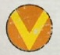

<!-- A0386-B0472 -->

原译文

"The Siege Hammers" “攻城铁锤”

**校订译文**

"The Siege Hammers" “攻城铁锤”

<!-- /A0386-B0472 -->

<!-- A0386-B0473 -->
### Captain Hector Antaros 连长赫克托·安塔罗斯

<!-- /A0386-B0473 -->

<!-- A0386-B0474 -->

原译文

Master of Vigilance 警戒之主

**校订译文**

Master of Vigilance 警戒之主

<!-- /A0386-B0474 -->

<!-- A0386-B0475 -->

原译文

2 Lieutenants 2名副官

**校订译文**

2 Lieutenants 2名副官

<!-- /A0386-B0475 -->

<!-- A0386-B0476 -->

原译文

Company Ancient 连队旗手

**校订译文**

Company Ancient 连队旗手

<!-- /A0386-B0476 -->

<!-- A0386-B0477 -->

原译文

Company Champion 连队冠军

**校订译文**

Company Champion 连队冠军

<!-- /A0386-B0477 -->

<!-- A0386-B0478 -->

原译文

Company Veterans 连队老兵

**校订译文**

Company Veterans 连队老兵

<!-- /A0386-B0478 -->

<!-- A0386-B0479 -->

原译文

10 Battleline Squads 10个战线小队

**校订译文**

10 Battleline Squads 10个战线小队

<!-- /A0386-B0479 -->

<!-- A0386-B0480 -->

原译文

Battle Tanks 战斗坦克

**校订译文**

Battle Tanks 战斗坦克

<!-- /A0386-B0480 -->

<!-- A0386-B0481 -->

原译文

Dreadnoughts 无畏

**校订译文**

Dreadnoughts 无畏机甲

<!-- /A0386-B0481 -->

<!-- A0386-B0482 -->

原译文

Transport Vehicles 运输载具

**校订译文**

Transport Vehicles 运输载具

<!-- /A0386-B0482 -->

<!-- A0386-B0483 -->

原译文

7th Company 第七连队

**校订译文**

7th Company 第七连队

<!-- /A0386-B0483 -->

<!-- A0386-B0484 图片 -->
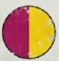

<!-- A0386-B0485 -->

原译文

"Guardians of the Phalanx" “山阵守卫”

**校订译文**

"Guardians of the Phalanx" “山阵守卫”

<!-- /A0386-B0485 -->

<!-- A0386-B0486 -->
### Captain Orpheus Taelos 连长俄耳甫斯·泰洛斯

<!-- /A0386-B0486 -->

<!-- A0386-B0487 -->

原译文

Bearer of the Grail 圣杯持有者

**校订译文**

Bearer of the Grail 圣杯持有者

<!-- /A0386-B0487 -->

<!-- A0386-B0488 -->

原译文

2 Lieutenants 2名副官

**校订译文**

2 Lieutenants 2名副官

<!-- /A0386-B0488 -->

<!-- A0386-B0489 -->

原译文

Company Ancient 连队旗手

**校订译文**

Company Ancient 连队旗手

<!-- /A0386-B0489 -->

<!-- A0386-B0490 -->

原译文

Company Champion 连队冠军

**校订译文**

Company Champion 连队冠军

<!-- /A0386-B0490 -->

<!-- A0386-B0491 -->

原译文

Company Veterans 连队老兵

**校订译文**

Company Veterans 连队老兵

<!-- /A0386-B0491 -->

<!-- A0386-B0492 -->

原译文

10 Battleline Squads 10个战线小队

**校订译文**

10 Battleline Squads 10个战线小队

<!-- /A0386-B0492 -->

<!-- A0386-B0493 -->

原译文

Battle Tanks 战斗坦克

**校订译文**

Battle Tanks 战斗坦克

<!-- /A0386-B0493 -->

<!-- A0386-B0494 -->

原译文

Dreadnoughts 无畏

**校订译文**

Dreadnoughts 无畏机甲

<!-- /A0386-B0494 -->

<!-- A0386-B0495 -->

原译文

Transport Vehicles 运输载具

**校订译文**

Transport Vehicles 运输载具

<!-- /A0386-B0495 -->

<!-- A0386-B0496 -->

原译文

8th Company 第八连队

**校订译文**

8th Company 第八连队

<!-- /A0386-B0496 -->

<!-- A0386-B0497 图片 -->
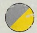

<!-- A0386-B0498 -->

原译文

"Dorn's Huscarls" “多恩骠骑”

**校订译文**

"Dorn's Huscarls" “多恩亲卫”

**校注：** Huscarl 为亲卫或侍从武士，不能与 hussar 骠骑兵混同。作为帝国之拳第八连别称暂译多恩亲卫。

<!-- /A0386-B0498 -->

<!-- A0386-B0499 -->
### Captain Aeneas Strom 连长埃涅阿斯·斯托姆

<!-- /A0386-B0499 -->

<!-- A0386-B0500 -->

原译文

Wielder of Terra's Flame 泰拉之火持用者

**校订译文**

Wielder of Terra's Flame 泰拉之火持用者

<!-- /A0386-B0500 -->

<!-- A0386-B0501 -->

原译文

2 Lieutenants 2名副官

**校订译文**

2 Lieutenants 2名副官

<!-- /A0386-B0501 -->

<!-- A0386-B0502 -->

原译文

Company Ancient 连队旗手

**校订译文**

Company Ancient 连队旗手

<!-- /A0386-B0502 -->

<!-- A0386-B0503 -->

原译文

Company Champion 连队冠军

**校订译文**

Company Champion 连队冠军

<!-- /A0386-B0503 -->

<!-- A0386-B0504 -->

原译文

Company Veterans 连队老兵

**校订译文**

Company Veterans 连队老兵

<!-- /A0386-B0504 -->

<!-- A0386-B0505 -->

原译文

10 Close Support Squads 10个近战支援小队

**校订译文**

10 Close Support Squads 10个近战支援小队

<!-- /A0386-B0505 -->

<!-- A0386-B0506 -->

原译文

Bikes 摩托

**校订译文**

Bikes 摩托

<!-- /A0386-B0506 -->

<!-- A0386-B0507 -->

原译文

Land Speeders 兰德速攻艇

**校订译文**

Land Speeders 兰德速攻艇

<!-- /A0386-B0507 -->

<!-- A0386-B0508 -->

原译文

Dreadnoughts 无畏

**校订译文**

Dreadnoughts 无畏机甲

<!-- /A0386-B0508 -->

<!-- A0386-B0509 -->

原译文

Transport Vehicles 运输载具

**校订译文**

Transport Vehicles 运输载具

<!-- /A0386-B0509 -->

<!-- A0386-B0510 -->

原译文

9th Company 第九连队

**校订译文**

9th Company 第九连队

<!-- /A0386-B0510 -->

<!-- A0386-B0511 图片 -->
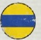

<!-- A0386-B0512 -->

原译文

"The Wardens" “守望者”

**校订译文**

"The Wardens" “守望者”

<!-- /A0386-B0512 -->

<!-- A0386-B0513 -->
### Captain Miklos Kaheron 连长米克洛斯·卡赫伦

<!-- /A0386-B0513 -->

<!-- A0386-B0514 -->

原译文

Master of Devastation 毁灭大师

**校订译文**

Master of Devastation 毁灭大师

<!-- /A0386-B0514 -->

<!-- A0386-B0515 -->

原译文

2 Lieutenants 2名副官

**校订译文**

2 Lieutenants 2名副官

<!-- /A0386-B0515 -->

<!-- A0386-B0516 -->

原译文

Company Ancient 连队旗手

**校订译文**

Company Ancient 连队旗手

<!-- /A0386-B0516 -->

<!-- A0386-B0517 -->

原译文

Company Champion 连队冠军

**校订译文**

Company Champion 连队冠军

<!-- /A0386-B0517 -->

<!-- A0386-B0518 -->

原译文

Company Veterans 连队老兵

**校订译文**

Company Veterans 连队老兵

<!-- /A0386-B0518 -->

<!-- A0386-B0519 -->

原译文

10 Fire Support Squads 10个火力支援小队

**校订译文**

10 Fire Support Squads 10个火力支援小队

<!-- /A0386-B0519 -->

<!-- A0386-B0520 -->

原译文

Dreadnoughts 无畏

**校订译文**

Dreadnoughts 无畏机甲

<!-- /A0386-B0520 -->

<!-- A0386-B0521 -->

原译文

Transport Vehicles 运输载具

**校订译文**

Transport Vehicles 运输载具

<!-- /A0386-B0521 -->

<!-- A0386-B0522 -->
### Scout Company 侦察连队

<!-- /A0386-B0522 -->

<!-- A0386-B0523 -->

原译文

10th Company 第十连队

**校订译文**

10th Company 第十连队

<!-- /A0386-B0523 -->

<!-- A0386-B0524 图片 -->
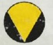

<!-- A0386-B0525 -->

原译文

"The Eyes of Dorn" “多恩之眼”

**校订译文**

"The Eyes of Dorn" “多恩之眼”

<!-- /A0386-B0525 -->

<!-- A0386-B0526 -->
### Captain Metrios Carr 连长梅特里奥斯·卡尔

<!-- /A0386-B0526 -->

<!-- A0386-B0527 -->

原译文

Master of Reconnaissance 侦查大师

**校订译文**

Master of Reconnaissance 侦察大师

<!-- /A0386-B0527 -->

<!-- A0386-B0528 -->

原译文

2 Lieutenants 2名副官

**校订译文**

2 Lieutenants 2名副官

<!-- /A0386-B0528 -->

<!-- A0386-B0529 -->

原译文

Company Ancient 连队旗手

**校订译文**

Company Ancient 连队旗手

<!-- /A0386-B0529 -->

<!-- A0386-B0530 -->

原译文

Company Champion 连队冠军

**校订译文**

Company Champion 连队冠军

<!-- /A0386-B0530 -->

<!-- A0386-B0531 -->

原译文

Company Veterans 连队老兵

**校订译文**

Company Veterans 连队老兵

<!-- /A0386-B0531 -->

<!-- A0386-B0532 -->

原译文

10 Vanguard Squads 10个先锋小队

**校订译文**

10 Vanguard Squads 10个先锋小队

<!-- /A0386-B0532 -->

<!-- A0386-B0533 -->

原译文

Scout Squads 侦察小队

**校订译文**

Scout Squads 侦察小队

<!-- /A0386-B0533 -->

<!-- A0386-B0534 -->

原译文

Scout Bikes 侦查摩托

**校订译文**

Scout Bikes 侦察摩托

<!-- /A0386-B0534 -->

<!-- A0386-B0535 -->

原译文

Land Speeders 兰德速攻艇

**校订译文**

Land Speeders 兰德速攻艇

<!-- /A0386-B0535 -->

<!-- A0386-B0536 -->

原译文

Transport Vehicles 运输载具

**校订译文**

Transport Vehicles 运输载具

<!-- /A0386-B0536 -->

<!-- A0386-B0537 -->
### Company Descriptions 连队描述

<!-- /A0386-B0537 -->

<!-- A0386-B0538 -->
**英文原文**

"Gaze upon the deeds of old, brothers, but remember always that the triumphs of history are naught but ash unless reconsecrated by the blood and valour of the present, in every battle of every war. Our ancestors stood witness at the birth of the Emperor's dream. Our inheritors will see that dream complete!" - Darnath Lysander.

<!-- /A0386-B0538 -->

<!-- A0386-B0539 -->

原译文

“兄弟们，看看长者们的事迹，但永远记住，历史的胜利只不过是灰烬，除非在每一场战争的每一场战斗中，用现在的鲜血和勇气重新证明。我们的长者见证了帝皇梦想的诞生。我们的后继者将看到这个梦想的完成！” - 达纳斯·莱山德。

**校订译文**

“兄弟们，回望先贤的事迹吧，但要永远记住：倘若我们不能在今日每一场战争、每一次战斗中，以鲜血与勇气重新赋予昔日荣光以神圣意义，那么历史上的凯旋也不过是一捧灰烬。我们的先辈见证了帝皇梦想的诞生，我们的后继者必将见证它的实现！”——达纳斯·莱山德

<!-- /A0386-B0539 -->

<!-- A0386-B0540 -->
**英文原文**

The 1st Company, known as the Emperor's Shield. This acts as the Veteran Company of the Fists and favours large amounts of Terminators. In recent years, however, they have displayed tactical flexibility under the leadership of Darnath Lysander, embracing lighter and nimbler patterns of armour. The 1st under the command of a Veteran Sergeant also serves as the guardians of the Chapter's relics aboard the Phalanx. Many Veteran Sergeants of the 1st abandon their own name upon attaining this lauded duty, adopting instead the name of their duelling arenas foremost battle honour. Should the Sergeant leave his duty, he will leave that name behind.

<!-- /A0386-B0540 -->

<!-- A0386-B0541 -->

原译文

第一连队，被称为帝皇之盾。这充当了帝国之拳的老兵连队，并支持大量终结者。然而，近年来，在达纳斯·莱山德的领导下，他们表现出了战术灵活性，采用了更轻、更灵活的盔甲样式。在一名老兵军士的指挥下，第1连队还担任山阵号上战团圣物的守护者。许多第1连队的老兵军士在完成这一备受赞誉的职责后放弃了自己的名字，转而采用了他们决斗竞技场的名字 — 最重要的战斗荣誉。如果军士离职，他会放弃这个名字。

**校订译文**

第一连号称“帝皇之盾”，是战团的老兵连，惯于大量投入终结者。近年来，在达纳斯·莱山德率领下，他们展现出更灵活的战术，也开始采用更轻便敏捷的装甲。第一连还会由一名老兵军士带队，守护山阵号上的战团圣物。许多获任这一崇高职责的第一连老兵军士会舍弃本名，改用其决斗竞技场最重要的一项战斗荣誉作为名字；离任时，他们也会放下这个名字。

**校注：** 原文 their duelling arenas foremost battle honour 缺少属格标点；按竞技场最重要的战斗荣誉作为名字理解，非直接取竞技场之名。attaining 是获任该职，不是完成任职。

<!-- /A0386-B0541 -->

<!-- A0386-B0542 -->
**英文原文**

The 2nd Company, known as the Scions of Redemption. It is said that the 2nd led to the Chapter's near-annihilation during the War of the Beast. As such as they are the custodians of the Chapter's collective guilt and fight to ever make amends for this failure. Even new Primaris recruits bear this burden. Members of the 2nd often mortify their flesh in spirit of the Pain Glove. This has led to the 2nd to adopt methodical tactics in their determination to not invoke further dishonour. Thus do they advance in a mechanical manner more similar to the forces of the Adeptus Mechanicus. Despite their status, service in the 2nd is not considered dishonourable or shameful, as the Fists believe that there is no nobler cause than to bear the collective sins of ones' brothers.

<!-- /A0386-B0542 -->

<!-- A0386-B0543 -->

原译文

第二连队，被称为救赎之裔。据说第二连队导致了战团在野兽战争中几乎被消灭。因此，他们是战团集体罪行的监护人，并为弥补这一失败而战斗。即使是新的原铸新兵也承担着这一负担。第二连队成员经常以痛苦手套的本质来伤害自己的肉体。这导致第二连队采取了有条不紊的策略，决心不再引发进一步的耻辱。因此，它们以一种更类似于机械神教的部队的机械方式前进。尽管他们的地位很高，但在第二连队服役并不被认为是不光彩或可耻的，因为帝国之拳相信，没有比承担兄弟的集体罪行更崇高的事业了。

**校订译文**

第二连号称“救赎之裔”。据说野兽战争中战团濒临覆灭，责任在于第二连。于是，这个连承担了整个战团的罪疚，始终为弥补昔日的失败而战，就连新加入的原铸战士也须背负这一重担。其成员常遵循痛苦手套的精神，以肉体苦修自我惩戒。他们决心不再蒙羞，因此采取谨慎有序的战术，推进时一板一眼，颇似机械修会的部队。即便背负这样的责任，在第二连服役仍不被视为耻辱；在帝国之拳看来，没有什么比替兄弟们承担共同的罪过更高尚。

<!-- /A0386-B0543 -->

<!-- A0386-B0544 -->
**英文原文**

The 3rd Company, known as the Sentinels of Terra. The 3rd is a legendary Company renowned for its tenacity. Despite enduring horrific casualties in the final years of the 41st Millennium, the 3rd has risen anew. The 3rd is unusually flexible for the standards of the Imperial Fists in a manner similar to the Ultramarines. Their aggressive and attritive nature of battle has seen its ranks reinforced more than any other, and transfer to the 3rd is a near-universal experience for any member of the Reserve Company. As part of their initiation, new Battle Brothers transferred to the 3rd must spar with one of its Sergeants in the Phalanx. The 3rd maintains a special undying hatred for the Iron Warriors and their Warsmith Shon'tu for his actions against them.

<!-- /A0386-B0544 -->

<!-- A0386-B0545 -->

原译文

第三连队，被称为泰拉哨兵。第三连队是一个以坚韧著称的传奇连队。尽管在第41个千年的最后几年里遭受了可怕的伤亡，但第三连队再次出现。第三连队对于帝国之拳的标准来说异常灵活，其方式类似于极限战士。他们战斗的侵略性和消耗性使其队伍比其他任何队伍都得到加强，对于预备连队的任何成员来说，调到第三连队都是一种近乎普遍的经历。作为他们开始的一部分，新的战斗兄弟被转移到第三连队，必须与山阵号中的一名军士进行激战。第三连队对钢铁勇士和他们的战争铁匠绍恩’图对他们的行为保持着特殊的永恒仇恨。

**校订译文**

第三连号称“泰拉哨兵”，以坚韧不屈闻名。尽管在M41末年伤亡惨重，这支传奇连队仍再次崛起。按帝国之拳的标准，他们的战术异常灵活，颇似极限战士。其积极进攻、伤耗甚重的作战方式，使第三连比其他任何连队都更频繁地需要补充兵员，几乎所有预备连成员都有过调入第三连的经历。新调来的战斗兄弟必须在山阵号上与该连的一名军士切磋，作为入连仪式。由于钢铁勇士及其战争铁匠邵恩·图曾对第三连造成的伤害，该连对他们怀有格外深重、永不消退的仇恨。

<!-- /A0386-B0545 -->

<!-- A0386-B0546 -->
**英文原文**

The 4th Company, originally known as the Reductors, they have since become known as the Victors of Brax after their recent famous victory. The 4th lacks speed, instead using sheer intractable mass and act as siegebreakers.

<!-- /A0386-B0546 -->

<!-- A0386-B0547 -->

原译文

第四连队最初被称为还原者，在最近的著名胜利后，他们被称为布拉克斯的胜利者。第四连队缺乏速度，而是使用了难以驾驭的质量，充当了攻城破坏者。

**校订译文**

第四连原称“还原者”，在最近一场著名胜利之后改称“布拉克斯胜利者”。他们并不追求速度，而以厚重坚实、难以撼动的兵力推进，专司破城。

**校注：** Reductors 为第四连旧称，暂沿现稿还原者；不与机械修会 Ordo Reductor 或药剂师的基因提取器合并。

<!-- /A0386-B0547 -->

<!-- A0386-B0548 -->
**英文原文**

The 5th Company, known as the Heralds of Truth. The 5th is responsible for preserving the Scriptum Ascenda. Alongside members of the Librarius and Reclusiam, only the 5th is permitted access to this archive. As Keeper of the Archives, the Captain of the 5th holds a unique strategic and doctrinal voice on the Chapter Council. On campaign, the 5th deploy with grim procession and bear banners and relics from the earliest days of the Legion. The 5th is also given the sacred duty of ensuring that those liberated by the Fists are educated on the Chapter and its history.

<!-- /A0386-B0548 -->

<!-- A0386-B0549 -->

原译文

第五连队，被称为真理使者。第五连队负责保存追忆笔录。除了智库和隐修室的成员外，只有第五连队被允许访问这个档案。作为档案守护者，第五连队连长在战团议会中拥有独特的战略和理论发言权。在战役中，第五连队以严峻的队伍部署，并携带着军团早期的旗帜和圣物。第五连队也被赋予了神圣的职责，即确保那些被帝国之拳解放的人接受关于战团及其历史的教育。

**校订译文**

第五连号称“真理使者”，负责保管《追忆笔录》。除智库与隐修圣殿成员外，只有第五连能查阅这份档案。作为档案守护者，第五连长在战团议会中对战略与作战教义拥有独特的发言权。出征时，该连队列肃穆，携带着军团初创时期流传下来的旗帜与圣物。他们还肩负一项神圣职责：让帝国之拳解放的民众了解战团及其历史。

<!-- /A0386-B0549 -->

<!-- A0386-B0550 -->
**英文原文**

The 6th Company, known as the Siege Hammers. Specializing in siege warfare, the 6th was originally formed by Rogal Dorn himself from veterans of the Iron Cage. The 6th instils its siege knowledge into every Battle-Brother that passes through its ranks while those who remain become siege specialists often aiding other Company's in their campaigns. The 6th draws heavily from the Chapter Armoury and often supplements its infantry-borne heavy weapons with Thunderfire Cannons, Dreadnoughts, and artillery tanks.

<!-- /A0386-B0550 -->

<!-- A0386-B0551 -->

原译文

第六连队，被称为攻城铁锤。专门从事围攻战的第六连队最初是由罗格·多恩本人从铁笼老兵中组建的。第六军团将攻城知识灌输给每一个经过其队伍的战斗兄弟，而那些留下来的人则成为攻城专家，经常帮助其他连队进行战役。第六连队大量使用了战团军械库，并经常用雷火炮、无畏和火炮坦克来补充其步兵携带的重型武器。

**校订译文**

第六连号称“攻城铁锤”，专精攻城战，最初由罗格·多恩亲自以铁笼之战老兵组建。凡在此服役的战斗兄弟都会学习攻城知识；长期留任者则成为专家，经常协助其他连队作战。第六连大量调用战团军械库的装备，常以雷火炮、无畏机甲与火炮坦克增援步兵携带的重型武器。

<!-- /A0386-B0551 -->

<!-- A0386-B0552 -->
**英文原文**

The 7th Company, known as the Guardians of the Phalanx. As their title suggests, the 7th is charged with the protection and management of the Phalanx. When its Captain assumes his role, it is said his primary heart is ritually removed and replaced with an augmetic device crafted from the station's own components. This heavy apparatus puts an ever-present pressure on the Captain's chest, reminding him of his new duty. The 7th oversees the Auric Auxilia, which acts as the primary defence force of the Phalanx. In battle the 7th seems to resemble the 6th in tactics, but favours the mass use of Land Speeders, Repulsors, and Land Raiders to adopt a more flexible stance.

<!-- /A0386-B0552 -->

<!-- A0386-B0553 -->

原译文

第七连队，被称为山阵守卫。正如他们的头衔所暗示的那样，第七军团负责保护和管理山阵号。当它的连长担任他的角色时，据说他的主心脏被仪式性地移除，并被一个由空间站自己的组件制成的螺旋装置所取代。这个沉重的装置给连长的胸腔带来了永远存在的压力，提醒他他的新职责。第7连队负责监督金甲辅助军，该部队是山阵号的主要防御力量。在战斗中，第七连队在战术上似乎与第六连队相似，但更倾向于大规模使用兰德速攻艇、反击者和兰德掠袭者，以采取更灵活的姿态。

**校订译文**

第七连号称“山阵守卫”，负责守护和管理山阵号。据说，每位新任连长都要经历一场仪式：取出原生心脏，以山阵号自身零件制成的机械心脏替代。这一沉重装置始终压迫着他的胸膛，提醒他所肩负的新职责。第七连统辖山阵号的主要防御部队——黄金辅助军。作战时，其战术与第六连相近，但更偏爱大量投入兰德速攻艇、反重力战车与兰德掠袭者战车，使行动更加灵活。

**校注：** augmetic device 为机械替代装置，不是螺旋装置；primary heart 指原生主心脏，区别植入的第二心脏。

<!-- /A0386-B0553 -->

<!-- A0386-B0554 -->
**英文原文**

The 8th Company, known as Dorn's Huscarls. The 8th got much of its identity after the War of the Beast when it was rebuilt by the former Black Templar Helbrant Alderic, who emphasized the hotblooded close-assault tactics of his Chapter. The 8th became thick with Black Templars, causing then Chapter Master Maximus Thane to censure Alderic and break up the 8th. Put into other company's, the former warriors of the 8th went on to display extraordinary discipline. It was as if by allowing their aggression to run unfettered, they had purged that part of themselves. Thus was Alderic restored and it was decided that all fresh recruits from the Scout Company would go through the 8th to purge themselves of aggression. This tradition continues to this day, and the 8th still specializes in close support and assault tactics.

<!-- /A0386-B0554 -->

<!-- A0386-B0555 -->

原译文

第八连队，被称为多恩骠骑。第八连队在野兽战争后得到了很大的认同，当时它由前黑色圣堂赫尔布雷特 阿尔德里克重建，他强调了战团的热血沸腾的近身攻击战术。第八连队与黑色圣堂关系密切，导致当时的战团长马克西姆斯·塞恩谴责阿尔德里克并解散了第八连队。在其他连队的工作中，前第八连队的战士们继续表现出非凡的纪律。就好像只要他们的侵略行为不受约束，他们就净化了自己的这一部分。就这样，阿尔德里克被恢复了，并决定侦察连队的所有新兵都要通过第八连队来清除自己的侵略行为。这一传统一直延续到今天，第八连队仍然擅长近身支援和突击战术。

**校订译文**

第八连号称“多恩亲卫”，其许多特质形成于野兽战争之后。曾为黑色圣堂的赫尔布雷特·阿尔德里克重建该连时，强调原战团热烈奔放的近距离突击战法。连中黑色圣堂出身的成员越来越多，时任战团长马克西姆斯·塞恩遂斥责阿尔德里克，并拆散第八连，将战士分派到其他连队。这些人随后却表现出非凡的纪律，仿佛先前尽情释放攻击欲望，反而洗去了内心的躁动。阿尔德里克因此复职，战团也决定让所有刚从侦察连转出的新兵先在第八连服役，以磨去过盛的好战冲动。这一传统一直延续至今，第八连仍擅长近战支援与突击战术。

**校注：** thick with Black Templars 表示连中有大量黑色圣堂出身者，不只是关系密切。

<!-- /A0386-B0555 -->

<!-- A0386-B0556 -->
**英文原文**

The 9th Company, known as the Wardens. The 9th acts as the Fists senior Reserve Company, giving all battle-brothers a vital grounding in the art of siege-breaking. It also unofficially serves as a fifth Battle Company, more often forming a strike forces core than dividing its brothers across many warzones. Its forces prioritize combat from static positions, obliterating defences from fortified vantage points. When there are no fortifications to assail, the 9th will often use Tanks and Artillery from the Chapter Armoury. Renowned for their patience, the 9th often works alongside the 6th Company, which has a similar but complimentary fighting style. Under its Captain Kaheron the 9th is known for its strict discipline and frequent usage of the Pain Glove.

<!-- /A0386-B0556 -->

<!-- A0386-B0557 -->

原译文

第九连队，被称为守望者。第九连队作为帝国之拳高级预备连，为所有战斗兄弟提供了突破-围城技艺的重要基础。它还非正式地充当第五个战斗连队，更经常地形成一个核心打击部队，而不是将其兄弟分散在许多战区。其部队优先考虑从静态阵地进行战斗，从强化的有利位置摧毁防御。当没有防御工事可供攻击时，第9连队通常会使用战团军械库的坦克和火炮。第九连队以其耐心而闻名，经常与第六连队并肩作战，第六连也有类似但互补的战斗风格。在其连长卡赫伦的领导下，第九连队以其严格的纪律和频繁使用痛苦手套而闻名。

**校订译文**

第九连号称“守望者”，是帝国之拳的资深预备连，为每位战斗兄弟打下攻坚破城的基础。他们也非正式地充当第五个战斗连，通常作为一支打击部队的核心出战，较少将战士分散到不同战区。该连偏重阵地作战，从加固的制高点摧毁敌方防御。没有工事可攻时，他们也常调用战团军械库的坦克与火炮。第九连以耐心著称，经常与战法相近而又互补的第六连协同作战。卡赫伦连长治下，该连以纪律严苛、频繁使用痛苦手套闻名。

<!-- /A0386-B0557 -->

<!-- A0386-B0558 -->
**英文原文**

The 10th Company, known as the Eyes of Dorn. As is usually the case for Astartes Chapters, the 10th acts as the Fists' Scout and Vanguard Space Marine Company. They act as the Fists' official reconnaissance force, an honour which their name Eyes of Dorn reflects. However, the 10th rarely has access to heavier weapons, as the Fists maintain that one must earn the right to access the Armoury fully, and the warriors of the 10th are often untested neophytes. When deployed with other companies, the 10th will often act as outriders mounted on bikes and land speeders.

<!-- /A0386-B0558 -->

<!-- A0386-B0559 -->

原译文

第十连队，被称为多恩之眼。与阿斯塔特战团的情况一样，第10连队担任帝国之拳侦察兵和先锋星际战士连队。他们作为帝国之拳的侦察部队，他们的名字“多恩之眼”反映了这一荣誉。然而，第10连队很少有机会获得更重的武器，因为帝国之拳坚持认为，一个人必须获得完全进入军械库的权利，而第10连队的战士往往是未经考验的新手。当与其他连队一起部署时，第10连队通常会充当骑在摩托和兰德速攻艇上的骑手。

**校订译文**

第十连号称“多恩之眼”，与大多数阿斯塔特战团一样，由侦察兵与先锋星际战士组成。他们是战团专职的侦察力量，“多恩之眼”的称号正体现了这份荣誉。第十连较少获配重型武器，因为帝国之拳认为，战士必须凭功绩赢得充分调用军械库装备的资格，而该连成员往往还是未经考验的新兵。与其他连队联合部署时，第十连常乘摩托与兰德速攻艇担任先遣侦察部队。

**校注：** 此段同时提及先锋星际战士与多数成员是新兵，反映合并后的编制记述；不据此将正式先锋老兵改称新兵。outriders 为侦察先遣职能，不指特定原铸摩托警卫单位。

<!-- /A0386-B0559 -->

<!-- A0386-B0560 -->
### Disposition and Culture 性格与文化

<!-- /A0386-B0560 -->

<!-- A0386-B0561 -->
**英文原文**

The culture of the Imperial Fists articulates their genetically predisposed obsession with will power and pain into a coherent set of practices concerned with achieving uncompromising self-discipline and maintaining complete order. The Chapter remains noted for its stern attitude and appears to outsiders as sombre, cheerless warriors, though those who know them better, such as the Blood Angels recognize their inner passion. Imperial Fists customarily avoid wresting on the laurels of past accomplishments and instead find purpose in the performance of additional great deeds.

<!-- /A0386-B0561 -->

<!-- A0386-B0562 -->

原译文

帝国之拳的文化将他们天生对意志力和痛苦的痴迷阐明为一套连贯的实践，这些实践涉及实现毫不妥协的自律和维护完整的秩序。战团仍然以其严厉的态度而闻名，在外人看来，它是阴郁、阴暗的战士，尽管那些更了解他们的人，如圣血天使，认识到他们内心的激情。帝国之拳从不沉溺于过往功绩的荣光，而是在对伟大事迹的践行中寻找目的。

**校订译文**

帝国之拳的文化将基因中对意志与痛苦的执着，发展为一套相互关联的实践，旨在实现毫不妥协的自律，并维持严整的秩序。他们以严肃的态度闻名，在外人看来沉郁寡欢；但圣血天使等熟悉他们的人，明白其内心同样燃烧着热情。帝国之拳不愿躺在过去的功劳上，而是不断以新的伟业赋予生命意义。

<!-- /A0386-B0562 -->

<!-- A0386-B0563 -->
**英文原文**

In the aftermath of the Siege of Terra, the final battle of the Heresy had a lasting effect on the Imperial Fists and their entire culture became defined by the struggle. Companies were named by their position in the Imperial Palace (i.e. "Daylight Wall Company", other variants also included - 'Exultant' and 'Bhab' parts of the Wall) and many Battle Brothers became known by their "wall names" (such as Slaughter).

<!-- /A0386-B0563 -->

<!-- A0386-B0564 -->

原译文

在泰拉围城之后，叛乱的最后一场战斗对帝国之拳产生了持久的影响，他们的整个文化都被这场战斗所定义。；连队以他们在皇宫中的位置命名（即“日光之墙连队”，其他变体也包括墙的“欢欣”和“巴布”部分），许多战斗兄弟以他们的“墙名”而闻名（如屠杀者）。

**校订译文**

泰拉围攻战作为荷鲁斯之乱的最后一战，对帝国之拳留下了深远影响，甚至塑造了整个战团的文化。连队会以曾在皇宫驻守的城墙地段命名，例如“日光之墙连”；其他名称还来自欢欣之墙、巴布之墙等地段。许多战斗兄弟也因自己的“墙名”而广为人知，例如“屠杀者”。

**校注：** 本段称围攻战为叛乱最后一战，照译保留其概括，不擅改后续扫荡战时间。

<!-- /A0386-B0564 -->

<!-- A0386-B0565 -->
### The Junker Model of Behaviour 容克行为模型

<!-- /A0386-B0565 -->

<!-- A0386-B0566 -->
**英文原文**

The basic structure of Chapter culture is derived from the "Junker model of behaviour" belonging to the "ancient Prussic code" of Terra. The model demands dedication to meticulous detail in both military operations and individual conduct. In military operations, fastidious attention to detail is a hallmark of the Chapter's superlative planning and preparations. Similarly, every detail of an individual battle-brother's conduct is structured by the quest for flawless discipline and the obsession with punishment as penance for the smallest inadequacy, failure or infraction. In each case, the Chapter's genetically programmed obsession with willpower and order are the guiding principles.

<!-- /A0386-B0566 -->

<!-- A0386-B0567 -->

原译文

战团文化的基本结构来源于泰拉的“古普鲁士准则”中的“容克行为模式”。该模式要求在军事行动和个人行为中都致力于细致的细节。在军事行动中，对细节的一丝不苟是战团最高级规划和准备的标志。同样，一个战斗兄弟行为的每一个细节都是由对完美纪律的追求和对惩罚的执着构成的，惩罚是对最小不足、失败或违规的忏悔。在每种情况下，战团对意志力和秩序的基因中的痴迷都是其指导原则。

**校订译文**

战团文化的基本框架源自泰拉“古普鲁士准则”中的“容克行为模式”。这一模式要求军事实践与个人言行都严守细节。军事上，一丝不苟是战团卓越筹划与充分准备的标志；个人行为上，每位战斗兄弟都追求无瑕的纪律，即便最微小的不足、失败或违纪，也执着于通过惩罚赎罪。这两方面都以基因中对意志与秩序的执着为准则。

<!-- /A0386-B0567 -->

<!-- A0386-B0568 -->
### Honour Duels 荣誉决斗

<!-- /A0386-B0568 -->

<!-- A0386-B0569 -->
**英文原文**

As part of their Junker tradition, the Imperial Fists practice Honour Duels, a ritual imparted to the Chapter by a handful of Terran battle-brothers. Honour Duels serve to settle disputes between members of the Chapter. The duel itself consists in two battle-brothers being stripped to the torso, dawning protective eye-wear and having their feet locked into blocks at a fixed range. A third battle brother acts as a judge, presiding over the duel wearing a black robe and helmet to conceal his identity. Salutes between the contestants and judge commence the duel and the two battle brothers engage each other with tungsten epees, ending at first blood drawn from the face. The ritual distributes honour to both battle brothers: the bested Marine accepts responsibility for the dispute and apologises, thereby honouring the victor, while the resulting scars of a loss are looked positively upon by other members of the Chapter, thereby conferring honour upon the loser.

<!-- /A0386-B0569 -->

<!-- A0386-B0570 -->

原译文

作为容克传统的一部分，帝国之拳练习荣誉决斗，这是少数泰拉战斗兄弟传授给战团的仪式。荣誉决斗旨在解决战团成员之间的争端。决斗本身包括两个战斗兄弟被剥去盔甲，戴上防护眼镜，并将脚锁在固定距离的木块上。第三个战斗兄弟担任裁判，穿着黑色长袍和头盔主持决斗，以隐藏自己的身份。从参赛者和裁判之间的致敬开始决斗，两个战斗兄弟用钨重击剑相互交战，以首次面部见血为结束。仪式将荣誉分配给两位战斗兄弟：战败的星际战士接受对争端的责任并道歉，从而向胜利者致敬，而失败造成的伤痕则被战团的其他成员积极看待，从而向失败者授予荣誉。

**校订译文**

作为容克传统的一部分，帝国之拳举行荣誉决斗。这项仪式由少数泰拉出身的战斗兄弟传入战团，用于解决成员间的争端。两名决斗者赤裸上身、戴上护目镜，双脚固定于相隔一定距离的足座中。第三位战斗兄弟担任裁判，身披黑袍、戴着头盔，以隐藏身份。双方与裁判相互致礼后，以钨制重剑交锋，直至一人的面部首次见血。仪式使双方都获得荣誉：败者承认自己对争端负有责任并道歉，向胜者致敬；而决斗留下的伤疤也受到战团成员的尊重，使败者同样获得荣誉。

**校注：** 原英文 dawning protective eye-wear 应为 donning，按戴护目镜处理；epee 是重剑，并非“重击剑”。blocks 未说明材质，不擅增木制。

<!-- /A0386-B0570 -->

<!-- A0386-B0571 -->
### Scrimshaw 骨雕

原题：Scrimshaw 雕刻

<!-- /A0386-B0571 -->

<!-- A0386-B0572 -->
**英文原文**

The Imperial Fists are known to practice Scrimshaw using bones from the hands of their dead. After battle, Space Marines who distinguished themselves in the recent combat are awarded the skeletal hands of fallen battle-brothers, the individual bones of which are adorned with carvings, designs, and otherwise ornamented. Scrimshaw is undertaken solemnly by Marines of the Chapter and seen as an opportunity to practice mental discipline, focus, and attention to detail. Finished scrimshaws are worn as jewellery and ornamentation, particularly by officers.

<!-- /A0386-B0572 -->

<!-- A0386-B0573 -->

原译文

众所周知，帝国之拳会使用死者手上的骨头练习雕刻。战斗结束后，在最近的战斗中脱颖而出的星际战士成员将获得阵亡战斗兄弟的骨手，这些骨骼上装饰着雕刻、设计和其他装饰。雕刻由星际战士郑重承担，被视为练习心理训练、专注和关注细节的机会。成品雕刻被作为珠宝和装饰品佩戴，尤其是军官。

**校订译文**

帝国之拳有以阵亡者手骨制作骨雕的传统。战斗结束后，表现出色的战士会获赠阵亡兄弟的手骨，在每一块骨头上刻出图案，或施以其他装饰。战团成员以肃穆的态度从事骨雕，将其视为磨炼精神自律、专注力及细致程度的机会。成品会作为首饰或荣誉饰物佩戴，军官尤其如此。

<!-- /A0386-B0573 -->

<!-- A0386-B0574 -->
### Pain and Punishment 痛苦与惩罚

<!-- /A0386-B0574 -->

<!-- A0386-B0575 -->
**英文原文**

The Imperial Fists have developed particular cultural practices which tend to their obsession with conquering pain and penance. Chief among them is punishment that makes use of a device called the pain glove, which is both imposed by superior officers and self-inflicted. The pain glove encases the whole body and stimulates pain neurons, causing excruciating pain without inflicting any physical damage. The function of the pain glove goes beyond simple punishment in the sense of negative-reinforcement and includes positive spiritual value. Marines endure the extreme pain of the device by disciplining themselves to meditate on the glory of Rogal Dorn, thereby perfecting their spiritual communion with their Primarch.

<!-- /A0386-B0575 -->

<!-- A0386-B0576 -->

原译文

帝国之拳已经发展出独特的文化习俗，这些习俗往往痴迷于征服痛苦和忏悔。其中最主要的是使用一种名为痛苦手套的装置进行惩罚，这种装置既有上级军官施加的，也有自己施加的。痛苦手套包裹全身，刺激疼痛神经元，在不造成任何身体伤害的情况下引起剧烈疼痛。痛苦手套的功能不仅限于负强化意义上的简单惩罚，还包括积极的精神价值。星际战士通过训练自己冥想罗格·多恩的荣耀来忍受这种装置的极端痛苦，从而完善了他们与原体的精神交流。

**校订译文**

帝国之拳发展出一系列独特习俗，满足他们克服痛苦与自我赎罪的执念。其中最重要的是以“痛苦手套”施行惩罚，既可由上级下令，也可由战士自愿承受。这个装置包裹全身，刺激痛觉神经元，在不造成身体损伤的情况下引发极端剧痛。其作用不限于以惩罚纠正行为，还具有积极的精神价值：战士通过严守心志、冥想罗格·多恩的荣耀来忍受痛苦，藉此深化与原体的精神共鸣。

**校注：** 原文将 negative-reinforcement 与惩罚混用；中文按此处叙事目的译为以惩罚纠正行为，不将其作为行为学定义。痛苦手套虽名为 glove，源文明言包裹全身。

<!-- /A0386-B0576 -->

<!-- A0386-B0577 -->
**英文原文**

So central is pain to the culture of the Imperial Fists that the Chapter seems to have developed a philosophy on the subject. As recited by anonymous Chaplain, "Pain is...a lesson that the universe teaches us. Pain is the preserver from injury. Pain perpetuates our lives. It is the healing, purifying scalpel of our souls. Pain is the wine of communion with heroes. It is the quicksilver panacea for weakness - the quintessence of a dedicated existence. Pain is the philosophic vitriol which transmutes mere moral into immortal. It is the Sublime, the golden astral fire!"

<!-- /A0386-B0577 -->

<!-- A0386-B0578 -->

原译文

帝国之拳文化中痛苦是如此重要，以至于战团似乎已经就这一主题发展了一种哲学。正如匿名牧师所背诵的那样，“疼痛是……宇宙教给我们的一个教训。疼痛是伤害的保护者。疼痛使我们的生命永存。它是我们灵魂的治愈、净化的手术刀。疼痛是与英雄交流的美酒。它是治弱的灵丹妙药，是奉献存在的精髓。疼痛是将纯粹的道德转化为不朽的尖刻哲学。它是崇高，是金色星火！”

**校订译文**

痛苦在帝国之拳文化中如此重要，以至于战团似乎已围绕它形成了一套哲学。一位姓名不详的教士曾诵道：“痛苦是……宇宙传授给我们的教诲。痛苦警示伤害，延续生命。它是医治、净化灵魂的手术刀，是与英雄共融的美酒，是治愈软弱的水银灵药，是献身生涯的精髓。痛苦是贤者的矾，能将凡人炼为不朽。它是崇高本身，是金色的星界之火！”

**校注：** mere moral 为 mere mortal 的误写，指凡人；quicksilver 与 philosophic vitriol 连用构成炼金术意象，保留水银与矾，不译作道德或尖刻哲学。

<!-- /A0386-B0578 -->

<!-- A0386-B0579 -->
### Other Details 其他详细信息

<!-- /A0386-B0579 -->

<!-- A0386-B0580 -->
**英文原文**

Veteran Sergeants of the Imperial Fists wear black helmets and bear the name Sternhelms.

<!-- /A0386-B0580 -->

<!-- A0386-B0581 -->

原译文

帝国之拳的老兵军士戴着黑色头盔，称为严厉之盔。

**校订译文**

帝国之拳的老兵军士佩戴黑色头盔，被称为“严厉之盔”。

<!-- /A0386-B0581 -->

<!-- A0386-B0582 -->
### Recruitment 招募

<!-- /A0386-B0582 -->

<!-- A0386-B0583 -->
**英文原文**

I want recruits, not vassals.- Rogal Dorn

<!-- /A0386-B0583 -->

<!-- A0386-B0584 -->

原译文

我想要新兵，而不是附庸。 - 罗格·多恩

**校订译文**

“我要新兵，不要附庸。”——罗格·多恩

<!-- /A0386-B0584 -->

<!-- A0386-B0585 -->
**英文原文**

The Imperial Fists take their potential recruits from many worlds, among which are Terra, Jupiter's moons, Necromunda, Pharos, and Inwit. On each of these worlds they maintain a Chapter keep. However they have no special rights as to where they recruit their neophytes and they are known to rarely recruit from the Blackfort prison. The Chapter also conducts ad-hoc recruitment as needed, which can involve intervening in ongoing conflicts to recruit the most talented warriors taking part in the fighting. Once recruits are selected, their criminal record is examined, and they undergo a battery of tests: musculature, psychological profile ("Psychosis level"), psychic level, eye reflexes, intelligence, the ability to shoot, pain resistance, dexterity. Recruits spend months aboard The Phalanx where they learn proper Imperial Gothic through a hypnocasque before undergoing their initiation in the "tunnel of terror."

<!-- /A0386-B0585 -->

<!-- A0386-B0586 -->

原译文

帝国之拳从许多世界招募潜在的新兵，其中包括泰拉、木星的卫星、涅克罗蒙达、法罗斯和因维特。在每一个世界上，他们都有一个战团。然而，他们在招募新兵方面没有特殊权利，而且众所周知，他们很少从黑堡监狱招募新兵。战团还根据需要进行临时招募，这可能涉及干预正在进行的冲突，招募最有才华的战士参加战斗。一旦新兵被选中，他们的犯罪记录就会被检查，他们会接受一系列测试：肌肉组织、心灵特征（“心灵水平”）、灵能等级、眼睛反射、智力、射击能力、抗疼痛性、灵巧性。新兵在山阵号上度过几个月的时间，在那里他们通过催眠头盔学习正确的帝国哥特语，然后在“恐怖隧道”中接受启蒙

**校订译文**

帝国之拳从众多世界挑选候选者，包括泰拉、木星诸卫星、涅克罗蒙达、法罗斯和因维特，并在每处设有战团堡垒。不过，他们并不对征兵地点享有特殊权利，也很少从黑堡监狱征兵。战团还会按需临时招募，例如介入正在进行的冲突，从交战者中挑选最有天赋的战士。候选者入选后，须接受犯罪记录审查及一系列测试，评估肌肉发育、心理状态（“精神病理程度”）、灵能水平、视觉反射、智力、射击能力、疼痛耐受力与灵巧程度。他们会在山阵号上度过数月，通过催眠头盔学习规范的帝国哥特语，然后进入“恐怖隧道”接受入门试炼。

**校注：** 本段称征兵地点无特殊权利，而前文记载曾获涅克罗蒙达征兵权，属于源文时代/范围表述差异；两处均保留。Chapter keep 为战团堡垒，不是每个世界另有一个战团。

<!-- /A0386-B0586 -->

<!-- A0386-B0587 图片 -->
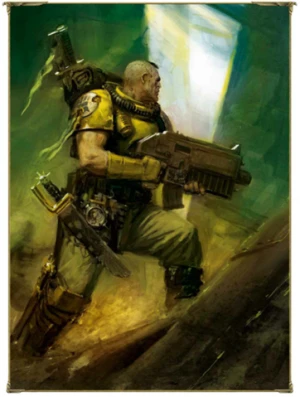

<!-- A0386-B0588 -->

原译文

A recently recruited Imperial Fist scout 近期招募的帝国之拳侦察兵

**校订译文**

A recently recruited Imperial Fist scout 近期招募的帝国之拳侦察兵

<!-- /A0386-B0588 -->

<!-- A0386-B0589 -->
**英文原文**

In the latter, they face extreme heat, cold, empty space, etc. The severity increases along the way. If the initiate passes, then begins the indoctrination, training and the actual surgery that transform them into Space Marines. To celebrate the introduction of the Preomnor implant, cadets eat poisonous plants, venomous animals, etc. For the Omophagea, they consume meat (some of the meat they eat is human flesh) and must divine from the meat a few details about the actual animal. After the initiation ceremony, the cadet's family is informed that their child has become a Space Marine.

<!-- /A0386-B0589 -->

<!-- A0386-B0590 -->

原译文

在后者中，他们面临着极端的炎热、寒冷、空旷等。严重程度一路上升。如果信徒通过，那么就开始灌输、训练和实际手术，将他们转变为星际战士。为了庆祝预置胃植入物的引入，候补们吃有毒的植物、有毒的动物等。对于基因侦测神经来说，他们吃肉（他们吃的一些肉是人肉），必须从肉中推断出关于实际动物的一些细节。在入团仪式之后，候补的家人被告知他们的孩子已经成为一名星际战士。

**校订译文**

在恐怖隧道中，候选者要面对酷热、严寒、真空等考验，难度随行进不断提升。通过试炼后，他们才开始接受思想灌输、训练和真正将其改造为星际战士的手术。植入预置胃后，学员会吞食有毒的植物和动物，以仪式庆祝；植入基因侦测神经后，他们则须食用肉类，其中有些是人肉，并从中读取其来源生物的若干细节。完成入门仪式后，学员的家人会收到通知，得知孩子已成为星际战士。

<!-- /A0386-B0590 -->

<!-- A0386-B0591 -->
**英文原文**

Aspirants that fail to join the ranks of the Fists but survive the process are often recruited into the Auric Auxilia.

<!-- /A0386-B0591 -->

<!-- A0386-B0592 -->

原译文

未能加入帝国之拳但幸存下来的有志者通常会被招募到金甲辅助军。

**校订译文**

未能成为帝国之拳、但在选拔改造过程中活下来的候选者，往往会被招入黄金辅助军。

<!-- /A0386-B0592 -->

<!-- A0386-B0593 -->
## Successors 子战团

<!-- /A0386-B0593 -->

<!-- A0386-B0594 -->
**英文原文**

In all, the Imperial Fists has created dozens of successor Chapters, more than any other Chapter other than the Ultramarines. Originally, the Imperial Fists Legion only sired two Second Founding chapters, although some versions of the Codex Astartes states that three or more were created. As the Legion was heavily depleted by the Horus Heresy, the legion could only be divided three or four times. However, Later foundings involved Imperial more Fists successors than early foundings because of the proliferation of viable gene-seed stocks.

<!-- /A0386-B0594 -->

<!-- A0386-B0595 -->

原译文

总的来说，帝国之拳已经创建了数十个子战团，比除极限战士之外的任何其他战团都多。最初，帝国之拳军团只创建了两个二次建军战团，尽管阿斯塔特圣典的一些版本规定可以创建三个或更多战团。由于荷鲁斯叛乱严重耗尽了军团，军团只能分裂三四次。然而，由于可行基因种子库的增殖，帝国之拳的子战团比早期发现的要多。

**校订译文**

帝国之拳总共产生了数十个子战团，数量仅次于极限战士。较早的记述称军团在二次建军时仅产生两个子战团，但部分版本的《阿斯塔特圣典》记载为三个或更多。由于荷鲁斯之乱造成严重损耗，军团当时只能拆分成三四支部队。此后，随着可用基因种子储备增加，后续建军中诞生的帝国之拳子战团比早期更多。

**校注：** two Second Founding chapters 指两个子战团，原段同时记载版本差异；divided three or four times 按拆成三四支部队理解，不是先后拆分三四轮。foundings 是建军，不是发现。

<!-- /A0386-B0595 -->

<!-- A0386-B0596 -->
**英文原文**

Unlike other Legions, the gene-seed from the Imperial Fists stayed strong and pure, creating a basis for future foundings. Also unlike other Legions and their Successors, the Imperial Fists and their successors are quite different from each other. When it was split, the views of the individual Space Marines chosen as founders and leaders determined the chapter they succeeded into; the Imperial Fists retained those Marines most loyal to the Primarch; those that were unable to accept the constraints of the Codex became the Black Templars; and those who embraced the Codex became the Crimson Fists and Fists Exemplar. Subsequent Foundings of Imperial Fists Successors were created according to one of those viewpoints, depending on how they were created, sometimes trough officers seconded from their Progenitor, until the Successor Chapters developed their own experienced leadership.

<!-- /A0386-B0596 -->

<!-- A0386-B0597 -->

原译文

与其他军团不同，帝国之拳的基因种子保持了强壮和纯净，为未来的建军奠定了基础。与其他军团及其子战团不同，帝国之拳及其子战团也截然不同。当它分裂时，被选为创始人和领导者的星际战士的个人观点决定了他们成功的战团；帝国之拳保留了那些最忠于原体的星际战士；那些无法接受圣典约束的人成为了黑色圣堂；那些拥护圣典的人成为了绯红之拳和典范之拳。随后，帝国之拳子战团的建立是根据其中一种观点创建的，这取决于他们是如何创建的，有时是通过从他们的长者那里借调军官，直到子战团发展出自己经验丰富的领导。

**校订译文**

帝国之拳的基因种子保持着强健与纯净，为后续建军奠定基础。与许多其他军团及其子战团不同，帝国之拳一脉的各战团之间差异颇大。军团拆分时，担任创始者和领袖的星际战士所持理念，决定了新战团的性格：帝国之拳保留了最忠于原体的人；无法接受圣典约束者成为黑色圣堂；拥护圣典者则组成绯红之拳与典范之拳。此后成立的子战团，也往往依据其中一种理念塑造自身，具体取决于建团方式。有时，母团会借调军官前来主持，直至子战团培养出自己的资深领导层。

<!-- /A0386-B0597 -->

<!-- A0386-B0598 图片 -->
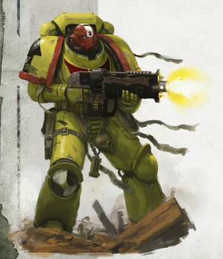

<!-- A0386-B0599 -->

原译文

Imperial Fists Primaris Space Marine 帝国之拳原铸星际战士

**校订译文**

Imperial Fists Primaris Space Marine 帝国之拳原铸星际战士

<!-- /A0386-B0599 -->

<!-- A0386-B0600 -->
**英文原文**

It is noted that the Imperial Fists successor Chapters form a particularly tightly knit brotherhood of Space Marines, three of which are known to participate in the Feast of Blades, including the Imperial Fists.

<!-- /A0386-B0600 -->

<!-- A0386-B0601 -->

原译文

值得注意的是，帝国之拳的子战团形成了一个特别紧密的星际战士兄弟会，其中三个已知参加了刀锋盛宴，包括帝国之拳。

**校订译文**

帝国之拳与其子战团构成了格外紧密的兄弟共同体。本段记载，其中包括帝国之拳在内的三个战团会参加刀锋盛宴。

**校注：** 本段仅提三个参宴战团，属于该段资料覆盖范围；不据此否定全书其他章节所列的更多参加者。

<!-- /A0386-B0601 -->

<!-- A0386-B0602 -->
## Noted Elements of the Imperial Fists 帝国之拳的著名人物、部队与装备

原题：Noted Elements of the Imperial Fists 帝国之拳的著名成员

<!-- /A0386-B0602 -->

<!-- A0386-B0603 -->
### Relics and Artefacts 圣物与造物

<!-- /A0386-B0603 -->

<!-- A0386-B0604 -->

原译文

Fist of Dorn 多恩之拳

**校订译文**

Fist of Dorn 多恩之拳

<!-- /A0386-B0604 -->

<!-- A0386-B0605 -->
**英文原文**

Dorn's Arrow (in the possession of the Crimson Fists)

<!-- /A0386-B0605 -->

<!-- A0386-B0606 -->

原译文

多恩之箭（绯红之拳持有）

**校订译文**

多恩之箭（绯红之拳持有）

<!-- /A0386-B0606 -->

<!-- A0386-B0607 -->

原译文

Column of Glory 荣耀之柱

**校订译文**

Column of Glory 荣耀之柱

<!-- /A0386-B0607 -->

<!-- A0386-B0608 -->

原译文

Remains of Rogal Dorn 罗格·多恩的部分躯体

**校订译文**

Remains of Rogal Dorn 罗格·多恩的遗存

**校注：** 原文仅写 remains，未限定躯体比例，删去原稿额外的“部分”。

<!-- /A0386-B0608 -->

<!-- A0386-B0609 -->
### Notable Vessels 著名战舰

<!-- /A0386-B0609 -->

<!-- A0386-B0610 -->
**英文原文**

Phalanx - Fortress-Monastery

<!-- /A0386-B0610 -->

<!-- A0386-B0611 -->

原译文

山阵号 - 要塞修道院

**校订译文**

山阵号 - 要塞修道院

<!-- /A0386-B0611 -->

<!-- A0386-B0612 -->
**英文原文**

Faithful Servant - Battle Barge (Heresy-era)

<!-- /A0386-B0612 -->

<!-- A0386-B0613 -->

原译文

忠仆号 - 战斗驳船（叛乱时期）

**校订译文**

忠仆号 - 战斗驳船（叛乱时期）

<!-- /A0386-B0613 -->

<!-- A0386-B0614 -->
**英文原文**

Three Sisters of Spite - 3 Frigates known as Lachrymae, Ophelia and Persephone.

<!-- /A0386-B0614 -->

<!-- A0386-B0615 -->

原译文

恶意三姐妹 - 3艘护卫舰，称为泪痕号、奥菲利亚号和珀耳塞福涅号。

**校订译文**

恶意三姐妹 - 3艘护卫舰，称为泪痕号、奥菲利亚号和珀耳塞福涅号。

<!-- /A0386-B0615 -->

<!-- A0386-B0616 -->
### Named Vehicles 有专名的载具

原题：Named Vehicles 著名载具

<!-- /A0386-B0616 -->

<!-- A0386-B0617 -->
**英文原文**

Dorn's Skyhammer - Hunter

<!-- /A0386-B0617 -->

<!-- A0386-B0618 -->

原译文

多恩天锤 - 猎手

**校订译文**

多恩天锤——猎手防空坦克。

<!-- /A0386-B0618 -->

<!-- A0386-B0619 -->
**英文原文**

Flavo Caelum - Stormraven

<!-- /A0386-B0619 -->

<!-- A0386-B0620 -->

原译文

烈焰苍穹 - 风暴鸦

**校订译文**

烈焰苍穹——风暴鸦炮艇。

**校注：** Flavo Caelum 为载具专名，暂沿现稿烈焰苍穹；原稿并非严格拉丁词面翻译，待核正式出处后再定，不标官译。

<!-- /A0386-B0620 -->

<!-- A0386-B0621 -->
**英文原文**

Holy Avenger - Land Raider Crusader

<!-- /A0386-B0621 -->

<!-- A0386-B0622 -->

原译文

神圣复仇者 - 兰德掠袭者十字军

**校订译文**

神圣复仇者——十字军型兰德掠袭者战车。

<!-- /A0386-B0622 -->

<!-- A0386-B0623 -->
### Notable Members 著名成员

<!-- /A0386-B0623 -->

<!-- A0386-B0624 -->
### Heresy Era 叛乱时期

<!-- /A0386-B0624 -->

<!-- A0386-B0625 -->

原译文

Primarch Rogal Dorn 原体罗格·多恩

**校订译文**

Primarch Rogal Dorn 原体罗格·多恩

<!-- /A0386-B0625 -->

<!-- A0386-B0626 -->
**英文原文**

Sigismund, Captain, 1st Company.

<!-- /A0386-B0626 -->

<!-- A0386-B0627 -->

原译文

西吉斯蒙德，连长，第一连队

**校订译文**

西吉斯蒙德，连长，第一连队

<!-- /A0386-B0627 -->

<!-- A0386-B0628 -->
**英文原文**

Halbrecht, Captain , company unknown.

<!-- /A0386-B0628 -->

<!-- A0386-B0629 -->

原译文

哈尔布雷希特，连长，未知连队

**校订译文**

哈尔布雷希特，连长，未知连队

<!-- /A0386-B0629 -->

<!-- A0386-B0630 -->
**英文原文**

Alexis Polux, Captain , 405th Company.

<!-- /A0386-B0630 -->

<!-- A0386-B0631 -->

原译文

亚历克西斯·泼拉克斯，连长，第405连队

**校订译文**

亚历克西斯·泼鲁克斯，连长，第405连队

<!-- /A0386-B0631 -->

<!-- A0386-B0632 -->
**英文原文**

Efried, Captain , 3rd Company.

<!-- /A0386-B0632 -->

<!-- A0386-B0633 -->

原译文

埃弗里德，连长，第三连队

**校订译文**

埃弗里德，连长，第三连队

<!-- /A0386-B0633 -->

<!-- A0386-B0634 -->
**英文原文**

Camba-Diaz, Captain , 50th company.

<!-- /A0386-B0634 -->

<!-- A0386-B0635 -->

原译文

坎巴·迪亚兹，连长，第50连队

**校订译文**

坎巴·迪亚兹，连长，第50连队

<!-- /A0386-B0635 -->

<!-- A0386-B0636 -->
**英文原文**

Amandus Tyr, Captain, company unknown

<!-- /A0386-B0636 -->

<!-- A0386-B0637 -->

原译文

阿曼德斯·泰尔，连长，未知连队

**校订译文**

阿曼德斯·泰尔，连长，未知连队

<!-- /A0386-B0637 -->

<!-- A0386-B0638 -->
**英文原文**

Archamus, Master of the Huscarls

<!-- /A0386-B0638 -->

<!-- A0386-B0639 -->

原译文

阿坎姆斯，胡斯卡尔之主

**校订译文**

阿坎姆斯，胡斯卡尔亲卫之主。

**校注：** Huscarls 在这里为荷鲁斯之乱时期的帝国之拳亲卫编制，保留原稿音译并加亲卫说明，区别战团时代第八连别称“多恩亲卫”。

<!-- /A0386-B0639 -->

<!-- A0386-B0640 -->
**英文原文**

Kestros - Huscarl Sergeant

<!-- /A0386-B0640 -->

<!-- A0386-B0641 -->

原译文

凯斯特罗斯 - 胡斯卡尔军士

**校订译文**

凯斯特罗斯，胡斯卡尔亲卫军士。

<!-- /A0386-B0641 -->

<!-- A0386-B0642 -->
**英文原文**

Lycus - Marshal

<!-- /A0386-B0642 -->

<!-- A0386-B0643 -->

原译文

利库斯 - 元帅

**校订译文**

利库斯 - 元帅

<!-- /A0386-B0643 -->

<!-- A0386-B0644 -->
**英文原文**

Yonnad, Captain

<!-- /A0386-B0644 -->

<!-- A0386-B0645 -->

原译文

约纳德，连长

**校订译文**

约纳德，连长

<!-- /A0386-B0645 -->

<!-- A0386-B0646 -->
**英文原文**

Noriz, Captain

<!-- /A0386-B0646 -->

<!-- A0386-B0647 -->

原译文

诺瑞兹，连长

**校订译文**

诺瑞兹，连长

<!-- /A0386-B0647 -->

<!-- A0386-B0648 -->
### Post-Heresy 叛乱后

<!-- /A0386-B0648 -->

<!-- A0386-B0649 -->
**英文原文**

Maximus Thane - Chapter Master , Originally a member of the Fists Exemplar, became Chapter Master during the War of the Beast when the Imperial Fists Successors rebuilt the Chapter

<!-- /A0386-B0649 -->

<!-- A0386-B0650 -->

原译文

马克西姆斯·塞恩 - 战团长，最初是典范之拳的一员，在野兽战争期间，当帝国之拳的子战团重建战团时，他成为了战团长

**校订译文**

马克西姆斯·塞恩——战团长，原属典范之拳。野兽战争期间，帝国之拳各子战团共同重建母团，塞恩成为重建后的战团长。

<!-- /A0386-B0650 -->

<!-- A0386-B0651 -->
**英文原文**

Darnath Lysander, 1st Company Captain , current.

<!-- /A0386-B0651 -->

<!-- A0386-B0652 -->

原译文

达纳斯·莱山德，第一连队连队，目前

**校订译文**

达纳斯·莱山德，现任第一连长。

<!-- /A0386-B0652 -->

<!-- A0386-B0653 -->
**英文原文**

Tor Garadon, 3rd Captain

<!-- /A0386-B0653 -->

<!-- A0386-B0654 -->

原译文

托尔·加拉顿，第三连队

**校订译文**

托尔·加拉顿，第三连长。

<!-- /A0386-B0654 -->

<!-- A0386-B0655 -->
**英文原文**

Taelos, 10th Company Captain.

<!-- /A0386-B0655 -->

<!-- A0386-B0656 -->

原译文

泰洛斯，第十连队连长

**校订译文**

泰洛斯，第十连队连长

**校注：** 泰洛斯在本列表为第十连长，而前文编制表列为第七连长；按各自记述保留，属于不同时间/版本任职资料。

<!-- /A0386-B0656 -->

<!-- A0386-B0657 -->
**英文原文**

Lexandro D'Arquebus, Captain, company unknown, seconded to the Inquisition.

<!-- /A0386-B0657 -->

<!-- A0386-B0658 -->

原译文

莱克桑德罗·德’阿奎布斯，连长，连队未知，借调到审判庭。

**校订译文**

莱克桑德罗·德’阿奎布斯，连长，连队未知，借调到审判庭。

<!-- /A0386-B0658 -->

<!-- A0386-B0659 -->
**英文原文**

Quirion Octavius, Captain, company unknown, forwarded to the Deathwatch.

<!-- /A0386-B0659 -->

<!-- A0386-B0660 -->

原译文

奎里昂·奥克塔维斯，连长，连队未知，转移到死亡守望。

**校订译文**

奎里昂·奥克塔维斯，连长，所属连队不详，奉调至死亡守望。

<!-- /A0386-B0660 -->

<!-- A0386-B0661 -->
**英文原文**

Fafnir Rann, Captain , company unknown, founded and led the Executioners Space Marine Chapter

<!-- /A0386-B0661 -->

<!-- A0386-B0662 -->

原译文

法夫尼尔·兰恩，连长，未知连队，创立并领导了处刑者星际战士战团

**校订译文**

法夫尼尔·兰恩，连长，未知连队，创立并领导了处刑者星际战士战团

<!-- /A0386-B0662 -->

<!-- A0386-B0663 -->
**英文原文**

Koorland, Second Captain - Served in the War of the Beast. Became the last survivor of his Chapter and rose to become both Chapter Master and Lord Commander of the Imperium.

<!-- /A0386-B0663 -->

<!-- A0386-B0664 -->

原译文

库兰德，第二连长-在野兽战争中服役。成为其战团的最后一名幸存者，并升任战团长和帝国领主指挥官。

**校订译文**

库兰德，第二连长。他在野兽战争中成为战团最后的幸存者，随后升任战团长与帝国最高统帅。

<!-- /A0386-B0664 -->

<!-- A0386-B0665 -->
### Unique Troops 独特部队

<!-- /A0386-B0665 -->

<!-- A0386-B0666 -->

原译文

Huscarls 胡斯卡尔

**校订译文**

Huscarls 胡斯卡尔亲卫

<!-- /A0386-B0666 -->

<!-- A0386-B0667 -->

原译文

Terror Scouts 恐惧侦察兵

**校订译文**

Terror Scouts 恐怖侦察兵

<!-- /A0386-B0667 -->

<!-- A0386-B0668 -->

原译文

Castellan (Heresy-era) 堡主（叛乱时期）

**校订译文**

Castellan (Heresy-era) 堡主（叛乱时期）

<!-- /A0386-B0668 -->

<!-- A0386-B0669 -->

原译文

Templar Brethren (Heresy-era) 圣堂兄弟会（叛乱时期）

**校订译文**

Templar Brethren (Heresy-era) 圣堂兄弟会（叛乱时期）

<!-- /A0386-B0669 -->

<!-- A0386-B0670 -->

原译文

Phalanx Warder (Heresy-era) 山阵卫队（叛乱时期）

**校订译文**

Phalanx Warder (Heresy-era) 山阵卫队（叛乱时期）

<!-- /A0386-B0670 -->

<!-- A0386-B0671 -->

原译文

Aegis Pilot (Heresy-era) 埃癸斯飞行员（叛乱时期）

**校订译文**

Aegis Pilot (Heresy-era) 神盾飞行员（叛乱时期）

<!-- /A0386-B0671 -->

本篇核心术语与暂定项

以下列出本篇出现的英文原形及核心术语表用词。同形词可能指不同对象，具体词义以本篇正文和校注为准；单复数、别名和仅见于图注的名称可能尚未列入。完整候选见[术语表](../../术语表/双语术语候选.csv)。

| 英文 | 采用中文 | 状态 |
| --- | --- | --- |
| Space Marines | 星际战士 | 官方已核对 |
| Black Templars | 黑色圣堂 | 官方已核对 |
| Blood Angels | 圣血天使 | 官方已核对 |
| Dark Angels | 黑暗天使 | 官方已核对 |
| Deathwatch | 死亡守望 | 官方已核对 |
| Grey Knights | 灰骑士 | 官方已核对 |
| Space Wolves | 太空野狼 | 官方已核对 |
| Adeptus Custodes | 帝皇禁军 | 官方已核对 |
| Adeptus Mechanicus | 机械修会 | 官方已核对 |
| Astra Militarum | 星界军 | 官方已核对 |
| Imperial Army | 帝国军 | 暂定·官方待核 |
| Chaos Space Marines | 混沌星际战士 | 官方已核对 |
| Death Guard | 死亡守卫 | 官方已核对 |
| Thousand Sons | 千子 | 官方已核对 |
| World Eaters | 吞世者 | 官方已核对 |
| Chaos Daemons | 混沌恶魔 | 官方已核对 |
| Eldar | 灵族 | 暂定·语境区分 |
| Dark Eldar | 黑暗灵族 | 暂定·旧称对应 |
| Tyranids | 泰伦虫族 | 官方已核对 |
| Orks | 欧克蛮人 | 官方已核对 |
| T'au Empire | 钛帝国 | 官方已核对 |
| Terminator | 终结者 | 官方已核对 |
| Roboute Guilliman | 罗保特·基里曼 | 官方已核对 |
| Ultramarines | 极限战士 | 官方已核对 |
| Be'lakor | 比拉克尔 | 官方已核对 |
| Horus Heresy | 荷鲁斯之乱 | 官方已核对 |
| Astronomican | 星炬 | 暂定 |
| Warp | 亚空间 | 官方已核对 |
| Inquisition | 审判庭 | 暂定 |
| Imperium | 帝国 | 暂定·简称 |
| Imperial Navy | 帝国海军 | 暂定 |
| Mechanicum | 机械教 | 暂定·历史称谓 |
| Dark Mechanicum | 黑暗机械教 | 暂定·官方待核 |
| Craftworld | 方舟世界 | 官方已核对 |
| Waaagh! | Waaagh! | 暂定·保留原文 |
| Librarius | 智库（机构）／智库学派（灵能学派） | 语境定译·官方待核 |
| Indomitus | 不屈学派 | 暂定·学派语境 |
| History | 历史 | 编辑用语已统一 |
| Equipment | 装备 | 编辑用语已统一 |
| Eye of Terror | 恐惧之眼 | 官方已核对 |
| Maelstrom | 大漩涡 | 官方已核对 |
| Imperial Fists | 帝国之拳 | 暂定 |
| Darnath Lysander | 达纳斯·莱山德 | 官方已核对 |
| Phalanx | 山阵号 | 暂定 |
| Techmarine | 科技战士 | 官方已核对 |
| Emperor of Mankind | 人类帝皇 | 暂定 |
| Emperor | 帝皇 | 官方已核对 |
| Primarch | 原体 | 官方已核对 |
| Officio Assassinorum | 刺客庭 | 暂定·官方待核 |
| Battle Barge | 战斗驳船 | 暂定·官方待核 |
| Shrine World | 圣地世界 | 暂定·官方待核 |
| Necromunda | 涅克罗蒙达 | 暂定·官方待核 |
| Age of Apostasy | 叛教时代 | 暂定·官方待核 |
| Goge Vandire | 高戈·范迪尔 | 暂定·官方待核 |
| Word Bearers | 怀言者 | 暂定·官方待核 |
| Black Legion | 黑色军团 | 暂定·官方待核 |
| Emperor's Children | 帝皇之子 | 官方已核对 |
| Iron Warriors | 钢铁勇士 | 暂定·官方待核 |
| Night Lords | 午夜领主 | 暂定·官方待核 |
| The Order | 秩序 | 暂定·官方待核 |
| Great Crusade | 大远征 | 暂定·官方待核 |
| Compliance | 归顺；纳入帝国统治 | 暂定·官方待核 |
| Terra | 泰拉 | 暂定·官方待核 |
| Luna Wolves | 影月苍狼 | 暂定·官方待核 |
| Horus | 荷鲁斯 | 暂定·官方待核 |
| Sons of Horus | 荷鲁斯之子 | 暂定·官方待核 |
| Isstvan III | 伊斯塔万三号 | 暂定·官方待核 |
| Iron Hands | 钢铁之手 | 暂定·官方待核 |
| Fulgrim | 福格瑞姆 | 官方已核对 |
| High Lords of Terra | 泰拉高领主 | 暂定·官方待核 |
| Indomitus Crusade | 不屈远征 | 暂定·官方待核 |
| War of Beasts | 野兽之战 | 暂定·官方待核 |
| Hive Fleet Leviathan | 利维坦虫巢舰队 | 暂定·官方待核 |
| Fourth Tyrannic War | 第四次泰伦战争 | 暂定·官方待核 |
| Lord Commander of the Imperium | 帝国最高统帅 | 暂定·官方待核 |
| Unification Wars | 统一战争 | 暂定·官方待核 |
| Segmentum Solar | 太阳星域 | 暂定·官方待核 |
| Segmentum | 星域 | 暂定·官方待核 |
| Sector | 星区 | 暂定·官方待核 |
| Perpetual | 永生者 | 暂定·官方待核 |
| Malcador the Sigillite | 掌印者马卡多 | 暂定·官方待核 |
| Vulkan | 沃坎 | 暂定·官方待核 |
| Salamanders | 火蜥蜴 | 暂定·官方待核 |
| Brotherhood | 兄弟会 | 暂定·官方待核 |
| Long Watch | 万古守望 | 暂定·官方待核 |
| Deeper | 深人 | 暂定·官方待核 |
| Mars | 火星 | 暂定·官方待核 |
| Jupiter | 木星 | 暂定·官方待核 |
| Rynn's World | 瑞恩世界 | 暂定·官方待核 |
| Khai-Zhan | 凯詹 | 暂定·官方待核 |
| Ophelia VII | 奥菲利亚七号 | 暂定·官方待核 |
| Cadia | 卡迪亚 | 暂定·官方待核 |
| Luna | 月球 | 暂定·官方待核 |
| Nimbosa | 宁博撒 | 暂定·官方待核 |
| Cthonia | 科索尼亚 | 暂定·官方待核 |
| Obscurus | 朦胧星 | 暂定·官方待核 |
| Titan | 泰坦 | 暂定·官方待核 |
| Vigilus | 警戒星 | 暂定·官方待核 |
| Land Raider | 兰德掠袭者战车 | 官方已核对 |
| Warsmith | 战争铁匠 | 暂定·官方待核 |
| Pharos | 灯塔 | 暂定·官方待核 |
| Alexis Polux | 亚历克西斯·泼鲁克斯 | 暂定·官方待核 |
| Imperial Gothic | 帝国哥特语 | 暂定·官方待核 |
| Tech | 技术语 | 暂定·官方待核 |
| Stamp | 印块 | 暂定·官方待核 |
| Clear | 清明 | 暂定·官方待核 |
| Master | 导师（审判庭职衔）／舰务官（舰员职务） | 语境定译·官方待核 |
| The Beheading | 斩首事件 | 暂定 |
| Mission | 教团／传教机构 | 暂定 |
| Marduk | 马尔杜克 | 暂定·官方待核 |
| Reclusiam | 隐修圣殿 | 暂定·官方待核 |
| Minotaurs | 米诺陶 | 暂定·官方待核 |
| Chaplain | 教士 | 官方已核对 |
| Ancient | 旗手 | 官方已核对 |
| Vheren Ashurhaddon | 维伦·阿舒哈顿 | 暂定·官方待核 |
| Iacton Qruze | 亚克顿·克鲁兹 | 暂定·官方待核 |
| Ullanor | 乌兰诺 | 暂定·官方待核 |
| Lord Commander | 领主指挥官 | 暂定·官方待核 |
| White Scars | 白疤 | 官方已核 |
| Alpha Legion | 阿尔法军团 | 暂定·官方待核 |
| Raven Guard | 暗鸦守卫 | 官方已核 |
| Second Founding | 二次建军 | 暂定·官方待核 |
| The Sigillite | 掌印者 | 暂定·官方待核 |
| Scars | 伤疤 | 暂定·官方待核 |
| Shattered Legions | 破碎军团 | 暂定·官方待核 |
| The Battle of Beta-Garmon | 贝塔-伽蒙之战 | 暂定·官方待核 |
| Founding | 建军 | 暂定·官方待核 |
| Sol | 太阳系 | 暂定·官方待核 |
| The Phalanx | 山阵号 | 暂定·官方待核 |
| Isstvan | 伊斯塔万 | 暂定·官方待核 |
| Nathaniel Garro | 纳撒尼尔·伽罗 | 暂定·官方待核 |
| Cthonian Headhunters | 科索尼亚猎颅者 | 暂定·官方待核 |
| First Captain | 第一连长 | 暂定·官方待核 |
| Crimson Fists | 绯红之拳 | 暂定·官方待核 |
| Sigismund | 西吉斯蒙德 | 暂定·官方待核 |
| Kestros | 凯斯特罗斯 | 暂定·官方待核 |
| Power Armour | 动力盔甲 | 暂定·官方待核 |
| Dreadwing | 恐翼 | 暂定·官方待核 |
| Space Marine | 星际战士 | 暂定·官方待核 |
| Chapter | 战团 | 暂定·官方待核 |
| Fortress-monastery | 要塞修道院 | 暂定·官方待核 |
| Chapter Master | 战团长 | 暂定·官方待核 |
| Captain | 连长 | 暂定·官方待核 |
| Veteran | 老兵 | 暂定·官方待核 |
| Terminators | 终结者 | 暂定·官方待核 |
| Sergeant | 军士 | 暂定·官方待核 |
| Brother | 修士 | 暂定·官方待核 |
| Devastator | 破坏者 | 暂定·官方待核 |
| Scout | 侦察兵 | 暂定·官方待核 |
| Vanguard | 先锋 | 暂定·官方待核 |
| Battle-Brother | 战斗兄弟 | 暂定·官方待核 |
| Vanguard Space Marine | 先锋星际战士 | 暂定·官方待核 |
| Tor Garadon | 托尔·加拉顿 | 官方已核 |
| Arvann Stern | 艾维安·斯特恩 | 暂定·官方待核 |
| Codex Astartes | 阿斯塔特圣典 | 暂定·官方待核 |
| Blood Drinkers | 饮血者 | 暂定·官方待核 |
| Excoriators | 责难者 | 暂定·官方待核 |
| Fists Exemplar | 典范之拳 | 暂定·官方待核 |
| Silver Guard | 银色守卫 | 暂定·官方待核 |
| Soul Drinkers | 饮魂者 | 暂定·官方待核 |
| Revilers | 谩骂者 | 暂定·官方待核 |
| Executioners | 处刑者 | 语境定译·官方待核 |
| Halo Brethren | 光环兄弟会 | 暂定·官方待核 |
| Exorcists | 驱魔者 | 暂定·官方待核 |
| Fire Hawks | 火鹰 | 暂定·官方待核 |
| Celestial Lions | 天狮 | 暂定·官方待核 |
| Hospitallers | 医院骑士 | 暂定·官方待核 |
| Sons of the Phoenix | 凤凰之子 | 暂定·官方待核 |
| Sable Swords | 阴暗之剑 | 暂定·官方待核 |
| The Black Templars | 黑色圣堂 | 暂定·官方待核 |
| Armoury | 军械库 | 暂定·官方待核 |
| Rhinos | 犀牛 | 暂定·官方待核 |
| Land Speeders | 兰德速攻艇 | 暂定·官方待核 |
| Vindicators | 维护者 | 暂定·官方待核 |
| Land Raiders | 兰德掠袭者 | 暂定·官方待核 |
| Repulsors | 反重力战车 | 暂定·官方待核 |
| Centurions | 百夫长 | 暂定·官方待核 |
| Overlord | 霸主 | 官方已核对 |
| Brazen Annihilators | 黄铜歼灭者 | 暂定·官方待核 |
| Celestials | 天神 | 暂定·官方待核 |
| Crimson Axes | 深红之斧 | 暂定·官方待核 |
| Crusaders | 十字军 | 暂定·官方待核 |
| Death Strike | 死亡打击 | 暂定·官方待核 |
| Defenders Obscurus | 缄默守卫者 | 暂定·官方待核 |
| Doom Fists | 末日之拳 | 暂定·官方待核 |
| Emperor's Havoc | 帝皇浩劫 | 暂定·官方待核 |
| Emperor's Warbringers | 帝皇战争使者 | 暂定·官方待核 |
| Exemplars | 模范者 | 暂定·官方待核 |
| Fire Lords | 火焰领主 | 暂定·官方待核 |
| Fists of Wrath | 愤怒之拳 | 暂定·官方待核 |
| Flames of Aries | 白羊座之火 | 暂定·官方待核 |
| Hammers of Dorn | 多恩之锤 | 暂定·官方待核 |
| Invaders | 侵略者 | 暂定·官方待核 |
| Iron Champions | 钢铁冠军 | 暂定·官方待核 |
| Iron Knights | 钢铁骑士 | 暂定·官方待核 |
| Legion of the Damned | 诅咒军团 | 暂定·官方待核 |
| Reborn | 复生者（战团）／重生者（死神军自称） | 语境定译·官方待核 |
| Rechista Fists | 真实之拳 | 暂定·官方待核 |
| Red Templars | 红色圣堂 | 暂定·官方待核 |
| Remnants | 残骸 | 暂定·官方待核 |
| Retributors | 天罚行者 | 暂定·官方待核 |
| Sons of Dorn | 多恩之子 | 暂定·官方待核 |
| Subjugators | 压制者 | 暂定·官方待核 |
| Victors | 胜利者 | 暂定·官方待核 |
| Space Marine Company | 星际战士连队 | 暂定·官方待核 |
| Gene-seed | 基因种子 | 暂定·官方待核 |
| Strike Cruiser | 打击巡洋舰 | 暂定·官方待核 |
| Veteran Company | 老兵连队 | 暂定·官方待核 |
| Scout Company | 侦察连 | 暂定·官方待核 |
| Preomnor | 预置胃 | 暂定·官方待核 |
| Omophagea | 基因侦测神经 | 暂定·官方待核 |
| Sus-an Membrane | 苏安脑膜 | 暂定·官方待核 |
| Betcher's Gland | 贝彻腺体 | 暂定·官方待核 |
| Terminator Squads | 终结者小队 | 暂定·官方待核 |
| Auric Auxilia | 黄金辅助军 | 暂定·官方待核 |
| Gregor Dessian | 格雷戈尔·德西安 | 暂定·官方待核 |
| Taelos | 泰洛斯 | 暂定·官方待核 |
| Castellan | 堡主 | 官方已核对 |
| Veteran Sergeants | 老兵军士 | 暂定·官方待核 |
| Principia Bellicosa | 军团组织法典 | 暂定·官方待核 |
| Initiates | 进阶者 | 官方已核 |
| Brother-Captain | 兄弟会连长（灰骑士）／兄弟连长（通称） | 语境定译·灰骑士职衔官译已核 |
| Grief | 格里夫 | 暂定·官方待核 |
| Bell of Lost Souls | 亡魂之钟 | 暂定·官方待核 |
| Risen | 赦天使 | 暂定·官方待核 |
| Macaroth | 马卡洛斯 | 暂定·官方待核 |
| Xenos | 异形 | 暂定·官方待核 |
| T'au | 钛族 | 暂定·官方待核 |
| Initiate | 正式成员 | 暂定·官方待核 |
| Skulltaker | 夺颅者 | 官方已核对 |
| Contagion | 传播者 | 暂定·官方待核 |
| Jaghatai Khan | 察合台可汗 | 暂定·官方待核 |
| Horde | 部落 | 暂定·官方待核 |
| Alaitoc | 阿莱托克 | 暂定·官方待核 |
| Illic Nightspear | 伊利克·夜矛 | 暂定·官方待核 |
| Raider | 掠袭者飞艇 | 官方已核对 |
| Warboss | 战争头目 | 官方已核对 |
| Evil Sunz | 邪日 | 暂定·官方待核 |
| Mork | 毛哥 | 暂定·官方待核 |
| The Beast | 野兽 | 暂定·官方待核 |
| Tiberna | 提伯纳 | 暂定·官方待核 |
| Mondus Occulum | 蒙杜斯·奥库勒姆 | 暂定·官方待核 |
| Mondus Gamma | 蒙杜斯·伽马 | 暂定·官方待核 |
| Shrouded Dynasties | 帷幕王朝 | 暂定·官方待核 |
| Pillar of Bone | 白骨之墩 | 暂定·官方待核 |
| Column of Glory | 荣耀之柱 | 暂定·官方待核 |
| Last Wall Protocol | 最终高墙协议 | 暂定·官方待核 |
| Chromes | 铬族 | 暂定·官方待核 |
| Ardamantua | 阿达曼图阿 | 暂定·官方待核 |
| Koorland | 库兰德 | 暂定·官方待核 |
| Maximus Thane | 马克西姆斯·塞恩 | 暂定·官方待核 |
| Seneschal Athis Marro | 总管阿西斯·马罗 | 暂定·官方待核 |
| Liber Proditor Armorum | 《叛徒军备之书》 | 暂定·官方待核 |
| Techmarine Suprema | 最高科技战士 | 暂定·官方待核 |
| Lysol Blane | 利索尔·布兰 | 暂定·官方待核 |
| Contagion of Ganymede | 木卫三疫军 | 暂定·官方待核 |
| Sanctum | 圣所星 | 暂定·官方待核 |
| Strike Force Ultra | 超级打击部队 | 暂定·官方待核 |
| Endeavour of Will | 奋进意志号 | 暂定·官方待核 |
| Lacrima Dolorosa Crusade | 悲恸之泪远征 | 暂定·官方待核 |
| Dorn's Huscarls | 多恩亲卫 | 暂定·官方待核 |
| Scriptum Ascenda | 《追忆笔录》 | 暂定·官方待核 |
| Rhetoricus | 瑞托里库斯 | 暂定·官方待核 |
| The Book of Five Spheres | 《五界之书》 | 暂定·官方待核 |
| Rites of Battle | 战斗仪式 | 暂定·官方待核 |
| Helbrant Alderic | 赫尔布雷特·阿尔德里克 | 暂定·官方待核 |
| Junker model of behaviour | 容克行为模式 | 暂定·官方待核 |
| Pain Glove | 痛苦手套 | 暂定·官方待核 |
| Sternhelms | 严厉之盔 | 暂定·官方待核 |
| Flavo Caelum | 烈焰苍穹 | 暂定·官方待核 |
| Honour Duels | 荣誉决斗 | 暂定·官方待核 |
| Scrimshaw | 骨雕 | 暂定·官方待核 |
| Intractable | 难解号 | 暂定·官方待核 |
| Marshal | 元帅 | 官方已核对 |
| Chapter Keep | 战团堡垒 | 暂定·官方待核 |
| Angron | 安格隆 | 官方已核对 |
| Uttu Prime | 乌图主星 | 暂定·官方待核 |
| Evander Garrius | 伊万德·加里乌斯 | 暂定·官方待核 |
| Marduk Sedras | 玛杜克·赛德拉斯 | 暂定·官方待核 |
| Dreadnought | 无畏机甲 | 暂定·官方待核 |
| Bikes | 摩托 | 暂定·官方待核 |
| Iron Cage | 铁笼 | 暂定·官方待核 |
| Laurels of Victory | 胜利桂冠号 | 暂定·官方待核 |
| Quicksilver | 快银号 | 暂定·官方待核 |
| Grand Master | 大导师 | 暂定·官方待核 |
| Battle Brother | 战斗兄弟 | 暂定·官方待核 |
| Mersadie Oliton | 梅萨迪·奥莱顿 | 暂定·官方待核 |
| Sable | 暗夜星 | 暂定·官方待核 |
| Hydra Cordatus | 海德拉之心 | 暂定·官方待核 |
| Sky Fortress | 天空堡垒 | 暂定·官方待核 |
| Bear | 熊 | 暂定·官方待核 |
| Attack Moon | 战斗月亮 | 暂定·官方待核 |
| Lachrymae | 泪痕号 | 暂定·官方待核 |
| Persephone | 珀尔塞福涅号 | 暂定·官方待核 |
| Iduno | 伊杜诺 | 暂定·官方待核 |
| Blood of Khaine | 凯恩之血号 | 暂定·官方待核 |
| Haddrake Tor | 哈德雷克·托尔 | 暂定·官方待核 |
| Kleitus | 克雷图斯 | 暂定·官方待核 |
| Fist of Dorn | 多恩之拳 | 暂定·官方待核 |
| Vernalis | 维纳利斯 | 暂定·官方待核 |
| Sybaris | 席巴里斯 | 暂定·官方待核 |
| Vladimir Pugh | 弗拉基米尔·普格 | 暂定·官方待核 |
| Victorix | 胜利星 | 暂定·官方待核 |
| Triumph at Victorix | 胜利星大捷 | 暂定·官方待核 |
| Xalladin | 沙拉丁 | 暂定·官方待核 |
| Dorn's Arrow | 多恩之箭 | 暂定·官方待核 |
| The Dark | 《黑暗》 | 暂定·官方待核 |
| The Blood | 鲜血 | 暂定·官方待核 |
| Battle of Xalladin | 沙拉丁之战 | 暂定·官方待核 |
| Lent | 伦特 | 暂定·官方待核 |
| Hexarchy | 六头集团 | 暂定·官方待核 |
| Drakan Vangorich | 德拉坎·万戈里奇 | 暂定·官方待核 |
| System | 星系（恒星系统） | 暂定·官方待核 |
| Verghast | 维尔加斯特 | 暂定·官方待核 |
| Voss | 沃斯 | 暂定·官方待核 |
| Sabbat Worlds | 萨巴特诸世界 | 暂定·官方待核 |
| Mining World | 矿业世界 | 暂定·官方待核 |
| Amandus Tyr | 阿曼杜斯·提尔 | 暂定·官方待核 |
| Yonnad | 约纳德 | 暂定·官方待核 |
| Helios | 赫利俄斯 | 暂定·官方待核 |
| Avenger | 复仇者号 | 暂定·官方待核 |
| Beta | 贝塔号 | 暂定·官方待核 |
| Assault Cannon | 突击炮 | 暂定·官方待核 |
| Jovian Grenadiers | 木星掷弹兵 | 暂定·官方待核 |
| Efried | 埃弗里德 | 暂定·官方待核 |
| Bolter | 爆矢枪 | 暂定·官方待核 |
| Corvus Sub-sector | 乌鸦次星区 | 暂定·官方待核 |
| Harnish | 哈尼什 | 暂定·官方待核 |
| Fafnir Rann | 法夫尼尔·兰恩 | 暂定·官方待核 |
| Feast of Blades | 刀锋盛宴 | 暂定·官方待核 |
| Heritor Asphodel | 继承者阿斯弗德尔 | 暂定·官方待核 |
| Vervunhive | 维文巢都 | 暂定·官方待核 |
| The Fist of Dorn | 多恩之拳 | 暂定·官方待核 |
| Dorn's Skyhammer | 多恩天锤号 | 暂定·官方待核 |
| Eisenstein | 艾森斯坦号 | 暂定·官方待核 |
| The Scriptum Ascenda | 追忆笔录 | 暂定·官方待核 |
| Kraken | 克拉肯 | 暂定·官方待核 |
| Titan Legions | 泰坦军团 | 暂定·官方待核 |
| Sublime | 极端星 | 暂定·官方待核 |
| Heed | 希德 | 暂定·官方待核 |
| Khai-Zhan Uprising | 凯詹叛乱 | 暂定·官方待核 |
| Land Raider Crusader | 十字军型兰德掠袭者战车 | 官方已核对 |
| Holy Avenger | 神圣复仇者号 | 暂定·官方待核 |
| Sol System | 太阳系 | 暂定·官方待核 |
| Lion's Gate | 狮门 | 暂定·官方待核 |
| The Pillar of Bone | 白骨之墩 | 暂定·官方待核 |

