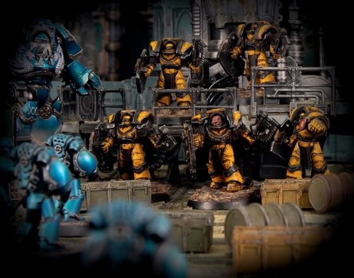
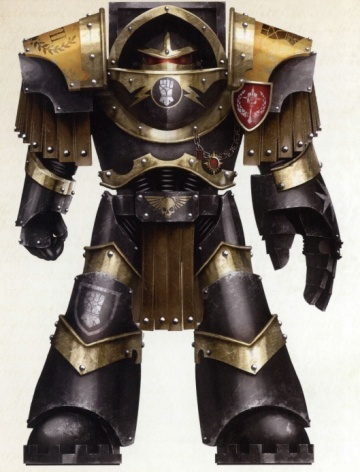

# 0389 胡斯卡尔亲卫 Huscarl

精校状态：中文行文已逐段精校，部分术语仍为暂定

分类：通用概念 / 帝国 Imperium / 中央政务部 Adeptus Terra / 阿斯塔特修会 Adeptus Astartes

原文来源：https://www.bilibili.com/opus/1023969952006144005

原作者：帝国神选罐头

原文时间：2025年01月19日 09:26

[返回分类目录](目录.md) · [全书目录](../../目录.md)

原篇名：胡斯卡尔 Huscarl

<!-- A0389-B0001 -->
**英文原文**

The Huscarls were the elite Terminator bodyguards of Primarch Rogal Dorn during the Great Crusade and Horus Heresy.

<!-- /A0389-B0001 -->

<!-- A0389-B0002 -->

原译文

胡斯卡尔是大远征和荷鲁斯叛乱期间罗格·多恩的精英终结者护卫。

**校订译文**

胡斯卡尔亲卫是大远征与荷鲁斯之乱时期守护原体罗格·多恩的精锐终结者。

<!-- /A0389-B0002 -->

<!-- A0389-B0003 图片 -->

<!-- A0389-B0004 -->

原译文

Huscarls defend against the Alpha Legion 胡斯卡尔守卫者对抗阿尔法军团

**校订译文**

Huscarls defend against the Alpha Legion 胡斯卡尔亲卫抵御阿尔法军团。

<!-- /A0389-B0004 -->

<!-- A0389-B0005 -->
## Overview 概述

<!-- /A0389-B0005 -->

<!-- A0389-B0006 -->
**英文原文**

The original Huscarls have their root in the Great Crusade. However since the influx of Primaris Space Marines into the ranks of the Imperial Fists, the Huscarls have been reconstituted by order of Roboute Guilliman. The new Huscarls, however, focus on organizing the defense of Imperial worlds.

<!-- /A0389-B0006 -->

<!-- A0389-B0007 -->

原译文

最初的胡斯卡尔起源于大远征。然而，自从原铸星际战士引入帝国之拳以来，胡斯卡尔已经按照罗伯特·基里曼的命令进行了重组。然而，新的胡斯卡尔专注于组织帝国世界的防御。

**校订译文**

胡斯卡尔亲卫最初建立于大远征时期。原铸星际战士加入帝国之拳后，罗保特·基里曼下令重建这支部队。不过，新胡斯卡尔亲卫的工作重心转为统筹帝国各世界的防御。

<!-- /A0389-B0007 -->

<!-- A0389-B0008 图片 -->

<!-- A0389-B0009 -->

原译文

Imperial Fists Heresy-era Terminator 帝国之拳叛乱时期终结者

**校订译文**

Imperial Fists Heresy-era Terminator 帝国之拳叛乱时期终结者

<!-- /A0389-B0009 -->

<!-- A0389-B0010 -->
## Known Huscarls 已知胡斯卡尔亲卫

原题：Known Huscarls 著名胡斯卡尔

<!-- /A0389-B0010 -->

<!-- A0389-B0011 -->
### Heresy-Era 叛乱时期

<!-- /A0389-B0011 -->

<!-- A0389-B0012 -->
**英文原文**

Archamus — Master of the Huscarls

<!-- /A0389-B0012 -->

<!-- A0389-B0013 -->

原译文

阿坎姆斯 — 胡斯卡尔之主

**校订译文**

阿坎姆斯——胡斯卡尔亲卫之主。

<!-- /A0389-B0013 -->

<!-- A0389-B0014 -->
**英文原文**

Kestros — Sergeant and eventual commander. Second of the name Archamus.

<!-- /A0389-B0014 -->

<!-- A0389-B0015 -->

原译文

凯斯特罗斯 — 军士和最终的指挥官。第二个名字是阿坎姆斯。

**校订译文**

凯斯特罗斯——军士，后来接任指挥官，并继承“阿坎姆斯”之名，成为第二位使用此名的人。

**校注：** Second of the name Archamus 指第二位名为阿坎姆斯的人，不是凯斯特罗斯有第二个普通姓名。

<!-- /A0389-B0015 -->

<!-- A0389-B0016 -->

原译文

Cadwalder 卡德瓦尔德

**校订译文**

Cadwalder 卡德瓦尔德

<!-- /A0389-B0016 -->

<!-- A0389-B0017 -->

原译文

Diamantis 迪亚曼蒂斯

**校订译文**

Diamantis 迪亚曼蒂斯

<!-- /A0389-B0017 -->

<!-- A0389-B0018 -->
**英文原文**

Gidoreas - Master during the Great Crusade

<!-- /A0389-B0018 -->

<!-- A0389-B0019 -->

原译文

吉多雷斯 - 大远征期间的胡斯卡尔之主

**校订译文**

吉多雷斯——大远征时期的胡斯卡尔亲卫之主。

<!-- /A0389-B0019 -->

<!-- A0389-B0020 -->

原译文

Gregorius Skekkir 格雷戈里厄斯·斯凯克尔

**校订译文**

Gregorius Skekkir 格雷戈里厄斯·斯凯克尔

<!-- /A0389-B0020 -->

<!-- A0389-B0021 -->
### Post-Heresy 叛乱后

<!-- /A0389-B0021 -->

<!-- A0389-B0022 -->
**英文原文**

Heyd Calder - post-Great Rift era Huscarl.

<!-- /A0389-B0022 -->

<!-- A0389-B0023 -->

原译文

海德·卡尔德 - 大裂隙后时期的胡斯卡尔

**校订译文**

海德·卡尔德——大裂隙出现后的胡斯卡尔亲卫。

<!-- /A0389-B0023 -->

本篇核心术语与暂定项

以下列出本篇出现的英文原形及核心术语表用词。同形词可能指不同对象，具体词义以本篇正文和校注为准；单复数、别名和仅见于图注的名称可能尚未列入。完整候选见[术语表](../../术语表/双语术语候选.csv)。

| 英文 | 采用中文 | 状态 |
| --- | --- | --- |
| Space Marines | 星际战士 | 官方已核对 |
| Terminator | 终结者 | 官方已核对 |
| Roboute Guilliman | 罗保特·基里曼 | 官方已核对 |
| Horus Heresy | 荷鲁斯之乱 | 官方已核对 |
| Great Rift | 大裂隙 | 官方已核对 |
| Imperial Fists | 帝国之拳 | 暂定 |
| Primarch | 原体 | 官方已核对 |
| Great Crusade | 大远征 | 暂定·官方待核 |
| Horus | 荷鲁斯 | 暂定·官方待核 |
| Master | 导师（审判庭职衔）／舰务官（舰员职务） | 语境定译·官方待核 |
| Kestros | 凯斯特罗斯 | 暂定·官方待核 |
| Sergeant | 军士 | 暂定·官方待核 |
| Heyd Calder | 海德·卡尔德 | 暂定·官方待核 |

