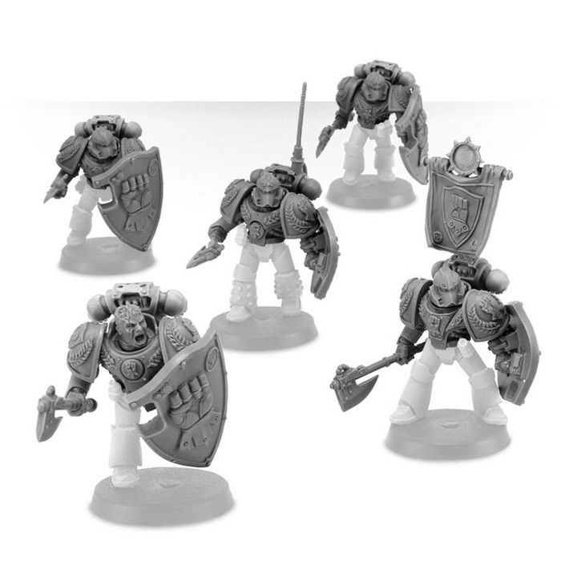

# 0390 山阵卫队 Phalanx Warder

精校状态：中文行文已逐段精校，部分术语仍为暂定

分类：通用概念 / 帝国 Imperium / 中央政务部 Adeptus Terra / 阿斯塔特修会 Adeptus Astartes

原文来源：https://www.bilibili.com/opus/1031035804586082344

原作者：帝国神选罐头

原文时间：2025年02月07日 10:25

[返回分类目录](目录.md) · [全书目录](../../目录.md)

<!-- A0390-B0001 -->
**英文原文**

Phalanx Warders were specialized Imperial Fists fast attack infantry during the Great Crusade and Horus Heresy.

<!-- /A0390-B0001 -->

<!-- A0390-B0002 -->

原译文

山阵卫队是大远征和荷鲁斯叛乱时期专业的帝国之拳快速攻击步兵。

**校订译文**

山阵卫队是大远征与荷鲁斯之乱时期帝国之拳的一支专职快速攻击步兵部队。

<!-- /A0390-B0002 -->

<!-- A0390-B0003 -->
## Overview 概述

<!-- /A0390-B0003 -->

<!-- A0390-B0004 -->
**英文原文**

Selected from the ranks of the Imperial Fists' Breacher Squads, the Phalanx Warders were a reinforced company assigned to the defence of the Imperial Fists warship Phalanx. Armed with a variety of close range weaponry and guarded by formidable Boarding Shields, they formed great phalanx walls of ceramite against enemy boarders. They were renowned for their particularly stark training regime, eschewing any duty save training, the protection of the Phalanx, or the prosecution of war on the enemies of Mankind.

<!-- /A0390-B0004 -->

<!-- A0390-B0005 -->

原译文

山阵卫队是从帝国之拳破坏者小队中挑选出来的，是一个加强连队，负责防御帝国之拳战舰山阵号。他们配备了各种近距离武器，并由难对付的跳帮盾守卫，形成了巨大的陶钢方阵墙壁来对抗敌人的跳帮者。他们以其特别严厉的训练制度而闻名，回避除培训外的任何职责、保护山阵号或对人类之敌发动战争。

**校订译文**

山阵卫队从帝国之拳的攻坚小队中选拔成员，组成负责保卫山阵号的加强连。他们装备各种近距离武器，以坚固的跳帮盾筑成宏大的陶钢盾墙方阵，抵御敌军登舰。卫队的训练格外严苛，职责也仅限于训练、守护山阵号和征讨人类之敌。

<!-- /A0390-B0005 -->

<!-- A0390-B0006 图片 -->

<!-- A0390-B0007 -->

原译文

Phalanx Warders 山阵卫队

**校订译文**

Phalanx Warders 山阵卫队

<!-- /A0390-B0007 -->

<!-- A0390-B0008 -->
**英文原文**

Warder detachments were often seconded to other companies of the Imperial Fists, honing their skills and lending their might to that of their brothers on battlefields across the galaxy. Most often they served on Imperial Fists warships.

<!-- /A0390-B0008 -->

<!-- A0390-B0009 -->

原译文

卫队分遣队经常被借调到帝国之拳的其他连队，磨练他们的技能，并将他们的力量借给他们在银河系战场上的兄弟。他们经常在帝国之拳战舰上服役。

**校订译文**

卫队分遣队常被借调至帝国之拳其他连队，在银河各地的战场上磨炼技艺，与兄弟并肩作战。不过，他们最常见的任务仍是驻守帝国之拳的战舰。

<!-- /A0390-B0009 -->

本篇核心术语与暂定项

以下列出本篇出现的英文原形及核心术语表用词。同形词可能指不同对象，具体词义以本篇正文和校注为准；单复数、别名和仅见于图注的名称可能尚未列入。完整候选见[术语表](../../术语表/双语术语候选.csv)。

| 英文 | 采用中文 | 状态 |
| --- | --- | --- |
| Horus Heresy | 荷鲁斯之乱 | 官方已核对 |
| Imperial Fists | 帝国之拳 | 暂定 |
| Phalanx | 山阵号 | 暂定 |
| Great Crusade | 大远征 | 暂定·官方待核 |
| Horus | 荷鲁斯 | 暂定·官方待核 |
| The Phalanx | 山阵号 | 暂定·官方待核 |

