# 0393 绯红之拳 Crimson Fists

精校状态：中文行文已逐段精校，部分术语仍为暂定

分类：通用概念 / 帝国 Imperium / 中央政务部 Adeptus Terra / 阿斯塔特修会 Adeptus Astartes

原文来源：https://www.bilibili.com/opus/1119452675663986713

原作者：帝国神选罐头

原文时间：编辑于 2025年10月09日 19:39

[返回分类目录](目录.md) · [全书目录](../../目录.md)

<!-- A0393-B0001 -->
**英文原文**

The Crimson Fists are a Space Marine Chapter. They are one of the successor Chapters created during the Second Founding, their progenitors being the Imperial Fists and their Primarch Rogal Dorn.

<!-- /A0393-B0001 -->

<!-- A0393-B0002 -->

原译文

绯红之拳是星际战士的一个战团。他们是二次建军期间创建的子战团之一，他们的创始人是帝国之拳和他们的原体罗格·多恩。

**校订译文**

绯红之拳是二次建军时期成立的星际战士战团，母团为帝国之拳，基因原体为罗格·多恩。

<!-- /A0393-B0002 -->

<!-- A0393-B0003 图片 -->

<!-- A0393-B0004 图片 -->
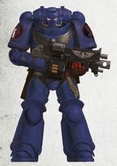

<!-- A0393-B0005 -->
**英文原文**

Founding Chapter:Imperial Fists

<!-- /A0393-B0005 -->

<!-- A0393-B0006 -->

原译文

建军战团：帝国之拳

**校订译文**

母团：帝国之拳。

<!-- /A0393-B0006 -->

<!-- A0393-B0007 -->
**英文原文**

Founding:Second Founding

<!-- /A0393-B0007 -->

<!-- A0393-B0008 -->

原译文

建军：二次建军

**校订译文**

建军：二次建军

<!-- /A0393-B0008 -->

<!-- A0393-B0009 -->
**英文原文**

Descendants:Rechista Fists

<!-- /A0393-B0009 -->

<!-- A0393-B0010 -->

原译文

子战团：真实之拳

**校订译文**

子战团：真实之拳

<!-- /A0393-B0010 -->

<!-- A0393-B0011 -->
**英文原文**

Chapter Master:Pedro Kantor

<!-- /A0393-B0011 -->

<!-- A0393-B0012 -->

原译文

战团长：佩德罗·坎托

**校订译文**

战团长：佩德罗·坎托

<!-- /A0393-B0012 -->

<!-- A0393-B0013 -->
**英文原文**

Homeworld:Rynn's World

<!-- /A0393-B0013 -->

<!-- A0393-B0014 -->

原译文

家园世界：林恩世界

**校订译文**

母星：瑞恩世界。

<!-- /A0393-B0014 -->

<!-- A0393-B0015 -->
**英文原文**

Fortress-Monastery:Arx Tyrannus

<!-- /A0393-B0015 -->

<!-- A0393-B0016 -->

原译文

堡垒修道院：暴君堡

**校订译文**

要塞修道院：暴君堡

<!-- /A0393-B0016 -->

<!-- A0393-B0017 -->
**英文原文**

Colours:Dark blue, crimson red

<!-- /A0393-B0017 -->

<!-- A0393-B0018 -->

原译文

颜色：暗蓝，深红

**校订译文**

颜色：暗蓝，深红

<!-- /A0393-B0018 -->

<!-- A0393-B0019 -->
**英文原文**

Specialty:Anti-Ork Warfare

<!-- /A0393-B0019 -->

<!-- A0393-B0020 -->

原译文

专业：反兽人战争

**校订译文**

专长：对抗欧克。

<!-- /A0393-B0020 -->

<!-- A0393-B0021 -->
**英文原文**

Strength:Less than 500, but recently rebuilding strength

<!-- /A0393-B0021 -->

<!-- A0393-B0022 -->

原译文

力量：少于500，但最近正在重建力量

**校订译文**

兵力：不足500人，近期正恢复编制。

<!-- /A0393-B0022 -->

<!-- A0393-B0023 -->
**英文原文**

Battle Cry:Chaplain: There is only the Emperor;Reply: He is our shield and protector

<!-- /A0393-B0023 -->

<!-- A0393-B0024 -->

原译文

战吼：牧师：唯有帝皇；回复：吾等之盾与保护者

**校订译文**

战吼：教士领呼“唯有帝皇！”众人回应“祂是吾等的盾牌与守护者！”

<!-- /A0393-B0024 -->

<!-- A0393-B0025 -->
## Background 背景

<!-- /A0393-B0025 -->

<!-- A0393-B0026 -->
### History 历史

<!-- /A0393-B0026 -->

<!-- A0393-B0027 -->
**英文原文**

After the Horus Heresy, it was decided (in the Codex Astartes written by the Ultramarines Primarch Roboute Guilliman) that no single man should ever wield the power of a whole legion of Space Marines alone, and that each legion was to be split up into thousand-man strong chapters. Rogal Dorn of the Imperial Fists legion long opposed this, but decided to yield rather than risk the fragile peace of the post-heresy Imperium. The Imperial Fists legion was divided into four chapters: The marines most devoted to their Primarch were to remain Imperial Fists, the most zealous started the never-ending crusade of the Black Templars and the younger and more levelheaded marines formed the Crimson Fists. The first Chapter Master of the Crimson Fists was Alexis Polux, a hero of the Heresy. The chapter's name derives from the ceremony conducted at the initiation of new chapter masters in the Imperial Fist legion. The Chapter Master and the Primarch would both cut their palm and share blood in a warrior handshake; strengthening the marine with the blood of the Primarch and forming a symbolic bond between them.

<!-- /A0393-B0027 -->

<!-- A0393-B0028 -->

原译文

在荷鲁斯叛乱之后，决定（在由极限战士原体罗伯特·基里曼撰写的《阿斯塔特圣典》中）任何人都不应独自拥有整个星际战士军团的力量，每个军团都要被分成千人的战团。帝国之拳军团的罗格·多恩长期反对这一点，但决定屈服，而不是冒着破坏叛乱后帝国脆弱和平的风险。帝国之拳军团分为四个战团：最忠于他们的原体的战士将继续担任帝国之拳，最狂热的人开始了无休止的黑色圣堂远征，而更年轻、更冷静的战士则组成了绯红之拳。绯红之拳的第一任战团长是叛乱的英雄亚历克西斯·泼拉克斯。该战团的名字来源于帝国之拳军团新战团长发起仪式。战团长和原体都会割破手掌，在战士的握手中分享鲜血；用原体的鲜血增强战士，并在它们之间形成象征性的联系。

**校订译文**

荷鲁斯之乱结束后，极限战士原体罗保特·基里曼在《阿斯塔特圣典》中规定，任何人都不应再独掌整个星际战士军团的力量，各军团须拆分为千人战团。帝国之拳原体罗格·多恩长期反对，但为避免破坏战后帝国脆弱的和平，最终接受了这一安排。帝国之拳军团拆成四个战团：最忠于原体的战士保留帝国之拳之名，最狂热者成为黑色圣堂、踏上永不停息的远征，较年轻而冷静者则组成绯红之拳。荷鲁斯之乱的英雄亚历克西斯·泼鲁克斯成为绯红之拳首任战团长。战团之名源自帝国之拳军团新任战团长就职时的一项仪式：战团长与原体各自割破掌心，以战士之握让鲜血交融。原体的血液赋予战士力量，也象征着彼此的纽带。

**校注：** 原文称拆成四个战团，但此段只列三者；不擅补未列的第四个。imperial Fist legion 的 chapter masters 按军团内部战团级编制照译，不强行改为连长。

<!-- /A0393-B0028 -->

<!-- A0393-B0029 图片 -->
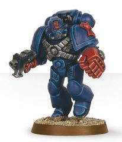

<!-- A0393-B0030 -->
**英文原文**

The Crimson Fists spent their first nine millennia as a space-faring Crusade Chapter, based aboard the fortress-monastery Rutilus Tyrannus, much like the Black Templars. Their first victory was against a large host of Exodite Eldar on Urolak Prime, followed by the cleansing of HR8518; the home system of an alien race known as the Scythians. Their most legendary campaign was the Crusade of Righteous Liberation - the retaking of planets lost after the Age of Apostasy. The largest Crimson Fist operation in more recent times was the Voltigern Crusade in late M40, where several Ork Empires in the Loki Sector were attacked and destabilized, later to collapse in civil war. For this, the Crimson Fists were granted fiefdom over Rynn's World, a prosperous agri-world. The ruins of the Rutilus Tyrannus were moved to Rynn's World and the Fists built their new Fortress-Monastery around it.

<!-- /A0393-B0030 -->

<!-- A0393-B0031 -->

原译文

绯红之拳在最初的9000年里是一支太空远征战团，驻扎在堡垒修道院拟鲤暴君，就像黑色圣堂一样。他们的第一场胜利是在乌罗拉克主星击败了大批蛮荒灵族，随后是对HR8518的清洗；被称为斯基泰人的外星种族的家园星系。他们最具传奇色彩的战役是正义解放远征 — 夺回叛教时代后失去的行星。最近最大的绯红之拳行动是M40晚期的沃尔蒂根远征，洛基星区的几个欧克帝国遭到袭击和破坏，后来在内战中崩溃。为此，绯红之拳被授予了林恩世界的封地，这是一个繁荣的农业世界。拟鲤暴君的废墟被转移到林恩世界，绯红之拳在它周围建造了新的堡垒修道院。

**校订译文**

最初九千年里，绯红之拳与黑色圣堂相似，是游弋星海的远征战团，以赤红暴君号为要塞修道院。他们最早的胜利是在乌罗拉克主星击败一支庞大的蛮荒灵族军队，随后又清洗了斯基泰异形的母星系HR8518。战团最具传奇色彩的战役是正义解放远征，收复了叛教时代后失陷的诸世界。近代规模最大的行动则是M40晚期的沃尔蒂根远征：他们打击洛基星区数个欧克帝国，使其陷入动荡，最终因内战崩溃。战团因功获封繁荣的农业世界瑞恩世界，并将赤红暴君号的残骸运至那里，以其为核心修建新的要塞修道院。

**校注：** Rutilus Tyrannus 是星舰名；原“拟鲤暴君”误取 Rutilus 的生物属名含义，暂译赤红暴君号。Voltigern/Vortigern 在本篇多种拼写和纪年并存，统一中文沃尔蒂根，但不合并事件日期。

<!-- /A0393-B0031 -->

<!-- A0393-B0032 -->
**英文原文**

Their homeworld was invaded by Orks in mid-M41. The Crimson Fists, led by Captain Drakken of the 3rd company had earlier tried to sabotage an Ork Waaagh building on the nearby world Badlanding, but failed. The Orks rallied under Warlord Snagrod — the Arch-arsonist of Charadon — and invaded in response, despite the almost suicidal nature of invading a Space Marine homeworld. The odds shifted in the Orks' favour when the Crimson Fists fortress-monastery was destroyed by a stray missile from its own defence system. Of more than six hundred space marines stationed there, only sixteen (among them Chapter Master Pedro Kantor and Brother-Captain Cortez) escaped the blast. Circumstantial evidence, and coincidences have led some to believe the Officio Assassinorum may have had a hand in the strange destruction of the fortress-monastery, but no concrete evidence has ever come to light.

<!-- /A0393-B0032 -->

<!-- A0393-B0033 -->

原译文

他们的家园世界在M41中期被欧克入侵。由第三连队连长德拉肯领导的绯红之拳早些时候曾试图破坏附近世界糟糕登陆上的欧克Waaagh建筑，但失败了。欧克在查拉顿的头号纵火狂军阀斯纳格罗德的领导下集会，并入侵作为回应，尽管入侵星际战士家园世界几乎是自杀。当绯红之拳堡垒修道院被其自身防御系统的一枚流弹毁灭时，形势向有利于欧克的方向转变。在驻扎在那里的600多名星际战士中，只有16人（其中包括战团长佩德罗·坎特和兄弟连长科尔特斯）逃脱了爆炸。间接证据和巧合使一些人相信刺客庭可能参与了堡垒修道院的奇怪破坏，但没有具体证据。

**校订译文**

M41中期，欧克入侵了战团母星。此前，第三连长德拉肯率绯红之拳前往附近的荒落星，试图破坏当地正集结壮大的欧克 Waaagh!，却未成功。欧克随即在军阀斯纳格罗德——查拉顿头号纵火狂——统率下集结，发兵报复，尽管进攻星际战士母星几乎无异于自杀。绯红之拳要塞修道院随后被自身防御系统中一枚偏离目标的导弹摧毁，战局由此倒向欧克。驻守其中的六百余名星际战士仅有十六人逃过爆炸，包括战团长佩德罗·坎托与科尔特斯连长。一些间接线索与巧合使人怀疑刺客庭曾插手这场离奇灾难，但始终没有确凿证据。

**校注：** 源文称欧克入侵发生于M41中期，后续时间线则标988.M41；保留两处原始纪年，不自行消除差异。 building 修饰 Waaagh!，意为正在聚集壮大，并非建造建筑。Badlanding 为地名，原糟糕登陆误作普通动作，暂译荒落星。Brother-Captain 在此是绯红之拳连长，并非灰骑士完整官方单位。

<!-- /A0393-B0033 -->

<!-- A0393-B0034 图片 -->
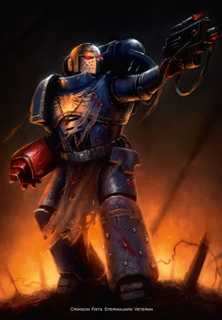

<!-- A0393-B0035 -->

原译文

Crimson Fists Sternguard Veteran 绯红之拳肃卫老兵

**校订译文**

Crimson Fists Sternguard Veteran 绯红之拳肃卫老兵

<!-- /A0393-B0035 -->

<!-- A0393-B0036 -->
**英文原文**

The last two-hundred and eighteen surviving Space Marines on Rynn's World consolidated their defences at the planet's capital, New Rynn City, and managed to stave off the invasion after a furious, 18-month siege behind the city's walls. The siege was broken by a relief force of more than 2200 ships and elements of 6 Space Marine Chapters (amongst them the Ravenwing of the Dark Angels), the Titan Legions, and the Imperial Navy. With no more than a hundred surviving marines the Chapter came close to being disbanded due to irrecoverable battle losses, but have since managed to recover. The chapter is back to half its original strength as of late M41.

<!-- /A0393-B0036 -->

<!-- A0393-B0037 -->

原译文

林恩世界上最后幸存的218名星际战士巩固了他们在行星首都新林恩城的防御，并在城墙后经历了18个月的猛烈围攻后，成功抵御了入侵。由2200多艘舰船和6个星际战士战团（其中包括黑暗天使的鸦翼）、泰坦军团和帝国海军组成的救援部队打破了围困。由于无法挽回的战斗损失，该战团仅剩不到一百名星际战士，濒临解散，但后来设法恢复了。截至M41晚期，该战团的兵力已恢复到原来的一半。

**校订译文**

瑞恩世界最后幸存的218名星际战士退守首府新瑞恩城，加固防御，在城墙后抵御敌军长达十八个月的猛烈围攻。最终，一支拥有逾2,200艘舰船，并由六个星际战士战团的部分兵力、泰坦军团与帝国海军组成的援军解围；其中还包括黑暗天使的鸦翼。战后，战团剩余战士不超过一百人，一度因战损难以补充而面临解散，但此后逐渐恢复。截至M41末期，兵力已恢复至原来的一半。

<!-- /A0393-B0037 -->

<!-- A0393-B0038 图片 -->
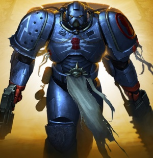

<!-- A0393-B0039 -->

原译文

Crimson Fists marine (Mk.VIII armour) 绯红之拳战士（Mk.VIII盔甲）

**校订译文**

Crimson Fists marine (Mk.VIII armour) 绯红之拳战士（Mk.VIII盔甲）

<!-- /A0393-B0039 -->

<!-- A0393-B0040 -->
**英文原文**

During the Imperial attempts to reclaim the planet of Entymion IV, the Crimson Fists answered a request for reinforcements. During the first assault, the Crimson Fists' commander, Captain Reinez, discovered the presence of the Soul Drinkers on the planet after suffering an attack by Tellos. Additional companies arrived led by Chaplain Inhuaca, but their campaign ended in failure as Entymion IV was lost and the Soul Drinkers successfully accomplished their goals and escaped off world.

<!-- /A0393-B0040 -->

<!-- A0393-B0041 -->

原译文

在帝国试图夺回恩提米翁四号行星期间，绯红之拳回应了增援请求。在第一次袭击中，绯红之拳的指挥官雷尼兹连长在遭受特洛斯的袭击后发现了这个行星上饮魂者的存在。由牧师因瓦卡率领的其他公司也加入了进来，但他们的行动以失败告终，因为恩提米翁四号失败了，灵魂饮酒者成功实现了他们的目标并逃离了世界。

**校订译文**

帝国试图收复恩提米昂四号时，绯红之拳响应了增援请求。首次进攻中，指挥官雷内斯连长遭到泰洛斯袭击，由此发现饮魂者也在这颗行星上。因华卡教士随后率更多连队前来支援，但行动仍以失败告终：恩提米昂四号失陷，饮魂者则达成目标、成功离去。

<!-- /A0393-B0041 -->

<!-- A0393-B0042 图片 -->
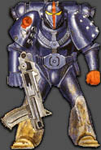

<!-- A0393-B0043 -->

原译文

Crimson Fists marine (Mk.VI armour) 绯红之拳战士（Mk.VI盔甲）

**校订译文**

Crimson Fists marine (Mk.VI armour) 绯红之拳战士（Mk.VI盔甲）

<!-- /A0393-B0043 -->

<!-- A0393-B0044 -->
**英文原文**

With the formation of the Great Rift the Crimson Fists homeworld of Rynn's World was again invaded, this time by Daemons. Ultimately Roboute Guilliman's Indomitus Crusade arrived to break the Daemonic siege. With them came new Primaris Space Marine recruits, allowing the Fists to rebuild their former strength and embark on new campaigns against the enemies of mankind.

<!-- /A0393-B0044 -->

<!-- A0393-B0045 -->

原译文

随着大裂隙的形成，林恩世界的绯红之拳家园世界再次遭到入侵，这次是由恶魔入侵的。最终，罗伯特·基里曼的不屈远征抵达，打破了恶魔的围困。随之而来的是新的原铸星际战士，让绯红之拳重建了以前的力量，并开始了对抗人类之敌的新战役。

**校订译文**

大裂隙出现后，绯红之拳母星瑞恩世界再次遭到入侵，这次来犯的是恶魔。罗保特·基里曼的不屈远征最终抵达，击破恶魔围困，并带来一批新原铸星际战士，让绯红之拳得以恢复昔日兵力，再次出征迎战人类之敌。

<!-- /A0393-B0045 -->

<!-- A0393-B0046 -->
### Notables Battles and Campaigns 著名战斗和战役

<!-- /A0393-B0046 -->

<!-- A0393-B0047 -->
**英文原文**

The War of the Beast — 544-546.M32. During the war, Chapter Master Quesadra died and was replaced by Cuarrion. During the conflict, the Crimson Fists contributed a portion of their strength to rebuild the Imperial Fists.

<!-- /A0393-B0047 -->

<!-- A0393-B0048 -->

原译文

野兽战争 — 544-546.M32。在战争期间，战团长奎萨德拉牺牲，由夸里翁接替。在冲突期间，绯红之拳贡献了一部分力量来重建帝国之拳。

**校订译文**

野兽战争 — 544-546.M32。在战争期间，战团长奎萨德拉牺牲，由夸里翁接替。在冲突期间，绯红之拳贡献了一部分力量来重建帝国之拳。

<!-- /A0393-B0048 -->

<!-- A0393-B0049 -->
**英文原文**

Defending Thule during the Eldar Thule Intervention — 978.M39

<!-- /A0393-B0049 -->

<!-- A0393-B0050 -->

原译文

在灵族图勒干预期间保卫图勒

**校订译文**

978.M39：灵族干预图勒期间，保卫图勒。

<!-- /A0393-B0050 -->

<!-- A0393-B0051 -->
**英文原文**

Assault on the Stormbeast (M41) — Terminators of the Crimson Fists teleported onto the Stormbeast's command bridge and, despite taking heavy casualties, succeeded in slaughtering its renegade crew.

<!-- /A0393-B0051 -->

<!-- A0393-B0052 -->

原译文

对风暴野兽号的袭击（M41）— 绯红之拳终结者传送到风暴野兽号的指挥桥上，尽管伤亡惨重，但成功地屠杀了叛变的船员。

**校订译文**

M41：突袭风暴野兽号。绯红之拳终结者传送至舰桥，虽伤亡惨重，仍成功歼灭叛变舰员。

<!-- /A0393-B0052 -->

<!-- A0393-B0053 -->
**英文原文**

The Zeist Campaign. (M41) — The Crimson Fists heeded the call of Lord Macragge, and provided tactical squads to fight for the liberation of Augura (a staging point for the Tau forces).

<!-- /A0393-B0053 -->

<!-- A0393-B0054 -->

原译文

泽斯特战役（M41）— 绯红之拳听从了马库拉格领主的号召，提供战术小队为解放奥古拉（钛部队的集结地）而战。

**校订译文**

泽斯特战役（M41）— 绯红之拳听从了马库拉格领主的号召，提供战术小队为解放奥古拉（钛部队的集结地）而战。

<!-- /A0393-B0054 -->

<!-- A0393-B0055 -->

原译文

Vortigern Crusade - 745.M41 沃蒂根远征

**校订译文**

Vortigern Crusade - 745.M41 沃尔蒂根远征

**校注：** 本篇先后将相近拼写的远征列于M40晚期、745.M41与M42；仅统一沃尔蒂根译名，不将不同记录擅并或改年。

<!-- /A0393-B0055 -->

<!-- A0393-B0056 -->
**英文原文**

Achilus Crusade — 777.M41 — The Crimson Fist contributed a demi-company to a series of operations on Khazant in the Cellebos warzone. They achieved some victories before being recalled by their Chapter to combat the Orks of Charadon. Thy lost the Dreadnought and its pilot, Ancient Castores, who was once Captain of the Chapter’s First Company. Although the Chapter’s forces now fight elsewhere, those Crimson Fists assigned to serve in the Deathwatch in Jericho Reach maintain a watch for their fallen hero, hoping that one day his sarcophagus may be returned to Rynn’s World.

<!-- /A0393-B0056 -->

<!-- A0393-B0057 -->

原译文

阿基里斯远征 - 777.M41 - 绯红之拳为赛勒伯斯战区的卡赞特的一系列行动提供了一个半连队。他们取得了一些胜利，然后被他们的战团召回与查拉顿的欧克作战。失去了无畏和它的驾驶者，卡斯托尔长者，他曾经是战团第一连队的连长。尽管战团的部队现在在其他地方作战，但那些被派往杰里科河段死亡守望的深红之拳仍在守望他们逝去的英雄，希望有一天他的石棺能被送回林恩世界。

**校订译文**

777.M41：阿基里斯远征。绯红之拳投入半个连的兵力，参加赛勒伯斯战区卡赞特的一系列行动。部队取得一些胜利后，受召返回战团，对抗查拉顿的欧克。他们在此期间失去了无畏机甲及其中的战士卡斯托尔长者；他曾任战团第一连长。虽然战团主力已转往别处，在杰里科疆域死亡守望中服役的绯红之拳仍不断寻找这位失踪英雄，希望有朝一日能将他的石棺送回瑞恩世界。

**校注：** a demi-company 指半个连，非一个半连。castores lost 不证明阵亡，后文仍盼寻回石棺，保留失踪状态。

<!-- /A0393-B0057 -->

<!-- A0393-B0058 -->

原译文

Battle of the Steel Cross — 853.M41 钢十字之战

**校订译文**

Battle of the Steel Cross — 853.M41 钢十字之战

<!-- /A0393-B0058 -->

<!-- A0393-B0059 -->

原译文

Battle of Hellabore — 867.M41 赫拉博之战

**校订译文**

Battle of Hellabore — 867.M41 赫拉博之战

<!-- /A0393-B0059 -->

<!-- A0393-B0060 -->
**英文原文**

The defeat of the Chaos Lord Sathash the Golden — 934.M41

<!-- /A0393-B0060 -->

<!-- A0393-B0061 -->

原译文

击败混沌领主黄金萨沙什的失败

**校订译文**

934.M41：击败混沌领主“黄金”萨沙什。

**校注：** The defeat of the Chaos Lord 表示领主被击败，原译重复“失败”并使施受关系混乱。

<!-- /A0393-B0061 -->

<!-- A0393-B0062 -->
**英文原文**

Battle for Rynn's World — 988.M41 - The Crimson Fists homeworld is lost to Ork forces.

<!-- /A0393-B0062 -->

<!-- A0393-B0063 -->

原译文

林恩世界之战 — 988.M41 — 绯红之拳的家园世界陷落给了欧克部队。

**校订译文**

988.M41：瑞恩世界之战，绯红之拳母星落入欧克之手。

<!-- /A0393-B0063 -->

<!-- A0393-B0064 -->

原译文

Rynn's World Reclamation — after 988.M41 林恩世界收回

**校订译文**

Rynn's World Reclamation — after 988.M41 瑞恩世界收复战——988.M41之后

<!-- /A0393-B0064 -->

<!-- A0393-B0065 -->
**英文原文**

13th Black Crusade - 999.M41 - The Crimson Fists send 1 Company

<!-- /A0393-B0065 -->

<!-- A0393-B0066 -->

原译文

第13次黑色远征 - 999.M41 - 绯红之拳派遣1个连队

**校订译文**

第13次黑色远征 - 999.M41 - 绯红之拳派遣1个连队

<!-- /A0393-B0066 -->

<!-- A0393-B0067 -->
**英文原文**

Indomitus Crusade — ???.M42. Rynn's World is besieged by Daemonic armies, forcing the Crimson Fists to defend their homeworld once more. Guilliman's Indomitus Crusade and newly arrived Primaris Space Marines bearing the markings of the Crimson Fists arrive at Rynn's World and break the siege. The Fists on Rynn's World marvel at the new Space Marines and see them as closer to the ideal of Rogal Dorn.

<!-- /A0393-B0067 -->

<!-- A0393-B0068 -->

原译文

不屈远征 — ???.M42.林恩世界被恶魔军队围困，迫使绯红之拳再次保卫他们的家园世界。基里曼的不屈远征和新抵达的带有绯红之拳标志的原铸星际战士抵达林恩世界，打破了围困。林恩世界上的绯红之拳惊叹于新的星际战士，并认为他们更接近罗格·多恩的理想。

**校订译文**

???.M42：不屈远征。恶魔大军围困瑞恩世界，绯红之拳被迫再次保卫母星。基里曼的不屈远征与一批佩戴绯红之拳纹章的新原铸星际战士赶到，打破围困。瑞恩世界上的战士为这些新人惊叹，认为他们更加接近罗格·多恩心中的理想。

<!-- /A0393-B0068 -->

<!-- A0393-B0069 -->

原译文

Voltigern Crusade — ???.M42 沃尔蒂根远征

**校订译文**

Voltigern Crusade — ???.M42 沃尔蒂根远征

<!-- /A0393-B0069 -->

<!-- A0393-B0070 -->
**英文原文**

War of Beasts - ???.M42 - 5 Companies

<!-- /A0393-B0070 -->

<!-- A0393-B0071 -->

原译文

野兽战争 - ???.M42 - 5个连队

**校订译文**

???.M42：野兽之战，投入五个连。

<!-- /A0393-B0071 -->

<!-- A0393-B0072 -->
**英文原文**

A Crusade of Vengeance against the Ork race in retribution for the Invasion of Rynn's World. Strengthened by a great influx of Primaris Space Marines, several greenskin Waaagh!s are diverted by their Warbosses in hopes of a better fight.

<!-- /A0393-B0072 -->

<!-- A0393-B0073 -->

原译文

为报复入侵林恩世界，对欧克种族进行的复仇远征。由于原铸星际战士的大量涌入，几个绿皮Waaagh！被他们的战争头目转移希望更好的战斗。

**校订译文**

为报复欧克入侵瑞恩世界，绯红之拳向整个欧克种族发起复仇远征。大量原铸星际战士加入，使战团实力大增；几位欧克战争头目为寻找更痛快的战斗，将各自的 Waaagh! 转向绯红之拳。

<!-- /A0393-B0073 -->

<!-- A0393-B0074 -->
**英文原文**

Battle for Geo-Station Erpes — with the Orks

<!-- /A0393-B0074 -->

<!-- A0393-B0075 -->

原译文

厄佩斯地理站之战 — 与兽人

**校订译文**

厄佩斯地理站之战——对抗欧克。

<!-- /A0393-B0075 -->

<!-- A0393-B0076 -->
**英文原文**

In one of battles with Orks Crimson Fists used an entire formation of Land Raider Redeemers to destroy the Ork Mektown of Khurkhuk.

<!-- /A0393-B0076 -->

<!-- A0393-B0077 -->

原译文

在绯红之拳与欧克的一场战斗中，他们使用了一整个编队的兰德掠袭者救赎者来摧毁库尔库克的欧克技师镇。

**校订译文**

在一次对抗欧克的战斗中，绯红之拳投入整支救赎者型兰德掠袭者战车编队，摧毁库尔库克的欧克技师镇。

<!-- /A0393-B0077 -->

<!-- A0393-B0078 -->

原译文

Declates Crusade 德克莱茨远征

**校订译文**

Declates Crusade 德克莱茨远征

<!-- /A0393-B0078 -->

<!-- A0393-B0079 -->
**英文原文**

Battle on Temportus — Crimson Fists Chapter eliminated Ork Freebooters from the planet.

<!-- /A0393-B0079 -->

<!-- A0393-B0080 -->

原译文

坦珀图斯之战 - 绯红之拳战团从行星上消灭了欧克战争掠夺者。

**校订译文**

坦珀图斯之战——绯红之拳战团清除了行星上的欧克流寇。

<!-- /A0393-B0080 -->

<!-- A0393-B0081 -->
**英文原文**

The Crimson Fists destroyed the chapter of the Marines Vigilant. This chapter, described by Pedro Kantor as "troubled", had suddenly and without explanation refused to even fight against Xenos. The Marines Vigilant did not defend themselves when the Crimson Fists attacked them on orders from the Adeptus Terra. Though they did so reluctantly, Pedro Kantor himself considers the destruction of the Marines Vigilant "the most distasteful act" in the Chapter’s history.

<!-- /A0393-B0081 -->

<!-- A0393-B0082 -->

原译文

绯红之拳摧毁了警戒战士。这一战团被佩德罗·坎托描述为“混乱”，突然且毫无解释地拒绝与异型作战。当绯红之拳按照中央政务部的命令袭击他们时，警戒战士没有防卫。尽管他们不情愿地这样做，但佩德罗·坎托本人认为，摧毁警戒战士是该战团历史上“最令人厌恶的行为”。

**校订译文**

绯红之拳曾奉命消灭警戒战士战团。佩德罗·坎托称这个战团“出了问题”：他们突然无端拒绝作战，甚至连异形也不愿迎战。绯红之拳奉中央政务部命令进攻时，警戒战士没有反抗。绯红之拳虽极不情愿，仍执行了命令；坎托本人将此视为战团历史上“最令人厌恶的行为”。

<!-- /A0393-B0082 -->

<!-- A0393-B0083 -->

原译文

The Nachmund Rift War 纳克蒙德走廊战争

**校订译文**

The Nachmund Rift War 纳克蒙德走廊战争

<!-- /A0393-B0083 -->

<!-- A0393-B0084 -->
## Chapter Disposition 战团布置

<!-- /A0393-B0084 -->

<!-- A0393-B0085 -->
**英文原文**

The Crimson Fists embrace the Codex Astartes readily, and are probably the most traditional among the sons of Rogal Dorn, and receive training of all aspects of combat as written by Roboute Guilliman. There are a few minor deviances; such as the first company being known as the Crusade Company, a tradition started after the Crusade of Righteous Liberation left the Crimson Fists with no more than 128 survivors. The 1st company has been kept at 128 marines since, with the master of the Crusade Company always being the Chapter Master as well. It is considered a bad omen to march to battle with less than a full veteran company.

<!-- /A0393-B0085 -->

<!-- A0393-B0086 -->

原译文

绯红之拳很容易接受了阿斯塔特圣典，可能是罗格·多恩的子嗣中最传统的，并接受罗伯特·基里曼所写的战斗各个方面的训练。有一些小偏差；例如，第一连队被称为远征连队，这是一个在正义解放远征使绯红之拳只剩下128名幸存者后开始的传统。自那以后，第一连队一直有128名战士，远征连队之主也一直是战团长。与一个经验不足的老兵连队并肩作战被认为是一个不祥之兆。

**校订译文**

绯红之拳欣然接受《阿斯塔特圣典》，或许是多恩子嗣中最为恪守传统的一支，训练也涵盖基里曼规定的各项作战技能。他们只有少数编制例外，例如第一连被称为“远征连”。正义解放远征结束时，战团仅余128名幸存者，此后第一连便固定为128人，由战团长兼任远征连统帅。他们认为，让人数不足满编的老兵连出征是不祥之兆。

**校注：** less than a full veteran company 指人数不足满编，不是缺乏经验的老兵连。第一连统帅兼任战团长的旧述，与后列M42的独立连长保留作版本差异。

<!-- /A0393-B0086 -->

<!-- A0393-B0087 图片 -->
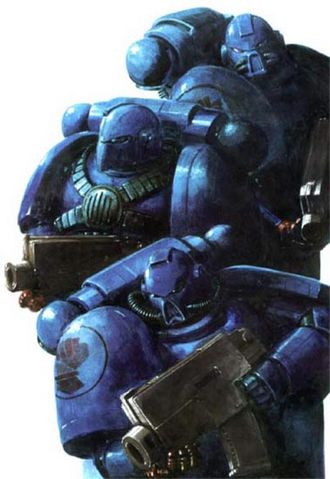

<!-- A0393-B0088 -->

原译文

Crimson Fists 绯红之拳

**校订译文**

Crimson Fists 绯红之拳

<!-- /A0393-B0088 -->

<!-- A0393-B0089 -->
**英文原文**

The Crimson Fists have always had close ties with the Imperium and the Inquisition. They have contributed many warriors to the kill-teams of the Ordo Xenos, being renowned Ork fighters. They have also, at the order of Terra and the Inquisition, destroyed two chapters of brother Space Marines; the insane Sons of Gideon and the mind-wiped Marines Vigilant. This has earned them a reputation as lap dogs of the Inquisition among certain chapters

<!-- /A0393-B0089 -->

<!-- A0393-B0090 -->

原译文

绯红之拳一直与帝国和审判庭有着密切的联系。他们为攘外修会的杀戮小队贡献了许多战士，是著名的对欧克战士。他们还按照泰拉和审判庭的命令，摧毁了星际战士兄弟的两个战团；疯狂的吉迪恩之子和思维清除的警戒战士。这为他们赢得了在某些战团中被称为审判庭的狗的声誉

**校订译文**

绯红之拳与帝国和审判庭始终关系紧密。作为著名的欧克克星，他们为异形审判庭的杀戮小队输送了大量战士。战团还曾奉泰拉与审判庭之命，消灭两个同为星际战士的战团：陷入疯狂的吉迪恩之子，以及心智遭到抹除的警戒战士。因此，某些战团将绯红之拳视作审判庭的走狗。

<!-- /A0393-B0090 -->

<!-- A0393-B0091 -->
**英文原文**

The Chapter's main colour is deep blue with white or silver details. When an initiate joins the ranks of the Chapter his left glove is painted red; when he becomes a member of the Crusade company his right glove is also painted red. Scouts are often portrayed with red gloves but blue hand guards. Their Chapter symbol is almost an exact copy of that of the Imperial Fists but uses different colours, namely dark blue and crimson red.

<!-- /A0393-B0091 -->

<!-- A0393-B0092 -->

原译文

该战团的主色调是深蓝色，带有白色或银色的细节。当一名新成员加入战团时，他的左手套被漆成红色；当他成为远征连队的一员时，他的右手套也被漆成红色。侦察兵经常被描绘成戴着红色手套，但戴着蓝色护手。他们的战团标志几乎是帝国之拳的精确复制，但使用了不同的颜色，即深蓝色和深红。

**校订译文**

战团以深蓝为主色，细部采用白色或银色。新成员正式入列时，将左手套涂红；加入远征连后，右手套也改为红色。侦察兵常被描绘为红色手套配蓝色手背护甲。战团徽记的图案几乎与帝国之拳相同，只是改用深蓝与绯红配色。

<!-- /A0393-B0092 -->

<!-- A0393-B0093 -->
### Current organization 当前组织

<!-- /A0393-B0093 -->

<!-- A0393-B0094 -->
**英文原文**

As of the beginning of the Indomitus Crusade M42:

<!-- /A0393-B0094 -->

<!-- A0393-B0095 -->

原译文

在不屈远征M42开始时：

**校订译文**

M42不屈远征开始时的编制如下：

<!-- /A0393-B0095 -->

<!-- A0393-B0096 -->
### Headquarters 总部

<!-- /A0393-B0096 -->

<!-- A0393-B0097 -->
### Chapter Command 战团指挥

<!-- /A0393-B0097 -->

<!-- A0393-B0098 图片 -->
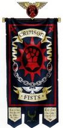

<!-- A0393-B0099 -->

原译文

Pedro Kantor, Chapter Master 佩德罗·坎托，战团长

**校订译文**

Pedro Kantor, Chapter Master 佩德罗·坎托，战团长

<!-- /A0393-B0099 -->

<!-- A0393-B0100 -->

原译文

Honour Guard 荣誉卫队

**校订译文**

Honour Guard 荣誉卫队

<!-- /A0393-B0100 -->

<!-- A0393-B0101 -->

原译文

Chapter Serfs 战团侍从

**校订译文**

Chapter Serfs 战团侍从

<!-- /A0393-B0101 -->

<!-- A0393-B0102 -->

原译文

Servitors 机仆

**校订译文**

Servitors 机仆

<!-- /A0393-B0102 -->

<!-- A0393-B0103 -->
### Armoury 军械库

原题：Armoury军械库

<!-- /A0393-B0103 -->

<!-- A0393-B0104 图片 -->

<!-- A0393-B0105 -->
**英文原文**

Jainas Ruzco, Master of the Forge

<!-- /A0393-B0105 -->

<!-- A0393-B0106 -->

原译文

杰纳斯·鲁兹科，铸造大师

**校订译文**

杰纳斯·鲁兹科，铸造大师

<!-- /A0393-B0106 -->

<!-- A0393-B0107 -->

原译文

Techmarines 技术军士

**校订译文**

Techmarines 科技战士

<!-- /A0393-B0107 -->

<!-- A0393-B0108 -->

原译文

Servitors 机仆

**校订译文**

Servitors 机仆

<!-- /A0393-B0108 -->

<!-- A0393-B0109 -->

原译文

Tanks 坦克

**校订译文**

Tanks 坦克

<!-- /A0393-B0109 -->

<!-- A0393-B0110 -->

原译文

Transports 运输车

**校订译文**

Transports 运输车

<!-- /A0393-B0110 -->

<!-- A0393-B0111 -->

原译文

Bikes 摩托

**校订译文**

Bikes 摩托

<!-- /A0393-B0111 -->

<!-- A0393-B0112 -->

原译文

Land Raiders 兰德掠袭者

**校订译文**

Land Raiders 兰德掠袭者战车

<!-- /A0393-B0112 -->

<!-- A0393-B0113 -->

原译文

Gunships 炮艇

**校订译文**

Gunships 炮艇

<!-- /A0393-B0113 -->

<!-- A0393-B0114 -->

原译文

Thunderfire Cannons 雷火炮

**校订译文**

Thunderfire Cannons 雷火炮

<!-- /A0393-B0114 -->

<!-- A0393-B0115 -->
### Apothecarion 药剂部

<!-- /A0393-B0115 -->

<!-- A0393-B0116 图片 -->

<!-- A0393-B0117 -->
**英文原文**

Celurian Varendus, Chief Apothecary

<!-- /A0393-B0117 -->

<!-- A0393-B0118 -->

原译文

塞卢里安·瓦伦达斯，首席药剂师

**校订译文**

塞卢里安·瓦伦达斯，首席药剂师

<!-- /A0393-B0118 -->

<!-- A0393-B0119 -->

原译文

Apothecaries 药剂师

**校订译文**

Apothecaries 药剂师

<!-- /A0393-B0119 -->

<!-- A0393-B0120 -->
### Fleet Command 舰队指挥

<!-- /A0393-B0120 -->

<!-- A0393-B0121 -->
### Master of the Fleet 舰队大师

原题：Master of the Fleet 舰队之主

<!-- /A0393-B0121 -->

<!-- A0393-B0122 -->

原译文

Battle Barges 战斗驳船

**校订译文**

Battle Barges 战斗驳船

<!-- /A0393-B0122 -->

<!-- A0393-B0123 -->

原译文

Strike Cruisers 打击巡洋舰

**校订译文**

Strike Cruisers 打击巡洋舰

<!-- /A0393-B0123 -->

<!-- A0393-B0124 -->

原译文

Rapid Strike Vessels 快速打击战舰

**校订译文**

Rapid Strike Vessels 快速打击战舰

<!-- /A0393-B0124 -->

<!-- A0393-B0125 -->

原译文

Thunderhawks 雷鹰

**校订译文**

Thunderhawks 雷鹰

<!-- /A0393-B0125 -->

<!-- A0393-B0126 -->
### Librarius 智库

原题：Librarius 智库馆

<!-- /A0393-B0126 -->

<!-- A0393-B0127 图片 -->
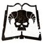

<!-- A0393-B0128 -->
**英文原文**

Delevan Deguerro, Chief Librarian

<!-- /A0393-B0128 -->

<!-- A0393-B0129 -->

原译文

德莱万·德格罗，首席智库

**校订译文**

德莱万·德格罗，首席智库员。

<!-- /A0393-B0129 -->

<!-- A0393-B0130 -->

原译文

Epistolaries 星语官

**校订译文**

Epistolaries 星语官

<!-- /A0393-B0130 -->

<!-- A0393-B0131 -->

原译文

Codiciers 典记员

**校订译文**

Codiciers 典记员

<!-- /A0393-B0131 -->

<!-- A0393-B0132 -->

原译文

Lexicaniums 编修员

**校订译文**

Lexicaniums 编修员

<!-- /A0393-B0132 -->

<!-- A0393-B0133 -->

原译文

Acolytum 侍僧

**校订译文**

Acolytum 侍僧

<!-- /A0393-B0133 -->

<!-- A0393-B0134 -->
### Chaplaincy 教士团

原题：Chaplaincy 牧师会

<!-- /A0393-B0134 -->

<!-- A0393-B0135 图片 -->
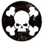

<!-- A0393-B0136 -->
**英文原文**

Hauis Argento, High Chaplain

<!-- /A0393-B0136 -->

<!-- A0393-B0137 -->

原译文

哈伊斯·阿根托，至高牧师

**校订译文**

哈伊斯·阿根托，至高教士。

<!-- /A0393-B0137 -->

<!-- A0393-B0138 -->

原译文

Chaplains 牧师

**校订译文**

Chaplains 教士

<!-- /A0393-B0138 -->

<!-- A0393-B0139 -->
### Companies 连队

<!-- /A0393-B0139 -->

<!-- A0393-B0140 -->
### Crusade Company 远征连队

<!-- /A0393-B0140 -->

<!-- A0393-B0141 -->

原译文

1st Company 第一连队

**校订译文**

1st Company 第一连队

<!-- /A0393-B0141 -->

<!-- A0393-B0142 -->

原译文

"The Crusade Company" “远征连队”

**校订译文**

"The Crusade Company" “远征连队”

<!-- /A0393-B0142 -->

<!-- A0393-B0143 图片 -->

<!-- A0393-B0144 -->
**英文原文**

Captain Ishmael Icario, Master of Crusades

<!-- /A0393-B0144 -->

<!-- A0393-B0145 -->

原译文

连长伊斯梅尔·伊卡里奥，远征之主

**校订译文**

连长伊斯梅尔·伊卡里奥，远征之主

<!-- /A0393-B0145 -->

<!-- A0393-B0146 -->

原译文

2 Lieutenants 2名副官

**校订译文**

2 Lieutenants 2名副官

<!-- /A0393-B0146 -->

<!-- A0393-B0147 -->

原译文

Company Ancient 连队旗手

**校订译文**

Company Ancient 连队旗手

<!-- /A0393-B0147 -->

<!-- A0393-B0148 -->

原译文

Company Champion 连队冠军

**校订译文**

Company Champion 连队冠军

<!-- /A0393-B0148 -->

<!-- A0393-B0149 -->

原译文

Company Veterans 连队老兵

**校订译文**

Company Veterans 连队老兵

<!-- /A0393-B0149 -->

<!-- A0393-B0150 -->

原译文

10 Veteran Squadrons 10个老兵中队

**校订译文**

10 Veteran Squadrons 10个老兵中队

<!-- /A0393-B0150 -->

<!-- A0393-B0151 -->

原译文

Dreadnoughts 无畏

**校订译文**

Dreadnoughts 无畏机甲

<!-- /A0393-B0151 -->

<!-- A0393-B0152 -->

原译文

Transport Vehicles 运输载具

**校订译文**

Transport Vehicles 运输载具

<!-- /A0393-B0152 -->

<!-- A0393-B0153 -->

原译文

Land Raiders 兰德掠袭者

**校订译文**

Land Raiders 兰德掠袭者战车

<!-- /A0393-B0153 -->

<!-- A0393-B0154 -->
### Battle Companies 战斗连队

<!-- /A0393-B0154 -->

<!-- A0393-B0155 -->

原译文

2nd Company 第二连队

**校订译文**

2nd Company 第二连队

<!-- /A0393-B0155 -->

<!-- A0393-B0156 -->

原译文

"The Shieldwall" “盾墙”

**校订译文**

"The Shieldwall" “盾墙”

<!-- /A0393-B0156 -->

<!-- A0393-B0157 图片 -->
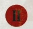

<!-- A0393-B0158 -->
**英文原文**

Captain Steffan Hios, Master of the Shield

<!-- /A0393-B0158 -->

<!-- A0393-B0159 -->

原译文

连长斯特凡·希奥斯，盾牌大师

**校订译文**

连长斯特凡·希奥斯，盾牌大师

<!-- /A0393-B0159 -->

<!-- A0393-B0160 -->

原译文

2 Lieutenants 2名副官

**校订译文**

2 Lieutenants 2名副官

<!-- /A0393-B0160 -->

<!-- A0393-B0161 -->

原译文

Company Ancient 连队旗手

**校订译文**

Company Ancient 连队旗手

<!-- /A0393-B0161 -->

<!-- A0393-B0162 -->

原译文

Company Champion 连队冠军

**校订译文**

Company Champion 连队冠军

<!-- /A0393-B0162 -->

<!-- A0393-B0163 -->

原译文

Company Veterans 连队老兵

**校订译文**

Company Veterans 连队老兵

<!-- /A0393-B0163 -->

<!-- A0393-B0164 -->

原译文

Battleline Squads 战线小队

**校订译文**

Battleline Squads 战线小队

<!-- /A0393-B0164 -->

<!-- A0393-B0165 -->

原译文

Close Support Squads 近战支援小队

**校订译文**

Close Support Squads 近战支援小队

<!-- /A0393-B0165 -->

<!-- A0393-B0166 -->

原译文

Fire Support Squads 火力支援小队

**校订译文**

Fire Support Squads 火力支援小队

<!-- /A0393-B0166 -->

<!-- A0393-B0167 -->

原译文

Dreadnoughts 无畏

**校订译文**

Dreadnoughts 无畏机甲

<!-- /A0393-B0167 -->

<!-- A0393-B0168 -->

原译文

3rd Company 第三连队

**校订译文**

3rd Company 第三连队

<!-- /A0393-B0168 -->

<!-- A0393-B0169 -->

原译文

"The Red Lightning" “红闪电”

**校订译文**

"The Red Lightning" “红闪电”

<!-- /A0393-B0169 -->

<!-- A0393-B0170 图片 -->
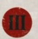

<!-- A0393-B0171 -->
**英文原文**

Captain Faradis Anto, Master of the Line

<!-- /A0393-B0171 -->

<!-- A0393-B0172 -->

原译文

连长法拉迪斯·安托，线列大师

**校订译文**

连长法拉迪斯·安托，线列大师

<!-- /A0393-B0172 -->

<!-- A0393-B0173 -->

原译文

2 Lieutenants 2名副官

**校订译文**

2 Lieutenants 2名副官

<!-- /A0393-B0173 -->

<!-- A0393-B0174 -->

原译文

Company Ancient 连队旗手

**校订译文**

Company Ancient 连队旗手

<!-- /A0393-B0174 -->

<!-- A0393-B0175 -->

原译文

Company Champion 连队冠军

**校订译文**

Company Champion 连队冠军

<!-- /A0393-B0175 -->

<!-- A0393-B0176 -->

原译文

Company Veterans 连队老兵

**校订译文**

Company Veterans 连队老兵

<!-- /A0393-B0176 -->

<!-- A0393-B0177 -->

原译文

Battleline Squads 战线小队

**校订译文**

Battleline Squads 战线小队

<!-- /A0393-B0177 -->

<!-- A0393-B0178 -->

原译文

Close Support Squads 近战支援小队

**校订译文**

Close Support Squads 近战支援小队

<!-- /A0393-B0178 -->

<!-- A0393-B0179 -->

原译文

Fire Support Squads 火力支援小队

**校订译文**

Fire Support Squads 火力支援小队

<!-- /A0393-B0179 -->

<!-- A0393-B0180 -->

原译文

Dreadnoughts 无畏

**校订译文**

Dreadnoughts 无畏机甲

<!-- /A0393-B0180 -->

<!-- A0393-B0181 -->

原译文

4th Company 第四连队

**校订译文**

4th Company 第四连队

<!-- /A0393-B0181 -->

<!-- A0393-B0182 -->

原译文

"The Crimson Lancers" “深红长枪”

**校订译文**

"The Crimson Lancers" “绯红枪骑”

<!-- /A0393-B0182 -->

<!-- A0393-B0183 图片 -->
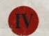

<!-- A0393-B0184 -->
**英文原文**

Captain Isidore Haleous, Master of the Charge

<!-- /A0393-B0184 -->

<!-- A0393-B0185 -->

原译文

连长伊西多尔·哈利俄斯，冲锋大师

**校订译文**

连长伊西多尔·哈利俄斯，冲锋大师

<!-- /A0393-B0185 -->

<!-- A0393-B0186 -->

原译文

2 Lieutenants 2名副官

**校订译文**

2 Lieutenants 2名副官

<!-- /A0393-B0186 -->

<!-- A0393-B0187 -->

原译文

Company Ancient 连队旗手

**校订译文**

Company Ancient 连队旗手

<!-- /A0393-B0187 -->

<!-- A0393-B0188 -->

原译文

Company Champion 连队冠军

**校订译文**

Company Champion 连队冠军

<!-- /A0393-B0188 -->

<!-- A0393-B0189 -->

原译文

Company Veterans 连队老兵

**校订译文**

Company Veterans 连队老兵

<!-- /A0393-B0189 -->

<!-- A0393-B0190 -->

原译文

Battleline Squads 战线小队

**校订译文**

Battleline Squads 战线小队

<!-- /A0393-B0190 -->

<!-- A0393-B0191 -->

原译文

Close Support Squads 近战支援小队

**校订译文**

Close Support Squads 近战支援小队

<!-- /A0393-B0191 -->

<!-- A0393-B0192 -->

原译文

Fire Support Squads 火力支援小队

**校订译文**

Fire Support Squads 火力支援小队

<!-- /A0393-B0192 -->

<!-- A0393-B0193 -->

原译文

Dreadnoughts 无畏

**校订译文**

Dreadnoughts 无畏机甲

<!-- /A0393-B0193 -->

<!-- A0393-B0194 -->

原译文

5th Company 第五连队

**校订译文**

5th Company 第五连队

<!-- /A0393-B0194 -->

<!-- A0393-B0195 -->

原译文

"The War Riders" “战争骑手”

**校订译文**

"The War Riders" “战争骑手”

<!-- /A0393-B0195 -->

<!-- A0393-B0196 图片 -->

<!-- A0393-B0197 -->
**英文原文**

Captain Razal Solano, Master of Steeds

<!-- /A0393-B0197 -->

<!-- A0393-B0198 -->

原译文

连长拉扎尔·索拉诺，坐骑大师

**校订译文**

连长拉扎尔·索拉诺，坐骑大师

<!-- /A0393-B0198 -->

<!-- A0393-B0199 -->

原译文

2 Lieutenants 2名副官

**校订译文**

2 Lieutenants 2名副官

<!-- /A0393-B0199 -->

<!-- A0393-B0200 -->

原译文

Company Ancient 连队旗手

**校订译文**

Company Ancient 连队旗手

<!-- /A0393-B0200 -->

<!-- A0393-B0201 -->

原译文

Company Champion 连队冠军

**校订译文**

Company Champion 连队冠军

<!-- /A0393-B0201 -->

<!-- A0393-B0202 -->

原译文

Company Veterans 连队老兵

**校订译文**

Company Veterans 连队老兵

<!-- /A0393-B0202 -->

<!-- A0393-B0203 -->

原译文

Battleline Squads 战线小队

**校订译文**

Battleline Squads 战线小队

<!-- /A0393-B0203 -->

<!-- A0393-B0204 -->

原译文

Close Support Squads 近战支援小队

**校订译文**

Close Support Squads 近战支援小队

<!-- /A0393-B0204 -->

<!-- A0393-B0205 -->

原译文

Fire Support Squads 火力支援小队

**校订译文**

Fire Support Squads 火力支援小队

<!-- /A0393-B0205 -->

<!-- A0393-B0206 -->

原译文

Dreadnoughts 无畏

**校订译文**

Dreadnoughts 无畏机甲

<!-- /A0393-B0206 -->

<!-- A0393-B0207 -->
### Reserve Companies 预备连队

<!-- /A0393-B0207 -->

<!-- A0393-B0208 -->

原译文

6th Company 第六连队

**校订译文**

6th Company 第六连队

<!-- /A0393-B0208 -->

<!-- A0393-B0209 -->

原译文

"The Iron Guardians" “钢铁守护者”

**校订译文**

"The Iron Guardians" “钢铁守护者”

<!-- /A0393-B0209 -->

<!-- A0393-B0210 图片 -->

<!-- A0393-B0211 -->
**英文原文**

Captain Alejandros Solari, Master of the Watch

<!-- /A0393-B0211 -->

<!-- A0393-B0212 -->

原译文

连长亚历杭德罗斯·索拉里，守望大师

**校订译文**

连长亚历杭德罗斯·索拉里，守望堡主

<!-- /A0393-B0212 -->

<!-- A0393-B0213 -->

原译文

2 Lieutenants 2名副官

**校订译文**

2 Lieutenants 2名副官

<!-- /A0393-B0213 -->

<!-- A0393-B0214 -->

原译文

Company Ancient 连队旗手

**校订译文**

Company Ancient 连队旗手

<!-- /A0393-B0214 -->

<!-- A0393-B0215 -->

原译文

Company Champion 连队冠军

**校订译文**

Company Champion 连队冠军

<!-- /A0393-B0215 -->

<!-- A0393-B0216 -->

原译文

Company Veterans 连队老兵

**校订译文**

Company Veterans 连队老兵

<!-- /A0393-B0216 -->

<!-- A0393-B0217 -->

原译文

Battleline Squads 战线小队

**校订译文**

Battleline Squads 战线小队

<!-- /A0393-B0217 -->

<!-- A0393-B0218 -->

原译文

Dreadnoughts 无畏

**校订译文**

Dreadnoughts 无畏机甲

<!-- /A0393-B0218 -->

<!-- A0393-B0219 -->

原译文

7th Company 第七连队

**校订译文**

7th Company 第七连队

<!-- /A0393-B0219 -->

<!-- A0393-B0220 -->

原译文

"The Wardens of Rynn" “林恩看守者”

**校订译文**

"The Wardens of Rynn" “瑞恩看守者”

<!-- /A0393-B0220 -->

<!-- A0393-B0221 图片 -->

<!-- A0393-B0222 -->
**英文原文**

Captain Castian Alzonas, Master of the Gates

<!-- /A0393-B0222 -->

<!-- A0393-B0223 -->

原译文

连长卡斯蒂亚·阿尔佐纳斯，门户大师

**校订译文**

连长卡斯蒂亚·阿尔佐纳斯，门户大师

<!-- /A0393-B0223 -->

<!-- A0393-B0224 -->

原译文

2 Lieutenants 2名副官

**校订译文**

2 Lieutenants 2名副官

<!-- /A0393-B0224 -->

<!-- A0393-B0225 -->

原译文

Company Ancient 连队旗手

**校订译文**

Company Ancient 连队旗手

<!-- /A0393-B0225 -->

<!-- A0393-B0226 -->

原译文

Company Champion 连队冠军

**校订译文**

Company Champion 连队冠军

<!-- /A0393-B0226 -->

<!-- A0393-B0227 -->

原译文

Company Veterans 连队老兵

**校订译文**

Company Veterans 连队老兵

<!-- /A0393-B0227 -->

<!-- A0393-B0228 -->

原译文

Battleline Squads 战线小队

**校订译文**

Battleline Squads 战线小队

<!-- /A0393-B0228 -->

<!-- A0393-B0229 -->

原译文

Dreadnoughts 无畏

**校订译文**

Dreadnoughts 无畏机甲

<!-- /A0393-B0229 -->

<!-- A0393-B0230 -->

原译文

8th Company 第八连队

**校订译文**

8th Company 第八连队

<!-- /A0393-B0230 -->

<!-- A0393-B0231 -->

原译文

"The Red Path" “红路”

**校订译文**

"The Red Path" “红路”

<!-- /A0393-B0231 -->

<!-- A0393-B0232 图片 -->
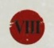

<!-- A0393-B0233 -->
**英文原文**

Captain Gerarde Garrosso, Master of Blades

<!-- /A0393-B0233 -->

<!-- A0393-B0234 -->

原译文

连长杰拉尔德·加洛索，剑刃大师

**校订译文**

连长杰拉尔德·加洛索，剑刃大师

<!-- /A0393-B0234 -->

<!-- A0393-B0235 -->

原译文

2 Lieutenants 2名副官

**校订译文**

2 Lieutenants 2名副官

<!-- /A0393-B0235 -->

<!-- A0393-B0236 -->

原译文

Company Ancient 连队旗手

**校订译文**

Company Ancient 连队旗手

<!-- /A0393-B0236 -->

<!-- A0393-B0237 -->

原译文

Company Champion 连队冠军

**校订译文**

Company Champion 连队冠军

<!-- /A0393-B0237 -->

<!-- A0393-B0238 -->

原译文

Company Veterans 连队老兵

**校订译文**

Company Veterans 连队老兵

<!-- /A0393-B0238 -->

<!-- A0393-B0239 -->

原译文

Close Support Squads 近战支援小队

**校订译文**

Close Support Squads 近战支援小队

<!-- /A0393-B0239 -->

<!-- A0393-B0240 -->

原译文

Dreadnoughts 无畏

**校订译文**

Dreadnoughts 无畏机甲

<!-- /A0393-B0240 -->

<!-- A0393-B0241 -->

原译文

9th Company 第九连队

**校订译文**

9th Company 第九连队

<!-- /A0393-B0241 -->

<!-- A0393-B0242 -->

原译文

"The Fists of Rynn" “林恩之拳”

**校订译文**

"The Fists of Rynn" “瑞恩之拳”

<!-- /A0393-B0242 -->

<!-- A0393-B0243 图片 -->

<!-- A0393-B0244 -->
**英文原文**

Captain Raphael Acastus, Master of Siege

<!-- /A0393-B0244 -->

<!-- A0393-B0245 -->

原译文

连长拉斐尔·阿卡斯图斯，攻城大师

**校订译文**

连长拉斐尔·阿卡斯图斯，攻城大师

<!-- /A0393-B0245 -->

<!-- A0393-B0246 -->

原译文

2 Lieutenants 2名副官

**校订译文**

2 Lieutenants 2名副官

<!-- /A0393-B0246 -->

<!-- A0393-B0247 -->

原译文

Company Ancient 连队旗手

**校订译文**

Company Ancient 连队旗手

<!-- /A0393-B0247 -->

<!-- A0393-B0248 -->

原译文

Company Champion 连队冠军

**校订译文**

Company Champion 连队冠军

<!-- /A0393-B0248 -->

<!-- A0393-B0249 -->

原译文

Company Veterans 连队老兵

**校订译文**

Company Veterans 连队老兵

<!-- /A0393-B0249 -->

<!-- A0393-B0250 -->

原译文

Fire Support Squads 火力支援小队

**校订译文**

Fire Support Squads 火力支援小队

<!-- /A0393-B0250 -->

<!-- A0393-B0251 -->

原译文

Dreadnoughts 无畏

**校订译文**

Dreadnoughts 无畏机甲

<!-- /A0393-B0251 -->

<!-- A0393-B0252 -->
### Scout Company 侦察连队

<!-- /A0393-B0252 -->

<!-- A0393-B0253 -->

原译文

10th Company 第十连队

**校订译文**

10th Company 第十连队

<!-- /A0393-B0253 -->

<!-- A0393-B0254 -->

原译文

"The Wayfinders" “寻路者”

**校订译文**

"The Wayfinders" “寻路者”

<!-- /A0393-B0254 -->

<!-- A0393-B0255 图片 -->

<!-- A0393-B0256 -->
**英文原文**

Captain Caldimus Ortiz, Master of Shadows

<!-- /A0393-B0256 -->

<!-- A0393-B0257 -->

原译文

连长卡尔迪默斯·奥尔蒂斯，暗影大师

**校订译文**

连长卡尔迪默斯·奥尔蒂斯，暗影大师

<!-- /A0393-B0257 -->

<!-- A0393-B0258 -->

原译文

2 Lieutenants 2名副官

**校订译文**

2 Lieutenants 2名副官

<!-- /A0393-B0258 -->

<!-- A0393-B0259 -->

原译文

Company Ancient 连队旗手

**校订译文**

Company Ancient 连队旗手

<!-- /A0393-B0259 -->

<!-- A0393-B0260 -->

原译文

Company Champion 连队冠军

**校订译文**

Company Champion 连队冠军

<!-- /A0393-B0260 -->

<!-- A0393-B0261 -->

原译文

Company Veterans 连队老兵

**校订译文**

Company Veterans 连队老兵

<!-- /A0393-B0261 -->

<!-- A0393-B0262 -->

原译文

Vanguard Squads 先锋小队

**校订译文**

Vanguard Squads 先锋小队

<!-- /A0393-B0262 -->

<!-- A0393-B0263 -->

原译文

Scout Squads 侦察兵小队

**校订译文**

Scout Squads 侦察兵小队

<!-- /A0393-B0263 -->

<!-- A0393-B0264 -->

原译文

Scout Bikes 侦察摩托

**校订译文**

Scout Bikes 侦察摩托

<!-- /A0393-B0264 -->

<!-- A0393-B0265 -->
## Homeworld & Recruitment 母星与征兵

原题：Homeworld & Recruitment 家园世界&招募

<!-- /A0393-B0265 -->

<!-- A0393-B0266 -->
**英文原文**

Though the Crimson Fists are a based on Rynn's World, they usually recruit from the nearby Feral World of Blackwater. They have also found Rynn's World unsuitable for training, and thus use the Loki Sector for such activities. Rynn's World largely occupies a ceremonial and aspirational role.

<!-- /A0393-B0266 -->

<!-- A0393-B0267 -->

原译文

虽然绯红之拳是基于林恩世界，但他们通常从附近的黑水蛮荒世界招募。他们还发现林恩世界不适合训练，因此使用洛基星区进行此类活动。林恩世界在很大程度上扮演着仪式和激励人心的角色。

**校订译文**

绯红之拳以瑞恩世界为基地，但通常从邻近的蛮荒世界黑水征兵。他们认为瑞恩世界不适合训练，因而在洛基星区其他地方开展训练。瑞恩世界对战团而言主要具有仪式意义，也是精神寄托。

<!-- /A0393-B0267 -->

<!-- A0393-B0268 -->
## Chapter Assets 战团资产

<!-- /A0393-B0268 -->

<!-- A0393-B0269 -->
### Armoury 军械库

<!-- /A0393-B0269 -->

<!-- A0393-B0270 -->
### Relics 圣物

<!-- /A0393-B0270 -->

<!-- A0393-B0271 -->
**英文原文**

Dorn's Arrow - Storm bolter - Wielded by Pedro Kantor

<!-- /A0393-B0271 -->

<!-- A0393-B0272 -->

原译文

多恩之箭 - 风暴爆矢枪 - 佩德罗·坎托挥舞

**校订译文**

多恩之箭——佩德罗·坎托使用的风暴爆矢枪。

<!-- /A0393-B0272 -->

<!-- A0393-B0273 -->
**英文原文**

Duty's Burden - Bolt Rifle

<!-- /A0393-B0273 -->

<!-- A0393-B0274 -->

原译文

职责之担 - 爆矢步枪

**校订译文**

职责之担 - 爆矢步枪

<!-- /A0393-B0274 -->

<!-- A0393-B0275 -->
**英文原文**

Sceptre of the Sacred Blood - Holy symbol - Was lost during the Invasion of Rynn's World, presumebly destroyed

<!-- /A0393-B0275 -->

<!-- A0393-B0276 -->

原译文

神圣之血权杖 — 神圣的象征 — 在入侵林恩世界期间丢失，据推测已被摧毁

**校订译文**

神圣之血权杖 — 神圣的象征 — 在入侵瑞恩世界期间丢失，据推测已被摧毁

<!-- /A0393-B0276 -->

<!-- A0393-B0277 -->
**英文原文**

Fist of Vengeance - Power Fist - Mastercrafted power fist recovered from the ruins of the Fortress-Monestary on Rynn's World.

<!-- /A0393-B0277 -->

<!-- A0393-B0278 -->

原译文

复仇之拳 - 动力拳 - 从林恩世界的堡垒修道院废墟中回收的大师级动力拳。

**校订译文**

复仇之拳 - 动力拳 - 从瑞恩世界的要塞修道院废墟中回收的大师级动力拳。

<!-- /A0393-B0278 -->

<!-- A0393-B0279 -->
**英文原文**

Night's Edge - Power Sword

<!-- /A0393-B0279 -->

<!-- A0393-B0280 -->

原译文

午夜之刃 - 动力剑

**校订译文**

午夜之刃 - 动力剑

<!-- /A0393-B0280 -->

<!-- A0393-B0281 -->
**英文原文**

Vengeful Arbiter - Bolt Pistol

<!-- /A0393-B0281 -->

<!-- A0393-B0282 -->

原译文

复仇仲裁者 - 爆矢手枪

**校订译文**

复仇仲裁者 - 爆矢手枪

<!-- /A0393-B0282 -->

<!-- A0393-B0283 -->
### Fleet 舰队

<!-- /A0393-B0283 -->

<!-- A0393-B0284 -->
**英文原文**

The Crimson Fists fleet was largely destroyed during the fall of Rynn's World. However recently Chapter Master Pedro Kantor made a diplomatic request for warships to Battlefleet Tempestus, at their Ramilies Star Fort Goliath Vigilant. An agreement was then made, which saw the Battlefleet make several squadrons of escorts, a trio of cruisers and the Emperor Class Battleship Throne's Fury available to the Chapter, in return for a permanent garrison of Crimson Fists aboard the Goliath Vigilant. Since then Battlegroup Vengeance has borne out Kantor's strategic genius in their every action, from the Kielden Reach to the second cleansing of Badlanding.

<!-- /A0393-B0284 -->

<!-- A0393-B0285 -->

原译文

绯红之拳舰队在林恩世界沦陷期间基本被摧毁。然而，最近，战团长佩德罗·坎托在拉米雷斯星堡歌利亚警戒号向坦佩斯图斯舰队提出了派遣战舰的外交请求。然后达成了一项协议，该协议使舰队向该战团提供了几个护航中队、三艘巡洋舰和帝皇级战列舰王座之怒号，以换取歌利亚警戒号上的绯红之拳永久驻军。从那时起，复仇战斗群在他们的每一个行动中都证明了坎托的战略天才，从基尔登河段到糟糕登陆的第二次清洗。

**校订译文**

瑞恩世界陷落时，绯红之拳舰队大部被毁。近期，战团长佩德罗·坎托前往坦佩斯图斯战斗舰队的拉米雷斯级星堡歌利亚警戒号，通过交涉寻求舰船支援。双方达成协议：战斗舰队向战团提供数支护航舰中队、三艘巡洋舰，以及帝皇级战列舰王座之怒号；作为交换，绯红之拳在歌利亚警戒号长期驻军。此后，从基尔登疆域的战事到荒落星第二次清洗，复仇战斗群的一次次行动，都印证了坎托卓越的战略才能。

**校注：** Kielden Reach 在星际地理语境为基尔登疆域，不是河段。舰船来自帝国海军的临时/协议支援，未据此改写常规阿斯塔特舰队限制。

<!-- /A0393-B0285 -->

<!-- A0393-B0286 图片 -->
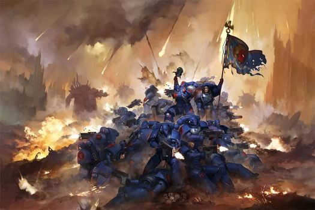

<!-- A0393-B0287 -->

原译文

Crimson Fists battle Orks 绯红之拳与欧克战斗

**校订译文**

Crimson Fists battle Orks 绯红之拳与欧克战斗

<!-- /A0393-B0287 -->

<!-- A0393-B0288 -->
### Vessels 战舰

<!-- /A0393-B0288 -->

<!-- A0393-B0289 -->
**英文原文**

Throne's Fury — Emperor Class Battleship and flagship of Battlegroup Vengeance.

<!-- /A0393-B0289 -->

<!-- A0393-B0290 -->

原译文

王座之怒 — 帝皇级战列舰和复仇战斗群的旗舰

**校订译文**

王座之怒号——帝皇级战列舰，复仇战斗群旗舰。

<!-- /A0393-B0290 -->

<!-- A0393-B0291 -->
**英文原文**

Intractable — Strike Cruiser.

<!-- /A0393-B0291 -->

<!-- A0393-B0292 -->

原译文

难解号 — 打击巡洋舰

**校订译文**

难解号 — 打击巡洋舰

<!-- /A0393-B0292 -->

<!-- A0393-B0293 -->
### Notable Crimson Fists 著名绯红之拳

<!-- /A0393-B0293 -->

<!-- A0393-B0294 -->
**英文原文**

Chapter Master Alexis Polux – 1st Chapter Master (dec.)

<!-- /A0393-B0294 -->

<!-- A0393-B0295 -->

原译文

战团长亚历克西斯·泼拉克斯 — 第一任战团长

**校订译文**

亚历克西斯·泼鲁克斯——首任战团长，已故。

<!-- /A0393-B0295 -->

<!-- A0393-B0296 -->
**英文原文**

Chapter Master Quesadra – Chapter Master in mid-M32 (dec)

<!-- /A0393-B0296 -->

<!-- A0393-B0297 -->

原译文

战团长奎萨德拉 — M32中期的战团长

**校订译文**

奎萨德拉——M32中期的战团长，已故。

<!-- /A0393-B0297 -->

<!-- A0393-B0298 -->
**英文原文**

Chapter Master Algernon Traegus — 16th Chapter Master (dec.)

<!-- /A0393-B0298 -->

<!-- A0393-B0299 -->

原译文

战团长阿尔杰农·特雷格斯 — 第16任战团长

**校订译文**

阿尔杰农·特雷格斯——第十六任战团长，已故。

<!-- /A0393-B0299 -->

<!-- A0393-B0300 -->
**英文原文**

Chapter Master Klede Sargo — 17th Chapter Master (dec.)

<!-- /A0393-B0300 -->

<!-- A0393-B0301 -->

原译文

战团长克莱德·萨戈 — 第17任战团长

**校订译文**

克莱德·萨戈——第十七任战团长，已故。

<!-- /A0393-B0301 -->

<!-- A0393-B0302 -->
**英文原文**

Chapter Master Pedro Kantor — Lord Hellblade, current Crimson Fists Chapter Master (M41), Captain of Crusade Company, 29th Chapter Master

<!-- /A0393-B0302 -->

<!-- A0393-B0303 -->

原译文

战团长佩德罗坎托 — 狱刃领主，现任绯红之拳战团长，远征连队的连长，第29任战团长

**校订译文**

佩德罗·坎托——“狱刃领主”，M41时任绯红之拳战团长，兼任远征连连长，为第二十九任战团长。

<!-- /A0393-B0303 -->

<!-- A0393-B0304 -->
**英文原文**

Master of the Forge Jainas Ruzco

<!-- /A0393-B0304 -->

<!-- A0393-B0305 -->

原译文

铸造大师杰纳斯·鲁兹科

**校订译文**

铸造大师杰纳斯·鲁兹科

<!-- /A0393-B0305 -->

<!-- A0393-B0306 -->
**英文原文**

Chief Librarian Delevan Deguerro

<!-- /A0393-B0306 -->

<!-- A0393-B0307 -->

原译文

首席智库德莱万·德格罗

**校订译文**

首席智库员德莱万·德格罗。

<!-- /A0393-B0307 -->

<!-- A0393-B0308 -->
**英文原文**

Chief Apothecary Celurian Varendus

<!-- /A0393-B0308 -->

<!-- A0393-B0309 -->

原译文

首席药剂师塞卢里安·瓦伦达斯

**校订译文**

首席药剂师塞卢里安·瓦伦达斯

<!-- /A0393-B0309 -->

<!-- A0393-B0310 -->
**英文原文**

Master of Sanctity Hauis Argento

<!-- /A0393-B0310 -->

<!-- A0393-B0311 -->

原译文

圣洁导师哈伊斯·阿根托

**校订译文**

圣洁导师哈伊斯·阿根托

<!-- /A0393-B0311 -->

<!-- A0393-B0312 -->
**英文原文**

Captain Drigo Alvez — Former Captain of the 2nd, Master of the Shield, Captain in charge of defence of New Rynn City, overwhelmed and killed by Orks (dec.)

<!-- /A0393-B0312 -->

<!-- A0393-B0313 -->

原译文

连长德里戈·阿尔维斯 — 前第二连长，盾牌大师，负责新林恩城防御的连长，被欧克击溃并杀死

**校订译文**

连长德里戈·阿尔维斯 — 前第二连长，盾牌大师，负责新瑞恩城防御的连长，被欧克击溃并杀死

<!-- /A0393-B0313 -->

<!-- A0393-B0314 -->
**英文原文**

Captain Steffan Hios - Current Captain of the 2nd.

<!-- /A0393-B0314 -->

<!-- A0393-B0315 -->

原译文

连长斯特凡·希奥斯 - 现任第二连长

**校订译文**

连长斯特凡·希奥斯 - 现任第二连长

<!-- /A0393-B0315 -->

<!-- A0393-B0316 -->
**英文原文**

Captain Ashor Drakken — Former Captain of the 3rd, Master of the Line, killed in the assault on Krugerport (dec.)

<!-- /A0393-B0316 -->

<!-- A0393-B0317 -->

原译文

连长阿索尔·德拉肯 — 前第三连长，线列大师，在袭击克鲁格港时牺牲

**校订译文**

连长阿索尔·德拉肯 — 前第三连长，线列大师，在袭击克鲁格港时牺牲

<!-- /A0393-B0317 -->

<!-- A0393-B0318 -->
**英文原文**

Captain Faradis Anto - Current Captain of the 3rd

<!-- /A0393-B0318 -->

<!-- A0393-B0319 -->

原译文

连长法拉迪斯·安托 - 现任第三连长

**校订译文**

连长法拉迪斯·安托 - 现任第三连长

<!-- /A0393-B0319 -->

<!-- A0393-B0320 -->
**英文原文**

Captain Alessio Cortez — Former Master of the Charge, Nigh-invulnerable Captain of the 4th Company

<!-- /A0393-B0320 -->

<!-- A0393-B0321 -->

原译文

连长阿莱西奥·科尔特斯 — 前冲锋大师，近乎不败的第四连队连长

**校订译文**

阿莱西奥·科尔特斯连长——曾任冲锋大师，几乎无人能伤的第四连长。

**校注：** nigh-invulnerable 表示几乎无法伤害，并非战绩从不败。

<!-- /A0393-B0321 -->

<!-- A0393-B0322 -->
**英文原文**

Captain Isidore Haleous - Current Captain of the 4th

<!-- /A0393-B0322 -->

<!-- A0393-B0323 -->

原译文

连长伊西多尔·哈利俄斯 - 现任第四连长

**校订译文**

连长伊西多尔·哈利俄斯 - 现任第四连长

<!-- /A0393-B0323 -->

<!-- A0393-B0324 -->
**英文原文**

Captain Selig Torres — Captain of the 5th

<!-- /A0393-B0324 -->

<!-- A0393-B0325 -->

原译文

塞利格·托雷斯 — 第五连长

**校订译文**

塞利格·托雷斯 — 第五连长

<!-- /A0393-B0325 -->

<!-- A0393-B0326 -->
**英文原文**

Captain Ruis Tracinto — Former Captain of the 5th. Killed on Cadia by Baranox during the Thirteenth Black Crusade.

<!-- /A0393-B0326 -->

<!-- A0393-B0327 -->

原译文

连长鲁伊斯·特拉辛托 — 前第五连长。在第十三次黑色远征期间被巴拉诺克斯在卡迪亚杀死。

**校订译文**

连长鲁伊斯·特拉辛托 — 前第五连长。在第十三次黑色远征期间被巴拉诺克斯在卡迪亚杀死。

<!-- /A0393-B0327 -->

<!-- A0393-B0328 -->
**英文原文**

Captain Razal Solano - Current Captain of the 5th.

<!-- /A0393-B0328 -->

<!-- A0393-B0329 -->

原译文

连长拉扎尔·索拉诺 - 现第五连长

**校订译文**

连长拉扎尔·索拉诺 - 现第五连长

<!-- /A0393-B0329 -->

<!-- A0393-B0330 -->
**英文原文**

Captain Olbyn Kadena — Former Captain of the 6th, Master of the Watch

<!-- /A0393-B0330 -->

<!-- A0393-B0331 -->

原译文

连长奥比恩·卡德纳 — 前第六连长，守望大师

**校订译文**

连长奥比恩·卡德纳 — 前第六连长，守望堡主

<!-- /A0393-B0331 -->

<!-- A0393-B0332 -->
**英文原文**

Captain Alejandros Solari - Current Captain of the 6th.

<!-- /A0393-B0332 -->

<!-- A0393-B0333 -->

原译文

连长亚历杭德罗斯·索拉里 - 现第六连长

**校订译文**

连长亚历杭德罗斯·索拉里 - 现第六连长

<!-- /A0393-B0333 -->

<!-- A0393-B0334 -->
**英文原文**

Captain Caldimus Ortiz — Former Captain of the 7th, Master of the Gates (.dec)

<!-- /A0393-B0334 -->

<!-- A0393-B0335 -->

原译文

连长卡尔迪莫斯·奥尔蒂斯 — 前第七连长，门户大师

**校订译文**

卡尔迪默斯·奥尔蒂斯连长——前第七连长、门户大师，已故。

**校注：** 同名人物在前文M42编制表为第十连长，此处却为已故前第七连长；源文矛盾保留，不能擅自删除死亡标记或判定另一人。

<!-- /A0393-B0335 -->

<!-- A0393-B0336 -->
**英文原文**

Captain Castian Alzonas - Current Captain of the 7th

<!-- /A0393-B0336 -->

<!-- A0393-B0337 -->

原译文

连长卡斯蒂亚·阿尔佐纳斯 - 现第七连长

**校订译文**

连长卡斯蒂亚·阿尔佐纳斯 - 现第七连长

<!-- /A0393-B0337 -->

<!-- A0393-B0338 -->
**英文原文**

Captain Matteo Morrelis — Former Captain of the 8th, Master of Blades

<!-- /A0393-B0338 -->

<!-- A0393-B0339 -->

原译文

连长马泰奥·莫雷利斯 — 前第八连长，剑刃大师

**校订译文**

连长马泰奥·莫雷利斯 — 前第八连长，剑刃大师

<!-- /A0393-B0339 -->

<!-- A0393-B0340 -->
**英文原文**

Captain Gerarde Garrosso - Current Captain of the 8th

<!-- /A0393-B0340 -->

<!-- A0393-B0341 -->

原译文

连长杰拉尔德·加洛索 - 现第八连长

**校订译文**

连长杰拉尔德·加洛索 - 现第八连长

<!-- /A0393-B0341 -->

<!-- A0393-B0342 -->
**英文原文**

Captain Raphael Acastus — Captain of the 9th, Master of Siege

<!-- /A0393-B0342 -->

<!-- A0393-B0343 -->

原译文

连长拉斐尔·阿卡斯图斯 — 第九连长，攻城大师

**校订译文**

连长拉斐尔·阿卡斯图斯 — 第九连长，攻城大师

<!-- /A0393-B0343 -->

<!-- A0393-B0344 -->
**英文原文**

Captain Ishmael Icario — Captain of the 10th, Master of Shadows

<!-- /A0393-B0344 -->

<!-- A0393-B0345 -->

原译文

连长伊斯梅尔·伊卡里奥 — 第十连长，暗影大师

**校订译文**

连长伊斯梅尔·伊卡里奥 — 第十连长，暗影大师

**校注：** 伊斯梅尔·伊卡里奥在前文M42编制表为第一连长，此处为第十连长，保留不同记录。

<!-- /A0393-B0345 -->

<!-- A0393-B0346 -->

原译文

Captain Jhermandes 连长杰赫曼德斯

**校订译文**

Captain Jhermandes 连长杰赫曼德斯

<!-- /A0393-B0346 -->

<!-- A0393-B0347 -->

原译文

Captain Julias 连长朱利亚斯

**校订译文**

Captain Julias 连长朱利亚斯

<!-- /A0393-B0347 -->

<!-- A0393-B0348 -->

原译文

Captain Telamon 连长忒拉蒙

**校订译文**

Captain Telamon 连长忒拉蒙

<!-- /A0393-B0348 -->

<!-- A0393-B0349 -->

原译文

Captain Gauvian 连长伽维安

**校订译文**

Captain Gauvian 连长伽维安

<!-- /A0393-B0349 -->

<!-- A0393-B0350 -->

原译文

Captain Rigellus 连长雷杰卢斯

**校订译文**

Captain Rigellus 连长雷杰卢斯

<!-- /A0393-B0350 -->

<!-- A0393-B0351 -->

原译文

Captain Konrade Karlito 连长康拉德·卡里托

**校订译文**

Captain Konrade Karlito 连长康拉德·卡里托

<!-- /A0393-B0351 -->

<!-- A0393-B0352 -->
**英文原文**

Captain Isidor Montes - Betrayed the Imperium and joined the Red Corsairs

<!-- /A0393-B0352 -->

<!-- A0393-B0353 -->

原译文

连长伊西多尔·蒙特斯 - 背叛帝国，加入红海盗

**校订译文**

连长伊西多尔·蒙特斯 - 背叛帝国，加入红海盗

<!-- /A0393-B0353 -->

<!-- A0393-B0354 -->
**英文原文**

Veteran Sergeant Grevius — Member of a Deathwatch Kill-team and was killed by a Tyranid Lictor on Herodian IV

<!-- /A0393-B0354 -->

<!-- A0393-B0355 -->

原译文

老兵军士格里维斯 — 死亡守望杀戮小队成员，在赫罗提安四号被泰伦利卡特杀死

**校订译文**

格里维斯老兵军士——死亡守望杀戮小队成员，在赫罗提安四号被泰伦刀斧虫杀死。

<!-- /A0393-B0355 -->

<!-- A0393-B0356 -->
**英文原文**

Brother Fuentas - Commanded the Strike Cruiser Intractable and successfully hunted down the rogue Gothic Class Cruiser Scourge of the Faithless under ex-Captain Haxan the Defiler.

<!-- /A0393-B0356 -->

<!-- A0393-B0357 -->

原译文

修士富恩特斯 - 指挥难解号打击巡洋舰，并成功追捕到前连长破坏者哈赞率领的流氓哥特级巡洋舰无信者之灾号。

**校订译文**

富恩特斯兄弟——指挥打击巡洋舰难解号，成功追猎由前连长“亵渎者”哈赞统率的叛变哥特级巡洋舰无信者之灾号。

<!-- /A0393-B0357 -->

<!-- A0393-B0358 -->

原译文

Sergeant Ricario Vicentius 军士里卡里奥·维琴修斯

**校订译文**

Sergeant Ricario Vicentius 军士里卡里奥·维琴修斯

<!-- /A0393-B0358 -->

<!-- A0393-B0359 -->

原译文

Chapter Ancient Endigio Gomarex 战团旗手恩迪吉奥·戈马雷克斯

**校订译文**

Chapter Ancient Endigio Gomarex 战团旗手恩迪吉奥·戈马雷克斯

<!-- /A0393-B0359 -->

<!-- A0393-B0360 -->
**英文原文**

Brother Toma of the Fifth Company, Crimson Fists

<!-- /A0393-B0360 -->

<!-- A0393-B0361 -->

原译文

绯红之拳第五连队修士托马

**校订译文**

绯红之拳第五连的托马兄弟。

<!-- /A0393-B0361 -->

<!-- A0393-B0362 -->
**英文原文**

Forgemaster Javier Adon — Master of the Technicarum (dec.)

<!-- /A0393-B0362 -->

<!-- A0393-B0363 -->

原译文

铸造大师哈维尔·阿顿 — 技术大师

**校订译文**

铸造大师哈维尔·阿顿——技术部主管，已故。

**校注：** Technicarum 为组织/部门名，暂译技术部；原“技术大师”漏失管理对象。

<!-- /A0393-B0363 -->

<!-- A0393-B0364 -->

原译文

High Chaplain Marqol Tomasi (dec.) 至高牧师马尔科·托马西

**校订译文**

High Chaplain Marqol Tomasi (dec.) 至高教士马尔科·托马西（已故）

<!-- /A0393-B0364 -->

<!-- A0393-B0365 -->
**英文原文**

Chief Librarian Eustace Mendoza — Master of the Librarius (dec.)

<!-- /A0393-B0365 -->

<!-- A0393-B0366 -->

原译文

首席智库尤斯塔斯·门多萨 — 智库大师

**校订译文**

首席智库员尤斯塔斯·门多萨——智库主管，已故。

<!-- /A0393-B0366 -->

<!-- A0393-B0367 -->

原译文

Librarian Carrigan Nos 智库卡里根·诺斯

**校订译文**

Librarian Carrigan Nos 智库员卡里根·诺斯

<!-- /A0393-B0367 -->

<!-- A0393-B0368 -->
**英文原文**

Apothecary Esteban de Dominova – Deathwatch Watch Captain

<!-- /A0393-B0368 -->

<!-- A0393-B0369 -->

原译文

药剂师埃斯特班·德·多米诺瓦 — 死亡守望守望连长

**校订译文**

药剂师埃斯特班·德·多米诺瓦 — 死亡守望守望连长

<!-- /A0393-B0369 -->

<!-- A0393-B0370 -->

原译文

Chaplain Sagramor 牧师萨格拉莫

**校订译文**

Chaplain Sagramor 教士萨格拉莫

<!-- /A0393-B0370 -->

<!-- A0393-B0371 -->
**英文原文**

Aldierrez – Deathwatch Member

<!-- /A0393-B0371 -->

<!-- A0393-B0372 -->

原译文

阿尔迪雷斯 — 死亡守望成员

**校订译文**

阿尔迪雷斯 — 死亡守望成员

<!-- /A0393-B0372 -->

<!-- A0393-B0373 -->
**英文原文**

Vondel Omid — was a part of the Kill Team Excis of the Deathwatch. He was killed during the initial investigation of Ghosar Quintus.

<!-- /A0393-B0373 -->

<!-- A0393-B0374 -->

原译文

冯德尔·奥米德 — 是死亡守望杀戮小队的一员。他在戈萨尔五号的初步调查中被杀。

**校订译文**

冯德尔·奥米德——死亡守望埃克西斯杀戮小队成员，在对戈萨尔五号的初步调查中阵亡。

**校注：** 原译漏去 Kill Team Excis 的小队专名，补作埃克西斯杀戮小队，暂定。

<!-- /A0393-B0374 -->

<!-- A0393-B0375 -->

原译文

Dreadnought Agaston 无畏阿加斯顿

**校订译文**

Dreadnought Agaston 无畏机甲阿加斯顿

<!-- /A0393-B0375 -->

<!-- A0393-B0376 -->

原译文

Dreadnought Morven 无畏莫文

**校订译文**

Dreadnought Morven 无畏机甲莫文

<!-- /A0393-B0376 -->

<!-- A0393-B0377 -->

原译文

Ironclad Dreadnought Iocles 铁甲无畏伊奥克勒斯

**校订译文**

Ironclad Dreadnought Iocles 铁甲无畏机甲伊奥克勒斯

<!-- /A0393-B0377 -->

本篇核心术语与暂定项

以下列出本篇出现的英文原形及核心术语表用词。同形词可能指不同对象，具体词义以本篇正文和校注为准；单复数、别名和仅见于图注的名称可能尚未列入。完整候选见[术语表](../../术语表/双语术语候选.csv)。

| 英文 | 采用中文 | 状态 |
| --- | --- | --- |
| Space Marines | 星际战士 | 官方已核对 |
| Black Templars | 黑色圣堂 | 官方已核对 |
| Dark Angels | 黑暗天使 | 官方已核对 |
| Deathwatch | 死亡守望 | 官方已核对 |
| Eldar | 灵族 | 暂定·语境区分 |
| Orks | 欧克蛮人 | 官方已核对 |
| Librarian | 智库员 | 官方已核对 |
| Bolt Pistol | 爆矢手枪 | 官方已核对 |
| Roboute Guilliman | 罗保特·基里曼 | 官方已核对 |
| Ultramarines | 极限战士 | 官方已核对 |
| Horus Heresy | 荷鲁斯之乱 | 官方已核对 |
| Great Rift | 大裂隙 | 官方已核对 |
| Inquisition | 审判庭 | 暂定 |
| Imperium | 帝国 | 暂定·简称 |
| Imperial Navy | 帝国海军 | 暂定 |
| Librarius | 智库（机构）／智库学派（灵能学派） | 语境定译·官方待核 |
| Indomitus | 不屈学派 | 暂定·学派语境 |
| History | 历史 | 编辑用语已统一 |
| Imperial Fists | 帝国之拳 | 暂定 |
| Emperor | 帝皇 | 官方已核对 |
| Primarch | 原体 | 官方已核对 |
| Adeptus Terra | 中央政务部 | 暂定 |
| Officio Assassinorum | 刺客庭 | 暂定·官方待核 |
| Agri-World | 农业世界 | 暂定·官方待核 |
| Age of Apostasy | 叛教时代 | 暂定·官方待核 |
| Goliath | 歌利亚 | 暂定·官方待核 |
| Exodite | 蛮荒灵族 | 暂定·官方待核 |
| The Order | 秩序 | 暂定·官方待核 |
| Terra | 泰拉 | 暂定·官方待核 |
| Horus | 荷鲁斯 | 暂定·官方待核 |
| Indomitus Crusade | 不屈远征 | 暂定·官方待核 |
| War of Beasts | 野兽之战 | 暂定·官方待核 |
| Ordo Xenos | 异形审判庭 | 用户指定 |
| Sector | 星区 | 暂定·官方待核 |
| Protector | 守护者 | 暂定·官方待核 |
| Rynn's World | 瑞恩世界 | 暂定·官方待核 |
| Blackwater | 黑水星 | 暂定·官方待核 |
| Cadia | 卡迪亚 | 暂定·官方待核 |
| Loki | 洛基 | 暂定·官方待核 |
| Ghosar Quintus | 戈萨尔五号 | 暂定·官方待核 |
| Macragge | 马库拉格 | 暂定·官方待核 |
| Titan | 泰坦 | 暂定·官方待核 |
| Land Raider | 兰德掠袭者战车 | 官方已核对 |
| Alexis Polux | 亚历克西斯·泼鲁克斯 | 暂定·官方待核 |
| Chief Librarian | 首席智库员 | 暂定·官方待核 |
| Master | 导师（审判庭职衔）／舰务官（舰员职务） | 语境定译·官方待核 |
| Master of Sanctity | 圣洁导师 | 暂定·官方待核 |
| High Chaplain | 至高教士 | 暂定·官方待核 |
| Master of the Forge | 铸造大师 | 暂定·官方待核 |
| Chief Apothecary | 首席药剂师 | 暂定·官方待核 |
| Master of the Watch | 守望大师 | 暂定·官方待核 |
| Chaplain | 教士 | 官方已核对 |
| Apothecary | 药剂师 | 官方已核对 |
| Ancient | 旗手 | 官方已核对 |
| Second Founding | 二次建军 | 暂定·官方待核 |
| The Crimson Fist | 绯红之拳 | 暂定·官方待核 |
| Founding | 建军 | 暂定·官方待核 |
| Crimson Fists | 绯红之拳 | 暂定·官方待核 |
| Space Marine | 星际战士 | 暂定·官方待核 |
| Chapter | 战团 | 暂定·官方待核 |
| Fortress-monastery | 要塞修道院 | 暂定·官方待核 |
| Chapter Master | 战团长 | 暂定·官方待核 |
| Captain | 连长 | 暂定·官方待核 |
| Veteran | 老兵 | 暂定·官方待核 |
| Terminators | 终结者 | 暂定·官方待核 |
| Sergeant | 军士 | 暂定·官方待核 |
| Brother | 修士 | 暂定·官方待核 |
| Primaris Space Marine | 原铸星际战士 | 暂定·官方待核 |
| Pedro Kantor | 佩德罗·坎托 | 官方已核 |
| Codex Astartes | 阿斯塔特圣典 | 暂定·官方待核 |
| Soul Drinkers | 饮魂者 | 暂定·官方待核 |
| The Black Templars | 黑色圣堂 | 暂定·官方待核 |
| Master of Blades | 刀锋之主 | 暂定·官方待核 |
| Tactical Squads | 战术小队 | 暂定·官方待核 |
| Marines Vigilant | 警戒战士 | 暂定·官方待核 |
| Rechista Fists | 真实之拳 | 暂定·官方待核 |
| Redeemers | 救赎者 | 暂定·官方待核 |
| Sons of Gideon | 吉迪恩之子 | 暂定·官方待核 |
| Emperor Class Battleship | 帝皇级战列舰 | 暂定·官方待核 |
| Strike Cruiser | 打击巡洋舰 | 暂定·官方待核 |
| Veteran Company | 老兵连队 | 暂定·官方待核 |
| Space Marine homeworld | 星际战士母星 | 暂定·官方待核 |
| Brother-Captain | 兄弟会连长（灰骑士）／兄弟连长（通称） | 语境定译·灰骑士职衔官译已核 |
| The Faithless | 无信者 | 暂定·官方待核 |
| Host | 天军 | 暂定·官方待核 |
| Jericho Reach | 杰里科疆域 | 暂定·官方待核 |
| Xenos | 异形 | 暂定·官方待核 |
| Initiate | 正式成员 | 暂定·官方待核 |
| Excis | 埃克西斯 | 暂定·官方待核 |
| Defiler | 污染者 | 官方已核 |
| Raider | 掠袭者飞艇 | 官方已核对 |
| Charadon | 查拉顿 | 暂定·官方待核 |
| Arch-Arsonist | 头号纵火狂 | 暂定·官方待核 |
| Snagrod | 斯纳哥罗德 | 暂定·官方待核 |
| The Beast | 野兽 | 暂定·官方待核 |
| Rutilus Tyrannus | 赤红暴君号 | 暂定·官方待核 |
| Badlanding | 荒落星 | 暂定·官方待核 |
| Arx Tyrannus | 暴君堡 | 暂定·官方待核 |
| Sathash the Golden | 黄金萨沙什 | 暂定·官方待核 |
| Kielden Reach | 基尔登疆域 | 暂定·官方待核 |
| Technicarum | 技术部 | 暂定·官方待核 |
| Kill Team Excis | 埃克西斯杀戮小队 | 暂定·官方待核 |
| Goliath Vigilant | 歌利亚警戒号 | 暂定·官方待核 |
| Intractable | 难解号 | 暂定·官方待核 |
| Caldimus Ortiz | 卡尔迪默斯·奥尔蒂斯 | 暂定·官方待核 |
| Lictor | 刀斧虫（泰伦单位）／侍从官（禁军职衔） | 语境定译·泰伦单位官译已核 |
| Tellos | 泰洛斯 | 暂定·官方待核 |
| Reinez | 雷内斯 | 暂定·官方待核 |
| Inhuaca | 因华卡 | 暂定·官方待核 |
| Entymion IV | 恩提米昂四号 | 暂定·官方待核 |
| Dreadnought | 无畏机甲 | 暂定·官方待核 |
| Vengeance | 复仇号 | 暂定·官方待核 |
| Thule | 图勒 | 暂定·官方待核 |
| Master of Shadows | 暗影之主 | 暂定·官方待核 |
| Watch Captain | 守望连长 | 暂定·官方待核 |
| Alessio Cortez | 阿莱西奥·科尔特斯 | 暂定·官方待核 |
| Esteban de Dominova | 埃斯特万·德·多米诺万 | 暂定·官方待核 |
| Vigilant | 维吉兰特 | 暂定·官方待核 |
| Battlefleet Tempestus | 暴风战斗舰队 | 暂定·官方待核 |
| Lord Hellblade | 狱刃领主 | 暂定·官方待核 |
| Dorn's Arrow | 多恩之箭 | 暂定·官方待核 |
| The Dark | 《黑暗》 | 暂定·官方待核 |
| The Blood | 鲜血 | 暂定·官方待核 |
| Quintus | 昆图斯 | 暂定·官方待核 |
| Quesadra | 奎萨德拉 | 暂定·官方待核 |
| Cuarrion | 夸里翁 | 暂定·官方待核 |
| System | 星系（恒星系统） | 暂定·官方待核 |
| Feral World | 蛮荒世界 | 暂定·官方待核 |
| Mektown | 技师镇 | 暂定·官方待核 |
| Hellblade | 地狱之刃 | 暂定·官方待核 |
| Ruis Tracinto | 鲁伊斯·特拉辛托 | 暂定·官方待核 |
| Omen | 预兆号 | 暂定·官方待核 |
| Bolt | 爆矢 | 暂定·官方待核 |
| Bolter | 爆矢枪 | 暂定·官方待核 |
| Bolt Rifle | 爆矢步枪 | 暂定·官方待核 |
| Storm bolter | 风暴爆矢枪 | 官方已核对 |
| Power fist | 动力拳 | 官方已核对 |
| Titan Legions | 泰坦军团 | 暂定·官方待核 |

