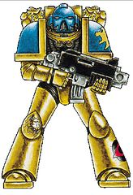
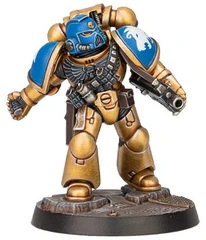

# 0394 天狮 Celestial Lions

精校状态：中文行文已逐段精校，部分术语仍为暂定

分类：通用概念 / 帝国 Imperium / 中央政务部 Adeptus Terra / 阿斯塔特修会 Adeptus Astartes

原文来源：https://www.bilibili.com/opus/1123081240128258068

原作者：帝国神选罐头

原文时间：2025年10月13日 11:28

[返回分类目录](目录.md) · [全书目录](../../目录.md)

<!-- A0394-B0001 -->
**英文原文**

The Celestial Lions are a Space Marine Chapter created in the 38th millennium. They have a long and glorious history. Recently the Chapter has come into conflict with elements of the Inquisition, with terrible consequences.

<!-- /A0394-B0001 -->

<!-- A0394-B0002 -->

原译文

天狮是一个创建于第38个千年的星际战士战团。他们有着悠久而光荣的历史。最近，该战团与审判庭的成员发生了冲突，造成了可怕的后果。

**校订译文**

天狮是成立于M38的星际战士战团，拥有悠久而光荣的历史。近期，他们与审判庭的部分势力发生冲突，并为此付出惨重代价。

<!-- /A0394-B0002 -->

<!-- A0394-B0003 图片 -->

<!-- A0394-B0004 图片 -->

<!-- A0394-B0005 -->
**英文原文**

Founding Chapter:Imperial Fists

<!-- /A0394-B0005 -->

<!-- A0394-B0006 -->

原译文

建军战团：帝国之拳

**校订译文**

母团：帝国之拳。

<!-- /A0394-B0006 -->

<!-- A0394-B0007 -->
**英文原文**

Founding:M38

<!-- /A0394-B0007 -->

<!-- A0394-B0008 -->

原译文

建军：M38

**校订译文**

建军：M38

<!-- /A0394-B0008 -->

<!-- A0394-B0009 -->
**英文原文**

Chapter Master:Currently Unknown, Formerly Ekene Dubaku

<!-- /A0394-B0009 -->

<!-- A0394-B0010 -->

原译文

战团长：目前未知，前为埃肯·杜巴库

**校订译文**

战团长：目前未知，前为埃肯·杜巴库

<!-- /A0394-B0010 -->

<!-- A0394-B0011 -->
**英文原文**

Homeworld:Elysium IX (Destroyed)

<!-- /A0394-B0011 -->

<!-- A0394-B0012 -->

原译文

家园世界：厄琉息斯九号（毁灭）

**校订译文**

家园世界：厄琉息斯九号（毁灭）

<!-- /A0394-B0012 -->

<!-- A0394-B0013 -->
**英文原文**

Fortress-Monastery:Unknown

<!-- /A0394-B0013 -->

<!-- A0394-B0014 -->

原译文

堡垒修道院：未知

**校订译文**

要塞修道院：未知

<!-- /A0394-B0014 -->

<!-- A0394-B0015 -->
**英文原文**

Colours:Gold armour with blue pauldrons and helmet

<!-- /A0394-B0015 -->

<!-- A0394-B0016 -->

原译文

颜色：金色盔甲配蓝色肩甲和头盔

**校订译文**

颜色：金色盔甲配蓝色肩甲和头盔

<!-- /A0394-B0016 -->

<!-- A0394-B0017 -->
**英文原文**

Strength:Less than 96

<!-- /A0394-B0017 -->

<!-- A0394-B0018 -->

原译文

力量：少于96人

**校订译文**

兵力：不足96人。

<!-- /A0394-B0018 -->

<!-- A0394-B0019 -->
## History 历史

<!-- /A0394-B0019 -->

<!-- A0394-B0020 -->
**英文原文**

The Celestial Lions were created in the 38th Millennium from the Gene-Seed of the Imperial Fists. Alongside the Emperor's Spears and Star Scorpions they were one of the three chapters that comprise the Adeptus Vaelarii, who are assigned to guard Elara's Veil.

<!-- /A0394-B0020 -->

<!-- A0394-B0021 -->

原译文

天狮是在第38千年由帝国之拳的基因种子创造的。与帝皇之矛和星蝎并列，是被指派守卫艾拉面纱的瓦埃勒里修会的三个战团之一。

**校订译文**

天狮于M38以帝国之拳的基因种子建立，与帝皇之矛、星蝎共同组成瓦埃勒里修会的三个战团，负责守护艾拉面纱。

**校注：** Adeptus Vaelarii 是本段三个战团组成的守卫体系，沿现稿暂称瓦埃勒里修会；不是审判庭分支，不套用Ordo统一后缀。

<!-- /A0394-B0021 -->

<!-- A0394-B0022 图片 -->

<!-- A0394-B0023 -->

原译文

Notable Events 著名事件

**校订译文**

Notable Events 著名事件

<!-- /A0394-B0023 -->

<!-- A0394-B0024 -->
### Clash with the Inquisition 与审判庭的冲突

<!-- /A0394-B0024 -->

<!-- A0394-B0025 -->
**英文原文**

During the event known as the Khattarn Insurrection, five companies of the Celestial Lions were attached to Inquisitor Apollyon in order to crush the ongoing revolt on the main planet, Khattar. The orbital defences were nothing to the Space Marines and they quickly landed on the planet, with virtually no opposition. As the campaign progressed and the number of prisoners increased, it became evident that this was no mere minor rebellion. Apparently the priesthood of Khattar had been corrupted and had led the leaders of the planet into the arms of Slaanesh. Local renegade Imperial Guard and Planetary Defence Force regiments were quickly defeated and within three months the rebellion was crushed. The detachment of the Celestial Lions boarded into their ships and left for their fortress monastery.

<!-- /A0394-B0025 -->

<!-- A0394-B0026 -->

原译文

在被称为哈塔恩叛乱的事件中，天狮的五个连队附属于审判官亚玻伦，以粉碎主行星哈塔尔上正在进行的叛乱。轨道防御对星际战士来说毫无意义，他们很快就降落在了行星上，几乎没有任何反抗。随着战役的进行和囚犯人数的增加，很明显这不仅仅是一场小规模的叛乱。显然，哈塔尔的牧师已经腐化，并将这个行星的领导人带入了色孽的怀抱。当地叛变的帝国卫队和行星防御部队很快被击败，三个月内叛乱被镇压。天狮的支队登上他们的船，前往他们的堡垒修道院。

**校订译文**

哈塔恩叛乱期间，天狮的五个连配属审判官亚玻伦，负责镇压主行星哈塔尔的叛乱。当地轨道防御无力阻挡星际战士，他们几乎未受抵抗便登陆。随着战役推进、俘虏增多，天狮逐渐发现这并非普通的小规模叛乱：哈塔尔的神职阶层已遭腐化，带着行星统治者投向了色孽。当地叛变的帝国卫队与行星防卫军各团很快败北，叛乱在三个月内被平定。天狮分遣队随即登舰，准备返回要塞修道院。

<!-- /A0394-B0026 -->

<!-- A0394-B0027 -->
**英文原文**

As the ships left orbit, the Imperial Navy, under orders of Inquisitor Apollyon, bombarded the planet, and obliterated the entire population of the planet. This action horrified the Celestial Lions who proceeded to condemn the Inquisitor. Captain Saul had attempted to halt the bombardment, but could not counter-order an Inquisitor. From then on, the Celestial Lions were highly vocal against the Inquisition, believing it had been unnecessary to destroy the planet. They sent a series of very loud and public condemnations against the Inquisition in general. A delegation of senior Chapter officers left for Terra to further their cause, but the ship never arrived. It was blown wildly off course by a freak warp storm, far into Ork territory. The wreckage was eventually found two years later, although this was not enough to deter the Celestial Lions, which kept demanding an investigation into the events surrounding the destruction of Khattar.

<!-- /A0394-B0027 -->

<!-- A0394-B0028 -->

原译文

当飞船离开轨道时，帝国海军在审判官亚玻伦的命令下轰炸了这颗行星，并消灭了这颗行星上的全部人口。这一行为惊吓了天狮，他们开始谴责审判官。索尔连长试图阻止轰炸，但无法违抗审判官的命令。从那时起，天狮就强烈反对审判庭，认为没有必要摧毁行星。他们对审判庭发出了一系列非常响亮和公开的谴责。一个由高级战团军官组成的代表团前往泰拉推进他们的事业，但这艘船从未到达。它被一场反常的亚空间风暴疯狂地吹离了航线，深入了欧克的领地。两年后，残骸最终被发现，尽管这还不足以阻止天狮，天狮一直要求对哈塔尔的毁灭事件进行调查。

**校订译文**

然而，就在他们的舰船离开轨道时，帝国海军奉亚玻伦之命炮击行星，将全体居民灭绝。天狮为之震骇，公开谴责审判官。索尔连长曾试图叫停轰炸，却无权撤销审判官的命令。天狮认为毁灭这颗行星毫无必要，此后不断公开、强烈地谴责整个审判庭。战团还派高级军官组成代表团前往泰拉，争取进一步追究此事，但代表团的船从未抵达：一场反常的亚空间风暴使其严重偏航，深入欧克领地，两年后才发现残骸。即便如此，天狮仍未退缩，持续要求调查哈塔尔遭毁灭的始末。

<!-- /A0394-B0028 -->

<!-- A0394-B0029 -->
**英文原文**

Their efforts, though valiant, were completely in vain. The Inquisition technically answers to no one but itself and the Emperor, intolerant of any outside pressure and criticism.

<!-- /A0394-B0029 -->

<!-- A0394-B0030 -->

原译文

他们的努力虽然英勇，但完全白费了。从严格事实上来讲，审判庭只对自己和帝皇负责，不容任何外界的压力和批评。

**校订译文**

他们的抗争虽勇敢，却毫无结果。按制度而言，审判庭只对自身与帝皇负责，不能容忍外界施压或批评。

<!-- /A0394-B0030 -->

<!-- A0394-B0031 -->
### Third War for Armageddon 第三次阿玛吉多顿战争

<!-- /A0394-B0031 -->

<!-- A0394-B0032 -->
**英文原文**

With the outbreak of the Third War for Armageddon, the entire chapter of the Celestial Lions dispatched was deployed to defend Hive Volcanus. They suffered horrendous casualties within months of arriving. The intelligence they received was horribly inaccurate and often led them into ambushes where they were outnumbered and outgunned. On multiple occasions Thunderhawk deployments to Hive Volcanus were shot down by Imperial anti-air cannons, or by Imperial ships in orbit as Thunderhawks returned from the surface. Entire Chapter ships were lost as orders from High Command and High Marshal Helbrecht were received too late to prevent an ambush, or were completely corrupted to the point of leading Celestial Lion ships directly into Ork held space, seeking resupply from docking stations long since over-run. Ranking officials began to suspect this was intentional, a ploy to wipe out the entire chapter, but nothing could be proven.

<!-- /A0394-B0032 -->

<!-- A0394-B0033 -->

原译文

随着第三次阿玛吉多顿战争的爆发，天狮派出的整个战团都被部署来保卫火山巢都。他们抵达后几个月内就遭受了可怕的伤亡。他们收到的情报非常不准确，经常导致他们陷入伏击，在那里他们寡不敌众，火力不足。雷鹰在火山巢都的部署多次被帝国防空炮击落，或在雷鹰从地表返回时被帝国轨道上的船只击落。由于收到最高指挥部和至高元帅赫尔布雷希特的命令太晚，无法阻止伏击，或者完全被破坏，导致天狮舰船直接进入欧克控制的空域，从早已超负荷的空间站寻求补给，整个战团的舰船都损失了。高级军官开始怀疑这是故意的，这是一种抹去整个战团的策略，但没有任何证据。

**校订译文**

第三次阿玛吉多顿战争爆发后，天狮全团投入火山巢都的防御。抵达仅数月，战团便伤亡惨重。他们得到的情报错漏百出，频繁落入敌众我寡、火力悬殊的伏击。执行火山巢都部署任务的雷鹰多次遭帝国防空炮击落，返回轨道的雷鹰也曾被帝国舰船击毁。最高指挥部与至高元帅赫尔布雷彻的命令不是迟到得来不及帮助他们避开伏击，就是传输内容严重损坏，反而将战团舰船引向欧克控制的空域，让其到早已失陷的停泊站补给，一艘艘舰船因此覆灭。战团高层开始怀疑这是一场蓄意灭绝他们的阴谋，却拿不出证据。

**校注：** over-run 是补给站被敌军攻陷，不是超负荷；lost entire ships 指整艘舰船损失，不等于所有舰船全灭，后文明确尚存三艘。

<!-- /A0394-B0033 -->

<!-- A0394-B0034 -->
**英文原文**

One particularly devastating battle occurred when four entire companies were wiped out in the Mannheim Gap by the combined forces of Warlord Thogfang's Gargant mob and the Razor Speed Freeks. It was thought that Thogfang's Gargants were still under construction and the Celestial Lions hoped to take the orks by complete surprise. Unfortunately not only were the Gargants fully operational, they were waiting for the Celestial Lions, targeting the exact ridge where the Chapter had been ordered to launch their assault from. Undaunted by this apparent betrayal, the Celestial Lions fought bravely and for a time, thought they could win. The orks launched their trap and hundreds of buried tunnels opened behind the Lions position, swarming their rear with thousands upon thousands of orks. The last Captain, Vularakh, was eaten by Thogfang. Losses mounted and ended with a very well-coordinated attack on the Celestial Lions' base camp.

<!-- /A0394-B0034 -->

<!-- A0394-B0035 -->

原译文

一场特别毁灭性的战斗发生在曼海姆峡谷，当时四个连队被军阀蛮牙的加冈特暴徒和剃刀狂飙怪胎的联合部队消灭。人们认为，蛮牙的加冈特仍在建造中，天狮希望完全出乎意料地夺取欧克。不幸的是，加冈特不仅全面投入作战，而且还在等待天狮，他们的目标正是天狮奉命发动进攻的山脊。天狮对这种明显的背叛毫不畏惧，勇敢地战斗了一段时间，以为他们能赢。这些欧克发动了他们的陷阱，数百条埋在天狮阵地后面的隧道打开了，成千上万的欧克涌入了他们的后方。最后一位连长瓦拉克被蛮牙吃掉了。损失越来越大，最终以对天狮大本营的一次非常协调的攻击而告终。

**校订译文**

曼海姆峡谷的一战尤为惨烈。天狮整整四个连遭军阀蛮牙的加冈特集群与剃刀狂飙怪胎联军歼灭。他们原以为蛮牙的加冈特仍在建造，计划打敌人一个措手不及；谁知那些战争巨像早已整装待发，炮口正瞄准天狮奉命发起攻击的山脊。面对这明显的背叛，天狮仍英勇迎战，一度认为胜利在望。随后欧克彻底发动埋伏：天狮阵地后方数百处地下通道同时打开，成千上万的欧克涌入后方。最后一位连长瓦拉克被蛮牙吞食，损失不断扩大，最终欧克又对天狮大本营发起了一次配合严密的进攻。

**校注：** Gargant mob 指加冈特战争巨像集群，非暴徒；take by surprise 指打个措手不及。

<!-- /A0394-B0035 -->

<!-- A0394-B0036 -->
**英文原文**

This particular battle lasted for three hours. Hundreds of Marines fell to the overwhelming Ork forces. Sniper fire rained down from the mountain sides, relentlessly targeting the Apothecaries. It should be noted that the sniper fire was not Ork in origin. Imperial issued longlas laser sniper rifles were used, burning holes straight through the helmet and eye-lenses of Chapter officers. Finally, a small company was able to break through the Ork lines and fight their way back to the Hive. Only ninety-six Marines survived and, to make matters worse, the last Apothecary was shot in the head within hours of arriving at the Hive; he was found slumped against his Rhino transport with a las burn straight through his temple. Their gene-seed lay unharvested on the surface of Armageddon and the remaining brothers swore to die alongside their fallen brothers, fighting to the last.

<!-- /A0394-B0036 -->

<!-- A0394-B0037 -->

原译文

这场特殊的战斗持续了三个小时。数百名战士被压倒性的欧克部队击败。狙击手的火力从山腰倾泻而下，无情地瞄准了药剂师。应该指出的是，狙击手的火力并非源自欧克。使用了帝国发行的长光激光狙击步枪，在战团军官的头盔和目镜上烧了个洞。最后，一个小连队突破了欧克战线，奋力回到了巢都。只有96名战士幸存下来，更糟糕的是，最后一名药剂师在抵达巢都后数小时内头部中弹；他被发现瘫倒在犀牛运输车上，太阳穴被激光烧穿。他们的基因种子未被回收地躺在阿玛吉多顿的地表上，剩下的兄弟发誓要和他们倒下的兄弟一起死去，战斗到最后。

**校订译文**

这场战斗持续三小时。数百名天狮战士倒在数量压倒性的欧克大军面前，山坡上射来的狙击火力则不断猎杀药剂师。值得注意的是，这些狙击射击并非出自欧克：有人使用帝国制式激光长枪，直接烧穿战团军官的头盔与目镜。最终，一支不足满编连队规模的部队杀出包围，退回巢都，仅有96名战士幸存。抵达数小时后，最后一名药剂师也头部中弹身亡，人们发现他瘫靠在犀牛运兵车旁，太阳穴被激光贯穿。阵亡者的基因种子无人收取，留在阿玛吉多顿的战场上；幸存兄弟立誓战至最后，与死去的同袍共赴死亡。

**校注：** 源文明言狙击武器为帝国制式，但本段并未确证幕后指使者，译文保留这一区别。

<!-- /A0394-B0037 -->

<!-- A0394-B0038 -->
**英文原文**

The remaining Marines of the Chapter even swallowed their pride and asked for assistance from other Chapters operating in the Armageddon Warzone. Unfortunately the Flesh Tearers were unable to render assistance and the Black Templars were preparing to depart the system to tail the orks' warleader, Ghazghkull. The Black Templars, however, were aware that something about the Lions' rapid depletion was not right. Reclusiarch Merek Grimaldus discovered a hololithic message from Deathspeaker Julkhara that was both a plea for help and a warning of what had befallen them. High Marshal Helbrecht gave Grimaldus leave to investigate what had happened to the Celestial Lions, but by the time Grimaldus met up with them outside Hive Volcanus, the Lions had already been mauled in the action in the Mannheim Gap.

<!-- /A0394-B0038 -->

<!-- A0394-B0039 -->

原译文

该战团剩下的战士甚至吞下了他们的骄傲，并向在阿玛吉多顿战区作战的其他战团寻求帮助。不幸的是，撕肉者无法提供援助，黑色圣堂正准备离开该星系，追踪欧克的战争领袖碎骨者。然而，黑色圣堂意识到，天狮的快速消耗是不对的。隐修长梅里克·格瑞马度斯发现了来自死亡语者朱卡拉的一条完整立体成像的信息，这既是寻求帮助，也是对他们所遭遇的事情的警告。至高元帅赫尔布雷希特允许格瑞马度斯调查天狮发生了什么事，但当格瑞马度斯在火山巢都外与他们见面时，天狮已经在曼海姆峡谷的行动中受到重创。

**校订译文**

幸存战士甚至放下骄傲，向阿玛吉多顿战区的其他战团求援。可惜撕肉者无力相助，黑色圣堂也正准备离开星系、追击欧克战争领袖碎骨者。即便如此，黑色圣堂已经察觉天狮急剧减员的情况不同寻常。隐修长梅瑞克·格里玛度斯收到死亡语者朱卡拉留下的全息信息，既是求援，也是在警告他们战团遭遇的祸事。至高元帅赫尔布雷彻允许格里玛度斯展开调查；但他在火山巢都外与天狮会合时，战团已在曼海姆峡谷遭到重创。

<!-- /A0394-B0039 -->

<!-- A0394-B0040 -->
**英文原文**

Seeking one last hope of redemption, Pride Leader Ekene Dubaku asked Grimaldus to perform last rights on their Chapter as the survivors would be returning to Mannheim to die alongside their brothers. Grimaldus refused and marshalled the remaining defenders of Hive Helsreach to march alongside the Celestial Lions. Grimaldus believed that if the honour of the Celestial Lions could be salvaged by destroying the orks' base, then the remaining warriors would return to their homeworld and begin rebuilding. The resulting battle was massive with almost all of the remaining Celestial Lions dying. However, Pride Leader Dubaku was able to slay Warboss Thogfang with Grimaldus' help, avenging the loss of his Captain and Chapter. Only then did Grimaldus signal for Black Templar reinforcements and the knights of Dorn fought one last time on Armageddon.

<!-- /A0394-B0040 -->

<!-- A0394-B0041 -->

原译文

为了寻求最后的救赎希望，骄傲领袖埃肯·杜巴库要求格瑞马度斯在他们的战团上行使最后的权利，因为幸存者将返回曼海姆与他们的兄弟一起死去。格瑞马度斯拒绝了，并召集赫尔斯利奇巢都的剩余守军与天狮并肩前进。格瑞马度斯认为，如果能够通过摧毁欧克基地来挽救天狮的荣誉，那么剩下的战士就会回到他们的家园世界并开始重建。由此引发的战斗规模巨大，几乎所有剩下的天狮都死了。然而，在格瑞马度斯的帮助下，骄傲领袖杜巴库成功杀死了战争头目蛮牙，为失去他的连长和战团报仇。直到那时，格瑞马度斯才向黑色圣堂发出增援信号，多恩的骑士们在阿玛吉多顿进行了最后一次战斗。

**校订译文**

狮群领袖埃肯·杜巴库只求最后一次赎罪的机会：他请求格里玛度斯为战团举行临终仪式，然后率幸存者重返曼海姆，与阵亡兄弟死在一起。格里玛度斯拒绝了，转而召集赫尔斯利奇巢都残余守军，与天狮并肩出战。他认为，摧毁欧克基地能够挽回天狮的荣誉，让幸存者愿意返回母星、重建战团。随后的大战几乎夺去了所有剩余天狮战士的生命，但在格里玛度斯协助下，杜巴库杀死战争头目蛮牙，为自己的连长与战团报了仇。直到此时，格里玛度斯才发信号呼叫黑色圣堂援军，多恩的骑士们由此在阿玛吉多顿打完了临行前的最后一战。

**校注：** last rights 为 last rites 的误写，指临终仪式，原“最后的权利”错误。Pride Leader 按狮群称谓统一狮群领袖。

<!-- /A0394-B0041 -->

<!-- A0394-B0042 -->
**英文原文**

High Marshal Helbrecht forced Dubaku to take the oath of Chapter Master and granted him an ancient suit of armour still bearing the original heraldry of the Imperial Fists Legion. The few remaining Celestial Lions departed for their homeworld on the Strike Cruiser Blade of the Seventh Son, a gift from the Templars, alongside a temporary detachment of Templars to help with the rebuilding of their Chapter.

<!-- /A0394-B0042 -->

<!-- A0394-B0043 -->

原译文

至高元帅赫尔布雷希特强迫杜巴库宣誓成为战团长，并授予他一套古老的盔甲，上面仍然印有帝国之拳军团的原始纹章。剩下的几名天狮乘坐黑色圣堂赠送的七子之刃号打击巡洋舰，与一支临时黑色圣堂分队一起前往他们的家园世界，以帮助重建他们的战团。

**校订译文**

至高元帅赫尔布雷彻坚持让杜巴库宣誓就任战团长，并赐予他一套仍带着帝国之拳军团原始纹章的古老盔甲。寥寥几名天狮幸存者乘坐黑色圣堂赠予的打击巡洋舰七子之刃号返回母星，一支临时抽调的黑色圣堂分队同行，协助重建战团。

**校注：** Blade of the Seventh Son 暂沿现稿七子之刃号；英文指第七子之刃，并非七个儿子，书内舰名不另造第二译名。

<!-- /A0394-B0043 -->

<!-- A0394-B0044 -->
### Great Rift 大裂隙

<!-- /A0394-B0044 -->

<!-- A0394-B0045 -->
**英文原文**

Following the opening of the Great Rift the Celestial Lion's homeworld of Elysium IX was invaded by the Chaos warband known as the Exilarchy. Before Elysium was invaded, though, the Lions' Chapter Master, Ekene Dubaku, put into motion a plan to evacuate its population before the Exilarchy arrived. He knew it would be impossible to save the entire population, but Dubaku hoped that enough would survive to help both his Chapter and the spirit of Elysium live on. The current fate of the world's surviving population is unknown, but Dubaku had drafted a message asking the Emperor's Spears' Chapter Master, Arucatas, if they could be relocated to his Homeworld, Nemeton. In the midst of meeting with the Emperor's Spears aboard the starship Hex Dubaku was decapitated by an Callidus Assassin.

<!-- /A0394-B0045 -->

<!-- A0394-B0046 -->

原译文

大裂隙打开后，天狮的家园世界厄琉息斯九号被被称为流亡军的混沌战帮入侵。然而，在厄琉息斯被入侵之前，天狮战团的战团长埃肯·杜巴库启动了一项计划，在流亡军到来之前撤离其人口。他知道拯救整个人口是不可能的，但杜巴库希望有足够的人幸存下来，以帮助他的战团和厄琉息斯之魂继续存在。目前世界上幸存人口的命运尚不清楚，但杜巴库起草了一份信息，询问帝皇之矛战团长阿鲁卡塔斯是否可以将他们重新安置到他的家乡奈梅顿。在与帝皇之矛会面时，在施法号星舰上杜巴库被一名卡利杜斯刺客斩首。

**校订译文**

大裂隙开启后，名为流亡军的混沌战帮入侵天狮母星厄琉息斯九号。早在敌军抵达前，战团长埃肯·杜巴库便启动了居民撤离计划。他知道不可能救下所有人，只盼能留下足够多的幸存者，让战团与厄琉息斯的精神得以延续。这些幸存居民如今命运不明。杜巴库曾拟信询问帝皇之矛战团长阿鲁卡塔斯，能否将他们安置到后者的母星奈梅顿。在施法号星舰上与帝皇之矛会晤期间，杜巴库被一名卡利杜斯刺客斩首。

**校注：** the spirit of Elysium 指故乡精神/文化的延续，不是名为厄琉息斯之魂的实体；Hex 为舰名，暂沿施法号。

<!-- /A0394-B0046 -->

<!-- A0394-B0047 -->
### Other Known Actions 其他著名行动

<!-- /A0394-B0047 -->

<!-- A0394-B0048 -->
**英文原文**

In late M41, a force of Celestial Lions (alongside the Red Hunters and White Scars Chapters) was sent to purge an Enslaver plague on the third moon of Woebetide.

<!-- /A0394-B0048 -->

<!-- A0394-B0049 -->

原译文

在M41晚期，一支天狮部队（与红猎手和白色伤疤战团一起）被派往沃贝蒂德第三个卫星净化奴役者瘟疫。

**校订译文**

M41晚期，天狮与红猎手、白疤一同派兵前往沃贝蒂德第三卫星，清剿奴役者之灾。

<!-- /A0394-B0049 -->

<!-- A0394-B0050 -->
## Culture 文化

<!-- /A0394-B0050 -->

<!-- A0394-B0051 -->
**英文原文**

The Celestial Lions harbour a particular hatred of orks, possibly due to losing so many of their number to the xenos in the Third War for Armageddon. In the language of their homeworld, the orks are known as "kine"- the same word used to refer to cattle.

<!-- /A0394-B0051 -->

<!-- A0394-B0052 -->

原译文

天狮对欧克怀有特别的仇恨，可能是因为在第三次阿玛吉多顿战争中，他们的许多人都死于异型。在他们的家园世界的语言中，欧克被称为“牛”，这个词用来指代牛。

**校订译文**

天狮对欧克尤为仇恨，或许是因为第三次阿玛吉多顿战争中有太多兄弟死于这些异形之手。在母星的语言中，他们称欧克为“kine”，与称呼牛群使用同一个词。

**校注：** 保留本地词 kine 并解释其与牛群同义，避免中文“牛指牛”的同义反复。

<!-- /A0394-B0052 -->

<!-- A0394-B0053 -->
**英文原文**

The Chapter also greatly values the telling of stories, often in a communal fashion.

<!-- /A0394-B0053 -->

<!-- A0394-B0054 -->

原译文

战团还非常重视故事的讲述，通常是以集体的方式。

**校订译文**

战团极重视讲故事的传统，常由众人围聚一处，共同聆听和讲述。

<!-- /A0394-B0054 -->

<!-- A0394-B0055 -->
## Organisation 组织

<!-- /A0394-B0055 -->

<!-- A0394-B0056 -->
### Ranks 等级

<!-- /A0394-B0056 -->

<!-- A0394-B0057 -->
**英文原文**

The Celestial Lions use variations of the standard Space Marine ranking system. Known differences include:

<!-- /A0394-B0057 -->

<!-- A0394-B0058 -->

原译文

天狮使用标准星际战士等级系统的变体。已知的差异包括：

**校订译文**

天狮使用标准星际战士等级系统的变体。已知的差异包括：

<!-- /A0394-B0058 -->

<!-- A0394-B0059 -->
**英文原文**

Captains are designated Warleaders.

<!-- /A0394-B0059 -->

<!-- A0394-B0060 -->

原译文

连长被命名为战争领袖。

**校订译文**

连长称为“战争领袖”。

<!-- /A0394-B0060 -->

<!-- A0394-B0061 -->
**英文原文**

Sergeants are designated Pride Leaders.

<!-- /A0394-B0061 -->

<!-- A0394-B0062 -->

原译文

军士被命名为骄傲领袖。

**校订译文**

军士称为“狮群领袖”。

<!-- /A0394-B0062 -->

<!-- A0394-B0063 -->
**英文原文**

Chaplains are designed Deathspeakers.

<!-- /A0394-B0063 -->

<!-- A0394-B0064 -->

原译文

牧师被命名为死亡语者。

**校订译文**

教士称为“死亡语者”。

<!-- /A0394-B0064 -->

<!-- A0394-B0065 -->
**英文原文**

Librarians are designated Spiritwalkers.

<!-- /A0394-B0065 -->

<!-- A0394-B0066 -->

原译文

智库被命名为灵魂行者。

**校订译文**

智库员称为“灵魂行者”。

<!-- /A0394-B0066 -->

<!-- A0394-B0067 -->
**英文原文**

Apothecaries are designated Lifebinders.

<!-- /A0394-B0067 -->

<!-- A0394-B0068 -->

原译文

药剂师被命名为生命缚者。

**校订译文**

药剂师称为“生命缚者”。

<!-- /A0394-B0068 -->

<!-- A0394-B0069 -->
## Heraldry 纹章学

<!-- /A0394-B0069 -->

<!-- A0394-B0070 -->
**英文原文**

The standard armour colours of the Celestial Lions are primarily gold with azure blue helmet and pauldrons. The Chapter's symbol is a stylised lion's head, rendered in gold on an azure blue background.

<!-- /A0394-B0070 -->

<!-- A0394-B0071 -->

原译文

天狮的标准盔甲颜色主要是金色，带天蓝色头盔和肩甲。该战团的标志是一个风格化的狮头，在天蓝色的背景上以金色呈现。

**校订译文**

天狮的标准盔甲颜色主要是金色，带天蓝色头盔和肩甲。该战团的标志是一个风格化的狮头，在天蓝色的背景上以金色呈现。

<!-- /A0394-B0071 -->

<!-- A0394-B0072 -->
**英文原文**

The Chapter's Pride Leaders wear black helmets.

<!-- /A0394-B0072 -->

<!-- A0394-B0073 -->

原译文

战团的骄傲领袖戴着黑色头盔。

**校订译文**

狮群领袖佩戴黑色头盔。

<!-- /A0394-B0073 -->

<!-- A0394-B0074 -->
## Chapter Elements 战团成员

<!-- /A0394-B0074 -->

<!-- A0394-B0075 -->
### Known Vessels 著名战舰

<!-- /A0394-B0075 -->

<!-- A0394-B0076 -->
**英文原文**

Prior to the Third War for Armageddon, the Chapter's fleet consisted of over a dozen larger vessels. Over the course of the void battles that took place in the Armageddon System, most of their fleet were lost with only three ships remaining. This was later bolstered to four when the Black Templars gifted the Chapter one of their strike cruisers, the Blade of the Seventh Son, to aid in their efforts to rebuild themselves.

<!-- /A0394-B0076 -->

<!-- A0394-B0077 -->

原译文

在第三次阿玛吉多顿战争之前，该战团的舰队由十几艘更大的舰船组成。在阿玛吉多顿行星中发生的虚空战过程中，他们的大部分舰队都损失了，只剩下三艘舰船。后来，当黑色圣堂赠送他们的战团一艘打击巡洋舰七子之刃号来帮助他们重建自己时，这一数字增加到了四艘。

**校订译文**

第三次阿玛吉多顿战争前，战团舰队拥有十余艘大型舰船。阿玛吉多顿星系的虚空战使舰队几乎损失殆尽，仅剩三艘。黑色圣堂后来赠送打击巡洋舰七子之刃号，协助战团重建，舰队规模才增至四艘。

<!-- /A0394-B0077 -->

<!-- A0394-B0078 -->
**英文原文**

Serenkai - Battle Barge. Destroyed in the Third War for Armageddon.

<!-- /A0394-B0078 -->

<!-- A0394-B0079 -->

原译文

塞伦凯 - 战斗驳船。在第三次阿玛吉多顿战争中被摧毁。

**校订译文**

塞伦凯号——战斗驳船，在第三次阿玛吉多顿战争中被毁。

<!-- /A0394-B0079 -->

<!-- A0394-B0080 -->
**英文原文**

Blade of the Seventh Son - Strike Cruiser. Flagship since their rebuilding.

<!-- /A0394-B0080 -->

<!-- A0394-B0081 -->

原译文

七子之刃 - 打击巡洋舰。自重建以来的旗舰。

**校订译文**

七子之刃号——打击巡洋舰，战团重建后的旗舰。

<!-- /A0394-B0081 -->

<!-- A0394-B0082 -->
**英文原文**

Kai'manah - Strike Cruiser.

<!-- /A0394-B0082 -->

<!-- A0394-B0083 -->

原译文

凯'玛纳 - 打击巡洋舰。

**校订译文**

凯·玛纳号——打击巡洋舰。

<!-- /A0394-B0083 -->

<!-- A0394-B0084 -->
**英文原文**

Lavi - Cruiser. Destroyed in the Third War for Armageddon.

<!-- /A0394-B0084 -->

<!-- A0394-B0085 -->

原译文

拉维 - 巡洋舰。在第三次阿玛吉多顿战争中被摧毁。

**校订译文**

拉维号——巡洋舰，在第三次阿玛吉多顿战争中被毁。

<!-- /A0394-B0085 -->

<!-- A0394-B0086 -->
**英文原文**

Nubica - Destroyed in the Third War for Armageddon.

<!-- /A0394-B0086 -->

<!-- A0394-B0087 -->

原译文

努比亚 - 在第三次阿玛吉多顿战争中被摧毁。

**校订译文**

努比亚号——在第三次阿玛吉多顿战争中被毁。

<!-- /A0394-B0087 -->

<!-- A0394-B0088 -->
### Notable Members 著名成员

<!-- /A0394-B0088 -->

<!-- A0394-B0089 -->
**英文原文**

Ekene Dubaku - Chapter Master.

<!-- /A0394-B0089 -->

<!-- A0394-B0090 -->

原译文

埃肯·杜巴库 - 战团长

**校订译文**

埃肯·杜巴库 - 战团长

<!-- /A0394-B0090 -->

<!-- A0394-B0091 -->
**英文原文**

Saul - Captain. Force Commander of the companies sent to pacify Khattar.

<!-- /A0394-B0091 -->

<!-- A0394-B0092 -->

原译文

索尔 - 连长。部队指挥官被派去平定哈塔尔。

**校订译文**

索尔——连长，统率派往哈塔尔平叛的各连。

<!-- /A0394-B0092 -->

<!-- A0394-B0093 -->
**英文原文**

Dakembe - Warleader. Killed during the Third War for Armageddon.

<!-- /A0394-B0093 -->

<!-- A0394-B0094 -->

原译文

达肯贝 - 战争领袖。在第三次阿玛吉多顿战争中被杀。

**校订译文**

达肯贝 - 战争领袖。在第三次阿玛吉多顿战争中被杀。

<!-- /A0394-B0094 -->

<!-- A0394-B0095 -->
**英文原文**

Vakembei - Warleader. Killed during the Third War for Armageddon.

<!-- /A0394-B0095 -->

<!-- A0394-B0096 -->

原译文

瓦肯贝 - 战争领袖。在第三次阿玛吉多顿战争中被杀。

**校订译文**

瓦肯贝 - 战争领袖。在第三次阿玛吉多顿战争中被杀。

<!-- /A0394-B0096 -->

<!-- A0394-B0097 -->
**英文原文**

Vularakh - Warleader. Killed during the Third War for Armageddon.

<!-- /A0394-B0097 -->

<!-- A0394-B0098 -->

原译文

瓦拉克 - 战争领袖。在第三次阿玛吉多顿中被杀。

**校订译文**

瓦拉克 - 战争领袖。在第三次阿玛吉多顿中被杀。

<!-- /A0394-B0098 -->

<!-- A0394-B0099 -->
**英文原文**

Julkhara - Deathspeaker. Killed during the Third War for Armageddon.

<!-- /A0394-B0099 -->

<!-- A0394-B0100 -->

原译文

朱卡拉 - 死亡语者。在第三次阿玛吉多顿战争中被杀。

**校订译文**

朱卡拉 - 死亡语者。在第三次阿玛吉多顿战争中被杀。

<!-- /A0394-B0100 -->

<!-- A0394-B0101 -->
**英文原文**

Azadah - Spiritwalker. Killed during the Third War for Armageddon.

<!-- /A0394-B0101 -->

<!-- A0394-B0102 -->

原译文

阿扎达 - 灵魂行者。在第三次阿玛吉多顿战争中被杀。

**校订译文**

阿扎达 - 灵魂行者。在第三次阿玛吉多顿战争中被杀。

<!-- /A0394-B0102 -->

<!-- A0394-B0103 -->
**英文原文**

Kaelar - Codicier. Member of the Deathwatch.

<!-- /A0394-B0103 -->

<!-- A0394-B0104 -->

原译文

凯拉 - 编修员。死亡守望的成员。

**校订译文**

凯拉——典记员，死亡守望成员。

<!-- /A0394-B0104 -->

<!-- A0394-B0105 -->
**英文原文**

Kei-Tukh - Lifebinder. Killed during the Third War for Armageddon.

<!-- /A0394-B0105 -->

<!-- A0394-B0106 -->

原译文

凯-图克 - 生命缚者。在第三次阿玛吉多顿战争中被杀。

**校订译文**

凯-图克 - 生命缚者。在第三次阿玛吉多顿战争中被杀。

<!-- /A0394-B0106 -->

<!-- A0394-B0107 -->
**英文原文**

Ashaki - Brother.

<!-- /A0394-B0107 -->

<!-- A0394-B0108 -->

原译文

阿沙基 - 兄弟

**校订译文**

阿沙基 - 兄弟

<!-- /A0394-B0108 -->

<!-- A0394-B0109 -->
**英文原文**

Jaur-Kem - Brother.

<!-- /A0394-B0109 -->

<!-- A0394-B0110 -->

原译文

乔尔-凯姆 - 兄弟

**校订译文**

乔尔-凯姆 - 兄弟

<!-- /A0394-B0110 -->

<!-- A0394-B0111 -->
**英文原文**

Jehanu - Brother.

<!-- /A0394-B0111 -->

<!-- A0394-B0112 -->

原译文

杰哈努 - 兄弟

**校订译文**

杰哈努 - 兄弟

<!-- /A0394-B0112 -->

本篇核心术语与暂定项

以下列出本篇出现的英文原形及核心术语表用词。同形词可能指不同对象，具体词义以本篇正文和校注为准；单复数、别名和仅见于图注的名称可能尚未列入。完整候选见[术语表](../../术语表/双语术语候选.csv)。

| 英文 | 采用中文 | 状态 |
| --- | --- | --- |
| Space Marines | 星际战士 | 官方已核对 |
| Black Templars | 黑色圣堂 | 官方已核对 |
| Deathwatch | 死亡守望 | 官方已核对 |
| Imperial Guard | 帝国卫队 | 暂定·语境区分 |
| Orks | 欧克蛮人 | 官方已核对 |
| Warp | 亚空间 | 官方已核对 |
| Great Rift | 大裂隙 | 官方已核对 |
| Inquisition | 审判庭 | 暂定 |
| Inquisitor | 审判官 | 官方已核对 |
| Imperial Navy | 帝国海军 | 暂定 |
| History | 历史 | 编辑用语已统一 |
| Enslaver | 奴役者 | 暂定 |
| Imperial Fists | 帝国之拳 | 暂定 |
| Emperor | 帝皇 | 官方已核对 |
| Battle Barge | 战斗驳船 | 暂定·官方待核 |
| Slaanesh | 色孽 | 官方已核对 |
| Terra | 泰拉 | 暂定·官方待核 |
| Longlas | 激光长枪 | 暂定·官方待核 |
| Armageddon | 阿玛吉多顿 | 暂定·官方待核 |
| Codicier | 典记员 | 暂定·官方待核 |
| Master | 导师（审判庭职衔）／舰务官（舰员职务） | 语境定译·官方待核 |
| Reclusiarch | 隐修长 | 暂定·官方待核 |
| Apothecary | 药剂师 | 官方已核对 |
| Ancient | 旗手 | 官方已核对 |
| Rhino | 犀牛战车 | 官方已核对 |
| Veil | 韦尔 | 暂定·官方待核 |
| White Scars | 白疤 | 官方已核 |
| Scars | 伤疤 | 暂定·官方待核 |
| Founding | 建军 | 暂定·官方待核 |
| Space Marine | 星际战士 | 暂定·官方待核 |
| Chapter | 战团 | 暂定·官方待核 |
| Fortress-monastery | 要塞修道院 | 暂定·官方待核 |
| Chapter Master | 战团长 | 暂定·官方待核 |
| Captain | 连长 | 暂定·官方待核 |
| Brother | 修士 | 暂定·官方待核 |
| Helbrecht | 赫尔布雷彻 | 暂定·官方待核 |
| Merek Grimaldus | 梅瑞克·格里玛度斯 | 暂定·官方待核 |
| Flesh Tearers | 撕肉者 | 暂定·官方待核 |
| Celestial Lions | 天狮 | 暂定·官方待核 |
| Emperor's Spears | 帝皇之矛 | 暂定·官方待核 |
| Star Scorpions | 星蝎 | 暂定·官方待核 |
| The Black Templars | 黑色圣堂 | 暂定·官方待核 |
| Knights of Dorn | 多恩骑士 | 暂定·官方待核 |
| Red Hunters | 红色猎手 | 暂定·官方待核 |
| Gene-seed | 基因种子 | 暂定·官方待核 |
| Strike Cruiser | 打击巡洋舰 | 暂定·官方待核 |
| Pride Leader | 狮群领袖 | 暂定·官方待核 |
| High Marshal Helbrecht | 至高元帅赫尔布雷彻 | 官方已核 |
| Xenos | 异形 | 暂定·官方待核 |
| Enslaver Plague | 奴役者瘟疫 | 暂定·官方待核 |
| Warboss | 战争头目 | 官方已核对 |
| Mob | 战群（欧克组织） | 暂定·官方待核 |
| Speed Freeks | 极速怪胎 | 暂定·官方待核 |
| Gargant | 加冈特 | 暂定·官方待核 |
| Ekene Dubaku | 埃肯·杜巴库 | 暂定·官方待核 |
| Elysium IX | 厄琉息斯九号 | 暂定·官方待核 |
| Adeptus Vaelarii | 瓦埃勒里修会 | 暂定·官方待核 |
| Elara's Veil | 艾拉面纱 | 暂定·官方待核 |
| Apollyon | 亚玻伦 | 暂定·官方待核 |
| Khattar | 哈塔尔 | 暂定·官方待核 |
| Thogfang | 蛮牙 | 暂定·官方待核 |
| Deathspeaker | 死亡语者 | 暂定·官方待核 |
| Spiritwalker | 灵魂行者 | 暂定·官方待核 |
| Lifebinder | 生命缚者 | 暂定·官方待核 |
| Exilarchy | 流亡军 | 暂定·官方待核 |
| Hex | 施法号 | 暂定·官方待核 |
| Blade of the Seventh Son | 七子之刃号 | 暂定·官方待核 |
| Marshal | 元帅 | 官方已核对 |
| Chaplains | 教士 | 暂定·官方待核 |
| Kaelar | 凯拉 | 暂定·官方待核 |
| Warp Storm | 亚空间风暴 | 暂定·官方待核 |
| Nemeton | 圣林 | 暂定·官方待核 |
| System | 星系（恒星系统） | 暂定·官方待核 |
| Kai | 凯 | 暂定·官方待核 |
| Hive Helsreach | 赫尔斯利奇巢都 | 暂定·官方待核 |
| The Loss | 失落 | 暂定·官方待核 |

