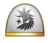
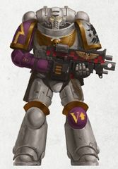
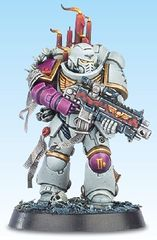
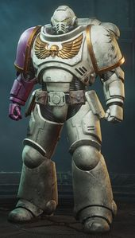

# 0395 凤凰之子 Sons of the Phoenix

精校状态：中文行文已逐段精校，部分术语仍为暂定

分类：通用概念 / 帝国 Imperium / 中央政务部 Adeptus Terra / 阿斯塔特修会 Adeptus Astartes

原文来源：https://www.bilibili.com/opus/1172132377989742611

原作者：帝国神选罐头

原文时间：2026年02月22日 15:52

[返回分类目录](目录.md) · [全书目录](../../目录.md)

<!-- A0395-B0001 -->
**英文原文**

The Sons of the Phoenix are an Imperial Fists Successor Chapter.

<!-- /A0395-B0001 -->

<!-- A0395-B0002 -->

原译文

凤凰之子是帝国之拳的子战团。

**校订译文**

凤凰之子是帝国之拳的子战团。

<!-- /A0395-B0002 -->

<!-- A0395-B0003 图片 -->

<!-- A0395-B0004 图片 -->

<!-- A0395-B0005 图片 -->

<!-- A0395-B0006 -->
**英文原文**

Founding Chapter:Imperial Fists

<!-- /A0395-B0006 -->

<!-- A0395-B0007 -->

原译文

建军战团：帝国之拳

**校订译文**

母团：帝国之拳。

<!-- /A0395-B0007 -->

<!-- A0395-B0008 -->
**英文原文**

Founding:Ultima Founding

<!-- /A0395-B0008 -->

<!-- A0395-B0009 -->

原译文

建军：极限建军

**校订译文**

建军：极限建军

<!-- /A0395-B0009 -->

<!-- A0395-B0010 -->
**英文原文**

Colours:Off-white and purple

<!-- /A0395-B0010 -->

<!-- A0395-B0011 -->

原译文

颜色：米白色和紫色

**校订译文**

颜色：米白色和紫色

<!-- /A0395-B0011 -->

<!-- A0395-B0012 -->
**英文原文**

Specialty:Crusades

<!-- /A0395-B0012 -->

<!-- A0395-B0013 -->

原译文

专业：远征

**校订译文**

专长：远征作战。

<!-- /A0395-B0013 -->

<!-- A0395-B0014 -->
**英文原文**

Battle Cry:From the fires of war we rise

<!-- /A0395-B0014 -->

<!-- A0395-B0015 -->

原译文

战吼：我们从战火中崛起

**校订译文**

战吼：我们从战火中崛起

<!-- /A0395-B0015 -->

<!-- A0395-B0016 -->
## History 历史

<!-- /A0395-B0016 -->

<!-- A0395-B0017 -->
**英文原文**

The Sons of the Phoenix were among the Primaris Space Marine Chapters created during the Ultima Founding, at the direct order of Roboute Guilliman, and were created during the Indomitus Crusade. Faithful to the Emperor and ritualistic in their battle cant, the Sons of the Phoenix pride themselves on plunging into the flames of battle. They are constantly on holy crusades, which are led by their Chaplains and pave the way for the Imperial Creed to spread to numerous worlds. Because of this, the Chapter's crusades are often followed by many Adeptus Ministorum priests and pilgrims.

<!-- /A0395-B0017 -->

<!-- A0395-B0018 -->

原译文

凤凰之子是在极限建军期间创建的原铸星际战士战团之一，由罗伯特基里曼直接下令，并在不屈远征期间创建。凤凰之子忠于帝皇，战斗口号充满仪式感，他们以投入战斗的火焰为荣。他们不断地进行神圣远征，由他们的牧师领导，为帝国信条传播到众多世界铺平了道路。因此，该战团的远征经常有许多国教牧师和朝圣者。

**校订译文**

凤凰之子是不屈远征期间奉罗保特·基里曼直接命令、在极限建军中成立的原铸星际战士战团之一。他们忠于帝皇，战斗祷颂充满仪式色彩，并以投身战火为荣。战团不断由教士率领，踏上神圣远征，为帝国教义传播至众多世界开辟道路。因此，国教会的神职人员与朝圣者常大批追随其远征。

**校注：** Chaplain 与 Adeptus Ministorum priests 分别译教士、国教会神职人员，避免将两种组织身份混为一谈。

<!-- /A0395-B0018 -->

<!-- A0395-B0019 -->
**英文原文**

Since the opening of the Great Rift, the fleets of the Sons of the Phoenix have been scattered and they are now desperately trying to regroup.

<!-- /A0395-B0019 -->

<!-- A0395-B0020 -->

原译文

自大裂隙打开以来，凤凰之子的舰队已经被分散，他们现在正拼命地试图重新集结。

**校订译文**

大裂隙开启后，凤凰之子的舰队四散，如今正竭力重新集结。

<!-- /A0395-B0020 -->

<!-- A0395-B0021 -->
## Notable Campaigns 著名战役

<!-- /A0395-B0021 -->

<!-- A0395-B0022 -->
**英文原文**

Sometime after their Founding, the Sons of the Phoenix were attacked by Thousand Sons Warbands from the Cult of Change. During these attacks several members of the Chapter were taken captive by the Warbands in order to be used as specimens in the Thousand Sons' arcane experiments.

<!-- /A0395-B0022 -->

<!-- A0395-B0023 -->

原译文

在凤凰之子建军后的某个时候，他们遭到了变化教派的千子战帮的袭击。在这些袭击中，该战团的几名成员被战帮俘虏，以用作千子神秘实验的样本。

**校订译文**

在凤凰之子建军后的某个时候，他们遭到了变化教派的千子战帮的袭击。在这些袭击中，该战团的几名成员被战帮俘虏，以用作千子神秘实验的样本。

<!-- /A0395-B0023 -->

<!-- A0395-B0024 -->
**英文原文**

War of Antipathy — The Sons of the Phoenix won reputation for spectacular firestorms against their foe that they fought through without hesitation.

<!-- /A0395-B0024 -->

<!-- A0395-B0025 -->

原译文

厌恶之战 — 凤凰之子以对抗敌人的壮观火焰风暴而闻名，他们毫不犹豫地战胜了敌人。

**校订译文**

厌恶之战——凤凰之子以向敌人倾泻壮观的火焰风暴、并毫不迟疑地穿越烈焰作战而闻名。

**校注：** fought through 指穿过自己造成的火焰风暴继续作战，不是仅打败敌人。

<!-- /A0395-B0025 -->

<!-- A0395-B0026 -->
**英文原文**

War of Beasts — The Sons of the Phoenix send 6 companies. These had a galvanizing effect on the Imperial Guard and Sisters of Battle in Hyperia Hivesprawl.

<!-- /A0395-B0026 -->

<!-- A0395-B0027 -->

原译文

野兽战争 — 凤凰之子派出6个连队。这些对海珀利亚巢都扩区的帝国卫队和战斗修女产生了激励作用。

**校订译文**

野兽之战——凤凰之子派出六个连，极大鼓舞了海珀利亚巢都扩区的帝国卫队与战斗修女。

<!-- /A0395-B0027 -->

<!-- A0395-B0028 -->

原译文

Nachmund Rift War 纳克蒙德走廊战争

**校订译文**

Nachmund Rift War 纳克蒙德走廊战争

<!-- /A0395-B0028 -->

<!-- A0395-B0029 -->
**英文原文**

Siege of Dharrovar — 180-250 Battle Brothers from the 3rd, 4th, and 6th Companies under Captains Aqhat and Arishat.

<!-- /A0395-B0029 -->

<!-- A0395-B0030 -->

原译文

达罗瓦尔围攻 — 180-250名来自第三、第四和第六连队的战斗兄弟，由阿卡特和阿里沙特连长指挥。

**校订译文**

达罗瓦尔围攻 — 180-250名来自第三、第四和第六连队的战斗兄弟，由阿卡特和阿里沙特连长指挥。

<!-- /A0395-B0030 -->

<!-- A0395-B0031 -->

原译文

Season of Blood 血之季节

**校订译文**

Season of Blood 血之季节

<!-- /A0395-B0031 -->

<!-- A0395-B0032 -->
## Heraldry 纹章

<!-- /A0395-B0032 -->

<!-- A0395-B0033 -->
**英文原文**

The Sons of the Phoenix wear power armour that is primarily an off-white colour to symbolise their purity. They also colour their right arms and left kneepads purple, and use gold for both markings and decoration (in particular their Imperialis, pauldron trim and kneeguards).

<!-- /A0395-B0033 -->

<!-- A0395-B0034 -->

原译文

凤凰之子身穿以米白色为主的动力盔甲，象征着他们的纯洁。他们还将右臂和左膝涂成紫色，并使用金色作为标记和装饰（特别是他们的帝国天鹰、肩甲装饰和膝甲）。

**校订译文**

凤凰之子的动力甲以米白色为主，象征纯洁。右臂与左膝甲涂紫色，标记和装饰则采用金色，尤其是帝国徽记、肩甲镶边与护膝的装饰。

**校注：** Imperialis 统一帝国徽记，不直接称帝国天鹰。

<!-- /A0395-B0034 -->

<!-- A0395-B0035 -->
**英文原文**

The Chapter's symbol is a helmet with a single eagle's wing, surmounted on a halo of thunderbolts. The symbol is black on an off-white background.

<!-- /A0395-B0035 -->

<!-- A0395-B0036 -->

原译文

战团的标志是一顶有着单鹰翼的头盔，头顶是雷电的光环。该标志为黑色在米白色背景上。

**校订译文**

战团徽记是一顶带单只鹰翼的头盔，置于雷电光环之上，整体采用米白底色与黑色图案。

<!-- /A0395-B0036 -->

<!-- A0395-B0037 -->
**英文原文**

Sergeant rank is denoted with a red stripe down the centre of the helmet. They are also entitled to wear a golden laurel on their right pauldron. Lieutenants wear a completely red helm.

<!-- /A0395-B0037 -->

<!-- A0395-B0038 -->

原译文

军士等级用头盔中央的红色条纹表示。他们也有权在他们的右肩甲上佩戴金月桂。副官戴着全红色的头盔。

**校订译文**

军士的头盔中央有一道红色条纹，并可在右肩甲佩戴金色桂冠。副官则戴全红色头盔。

<!-- /A0395-B0038 -->

<!-- A0395-B0039 -->
**英文原文**

A Marine's company number is displayed in gold on their left kneepad, usually alongside their squad type marker.

<!-- /A0395-B0039 -->

<!-- A0395-B0040 -->

原译文

战士的连队数字以金色显示在他们的左膝上，通常在他们的小队类型标记的另一侧。

**校订译文**

战士的连队编号以金色绘于左膝甲，通常与小队类别标记并列。

<!-- /A0395-B0040 -->

<!-- A0395-B0041 图片 -->

<!-- A0395-B0042 -->
## Chapter Elements 战团人员与舰船

原题：Chapter Elements 战锤成员

<!-- /A0395-B0042 -->

<!-- A0395-B0043 -->
## Known Vessels 已知战舰

<!-- /A0395-B0043 -->

<!-- A0395-B0044 -->
**英文原文**

Karth Victoris — Strike Cruiser.

<!-- /A0395-B0044 -->

<!-- A0395-B0045 -->

原译文

卡尔特·维克托里斯号 — 打击巡洋舰

**校订译文**

卡尔特·维克托里斯号 — 打击巡洋舰

<!-- /A0395-B0045 -->

<!-- A0395-B0046 -->
**英文原文**

Lattachia Triumphan — Strike Cruiser.

<!-- /A0395-B0046 -->

<!-- A0395-B0047 -->

原译文

拉塔契亚凯旋号 — 打击巡洋舰

**校订译文**

拉塔契亚凯旋号 — 打击巡洋舰

<!-- /A0395-B0047 -->

<!-- A0395-B0048 -->
**英文原文**

Ash — Gladius Escort.

<!-- /A0395-B0048 -->

<!-- A0395-B0049 -->

原译文

灰烬号 — 短剑护卫舰

**校订译文**

灰烬号 — 短剑护卫舰

<!-- /A0395-B0049 -->

<!-- A0395-B0050 -->
**英文原文**

Blaze — Gladius Escort.

<!-- /A0395-B0050 -->

<!-- A0395-B0051 -->

原译文

烈焰号 — 短剑护卫舰

**校订译文**

烈焰号 — 短剑护卫舰

<!-- /A0395-B0051 -->

<!-- A0395-B0052 -->
**英文原文**

Cinder — Gladius Escort.

<!-- /A0395-B0052 -->

<!-- A0395-B0053 -->

原译文

余烬号 — 短剑护卫舰

**校订译文**

余烬号 — 短剑护卫舰

<!-- /A0395-B0053 -->

<!-- A0395-B0054 -->
**英文原文**

Ember — Gladius Escort.

<!-- /A0395-B0054 -->

<!-- A0395-B0055 -->

原译文

余火号 — 短剑护卫舰

**校订译文**

余火号 — 短剑护卫舰

<!-- /A0395-B0055 -->

<!-- A0395-B0056 -->
## Known Members 已知成员

<!-- /A0395-B0056 -->

<!-- A0395-B0057 -->
**英文原文**

Badron Aqhat — Captain.

<!-- /A0395-B0057 -->

<!-- A0395-B0058 -->

原译文

巴德龙·阿卡特 — 连长

**校订译文**

巴德龙·阿卡特 — 连长

<!-- /A0395-B0058 -->

<!-- A0395-B0059 -->
**英文原文**

Nikkal Arishat — Captain.

<!-- /A0395-B0059 -->

<!-- A0395-B0060 -->

原译文

尼卡尔·阿里沙特 — 连长

**校订译文**

尼卡尔·阿里沙特 — 连长

<!-- /A0395-B0060 -->

<!-- A0395-B0061 -->
**英文原文**

Tanithos Izavel — Reclusiarch.

<!-- /A0395-B0061 -->

<!-- A0395-B0062 -->

原译文

塔尼索斯·伊扎维尔 — 隐修长

**校订译文**

塔尼索斯·伊扎维尔 — 隐修长

<!-- /A0395-B0062 -->

<!-- A0395-B0063 -->
**英文原文**

Baltzur Hammon — Lexicanium.

<!-- /A0395-B0063 -->

<!-- A0395-B0064 -->

原译文

巴尔祖尔·哈蒙 — 编修员

**校订译文**

巴尔祖尔·哈蒙 — 编修员

<!-- /A0395-B0064 -->

<!-- A0395-B0065 -->
## Trivia 琐事

<!-- /A0395-B0065 -->

<!-- A0395-B0066 -->
**英文原文**

The Sons of the Phoenix were originally created by Maxime Pastourel, who explained his thoughts behind their background and design in White Dwarf October 2017 and on his blog.

<!-- /A0395-B0066 -->

<!-- A0395-B0067 -->

原译文

凤凰之子最初由马克西姆·帕斯图雷尔创作，他在2017年10月的《白矮人》和他的博客上解释了他们的背景和设计背后的想法。

**校订译文**

凤凰之子由马克西姆·帕斯图雷尔创作。他曾在2017年10月号《白矮人》和个人博客中，介绍该战团的背景与设计构思。

<!-- /A0395-B0067 -->

本篇核心术语与暂定项

以下列出本篇出现的英文原形及核心术语表用词。同形词可能指不同对象，具体词义以本篇正文和校注为准；单复数、别名和仅见于图注的名称可能尚未列入。完整候选见[术语表](../../术语表/双语术语候选.csv)。

| 英文 | 采用中文 | 状态 |
| --- | --- | --- |
| Imperial Guard | 帝国卫队 | 暂定·语境区分 |
| Thousand Sons | 千子 | 官方已核对 |
| Roboute Guilliman | 罗保特·基里曼 | 官方已核对 |
| Great Rift | 大裂隙 | 官方已核对 |
| Indomitus | 不屈学派 | 暂定·学派语境 |
| Imperial Fists | 帝国之拳 | 暂定 |
| Emperor | 帝皇 | 官方已核对 |
| Adeptus Ministorum | 国教会 | 暂定 |
| Sisters of Battle | 战斗修女 | 暂定·官方待核 |
| Imperial Creed | 帝国教义 | 暂定·官方待核 |
| Indomitus Crusade | 不屈远征 | 暂定·官方待核 |
| War of Beasts | 野兽之战 | 暂定·官方待核 |
| Lexicanium | 编修员 | 暂定·官方待核 |
| Reclusiarch | 隐修长 | 暂定·官方待核 |
| Founding | 建军 | 暂定·官方待核 |
| Power Armour | 动力盔甲 | 暂定·官方待核 |
| Space Marine | 星际战士 | 暂定·官方待核 |
| Chapter | 战团 | 暂定·官方待核 |
| Captain | 连长 | 暂定·官方待核 |
| Sergeant | 军士 | 暂定·官方待核 |
| Primaris Space Marine | 原铸星际战士 | 暂定·官方待核 |
| Ultima Founding | 极限建军 | 暂定·官方待核 |
| Sons of the Phoenix | 凤凰之子 | 暂定·官方待核 |
| Strike Cruiser | 打击巡洋舰 | 暂定·官方待核 |
| Imperialis | 帝国徽记 | 暂定·官方待核 |
| War of Antipathy | 厌恶之战 | 暂定·官方待核 |
| Chaplains | 教士 | 暂定·官方待核 |
| Cult of Change | 变化学派 | 暂定·官方待核 |
| Badron Aqhat | 巴德伦·阿克哈特 | 暂定·官方待核 |
| Lattachia Triumphan | 拉塔基亚凯旋号 | 暂定·官方待核 |
| Karth Victoris | 卡尔斯胜利号 | 暂定·官方待核 |
| Hyperia Hivesprawl | 海珀利亚巢都扩区 | 暂定·官方待核 |
| Hyperia | 海珀利亚 | 暂定·官方待核 |

