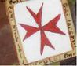
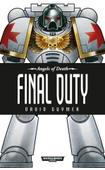
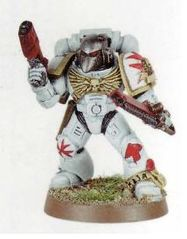

# 0396 医院骑士 Hospitallers

精校状态：中文行文已逐段精校，部分术语仍为暂定

分类：通用概念 / 帝国 Imperium / 中央政务部 Adeptus Terra / 阿斯塔特修会 Adeptus Astartes

原文来源：https://www.bilibili.com/opus/1210023713286651961

原作者：帝国神选罐头

原文时间：2026年06月04日 18:30

[返回分类目录](目录.md) · [全书目录](../../目录.md)

<!-- A0396-B0001 -->
**英文原文**

The Hospitallers are a non-Codex Space Marines Chapter.

<!-- /A0396-B0001 -->

<!-- A0396-B0002 -->

原译文

医院骑士是一个非圣典星际战士战团。

**校订译文**

医院骑士是一个不按《阿斯塔特圣典》编制的星际战士战团。

<!-- /A0396-B0002 -->

<!-- A0396-B0003 图片 -->

<!-- A0396-B0004 图片 -->

<!-- A0396-B0005 图片 -->

<!-- A0396-B0006 -->
**英文原文**

Founding Chapter:Imperial Fists

<!-- /A0396-B0006 -->

<!-- A0396-B0007 -->

原译文

建军战团：帝国之拳

**校订译文**

母团：帝国之拳。

<!-- /A0396-B0007 -->

<!-- A0396-B0008 -->
**英文原文**

Founding:Twenty Fourth Founding

<!-- /A0396-B0008 -->

<!-- A0396-B0009 -->

原译文

建军时间：第24次建军

**校订译文**

建军时间：第24次建军

<!-- /A0396-B0009 -->

<!-- A0396-B0010 -->
**英文原文**

Chapter Master:Mirkal Alfaran

<!-- /A0396-B0010 -->

<!-- A0396-B0011 -->

原译文

战团长：米尔卡尔·阿尔法兰

**校订译文**

战团长：米尔卡尔·阿尔法兰

<!-- /A0396-B0011 -->

<!-- A0396-B0012 -->
**英文原文**

Colours:White bone and red

<!-- /A0396-B0012 -->

<!-- A0396-B0013 -->

原译文

配色：骨白色和红色

**校订译文**

配色：骨白色和红色

<!-- /A0396-B0013 -->

<!-- A0396-B0014 -->
## Chapter Cult 战团教派

<!-- /A0396-B0014 -->

<!-- A0396-B0015 -->
**英文原文**

The Hospitallers are one of the relatively rare Space Marine Chapters whose Chapter Cult worships the Emperor as a god.

<!-- /A0396-B0015 -->

<!-- A0396-B0016 -->

原译文

医院骑士是相对罕见的星际战士战团之一，战团教派崇拜帝皇为神。

**校订译文**

医院骑士是少数在战团信仰中将帝皇奉为神明的星际战士战团之一。

<!-- /A0396-B0016 -->

<!-- A0396-B0017 -->
## Known Engagements 已知交战

<!-- /A0396-B0017 -->

<!-- A0396-B0018 -->
**英文原文**

412.M41 - The Defence of Fabris Callivant from Orks alongside the Iron Hands. Chapter Master Mirkal Alfaran goes missing following the destruction of the Battle Barge Shield of the God-Emperor.

<!-- /A0396-B0018 -->

<!-- A0396-B0019 -->

原译文

与钢铁之手一起从欧克手中防御法布里斯·卡利万特。战团长米尔卡尔·阿尔法兰在神皇之盾号战斗驳船被摧毁后失踪。

**校订译文**

412.M41：与钢铁之手共同保卫法布里斯·卡利万特，抵御欧克。战斗驳船神皇之盾号被毁后，战团长米尔卡尔·阿尔法兰失踪。

<!-- /A0396-B0019 -->

<!-- A0396-B0020 -->
## Organisation 组织

<!-- /A0396-B0020 -->

<!-- A0396-B0021 -->
**英文原文**

The Hospitallers organise themselves into three companies, the foundations of which are provided by the three oaths new battle-brothers make upon their acceptance of the Chapter's gene-seed: to honour the Emperor who is God; to shield the faithful; and to bring absolution through death to the heretic, the apostate, the unbeliever, and the alien.

<!-- /A0396-B0021 -->

<!-- A0396-B0022 -->

原译文

医院骑士将自己组织成三个连队，其基础由新战斗兄弟在接受战团基因种子后所做的三个誓言提供：尊敬作为神的帝皇；保护信徒；并通过死亡为异端、叛教者、无信者和异型带来赦免。

**校订译文**

医院骑士分为三个连队，分别以新战斗兄弟接受战团基因种子时立下的三项誓言为根基：尊崇身为神明的帝皇；保护信徒；以死亡给予异端、叛教者、无信者和异形以赦免。

<!-- /A0396-B0022 -->

<!-- A0396-B0023 -->
**英文原文**

The Chapter's veterans are organised into an elite unit that stands outside the Chapter's three-company structure, known as the Vigil.

<!-- /A0396-B0023 -->

<!-- A0396-B0024 -->

原译文

战团的老兵被组织成一个精英单位，该单位位于战团的三个连队结构之外，被称为守夜者。

**校订译文**

战团老兵另编为名叫“守夜者”的精锐单位，独立于三个连队的编制之外。

**校注：** Vigil 此处是医院骑士老兵单位，沿现稿守夜者；与死亡守望警戒堡、静默修女警戒团按语境分开。

<!-- /A0396-B0024 -->

<!-- A0396-B0025 -->
## Chapter Assets 战团资产

<!-- /A0396-B0025 -->

<!-- A0396-B0026 -->
### Known Vessels 已知战舰

<!-- /A0396-B0026 -->

<!-- A0396-B0027 -->
**英文原文**

Shield of the God-Emperor - Battle Barge.

<!-- /A0396-B0027 -->

<!-- A0396-B0028 -->

原译文

神皇之盾号 - 战斗驳船

**校订译文**

神皇之盾号 - 战斗驳船

<!-- /A0396-B0028 -->

<!-- A0396-B0029 -->
### Known Members 已知成员

<!-- /A0396-B0029 -->

<!-- A0396-B0030 -->
**英文原文**

Mirkal Alfaran - Chapter Master.

<!-- /A0396-B0030 -->

<!-- A0396-B0031 -->

原译文

米尔卡尔·阿尔法兰 - 战团长

**校订译文**

米尔卡尔·阿尔法兰 - 战团长

<!-- /A0396-B0031 -->

<!-- A0396-B0032 -->
**英文原文**

Galvarro - Venerable Dreadnought, Seneschal to the Chapter Master

<!-- /A0396-B0032 -->

<!-- A0396-B0033 -->

原译文

加尔瓦罗 - 神圣无畏，战团长的总管

**校订译文**

加尔瓦罗——神圣无畏机甲，兼任战团长的总管。

<!-- /A0396-B0033 -->

<!-- A0396-B0034 -->
## Trivia 琐事

<!-- /A0396-B0034 -->

<!-- A0396-B0035 -->
**英文原文**

The Hospitallers portray symbols taken from the real world Knights Hospitallers of Malta.

<!-- /A0396-B0035 -->

<!-- A0396-B0036 -->

原译文

医院骑士描绘了取自现实世界马耳他医院骑士团的符号。

**校订译文**

医院骑士使用的标志取材于现实中的马耳他医院骑士团。

<!-- /A0396-B0036 -->

<!-- A0396-B0037 -->
**英文原文**

The Hospitallers were created by John Fitzsimons

<!-- /A0396-B0037 -->

<!-- A0396-B0038 -->

原译文

医院骑士由约翰·菲茨西蒙斯创建

**校订译文**

医院骑士战团由约翰·菲茨西蒙斯创作。

<!-- /A0396-B0038 -->

本篇核心术语与暂定项

以下列出本篇出现的英文原形及核心术语表用词。同形词可能指不同对象，具体词义以本篇正文和校注为准；单复数、别名和仅见于图注的名称可能尚未列入。完整候选见[术语表](../../术语表/双语术语候选.csv)。

| 英文 | 采用中文 | 状态 |
| --- | --- | --- |
| Space Marines | 星际战士 | 官方已核对 |
| Orks | 欧克蛮人 | 官方已核对 |
| Imperial Fists | 帝国之拳 | 暂定 |
| Emperor | 帝皇 | 官方已核对 |
| Battle Barge | 战斗驳船 | 暂定·官方待核 |
| Iron Hands | 钢铁之手 | 暂定·官方待核 |
| Master | 导师（审判庭职衔）／舰务官（舰员职务） | 语境定译·官方待核 |
| Vigil | 警戒团（静默修女编制）／警戒堡（红蝎空间站）／守夜星（行星） | 语境定译·官方待核 |
| Founding | 建军 | 暂定·官方待核 |
| Space Marine | 星际战士 | 暂定·官方待核 |
| Chapter | 战团 | 暂定·官方待核 |
| Chapter Master | 战团长 | 暂定·官方待核 |
| Chapter cult | 战团教派 | 暂定·官方待核 |
| Fourth Founding | 第四次建军 | 暂定·官方待核 |
| Hospitallers | 医院骑士 | 暂定·官方待核 |
| Gene-seed | 基因种子 | 暂定·官方待核 |
| Venerable Dreadnought | 神圣无畏机甲 | 官方词根参考·通称待核 |
| Dreadnought | 无畏机甲 | 暂定·官方待核 |

