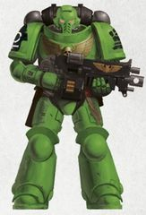
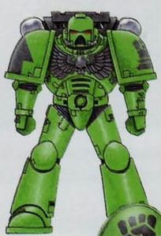

# 0397 压制者 Subjugators

精校状态：中文行文已逐段精校，部分术语仍为暂定

分类：通用概念 / 帝国 Imperium / 中央政务部 Adeptus Terra / 阿斯塔特修会 Adeptus Astartes

原文来源：https://www.bilibili.com/opus/1210758161342922800

原作者：帝国神选罐头

原文时间：2026年06月06日 18:00

[返回分类目录](目录.md) · [全书目录](../../目录.md)

<!-- A0397-B0001 -->
**英文原文**

The Subjugators are a Space Marine chapter. They are one of 20 Space Marine chapters known as the Astartes Praeses, which were created to watch over the Eye of Terror region and protect the Eastern Marches from enemy invasions to Terra.

<!-- /A0397-B0001 -->

<!-- A0397-B0002 -->

原译文

压制者是一个星际战士战团。它们是被称为阿斯塔特总督的20个星际战士战团之一，该战团旨在监视恐惧之眼地区，保护东部行军免受敌人对泰拉的入侵。

**校订译文**

压制者是星际战士战团，也是统称“阿斯塔特总督”的二十个战团之一。这些战团负责监视恐惧之眼区域，守护东部边疆，阻挡企图入侵泰拉的敌人。

**校注：** Marches 为边疆，不是行军；保护区域、阻挡前往泰拉的入侵者两层关系据原文理顺。

<!-- /A0397-B0002 -->

<!-- A0397-B0003 图片 -->

<!-- A0397-B0004 图片 -->

<!-- A0397-B0005 -->
**英文原文**

Founding Chapter:Imperial Fists

<!-- /A0397-B0005 -->

<!-- A0397-B0006 -->

原译文

建军战团：帝国之拳

**校订译文**

母团：帝国之拳。

<!-- /A0397-B0006 -->

<!-- A0397-B0007 -->
**英文原文**

Founding:Twenty Third Founding or Twenty Fourth Founding

<!-- /A0397-B0007 -->

<!-- A0397-B0008 -->

原译文

建军时间：第23次建军或第24次建军

**校订译文**

建军时间：第23次建军或第24次建军

<!-- /A0397-B0008 -->

<!-- A0397-B0009 -->
**英文原文**

Homeworld:Xenax

<!-- /A0397-B0009 -->

<!-- A0397-B0010 -->

原译文

家园世界：泽纳克斯

**校订译文**

家园世界：泽纳克斯

<!-- /A0397-B0010 -->

<!-- A0397-B0011 -->
**英文原文**

Colours:Green with black backpack and markings

<!-- /A0397-B0011 -->

<!-- A0397-B0012 -->

原译文

配色：绿色，配黑色背包和标志

**校订译文**

配色：绿色，配黑色背包和标志

<!-- /A0397-B0012 -->

<!-- A0397-B0013 -->
**英文原文**

Specialty:Extreme and unsubtle warfare that sees large collateral damage

<!-- /A0397-B0013 -->

<!-- A0397-B0014 -->

原译文

专长：极端和不稳定的作战，会造成巨大的附带损害

**校订译文**

专长：极端直接的作战方式，往往造成大量附带破坏。

<!-- /A0397-B0014 -->

<!-- A0397-B0015 -->
## Overview 概述

<!-- /A0397-B0015 -->

<!-- A0397-B0016 -->
**英文原文**

The Subjugators are known to be unrelenting in the prosecution of the enemies of Mankind, attacking with overwhelming force and eschewing many of the more subtle arts of war, resulting in the destruction of enemy forces, resources and assets. Their use of extreme methods causes many Imperial Commanders to hesitate requesting for aid, because they will both purge the invading enemies and the oppressed population.

<!-- /A0397-B0016 -->

<!-- A0397-B0017 -->

原译文

众所周知，压制者在攻击人类之敌方面毫不留情，以压倒性的力量发动攻击，避开许多更微妙的战争技巧，导致敌方部队、资源和资产遭到破坏。他们使用极端的方法导致许多帝国指挥官在请求援助时犹豫不决，因为他们既会清除入侵的敌人，也会清除被压制的人口。

**校订译文**

压制者追猎人类之敌时绝不留情，偏好以压倒性武力直接进攻，很少运用迂回精巧的战术，连同敌军、资源与设施一并摧毁。他们的极端手段令许多帝国指挥官不敢轻易求援，因为战团清除入侵者时，也会将受压迫的当地居民一起净化。

<!-- /A0397-B0017 -->

<!-- A0397-B0018 -->
**英文原文**

They follow a lot of the traditions of the Imperial Fists Chapter, like the veneration of Rogal Dorn, but also share a lot in common with the Black Templars, in their zeal to destroy all potential threats to the Imperium. Their duties in the Segmentum Solar and Obscurus prohibits them from undertaking the crusades like the Black Templars, but they can still contribute small forces to larger operations.

<!-- /A0397-B0018 -->

<!-- A0397-B0019 -->

原译文

他们遵循帝国之拳战团的许多传统，比如对罗格·多恩的崇拜，但也与黑色圣堂有很多共同点，他们热衷于摧毁帝国的所有潜在威胁。他们在太阳星域和朦胧星域的职责禁止他们像黑色圣堂一样进行远征，但他们仍然可以为更大的行动派遣小型部队。

**校订译文**

他们继承了帝国之拳的许多传统，例如崇敬罗格·多恩；而在狂热地消灭一切潜在帝国威胁方面，又与黑色圣堂十分相似。太阳星域与朦胧星域的驻防职责，使他们无法像黑色圣堂一样长期远征，但仍会抽调小部队参加大型行动。

<!-- /A0397-B0019 -->

<!-- A0397-B0020 -->
**英文原文**

The Subjugators are unusual in that they only field the Annihilator variant of the Predator. They are described in one source as "idiosyncratic".

<!-- /A0397-B0020 -->

<!-- A0397-B0021 -->

原译文

压制者是独特的，因为它们只处理掠食者的歼灭者变体。在一个来源中，他们被描述为“怪异的”。

**校订译文**

压制者在掠食者战车的使用上独树一帜，只部署歼灭者型。有一份资料将这种偏好形容为“特立独行”。

**校注：** field 指投入作战，不是处理；采用官方歼灭者型掠食者战车的词序。

<!-- /A0397-B0021 -->

<!-- A0397-B0022 图片 -->

<!-- A0397-B0023 -->

原译文

Subjugators Firstborn 压制者长子

**校订译文**

Subjugators Firstborn 压制者长子

<!-- /A0397-B0023 -->

<!-- A0397-B0024 -->
## Notable Battles 著名战斗

<!-- /A0397-B0024 -->

<!-- A0397-B0025 -->

原译文

688.M40 - The Second Abonian Genocide 第二次阿伯尼安种族灭绝

**校订译文**

688.M40 - The Second Abonian Genocide 第二次阿伯尼安种族灭绝

<!-- /A0397-B0025 -->

<!-- A0397-B0026 -->
**英文原文**

742-745.M41 - Damocles Gulf Crusade: The Subjugators contributed a single squad and several armoured vehicles to the crusade.

<!-- /A0397-B0026 -->

<!-- A0397-B0027 -->

原译文

达摩克利斯湾远征：压制者为远征贡献了一个小队和几辆装甲载具。

**校订译文**

742—745.M41：达摩克利斯湾远征。压制者派出一个小队和数辆装甲载具参战。

<!-- /A0397-B0027 -->

<!-- A0397-B0028 -->
**英文原文**

777.M41 - Achilus Crusade: The former contributions to the Damocles Gulf Crusade are now in the Jericho Reach, after their victory against Hive Fleet Behemoth in Macragge. Their most significant action in the crusade was protecting Berkin on the Greyhell Front from the attack of Hive Fleet Dagon, by removing infiltrator organisms. The head of a Broodlord is displayed on the bridge of the Strike Cruiser Glorious Tyrant.

<!-- /A0397-B0028 -->

<!-- A0397-B0029 -->

原译文

阿基里斯远征：在马库拉格战胜虫巢舰队贝希摩斯后，之前对达摩克利斯湾远征的贡献现在位于杰里科河段。他们在远征中最重要的行动是通过清除渗透生物来保护灰狱前线的伯金免受虫巢舰队达贡的攻击。鲜血领主之首被展示在打击巡洋舰辉煌暴君号的舰桥上。

**校订译文**

777.M41：阿基里斯远征。此前参加达摩克利斯湾远征的部队，在马库拉格战胜贝希摩斯虫巢舰队后转赴杰里科疆域。他们最重要的行动是清除渗透生物，保护灰狱前线的伯金免受达贡虫巢舰队攻击。一颗族群领主的头颅被陈列在打击巡洋舰辉煌暴君号的舰桥上。

**校注：** 本段把达摩克利斯湾参战部队与随后马库拉格战事关联，但所列纪年与其他章节的战役顺序可能不合；保留本段叙事，不擅改时间线。Broodlord 依官方统一族群领主。

<!-- /A0397-B0029 -->

<!-- A0397-B0030 -->
**英文原文**

850-901M41 - Third Inter-Guild Wars of the Inca Sector. The Guild Fathers of the Inca Sector of the Ultima Segmentum, fought a war against the Void Dragons Eldar pirates, sponsored by business rivals. The Subjugators Space Marine chapters were called in to assist. The Sons of Antaeus also answered the call.

<!-- /A0397-B0030 -->

<!-- A0397-B0031 -->

原译文

印加星区的第三次行会战争。极限星域印加星区的行会之父与商业竞争对手赞助的虚空之龙灵族海盗作战。压制者星际战士战团被召集来协助。安泰乌斯之子也响应了号召。

**校订译文**

850—901.M41：印加星区第三次行会战争。极限星域印加星区的行会之父们，与受到商业对手资助的虚空之龙灵族海盗交战。压制者战团应召参战，安泰乌斯之子也前来支援。

<!-- /A0397-B0031 -->

<!-- A0397-B0032 -->
**英文原文**

964.M41 - Tyrama Secundus Campaign. The Subjugators fought against an unknown xenos race, purging them on the planet of Tyrama Secundus.

<!-- /A0397-B0032 -->

<!-- A0397-B0033 -->

原译文

泰拉马二号战役。压制者与一个未知的异型种族作战，在泰拉马二号行星上清除他们。

**校订译文**

964.M41：泰拉马二号战役。压制者在泰拉马二号迎战一个身份不明的异形种族，并将其清除。

<!-- /A0397-B0033 -->

<!-- A0397-B0034 -->
**英文原文**

999.M41 - 13th Black Crusade. Three companies were dispatched to Cadia within days of hearing of Abaddon's invasion, vowing to send the remainder of the Chapter's resources as soon as possible. The Chapter arrived on two battle barges, just as the Chaos fleet was about to commence the invasion of the planet. The 3rd company was almost completely wiped out when they overloaded the reactor of a Ramilies star fort just as the forces of Chaos captured it. The 1st and 5th also suffered heavy casulties, particularly in the defence of Kasr Gallan and in rearguard actions during the Tarn Retreat. So far 168 battle-brothers have fallen (many with their gene-seed unrecoverable) and the Chapter needs to decide whether to retire from the conflict and rebuild its strength or fight on and risk its death.

<!-- /A0397-B0034 -->

<!-- A0397-B0035 -->

原译文

第13次黑色远征。在听说阿巴顿入侵后的几天内，三个连队被派往卡迪亚，并发誓要尽快将该战团的剩余资源运送出去。就在混沌舰队即将开始入侵行星之际，战团乘坐两艘战斗驳船抵达。当混沌部队占领拉米雷斯星堡时，反应堆超载，第三连队几乎完全被摧毁。第一和第五连队也遭受了严重伤亡，特别是在卡斯·加兰的防御和塔恩撤退期间的后卫行动中。到目前为止，已有168名战斗兄弟倒下（其中许多人的基因种子无法回收），战团需要决定是退出冲突，重建力量，还是继续战斗，冒着死亡的风险。

**校订译文**

999.M41：第十三次黑色远征。得知阿巴顿入侵后仅数日，压制者便派出三个连前往卡迪亚，并承诺尽快投入战团的其余力量。他们乘两艘战斗驳船抵达，恰逢混沌舰队准备进攻行星。混沌部队攻占一座拉米雷斯级星堡时，第三连主动使其反应堆过载，几乎全连牺牲。第一与第五连也伤亡惨重，尤其是在卡斯·加兰防御战和塔恩撤退的殿后战中。截至本段记述时，已有168名战斗兄弟阵亡，其中许多人的基因种子无法回收。战团面临抉择：撤出战场、恢复兵力，还是冒着覆灭的风险继续作战。

**校注：** they overloaded 为第三连主动令反应堆过载，原译漏失行为主体。人数与仍待决定的状态属于本段所用资料时点。

<!-- /A0397-B0035 -->

<!-- A0397-B0036 -->
**英文原文**

???.M42 - Battle with the Iron Warriors on Althis.

<!-- /A0397-B0036 -->

<!-- A0397-B0037 -->

原译文

在阿尔蒂斯与钢铁勇士作战。

**校订译文**

???.M42：在阿尔蒂斯与钢铁勇士交战。

<!-- /A0397-B0037 -->

<!-- A0397-B0038 -->
**英文原文**

Date Unknown - Conflict with the Cell-Kin: The Subjugators were attacked by an alien race known as the Cell-Kin. The Cell-Kin's method of attack and reproduction was invading a host's body, implanting a part of itself which would slowly turn the host into another Cell-Kin. All of the Space Marines who were infected were either cured or killed, except for 20 who are still at large.

<!-- /A0397-B0038 -->

<!-- A0397-B0039 -->

原译文

与胞裔的冲突：压制者遭到了一个被称为胞裔的异型种族的攻击。胞裔攻击和繁殖的方法是入侵宿主的身体，植入自身的一部分，慢慢地将宿主变成另一个胞裔。所有被感染的星际战士要么被治愈，要么被杀死，只有20名仍然逍遥法外。

**校订译文**

年代不详：与胞裔的冲突。压制者遭到名为胞裔的异形袭击。这些生物通过侵入宿主体内、植入自身一部分的方式攻击并繁殖，使宿主慢慢转化为新的胞裔。受感染的星际战士大多已被治愈或杀死，仍有二十人下落未明、未被控制。

<!-- /A0397-B0039 -->

<!-- A0397-B0040 -->
**英文原文**

Date Unknown - A force of 10 Subjugators honoured the Chapter's oath to protect the Tophet System by participating in the defence of the Forge World Tophet VI against Chaos Space Marines of the Iron Warriors Traitor Legion. Fighting alongside the Titans of the Legio Debellator and a force of Skitarii from the nearby Forge World of Agripinaa, the Subjugators lost at least 4 Marines during the battle to defend the planet's hive capital.

<!-- /A0397-B0040 -->

<!-- A0397-B0041 -->

原译文

一支由10名压制者组成的部队通过参与防御铸造世界托斐特六号对抗钢铁勇士叛徒军团的混沌星际战士，履行了保护托斐特星系的誓言。与灭战者军团的泰坦和附近阿格里皮娜铸造世界的护教军部队并肩作战，压制者在保卫行星巢都首都的战斗中至少损失了4名战士。

**校订译文**

年代不详：十名压制者为履行守护托斐特星系的誓言，前往铸造世界托斐特六号，抵抗钢铁勇士叛徒军团。他们与灭战者军团的泰坦，以及邻近阿格里皮娜铸造世界的护教军并肩作战。在保卫行星首府巢都的战斗中，至少四名战士阵亡。

<!-- /A0397-B0041 -->

<!-- A0397-B0042 -->

原译文

Date Unknown - Tranquillity Campaign 宁静战役

**校订译文**

Date Unknown - Tranquillity Campaign 宁静战役

<!-- /A0397-B0042 -->

<!-- A0397-B0043 -->
## Chapter Elements 战团成员

<!-- /A0397-B0043 -->

<!-- A0397-B0044 -->
## Chapter Fleet 战团舰队

<!-- /A0397-B0044 -->

<!-- A0397-B0045 -->
**英文原文**

Asuncion — Frigate

<!-- /A0397-B0045 -->

<!-- A0397-B0046 -->

原译文

升天号 — 护卫舰

**校订译文**

升天号 — 护卫舰

<!-- /A0397-B0046 -->

<!-- A0397-B0047 -->
## Notable Members 著名成员

<!-- /A0397-B0047 -->

<!-- A0397-B0048 -->
**英文原文**

Rakman — Captain who reported in the Third Inter-Guild Wars (see above), that the Sons of Antaeus showed up unexpectedly and opened a 2nd front forcing the Eldar pirates to attempt to redeploy. This resulted in the destruction of the Eldar raiding force.

<!-- /A0397-B0048 -->

<!-- A0397-B0049 -->

原译文

拉赫曼 — 在第三次行会战争（见上文）中报告称，安泰乌斯之子出人意料地出现，并开辟了第二条战线，迫使灵族海盗试图重新部署。这导致了灵族突袭部队的毁灭。

**校订译文**

拉赫曼——连长。他在第三次行会战争的报告中称，安泰乌斯之子出其不意地开辟第二条战线，迫使灵族海盗重新部署，最终导致其突袭部队被歼灭。

<!-- /A0397-B0049 -->

<!-- A0397-B0050 -->
**英文原文**

Taavus Wrack — 3rd Company Captain

<!-- /A0397-B0050 -->

<!-- A0397-B0051 -->

原译文

塔维乌斯·沃拉克 — 第三连队连长

**校订译文**

塔维乌斯·沃拉克 — 第三连队连长

<!-- /A0397-B0051 -->

<!-- A0397-B0052 -->
**英文原文**

Kobel — Chaplain

<!-- /A0397-B0052 -->

<!-- A0397-B0053 -->

原译文

科贝尔 — 牧师

**校订译文**

科贝尔——教士。

<!-- /A0397-B0053 -->

<!-- A0397-B0054 -->
**英文原文**

Garrido — Took part in the defence of Tophet VI.

<!-- /A0397-B0054 -->

<!-- A0397-B0055 -->

原译文

加里多 — 参与托斐特六号的防御。

**校订译文**

加里多 — 参与托斐特六号的防御。

<!-- /A0397-B0055 -->

<!-- A0397-B0056 -->
**英文原文**

Ayolas — Took part in the defence of Tophet VI.

<!-- /A0397-B0056 -->

<!-- A0397-B0057 -->

原译文

艾奥拉斯 — 参与托斐特六号的防御。

**校订译文**

艾奥拉斯 — 参与托斐特六号的防御。

<!-- /A0397-B0057 -->

<!-- A0397-B0058 -->
**英文原文**

Xoric — Member of the Deathwatch.

<!-- /A0397-B0058 -->

<!-- A0397-B0059 -->

原译文

佐里克 — 死亡守望的成员

**校订译文**

佐里克 — 死亡守望的成员

<!-- /A0397-B0059 -->

本篇核心术语与暂定项

以下列出本篇出现的英文原形及核心术语表用词。同形词可能指不同对象，具体词义以本篇正文和校注为准；单复数、别名和仅见于图注的名称可能尚未列入。完整候选见[术语表](../../术语表/双语术语候选.csv)。

| 英文 | 采用中文 | 状态 |
| --- | --- | --- |
| Space Marines | 星际战士 | 官方已核对 |
| Black Templars | 黑色圣堂 | 官方已核对 |
| Deathwatch | 死亡守望 | 官方已核对 |
| Chaos Space Marines | 混沌星际战士 | 官方已核对 |
| Eldar | 灵族 | 暂定·语境区分 |
| Imperium | 帝国 | 暂定·简称 |
| Eye of Terror | 恐惧之眼 | 官方已核对 |
| Imperial Fists | 帝国之拳 | 暂定 |
| Forge World | 铸造世界 | 暂定·官方待核 |
| Iron Warriors | 钢铁勇士 | 暂定·官方待核 |
| Terra | 泰拉 | 暂定·官方待核 |
| Skitarii | 护教军 | 暂定·官方待核 |
| Segmentum Solar | 太阳星域 | 暂定·官方待核 |
| Ultima Segmentum | 极限星域 | 暂定·官方待核 |
| Segmentum | 星域 | 暂定·官方待核 |
| Sector | 星区 | 暂定·官方待核 |
| Agripinaa | 阿格里皮娜 | 暂定·官方待核 |
| Cadia | 卡迪亚 | 暂定·官方待核 |
| Obscurus | 朦胧星 | 暂定·官方待核 |
| Macragge | 马库拉格 | 暂定·官方待核 |
| Tyrama Secundus | 泰拉玛二号 | 暂定 |
| Chaplain | 教士 | 官方已核对 |
| Founding | 建军 | 暂定·官方待核 |
| Space Marine | 星际战士 | 暂定·官方待核 |
| Chapter | 战团 | 暂定·官方待核 |
| Captain | 连长 | 暂定·官方待核 |
| Infiltrator | 渗透者 | 暂定·官方待核 |
| Third Founding | 第三次建军 | 暂定·官方待核 |
| Fourth Founding | 第四次建军 | 暂定·官方待核 |
| Sons of Antaeus | 安泰乌斯之子 | 暂定·官方待核 |
| The Black Templars | 黑色圣堂 | 暂定·官方待核 |
| Subjugators | 压制者 | 暂定·官方待核 |
| Gene-seed | 基因种子 | 暂定·官方待核 |
| Strike Cruiser | 打击巡洋舰 | 暂定·官方待核 |
| Astartes Praeses | 阿斯塔特总督 | 暂定·官方待核 |
| Host | 天军 | 暂定·官方待核 |
| Jericho Reach | 杰里科疆域 | 暂定·官方待核 |
| Xenos | 异形 | 暂定·官方待核 |
| Broodlord | 族群领主 | 官方已核对 |
| Void Dragons | 虚空之龙 | 暂定·官方待核 |
| Xenax | 泽纳克斯 | 暂定·官方待核 |
| Cell-Kin | 胞裔 | 暂定·官方待核 |
| Glorious Tyrant | 辉煌暴君号 | 暂定·官方待核 |
| Tophet VI | 托斐特六号 | 暂定·官方待核 |
| Legio Debellator | 灭战者军团 | 暂定·官方待核 |
| Unrelenting | 无情号 | 暂定·官方待核 |
| System | 星系（恒星系统） | 暂定·官方待核 |
| Kin | 炉裔 | 暂定·官方待核 |
| Gallan | 加兰 | 暂定·官方待核 |

