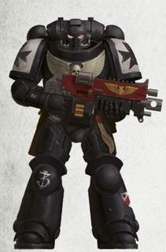
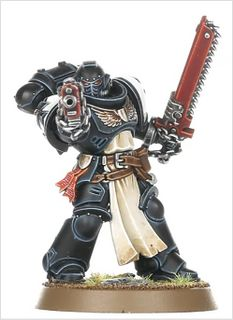
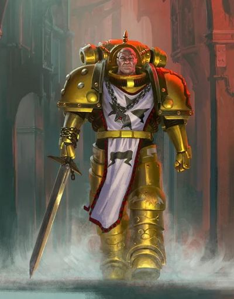
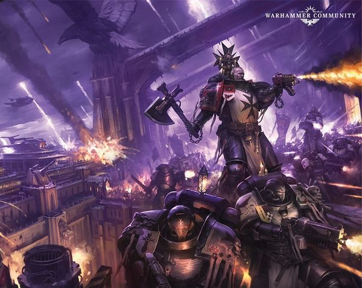
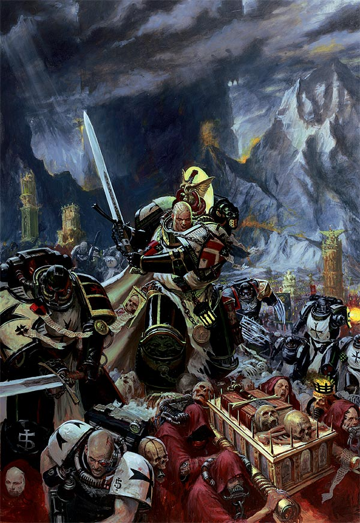
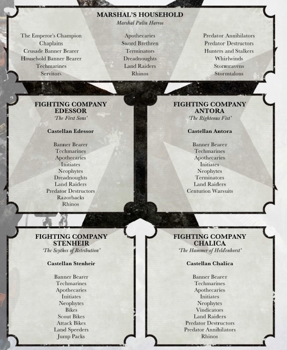
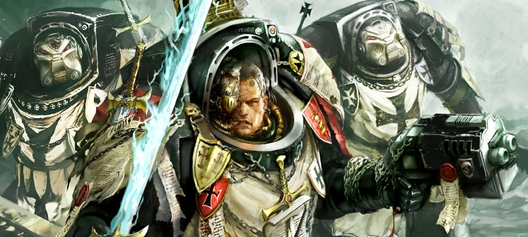
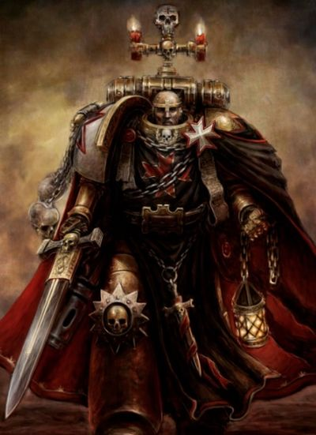
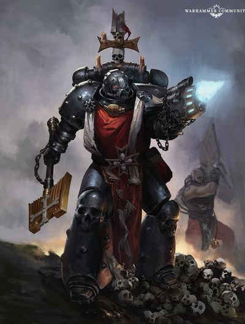

# 0398 黑色圣堂 Black Templars

精校状态：中文行文已逐段精校，部分术语仍为暂定

分类：通用概念 / 帝国 Imperium / 中央政务部 Adeptus Terra / 阿斯塔特修会 Adeptus Astartes

原文来源：https://www.bilibili.com/opus/1110133206489759744

原作者：帝国神选罐头

原文时间：2025年09月08日 14:03

[返回分类目录](目录.md) · [全书目录](../../目录.md)

<!-- A0398-B0001 -->
**英文原文**

The Black Templars are a Second Founding chapter derived from the Imperial Fists. Since its founding, the Black Templars have campaigned on a never-ending crusade.

<!-- /A0398-B0001 -->

<!-- A0398-B0002 -->

原译文

黑色圣堂是帝国之拳的二次建军战团。自成立以来，黑色圣堂一直在进行一场永无止境的远征。

**校订译文**

黑色圣堂是帝国之拳的二次建军战团。自成立以来，黑色圣堂一直在进行一场永无止境的远征。

<!-- /A0398-B0002 -->

<!-- A0398-B0003 图片 -->

<!-- A0398-B0004 图片 -->

<!-- A0398-B0005 -->
**英文原文**

Founding Chapter:Imperial Fists

<!-- /A0398-B0005 -->

<!-- A0398-B0006 -->

原译文

建军战团：帝国之拳

**校订译文**

母团：帝国之拳。

<!-- /A0398-B0006 -->

<!-- A0398-B0007 -->
**英文原文**

Founding:Second Founding

<!-- /A0398-B0007 -->

<!-- A0398-B0008 -->

原译文

建军：二次建军

**校订译文**

建军：二次建军

<!-- /A0398-B0008 -->

<!-- A0398-B0009 -->
**英文原文**

Descendants:Knights Ophidian, Silver Guard (suspected)

<!-- /A0398-B0009 -->

<!-- A0398-B0010 -->

原译文

后裔：巨蟒骑士，银色守卫（疑似）

**校订译文**

后裔：巨蟒骑士，银色守卫（疑似）

<!-- /A0398-B0010 -->

<!-- A0398-B0011 -->
**英文原文**

Chapter Master:Helbrecht

<!-- /A0398-B0011 -->

<!-- A0398-B0012 -->

原译文

战团长：赫尔布雷希特

**校订译文**

战团长：赫尔布雷彻。

<!-- /A0398-B0012 -->

<!-- A0398-B0013 -->
**英文原文**

Homeworld:Fleet-based

<!-- /A0398-B0013 -->

<!-- A0398-B0014 -->

原译文

家园世界：舰基

**校订译文**

基地：舰队。

<!-- /A0398-B0014 -->

<!-- A0398-B0015 -->
**英文原文**

Fortress-Monastery:Eternal Crusader

<!-- /A0398-B0015 -->

<!-- A0398-B0016 -->

原译文

堡垒修道院：永恒远征号

**校订译文**

要塞修道院：永恒远征号

<!-- /A0398-B0016 -->

<!-- A0398-B0017 -->
**英文原文**

Colours:Black with white shoulder pads

<!-- /A0398-B0017 -->

<!-- A0398-B0018 -->

原译文

颜色：黑色，带白色肩甲

**校订译文**

颜色：黑色，带白色肩甲

<!-- /A0398-B0018 -->

<!-- A0398-B0019 -->
**英文原文**

Specialty:Close Combat

<!-- /A0398-B0019 -->

<!-- A0398-B0020 -->

原译文

专业：近身格斗

**校订译文**

专长：近战。

<!-- /A0398-B0020 -->

<!-- A0398-B0021 -->
**英文原文**

Strength:Unknown. More than a codex compliant chapter.

<!-- /A0398-B0021 -->

<!-- A0398-B0022 -->

原译文

力量：未知。不仅仅是一个符合圣典的战团。

**校订译文**

兵力：不详，超过遵循圣典编制的常规战团。

<!-- /A0398-B0022 -->

<!-- A0398-B0023 -->
**英文原文**

Battle Cry:No Pity! No Remorse! No Fear!

<!-- /A0398-B0023 -->

<!-- A0398-B0024 -->

原译文

战吼：无悯！无悔！无惧！

**校订译文**

战吼：无悯！无悔！无惧！

<!-- /A0398-B0024 -->

<!-- A0398-B0025 -->
## History 历史

<!-- /A0398-B0025 -->

<!-- A0398-B0026 -->
### The First Champion 首位帝皇勇士

原题：The First Champion 第一冠军

<!-- /A0398-B0026 -->

<!-- A0398-B0027 -->
**英文原文**

During Horus's attack on the Imperial Palace, the Imperial Fists' primarch, Rogal Dorn chose his First Captain, Sigismund, as the Emperor's Champion; he was given the best armour and weapon and swore a holy duty to challenge the Champions of Chaos, and triumphed over all he met in battle.

<!-- /A0398-B0027 -->

<!-- A0398-B0028 -->

原译文

在荷鲁斯攻击皇宫期间，帝国之拳的原体，罗格·多恩选择了他的第一连长西吉斯蒙德作为帝皇的冠军；他被赋予了最好的盔甲和武器，并发誓要挑战混沌冠军，并战胜他在战斗中遇到的一切。

**校订译文**

荷鲁斯进攻皇宫时，帝国之拳原体罗格·多恩选定第一连长西吉斯蒙德为帝皇勇士，授予他最精良的盔甲与武器。西吉斯蒙德立下神圣誓言，向混沌的冠军挑战，并击败了战场上遇到的每一个对手。

<!-- /A0398-B0028 -->

<!-- A0398-B0029 图片 -->

<!-- A0398-B0030 -->

原译文

Sigismund, the first Champion and founder of the Black Templars. 西吉斯蒙德，第一冠军和黑色圣堂的建立者

**校订译文**

Sigismund, the first Champion and founder of the Black Templars. 西吉斯蒙德，首位帝皇勇士与黑色圣堂创立者。

<!-- /A0398-B0030 -->

<!-- A0398-B0031 -->
### Aftermath of the Heresy 叛乱余波

<!-- /A0398-B0031 -->

<!-- A0398-B0032 -->
**英文原文**

After the Horus Heresy, Roboute Guilliman, the primarch of the Ultramarines, ordered the breakdown of the Space Marine Legions into chapters. Dorn thought Guilliman a coward for not being there during the defence of Terra. Guilliman, in turn, thought Dorn a rebel for refusing to accept the dictates of the new Codex Astartes. Neither would give in. Leman Russ of the Space Wolves and Vulkan of the Salamanders both sided with Dorn, as they did not want their Legions divided, while Corax of the Raven Guard and Jaghatai Khan of the White Scars sided with Guilliman. Again, civil war threatened to split the Imperium.

<!-- /A0398-B0032 -->

<!-- A0398-B0033 -->

原译文

在荷鲁斯叛乱之后，极限战士的原体罗伯特·基里曼下令将星际战士军团分解为不同的战团。多恩认为基里曼是个懦夫，因为他在保卫泰拉时没有在场。反过来，基里曼认为多恩是一名反叛者，因为他拒绝接受新的《阿斯塔特圣典》的规定。太空野狼的黎曼·鲁斯和火蜥蜴的沃坎都站在多恩一边，因为他们不想让他们的军团分裂，而暗鸦守卫的科拉克斯和白色伤疤的察合台可汗站在基里曼一边。内战再次威胁到帝国的分裂。

**校订译文**

荷鲁斯之乱后，极限战士原体罗保特·基里曼下令将星际战士军团拆分为战团。多恩指责基里曼未参与泰拉保卫战，是个懦夫；基里曼则因多恩拒绝新编《阿斯塔特圣典》的规定，视他为叛逆。双方互不相让。不愿拆分自身军团的太空野狼原体黎曼·鲁斯与火蜥蜴原体沃坎支持多恩，暗鸦守卫的科拉克斯和白疤的察合台可汗则支持基里曼。帝国再次面临因内战而分裂的危险。

<!-- /A0398-B0033 -->

<!-- A0398-B0034 -->
**英文原文**

The Imperial Fists were persecuted for their so-called heresies and even fired upon by the Imperial Navy. When civil war seemed all but inevitable, Dorn finally relented and agreed to split his legion. The first Successor Chapters created from the Imperial Fists were the Crimson Fists and the Black Templars.

<!-- /A0398-B0034 -->

<!-- A0398-B0035 -->

原译文

帝国之拳因其所谓的异端而受到迫害，甚至被帝国海军开火。当内战似乎不可避免时，多恩终于让步了，同意分裂他的军团。从帝国之拳中创建的第一批子战团是绯红之拳和黑色圣堂。

**校订译文**

帝国之拳因所谓“异端行为”遭到逼迫，甚至被帝国海军炮击。当内战几乎已不可避免时，多恩终于让步，同意拆分军团。绯红之拳与黑色圣堂成为最早建立的帝国之拳子战团。

<!-- /A0398-B0035 -->

<!-- A0398-B0036 -->
### Creation of the Black Templars 黑色圣堂的建立

<!-- /A0398-B0036 -->

<!-- A0398-B0037 -->
**英文原文**

Sigismund led the more zealous of the Imperial Fists with him to the founding of the Black Templars, and became their first High Marshal. Sigismund swore an oath upon leaving Terra, that he and his new chapter would prove their loyalty by never resting in his duties against enemies of the Emperor. Sigismund spent much of this time remaining vigilant over the Cadian Gate, insisting that Horus' Traitors would one day return to plague the Imperium. Despite the dismissals of many Imperial officials, Sigismund was proven right when Abaddon returned in the First Black Crusade. The Black Templar fleet was waiting, and a massive battle erupted that saw Sigismund slain by Abaddon himself.

<!-- /A0398-B0037 -->

<!-- A0398-B0038 -->

原译文

西吉斯蒙德带领更狂热的帝国之拳与他一起建立了黑色圣堂，并成为他们的第一位至高元帅。西吉斯蒙德在离开泰拉时宣誓，他和他的新战团将对帝皇之敌从不放松职责，以此证明他们的忠诚。西吉斯蒙德大部分时间都在卡迪亚之门保持警戒，坚持认为荷鲁斯的叛徒总有一天会回来折磨帝国。尽管许多帝国官员不予理会，但当阿巴顿在第一次黑色远征中返回时，西吉斯蒙德被证明是正确的。黑色圣堂舰队正在等待，一场大规模的战斗爆发了，西吉斯蒙德被阿巴顿本人杀死。

**校订译文**

西吉斯蒙德率帝国之拳中最狂热的战士建立黑色圣堂，成为首任至高元帅。离开泰拉时，他立誓与新战团永不停止征讨帝皇之敌，以此证明忠诚。此后，他长期警戒卡迪亚之门，坚信荷鲁斯的叛徒终将归来，再祸帝国。虽然许多帝国官员对此不屑一顾，阿巴顿率第一次黑色远征归来时，却印证了他的预言。黑色圣堂舰队严阵以待，双方爆发大战，西吉斯蒙德最终被阿巴顿亲手杀死。

<!-- /A0398-B0038 -->

<!-- A0398-B0039 -->
**英文原文**

Since his death, every High Marshal has renewed Sigismund's oath of never-ending crusade and as such, the Black Templars' Crusade has continued for over ten thousand years.

<!-- /A0398-B0039 -->

<!-- A0398-B0040 -->

原译文

自他牺牲以来，每一位至高元帅都重申了西吉斯蒙德无休止的远征的誓言，因此，黑色圣堂的远征已经持续了一万多年。

**校订译文**

自他牺牲以来，每一位至高元帅都重申了西吉斯蒙德无休止的远征的誓言，因此，黑色圣堂的远征已经持续了一万多年。

<!-- /A0398-B0040 -->

<!-- A0398-B0041 -->
**英文原文**

The symbol of the Black Templars - a black cross - was a mark of the Imperial Fists Legion's Veterans during the Horus Heresy. After the end of the Heresy and the creating of the Black Templars Chapter, they honourably accepted this new symbol.

<!-- /A0398-B0041 -->

<!-- A0398-B0042 -->

原译文

黑色圣堂的标志 — 一个黑色十字 — 是荷鲁斯叛乱时期帝国之拳军团老兵的标志。叛乱结束和黑色圣堂成立后，他们光荣地接受了这个新的象征。

**校订译文**

黑色圣堂的黑色十字徽记，原是荷鲁斯之乱时期帝国之拳军团老兵的标志。叛乱结束、黑色圣堂建立后，战团以继承这一标志为荣。

<!-- /A0398-B0042 -->

<!-- A0398-B0043 -->
**英文原文**

In 998.M41, the Black Templars would briefly come to blows with the Dark Angels, after the Templars refused to hand over a prisoner that the Dark Angels suspected to be Cypher. The incident is reported to the Adeptus Terra, and Inquisitor Archibald was assigned to lead the inquiry.

<!-- /A0398-B0043 -->

<!-- A0398-B0044 -->

原译文

998.M41，在黑色圣堂拒绝交出一名被黑暗天使怀疑是塞弗的囚犯后，黑色圣堂与黑暗天使短暂发生冲突。这一事件被报告给了中央政务部，审判官阿奇博尔德被指派领导调查。

**校订译文**

998.M41，在黑色圣堂拒绝交出一名被黑暗天使怀疑是塞弗的囚犯后，黑色圣堂与黑暗天使短暂发生冲突。这一事件被报告给了中央政务部，审判官阿奇博尔德被指派领导调查。

<!-- /A0398-B0044 -->

<!-- A0398-B0045 -->
### Age of the Dark Imperium 黑暗帝国时代

<!-- /A0398-B0045 -->

<!-- A0398-B0046 -->
**英文原文**

The Black Templars found themselves spread across the Galaxy when the Great Rift opened. By the end of the Noctis Aeterna, several Crusades were discovered to have vanished altogether while even those within the Imperium Sanctus found themselves scattered. Rather than using the reactivation of the Astronomican as a reprieve to consolidate and recuperate, the Black Templars instead undertook a vicious purge against the new wave of mutation and heresy within the Imperium Sanctus left in the wake of the Noctis Aeterna. Other Crusades redoubled their efforts against the enemies of Mankind, and new Chapter Keeps were raised.

<!-- /A0398-B0046 -->

<!-- A0398-B0047 -->

原译文

当大裂隙打开时，黑色圣堂发现自己遍布银河系。到永恒之夜结束时，发现几只远征舰队完全消失了，而即使是帝国圣疆内的远征舰队也发现自己四散了。黑色圣堂没有将星炬的重新激活作为巩固和恢复的延缓，而是对永恒之夜事件后留下的帝国圣疆内的新一波突变和异端进行了恶毒的清洗。其他远征舰队加倍努力对抗人类之敌，并提出了新的战团维持。

**校订译文**

大裂隙开启时，黑色圣堂的远征军散布银河。永恒之夜结束后，数支远征军被发现已彻底失踪，连帝国圣疆内的部队也四散失联。星炬重新点亮后，黑色圣堂没有停下来休整集结，而是立即严厉清剿永恒之夜遗留在帝国圣疆的新一轮变异与异端。其他远征军也加紧征讨人类之敌，并修筑了新的战团堡垒。

**校注：** Chapter Keeps 为战团堡垒，非维持或维持行动；Crusades 在分兵语境指远征军，不一律加舰队。

<!-- /A0398-B0047 -->

<!-- A0398-B0048 -->
**英文原文**

It was during this time that Roboute Guilliman's Torchbearer Fleets discovered the Black Templars and delivered the Primaris Space Marines to them. Many thought that the fanatical Black Templars would reject the newcomers, and fearing conflict Guilliman himself met High Marshal Helbrecht aboard the Eternal Crusader. The High Marshal was in the midst of pursuing the Ork Warlord Ghazghkull Thraka, and was impatient to conduct diplomatic matters. In the ensuing meeting, Guilliman was surprised by the willingness of Helbrecht to recognise the value of the Primaris line, while Guilliman did not turn out to be the commanding despot that the High Marshal expected. Guilliman gave Helbrecht the choice of accepting Primaris Space Marines and reminded the High Marshal that he was responsible to the whole of Mankind's realm as opposed to his own personal vendettas with the Orks. In the end, Helbrecht accepted the Primaris into his ranks and promoted a number of his own Sword Brethren to Marshals in order to command new Crusades made up of former Greyshields. Helbrecht's acceptance of the Primaris Space Marines helped convince the various Crusade Fleets to also incorporate these new warriors into their ranks. However, the incorporation of Primaris Space Marines did not go entirely smoothly for the Chapter, most infamously in the Angevin Crusade.

<!-- /A0398-B0048 -->

<!-- A0398-B0049 -->

原译文

正是在这段时间里，罗伯特·基里曼的火炬手舰队发现了黑色圣堂，并将原铸星际战士交给了他们。许多人认为狂热的黑色圣堂会拒绝新来者，出于对冲突的担忧，基里曼本人在永恒远征号上会见了至高元帅赫尔布雷希特。这位至高元帅正在追捕欧克军阀碎骨者萨拉卡，急于处理外交事务。在随后的会议中，基里曼对赫尔布雷希特愿意承认原铸路线的价值感到惊讶，而基里曼并没有成为至高元帅所预期的发号施令的暴君。基里曼让赫尔布雷希特选择接受原铸星际战士，并提醒至高元帅，他对整个人类之域负责，而不是他自己与欧克的个人恩怨。最后，赫尔布雷希特接受了原铸加入他的队伍，并将他自己的一些剑刃兄弟会提拔为元帅，以指挥由前灰盾组成的新远征舰队。赫尔布雷希特对原铸星际战士的接受有助于说服各个远征舰队也将这些新战士纳入他们的队伍。然而，在安茹远征中，原铸星际战士的合并并不完全顺利。

**校订译文**

这一时期，罗保特·基里曼的持炬舰队找到黑色圣堂，将原铸星际战士送至各部。许多人担心狂热的黑色圣堂会拒绝新人，基里曼为避免冲突，亲自登上永恒远征号会晤至高元帅赫尔布雷彻。赫尔布雷彻当时正追击欧克军阀碎骨者·斯拉卡，无心花时间处理外交。会面中，他却愿意承认原铸战士的价值，令基里曼颇感意外；而基里曼也并非他预想中那位只会发号施令的暴君。原体让他自行选择是否接纳原铸，并提醒他：至高元帅肩负的是整个人类疆域，而非只顾与欧克的私仇。赫尔布雷彻最终接纳了原铸战士，还将数名圣剑兄弟会修士晋升为元帅，指挥由昔日灰盾组成的新远征军。他的决定促使其他远征舰队也接受新人。不过，战团吸纳原铸的过程并非处处顺利，最恶名昭彰的例子便是安茹远征。

**校注：** impatient to conduct diplomatic matters 表示无耐心处理外交，原“急于处理”反转。灰盾为原铸部队原先身份。

<!-- /A0398-B0049 -->

<!-- A0398-B0050 -->
**英文原文**

There has been some talk that Black Templars are especially resilient in crossing the Rubicon Primaris, and that this might be a reward for their faith in the Emperor. It is unknown if this is verified fact or simply a rumour.

<!-- /A0398-B0050 -->

<!-- A0398-B0051 -->

原译文

有人说，黑色圣堂在跨越原铸界限时特别有韧性，这可能是对他们对帝皇信仰的奖励。目前尚不清楚这是事实还是谣言。

**校订译文**

有人声称，黑色圣堂在跨越原铸界限时格外坚韧，这可能是帝皇对其信仰的奖赏。但这一说法是否属实，抑或仅是传闻，尚无定论。

<!-- /A0398-B0051 -->

<!-- A0398-B0052 图片 -->

<!-- A0398-B0053 -->

原译文

Black Templars Primaris Space Marines 黑色圣堂原铸星际战士

**校订译文**

Black Templars Primaris Space Marines 黑色圣堂原铸星际战士

<!-- /A0398-B0053 -->

<!-- A0398-B0054 -->
### Notable Crusades & Campaigns 著名远征&战役

<!-- /A0398-B0054 -->

<!-- A0398-B0055 -->
**英文原文**

Early M31: The Great Purging — In one of the Black Templars' first actions as an independent Chapter, they purged the Donatello System of Chaos holdouts (including a Night Lords warband) towards the end of the Scouring.

<!-- /A0398-B0055 -->

<!-- A0398-B0056 -->

原译文

大净化 - 在黑色圣堂作为一个独立战团的第一次行动中，他们在大清洗结束时净化了混沌的多纳泰罗星系（包括一个午夜领主战帮）。

**校订译文**

M31早期：大净化。大清洗接近尾声时，黑色圣堂作为独立战团参加最初的几场行动之一，清除了多纳泰罗星系残留的混沌势力，其中包括一支午夜领主战帮。

**校注：** one of ... first actions 为最初的行动之一，非唯一第一次。

<!-- /A0398-B0056 -->

<!-- A0398-B0057 -->
**英文原文**

781.M31: The First Black Crusade — A massive Black Templars fleet under Sigismund himself defended the Cadian Gate against the first of Abaddon's incursions. The Black Templars were ultimately defeated and Sigismund was slain in a duel with Abaddon.

<!-- /A0398-B0057 -->

<!-- A0398-B0058 -->

原译文

第一次黑色远征 — 西吉斯蒙德亲自率领的一支庞大的黑色圣堂舰队保卫了卡迪亚之门，抵御了阿巴顿的第一次入侵。黑色圣堂最终被击败，西吉斯蒙德在与阿巴顿的决斗中被杀。

**校订译文**

781.M31：第一次黑色远征。西吉斯蒙德亲率庞大的黑色圣堂舰队，在卡迪亚之门抵御阿巴顿首次入侵。战团最终败北，西吉斯蒙德在与阿巴顿的决斗中战死。

<!-- /A0398-B0058 -->

<!-- A0398-B0059 -->
**英文原文**

544.M32: The War of the Beast — During the conflict, the Black Templars contributed a portion of their strength to rebuild the Imperial Fists.

<!-- /A0398-B0059 -->

<!-- A0398-B0060 -->

原译文

野兽之战——在冲突期间，黑色圣堂贡献了一部分力量来重建帝国之拳。

**校订译文**

544.M32：野兽战争。黑色圣堂抽调一部分兵力，帮助重建帝国之拳。

<!-- /A0398-B0060 -->

<!-- A0398-B0061 -->

原译文

401.M34: The Howling. 咆哮

**校订译文**

401.M34: The Howling. 咆哮

<!-- /A0398-B0061 -->

<!-- A0398-B0062 -->
**英文原文**

M36: The Wars of Apostasy, also known as the Terran Crusade.

<!-- /A0398-B0062 -->

<!-- A0398-B0063 -->

原译文

叛教战争，也称为泰拉远征。

**校订译文**

M36：叛教战争，又称泰拉远征。

<!-- /A0398-B0063 -->

<!-- A0398-B0064 -->

原译文

398.M41: The Battle for Geratomro 格拉托姆罗之战

**校订译文**

398.M41: The Battle for Geratomro 格拉托姆罗之战

<!-- /A0398-B0064 -->

<!-- A0398-B0065 -->

原译文

833.M41: The Vinculus Crusade. 文克鲁斯远征

**校订译文**

833.M41: The Vinculus Crusade. 文克鲁斯远征

<!-- /A0398-B0065 -->

<!-- A0398-B0066 -->

原译文

930.M41: Battle of Schrodinger VII. 薛定谔七号之战

**校订译文**

930.M41: Battle of Schrodinger VII. 薛定谔七号之战

<!-- /A0398-B0066 -->

<!-- A0398-B0067 -->

原译文

???.M41: The Ghoul Stars Crusade. 食尸鬼群星远征

**校订译文**

???.M41: The Ghoul Stars Crusade. 食尸鬼群星远征

<!-- /A0398-B0067 -->

<!-- A0398-B0068 -->
**英文原文**

???.M41: The Kotov Crusade — A squad of Black Templars took part in Lexell Kotov's expedition to discover the fate of the lost fleet of Vettius Telok. They were commanded by Reclusiarch Kul Gilad.

<!-- /A0398-B0068 -->

<!-- A0398-B0069 -->

原译文

科托夫远征 — 一队黑色圣堂参加了莱克塞尔·科托夫的探索，以发现失落的维提乌斯·泰洛克舰队的命运。他们由隐修长库尔·吉拉德指挥。

**校订译文**

???.M41：科托夫远征。隐修长库尔·吉拉德率一队黑色圣堂参加莱克塞尔·科托夫的探险，追查维提乌斯·泰洛克失踪舰队的下落。

<!-- /A0398-B0069 -->

<!-- A0398-B0070 -->
**英文原文**

998.M41: The Third War for Armageddon — The Black Templars fielded three Crusades. In addition, High Marshal Helbrecht was appointed Commander of the combined Space Marine fleet that supported Battlefleet Armageddon against the Orks in void skirmishes throughout the Armageddon System.

<!-- /A0398-B0070 -->

<!-- A0398-B0071 -->

原译文

第三次阿玛吉多顿战争 — 黑色圣堂发动了三次远征。此外，至高元帅赫尔布雷希特被任命为星际战士联合舰队的指挥官，该舰队在整个阿玛吉多顿星系的小规模虚空战中支援阿玛吉多顿舰队对抗欧克。

**校订译文**

998.M41：第三次阿玛吉多顿战争。黑色圣堂投入三支远征军。至高元帅赫尔布雷彻还获任星际战士联合舰队指挥官，在阿玛吉多顿星系各处的虚空战中，支援阿玛吉多顿战斗舰队迎战欧克。

<!-- /A0398-B0071 -->

<!-- A0398-B0072 -->

原译文

Solemnus Crusade 庄严星远征

**校订译文**

Solemnus Crusade 庄严星远征

<!-- /A0398-B0072 -->

<!-- A0398-B0073 -->
**英文原文**

Helsreach Crusade — High Marshal Helbrecht tasked Reclusiarch Merek Grimaldus with commanding 100 Marines in the defence of Hive Helsreach. Grimaldus was the only survivor.

<!-- /A0398-B0073 -->

<!-- A0398-B0074 -->

原译文

赫尔斯利奇远征 — 至高元帅赫尔布雷希特指派隐修长梅里克·格瑞马度斯指挥100名星际战士保卫赫尔斯利奇巢都。格瑞马度斯是唯一的幸存者。

**校订译文**

赫尔斯利奇远征。至高元帅赫尔布雷彻命隐修长梅瑞克·格里玛度斯率100名星际战士保卫赫尔斯利奇巢都；格里玛度斯成为其中唯一的幸存者。

**校注：** only survivor 限于该段所述星际战士部队，不表示巢都所有居民及其他守军仅他一人存活。

<!-- /A0398-B0074 -->

<!-- A0398-B0075 -->

原译文

Battle of Golgotha 各各他之战

**校订译文**

Battle of Golgotha 各各他之战

<!-- /A0398-B0075 -->

<!-- A0398-B0076 -->
**英文原文**

999.M41: The 13th Black Crusade — The Black Templars contribute a Crusade Fleet to counter not only Chaos forces, but also the nearby Ork Green Kroosade.

<!-- /A0398-B0076 -->

<!-- A0398-B0077 -->

原译文

第13次黑色远征 — 黑色圣堂派遣了一支远征舰队，不仅要对抗混沌势力，还要对抗附近的奥克·格林·克罗萨德。

**校订译文**

999.M41：第十三次黑色远征。黑色圣堂派出一支远征舰队，同时迎战混沌部队与附近的欧克“绿色远征”。

<!-- /A0398-B0077 -->

<!-- A0398-B0078 -->
**英文原文**

~999.M41: The Ultramar Campaign - Marius Amalrich emerges as the sole survivor of his Crusade after taking part in the campaign that saw Roboute Guilliman revived.

<!-- /A0398-B0078 -->

<!-- A0398-B0079 -->

原译文

奥特拉玛战役 - 马吕斯·阿马尔里奇在参加了让罗伯特·基里曼复活的战役后，成为远征的唯一幸存者。

**校订译文**

约999.M41：奥特拉玛战役。马吕斯·阿马尔里奇参与了促成罗保特·基里曼复生的战役，最后成为其所属远征军唯一的幸存者。

<!-- /A0398-B0079 -->

<!-- A0398-B0080 -->

原译文

???.M42: The Shrine World Crusades 圣地世界远征

**校订译文**

???.M42: The Shrine World Crusades 圣地世界远征

<!-- /A0398-B0080 -->

<!-- A0398-B0081 -->

原译文

???.M42: The Battle of the Ophelia System 奥菲利亚星系之战

**校订译文**

???.M42: The Battle of the Ophelia System 奥菲利亚星系之战

<!-- /A0398-B0081 -->

<!-- A0398-B0082 -->
**英文原文**

???.M42: The Battle of Ophelia VII — The Black Templars aid the Indomitus Crusade in liberating the Holy World of Ophelia VII.

<!-- /A0398-B0082 -->

<!-- A0398-B0083 -->

原译文

奥菲利亚七号之战 — 黑色圣堂协助不屈远征解放了奥菲利亚七号神圣世界。

**校订译文**

???.M42：奥菲利亚七号之战。黑色圣堂支援不屈远征，解放这颗神圣世界。

<!-- /A0398-B0083 -->

<!-- A0398-B0084 -->

原译文

???.M42: The Battle of San Leor 圣莱奥尔之战

**校订译文**

???.M42: The Battle of San Leor 圣莱奥尔之战

<!-- /A0398-B0084 -->

<!-- A0398-B0085 -->
**英文原文**

???.M42: The Ophelian Crusade. Templars forces again come to the aid of Ophelia VII, this time against the Night Lords.

<!-- /A0398-B0085 -->

<!-- A0398-B0086 -->

原译文

奥菲利亚远征。黑色圣堂部队再次帮助奥菲利亚七号，这次是对抗午夜领主。

**校订译文**

???.M42：奥菲利亚远征。黑色圣堂再次驰援奥菲利亚七号，这次迎战的是午夜领主。

<!-- /A0398-B0086 -->

<!-- A0398-B0087 -->
**英文原文**

???.M42: The Angevin Crusade — Turns to mutiny over the issue of Primaris Space Marines.

<!-- /A0398-B0087 -->

<!-- A0398-B0088 -->

原译文

安茹远征 — 在原铸星际战士问题上发生了哗变。

**校订译文**

???.M42：安茹远征。远征军因是否接纳原铸星际战士的问题发生兵变。

<!-- /A0398-B0088 -->

<!-- A0398-B0089 -->
**英文原文**

???.M42: The War of Beasts — The Black Templars send a company strength formation on Vigilus.

<!-- /A0398-B0089 -->

<!-- A0398-B0090 -->

原译文

野兽之战 — 黑色圣堂派了一个连队在警戒星集结。

**校订译文**

???.M42：野兽之战。黑色圣堂向警戒星派出一支连级规模的部队。

<!-- /A0398-B0090 -->

<!-- A0398-B0091 -->
**英文原文**

???.M42: The Talledus War — Forces from the Rutherian Crusade under Castellan Dramos pursue actions against the Word Bearers, Iron Warriors, and Night Lords in the Talledus System.

<!-- /A0398-B0091 -->

<!-- A0398-B0092 -->

原译文

塔勒都斯战争 — 德拉莫斯堡主领导下的卢瑟瑞安远征对塔勒都斯星系中的怀言者、钢铁勇士和午夜领主采取行动。

**校订译文**

???.M42：塔勒都斯战争。德拉莫斯堡主率卢瑟瑞安远征军的部队，在塔勒都斯星系迎战怀言者、钢铁勇士和午夜领主。

<!-- /A0398-B0092 -->

<!-- A0398-B0093 -->

原译文

???.M42: The War in the Pariah Nexus 驱灵死域战争

**校订译文**

???.M42: The War in the Pariah Nexus 驱灵死域战争

<!-- /A0398-B0093 -->

<!-- A0398-B0094 -->

原译文

???.M42' The defense of Crucible 熔炉防御

**校订译文**

???.M42' The defense of Crucible 熔炉防御

<!-- /A0398-B0094 -->

<!-- A0398-B0095 -->

原译文

???.M42: The Octarius War 奥克塔琉斯战争

**校订译文**

???.M42: The Octarius War 奥克塔琉斯战争

<!-- /A0398-B0095 -->

<!-- A0398-B0096 -->

原译文

???.M42: The Nachmund Rift War 纳克蒙德走廊战争

**校订译文**

???.M42: The Nachmund Rift War 纳克蒙德走廊战争

<!-- /A0398-B0096 -->

<!-- A0398-B0097 -->

原译文

???.M42: The Arks of Omen Campaign 噩兆方舟战役

**校订译文**

???.M42: The Arks of Omen Campaign 噩兆方舟战役

<!-- /A0398-B0097 -->

<!-- A0398-B0098 -->
**英文原文**

???.M42 - The Fourth Tyrannic War including the Battle of Bastior

<!-- /A0398-B0098 -->

<!-- A0398-B0099 -->

原译文

第四次泰伦战争包括巴斯蒂奥之战

**校订译文**

???.M42：第四次泰伦战争，包括巴斯蒂奥之战。

<!-- /A0398-B0099 -->

<!-- A0398-B0100 -->
**英文原文**

???.M42 - The Season of Blood. Helbrecht leads a return expedition to Armageddon to combat a renewed Chaos offensive led by Angron.

<!-- /A0398-B0100 -->

<!-- A0398-B0101 -->

原译文

鲜血季节。赫尔布雷希特率领远征军返回阿玛吉多顿，以对抗由安格隆领导的新一轮混沌攻势。

**校订译文**

???.M42：血之季节。赫尔布雷彻率军返回阿玛吉多顿，迎战安格隆领导的新一轮混沌攻势。

<!-- /A0398-B0101 -->

<!-- A0398-B0102 -->
## Doctrines and Codex Adherence 教义与遵守圣典

<!-- /A0398-B0102 -->

<!-- A0398-B0103 -->
**英文原文**

The Black Templars are among one of the rarer Chapters that worship the Emperor of Mankind as a god and follow the Imperial Creed.

<!-- /A0398-B0103 -->

<!-- A0398-B0104 -->

原译文

黑色圣堂是少数将人类帝皇视为神并遵循帝国信条的团体之一。

**校订译文**

黑色圣堂是少数将人类帝皇奉为神明、遵循帝国教义的星际战士战团之一。

<!-- /A0398-B0104 -->

<!-- A0398-B0105 图片 -->

<!-- A0398-B0106 -->

原译文

Black Templars going into battle 黑色圣堂投入战斗

**校订译文**

Black Templars going into battle 黑色圣堂投入战斗

<!-- /A0398-B0106 -->

<!-- A0398-B0107 -->
**英文原文**

By their doctrine, the Black Templars abhor the traitor, the alien and the mutant. The last category includes psykers, but Black Templars do use psykers in other non-combatant roles, such as Astropaths and Navigators. Black Templars view these beings with special reverence as they see them as able to commune directly with the Emperor. The Black Templars are also one of the few Chapters to not utilize Librarians since the psychic catastrophe known as The Howling.

<!-- /A0398-B0107 -->

<!-- A0398-B0108 -->

原译文

根据他们的教义，黑色圣堂憎恶叛徒、外星人和变种人。最后一类包括灵能者，但黑色圣堂确实在其他非战斗角色中使用灵能者。黑色圣堂对这些生物怀有特殊的敬意，因为他们认为这些生物能够直接与帝皇交流。自被称为咆哮的灵能灾难以来，黑色圣堂也是少数几个没有使用智库的战团之一。

**校订译文**

黑色圣堂的教义憎恶叛徒、异形与变种人，灵能者也被归入最后一类。不过，战团仍使用星语者和导航员等承担非战斗职责的灵能者。他们相信这些人能够直接与帝皇沟通，因而怀有特殊敬意。自“咆哮”灵能灾难之后，黑色圣堂也成为少数不设智库员的战团之一。

**校注：** 补回原译漏失的星语者与导航员两类具体人员。战团如何看待他们及无智库的原因按源文版本保留。

<!-- /A0398-B0108 -->

<!-- A0398-B0109 -->
**英文原文**

The Black Templars place great emphasis on close combat prowess and honour. As such they can often be seen charging into suicidal situations to avenge fallen comrades. Black Templar Marines also set themselves apart from standard Codex doctrine by including Neophytes into squads of fully initiated Marines to help teach them the ways of battle and the art of combat.

<!-- /A0398-B0109 -->

<!-- A0398-B0110 -->

原译文

黑色圣堂非常重视近战能力和荣誉。因此，他们经常会陷入自杀的境地，为逝去的战友报仇。黑色圣堂战士还将自己与标准的圣典学说区分开来，将新进者纳入全部为信徒战士的小队，帮助他们学习战斗方式和战斗艺术。

**校订译文**

黑色圣堂极重视近战本领与荣誉，常为替阵亡同袍复仇而冲入近乎必死的战局。他们还有一项不同于常规圣典编制的做法：将新进者安排进由正式战士组成的小队，在实战中教授他们战术与战斗技艺。

<!-- /A0398-B0110 -->

<!-- A0398-B0111 -->
**英文原文**

The Black Templars were the first chapter to find the design for the Land Raider Crusader and were the first chapter to make use of it. The Crusader design replaces the lascannons mounted on standard Land Raiders with Hurricane-pattern bolters, placing a greater emphasis on anti-infantry firepower and freeing up greater space within to carry larger squads.

<!-- /A0398-B0111 -->

<!-- A0398-B0112 -->

原译文

黑色圣堂是第一个找到兰德掠袭者十字军设计的人，也是第一个使用它的人。十字军的设计用飓风型爆矢枪取代了安装在标准兰德掠袭者上的激光炮，更加强调反步兵火力，并释放了更大的空间来携带更大的小队。

**校订译文**

黑色圣堂最早发现并使用十字军型兰德掠袭者战车的设计。该型将标准兰德掠袭者上的激光炮替换为飓风型爆矢枪，强化反步兵火力，同时腾出更多舱内空间，以运载更大的小队。

<!-- /A0398-B0112 -->

<!-- A0398-B0113 -->
**英文原文**

The Black Templars are also notorious for defying Codex doctrine that states that a chapter may only number 1000 battle brothers. This is partly due to the divided nature of the chapter, being spread out everywhere on separate crusades (usually consisting of several hundred Battle-Brothers) and no one has thus been able to keep track of their exact numbers. However, it has been estimated that there may be several thousand Black Templars Companies spread out around the galaxy - an almost unstoppable force if gathered at one place and cause for the Inquisition to keep a close eye on the Black Templars.

<!-- /A0398-B0113 -->

<!-- A0398-B0114 -->

原译文

黑色圣堂也因藐视圣典学说而著名，该学说规定一个战团只能有1000名战斗兄弟。这在一定程度上是由于该战团的分裂性质，在单独的远征中分散在各地（通常由几百名战斗兄弟组成），因此没有人能够跟踪他们的确切人数。然而，据估计，银河系周围可能分布着数千个黑色圣堂连队 — 如果聚集在一个地方，这是一股几乎不可阻挡的力量，导致审判庭密切关注黑色圣堂。

**校订译文**

黑色圣堂也以不遵守圣典规定的千名战斗兄弟上限而闻名。原因之一是战团分散为诸多独立远征军，遍布各地；每支远征军通常有数百名战士，外人因而难以核实总数。本段甚至引述一种估计，称银河中可能分布着数千个黑色圣堂连队。若全部集结，这会成为几乎无人能挡的力量，也使审判庭始终密切关注战团。

**校注：** 源文明写 several thousand Black Templars Companies（数千个连），与文末列举的5,000—6,000人或1,000人记述差异极大；保留并明确为本段估计，不能擅把连改成人。

<!-- /A0398-B0114 -->

<!-- A0398-B0115 -->
### Vows of the Black Templars 黑色圣堂誓言

<!-- /A0398-B0115 -->

<!-- A0398-B0116 -->

原译文

Suffer Not the Unclean to Live 不洁者格杀勿论

**校订译文**

Suffer Not the Unclean to Live 不洁者格杀勿论

<!-- /A0398-B0116 -->

<!-- A0398-B0117 -->

原译文

Uphold the Honour of the Emperor 维护帝皇的荣誉

**校订译文**

Uphold the Honour of the Emperor 维护帝皇的荣誉

<!-- /A0398-B0117 -->

<!-- A0398-B0118 -->

原译文

Abhor the Witch. Destroy the Witch 憎恶巫师。消灭巫师

**校订译文**

Abhor the Witch. Destroy the Witch 憎恶巫师。消灭巫师

<!-- /A0398-B0118 -->

<!-- A0398-B0119 -->

原译文

Accept Any Challenge, No Matter the Odds 接受任何挑战，无论概率如何

**校订译文**

Accept Any Challenge, No Matter the Odds 接受一切挑战，无论胜算如何

<!-- /A0398-B0119 -->

<!-- A0398-B0120 -->
### Combat Doctrines 战斗学说

<!-- /A0398-B0120 -->

<!-- A0398-B0121 -->
**英文原文**

The Black Templars have continued in the style of their first High Marshal, preferring close combat over ranged warfare. This is further emphasised by the fanaticism of Black Templars Initiates, whose righteous anger makes them impulsive and headstrong.

<!-- /A0398-B0121 -->

<!-- A0398-B0122 -->

原译文

黑色圣堂延续了他们的第一位至高元帅的风格，更喜欢近距离战斗而不是远程作战。黑色圣堂的狂热主义进一步强调了这一点，他们的正义之怒使他们冲动而固执。

**校订译文**

黑色圣堂延续了首任至高元帅的战斗风格，偏爱近身搏杀。进阶者的狂热使这一倾向更加鲜明：他们自认正义的怒火，常令其行事冲动、刚愎执拗。

<!-- /A0398-B0122 -->

<!-- A0398-B0123 -->
**英文原文**

When making war, the Crusade will focus on two main tactics. The first is orbital assault; where the Crusade will use drop pods and Thunderhawks to perform a mass-landing in the wake of a heavy orbital bombardment. If resistance is still strong after this, the Templars will land their heavy armour and launch an armoured spearhead against the weakest link in the enemy's defensive line, using Crusader-pattern Land Raiders.

<!-- /A0398-B0123 -->

<!-- A0398-B0124 -->

原译文

在发动战争时，远征军将侧重于两种主要战术。第一种是轨道攻击；远征军将使用空投舱和雷鹰在重型轨道轰炸后进行大规模着陆。如果在此之后抵抗仍然很强，黑色圣堂将使用十字军型兰德掠袭者，着陆他们的重型装甲，并向敌人防线上最薄弱的环节发射装甲矛头。

**校订译文**

远征军作战时主要使用两种战术。首先是轨道突击：猛烈轨道轰炸之后，利用空降舱与雷鹰实施大规模登陆。若敌军仍顽强抵抗，黑色圣堂便将重装部队运至地表，以十字军型兰德掠袭者战车组成装甲突击矛头，冲击敌军防线最薄弱的环节。

<!-- /A0398-B0124 -->

<!-- A0398-B0125 -->
**英文原文**

As part of their dedication to the Emperor and their Crusade, the Black Templars swear fell oaths of faith and protection. Before a battle, it is considered customary to renew one of these oaths, the particular vow serving as a focus on the particular aspect of their duties considered to be necessary to ensure success.

<!-- /A0398-B0125 -->

<!-- A0398-B0126 -->

原译文

作为他们对帝皇和远征的奉献的一部分，黑色圣堂宣誓信仰和保护。在战斗之前，通常会重申其中一个誓言，这个特定的誓言侧重于他们被认为是确保成功所必需的职责的特定方面。

**校订译文**

为表明对帝皇与远征使命的献身，黑色圣堂立下严厉的信仰与守护誓言。每次战斗前，他们通常重申其中一项，以此集中意志，履行当下最能确保胜利的那一方面职责。

<!-- /A0398-B0126 -->

<!-- A0398-B0127 -->
## Chapter Disposition 战团布置

<!-- /A0398-B0127 -->

<!-- A0398-B0128 -->
**英文原文**

The Black Templars are not organised like a typical Codex Chapter. They give mere lip service to Roboute Guilliman's Codex Astartes, instead operating many roaming Crusades Fleets that battle the enemies of mankind across the Galaxy. The exact size of the Chapter is unknown save only to the High Marshal himself. There is little doubt however that the Black Templars are far larger than a standard Codex Chapter.

<!-- /A0398-B0128 -->

<!-- A0398-B0129 -->

原译文

黑色圣堂的组织方式不像典型的圣典战团。他们只是口头上支持罗伯特·基里曼的阿斯塔特圣典，而是经营着许多漫游的远征舰队，在银河系与人类之敌作战。除了至高元帅本人，该战团的确切规模尚不清楚。然而，毫无疑问，黑色圣堂的规模远远大于标准的圣典战团。

**校订译文**

黑色圣堂的组织不同于典型圣典战团。他们对罗保特·基里曼的《阿斯塔特圣典》仅作口头遵从，实际则以众多游弋的远征舰队，在银河各地征讨人类之敌。只有至高元帅本人知道战团的确切人数，但其规模远超常规圣典战团，这一点几乎没有疑问。

<!-- /A0398-B0129 -->

<!-- A0398-B0130 图片 -->

<!-- A0398-B0131 -->

原译文

Organization of a typical Black Templar Crusade, in this case the Arkron Crusade 一个典型黑色圣堂远征军的组织，这次是阿克隆远征的

**校订译文**

Organization of a typical Black Templar Crusade, in this case the Arkron Crusade 一个典型黑色圣堂远征军的组织，这次是阿克隆远征的

<!-- /A0398-B0131 -->

<!-- A0398-B0132 -->
**英文原文**

These Crusades are in turn typically broken down into Fighting Companies, which may number from a few dozen to a hundred Space Marines, as well as their vehicles and support.

<!-- /A0398-B0132 -->

<!-- A0398-B0133 -->

原译文

这些远征军通常又分为战斗连队，其数量可能从几十到一百名星际战士，以及他们的载具和支援。

**校订译文**

各支远征军通常再划分为若干战斗连，每连有数十至一百名星际战士，并配有载具与支援力量。

<!-- /A0398-B0133 -->

<!-- A0398-B0134 -->
### Chapter Command 战团指挥

<!-- /A0398-B0134 -->

<!-- A0398-B0135 -->
**英文原文**

The High Marshal is the equivalent of a Chapter Master; he is responsible for monitoring the progress of all Current Crusades.

<!-- /A0398-B0135 -->

<!-- A0398-B0136 -->

原译文

至高元帅相当于一个战团长；他负责监督所有当前远征的进展。

**校订译文**

至高元帅相当于一个战团长；他负责监督所有当前远征的进展。

<!-- /A0398-B0136 -->

<!-- A0398-B0137 -->
**英文原文**

Each Crusade is led by a Marshal, chosen amongst the Sword Brethren during ritual combat and confirmed by the High Marshal. Only once was this approval known to be withheld, during the Gervahrt Repeal of M36. On especially momentous occasions, Marshals may meet with the High Marshal aboard the Eternal Crusader to hold a Chapter Council.

<!-- /A0398-B0137 -->

<!-- A0398-B0138 -->

原译文

每个远征都由一名元帅领导，元帅在仪式战斗中从剑刃兄弟会中选出，并由至高元帅确认。只有一次，在M36的格瓦尔特废除期间，这一批准被拒绝。在特别重要的场合，元帅们可能会在永恒远征号上与至高元帅会面，举行战团会议。

**校订译文**

每支远征军由一名元帅统率。他通过仪式性比武，从圣剑兄弟会中选出，再由至高元帅认可。已知只有M36的格瓦尔特罢黜事件中，提名曾被否决。在特别重大的时刻，各元帅会登上永恒远征号，与至高元帅共同召开战团议会。

**校注：** Gervahrt Repeal 暂译格瓦尔特罢黜事件，英文未详述其机制，不将其擅定为成文法废除；专名与399 Gervhart 拼写近似，但尚不确认同一对象。

<!-- /A0398-B0138 -->

<!-- A0398-B0139 -->
**英文原文**

Below the Marshals are Castellans, who command the Fighting Companies and act as their commanders' lieutenants. These figures are also charged with the rule of active Chapter Keeps and of occupied worlds.

<!-- /A0398-B0139 -->

<!-- A0398-B0140 -->

原译文

元帅之下是堡主，他们指挥战斗连队，并担任指挥官的副手。这些部分也被控告为活跃的战团维持和被占领的世界的规则。

**校订译文**

元帅之下是堡主，负责指挥战斗连、担任元帅的副手，同时管理仍在使用的战团堡垒与被占领的世界。

<!-- /A0398-B0140 -->

<!-- A0398-B0141 -->
**英文原文**

In addition to the general structure of the Chapter, there exists a special rank: that of the Emperor's Champion. An Emperor's Champion is selected on the eve of a battle just as Sigismund, the first Emperor's Champion and first High Marshal of the Black Templars, was. The champion is an Initiate who will have experienced a vision of the Emperor. When he reports this to the Chaplains, they will anoint him, and gift him with the finest weapons and armour available, known as the Black Sword and the Armour of Faith. These may vary from fighting company to fighting company.

<!-- /A0398-B0141 -->

<!-- A0398-B0142 -->

原译文

除了战团的整体结构外，还有一个特殊的等级：帝皇冠军。在战斗前夕选出一位帝皇冠军，就像西吉斯蒙德一样，他是第一位帝皇冠军，也是第一位黑色圣堂至高元帅。冠军是一个会经历帝皇幻象的信徒。当他向牧师报告此事时，他们会为他涂油，并送给他最好的武器和盔甲，即黑剑和信仰之甲。这些可能因战斗连队而异。

**校订译文**

常规指挥体系之外，战团另有“帝皇勇士”这一特殊身份。正如首位帝皇勇士兼首任至高元帅西吉斯蒙德一样，新的勇士会在战前获选：某位进阶者目睹帝皇赐予的幻象，向教士报告后，教士便为其行涂油礼，授予可得的最精良武器与盔甲，分别称为“黑剑”与“信仰之甲”。不同战斗连授出的具体装备可能不同。

**校注：** The Emperor’s Champion 据GW09/GW10第10页统一帝皇勇士；装备称谓不表示每连使用同一件实物。

<!-- /A0398-B0142 -->

<!-- A0398-B0143 -->
### Personnel 人员

<!-- /A0398-B0143 -->

<!-- A0398-B0144 -->
**英文原文**

While the Black Templars employ standard Codex formations such as Intercessors, Aggressors, Eliminators, etc., they also utilise specialised non-codex forces known collectively as Crusader Squads.

<!-- /A0398-B0144 -->

<!-- A0398-B0145 -->

原译文

虽然黑色圣堂使用标准的圣典编队，如仲裁者、侵略者、歼灭者等，但他们也使用专门的非圣典部队，统称为十字军小队。

**校订译文**

虽然黑色圣堂使用标准的圣典编队，如仲裁者、侵略者、歼灭者等，但他们也使用专门的非圣典部队，统称为十字军小队。

<!-- /A0398-B0145 -->

<!-- A0398-B0146 图片 -->

<!-- A0398-B0147 -->

原译文

Black Templar Terminators 黑色圣堂终结者

**校订译文**

Black Templar Terminators 黑色圣堂终结者

<!-- /A0398-B0147 -->

<!-- A0398-B0148 -->
**英文原文**

Crusader Squads are made up of raw recruit Neophytes, rank-and-file Initiates, and elite Sword Brethren. These squads often form strong bonds and it is not uncommon for Black Templars to remain in them even upon becoming veterans. Initiates will sometime spend decades or even centuries in their role, whereas Battle-Brothers in conventional chapters tend to progress through the ranks steadily. The Black Templars see Initiates as walking their own path, and only he and the Emperor may determine how he wields his skills in defense of Mankind. However, as the years pass, most Initiates develop new skills and specialities, often taking on more specialised roles such as Assault Marines, Incursors, Aggressors, and so on. Others choose to ride and pilot vehicles or don Invictor Warsuits.

<!-- /A0398-B0148 -->

<!-- A0398-B0149 -->

原译文

十字军小队由新兵新兵新进者、普通士兵信徒和精英剑刃兄弟会组成。这些小队经常形成牢固的联系，即使成为老兵，黑色圣堂也会留在其中。信徒有时会花几十年甚至几个世纪的时间来扮演他们的角色，而传统战团中的战斗兄弟往往会稳步晋升。黑色圣堂认为信徒会走自己的路，只有他和帝皇才能决定他如何运用自己的技能来保卫人类。然而，随着时间的推移，大多数信徒都会发展出新的技能和专业，通常会担任更专业的角色，如突击战士、入侵者、侵略者等。其他人则选择骑乘和驾驶载具或不败者战术机甲。

**校订译文**

十字军小队由初入战团的新进者、作为普通战士的进阶者，以及精锐的圣剑兄弟会修士组成。队员间的纽带通常十分牢固，有人成为老兵后仍留在原小队。进阶者有时会在同一身份上服役数十年，甚至数百年；常规战团的战斗兄弟则通常沿既定次序逐步晋升。黑色圣堂认为，每位进阶者都在走自己的道路，只有他与帝皇才能决定如何运用其技艺保卫人类。不过，随着岁月流逝，大多数进阶者仍会习得新的本领与专长，转任突击战士、入侵者、侵略者等角色；另一些则选择驾驶载具，或操作不败者战术机甲。

<!-- /A0398-B0149 -->

<!-- A0398-B0150 -->
**英文原文**

After especially notable victories or harrowing trials, Initiates are often given battle-honours, relics, and other such awards. Eventually, they will obtain the rank of Veteran, which is bestowed independently by a Chaplain or Castellan, or even a fellow Veteran. Veterans are excused from the duty of training Neophytes and will often be deployed in specialised Veteran formations such as Bladeguard, Sternguard, Terminators, Veteran Intercessors, and so on.

<!-- /A0398-B0150 -->

<!-- A0398-B0151 -->

原译文

在取得特别显著的胜利或经历惨痛的考验后，信徒通常会获得战斗荣誉、圣物和其他此类奖项。最终，他们将获得老兵的军衔，这是由牧师或堡主，甚至是老兵独立授予的。老兵可以免除训练新进者的职责，通常会被部署在专门的老兵编队中，如剑卫、肃卫、终结者、老兵仲裁者等。

**校订译文**

取得卓越胜利或通过严酷考验后，进阶者常获授战斗荣誉、圣物等褒奖，最终获得老兵身份。教士、堡主乃至其他老兵，都可自行授予这一资格。老兵不再承担训练新进者的义务，通常加入剑卫、肃卫、终结者或老兵仲裁者等专门老兵编队。

<!-- /A0398-B0151 -->

<!-- A0398-B0152 -->
**英文原文**

There exists another elite rank within the Black Templars, that of Sword Brethren. These are their Marshal's household and are given such rank due to their exceptional deeds and status.

<!-- /A0398-B0152 -->

<!-- A0398-B0153 -->

原译文

黑色圣堂中还有另一个精英等级，那就是剑刃兄弟会。这些是他们元帅的家人，由于他们的杰出行为和地位而被授予这样的军衔。

**校订译文**

战团还有另一项精锐身份：圣剑兄弟会修士。他们因卓越功绩与地位获选，组成元帅直属的扈从卫队。

**校注：** household 为元帅直属扈从，不是家人；区别386帝国之拳双营编制扈从军。

<!-- /A0398-B0153 -->

<!-- A0398-B0154 -->
**英文原文**

Meanwhile specialists such as Chaplains, Techmarines, and Apothecaries are organised centrally and dispatched to various Crusade Fleets as needed.

<!-- /A0398-B0154 -->

<!-- A0398-B0155 -->

原译文

与此同时，牧师、技术军士和药剂师等专家被集中组织起来，并根据需要被派往各个远征舰队。

**校订译文**

教士、科技战士与药剂师等专职人员则由战团集中管理，按需派往各支远征舰队。

<!-- /A0398-B0155 -->

<!-- A0398-B0156 -->
### Crusade Fleets 远征舰队

<!-- /A0398-B0156 -->

<!-- A0398-B0157 -->
**英文原文**

Unlike many other chapters, the Black Templars do not have a homeworld. Eschewing the idea of one, they opt to live aboard their crusade fleets. These vary in size and are made up of dozens of Battle Barges, Strike Cruisers and other craft such as training vessels and huge forge ships.

<!-- /A0398-B0157 -->

<!-- A0398-B0158 -->

原译文

与许多其他战团不同，黑色圣堂没有家园世界。为了避免这种想法，他们选择住在远征舰队上。这些船只的大小各不相同，由数十艘战斗驳船、打击巡洋舰和其他船只组成，如训练船和大型铸造船。

**校订译文**

黑色圣堂不设母星，选择以远征舰队为家。各舰队规模不一，由战斗驳船、打击巡洋舰、训练舰与大型铸造舰等数十艘舰船组成。

<!-- /A0398-B0158 -->

<!-- A0398-B0159 -->
**英文原文**

Given this fleet-based nature, the Black Templars are rarely assembled as a Chapter, but are instead divided into many Crusades, every Crusade being responsible for its own recruiting as well as training of new Neophytes.

<!-- /A0398-B0159 -->

<!-- A0398-B0160 -->

原译文

鉴于这种以舰队为基础的性质，黑色圣堂很少组成一整个战团，而是被分为许多远征军，每个远征军都负责自己的招募以及训练新的新进者。

**校订译文**

由于以舰队为基地，黑色圣堂很少全团集结，通常分为众多远征军，各自负责征兵与训练新进者。

<!-- /A0398-B0160 -->

<!-- A0398-B0161 -->
**英文原文**

This flexible, mobile nature allows the Templars to continue the first mission of the Black Templars: to actively seek out the enemies of the Emperor and destroy them before moving onwards to find the next foe.

<!-- /A0398-B0161 -->

<!-- A0398-B0162 -->

原译文

这种灵活、机动的性质使黑色圣堂能够继续执行黑色圣堂的第一任务：积极寻找帝皇之敌并将其摧毁，然后再继续寻找下一个敌人。

**校订译文**

这种灵活机动的组织让战团得以始终履行最初的使命：主动寻找帝皇之敌，将其歼灭，再继续寻找下一个敌人。

<!-- /A0398-B0162 -->

<!-- A0398-B0163 -->
**英文原文**

The exact number of Crusade fleets active at any one time, as well as the size of the individual fleets, varies according to the Chapter's needs and abilities. The exact size of Crusade Fleets varies, with some numbering a handful of warriors while others may even number thousands. However the typical size of a Crusade Fleet is between 50 and 300 warriors.

<!-- /A0398-B0163 -->

<!-- A0398-B0164 -->

原译文

任何时候活跃的远征舰队的确切数量，以及各个舰队的规模，都会根据战团的需求和能力而有所不同。远征军的确切规模各不相同，有些只有少数战士，而另一些甚至可能有数千人。然而，远征舰队的典型规模在50到300名战士之间。

**校订译文**

任何时候活跃的远征舰队的确切数量，以及各个舰队的规模，都会根据战团的需求和能力而有所不同。远征军的确切规模各不相同，有些只有少数战士，而另一些甚至可能有数千人。然而，远征舰队的典型规模在50到300名战士之间。

<!-- /A0398-B0164 -->

<!-- A0398-B0165 -->
**英文原文**

The High Marshal himself has his own personal Battle Barge, the Eternal Crusader, a huge vessel that is the spiritual home of the entire Chapter and contains its most sacred relics, chapels, and reliquaries. It has been expanded and refitted many times and can currently hold twice as many Space Marines as a normal battle barge.

<!-- /A0398-B0165 -->

<!-- A0398-B0166 -->

原译文

至高元帅本人拥有自己的个人战斗驳船永恒远征号，这是一艘巨大的船只，是整个战团的精神家园，里面有最神圣的圣物、教堂和圣物箱。它已经进行了多次扩建和改装，目前可以容纳两倍于普通战斗驳船的星际战士。

**校订译文**

至高元帅拥有专属战斗驳船永恒远征号。这艘巨舰是全团的精神家园，珍藏着最神圣的遗物，并设有礼拜堂与圣物殿。经过多次扩建改装，如今它可容纳的星际战士人数为普通战斗驳船的两倍。

<!-- /A0398-B0166 -->

<!-- A0398-B0167 -->
## Recruitment 招募

<!-- /A0398-B0167 -->

<!-- A0398-B0168 -->
**英文原文**

Many Imperial Citizens want to become a Black Templar, so they hone their skills which helps them later to enter the ranks of the Imperial Guard or planetary defence force even if they are not chosen to be Neophytes. Those who declare their intent to join Black Templars are known as Expectanten and have a long and dangerous journey to survive before they can became a simple Neophyte.

<!-- /A0398-B0168 -->

<!-- A0398-B0169 -->

原译文

许多帝国公民想成为一名黑色圣堂，所以他们磨练了自己的技能，这有助于他们以后进入帝国卫队或行星防御部队的行列，即使他们没有被选为新进者。那些宣布有意加入黑色圣堂的人被称为候选者，在成为一名简单的新进者之前，他们有一段漫长而危险的生存之旅。

**校订译文**

许多帝国公民渴望加入黑色圣堂，并为此磨炼技能。即使最终未被选为新进者，这些本领也有助于他们加入帝国卫队或行星防卫军。公开表明入团志愿者被称为“候选者”；他们必须先熬过漫长而危险的旅程，才能取得最初的新进者资格。

<!-- /A0398-B0169 -->

<!-- A0398-B0170 -->
### Known Recruitment Worlds 著名募兵世界

<!-- /A0398-B0170 -->

<!-- A0398-B0171 -->
**英文原文**

Barbarossa IV — Agri-World. A Chapter citadel is located in the northern wastes.

<!-- /A0398-B0171 -->

<!-- A0398-B0172 -->

原译文

巴巴罗萨四号 — 农业世界。战团城堡位于北部荒原。

**校订译文**

巴巴罗萨四号 — 农业世界。战团城堡位于北部荒原。

<!-- /A0398-B0172 -->

<!-- A0398-B0173 -->

原译文

Delleront 德莱隆特

**校订译文**

Delleront 德莱隆特

<!-- /A0398-B0173 -->

<!-- A0398-B0174 -->

原译文

Fergax 弗尔加克斯

**校订译文**

Fergax 弗尔加克斯

<!-- /A0398-B0174 -->

<!-- A0398-B0175 -->

原译文

Kilhaven 基尔黑文

**校订译文**

Kilhaven 基尔黑文

<!-- /A0398-B0175 -->

<!-- A0398-B0176 -->

原译文

Lilia Mundi 莉莉娅世界

**校订译文**

Lilia Mundi 莉莉娅世界

<!-- /A0398-B0176 -->

<!-- A0398-B0177 -->

原译文

Purgatius III 普尔加修斯三号

**校订译文**

Purgatius III 普尔加修斯三号

<!-- /A0398-B0177 -->

<!-- A0398-B0178 -->

原译文

Solemnus 庄严星

**校订译文**

Solemnus 庄严星

<!-- /A0398-B0178 -->

<!-- A0398-B0179 -->
### Chapter Keeps 战团堡垒

原题：Chapter Keeps 战团维持

<!-- /A0398-B0179 -->

<!-- A0398-B0180 -->
**英文原文**

When a Crusade Fleet conquerors a world, the Black Templars often raise a Chapter Keep upon it to maintain their vigil. Though smaller than the Fortress-Monastery of a Codex Chapter, these are nonetheless formidable bastions that can house 200-300 Space Marines as well as support personnel and Servitors, though few rarely garrison numbers this large. As Chapter Keeps are often raised on worlds ravaged by war, they are usually home to a violent and brutal population and are seen as prime recruitment material.

<!-- /A0398-B0180 -->

<!-- A0398-B0181 -->

原译文

当一支远征舰队征服了一个世界时，黑色圣堂经常发起一个战团维持来维持他们的警戒。尽管这些堡垒比圣典战团的堡垒修道院小，但它们仍然是强大的堡垒，可以容纳200-300名星际战士以及支援人员和机仆，尽管很少有驻军人数如此之多。由于战团经常在饱受战争蹂躏的世界上提出，它们通常是暴力和野蛮人口的家园，被视为主要的募兵资源。

**校订译文**

远征舰队征服一个世界后，黑色圣堂常在当地建立战团堡垒，长期守望。它们虽小于常规圣典战团的要塞修道院，却仍是坚固要塞，足可容纳二三百名星际战士及支援人员、机仆，不过实际驻军很少达到这一规模。堡垒所在的世界往往饱经战乱，居民强悍而凶暴，因此被战团视为优良兵源。

**校注：** 原文 few rarely garrison 有重复否定；按所在句实际驻军通常少于容量理解，不据此推算战团总数。

<!-- /A0398-B0181 -->

<!-- A0398-B0182 -->
**英文原文**

The following planets are known to host Black Templars keeps:

<!-- /A0398-B0182 -->

<!-- A0398-B0183 -->

原译文

已知以下行星是黑色圣堂的所在地：

**校订译文**

以下行星已知设有黑色圣堂的战团堡垒：

<!-- /A0398-B0183 -->

<!-- A0398-B0184 -->

原译文

Cloister 修道院星

**校订译文**

Cloister 修道院星

<!-- /A0398-B0184 -->

<!-- A0398-B0185 -->

原译文

Cortosa X 科尔托萨十号

**校订译文**

Cortosa X 科尔托萨十号

<!-- /A0398-B0185 -->

<!-- A0398-B0186 -->

原译文

Iphitus 伊菲托斯

**校订译文**

Iphitus 伊菲托斯

<!-- /A0398-B0186 -->

<!-- A0398-B0187 -->
**英文原文**

Stygia XII — Forge World. Site of a Chapter keep called Montgisard.

<!-- /A0398-B0187 -->

<!-- A0398-B0188 -->

原译文

冥河十二号 — 铸造世界。一个名为蒙吉萨尔的战团保持地址。

**校订译文**

冥河十二号——铸造世界，设有名为蒙吉萨尔的战团堡垒。

<!-- /A0398-B0188 -->

<!-- A0398-B0189 -->
## Chapter Elements 战团成员

<!-- /A0398-B0189 -->

<!-- A0398-B0190 -->
### Notable Vessels 著名战舰

<!-- /A0398-B0190 -->

<!-- A0398-B0191 -->
**英文原文**

Eternal Crusader — Battle Barge and the Flagship of the Black Templars.

<!-- /A0398-B0191 -->

<!-- A0398-B0192 -->

原译文

永恒远征号 — 战斗驳船和黑色圣堂的旗舰

**校订译文**

永恒远征号 — 战斗驳船和黑色圣堂的旗舰

<!-- /A0398-B0192 -->

<!-- A0398-B0193 -->
**英文原文**

Abhorrence — Battle Barge. Temporarily the Chapter's flagship while the Eternal Crusader was being refitted.

<!-- /A0398-B0193 -->

<!-- A0398-B0194 -->

原译文

憎恶号 — 战斗驳船，在永恒远征号进行改装期间，暂时作为该战团的旗舰。

**校订译文**

憎恶号 — 战斗驳船，在永恒远征号进行改装期间，暂时作为该战团的旗舰。

<!-- /A0398-B0194 -->

<!-- A0398-B0195 -->
**英文原文**

Blade of the Seventh Son — Strike Cruiser. Gifted to the Celestial Lions to aid in that Chapter's rebuilding.

<!-- /A0398-B0195 -->

<!-- A0398-B0196 -->

原译文

第七之子之刃号 — 打击巡洋舰。赠予天狮，以协助该战团的重建。

**校订译文**

七子之刃号——打击巡洋舰，赠予天狮以协助重建战团。

<!-- /A0398-B0196 -->

<!-- A0398-B0197 -->
### Known Aircraft 著名飞行器

<!-- /A0398-B0197 -->

<!-- A0398-B0198 -->
**英文原文**

Avenged — Thunderhawk. Destroyed during the Helsreach Crusade.

<!-- /A0398-B0198 -->

<!-- A0398-B0199 -->

原译文

复仇号 — 雷鹰。赫尔斯利奇远征期间被摧毁

**校订译文**

复仇号 — 雷鹰。赫尔斯利奇远征期间被摧毁

<!-- /A0398-B0199 -->

<!-- A0398-B0200 -->
**英文原文**

Barisan — Thunderhawk.

<!-- /A0398-B0200 -->

<!-- A0398-B0201 -->

原译文

军阵号 — 雷鹰

**校订译文**

军阵号 — 雷鹰

<!-- /A0398-B0201 -->

<!-- A0398-B0202 -->
### Known Vehicles 著名载具

<!-- /A0398-B0202 -->

<!-- A0398-B0203 -->
**英文原文**

Hero of Kryrenia — Sicaran Battle Tank.

<!-- /A0398-B0203 -->

<!-- A0398-B0204 -->

原译文

克里雷尼亚英雄号 — 西卡然战斗坦克

**校订译文**

克里雷尼亚英雄号 — 西卡然战斗坦克

<!-- /A0398-B0204 -->

<!-- A0398-B0205 -->
### Notable Black Templars 著名黑色圣堂

<!-- /A0398-B0205 -->

<!-- A0398-B0206 -->
**英文原文**

Sigismund — Emperor's Champion and first High Marshal of the Black Templars.

<!-- /A0398-B0206 -->

<!-- A0398-B0207 -->

原译文

西吉斯蒙德 — 帝皇冠军以及黑色圣堂第一名至高元帅

**校订译文**

西吉斯蒙德——帝皇勇士，黑色圣堂首任至高元帅。

<!-- /A0398-B0207 -->

<!-- A0398-B0208 -->
**英文原文**

Helbrecht — Current Black Templars High Marshal.

<!-- /A0398-B0208 -->

<!-- A0398-B0209 -->

原译文

赫尔布雷希特 — 当前黑色圣堂至高元帅

**校订译文**

赫尔布雷彻 — 当前黑色圣堂至高元帅

<!-- /A0398-B0209 -->

<!-- A0398-B0210 图片 -->

<!-- A0398-B0211 -->

原译文

Helbrecht, current High Marshal 赫尔布雷希特，当前至高元帅

**校订译文**

Helbrecht, current High Marshal 赫尔布雷彻，当前至高元帅

<!-- /A0398-B0211 -->

<!-- A0398-B0212 -->
**英文原文**

Ludoldus — Previous High Marshal, instigator of the eternal Morator Crusade, commander of the Vinculus and Jerulas crusades.

<!-- /A0398-B0212 -->

<!-- A0398-B0213 -->

原译文

卢多德斯 — 前任至高元帅，永恒滞留远征的发起者，文克鲁斯和杰拉鲁斯远征的指挥官。

**校订译文**

卢多德斯——前任至高元帅，永不停息的滞留远征的发起者，曾指挥文克鲁斯与杰鲁拉斯远征。

<!-- /A0398-B0213 -->

<!-- A0398-B0214 -->
**英文原文**

Bohemond — High Marshal during the War of the Beast.

<!-- /A0398-B0214 -->

<!-- A0398-B0215 -->

原译文

博希蒙德 — 野兽战争期间的至高元帅

**校订译文**

博希蒙德 — 野兽战争期间的至高元帅

<!-- /A0398-B0215 -->

<!-- A0398-B0216 -->
**英文原文**

Sigenandus — High Marshal of the Terran Crusade (also known as the Wars of Apostasy).

<!-- /A0398-B0216 -->

<!-- A0398-B0217 -->

原译文

西格南杜斯 — 泰拉远征（也被称为叛教战争）的至高元帅

**校订译文**

西格南杜斯 — 泰拉远征（也被称为叛教战争）的至高元帅

<!-- /A0398-B0217 -->

<!-- A0398-B0218 -->
**英文原文**

Constantine — High Marshal during the Age of Redemption.

<!-- /A0398-B0218 -->

<!-- A0398-B0219 -->

原译文

康斯坦丁 — 救赎时代时期的至高元帅

**校订译文**

康斯坦丁 — 救赎时代时期的至高元帅

<!-- /A0398-B0219 -->

<!-- A0398-B0220 -->
**英文原文**

Merek Grimaldus — Reclusiarch.

<!-- /A0398-B0220 -->

<!-- A0398-B0221 -->

原译文

梅里克·格瑞马度斯 — 隐修长

**校订译文**

梅瑞克·格里玛度斯 — 隐修长

<!-- /A0398-B0221 -->

<!-- A0398-B0222 图片 -->

<!-- A0398-B0223 -->

原译文

Merek Grimaldus, Reclusiarch 梅里克·格瑞马度斯，隐修长

**校订译文**

Merek Grimaldus, Reclusiarch 梅瑞克·格里玛度斯，隐修长

<!-- /A0398-B0223 -->

<!-- A0398-B0224 -->
**英文原文**

Bachorath — Chaplain Dreadnought and later member of the Imperial Fists.

<!-- /A0398-B0224 -->

<!-- A0398-B0225 -->

原译文

巴彻拉斯 — 牧师无畏和后来成为帝国之拳的成员。

**校订译文**

巴彻拉斯——教士无畏机甲，后来加入帝国之拳。

<!-- /A0398-B0225 -->

<!-- A0398-B0226 -->
**英文原文**

Emmerich Berengard — Became First Captain of the Imperial Fists.

<!-- /A0398-B0226 -->

<!-- A0398-B0227 -->

原译文

埃默里赫·贝伦加德 — 成为帝国之拳的第一连长。

**校订译文**

埃默里赫·贝伦加德 — 成为帝国之拳的第一连长。

<!-- /A0398-B0227 -->

<!-- A0398-B0228 -->
**英文原文**

Helbrant Alderic — Became Captain of the 8th Company of the Imperial Fists.

<!-- /A0398-B0228 -->

<!-- A0398-B0229 -->

原译文

赫尔布兰特 阿尔德里克 — 成为帝国之拳第八连队连长

**校订译文**

赫尔布雷特·阿尔德里克——后来成为帝国之拳第八连长。

<!-- /A0398-B0229 -->

<!-- A0398-B0230 -->
**英文原文**

Holzer - Castellan and Helbrecht's Left Fist

<!-- /A0398-B0230 -->

<!-- A0398-B0231 -->

原译文

霍尔泽 - 堡主和赫尔布雷希特的左拳

**校订译文**

霍尔泽 - 堡主和赫尔布雷彻的左拳

<!-- /A0398-B0231 -->

<!-- A0398-B0232 -->
## Trivia 琐事

<!-- /A0398-B0232 -->

<!-- A0398-B0233 -->
**英文原文**

The Black Templars are somewhat based on the Knights Templar, a military order of the Catholic church. In addition, their Germanic undertones and active crusading against "heretics" seem to be inspired by the Teutonic Order

<!-- /A0398-B0233 -->

<!-- A0398-B0234 -->

原译文

黑色圣堂在某种程度上是以圣殿骑士为基础的，圣殿骑士是天主教会的一个军事组织。此外，他们的日耳曼色彩和对“异端”的积极远征似乎受到条顿骑士团的启发

**校订译文**

黑色圣堂的创作部分借鉴了天主教军事修会圣殿骑士团。其日耳曼色彩，以及积极向“异端”发动远征的形象，似乎也受到条顿骑士团启发。

<!-- /A0398-B0234 -->

<!-- A0398-B0235 -->
### Conflicting sources 来源冲突

<!-- /A0398-B0235 -->

<!-- A0398-B0236 -->
**英文原文**

The strength of the Black Templars Chapter in the present day of the setting has varied quite considerably:

<!-- /A0398-B0236 -->

<!-- A0398-B0237 -->

原译文

在当今的背景下，黑色圣堂战团的力量变化很大：

**校订译文**

不同资料对设定“当代”的黑色圣堂人数有显著差异：

<!-- /A0398-B0237 -->

<!-- A0398-B0238 -->
**英文原文**

The Black Templars were stated to be 5,000-6,000 strong in the 4th Edition Codex.

<!-- /A0398-B0238 -->

<!-- A0398-B0239 -->

原译文

在第四版法典中，黑色圣堂被称为有5000-6000人。

**校订译文**

第四版《圣典》记载，黑色圣堂有5,000至6,000人。

<!-- /A0398-B0239 -->

<!-- A0398-B0240 -->
**英文原文**

However in the 2014 Novel The Eternal Crusader, they were stated to be Codex compliant, with 1,000 Battle-Brothers. Author Guy Haley went on to state on his blog that the Black Templars numbers are variable depending on the time of the setting and story requirements.

<!-- /A0398-B0240 -->

<!-- A0398-B0241 -->

原译文

然而，在2014年的小说《永恒远征》中，他们被描述为符合圣典，有1000名战斗兄弟。作家盖伊·黑利在他的博客上继续表示，黑色圣堂的人数会根据设定的时间和故事要求而变化。

**校订译文**

2014年小说《永恒远征》却将其描绘为遵守圣典人数限制、拥有1,000名战斗兄弟的战团。作者盖伊·黑利随后在博客中表示，黑色圣堂的兵力会随故事所处时期及叙事需要而变化。

<!-- /A0398-B0241 -->

<!-- A0398-B0242 -->
**英文原文**

In Psychic Awakening: Faith and Fury it is restated that the Black Templars do not adhere to the Codex Astartes and are larger than a standard Chapter. Each of their major Crusades is stated to be thousands strong.

<!-- /A0398-B0242 -->

<!-- A0398-B0243 -->

原译文

在《灵能觉醒：信仰与愤怒》一书中，重申了黑色圣堂不遵守《阿斯塔特圣典》，并且比标准战团更大。据说他们的每一个主要远征军都有数千人。

**校订译文**

《灵能觉醒：信仰与愤怒》再次表明，黑色圣堂不遵守《阿斯塔特圣典》，规模超过常规战团，其每支主要远征军都拥有数千名战士。

<!-- /A0398-B0243 -->

本篇核心术语与暂定项

以下列出本篇出现的英文原形及核心术语表用词。同形词可能指不同对象，具体词义以本篇正文和校注为准；单复数、别名和仅见于图注的名称可能尚未列入。完整候选见[术语表](../../术语表/双语术语候选.csv)。

| 英文 | 采用中文 | 状态 |
| --- | --- | --- |
| Space Marines | 星际战士 | 官方已核对 |
| Black Templars | 黑色圣堂 | 官方已核对 |
| Dark Angels | 黑暗天使 | 官方已核对 |
| Space Wolves | 太空野狼 | 官方已核对 |
| Imperial Guard | 帝国卫队 | 暂定·语境区分 |
| Orks | 欧克蛮人 | 官方已核对 |
| Roboute Guilliman | 罗保特·基里曼 | 官方已核对 |
| Ultramar | 奥特拉玛 | 官方已核对 |
| Ultramarines | 极限战士 | 官方已核对 |
| Horus Heresy | 荷鲁斯之乱 | 官方已核对 |
| Astronomican | 星炬 | 暂定 |
| Great Rift | 大裂隙 | 官方已核对 |
| Inquisition | 审判庭 | 暂定 |
| Inquisitor | 审判官 | 官方已核对 |
| Imperium | 帝国 | 暂定·简称 |
| Imperial Navy | 帝国海军 | 暂定 |
| Indomitus | 不屈学派 | 暂定·学派语境 |
| Imperial Fists | 帝国之拳 | 暂定 |
| Emperor of Mankind | 人类帝皇 | 暂定 |
| Emperor | 帝皇 | 官方已核对 |
| Primarch | 原体 | 官方已核对 |
| Adeptus Terra | 中央政务部 | 暂定 |
| Battle Barge | 战斗驳船 | 暂定·官方待核 |
| Agri-World | 农业世界 | 暂定·官方待核 |
| Forge World | 铸造世界 | 暂定·官方待核 |
| Mutant | 变种人 | 暂定·官方待核 |
| Word Bearers | 怀言者 | 暂定·官方待核 |
| Iron Warriors | 钢铁勇士 | 暂定·官方待核 |
| Night Lords | 午夜领主 | 暂定·官方待核 |
| Terra | 泰拉 | 暂定·官方待核 |
| Horus | 荷鲁斯 | 暂定·官方待核 |
| Ghazghkull Thraka | 碎骨者·斯拉卡 | 官方已核对 |
| Navigators | 导航员 | 官方已核对 |
| Imperial Creed | 帝国教义 | 暂定·官方待核 |
| Imperium Sanctus | 帝国圣疆 | 暂定·官方待核 |
| Indomitus Crusade | 不屈远征 | 暂定·官方待核 |
| War of Beasts | 野兽之战 | 暂定·官方待核 |
| Fourth Tyrannic War | 第四次泰伦战争 | 暂定·官方待核 |
| Vulkan | 沃坎 | 暂定·官方待核 |
| Salamanders | 火蜥蜴 | 暂定·官方待核 |
| Armageddon | 阿玛吉多顿 | 暂定·官方待核 |
| Ophelia VII | 奥菲利亚七号 | 暂定·官方待核 |
| Vigilus | 警戒星 | 暂定·官方待核 |
| Land Raider | 兰德掠袭者战车 | 官方已核对 |
| Master | 导师（审判庭职衔）／舰务官（舰员职务） | 语境定译·官方待核 |
| Neophyte | 新进者 | 暂定 |
| Mission | 教团／传教机构 | 暂定 |
| Reclusiarch | 隐修长 | 暂定·官方待核 |
| Chaplain | 教士 | 官方已核对 |
| Armoured Spearhead | 装甲矛头编队 | 暂定·官方待核 |
| Vigil | 警戒团（静默修女编制）／警戒堡（红蝎空间站）／守夜星（行星） | 语境定译·官方待核 |
| White Scars | 白疤 | 官方已核 |
| Raven Guard | 暗鸦守卫 | 官方已核 |
| Second Founding | 二次建军 | 暂定·官方待核 |
| Scars | 伤疤 | 暂定·官方待核 |
| Founding | 建军 | 暂定·官方待核 |
| First Captain | 第一连长 | 暂定·官方待核 |
| Crimson Fists | 绯红之拳 | 暂定·官方待核 |
| Sigismund | 西吉斯蒙德 | 暂定·官方待核 |
| Champion | 冠军 | 暂定·官方待核 |
| Space Marine | 星际战士 | 暂定·官方待核 |
| Chapter | 战团 | 暂定·官方待核 |
| Fortress-monastery | 要塞修道院 | 暂定·官方待核 |
| Chapter Master | 战团长 | 暂定·官方待核 |
| Captain | 连长 | 暂定·官方待核 |
| Veteran | 老兵 | 暂定·官方待核 |
| Terminators | 终结者 | 暂定·官方待核 |
| Helbrecht | 赫尔布雷彻 | 暂定·官方待核 |
| Merek Grimaldus | 梅瑞克·格里玛度斯 | 暂定·官方待核 |
| Codex Astartes | 阿斯塔特圣典 | 暂定·官方待核 |
| Silver Guard | 银色守卫 | 暂定·官方待核 |
| Celestial Lions | 天狮 | 暂定·官方待核 |
| The Black Templars | 黑色圣堂 | 暂定·官方待核 |
| Land Raiders | 兰德掠袭者 | 暂定·官方待核 |
| Knights Ophidian | 巨蟒骑士 | 暂定·官方待核 |
| Codex Chapter | 圣典战团 | 暂定·官方待核 |
| Space Marine Fleet | 星际战士舰队 | 暂定·官方待核 |
| Strike Cruiser | 打击巡洋舰 | 暂定·官方待核 |
| Marius Amalrich | 马里乌斯·阿马尔里奇 | 暂定·官方待核 |
| Castellan | 堡主 | 官方已核对 |
| Rubicon Primaris | 原铸跨越手术 | 暂定·官方待核 |
| High Marshal Helbrecht | 至高元帅赫尔布雷彻 | 官方已核 |
| Initiates | 进阶者 | 官方已核 |
| Host | 天军 | 暂定·官方待核 |
| Cypher | 塞弗 | 官方已核对 |
| Initiate | 正式成员 | 暂定·官方待核 |
| Jaghatai Khan | 察合台可汗 | 暂定·官方待核 |
| Raider | 掠袭者飞艇 | 官方已核对 |
| The Beast | 野兽 | 暂定·官方待核 |
| Helbrant Alderic | 赫尔布雷特·阿尔德里克 | 暂定·官方待核 |
| Sanctus | 圣裁者 | 官方已核对 |
| Blade of the Seventh Son | 七子之刃号 | 暂定·官方待核 |
| Talledus War | 塔勒都斯战争 | 暂定·官方待核 |
| Marshal | 元帅 | 官方已核对 |
| Sword Brethren | 圣剑兄弟会 | 官方词根参考·通称待核 |
| Chapter Keep | 战团堡垒 | 暂定·官方待核 |
| Gervahrt Repeal | 格瓦尔特罢黜事件 | 暂定·官方待核 |
| Expectanten | 候选者 | 暂定·官方待核 |
| Green Kroosade | 绿色远征 | 暂定·官方待核 |
| Season of Blood | 血之季节 | 暂定·官方待核 |
| Angron | 安格隆 | 官方已核对 |
| Dreadnought | 无畏机甲 | 暂定·官方待核 |
| Chaplains | 教士 | 暂定·官方待核 |
| Battle of Bastior | 巴斯蒂奥之战 | 暂定·官方待核 |
| Vigilant | 维吉兰特 | 暂定·官方待核 |
| Talledus System | 塔勒都斯星系 | 暂定·官方待核 |
| The Crusader | 十字军号 | 暂定·官方待核 |
| The Dark | 《黑暗》 | 暂定·官方待核 |
| Bohemond | 博希蒙德 | 暂定·官方待核 |
| System | 星系（恒星系统） | 暂定·官方待核 |
| Noctis Aeterna | 永恒之夜 | 暂定·官方待核 |
| Barbarossa IV | 巴巴罗萨四号 | 暂定·官方待核 |
| Age of Redemption | 救赎时代 | 暂定·官方待核 |
| Hive Helsreach | 赫尔斯利奇巢都 | 暂定·官方待核 |
| Terran Crusade | 泰拉远征 | 暂定·官方待核 |
| Greyshields | 灰盾 | 暂定·官方待核 |
| Resilient | 坚韧号 | 暂定·官方待核 |
| Angevin Crusade | 安茹远征 | 暂定·官方待核 |
| Chaplain Dreadnought | 教士无畏机甲 | 暂定·官方待核 |
| Bachorath | 巴彻拉斯 | 暂定·官方待核 |
| Sicaran Battle Tank | 西卡然战斗坦克 | 暂定·官方待核 |
| Hero of Kryrenia | 克里尼亚英雄号 | 暂定·官方待核 |
| Land Raider Crusader | 十字军型兰德掠袭者战车 | 官方已核对 |
| Jerulas | 杰拉鲁斯 | 暂定·官方待核 |

