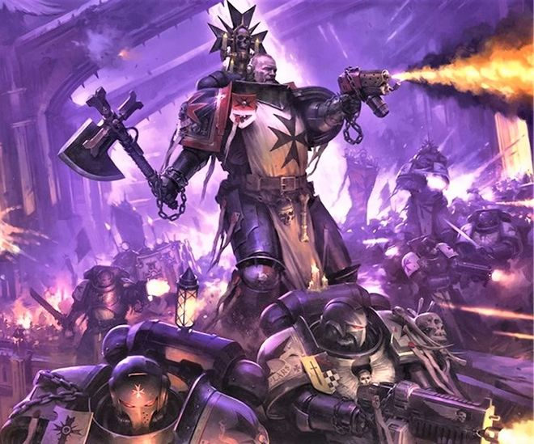
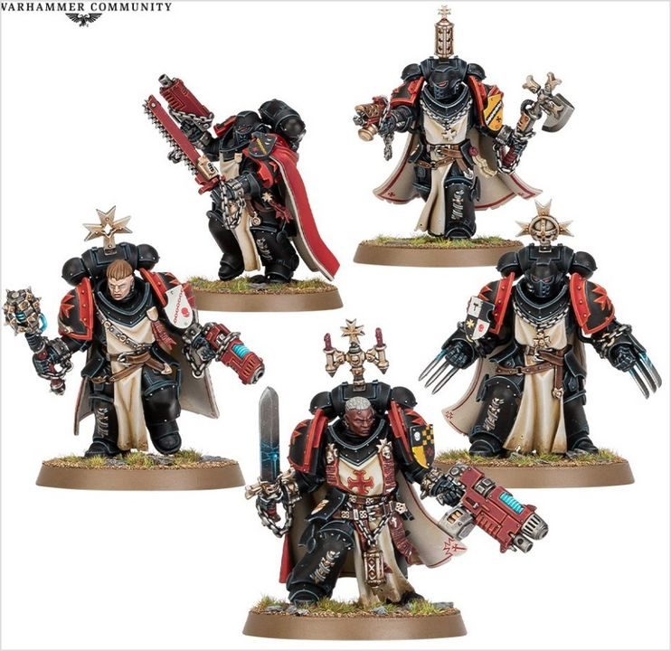

# 0400 圣剑兄弟会 Sword Brethren

精校状态：中文行文已逐段精校，部分术语仍为暂定

分类：通用概念 / 帝国 Imperium / 中央政务部 Adeptus Terra / 阿斯塔特修会 Adeptus Astartes

原文来源：https://www.bilibili.com/opus/1035086332362227712

原作者：帝国神选罐头

原文时间：2025年02月18日 08:23

[返回分类目录](目录.md) · [全书目录](../../目录.md)

<!-- A0400-B0001 -->
**英文原文**

Sword Brethren or Sword Brother is a specialist rank within the Black Templars, similar to the Veterans of Codex Chapters

<!-- /A0400-B0001 -->

<!-- A0400-B0002 -->

原译文

圣剑兄弟会或圣剑兄弟是黑色圣堂中的一个专业等级，类似于圣典战团的老兵

**校订译文**

圣剑兄弟会是黑色圣堂的一项特殊精锐身份，成员称为圣剑兄弟会修士，大体相当于圣典战团的老兵。

**校注：** Sword Brother 在GW09/GW10第10页十字军小队构成中为圣剑兄弟会修士；传统集体名暂沿圣剑兄弟会。新版中文单位名圣剑兄弟与旧版英文Primaris Sword Brethren对照时注明版本差异。

<!-- /A0400-B0002 -->

<!-- A0400-B0003 图片 -->

<!-- A0400-B0004 -->

原译文

Sword Brethren 圣剑兄弟会

**校订译文**

Sword Brethren 圣剑兄弟会

<!-- /A0400-B0004 -->

<!-- A0400-B0005 -->
## Overview 概述

<!-- /A0400-B0005 -->

<!-- A0400-B0006 -->
**英文原文**

Sword Brethren are elevated by their commanding Crusade's Marshal, and act as his own personal household guard. Though often veterans, some are simply Initiates who have achieved exceptional deeds. Marshals, however, are extremely careful with choosing their Sword Brethren. These warriors are then set upon two paths: fighting in bands with his fellow Sword Brethren or taking charge of Crusader Squads alongside Initiates and Neophytes. Others may become Ancients or Chaplains. Within a Marshal's Household, Sword Brethren are typically used as honour guard and elite shock troops. Due to their strong faith and zeal, they are often especially effective against the forces of the Warp.

<!-- /A0400-B0006 -->

<!-- A0400-B0007 -->

原译文

圣剑兄弟会被十字军元帅提拔，并担任自己的个人兄弟卫队。虽然通常是老兵，但有些人只是取得了非凡成就的信徒。然而，元帅在选择圣剑兄弟时非常谨慎。然后，这些战士将走上两条道路：与他的圣剑兄弟们组队作战，或者与新进者和信徒一起负责十字军小队。其他人可能会成为旗手或牧师。在元帅的兄弟中，圣剑兄弟会通常被用作荣誉卫队和精英突击队。由于他们坚定的信仰和热情，他们往往对亚空间的力量特别有效。

**校订译文**

圣剑兄弟会修士由所属远征军的元帅亲自晋拔，担任他的直属扈从卫队。多数人原已是老兵，也有一些是立下卓越功绩的进阶者，元帅选拔时始终极为审慎。获选者通常有两种任用方式：与其他圣剑兄弟会修士组成精锐队伍，或指挥由进阶者和新进者组成的十字军小队；另有一些人会成为旗手或教士。在元帅的扈从中，他们通常担任荣誉卫队与精锐突击部队，凭借坚定信仰与狂热斗志，在对抗亚空间势力时尤为有效。

<!-- /A0400-B0007 -->

<!-- A0400-B0008 图片 -->

<!-- A0400-B0009 -->

原译文

Primaris Sword Brethren 原铸圣剑兄弟会

**校订译文**

Primaris Sword Brethren 原铸圣剑兄弟

<!-- /A0400-B0009 -->

<!-- A0400-B0010 -->
**英文原文**

During Crusades, a Marshal can also appoint a Castellan to lead one of the Fighting Companies. This Castellan is picked from the Sword Brethren as is the case when a Castellan or Marshal is killed, the new one will be picked from the Sword Brethren.

<!-- /A0400-B0010 -->

<!-- A0400-B0011 -->

原译文

在远征期间，元帅还可以任命一名堡主领导其中一个战斗连。这个堡主是从圣剑兄弟会中挑选出来的，就像当一个堡主或元帅牺牲时，新的堡主将从圣剑兄弟会里挑选出来。

**校订译文**

远征期间，元帅可从圣剑兄弟会中任命堡主，指挥一个战斗连。同样，堡主或元帅阵亡后，其继任者也从圣剑兄弟会中选出。

<!-- /A0400-B0011 -->

<!-- A0400-B0012 -->
## Notable Sword Brethren 著名圣剑兄弟会修士

原题：Notable Sword Brethren 著名圣剑兄弟

<!-- /A0400-B0012 -->

<!-- A0400-B0013 -->

原译文

Augustin Riegerwald 奥古斯丁·里格瓦尔德

**校订译文**

Augustin Riegerwald 奥古斯丁·里格瓦尔德

<!-- /A0400-B0013 -->

<!-- A0400-B0014 -->
**英文原文**

Merek Grimaldus — The youngest Marine in the Chapter's history to hold the rank. Later Reclusiarch.

<!-- /A0400-B0014 -->

<!-- A0400-B0015 -->

原译文

梅里克·格瑞马度斯 — 该战团历史上最年轻的星际战士。后来成为隐修士。

**校订译文**

梅瑞克·格里玛度斯——战团历史上最年轻的圣剑兄弟会修士，后来成为隐修长。

**校注：** youngest ... to hold the rank 指获得该身份时最年轻，不是全战团有史以来最年轻的星际战士。

<!-- /A0400-B0015 -->

<!-- A0400-B0016 -->

原译文

Racej Lucerne 雷西·卢塞恩

**校订译文**

Racej Lucerne 雷西·卢塞恩

<!-- /A0400-B0016 -->

本篇核心术语与暂定项

以下列出本篇出现的英文原形及核心术语表用词。同形词可能指不同对象，具体词义以本篇正文和校注为准；单复数、别名和仅见于图注的名称可能尚未列入。完整候选见[术语表](../../术语表/双语术语候选.csv)。

| 英文 | 采用中文 | 状态 |
| --- | --- | --- |
| Black Templars | 黑色圣堂 | 官方已核对 |
| Warp | 亚空间 | 官方已核对 |
| History | 历史 | 编辑用语已统一 |
| Reclusiarch | 隐修长 | 暂定·官方待核 |
| Honour Guard | 荣誉卫队 | 暂定·官方待核 |
| Chapter | 战团 | 暂定·官方待核 |
| Brother | 修士 | 暂定·官方待核 |
| Merek Grimaldus | 梅瑞克·格里玛度斯 | 暂定·官方待核 |
| The Black Templars | 黑色圣堂 | 暂定·官方待核 |
| Castellan | 堡主 | 官方已核对 |
| Initiates | 进阶者 | 官方已核 |
| Marshal | 元帅 | 官方已核对 |
| Sword Brother | 圣剑兄弟会修士 | 官方已核对 |
| Sword Brethren | 圣剑兄弟会 | 官方词根参考·通称待核 |
| Chaplains | 教士 | 暂定·官方待核 |

