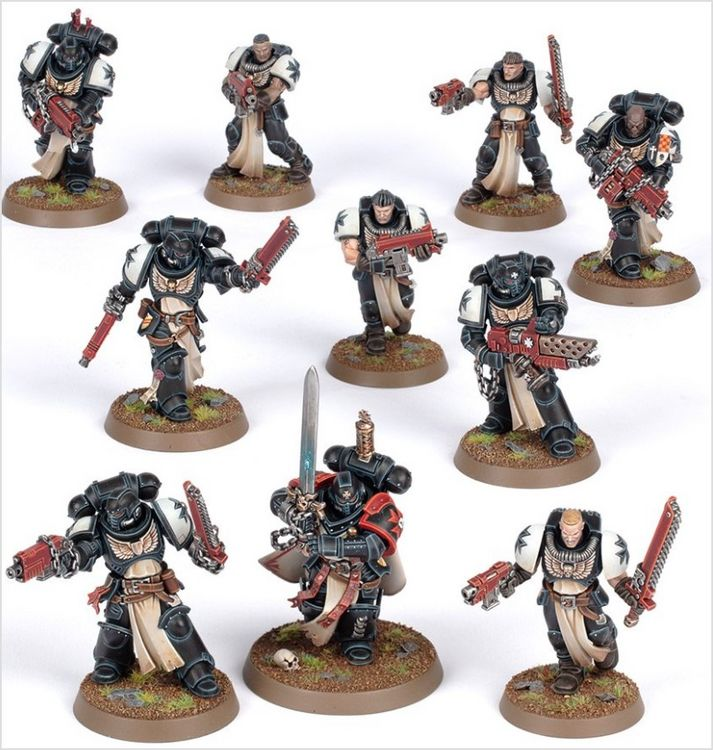

# 0401 十字军小队 Crusader Squad

精校状态：中文行文已逐段精校，部分术语仍为暂定

分类：通用概念 / 帝国 Imperium / 中央政务部 Adeptus Terra / 阿斯塔特修会 Adeptus Astartes

原文来源：https://www.bilibili.com/opus/1021090700406554632

原作者：帝国神选罐头

原文时间：2025年01月11日 15:13

[返回分类目录](目录.md) · [全书目录](../../目录.md)

<!-- A0401-B0001 -->
**英文原文**

Crusader Squads are the backbone of any Black Templars formation with a Fighting Company and consist of varying levels of Initiates and Neophytes. The majority of the Chapter's Battle-Brothers are organized into these squads. Many are led by Sword Brethren - veterans who deeds and example inspire Initiates to even greater acts of courage. The squads are primarily armed with the holy Bolter, though given the Black Templars' preference for close combat, many choose to carry Chainswords and other melee weapons.

<!-- /A0401-B0001 -->

<!-- A0401-B0002 -->

原译文

十字军小队是任何有战斗连队的黑色圣堂编队的支柱，由不同级别的信徒和新进者组成。该战团的大多数战斗兄弟都组织成了这些小队。许多人是由圣剑兄弟会领导的，他们的行为和榜样激励着信徒做出更大的勇气。小队主要装备神圣的爆矢枪，尽管考虑到黑色圣堂更喜欢近战，许多人选择携带链锯剑和其他近战武器。

**校订译文**

十字军小队是黑色圣堂战斗连队的骨干，成员包括处于不同资历阶段的进阶者和新进者。战团的大多数战斗兄弟都编入这类小队。许多小队由圣剑兄弟中的老兵率领，他们以自身的事迹和榜样，激励进阶者展现更大的勇气。小队主要装备神圣的爆矢枪；不过，由于黑色圣堂偏好近战，许多成员会选择链锯剑及其他近战武器。

**校注：** Sword Brethren 此处是带队的老兵个体，而非一个兄弟会组织担任小队长。Initiate 依已核官译采用进阶者。

<!-- /A0401-B0002 -->

<!-- A0401-B0003 图片 -->

<!-- A0401-B0004 -->

原译文

Crusader Squad 十字军小队

**校订译文**

Crusader Squad 十字军小队

<!-- /A0401-B0004 -->

本篇核心术语与暂定项

以下列出本篇出现的英文原形及核心术语表用词。同形词可能指不同对象，具体词义以本篇正文和校注为准；单复数、别名和仅见于图注的名称可能尚未列入。完整候选见[术语表](../../术语表/双语术语候选.csv)。

| 英文 | 采用中文 | 状态 |
| --- | --- | --- |
| Black Templars | 黑色圣堂 | 官方已核对 |
| Chapter | 战团 | 暂定·官方待核 |
| The Black Templars | 黑色圣堂 | 暂定·官方待核 |
| Initiates | 进阶者 | 官方已核 |
| Sword Brethren | 圣剑兄弟会 | 官方词根参考·通称待核 |
| Bolter | 爆矢枪 | 暂定·官方待核 |

