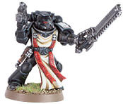
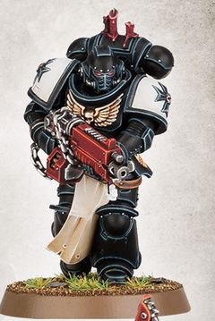

# 0402 进阶者 Initiate

精校状态：中文行文已逐段精校，部分术语仍为暂定

分类：通用概念 / 帝国 Imperium / 中央政务部 Adeptus Terra / 阿斯塔特修会 Adeptus Astartes

原文来源：https://www.bilibili.com/opus/1024420360906342409

原作者：帝国神选罐头

原文时间：2025年01月20日 14:34

[返回分类目录](目录.md) · [全书目录](../../目录.md)

原篇名：信徒 Initiate

<!-- A0402-B0001 -->
**英文原文**

Initiates are the rank-and-file warriors of the Black Templars, analogous to the Battle Brothers of other Chapters.

<!-- /A0402-B0001 -->

<!-- A0402-B0002 -->

原译文

信徒是黑色圣堂的普通战士，类似于其他战团的战斗兄弟。

**校订译文**

进阶者是黑色圣堂的普通战士，对应其他战团的战斗兄弟。

<!-- /A0402-B0002 -->

<!-- A0402-B0003 图片 -->

<!-- A0402-B0004 -->

原译文

Black Templars initiate 黑色圣堂信徒

**校订译文**

Black Templars initiate 黑色圣堂进阶者

<!-- /A0402-B0004 -->

<!-- A0402-B0005 -->
## Overview 概述

<!-- /A0402-B0005 -->

<!-- A0402-B0006 -->
**英文原文**

Upon completing their training as a Neophyte, a Black Templar is then elevated to Initiate and dons both full Power Armour and the Black Carapace. Many continue to fight amongst their previous Crusader Squads while others take on specialist roles such as Aggressor, Incursors, Outriders, Assault Marines, etc.. In Black Templars culture, Initiates generally gravitate towards the most aggressive and close-quarters battlefield roles.

<!-- /A0402-B0006 -->

<!-- A0402-B0007 -->

原译文

在完成作为新进者的训练后，一名黑色圣堂将被提升为信徒，并穿上全部动力盔甲和黑色甲壳。许多人继续在之前的十字军小队中战斗，而其他人则承担专业角色，如侵略者、入侵者、先遣者、突击战士等。在黑色圣堂文化中，信徒通常倾向于最具侵略性和近距离的战场角色。

**校订译文**

完成新进者阶段的训练后，一名黑色圣堂战士便会晋升为进阶者，配备完整的动力甲，并接受黑色甲壳植入。许多人继续在原来的十字军小队中作战，另一些则担任侵略者、入侵者、摩托警卫、突击战士等专门战斗职务。黑色圣堂的文化使进阶者普遍偏好最具进攻性、最强调近距离交战的战场职责。

**校注：** 黑色甲壳是植入物，不能与动力甲一同理解为外穿装备；英文 dons both 的表述较宽泛，中文按各自装备方式处理。Outrider 在此为原铸部队，按官译摩托警卫统一。

<!-- /A0402-B0007 -->

<!-- A0402-B0008 图片 -->

<!-- A0402-B0009 -->

原译文

Primaris Space Marine Initiate 原铸星际战士信徒

**校订译文**

Primaris Space Marine Initiate 原铸星际战士进阶者

<!-- /A0402-B0009 -->

<!-- A0402-B0010 -->
**英文原文**

In addition to their combat roles, Initiates also are given a Neophyte to act as their squire and student. It is they who will train them and oversee their coming trials, and along with the Chaplains determine when the Neophyte is ready to ascend to Initiate himself.

<!-- /A0402-B0010 -->

<!-- A0402-B0011 -->

原译文

除了战斗角色外，信徒还将接受一名新进者作为他们的侍从和学生。正是他们将训练他们，监督他们即将到来的考验，并与牧师一起决定新进者何时准备好晋升为信徒。

**校订译文**

除作战职责外，每名进阶者还会分配到一名新进者，作为自己的侍从和学生。进阶者负责训练学生、监督其后续试炼，并与教士共同判断他何时具备晋升为进阶者的资格。

<!-- /A0402-B0011 -->

本篇核心术语与暂定项

以下列出本篇出现的英文原形及核心术语表用词。同形词可能指不同对象，具体词义以本篇正文和校注为准；单复数、别名和仅见于图注的名称可能尚未列入。完整候选见[术语表](../../术语表/双语术语候选.csv)。

| 英文 | 采用中文 | 状态 |
| --- | --- | --- |
| Black Templars | 黑色圣堂 | 官方已核对 |
| Neophyte | 新进者 | 暂定 |
| Power Armour | 动力盔甲 | 暂定·官方待核 |
| Aggressor | 侵略者 | 暂定·官方待核 |
| The Black Templars | 黑色圣堂 | 暂定·官方待核 |
| Black Carapace | 黑色甲壳 | 暂定·官方待核 |
| Initiates | 进阶者 | 官方已核 |
| Initiate | 正式成员 | 暂定·官方待核 |
| Chaplains | 教士 | 暂定·官方待核 |

