# 0403 IX - 圣血天使 Blood Angels

精校状态：中文行文已逐段精校，部分术语仍为暂定

分类：通用概念 / 帝国 Imperium / 中央政务部 Adeptus Terra / 阿斯塔特修会 Adeptus Astartes

原文来源：https://www.bilibili.com/opus/1097441230215708679

原作者：帝国神选罐头

原文时间：2025年08月05日 09:12

[返回分类目录](目录.md) · [全书目录](../../目录.md)

<!-- A0403-B0001 -->
**英文原文**

The Blood Angels, originally known as the Revenant Legion were the IX Legion of the original Space Marine Legions under their Primarch Sanguinius. They are particularly well known for their bloodthirsty nature in battle. They are also one of the most long-lived Chapters, and have a refined aesthetic sense.

<!-- /A0403-B0001 -->

<!-- A0403-B0002 -->

原译文

圣血天使，最初被称为归来者军团，是其原体圣吉列斯领导下的原初星际战士军团的第九军团。他们在战斗中以嗜血的天性而闻名。它们也是长存的战团之一，具有精致的美感。

**校订译文**

圣血天使最初名为归来者军团，是原初星际战士军团中的第九军团，由原体圣吉列斯统领。他们以战斗中嗜血的天性闻名，也是成员寿命最长的战团之一，并且拥有精湛的审美修养。

**校注：** long-lived 描述战士寿命，不是战团存续年代；they 统一指人，用他们。

<!-- /A0403-B0002 -->

<!-- A0403-B0003 图片 -->
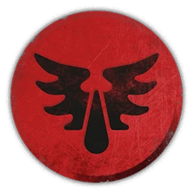

<!-- A0403-B0004 图片 -->
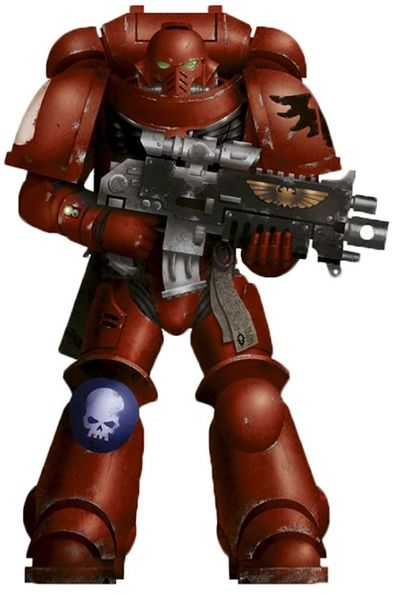

<!-- A0403-B0005 -->
**英文原文**

Legion Number:IX

<!-- /A0403-B0005 -->

<!-- A0403-B0006 -->

原译文

军团编号：IX

**校订译文**

军团编号：IX

<!-- /A0403-B0006 -->

<!-- A0403-B0007 -->
**英文原文**

Primarch:Sanguinius

<!-- /A0403-B0007 -->

<!-- A0403-B0008 -->

原译文

原体：圣吉列斯

**校订译文**

原体：圣吉列斯

<!-- /A0403-B0008 -->

<!-- A0403-B0009 -->
**英文原文**

Homeworld:Baal

<!-- /A0403-B0009 -->

<!-- A0403-B0010 -->

原译文

家园世界：巴尔

**校订译文**

家园世界：巴尔

<!-- /A0403-B0010 -->

<!-- A0403-B0011 -->
**英文原文**

Fortress-Monastery:Arx Angelicum

<!-- /A0403-B0011 -->

<!-- A0403-B0012 -->

原译文

堡垒修道院：天使堡

**校订译文**

要塞修道院：天使堡

<!-- /A0403-B0012 -->

<!-- A0403-B0013 -->
**英文原文**

Chapter Master:Dante

<!-- /A0403-B0013 -->

<!-- A0403-B0014 -->

原译文

战团长：但丁

**校订译文**

战团长：但丁

<!-- /A0403-B0014 -->

<!-- A0403-B0015 -->
**英文原文**

Colours:Blood Red Armour with Black Aquila,Helmet colour denotes squad type

<!-- /A0403-B0015 -->

<!-- A0403-B0016 -->

原译文

颜色：红色盔甲配黑色天鹰，头盔颜色表示小队类型

**校订译文**

配色：血红色盔甲配黑色天鹰徽记；头盔颜色表示小队类型。

<!-- /A0403-B0016 -->

<!-- A0403-B0017 -->
**英文原文**

Specialty:Assault, Deep Striking

<!-- /A0403-B0017 -->

<!-- A0403-B0018 -->

原译文

专业：突击，深入打击

**校订译文**

专长：突击、纵深打击。

<!-- /A0403-B0018 -->

<!-- A0403-B0019 -->
**英文原文**

Strength:Codex-Compliant

<!-- /A0403-B0019 -->

<!-- A0403-B0020 -->

原译文

力量：遵从圣典

**校订译文**

兵力：按《阿斯塔特圣典》编制。

<!-- /A0403-B0020 -->

<!-- A0403-B0021 -->
**英文原文**

Battle Cry:"By the Blood of Sanguinius!" or "For The Emperor and Sanguinius!"

<!-- /A0403-B0021 -->

<!-- A0403-B0022 -->

原译文

战吼：“不负圣吉列斯之血”或“为了帝皇与圣吉列斯”

**校订译文**

战吼：“不负圣吉列斯之血”或“为了帝皇与圣吉列斯”

<!-- /A0403-B0022 -->

<!-- A0403-B0023 -->
**英文原文**

Successor Chapters:

<!-- /A0403-B0023 -->

<!-- A0403-B0024 -->

原译文

子战团

**校订译文**

子战团

<!-- /A0403-B0024 -->

<!-- A0403-B0025 -->
**英文原文**

Absolvers,Angels Encarmine, Angels Erythrean, Angels Excelsis, Angels of Excelsis, Angels Glorious, Angels of the Grail, Angels Numinous, Angels of Light, Angels Penitent, Angels Sanguine, Angels Vermillion, Atlantian Spears

<!-- /A0403-B0025 -->

<!-- A0403-B0026 -->

原译文

赦免者，赤红天使，厄立特里亚天使，精益天使，崇高天使，荣光天使，圣杯天使，神圣天使，光明天使，悔罪天使，血红天使，朱红天使，亚特兰蒂斯之矛

**校订译文**

赦免者、赤红天使、厄立特里亚天使、至高天使、崇高天使、荣光天使、圣杯天使、神圣天使、光明天使、悔罪天使、鲜血天使、朱红天使、亚特兰蒂斯之矛。

**校注：** 原文同时列出 Angels Excelsis 与 Angels of Excelsis，暂分别保留为至高天使、崇高天使；未凭名称相近合并。Angels Sanguine 按核心定译鲜血天使。

<!-- /A0403-B0026 -->

<!-- A0403-B0027 -->
**英文原文**

Blood Dragons, Blood Drinkers, Blood Eagles, Blood Legion, Blood Scythes, Blood Swords, Blood Templars, Blood Wings, Brothers of Jarad, Brothers of the Red, Burning Blood

<!-- /A0403-B0027 -->

<!-- A0403-B0028 -->

原译文

血龙，饮血者，血鹰，圣血军团，鲜血之镰，鲜血之剑，鲜血圣堂，血翼，雅拉修士，血红兄弟，燃烧之血

**校订译文**

血龙、饮血者、血鹰、圣血军团、鲜血之镰、鲜血之剑、鲜血圣堂、血翼、雅拉德修士、血红兄弟、燃烧之血。

<!-- /A0403-B0028 -->

<!-- A0403-B0029 -->
**英文原文**

Carmine Blades, Charnel Guard, Cruor Blades, Crimson Knights, Crimson Blades, Crimson Legion, Crimson Swords

<!-- /A0403-B0029 -->

<!-- A0403-B0030 -->

原译文

猩红之刃，墓葬守卫，凝血之刃，深红骑士，深红军团，深红之剑

**校订译文**

猩红之刃、墓葬守卫、凝血之刃、深红骑士、深红之刃、深红军团、深红之剑。

**校注：** 补回原译漏掉的 Crimson Blades 深红之刃。

<!-- /A0403-B0030 -->

<!-- A0403-B0031 -->
**英文原文**

Death Wardens, Disciples of Blood, Dragons Ardent

<!-- /A0403-B0031 -->

<!-- A0403-B0032 -->

原译文

死亡看守者，鲜血使徒，炽热之龙

**校订译文**

死亡看守者，鲜血使徒，炽热之龙

<!-- /A0403-B0032 -->

<!-- A0403-B0033 -->

原译文

Exsanguinators 放血者

**校订译文**

Exsanguinators 放血者

<!-- /A0403-B0033 -->

<!-- A0403-B0034 -->
**英文原文**

Flesh Eaters, Flesh Tearers

<!-- /A0403-B0034 -->

<!-- A0403-B0035 -->

原译文

食肉者，撕肉者

**校订译文**

食肉者，撕肉者

<!-- /A0403-B0035 -->

<!-- A0403-B0036 -->
**英文原文**

Golden Sons, Grail Guard

<!-- /A0403-B0036 -->

<!-- A0403-B0037 -->

原译文

黄金之子，圣杯守卫

**校订译文**

黄金之子，圣杯守卫

<!-- /A0403-B0037 -->

<!-- A0403-B0038 -->
**英文原文**

Knights of Blood, Knights of the Chalice, Knights Sanguine,

<!-- /A0403-B0038 -->

<!-- A0403-B0039 -->

原译文

血骑士，圣杯骑士，圣血骑士

**校订译文**

血骑士，圣杯骑士，圣血骑士

<!-- /A0403-B0039 -->

<!-- A0403-B0040 -->

原译文

Lamenters 恸哭者

**校订译文**

Lamenters 恸哭者

<!-- /A0403-B0040 -->

<!-- A0403-B0041 -->
**英文原文**

Red Seraphs, Red Knights, Red Wings, The Remnants, Ruby Crescents,

<!-- /A0403-B0041 -->

<!-- A0403-B0042 -->

原译文

血红六翼天使，血红骑士，红翼，残余者，红宝石新月

**校订译文**

红色六翼天使、红色骑士、红翼、残骸、红宝石新月。

<!-- /A0403-B0042 -->

<!-- A0403-B0043 -->
**英文原文**

Sable Brotherhood, Sable Knights, Sanguine Host, Scions of Sanguinius, Sons of Sanguinius,

<!-- /A0403-B0043 -->

<!-- A0403-B0044 -->

原译文

暗夜兄弟会，暗夜骑士，圣血天军，圣吉列斯之裔，圣吉列斯之子

**校订译文**

阴暗兄弟会、阴暗骑士、圣血天军、圣吉列斯后裔、圣吉列斯之子。

<!-- /A0403-B0044 -->

<!-- A0403-B0045 -->

原译文

Templars of Blood 血红圣堂

**校订译文**

Templars of Blood 血红圣堂

<!-- /A0403-B0045 -->

<!-- A0403-B0046 -->
## Homeworld 家园世界

<!-- /A0403-B0046 -->

<!-- A0403-B0047 -->
**英文原文**

The homeworld of the Blood Angels is the planet Baal and its two moons, Baal Primus and Baal Secundus, from which the Blood Angels take their new recruits. The Blood Angels' Primarch, Sanguinius, fell upon Baal Secundus after he and his brother Primarchs were scattered across the galaxy.

<!-- /A0403-B0047 -->

<!-- A0403-B0048 -->

原译文

圣血天使的家园世界是巴尔行星及其两个卫星，巴尔一号和巴尔二号，圣血天使从那里招募新兵。圣血天使的原体圣吉列斯在和他的兄弟原体分散在银河系后降落在巴尔二号。

**校订译文**

圣血天使的母星是巴尔行星，其招募范围还包括两颗卫星——巴尔一号和巴尔二号。原体圣吉列斯与兄弟们被抛散到银河各处后，降落在巴尔二号。

<!-- /A0403-B0048 -->

<!-- A0403-B0049 -->
**英文原文**

In ancient days Baal and its moons had Terra-like atmospheres. Baal itself was always a world of red rust deserts, but its moons were close to paradises. As the Dark Age of Technology ended in the Age of Strife, civil war erupted between the world and its colonised moons, leading to the nuclear devastation of the planetary system. Baal Secundus has since been a nuclear-blasted desert world with deadly levels of radiation. This forced the world's human tribes to build cumbersome radiation suits in order to survive. Mutants were once rife upon the world, frequently at war with the remaining pure humans for dominance of the planet.

<!-- /A0403-B0049 -->

<!-- A0403-B0050 -->

原译文

在古代，巴尔和它的卫星有类似泰拉的大气层。巴尔本身一直是一个红沙世界，但它的卫星离天堂很近。随着黑暗技术时代在纷争时代结束，世界与其殖民卫星之间爆发了内战，导致行星系统的核毁灭。自那以后，巴尔二号一直是一个核爆炸的沙漠世界，辐射水平致命。这迫使世界上的人类部落为了生存而建造笨重的辐射服。变种人曾经在世界上横行，经常与剩下的纯结人类争夺行星的统治权。

**校订译文**

在远古时代，巴尔及其卫星都拥有类似泰拉的大气。巴尔本身始终是一片铁锈色的沙漠世界，两颗卫星却近乎乐土。随着科技黑暗时代结束、纷争时代来临，巴尔与已被殖民的卫星之间爆发内战，整个行星系统遭到核武器的毁灭性打击。此后，巴尔二号成为一颗满目核战创伤、辐射足以致命的沙漠世界。当地人类部落不得不制造笨重的防辐射服来维持生存。变种人一度遍布这个世界，经常与幸存的纯种人类交战，争夺行星的统治权。

<!-- /A0403-B0050 -->

<!-- A0403-B0051 -->
## History 历史

<!-- /A0403-B0051 -->

<!-- A0403-B0052 -->
### Unification Wars & Great Crusade 统一战争&大远征

<!-- /A0403-B0052 -->

<!-- A0403-B0053 -->
### Formation 组建

原题：Formation 形成

<!-- /A0403-B0053 -->

<!-- A0403-B0054 -->
**英文原文**

The Blood Angels were created from the genetic material of their Primarch, Sanguinius. As with all of the Primarchs, Sanguinius was genetically engineered to be a supreme super-soldier but was cast into the warp during his infancy along with his brothers, and found on the nuclear-blasted moon of Baal Secundus.

<!-- /A0403-B0054 -->

<!-- A0403-B0055 -->

原译文

圣血天使是由他们的原体圣吉列斯的遗传物质创造的。与所有的原体一样，圣吉列斯经过基因改造，成为了一名至高超级战士，但在婴儿时期与他的兄弟们一起被扔进了亚空间，并在核爆炸的巴尔二号卫星上被发现。

**校订译文**

圣血天使以原体圣吉列斯的遗传物质为基础创造而成。与其他原体一样，圣吉列斯经过基因工程塑造，原本是至强的超级战士；但在婴儿时期，他与兄弟们一同被抛入亚空间，后来在遭核战争摧残的巴尔二号卫星上被人发现。

<!-- /A0403-B0055 -->

<!-- A0403-B0056 图片 -->
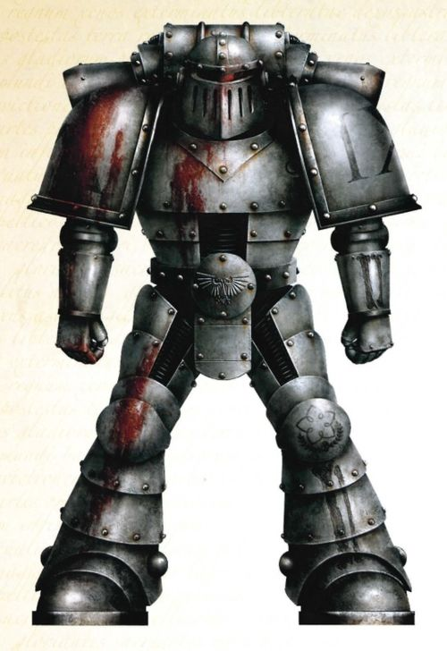

<!-- A0403-B0057 -->

原译文

Unification-era IXth Legionary 统一时期第九军团军团士兵

**校订译文**

Unification-era IXth Legionary 统一时期第九军团军团士兵

<!-- /A0403-B0057 -->

<!-- A0403-B0058 -->
**英文原文**

Originally known as the IXth Legion, the early records of the Legion show a noted absence in many of the key conquests of the Unification Wars. Instead, the Legion acted as the Emperor's inferno, ravaging and annihilating any foe they were unleashed upon. Few in number, they often served as vanguards and waging battles in small and audacious raids focusing on murderous close-combat. They were often deployed to the most dangerous warzones against the most twisted of foes, holding the line alone and out of the spotlight. This was a role fitting for them, as the early IXth Legion recruited from the lost and dispossessed of Terra. Despite often bearing the marks of mutation they were genetically sculpted into tall and fair elegant specimens. However other dark rumors followed the Legion, which soon earned the title of the "Eaters of the Dead" due to their habit of consuming enemy corpses after a battle. This did not prevent the formation of a Cult of the Reborn, followers of the IX hoping to be chosen as aspirants. The mysticism this surrounded the Astartes with did little to prevent the movement to be mercilessly slaughtered once the Imperial Truth was established.

<!-- /A0403-B0058 -->

<!-- A0403-B0059 -->

原译文

最初被称为第九军团，军团的早期记录显示，在统一战争的许多关键征服中，军团都明显缺席。相反，军团充当了帝皇的炼狱，蹂躏和消灭了他们被释放出来的任何敌人。他们人数不多，经常充当先锋，在小规模、大胆的突袭中发动战斗，重点是致命的近距离战斗。他们经常被部署到最危险的战区，对抗最扭曲的敌人，独自守住战线，远离关注。这是一个适合他们的角色，因为早期的第九军团从泰拉的迷失者和被剥夺者中招募。尽管它们经常带有突变的痕迹，但它们在基因上被雕刻成高大而优雅的样本。然而，其他黑暗的谣言紧随着军团，由于他们习惯于在战斗后吃掉敌人的尸体，军团很快就获得了“食尸者”的称号。这并没有阻止重生教派的形成，第九军团的追随者希望被选为有志者。围绕阿斯塔特的那些神秘，在帝国真理确立之后，丝毫没能阻止这股势力遭到无情屠戮。

**校订译文**

这支部队最初称为第九军团。早期记录显示，他们明显缺席了统一战争中的许多关键征服行动；他们更像帝皇投向敌人的一团烈火，奉命蹂躏并歼灭指定的目标。军团人数不多，常充当先锋，以大胆的小规模突袭和致命的近战开展作战。他们往往被派往最危险的战区，对抗最扭曲的敌人，在无人注目的地方独自坚守战线。这种职责与他们的出身相称：早期第九军团从泰拉无所归依、一无所有的人群中征兵。新兵往往带有变异痕迹，却能通过基因改造成为高大俊美的战士。然而，军团也始终被阴暗的传闻缠绕。由于习惯在战后吞食敌人的尸体，他们很快获得了“食尸者”的称号。这并未阻止重生教派兴起：这些第九军团的追随者盼望被选为候选者。该教派给阿斯塔特蒙上了一层神秘色彩，但在帝国真理确立后，依然遭到了无情的屠灭。

<!-- /A0403-B0059 -->

<!-- A0403-B0060 -->
**英文原文**

As the Unification Wars transitioned into the Great Crusade, the IXth Legion was deployed to hellish backwater warzones such as Neptune. On the moons of Neptune, 12,000 warriors of the IXth disappeared but nonetheless managed to endure and complete their mission. They had largely replenished their numbers taken from the barely human dregs of Neptune's tunnels. Where others may have floundered and fallen, the IXth had risen from the ashes of defeat. This process soon repeated itself again and again, with the IXth being cast into a hellish warzone only to emerge as they had before. This led to Malcador the Sigillite dubbing them the "Revenant Legion". They often found themselves in the company of those Legion's less-favored by the lords of the Imperium, such as the War Hounds and IVth.

<!-- /A0403-B0060 -->

<!-- A0403-B0061 -->

原译文

随着统一战争转变为大远征，第九军团被部署到海王星等地狱般的死水战区。在海王星的卫星上，第九军团的12000名战士消失了，但他们仍然设法忍受并完成了任务。他们的兵力已基本补充完整，而补充的兵员多来自海王星隧道中那些近乎失去人性的渣滓。在其他人可能挣扎和倒下的地方，第九军团已经从失败的灰烬中复活。这个过程很快一次又一次地重复，第九军团被投入地狱般的战区，却像以前一样出现了。这导致掌印者马卡多将他们称为“归来者军团”。他们经常发现自己与那些不太受帝国领主青睐的军团成员在一起，如战犬和第四军团。

**校订译文**

统一战争逐渐转入大远征后，第九军团被派往海王星一类偏远而地狱般的战区。一万两千名第九军团战士在海王星的卫星上失去踪迹，却仍设法坚持下来，完成了任务。他们从海王星隧道里那些几乎已失去人类模样的底层居民中征兵，基本补足了损失。换作其他部队，或许早已挣扎着覆灭；第九军团却从失败的灰烬中重新站起。这样的经历此后反复上演：军团被投入炼狱般的战场，最终总能恢复原状、再度归来。因此，掌印者马卡多将他们称为“归来者军团”。他们也经常与战犬军团、第四军团等同样不受帝国统治者青睐的部队并肩行动。

<!-- /A0403-B0061 -->

<!-- A0403-B0062 -->
**英文原文**

With each new bloody victory, the dire legends that surrounded the IXth grew and spread. They became spectres that haunted the wild places of the Great Crusade, the terrors loosed by the Emperor to clear his path across the stars. The IXth accepted this duty with a grim pride, never shirking in the mantle that they wore. Each campaign was undertaken with a quiet, brooding hunger for blood and death that was as terrifying as it was effective. They fought without mercy and paid no heed to anything other than the destruction of the enemy. Shunned and isolated from the wider Imperium, they began to descend into charnel cults and bloody rituals. Various Red Cults formed as the Legion was broken apart by the widening Crusade, and their brutality attracted censure at places such as Yarant. They began to only maintain line infantry and jump troops, in part due to the reluctance of the Imperium to supply them with more advanced weapons.

<!-- /A0403-B0062 -->

<!-- A0403-B0063 -->

原译文

随着每一次新的血腥胜利，围绕第九军团的可怕传说都在增长和传播。他们变成了幽灵，萦绕在大远征的荒野中，是帝皇为清理星辰之路而释放的恐怖。第九军团带着一种冷酷的自豪感接受了这一职责，从不逃避他们所承担的职责。每一场战役都是在一种安静、沉思的对鲜血和死亡的渴望中进行的，这种渴望既可怕又有效。他们毫不留情地战斗，除了消灭敌人，什么都不在乎。他们被更广泛的帝国所疏远和孤立，开始堕落到石棺教派和血腥仪式中。随着军团被不断扩大的远征瓦解，各种血红邪教组织应运而生，他们的残暴行为在雅兰特等地引起了谴责。他们开始只保留步兵和跳跃部队，部分原因是帝国不愿意向他们提供更先进的武器。

**校订译文**

每赢得一次血腥的胜利，围绕第九军团的恐怖传说便愈加广为流传。他们像幽灵般出没于大远征触及的蛮荒之地，是帝皇为打通群星间的道路而释放的恐怖力量。第九军团以冷酷的自豪接受这份使命，从不逃避肩上的责任。每次出征，他们都怀着沉默而阴郁的嗜血杀意；这种渴望既令人胆寒，也让他们极为高效。他们作战毫不留情，唯一关心的就是消灭敌人。由于遭帝国其他势力疏远和孤立，他们逐渐沉溺于尸骸崇拜和血腥仪式。大远征不断扩展，军团被分散部署，各种血红教派也随之形成。他们在雅兰特等地的暴行招来了谴责。军团的编制逐渐只剩下列阵步兵和跳跃部队，部分原因在于帝国不愿向他们提供更先进的武器。

**校注：** charnel cults 是尸骸崇拜，不是石棺教派；broken apart 指随远征扩大而分散部署，不是军团瓦解。

<!-- /A0403-B0063 -->

<!-- A0403-B0064 -->
**英文原文**

Meanwhile on Baal, Sanguinius was perhaps affected by the warp, and when he was found by one of the few unmutated human tribes on Baal, he had a pair of angelic wings growing from his back. As he matured quickly, he was able to use his superhuman powers and abilities to unite the humans of Baal against the mutants and become their leader. When the Emperor found Baal in his search for the twenty Primarchs, Sanguinius immediately recognized him for who he was and knelt before him, pledging his service in 843.M30. In this, Sanguinius was one of the few Primarchs who did not challenge the Emperor upon their reunion. The Emperor then took Sanguinius and a number of his best warriors and placed him in command of the dark and brutal IXth Legion, which he would come to name the Blood Angels.

<!-- /A0403-B0064 -->

<!-- A0403-B0065 -->

原译文

与此同时，在巴尔上，圣吉列斯可能受到了亚空间的影响，当他被巴尔上为数不多的未变异的人类部落之一发现时，他的背部长出了一对天使般的翅膀。随着他迅速成熟，他能够利用自己的超人力量和能力团结巴尔的人类对抗变种人，并成为他们的领袖。当帝皇在寻找二十位原体时发现巴尔时，圣吉列斯立即认出了他，并跪在他面前宣誓效忠，在843.M30。在这方面，圣吉列斯是为数不多的在重聚时没有挑战帝皇的原体之一。然后，帝皇带走了圣吉列斯和他的一些最好的战士，并让他指挥黑暗而残酷的第九军团，他将其命名为圣血天使。

**校订译文**

与此同时，圣吉列斯在巴尔上长大。当巴尔少数未发生变异的人类部落之一发现他时，他的背上已生出一对天使般的羽翼，这或许是亚空间影响的结果。他迅速成长，凭借超人的力量与能力团结巴尔人类，对抗变种人，并成为他们的领袖。帝皇在寻找二十位原体的途中抵达巴尔时，圣吉列斯立刻认出了父亲，于843.M30跪在他面前宣誓效忠。他因此成为少数几位重逢时未曾挑战帝皇的原体之一。随后，帝皇带走圣吉列斯及其麾下的一批精锐，将阴暗而残暴的第九军团交给他统率；他后来把这支军团命名为圣血天使。

<!-- /A0403-B0065 -->

<!-- A0403-B0066 -->
### The Coming of Sanguinius 圣吉列斯的到来

<!-- /A0403-B0066 -->

<!-- A0403-B0067 -->
**英文原文**

Sanguinius spent the first 3 years after his rediscovery with the Luna Wolves, learning the ways of the Imperium from his brother Horus. He first met his then-savage Revenant Legion during the Pacification of Teghar Pentarus, but shocked all assembled by first learning the name of each and every one of his warriors. Giving a speech before his assembled sons, Sanguinius stated that he would swear an oath to his Legion instead of the vice-versa. Sanguinius stated he hoped he could live up to leading his sons, and that he would stand with them whatever may come be it glory or damnation. He declared the IXth Legion to be scattered and broken no longer, and that they alone would conduct the coming campaign without the aid of the Luna Wolves. Sanguinius' humility roused the assembled warriors, who immediately pledged themselves to their Primarch.

<!-- /A0403-B0067 -->

<!-- A0403-B0068 -->

原译文

圣吉列斯在被重新发现后的与影月苍狼的前3年里，从他的兄弟荷鲁斯那里学习了帝国的运作方式。他第一次见到他当时野蛮的归来者军团是在泰加尔五号平定期间，但当他第一次见面就知道他的每一个战士的名字时，所有人都感到震惊。圣吉列斯在他的子嗣面前发表演讲时表示，他将向他的军团宣誓，而不是相反。圣吉列斯表示，他希望自己能不辜负领导子嗣的期望，无论发生什么，无论是荣耀还是诅咒，他都会与他们站在一起。他宣布第九军团不再被驱散和瓦解，他们将在没有影月苍狼的帮助下独自进行即将到来的战役。圣吉列斯的谦卑唤醒了聚集的战士，他们立即向他们的原体宣誓。

**校订译文**

被帝皇寻回后的头三年，圣吉列斯跟随影月苍狼，从兄弟荷鲁斯那里学习帝国的运作方式。他在泰加尔五号平定战期间，首次见到仍然野蛮嗜血的归来者军团。他先逐一询问并记住每名战士的姓名，令在场所有人震惊。面对集结的子嗣，他宣布将由自己向军团宣誓，而非让军团先向他宣誓。他希望自己能无愧于统领他们的责任，无论前方是荣耀还是毁灭，都会与他们并肩而立。他宣告，第九军团从此不再四散零落；接下来的战役将由他们独力完成，无需影月苍狼援助。圣吉列斯的谦逊打动了在场的战士，他们立即向原体宣誓效忠。

**校注：** learning the name 指当场了解并记住姓名，原译误成预先知道每个人的名字。

<!-- /A0403-B0068 -->

<!-- A0403-B0069 -->
**英文原文**

At Teghar Pentarus, Sanguinius gave his blood in the maelstrom of combat and came to understand the true nature of his sons after witnessing their bloodlust and hunger. Sanguinius knew that if this path would continue, one day his Legion would become monsters. Yet, he did not despair. He sought to remake the Blood Angels into a force for nobility by having each company fight alongside a Luna Wolves contingent for the next decade. Besides gaining stature in the eyes of their peers, the nobility and honor displayed by the Luna Wolves began to influence the sons of Sanguinius. Their Primarch was able to instil a sense of pride in them to replace their desire for carnage and bloodshed. At Anaxis XII, the Blood Angels, Luna Wolves, and Imperial Fists under their respective Primarch's fought against a massive Hrud migration that solidified their new status and bonds with the other top Legion's of the Great Crusade. At Kentaurus Beta, they learned from Sanguinius the art of bloodlessly pacifying a planet. Soon enough fury became tempered by wisdom, and Sanguinius succeeded in his quest to reforge the Blood Angels. They soon not only became noble warriors of their own rights, but also icons across the entire Imperium.

<!-- /A0403-B0069 -->

<!-- A0403-B0070 -->

原译文

在泰加尔五号，圣吉列斯在战斗的漩涡中献出了自己的鲜血，在目睹了子嗣的嗜血和饥饿之后，他开始了解他们的真实本性。圣吉列斯知道，如果这条路继续下去，总有一天他的军团会变成怪物。然而，他并没有绝望。他试图将圣血天使重塑为一支高贵的部队，让每个连队在接下来的十年里与影月苍狼并肩作战。除了在战友眼中获得声望外，影月苍狼所表现出的高贵和荣誉也开始影响圣吉列斯的子嗣。他们的原体能够给他们灌输一种自豪感，以取代他们对屠杀和流血的渴望。在安纳克斯12号，圣血天使、影月苍狼和帝国之拳在各自原体的领导下，与大规模的赫鲁德迁移作战，这巩固了他们的新地位，并与大远征的其他顶级军团建立了联系。在肯陶洛斯二号，他们从圣吉列斯那里学到了不流血地平定行星的技艺。很快，愤怒就被智慧冲淡了，圣吉列斯成功地重新塑造了圣血天使。他们很快不仅成为了拥有自己权利的高贵战士，而且成为了整个帝国的偶像。

**校订译文**

在泰加尔五号，圣吉列斯在激战中流下自己的鲜血，也亲眼见到了子嗣的嗜血欲望与饥渴，由此理解了他们的本性。他知道，若任其发展，军团总有一天会沦为怪物；但他并未绝望。为把圣血天使重塑成一支高贵的军队，他让每个连队在此后十年间都与一支影月苍狼部队并肩作战。这不仅提高了他们在同侪眼中的地位，影月苍狼展现的高贵与荣誉也逐渐影响了圣吉列斯之子。原体在他们心中培育自豪感，以取代对屠杀和鲜血的渴求。在安纳克斯十二号，圣血天使、影月苍狼和帝国之拳由各自的原体统领，共同对抗大规模迁徙的赫鲁德人；这一役巩固了圣血天使的新地位，也加强了他们与大远征其他顶尖军团的联系。在肯陶洛斯二号，他们又从圣吉列斯那里学会了不流血便平定行星的技艺。怒火很快受到智慧的约束，圣吉列斯终于完成了重塑军团的目标。圣血天使不但凭自身的品格成为高贵的战士，还成为整个帝国景仰的典范。

**校注：** in their own rights 指凭自身成就或品格，并非拥有自己的权利。

<!-- /A0403-B0070 -->

<!-- A0403-B0071 -->
**英文原文**

During the later part of the Great Crusade, the Blood Angels became known as being excellent shock assault troops, and formed a rivalry with the similarly assault-oriented World Eaters Legion. Throughout the Great Crusade, the Blood Angels became renowned for its 'wars of ultimatum'. These campaigns of open domination against non-Compliant worlds began with Sanguinius or one of his praetors affording a world one opportunity to embrace Unification or face a 'Day of Revelation', in which they would suffer the fury of the Blood Angels unleashed. Many foes confronted by the gathered Blood Angels Legion hosts were overcome with dread and awe, and capitulated without hesitation. Those who did not would see the shining countenance of the Angel Sanguinius transformed into savage fury as blinding destruction was delivered from on high.

<!-- /A0403-B0071 -->

<!-- A0403-B0072 -->

原译文

在大远征的后期，圣血天使以优秀的突击部队而闻名，并与同样以突击为导向的吞世者军团形成了竞争。在整个大远征期间，圣血天使以其“最后通牒战争”而闻名。这些针对不顺从世界的公开统治战役始于圣吉列斯或他的一位执政官，他们为世界提供了一个拥抱统一或面对“启示录之日”的机会，在这一天，他们将遭受被释放的圣血天使的愤怒。面对聚集在一起的圣血天使军团的许多敌人都被恐惧和敬畏所征服，毫不犹豫地投降了。那些没有看到的人会看到天使圣吉列斯的光辉面容变成了野蛮的愤怒，从高处带来了令人眼花缭乱的毁灭。

**校订译文**

在大远征后期，圣血天使以卓越的突击能力闻名，并与同样擅长突击的吞世者军团形成竞争。他们还以“最后通牒战争”著称：面对拒绝归顺的世界，圣吉列斯或麾下执政官会先给出一次接受统一的机会；若拒绝，便将迎来“启示之日”，承受圣血天使倾泻而下的怒火。许多敌人面对集结的圣血天使大军时，会因恐惧与敬畏而立即投降。拒不屈服者则会看到，天使圣吉列斯光辉的面容转为凶猛的怒容，耀眼的毁灭从天而降。

<!-- /A0403-B0072 -->

<!-- A0403-B0073 图片 -->
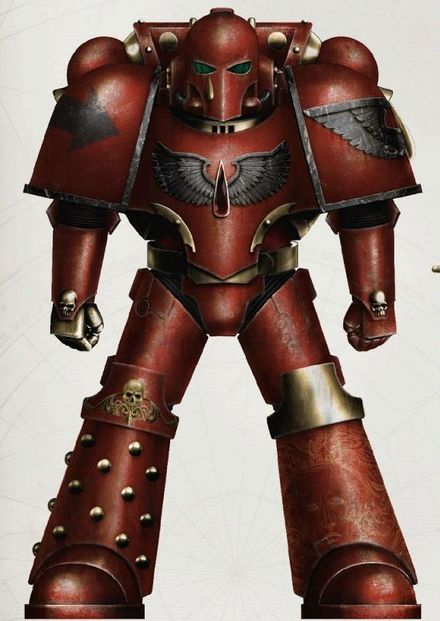

<!-- A0403-B0074 -->

原译文

Great Crusade-era Blood Angels Marine 大远征时期圣血天使星际战士

**校订译文**

Great Crusade-era Blood Angels Marine 大远征时期圣血天使星际战士

<!-- /A0403-B0074 -->

<!-- A0403-B0075 -->
**英文原文**

However, despite their newfound fame and nobility, the Legion continued to battle with its own demons. The bloodlust that defined the early Legion remained, and Sanguinius desperately sought to both keep it a secret and find any solution he could to elevate it.

<!-- /A0403-B0075 -->

<!-- A0403-B0076 -->

原译文

然而，尽管他们获得了新的名声和高贵地位，但军团仍继续与自己的恶魔作战。定义早期军团的嗜血欲望仍然存在，圣吉列斯拼命地试图保守秘密，并找到任何可能的解决方案来提升它。

**校订译文**

然而，尽管已赢得声望与高贵的形象，军团仍在与自身的阴暗本性搏斗。早期军团的嗜血欲望并未消失，圣吉列斯竭力隐瞒这一秘密，同时寻找一切可能的办法来缓解它。

**校注：** 英文 elevate it 与寻求解决嗜血问题的上下文不合，疑为 alleviate it 笔误；本稿按缓解理解，并保留源文疑点。

<!-- /A0403-B0076 -->

<!-- A0403-B0077 -->
### Notable Battles during the Great Crusade 大远征时期的著名战斗

<!-- /A0403-B0077 -->

<!-- A0403-B0078 -->

原译文

Conquest of Neptune 征服海王星

**校订译文**

Conquest of Neptune 征服海王星

<!-- /A0403-B0078 -->

<!-- A0403-B0079 -->

原译文

Melchior Compliance 梅尔基奥尔征服

**校订译文**

Melchior Compliance 梅尔基奥尔征服

<!-- /A0403-B0079 -->

<!-- A0403-B0080 -->

原译文

Compliance of Muspel 姆斯佩尔征服

**校订译文**

Compliance of Muspel 姆斯佩尔征服

<!-- /A0403-B0080 -->

<!-- A0403-B0081 -->
**英文原文**

The Defense of Helioret and destruction of the Craftworld Magc'Sithraal — Aided by the Ordo Sinister

<!-- /A0403-B0081 -->

<!-- A0403-B0082 -->

原译文

防御赫利俄雷与摧毁方舟世界玛格’希瑟拉尔 — 在攘外修会的帮助下

**校订译文**

赫利俄雷防御战与方舟世界玛格’希瑟拉尔的毁灭——得到噩兆修会支援。

<!-- /A0403-B0082 -->

<!-- A0403-B0083 -->
**英文原文**

The Praxil Compliance — Waged alongside the Imperial Fists and Emperor's Children Legions

<!-- /A0403-B0083 -->

<!-- A0403-B0084 -->

原译文

普拉克西征服 — 与帝国之拳和帝皇之子军团并肩作战

**校订译文**

普拉克西征服 — 与帝国之拳和帝皇之子军团并肩作战

<!-- /A0403-B0084 -->

<!-- A0403-B0085 -->
**英文原文**

The Ullanor Crusade alongside several other Legions under Horus

<!-- /A0403-B0085 -->

<!-- A0403-B0086 -->

原译文

乌兰诺远征与荷鲁斯领导下的其他几个军团一起

**校订译文**

乌兰诺远征——与荷鲁斯统领的其他数支军团共同参战。

<!-- /A0403-B0086 -->

<!-- A0403-B0087 -->
**英文原文**

War on Murder — Blood angels Marines fought on the planet named One-Forty-Twenty, aka "Murder" against the arachnoid race dubbed "Megarachnids"

<!-- /A0403-B0087 -->

<!-- A0403-B0088 -->

原译文

谋杀战争 — 圣血天使星际战士在名为1-40-20的行星上作战，又名“谋杀”，对抗被称为“巨蛛怪”的蜘蛛种族

**校订译文**

谋杀星之战——圣血天使在编号为1-40-20、别称“谋杀”的行星上，对抗被称为巨蛛怪的蛛形种族。

<!-- /A0403-B0088 -->

<!-- A0403-B0089 -->
### The Horus Heresy 荷鲁斯之乱

原题：The Horus Heresy 荷鲁斯叛乱

<!-- /A0403-B0089 -->

<!-- A0403-B0090 -->
### Signus Prime 西格纳斯主星

<!-- /A0403-B0090 -->

<!-- A0403-B0091 -->
**英文原文**

In an attempt to divide those loyalist legions he could not sway to Chaos, Horus dispatched the Blood Angels to the farthest reaches of space, where they unwittingly walked in traps of his and his masters devising. The Blood Angels mission to the Signus Cluster, near to the galactic core in the Ultima Segmentum, was one such venture, where the system of 7 planets and 15 moons had been taken over in bloody slaughter by the daemonic hordes of a Greater Daemon of Slaanesh, Kyriss the Perverse. Thinking that they were arriving to liberate humans from their xeno-overlords, Sanguinius had no reason to suspect that his best friend, the Warmaster Horus, would betray him.

<!-- /A0403-B0091 -->

<!-- A0403-B0092 -->

原译文

为了分裂那些他无法动摇的忠诚军团，荷鲁斯派遣圣血天使前往太空最远的地方，在那里他们不知不觉地陷入了他和他的主人设计的陷阱。圣血天使前往极限星域星系核心附近的西格纳斯星群的任务就是这样一次冒险，在那里，由7颗行星和15颗卫星组成的星系被色孽大魔扭曲者凯瑞斯的恶魔部落血腥屠杀。圣吉列斯认为他们的到来是为了将人类从异型霸主手中解放出来，因此没有理由怀疑他最好的朋友战帅荷鲁斯会背叛他。

**校订译文**

为了拆散那些无法被诱入混沌的忠诚军团，荷鲁斯将他们遣往遥远的星域，使其不知不觉踏入自己与背后主宰布置的陷阱。圣血天使前往西格纳斯星群的任务便是其中之一。该星群位于极限星域，靠近银河核心；其中由七颗行星和十五颗卫星组成的星系，已被色孽大魔“扭曲者”凯瑞斯率领的恶魔大军在血腥屠杀中占领。圣吉列斯以为此行是要将人类从异形统治者手中解放出来，丝毫没有理由怀疑挚友战帅荷鲁斯会背叛自己。

<!-- /A0403-B0092 -->

<!-- A0403-B0093 -->
**英文原文**

When the Blood Angels fleet arrived in system, they were assaulted by Chaos energies, ravaging their Navigators and Astropaths, killing many outright, as well sending mad panic through the Legion's ship serfs and auxiliaries, who until then had never felt the effects of Chaos. Most Space Marines were immune to its effects due to their training and iron-will, leaving those few not driven mad to restrain the crazed crew members and erect psychic baffles. The daemon conqueror of Signus, Kyriss, had time however to beam an image of itself to the Legion's Primarch, challenging him to take back Slaanesh's newest conquest. At this Sanguinius gathered his senior officers and organised a counterattack against a foe they had no experience fighting. Sure of their victory, Sanguinius declared This foul creature will know what it is to face my wrath. I shall strike him down, I shall be an Angel of Vengeance!

<!-- /A0403-B0093 -->

<!-- A0403-B0094 -->

原译文

当圣血天使舰队抵达星系时，他们遭到了混沌能量的袭击，蹂躏了他们的导航者和星语者，直接杀死了许多人，并通过军团的舰船侍从和辅助军发出了疯狂的恐慌，在此之前，他们从未感受到混沌的影响。由于他们的训练和钢铁般的意志，大多数星际战士对它的影响免疫，让那些少数人没有发疯，以约束疯狂的船员并竖起灵能挡板。然而，西格纳斯的恶魔征服者凯瑞斯有时间向军团的原体投射自己的形象，挑战他夺回色孽的最新征服。在此，圣吉列斯召集了他的高级军官，组织了一次反击，对抗他们没有战斗经验的敌人。圣吉列斯确信他们的胜利，他宣称这个肮脏的生物会知道面对我的愤怒是什么。我将打倒他，我将成为复仇天使！

**校订译文**

圣血天使舰队一进入星系，就遭到混沌能量侵袭。导航员和星语者受到重创，许多人当场死亡；从未接触过混沌力量的舰船侍从与辅助人员也陷入极度恐慌。多数星际战士凭借训练与钢铁般的意志抵御了影响，而少数仍保持清醒的人员则负责制住发狂的船员、架设灵能屏障。占领西格纳斯的恶魔凯瑞斯趁机向原体投射自己的形象，挑衅他前来夺回色孽的新领地。圣吉列斯随即召集高级军官，筹划反击这种从未交战过的敌人。他坚信必将获胜，宣告道：“这污秽之物将领教我的怒火。我必将它击倒，成为复仇的天使！”

**校注：** 英文先称多数星际战士免受影响，后用 those few not driven mad，指代略含混；后者按仍清醒的人员处理，不擅改成多数星际战士发疯。

<!-- /A0403-B0094 -->

<!-- A0403-B0095 -->
**英文原文**

With Signus Prime covered from pole to pole with the result of daemonic invasion, with millions lying dead in the streets or held in prison camps to await daemonic whims, with cities razed, oceans boiled away and plains burned to cinders, the Blood Angels Legion struck in a furious assault, falling from the skies to engage crazed cultists and packs of hideous daemons upon the Plains of the Damned. Sanguinius swore to personally cast Kyriss down and vanquish him, so hence made for the Cathedral of the Mark, the daemon's lair. However, outside its entrance, Sanguinius was faced with the single greatest foe who would have the greatest effect on his Legion and its descendants down the millennia: Ka'Bandha, Greater Daemon and Bloodthirster of Khorne.

<!-- /A0403-B0095 -->

<!-- A0403-B0096 -->

原译文

随着恶魔入侵的结果，西格纳斯主星从一个极点到另一个极点，数百万人躺在街上死去或被关押在营地监狱等待恶魔的心血来潮，城市被夷为平地，海洋被煮沸，平原被烧成灰烬，圣血天使军团发动了猛烈的攻击，从天上降落，与疯狂的邪教徒和一群可怕的恶魔在被诅咒的平原上交战。圣吉列斯发誓要亲自将凯瑞斯打倒并击败他，因此前往恶魔的巢穴马克大教堂。然而，在其入口之外，圣吉列斯面临着一个最大的敌人，它将在数千年内对他的军团及其继承者产生最大的影响：卡’班哈、大魔和恐虐嗜血狂魔。

**校订译文**

恶魔入侵的灾祸遍及西格纳斯主星两极之间的每一寸土地：数百万人横尸街头，或被囚于集中营，任由恶魔随意处置；城市夷为平地，海洋被蒸干，平原烧成灰烬。圣血天使军团从天而降，在诅咒平原向疯狂的邪教徒与成群狰狞的恶魔发起猛烈突击。圣吉列斯发誓亲手击败凯瑞斯，直奔它盘踞的印记大教堂。然而，在入口外挡住他的，是一名将对军团及其后裔造成数千年影响的强敌：恐虐大魔、嗜血狂魔卡’班哈。

**校注：** Cathedral of the Mark 为印记大教堂，Mark 此处不是人名马克。Ka’Bandha 源文另作 Ka’Bhanda，中文统一卡’班哈。

<!-- /A0403-B0096 -->

<!-- A0403-B0097 -->
**英文原文**

Confronting the Angel, the Bloodthirster spoke, attempting to sway him to Chaos, Why do you fight us, so called Angel? You may be able to best me, but you cannot hope to defeat Chaos. My Lord Khorne is powerful beyond means you can measure. Your Emperor is weak and foolish, even now he hides from us. Is he afraid to fight? Sanguinius rebuked this, commanding the daemon to get out of his way, to allow him to cast down his master or be destroyed, to which Ka'Bhanda scoffed that his only master is Khorne, that he does not realise the threat which the daemons and Chaos hold for humanity and that their ally Horus has led Sanguinius into a trap whilst moving to lay siege against Terra. Ka'Bhanda further tempts Sanguinius once more, to join the forces of Khorne and destroy Kyriss and rule the Signus Cluster.

<!-- /A0403-B0097 -->

<!-- A0403-B0098 -->

原译文

面对天使，嗜血狂魔开口了，试图把他推向混沌，你为什么要和我们战斗，所谓的天使？你也许能打败我，但你不能指望打败混沌。我主恐虐的力量是你无法衡量的。你的帝皇软弱又愚蠢，甚至现在他还躲着我们。他害怕战斗吗？圣吉列斯斥责了这一点，命令恶魔让开，让他放弃他的主人或被摧毁，卡’班哈嘲笑说，他唯一的主人是恐虐，他没有意识到恶魔和混沌对人类的威胁，他们的盟友荷鲁斯在围攻泰拉的同时将圣吉列斯带入了陷阱。卡’班哈再次引诱圣吉列斯加入恐虐的部队，摧毁凯瑞斯并统治西格纳斯星群。

**校订译文**

嗜血狂魔面对天使开口，试图诱他归附混沌：“所谓的天使，你为什么与我们为敌？你或许能胜过我，却休想击败混沌。我主恐虐的力量远超你的想象。你的帝皇软弱而愚蠢，此刻还在躲避我们。他不敢应战吗？”圣吉列斯怒斥恶魔，命它让路，好让自己去击败它的主子，否则就连它一并消灭。卡’班哈嘲笑道，自己唯一的主人是恐虐；圣吉列斯根本不明白恶魔与混沌对人类构成何等威胁。他还宣称，盟友荷鲁斯已将圣吉列斯引入陷阱，自己正赶往泰拉发起围攻。卡’班哈再次劝诱圣吉列斯加入恐虐、消灭凯瑞斯，并统治整个西格纳斯星群。

**校注：** allow him to cast down his master 中 him 指圣吉列斯、his master 是被他视作恶魔主人的凯瑞斯；原译误作让恶魔放弃主人。

<!-- /A0403-B0098 -->

<!-- A0403-B0099 -->
**英文原文**

Sanguinius rejected the news that Horus was lying in bed with daemons, claiming it as lies and proclaiming that nothing could entice him to spit on his oath of loyalty to the Emperor, from which he launched himself at the daemon, whilst his finest ten companies of veterans, Dreadnoughts and Terminators charged into the horde of bloodletters, hounds and furies swarming around the Bloodthirster. Plasma fire boiled daemon blood and talons cleaved power armour and gene-enhanced bone whilst the Angel pushed against the Bloodthirster, a flurry of blows from his great sword meeting the daemons axe time and time again, yet still succeeding in driving him back. Seizing the initiative, Sanguinius stabbed Ka'Bhanda through the chest, casting a terrible wound. The daemon replied in pain and anger with a lash of his great whip which caught the Angel's legs and crushed them within its coils before being knocked to the ground be the flat of his foes axe. With the beast towering over him he taunted it, Come at me again, daemon! Feel the lick of my sword a second time if you dare! to which Ka'Bhanda replied I let you live this time, manling. Your legs will heal but this wound will always fester. It was at this moment that the beast let loose a mighty howl and darted across the battlefield, cutting down no less that five hundred sons of Sanguinius. The psychic backlash caused by the loss of so many of his sons cast Sanguinius into unconsciousness.

<!-- /A0403-B0099 -->

<!-- A0403-B0100 -->

原译文

圣吉列斯否认了荷鲁斯与恶魔共事的消息，声称这是谎言，并宣称没有什么能诱使他违背对帝皇的忠诚誓言，他从誓言中向恶魔发起攻击，而他最优秀的十个连队的老兵、无畏和终结者则冲进了嗜血狂魔、猎犬和怒妖的大军中。等离子火焰沸腾了恶魔的血液，利爪劈开了动力盔甲和基因增强的骨骼，而天使则推着嗜血狂魔，他的大剑一次又一次地与恶魔的斧头相撞，成功地将它击退。圣吉列斯抓住了主动权，刺伤了卡’班哈的胸部，造成了可怕的伤口。恶魔痛苦而愤怒地回应，他的巨鞭抽动，抓住了天使的腿，把他压在了鞭子的圈里，然后被敌人的斧头砍倒在地。野兽高高地站在他身上，他嘲讽道：“又来了，恶魔！如果你敢，就第二次感受我剑的舔舐吧！”卡’班哈回答说，这次我让你活下去，人类。你的腿会愈合，但这个伤口会一直溃烂。就在这一刻，野兽发出一声巨大的嚎叫，冲过战场，砍倒了不下五百个圣吉列斯的子嗣。失去这么多子嗣造成的精神反击使圣吉列斯陷入昏迷。

**校订译文**

圣吉列斯拒绝相信荷鲁斯与恶魔勾结，斥其为谎言，并宣告没有任何事物能诱使自己背弃对帝皇的忠誓。随即，他扑向恶魔；麾下最精锐的十个连队——老兵、无畏机甲与终结者——也冲进嗜血狂魔周围成群的放血者、猎犬和怒妖之中。等离子火焰将魔血烧得沸腾，利爪劈开动力甲与基因强化的骨骼。天使挥舞巨剑，接连撞上恶魔的战斧，仍一步步将对手逼退。他抓住先机，一剑贯穿卡’班哈的胸膛，造成重创。恶魔在痛怒中甩出巨鞭，缠住天使双腿并将腿骨勒碎，继而用斧面将他击倒。巨兽俯视着倒地的原体，圣吉列斯仍挑衅道：“再来啊，恶魔！有胆就再尝一次我的剑锋！”卡’班哈回答：“这次我饶你一命，小小人类。你的双腿会愈合，但这一道伤口将永远溃烂。”话音刚落，它厉声咆哮，掠过战场，杀死了不少于五百名圣吉列斯之子。如此众多子嗣同时丧命引发的灵能反冲，令圣吉列斯陷入昏迷。

**校注：** bloodletters 与 Bloodthirster 是不同恶魔，前者改放血者，避免把整支杂兵军队误写为嗜血狂魔。flat of the axe 为斧面拍击，不是斧刃砍中。源句施受结构有笔误，按完整交战过程疏通。

<!-- /A0403-B0100 -->

<!-- A0403-B0101 图片 -->
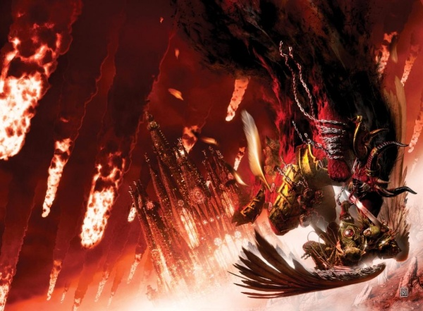

<!-- A0403-B0102 -->

原译文

Sanguinius and Ka'Bandha duelling in midair 圣吉列斯和卡’班哈在半空中决斗

**校订译文**

Sanguinius and Ka'Bandha duelling in midair 圣吉列斯和卡’班哈在半空中决斗

<!-- /A0403-B0102 -->

<!-- A0403-B0103 -->
**英文原文**

With their progenitor cast down the Blood Angels redoubled their efforts, becoming filled with a dark berserker fury which drove them to destroy the daemon horde and cleanse all of Signus Prime. Those daemons who did not fall by their blades fled back into the Immaterium along with their overlord Kyriss. As they came to victory, their rage and fury subsided, whereupon they became aware of their victory, however they had no reason to celebrate with thousands of their brothers lying amongst the daemon dead, their Primarch cast down and the dark shadow of the rage and fury they had so recently possessed looming upon their souls. When their father awoke, his legs were already healing due to his genetic abilities as a Primarch, however nothing could be done for searing anguish he felt for the loss of his sons at the hands of Ka'Bhanda. Within a few days he could manage to walk, but the agony upon his soul would not abate and with this heavy weight, he vowed that whatever the future, whatever the cost, he would rain vengeance down upon the daemon Ka'Bhanda.

<!-- /A0403-B0103 -->

<!-- A0403-B0104 -->

原译文

随着他们的先驱倒下，圣血天使加倍努力，充满了黑暗的狂暴怒火，驱使他们摧毁恶魔部落，净化西格纳斯主星的所有。那些没有被剑刃砍倒的恶魔，和他们的霸主凯瑞斯一起逃回了非物质界。当他们走向胜利时，他们的愤怒和狂怒消退了，于是他们意识到了自己的胜利，然而，他们没有理由和成千上万躺在死去的恶魔中的兄弟一起庆祝，他们的原体倒下了，他们最近拥有的愤怒和狂暴的阴影笼罩着他们的灵魂。当他们的父亲醒来时，由于他作为一名原体的基因能力，他的腿已经痊愈了，但他对子嗣在卡’班哈手中丧生的灼热痛苦无能为力。几天之内，他就可以走路了，但他灵魂上的痛苦并没有减轻，带着这沉重的负担，他发誓，无论未来如何，无论付出什么代价，他都会向恶魔卡’班哈复仇。

**校订译文**

始祖倒下后，圣血天使被一股阴暗的狂战之怒充满，攻势倍加猛烈。他们摧毁恶魔大军，净化了整颗西格纳斯主星。未死于刀下的恶魔随凯瑞斯一同逃回非物质界。待怒火渐息，战士们才意识到自己已取得胜利；然而，成千上万的兄弟与恶魔尸骸一同倒卧沙场，原体昏迷不醒，刚刚支配过他们的暴怒又在灵魂上投下阴影，他们无心庆祝。圣吉列斯醒来时，凭借原体的基因恢复能力，双腿已开始愈合；但子嗣惨死于卡’班哈之手带来的剧痛却无从抚平。几天后，他便能行走，灵魂的创痛却仍未减轻。他背负这份痛苦发誓：无论未来如何，无论付出什么代价，都要向卡’班哈复仇。

<!-- /A0403-B0104 -->

<!-- A0403-B0105 -->
**英文原文**

It was then that the message from Rogal Dorn of the Imperial Fists was received, calling them back to Terra. The Blood Angels did not need to be informed of the severity of the situation facing them and thus they set about evacuating all personnel from Signus back to the fleet, stowing the corpses of the fallen to be buried later on the slopes of Mount Seraph. Sanguinius ordered that no trace of the Legion remain in the Signus system and that the few surviving inhabitants be transported to nearby systems. Lastly warning beacons were stationed at the warp-jump points to ward off the unwary from visiting any of the planets or moons. Signus was to be left lifeless and rotting. Meanwhile, the Blood Angels' homeworld of Baal endured an extended siege by traitor forces.

<!-- /A0403-B0105 -->

<!-- A0403-B0106 -->

原译文

就在那时，收到了帝国之拳的罗格·多恩的信息，召唤他们回到泰拉。圣血天使不需要被告知他们面临的情况的严重性，因此他们着手将所有人员从西格纳斯疏散回舰队，将倒下的尸体堆放在撒拉弗山的斜坡上，稍后埋葬。圣吉列斯命令在西格纳斯行星中不留下军团的痕迹，并将少数幸存的居民运送到附近的星系。最后，在亚空间跳跃点设置了警告信标，以防止粗心的人访问任何行星或卫星。西格纳斯变得死气沉沉，腐烂不堪。与此同时，圣血天使的家园世界巴尔遭受了叛徒势力的长期围困。

**校订译文**

就在此时，帝国之拳的罗格·多恩传来消息，召他们返回泰拉。圣血天使无需别人解释便已明白形势何等严峻，立即着手将所有人员从西格纳斯撤回舰队，并收殓阵亡者遗体，以待日后安葬于撒拉弗山的山坡。圣吉列斯命令清除军团在西格纳斯星系留下的一切痕迹，将仅存的少数居民送往附近星系，最后又在亚空间跳跃点设置警告信标，阻止不知情者前往当地任何行星或卫星。西格纳斯将被弃置，任其在死寂中腐朽。与此同时，圣血天使的母星巴尔也正遭叛军长期围困。

**校注：** 遗体先收殓运走，日后才葬于撒拉弗山；原译误成已堆放在山坡上。

<!-- /A0403-B0106 -->

<!-- A0403-B0107 -->
### Imperium Secundus 第二帝国

<!-- /A0403-B0107 -->

<!-- A0403-B0108 -->
**英文原文**

After the battle in the Signus Cluster, the Blood Angels were able to link up with Ultramar and under the watchful eyes of Roboute Guilliman Sanguinius was eventually crowned Emperor of Imperium Secundus.

<!-- /A0403-B0108 -->

<!-- A0403-B0109 -->

原译文

在西格纳斯星群的战斗之后，圣血天使能够与极限战士联系起来，并在罗伯特·基里曼的警惕之眼下，圣吉列斯最终加冕为第二帝国皇帝。

**校订译文**

西格纳斯星群之战结束后，圣血天使设法与奥特拉玛会合。最终，在罗保特·基里曼的注视下，圣吉列斯加冕为第二帝国的皇帝。

**校注：** Ultramar 是奥特拉玛地区，不是 Ultramarines 极限战士。

<!-- /A0403-B0109 -->

<!-- A0403-B0110 -->
**英文原文**

Ultimately after a number of disasters, clashes between Guilliman, Sanguinius, and Lion El'Jonson, and a vision by Sanguinius that the Emperor was alive, Imperium Secundus was abolished. The three Primarchs led their Legions in an attempt to breach the Ruinstorm and reach Terra. Through an arduous journey, they eventually reached Davin, the nexus of the Ruinstorm, and engaged a vast Daemonic host. After the battle and the destruction of Davin, a way to Terra through the Ruinstorm was clear. However in their way stood many enemy blockades as Horus had foreseen this route. Sanguinius and the Blood Angels raced directly for Terra, as was their destiny, while Guilliman and Lion El'Jonson led the Ultramarines and Dark Angels in diversionary attacks against Horus's blockade.

<!-- /A0403-B0110 -->

<!-- A0403-B0111 -->

原译文

最终，在经历了一系列灾难、基里曼、圣吉列斯和莱昂·艾尔庄森之间的冲突，以及圣吉列斯认为帝皇还活着的幻象之后，第二帝国被废除。三位原体率领他们的军团试图突破毁灭风暴，到达泰拉。经过一段艰苦的旅程，他们最终到达了毁灭风暴的中心戴文，并与一位庞大的恶魔宿主战斗。在战斗和戴文的毁灭之后，通过毁灭风暴前往泰拉的道路变得清晰起来。然而，由于荷鲁斯预见到了这条路线，许多敌人封锁了他们。圣吉列斯和圣血天使直接冲向泰拉，这是他们的命运，而基里曼和莱昂·艾尔庄森则带领极限战士和黑暗天使对荷鲁斯的封锁进行了转移注意力的攻击。

**校订译文**

经历一系列灾难，以及基里曼、圣吉列斯和莱昂·艾尔’庄森之间的冲突后，圣吉列斯又在异象中得知帝皇仍然活着，第二帝国最终被废止。三位原体率军尝试突破毁灭风暴、赶赴泰拉。历经艰难旅程，他们终于抵达风暴的枢纽戴文，与庞大的恶魔军势交战。战斗结束、戴文被毁后，一条穿过毁灭风暴、通往泰拉的道路显现出来。然而，荷鲁斯早已预见这一路线，沿途布下重重封锁。圣吉列斯率圣血天使直奔泰拉，迎接自己的命运；基里曼与莱昂·艾尔’庄森则分别带领极限战士和黑暗天使，对荷鲁斯的封锁部队发动牵制攻击。

**校注：** Daemonic host 指恶魔大军，原译误作恶魔宿主。

<!-- /A0403-B0111 -->

<!-- A0403-B0112 -->
### Siege of Terra 泰拉围城

<!-- /A0403-B0112 -->

<!-- A0403-B0113 -->
**英文原文**

The Blood Angels were one of the few Legions who fought alongside the Emperor during the Battle of Terra. Led by Sanguinius, the Blood Angels fought with particular renown at the Eternity Gate. During the clash, Sanguinius banished first Ka'Bandha and then Angron back to the Warp. Later, both Sanguinius and Raldoron led a Blood Angels contingent as the Emperor launched a boarding action of Horus' flagship Vengeful Spirit. Separated from his sons, it was here that Sanguinius finally faced his destiny battling the traitorous Warmaster, dying in the process.

<!-- /A0403-B0113 -->

<!-- A0403-B0114 -->

原译文

圣血天使是在泰拉之战中与帝皇并肩作战的少数军团之一。在圣吉列斯的带领下，圣血天使在永恒之门进行了特别著名的战斗。在冲突中，圣吉列斯首先将卡’班哈放逐，然后将安格隆驱逐回亚空间。后来，当帝皇发动荷鲁斯旗舰复仇之魂号的跳帮行动时，圣吉列斯和拉多隆都率领了一支圣血天使小队。圣吉列斯与子嗣分开后，终于在这里面对了与叛徒战帅作战的命运，并在此过程中牺牲。

**校订译文**

圣血天使是泰拉之战中与帝皇并肩作战的少数军团之一。在圣吉列斯统领下，他们在永恒之门的战斗尤负盛名。圣吉列斯在此先后将卡’班哈和安格隆放逐回亚空间。后来，帝皇对荷鲁斯的旗舰复仇之魂号发动跳帮行动，圣吉列斯与拉多隆一同率领一支圣血天使部队参战。圣吉列斯在舰上与子嗣失散，最终独自面对命运，与叛徒战帅交锋，并在战斗中牺牲。

<!-- /A0403-B0114 -->

<!-- A0403-B0115 图片 -->
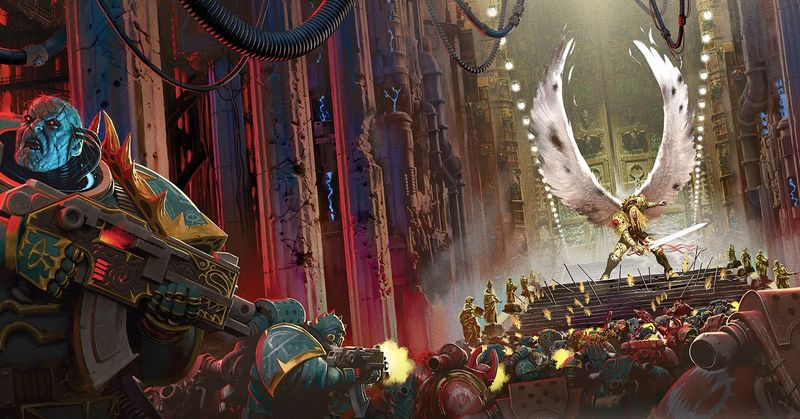

<!-- A0403-B0116 -->

原译文

Sanguinius leads the defence of the Eternity Gate 圣吉列斯领导永恒之门的防御

**校订译文**

Sanguinius leads the defence of the Eternity Gate 圣吉列斯领导永恒之门的防御

<!-- /A0403-B0116 -->

<!-- A0403-B0117 -->
**英文原文**

The death of Sanguinius caused the Black Rage to suddenly fall upon the Blood Angels, both on the Vengeful Spirit and Terra. Bombarded by horrific visions of their gene-father's murder, the Blood Angels rampaged across the battlefield and butchered both loyalist and traitor alike. The madness eventually passed and the Emperor victorious in striking down Horus, and in the aftermath of the siege Raldoron, Azkaellon, Nassir Amit, and 500 other surviving Blood Angels held a funeral service for Sanguinius.

<!-- /A0403-B0117 -->

<!-- A0403-B0118 -->

原译文

圣吉列斯的死导致黑怒突然降临到复仇之魂号和泰拉的圣血天使身上。圣血天使被他们基因之父被杀害的可怕幻象轰炸，在战场上横冲直撞，屠杀了忠诚者和叛徒。疯狂终于过去了，帝皇战胜了荷鲁斯，在围城之后，拉多隆、阿兹卡隆、纳西尔·阿米特和其他500名幸存的圣血天使为圣吉列斯举行了葬礼。

**校订译文**

圣吉列斯死去的瞬间，黑怒同时降临于复仇之魂号和泰拉上的圣血天使。基因之父遇害的恐怖异象不断冲击他们的心灵，驱使他们在战场上疯狂屠戮，不分忠诚者与叛徒。这场疯狂终于消退，帝皇也击倒荷鲁斯、赢得胜利。围城结束后，拉多隆、阿兹卡隆、纳西尔·阿米特以及另外五百名幸存的圣血天使，为圣吉列斯举行了葬礼。

<!-- /A0403-B0118 -->

<!-- A0403-B0119 -->
### Post-Heresy 叛乱后

<!-- /A0403-B0119 -->

<!-- A0403-B0120 -->
**英文原文**

After the Heresy, Raldoron became the new master of the Blood Angels as the Black Rage began to manifest regularly. It fell to the Sanguinary Priests of the Chapter to try and control those suffering from the Black Rage. Yet in the countless generations since the Heresy, genetic deteriorations in the Blood Angels gene-seed have seen an increase in this flaw.

<!-- /A0403-B0120 -->

<!-- A0403-B0121 -->

原译文

叛乱之后，随着黑怒开始定期显现，拉多隆成为了圣血天使的新主人。这落在了战团的圣血祭司身上，他们试图控制那些遭受黑怒的人。然而，在叛乱以来的无数代人中，圣血天使基因种子的遗传恶化加剧了这一缺陷。

**校订译文**

叛乱结束后，拉多隆成为圣血天使的新统领，黑怒也开始反复显现。尝试控制黑怒患者的职责落在战团圣血祭司身上。然而，此后无数代人的基因种子持续退化，使这一缺陷愈发严重。

<!-- /A0403-B0121 -->

<!-- A0403-B0122 -->
**英文原文**

During the Second Founding of 021.M31, as with all other loyal Legions, the Blood Angels were forced to split into many smaller Chapters.

<!-- /A0403-B0122 -->

<!-- A0403-B0123 -->

原译文

在021.M31的二次建军期间，与所有其他忠诚的军团一样，圣血天使被迫分裂成许多较小的战团。

**校订译文**

在021.M31的二次建军期间，与所有其他忠诚的军团一样，圣血天使被迫分裂成许多较小的战团。

<!-- /A0403-B0123 -->

<!-- A0403-B0124 -->
### Hive Fleet Leviathan & Dark Imperium 利维坦虫巢舰队&黑暗帝国

<!-- /A0403-B0124 -->

<!-- A0403-B0125 -->
**英文原文**

Towards the end of the 41st Millennium a tendril of Hive Fleet Leviathan went on a direct course for the Blood Angels homeworld, Baal. Exacerbating this already terrible threat is a massive daemon army led by the dread bloodthirster Ka'Bandha, which has already struck at Ammonai, the outermost planet of the Baal system. Facing a possible war on two fronts, Commander Dante sends out a call for all Chapters descended from the Blood Angels to send forces to aid their ancestor Legion; the Flesh Tearers are the first to do so, deploying the entire Chapter for war. Ultimately all but the Lamenters do so, even the renegade Knights of Blood. The Blood Angels attempted to slow the Tyranid advance during the Cryptus Campaign.

<!-- /A0403-B0125 -->

<!-- A0403-B0126 -->

原译文

在第41个千年末期，虫巢舰队利维坦的卷须直接驶向圣血天使的家园巴尔。加剧这一已经可怕的威胁的是一支由可怕的嗜血狂魔卡’班哈领导的庞大的恶魔军队，该军队已经袭击了巴尔星系最外层的行星阿蒙奈。面对可能在两条战线上爆发的战争，但丁指挥官呼吁所有圣血天使的后裔派遣部队援助他们的先祖军团；撕肉者是第一个这样做的，将整个战团部署到战争中。最终，除了恸哭者，所有人都这样做了，甚至是变节者血骑士。圣血天使在冥府战役中试图减缓泰伦的前进。

**校订译文**

第41个千年末，利维坦虫巢舰队的一条触须航向圣血天使的母星巴尔。与此同时，嗜血狂魔卡’班哈率领的庞大恶魔军团已经袭击巴尔星系最外缘的行星阿蒙奈，令局势雪上加霜。面对两线作战的可能，但丁指挥官向所有圣血天使后裔战团发出召集，要求派兵援助母军团。撕肉者最先响应，举团投入战争。最终，除恸哭者外，各战团都派来了援军，连已叛离帝国的血骑士也不例外。圣血天使在冥府战役中尝试迟滞泰伦的推进。

<!-- /A0403-B0126 -->

<!-- A0403-B0127 -->
**英文原文**

Following the Thirteenth Black Crusade and the resurrection of Roboute Guilliman, the Great Rift divides the Imperium in two. Baal and the bulk of the Blood Angels are left stranded in the Dark Imperium and must face the Tyranids alone. In the subsequent Devastation of Baal Dante leads a desperate defense alongside several Successor Chapters but all seems lost until the arrival of Guilliman's Indomitus Crusade. Hive Fleet Leviathan is largely destroyed, ironically thanks to Daemonic hordes that formed as a result of the Great Rift. In the aftermath of the battle Belisarius Cawl and the Zar-Quaesitor arrives along with thousands of new Primaris Space Marine recruits to rebuild the shattered chapter. Brother Corbulo becomes fascinated with the Primaris Marines as a potential source for a cure to the Blood Angels flaw, and follows them into battle whenever he can. Meanwhile Dante is made Regent of Imperium Nihilus by Guilliman. However it has since become apparent that Primaris Marines are still vulnerable to the Black Rage and Primaris too have since been placed into the Death Company.

<!-- /A0403-B0127 -->

<!-- A0403-B0128 -->

原译文

在第十三次黑色远征和罗伯特·基里曼的复活之后，大裂隙将帝国一分为二。巴尔和大部分圣血天使被困在黑暗帝国，必须独自面对泰伦。在随后的巴尔的毁灭中，但丁与几个子战团一起进行了绝望的防御，但在基里曼的不屈远征到来之前，一切似乎都失败了。虫巢舰队利维坦在很大程度上被摧毁，具有讽刺意味的是，这要归功于大裂隙形成的恶魔部落。战斗结束后，贝利撒留·考尔和探索者之王号与数千名新的原铸星际战士新兵一起抵达，重建破碎的战团。科布罗兄弟对原铸星际战士着迷，认为这是治愈圣血天使缺陷的潜在来源，并尽可能地跟随他们投入战斗。与此同时，但丁被基里曼任命为帝国暗面的摄政王。然而，自那以后，很明显，原铸星际战士仍然容易受到黑怒的影响，原铸也被编入了死亡连。

**校订译文**

第十三次黑色远征之后，罗保特·基里曼复活，大裂隙将帝国一分为二。巴尔与圣血天使的大部分兵力被困在帝国暗面，只能独力迎战泰伦。随后的巴尔之毁中，但丁率多个子战团拼死坚守；局势一度近乎绝望，直到基里曼率不屈远征抵达。利维坦虫巢舰队遭到毁灭性打击，讽刺的是，这在很大程度上得益于大裂隙带来的恶魔大军。战后，贝利萨留斯·考尔乘探索者之王号抵达，带来数千名原铸星际战士新兵，重建损失惨重的战团。科布罗兄弟认为原铸战士或许藏着治愈圣血天使缺陷的线索，因此对他们深感兴趣，一有机会便随同作战。与此同时，基里曼任命但丁为帝国暗面摄政。然而，此后已证实原铸战士同样会受到黑怒侵袭，他们之中也开始有人被编入死亡连队。

<!-- /A0403-B0128 -->

<!-- A0403-B0129 -->
**英文原文**

Baal has become a nexus within the Dark Imperium for the war effort to reclaim the region. At Baal's Skyfall Orbital Dock, Dante is gathering the Fleet Nihilus.

<!-- /A0403-B0129 -->

<!-- A0403-B0130 -->

原译文

巴尔已经成为黑暗帝国内部夺回该地区的战争努力的纽带。在巴尔的天陨轨道码头，但丁正在召集暗面舰队。

**校订译文**

巴尔如今是帝国暗面的作战枢纽，承担着夺回这片地区的重任。但丁正于巴尔的天陨轨道船坞集结暗面舰队。

<!-- /A0403-B0130 -->

<!-- A0403-B0131 图片 -->
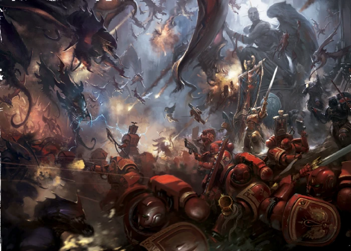

<!-- A0403-B0132 -->

原译文

Blood Angels battle the Tyranids 圣血天使与泰伦作战

**校订译文**

Blood Angels battle the Tyranids 圣血天使与泰伦作战

<!-- /A0403-B0132 -->

<!-- A0403-B0133 -->
### Other Battles 其他战斗

<!-- /A0403-B0133 -->

<!-- A0403-B0134 -->
### Timeline 时间线

<!-- /A0403-B0134 -->

<!-- A0403-B0135 -->
**英文原文**

544.M32: The War of the Beast — The Blood Angels and Novamarines manage to destroy an Ork Attack Moon. Later a force under Captain Valefor arrived at Terra to aid the throneworld on the push to Ullanor.

<!-- /A0403-B0135 -->

<!-- A0403-B0136 -->

原译文

野兽之战 — 圣血天使和新星战士设法摧毁了一个兽人战斗月球。后来，华利弗连长率领的一支部队抵达泰拉，协助王座世界向乌兰诺推进。

**校订译文**

544.M32：野兽之战——圣血天使与新星战士摧毁了一颗兽人战斗月球。后来，华利弗连长率军抵达泰拉，协助王座世界向乌兰诺推进。

**校注：** 本段及后续时间线补回原译遗漏的英文纪年；年代按源文保留。

<!-- /A0403-B0136 -->

<!-- A0403-B0137 -->
**英文原文**

996.M40: Secoris Tragedy — A boarding of an unknown Space Hulk infested with Genestealers met with disaster. The entire Chapter was nearly wiped out; only 50 Blood Angels survived.

<!-- /A0403-B0137 -->

<!-- A0403-B0138 -->

原译文

塞科里斯悲剧 — 登上一艘未知的太空废船，上面满是基因窃取者，遭遇了灾难。整个战团几乎被抹去；只有50名圣血天使幸存下来。

**校订译文**

996.M40：塞科里斯悲剧——圣血天使登上一艘遍布基因窃取者、身份不明的太空废船，却遭遇惨败。整个战团几乎覆灭，仅五十人幸存。

<!-- /A0403-B0138 -->

<!-- A0403-B0139 -->
**英文原文**

589.M41: Seeking revenge for the Brothers who died in the Secoris Tragedy in 996.M40, over eighty members of the Blood Angels First Company under the command of Captain Michaelus Raphael boarded the Space Hulk Sin of Damnation and utterly destroyed the aliens.

<!-- /A0403-B0139 -->

<!-- A0403-B0140 -->

原译文

为在996.M40在塞科里斯悲剧中丧生的兄弟们复仇，在米迦勒乌斯·拉斐尔连长的指挥下，圣血天使第一连队的80多名成员登上了太空废船诅咒之罪号，彻底摧毁了外星人。

**校订译文**

589.M41：为996.M40塞科里斯悲剧中的死难兄弟复仇，米迦勒乌斯·拉斐尔连长率圣血天使第一连八十余人登上太空废船诅咒之罪号，彻底消灭了其中的异形。

<!-- /A0403-B0140 -->

<!-- A0403-B0141 -->
**英文原文**

742.M41: First Tyrannic War — Dante sends 3 companies of Blood Angels to aid the Ultramarines against Hive Fleet Behemoth.

<!-- /A0403-B0141 -->

<!-- A0403-B0142 -->

原译文

第一次泰伦战争 - 但丁派遣了3个圣血天使连队来帮助极限战士对抗虫巢舰队贝希摩斯。

**校订译文**

742.M41：第一次泰伦战争——但丁派遣三个连的圣血天使，协助极限战士对抗贝希摩斯虫巢舰队。

<!-- /A0403-B0142 -->

<!-- A0403-B0143 -->
**英文原文**

798.M41: Assault on Baal — The Blood Angels' homeworld of Baal came under attack from the Orks of Waaagh! Big Skorcha. Though two of the three invading Ork space hulks were destroyed in orbit by the Blood Angels fleet and boarding parties, a third landed on the surface and disgorged thousands of Orks. The defences of the Blood Angels' fortress-monastery would have fallen if not for forty-one Dreadnoughts led by Furioso Astramael, who managed to hold off the Orks long enough for reinforcements to arrive from orbit and mop up the remaining Ork forces.

<!-- /A0403-B0143 -->

<!-- A0403-B0144 -->

原译文

对巴尔的攻击 — 圣血天使的家园世界巴尔遭到了兽人大烧烤炮的Waaagh！攻击。尽管三艘入侵的欧克太空废船中有两艘在轨道上被圣血天使舰队和跳帮队摧毁，但第三艘降落在行星表面上，涌出了数千名欧克。如果不是因为暴烈无畏阿斯塔麦尔领导的四十一名无畏，圣血天使堡垒修道院的防御就会沦陷，他设法挡住了欧克足够长的时间，以便增援部队从轨道上抵达并扫荡剩余的欧克部队。

**校订译文**

798.M41：巴尔突袭战——欧克蛮人“大烧烤炮”的Waaagh!进攻巴尔。三艘入侵的欧克蛮人太空废船中，两艘被圣血天使舰队及跳帮部队摧毁于轨道上；第三艘则落到地表，释放出数千名欧克蛮人。暴烈无畏阿斯塔麦尔率领四十一台无畏机甲死守阵地，为轨道援军争取到足够时间，最终扫清残余欧克蛮人。若非他们坚守，圣血天使的要塞修道院防线便会陷落。

<!-- /A0403-B0144 -->

<!-- A0403-B0145 -->
**英文原文**

941.M41: Second War for Armageddon — As Waaagh! Ghazghkull ravages the hive world of Armageddon, the Blood Angels, as well as their brothers from the Ultramarines and the Salamanders arrive to lend the beleaguered planet aid. Such was Commander Dante's reputation that Tu'shan and Calgar ceded overall command of the Space Marine strike force to him.

<!-- /A0403-B0145 -->

<!-- A0403-B0146 -->

原译文

第二次阿玛吉多顿战争 — 碎骨者的Waaagh！蹂躏了阿玛吉多顿巢都世界，圣血天使，以及他们的兄弟，来自极限战士和火蜥蜴，前来为陷入困境的行星提供援助。但丁指挥官的声誉如此之高，以至于图’杉和卡尔加将星际战士打击部队的总体指挥权交给了他。

**校订译文**

941.M41：第二次阿玛吉多顿战争——碎骨者的Waaagh!蹂躏阿玛吉多顿巢都世界。圣血天使与极限战士、火蜥蜴的战斗兄弟赶来增援。由于但丁指挥官声望卓著，图杉与卡尔加将整支星际战士打击部队的指挥权交给了他。

<!-- /A0403-B0146 -->

<!-- A0403-B0147 -->
**英文原文**

~900s.M41: The Arkio Insurrection — A civil war erupts among the Blood Angels. Eventually, Arkio is exposed as being part of a plan to tempt the chapter to Chaos and his insurrection is defeated.

<!-- /A0403-B0147 -->

<!-- A0403-B0148 -->

原译文

阿基奥叛乱 — 圣血天使之间爆发了内战。最终，阿基奥被揭露为诱使战团堕入混沌的计划的一部分，他的叛乱被击败了。

**校订译文**

约900年代.M41：阿基奥叛乱——圣血天使内部爆发内战。最终，众人揭露阿基奥是诱使战团堕入混沌的阴谋中的一环，并击败了叛乱。

<!-- /A0403-B0148 -->

<!-- A0403-B0149 -->
**英文原文**

998.M41: The Cryptus Campaign — Commander Dante leads much of the Blood Angels and their successors against the Tyranids of Hive Fleet Leviathan, which have massed in such force that Baal itself is threatened.

<!-- /A0403-B0149 -->

<!-- A0403-B0150 -->

原译文

冥府战役 — 但丁指挥官率领大部分圣血天使及其子战团对抗虫巢舰队利维坦的泰伦，它们集结了如此强大的力量，以至于巴尔本身也受到了威胁。

**校订译文**

998.M41：冥府战役——但丁指挥官率领圣血天使主力及子战团，迎战利维坦虫巢舰队的泰伦大军。虫群集结的规模已足以威胁巴尔本身。

<!-- /A0403-B0150 -->

<!-- A0403-B0151 -->
**英文原文**

998.M41: The Third War for Armageddon — Despite the bulk of the Chapter being deployed against the threat of Hive Fleet Leviathan, Commander Dante still deploys the 3rd Company led by Captain Tycho to Armageddon when the hive world falls under Warboss Ghazghkull's baleful attention once more.

<!-- /A0403-B0151 -->

<!-- A0403-B0152 -->

原译文

第三次阿玛吉多顿战争 — 尽管战团的大部分成员都是为了应对虫巢舰队利维坦的威胁而部署的，但当巢都世界再次受到战争头目碎骨者的恶意关注时，但丁指挥官仍然将第谷连长率领的第三连队部署到阿玛吉多顿。

**校订译文**

998.M41：第三次阿玛吉多顿战争——虽然战团主力正应对利维坦虫巢舰队，但兽人战争头目碎骨者再次将矛头指向阿玛吉多顿时，但丁仍派出第谷连长统领的第三连前往增援。

<!-- /A0403-B0152 -->

<!-- A0403-B0153 -->
**英文原文**

999.M41: Thirteenth Black Crusade — The Blood Angels contribute four companies to battle against Abaddon the Despoiler's 13th Black Crusade. They are deployed to push back Chaos forces advancing on Agripinaa and seek out their leader. In addition, Astorath and other Captains commanded the defence of the Diamor System in the Diamor Campaign.

<!-- /A0403-B0153 -->

<!-- A0403-B0154 -->

原译文

第十三次黑色远征 — 圣血天使派了四个连队来对抗掠夺者阿巴顿的第十三次黑色远征。他们被部署来击退向阿格里皮娜推进的混沌部队，并寻找他们的领导者。此外，阿斯托拉斯和其他连长在冥府战役中指挥了冥府星系的防御。

**校订译文**

999.M41：第十三次黑色远征——圣血天使派出四个连，迎击掠夺者阿巴顿发动的第十三次黑色远征。他们奉命击退向阿格里皮娜推进的混沌部队，并搜寻敌军首领。此外，阿斯托拉斯与多名连长还在迪亚莫尔战役中指挥了迪亚莫尔星系的防御。

**校注：** Diamor 与 Cryptus 是不同星系及战役，原译均作冥府造成混淆；Diamor 暂用音译迪亚莫尔。

<!-- /A0403-B0154 -->

<!-- A0403-B0155 -->
**英文原文**

???.M42: The Angel's Halo campaign against the remnants of Hive Fleet Leviathan

<!-- /A0403-B0155 -->

<!-- A0403-B0156 -->

原译文

天使的光环战役对抗虫巢舰队利维坦的残余势力

**校订译文**

???.M42：天使光环战役——对抗利维坦虫巢舰队残部。

<!-- /A0403-B0156 -->

<!-- A0403-B0157 -->
**英文原文**

???.M42: The Battle of Idolatros during the Arks of Omen Campaign. Dante leads a massive Blood Angels force alongside the Imperial Navy to relieve the Unforgiven under Azrael from the forces of Chaos.

<!-- /A0403-B0157 -->

<!-- A0403-B0158 -->

原译文

噩兆方舟战役中的盲信星之战。但丁率领一支庞大的圣血天使部队与帝国海军并肩作战，将阿兹瑞尔之下的不可饶恕者从混沌部队中解救出来。

**校订译文**

???.M42：噩兆方舟战役中的盲信星之战——但丁率庞大的圣血天使部队，与帝国海军协同行动，为阿兹瑞尔统领的戴罪者解围，迎击混沌大军。

<!-- /A0403-B0158 -->

<!-- A0403-B0159 -->
**英文原文**

???.M42: The Fourth Tyrannic War including the Battle of Bastior

<!-- /A0403-B0159 -->

<!-- A0403-B0160 -->

原译文

第四次泰伦战争，包括巴斯蒂奥之战

**校订译文**

???.M42：第四次泰伦战争，包括巴斯蒂奥之战。

<!-- /A0403-B0160 -->

<!-- A0403-B0161 -->
## Gene-seed 基因种子

<!-- /A0403-B0161 -->

<!-- A0403-B0162 -->
**英文原文**

The sons of Sanguinius are known to have handsome and noble features, mimicking that of their Primarch. They also have retractable fangs that are dubbed the Angel's Teeth.

<!-- /A0403-B0162 -->

<!-- A0403-B0163 -->

原译文

众所周知，圣吉列斯的子嗣长得英俊高贵，模仿他们的原体。他们还有可伸缩的尖牙，被称为天使之牙。

**校订译文**

圣吉列斯之子以英俊而高贵的面容闻名，容貌酷似原体。他们还拥有可伸缩的尖牙，称为“天使之牙”。

<!-- /A0403-B0163 -->

<!-- A0403-B0164 图片 -->
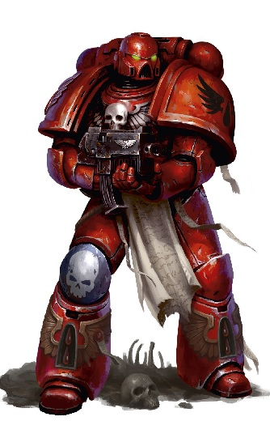

<!-- A0403-B0165 -->

原译文

Blood Angel 圣血天使

**校订译文**

Blood Angel 圣血天使

<!-- /A0403-B0165 -->

<!-- A0403-B0166 -->
### The Flaw 瑕疵

<!-- /A0403-B0166 -->

<!-- A0403-B0167 -->
**英文原文**

The Blood Angels and all their successors suffer from a psychological need to drink human blood. They call this "the Red Thirst". They have no real nutritional need for blood, but when they abstain from drinking it for a long time, they grow weaker and even age. Chapter Master Dante abstained from drinking blood for centuries, and he eventually developed wrinkled skin and white hair like on old man and likewise felt psychologically worn out. When Baal was attacked by Tyranids in 999.M41, Dante was too emotionally and physically exhausted to lead the defence, but then he drank the blood of one of his servants, killing the servant in the process, and he was rejuvenated both physically and mentally. On the other hand, if a Blood Angel does not resist the Red Thirst at all, he will eventually mutate into a monstrous form with fangs and a bat-like face, and walk on all fours like a gorilla.

<!-- /A0403-B0167 -->

<!-- A0403-B0168 -->

原译文

圣血天使和他们的所有子战团都有喝人血的心理需求。他们称之为“血渴”。他们对血液没有真正的营养需求，但当他们长时间不喝血液时，他们会变得更虚弱，甚至衰老。但丁几个世纪以来一直不喝血，最终他长出了像老人一样的皱纹皮肤和白发，同样感到心理疲惫。当巴尔在999.M41被泰伦袭击时，但丁在情感和身体上都筋疲力尽，无法领导防御，但后来他喝了一个仆人的血，在这个过程中杀死了这个仆人，他在身体和精神上都恢复了活力。另一方面，如果一个圣血天使根本不抵抗血渴，他最终会变异成一个有尖牙和蝙蝠般面孔的怪物，像大猩猩一样四肢着地行走。

**校订译文**

圣血天使及所有子战团都对饮用人血有一种心理上的渴求，称为“血渴”。他们并不需要血液来补充营养，但若长期不饮血，便会日渐虚弱，甚至衰老。但丁战团长曾数百年不饮血，结果皮肤生皱、头发斑白，精神也像老人一样疲惫。999.M41泰伦进攻巴尔时，他已身心俱疲，几乎无力指挥防御；后来，他饮下一名仆人的鲜血，致使对方死亡，自己则在身体与精神上都恢复了活力。另一方面，若一名圣血天使完全放任血渴，最终会变成生有尖牙、面似蝙蝠的怪物，像大猩猩一样以四肢行走。

<!-- /A0403-B0168 -->

<!-- A0403-B0169 -->
**英文原文**

The Blood Angels regularly drink bottled blood which is usually donated willingly by their serfs. They often mix this blood with wine, which they call "karash". However, blood is much more satisfying when taken directly from the body of a living person. It's even better if the victim dies in the process. The Blood Drinkers, a successor chapter of the Blood Angels, have a rite called the Rite of Holos wherein they start by drinking blood donated by their serfs but end with eating a prisoner alive. The death of that one prisoner is more satisfying than blood from a hundred serfs. The Blood Angels themselves have occasionally lost control and attacked and killed their own allies to have their blood even when they had plenty of bottled blood on hand.

<!-- /A0403-B0169 -->

<!-- A0403-B0170 -->

原译文

圣血天使经常喝瓶装血，这些血通常是侍从自愿捐献的。他们经常将这种血液与葡萄酒混合，他们称之为“卡拉什”。然而，直接从活人身上采集血液更令人满意。如果受害者在此过程中死亡，那就更好了。饮血者是圣血天使的子战团，他们有一个名为光环仪式的仪式，他们从喝侍从捐献的血液开始，但最后会吃了一个活着的囚犯。一个囚犯的死亡比一百个侍从的鲜血更令人满意。圣血天使偶尔会失去控制，攻击并杀死自己的盟友，即使他们手头有大量的瓶装血液。

**校订译文**

圣血天使平时会饮用瓶装血液，通常由侍从自愿捐献。他们常将血与葡萄酒混合，称之为“卡拉什”。不过，直接吸取活人的鲜血更能满足血渴；若对方因此死去，这种满足还会更强。子战团饮血者有一种“霍洛斯仪式”：开始时饮用侍从捐献的血液，最后则生吞一名囚犯。一个囚犯的死亡，带来的满足甚至超过一百名侍从的鲜血。圣血天使本身也曾失控，为了鲜血袭杀自己的盟友，哪怕手边还存有充足的瓶装血液。

**校注：** Holos 暂用音译霍洛斯；原译光环似误认作 halo。

<!-- /A0403-B0170 -->

<!-- A0403-B0171 -->
**英文原文**

All Blood Angels and their successors may one day suffer the Black Rage. When they succumb to this, typically in the heat of battle, they think they are their Primarch Sanguinius in battle with Horus. In the Black Rage, the sufferer struggles to distinguish friend from foe. He might even attack his own brothers, something with usually doesn't happen with the Red Thirst. The Black Rage is incurable, and so difficult to manage that those who succumb are relegated to either the Tower of the Lost on Baal or transferred to the Death Company. In the Death Company, they seek to find a quick honourable death on the field of battle.

<!-- /A0403-B0171 -->

<!-- A0403-B0172 -->

原译文

所有的圣血天使和他们的子战团可能有一天会遭受黑怒。当他们屈服于这种情况时，通常是在战斗最激烈的时候，他们认为自己是与荷鲁斯作战的原体圣吉列斯。在黑怒中，患者努力区分朋友和敌人。他甚至可能会攻击自己的兄弟，而血渴通常不会发生这种情况。黑怒是无法治愈的，而且很难控制，以至于那些屈服的人要么被转移到巴尔的迷失之塔，要么被转移到死亡连。在死亡连，他们试图在战场上找到一个快速光荣的死亡。

**校订译文**

所有圣血天使及其后裔都有可能在某一天陷入黑怒。黑怒通常在激战中发作，患者会以为自己就是正与荷鲁斯决斗的原体圣吉列斯。他们难以分辨敌我，甚至可能攻击自己的战斗兄弟；单纯的血渴通常不会导致这种情况。黑怒无法治愈，也极难控制，因此患者要么被关入巴尔的迷失之塔，要么转入死亡连队，在战场上寻求尽快而光荣地战死。

<!-- /A0403-B0172 -->

<!-- A0403-B0173 -->
**英文原文**

The origins of the Red Thirst and Black Rage is hotly debated by the Blood Angels and their successors. Some blame the process of Insanguination, others in deep rooted Chaos corruption in Sanguinius as he was transported to Baal. The Mechanicum has observed that Blood Angels have an overactive Omophagea, and this combined with their blood rituals may have caused them to become more strongly effected by past memories than others. Others discuss the impact of Baal Secundus's strange cocktail of chemical toxins and radiation, as well as past evidence of mutation among the populace.

<!-- /A0403-B0173 -->

<!-- A0403-B0174 -->

原译文

圣血天使及其子战团对血渴和黑怒的起源展开了激烈的争论。一些人将此归咎于染血过程，另一些人则将其归咎于圣吉列斯被运送到巴尔时根深蒂固的混沌腐化。机械教观察到，圣血天使有一种过度活跃的基因侦测神经，这与他们的血液仪式相结合，可能导致他们比其他人更强烈地受到过去记忆的影响。其他人讨论了巴尔二号奇怪的化学毒素和辐射混合物的影响，以及过去民众中突变的证据。

**校订译文**

圣血天使及其子战团始终激烈争论着血渴与黑怒的起源。有些人归咎于染血过程，有些人则认为圣吉列斯被抛送到巴尔途中遭受了根深蒂固的混沌腐蚀。机械教曾观察到，圣血天使的基因侦测神经过度活跃；这一特征与他们的血液仪式结合，可能使他们比其他战士更易受到过去记忆的影响。还有人探讨巴尔二号上化学毒素与辐射奇特的共同作用，以及当地居民过去存在变异的证据。

**校注：** 本段英文确为 Mechanicum，译作机械教；不因前后存在41千年语境而擅改为 Adeptus Mechanicus 机械修会。

<!-- /A0403-B0174 -->

<!-- A0403-B0175 -->
**英文原文**

The Blood Angels consider the Red Thirst to be shameful and keep it a secret from the rest of the Imperium, although by the end of the 41st millennium it has become an open secret, with many Imperials including Roboute Guilliman being aware of it. The Black Rage is also something of an open secret, though outsiders cannot distinguish it from the Red Thirst. The Blood Angels stave off the Red Thirst and Black Rage in part by practicing fine art as a hobby, such as painting or sculpting. Somehow this has a soothing effect on the inhuman beast inside all of them. The successor chapter Angels Penitent used to do the same but gave it up, and since then they suffer the Red Thirst and Black Rage at a much increased rate.

<!-- /A0403-B0175 -->

<!-- A0403-B0176 -->

原译文

圣血天使认为血渴是可耻的，并对帝国的其他成员保密，尽管到第41个千年结束时，它已经成为一个公开的秘密，包括罗伯特·基里曼在内的许多帝国成员都意识到了这一点。黑怒也是一个公开秘密，尽管外界无法将其与血渴区分开来。圣血天使通过将绘画或雕塑等美术作为爱好来避免血渴和黑怒。不知何故，这对他们所有人内心的非人野兽都有舒缓作用。子战团悔罪天使曾经做过同样的事情，但放弃了，从那以后，他们以更高的速度遭受了血渴和黑怒。

**校订译文**

圣血天使视血渴为耻辱，一直向帝国其他势力隐瞒；但到了第41个千年末，这已近乎公开的秘密，包括罗保特·基里曼在内的许多帝国人士都已知情。黑怒也同样并非无人知晓，只是外人往往无法将其与血渴区分。圣血天使通过绘画、雕塑等艺术活动来抵御这两种缺陷；这些爱好似乎能抚慰他们内心的非人凶兽。子战团悔罪天使过去也保持这种习惯，后来将其放弃，此后血渴与黑怒的发生率便大幅上升。

<!-- /A0403-B0176 -->

<!-- A0403-B0177 -->
**英文原文**

The Red Thirst has been with the Blood Angels since before the Horus Heresy and even Sanguinius suffered from it, albeit in a mild form. The Black Rage has been with the Blood Angels since the death of Sanguinius. The Primaris line of Blood Angels are more resistant to both the Red Thirst and the Black Rage, though not immune, so the Blood Angels must still have a Death Company. When he created the Primaris Blood Angels, Belisarius Cawl decided that the Emperor deliberately gave the Blood Angels the Red Thirst for whatever reason, and so did not try to remove it completely.

<!-- /A0403-B0177 -->

<!-- A0403-B0178 -->

原译文

血渴自荷鲁斯叛乱之前就一直伴随着圣血天使，甚至圣吉列斯也受到了影响，尽管是轻微的。黑怒自圣吉列斯牺牲以来一直伴随着圣血天使。圣血天使的原铸序列对血渴和黑怒都有更强的抵抗力，尽管不能免疫，所以圣血天使必须仍然有一个死亡连。当贝利撒留·考尔创造了原铸圣血天使时，他认为帝皇出于任何原因故意给圣血天使血渴，所以没有试图完全消除它。

**校订译文**

早在荷鲁斯之乱前，圣血天使就已受到血渴困扰，甚至圣吉列斯本人也有较轻的症状。黑怒则从圣吉列斯死后开始伴随他们。原铸圣血天使对两者都有更强的抵抗力，却仍无法免疫，因此战团依旧需要死亡连队。贝利萨留斯·考尔在创造原铸圣血天使时，判断帝皇是出于某种目的而有意赋予他们血渴，所以没有尝试将其彻底消除。

<!-- /A0403-B0178 -->

<!-- A0403-B0179 -->
### Exsanguinator 放血器

原题：Exsanguinator 放血者

**校注：** Exsanguinator 此处为医疗及基因种子回收器械，暂译放血器；与同名 Exsanguinators 放血者战团区分。

<!-- /A0403-B0179 -->

<!-- A0403-B0180 -->
**英文原文**

The Sanguinary Priest can use the Exsanguinator for medical treatment of wounded Space Marines. But more important the Exsanguinator is a tool for retrieving the gene-seed from the body of a fallen Marine and is vital for the survival of the Chapter. In the veins of every Sanguinary Priest flow a portion of Sanguinius's own blood. That adds to the spiritual significance of the Exsanguinator for the Blood Angels. Usually a Sanguinary Priest uses his influence to calm the Red Thirst of his battle brothers. These priests are the epitome of the noble character of Sanguinius's heirs. But there are some priests that aspire to use the gift of their Primarch.

<!-- /A0403-B0180 -->

<!-- A0403-B0181 -->

原译文

圣血祭司可以使用放血者对受伤的星际战士进行医疗。但更重要的是，放血者是一种从倒下的星际战士体内检索基因种子的工具，对战团的生存至关重要。每个圣血祭司的血管中都流淌着圣吉列斯的一部分血液。这增加了圣血天使的放血者的精神意义。通常，圣血祭司会利用自己的影响力来平息他的战斗兄弟们的血渴。这些祭司是圣吉列斯后裔高尚品格的缩影。但也有一些祭司渴望使用他们的原体的礼物。

**校订译文**

圣血祭司可使用放血器救治受伤的星际战士；更重要的是，它能从阵亡战士体内回收基因种子，因此对战团的延续至关重要。每名圣血祭司体内都流淌着一部分圣吉列斯之血，这也赋予放血器特殊的精神意义。通常，圣血祭司会运用自身影响力安抚战斗兄弟的血渴，体现圣吉列斯后裔的高贵品格。但也有一些祭司希望主动运用原体赋予的这份“礼物”。

<!-- /A0403-B0181 -->

<!-- A0403-B0182 -->
### Successors 子战团

<!-- /A0403-B0182 -->

<!-- A0403-B0183 -->
**英文原文**

The Blood Angels Legion is known to have sired at least five Second Founding Chapters, but as a Chapter they sired two more; many have come and gone in the millennia. Their successors, like them, are afflicted with the Black Rage and Red Thirst, and a sense of loss and grief for their fallen primarch and have visions of his death. Although some chapters suffer from it more than others, the Successors that were founded in later centuries are more harshly affected by the flaw. Some founding’s teeter on the border of full-blown insanity, causing them to be on the verge of destruction, even though the Chapter council thought the flaw was eradicated from the gene-stocks for a while. Due to this the Space Marines of the most recent foundings can lapse into psychosis with the slightest provocation. The Blood Angels and their successors share a special bond due to the death of their Primarch being a very real memory that threatens them when in great stress or danger, rather than being a myth of legend unlike other chapters, due to this bond an attack on a chapter is considered an attack on all Sons of Sanguinius.

<!-- /A0403-B0183 -->

<!-- A0403-B0184 -->

原译文

众所周知，圣血天使军团至少有五个二次建军战团，但作为一个战团，他们衍生出了两个；几千年来，许多人来来往往。他们的子战团和他们一样，也饱受黑怒和血渴的折磨，对他们逝去的原体感到失落和悲伤，并对他的死亡有幻觉。尽管有些战团比其他战团更容易受到这种缺陷的影响，但几个世纪后成立的子战团受到的影响更为严重。一些创始人在全面疯狂的边缘摇摇欲坠，导致他们处于毁灭的边缘，尽管战团议会认为这一缺陷在一段时间内已经从基因库中根除。因此，最近发现的星际战士只要受到轻微的刺激，就会陷入精神错乱。圣血天使和他们的子战团有着特殊的联系，因为他们的原体的死亡是一个非常真实的记忆，在他们处于巨大的压力或危险中时会对他们构成威胁，而不是像其他战团那样是一个传说中的神话，由于这种联系，对一个战团的攻击被认为是对所有圣吉列斯之子的攻击。

**校订译文**

已知圣血天使军团在二次建军时至少衍生出五个战团；在自身改编为战团后，又衍生了两个。数千年来，许多后裔战团先后成立或消亡。他们与圣血天使一样受黑怒和血渴折磨，为逝去的原体深感悲伤与失落，并会看见他死亡时的异象。各战团受影响的程度不同，较晚成立的子战团往往承受更严重的缺陷。有些批次新建的战团已濒临彻底疯狂与毁灭，尽管战团议会一度认为相关基因储备中的缺陷已被清除。因此，较近几次建军的星际战士可能只受轻微刺激便陷入精神错乱。对圣血天使及其后裔而言，原体之死并非其他战团那样遥远的传说，而是一段逼真的记忆，会在极度紧张或危险时重新袭来。这使他们共享一种特殊纽带：袭击其中一个战团，便被视为袭击所有圣吉列斯之子。

**校注：** foundings 指建军批次，不是创始人或最近发现；保留源文关于五个及另外两个战团的数量表述，与本篇完整子战团名单的统计口径差异待考。

<!-- /A0403-B0184 -->

<!-- A0403-B0185 -->
**英文原文**

The Blood Angels maintain close ties with their Successor Chapters, particularly after the Devastation of Baal. Great Conclaves of the Sanguinary Brotherhood are held to decide certain actions of Successor Chapters.

<!-- /A0403-B0185 -->

<!-- A0403-B0186 -->

原译文

圣血天使与他们的子战团保持着密切的联系，尤其是在巴尔被毁灭之后。圣血兄弟会举行大秘会，以决定子战团的某些行动。

**校订译文**

圣血天使与各子战团保持紧密联系，巴尔之毁后尤其如此。圣血兄弟会会召开大议会，共同决定子战团的某些行动。

<!-- /A0403-B0186 -->

<!-- A0403-B0187 图片 -->
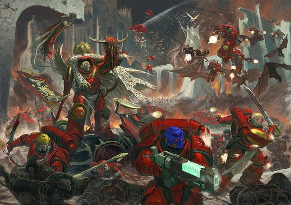

<!-- A0403-B0188 -->

原译文

The Blood Angels battle Chaos 圣血天使与混沌作战

**校订译文**

The Blood Angels battle Chaos 圣血天使与混沌作战

<!-- /A0403-B0188 -->

<!-- A0403-B0189 -->
## Culture 文化

<!-- /A0403-B0189 -->

<!-- A0403-B0190 -->
**英文原文**

Sanguinius did much to establish the culture and beliefs of the Chapter. He transformed the Blood Angels from an army of killers into a Legion of noble warriors that were also well-versed in art and poetry. There is a mystical streak in many of the Blood Angels and a strong belief that things can be changed for the better. This belief can be seen in everything they do: they strive for perfection be it in their works of art, martial discipline, or military doctrine. Due to their extended lifespans, Blood Angels have time to perfect their techniques in art as well as war.

<!-- /A0403-B0190 -->

<!-- A0403-B0191 -->

原译文

圣吉列斯为建立战团的文化和信仰做了很多工作。他将圣血天使从一支杀手大军转变为一支精通艺术和诗歌的贵族战士军团。许多圣血天使身上都有一种神秘的气质，他们坚信事情可以变得更好。这种信念可以从他们所做的一切中看出：无论是在艺术作品、战技还是军事学说中，他们都在追求完美。由于他们的寿命延长，圣血天使有时间在艺术和战争中完善他们的技术。

**校订译文**

圣吉列斯为战团的文化与信念奠定了基础。他将一支杀戮成性的军队，重塑成由高贵战士组成、同时精通艺术与诗歌的军团。许多圣血天使带有神秘主义倾向，坚信一切都能变得更好。这种信念贯穿他们的一举一动：无论艺术创作、武艺修习还是军事学说，他们都追求完美。悠长的寿命使他们有足够时间，磨炼艺术与战争中的技艺。

**校注：** noble warriors 指品格高贵，不是具有贵族身份。

<!-- /A0403-B0191 -->

<!-- A0403-B0192 -->
**英文原文**

Today the Blood Angels are known for both their savagery and grace. They seek to maintain ten defining commandments that they feel best exemplify their Chapter's soul. Through meditation, they maintain the Five Angelic Graces of Honour, Humility, Mercy, Restraint, and Forgiveness. In opposition to these are the five Warrior Virtues of Strength, Savagery, Abandon, Rage, and Detachment. Thus are the Blood Angels frenzied killers one moment, while becoming stoic monks who appreciate arts and music the next.

<!-- /A0403-B0192 -->

<!-- A0403-B0193 -->

原译文

今天，圣血天使以野蛮和优雅而闻名。他们试图保持十条定义性的戒律，他们认为这些戒律最能体现他们战团的灵魂。通过冥想，他们保持了五种天使般的美德，即荣誉、谦逊、仁慈、克制和宽恕。与之相对的是五种战士品性，即力量、凶悍、放纵、愤怒和冷漠。因此，圣血天使们一时是疯狂的杀手，下一刻却成为了欣赏艺术和音乐的坚忍修道士。

**校订译文**

如今，圣血天使同时以凶猛与优雅闻名。他们力求恪守十项信条，认为这些最能体现战团的灵魂。通过冥想，他们维系五项“天使美德”：荣誉、谦逊、仁慈、克制和宽恕；与之相对的是五项“战士品性”：力量、凶悍、放纵、愤怒和超然。因此，他们上一刻还是狂乱的杀手，下一刻便可能成为沉静坚忍、欣赏艺术与音乐的修士。

<!-- /A0403-B0193 -->

<!-- A0403-B0194 -->
**英文原文**

Blood Angels also have a habit of sleeping whenever possible in the sarcophagi used to create them. They apparently believe that it is in this slumber that they are one step closer to Sanguinius and seek to gain insight into the psyche of their forefather.

<!-- /A0403-B0194 -->

<!-- A0403-B0195 -->

原译文

圣血天使也有一个习惯，就是尽可能地睡在用来创造它们的石棺里。他们显然相信，正是在这种沉睡中，他们离圣吉列斯又近了一步，并试图深入了解他们先祖的心理。

**校订译文**

圣血天使还习惯尽可能在当初接受改造时使用的石棺中睡眠。他们似乎相信，这种沉睡能让自己更接近圣吉列斯，并借此探知先祖的内心。

<!-- /A0403-B0195 -->

<!-- A0403-B0196 -->
**英文原文**

The Blood Angels will spare no effort to attain the material needed to create the Chapter's art and have even fought wars to obtain them. This includes Bloodstone gems, from the deep caves of the Cruor Mountain on Baal and the larvae of the Spinewyrm fauna. Bloodthirsty sand clams are also needed, as the white pigment used to paint the Chapter's angel wings, can only be obtained by crushing clams' shells.

<!-- /A0403-B0196 -->

<!-- A0403-B0197 -->

原译文

圣血天使将不遗余力地获得创造战团艺术所需的材料，甚至为获得这些材料而战。这包括血石宝石，来自巴尔凝血山脉的深洞和刺虫群的幼虫。嗜血的沙蚌也是必需的，因为用于绘制战团天使翅膀的白色颜料只能通过压碎蚌壳获得。

**校订译文**

为取得创作所需的材料，圣血天使不惜一切，甚至曾为此发动战争。所需材料包括巴尔凝血山深洞中的血石宝石，以及脊龙的幼虫。嗜血沙蚌也不可或缺：绘制战团天使羽翼所用的白色颜料，只能从碾碎的蚌壳中取得。

<!-- /A0403-B0197 -->

<!-- A0403-B0198 -->
## Tactics 战术

<!-- /A0403-B0198 -->

<!-- A0403-B0199 -->
**英文原文**

The Blood Angels are for the most part a Codex Chapter, though formations such as the Death Company defy the edicts of Roboute Guilliman. In battle, they are known to favour Jumpack-equipped Infantry, close combat, and direct assault. The infamous Gunship and Drop Pod-borne planetary assaults of the Blood Angels are both beautiful and savage to behold. They depart as quickly as they strike, rarely staying behind to oversee a worlds reconstruction and administration unlike the likes of the Imperial Fists.

<!-- /A0403-B0199 -->

<!-- A0403-B0200 -->

原译文

圣血天使在很大程度上是一个圣典战团，尽管死亡连等编队无视罗伯特·基里曼的法令。在战斗中，他们以支持装备跳跃背包的步兵、近战和直接突击而闻名。著名的炮艇和空投舱携带的圣血天使行星突击既美丽又野蛮。他们一结束就离开，很少留下来监督世界的重建和管理，不像帝国之拳那样。

**校订译文**

圣血天使大体遵循《阿斯塔特圣典》，但死亡连队等编制超出了罗保特·基里曼的规定。他们在战斗中偏爱装备跳跃背包的步兵、近战和正面突击。由炮艇与空降舱实施的行星突袭威名远扬，景象既壮美又凶残。他们来得迅猛，去得同样迅速；与帝国之拳不同，他们极少留下来监督世界的重建与治理。

<!-- /A0403-B0200 -->

<!-- A0403-B0201 -->
**英文原文**

Despite their melee-emphasized method of war, the Blood Angels maintain a larger then average pool of armored vehicles, including some of unique Design. Most notable of these is the Baal Predator.

<!-- /A0403-B0201 -->

<!-- A0403-B0202 -->

原译文

尽管他们的强调近战战争方法，但圣血天使拥有比平均水平更大的装甲载具库，包括一些独特的设计。其中最著名的是巴尔掠食者。

**校订译文**

尽管作战方式强调近战，圣血天使拥有的装甲载具仍多于一般战团，其中包括若干独有设计，最著名的便是巴尔掠食者。

<!-- /A0403-B0202 -->

<!-- A0403-B0203 -->
## Organisation 组织

<!-- /A0403-B0203 -->

<!-- A0403-B0204 -->
### Legion Organization 军团组织

<!-- /A0403-B0204 -->

<!-- A0403-B0205 -->
**英文原文**

During the Great Crusade and Horus Heresy, the Blood Angels were a Space Marine Legion numbering roughly 120,000 warriors. The structure of the Blood Angels was to change with the return of Sanguinius. The winged Primarch was to bring a sense of order to the often fractious Legion, stamping a new structure onto it in the hopes of containing its hunger. Though in essence this new order would seem to be in accord with the Principia Bellicosa, the schema by which the other Legions were organised, in actuality it also varied a great deal from the standard pattern. It retained the basic structure of companies, initially forming the Legion into 200 companies of approximately 300 warriors each, although by the last years of the Great Crusade this would have increased to 300 companies each of 500 warriors. However, past this basic structure there were many discrepancies, each chosen by the Great Angel to serve a purpose in his plans. These companies were grouped into Hosts for campaigns requiring greater force of numbers than that possessed of a single company, though each Host was a temporary creature broken and made as need required. Sanguinius created three Spheres to encompass his Hosts, three chambers by which he would give order and purpose to the warriors of the Legion. Each was separate and distinct from the Three Hundred Companies and the strictures of the Principia Bellicosa, forming a distinct strata of organisation that allowed the warriors of the IXth Legion to focus their hunger and rage towards a single end and to conquer it. Yet it was not merely a blunt tool, but an elegant and artful plan designed to promote the finer qualities of the Legion while providing an outlet for the more base. It was the Great Angel's masterwork, the fulfilment of an oath and the salvation of his children.

<!-- /A0403-B0205 -->

<!-- A0403-B0206 -->

原译文

在大远征和荷鲁斯叛乱期间，圣血天使是一支约有12万名战士的星际战士军团。圣血天使的结构随着圣吉列斯的回归而改变。这位长着翅膀的原体要给经常难以驾驭的军团带来一种秩序感，给它盖上一个新的结构，希望能控制它的饥饿。虽然从本质上讲，这种新秩序似乎符合战策基理，即其他军团组织的模式，但实际上它也与标准模式有很大不同。它保留了连队的基本结构，最初将军团组成200个连队，每个连队约有300名战士，尽管到大远征的最后几年，这将增加到300个连队每个500名战士。然而，在这一基本结构之后，出现了许多差异，每一个差异都是大天使在他的计划中选择的。这些连队被分为天军，用于需要比单个连队拥有更大部队的成员的战役，尽管每个天军都是根据需要打破和制作的临时创造。圣吉列斯创造了三个界来包围他的天军，三界，他将通过这些界给军团的战士下达命令和目标。每一个都与三百连队和战策基理的约束分开，形成了一个独特的组织层次，使第九军团的战士能够将饥饿和愤怒集中在一个目标上并征服它。然而，这不仅仅是一个钝器，而是一个优雅而巧妙的计划，旨在促进军团的优良品质，同时为更多的基础提供出路。这是大天使的杰作，他履行了誓言，拯救了他的子嗣。

**校订译文**

大远征与荷鲁斯之乱时期，圣血天使军团约有十二万名战士。圣吉列斯回归后，为这支时常难以约束的军团建立了新的组织秩序，希望以此控制他们的饥渴。表面上，这套制度遵循其他军团采用的《军团组织法典》，实际却有诸多差异。连队仍是基础单位：起初编为两百个连，每连约三百人；至大远征末期，则增至三百个连，每连五百人。在这套基础结构之外，大天使又为自己的计划作出多项安排。遇到需要超出单连兵力的战役时，若干连队会临时合编为“军势”，按需要组建或解散。圣吉列斯另设三“界”，为麾下军势确立秩序与目标。这套层次独立于三百个连队及《军团组织法典》的规定，使第九军团战士得以将饥渴与怒火集中于同一个目标，并最终驾驭它们。这并非粗暴的压制手段，而是一套精巧的构想：培养军团高贵的一面，同时为低劣的本能提供宣泄途径。这是大天使的杰作，也是他履行誓言、拯救子嗣的成果。

**校注：** 源文开头约十二万，与后列三百连、每连五百人（十五万）并不一致；可能为不同时点或统计口径，译文分别保留，不擅改数字。Principia Bellicosa 按本稿军团组织法典统一。

<!-- /A0403-B0206 -->

<!-- A0403-B0207 -->
**英文原文**

The outermost of the three Spheres would encompass the rank and file of the Legion, the warriors that plied blade and bolter on the battlefield. Known within the Legion as the Malak, these warriors had but one duty to fight at the order of their captains. They obeyed, they killed and they practised the arts granted them by the Primarch, and by these simple disciplines and the endless focus of their post-human minds they staved off the depredations of their hunger. Within this sphere there were but few distinctions, simple titles and orders for those who excelled in specific arts of war and peace, exemplars of their tasks and angels of small actions. These were the marksmen, poets and duellists of the Legion, its strong right hand and beating heart, and though these were but small honours, they were held dear by those who won them.

<!-- /A0403-B0207 -->

<!-- A0403-B0208 -->

原译文

三界中的最外层将包含军团的普通士兵，他们在战场上挥舞着剑和爆矢枪。这些战士在军团中被称为马拉克，他们只有一个职责，那就是按照连长的命令作战。他们服从，他们杀戮，他们练习了原体授予他们的艺术，通过这些简单的纪律和他们后人类思维的无尽关注，他们避免了饥饿的掠夺。在这个界内，对于那些擅长战争与和平的具体艺术、任务的典范和小行动的天使来说，几乎没有区别、简单的头衔和命令。这些是军团的射手、诗人和决斗者，他们强壮的右手和跳动的心脏，虽然这些只是小小的荣誉，但他们被赢得荣誉的人所珍视。

**校订译文**

三界最外层涵盖军团的普通战士，也就是战场上运用刀剑与爆矢枪的成员。他们在军团内部称为“马拉克”，唯一职责便是遵从连长的命令作战。他们服从、杀敌，并研习原体传授的艺术；凭借这些简单的准则，以及超人心智持久而专注的力量，他们抵御着饥渴的侵蚀。这一界中只有少量荣誉区分：在战斗或和平技艺上表现卓越、成为同袍典范的战士，会获授简单的头衔或名号。他们是军团的神射手、诗人和决斗家，是有力的臂膀与跳动的心脏。这些荣誉虽然不大，获授者却无比珍视。

<!-- /A0403-B0208 -->

<!-- A0403-B0209 -->
**英文原文**

The Second Sphere was composed of the commanders and leaders of the Legion, the powers and dominions that stood at the side of Sanguinius. To them fell the duty of command, of the execution of Sanguinius' wishes with alacrity and sound judgement. Unlike those who fought at their command, they bore the burden of free will, of time to think and ponder as they would while the curse stalked them. They were the planners and strategists of the crimson host, they directed battles and wars as lesser men directed symphonies, utilising each instrument at their command to its utmost. As the rank and file found peace in their studies, so too did each of the mighty become a master of many disciplines, those of the pen and brush as well as those of the blade and gun. Though they were not the single- minded fanatics of Legions such as Angron's red reapers or Guilliman's famed tacticians, there were few who could match them in the arts of war taken as a whole.

<!-- /A0403-B0209 -->

<!-- A0403-B0210 -->

原译文

第二界由军团的指挥官和领导者组成，他们是站在圣吉列斯一边的力量和统御。他们肩负着指挥的责任，以敏捷和明智的判断执行圣吉列斯的意愿。与那些听从命令作战的人不同，他们承担着自由意志的负担，当诅咒笼罩着他们时，他们没有时间去思考和考虑。他们是深红天军的策划者和战略家，他们指挥战斗和战争，就像部分人指挥交响乐一样，最大限度地利用每种乐器。随着普通士兵在学习中找到了平静，每个强者也都成为了许多领域的大师，无论是笔和刷，还是刀和枪。虽然他们不是像安格隆的红色收割者或基里曼的著名战术家那样一心一意的军团狂热者，但在整体战争艺术方面，很少有人能与他们匹敌。

**校订译文**

第二界由军团的指挥官与领袖组成，他们是侍立于圣吉列斯身侧的能天使与主天使。指挥军团、迅速而审慎地落实原体意愿，是他们的责任。与只须奉命作战的士兵不同，他们必须承担自主抉择的重担：在诅咒始终潜伏的同时，仍有时间自由思考、反复斟酌。他们是深红军势的规划者与战略家，指挥战争就如凡人指挥交响乐，让麾下每一种力量都发挥到极致。普通士兵从研习中获得平静，军团领袖也同样精通多门技艺，既善笔墨，也善刀枪。他们不像安格隆麾下的血腥收割者或基里曼著名的战术家那样专注一途；但若论整体的战争艺术，很少有人能与他们匹敌。

**校注：** time to think and ponder 为有时间思考，原译漏转为没有时间，含义相反。

<!-- /A0403-B0210 -->

<!-- A0403-B0211 -->
**英文原文**

The First Sphere, the final demarcation of Sanguinius' new Legion, comprised the ranks of the Immortals and were also referred to as Seraphs. These warriors stood within the presence of the Primarch; they did not operate within one of the Three Hundred Companies but as the guards and servants of the Great Angel himself. Each, when inducted into the ranks of the First Sphere, gave up his common name to take on another and gave up his identity to do the work of the Primarch without guilt or regret. They were Sanguinius' wrath, his stern resolve and his watchful eyes each given form and purpose. Upon these warriors he depended for the most dangerous of tasks, to fight upon those battlefields and to act upon those errands that would tarnish the soul and bring the hunger roaring to the fore. By the armour of the names and persona that the warriors of the First Sphere wore like their own, they put off the toll of their actions and emerged from their service untarnished, to take their places in the ranks once again. Formations of the First Sphere included the Sanguinary Guard, Crimson Paladins, Burning Eyes, and Angel's Tears.

<!-- /A0403-B0211 -->

<!-- A0403-B0212 -->

原译文

第一界是圣吉列斯新军团的最终划分，由不朽者组成，也被称为六翼天使。这些战士站在原体面前；他们不在三百个连队中的任何一个连队内活动，而是作为大天使本人的卫士和仆人。当每个人被引入第一界的行列时，他们都放弃了自己的俗名，换上了另一个名字，放弃了身份，毫无愧疚或遗憾地做了为原体的工作。他们是圣吉列斯之怒、他坚定的决心和他警惕的眼睛，每一个都有其特定的形式和目的。他依靠这些战士来完成最危险的任务，在那些战场上作战，完成那些会玷污灵魂、让饥饿感凸显出来的差事。凭借第一界战士所穿的与他们自己一样的名字和角色的盔甲，他们推迟了行动的代价，毫发无损地从服役中走出来，再次在队伍中占据一席之地。第一界的编队包括圣血卫队、深红圣骑士、燃烧之眼和天使之泪。

**校订译文**

第一界是圣吉列斯重塑军团后的最内层，由“不朽者”组成，也称“六翼天使”。他们侍奉于原体身边，不编入三百个连队，而是大天使本人的卫士与侍从。加入第一界时，每名战士都舍弃原名，接受新名，以另一重身份替原体行事，无须承受愧疚与悔恨。他们分别体现圣吉列斯的怒火、坚定意志与警觉目光。他把最危险的任务交给这些战士：在足以玷污灵魂、唤醒嗜血本能的战场和差事中行动。新名字与新身份就像护甲，使他们得以卸下这些行为带来的心灵重负，结束服役后不受玷污地重返原来的队列。第一界包括圣血守卫、猩红圣骑士、燃烧之眼和天使之泪。

**校注：** persona 是承担任务时采用的另一重身份；姓名与身份像护甲是心理隐喻，非实体盔甲。

<!-- /A0403-B0212 -->

<!-- A0403-B0213 -->
**英文原文**

The lords of Sanguinius' crimson hosts bore many similarities to the strictures of the Principia Bellicosa, but with a number of differences both large and small. Authority was strictly divided across the three Spheres of the Legion, with each officer operating within his own place in the manner given him by the Primarch himself. This strict, overlapping system of authority was less flexible than some Legions, but it afforded a solid line of responsibility and control that limited the effect of the Blood Angels' ever- present hunger and sudden rage. To mitigate the possibility of any breakdown of authority, the Blood Angels maintained a large number of junior officers, lieutenants and sergeants of varying types, all quickly able to take the place of the slain in the heat of battle.

<!-- /A0403-B0213 -->

<!-- A0403-B0214 -->

原译文

圣吉列斯深红天军的领主与战策基理的约束有许多相似之处，但也有许多大大小小的差异。军团的三个界严格划分了权力，每个军官都按照原体亲自给他的方式在自己的地方行动。这种严格的、重叠的权力体系不如一些军团灵活，但它提供了一条坚实的责任和控制线，限制了圣血天使永远存在的饥饿和突如其来的愤怒的影响。为了降低权威崩溃的可能性，圣血天使保留了大量不同类型的初级军官、副官和军士，他们都能在激烈的战斗中迅速取代被杀者。

**校订译文**

圣吉列斯的深红军势在指挥架构上与《军团组织法典》有许多相似之处，也存在大小不一的差异。权限在三界之间被严格划分，每名军官都按原体亲自规定的方式，各司其职。这种严密而交叠的权力体系不如部分军团灵活，却提供了清晰稳固的责任与控制链条，限制了圣血天使长久的饥渴和突发暴怒所能造成的影响。为防止指挥体系中断，军团保留大量不同类型的基层军官、副官与军士，使战斗中的阵亡者能立即得到替补。

<!-- /A0403-B0214 -->

<!-- A0403-B0215 -->
**英文原文**

On the field of battle, the line of authority was always drawn clearly for the Blood Angels and followed absolutely. To disobey or question orders was a grave sin, undertaken only in the most serious of situations and warranting the harshest of punishments, even if proven correct. Their duty was only to obey, the individual warrior worried not for anything but action, putting the hunger to the back of his mind while those appointed over him worried over consequences. In the Blood Angels, all authority stemmed directly from Sanguinius and flowed down from him, first to the lord commanders then to his captains and beyond in an unbroken and inviolable line. This fact kept his Legion centred and focused, each word from a sergeant in the heat of battle was the word of Sanguinius himself, each nod from a captain a tilt of the Primarch's head itself.

<!-- /A0403-B0215 -->

<!-- A0403-B0216 -->

原译文

在战场上，圣血天使的权力线总是清晰地划定，并绝对遵循。违抗或质疑命令是一种严重的罪行，只有在最严重的情况下才会实施，即使被证明是正确的，也要受到最严厉的惩罚。他们的职责只是服从，每个战士只担心行动，把饥饿放在脑后，而那些被任命的人则担心后果。在圣血天使中，所有的权力都直接源于圣吉列斯，并从他那里向下流动，首先是领主指挥官，然后是他的连长，再延伸到一条不可侵犯的线。这一事实使他的军团集中注意力，在激烈的战斗中，军士的每一句话都是圣吉列斯之言，连长的每一个点头都是原体的头的倾斜。

**校订译文**

在战场上，圣血天使的指挥链始终清晰，所有人都必须绝对服从。违抗或质疑命令是重罪，只有在最严重的情形下才有人如此行事；即使事后证明判断正确，也会遭到最严厉的惩罚。普通战士只须服从、行动，把饥渴抛诸脑后，后果则由上级操心。军团的一切权威都直接来自圣吉列斯，依次传给领主指挥官、连长及更低层级，构成一条连续而不可侵犯的链条。这使整个军团始终团结专注：激战中军士的一声命令，便是圣吉列斯本人的话语；连长的一次点头，便等同于原体亲自示意。

<!-- /A0403-B0216 -->

<!-- A0403-B0217 -->
**英文原文**

The Blood Angels also differed in small ways, as with many of the Legions they had their own titles and names for authority and a host of lesser divisions to suit their style. Those who held command over Hosts and had authority over lesser captains were known as Archeins rather than the old title of Praetor, and also held the title of Dominion for a company. Within a company were a number of junior officers, the Powers who commanded the ranks of the company at war and the Virtues who stood as its exemplars in other endeavours. Many were known by the focus of their devotion, Archeins of Wisdom and Powers of the Blade, such distinctions a mark of respect as much as a tactical designation in a Legion whose Primarch urged them to be more than simple weapons.

<!-- /A0403-B0217 -->

<!-- A0403-B0218 -->

原译文

圣血天使也有细微的不同，因为与许多军团一样，他们有自己的头衔和权威名称，还有许多较小的部分来适应他们的风格。那些对天军拥有指挥权并对下级连长拥有权力的人被称为统军，而不是老的执政官头衔，他们还拥有一个连队的主天使头衔。在一个连队中，有许多初级军官，在战争中指挥连队的力天使，以及在其他努力中成为连队榜样的能天使。许多人以他们专注的奉献 — 统军的智慧和力天使的剑刃而闻名，这种区别既是尊重的标志，也是军团的战术名称，军团的原体要求他们不仅仅是简单的武器。

**校订译文**

与许多军团一样，圣血天使也有独特的职衔与细分编制。统率军势、指挥下级连长的军官不用旧有的“执政官”称号，而称“统军”；当他们统领一个连队时，还拥有“主天使”头衔。连内则有多类基层军官：“能天使”负责战时指挥，“力天使”在其他领域为同袍树立典范。许多人的称号还会体现专长，如“智慧统军”或“剑之能天使”。原体期望子嗣不只是武器，因此这些称号既表明战术职责，也表达对个人成就的敬意。

**校注：** Powers / Virtues 在天使阶序命名中分别采用能天使／力天使；原译颠倒。Dominion 主天使、Archein 统军沿用；均未宣称 GW 官方译名。

<!-- /A0403-B0218 -->

<!-- A0403-B0219 -->
**英文原文**

The Legion's fleet assets were similarly impressive, boasting over 300 capital class ships, many of them heavy cruisers or even battleships of various classes. Many of these craft were outfitted to serve as orbital assault craft, mounting either banks of heavy linear cannon for use as bombardment weapons, launch rails for swarms of drop pods or vast hangar bays from which the large Stormbird or Thunderhawk dropships could operate. Few among their brother Legions could match such a fleet for sheer firepower or mass, for the weakness of the Blood Angels fleet lay in its single-minded obsession with a single stratagem. In terms of support craft, the fleet was less amply supplied, with less than 600 sub-capital craft, mostly slower escort gunboats with little in the way of fast strike craft. This was another side effect of the Legion's singular focus, for such craft were rarely needed for their preferred strategy and speciality, save as screening assets for the larger cruisers.

<!-- /A0403-B0219 -->

<!-- A0403-B0220 -->

原译文

军团的舰队资产同样令人印象深刻，拥有300多艘主力级战舰，其中许多是重型巡洋舰，甚至是各种级别的战列舰。这些战舰中的许多都配备了轨道突击舰，安装了用作轰炸武器的重型线性加农炮，为成群的空投舱安装了发射轨道，或者安装了可以操作大型风暴鸟或雷鹰空降艇的巨大机库。在他们的兄弟军团中，很少有人能在火力或质量上与这样的舰队相匹敌，因为圣血天使舰队的弱点在于它一心一意地痴迷于一种战略。在支援舰方面，舰队的补给并不充足，只有不到600艘次主力级舰艇，其中大多数是速度较慢的护航炮舰，几乎没有快速打击舰。这是军团单一重点的另一个副作用，因为除了作为保护资产外的大型巡洋舰，这种飞行器很少需要用于他们首选的战略和专业。

**校订译文**

军团舰队同样强大，拥有三百余艘主力舰，其中包括大量重型巡洋舰，以及不同级别的战列舰。许多舰船经过改装，专门用于轨道突袭：有的配备成组重型直线炮实施轰炸，有的安装成群空降舱所需的发射轨，还有的设有巨大机库，供大型风暴鸟或雷鹰登陆艇起降。单论火力与规模，其他军团鲜有能与之匹敌者；但圣血天使舰队的弱点也正在于过分专注于一种战法。舰队的辅助舰艇不足六百艘，多为较慢的护航炮舰，快速打击舰船十分稀少。这同样源于军团的单一作战重点：除掩护大型巡洋舰外，他们偏爱的战法与专长很少需要此类舰艇。

**校注：** craft 此处指舰艇而非飞行器；outfitted to serve as 是改装用于轨道突袭，原译误成舰内配备轨道突击舰。

<!-- /A0403-B0220 -->

<!-- A0403-B0221 -->
### Chapter Organization 战团组织

<!-- /A0403-B0221 -->

<!-- A0403-B0222 -->
**英文原文**

Today, as adherents of the Codex Astartes, the Blood Angels divide their battle brothers among the chapter into companies. There are 10 companies in the Blood Angels and each one is led by a Captain who is guarded by elite veterans known as the Honour Guard. The only exceptions to the Codex structure allowed by the Blood Angels and its Successors are the Sanguinary Guard and the Death Company.

<!-- /A0403-B0222 -->

<!-- A0403-B0223 -->

原译文

今天，作为阿斯塔特圣典的拥护者，圣血天使将他们在战团中的战斗兄弟分成了连队。圣血天使有10个连队，每个连队都由一名连长领导，连长由被称为荣誉卫队的精英老兵守卫。圣血天使及其子战团允许的圣典结构的唯一例外是圣血卫队和死亡连。

**校订译文**

如今，圣血天使遵循《阿斯塔特圣典》，将战斗兄弟编为十个连队。每连由一名连长统领，并由称为荣誉卫队的精锐老兵保护连长。圣血天使及其子战团认可的圣典编制例外，只有圣血守卫和死亡连队。

<!-- /A0403-B0223 -->

<!-- A0403-B0224 图片 -->
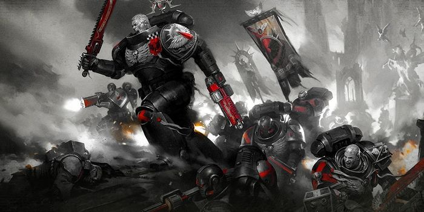

<!-- A0403-B0225 -->

原译文

Death Company 死亡连

**校订译文**

Death Company 死亡连队

<!-- /A0403-B0225 -->

<!-- A0403-B0226 -->
**英文原文**

The First Company is composed of the Chapter's Veterans, warriors with experience forged in countless battles throughout the Imperium and trained in the use of sacred suits of Terminator Armour, while the second to fifth are the Battle Companies who carry the weight of the Chapter's combat duties.

<!-- /A0403-B0226 -->

<!-- A0403-B0227 -->

原译文

第一连队由战团的老兵组成，他们在整个帝国无数次战斗中积累了经验，并接受过使用终结者盔甲神圣套装的训练，而第二至第五连队是承担战团战斗职责的战斗连队。

**校订译文**

第一连由战团老兵组成。他们在帝国各地的无数战斗中积累了经验，并受训使用神圣的终结者护甲。第二至第五连则为战斗连，承担战团的主要作战任务。

<!-- /A0403-B0227 -->

<!-- A0403-B0228 -->
**英文原文**

The subsequent companies are 'Companies of Reserve', composed of squads with the same designation who often act as support for the Battle Companies, as well as provide replacements for casualties by the line formations: the Sixth Company is made up of Battleline Squads, while the Seventh and Eighth Companies are a made up of Close Support Squads, and the Ninth Company has a full compliment of Fire Support Squads. Finally, the Tenth Company is composed of the Chapter's scouts, aspirants who have not yet earned their place as full-fledged Marines of the Chapter. They also have recently come to include Vanguard Space Marine troops.

<!-- /A0403-B0228 -->

<!-- A0403-B0229 -->

原译文

随后的连是“预备连队”，由具有相同任命的小队组成，这些小队经常为战斗连队提供支援，并为一线编队的伤亡人员提供替补：第六连队由战线小队组成，第七和第八连队由近战支援小队组成，而第九连队则由火力支援小队组成。最后，第十连队由战团的侦察兵组成，他们是尚未获得战团正式星际战士地位的有志者。他们最近还包括先锋星际战士。

**校订译文**

随后是预备连，每连由同一职责类型的小队组成，通常支援战斗连，并为一线部队补充伤亡。第六连由战线小队组成，第七与第八连由近战支援小队组成，第九连则全部为火力支援小队。第十连最初由战团侦察兵组成，他们尚未取得正式星际战士资格；近来，该连也已纳入先锋星际战士部队。

**校注：** 源文第七连列为近战支援，与普通圣典战团第七连常规配置不同；保留本章圣血天使的特殊编制，不据其他章节机械覆盖。

<!-- /A0403-B0229 -->

<!-- A0403-B0230 -->
**英文原文**

The Blood Angels Chapter has two ruling bodies, the Red Council and the Council of Blood (sometimes referred to as the Council of Bone and Blood). The latter is made up of senior Chaplains and Sanguinary Priests and is responsible for spiritual and physical work to constrain the Red Thirst and the Black Rage. The Red Council meanwhile consists of the chapter's most senior officers oversees all aspects of waging war and nominates a new Chapter Master when the previous one inevitably dies. As such, the Red Council is the more senior of the two bodies.

<!-- /A0403-B0230 -->

<!-- A0403-B0231 -->

原译文

圣血天使战团有两个统治机构，血红议会和鲜血议会（有时称为骨血议会）。后者由高级牧师和圣血祭司组成，负责精神和身体工作，以控制血渴和黑怒。与此同时，血红议会由战团最高级的军官组成，负责监督发动战争的各个方面，并在前任不可避免地去世时提名新的战团长。因此，在这两个机构中，血红议会的级别更高。

**校订译文**

圣血天使战团有两个决策机构：血红议会与鲜血议会，后者有时也称骨血议会。鲜血议会由资深教士与圣血祭司组成，负责从精神和生理层面抑制血渴与黑怒。血红议会则由战团最高层军官组成，统筹战争事务，并在战团长去世后提名继任者。因此，血红议会的地位更高。

<!-- /A0403-B0231 -->

<!-- A0403-B0232 -->
### Headquarters 总部

<!-- /A0403-B0232 -->

<!-- A0403-B0233 -->
**英文原文**

The current headquarters staff following the Devastation of Baal is as follows:

<!-- /A0403-B0233 -->

<!-- A0403-B0234 -->

原译文

巴尔被毁灭后，目前的总部工作人员如下：

**校订译文**

巴尔之毁后的战团总部人员配置如下：

<!-- /A0403-B0234 -->

<!-- A0403-B0235 -->
### Chapter Command 战团指挥

<!-- /A0403-B0235 -->

<!-- A0403-B0236 图片 -->
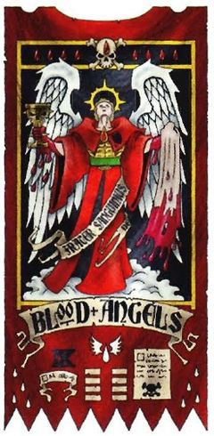

<!-- A0403-B0237 -->

原译文

Chapter Master 战团长

**校订译文**

Chapter Master 战团长

<!-- /A0403-B0237 -->

<!-- A0403-B0238 图片 -->

<!-- A0403-B0239 -->

原译文

Commander Dante,Master of the Blood Angels 指挥官但丁，圣血天使之主

**校订译文**

Commander Dante,Master of the Blood Angels 指挥官但丁，圣血天使之主

<!-- /A0403-B0239 -->

<!-- A0403-B0240 -->

原译文

Chapter Ancient 战团旗手

**校订译文**

Chapter Ancient 战团旗手

<!-- /A0403-B0240 -->

<!-- A0403-B0241 -->

原译文

Chapter Champion 战团冠军

**校订译文**

Chapter Champion 战团冠军

<!-- /A0403-B0241 -->

<!-- A0403-B0242 -->
### Reclusiam 隐修室

<!-- /A0403-B0242 -->

<!-- A0403-B0243 图片 -->

<!-- A0403-B0244 -->

原译文

Astorath the Grim,High Chaplain 冷酷者阿斯托拉斯，至高牧师

**校订译文**

Astorath the Grim,High Chaplain 冷酷者阿斯托拉斯，至高教士

<!-- /A0403-B0244 -->

<!-- A0403-B0245 -->

原译文

15 Chaplains 15名牧师

**校订译文**

15 Chaplains 15名教士

<!-- /A0403-B0245 -->

<!-- A0403-B0246 -->
### Sanguinary Priesthood 圣血祭司会

<!-- /A0403-B0246 -->

<!-- A0403-B0247 图片 -->

<!-- A0403-B0248 -->

原译文

Corbulo,Sanguinary High Priest 至高圣血祭司，科布罗

**校订译文**

Corbulo,Sanguinary High Priest 至高圣血祭司，科布罗

<!-- /A0403-B0248 -->

<!-- A0403-B0249 -->

原译文

Sanguinary Priests 圣血祭司

**校订译文**

Sanguinary Priests 圣血祭司

<!-- /A0403-B0249 -->

<!-- A0403-B0250 -->
### Librarius 智库

<!-- /A0403-B0250 -->

<!-- A0403-B0251 图片 -->

<!-- A0403-B0252 -->

原译文

Mephiston,Chief Librarian 墨菲斯顿，首席智库

**校订译文**

Mephiston,Chief Librarian 墨菲斯顿，首席智库员

<!-- /A0403-B0252 -->

<!-- A0403-B0253 -->

原译文

8 Epistolaries 8名星语官

**校订译文**

8 Epistolaries 8名星语官

<!-- /A0403-B0253 -->

<!-- A0403-B0254 -->

原译文

13 Codiciers 13名典记员

**校订译文**

13 Codiciers 13名典记员

<!-- /A0403-B0254 -->

<!-- A0403-B0255 -->

原译文

12 Lexicaniums 12名编修员

**校订译文**

12 Lexicaniums 12名编修员

<!-- /A0403-B0255 -->

<!-- A0403-B0256 -->

原译文

14 Acolytum 14名侍僧

**校订译文**

14 Acolytum 14名侍僧

<!-- /A0403-B0256 -->

<!-- A0403-B0257 -->

原译文

9 Furioso Librarian Dreadnoughts 9位暴烈智库无畏

**校订译文**

9 Furioso Librarian Dreadnoughts 9台暴烈智库员无畏机甲

<!-- /A0403-B0257 -->

<!-- A0403-B0258 -->
### Sanguinary Guard 圣血守卫

原题：Sanguinary Guard 圣血卫队

<!-- /A0403-B0258 -->

<!-- A0403-B0259 图片 -->
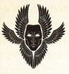

<!-- A0403-B0260 -->
**英文原文**

Brother Daeanatos,Exalted Herald of Sanguinius

<!-- /A0403-B0260 -->

<!-- A0403-B0261 -->

原译文

达阿纳托斯兄弟，圣吉列斯的崇高传令官

**校订译文**

达阿纳托斯兄弟，圣吉列斯的崇高传令官

<!-- /A0403-B0261 -->

<!-- A0403-B0262 -->

原译文

25 Sanguinary Guards 25名圣血卫队

**校订译文**

25 Sanguinary Guards 25名圣血守卫

<!-- /A0403-B0262 -->

<!-- A0403-B0263 -->
### Armoury 军械库

<!-- /A0403-B0263 -->

<!-- A0403-B0264 -->
**英文原文**

Brother Incarael,Master of the Blade

<!-- /A0403-B0264 -->

<!-- A0403-B0265 -->

原译文

印加瑞尔兄弟，剑刃大师

**校订译文**

印加瑞尔兄弟，剑刃大师

<!-- /A0403-B0265 -->

<!-- A0403-B0266 -->

原译文

39 Techmarines 39名技术军士

**校订译文**

39 Techmarines 39名科技战士

<!-- /A0403-B0266 -->

<!-- A0403-B0267 -->

原译文

87 Servitors 87个机仆

**校订译文**

87 Servitors 87个机仆

<!-- /A0403-B0267 -->

<!-- A0403-B0268 -->

原译文

26 Predators 26辆掠食者

**校订译文**

26 Predators 26辆掠食者

<!-- /A0403-B0268 -->

<!-- A0403-B0269 -->

原译文

21 Baal Predators 21辆巴尔掠食者

**校订译文**

21 Baal Predators 21辆巴尔掠食者坦克

<!-- /A0403-B0269 -->

<!-- A0403-B0270 -->

原译文

39 Land Raiders 39辆兰德掠袭者

**校订译文**

39 Land Raiders 39辆兰德掠袭者

<!-- /A0403-B0270 -->

<!-- A0403-B0271 -->

原译文

25 Repulsors 25辆反击者

**校订译文**

25 Repulsors 25辆反重力战车

<!-- /A0403-B0271 -->

<!-- A0403-B0272 -->

原译文

Gladiators 角斗士

**校订译文**

Gladiators 角斗士

<!-- /A0403-B0272 -->

<!-- A0403-B0273 -->

原译文

10 Vindicators 10辆维护者

**校订译文**

10 Vindicators 10辆维护者战车

<!-- /A0403-B0273 -->

<!-- A0403-B0274 -->

原译文

10 Whirlwinds 10辆旋风

**校订译文**

10 Whirlwinds 10辆旋风战车

<!-- /A0403-B0274 -->

<!-- A0403-B0275 -->

原译文

Invictor Warsuits 不败者战术机甲

**校订译文**

Invictor Warsuits 不败者战术机甲

<!-- /A0403-B0275 -->

<!-- A0403-B0276 -->

原译文

Storm Speeders 风暴速攻艇

**校订译文**

Storm Speeders 风暴速攻艇

<!-- /A0403-B0276 -->

<!-- A0403-B0277 -->

原译文

12 Hunters 12辆猎手

**校订译文**

12 Hunters 12辆猎手

<!-- /A0403-B0277 -->

<!-- A0403-B0278 -->

原译文

9 Stalkers 9辆追猎者

**校订译文**

9 Stalkers 9辆追猎者

<!-- /A0403-B0278 -->

<!-- A0403-B0279 -->

原译文

47 Stormraven Gunships 47架风暴鸦炮艇

**校订译文**

47 Stormraven Gunships 47架风暴鸦炮艇

<!-- /A0403-B0279 -->

<!-- A0403-B0280 -->
### Fleet Command 舰队指挥

<!-- /A0403-B0280 -->

<!-- A0403-B0281 -->
**英文原文**

Brother Amadeno,Keeper of the Heavengate

<!-- /A0403-B0281 -->

<!-- A0403-B0282 -->

原译文

阿玛登诺兄弟，天堂之门守护者

**校订译文**

阿玛登诺兄弟，天堂之门守护者

<!-- /A0403-B0282 -->

<!-- A0403-B0283 -->
**英文原文**

2 Battle Barges (Blade of Vengeance and Baal's Fury)

<!-- /A0403-B0283 -->

<!-- A0403-B0284 -->

原译文

2艘战斗驳船（复仇之刃号和巴尔之怒号）

**校订译文**

2艘战斗驳船（复仇之刃号和巴尔之怒号）

<!-- /A0403-B0284 -->

<!-- A0403-B0285 -->

原译文

5 Strike Cruisers 5艘打击巡洋舰

**校订译文**

5 Strike Cruisers 5艘打击巡洋舰

<!-- /A0403-B0285 -->

<!-- A0403-B0286 -->

原译文

13 Rapid Strike vessels 13艘快速打击战舰

**校订译文**

13 Rapid Strike vessels 13艘快速打击战舰

<!-- /A0403-B0286 -->

<!-- A0403-B0287 -->

原译文

28 Thunderhawk Gunships 28架雷鹰炮艇

**校订译文**

28 Thunderhawk Gunships 28架雷鹰炮艇

<!-- /A0403-B0287 -->

<!-- A0403-B0288 -->

原译文

6 Thunderhawk Transporters 6架雷鹰运输艇

**校订译文**

6 Thunderhawk Transporters 6架雷鹰运输艇

<!-- /A0403-B0288 -->

<!-- A0403-B0289 -->
### Logisticiam 后勤部

<!-- /A0403-B0289 -->

<!-- A0403-B0290 -->
**英文原文**

Brother Gallimatus,Warden of the Gates

<!-- /A0403-B0290 -->

<!-- A0403-B0291 -->

原译文

加里马图斯兄弟，门户看守者

**校订译文**

加里马图斯兄弟，门户看守者

<!-- /A0403-B0291 -->

<!-- A0403-B0292 -->
**英文原文**

489 Chapter Equirries and servitors

<!-- /A0403-B0292 -->

<!-- A0403-B0293 -->

原译文

489名战团侍从和机仆

**校订译文**

489名战团近侍及机仆

**校注：** Equirries 疑为 Equerries 拼写错误；按第240篇职衔 Equerry 近侍统一，不与一般战团侍从混同。

<!-- /A0403-B0293 -->

<!-- A0403-B0294 -->
### Companies 连队

<!-- /A0403-B0294 -->

<!-- A0403-B0295 -->
**英文原文**

The current Companies and their Captains post-Devastation of Baal is as follows.

<!-- /A0403-B0295 -->

<!-- A0403-B0296 -->

原译文

目前，巴尔被摧毁后的连队及其连长如下。

**校订译文**

巴尔之毁后的连队及连长如下。

<!-- /A0403-B0296 -->

<!-- A0403-B0297 -->
### Veteran Company 老兵连队

<!-- /A0403-B0297 -->

<!-- A0403-B0298 -->

原译文

1st Company 第一连队

**校订译文**

1st Company 第一连队

<!-- /A0403-B0298 -->

<!-- A0403-B0299 图片 -->

<!-- A0403-B0300 -->

原译文

"Archangels" “大天使”

**校订译文**

"Archangels" “大天使”

<!-- /A0403-B0300 -->

<!-- A0403-B0301 -->

原译文

Captain Karlaen,Shield of Baal 卡拉恩连长，巴尔之盾

**校订译文**

Captain Karlaen,Shield of Baal 卡莱恩连长，巴尔之盾

<!-- /A0403-B0301 -->

<!-- A0403-B0302 -->
**英文原文**

2 Lieutenants (including Athenos)

<!-- /A0403-B0302 -->

<!-- A0403-B0303 -->

原译文

2名副官（包括亚提诺斯）

**校订译文**

2名副官（包括亚提诺斯）

<!-- /A0403-B0303 -->

<!-- A0403-B0304 -->

原译文

Company Ancient Varseus 连队旗手瓦尔修斯

**校订译文**

Company Ancient Varseus 连队旗手瓦尔修斯

<!-- /A0403-B0304 -->

<!-- A0403-B0305 -->

原译文

Company Champion 连队冠军

**校订译文**

Company Champion 连队冠军

<!-- /A0403-B0305 -->

<!-- A0403-B0306 -->

原译文

Company Veterans 连队老兵

**校订译文**

Company Veterans 连队老兵

<!-- /A0403-B0306 -->

<!-- A0403-B0307 -->

原译文

100 Veterans/Death Company 100名老兵/死亡连

**校订译文**

100 Veterans/Death Company 100名老兵／死亡连队成员

<!-- /A0403-B0307 -->

<!-- A0403-B0308 -->

原译文

10 Furioso Dreadnoughts 10位暴烈无畏

**校订译文**

10 Furioso Dreadnoughts 10台暴烈无畏机甲

<!-- /A0403-B0308 -->

<!-- A0403-B0309 -->
### Battle Companies 战斗连队

<!-- /A0403-B0309 -->

<!-- A0403-B0310 -->

原译文

2nd Company 第二连队

**校订译文**

2nd Company 第二连队

<!-- /A0403-B0310 -->

<!-- A0403-B0311 图片 -->
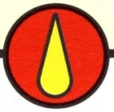

<!-- A0403-B0312 -->

原译文

"The Blooded" “流血者”

**校订译文**

"The Blooded" “流血者”

<!-- /A0403-B0312 -->

<!-- A0403-B0313 -->

原译文

Captain Aphael,Master of the Watch 阿法尔连长，守望大师

**校订译文**

Captain Aphael,Master of the Watch 阿法尔连长，守望大师

<!-- /A0403-B0313 -->

<!-- A0403-B0314 -->

原译文

2 Lieutenants 2名副官

**校订译文**

2 Lieutenants 2名副官

<!-- /A0403-B0314 -->

<!-- A0403-B0315 -->

原译文

Company Ancient 战团旗手

**校订译文**

Company Ancient 连队旗手

<!-- /A0403-B0315 -->

<!-- A0403-B0316 -->

原译文

Company Champion 战团冠军

**校订译文**

Company Champion 连队冠军

<!-- /A0403-B0316 -->

<!-- A0403-B0317 -->

原译文

Company Veterans 战团老兵

**校订译文**

Company Veterans 连队老兵

<!-- /A0403-B0317 -->

<!-- A0403-B0318 -->

原译文

6 Battleline Squads 6个战线连队

**校订译文**

6 Battleline Squads 6个战线小队

<!-- /A0403-B0318 -->

<!-- A0403-B0319 -->

原译文

2 Close Support Squads 2个近战支援连队

**校订译文**

2 Close Support Squads 2个近战支援小队

<!-- /A0403-B0319 -->

<!-- A0403-B0320 -->

原译文

2 Fire Support Squads 2个火力支援连队

**校订译文**

2 Fire Support Squads 2个火力支援小队

<!-- /A0403-B0320 -->

<!-- A0403-B0321 -->

原译文

5 Dreadnoughts 5位无畏

**校订译文**

5 Dreadnoughts 5台无畏机甲

<!-- /A0403-B0321 -->

<!-- A0403-B0322 -->

原译文

3rd Company 第三连队

**校订译文**

3rd Company 第三连队

<!-- /A0403-B0322 -->

<!-- A0403-B0323 图片 -->

<!-- A0403-B0324 -->

原译文

"Ironhelms" “铁盔”

**校订译文**

"Ironhelms" “铁盔”

<!-- /A0403-B0324 -->

<!-- A0403-B0325 -->

原译文

Captain Antargo,Master of Sacrifice 安塔尔戈连长，牺牲之主

**校订译文**

Captain Antargo,Master of Sacrifice 安塔尔戈连长，牺牲之主

<!-- /A0403-B0325 -->

<!-- A0403-B0326 -->

原译文

2 Lieutenants 2名副官

**校订译文**

2 Lieutenants 2名副官

<!-- /A0403-B0326 -->

<!-- A0403-B0327 -->

原译文

Company Ancient 战团旗手

**校订译文**

Company Ancient 连队旗手

<!-- /A0403-B0327 -->

<!-- A0403-B0328 -->

原译文

Company Champion 战团冠军

**校订译文**

Company Champion 连队冠军

<!-- /A0403-B0328 -->

<!-- A0403-B0329 -->

原译文

Company Veterans 战团老兵

**校订译文**

Company Veterans 连队老兵

<!-- /A0403-B0329 -->

<!-- A0403-B0330 -->

原译文

6 Battleline Squads 6个战线连队

**校订译文**

6 Battleline Squads 6个战线小队

<!-- /A0403-B0330 -->

<!-- A0403-B0331 -->

原译文

2 Close Support Squads 2个近战支援连队

**校订译文**

2 Close Support Squads 2个近战支援小队

<!-- /A0403-B0331 -->

<!-- A0403-B0332 -->

原译文

2 Fire Support Squads 2个火力支援连队

**校订译文**

2 Fire Support Squads 2个火力支援小队

<!-- /A0403-B0332 -->

<!-- A0403-B0333 -->

原译文

5 Dreadnoughts 5位无畏

**校订译文**

5 Dreadnoughts 5台无畏机甲

<!-- /A0403-B0333 -->

<!-- A0403-B0334 -->

原译文

4th Company 第四连队

**校订译文**

4th Company 第四连队

<!-- /A0403-B0334 -->

<!-- A0403-B0335 图片 -->
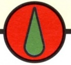

<!-- A0403-B0336 -->

原译文

"Knights of Baal" “巴尔骑士”

**校订译文**

"Knights of Baal" “巴尔骑士”

<!-- /A0403-B0336 -->

<!-- A0403-B0337 -->

原译文

Captain Raphaen,Lord Adjudicator 拉斐恩连长，裁决领主

**校订译文**

Captain Raphaen,Lord Adjudicator 拉斐恩连长，裁决领主

<!-- /A0403-B0337 -->

<!-- A0403-B0338 -->

原译文

2 Lieutenants 2名副官

**校订译文**

2 Lieutenants 2名副官

<!-- /A0403-B0338 -->

<!-- A0403-B0339 -->

原译文

Company Ancient 战团旗手

**校订译文**

Company Ancient 连队旗手

<!-- /A0403-B0339 -->

<!-- A0403-B0340 -->

原译文

Company Champion 战团冠军

**校订译文**

Company Champion 连队冠军

<!-- /A0403-B0340 -->

<!-- A0403-B0341 -->

原译文

Company Veterans 战团老兵

**校订译文**

Company Veterans 连队老兵

<!-- /A0403-B0341 -->

<!-- A0403-B0342 -->

原译文

6 Battleline Squads 6个战线连队

**校订译文**

6 Battleline Squads 6个战线小队

<!-- /A0403-B0342 -->

<!-- A0403-B0343 -->

原译文

2 Close Support Squads 2个近战支援连队

**校订译文**

2 Close Support Squads 2个近战支援小队

<!-- /A0403-B0343 -->

<!-- A0403-B0344 -->

原译文

2 Fire Support Squads 2个火力支援连队

**校订译文**

2 Fire Support Squads 2个火力支援小队

<!-- /A0403-B0344 -->

<!-- A0403-B0345 -->

原译文

3 Dreadnoughts 3位无畏

**校订译文**

3 Dreadnoughts 3台无畏机甲

<!-- /A0403-B0345 -->

<!-- A0403-B0346 -->

原译文

5th Company 第五连队

**校订译文**

5th Company 第五连队

<!-- /A0403-B0346 -->

<!-- A0403-B0347 图片 -->
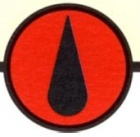

<!-- A0403-B0348 -->

原译文

"Daemonbanes" “恶魔天灾”

**校订译文**

"Daemonbanes" “恶魔天灾”

<!-- /A0403-B0348 -->

<!-- A0403-B0349 -->

原译文

Captain Sendini,Keeper of the Arsenal 森迪尼连长，军械守卫

**校订译文**

Captain Sendini,Keeper of the Arsenal 森迪尼连长，军械守卫

<!-- /A0403-B0349 -->

<!-- A0403-B0350 -->

原译文

2 Lieutenants 2名副官

**校订译文**

2 Lieutenants 2名副官

<!-- /A0403-B0350 -->

<!-- A0403-B0351 -->

原译文

Company Ancient 战团旗手

**校订译文**

Company Ancient 连队旗手

<!-- /A0403-B0351 -->

<!-- A0403-B0352 -->

原译文

Company Champion 战团冠军

**校订译文**

Company Champion 连队冠军

<!-- /A0403-B0352 -->

<!-- A0403-B0353 -->

原译文

Company Veterans 战团老兵

**校订译文**

Company Veterans 连队老兵

<!-- /A0403-B0353 -->

<!-- A0403-B0354 -->

原译文

6 Battleline Squads 6个战线连队

**校订译文**

6 Battleline Squads 6个战线小队

<!-- /A0403-B0354 -->

<!-- A0403-B0355 -->

原译文

2 Close Support Squads 2个近战支援连队

**校订译文**

2 Close Support Squads 2个近战支援小队

<!-- /A0403-B0355 -->

<!-- A0403-B0356 -->

原译文

2 Fire Support Squads 2个火力支援连队

**校订译文**

2 Fire Support Squads 2个火力支援小队

<!-- /A0403-B0356 -->

<!-- A0403-B0357 -->

原译文

5 Dreadnoughts 5位无畏

**校订译文**

5 Dreadnoughts 5台无畏机甲

<!-- /A0403-B0357 -->

<!-- A0403-B0358 -->
### Reserve Companies 预备连队

<!-- /A0403-B0358 -->

<!-- A0403-B0359 -->

原译文

6th Company 第六连队

**校订译文**

6th Company 第六连队

<!-- /A0403-B0359 -->

<!-- A0403-B0360 图片 -->
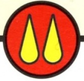

<!-- A0403-B0361 -->

原译文

"Eternals" “永恒者”

**校订译文**

"Eternals" “永恒者”

<!-- /A0403-B0361 -->

<!-- A0403-B0362 -->

原译文

Captain Tybahlt,Caller of the Fires 提伯尔特连长，烈焰召者

**校订译文**

Captain Tybahlt,Caller of the Fires 提伯尔特连长，烈焰召者

<!-- /A0403-B0362 -->

<!-- A0403-B0363 -->

原译文

2 Lieutenants 2名副官

**校订译文**

2 Lieutenants 2名副官

<!-- /A0403-B0363 -->

<!-- A0403-B0364 -->

原译文

Company Ancient 战团旗手

**校订译文**

Company Ancient 连队旗手

<!-- /A0403-B0364 -->

<!-- A0403-B0365 -->

原译文

Company Champion 战团冠军

**校订译文**

Company Champion 连队冠军

<!-- /A0403-B0365 -->

<!-- A0403-B0366 -->

原译文

Company Veterans 战团老兵

**校订译文**

Company Veterans 连队老兵

<!-- /A0403-B0366 -->

<!-- A0403-B0367 -->

原译文

10 Battleline Squads 10个战线小队

**校订译文**

10 Battleline Squads 10个战线小队

<!-- /A0403-B0367 -->

<!-- A0403-B0368 -->

原译文

6 Dreadnoughts 6位无畏

**校订译文**

6 Dreadnoughts 6台无畏机甲

<!-- /A0403-B0368 -->

<!-- A0403-B0369 -->

原译文

7th Company 第七连队

**校订译文**

7th Company 第七连队

<!-- /A0403-B0369 -->

<!-- A0403-B0370 图片 -->

<!-- A0403-B0371 -->

原译文

"Unconquerables" “不可征服者”

**校订译文**

"Unconquerables" “不可征服者”

<!-- /A0403-B0371 -->

<!-- A0403-B0372 -->

原译文

Captain Phaeton,Master of the Marches 法厄同连长，行军大师

**校订译文**

Captain Phaeton,Master of the Marches 法厄同连长，行军大师

<!-- /A0403-B0372 -->

<!-- A0403-B0373 -->

原译文

2 Lieutenants 2名副官

**校订译文**

2 Lieutenants 2名副官

<!-- /A0403-B0373 -->

<!-- A0403-B0374 -->

原译文

Company Ancient 战团旗手

**校订译文**

Company Ancient 连队旗手

<!-- /A0403-B0374 -->

<!-- A0403-B0375 -->

原译文

Company Champion 战团冠军

**校订译文**

Company Champion 连队冠军

<!-- /A0403-B0375 -->

<!-- A0403-B0376 -->

原译文

Company Veterans 战团老兵

**校订译文**

Company Veterans 连队老兵

<!-- /A0403-B0376 -->

<!-- A0403-B0377 -->

原译文

10 Battleline Squads 10个战线小队

**校订译文**

10 Battleline Squads 10个战线小队

**校注：** 第七连表中英文列10个战线小队，但前文B0228称第七与第八连均为近战支援；源文内部冲突，分别保留。

<!-- /A0403-B0377 -->

<!-- A0403-B0378 -->

原译文

4 Dreadnoughts 4位无畏

**校订译文**

4 Dreadnoughts 4台无畏机甲

<!-- /A0403-B0378 -->

<!-- A0403-B0379 -->

原译文

8th Company 第八连队

**校订译文**

8th Company 第八连队

<!-- /A0403-B0379 -->

<!-- A0403-B0380 图片 -->
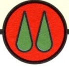

<!-- A0403-B0381 -->

原译文

"Bloodblades" “血刃”

**校订译文**

"Bloodblades" “血刃”

<!-- /A0403-B0381 -->

<!-- A0403-B0382 -->

原译文

Captain Matarno,Lord of Skyfall 马塔诺连长，天陨领主

**校订译文**

Captain Matarno,Lord of Skyfall 马塔诺连长，天陨领主

<!-- /A0403-B0382 -->

<!-- A0403-B0383 -->

原译文

2 Lieutenants 2名副官

**校订译文**

2 Lieutenants 2名副官

<!-- /A0403-B0383 -->

<!-- A0403-B0384 -->

原译文

Company Ancient 战团旗手

**校订译文**

Company Ancient 连队旗手

<!-- /A0403-B0384 -->

<!-- A0403-B0385 -->

原译文

Company Champion 战团冠军

**校订译文**

Company Champion 连队冠军

<!-- /A0403-B0385 -->

<!-- A0403-B0386 -->

原译文

Company Veterans 战团老兵

**校订译文**

Company Veterans 连队老兵

<!-- /A0403-B0386 -->

<!-- A0403-B0387 -->

原译文

10 Close Support Squads 10个近战支援小队

**校订译文**

10 Close Support Squads 10个近战支援小队

<!-- /A0403-B0387 -->

<!-- A0403-B0388 -->

原译文

2 Dreadnoughts 2位无畏

**校订译文**

2 Dreadnoughts 2台无畏机甲

<!-- /A0403-B0388 -->

<!-- A0403-B0389 -->

原译文

9th Company 第九连队

**校订译文**

9th Company 第九连队

<!-- /A0403-B0389 -->

<!-- A0403-B0390 图片 -->
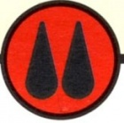

<!-- A0403-B0391 -->

原译文

"Sunderers" “分离者”

**校订译文**

"Sunderers" “分离者”

<!-- /A0403-B0391 -->

<!-- A0403-B0392 -->

原译文

Captain Latarnes,Master of Sieges 拉塔恩斯连长，攻城大师

**校订译文**

Captain Latarnes,Master of Sieges 拉塔恩斯连长，攻城大师

<!-- /A0403-B0392 -->

<!-- A0403-B0393 -->

原译文

2 Lieutenants 2名副官

**校订译文**

2 Lieutenants 2名副官

<!-- /A0403-B0393 -->

<!-- A0403-B0394 -->

原译文

Company Ancient 战团旗手

**校订译文**

Company Ancient 连队旗手

<!-- /A0403-B0394 -->

<!-- A0403-B0395 -->

原译文

Company Champion 战团冠军

**校订译文**

Company Champion 连队冠军

<!-- /A0403-B0395 -->

<!-- A0403-B0396 -->

原译文

Company Veterans 战团老兵

**校订译文**

Company Veterans 连队老兵

<!-- /A0403-B0396 -->

<!-- A0403-B0397 -->

原译文

10 Fire Support Squads 10个火力支援小队

**校订译文**

10 Fire Support Squads 10个火力支援小队

<!-- /A0403-B0397 -->

<!-- A0403-B0398 -->

原译文

5 Dreadnoughts 5位无畏

**校订译文**

5 Dreadnoughts 5台无畏机甲

<!-- /A0403-B0398 -->

<!-- A0403-B0399 -->
### Scout Company 侦察连队

原题：Scout Company 侦查连队

<!-- /A0403-B0399 -->

<!-- A0403-B0400 -->

原译文

10th Company 第十连队

**校订译文**

10th Company 第十连队

<!-- /A0403-B0400 -->

<!-- A0403-B0401 图片 -->
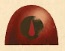

<!-- A0403-B0402 -->

原译文

"Redeemers" “救赎者”

**校订译文**

"Redeemers" “救赎者”

<!-- /A0403-B0402 -->

<!-- A0403-B0403 -->

原译文

Captain Borgio,Master of the Recruits 波吉奥连长，新兵之主

**校订译文**

Captain Borgio,Master of the Recruits 波吉奥连长，新兵大师

<!-- /A0403-B0403 -->

<!-- A0403-B0404 -->

原译文

2 Lieutenants 2名副官

**校订译文**

2 Lieutenants 2名副官

<!-- /A0403-B0404 -->

<!-- A0403-B0405 -->

原译文

Company Ancient 战团旗手

**校订译文**

Company Ancient 连队旗手

<!-- /A0403-B0405 -->

<!-- A0403-B0406 -->

原译文

Company Champion 战团冠军

**校订译文**

Company Champion 连队冠军

<!-- /A0403-B0406 -->

<!-- A0403-B0407 -->

原译文

Company Veterans 战团老兵

**校订译文**

Company Veterans 连队老兵

<!-- /A0403-B0407 -->

<!-- A0403-B0408 -->

原译文

10 Scout Squads 10个侦察小队

**校订译文**

10 Scout Squads 10个侦察小队

<!-- /A0403-B0408 -->

<!-- A0403-B0409 -->

原译文

100 Vanguard Space Marines 100名先锋星际战士

**校订译文**

100 Vanguard Space Marines 100名先锋星际战士

<!-- /A0403-B0409 -->

<!-- A0403-B0410 -->

原译文

457 unassigned Neophytes 457名未定新进者

**校订译文**

457 unassigned Neophytes 457名尚未分配编制的新进者

<!-- /A0403-B0410 -->

<!-- A0403-B0411 -->
### Company Disposition 连队布置

<!-- /A0403-B0411 -->

<!-- A0403-B0412 -->
**英文原文**

Each company is divided into 10 squads. Squads are led into battle by a Sergeant or a Veteran Sergeant and consist of four to nine Battle Brothers. Each squad can be broken down into two 5 man squads called combat squads.

<!-- /A0403-B0412 -->

<!-- A0403-B0413 -->

原译文

每个连队分为10个小队。小队由一名军士或一名老兵军士率领，由四至九名战斗兄弟组成。每个小队可以分成两个五人小队，称为战斗小队。

**校订译文**

每个连队下辖十个小队。每队由一名军士或老兵军士带领，另有四至九名战斗兄弟。满编十人的小队可拆成两个五人的战斗分队。

**校注：** 原文小队为军士加4—9名战士，随后称每队能拆为两个五人队；只有满编十人时满足该人数，中文补明满编条件。

<!-- /A0403-B0413 -->

<!-- A0403-B0414 图片 -->
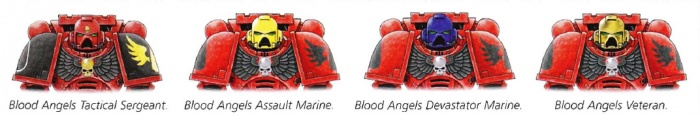

<!-- A0403-B0415 -->

原译文

Markings denoting Tactical Sergeant, Assault, Devastator, and Veteran marines 表示战术军士、突击、毁灭者和老兵战士的标记

**校订译文**

Markings denoting Tactical Sergeant, Assault, Devastator, and Veteran marines 战术军士、突击战士、破坏者及老兵的标记

<!-- /A0403-B0415 -->

<!-- A0403-B0416 -->
**英文原文**

Veteran Squads consist of Sanguinary Guard, The Death Company, Sternguard Veterans, Vanguard Veterans, Veteran Intercessors, Company Veterans, and Terminator Squads.

<!-- /A0403-B0416 -->

<!-- A0403-B0417 -->

原译文

老兵小队由圣血卫队、死亡连、肃卫老兵、先锋老兵、老兵仲裁者、连队老兵和终结者小队组成。

**校订译文**

老兵类部队包括圣血守卫、死亡连队、肃卫老兵、先锋老兵、仲裁者老兵、连队老兵和终结者小队。

<!-- /A0403-B0417 -->

<!-- A0403-B0418 -->
**英文原文**

Battleline Squads consist of Tactical Squads, Intercessor Squads, Heavy Intercessor Squads, Death Company Squads, and Infiltrator Squads.

<!-- /A0403-B0418 -->

<!-- A0403-B0419 -->

原译文

战线小队由战术小队、仲裁者小队、重装仲裁者小队、死亡连小队和渗透者小队组成。

**校订译文**

战线类部队包括战术小队、仲裁者小队、重装仲裁者小队、死亡连队小队和渗透者小队。

<!-- /A0403-B0419 -->

<!-- A0403-B0420 -->
**英文原文**

Close Support Squads consist of Assault Squads, Assault Intercessor Squads, Inceptor Squads, Reiver Squads, and Incursor Squads.

<!-- /A0403-B0420 -->

<!-- A0403-B0421 -->

原译文

近战支援小队由突击小队、突击仲裁者小队、先驱者小队、掠夺者小队和入侵者小队组成。

**校订译文**

近战支援类部队包括突击小队、突击仲裁者小队、先驱者小队、掠夺者小队和入侵者小队。

<!-- /A0403-B0421 -->

<!-- A0403-B0422 -->
**英文原文**

Fire Support Squads consist of Devastator Squads, Aggressor Squads, Hellblaster Squads, Eliminator Squads, Suppressor Squads, Eradicator Squads, and Centurion Warsuits.

<!-- /A0403-B0422 -->

<!-- A0403-B0423 -->

原译文

火力支援小队由毁灭者小队、侵略者小队、地狱轰击者小队、歼灭者小队、压制者小队、根除者小队和百夫长战甲组成。

**校订译文**

火力支援类部队包括破坏者小队、侵略者小队、地狱轰击者小队、歼灭者小队、压制者小队、根除者小队及百夫长战甲部队。

<!-- /A0403-B0423 -->

<!-- A0403-B0424 -->
**英文原文**

Scout Squads are the newly recruited neophytes serving under the ever watchful eye of the Scout Sergeant, who is one of the most experienced Space Marines in the chapter.

<!-- /A0403-B0424 -->

<!-- A0403-B0425 -->

原译文

侦察小队是新招募的新进者，在侦察兵军士的密切监视下服役，侦察兵军士是战团中经验最丰富的星际战士之一。

**校订译文**

侦察小队由新招募的新进者组成，在侦察兵军士的密切监督下服役。这些军士是战团中经验最丰富的星际战士之一。

<!-- /A0403-B0425 -->

<!-- A0403-B0426 -->
**英文原文**

The Blood Angels show squad belonging with symbols worn on the right kneepad of the power armour.

<!-- /A0403-B0426 -->

<!-- A0403-B0427 -->

原译文

圣血天使展示了小队的归属，动力盔甲的右膝甲上戴着符号。

**校订译文**

圣血天使以动力甲右膝甲上的符号标明所属小队。

<!-- /A0403-B0427 -->

<!-- A0403-B0428 图片 -->
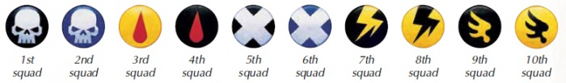

<!-- A0403-B0429 -->

原译文

Squad markings, typically displayed on the right kneepad 小队标记，通常显示在右膝甲上

**校订译文**

Squad markings, typically displayed on the right kneepad 小队标记，通常显示在右膝甲上

<!-- /A0403-B0429 -->

<!-- A0403-B0430 -->
### The Death Company 死亡连队

原题：The Death Company 死亡连

<!-- /A0403-B0430 -->

<!-- A0403-B0431 -->
**英文原文**

Blood Angels are unique in that deeply engrained in their gene-seed is the encoded experience of Sanguinius, and most deeply imprinted of all is the memory of his final duel with Horus. Infrequently, this 'race memory' may be triggered by circumstances, often on the eve of battle, but it is likely to be the death of the warrior whose mind is suddenly wrenched into the distant past. What has become known as the Black Rage overcomes him, the memories and consciousness of Sanguinius intrude upon his mind, and dire events ten millennia old flood into the present.

<!-- /A0403-B0431 -->

<!-- A0403-B0432 -->

原译文

圣血天使的独特之处在于，圣吉列斯的编码经历深深植根于他们的基因种子中，其中最深刻的印记是他与荷鲁斯最后决斗的记忆。偶尔，这种“血统记忆”可能是由环境引发的，通常是在战斗前夕，但很可能是战士的死亡，他的思想突然被扭曲到遥远的过去。所谓的黑怒战胜了他，圣吉列斯的记忆和意识侵入了他的脑海，一万年前的可怕事件涌入了现在。

**校订译文**

圣血天使的基因种子中深深烙印着圣吉列斯的经历，其中最牢固的记忆，便是他与荷鲁斯的最后决斗。这种“血统记忆”偶尔会被特定情境触发，尤其是在战斗前夕。一旦战士的心智被猛然拖回遥远的过去，往往也就意味着他走向死亡。黑怒将他吞没，圣吉列斯的记忆与意识侵入心灵，一万年前的惨烈事件重新涌入当下。

**校注：** be the death of the warrior 指记忆发作可能导致战士死亡，并非以战士死亡作为触发条件。

<!-- /A0403-B0432 -->

<!-- A0403-B0433 图片 -->
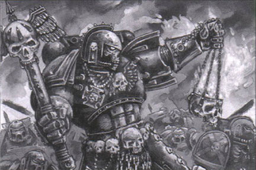

<!-- A0403-B0434 -->

原译文

Chaplain directing his Death Company 牧师指挥他的死亡连

**校订译文**

Chaplain directing his Death Company 教士指挥死亡连队

<!-- /A0403-B0434 -->

<!-- A0403-B0435 -->
**英文原文**

To outside observers, the Astartes overcome with the Black Rage appears half mad with fury, believing the past to be the present, and unable to recognize his comrades. He may thinks himself the Primarch upon the eve of his fall, and the bloody battles of the Horus Heresy are raging all around him. As well as the memories of the Primarch, the Marine is imbued with a small portion of Sanguinius's unearthly power, boosting his already prodigious strength and vitality to superhuman levels.

<!-- /A0403-B0435 -->

<!-- A0403-B0436 -->

原译文

在外界观察者看来，被黑怒征服的阿斯塔泰斯似乎半疯半怒，认为过去就是现在，无法认出他的战友。在他陨落前夕，他可能认为自己是原体，荷鲁斯叛乱的血腥战斗正在他周围肆虐。除了原体的记忆，这位星际战士还充满了圣吉列斯的一小部分超凡力量，将他已经惊人的力量和活力提升到了超人的水平。

**校订译文**

在旁人眼中，陷入黑怒的阿斯塔特已近乎怒不可遏的疯子。他分不清过去与现在，认不出自己的同袍，可能以为自己就是陨落前夕的原体，而荷鲁斯之乱的血战正在四周重演。与原体的记忆一同涌来的，还有圣吉列斯一小部分超凡力量，使这名战士本已惊人的力量与生命力再度大幅增强。

<!-- /A0403-B0436 -->

<!-- A0403-B0437 -->
**英文原文**

In order to keep the Black Rage in check, on the eve of battle the Blood Angels bend their thoughts to prayer and to the sacrifice of their Primarch so many centuries ago. Chaplains walk amongst their brethren, blessing each in turn and noting those whose eyes may appear a little glazed, whose speech is slurred or over-excited. Some, almost all, overcome this ancient intrusion into their minds. All of a warrior's training is directed at mastering it, wrestling it down into the depths of his being. But for some the imprint of Sanguinius is too strong, the memories too loud and demanding. As the Chaplains chant the moripatris, the mass of doom, the chosen ones fall into the arms of their priests, and are taken away. These join the ranks of a special unit called the Death Company.

<!-- /A0403-B0437 -->

<!-- A0403-B0438 -->

原译文

为了控制黑怒，在战斗前夕，圣血天使将他们的思维转向祈祷和几个世纪前他们的原体的牺牲。牧师走在他们的兄弟中间，轮流祝福每个人，并注意那些眼睛可能有点呆滞、言语含糊不清或过于兴奋的人。有些人，几乎所有人，都克服了这种古老的入侵。战士的所有训练都是为了掌握它，把它摔到他生命的深处。但对一些人来说，圣吉列斯的印记太强烈了，记忆太响亮，要求太高。当牧师们吟唱毁灭弥撒时，被选中的人落入牧师的怀抱，被带走。这些人加入了一个名为死亡连的特殊部队。

**校订译文**

为压制黑怒，圣血天使在战斗前夕专心祷告，冥想原体于久远年代前作出的牺牲。教士走在兄弟们之间，逐一赐福，观察谁眼神呆滞、言语含糊，或异常兴奋。几乎所有人都能抵御这种古老记忆的侵袭；他们接受的训练，就是为了将其驾驭，压回心灵深处。但对少数人而言，圣吉列斯的烙印太过强烈，记忆的呼唤无法抗拒。当教士吟唱“莫里帕特里斯”——毁灭弥撒——时，这些被选中的人便倒入教士怀中，被带离队伍，编入名为死亡连队的特殊部队。

**校注：** 保留 moripatris 的专名音译莫里帕特里斯；mass of doom 为其释义毁灭弥撒。

<!-- /A0403-B0438 -->

<!-- A0403-B0439 -->
**英文原文**

Assailed by the dying memories of Sanguinius, the warriors of the Death Company seek but one thing: death in battle fighting against the enemies of the Emperor. The Death Company is arrayed in black armour upon which are painted blood-red saltires, crosses symbolizing the Angel's sacrifice. Led into battle and directed towards the foe by the Chapter's Chaplains, the warriors fight knowing death is at hand, making them utterly fearless, and they can shrug off injuries that would stop even other Astartes. Should they survive the battle, their wounds will probably kill them afterwards, once the frenzy and the slaughter are over. Blood Angels are thought to find this the preferable end, for those who do survive almost always fall victim to the Red Thirst, turning into creatures no better than wild beasts craving flesh and blood: better by far to die a quick and clean death in battle than to lose oneself in the curse of the Flaw.

<!-- /A0403-B0439 -->

<!-- A0403-B0440 -->

原译文

受到圣吉列斯垂死记忆的攻击，死亡连的战士只寻求一件事：在与帝皇之敌的战斗中死亡。死亡连身穿黑色盔甲，盔甲上涂有血红色的十字架，十字架象征着天使的牺牲。在战团牧师的带领下，战士们投入战斗，直指敌人，他们知道死亡就在眼前，这让他们无所畏惧，他们可以摆脱伤害，甚至可以阻止其他阿斯塔特。如果他们在战斗中幸存下来，一旦狂热和屠杀结束，他们的伤口可能会在战斗结束后杀死他们。圣血天使认为这是最好的结局，因为那些幸存下来的人几乎总是成为血渴的受害者，变成比野兽更渴望血肉之躯的生物：到目前为止，在战斗中快速而干净地死去比在缺陷的诅咒中迷失自己要好得多。

**校订译文**

死亡连队战士遭受圣吉列斯临终记忆的不断侵袭，唯一愿望就是在与帝皇之敌作战时死去。他们身披黑甲，其上绘有血红色的斜十字，象征天使的牺牲。战团教士率领他们上阵，并引导他们冲向敌人。明知死亡近在眼前，反而令他们毫无畏惧，甚至能无视足以使其他阿斯塔特倒下的伤势。即使幸存，待狂乱与杀戮平息，伤势也很可能随后夺走他们的生命。圣血天使认为，这样的结局更好；因为真正活下来的人几乎总会被血渴吞噬，变得与渴求血肉的野兽无异。与其迷失于瑕疵的诅咒，不如在战斗中迅速、干脆地死去。

**校注：** saltires 为斜十字／X形十字；原译后半句将足以击倒其他阿斯塔特的伤势，误写成死亡连队能够阻止其他阿斯塔特。

<!-- /A0403-B0440 -->

<!-- A0403-B0441 -->
**英文原文**

Even those in a Dreadnought cannot escape the grasp of the Black Rage when it strikes, turning the machine into a raging Death Company Dreadnought

<!-- /A0403-B0441 -->

<!-- A0403-B0442 -->

原译文

即使是那些驾驶无畏的人，在黑怒来袭时，也无法逃脱黑怒的控制，将机械变成狂暴的死亡连无畏

**校订译文**

即使封存于无畏机甲中的战士也逃不过黑怒。一旦发作，机甲便会成为狂暴的死亡连队无畏机甲。

<!-- /A0403-B0442 -->

<!-- A0403-B0443 -->
### Honour Guard 荣誉卫队

<!-- /A0403-B0443 -->

<!-- A0403-B0444 -->
**英文原文**

Among the Chapter, it is customary of the mighty Blood Angels leaders to be accompanied by an Honour Guard of dedicated warriors. Its members are often distinguished individuals or the most accomplished Veteran Marines of the Chapter; warriors with full access to the armoury of the Blood Angels. As a result, the Honour Guard are normally well equipped and ably transported. Sanguinary Priests and Techmarines may be found within an Honour Guard, as can Standard-Bearers. When operating as Honour Guard for a Company Commander, one member of the Guard may be nominated as Blood Champion. Honour Guard wear gold helmets.

<!-- /A0403-B0444 -->

<!-- A0403-B0445 -->

原译文

在战团中，强大的圣血天使领袖通常会有一支由忠诚战士组成的荣誉卫队陪同。其成员通常是杰出的个人或战团最有成就的老兵星际战士；战士可以完全进入圣血天使的军械库。因此，荣誉卫队通常装备精良，能得到妥善运输。圣血祭司和技术军士可以在荣誉卫队中找到，标准旗手也是如此。当担任连队指挥的荣誉卫队时，一名荣誉卫队成员可被提名为鲜血冠军。荣誉卫队戴着黄金头盔。

**校订译文**

圣血天使的领袖通常由忠诚战士组成的荣誉卫队随侍。卫队成员往往功勋卓著，或是战团中成就最高的老兵，并有权调用军械库中的全部装备。因此，他们通常武备精良，也配有充足的运输载具。荣誉卫队中可包括圣血祭司、科技战士和旗手。担任连长卫队时，其中一人还可能获授“鲜血冠军”称号。荣誉卫队以金色头盔为标志。

<!-- /A0403-B0445 -->

<!-- A0403-B0446 图片 -->
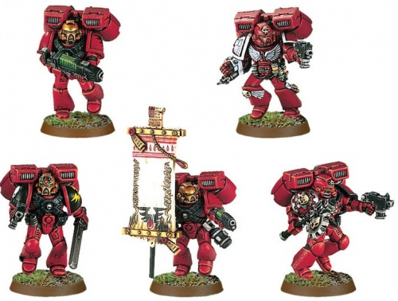

<!-- A0403-B0447 -->

原译文

Blood Angels Honour Guard 圣血天使荣誉卫队

**校订译文**

Blood Angels Honour Guard 圣血天使荣誉卫队

<!-- /A0403-B0447 -->

<!-- A0403-B0448 -->
### The Sanguinary Guard 圣血守卫

原题：The Sanguinary Guard 圣血卫队

<!-- /A0403-B0448 -->

<!-- A0403-B0449 -->
**英文原文**

Even among the vaunted Veterans of the Chapter, there are warriors that stand above their brothers in might of arms and sheer skill. These are the Sanguinary Guard, an order that traces its origins to the days of the Great Crusade, where they served as their Primarch's personal bodyguard, and even accompanied Sanguinius when he, the Emperor, and Rogal Dorn confronted Horus in the arch-traitor's battle barge. Clad in golden Artificer Armour and armed with wrist-mounted Angelus Bolters, they wade into battle wielding Glaives Encarmine, ancient power weapons of terrible power.

<!-- /A0403-B0449 -->

<!-- A0403-B0450 -->

原译文

即使在那些战团的老兵中，也有一些战士在武力和纯粹的技能上超越了他们的兄弟。这些是圣血卫队，这一组织的起源可以追溯到大远征时期，他们在那里担任他们的原体的个人护卫，甚至在圣吉列斯、帝皇和罗格·多恩在大叛徒的战斗驳船上与荷鲁斯对峙时陪伴他。他们穿着金色的精工盔甲，戴着手腕上的祷告爆矢枪，挥舞着深红长剑，这是一种具有可怕力量的古老动力武器，跋涉投入战斗。

**校订译文**

即使在战团声名显赫的老兵之中，也有武艺与实力尤为超群者，这便是圣血守卫。他们的起源可追溯至大远征时期，当时担任原体的贴身卫士；圣吉列斯与帝皇、罗格·多恩登上叛徒战帅的战斗驳船、迎战荷鲁斯时，他们也曾随行。圣血守卫身披金色精工护甲，装备腕载式祷告爆矢枪，手持赤红战刃杀入战场；这些古老的动力武器拥有骇人的威力。

**校注：** Glaives Encarmine 暂译赤红战刃，避免把泛称战刃限定为长剑；Angelus Bolter 暂沿原稿祷告爆矢枪，待核官方武器名。

<!-- /A0403-B0450 -->

<!-- A0403-B0451 -->
**英文原文**

All Chapters descended from the Blood Angels maintain units of Sanguinary Guard as a legacy of their parent Legion, and all follow the same color scheme except for the Angels Encarmine, whose Sanguinary Guard wear alabaster-white colored armour instead.

<!-- /A0403-B0451 -->

<!-- A0403-B0452 -->

原译文

圣血天使的所有分支战团都保留了圣血卫队的单位，作为其母军团的遗产，除了赤红天使外，其他分支都遵循相同的配色方案，赤红天使的圣血卫队穿着雪花石膏白色盔甲。

**校订译文**

圣血天使的所有子战团都保留圣血守卫，以继承母军团的传统。他们通常沿用相同配色，只有赤红天使例外，其圣血守卫身披雪花石膏般洁白的盔甲。

<!-- /A0403-B0452 -->

<!-- A0403-B0453 -->
### Deathstorm Strike Force 死亡风暴打击部队

<!-- /A0403-B0453 -->

<!-- A0403-B0454 -->
**英文原文**

The Blood Angels are also able to field a highly specialized force against overwhelming infantry known as a Deathstorm Strike Force and it is only deployed in the most dire of situations.

<!-- /A0403-B0454 -->

<!-- A0403-B0455 -->

原译文

圣血天使还能够部署一支高度专业化的部队来对抗压倒性的步兵，称为死亡风暴打击部队，它只在最可怕的情况下部署。

**校订译文**

面对数量压倒己方的敌方步兵，圣血天使能够派出高度专门化的死亡风暴打击部队；只有形势最危急时，才会动用这支力量。

<!-- /A0403-B0455 -->

<!-- A0403-B0456 -->
## Recruitment 招募

<!-- /A0403-B0456 -->

<!-- A0403-B0457 -->
**英文原文**

The Blood Angels recruit their Aspirants from the chapter's home planet of Baal and its two moons. The time of choosing is known as the Duplus Lunaris, a centennial alignment of Baal and its moons. During this time, members of the Chapter visit each tribe of the Baal System to encourage participation in the selection process. The subsequent trials differ, with ritual combat being typical on Baal Primus. On Baal Secundus meanwhile they travel to Angel's Fall (the place where Sangunius was found as an infant) must reach the Place of Challenge by journeying through a vast, hostile desert, and a series of canyons, infested with Fire Scorpions and Thirstwater. While the trial claims many, those that succeed come before the Blood Angels, who winnow out those that are genetically incompatible with their Gene-Seed. All are permitted to return home, though the most promising rejects are elevated to the status of Chapter Serf. After nine days of games at the Place of Challenge, their numbers are reduced even further. Those that remain are elevated to Aspirant. These Aspirants are then force-marched to the next Place of Challenge, where they are split into smaller units. Any aspirant who fails at this point is doomed to never leave the facility, and will either die in the trials or remain there as a guard.

<!-- /A0403-B0457 -->

<!-- A0403-B0458 -->

原译文

圣血天使从战团的母星巴尔及其两个卫星招募他们的有志者。选择的时间被称为双月，这是巴尔及其卫星百年一次的对齐。在此期间，战团成员访问巴尔星系的每个部落，以鼓励参与选拔过程。随后的试炼有所不同，巴尔一号上的仪式战斗很典型。与此同时，在巴尔二号上，他们前往天使之陨（圣吉列斯婴儿时被发现的地方），必须穿过一片广阔的、充满敌意的沙漠和一系列被火蝎和渴水侵扰的峡谷，才能到达挑战之地。虽然这项试炼要求了许多人，但那些成功的人都在圣血天使之前，圣血天使会筛选出那些与他们的基因种子基因不相容的人。所有人都可以回家，最有希望的被拒绝者被提升为战团侍从。在挑战之地进行了九天的比赛后，他们的数量进一步减少。剩下的人被提升为有志者。然后，这些有志者被强行行军到下一个挑战之地，在那里他们被分成更小的单位。任何在这一点上失败的有志者注定永远不会离开这个设施，要么在试炼中死亡，要么留在那里当守卫。

**校订译文**

圣血天使从巴尔及其两颗卫星招募候选者。选拔时节称为“双月”，对应巴尔及其卫星每百年一次的排列会合。届时，战团成员会走访星系中的各个部落，鼓励年轻人参加选拔。各地的试炼形式不同：巴尔一号通常采用仪式性格斗；巴尔二号的参与者则要前往天使之陨，也就是婴儿圣吉列斯被发现的地方。他们必须穿越广袤险恶的沙漠，以及遍布火蝎与渴水的峡谷，抵达挑战之地。许多人死于途中；成功者来到圣血天使面前，接受基因筛查，淘汰与战团基因种子不相容的人。落选者可以返乡，其中最有潜力者会获选为战团农奴。接着，挑战之地还要进行九天竞赛，继续淘汰人员；留下的人才正式成为候选者。他们随后被迫急行军，前往下一处挑战之地，再分成更小的队伍。进入这一阶段后，失败者便再也无法离开设施：他们要么死于试炼，要么留下担任守卫。

**校注：** claims many 指夺去许多人性命，不是要求许多人；winnow out 指淘汰基因不相容者。

<!-- /A0403-B0458 -->

<!-- A0403-B0459 -->
**英文原文**

After all these trials, victors (often numbering less than a few score) are finally chosen. They are taken in the Thunderhawks to the stronghold of the Blood Angels on the Baal itself, the Arx Angelicum. However, they haven't completed their trials yet, as they must observe a vigil for 72 hours without rest. Those that fail and fall asleep are taken away by the Blood-Servitors; no-one knows what happens to them.

<!-- /A0403-B0459 -->

<!-- A0403-B0460 -->

原译文

经过所有这些试验，最终选出了胜利者（通常不到几十人）。他们被带上雷鹰，前往巴尔上的圣血天使要塞，即天使堡。然而，他们还没有完成试炼，因为他们必须连续72小时不休息地守夜。那些失败并睡着的人会被鲜血机仆带走；没有人知道他们会发生什么。

**校订译文**

历经全部试炼后，最后的胜者才获选，人数通常不过数十人。他们乘雷鹰前往巴尔本星上的圣血天使据点——天使堡。然而，考验仍未结束：他们必须连续守夜七十二小时，不得休息。失败而睡去的人会被鲜血机仆带走，此后下落无人知晓。

<!-- /A0403-B0460 -->

<!-- A0403-B0461 -->
**英文原文**

At the end of the vigil, the remaining aspirants are offered a chalice (rumoured to contain a small portion of Sangunius's own blood) by the Sanguinary Priests. After partaking it, they fall into a coma and are entombed by the Blood-Servitors inside the caskets of the Hall of the Sacrophagi. They remain there for a full year, in full care of the casket's life-support systems, while they are injected with blood of the Sanguinius. Many die, incapable of bearing the vast changes wrought upon them by the gene-seed; others wake up too early and grow insane from their dark and claustrophobic existence. The ones who completely adapt, however, become the newest additions to the chapter.

<!-- /A0403-B0461 -->

<!-- A0403-B0462 -->

原译文

守夜结束时，圣血祭司为剩下的有志者提供了一个圣杯（据传含有圣吉列斯的一小部分血液）。在参与后，他们陷入昏迷，被血仆埋葬在圣棺大厅的棺材里。他们在那里呆了整整一年，在棺材的生命支持系统的全面照顾下，同时他们被注射了圣吉列斯的血液。许多人死亡，无法承受基因种子给他们带来的巨大变化；其他人醒得太早，在黑暗和幽闭恐怖的生活中变得疯狂。然而，那些完全适应的人成为了战团的最新成员。

**校订译文**

守夜结束后，圣血祭司向剩余候选者递上圣杯，据说杯中含有少量圣吉列斯之血。饮下后，他们陷入昏迷，被鲜血机仆安置进石棺大厅的棺舱。他们将在其中度过整整一年，由棺舱的生命维持系统照料，并接受圣吉列斯之血的注入。许多人无法承受基因种子造成的剧烈变化而死去；另一些人过早醒来，困于幽暗封闭的棺中，最终发疯。只有完全适应的人，才能成为战团的新成员。

**校注：** Blood-Servitors 为鲜血机仆，原译血仆与机仆身份不一致；partaking 指饮下圣杯中的血液。

<!-- /A0403-B0462 -->

<!-- A0403-B0463 -->
## Equipment 装备

<!-- /A0403-B0463 -->

<!-- A0403-B0464 -->
**英文原文**

As travel to Mars has become quite perilous since the formation of the Great Rift, most new Blood Angels Techmarines are trained on the Forge World of Unverrdt IX.

<!-- /A0403-B0464 -->

<!-- A0403-B0465 -->

原译文

自从大裂隙形成以来，前往火星的旅行变得相当危险，大多数新的圣血天使技术军士都在昂维尔特九号铸造世界接受训练。

**校订译文**

大裂隙形成后，前往火星的旅途异常危险，因此圣血天使的新任科技战士大多改在铸造世界昂维尔特九号接受训练。

<!-- /A0403-B0465 -->

<!-- A0403-B0466 图片 -->
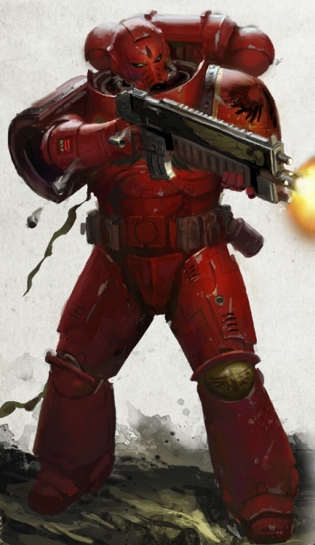

<!-- A0403-B0467 -->

原译文

Blood Angels Primaris Space Marine 圣血天使原铸星际战士

**校订译文**

Blood Angels Primaris Space Marine 圣血天使原铸星际战士

<!-- /A0403-B0467 -->

<!-- A0403-B0468 -->
## Noted Elements of the Blood Angels 圣血天使的著名成员

<!-- /A0403-B0468 -->

<!-- A0403-B0469 -->
### Chapter Fleet 战团舰队

<!-- /A0403-B0469 -->

<!-- A0403-B0470 -->
**英文原文**

Prior to the Devastation of Baal, the Blood Angels maintained a fleet composed of two Battle Barges, seven Strike Cruisers, and sixteen Rapid Strike Vessels. Among its ranks are Azkaellon Class Frigates. The Blood Angels fleet is said to be exceptionally powerful and is commanded almost entirely by members of the Chapter itself as opposed to Thralls.

<!-- /A0403-B0470 -->

<!-- A0403-B0471 -->

原译文

在巴尔毁灭之前，圣血天使维持着一支由两艘战斗驳船、七艘打击巡洋舰和十六艘快速打击战舰组成的舰队。其中包括阿兹卡隆级护卫舰。据说圣血天使舰队非常强大，几乎完全由战团成员指挥，而不是仆役。

**校订译文**

巴尔之毁前，圣血天使舰队拥有两艘战斗驳船、七艘打击巡洋舰和十六艘快速打击战舰，其中包括阿兹卡隆级护卫舰。舰队素以强大著称，几乎完全由战团成员亲自指挥，而非交给仆役。

<!-- /A0403-B0471 -->

<!-- A0403-B0472 -->
### Known Vessels 著名战舰

<!-- /A0403-B0472 -->

<!-- A0403-B0473 -->
**英文原文**

Absolution's Ire — Battle Barge and present flagship

<!-- /A0403-B0473 -->

<!-- A0403-B0474 -->

原译文

赦免之怒号 — 战斗驳船和现在的旗舰

**校订译文**

赦免之怒号 — 战斗驳船和现在的旗舰

<!-- /A0403-B0474 -->

<!-- A0403-B0475 -->
**英文原文**

Baal's Fury — Battle Barge.

<!-- /A0403-B0475 -->

<!-- A0403-B0476 -->

原译文

巴尔之怒号 — 战斗驳船

**校订译文**

巴尔之怒号 — 战斗驳船

<!-- /A0403-B0476 -->

<!-- A0403-B0477 -->
**英文原文**

Blade of Vengeance — Battle Barge.

<!-- /A0403-B0477 -->

<!-- A0403-B0478 -->

原译文

复仇之刃号 — 战斗驳船

**校订译文**

复仇之刃号 — 战斗驳船

<!-- /A0403-B0478 -->

<!-- A0403-B0479 -->
**英文原文**

Bloodcaller — Battle Barge.

<!-- /A0403-B0479 -->

<!-- A0403-B0480 -->

原译文

唤血者号 — 战斗驳船

**校订译文**

唤血者号 — 战斗驳船

<!-- /A0403-B0480 -->

<!-- A0403-B0481 -->
**英文原文**

Covenant of Baal — Battleship (Heresy-era).

<!-- /A0403-B0481 -->

<!-- A0403-B0482 -->

原译文

巴尔盟约号 — 战列舰（叛乱时期）

**校订译文**

巴尔盟约号 — 战列舰（叛乱时期）

<!-- /A0403-B0482 -->

<!-- A0403-B0483 -->
**英文原文**

The Crimson Spectre — Battle Barge (Heresy-era).

<!-- /A0403-B0483 -->

<!-- A0403-B0484 -->

原译文

深红幽灵号 — 战斗驳船（叛乱时期）

**校订译文**

深红幽灵号 — 战斗驳船（叛乱时期）

<!-- /A0403-B0484 -->

<!-- A0403-B0485 -->
**英文原文**

Eclipse of Hope — Battle Barge. Lost in the 5th Black Crusade.

<!-- /A0403-B0485 -->

<!-- A0403-B0486 -->

原译文

希望破灭号 — 战斗驳船，在第五次黑色远征中损失

**校订译文**

希望破灭号 — 战斗驳船，在第五次黑色远征中损失

<!-- /A0403-B0486 -->

<!-- A0403-B0487 -->

原译文

Eminence Sanguis 崇高之血号

**校订译文**

Eminence Sanguis 崇高之血号

<!-- /A0403-B0487 -->

<!-- A0403-B0488 -->
**英文原文**

Red Tear — Gloriana Class Battleship, the flagship of Sanguinius during the Great Crusade until it crashed on Signus Prime. Later recovered and repaired.

<!-- /A0403-B0488 -->

<!-- A0403-B0489 -->

原译文

红泪号 — 荣光女王级战列舰，大远征时期直到在西格纳斯主星坠毁前圣吉列斯的旗舰，后来被恢复并修复。

**校订译文**

红泪号——荣光女王级战列舰，大远征期间的圣吉列斯旗舰。它曾坠毁于西格纳斯主星，后来被回收并修复。

<!-- /A0403-B0489 -->

<!-- A0403-B0490 -->
**英文原文**

Sword of Baal — Strike Cruiser, assigned to the Indomitus Crusade.

<!-- /A0403-B0490 -->

<!-- A0403-B0491 -->

原译文

巴尔之剑号 — 打击巡洋舰，分配给不屈远征

**校订译文**

巴尔之剑号 — 打击巡洋舰，分配给不屈远征

<!-- /A0403-B0491 -->

<!-- A0403-B0492 -->
### Armoury 军械库

<!-- /A0403-B0492 -->

<!-- A0403-B0493 -->
### Relics and Artifacts 圣物和造物

<!-- /A0403-B0493 -->

<!-- A0403-B0494 -->

原译文

Axe Mortalis 死亡之斧

**校订译文**

Axe Mortalis 死亡之斧

<!-- /A0403-B0494 -->

<!-- A0403-B0495 -->

原译文

Death Mask of Sanguinius 圣吉列斯死亡面具

**校订译文**

Death Mask of Sanguinius 圣吉列斯死亡面具

<!-- /A0403-B0495 -->

<!-- A0403-B0496 -->

原译文

Perdition Pistol 毁灭手枪

**校订译文**

Perdition Pistol 毁灭手枪

<!-- /A0403-B0496 -->

<!-- A0403-B0497 -->

原译文

Red Grail 鲜血圣杯

**校订译文**

Red Grail 鲜血圣杯

<!-- /A0403-B0497 -->

<!-- A0403-B0498 -->

原译文

Shroud of Sanguinius 圣吉列斯圣骸布

**校订译文**

Shroud of Sanguinius 圣吉列斯圣骸布

<!-- /A0403-B0498 -->

<!-- A0403-B0499 -->

原译文

Spear of Telesto 毕功之矛

**校订译文**

Spear of Telesto 毕功之矛

<!-- /A0403-B0499 -->

<!-- A0403-B0500 -->
### Aircraft and Vehicles 飞行器与载具

<!-- /A0403-B0500 -->

<!-- A0403-B0501 -->
### Notable Members 著名成员

<!-- /A0403-B0501 -->

<!-- A0403-B0502 -->
### Great Crusade / Heresy 大远征 / 叛乱

<!-- /A0403-B0502 -->

<!-- A0403-B0503 -->
**英文原文**

Sanguinius — Primarch of the Blood Angels.

<!-- /A0403-B0503 -->

<!-- A0403-B0504 -->

原译文

圣吉列斯 — 圣血天使原体

**校订译文**

圣吉列斯 — 圣血天使原体

<!-- /A0403-B0504 -->

<!-- A0403-B0505 -->
**英文原文**

Raldoron — First Captain and Chapter Master of the Protectors, later Chapter Master of the Blood Angels.

<!-- /A0403-B0505 -->

<!-- A0403-B0506 -->

原译文

拉多隆 — 第一连长和保护者战团长，后来的圣血天使战团长

**校订译文**

拉多隆 — 第一连长和保护者战团长，后来的圣血天使战团长

<!-- /A0403-B0506 -->

<!-- A0403-B0507 -->
**英文原文**

Azkaellon — Herald of the Sanguinary Guard during the Horus Heresy, supervised the division of the Blood Angels Legion into Chapters.

<!-- /A0403-B0507 -->

<!-- A0403-B0508 -->

原译文

阿兹卡隆 — 大远征时期的圣血卫队传令官，监督了圣血天使军团的拆分。

**校订译文**

阿兹卡隆——荷鲁斯之乱期间的圣血守卫传令官，监督了军团拆分为战团的过程。

**校注：** 英文为 Horus Heresy，原译错置为大远征时期。

<!-- /A0403-B0508 -->

<!-- A0403-B0509 -->
**英文原文**

Dahka Berus — High Warden of the Blood Angels.

<!-- /A0403-B0509 -->

<!-- A0403-B0510 -->

原译文

达卡·贝鲁斯 — 圣血天使至高看守者

**校订译文**

达卡·贝鲁斯 — 圣血天使至高看守者

<!-- /A0403-B0510 -->

<!-- A0403-B0511 -->
**英文原文**

Nassir Amit — Captain of the Fifth Company, later founder and first Chapter Master of the Flesh Tearers.

<!-- /A0403-B0511 -->

<!-- A0403-B0512 -->

原译文

纳西尔·阿密特 — 第五连队连长，后来的撕肉者的创始人和第一任战团长。

**校订译文**

纳西尔·阿米特——第五连连长，后成为撕肉者战团创始人及首任战团长。

<!-- /A0403-B0512 -->

<!-- A0403-B0513 -->
**英文原文**

Zephon - Exarch of the High Host and first Chapter Master of the Charnel Guard

<!-- /A0403-B0513 -->

<!-- A0403-B0514 -->

原译文

泽丰 - 至高天军的总督和墓葬守卫的第一任战团长

**校订译文**

泽丰——至高军势总督，以及墓葬守卫的首任战团长。

<!-- /A0403-B0514 -->

<!-- A0403-B0515 -->
### Post-Heresy 叛乱后

<!-- /A0403-B0515 -->

<!-- A0403-B0516 -->
**英文原文**

Dante — Current Chapter Master of the Blood Angels.

<!-- /A0403-B0516 -->

<!-- A0403-B0517 -->

原译文

但丁 — 当前圣血天使的战团长

**校订译文**

但丁 — 当前圣血天使的战团长

<!-- /A0403-B0517 -->

<!-- A0403-B0518 -->
**英文原文**

Raldoron - First Chapter Master after the Heresy.

<!-- /A0403-B0518 -->

<!-- A0403-B0519 -->

原译文

拉多隆 - 叛乱后的第一任战团长

**校订译文**

拉多隆 - 叛乱后的第一任战团长

<!-- /A0403-B0519 -->

<!-- A0403-B0520 -->
**英文原文**

Mephiston — Current Chief Librarian of the Blood Angels.

<!-- /A0403-B0520 -->

<!-- A0403-B0521 -->

原译文

墨菲斯顿 — 当前圣血天使的首席智库

**校订译文**

墨菲斯顿——圣血天使现任首席智库员。

<!-- /A0403-B0521 -->

<!-- A0403-B0522 -->
**英文原文**

Corbulo — Sanguinary High Priest and Bearer of the Red Grail.

<!-- /A0403-B0522 -->

<!-- A0403-B0523 -->

原译文

科布罗 — 至高圣血祭司与鲜血圣杯持有者

**校订译文**

科布罗 — 至高圣血祭司与鲜血圣杯持有者

<!-- /A0403-B0523 -->

<!-- A0403-B0524 -->
**英文原文**

Astorath the Grim — High Chaplain and Redeemer of the Lost.

<!-- /A0403-B0524 -->

<!-- A0403-B0525 -->

原译文

冷酷者阿斯托拉斯 — 至高牧师和迷失者的救赎者

**校订译文**

冷酷者阿斯托拉斯——至高教士，迷失者的救赎者。

<!-- /A0403-B0525 -->

<!-- A0403-B0526 -->
**英文原文**

Lemartes — Chaplain and Guardian of The Lost.

<!-- /A0403-B0526 -->

<!-- A0403-B0527 -->

原译文

雷玛斯特 — 牧师和迷失者的守护者

**校订译文**

雷马特斯——教士，迷失者的守护者。

<!-- /A0403-B0527 -->

<!-- A0403-B0528 -->
**英文原文**

Karlaen - Captain, 1st Company

<!-- /A0403-B0528 -->

<!-- A0403-B0529 -->

原译文

卡拉恩 - 连长，第一连队

**校订译文**

卡莱恩——第一连连长。

<!-- /A0403-B0529 -->

<!-- A0403-B0530 -->
**英文原文**

Erasmus Tycho — Captain, 3rd Company (KIA).

<!-- /A0403-B0530 -->

<!-- A0403-B0531 -->

原译文

伊拉斯谟·第谷 — 连长，第三连队（KIA）

**校订译文**

伊拉斯谟·第谷——第三连连长，阵亡。

<!-- /A0403-B0531 -->

<!-- A0403-B0532 -->
**英文原文**

The Sanguinor — A mysterious and myth-enshrouded figure that appears to aid the Blood Angels during times of need.

<!-- /A0403-B0532 -->

<!-- A0403-B0533 -->

原译文

圣吉列诺 — 一个神秘而神话笼罩的人物，似乎在需要的时候帮助圣血天使。

**校订译文**

圣血者——笼罩在神秘与传说中的人物，会在圣血天使危急之时现身相助。

**校注：** The Sanguinor 已核 GW-09/GW-10 同第11页采用圣血者，取代原译圣血者。

<!-- /A0403-B0533 -->

<!-- A0403-B0534 -->
**英文原文**

Morleo Moriar — Death Company Furioso Dreadnought. Former Captain, fell at the Battle of Clamorga.

<!-- /A0403-B0534 -->

<!-- A0403-B0535 -->

原译文

莫尔莱奥·莫里亚 — 死亡连暴烈无畏。前连长，在克拉莫加之战中阵亡。

**校订译文**

莫尔莱奥·莫里亚——死亡连队的暴烈无畏机甲战士，曾任连长，在克拉莫加之战中倒下。

**校注：** 源文 fell 未明确说死亡；此人后来被封存于无畏机甲，译作倒下，避免无依据写作已经阵亡。

<!-- /A0403-B0535 -->

<!-- A0403-B0536 -->
**英文原文**

Rafen — Decorated Brother Sergeant held in high esteem by Mephiston.

<!-- /A0403-B0536 -->

<!-- A0403-B0537 -->

原译文

拉芬 — 墨菲斯顿高度尊重的勋章兄弟军士

**校订译文**

拉芬——功勋卓著的军士，深受墨菲斯顿敬重。

**校注：** decorated 指获授勋章、功勋卓著，不能作勋章兄弟军士。

<!-- /A0403-B0537 -->

<!-- A0403-B0538 -->
**英文原文**

Leonatos — Exiled Captain (KIA).

<!-- /A0403-B0538 -->

<!-- A0403-B0539 -->

原译文

莱昂纳托斯 — 被放逐的连长（KIA）

**校订译文**

莱昂纳托斯——遭流放的连长，阵亡。

<!-- /A0403-B0539 -->

<!-- A0403-B0540 -->
### Exclusive Units and Vehicles 独特单位和载具

<!-- /A0403-B0540 -->

<!-- A0403-B0541 -->
### Great Crusade / Heresy 大远征 / 叛乱

<!-- /A0403-B0541 -->

<!-- A0403-B0542 -->

原译文

Angel's Tears 天使之泪

**校订译文**

Angel's Tears 天使之泪

<!-- /A0403-B0542 -->

<!-- A0403-B0543 -->

原译文

Burning Eyes 燃烧之眼

**校订译文**

Burning Eyes 燃烧之眼

<!-- /A0403-B0543 -->

<!-- A0403-B0544 -->

原译文

Contemptor-Incaendius Class Dreadnought 蔑视者因坎迪厄斯级无畏

**校订译文**

Contemptor-Incaendius Class Dreadnought 蔑视者因坎迪厄斯级无畏机甲

<!-- /A0403-B0544 -->

<!-- A0403-B0545 -->

原译文

Crimson Paladins 深红圣骑士

**校订译文**

Crimson Paladins 猩红圣骑士

<!-- /A0403-B0545 -->

<!-- A0403-B0546 -->

原译文

Dawnbreakers 破晓者

**校订译文**

Dawnbreakers 破晓者

<!-- /A0403-B0546 -->

<!-- A0403-B0547 -->

原译文

High Host 至高天军

**校订译文**

High Host 至高军势

<!-- /A0403-B0547 -->

<!-- A0403-B0548 -->
### Post-Heresy 叛乱后

<!-- /A0403-B0548 -->

<!-- A0403-B0549 -->
**英文原文**

These may also be used by successor chapters.

<!-- /A0403-B0549 -->

<!-- A0403-B0550 -->

原译文

这些也可能被子战团使用。

**校订译文**

这些也可能被子战团使用。

<!-- /A0403-B0550 -->

<!-- A0403-B0551 -->

原译文

Baal Predator 巴尔掠食者

**校订译文**

Baal Predator 巴尔掠食者坦克

<!-- /A0403-B0551 -->

<!-- A0403-B0552 -->

原译文

Death Company 死亡连

**校订译文**

Death Company 死亡连队

<!-- /A0403-B0552 -->

<!-- A0403-B0553 -->

原译文

Death Company Chaplain 死亡连牧师

**校订译文**

Death Company Chaplain 死亡连队教士

<!-- /A0403-B0553 -->

<!-- A0403-B0554 -->

原译文

Death Company Dreadnought 死亡连无畏

**校订译文**

Death Company Dreadnought 死亡连队无畏机甲

<!-- /A0403-B0554 -->

<!-- A0403-B0555 -->

原译文

Furioso Dreadnought 暴烈无畏

**校订译文**

Furioso Dreadnought 暴烈无畏机甲

<!-- /A0403-B0555 -->

<!-- A0403-B0556 -->

原译文

Land Raider Angel Infernus 兰德掠袭者炼狱天使

**校订译文**

Land Raider Angel Infernus 炼狱天使型兰德掠袭者战车

<!-- /A0403-B0556 -->

<!-- A0403-B0557 -->

原译文

Librarian Dreadnought 智库无畏

**校订译文**

Librarian Dreadnought 智库员无畏机甲

<!-- /A0403-B0557 -->

<!-- A0403-B0558 -->

原译文

Quorum Empyrric 灵焰议会

**校订译文**

Quorum Empyrric 灵焰议会

<!-- /A0403-B0558 -->

<!-- A0403-B0559 -->

原译文

Sanguinary Guard 圣血卫队

**校订译文**

Sanguinary Guard 圣血守卫

<!-- /A0403-B0559 -->

<!-- A0403-B0560 -->

原译文

Sanguinary Priest 圣血祭司

**校订译文**

Sanguinary Priest 圣血祭司

<!-- /A0403-B0560 -->

本篇核心术语与暂定项

以下列出本篇出现的英文原形及核心术语表用词。同形词可能指不同对象，具体词义以本篇正文和校注为准；单复数、别名和仅见于图注的名称可能尚未列入。完整候选见[术语表](../../术语表/双语术语候选.csv)。

| 英文 | 采用中文 | 状态 |
| --- | --- | --- |
| Space Marines | 星际战士 | 官方已核对 |
| Blood Angels | 圣血天使 | 官方已核对 |
| Dark Angels | 黑暗天使 | 官方已核对 |
| World Eaters | 吞世者 | 官方已核对 |
| Tyranids | 泰伦虫族 | 官方已核对 |
| Orks | 欧克蛮人 | 官方已核对 |
| Librarian | 智库员 | 官方已核对 |
| Terminator | 终结者 | 官方已核对 |
| Roboute Guilliman | 罗保特·基里曼 | 官方已核对 |
| Ultramar | 奥特拉玛 | 官方已核对 |
| Ultramarines | 极限战士 | 官方已核对 |
| Horus Heresy | 荷鲁斯之乱 | 官方已核对 |
| Warp | 亚空间 | 官方已核对 |
| Great Rift | 大裂隙 | 官方已核对 |
| Imperium | 帝国 | 暂定·简称 |
| Imperial Navy | 帝国海军 | 暂定 |
| Mechanicum | 机械教 | 暂定·历史称谓 |
| Dark Age of Technology | 黑暗科技时代 | 暂定 |
| Khorne | 恐虐 | 官方已核对 |
| Craftworld | 方舟世界 | 官方已核对 |
| Waaagh! | Waaagh! | 暂定·保留原文 |
| Sanguinary | 圣血学派 | 暂定·学派语境 |
| Indomitus | 不屈学派 | 暂定·学派语境 |
| Maelstrom | 大漩涡 | 官方已核对 |
| Imperial Fists | 帝国之拳 | 暂定 |
| Emperor | 帝皇 | 官方已核对 |
| Primarch | 原体 | 官方已核对 |
| Chapter Serf | 战团农奴 | 暂定·官方待核 |
| Battle Barge | 战斗驳船 | 暂定·官方待核 |
| Hive World | 巢都世界 | 暂定·官方待核 |
| Forge World | 铸造世界 | 暂定·官方待核 |
| Emperor's Children | 帝皇之子 | 官方已核对 |
| Slaanesh | 色孽 | 官方已核对 |
| Unbroken | 不屈者 | 暂定·官方待核 |
| The Order | 秩序 | 暂定·官方待核 |
| Great Crusade | 大远征 | 暂定·官方待核 |
| Compliance | 归顺；纳入帝国统治 | 暂定·官方待核 |
| Age of Strife | 纷争时代 | 暂定·官方待核 |
| Terra | 泰拉 | 暂定·官方待核 |
| Murder | 谋杀 | 暂定·官方待核 |
| Luna Wolves | 影月苍狼 | 暂定·官方待核 |
| Horus | 荷鲁斯 | 暂定·官方待核 |
| Vengeful Spirit | 复仇之魂号 | 暂定·官方待核 |
| Lion El'Jonson | 莱昂·艾尔’庄森 | 官方已核对 |
| Navigators | 导航员 | 官方已核对 |
| Dark Imperium | 黑暗帝国 | 暂定·官方待核 |
| Imperium Nihilus | 帝国暗面 | 暂定·官方待核 |
| Indomitus Crusade | 不屈远征 | 暂定·官方待核 |
| Devastation of Baal | 巴尔之毁 | 暂定·官方待核 |
| Hive Fleet Leviathan | 利维坦虫巢舰队 | 暂定·官方待核 |
| Fourth Tyrannic War | 第四次泰伦战争 | 暂定·官方待核 |
| Unification Wars | 统一战争 | 暂定·官方待核 |
| Ultima Segmentum | 极限星域 | 暂定·官方待核 |
| Segmentum | 星域 | 暂定·官方待核 |
| Malcador the Sigillite | 掌印者马卡多 | 暂定·官方待核 |
| Redeemer | 救赎者 | 暂定·官方待核 |
| Salamanders | 火蜥蜴 | 暂定·官方待核 |
| Brotherhood | 兄弟会 | 暂定·官方待核 |
| Armageddon | 阿玛吉多顿 | 暂定·官方待核 |
| Mars | 火星 | 暂定·官方待核 |
| Agripinaa | 阿格里皮娜 | 暂定·官方待核 |
| Baal | 巴尔 | 暂定·官方待核 |
| Davin | 戴文 | 暂定·官方待核 |
| Luna | 月球 | 暂定·官方待核 |
| Nod | 诺德 | 暂定·官方待核 |
| Ordo Sinister | 噩兆修会 | 暂定·官方待核 |
| Baal Predator | 巴尔掠食者坦克 | 官方已核 |
| Imperium Secundus | 第二帝国 | 暂定·官方待核 |
| Aquila | 天鹰 | 暂定·官方待核 |
| Imperial Truth | 帝国真理 | 暂定·官方待核 |
| Clear | 清明 | 暂定·官方待核 |
| Chief Librarian | 首席智库员 | 暂定·官方待核 |
| Master | 导师（审判庭职衔）／舰务官（舰员职务） | 语境定译·官方待核 |
| Mission | 教团／传教机构 | 暂定 |
| High Chaplain | 至高教士 | 暂定·官方待核 |
| Corbulo | 科布罗 | 暂定·官方待核 |
| Unforgiven | 戴罪者 | 暂定·官方待核 |
| Chaplain | 教士 | 官方已核对 |
| Lemartes | 雷马特斯 | 官方已核对 |
| Ancient | 旗手 | 官方已核对 |
| Sanguinary Guard | 圣血守卫 | 官方已核对 |
| Drop Pod | 空降舱 | 官方已核·中英对照 |
| Scout Sergeant | 侦察兵军士 | 暂定·官方待核 |
| Deathstorm Strike Force | 死亡风暴打击部队 | 暂定·官方待核 |
| High Priest | 高阶祭司 | 暂定·官方待核 |
| Belisarius Cawl | 贝利萨留斯·考尔 | 官方已核对 |
| Aspirant | 候补骑士 | 暂定·官方待核 |
| Vigil | 警戒团（静默修女编制）／警戒堡（红蝎空间站）／守夜星（行星） | 语境定译·官方待核 |
| Angels Sanguine | 鲜血天使 | 暂定·官方待核 |
| Lash | 鞭笞号 | 暂定·官方待核 |
| Ullanor | 乌兰诺 | 暂定·官方待核 |
| Space Marine Legion | 星际战士军团 | 暂定·官方待核 |
| Honour Guard | 荣誉卫队 | 暂定·官方待核 |
| War Hounds | 战犬 | 暂定·官方待核 |
| Second Founding | 二次建军 | 暂定·官方待核 |
| The Sigillite | 掌印者 | 暂定·官方待核 |
| The Primarchs | 原体 | 暂定·官方待核 |
| Penitent | 忏悔 | 暂定·官方待核 |
| Founding | 建军 | 暂定·官方待核 |
| First Captain | 第一连长 | 暂定·官方待核 |
| Praetor | 执政官 | 暂定·官方待核 |
| Raldoron | 拉多隆 | 暂定·官方待核 |
| Azkaellon | 阿兹卡隆 | 暂定·官方待核 |
| Dahka Berus | 达卡·贝鲁斯 | 暂定·官方待核 |
| Champion | 冠军 | 暂定·官方待核 |
| Herald | 传令官 | 暂定·官方待核 |
| Despoiler | 劫掠者 | 暂定·官方待核 |
| Power Armour | 动力盔甲 | 暂定·官方待核 |
| Angel's Tears | 天使之泪 | 暂定·官方待核 |
| High Host | 至高军势 | 暂定·官方待核 |
| Zephon | 泽丰 | 暂定·官方待核 |
| Space Marine | 星际战士 | 暂定·官方待核 |
| Chapter | 战团 | 暂定·官方待核 |
| Fortress-monastery | 要塞修道院 | 暂定·官方待核 |
| Chapter Master | 战团长 | 暂定·官方待核 |
| Captain | 连长 | 暂定·官方待核 |
| Veteran | 老兵 | 暂定·官方待核 |
| Terminators | 终结者 | 暂定·官方待核 |
| Sergeant | 军士 | 暂定·官方待核 |
| Brother | 修士 | 暂定·官方待核 |
| Devastator | 破坏者 | 暂定·官方待核 |
| Aggressor | 侵略者 | 暂定·官方待核 |
| Inceptor | 先驱者 | 暂定·官方待核 |
| Hellblaster | 地狱轰击者 | 暂定·官方待核 |
| Eradicator | 根除者 | 暂定·官方待核 |
| Scout | 侦察兵 | 暂定·官方待核 |
| Vanguard | 先锋 | 暂定·官方待核 |
| Reiver | 掠夺者 | 暂定·官方待核 |
| Infiltrator | 渗透者 | 暂定·官方待核 |
| Incursor | 入侵者 | 暂定·官方待核 |
| Eliminator | 歼灭者 | 暂定·官方待核 |
| Suppressor | 压制者 | 暂定·官方待核 |
| Vanguard Space Marine | 先锋星际战士 | 暂定·官方待核 |
| Primaris Space Marine | 原铸星际战士 | 暂定·官方待核 |
| Azrael | 阿兹瑞尔 | 官方已核 |
| Dante | 但丁 | 暂定·官方待核 |
| Mephiston | 墨菲斯顿 | 暂定·官方待核 |
| Astorath | 阿斯托拉斯 | 暂定·官方待核 |
| Karlaen | 卡莱恩 | 暂定·官方待核 |
| Flesh Tearers | 撕肉者 | 暂定·官方待核 |
| The Angel | 天使 | 暂定·官方待核 |
| Codex Astartes | 阿斯塔特圣典 | 暂定·官方待核 |
| Angels Encarmine | 赤红天使 | 暂定·官方待核 |
| Angels Vermillion | 朱红天使 | 暂定·官方待核 |
| Blood Drinkers | 饮血者 | 暂定·官方待核 |
| Novamarines | 新星战士 | 暂定·官方待核 |
| Angels Erythrean | 厄立特里亚天使 | 暂定·官方待核 |
| Charnel Guard | 墓葬守卫 | 暂定·官方待核 |
| Death Wardens | 死亡看守者 | 暂定·官方待核 |
| Lamenters | 恸哭者 | 暂定·官方待核 |
| Blood Scythes | 鲜血之镰 | 暂定·官方待核 |
| Dragons Ardent | 炽热之龙 | 暂定·官方待核 |
| Knights of the Chalice | 圣杯骑士 | 暂定·官方待核 |
| Armoury | 军械库 | 暂定·官方待核 |
| Rapid Strike Vessels | 快速打击战舰 | 暂定·官方待核 |
| Warden of the Gates | 门户看守者 | 暂定·官方待核 |
| Exalted Herald of Sanguinius | 圣吉列斯崇高传令官 | 暂定·官方待核 |
| Sternguard Veterans | 肃卫老兵 | 暂定·官方待核 |
| Vanguard Veterans | 先锋老兵 | 暂定·官方待核 |
| Tactical Squads | 战术小队 | 暂定·官方待核 |
| Assault Squads | 突击小队 | 暂定·官方待核 |
| Devastator Squads | 破坏者小队 | 暂定·官方待核 |
| Intercessor | 仲裁者 | 暂定·官方待核 |
| Overlord | 霸主 | 官方已核对 |
| Absolvers | 赦免者 | 暂定·官方待核 |
| Angels Glorious | 荣光天使 | 暂定·官方待核 |
| Angels Numinous | 神圣天使 | 暂定·官方待核 |
| Angels of Light | 光明天使 | 暂定·官方待核 |
| Angels of the Grail | 圣杯天使 | 暂定·官方待核 |
| Angels Penitent | 悔罪天使 | 暂定·官方待核 |
| Atlantian Spears | 亚特兰蒂斯之矛 | 暂定·官方待核 |
| Blood Dragons | 血龙 | 暂定·官方待核 |
| Blood Eagles | 血鹰 | 暂定·官方待核 |
| Blood Legion | 圣血军团 | 暂定·官方待核 |
| Blood Swords | 鲜血之剑 | 暂定·官方待核 |
| Blood Templars | 鲜血圣堂 | 暂定·官方待核 |
| Blood Wings | 血翼 | 暂定·官方待核 |
| Brothers of Jarad | 雅拉德修士 | 暂定·官方待核 |
| Burning Blood | 燃烧之血 | 暂定·官方待核 |
| Carmine Blades | 猩红之刃 | 暂定·官方待核 |
| Crimson Blades | 深红之刃 | 暂定·官方待核 |
| Crimson Knights | 深红骑士 | 暂定·官方待核 |
| Crimson Paladins | 深红圣骑士 | 暂定·官方待核 |
| Crimson Swords | 深红之剑 | 暂定·官方待核 |
| Cruor Blades | 凝血之刃 | 暂定·官方待核 |
| Disciples of Blood | 鲜血使徒 | 暂定·官方待核 |
| Exemplars | 模范者 | 暂定·官方待核 |
| Flesh Eaters | 食肉者 | 暂定·官方待核 |
| Golden Sons | 黄金之子 | 暂定·官方待核 |
| Grail Guard | 圣杯守卫 | 暂定·官方待核 |
| Knights Sanguine | 圣血骑士 | 暂定·官方待核 |
| Reborn | 复生者（战团）／重生者（死神军自称） | 语境定译·官方待核 |
| Red Knights | 红色骑士 | 暂定·官方待核 |
| Red Seraphs | 红色六翼天使 | 暂定·官方待核 |
| Red Wings | 红翼 | 暂定·官方待核 |
| Remnants | 残骸 | 暂定·官方待核 |
| Ruby Crescents | 红宝石新月 | 暂定·官方待核 |
| Sable Brotherhood | 阴暗兄弟会 | 暂定·官方待核 |
| Sable Knights | 阴暗骑士 | 暂定·官方待核 |
| Sanguine Host | 圣血天军 | 暂定·官方待核 |
| Scions of Sanguinius | 圣吉列斯后裔 | 暂定·官方待核 |
| Sons of Sanguinius | 圣吉列斯之子 | 暂定·官方待核 |
| Victors | 胜利者 | 暂定·官方待核 |
| Codex Chapter | 圣典战团 | 暂定·官方待核 |
| Gene-seed | 基因种子 | 暂定·官方待核 |
| Gloriana Class Battleship | 荣光女王级战列舰 | 暂定·官方待核 |
| Strike Cruiser | 打击巡洋舰 | 暂定·官方待核 |
| Stormbird | 风暴鸟 | 暂定·官方待核 |
| Battle Companies | 战斗连队 | 暂定·官方待核 |
| Omophagea | 基因侦测神经 | 暂定·官方待核 |
| Insanguination | 染血 | 暂定·官方待核 |
| Terminator Squads | 终结者小队 | 暂定·官方待核 |
| Aggressor Squads | 侵略者小队 | 暂定·官方待核 |
| Eradicator Squads | 根除者小队 | 暂定·官方待核 |
| Hellblaster Squads | 地狱轰击者小队 | 暂定·官方待核 |
| Eliminator Squads | 歼灭者小队 | 暂定·官方待核 |
| Suppressor Squads | 压制者小队 | 暂定·官方待核 |
| Artificer | 技工 | 暂定·官方待核 |
| Tu'Shan | 图杉 | 暂定·官方待核 |
| Erasmus Tycho | 伊拉斯谟·第谷 | 暂定·官方待核 |
| Principia Bellicosa | 军团组织法典 | 暂定·官方待核 |
| Newfound | 新发现星 | 暂定·官方待核 |
| Grief | 格里夫 | 暂定·官方待核 |
| Revenant Legion | 归来者军团 | 暂定·官方待核 |
| Cult of the Reborn | 重生教派 | 暂定·官方待核 |
| Day of Revelation | 启示之日 | 暂定·官方待核 |
| Angels of Excelsis | 崇高天使 | 暂定·官方待核 |
| Diamor | 迪亚莫尔 | 暂定·官方待核 |
| Rite of Holos | 霍洛斯仪式 | 暂定·官方待核 |
| Cathedral of the Mark | 印记大教堂 | 暂定·官方待核 |
| Cryptus | 冥府 | 暂定·官方待核 |
| Karash | 卡拉什 | 暂定·官方待核 |
| Exsanguinator | 放血器 | 暂定·官方待核 |
| Sanguinary Brotherhood | 圣血兄弟会 | 暂定·官方待核 |
| Spinewyrm | 脊龙 | 暂定·官方待核 |
| Malak | 马拉克 | 暂定·官方待核 |
| Powers | 能天使 | 暂定·官方待核 |
| Virtues | 力天使 | 暂定·官方待核 |
| Dominion | 主天使 | 暂定·官方待核 |
| Seraphs | 六翼天使 | 暂定·官方待核 |
| Red Council | 血红议会 | 暂定·官方待核 |
| Council of Blood | 鲜血议会 | 暂定·官方待核 |
| Glaives Encarmine | 赤红战刃 | 暂定·官方待核 |
| moripatris | 莫里帕特里斯 | 暂定·官方待核 |
| Duplus Lunaris | 双月 | 暂定·官方待核 |
| Unverrdt IX | 昂维尔特九号 | 暂定·官方待核 |
| Blood Champion | 鲜血冠军 | 暂定·官方待核 |
| The Sanguinor | 圣血者 | 官方已核 |
| Sanguinary Priest | 圣血祭司 | 官方已核 |
| Death Company Dreadnought | 死亡连队无畏机甲 | 官方已核 |
| Host | 天军 | 暂定·官方待核 |
| Risen | 赦天使 | 暂定·官方待核 |
| Hrud | 赫鲁德 | 暂定·官方待核 |
| Nassir Amit | 纳西尔·阿米特 | 暂定·官方待核 |
| Holos | 霍洛斯 | 暂定·官方待核 |
| Bloodletters | 放血者 | 官方已核对 |
| Bloodthirster | 嗜血狂魔 | 官方已核对 |
| Abaddon the Despoiler | 掠夺者阿巴顿 | 官方已核对 |
| Horde | 部落 | 暂定·官方待核 |
| Exarch | 主教（灵族道途） | 暂定·官方待核 |
| Warboss | 战争头目 | 官方已核对 |
| Tribe | 部落（欧克组织） | 暂定·官方待核 |
| The Beast | 野兽 | 暂定·官方待核 |
| Primus | 领军 | 官方已核对 |
| Angron | 安格隆 | 官方已核对 |
| Immortals | 不朽者 | 官方已核对 |
| Zar-Quaesitor | 探索者之王号 | 暂定·官方待核 |
| Absolution's Ire | 赦免之怒号 | 暂定·官方待核 |
| Baal's Fury | 巴尔之怒号 | 暂定·官方待核 |
| Blade of Vengeance | 复仇之刃号 | 暂定·官方待核 |
| Bloodcaller | 唤血者号 | 暂定·官方待核 |
| Covenant of Baal | 巴尔盟约号 | 暂定·官方待核 |
| Crimson Spectre | 深红幽灵号 | 暂定·官方待核 |
| Eclipse of Hope | 希望破灭号 | 暂定·官方待核 |
| Red Tear | 红泪号 | 暂定·官方待核 |
| Sword of Baal | 巴尔之剑号 | 暂定·官方待核 |
| Red Grail | 鲜血圣杯 | 暂定·官方待核 |
| Morleo Moriar | 莫尔莱奥·莫里亚 | 暂定·官方待核 |
| Rafen | 拉芬 | 暂定·官方待核 |
| Leonatos | 莱昂纳托斯 | 暂定·官方待核 |
| Burning Eyes | 燃烧之眼 | 暂定·官方待核 |
| Furioso Dreadnought | 暴烈无畏机甲 | 暂定·官方待核 |
| Dreadnought | 无畏机甲 | 暂定·官方待核 |
| Daeanatos | 达阿纳托斯 | 暂定·官方待核 |
| Vengeance | 复仇号 | 暂定·官方待核 |
| Centurion Warsuits | 百夫长战甲 | 暂定·官方待核 |
| Chaplains | 教士 | 暂定·官方待核 |
| Vermillion | 维米里恩 | 暂定·官方待核 |
| Battle of Bastior | 巴斯蒂奥之战 | 暂定·官方待核 |
| Revelation | 启示 | 暂定·官方待核 |
| Sable | 暗夜星 | 暂定·官方待核 |
| The Key | 钥匙 | 暂定·官方待核 |
| Wrought | 锻造秘库 | 暂定·官方待核 |
| Attack Moon | 战斗月亮 | 暂定·官方待核 |
| Sphere | 防御圈 | 暂定·官方待核 |
| Gun | 甘 | 暂定·官方待核 |
| Mercy | 仁慈 | 暂定·官方待核 |
| Forgiveness | 宽恕 | 暂定·官方待核 |
| The Dark | 《黑暗》 | 暂定·官方待核 |
| The Blood | 鲜血 | 暂定·官方待核 |
| Sin of Damnation | 诅咒之罪号 | 暂定·官方待核 |
| Valefor | 华利弗 | 暂定·官方待核 |
| Ruinstorm | 毁灭风暴 | 暂定·官方待核 |
| Signus Cluster | 西格纳斯星群 | 暂定·官方待核 |
| System | 星系（恒星系统） | 暂定·官方待核 |
| Galactic Core | 银心 | 暂定·官方待核 |
| Baal Secundus | 巴尔二号 | 暂定·官方待核 |
| Angel's Halo | 天使光环 | 暂定·官方待核 |
| Redeemer of the Lost | 迷失者的救赎者 | 暂定·官方待核 |
| Guardian of the Lost | 迷失者的守护者 | 暂定·官方待核 |
| Kyriss the Perverse | 悖逆者凯瑞斯 | 暂定·官方待核 |
| Kyriss | 凯瑞斯 | 暂定·官方待核 |
| Ammonai | 阿莫奈 | 暂定·官方待核 |
| War on Murder | 谋杀星战争 | 暂定·官方待核 |
| One-Forty-Twenty | 140-20 | 暂定·官方待核 |
| Corruption | 腐败 | 暂定·官方待核 |
| Beta | 贝塔号 | 暂定·官方待核 |
| Omen | 预兆号 | 暂定·官方待核 |
| Bolter | 爆矢枪 | 暂定·官方待核 |
| Tower of the Lost | 迷失之塔 | 暂定·官方待核 |
| Signus Prime | 西格纳斯主星 | 暂定·官方待核 |
| Angels Excelsis | 精益天使 | 暂定·官方待核 |
| Arx Angelicum | 天使堡 | 暂定·官方待核 |
| Baal Primus | 巴尔一号 | 暂定·官方待核 |
| Power Weapons | 动力武器 | 暂定·官方待核 |
| Thirstwater | 渴水 | 暂定·官方待核 |
| Angel's Fall | 天使之落 | 暂定·官方待核 |
| Mount Seraph | 炽天使山 | 暂定·官方待核 |
| The Place of Challenge | 挑战之地 | 暂定·官方待核 |
| Terminator Armour | 终结者盔甲 | 暂定·官方待核 |
| Artificer Armour | 精工盔甲 | 暂定·官方待核 |
| Heed | 希德 | 暂定·官方待核 |
| The Loss | 失落 | 暂定·官方待核 |
| Astramael | 阿斯塔麦尔 | 暂定·官方待核 |
| Eternity Gate | 永恒之门 | 暂定·官方待核 |

