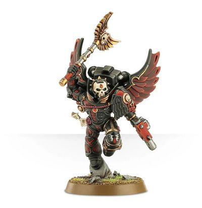

# 0405 死亡连队教士 Death Company Chaplain

精校状态：中文行文已逐段精校，部分术语仍为暂定

分类：通用概念 / 帝国 Imperium / 中央政务部 Adeptus Terra / 阿斯塔特修会 Adeptus Astartes

原文来源：https://www.bilibili.com/opus/1021347887328526343

原作者：帝国神选罐头

原文时间：2025年01月12日 07:51

[返回分类目录](目录.md) · [全书目录](../../目录.md)

原篇名：死亡连牧师 Death Company Chaplain

<!-- A0405-B0001 -->
**英文原文**

Death Company Chaplains are specialized Space Marine Chaplains of the Blood Angels which lead the Death Company.

<!-- /A0405-B0001 -->

<!-- A0405-B0002 -->

原译文

死亡连牧师是圣血天使的专业领导死亡连的星际战士牧师。

**校订译文**

死亡连队教士是圣血天使中专门率领死亡连队的星际战士教士。

<!-- /A0405-B0002 -->

<!-- A0405-B0003 -->
## Overview 概述

<!-- /A0405-B0003 -->

<!-- A0405-B0004 -->
**英文原文**

Soaring into battle on a crimson winged Jump Pack, the Death Company Chaplain leads his fallen brothers in their final battle. As he smashes the enemy from their feet with devastating swings of his crozius arcanum, the Death Company Chaplain booms a constant litany of hatred and vengeance, exhorting his brothers to give meaning to their sacrifice before their tragic and inevitable end.

<!-- /A0405-B0004 -->

<!-- A0405-B0005 -->

原译文

死亡连牧师驾驭着一个深红色的带翼跳跃背包飞向战场，带领他堕入黑怒的兄弟们进行最后的战斗。当他用他的牧师权杖毁灭性地向着敌人挥舞时，死亡连牧师不断地宣扬仇恨和复仇，规劝他的兄弟们在悲剧和不可避免的结局之前为他们的牺牲赋予意义。

**校订译文**

死亡连队教士背负深红色翼形跳跃背包飞入战场，带领陷入黑怒的兄弟迎接最后一战。他挥动教士权杖，以毁灭性的重击将敌人打翻在地，同时不断高声吟诵仇恨与复仇的祷文，激励兄弟们在悲惨而不可避免的终局到来前，为牺牲赋予意义。

<!-- /A0405-B0005 -->

<!-- A0405-B0006 图片 -->

<!-- A0405-B0007 -->

原译文

Death Company Chaplain 死亡连牧师

**校订译文**

Death Company Chaplain 死亡连队教士

<!-- /A0405-B0007 -->

<!-- A0405-B0008 -->
**英文原文**

Simple zealotry is not enough to recommend a Blood Angels Chaplain for elevation to the rank of Death Company Chaplain. Rage and hatred are useful tools, but they are nothing without control. The role of the Death Company Chaplain is much more complex, and more sacred, than simply inciting his brothers to new heights of wrath in battle. This deeply spiritual warrior acts as the light of the Angel himself, a guiding illumination that those brothers lost to the Black Rage can follow into glory and death. In battle, he maintains himself as the beacon of sanity.

<!-- /A0405-B0008 -->

<!-- A0405-B0009 -->

原译文

单纯的狂热不足以推荐一位圣血天使牧师晋升为死亡连牧师。愤怒和仇恨是有用的工具，但如果不加以控制，它们就什么都不是。死亡连牧师的角色要复杂得多，也更神圣，而不仅仅是在战斗中煽动他的兄弟们达到新的愤怒高度。这位深具灵性的战士充当着天使自己的光，是那些在黑怒中迷失的兄弟们可以追随的荣耀和死亡的指引之光。在战斗中，他坚持自己是理智的灯塔。

**校订译文**

仅有狂热，还不足以使一名圣血天使教士晋升为死亡连队教士。愤怒与仇恨虽然是有用的工具，却必须受到控制。这份职责远比煽动兄弟们在战场上更加暴怒复杂，也更加神圣。这位信念深厚的战士代表天使本人的光辉，引领迷失于黑怒的兄弟走向荣耀与死亡。在战斗中，他必须始终保持清醒，成为理智的灯塔。

<!-- /A0405-B0009 -->

<!-- A0405-B0010 -->
## Known Death Company Chaplains 著名死亡连队教士

原题：Known Death Company Chaplains 著名死亡连牧师

<!-- /A0405-B0010 -->

<!-- A0405-B0011 -->

原译文

Daenor 代诺尔

**校订译文**

Daenor 代诺尔

<!-- /A0405-B0011 -->

本篇核心术语与暂定项

以下列出本篇出现的英文原形及核心术语表用词。同形词可能指不同对象，具体词义以本篇正文和校注为准；单复数、别名和仅见于图注的名称可能尚未列入。完整候选见[术语表](../../术语表/双语术语候选.csv)。

| 英文 | 采用中文 | 状态 |
| --- | --- | --- |
| Blood Angels | 圣血天使 | 官方已核对 |
| Crozius Arcanum | 教士权杖 | 暂定·官方待核 |
| Death Company Chaplain | 死亡连队教士 | 暂定·官方待核 |
| Chaplain | 教士 | 官方已核对 |
| Space Marine | 星际战士 | 暂定·官方待核 |
| The Angel | 天使 | 暂定·官方待核 |
| Vengeance | 复仇号 | 暂定·官方待核 |
| Chaplains | 教士 | 暂定·官方待核 |
| The Blood | 鲜血 | 暂定·官方待核 |
| Jump Pack | 跳跃背包 | 暂定·官方待核 |
| Winged Jump Pack | 飞翼跳跃背包 | 暂定·官方待核 |

