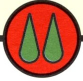

# 0409 圣血天使第八连队 8th Company of the Blood Angels

精校状态：中文行文已逐段精校，部分术语仍为暂定

分类：通用概念 / 帝国 Imperium / 中央政务部 Adeptus Terra / 阿斯塔特修会 Adeptus Astartes

原文来源：https://www.bilibili.com/opus/1219208071374438401

原作者：帝国神选罐头

原文时间：2026年06月29日 12:30

[返回分类目录](目录.md) · [全书目录](../../目录.md)

<!-- A0409-B0001 -->
**英文原文**

The 8th Company of the Blood Angels, known as the 'Bloodblades', is a Reserve Company of the Chapter.

<!-- /A0409-B0001 -->

<!-- A0409-B0002 -->

原译文

圣血天使第八连队，被称为“血刃”，是战团的预备连队。

**校订译文**

圣血天使第八连队，被称为“血刃”，是战团的预备连队。

<!-- /A0409-B0002 -->

<!-- A0409-B0003 图片 -->

<!-- A0409-B0004 -->

原译文

Insignia of the 8th Company 第八连队的徽章

**校订译文**

Insignia of the 8th Company 第八连队的徽章

<!-- /A0409-B0004 -->

<!-- A0409-B0005 -->
## Known Battles 已知战斗

<!-- /A0409-B0005 -->

<!-- A0409-B0006 -->

原译文

811.M37 - 7th Black Crusade 第七次黑色远征

**校订译文**

811.M37 - 7th Black Crusade 第七次黑色远征

<!-- /A0409-B0006 -->

<!-- A0409-B0007 -->

原译文

741.M40 - Battle on Ereus V against Oretti 埃里乌斯五号之战对抗奥雷蒂

**校订译文**

741.M40 - Battle on Ereus V against Oretti 埃里乌斯五号之战——对抗奥雷蒂

<!-- /A0409-B0007 -->

<!-- A0409-B0008 -->

原译文

Late M40 - Kallius Insurrection 卡利乌斯叛乱

**校订译文**

Late M40 - Kallius Insurrection 卡利乌斯叛乱

<!-- /A0409-B0008 -->

<!-- A0409-B0009 -->

原译文

???.M41 - Assault on Zoran 佐兰突击

**校订译文**

???.M41 - Assault on Zoran 佐兰突击

<!-- /A0409-B0009 -->

<!-- A0409-B0010 -->

原译文

994.M41 - Blackfang Crusade 黑牙远征

**校订译文**

994.M41 - Blackfang Crusade 黑牙远征

<!-- /A0409-B0010 -->

<!-- A0409-B0011 -->

原译文

c. 999.M41 - Devastation of Baal 巴尔的毁灭

**校订译文**

c. 999.M41 - Devastation of Baal 巴尔之毁

<!-- /A0409-B0011 -->

<!-- A0409-B0012 -->

原译文

Late M42 - Angel's Halo 天使光环

**校订译文**

Late M42 - Angel's Halo 天使光环

**校注：** 英文为 Late M42，即第42个千年后期；该纪年与通常战役时间可能不合，保留源文，不擅改为早期。

<!-- /A0409-B0012 -->

<!-- A0409-B0013 -->

原译文

Cleaninsing of Baal Secundus 巴尔二号清洗

**校订译文**

Cleaninsing of Baal Secundus 巴尔二号清洗

**校注：** 英文 Cleaninsing 疑为 Cleansing 拼写错误；英文原文不改，中文按净化／清洗理解。

<!-- /A0409-B0013 -->

<!-- A0409-B0014 -->
## Known Members 已知成员

<!-- /A0409-B0014 -->

<!-- A0409-B0015 -->
**英文原文**

Matarno - Current Captain

<!-- /A0409-B0015 -->

<!-- A0409-B0016 -->

原译文

马塔诺 - 现任连长

**校订译文**

马塔诺 - 现任连长

<!-- /A0409-B0016 -->

<!-- A0409-B0017 -->
**英文原文**

Zedrenael - Former Captain

<!-- /A0409-B0017 -->

<!-- A0409-B0018 -->

原译文

塞德纳尔 - 前连长

**校订译文**

塞德纳尔 - 前连长

<!-- /A0409-B0018 -->

<!-- A0409-B0019 -->
**英文原文**

Milonus - Former Captain circa 741.M40

<!-- /A0409-B0019 -->

<!-- A0409-B0020 -->

原译文

米洛努斯 - 大约741.M40的前连长

**校订译文**

米洛努斯——约741.M40在任的前连长。

<!-- /A0409-B0020 -->

<!-- A0409-B0021 -->
**英文原文**

Carleon - Sergeant

<!-- /A0409-B0021 -->

<!-- A0409-B0022 -->

原译文

卡莱昂 - 军士

**校订译文**

卡莱昂 - 军士

<!-- /A0409-B0022 -->

<!-- A0409-B0023 -->
**英文原文**

Basileus - Assault Marine Sergeant

<!-- /A0409-B0023 -->

<!-- A0409-B0024 -->

原译文

巴西琉斯 - 突击战士军士

**校订译文**

巴西琉斯 - 突击战士军士

<!-- /A0409-B0024 -->

<!-- A0409-B0025 -->
**英文原文**

Arvin - Assault Marine

<!-- /A0409-B0025 -->

<!-- A0409-B0026 -->

原译文

阿尔文 - 突击战士

**校订译文**

阿尔文 - 突击战士

<!-- /A0409-B0026 -->

<!-- A0409-B0027 -->
**英文原文**

Giacomus - Assault Marine

<!-- /A0409-B0027 -->

<!-- A0409-B0028 -->

原译文

贾科默斯 - 突击战士

**校订译文**

贾科默斯 - 突击战士

<!-- /A0409-B0028 -->

<!-- A0409-B0029 -->
**英文原文**

Ristan - Assault Marine

<!-- /A0409-B0029 -->

<!-- A0409-B0030 -->

原译文

里斯坦 - 突击战士

**校订译文**

里斯坦 - 突击战士

<!-- /A0409-B0030 -->

本篇核心术语与暂定项

以下列出本篇出现的英文原形及核心术语表用词。同形词可能指不同对象，具体词义以本篇正文和校注为准；单复数、别名和仅见于图注的名称可能尚未列入。完整候选见[术语表](../../术语表/双语术语候选.csv)。

| 英文 | 采用中文 | 状态 |
| --- | --- | --- |
| Blood Angels | 圣血天使 | 官方已核对 |
| Chapter | 战团 | 暂定·官方待核 |
| Captain | 连长 | 暂定·官方待核 |
| Sergeant | 军士 | 暂定·官方待核 |
| Matarno | 马塔诺 | 暂定·官方待核 |
| Zedrenael | 塞德纳尔 | 暂定·官方待核 |
| Milonus | 米洛努斯 | 暂定·官方待核 |
| Carleon | 卡莱昂 | 暂定·官方待核 |
| Basileus | 巴西琉斯 | 暂定·官方待核 |
| Arvin | 阿尔文 | 暂定·官方待核 |
| Giacomus | 贾科默斯 | 暂定·官方待核 |
| Ristan | 里斯坦 | 暂定·官方待核 |
| Assault Marine | 突击战士 | 暂定·官方待核 |
| The Blood | 鲜血 | 暂定·官方待核 |

