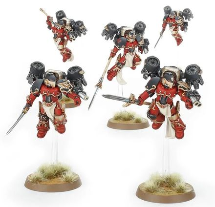

# 0410 破晓者 Dawnbreaker

精校状态：中文行文已逐段精校，部分术语仍为暂定

分类：通用概念 / 帝国 Imperium / 中央政务部 Adeptus Terra / 阿斯塔特修会 Adeptus Astartes

原文来源：https://www.bilibili.com/opus/1021347603860684801

原作者：帝国神选罐头

原文时间：2025年01月12日 07:50

[返回分类目录](目录.md) · [全书目录](../../目录.md)

<!-- A0410-B0001 -->
**英文原文**

The Dawnbreakers were elite Assault Marines used by the Blood Angels during the Great Crusade and Horus Heresy.

<!-- /A0410-B0001 -->

<!-- A0410-B0002 -->

原译文

破晓者是圣血天使在大远征和荷鲁斯叛乱期间使用的精英突击星际战士。

**校订译文**

破晓者是圣血天使在大远征与荷鲁斯之乱时期的精锐突击星际战士。

<!-- /A0410-B0002 -->

<!-- A0410-B0003 图片 -->

<!-- A0410-B0004 -->

原译文

Dawnbreaker Cohort 破晓者大队

**校订译文**

Dawnbreaker Cohort 破晓者大队

<!-- /A0410-B0004 -->

<!-- A0410-B0005 -->
**英文原文**

Even within a Legion known for its jump infantry and assault tactics, the Dawnbreaker Cohorts stood apart. These warriors were chosen from amongst the most experienced and daring of the Legion's assault squads, trained and equipped to act as the tip of the spear of the Blood Angels. The Dawnbreakers had only one purpose in battle, to sunder the enemy lines and tear the heart from its formation. These Space Marines emphasized not only martial excellence, but also the symbolic nature of their role, bringing light and justice to even the most hellish warzones.

<!-- /A0410-B0005 -->

<!-- A0410-B0006 -->

原译文

即使在一个以跳跃步兵和突击战术而闻名的军团中，破晓者大队也与众不同。这些战士是从军团突击队中经验最丰富、最勇敢的人中挑选出来的，经过训练和装备，可以充当圣血天使的矛尖。破晓者在战斗中只有一个目的，那就是撕裂敌人的防线，撕裂敌人的心脏。这些星际战士不仅强调卓越的军事能力，还强调他们角色的象征性，为最地狱般的战区带来光明和正义。

**校订译文**

即便在以跳跃步兵和突击战术著称的圣血天使军团中，破晓者大队也独树一帜。他们从军团突击小队最富经验、最为勇猛的战士中选出，接受专门训练与装备，充当军团的进攻矛尖。他们在战场上的目标只有一个：撕开敌人防线，摧毁其阵形的核心。破晓者不仅追求高超武艺，也重视自身职责的象征意义——将光明与正义带入最地狱般的战区。

**校注：** tear the heart from its formation 指摧毁敌军阵形核心，不是字面的撕裂敌人心脏。

<!-- /A0410-B0006 -->

<!-- A0410-B0007 -->
**英文原文**

Dawnbreakers were armed with Falling Star Pattern Power Spears, Equinox Power Blades, and Grenade Dischargers.

<!-- /A0410-B0007 -->

<!-- A0410-B0008 -->

原译文

破晓者配备了流星型动力长矛、昼夜动力刃和掷弹筒。

**校订译文**

破晓者装备流星型动力长矛、昼夜平分动力刃与榴弹发射器。

**校注：** Equinox 指昼夜平分时节，暂在原译昼夜基础上补足词义；Grenade Dischargers 为榴弹发射装置。

<!-- /A0410-B0008 -->

<!-- A0410-B0009 -->
## Known Dawnbreakers 著名破晓者

<!-- /A0410-B0009 -->

<!-- A0410-B0010 -->

原译文

Magon 马贡

**校订译文**

Magon 马贡

<!-- /A0410-B0010 -->

本篇核心术语与暂定项

以下列出本篇出现的英文原形及核心术语表用词。同形词可能指不同对象，具体词义以本篇正文和校注为准；单复数、别名和仅见于图注的名称可能尚未列入。完整候选见[术语表](../../术语表/双语术语候选.csv)。

| 英文 | 采用中文 | 状态 |
| --- | --- | --- |
| Space Marines | 星际战士 | 官方已核对 |
| Blood Angels | 圣血天使 | 官方已核对 |
| Horus Heresy | 荷鲁斯之乱 | 官方已核对 |
| Great Crusade | 大远征 | 暂定·官方待核 |
| Horus | 荷鲁斯 | 暂定·官方待核 |
| Assault Squads | 突击小队 | 暂定·官方待核 |
| Falling Star | 流星 | 暂定·官方待核 |
| Equinox Power Blades | 昼夜平分动力刃 | 暂定·官方待核 |
| Falling Star Pattern Power Spears | 流星型动力长矛 | 暂定·官方待核 |
| Dawnbreakers | 破晓者 | 暂定·官方待核 |
| The Blood | 鲜血 | 暂定·官方待核 |
| Grenade | 手榴弹 | 暂定·官方待核 |

