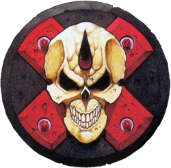
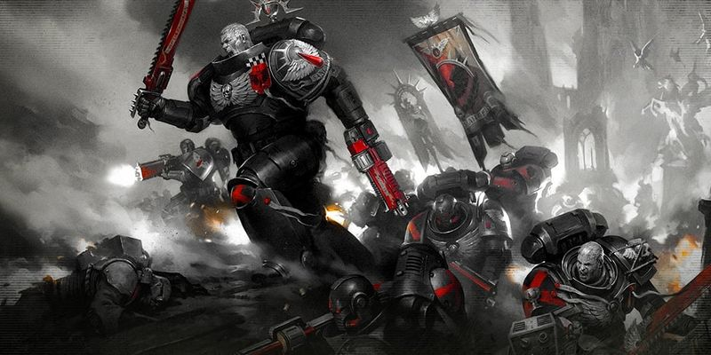
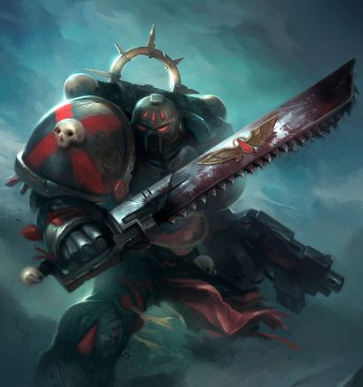
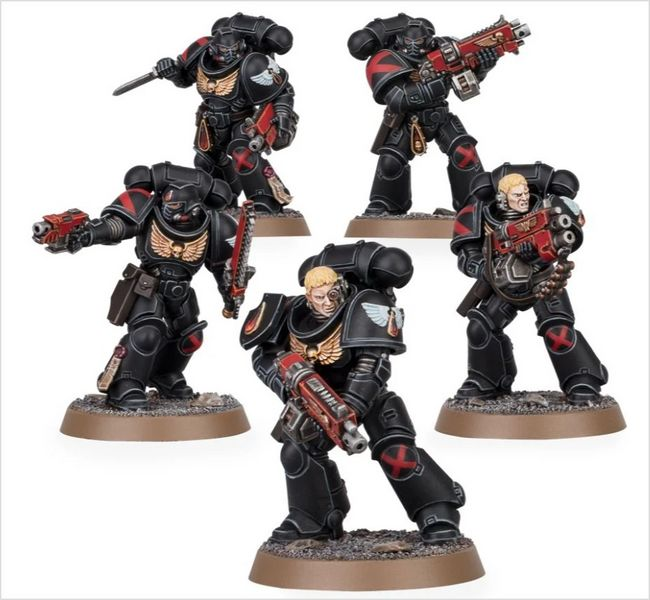
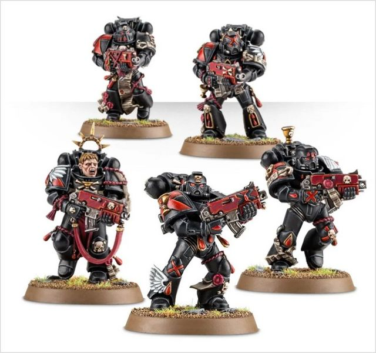
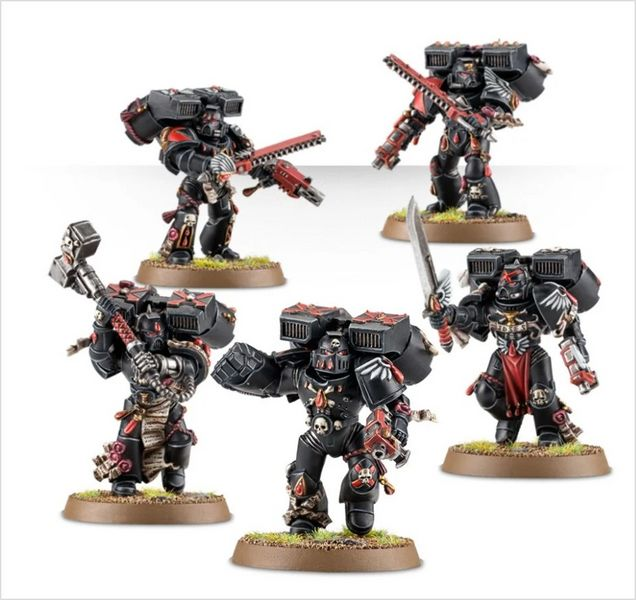

# 0411 死亡连队 Death Company

精校状态：中文行文已逐段精校，部分术语仍为暂定

分类：通用概念 / 帝国 Imperium / 中央政务部 Adeptus Terra / 阿斯塔特修会 Adeptus Astartes

原文来源：https://www.bilibili.com/opus/1021347788570492932

原作者：帝国神选罐头

原文时间：2025年01月12日 07:51

[返回分类目录](目录.md) · [全书目录](../../目录.md)

原篇名：死亡连 Death Company

<!-- A0411-B0001 -->
**英文原文**

The Death Company is a special unit unique to the Blood Angels and their Successor Chapters, consisting of former Battle-Brothers who have succumbed to the Black Rage.

<!-- /A0411-B0001 -->

<!-- A0411-B0002 -->

原译文

死亡连是圣血天使及其子战团独有的特殊单位，由屈服于黑怒的前战斗兄弟组成。

**校订译文**

死亡连队是圣血天使及其子战团独有的特殊部队，由陷入黑怒的战斗兄弟组成。

<!-- /A0411-B0002 -->

<!-- A0411-B0003 图片 -->

<!-- A0411-B0004 -->

原译文

The Death Company's sigil 死亡连标志

**校订译文**

The Death Company's sigil 死亡连队标志

<!-- /A0411-B0004 -->

<!-- A0411-B0005 -->
## Overview 概述

<!-- /A0411-B0005 -->

<!-- A0411-B0006 -->
**英文原文**

On the eve of battle, the Blood Angels pray and remember the sacrifice of their Primarch Sanguinius while the Chaplains bless and study each battle-brother for signs of the Black Rage. Those who collapse into the Chaplains' arms during the chanting of the moripatris are taken away to form the Death Company. Their Power Armour is repainted black with a blood red saltire symbolizing the wounds of Sanguinius and hung with devotional scrolls and records of honours earned before the madness took them. From this point on, these battle-brothers are considered dead men walking. It is known that before the battle members of the Death Company gain access to the Chapter armoury so they may fight their last fighting with a weapon of their choice. Captains who fall to the Black Rage, are granted the use of relic weapons and violently slaughter their foes as they seek death in battle.

<!-- /A0411-B0006 -->

<!-- A0411-B0007 -->

原译文

在战斗前夕，圣血天使们祈祷并记住他们的原体圣吉列斯的牺牲，而牧师们则祝福并研究每个战斗兄弟的黑怒迹象。那些在末日弥撒祷告期间瘫倒在牧师怀里的人被带走，组成死亡连。他们的动力盔甲被重新漆成黑色，上面有血红色的X形十字，象征着圣吉列斯的伤口，上面挂着虔诚的卷轴和疯狂夺走他们之前获得的荣誉记录。从这一点上讲，这些战斗兄弟被认为是行走的死人。众所周知，在战斗之前，死亡连的成员可以进入战团军械库，这样他们就可以用自己选择的武器进行最后的战斗。陷入黑怒的连长被授予使用圣物武器的权利，并在战斗中寻求死亡时暴力屠杀敌人。

**校订译文**

战斗前夕，圣血天使祷告并追思原体圣吉列斯的牺牲；教士逐一赐福，同时观察每名战士是否出现黑怒征兆。在吟唱莫里帕特里斯——毁灭弥撒——时倒入教士怀中的人，会被带走，编入死亡连队。他们的动力甲重新涂黑，绘上象征圣吉列斯伤口的血红色斜十字，并悬挂祈祷卷轴和陷入疯狂前赢得的荣誉记录。从此，这些战斗兄弟便被视为行走的亡者。战前，他们获准从战团军械库中挑选武器，完成最后一战。陷入黑怒的连长还会获授圣物武器，在猛烈屠敌的同时寻求战死。

<!-- /A0411-B0007 -->

<!-- A0411-B0008 图片 -->

<!-- A0411-B0009 -->

原译文

Death Company warriors 死亡连战士

**校订译文**

Death Company warriors 死亡连队战士

<!-- /A0411-B0009 -->

<!-- A0411-B0010 -->
**英文原文**

Consumed by the Black Rage, the Death Company fights without fear, heedless of the quality of their opposition or the wounds they suffer. Under the watchful eye of their Death Company Chaplains,or particularly strong-willed scions of Sanguinius,the Death Company fights terrible odds to claim one last honour for the Chapter. They are known to fight even more ferociously under the command of the Blood Angels' High Chaplain Astorath and the Chaplain Lemartes. While the High Chaplain fights besides them to ensure they meet a deserved glorious end, the Chaplain provides the Death Company with inspirational leadership and direction. Many of the Blood Angels' finest victories have come after the Death Company devastated the enemy forces. These include the battles they fought on Truatas, Antax, Hollonan, Armageddon,and Venerax. The Death Company's fearsome reputation has even spread to worlds that have not seen the Blood Angels in battle. However, it is not unheard of for entire strike forces to fall into the Black Rage. These terrible moments become marks of shame in the Blood Angels and Sanguinary Brotherhood's history, with names such Nycoth, the Scadden Atrocity, the War of Broken Wings, the Stenarr Massacre and the Battle of Lenikhe Reach bringing about mournful silence.

<!-- /A0411-B0010 -->

<!-- A0411-B0011 -->

原译文

被黑怒吞噬，死亡连无所畏惧地战斗，无视他们的对抗或他们所受的伤害。在他们的死亡连牧师或意志特别坚强的圣吉列斯后裔的监视下，死亡连奋力拼搏，为战团争取最后一个荣誉。众所周知，在圣血天使的至高牧师阿斯托拉斯和牧师雷玛斯特的指挥下，他们的战斗更加激烈。当至高牧师与他们并肩作战，确保他们获得应得的光荣结局时，牧师为死亡连提供了鼓舞人心的领导和指导。许多圣血天使最辉煌的胜利都是在死亡连摧毁敌军之后取得的。这些包括他们在特鲁塔斯、安塔克斯、霍洛南、阿米吉多顿和维尼拉克斯进行的战斗。死亡连可怕的名声甚至蔓延到了没有见过圣血天使战斗的世界。然而，整个打击部队陷入黑怒并非闻所未闻。这些可怕的时刻成为圣血天使和圣血兄弟会历史上的耻辱标志，尼科斯、斯卡登暴行、断翼战争、斯滕纳尔大屠杀和莱尼赫河段战役等名字带来了悲伤的沉默。

**校订译文**

死亡连队被黑怒吞没，作战毫无畏惧，不顾敌人有多强，也不顾自身的伤势。在死亡连队教士，或意志格外坚定的圣吉列斯后裔引导下，他们迎战远胜己方的敌军，为战团争取最后的荣誉。至高教士阿斯托拉斯与教士雷马特斯统领他们时，攻势尤为凶猛：前者并肩奋战，确保他们迎来应得的光荣终局；后者则给予鼓舞与指引。圣血天使在特鲁塔斯、安塔克斯、霍洛南、阿玛吉多顿和维尼拉克斯等地的辉煌胜利，都曾仰赖死亡连队摧毁敌军。其恐怖声名甚至传到从未见过圣血天使作战的世界。然而，整支打击部队同时陷入黑怒也并非没有先例。这些灾难成为圣血天使与圣血兄弟会历史上的耻辱：提起尼科斯、斯卡登暴行、断翼战争、斯滕纳尔大屠杀或莱尼赫宙域之战，众人往往只报以悲痛的沉默。

<!-- /A0411-B0011 -->

<!-- A0411-B0012 -->
**英文原文**

Those few members of the Death Company who survive an engagement usually perish shortly after, either from their wounds or by the hand of the Redeemer of the Lost. The members of the Blood Angels' Death Company that escape those fates are sealed within the Tower of Amareo on Baal, where their madden screams ring out of. Since the Red Thirst inevitably follows the Black Rage, the Blood Angels consider death better than turning into a mindless flesh-hungry beast. However there are some who undergo the Lestrallio Procedure instead and are encouraged to describe the visions the Black Rage is afflicting them with. Named after the Chaplain Lestrallio, who pioneered the process and later underwent it himself, the Procedure sees the Death Company members shackled in adamantine, as their rantings are carefully recorded, analyzed and compared with others. The Blood Angels have learned invaluable data of how the Black Rage afflicts them through the use of the Procedure, but it always ends in death for the Death Company member. They inevitably die after their bodies begin suffering body-shattering spasms.

<!-- /A0411-B0012 -->

<!-- A0411-B0013 -->

原译文

在交战后幸存下来的死亡连的少数成员通常会在不久后死亡，要么是因为受伤，要么是被迷失救赎者亲手杀死。逃离这些命运的圣血天使死亡连的成员被密封在巴尔的悲怆之塔内，在那里他们疯狂的尖叫声响起。由于血渴不可避免地伴随着黑怒，圣血天使认为死亡比变成一只无脑的食肉野兽要好。然而，也有一些人接受了雷斯塔里欧的手术，并被鼓励描述黑怒正在折磨他们的幻象。该程序以开创这一过程并后来亲自经历这一过程的牧师雷斯塔里欧命名，死亡连成员被戴上精金镣铐，他们的咆哮被仔细记录、分析并与其他人进行比较。圣血天使们通过使用该程序了解了黑怒如何折磨他们的宝贵数据，但死亡连成员总是以死亡告终。他们不可避免地会在身体开始出现剧烈痉挛后死亡。

**校订译文**

少数在战斗中幸存的死亡连队成员通常不久便会死去，或死于伤势，或由“迷失者的救赎者”亲自终结生命。避过这些结局的圣血天使会被关入巴尔的悲怆之塔，任疯狂的嘶叫回荡塔中。黑怒之后不可避免地伴随血渴，因此战团认为，死亡好过变成只知饥求血肉的野兽。不过，也有人会接受“雷斯塔里欧程序”，被要求描述黑怒带来的异象。这一程序以开创者雷斯塔里欧教士命名，他后来也亲自成为接受者。患者被精金镣铐束缚，其狂言会被仔细记录、分析，并与其他人的描述比对。战团由此获得了黑怒如何作用于战士的宝贵资料，但接受者最后无一幸免，都会在足以撕裂身体的剧烈痉挛中死去。

**校注：** Procedure 所述为束缚、记录与分析异象的程序，并无外科手术内容，删去原译手术。

<!-- /A0411-B0013 -->

<!-- A0411-B0014 图片 -->

<!-- A0411-B0015 -->

原译文

Warrior of the Death Company 死亡连战士

**校订译文**

Warrior of the Death Company 死亡连队战士

<!-- /A0411-B0015 -->

<!-- A0411-B0016 -->
**英文原文**

Initially, it was thought that the new Primaris Space Marines were more resistant to the Black Rage. However this is not the case, and multiple Primaris Marines have now succumb. They too have been put into the Death Company, organized into Intercessor Squads.

<!-- /A0411-B0016 -->

<!-- A0411-B0017 -->

原译文

最初，人们认为新的原铸星际战士对黑怒的抵抗力更强。然而，事实并非如此，多个原铸星际战士现在已经屈服。他们也被编入死亡连，组织成仲裁者小队。

**校订译文**

起初，人们认为新出现的原铸星际战士更能抵抗黑怒；然而，本篇记载认为事实并非如此，已有多名原铸战士陷入黑怒。他们同样被编入死亡连队，组成仲裁者小队。

**校注：** 本段否定原铸战士更能抵抗黑怒；403-B0177则说抵抗力更强但并非免疫，两处源文判断不同，分别保留。

<!-- /A0411-B0017 -->

<!-- A0411-B0018 图片 -->

<!-- A0411-B0019 -->

原译文

Death Company Intercessors 死亡连仲裁者

**校订译文**

Death Company Intercessors 死亡连队仲裁者

<!-- /A0411-B0019 -->

<!-- A0411-B0020 -->
## Origins 起源

<!-- /A0411-B0020 -->

<!-- A0411-B0021 -->
**英文原文**

The advent of the Black Rage is associated with the end of the Horus Heresy, caused by the psychic shock felt by every Blood Angel when Sanguinius died at the hands of Horus. Prior to then, the Red Thirst was a rare but dreaded phenomenon, known only to Sanguinius and some members of his inner circle, including First Captain Raldoron, Sanguinary Guard Commander Azkaellon, High Warden Dahka Berus, and the Legion's Master Apothecary on Baal. On the rare occasions when a Battle Brother was lost to the Thirst, his armour's company markings were blotted out by black paint, and his gene-seed was removed for analysis, rather than being returned to the Legion's stores.

<!-- /A0411-B0021 -->

<!-- A0411-B0022 -->

原译文

黑怒的出现与荷鲁斯叛乱的结束有关，黑怒是由每一位圣血天使在圣吉列斯死于荷鲁斯之手时所感受到的精神冲击引起的。在此之前，血渴是一种罕见但可怕的现象，只有圣吉列斯和他的内环的一些成员知道，包括第一连长拉多隆、圣血卫队指挥官阿兹卡隆、至高守望者达卡·贝鲁斯和巴尔的军团药剂大师。在极少数情况下，当一名战斗兄弟因血渴而丧生时，他的装甲的连队标记会被黑色油漆抹去，他的基因种子会被移除进行分析，而不是被送回军团的仓库。

**校订译文**

黑怒的出现与荷鲁斯之乱的终结相联系：圣吉列斯死于荷鲁斯之手时，每名圣血天使都遭到灵能冲击。在此之前，血渴虽然罕见，却令人畏惧，只有圣吉列斯及少数心腹知情，包括第一连长拉多隆、圣血守卫指挥官阿兹卡隆、至高看守者达卡·贝鲁斯，以及驻巴尔的军团药剂大师。偶有战斗兄弟被血渴吞噬时，其护甲上的连队标记便被黑漆遮去，基因种子也会取出用于分析，而不归还军团库存。

<!-- /A0411-B0022 -->

<!-- A0411-B0023 图片 -->

<!-- A0411-B0024 -->

原译文

Death Company 死亡连

**校订译文**

Death Company 死亡连队

<!-- /A0411-B0024 -->

<!-- A0411-B0025 -->
**英文原文**

After Brother Alatros succumbed to the Thirst on Melchior, forcing Sanguinius to execute him, Raldoron applied the paint himself, swore the Apothecary, Meros, who had removed his geneseed, to total secrecy, and remarked to the corpse,"you are in the company of death. I hope you will find peace there."

<!-- /A0411-B0025 -->

<!-- A0411-B0026 -->

原译文

阿拉托斯兄弟在梅尔基奥尔死于血渴，迫使圣吉列斯处决他后，拉多隆自己涂上了油漆，让已经摘除了他的基因种子的药剂师梅洛斯发誓完全保密，并对尸体说：“你在死亡的陪伴下。我希望你能在那里找到安宁。”

**校订译文**

阿拉托斯修士在梅尔基奥尔陷入血渴，迫使圣吉列斯亲自处决他。事后，拉多隆亲手涂去其护甲标记，要求回收基因种子的药剂师梅洛斯宣誓严守秘密，并对遗体说道：“如今你已与死亡为伍。愿你在那里寻得安宁。”

**校注：** succumbed to the Thirst 是屈服于血渴，原译死于血渴导致与随后处决矛盾。company of death 与死亡连队名称呼应；正文保留与死亡为伍的原意。

<!-- /A0411-B0026 -->

<!-- A0411-B0027 图片 -->

<!-- A0411-B0028 -->

原译文

Death Company with Jump Packs 跳跃背包死亡连

**校订译文**

Death Company with Jump Packs 跳跃背包死亡连队

<!-- /A0411-B0028 -->

<!-- A0411-B0029 -->
## Variants 变体

<!-- /A0411-B0029 -->

<!-- A0411-B0030 -->
**英文原文**

The Angels Encarmine colour their Death Company in alabaster white with black backpacks. While it has been stated that the Flesh Tearers' Death Company follow the same colour schemes as the Blood Angels', their Death Company have been shown coloured pale grey with red helmets, backpacks and pauldrons. The Lamentors, who for a long time did not suffer from the Black Rage, have been shown painting their Death Company in quartered black and yellow colours.

<!-- /A0411-B0030 -->

<!-- A0411-B0031 -->

原译文

赤红天使将他们的死亡连涂成雪花石膏白色，并配有黑色背包。虽然有人说撕肉者死亡连遵循与圣血天使相同的配色方案，但他们的死亡连被展示为淡灰色，戴着红色头盔、背包和肩甲。长期以来没有遭受黑怒的恸哭者，被显示用四分之一的黑色和黄色绘制他们的死亡连。

**校订译文**

赤红天使的死亡连队采用雪花石膏白色护甲，配黑色背包。部分记载称撕肉者死亡连队与圣血天使配色相同，但也有图示将其画为淡灰色护甲，配红色头盔、背包与肩甲。恸哭者曾长期不受黑怒影响，其死亡连队则有采用黑黄四分格配色的图示。

**校注：** quartered 是纹章的四分格配色，不是四分之一黑色和黄色。

<!-- /A0411-B0031 -->

<!-- A0411-B0032 -->
**英文原文**

The Angels Numinous are known to have little regard for their Battle Brothers afflicted with the Black Rage, as the Chapter believes that only the weak fall into its embrace. As a result of this, the Angels Numinous refuse to honour their Death Companies as the Blood Angels do, and instead consider them to be nothing but a shameful embarrassment to their pure and noble Chapter. When the Angels Numinous go to battle, the Death Companies are hurled into the fray with no concern for their lives and are simply used as a blunt instrument to break enemy front lines.

<!-- /A0411-B0032 -->

<!-- A0411-B0033 -->

原译文

众所周知，神圣天使很少关心他们饱受黑怒折磨的战斗兄弟，因为战团认为只有弱者才会落入它的怀抱。因此，神圣天使拒绝像圣血天使那样尊重他们的死亡连，相反，他们认为这些连队只会让他们纯洁而高贵的战团蒙羞。当神圣天使投入战斗时，死亡连被投入战斗，毫不关心他们的生命，只是被用作打破敌人前线的钝器。

**校订译文**

神圣天使对陷入黑怒的战斗兄弟少有怜惜，认为只有弱者才会被黑怒吞噬。他们不像圣血天使那样尊崇死亡连队，而是将其视为令纯洁高贵的战团蒙羞的存在。战时，他们毫不顾惜死亡连队成员的性命，把他们直接投入混战，仅当作砸穿敌军前线的工具。

<!-- /A0411-B0033 -->

<!-- A0411-B0034 -->
**英文原文**

Within the Angels Sanguine, the brothers who enter the Black Rage are strapped to the Tablet of Lestrallio, in the Chapter's Fortress Monastery. Those who regain their senses are presented with the Shroud of Lemartes, as a symbol of their mastery of the Black Rage. Those who fall within its grasp are imprisoned within the Tower of the Lost, which is located in the Angels Sanguine's Fortress Monastery.

<!-- /A0411-B0034 -->

<!-- A0411-B0035 -->

原译文

在血红天使中，进入黑怒的兄弟们被绑在战团的堡垒修道院的雷斯塔里欧之碑上。那些恢复理智的人会收到雷玛斯特护罩，作为他们掌握黑怒的象征。那些落入其控制范围内的人被囚禁在迷失之塔内，该塔位于血红天使的要塞修道院。

**校订译文**

鲜血天使会把陷入黑怒的兄弟绑在要塞修道院中的雷斯塔里欧之碑上。恢复理智者获授“雷马特斯圣骸布”，象征其驾驭黑怒的成就；仍被黑怒控制的人，则被关入修道院内的迷失之塔。

**校注：** Angels Sanguine 统一鲜血天使；Shroud 为布制圣物，原译护罩不合物件类型。能恢复理智的此处记载与通常黑怒不可治的表述不同，保留源文。

<!-- /A0411-B0035 -->

<!-- A0411-B0036 -->
## Notable members of the Death Company 著名死亡连队成员

原题：Notable members of the Death Company 著名死亡连成员

<!-- /A0411-B0036 -->

<!-- A0411-B0037 -->
**英文原文**

Daenor — Death Company Chaplain

<!-- /A0411-B0037 -->

<!-- A0411-B0038 -->

原译文

代诺尔 — 死亡连牧师

**校订译文**

代诺尔——死亡连队教士。

<!-- /A0411-B0038 -->

<!-- A0411-B0039 -->
**英文原文**

Galleanus — Killed during the battle on Amethal with Chaos Space Marines of the Crimson Slaughter.

<!-- /A0411-B0039 -->

<!-- A0411-B0040 -->

原译文

加勒阿努斯 — 在与猩红屠杀者的混沌星际战士在阿梅瑟的战斗中丧生。

**校订译文**

加勒阿努斯——在阿梅瑟与猩红屠杀者的混沌星际战士交战时阵亡。

<!-- /A0411-B0040 -->

<!-- A0411-B0041 -->
**英文原文**

Naiulus — Death Company Chaplain

<!-- /A0411-B0041 -->

<!-- A0411-B0042 -->

原译文

奈勒斯 — 死亡连牧师

**校订译文**

奈勒斯——死亡连队教士。

<!-- /A0411-B0042 -->

本篇核心术语与暂定项

以下列出本篇出现的英文原形及核心术语表用词。同形词可能指不同对象，具体词义以本篇正文和校注为准；单复数、别名和仅见于图注的名称可能尚未列入。完整候选见[术语表](../../术语表/双语术语候选.csv)。

| 英文 | 采用中文 | 状态 |
| --- | --- | --- |
| Space Marines | 星际战士 | 官方已核对 |
| Blood Angels | 圣血天使 | 官方已核对 |
| Chaos Space Marines | 混沌星际战士 | 官方已核对 |
| Horus Heresy | 荷鲁斯之乱 | 官方已核对 |
| Sanguinary | 圣血学派 | 暂定·学派语境 |
| History | 历史 | 编辑用语已统一 |
| Primarch | 原体 | 官方已核对 |
| Horus | 荷鲁斯 | 暂定·官方待核 |
| Redeemer | 救赎者 | 暂定·官方待核 |
| Brotherhood | 兄弟会 | 暂定·官方待核 |
| Armageddon | 阿玛吉多顿 | 暂定·官方待核 |
| Baal | 巴尔 | 暂定·官方待核 |
| Master | 导师（审判庭职衔）／舰务官（舰员职务） | 语境定译·官方待核 |
| High Chaplain | 至高教士 | 暂定·官方待核 |
| Death Company Chaplain | 死亡连队教士 | 暂定·官方待核 |
| Chaplain | 教士 | 官方已核对 |
| Lemartes | 雷马特斯 | 官方已核对 |
| Apothecary | 药剂师 | 官方已核对 |
| Sanguinary Guard | 圣血守卫 | 官方已核对 |
| Angels Sanguine | 鲜血天使 | 暂定·官方待核 |
| Fates | 命运者 | 暂定·官方待核 |
| First Captain | 第一连长 | 暂定·官方待核 |
| Raldoron | 拉多隆 | 暂定·官方待核 |
| Azkaellon | 阿兹卡隆 | 暂定·官方待核 |
| Dahka Berus | 达卡·贝鲁斯 | 暂定·官方待核 |
| Power Armour | 动力盔甲 | 暂定·官方待核 |
| Chapter | 战团 | 暂定·官方待核 |
| Captain | 连长 | 暂定·官方待核 |
| Brother | 修士 | 暂定·官方待核 |
| Battle-Brother | 战斗兄弟 | 暂定·官方待核 |
| Astorath | 阿斯托拉斯 | 暂定·官方待核 |
| Flesh Tearers | 撕肉者 | 暂定·官方待核 |
| Angels Encarmine | 赤红天使 | 暂定·官方待核 |
| Armoury | 军械库 | 暂定·官方待核 |
| Intercessor | 仲裁者 | 暂定·官方待核 |
| Angels Numinous | 神圣天使 | 暂定·官方待核 |
| Scions of Sanguinius | 圣吉列斯后裔 | 暂定·官方待核 |
| Gene-seed | 基因种子 | 暂定·官方待核 |
| Sanguinary Brotherhood | 圣血兄弟会 | 暂定·官方待核 |
| moripatris | 莫里帕特里斯 | 暂定·官方待核 |
| Lestrallio Procedure | 雷斯塔里欧程序 | 暂定·官方待核 |
| Shroud of Lemartes | 雷马特斯圣骸布 | 暂定·官方待核 |
| The Thirst | 饥渴（黑暗灵族灵魂饥渴） | 暂定·官方待核 |
| Daenor | 代诺尔 | 暂定·官方待核 |
| Galleanus | 加勒阿努斯 | 暂定·官方待核 |
| Naiulus | 奈勒斯 | 暂定·官方待核 |
| Chaplains | 教士 | 暂定·官方待核 |
| Battle Brother | 战斗兄弟 | 暂定·官方待核 |
| Melchior | 梅尔基奥尔 | 暂定·官方待核 |
| The Blood | 鲜血 | 暂定·官方待核 |
| Shroud | 裹尸布 | 暂定·官方待核 |
| Antax | 安塔克 | 暂定·官方待核 |
| Redeemer of the Lost | 迷失者的救赎者 | 暂定·官方待核 |
| Meros | 梅洛斯 | 暂定·官方待核 |
| Tower of the Lost | 迷失之塔 | 暂定·官方待核 |
| Amareo | 阿玛雷奥号 | 暂定·官方待核 |

