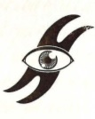
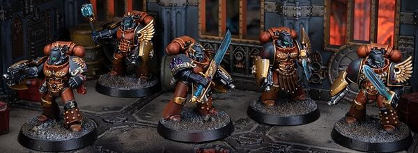

# 0412 燃烧之眼 Burning Eyes

精校状态：中文行文已逐段精校，部分术语仍为暂定

分类：通用概念 / 帝国 Imperium / 中央政务部 Adeptus Terra / 阿斯塔特修会 Adeptus Astartes

原文来源：https://www.bilibili.com/opus/1019533225003843589

原作者：帝国神选罐头

原文时间：2025年01月07日 10:29

[返回分类目录](目录.md) · [全书目录](../../目录.md)

<!-- A0412-B0001 -->
**英文原文**

The Burning Eyes, also known as the Ofanim and the Angel's Shame, were warriors within the Blood Angels Legion.

<!-- /A0412-B0001 -->

<!-- A0412-B0002 -->

原译文

燃烧之眼，也被称为座天使和天使之愧，是圣血天使军团中的战士。

**校订译文**

燃烧之眼，也被称为座天使和天使之愧，是圣血天使军团中的战士。

<!-- /A0412-B0002 -->

<!-- A0412-B0003 图片 -->

<!-- A0412-B0004 -->

原译文

The Burning Eyes' Symbol 燃烧之眼的标志

**校订译文**

The Burning Eyes' Symbol 燃烧之眼的标志

<!-- /A0412-B0004 -->

<!-- A0412-B0005 -->
## Overview 概述

<!-- /A0412-B0005 -->

<!-- A0412-B0006 -->
**英文原文**

They served as their Primarch Sanguinius's secret police by searching for signs of treachery and madness within the Blood Angels and three or more serving together were known as an Ofanim Court. If any was found, the Burning Eyes acted to assuage their Primarch's guilt by removing the stain from the Legion. These Legionaries were rarely seen on the battlefield, but when they were, the Burning Eyes wielded weapons considered unworthy of true warriors.

<!-- /A0412-B0006 -->

<!-- A0412-B0007 -->

原译文

他们作为他们的原体圣吉列斯的秘密警察，在圣血天使中寻找背叛和疯狂的迹象，三个或更多人一起服役被称为座天使法庭。如果发现任何污点，燃烧之眼会通过清除军团的污点来减轻他们的原体的罪行。这些军团很少出现在战场上，但当他们出现时，燃烧之眼挥舞着被认为真正的战士不配使用的武器。

**校订译文**

他们是圣吉列斯的秘密警察，负责搜寻军团内部的叛逆与疯狂迹象。三人或更多人共同行动时，便称为“座天使法庭”。一旦发现问题，他们便清除军团中的污点，以减轻原体的愧疚。他们极少现身战场；参战时，也使用那些被认为有损真正战士尊严的武器。

**校注：** assuage guilt 指减轻愧疚，不是减少原体罪行；weapons unworthy of true warriors 是武器被视为不配真正战士使用，原译施受关系颠倒。

<!-- /A0412-B0007 -->

<!-- A0412-B0008 图片 -->

<!-- A0412-B0009 -->

原译文

Burning Eyes 燃烧之眼

**校订译文**

Burning Eyes 燃烧之眼

<!-- /A0412-B0009 -->

<!-- A0412-B0010 -->
**英文原文**

These included the power weapons known as Blades of Judgement, which were used by the Burning Eyes to carry out their grim tasks. For though they were expert bladesmen, it was in single combat, against Legionaries, that their true skill came to the fore. Also such was the remit given to them by Sanguinius, that few were beyond the Burning Eyes' jurisdiction. If need be, their authority allowed them to supplant themselves directly into the Blood Angels' chain of command, where they were free to act of their own volition. However it was viewed as an ominous portent, should any of the Legion's commanders cause the Burning Eyes to do so.

<!-- /A0412-B0010 -->

<!-- A0412-B0011 -->

原译文

其中包括被称为“审判之刃”的动力武器，燃烧之眼使用这些武器来执行他们的艰巨任务。因为尽管他们是专业的剑士，但正是在与军团士兵的单打独斗中，他们的真正技能才脱颖而出。圣吉列斯赋予他们的职权范围也是如此，以至于很少有人超出燃烧之眼的管辖范围。如果需要，他们的权威允许他们直接取代圣血天使的指挥链自己进入，在那里他们可以自由地采取行动。然而，如果军团的任何指挥官导致燃烧之眼这样做，这被视为一个不祥的预兆。

**校订译文**

其中包括名为“审判之刃”的动力武器，用于执行他们冷酷的任务。燃烧之眼本就是精湛的剑士，而在与其他军团士兵一对一交锋时，其真正本领才最为突出。圣吉列斯授予他们极大的职权，几乎无人能置身其管辖之外。必要时，他们可直接介入并接管圣血天使的指挥环节，按自己的判断行事。若有指挥官迫使燃烧之眼采取这一步，便被视为极不祥的征兆。

<!-- /A0412-B0011 -->

本篇核心术语与暂定项

以下列出本篇出现的英文原形及核心术语表用词。同形词可能指不同对象，具体词义以本篇正文和校注为准；单复数、别名和仅见于图注的名称可能尚未列入。完整候选见[术语表](../../术语表/双语术语候选.csv)。

| 英文 | 采用中文 | 状态 |
| --- | --- | --- |
| Blood Angels | 圣血天使 | 官方已核对 |
| Primarch | 原体 | 官方已核对 |
| The Angel | 天使 | 暂定·官方待核 |
| Ofanim | 座天使 | 暂定·官方待核 |
| Ofanim Court | 座天使法庭 | 暂定·官方待核 |
| Blades of Judgement | 审判之刃 | 暂定·官方待核 |
| Burning Eyes | 燃烧之眼 | 暂定·官方待核 |
| The Blood | 鲜血 | 暂定·官方待核 |
| Power Weapons | 动力武器 | 暂定·官方待核 |

