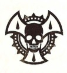
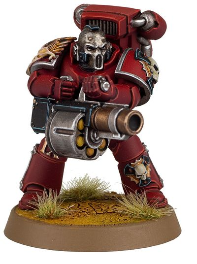

# 0413 天使之泪 Angel's Tears

精校状态：中文行文已逐段精校，部分术语仍为暂定

分类：通用概念 / 帝国 Imperium / 中央政务部 Adeptus Terra / 阿斯塔特修会 Adeptus Astartes

原文来源：https://www.bilibili.com/opus/1019533362427068416

原作者：帝国神选罐头

原文时间：编辑于 2026年01月20日 11:19

[返回分类目录](目录.md) · [全书目录](../../目录.md)

<!-- A0413-B0001 -->
**英文原文**

The Angel's Tears, also known as the Erelim, Broken Blade, Silver Masks, or Dead Hand, were warriors of the Blood Angels during the Great Crusade and Horus Heresy.

<!-- /A0413-B0001 -->

<!-- A0413-B0002 -->

原译文

天使之泪，也被称为勇天使、破碎之刃、银色面具或死亡之手，是大远征和荷鲁斯叛乱时期圣血天使的战士。

**校订译文**

天使之泪又称英勇天使、断刃、银面或死手，是大远征与荷鲁斯之乱时期圣血天使军团的一类战士。

**校注：** Erelim 同第404篇采用英勇天使；本篇指军团时期天使之泪的称号，第404篇指后世教士卫队，不合并为同一编制。

<!-- /A0413-B0002 -->

<!-- A0413-B0003 图片 -->

<!-- A0413-B0004 -->

原译文

Symbol of the Angel's Tears 天使之泪标志

**校订译文**

Symbol of the Angel's Tears 天使之泪标志

<!-- /A0413-B0004 -->

<!-- A0413-B0005 -->
## Overview 概述

<!-- /A0413-B0005 -->

<!-- A0413-B0006 -->
**英文原文**

These Jump Pack-equipped infantry were known for the cruel devastation that they brought to the foe. Each individual warrior bore the title Erelim and served as Sanguinius' wrath set forth by his will to scour away those he decreed unworthy of being saved. They were among the most commonly seen warriors of the Innermost "Sphere" of the Legion, serving the role other Legions refer to as Destroyers.

<!-- /A0413-B0006 -->

<!-- A0413-B0007 -->

原译文

这些装备跳跃背包的步兵以给敌人带来的残酷破坏而闻名。每一个战士都有“勇天使”的称号，并成为圣吉列斯盛怒的体现，他的意志是清除那些他下令不值得拯救的人。他们是军团最内部“界”中最常见的战士之一，担任其他军团称之为毁灭者的角色。

**校订译文**

这些装备跳跃背包的步兵，以对敌人实施残酷毁灭而闻名。每名战士都拥有“英勇天使”的称号，奉圣吉列斯之命体现他的怒火，清除那些被他判定不值得拯救的敌人。他们是军团最内层“界”中最常见的战士之一，承担其他军团所称的毁灭者职责。

<!-- /A0413-B0007 -->

<!-- A0413-B0008 -->
**英文原文**

Befitting their dark duty, they wore silver death masks etched with oaths of retribution. As with the other warriors of the First "Sphere" of the Blood Angels, such as the Sanguinary Guard and Crimson Paladins, the Angel's Tears forsook their old names and identities and took up new ritual titles, symbolic of their new roles as true Angels of Death. Angel's Tears were said to eventually return to normal Legion service, removing their death masks and taking up their old names. This was to distance them from the death and slaughter they caused while in service as the Angel's Tears.

<!-- /A0413-B0008 -->

<!-- A0413-B0009 -->

原译文

为了履行他们的黑暗职责，他们戴着刻有复仇誓言的银色死亡面具。与圣血天使第一界的其他战士一样，如圣血卫队和猩红圣骑士，天使之泪放弃了他们的旧名字和身份，采用了新的仪式头衔，象征着他们作为真正的死亡天使的新角色。据说天使之泪最终恢复了正常的军团服役，摘下了他们的死亡面具，并使用了他们的旧名字。这是为了让他们远离他们在担任天使之泪时造成的死亡和屠杀。

**校订译文**

为承担这份阴暗的职责，他们佩戴刻有复仇誓言的银色死亡面具。与第一界中的圣血守卫、猩红圣骑士一样，天使之泪舍弃原名与身份，换用仪式性称号，象征自己成为真正的死亡天使。据说，他们完成服役后会回到军团普通队列，摘下面具，恢复原名。这样便能在自身与服役期间造成的死亡、屠戮之间划出界线。

<!-- /A0413-B0009 -->

<!-- A0413-B0010 图片 -->

<!-- A0413-B0011 -->

原译文

Angel's Tears Space Marine 天使之泪星际战士

**校订译文**

Angel's Tears Space Marine 天使之泪星际战士

<!-- /A0413-B0011 -->

<!-- A0413-B0012 -->
**英文原文**

The Angel's Tears took to the field only at the direct order of Sanguinius himself, only when the complete destruction of an enemy was deemed necessary. They were armed with a variety of taboo and exotic weapons such as Rad Missile launchers, Phosphex Grenades, Volkite Serpentas, and Rad Grenade launchers.

<!-- /A0413-B0012 -->

<!-- A0413-B0013 -->

原译文

只有在圣吉列斯本人的直接命令下，只有当认为有必要彻底摧毁敌人时，天使之泪才会进入战场。他们配备了各种禁忌和奇异的武器，如辐射导弹发射器、磷化手榴弹、爆燃蛇铳和辐射榴弹发射器。

**校订译文**

唯有圣吉列斯亲自下令，且判定必须彻底毁灭敌人时，天使之泪才会出战。他们配备多种禁忌而罕见的武器，包括辐射导弹发射器、磷化手榴弹、爆燃蛇铳和辐射榴弹发射器。

<!-- /A0413-B0013 -->

<!-- A0413-B0014 -->
## Notable Members 著名成员

<!-- /A0413-B0014 -->

<!-- A0413-B0015 -->
**英文原文**

Alepheo — Dominion.

<!-- /A0413-B0015 -->

<!-- A0413-B0016 -->

原译文

阿莱费奥 — 统御者

**校订译文**

阿莱费奥——主天使。

**校注：** Dominion 在本军团为主天使职衔，按403统一定译；原译统御者失去对应。

<!-- /A0413-B0016 -->

<!-- A0413-B0017 -->
**英文原文**

Hanziel — Commander.

<!-- /A0413-B0017 -->

<!-- A0413-B0018 -->

原译文

汉泽尔 — 指挥官。

**校订译文**

汉泽尔 — 指挥官。

<!-- /A0413-B0018 -->

<!-- A0413-B0019 -->
**英文原文**

Vortius

<!-- /A0413-B0019 -->

<!-- A0413-B0020 -->

原译文

沃蒂乌斯

**校订译文**

沃蒂乌斯

<!-- /A0413-B0020 -->

本篇核心术语与暂定项

以下列出本篇出现的英文原形及核心术语表用词。同形词可能指不同对象，具体词义以本篇正文和校注为准；单复数、别名和仅见于图注的名称可能尚未列入。完整候选见[术语表](../../术语表/双语术语候选.csv)。

| 英文 | 采用中文 | 状态 |
| --- | --- | --- |
| Blood Angels | 圣血天使 | 官方已核对 |
| Horus Heresy | 荷鲁斯之乱 | 官方已核对 |
| Sanguinary | 圣血学派 | 暂定·学派语境 |
| Great Crusade | 大远征 | 暂定·官方待核 |
| Horus | 荷鲁斯 | 暂定·官方待核 |
| Sanguinary Guard | 圣血守卫 | 官方已核对 |
| Angels of Death | 死亡天使 | 暂定·官方待核 |
| Angel's Tears | 天使之泪 | 暂定·官方待核 |
| The Angel | 天使 | 暂定·官方待核 |
| Destroyers | 毁灭者 | 暂定·官方待核 |
| Crimson Paladins | 深红圣骑士 | 暂定·官方待核 |
| Missile Launchers | 导弹发射器 | 暂定·官方待核 |
| Dominion | 主天使 | 暂定·官方待核 |
| Erelim | 英勇天使 | 暂定·官方待核 |
| Alepheo | 阿莱费奥 | 暂定·官方待核 |
| Hanziel | 汉泽尔 | 暂定·官方待核 |
| Sphere | 防御圈 | 暂定·官方待核 |
| The Blood | 鲜血 | 暂定·官方待核 |
| Dead Hand | 死亡之手号 | 暂定·官方待核 |
| Phosphex | 磷化燃剂 | 暂定·官方待核 |
| Rad Grenade | 辐射手榴弹 | 暂定·官方待核 |
| Rad Missile | 辐射导弹 | 暂定·官方待核 |
| Jump Pack | 跳跃背包 | 暂定·官方待核 |
| Grenade | 手榴弹 | 暂定·官方待核 |

