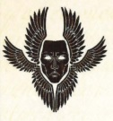
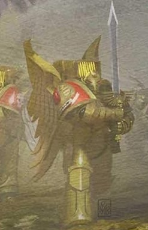
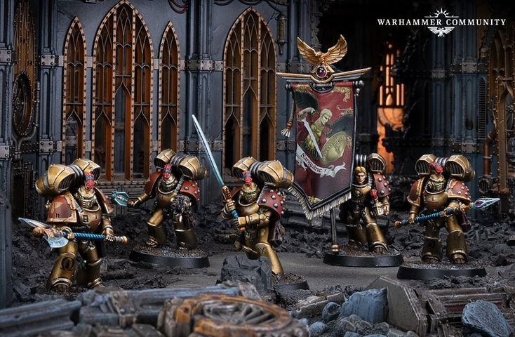
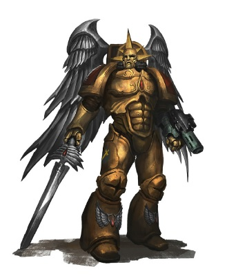
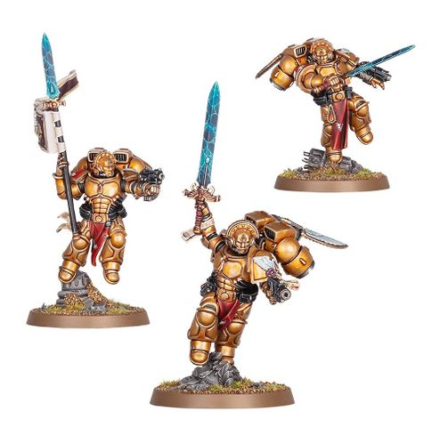
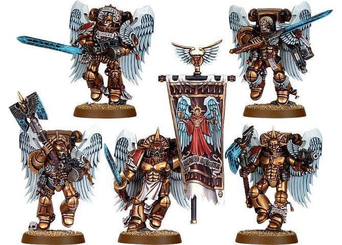
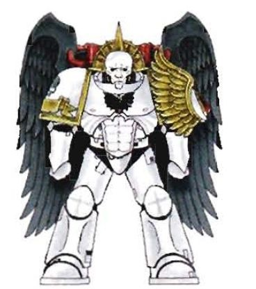

# 0416 圣血守卫 Sanguinary Guard

精校状态：中文行文已逐段精校，部分术语仍为暂定

分类：通用概念 / 帝国 Imperium / 中央政务部 Adeptus Terra / 阿斯塔特修会 Adeptus Astartes

原文来源：https://www.bilibili.com/opus/1033269810355503127

原作者：帝国神选罐头

原文时间：2025年02月13日 10:54

[返回分类目录](目录.md) · [全书目录](../../目录.md)

原篇名：圣血卫队 Sanguinary Guard

<!-- A0416-B0001 -->
**英文原文**

The Sanguinary Guard, also known as the Ikisat, Seraphs, or the Burning Ones, are the utmost elite of the Veterans of the Blood Angels, proven in mind, body, and spirit, and exemplifying the values of their Primarch Sanguinius to an extent no other Space Marine can.

<!-- /A0416-B0001 -->

<!-- A0416-B0002 -->

原译文

圣血卫队，也称为伊基萨特、炽天使或炽热者，是圣血天使老兵的最高精英，在思想、身体和精神上都得到了证明，并在某种程度上体现了他们的原体圣吉列斯的价值观，这是其他星际战士所无法比拟的。

**校订译文**

圣血守卫又称伊基萨特、六翼天使或炽热者，是圣血天使老兵中的最精锐者。他们的心智、体魄与精神都经受过考验，对原体圣吉列斯价值观的体现，更是其他星际战士所不能及。

**校注：** Seraphs 按前文圣血天使第一界称谓统一六翼天使；炽天使为同词另一常见译法，未将本单位等同战斗修女的 Seraphim Squad。

<!-- /A0416-B0002 -->

<!-- A0416-B0003 图片 -->

<!-- A0416-B0004 -->

原译文

Symbol of the Sanguinary Guard 圣血卫队标志

**校订译文**

Symbol of the Sanguinary Guard 圣血守卫标志

<!-- /A0416-B0004 -->

<!-- A0416-B0005 -->
## History 历史

<!-- /A0416-B0005 -->

<!-- A0416-B0006 -->
**英文原文**

The Sanguinary Guard has its origins during the Great Crusade when Sanguinius himself led the Blood Angels as a Legion. These warriors were the most renowned of the Orders of the First Sphere, which then also included the Crimson Paladins, Burning Eyes, and Angel's Tears. Members of the Sanguinary Guard were chosen for their unwavering devotion to their Primarch and were tasked to act as the personal bodyguard of Sanguinius. On some occasions, they were also used to protect other high-ranking members of the Blood Angels.

<!-- /A0416-B0006 -->

<!-- A0416-B0007 -->

原译文

圣血卫队起源于大远征，当时圣吉列斯本人领导了作为军团的圣血天使。这些战士是第一界修会中最著名的，当时还包括猩红圣骑士、燃烧之眼和天使之泪。圣血卫队的成员因其对原体的坚定忠诚而被选中，并被指派担任圣吉列斯的个人护卫。在某些情况下，它们也被用来保护圣血天使的其他高级成员。

**校订译文**

圣血守卫起源于大远征时期，当时圣吉列斯亲自统领圣血天使军团。他们是第一界诸组织中最负盛名的一支；同属第一界的还有猩红圣骑士、燃烧之眼和天使之泪。圣血守卫因对原体坚定不移的忠诚而获选，担任其贴身卫士，有时也负责保护军团其他高层人员。

<!-- /A0416-B0007 -->

<!-- A0416-B0008 图片 -->

<!-- A0416-B0009 -->

原译文

Appearance of the Sanguinary Guard during the Horus Heresy 荷鲁斯叛乱时期圣血卫队的出现

**校订译文**

Appearance of the Sanguinary Guard during the Horus Heresy 荷鲁斯之乱时期圣血守卫的外观

**校注：** Appearance 在图注中指外观，原译出现不合语境。

<!-- /A0416-B0009 -->

<!-- A0416-B0010 -->
**英文原文**

The Sanguinary Guard fought alongside Sanguinius as he took part in the boarding operation of the Vengeful Spirit during the climax of the Siege of Terra. After this battle only a single survivor remained of that august force: Azkaellon, Herald of the Primarch, and only because Sanguinius insisted that he remain on Terra. It was on his shoulders that the heavy burden befell of the reconstitution of the Order, to serve as a beacon of hope for the dark days that lay ahead. It is largely through his efforts that the legacy of the Sanguinary Guard survived in the Blood Angels, and spread to all its Successors.

<!-- /A0416-B0010 -->

<!-- A0416-B0011 -->

原译文

圣血卫队与圣吉列斯并肩作战，他在泰拉围城的高潮中参加了复仇之魂的跳帮行动。这场战役后，这支威严的部队只剩下一名幸存者：原体的传令官阿兹卡隆，这只是因为圣吉列斯坚持要他留在泰拉。重建卫队的重任落在了他的肩上，作为未来黑暗日子的希望灯塔。正是通过他的努力，圣血卫队的遗产在圣血天使中得以幸存，并传播给了所有的子战团。

**校订译文**

泰拉围城进入最后阶段时，圣血守卫随圣吉列斯参加对复仇之魂号的跳帮行动。战后，这支庄严的部队只剩一名幸存者：原体传令官阿兹卡隆；他之所以活下来，仅因圣吉列斯坚持让他留在泰拉。重建圣血守卫的重担因此落在他肩上，使其成为前方黑暗岁月中的希望灯塔。主要凭借他的努力，这一传统才在圣血天使中延续，并传遍所有后裔战团。

**校注：** 本篇末尾明确列出《终结与死亡》增加幸存者的来源冲突；此处保留较早设定仅阿兹卡隆一人生还的叙述。

<!-- /A0416-B0011 -->

<!-- A0416-B0012 图片 -->

<!-- A0416-B0013 -->

原译文

Heresy-era Sanguinary Guard 叛乱时期圣血卫队

**校订译文**

Heresy-era Sanguinary Guard 叛乱时期圣血守卫

<!-- /A0416-B0013 -->

<!-- A0416-B0014 -->
**英文原文**

Ten thousand years later, after the formation of the Great Rift, the Sanguinary Guard again faced destruction against Hive Fleet Leviathan. In the ensuing Devastation of Baal, only a single member of the Sanguinary Guard, Caraeus, survived.

<!-- /A0416-B0014 -->

<!-- A0416-B0015 -->

原译文

一万年后，在大裂隙形成后，圣血卫队再次面临着虫巢舰队利维坦的毁灭。在随后的巴尔之毁中，只有一名圣血卫队成员卡拉厄斯幸存下来。

**校订译文**

一万年后，大裂隙形成，圣血守卫在对抗利维坦虫巢舰队时再度濒临覆灭。巴尔之毁后，仅卡拉厄斯一人幸存。

<!-- /A0416-B0015 -->

<!-- A0416-B0016 图片 -->

<!-- A0416-B0017 -->

原译文

Sanguinary Guard 圣血卫队

**校订译文**

Sanguinary Guard 圣血守卫

<!-- /A0416-B0017 -->

<!-- A0416-B0018 -->
**英文原文**

The Sanguinary Guard was subsequently rebuilt with surviving veterans and Primaris Space Marines. During the Battle of Idolatros in the Arks of Omen Campaign they accompanied Dante as he battled Angron. Once again the Sanguinary Guard took heavy losses, though there were several survivors.

<!-- /A0416-B0018 -->

<!-- A0416-B0019 -->

原译文

圣血卫队随后与幸存的老兵和原铸星际战士一起重建。在噩兆方舟战役中的伊多拉特罗斯战役中，他们陪同但丁与安格隆作战。圣血卫队再次遭受重大损失，但仍有几名幸存者。

**校订译文**

此后，战团从幸存老兵及原铸星际战士中选拔成员，重建圣血守卫。在噩兆方舟战役的盲信星之战中，他们随但丁对抗安格隆，再次损失惨重，但仍有数人幸存。

<!-- /A0416-B0019 -->

<!-- A0416-B0020 图片 -->

<!-- A0416-B0021 -->

原译文

Sanguinary Guard 圣血卫队

**校订译文**

Sanguinary Guard 圣血守卫

<!-- /A0416-B0021 -->

<!-- A0416-B0022 -->
## Wargear 战备

<!-- /A0416-B0022 -->

<!-- A0416-B0023 -->
**英文原文**

Unlike other Veterans, the Sanguinary Guard do not select wargear according to their expertise, but instead use weapons and armor traditional to their Order: the wrist-mounted Angelus Boltgun, Plasma Pistol, or Inferno Pistol and the Glaives Encarmine, Encarmine Spear, Encarmine Sword, Encarmine Axe, Sanguinary Banner, or Power Fist. Golden Artificer Armour girds their bodies, and baleful Death Masks cover their faces, while they leap into battle courtesy of Winged Jump Packs. Depending on the situation, they may carry the Chapter Banner to war.

<!-- /A0416-B0023 -->

<!-- A0416-B0024 -->

原译文

与其他老兵不同，圣血卫队不根据他们的专业知识选择武器装备，而是使用他们修会传统的武器和盔甲：腕戴式祷告爆矢枪、等离子手枪或炼狱手枪，以及深红长剑、深红之矛、深红之剑、深红之斧、圣血军旗或动力拳。金色精工盔甲包裹着他们的身体，凶恶的死亡面具遮住了他们的脸，而他们则借助带翼跳跃背包跳入战斗。根据情况，他们可能会携带战团旗帜参加战争。

**校订译文**

圣血守卫不像其他老兵那样按个人专长挑选装备，而是使用本组织的传统武备：腕载式祷告爆矢枪、等离子手枪或炼狱手枪，以及赤红战刃、赤红长矛、赤红剑、赤红斧、圣血军旗或动力拳。他们身披金色精工护甲，以威慑敌人的死亡面具遮面，借翼形跳跃背包投入战场。视情况需要，他们也会携战团军旗出征。

**校注：** Glaives Encarmine 与后列 Encarmine Spear/Sword/Axe 在源文并列，按原分类保留；赤红战刃为泛称，不再局限于长剑。所有武器名未核官译者仍标暂定。

<!-- /A0416-B0024 -->

<!-- A0416-B0025 图片 -->

<!-- A0416-B0026 -->

原译文

Sanguinary Guard Squad 圣血卫队小队

**校订译文**

Sanguinary Guard Squad 圣血守卫小队

<!-- /A0416-B0026 -->

<!-- A0416-B0027 -->
## Successor Variants 子战团变体

<!-- /A0416-B0027 -->

<!-- A0416-B0028 -->
**英文原文**

While it has been stated that all of the Blood Angels' Successor Chapters maintain a Sanguinary Guard, following the same colour scheme as that used by the Blood Angels - with the exception of the Angels Encarmine, whose Sanguinary Guard instead wear alabaster white armour - never have the Flesh Tearers' Sanguinary Guard been shown in the same colours as the rest of the chapter.

<!-- /A0416-B0028 -->

<!-- A0416-B0029 -->

原译文

虽然有人说，所有圣血天使的子战团都有一个圣血卫队，但遵循与圣血天使相同的配色方案——除了赤红天使，它的圣血卫队穿着雪花石膏白色盔甲——但撕肉者的圣血卫队从未以与战团其余成员相同的颜色出现。

**校订译文**

有记载称，圣血天使所有后裔战团都设有圣血守卫，并沿用母战团的配色；唯一例外是赤红天使，其守卫采用雪花石膏白色护甲。另一方面，撕肉者圣血守卫的图示，从未采用与该战团其他成员相同的配色。

<!-- /A0416-B0029 -->

<!-- A0416-B0030 图片 -->

<!-- A0416-B0031 -->

原译文

Sanguinary Guard of the Angels Encarmine 赤红天使圣血卫队

**校订译文**

Sanguinary Guard of the Angels Encarmine 赤红天使圣血守卫

<!-- /A0416-B0031 -->

<!-- A0416-B0032 -->
## Notable Members 著名成员

<!-- /A0416-B0032 -->

<!-- A0416-B0033 -->
**英文原文**

Sepharan - Exalted Herald of Sanguinius

<!-- /A0416-B0033 -->

<!-- A0416-B0034 -->

原译文

塞弗兰 - 圣吉列斯的崇高传令官

**校订译文**

塞弗兰 - 圣吉列斯的崇高传令官

<!-- /A0416-B0034 -->

<!-- A0416-B0035 -->
**英文原文**

Caraeus - Exalted Herald of Sanguinius

<!-- /A0416-B0035 -->

<!-- A0416-B0036 -->

原译文

卡拉厄斯 - 圣吉列斯的崇高传令官

**校订译文**

卡拉厄斯 - 圣吉列斯的崇高传令官

<!-- /A0416-B0036 -->

<!-- A0416-B0037 -->
**英文原文**

Daeanatos - Exalted Herald of Sanguinius

<!-- /A0416-B0037 -->

<!-- A0416-B0038 -->

原译文

达阿纳托斯 - 圣吉列斯的崇高传令官

**校订译文**

达阿纳托斯 - 圣吉列斯的崇高传令官

<!-- /A0416-B0038 -->

<!-- A0416-B0039 -->

原译文

Brother Dontoriel 唐托里尔修士

**校订译文**

Brother Dontoriel 唐托里尔兄弟

<!-- /A0416-B0039 -->

<!-- A0416-B0040 -->

原译文

Brother Erephon 艾瑞丰修士

**校订译文**

Brother Erephon 艾瑞丰兄弟

<!-- /A0416-B0040 -->

<!-- A0416-B0041 -->

原译文

Brother Saronath 萨罗南斯修士

**校订译文**

Brother Saronath 萨罗南斯兄弟

<!-- /A0416-B0041 -->

<!-- A0416-B0042 -->

原译文

Brother Varrian 瓦里安修士

**校订译文**

Brother Varrian 瓦里安兄弟

<!-- /A0416-B0042 -->

<!-- A0416-B0043 -->

原译文

Brother Vesta 维斯塔修士

**校订译文**

Brother Vesta 维斯塔兄弟

<!-- /A0416-B0043 -->

<!-- A0416-B0044 -->

原译文

Brother Uzarael 乌扎雷尔修士

**校订译文**

Brother Uzarael 乌扎雷尔兄弟

<!-- /A0416-B0044 -->

<!-- A0416-B0045 -->

原译文

Brother Mataneo 马塔尼奥修士

**校订译文**

Brother Mataneo 马塔尼奥兄弟

<!-- /A0416-B0045 -->

<!-- A0416-B0046 -->

原译文

Azkaellon 阿兹卡隆

**校订译文**

Azkaellon 阿兹卡隆

<!-- /A0416-B0046 -->

<!-- A0416-B0047 -->

原译文

Taerwelt Ikasati 塔尔维特·伊卡萨蒂

**校订译文**

Taerwelt Ikasati 塔尔维特·伊卡萨蒂

<!-- /A0416-B0047 -->

<!-- A0416-B0048 -->
## Conflicting sources 来源冲突

<!-- /A0416-B0048 -->

<!-- A0416-B0049 -->
**英文原文**

The original lore of the Blood Angels stated that Azkaellon was the sole Sanguinary Guard to survive the Heresy, but The End and the Death novels present another, Taerwelt Ikasati, as surviving.

<!-- /A0416-B0049 -->

<!-- A0416-B0050 -->

原译文

圣血天使的最初传说中，阿兹卡隆是唯一一位在叛乱中幸存下来的圣血卫队，但《死亡与终结》小说中提供了另一位幸存者，塔尔维特·伊卡萨蒂。

**校订译文**

圣血天使较早的背景设定称，阿兹卡隆是唯一在荷鲁斯之乱中幸存的圣血守卫；但《终结与死亡》系列小说又描写了另一名幸存者——塔尔维特·伊卡萨蒂。

**校注：** The End and the Death 按英文题名次序暂译终结与死亡，原稿死亡与终结保留在对照文本。

<!-- /A0416-B0050 -->

本篇核心术语与暂定项

以下列出本篇出现的英文原形及核心术语表用词。同形词可能指不同对象，具体词义以本篇正文和校注为准；单复数、别名和仅见于图注的名称可能尚未列入。完整候选见[术语表](../../术语表/双语术语候选.csv)。

| 英文 | 采用中文 | 状态 |
| --- | --- | --- |
| Space Marines | 星际战士 | 官方已核对 |
| Blood Angels | 圣血天使 | 官方已核对 |
| Boltgun | 爆矢枪 | 官方已核对 |
| Great Rift | 大裂隙 | 官方已核对 |
| Sanguinary | 圣血学派 | 暂定·学派语境 |
| Primarch | 原体 | 官方已核对 |
| The Order | 秩序 | 暂定·官方待核 |
| Great Crusade | 大远征 | 暂定·官方待核 |
| Terra | 泰拉 | 暂定·官方待核 |
| Vengeful Spirit | 复仇之魂号 | 暂定·官方待核 |
| Devastation of Baal | 巴尔之毁 | 暂定·官方待核 |
| Hive Fleet Leviathan | 利维坦虫巢舰队 | 暂定·官方待核 |
| Baal | 巴尔 | 暂定·官方待核 |
| Sanguinary Guard | 圣血守卫 | 官方已核对 |
| Azkaellon | 阿兹卡隆 | 暂定·官方待核 |
| Herald | 传令官 | 暂定·官方待核 |
| Angel's Tears | 天使之泪 | 暂定·官方待核 |
| Space Marine | 星际战士 | 暂定·官方待核 |
| Chapter | 战团 | 暂定·官方待核 |
| Dante | 但丁 | 暂定·官方待核 |
| Flesh Tearers | 撕肉者 | 暂定·官方待核 |
| Angels Encarmine | 赤红天使 | 暂定·官方待核 |
| Exalted Herald of Sanguinius | 圣吉列斯崇高传令官 | 暂定·官方待核 |
| Crimson Paladins | 深红圣骑士 | 暂定·官方待核 |
| Artificer | 技工 | 暂定·官方待核 |
| Seraphs | 六翼天使 | 暂定·官方待核 |
| Glaives Encarmine | 赤红战刃 | 暂定·官方待核 |
| Ikisat | 伊基萨特 | 暂定·官方待核 |
| The End and the Death | 终结与死亡 | 暂定·官方待核 |
| Angron | 安格隆 | 官方已核对 |
| Burning Eyes | 燃烧之眼 | 暂定·官方待核 |
| Sepharan | 塞弗兰 | 暂定·官方待核 |
| Caraeus | 卡拉厄斯 | 暂定·官方待核 |
| Daeanatos | 达阿纳托斯 | 暂定·官方待核 |
| Taerwelt Ikasati | 塔尔维特·伊卡萨蒂 | 暂定·官方待核 |
| Sphere | 防御圈 | 暂定·官方待核 |
| The Dark | 《黑暗》 | 暂定·官方待核 |
| The Blood | 鲜血 | 暂定·官方待核 |
| Omen | 预兆号 | 暂定·官方待核 |
| Inferno Pistol | 地狱火手枪 | 暂定·官方待核 |
| Plasma pistol | 等离子手枪 | 官方已核对 |
| Power fist | 动力拳 | 官方已核对 |
| Artificer Armour | 精工盔甲 | 暂定·官方待核 |

